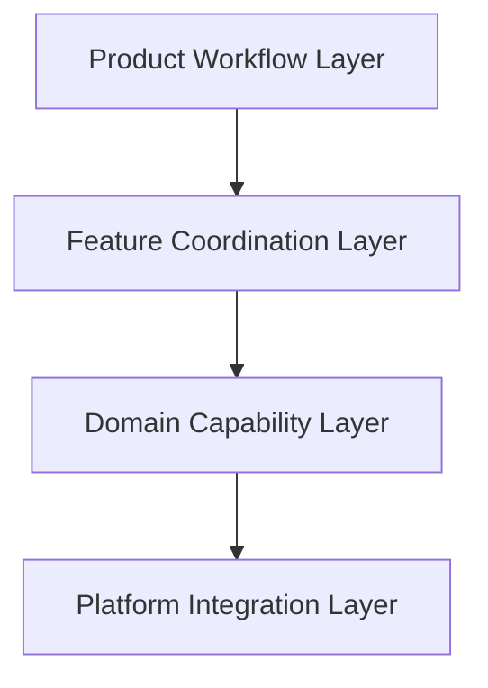

# ARCH-0002 Layer Model

狀態：`Draft`

| Field | Value |
| --- | --- |
| Document ID | `ARCH-0002` |
| Architecture Stability | `Draft` |
| Review Status | `Draft` |
| Version | `0.1` |
| Owner | `TBD` |
| Last Reviewed | `Not reviewed` |
| Depends on | [ARCH-0001 Architecture Principles](ARCH-0001-architecture-principles.md)、[SPEC Baseline Review](../Specs/SPEC-BASELINE-REVIEW.md) |

本文件只定義抽象 Layer Model，不定義 Module、Component、Service、Class、Interface、API、Event 或技術棧。

## 1. Purpose

本文件的目的，是在不提前決定 implementation 的前提下，固定 SnipPlus 的抽象架構層、各層主要責任、依賴方向與不可跨越的邊界。

Layer Model 用來回答：

> SnipPlus 應有哪些架構層，以及各層的責任與邊界？

## 2. Scope

本文件只描述：

- 四個抽象 Architecture Layer。
- 每個 Layer 的責任、輸入、輸出與邊界。
- Layer 之間允許與禁止的依賴方向。
- Layer Responsibility Matrix。
- Architecture 與 Frozen PRD、Frozen Specifications、ARCH-0001 的追溯關係。

本文件不描述：

- Module Catalog、Component Diagram 或 class design。
- Service、Interface、Event Bus、Database、File、Storage 或 API design。
- WinUI、WPF、C#、.NET、Clipboard API 或其他技術選擇。
- UI layout、控制項、動畫、Thread、部署、測試或程式碼。

## 3. Layer Definitions

### 3.1 Product Workflow Layer

| Field | Definition |
| --- | --- |
| Responsibility | 對應 Frozen Feature Workflow、使用者可觀察的主要流程、完成/取消/錯誤/離開語意與 shared workflow state。 |
| Inputs | Frozen PRD、Frozen Specs、使用者意圖與已核准的 workflow event。 |
| Outputs | 可被下層協調與能力層理解的 workflow intent、state boundary 與 completion outcome。 |
| Owns | 產品流程語意與 shared workflow state 的使用方式。 |
| Does not own | UI framework、平台 API、資料保存、具體 Feature 內部實作。 |

此 Layer 不新增或重新定義 `FR`、`SR`、`NFR`、Feature scope 或產品決策。

### 3.2 Feature Coordination Layer

| Field | Definition |
| --- | --- |
| Responsibility | 協調五個核心 Feature 之間的責任交接、optional Annotation path、Clipboard/Output downstream path 與 shared boundary。 |
| Inputs | Product Workflow Layer 的 intent/state，以及各 Feature 回報的 capability status。 |
| Outputs | Feature handoff、ownership boundary、failure classification input 與 feedback boundary input。 |
| Owns | Cross-feature coordination semantics；以 [SPEC-0010 Feature Integration](../Specs/SPEC-0010-feature-integration.md) 為來源。 |
| Does not own | 任一 Feature 的內部工具、平台操作、資料格式或技術實作。 |

`FEAT-005 Workflow Boundaries and Feedback` 的共同責任在此 Layer 被表達為 cross-feature boundary，不代表本 Layer 等同於某個具體 Module。

### 3.3 Domain Capability Layer

| Field | Definition |
| --- | --- |
| Responsibility | 提供與產品 capability 相關的抽象語意，例如 Capture Result、Annotation lifecycle、Clipboard Handoff boundary 與 Output lifecycle。 |
| Inputs | Workflow intent、Feature coordination boundary 與已核准的 capability contract。 |
| Outputs | 可驗收的 capability outcome、local lifecycle status、validation result 與 handoff status。 |
| Owns | Domain-level rules that are already defined by Frozen Specifications。 |
| Does not own | UI、OS interaction、具體資料結構、API、儲存或外部系統選擇。 |

Domain Capability Layer 只能實現已由 Spec 定義的語意，不得從「共用」一詞自行推導新的產品功能。

### 3.4 Platform Integration Layer

| Field | Definition |
| --- | --- |
| Responsibility | 以抽象邊界承接作業系統、顯示器、輸入、Clipboard、Output Consumer 或其他外部副作用。 |
| Inputs | 上層已定義的 capability intent、platform boundary 與資料交付要求。 |
| Outputs | 平台結果、可觀察的 success/cancel/failure status 與 platform verification evidence。 |
| Owns | Platform-specific behavior 的隔離與回報，不擁有產品規則。 |
| Does not own | PRD、Feature scope、Shared State vocabulary、使用者價值或未核准的外部整合。 |

此 Layer 的「抽象」描述不代表已選定任何 Windows API、Framework、Renderer、File 或 Clipboard implementation。

## 4. Layer Interaction Rules

### 4.1 Allowed dependency direction

```text
Product Workflow Layer
            ↓
Feature Coordination Layer
            ↓
Domain Capability Layer
            ↓
Platform Integration Layer
```

允許的方向代表上層可以提出已核准的 intent 或 boundary，下層提供符合 contract 的 capability outcome；它不代表具體呼叫、類別或同步方式。

### 4.2 Dependency rules

- Upper layers shall not bypass defined boundaries。
- Product Workflow Layer 不得直接依賴 Platform Integration Layer 的具體實作。
- Feature Coordination Layer 不得繞過 Domain Capability Layer 直接擁有平台副作用。
- Domain Capability Layer 不得反向依賴 UI、特定平台或外部資料保存。
- Platform Integration Layer 不得向上重新定義 PRD、Feature scope 或 Shared State。
- Layer 之間只交換已由 Frozen Specification 定義的 intent、boundary、outcome 或 status；交換形式：`TBD`。
- Cross-feature responsibility 只能由 Feature Coordination Layer 協調，不得由任意下層偷偷重新分配 Primary Owner。
- 若一個新責任無法放入單一主要 Layer，必須提出 Architecture Change 或 ADR，不得直接新增混合層。

### 4.3 Abstract layer diagram



此圖只表示抽象依賴方向，不表示已存在的 Module、Component、Service、Class 或 API。

## 5. Layer Responsibility Matrix

每項責任只能有一個主要 Layer；其他 Layer 只能在其責任邊界內提供輸入或結果。

| Responsibility | Primary Layer | Supporting boundary | Explicitly not owned here |
| --- | --- | --- | --- |
| 使用者可觀察 workflow intent 與 shared state 語意 | Product Workflow Layer | Feature Coordination Layer | UI framework 與平台事件。 |
| 五個 Feature 的 handoff、optional path 與 Primary Owner coordination | Feature Coordination Layer | Product Workflow Layer | Feature 內部能力與平台實作。 |
| Capture Result、Annotation、Clipboard Handoff、Output 的抽象 capability semantics | Domain Capability Layer | Feature Coordination Layer | 新增產品需求與平台技術。 |
| 作業系統、顯示器、輸入、Clipboard、Output Consumer 的外部副作用隔離 | Platform Integration Layer | Domain Capability Layer | PRD、Feature scope、Shared State。 |
| 完成、取消、錯誤與離開的共同 boundary | Feature Coordination Layer | Product Workflow Layer | 特定 Feature 的 recovery implementation。 |
| `UNKNOWN/TBD` 與 platform verification evidence 的回報 | Platform Integration Layer | Feature Coordination Layer | 直接改寫 Architecture 或產品規則。 |
| Architecture trade-off 與長期技術決策的治理 | No Layer owns the decision itself | Architecture Governance / ADR | 在 Layer 內隱藏不可逆取捨。 |

## 6. Traceability

Layer Model 的來源鏈：

```text
Frozen PRD
  ↓
Specification v1.0 Freeze Approved
  ↓
ARCH-0001 Architecture Principles
  ↓
ARCH-0002 Layer Model
```

本文件直接引用：

- [PRD Freeze Review](../PRD/PRD-FREEZE-REVIEW.md)。
- [SPEC Baseline Review](../Specs/SPEC-BASELINE-REVIEW.md)。
- [SPEC-0003 System Requirements](../Specs/SPEC-0003-system-requirements.md)。
- [SPEC-0010 Feature Integration](../Specs/SPEC-0010-feature-integration.md)。
- [ARCH-0001 Architecture Principles](ARCH-0001-architecture-principles.md)。

Architecture 不得直接引用 Research 作為 Layer contract。Research 必須先透過 Analysis、Decision、PRD 或 Spec 的既定流程形成已核准來源。

## 7. Architectural Constraints

- Layer 不得重新定義 Feature、FR、SR、NFR 或 product requirement。
- Layer 不得改變 SPEC-0003 的 shared state vocabulary。
- Layer 不得建立新的 Feature-to-Feature dependency。
- Layer 不得將 `FEAT-003` 與 `FEAT-004` 的平行 downstream paths 強制串成固定順序。
- Layer 不得包含未經 ADR 或 Architecture Change review 的 technology selection。
- Layer 不得以抽象名稱掩蓋具體的 Service、Class、API、Database、File 或 Framework 設計。
- Layer 不得把 `UNKNOWN/TBD` 直接轉換為已批准的 implementation contract。
- Layer Model 不代表已經完成 Module Design、Component Design 或 Coding readiness。

## 8. Open Questions

本文件只保留 Layer-level 未決事項：

- 四個 Layer 是否需要在後續 Architecture baseline 中增加或合併：`TBD`。
- Product Workflow Layer 與 Feature Coordination Layer 的正式責任切線：`UNKNOWN/TBD`。
- Domain Capability Layer 的共用 capability 最小集合：`UNKNOWN`。
- Platform Integration Layer 的平台範圍、支援版本與 verification boundary：`UNKNOWN/TBD`。
- 跨 Layer 的 status、intent、result 與 error contract：`TBD`。
- Layer 的可測試性、部署與運作邊界：`UNKNOWN`。
- 需要 ADR 的長期技術取捨：`UNKNOWN/TBD`。

ARCH-0002 不解決上述問題，也不從中推導 Module、Service、Class、API 或 Framework。

## 9. Completion Boundary

`ARCH-0002` 完成後，只代表抽象 Layer Model 已建立；它不代表 Layer 已映射到具體 Module、Component、Service 或程式碼。

完成本 Layer Model 後立即停止；下一份 Architecture 文件必須等待本文件 Review 與明確的下一個任務。
