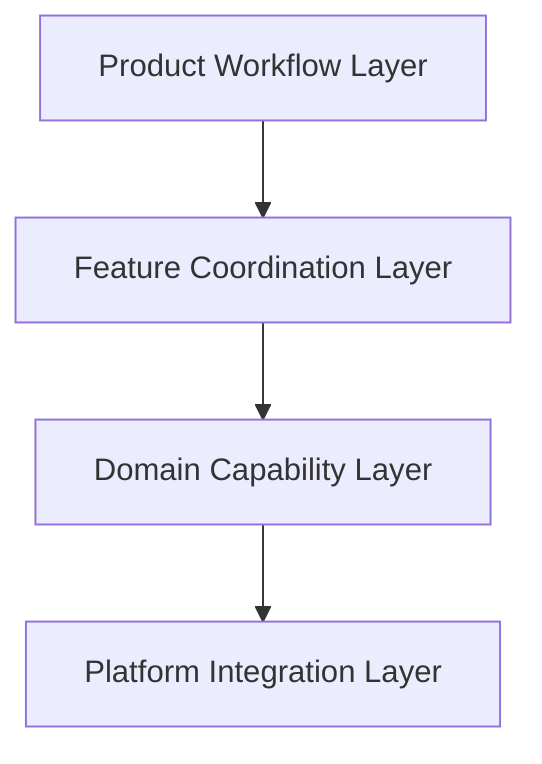

# ARCH-0002 Layer Model

狀態：`Accepted`

## 1. Document Control

| Field | Value |
| --- | --- |
| Document ID | `ARCH-0002` |
| Version | `1.1` |
| Architecture stability | `Accepted` |
| Last reviewed | `2026-07-27` |
| Depends on | `ARCH-0001`、accepted `SPEC-0003`–`SPEC-0010` |

## 2. Purpose

The Layer Model separates product workflow、cross-feature coordination、platform-independent capabilities and Windows side effects so accepted behavior can be tested without coupling product rules to WinUI or Windows APIs.

## 3. Layers

### 3.1 Product Workflow Layer

Owns:

- resident-ready and capture-Session lifecycle;
- legal shared-state progression;
- explicit Complete、Save and Cancel semantics;
- Session completion、cancellation、capacity-failure and terminal-failure boundaries.

Does not own WinUI controls、Windows APIs、Annotation rendering or technology decisions.

### 3.2 Feature Coordination Layer

Coordinates:

- `FEAT-001` Resident Capture and Multi-display Selection;
- `FEAT-002` Editing and Annotation;
- `FEAT-003` Clipboard Handoff;
- `FEAT-004` PNG File Output;
- `FEAT-005` Workflow Boundaries and Recovery.

Accepted order:

```text
Capacity validation and Capture／Selection
→ SelectionLocked
→ Editing
→ Complete OR Save OR Cancel
```

It coordinates Save as separate PNG and Clipboard capabilities and routes progress、capacity and recoverable outcomes. It does not own Feature internals or platform side effects.

### 3.3 Domain Capability Layer

Owns platform-independent rules and models for:

- four-4K capacity validation;
- Frozen Virtual Desktop Session context;
- pointer Selection geometry、revision and validation;
- pointer-driven Annotation document、objects、styles and Undo／Redo;
- final-render intent、transparent gaps and revision identity;
- Clipboard delivery intent and result;
- PNG output、retained File Reference and result;
- failure classification、progress and retry semantics.

It does not own concrete WinUI、Windows handles、WGC surfaces、DataPackage or Save Picker types.

### 3.4 Platform Integration Layer

Owns adapters for:

- PrintScreen interception and release;
- display enumeration、Virtual Desktop topology、DPI and foreground context;
- per-display Windows.Graphics.Capture acquisition;
- pointer、crosshair and Esc input;
- WinUI／Win2D presentation and rendering integration;
- WinRT Clipboard publication;
- Windows Save As and PNG file delivery;
- focus restoration and platform cleanup.

Adapters return typed outcomes and never mutate shared workflow state.

## 4. Dependency Direction



Rules:

- Product Workflow depends on Feature Coordination contracts, not concrete adapters.
- Feature Coordination invokes Domain Capabilities, not Windows APIs.
- Domain Capabilities depend on platform abstractions in Contracts, not concrete platform types.
- Platform Integration depends on Contracts and platform libraries but not product-semantic implementation details.
- UI composition may wire layers in `SnipPlus.App` but cannot move product ownership into code-behind.
- No circular project or component dependencies.

## 5. Responsibility Matrix

| Concern | Primary Layer | Supporting Layer |
| --- | --- | --- |
| Shared workflow state and legal Session progression | Product Workflow | Feature Coordination |
| PrintScreen-to-capture orchestration | Product Workflow | Feature Coordination／Platform Integration |
| Capacity validation and over-limit routing | Domain Capability | Feature Coordination／Platform Integration |
| Feature order and commitment routing | Feature Coordination | Product Workflow |
| Frozen Virtual Desktop、Selection and Annotation rules | Domain Capability | Feature Coordination |
| Final image、Clipboard and PNG intent semantics | Domain Capability | Feature Coordination |
| WGC、display、pointer／Esc、focus、Clipboard、Save As and file side effects | Platform Integration | Domain abstractions |
| Recoverable／terminal outcome and progress routing | Feature Coordination | Product Workflow／Domain |
| User-facing presentation | App composition using accepted outcomes | All layers provide state or results only |

## 6. Required Invariants

- `COMP-001` is the only shared-state authority.
- Capacity supports up to four displays、each no larger than `3840 × 2160`; partial display capture is prohibited.
- All frames、Selection、annotations and outputs use one Session ID and coordinate version.
- Mouse release never triggers output.
- Editing／confirmation is mandatory; Annotation actions are optional.
- Selection adjustment and Annotation are pointer-driven in v1.
- Complete and Save are explicit and separate commitments.
- Save requires PNG and Clipboard success but does not merge adapter ownership.
- A created PNG remains retained after later Clipboard failure.
- Non-display gaps render transparently.
- Recoverable output failure preserves Editing state.
- Platform adapters never decide Session completion.
- Performance gates and measurement protocol are owned by accepted PRD／Specs, not invented by adapters.
- PrintScreen and Esc are required keys; keyboard-only Annotation and non-PrintScreen shortcuts are deferred.
- Historical single-display workflow code does not redefine this Layer Model.

## 7. Product Decision Status

System Tray／MainWindow behavior、transparent gaps、PNG retention、performance、four-4K capacity and keyboard scope are finalized. This Layer Model contains no remaining visible v1 product decision.