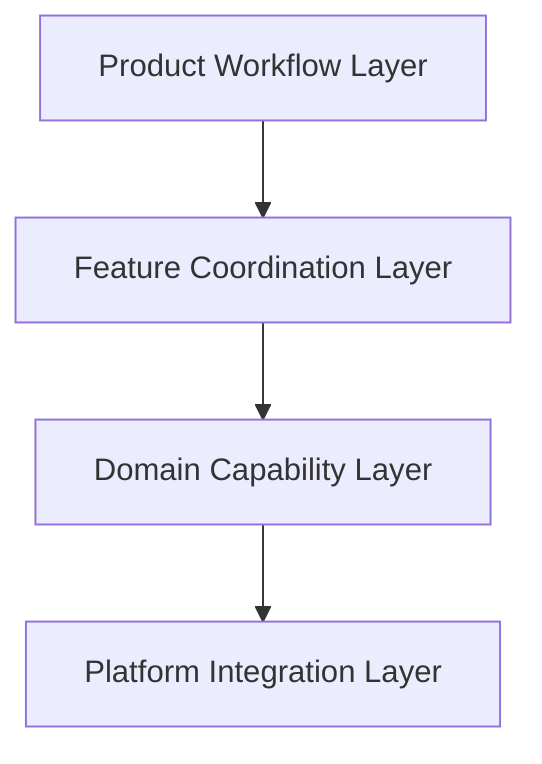

# ARCH-0002 Layer Model

狀態：`Accepted`

## 1. Document Control

| Field | Value |
| --- | --- |
| Document ID | `ARCH-0002` |
| Version | `1.0` |
| Architecture stability | `Accepted` |
| Last reviewed | `2026-07-27` |
| Depends on | `ARCH-0001`、accepted `SPEC-0003`–`SPEC-0010` |

## 2. Purpose

The Layer Model separates product workflow、cross-feature coordination、platform-independent capabilities and Windows side effects so that accepted behavior can be tested without coupling product rules to WinUI or Windows APIs.

## 3. Layers

### 3.1 Product Workflow Layer

Owns:

- resident-ready and capture-session lifecycle;
- accepted shared-state usage;
- explicit Complete、Save and Cancel commitment semantics;
- session completion、cancellation and terminal-failure boundaries.

Does not own:

- WinUI controls;
- WGC、Clipboard or file APIs;
- annotation rendering implementation;
- technology decisions.

### 3.2 Feature Coordination Layer

Owns coordination among:

- `FEAT-001` Resident Capture and Multi-display Selection;
- `FEAT-002` Editing and Annotation;
- `FEAT-003` Clipboard Handoff;
- `FEAT-004` PNG File Output;
- `FEAT-005` Workflow Boundaries and Recovery.

It enforces the accepted order:

```text
Capture／Selection
→ SelectionLocked
→ Editing
→ Complete OR Save OR Cancel
```

It also coordinates Save as a workflow requiring both PNG delivery and Clipboard publication while preserving separate capability ownership.

Does not own Feature internals or platform operations.

### 3.3 Domain Capability Layer

Owns platform-independent rules and models for:

- Frozen Virtual Desktop session context;
- selection geometry、revision and validation;
- annotation document、objects、styles and Undo／Redo;
- final-render intent and revision identity;
- Clipboard delivery intent and result;
- PNG output intent and result;
- failure classification inputs and retry semantics.

Does not own WinUI、Windows handles、WGC surfaces、DataPackage or Save Picker types.

### 3.4 Platform Integration Layer

Owns adapters for:

- PrintScreen interception and release;
- display enumeration、Virtual Desktop topology、DPI and foreground context;
- per-display Windows.Graphics.Capture acquisition;
- WinUI／Win2D presentation and rendering integration;
- WinRT Clipboard publication;
- Windows Save As and PNG file delivery;
- focus restoration and platform cleanup.

Adapters return typed outcomes and never mutate shared workflow state.

## 4. Dependency Direction



Rules:

- Product Workflow may depend on Feature Coordination contracts, not concrete adapters.
- Feature Coordination may invoke Domain Capabilities, not Windows APIs.
- Domain Capabilities may depend on platform abstractions defined in Contracts, not concrete platform types.
- Platform Integration may depend on Contracts and platform libraries but does not depend on product-semantic implementation details.
- UI composition may wire layers together in `SnipPlus.App` but cannot move product ownership into code-behind.
- No circular project or component dependencies.

## 5. Responsibility Matrix

| Concern | Primary Layer | Supporting Layer |
| --- | --- | --- |
| Shared workflow state and legal session progression | Product Workflow | Feature Coordination |
| PrintScreen-to-capture orchestration | Product Workflow | Feature Coordination／Platform Integration |
| Feature order and commitment routing | Feature Coordination | Product Workflow |
| Frozen Virtual Desktop、selection and annotation rules | Domain Capability | Feature Coordination |
| Final image、Clipboard and PNG intent semantics | Domain Capability | Feature Coordination |
| WGC、display、input、focus、Clipboard、Save As and file side effects | Platform Integration | Domain abstractions |
| Recoverable／terminal outcome routing | Feature Coordination | Product Workflow／Domain |
| User-facing presentation | App composition using accepted outcomes | All layers provide state or results only |

## 6. Required Invariants

- `COMP-001` is the only shared-state authority.
- All display frames、selection、annotations and outputs use one Session ID and coordinate version.
- Mouse release never triggers output.
- Editing／confirmation is mandatory; annotation actions are optional.
- Complete and Save are explicit and separate commitments.
- Save requires PNG and Clipboard success but does not merge their adapter ownership.
- Recoverable output failure preserves Editing state.
- Platform adapters never decide session completion.
- Historical single-display workflow code does not redefine this Layer Model.

## 7. Open Decisions

This Layer Model does not decide:

- System Tray visual structure and MainWindow close behavior;
- non-display-gap presentation;
- PNG rollback after later Clipboard failure;
- final keyboard-only annotation interaction design;
- quantitative performance thresholds.
