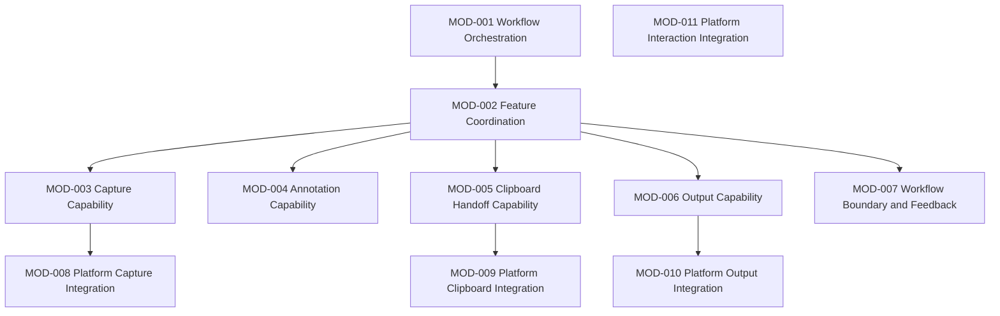

# ARCH-0003 Module Catalog

狀態：`Draft`

| Field | Value |
| --- | --- |
| Document ID | `ARCH-0003` |
| Architecture Stability | `Draft` |
| Review Status | `Draft` |
| Version | `0.1` |
| Owner | `TBD` |
| Last Reviewed | `Not reviewed` |
| Depends on | [ARCH-0001 Architecture Principles](ARCH-0001-architecture-principles.md)、[ARCH-0002 Layer Model](ARCH-0002-layer-model.md)、[SPEC-0010 Feature Integration](../Specs/SPEC-0010-feature-integration.md) |

本文件是抽象 Module Catalog，不是 Component Design、Service Design、Class Design、Project Design 或 technology selection。

## 1. Purpose

本文件的目的，是將 [ARCH-0002 Layer Model](ARCH-0002-layer-model.md) 的 Layer 責任分解成可管理的抽象 Module，讓後續 Component Design、Architecture Decision 與實作規劃有一致的責任與依賴基線。

本文件不定義任何程式類別、實作技術或檔案結構。

## 2. Scope

本文件只涵蓋：

- Module identity、Status 與 Primary Layer。
- Module 的抽象 Purpose、Responsibilities、Inputs 與 Outputs。
- Module Owns、Does not own、Allowed dependencies 與 Prohibited dependencies。
- Feature-to-Module、Layer-to-Module 與 Responsibility Matrix。
- Module dependency direction、Architectural Risks、Traceability 與 Open Questions。

## 3. Non-goals

本文件明確不負責：

- 定義 Class、Interface、API method、Namespace 或 Project。
- 定義 Component、Service、Event Bus、Message Contract 或資料結構。
- 決定 Framework、Threading、Dependency Injection 或事件匯流排。
- 決定資料格式、Persistence、File、Database、Storage 或 Serialization。
- 定義 UI Module、Overlay、Toolbar、Annotation Tool 或視覺設計。
- 決定 WPF、WinUI、C#、.NET、Windows API、Clipboard API 或其他技術。

## 4. Module Catalog

### 4.1 Module summary

Module Status 只能使用 `Required`、`Candidate`、`Deferred`、`Deprecated`。若 Frozen Specifications 無法推導某 Module 是否必要，保留 `Candidate` 或 `TBD`。

Module ID 必須唯一且不可重用；被 Deprecated 的 ID 仍保留歷史識別，不得重新分配給其他責任。

| Module ID | Name | Status | Primary Layer | Primary responsibility |
| --- | --- | --- | --- | --- |
| `MOD-001` | Workflow Orchestration | `Required` | Product Workflow Layer | 維持共享工作流程與 Session 邊界。 |
| `MOD-002` | Feature Coordination | `Required` | Feature Coordination Layer | 協調 Capture、Annotation、Clipboard、Output 與 Feedback。 |
| `MOD-003` | Capture Capability | `Required` | Domain Capability Layer | 提供 Capture 與 Selection 的抽象能力。 |
| `MOD-004` | Annotation Capability | `Candidate` | Domain Capability Layer | 提供建立、修改、移除 Annotation 的抽象能力。 |
| `MOD-005` | Clipboard Handoff Capability | `Required` | Domain Capability Layer | 提供 Capture Result 的 Clipboard 交付能力。 |
| `MOD-006` | Output Capability | `Required` | Domain Capability Layer | 提供 Capture Result 的正式 Output 交付能力。 |
| `MOD-007` | Workflow Boundary and Feedback | `Required` | Feature Coordination Layer | 提供 Completion、Cancel、Failure 與 Feedback 邊界。 |
| `MOD-008` | Platform Capture Integration | `Candidate` | Platform Integration Layer | 對接作業系統擷取能力的抽象邊界。 |
| `MOD-009` | Platform Clipboard Integration | `Candidate` | Platform Integration Layer | 對接作業系統 Clipboard 能力的抽象邊界。 |
| `MOD-010` | Platform Output Integration | `Candidate` | Platform Integration Layer | 對接作業系統 Output 能力的抽象邊界。 |
| `MOD-011` | Platform Interaction Integration | `Candidate` | Platform Integration Layer | 對接輸入、焦點、顯示器及平台互動邊界。 |

### 4.2 MOD-001 — Workflow Orchestration

| Field | Value |
| --- | --- |
| Module ID | `MOD-001` |
| Status | `Required` |
| Primary Layer | Product Workflow Layer |
| Purpose | 維持一次完整 Capture Session 的共享 workflow intent 與 state boundary。 |
| Responsibilities | 接收合法 workflow intent、維持 Capture Request 到 Exit 的流程語意、使用 SPEC-0003 shared state。 |
| Inputs | Frozen workflow intent、使用者操作結果、Feature status。 |
| Outputs | Capture/Annotation/Handoff 的協調 intent、shared state transition input、session outcome。 |
| Owns | Product Workflow Layer 的 session orchestration 語意。 |
| Does not own | Feature 內部能力、平台副作用、UI、Storage、Feature boundary 的重新分配。 |
| Allowed dependencies | `MOD-002`。 |
| Prohibited dependencies | 直接依賴 `MOD-003` 至 `MOD-011` 的平台或能力細節。 |
| Feature traceability | `FEAT-001`；支援 `FEAT-005` shared workflow boundary。 |
| Spec traceability | SPEC-0003、SPEC-0005、SPEC-0010、ARCH-0001、ARCH-0002。 |
| Open questions | Session concurrency、entry behavior、state transition 的 runtime detail：`UNKNOWN/TBD`。 |

### 4.3 MOD-002 — Feature Coordination

| Field | Value |
| --- | --- |
| Module ID | `MOD-002` |
| Status | `Required` |
| Primary Layer | Feature Coordination Layer |
| Purpose | 協調五個核心 Feature 的 handoff、optional path、parallel downstream 與共同責任。 |
| Responsibilities | 維持 Feature-to-Feature coordination intent、依 SPEC-0010 分派責任、保留 Clipboard/Output 的平行關係。 |
| Inputs | MOD-001 workflow intent、各 Feature capability status、MOD-007 boundary status。 |
| Outputs | Feature handoff intent、coordination status、ownership boundary input。 |
| Owns | Cross-feature coordination semantics。 |
| Does not own | Capture、Annotation、Clipboard、Output 的內部行為或平台操作。 |
| Allowed dependencies | `MOD-003`、`MOD-004`、`MOD-005`、`MOD-006`、`MOD-007`。 |
| Prohibited dependencies | 直接依賴 `MOD-008` 至 `MOD-011`，或繞過 Domain Capability 執行平台操作。 |
| Feature traceability | `FEAT-001` 至 `FEAT-005` 的 integration responsibility。 |
| Spec traceability | SPEC-0006、SPEC-0010、ARCH-0001、ARCH-0002。 |
| Open questions | Coordination 與 Workflow Boundary 的最終切線：`UNKNOWN/TBD`。 |

### 4.4 MOD-003 — Capture Capability

| Field | Value |
| --- | --- |
| Module ID | `MOD-003` |
| Status | `Required` |
| Primary Layer | Domain Capability Layer |
| Purpose | 提供 Capture Request、Region Selection 與 Capture Result creation 的抽象 capability。 |
| Responsibilities | 維持 Capture capability contract、Selection outcome、Capture result readiness 與 failure status。 |
| Inputs | MOD-002 的 Capture intent、platform capture boundary outcome。 |
| Outputs | Capture Result、Selection status、completion/cancel/failure outcome。 |
| Owns | `FEAT-001` 的 domain capability semantics。 |
| Does not own | 使用者 workflow orchestration、Annotation、Clipboard/Output handoff 內部行為、平台技術。 |
| Allowed dependencies | `MOD-008`、`MOD-011` 的抽象 platform boundary；具體依賴：`TBD`。 |
| Prohibited dependencies | 直接依賴 `MOD-001`、`MOD-002` 的內部實作，或直接擁有 UI/Storage。 |
| Feature traceability | `FEAT-001`。 |
| Spec traceability | SPEC-0003、SPEC-0005、ARCH-0002。 |
| Open questions | Capture/Selection 是否維持同一抽象 Module、platform result contract：`UNKNOWN/TBD`。 |

### 4.5 MOD-004 — Annotation Capability

| Field | Value |
| --- | --- |
| Module ID | `MOD-004` |
| Status | `Candidate` |
| Primary Layer | Domain Capability Layer |
| Purpose | 提供建立、修改、移除 Annotation 的 optional abstract capability。 |
| Responsibilities | 維持 Annotation local lifecycle、base result preservation intent、Annotated Result handoff status。 |
| Inputs | Capture Result、optional Annotation intent、platform-independent capability status。 |
| Outputs | Annotated Result、Annotation changed/removed/completed/error status。 |
| Owns | `FEAT-002` 的 domain capability semantics。 |
| Does not own | 任何 Annotation Tool、Toolbar、Overlay、object format、serialization 或 platform renderer。 |
| Allowed dependencies | `MOD-002`；其他 platform boundary：`TBD`。 |
| Prohibited dependencies | 依賴 `MOD-005` 或 `MOD-006` 完成，或將 optional path 變成必要流程。 |
| Feature traceability | `FEAT-002`。 |
| Spec traceability | SPEC-0003、SPEC-0009、ARCH-0002。 |
| Open questions | v1.0 啟用、Annotation lifecycle、preservation、history/undo/redo：`UNKNOWN/TBD`。 |

### 4.6 MOD-005 — Clipboard Handoff Capability

| Field | Value |
| --- | --- |
| Module ID | `MOD-005` |
| Status | `Required` |
| Primary Layer | Domain Capability Layer |
| Purpose | 提供 Capture Result 或 Annotated Result 到 Clipboard Consumer 的抽象交付 capability。 |
| Responsibilities | 維持 Clipboard Ready、handoff pending、consumer acceptance 與 failure outcome 的 domain semantics。 |
| Inputs | Capture Result 或 Annotated Result、Clipboard handoff intent、platform boundary outcome。 |
| Outputs | Handoff status、consumer acceptance status、failure boundary input。 |
| Owns | `FEAT-003` 的 handoff capability semantics。 |
| Does not own | Clipboard API、資料格式、Output、Storage、Consumer 內部行為或 shared state definition。 |
| Allowed dependencies | `MOD-002`、`MOD-009`、`MOD-011` 的抽象 boundary。 |
| Prohibited dependencies | 依賴 `MOD-006` 完成，或直接依賴 Product Workflow implementation。 |
| Feature traceability | `FEAT-003`。 |
| Spec traceability | SPEC-0003、SPEC-0007、ARCH-0002。 |
| Open questions | Consumer acceptance、retry、result preservation、existing content：`UNKNOWN/TBD`。 |

### 4.7 MOD-006 — Output Capability

| Field | Value |
| --- | --- |
| Module ID | `MOD-006` |
| Status | `Required` |
| Primary Layer | Domain Capability Layer |
| Purpose | 提供 Capture Result 或 Annotated Result 成為正式 Output 並交付給 Output Consumer 的抽象 capability。 |
| Responsibilities | 維持 Result Created、Output Ready、Output Delivered、Output Completed 與 Output Error 的 local semantics。 |
| Inputs | Capture Result 或 Annotated Result、Output intent、platform boundary outcome。 |
| Outputs | Output lifecycle status、consumer acceptance status、failure boundary input。 |
| Owns | `FEAT-004` 的 Output capability semantics。 |
| Does not own | 檔案格式、Storage、File IO、Save Dialog、Cloud、Output Consumer 內部行為或 shared state definition。 |
| Allowed dependencies | `MOD-002`、`MOD-010`、`MOD-011` 的抽象 boundary。 |
| Prohibited dependencies | 依賴 `MOD-005` 完成，或直接依賴 Product Workflow implementation。 |
| Feature traceability | `FEAT-004`。 |
| Spec traceability | SPEC-0003、SPEC-0008、ARCH-0002。 |
| Open questions | Output consumer、preservation、retry、result/output contract：`UNKNOWN/TBD`。 |

### 4.8 MOD-007 — Workflow Boundary and Feedback

| Field | Value |
| --- | --- |
| Module ID | `MOD-007` |
| Status | `Required` |
| Primary Layer | Feature Coordination Layer |
| Purpose | 提供 Completion、Cancel、Failure、Exit 與 Feedback 的共同 boundary semantics。 |
| Responsibilities | 區分成功/取消/失敗、維持 shared termination、分類 failure input、提供 feedback requirement input。 |
| Inputs | 各 Feature 的 success/cancel/failure status、MOD-001 session boundary。 |
| Outputs | Shared boundary status、feedback requirement、safe state/exit input。 |
| Owns | `FEAT-005` 的 cross-feature boundary semantics。 |
| Does not own | 各 Feature 內部 recovery、Retry、Logging、UI notification 或平台實作。 |
| Allowed dependencies | `MOD-001`、`MOD-002`；其他 Feature 只回報 status。 |
| Prohibited dependencies | 直接依賴 `MOD-008` 至 `MOD-011`，或吞併 `MOD-003` 至 `MOD-006` 的內部責任。 |
| Feature traceability | `FEAT-005`。 |
| Spec traceability | SPEC-0003、SPEC-0006、SPEC-0010、ARCH-0002。 |
| Open questions | Recoverable/Terminal classification、feedback channel、Cancel trigger：`UNKNOWN/TBD`。 |

### 4.9 MOD-008 — Platform Capture Integration

| Field | Value |
| --- | --- |
| Module ID | `MOD-008` |
| Status | `Candidate` |
| Primary Layer | Platform Integration Layer |
| Purpose | 對接作業系統擷取能力的抽象 platform boundary。 |
| Responsibilities | 接收抽象 capture intent、回報 capture result/platform failure、隔離平台差異。 |
| Inputs | MOD-003 的 abstract capture request。 |
| Outputs | Platform capture outcome、verification evidence、failure status。 |
| Owns | Platform-specific capture interaction boundary。 |
| Does not own | Capture product rules、Selection semantics、Shared State、UI 或 technology selection。 |
| Allowed dependencies | `MOD-011` 的抽象 platform interaction：`TBD`。 |
| Prohibited dependencies | 依賴任何 Product Workflow、Feature Coordination 或 Domain Module 的內部實作。 |
| Feature traceability | `FEAT-001` platform boundary。 |
| Spec traceability | SPEC-0005、ARCH-0002。 |
| Open questions | Windows version、capture mechanism、display/DPI/HDR、focus behavior：`UNKNOWN/TBD`。 |

### 4.10 MOD-009 — Platform Clipboard Integration

| Field | Value |
| --- | --- |
| Module ID | `MOD-009` |
| Status | `Candidate` |
| Primary Layer | Platform Integration Layer |
| Purpose | 對接作業系統 Clipboard 能力的抽象 platform boundary。 |
| Responsibilities | 接收 abstract Clipboard handoff intent、回報 consumer/handoff outcome、隔離平台差異。 |
| Inputs | MOD-005 的 handoff intent。 |
| Outputs | Clipboard handoff status、consumer acceptance/error evidence。 |
| Owns | Platform-specific Clipboard interaction boundary。 |
| Does not own | Clipboard product semantics、API、data format、Output、Storage 或 Shared State。 |
| Allowed dependencies | `MOD-011` 的抽象 platform interaction：`TBD`。 |
| Prohibited dependencies | 依賴 `MOD-001`、`MOD-002` 或直接依賴 `MOD-006`。 |
| Feature traceability | `FEAT-003` platform boundary。 |
| Spec traceability | SPEC-0007、ARCH-0002。 |
| Open questions | Clipboard consumer、permission、existing content、handoff failure：`UNKNOWN/TBD`。 |

### 4.11 MOD-010 — Platform Output Integration

| Field | Value |
| --- | --- |
| Module ID | `MOD-010` |
| Status | `Candidate` |
| Primary Layer | Platform Integration Layer |
| Purpose | 對接作業系統或已核准 Output Consumer 的抽象 platform boundary。 |
| Responsibilities | 接收 abstract Output delivery intent、回報 Output outcome、隔離外部副作用。 |
| Inputs | MOD-006 的 Output intent。 |
| Outputs | Output delivery status、consumer acceptance/error evidence。 |
| Owns | Platform-specific Output interaction boundary。 |
| Does not own | Output format、Storage、File IO、Save Dialog、Cloud、Output lifecycle semantics 或 Shared State。 |
| Allowed dependencies | `MOD-011` 的抽象 platform interaction：`TBD`。 |
| Prohibited dependencies | 依賴 `MOD-001`、`MOD-002` 或直接依賴 `MOD-005`。 |
| Feature traceability | `FEAT-004` platform boundary。 |
| Spec traceability | SPEC-0008、ARCH-0002。 |
| Open questions | Output Consumer、delivery mechanism、privacy、persistence、permission：`UNKNOWN/TBD`。 |

### 4.12 MOD-011 — Platform Interaction Integration

| Field | Value |
| --- | --- |
| Module ID | `MOD-011` |
| Status | `Candidate` |
| Primary Layer | Platform Integration Layer |
| Purpose | 對接輸入、焦點、顯示器及其他平台互動邊界的抽象 supporting capability。 |
| Responsibilities | 回報 input/focus/display/platform interruption status，隔離 platform-specific interaction。 |
| Inputs | 各 platform boundary 的 abstract interaction request。 |
| Outputs | Interaction status、focus/display interruption evidence、platform failure input。 |
| Owns | Platform interaction boundary 的抽象隔離。 |
| Does not own | User workflow、Feature scope、Shared State、Capture/Clipboard/Output semantics 或 UI。 |
| Allowed dependencies | Platform modules `MOD-008`、`MOD-009`、`MOD-010` 的 supporting relationship：`TBD`。 |
| Prohibited dependencies | 依賴 Product Workflow、Feature Coordination 或 Domain Capability 的內部實作。 |
| Feature traceability | Cross-feature platform boundary。 |
| Spec traceability | SPEC-0005、SPEC-0006、SPEC-0007、SPEC-0008、SPEC-0009、ARCH-0002。 |
| Open questions | 是否需要拆分 input/focus/display boundary、platform scope：`UNKNOWN/TBD`。 |

## 5. Feature-to-Module Mapping

每個 Feature 只有一個 Primary Module；Supporting Module 不得取代 Primary Owner。

| Feature | Primary Module | Supporting Modules | Platform Modules |
| --- | --- | --- | --- |
| `FEAT-001 Capture Workflow` | `MOD-001` Workflow Orchestration | `MOD-002`、`MOD-003`、`MOD-007` | `MOD-008`、`MOD-011` |
| `FEAT-002 Annotation` | `MOD-004` Annotation Capability | `MOD-001`、`MOD-002`、`MOD-007` | Platform support：`TBD` |
| `FEAT-003 Clipboard Handoff` | `MOD-005` Clipboard Handoff Capability | `MOD-002`、`MOD-007` | `MOD-009`、`MOD-011` |
| `FEAT-004 Capture Output` | `MOD-006` Output Capability | `MOD-002`、`MOD-007` | `MOD-010`、`MOD-011` |
| `FEAT-005 Workflow Boundaries and Feedback` | `MOD-007` Workflow Boundary and Feedback | `MOD-001`、`MOD-002` | Platform status only：`TBD` |

## 6. Layer-to-Module Mapping

| Layer | Modules | Layer responsibility preserved |
| --- | --- | --- |
| Product Workflow Layer | `MOD-001` | 共享 workflow 與 Session 語意仍由單一 Primary Module 維持。 |
| Feature Coordination Layer | `MOD-002`、`MOD-007` | coordination 與共同 boundary 分開記錄，不吞併 Feature 內部能力。 |
| Domain Capability Layer | `MOD-003`、`MOD-004`、`MOD-005`、`MOD-006` | Capture、Annotation、Clipboard、Output 各有獨立 capability ownership。 |
| Platform Integration Layer | `MOD-008`、`MOD-009`、`MOD-010`、`MOD-011` | OS、Clipboard、Output、input/focus/display 副作用保持抽象隔離。 |

## 7. Dependency Rules

- `MOD-001` 可依賴 `MOD-002`，不得直接依賴 Platform Integration。
- `MOD-002` 可協調 Domain Capability，但不得直接執行平台操作。
- `MOD-003`、`MOD-004`、`MOD-005`、`MOD-006` 只能依賴抽象 Platform Integration boundary，不能依賴具體技術。
- `MOD-007` 維持 shared boundary，不能吞併 `MOD-003` 至 `MOD-006` 的內部責任。
- Platform Integration modules 不得依賴 Product Workflow 或 Feature Coordination 的內部實作。
- Domain Module 之間不得形成循環依賴。
- `MOD-005` 與 `MOD-006` 保持平行，不得彼此成為必要依賴。
- `MOD-004` 必須保持 Optional，不得成為 `MOD-005` 或 `MOD-006` 的必要前置條件。
- Module 只能交換已由 Frozen Specifications 定義的抽象 intent、result、boundary 或 status；交換形式：`TBD`。

### 7.1 Module dependency diagram



圖中只顯示 abstract Module ID 與合法依賴方向；`MOD-011` 的 supporting relationship 仍為 `TBD`，因此不在圖中創造未核准的固定依賴。

## 8. Responsibility Matrix

每項責任只能有一個 Primary Module。

| Responsibility | Primary Module | Supporting Module | Explicitly not owned by |
| --- | --- | --- | --- |
| Shared workflow state usage | `MOD-001` | `MOD-007` | `MOD-003` 至 `MOD-011` 不定義 shared state。 |
| Capture Request | `MOD-003` | `MOD-001`、`MOD-002` | `MOD-008` 不擁有 product Capture semantics。 |
| Region Selection | `MOD-003` | `MOD-001`、`MOD-008` | `MOD-001` 不擁有 platform selection implementation。 |
| Annotation | `MOD-004` | `MOD-002`、`MOD-007` | `MOD-005`、`MOD-006` 不擁有 Annotation。 |
| Clipboard Handoff | `MOD-005` | `MOD-009`、`MOD-011` | `MOD-006` 不擁有 Clipboard handoff。 |
| Output delivery | `MOD-006` | `MOD-010`、`MOD-011` | `MOD-005` 不擁有 Output delivery。 |
| Completion | `MOD-007` | `MOD-001`、`MOD-002` | Feature capability modules 不重新定義 completion。 |
| Cancellation | `MOD-007` | `MOD-001` 至 `MOD-006` 回報 status | Platform modules 不決定產品 Cancel semantics。 |
| Failure classification | `MOD-007` | 各 owning Module 提供 failure detail | `MOD-008` 至 `MOD-011` 不分類產品 failure。 |
| User-facing feedback boundary | `MOD-007` | `MOD-001`、`MOD-002` | 具體 UI/notification 不在 Module Catalog 決定。 |
| Platform capture interaction | `MOD-008` | `MOD-011` | Domain modules 不直接包含 platform implementation。 |
| Platform clipboard interaction | `MOD-009` | `MOD-011` | `MOD-005` 不包含 Clipboard API。 |
| Platform output interaction | `MOD-010` | `MOD-011` | `MOD-006` 不包含 File IO、Storage 或 platform implementation。 |
| Platform focus/display interaction | `MOD-011` | `MOD-008`、`MOD-009`、`MOD-010`：`TBD` | 上層 Module 不擁有 platform interaction details。 |

## 9. Traceability

每個 Module 的來源鏈為：

```text
Frozen PRD
  ↓
Frozen Specs
  ↓
Feature
  ↓
Layer
  ↓
Module
```

### 9.1 Source documents

- [PRD Freeze Review](../PRD/PRD-FREEZE-REVIEW.md)。
- [SPEC Baseline Review](../Specs/SPEC-BASELINE-REVIEW.md)。
- [SPEC-0003 System Requirements](../Specs/SPEC-0003-system-requirements.md)。
- [SPEC-0010 Feature Integration](../Specs/SPEC-0010-feature-integration.md)。
- [ARCH-0001 Architecture Principles](ARCH-0001-architecture-principles.md)。
- [ARCH-0002 Layer Model](ARCH-0002-layer-model.md)。

每個 Module 都必須能回溯到對應 Feature、Spec、Layer 與本 Module Catalog。不得直接以 Research 作為 Module design 依據。

## 10. Architectural Risks

只記錄，不在本文件解決：

- Module 過度切割，造成無法理解的責任碎片化。
- `MOD-001` Workflow Orchestration 成為 God Module。
- `MOD-002` Feature Coordination 與 `MOD-007` Workflow Boundary and Feedback 責任重疊。
- Domain Capability 直接洩漏 Platform Integration 細節。
- Platform Integration 過度泛化，反而失去可驗證邊界。
- Clipboard/Output dependency direction 錯誤或被誤解為固定順序。
- Optional `MOD-004` Annotation Capability 被變成必要依賴。
- Candidate Platform Modules 在沒有 runtime evidence 前被誤視為 Required。

## 11. Open Questions

本文件不回答下列 Module-level 問題：

- `MOD-011` Platform Interaction 是否需要拆分為更小的 abstract Module：`UNKNOWN/TBD`。
- Feedback 是獨立 Module 還是 `MOD-007` boundary 的一部分：`TBD`。
- Output 與 Clipboard 是否共享抽象 Result contract：`UNKNOWN`。
- Capture/Selection 是否應維持 `MOD-003` 同一 Module：`TBD`。
- Runtime verification 是否會要求新的 Platform Module：`UNKNOWN`。
- Candidate Module 何時轉為 Required：`TBD`。
- Module 到實際 Project/Assembly 的對應方式：`UNKNOWN`。
- 是否需要建立跨 Module 的 data/status contract：`TBD`。

## 12. Completion Boundary

完成本文件不代表：

- Component Architecture 完成。
- ADR 完成。
- 技術選型完成。
- Project/Solution structure 完成。
- Class、Interface、API 或 Event design 完成。
- Ready for Coding。

`ARCH-0003` 只完成抽象 Module Catalog；下一份 Architecture 文件必須等待本文件 Review 與明確的下一個任務。
