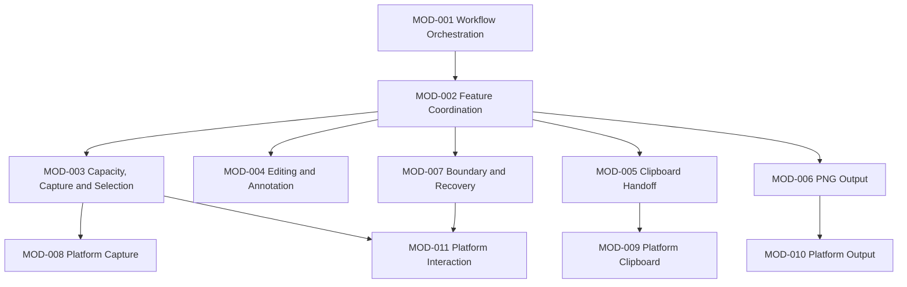

# ARCH-0003 Module Catalog

狀態：`Accepted`

## 1. Document Control

| Field | Value |
| --- | --- |
| Document ID | `ARCH-0003` |
| Version | `1.1` |
| Architecture stability | `Accepted` |
| Last reviewed | `2026-07-27` |
| Depends on | `ARCH-0001`、`ARCH-0002`、`SPEC-0010` |

## 2. Purpose

This catalog assigns one primary responsibility to each module required by the accepted SnipPlus v1 workflow. It does not define classes、methods or visual styling.

## 3. Module Catalog

| Module ID | Name | Status | Primary layer | Responsibility |
| --- | --- | --- | --- | --- |
| `MOD-001` | Workflow Orchestration | `Required` | Product Workflow | Own capture-Session lifecycle and requests to the shared Workflow State Authority. |
| `MOD-002` | Feature Coordination | `Required` | Feature Coordination | Coordinate Capture／Selection、Editing／Annotation、Clipboard、PNG Output and Recovery in accepted order. |
| `MOD-003` | Capacity、Capture and Selection Capability | `Required` | Domain Capability | Model four-4K capacity、Frozen Virtual Desktop、per-display frames、pointer Selection geometry、lock、move、resize and reselection. |
| `MOD-004` | Editing and Annotation Capability | `Required` | Domain Capability | Own mandatory Editing、pointer-driven Annotation document、required tools、object editing and Undo／Redo. |
| `MOD-005` | Clipboard Handoff Capability | `Required` | Domain Capability | Define final-image Clipboard intent、result、retry and commitment semantics. |
| `MOD-006` | PNG Output Capability | `Required` | Domain Capability | Define Save As、PNG delivery、retained File Reference and Save commitment semantics. |
| `MOD-007` | Workflow Boundary and Recovery | `Required` | Feature Coordination | Classify success、Save-dialog cancel、capacity failure、recoverable／terminal failure、progress、cleanup and focus restoration. |
| `MOD-008` | Platform Capture Integration | `Required` | Platform Integration | Enumerate and acquire immutable frames for all participating supported displays. |
| `MOD-009` | Platform Clipboard Integration | `Required` | Platform Integration | Publish the final result to WinRT Clipboard with privacy and retry rules. |
| `MOD-010` | Platform Output Integration | `Required` | Platform Integration | Provide Windows Save As、PNG creation and typed delivery outcomes. |
| `MOD-011` | Platform Interaction Integration | `Required` | Platform Integration | Provide PrintScreen、display／DPI／focus、pointer／crosshair、Esc、window exclusion and restoration. |

## 4. Module Boundaries

### MOD-001 — Workflow Orchestration

Owns one capture Session from accepted entry to `ResidentReady`. It requests legal transitions from `COMP-001` and does not perform platform side effects.

### MOD-002 — Feature Coordination

```text
Resident entry
→ Capacity validation and Freezing
→ Selecting
→ SelectionLocked
→ Editing
→ Complete OR Save OR Cancel
```

It never routes mouse release directly to Clipboard.

### MOD-003 — Capacity、Capture and Selection Capability

Owns the platform-independent model for:

- up to four displays、each no larger than `3840 × 2160`;
- total source pixels、Virtual Desktop and Selection allocation limits;
- per-display snapshots and frame identities;
- Selection revisions in Virtual Desktop coordinates;
- pointer drag、lock、move、edge／corner resize and reselection;
- cross-display intersections、transparent gaps and crop planning.

It does not own UI controls or concrete WGC objects. Keyboard-only Selection manipulation is deferred.

### MOD-004 — Editing and Annotation Capability

Owns the required Editing／confirmation capability and:

- Rectangle;
- Arrow／Line;
- Highlighter;
- Text;
- Mosaic／Blur;
- Numbered Marker;
- shared color、thickness／size controls;
- pointer object selection、movement、resize、restyle and delete;
- function-bar Undo and Redo.

The user may skip Annotation actions. Keyboard-only Annotation and non-PrintScreen shortcuts are deferred.

### MOD-005 — Clipboard Handoff Capability

Owns Clipboard commitment semantics after Complete or successful PNG creation in Save. It does not own Save As、file creation or retained-file deletion.

### MOD-006 — PNG Output Capability

Owns Save As and PNG delivery. A successful file returns a retained File Reference. The Save workflow completes only after Clipboard also succeeds. Later Clipboard failure does not delete or roll back the PNG.

### MOD-007 — Workflow Boundary and Recovery

Owns:

- successful Complete and Save;
- whole-Session Esc／Cancel;
- Save-dialog cancellation returning to Editing;
- capacity-limit failure;
- recoverable output failure preserving Editing;
- terminal cleanup and focus restoration;
- stale outcome rejection;
- progress after `300 ms`.

### MOD-008 — Platform Capture Integration

Owns platform capture resources and typed outcomes. All required supported-display frames are acquired before Selection becomes interactive.

### MOD-009 — Platform Clipboard Integration

Owns DataPackage publication、bounded cancellable retry、payload lifetime and history／roaming defaults. It does not decide workflow completion.

### MOD-010 — Platform Output Integration

Owns Windows Save As、PNG write and typed file-delivery outcomes. It never deletes a retained PNG because Clipboard later failed.

### MOD-011 — Platform Interaction Integration

Owns platform boundaries for:

- PrintScreen interception and release;
- connected-display enumeration;
- Virtual Desktop topology、negative origins and DPI context;
- pointer、crosshair and Esc input;
- excluding SnipPlus windows from capture;
- recording and restoring foreground context.

## 5. Dependency Rules



- Domain modules depend on platform abstractions, not concrete platform types.
- Platform modules do not depend on Product Workflow implementation.
- MOD-005 and MOD-006 remain separate; MOD-002 coordinates Save.
- MOD-004 remains required even when the user creates no annotations.
- No module may mutate shared state except through `COMP-001`.
- No circular dependencies.

## 6. Deferred Capability Boundary

The v1 module catalog does not add modules for OCR、history、pinning、cloud、plugins、telemetry、updates、opaque freehand pen、ellipse、additional image formats、8K support or keyboard-only Annotation／non-PrintScreen shortcuts.