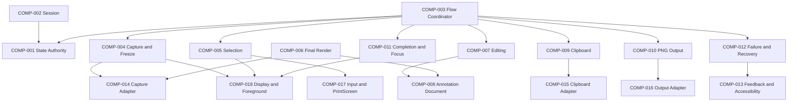

# ARCH-0004 Component Boundaries

狀態：`Accepted`

## 1. Document Control

| Field | Value |
| --- | --- |
| Document ID | `ARCH-0004` |
| Version | `1.0` |
| Architecture stability | `Accepted` |
| Last reviewed | `2026-07-27` |
| Normative references | `ARCH-0001`–`ARCH-0003`、`SPEC-0003`–`SPEC-0010`、`IMPLEMENTATION-CONTRACTS-001` |

## 2. Purpose

This document preserves the existing `COMP-001`–`COMP-018` identities while correcting their responsibility boundaries for the accepted SnipPlus v1 workflow. Component IDs are stable; corrected names and responsibilities supersede earlier optional-Annotation、single-display and immediate-Clipboard descriptions.

## 3. Component Catalog

| Component | Name | Module | Status | Primary responsibility |
| --- | --- | --- | --- | --- |
| `COMP-001` | Workflow State Authority | `MOD-001` | `Required` | Sole authority for legal shared-state transitions. |
| `COMP-002` | Session Lifecycle Boundary | `MOD-001` | `Required` | Own one resident capture-session lifecycle、identity and cleanup request. |
| `COMP-003` | Feature Flow Coordinator | `MOD-002` | `Required` | Coordinate accepted Capture → SelectionLocked → Editing → commitment order. |
| `COMP-004` | Capture Request and Freeze Boundary | `MOD-003` | `Required` | Validate entry、create session capture intent and require all display frames before Selection. |
| `COMP-005` | Selection Boundary | `MOD-003` | `Required` | Own selection geometry、revision、lock、move、resize、reselection and validation. |
| `COMP-006` | Final Render Boundary | `MOD-003` | `Required` | Build one final-image intent from frozen frames、selection and annotation revision. |
| `COMP-007` | Editing Session Boundary | `MOD-004` | `Required` | Own mandatory editing／confirmation lifecycle and function-bar command semantics. |
| `COMP-008` | Annotation Document and History Boundary | `MOD-004` | `Required` | Own annotation objects、styles、selection、editing、clipping and Undo／Redo. |
| `COMP-009` | Clipboard Handoff Boundary | `MOD-005` | `Required` | Own Clipboard delivery intent and outcome for the final rendered result. |
| `COMP-010` | PNG Output Boundary | `MOD-006` | `Required` | Own Save As、PNG delivery intent and file outcome. |
| `COMP-011` | Completion、Cancellation and Focus Boundary | `MOD-007` | `Required` | Own success／cancel cleanup obligations and pre-capture focus restoration request. |
| `COMP-012` | Failure and Recovery Boundary | `MOD-007` | `Required` | Classify recoverable、terminal and stale outcomes without stealing original ownership. |
| `COMP-013` | Feedback and Accessibility Boundary | `MOD-007` | `Required` | Define actionable failure feedback and accessible control／state requirements. |
| `COMP-014` | Platform Capture Adapter Boundary | `MOD-008` | `Required` | Acquire immutable per-display frames and crop／compose through platform capture services. |
| `COMP-015` | Platform Clipboard Adapter Boundary | `MOD-009` | `Required` | Publish WinRT Clipboard content with bounded cancellable retry. |
| `COMP-016` | Platform Output Adapter Boundary | `MOD-010` | `Required` | Open Windows Save As and write PNG with typed outcomes. |
| `COMP-017` | Platform Input and PrintScreen Boundary | `MOD-011` | `Required` | Intercept／release PrintScreen and provide pointer、crosshair、Esc and selection input. |
| `COMP-018` | Platform Display and Foreground Context Boundary | `MOD-011` | `Required` | Enumerate displays、DPI／topology、window exclusion and foreground-context restoration. |

## 4. Shared-state Access

| Component | Shared-state access |
| --- | --- |
| `COMP-001` | Authority |
| `COMP-002`–`COMP-013` | Read and／or request transition according to owning responsibility |
| `COMP-014`–`COMP-018` | No direct access; return typed outcomes only |

No UI code、domain capability or platform adapter may set shared state directly.

## 5. Core Component Contracts

### COMP-001 — Workflow State Authority

- Holds the current shared workflow state.
- Accepts only legal transition requests from the current state.
- Rejects stale、illegal or mismatched requests.
- Does not perform capture、rendering、Clipboard、file or UI work.

### COMP-002 — Session Lifecycle Boundary

- Establishes Session ID、cancellation context and resource ownership.
- Retains pre-capture foreground reference and Frozen Virtual Desktop context.
- Ends only after successful commitment、Cancel or terminal failure cleanup.
- Ensures cleanup requests are idempotent.

### COMP-003 — Feature Flow Coordinator

Legal primary flow:

```text
ResidentReady
→ CaptureRequested
→ Freezing
→ Selecting
→ SelectionLocked
→ Editing
→ CommittingClipboard OR Saving OR Cancelled
→ ResidentReady
```

It must not route mouse release directly to `COMP-009` or `COMP-010`.

### COMP-004 — Capture Request and Freeze Boundary

- Accepts enabled PrintScreen or an authorized secondary entry.
- Establishes one display-topology snapshot.
- Requires one immutable frame for every participating display before Selection.
- Rejects partial or inconsistent freeze results.

### COMP-005 — Selection Boundary

- Stores selection in Frozen Virtual Desktop coordinates.
- Supports initial drag、lock、move、four-edge／four-corner resize and reselection.
- Maintains Selection Revision.
- Produces no Clipboard or file output.

### COMP-006 — Final Render Boundary

- Freezes the current Session、Selection Revision and Annotation Revision for one output request.
- Renders source content and visible annotations clipped to the current selection.
- Excludes mask、selection border、handles、function bar and normal SnipPlus windows.
- Produces one result identity used by Complete or Save.

### COMP-007 — Editing Session Boundary

- Enters after a valid selection lock.
- Keeps the function bar available until Complete、successful Save or Cancel.
- Allows zero annotation actions.
- Coordinates selection adjustment commands without adding them to annotation history.

### COMP-008 — Annotation Document and History Boundary

- Owns Rectangle、Arrow／Line、Highlighter、Text、Mosaic／Blur and Numbered Marker objects.
- Anchors geometry to Frozen Virtual Desktop coordinates.
- Supports applicable select、move、resize、restyle、delete and edit operations.
- Owns annotation-only Undo／Redo.
- Clips output without deleting object data outside the current selection.

### COMP-009 — Clipboard Handoff Boundary

- Receives one final rendered result.
- Publishes only after explicit Complete or successful PNG creation in Save.
- Retains Editing state on recoverable failure.
- Does not create files or declare workflow completion.

### COMP-010 — PNG Output Boundary

- Opens Save As and proposes `SnipPlus_yyyy-MM-dd_HHmmss.png`.
- Supports PNG only in v1.
- Save-dialog cancellation returns to Editing.
- Reports file success or failure without publishing Clipboard itself.

### COMP-011 — Completion、Cancellation and Focus Boundary

- Complete success requires Clipboard success.
- Save success requires PNG and Clipboard success.
- Cancel creates no output.
- Successful、cancelled and terminal sessions close capture UI and request focus restoration.
- Does not automatically foreground the SnipPlus main window.

### COMP-012 — Failure and Recovery Boundary

- Recoverable render／save／Clipboard failure returns to Editing with current state preserved.
- Terminal session-resource failure performs cleanup and returns to ResidentReady.
- Stale session or revision outcomes cannot advance state.
- Does not hide or relabel partial success as full success.

### COMP-013 — Feedback and Accessibility Boundary

- Success produces no notification.
- Save-dialog cancellation produces no error.
- Recoverable failure identifies the failed operation and exposes retry／cancel.
- Required controls have accessible names and state; color is not the only status indicator.

## 6. Platform Component Rules

- `COMP-014`–`COMP-018` expose platform-neutral contract outcomes.
- Platform objects、handles、surfaces、pickers and DataPackage types do not leak into Core contracts.
- Platform components do not own product retry or completion semantics.
- Interactive verification requires explicit authorization.
- No platform component launches Paint、Notepad or another external GUI fixture during normal product operation or non-interactive tests.

## 7. Component Dependency Rules



- `COMP-009` and `COMP-010` are separate; `COMP-003` coordinates the Save requirement that both succeed.
- `COMP-007` and `COMP-008` are required v1 components; annotation creation remains optional for the user.
- Components must not form circular dependencies.

## 8. Open Decisions

The relevant component must stop before choosing:

- non-display-gap presentation;
- exact System Tray／MainWindow close behavior;
- PNG retention after later Clipboard failure;
- final keyboard-only annotation interaction standard;
- quantitative performance targets.
