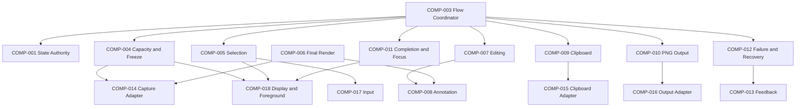

# ARCH-0004 Component Boundaries

狀態：`Accepted`

## 1. Document Control

| Field | Value |
| --- | --- |
| Document ID | `ARCH-0004` |
| Version | `1.1` |
| Architecture stability | `Accepted` |
| Last reviewed | `2026-07-27` |
| Normative references | `ARCH-0001`–`ARCH-0003`、`SPEC-0003`–`SPEC-0010`、`IMPLEMENTATION-CONTRACTS-001` v2.3 |

## 2. Purpose

This document preserves `COMP-001`–`COMP-018` identities while aligning responsibilities with the accepted resident PrintScreen、four-4K capacity、pointer-driven Editing、Clipboard and PNG workflow.

## 3. Component Catalog

| Component | Name | Module | Primary responsibility |
| --- | --- | --- | --- |
| `COMP-001` | Workflow State Authority | `MOD-001` | Sole authority for legal shared-state transitions. |
| `COMP-002` | Session Lifecycle Boundary | `MOD-001` | Own one capture Session identity、cancellation and cleanup request. |
| `COMP-003` | Feature Flow Coordinator | `MOD-002` | Coordinate Capture → SelectionLocked → Editing → commitment order. |
| `COMP-004` | Capture Request、Capacity and Freeze Boundary | `MOD-003` | Validate entry and four-4K topology、then require all display frames before Selection. |
| `COMP-005` | Selection Boundary | `MOD-003` | Own pointer Selection geometry、revision、lock、move、resize、reselection and capacity validation. |
| `COMP-006` | Final Render Boundary | `MOD-003` | Build one alpha-preserving final result from frozen frames、Selection and Annotation revision. |
| `COMP-007` | Editing Session Boundary | `MOD-004` | Own mandatory Editing／confirmation lifecycle and function-bar commands. |
| `COMP-008` | Annotation Document and History Boundary | `MOD-004` | Own pointer-driven Annotation objects、styles、editing、clipping and Undo／Redo. |
| `COMP-009` | Clipboard Handoff Boundary | `MOD-005` | Own Clipboard delivery intent and outcome. |
| `COMP-010` | PNG Output Boundary | `MOD-006` | Own Save As、PNG delivery、retained File Reference and file outcome. |
| `COMP-011` | Completion、Cancellation and Focus Boundary | `MOD-007` | Own success／cancel cleanup and foreground restoration request. |
| `COMP-012` | Failure and Recovery Boundary | `MOD-007` | Classify recoverable、capacity、terminal and stale outcomes. |
| `COMP-013` | Feedback and Accessibility Boundary | `MOD-007` | Define progress、failure feedback、accessible names and non-color-only state. |
| `COMP-014` | Platform Capture Adapter Boundary | `MOD-008` | Acquire immutable per-display frames through platform capture services. |
| `COMP-015` | Platform Clipboard Adapter Boundary | `MOD-009` | Publish WinRT Clipboard content with bounded cancellable retry. |
| `COMP-016` | Platform Output Adapter Boundary | `MOD-010` | Open Windows Save As and write PNG with typed outcomes. |
| `COMP-017` | Platform Input and PrintScreen Boundary | `MOD-011` | Intercept／release PrintScreen and provide pointer、crosshair and Esc input. |
| `COMP-018` | Platform Display and Foreground Context Boundary | `MOD-011` | Enumerate displays、DPI／topology、window exclusion and focus restoration. |

## 4. Shared-state Access

- `COMP-001` is the authority.
- `COMP-002`–`COMP-013` read state or request legal transitions according to responsibility.
- `COMP-014`–`COMP-018` have no direct shared-state access and return typed outcomes only.
- UI code、domain capabilities and platform adapters never set shared state directly.

## 5. Core Component Contracts

### COMP-001 — Workflow State Authority

- Holds current workflow state.
- Accepts only legal transition requests.
- Rejects stale、illegal or mismatched requests.
- Performs no platform or image side effects.

### COMP-002 — Session Lifecycle Boundary

- Establishes Session ID、cancellation context and resource ownership.
- Retains pre-capture foreground reference and Frozen Virtual Desktop context.
- Ends only after successful commitment、Cancel or terminal cleanup.
- Makes cleanup idempotent.

### COMP-003 — Feature Flow Coordinator

```text
ResidentReady
→ CaptureRequested
→ Freezing
→ Selecting
→ SelectionLocked
→ Editing
→ CommittingClipboard OR Saving OR Cancelled
→ ResidentReady
```

It never routes mouse release directly to Clipboard or PNG Output.

### COMP-004 — Capture Request、Capacity and Freeze Boundary

- Accepts enabled PrintScreen or an authorized secondary entry.
- Establishes one display-topology snapshot.
- Enforces `1`–`4` displays、`3840 × 2160` per display、`33,177,600` total source pixels and Virtual Desktop limits.
- Requires one immutable frame for every participating display before Selection.
- Rejects partial、inconsistent、8K or over-capacity results.

### COMP-005 — Selection Boundary

- Stores Selection in Frozen Virtual Desktop coordinates.
- Supports pointer drag、lock、move、four-edge／four-corner resize and reselection.
- Validates dimensional and area limits before lock and output.
- Maintains Selection Revision.
- Produces no Clipboard or file output.
- Keyboard-only manipulation is deferred.

### COMP-006 — Final Render Boundary

- Freezes the current Session、Selection Revision and Annotation Revision for one request.
- Composes all intersecting display frames.
- Produces transparent pixels for physical non-display gaps.
- Clips annotations to Selection.
- Excludes masks、borders、handles、pointer、function bar and SnipPlus windows.
- Revalidates output capacity before allocation.

### COMP-007 — Editing Session Boundary

- Enters after a valid Selection lock.
- Keeps the function bar available until Complete、successful Save or Cancel.
- Allows zero Annotation actions.
- Coordinates pointer Selection adjustment outside Annotation history.
- Does not own a keyboard-only Editing workflow in v1.

### COMP-008 — Annotation Document and History Boundary

- Owns Rectangle、Arrow／Line、Highlighter、Text、Mosaic／Blur and Numbered Marker objects.
- Anchors geometry to Frozen Virtual Desktop coordinates.
- Supports applicable pointer select、move、resize、restyle、delete and edit operations.
- Owns function-bar Annotation-only Undo／Redo.
- Clips output without deleting object data outside Selection.
- Keyboard-created objects and keyboard-only manipulation are deferred.

### COMP-009 — Clipboard Handoff Boundary

- Receives one final rendered result.
- Publishes only after explicit Complete or successful PNG creation in Save.
- Retains Editing state on recoverable failure.
- Does not create files、delete retained PNG files or declare workflow completion.

### COMP-010 — PNG Output Boundary

- Opens Save As in Downloads by default.
- Proposes `SnipPlus_yyyy-MM-dd_HHmmss.png`.
- Supports PNG only in v1.
- Save-dialog cancellation returns to Editing.
- Returns a retained File Reference after successful creation.
- A later Clipboard failure never causes PNG rollback or deletion.

### COMP-011 — Completion、Cancellation and Focus Boundary

- Complete success requires Clipboard success.
- Save success requires PNG and Clipboard success.
- Esc or Cancel produces no output.
- Successful、cancelled and terminal Sessions close capture UI and request focus restoration.
- Does not automatically foreground MainWindow.

### COMP-012 — Failure and Recovery Boundary

- Recoverable render／save／Clipboard failure returns to Editing with state preserved.
- Unsupported capacity or terminal Session failure performs cleanup and returns to `ResidentReady`.
- Stale Session or revision outcomes cannot advance state.
- Partial PNG success is reported accurately and preserves the file.

### COMP-013 — Feedback and Accessibility Boundary

- Success produces no notification.
- Commit work still running after `300 ms` produces non-blocking progress.
- Recoverable failure identifies the failed operation and exposes pointer-based retry／Cancel.
- Required controls have accessible names and state.
- Color is not the only selected／error indicator.
- Complete keyboard-only Annotation acceptance is deferred.

## 6. Platform Component Rules

- `COMP-014`–`COMP-018` expose platform-neutral outcomes.
- Concrete Windows objects do not leak into Core contracts.
- Platform components do not own product retry or completion semantics.
- Interactive verification requires explicit authorization.
- No platform component launches Paint、Notepad or another external GUI fixture during normal product operation or non-interactive tests.

## 7. Dependency Rules



- `COMP-009` and `COMP-010` remain separate; `COMP-003` coordinates Save.
- `COMP-007` and `COMP-008` are required even when the user creates no annotations.
- Components must not form circular dependencies.

## 8. Product Decision Status

No visible v1 decision remains open. Performance、four-4K capacity and deferred keyboard-only scope are fixed by accepted PRD／Specs and may not be silently changed.