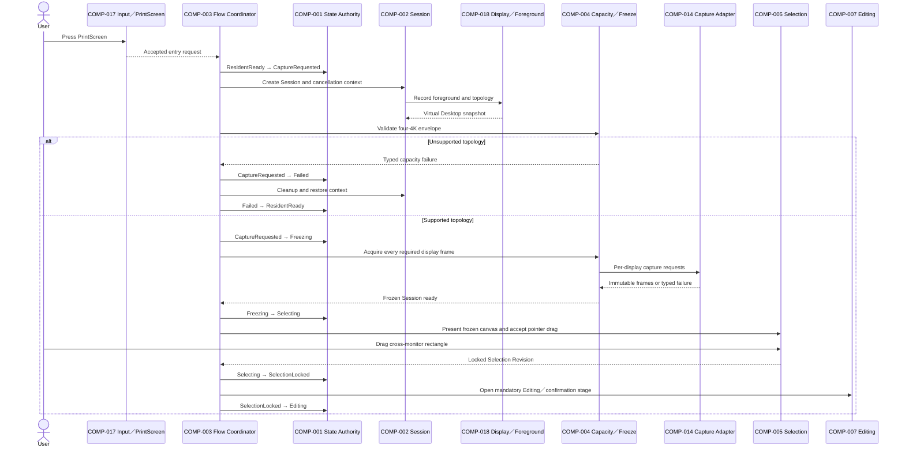
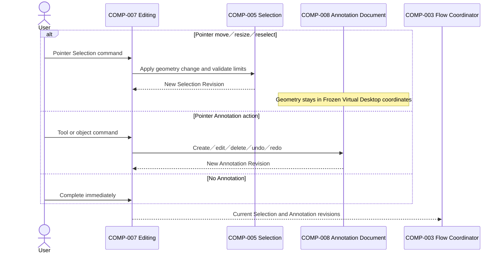

# ARCH-0005 Component Interactions

狀態：`Accepted`

## 1. Document Control

| Field | Value |
| --- | --- |
| Document ID | `ARCH-0005` |
| Version | `1.1` |
| Architecture stability | `Accepted` |
| Last reviewed | `2026-07-27` |
| Normative references | `ARCH-0001`–`ARCH-0004`、`SPEC-0003`–`SPEC-0010`、`IMPLEMENTATION-CONTRACTS-001` v2.3 |

## 2. Interaction Rules

- `COMP-001` alone changes shared workflow state.
- All requests and outcomes carry current Session ID and applicable revision identity.
- Platform components return typed outcomes and never advance shared state.
- Display topology is validated against the four-4K envelope before interactive Selection.
- Mouse release produces a locked Selection Revision only.
- Selection adjustment and Annotation are pointer-driven in v1.
- Editing／confirmation occurs before output commitment.
- Annotation actions may be skipped; Editing may not be skipped.
- Complete and Save use one final rendered result for the current revisions.
- Save coordinates separate PNG and Clipboard capabilities and completes only after both succeed.
- A PNG already created is retained if later Clipboard publication fails.
- Recoverable failure returns to Editing with Session resources and user work preserved.
- Esc or Cancel invalidates later outcomes from that Session.
- Stale outcomes are ignored for state progression and cleaned up.
- Commit work still running after `300 ms` exposes non-blocking progress.
- Keyboard-only Annotation and non-PrintScreen tool／action shortcuts are deferred.

## 3. Primary Capture Sequence



No interaction from Selection or mouse release may invoke Clipboard or PNG Output.

## 4. Selection Adjustment and Annotation Sequence



Selection changes are not inserted into Annotation Undo／Redo history. Keyboard-only object creation or manipulation is not part of v1.

## 5. Complete Sequence

```mermaid
sequenceDiagram
    actor User
    participant Editing as COMP-007 Editing
    participant Flow as COMP-003 Flow Coordinator
    participant State as COMP-001 State Authority
    participant Render as COMP-006 Final Render
    participant Feedback as COMP-013 Feedback
    participant Clipboard as COMP-009 Clipboard Boundary
    participant ClipboardAdapter as COMP-015 Clipboard Adapter
    participant End as COMP-011 Completion／Focus

    User->>Editing: Complete
    Editing-->>Flow: Commit current revisions
    Flow->>State: Editing → CommittingClipboard
    Flow->>Render: Validate capacity and render final image
    opt Operation reaches 300 ms
        Flow->>Feedback: Show non-blocking progress
    end
    Render-->>Flow: Final Result ID or typed failure
    Flow->>Clipboard: Publish final result
    Clipboard->>ClipboardAdapter: WinRT Clipboard request
    ClipboardAdapter-->>Clipboard: Delivered or failure
    alt Delivered
        Clipboard-->>Flow: Success
        Flow->>State: CommittingClipboard → Completed
        Flow->>End: Cleanup and restore foreground context
        End->>State: Completed → ResidentReady
    else Recoverable failure
        Clipboard-->>Flow: Failure
        Flow->>State: CommittingClipboard → Editing
        Note over Editing: Preserve frames、Selection and annotations
    end
```

Complete creates no file and produces no success notification.

## 6. Save Sequence

```mermaid
sequenceDiagram
    actor User
    participant Editing as COMP-007 Editing
    participant Flow as COMP-003 Flow Coordinator
    participant State as COMP-001 State Authority
    participant Render as COMP-006 Final Render
    participant Output as COMP-010 PNG Output
    participant OutputAdapter as COMP-016 Output Adapter
    participant Clipboard as COMP-009 Clipboard Boundary
    participant ClipboardAdapter as COMP-015 Clipboard Adapter
    participant End as COMP-011 Completion／Focus

    User->>Editing: Save
    Editing-->>Flow: Commit current revisions for Save
    Flow->>State: Editing → Saving
    Flow->>Render: Validate capacity and render final image
    Render-->>Flow: Final Result ID
    Flow->>Output: Open Save As in Downloads and write PNG
    Output->>OutputAdapter: Save request
    alt Save As cancelled
        OutputAdapter-->>Output: Cancelled
        Output-->>Flow: Return to Editing without error
        Flow->>State: Saving → Editing
    else PNG failed
        OutputAdapter-->>Output: Failure
        Output-->>Flow: Recoverable failure
        Flow->>State: Saving → Editing
    else PNG succeeded
        OutputAdapter-->>Output: Retained File Reference
        Output-->>Flow: PNG success
        Flow->>Clipboard: Publish same Final Result ID
        Clipboard->>ClipboardAdapter: Clipboard request
        alt Clipboard succeeded
            ClipboardAdapter-->>Clipboard: Delivered
            Clipboard-->>Flow: Success
            Flow->>State: Saving → Completed
            Flow->>End: Cleanup and restore foreground context
            End->>State: Completed → ResidentReady
        else Clipboard failed
            ClipboardAdapter-->>Clipboard: Failure
            Clipboard-->>Flow: Recoverable failure with retained file
            Flow->>State: Saving → Editing
            Note over Flow: Retain PNG; report Clipboard failure
        end
    end
```

PNG and Clipboard use the same rendered Result ID. Neither platform adapter owns product completion.

## 7. Cancel Sequence

```mermaid
sequenceDiagram
    actor User
    participant Input as COMP-017 Input／PrintScreen
    participant Flow as COMP-003 Flow Coordinator
    participant State as COMP-001 State Authority
    participant Session as COMP-002 Session
    participant End as COMP-011 Completion／Focus

    User->>Input: Esc or Cancel
    Input-->>Flow: Cancel current Session
    Flow->>State: Current active state → Cancelled
    Flow->>Session: Cancel and invalidate pending outcomes
    Session-->>Flow: Idempotent cleanup complete
    Flow->>End: Close capture UI and restore previous application
    End->>State: Cancelled → ResidentReady
```

Esc cancels before Selection、during drag and during SelectionLocked／Editing. V1 does not require a first-Esc transient keyboard-editing hierarchy.

## 8. Capacity、Failure and Stale Outcomes

- Unsupported display topology before Selection → typed terminal failure、cleanup、actionable four-4K limit feedback and focus restoration.
- Capacity-exceeding Selection before lock or render → no allocation／commit、cleanup or return to Editing as defined by the owning Spec.
- Recoverable render／save／Clipboard failure → Editing with current revisions preserved.
- Save-dialog cancellation → Editing without error feedback.
- Clipboard failure after PNG success → Editing with retained File Reference.
- Outcome Session ID or revision mismatch → classify as stale、do not advance state、dispose returned resources.
- Focus restoration failure → report concisely without repeated focus stealing.

## 9. Prohibited Interactions

- UI code directly changing shared workflow state.
- Platform adapters declaring workflow completion.
- Selection release invoking Clipboard or PNG Output.
- Partial、downscaled or omitted-display capture when topology is unsupported.
- Annotation geometry being rescaled because Selection changed.
- Clipboard publication before Complete or successful PNG creation in Save.
- PNG Output mutating Clipboard directly.
- Clipboard Handoff creating or deleting files.
- Deleting a retained PNG after later Clipboard failure.
- A stale callback completing a newer or cancelled Session.
- Adding deferred keyboard-only Annotation shortcuts without a later product decision.
- Normal operation or non-interactive verification launching an external GUI fixture.

## 10. Verification Boundary

Unit and contract tests verify sequencing、capacity、state legality、revision identity、failure preservation、progress and cleanup with synthetic inputs. Performance uses 3 warm-ups and at least 30 measured runs. Owner Reference、Standard／Maximum multi-display behavior and foreground restoration require explicitly authorized Windows runtime verification.