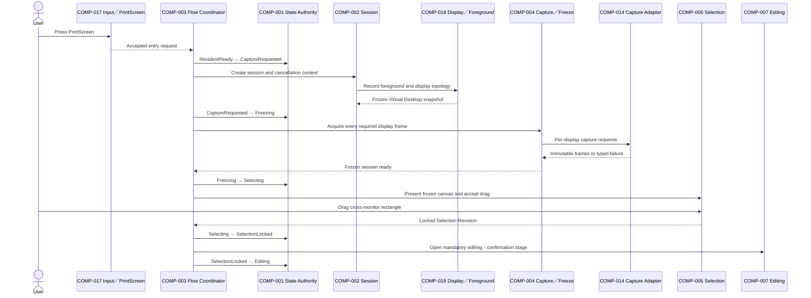
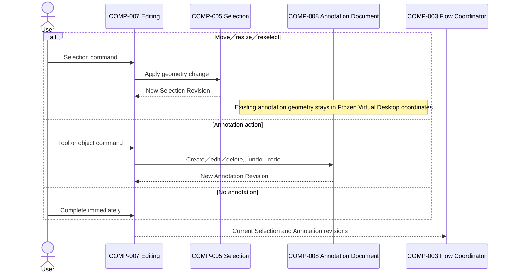

# ARCH-0005 Component Interactions

狀態：`Accepted`

## 1. Document Control

| Field | Value |
| --- | --- |
| Document ID | `ARCH-0005` |
| Version | `1.0` |
| Architecture stability | `Accepted` |
| Last reviewed | `2026-07-27` |
| Normative references | `ARCH-0001`–`ARCH-0004`、`SPEC-0003`–`SPEC-0010`、`IMPLEMENTATION-CONTRACTS-001` |

## 2. Purpose

This document fixes the legal direction and sequencing of component interactions for the accepted v1 workflow. It supersedes the earlier interaction model that treated Annotation as an optional post-capture branch and Clipboard／Output as automatic parallel downstream paths after selection.

## 3. Interaction Rules

- `COMP-001` alone changes shared workflow state.
- All requests and outcomes carry the current Session ID and applicable revision identity.
- Platform components return typed outcomes and never advance workflow state.
- Mouse release produces a locked Selection Revision only.
- Editing／confirmation occurs before output commitment.
- Annotation actions may be skipped; the Editing stage may not be skipped.
- Complete and Save use one final rendered result for the current revision.
- Save coordinates separate PNG and Clipboard capabilities and completes only after both succeed.
- Recoverable failure returns to Editing with session resources and user work preserved.
- Cancel invalidates later outcomes from that session.
- Stale outcomes are ignored for state progression and their resources are cleaned up.

## 4. Primary Capture Sequence



No interaction from `Selection` or mouse release may invoke Clipboard or PNG Output.

## 5. Selection Adjustment and Annotation Sequence



Selection geometry changes are not inserted into Annotation Undo／Redo history.

## 6. Complete Sequence

```mermaid
sequenceDiagram
    actor User
    participant Editing as COMP-007 Editing
    participant Flow as COMP-003 Flow Coordinator
    participant State as COMP-001 State Authority
    participant Render as COMP-006 Final Render
    participant Clipboard as COMP-009 Clipboard Boundary
    participant ClipboardAdapter as COMP-015 Clipboard Adapter
    participant End as COMP-011 Completion／Focus

    User->>Editing: Complete
    Editing-->>Flow: Commit current revisions
    Flow->>State: Editing → CommittingClipboard
    Flow->>Render: Render final selected and annotated image
    Render-->>Flow: Final Result ID
    Flow->>Clipboard: Publish final result
    Clipboard->>ClipboardAdapter: WinRT Clipboard request
    ClipboardAdapter-->>Clipboard: Delivered or typed failure
    alt Delivered
        Clipboard-->>Flow: Success
        Flow->>State: CommittingClipboard → Completed
        Flow->>End: Cleanup and restore foreground context
        End->>State: Completed → ResidentReady
    else Recoverable failure
        Clipboard-->>Flow: Retryable failure
        Flow->>State: CommittingClipboard → Editing
        Note over Editing: Preserve frozen frames、selection and annotations
    end
```

Complete creates no file and produces no success notification.

## 7. Save Sequence

```mermaid
sequenceDiagram
    actor User
    participant Editing as COMP-007 Editing
    participant Flow as COMP-003 Flow Coordinator
    participant State as COMP-001 State Authority
    participant Render as COMP-006 Final Render
    participant Output as COMP-010 PNG Output
    participant OutputAdapter as COMP-016 Output Adapter
    participant Clipboard as COMP-009 Clipboard Boundary
    participant ClipboardAdapter as COMP-015 Clipboard Adapter
    participant End as COMP-011 Completion／Focus

    User->>Editing: Save
    Editing-->>Flow: Commit current revisions for Save
    Flow->>State: Editing → Saving
    Flow->>Render: Render final selected and annotated image
    Render-->>Flow: Final Result ID
    Flow->>Output: Open Save As and write PNG
    Output->>OutputAdapter: Save request
    alt Save As cancelled
        OutputAdapter-->>Output: Cancelled
        Output-->>Flow: Return to Editing without error
        Flow->>State: Saving → Editing
    else PNG failed
        OutputAdapter-->>Output: Failure
        Output-->>Flow: Recoverable failure
        Flow->>State: Saving → Editing
    else PNG succeeded
        OutputAdapter-->>Output: File delivered
        Output-->>Flow: PNG success
        Flow->>Clipboard: Publish the same Final Result ID
        Clipboard->>ClipboardAdapter: Clipboard request
        alt Clipboard succeeded
            ClipboardAdapter-->>Clipboard: Delivered
            Clipboard-->>Flow: Success
            Flow->>State: Saving → Completed
            Flow->>End: Cleanup and restore foreground context
            End->>State: Completed → ResidentReady
        else Clipboard failed
            ClipboardAdapter-->>Clipboard: Failure
            Clipboard-->>Flow: Recoverable failure
            Flow->>State: Saving → Editing
            Note over Flow: PNG retention／rollback is unresolved and must not be guessed
        end
    end
```

PNG and Clipboard use the same rendered result identity. The platform adapters remain independent; workflow coordination owns the required Save sequence.

## 8. Cancel Sequence

```mermaid
sequenceDiagram
    actor User
    participant Input as COMP-017 Input／PrintScreen
    participant Flow as COMP-003 Flow Coordinator
    participant State as COMP-001 State Authority
    participant Session as COMP-002 Session
    participant End as COMP-011 Completion／Focus

    User->>Input: Esc or Cancel
    Input-->>Flow: Cancel current session
    Flow->>State: Current active state → Cancelled
    Flow->>Session: Cancel and invalidate pending outcomes
    Session-->>Flow: Idempotent cleanup complete
    Flow->>End: Close capture UI and restore previous application
    End->>State: Cancelled → ResidentReady
```

Cancel writes no Clipboard、creates no file and does not automatically show the SnipPlus main window.

## 9. Failure and Stale-outcome Sequence

- Capture／topology inconsistency before Selection → terminal failure、cleanup、focus restoration.
- Recoverable render／save／Clipboard failure → Editing with current revisions preserved.
- Save-dialog cancellation → Editing without error feedback.
- Outcome Session ID or revision mismatch → classify as stale、do not advance state、dispose returned resources.
- Focus restoration failure → report concisely without repeated focus stealing.

## 10. Prohibited Interactions

- UI code directly changing shared workflow state.
- `COMP-014`–`COMP-018` declaring workflow completion.
- Selection release invoking `COMP-009` or `COMP-010`.
- Annotation geometry being rescaled because the selection changed.
- Clipboard publication before Complete or successful PNG creation in Save.
- PNG Output mutating Clipboard directly.
- Clipboard Handoff creating or deleting files.
- A stale callback completing a newer or cancelled session.
- Normal operation or non-interactive verification launching Paint、Notepad or another external GUI fixture.

## 11. Verification Boundary

Unit and contract tests should verify sequencing、state legality、revision identity、failure preservation and cleanup with synthetic inputs. Multi-display platform behavior and foreground restoration require explicitly authorized Windows runtime verification.
