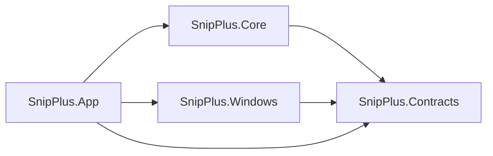

# SnipPlus Project Structure and Toolchain Baseline

## Document Control

| Field | Value |
| --- | --- |
| Document ID | `PROJECT-STRUCTURE-001` |
| Status | `Accepted` |
| Version | `1.1` |
| Owner | Repository owner |
| Last reviewed | `2026-07-27` |
| Scope | Current SnipPlus v1 implementation、build and test baseline |
| Normative references | Accepted PRD／Specs、`ARCH-0001`–`ARCH-0005`、ADR-0002 through ADR-0007、`IMPLEMENTATION-CONTRACTS-001` |

## 1. Purpose

This document records the current solution、project dependency direction、toolchain and build／test baseline. The projects already exist. It does not authorize a specific coding or runtime task; task execution remains controlled by `AGENTS.md` and the current user instruction.

## 2. Toolchain Baseline

| Item | Accepted baseline |
| --- | --- |
| Language | C# 14 |
| .NET SDK | 10.0.302 pinned through `global.json` |
| Target framework | `net10.0-windows10.0.26100.0` |
| Current Windows baseline | Windows 11 24H2／build 26100 x64 |
| Windows App SDK | 2.3.1 stable |
| Win2D | `Microsoft.Graphics.Win2D` 1.4.0 |
| Test SDK | `MSTest.Sdk` 4.1.0 |
| Test platform | Microsoft.Testing.Platform |
| Process architecture | x64 for the current implementation baseline |
| Build configurations | Debug and Release |
| Nullable | Enabled |
| Package management | Central Package Management |
| Restore | Lock files enabled and committed |

This is not the final public support matrix. ARM64、older Windows support and broader compatibility require later explicit review.

## 3. Packaging and Runtime Model

Current development model:

- WinUI 3 single-project MSIX application.
- Framework-dependent Windows App SDK deployment.
- Development／test package identity.
- x64 package baseline.

Release signing、Store identity、installer、distribution and update strategy remain deferred. Development certificates or signing secrets are not committed.

## 4. Repository Layout

```text
SnipPlus/
├─ SnipPlus.sln
├─ global.json
├─ Directory.Build.props
├─ Directory.Packages.props
├─ .editorconfig
├─ src/
│  ├─ SnipPlus.Contracts/
│  ├─ SnipPlus.Core/
│  ├─ SnipPlus.Windows/
│  └─ SnipPlus.App/
├─ tests/
│  ├─ SnipPlus.Contracts.Tests/
│  ├─ SnipPlus.Core.Tests/
│  └─ SnipPlus.Windows.Tests/
├─ PRD/
├─ Specs/
├─ Architecture/
└─ docs/
```

No additional source project is created until a demonstrated dependency、deployment or test-isolation need exists.

## 5. Project Responsibilities

### `SnipPlus.Contracts`

Owns platform-neutral cross-project contracts:

- workflow state and outcomes;
- capture session、Virtual Desktop、display snapshot and frame identity;
- selection and revision identities;
- annotation document／object contracts where cross-project exchange is required;
- image results and final-render requests;
- Clipboard and PNG output requests／results;
- failure、retry、cancellation and cleanup outcomes.

Must not reference WinUI、WGC、Win2D、DataPackage、Save Picker or filesystem implementation types.

### `SnipPlus.Core`

Owns product and domain behavior:

- `COMP-001` Workflow State Authority;
- session and feature coordination;
- Virtual Desktop／selection rules;
- editing／annotation rules and history;
- commitment sequencing;
- failure classification、stale-revision protection and cleanup orchestration.

Depends only on `SnipPlus.Contracts`.

### `SnipPlus.Windows`

Owns reusable Windows platform adapters:

- display／DPI／foreground context;
- Windows.Graphics.Capture;
- image conversion、crop、composition and PNG encoding;
- WinRT Clipboard;
- Windows Save As／file delivery;
- platform input boundaries where they do not require App-window ownership.

Depends on `SnipPlus.Contracts` plus accepted platform packages. It does not mutate shared state or declare product completion.

### `SnipPlus.App`

Owns application composition and WinUI presentation:

- application and resident-window lifecycle composition;
- main window、capture overlays and function bar;
- wiring Core to Windows adapters;
- UI input translation into product intents;
- accessible control presentation.

It must not embed product state transitions or platform-independent annotation rules in code-behind.

## 6. Project Dependency Direction



Rules:

- Contracts depends on no source project.
- Core does not reference Windows or App.
- Windows does not reference Core or App.
- App is the composition root.
- No circular references.

## 7. Test Project Responsibilities

### `SnipPlus.Contracts.Tests`

- contract defaults and invariants;
- required IDs and value validation;
- ownership and disposal semantics;
- platform-neutral serialization／equality behavior only when explicitly introduced.

### `SnipPlus.Core.Tests`

- legal state transitions;
- session and revision identity;
- Virtual Desktop mapping and selection geometry;
- Annotation document and Undo／Redo;
- Complete／Save sequencing;
- cancellation、failure preservation and stale-outcome rejection.

### `SnipPlus.Windows.Tests`

- image conversion、crop、render and PNG behavior;
- Clipboard retry and privacy options;
- platform adapter outcomes;
- explicitly categorized interactive tests for WGC、PrintScreen、display topology and focus restoration.

Interactive tests never run as part of the default non-interactive test command.

## 8. Authorized Commands

Run only when the current task explicitly authorizes them:

```powershell
dotnet restore SnipPlus.sln --locked-mode
dotnet build SnipPlus.sln -c Release -p:Platform=x64 --no-restore
dotnet test SnipPlus.sln -c Release -p:Platform=x64 --no-build -- --filter "TestCategory!=Interactive&TestCategory!=Manual"
dotnet format SnipPlus.sln --verify-no-changes --no-restore
```

## 9. Current Implementation Note

The current project structure is valid and does not need replacement for the accepted v1 correction. Existing code inside the projects is only partially conforming; row-level status is maintained by `PRD/PRD-TRACEABILITY-MATRIX.md`.

Do not add a new project merely to avoid correcting obsolete workflow code in the existing ownership boundary.
