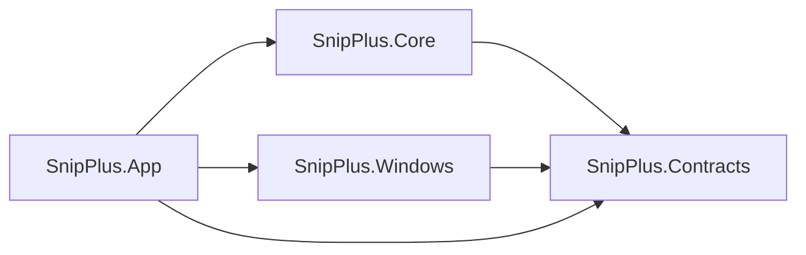

# SnipPlus Project Structure and Toolchain Baseline

## Document Control

| Field | Value |
| --- | --- |
| Document ID | PROJECT-STRUCTURE-001 |
| Status | Accepted |
| Version | 1.0 |
| Owner | Repository owner |
| Date accepted | 2026-07-26 |
| Scope | First vertical slice development, build and test baseline |
| Normative References | Frozen PRD／Specs、ARCH-0002 through ARCH-0005、ADR-0002 through ADR-0007、IMPLEMENTATION-CONTRACTS-001 |
| Implementation authorized | No; owned by the Implementation Readiness Review |

## 1. Purpose

This document fixes the minimum language、SDK、dependency、solution and project boundaries required to create a reproducible first vertical slice. It maps existing Modules and Components to projects without changing Architecture ownership.

## 2. Toolchain Baseline

| Item | Accepted baseline |
| --- | --- |
| Language | C# 14 |
| .NET SDK | 10.0.302, pinned through `global.json` with roll-forward limited to latest patch in the feature band |
| Target framework | `net10.0-windows10.0.26100.0` |
| First-slice minimum OS | Windows 11 version 24H2 / build 26100 |
| Windows SDK target | 10.0.26100 or newer installed supported SDK; project target remains 26100 |
| Windows App SDK | 2.3.1 stable |
| Win2D | `Microsoft.Graphics.Win2D` 1.4.0 |
| Test SDK | `MSTest.Sdk` 4.1.0 |
| Test platform | Microsoft.Testing.Platform only |
| Process architecture | x64 only for the first vertical slice |
| Build configurations | Debug and Release |
| Nullable | Enabled |
| Implicit usings | Enabled where appropriate |
| Warnings | Treat repository-owned code warnings as errors; generated WinUI code excluded where necessary |
| Package management | Central Package Management through `Directory.Packages.props` |
| Dependency restore | Lock files enabled and committed for reproducibility |

This is an implementation baseline, not the final public support matrix. Expanding below Windows 11 24H2、adding ARM64 or changing the canonical toolchain requires an explicit compatibility review, not silent project edits.

## 3. Packaging and Runtime Model

The first vertical slice uses：

- WinUI 3 single-project MSIX.
- Framework-dependent Windows App SDK deployment.
- Development/test package identity.
- x64 package only.

Reasons：

- It follows the default WinUI 3 project model.
- Package identity and dependency installation are explicit.
- It avoids adding unpackaged bootstrapper/runtime deployment complexity to the first slice.
- It does not predetermine final Store、enterprise or direct-download distribution.

Rules：

- Development signing certificates or signing secrets are not committed.
- Release signing、Store identity、installer、update and distribution remain deferred to TD-010 Packaging.
- CI may build the package but must not publish or deploy it without explicit release authorization.

## 4. Repository Layout

```text
SnipPlus/
├─ SnipPlus.sln
├─ global.json
├─ Directory.Build.props
├─ Directory.Packages.props
├─ .editorconfig
├─ src/
│  ├─ SnipPlus.Contracts/
│  │  └─ SnipPlus.Contracts.csproj
│  ├─ SnipPlus.Core/
│  │  └─ SnipPlus.Core.csproj
│  ├─ SnipPlus.Windows/
│  │  └─ SnipPlus.Windows.csproj
│  └─ SnipPlus.App/
│     ├─ SnipPlus.App.csproj
│     ├─ Package.appxmanifest
│     └─ Assets/
├─ tests/
│  ├─ SnipPlus.Contracts.Tests/
│  │  └─ SnipPlus.Contracts.Tests.csproj
│  ├─ SnipPlus.Core.Tests/
│  │  └─ SnipPlus.Core.Tests.csproj
│  └─ SnipPlus.Windows.Tests/
│     └─ SnipPlus.Windows.Tests.csproj
├─ test-assets/
│  └─ synthetic/
├─ artifacts/                 # ignored build/test output
└─ docs/ and Architecture/
```

No additional source project is created until a demonstrated dependency or build-isolation need exists.

## 5. Project Responsibilities

### SnipPlus.Contracts

Owns stable cross-project semantic types from IMPLEMENTATION-CONTRACTS-001：

- Workflow state and transition requests.
- CaptureIntent and CaptureOutcome.
- ImageResult metadata and lifetime abstractions.
- RenderIntent and RenderOutcome.
- Clipboard／Output request and result contracts.
- Failure、recoverability and retry semantics.
- Platform context abstractions.

It contains no WGC、Win2D、Composition、Clipboard or file-system implementation.

### SnipPlus.Core

Owns Product Workflow、Feature Coordination and Domain Capability behavior：

- MOD-001 through MOD-007.
- COMP-001 through COMP-013.
- State authority、session lifecycle and feature coordination.
- Selection and coordinate-domain validation.
- Capture result publication semantics.
- Optional annotation semantics.
- Clipboard/Output handoff semantics.
- Completion、cancellation、failure classification and feedback requirements.

It depends only on `SnipPlus.Contracts` and .NET base libraries.

### SnipPlus.Windows

Owns Windows-specific implementation and the rendering adapter：

- MOD-008 through MOD-011.
- COMP-014 through COMP-018.
- WGC capture adapter.
- WinUI/Win32 monitor、DPI、focus and input context adapters.
- ADR-0003 Composition/Win2D renderer.
- ADR-0005 SoftwareBitmap conversion/encoding support.
- ADR-0006 DataPackage Clipboard adapter.
- Optional Output adapter when the first output task is authorized.

It depends on `SnipPlus.Contracts`、Windows App SDK、Win2D and Windows platform APIs. It does not depend on `SnipPlus.Core`.

### SnipPlus.App

Owns：

- WinUI 3 application host and package manifest.
- Presentation composition.
- Dependency composition root.
- UI dispatcher integration.
- User command entry and visible feedback.

It references Contracts、Core and Windows. It contains no domain state authority or reusable platform implementation.

## 6. Project Dependency Graph



Prohibited：

- Contracts depending on any source project.
- Core depending on Windows or App.
- Windows depending on Core or App.
- Circular references.
- App becoming the owner of workflow/domain/platform contracts.

## 7. Component-to-Project Mapping

| Components | Project |
| --- | --- |
| COMP-001 through COMP-013 | SnipPlus.Core |
| COMP-014 Platform Capture Adapter | SnipPlus.Windows |
| COMP-015 Platform Clipboard Adapter | SnipPlus.Windows |
| COMP-016 Platform Output Adapter | SnipPlus.Windows |
| COMP-017 Platform Input Boundary | SnipPlus.Windows |
| COMP-018 Platform Display Context Boundary | SnipPlus.Windows |
| Cross-component contract types | SnipPlus.Contracts |
| WinUI presentation and composition root | SnipPlus.App |

Rendering is an accepted technical adapter inside `SnipPlus.Windows`; it does not create a new Architecture Module or Component ID.

## 8. Test Project Mapping

### SnipPlus.Contracts.Tests

- Contract invariants.
- Serialization-free value semantics.
- Pixel/alpha metadata validation.
- Failure/retry contract behavior.

### SnipPlus.Core.Tests

- COMP-001 state authority.
- Session lifecycle and legal transitions.
- Selection/coordinate calculations.
- Coordination、cancel、failure and retry decisions.
- Clipboard/Output independence.

### SnipPlus.Windows.Tests

- Deterministic renderer and synthetic pixel tests.
- SoftwareBitmap conversion/encoding.
- Category-filtered WGC and Clipboard platform integration tests.
- Resource cleanup and dispatcher/apartment behavior.

The WinUI App project has no separate test project initially. Presentation logic that needs automated tests must be moved into Core or a testable Contracts/Windows boundary rather than requiring full UI automation by default.

## 9. Package References

Central versions include at minimum：

| Package / SDK | Version | Consumer |
| --- | --- | --- |
| Microsoft.WindowsAppSDK | 2.3.1 | SnipPlus.App、SnipPlus.Windows as required by template/build |
| Microsoft.Graphics.Win2D | 1.4.0 | SnipPlus.Windows |
| MSTest.Sdk | 4.1.0 | All test projects through global.json SDK mapping |

No third-party DI、logging、reactive、MVVM、graphics、retry or serialization package is added to the initial slice. Use platform/.NET primitives until a concrete need and trade-off are demonstrated.

## 10. Configuration Files

### global.json

Must pin：

- .NET SDK `10.0.302`.
- `rollForward` no broader than `latestPatch` or the agreed feature-band policy.
- `MSTest.Sdk` `4.1.0` under `msbuild-sdks`.

### Directory.Build.props

Must centralize：

- Target framework.
- x64 platform.
- Nullable and implicit usings.
- Deterministic build.
- Warnings-as-errors policy.
- Analysis level.
- Repository and artifacts paths.

### Directory.Packages.props

Must enable central package management and pin every direct package version.

### .editorconfig

Must define formatting、naming and analyzer severity without overriding generated WinUI files incorrectly.

## 11. Build and Test Commands

These commands become authorized only after the Implementation Readiness Review and an explicit coding task：

```powershell
dotnet restore SnipPlus.sln --locked-mode
dotnet build SnipPlus.sln -c Release -p:Platform=x64 --no-restore
dotnet test SnipPlus.sln -c Release -p:Platform=x64 --no-build -- --filter "TestCategory!=Interactive&TestCategory!=Manual"
dotnet format SnipPlus.sln --verify-no-changes --no-restore
```

Interactive platform tests use a separate explicit command/filter in an authorized Windows desktop session.

## 12. CI Baseline

Required jobs after source creation：

1. Markdown and link checks.
2. Locked restore.
3. Release x64 build.
4. Unit、Contract and deterministic Rendering tests.
5. Formatting verification.
6. Upload TRX、coverage and approved synthetic diff artifacts.

Interactive WGC/Clipboard verification remains a separate Windows-session job or explicit local verification until a suitable secure runner is established.

## 13. First Vertical Slice Build Boundary

The first implementation task may create only：

- The listed solution/configuration files.
- The seven listed source/test projects.
- Minimal app shell and dependency composition.
- Contracts and implementations necessary for the approved first vertical slice.
- Synthetic test assets and test code.

It must not add global hotkeys、advanced annotation tools、multi-monitor stitching、telemetry、cloud、update or release infrastructure.

## 14. Revisit Conditions

Review this baseline if：

- Official package compatibility blocks the selected versions.
- Build evidence shows .NET 10／Windows App SDK 2.3.1／Win2D 1.4.0 incompatibility.
- ARM64 becomes a required target.
- The minimum Windows support policy changes.
- Project boundaries cause a verified dependency cycle or unacceptable build friction.
- Packaging ADR selects a different long-term deployment model.

A failed initial restore/build may adjust patch-level versions through a documented corrective change; it must not silently change Accepted architectural decisions.

## 15. Acceptance Verification

| Check | Result |
| --- | --- |
| Language/runtime/SDK versions fixed | PASS |
| Project mapping preserves Modules/Components | PASS |
| Dependency graph acyclic | PASS |
| Platform implementation isolated | PASS |
| Test projects and commands defined | PASS |
| Packaging development model defined | PASS |
| First-slice boundary defined | PASS |
| Build/runtime evidence already exists | No |
| Coding authorized by this document | No |
