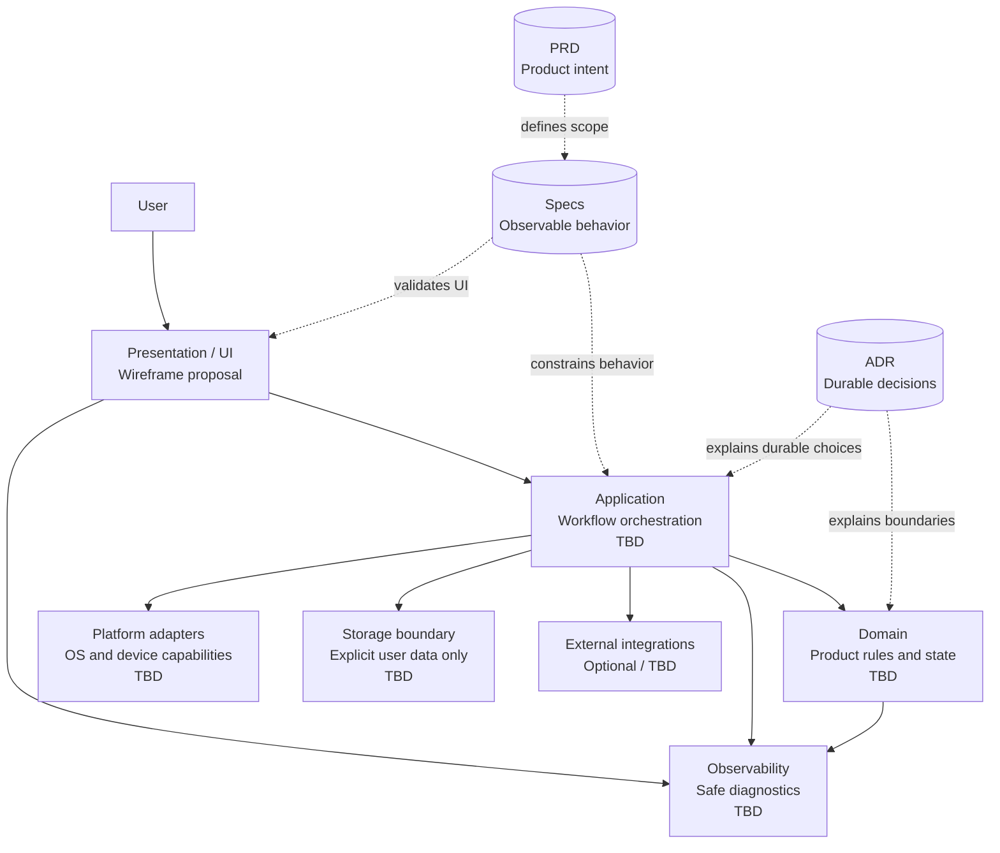

# Mermaid Architecture Diagram

狀態：`Proposal`

下圖是目前的邏輯架構基線。虛線節點代表尚未選定或尚未實作的邊界；它不描述現有 runtime。

## Reading notes

- `PRD` 決定做什麼與為什麼做。
- `Specs` 定義使用者可觀察、可驗收的行為。
- `UI` 只負責呈現與輸入，不承擔平台或保存細節。
- `Application` 協調流程；`Domain` 保持產品規則的獨立性。
- `Platform`、`Storage` 與 `External` 都是副作用邊界，是否存在取決於後續核准的需求。
- `ADR` 記錄不能只靠圖看出的原因與取捨。
