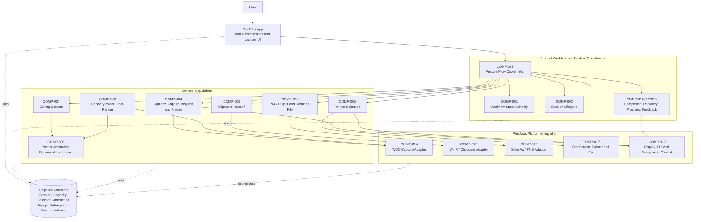
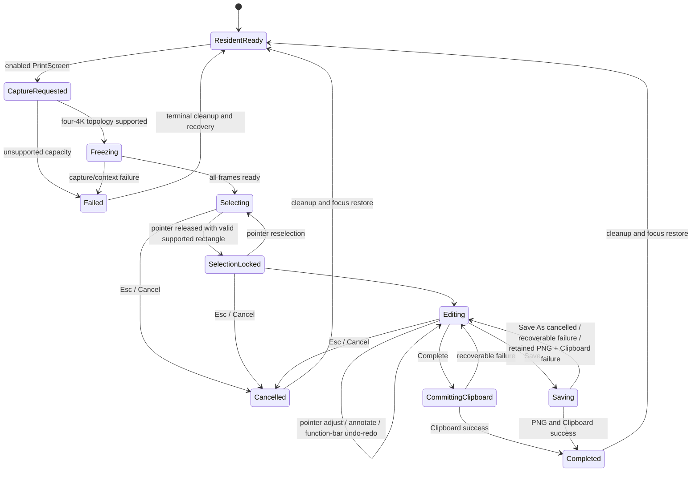
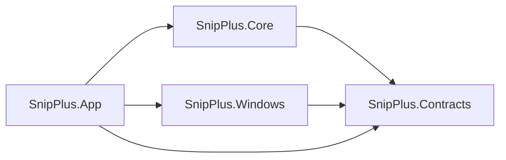

# Mermaid Architecture Diagram

狀態：`Accepted`

The diagram represents the accepted SnipPlus v1 responsibility and dependency baseline. It does not claim that every component is implemented.

## 1. Layer and Capability Diagram

## 2. Accepted Workflow Diagram

There is no legal transition from mouse release directly to Clipboard or file output. Unsupported capacity never becomes partial Selection.

## 3. Quality and Scope Notes

- Supported source topology: up to four logical displays、each no larger than `3840 × 2160`.
- Owner Reference runtime profile: primary `2560 × 1440`、lower `1920 × 1080` at `150%` scaling、left `2560 × 1440`.
- Non-display gaps render transparently.
- Commit work still running after `300 ms` exposes non-blocking progress.
- V1 Selection adjustment and Annotation are pointer-driven.
- PrintScreen and Esc are required; keyboard-only Annotation and non-PrintScreen shortcuts are deferred.

## 4. Project Dependency Diagram

Rules:

- `SnipPlus.Contracts` depends on no source project.
- `SnipPlus.Core` contains product and domain rules without concrete Windows types.
- `SnipPlus.Windows` provides platform adapters and does not mutate shared workflow state.
- `SnipPlus.App` composes UI and adapters but does not own product semantics.
- No circular project references.

## 5. Current Conformance Note

Current source implements only one-display capture、same-frame crop、basic mask presentation、image／PNG foundations、Clipboard retry and an earlier state graph. Missing or obsolete areas are tracked in `PRD/PRD-TRACEABILITY-MATRIX.md`. Keyboard-only Annotation is deferred and is not a missing v1 item.