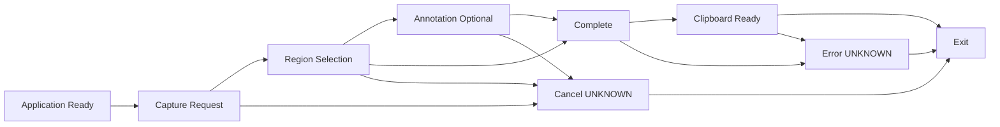

# PRD-0004 Core Workflow

狀態：`Draft`

這份文件回答唯一問題：SnipPlus 的核心使用流程是什麼？

它不描述 Win11 的完整實作行為、不設計 Toolbar、Overlay 或 Annotation 工具，也不建立 Functional Requirements、Specs 或程式碼。

## 1. Workflow Scope

核心流程涵蓋以下高階狀態：

```text
Application Ready ↓ Capture ↓ Annotation ↓ Complete ↓ Clipboard ↓ Exit
```

展開後的產品流程邊界為：

```text
Application Ready
    ↓
Capture Request
    ↓
Region Selection
    ↓
Annotation（Optional）
    ↓
Complete
    ↓
Clipboard Ready
    ↓
Exit
```

`Annotation` 是可選的流程位置，不代表任何 annotation tool、toolbar、arrow、OCR 或 editor capability 已被定義。

## 2. Primary Workflow

### Mermaid workflow



### Primary sequence

1. `Application Ready`：使用者可以開始一次 capture workflow。
2. `Capture Request`：使用者透過合法入口提出 capture request。
3. `Region Selection`：使用者定義要取得的影像範圍或選擇已核准的 capture scope。
4. `Annotation`：使用者可以選擇是否進入後續處理；本階段不決定工具內容。
5. `Complete`：capture result 完成。
6. `Clipboard Ready`：結果可交付到 clipboard 或下一個工作脈絡。
7. `Exit`：使用者離開本次 workflow。

取消與錯誤是必要的流程邊界，但目前實際狀態轉換與恢復行為仍為 `UNKNOWN`。

## 3. Entry Points

目前只列出既有 Research 與 Decision 已支持的入口概念；尚未確認的行為不自行補完：

- `PrintScreen / PrtSc`：採用為 Windows 使用者熟悉的 capture entry 概念；目前實際行為存在來源差異，保留為 `UNKNOWN`。
- `Windows logo key + Shift + S`：Research 已記錄為 Snipping Tool capture entry；SnipPlus 是否使用相同快捷鍵仍需後續確認。
- 從 Windows Start 或應用程式流程開始：Research 已記錄為工具啟動入口；SnipPlus 的正式 app entry 尚未定義。
- 其他入口：`TBD`。

`Windows logo key + Shift + R` 屬於 video capture path，不在本 static image core workflow 內。

## 4. Exit Points

| Exit point | Meaning | Status |
| --- | --- | --- |
| `Complete` | Capture result 已產生，流程可繼續交付。 | Defined at workflow level |
| `Clipboard Ready` | 結果可交付到 clipboard 或下一個工作脈絡。 | Defined at workflow level |
| `Exit` | 使用者離開本次 workflow。 | Defined at workflow level；close side effects `UNKNOWN` |
| `Cancel` | 使用者在完成前放棄本次 workflow。 | `UNKNOWN`；保留為必要邊界 |
| `Error` | 流程無法正常完成。 | `UNKNOWN`；失敗與 recovery 尚未定義 |

## 5. Workflow States

| State | Purpose | Entry | Exit |
| --- | --- | --- | --- |
| `Application Ready` | 讓使用者開始一次 capture workflow。 | 應用程式或入口可用。 | `Capture Request`。 |
| `Capture Request` | 接收使用者的 capture intent。 | 使用者觸發合法入口。 | `Region Selection`、`Cancel` 或 `Error`。 |
| `Region Selection` | 讓使用者定義要取得的範圍或 scope。 | Capture request 已成立。 | `Annotation`、`Complete`、`Cancel` 或 `Error`。 |
| `Annotation` | 提供可選的 post-capture workflow 位置。 | 使用者選擇繼續處理 capture result。 | `Complete`、`Cancel` 或 `Error`。 |
| `Complete` | 表示 capture result 已完成。 | Selection 完成，或 Annotation 結束。 | `Clipboard Ready` 或 `Error`。 |
| `Clipboard Ready` | 表示結果可交付到 clipboard 或下一個工作脈絡。 | Capture result 完成並可交付。 | `Exit` 或 `Error`。 |
| `Exit` | 結束本次 capture workflow。 | 完成交付、取消或錯誤處理後。 | Workflow end。 |
| `Cancel` | 表示使用者未完成流程而離開。 | 使用者取消；具體觸發方式 `UNKNOWN`。 | `Exit`；是否可恢復 `UNKNOWN`。 |
| `Error` | 表示流程無法正常完成。 | 系統或外部依賴失敗；具體條件 `UNKNOWN`。 | `Exit`；recovery `UNKNOWN`。 |

## 6. User Journey

本節只描述使用者在流程中的理解與動作，不描述系統如何繪製或實作介面。

| Step | User understands | User action |
| --- | --- | --- |
| 1. Ready | 可以開始取得螢幕影像。 | 觸發一個合法 capture entry。 |
| 2. Request | 已進入一次 capture workflow。 | 提出 capture request，準備選擇範圍或 scope。 |
| 3. Selection | 需要指定這次要取得的內容。 | 選擇或框選影像範圍。 |
| 4. Optional annotation | 可以繼續處理結果，也可以略過進階處理。 | 選擇進入 Annotation，或直接完成。 |
| 5. Complete | Capture result 已完成。 | 確認結果已可交付；不要求額外工具選擇。 |
| 6. Clipboard ready | 結果可供下一個工作使用。 | 貼上、交付或繼續下一個工作。 |
| 7. Exit | 本次 capture workflow 已結束。 | 離開本次流程。 |

## 7. Workflow Constraints

以下限制引用 [PRD-0002 User Experience Principles](PRD-0002-user-experience-principles.md)，本文件不重新定義其產品原則：

- 基本流程應保持熟悉，不能破壞 Windows 使用者的肌肉記憶（PRD-0002 Principle 1）。
- 進階能力不可增加基本流程的必要負擔（PRD-0002 Principles 2、4、10）。
- 主要情境應維持短而清楚的 capture、selection、complete、clipboard path（PRD-0002 Principle 3）。
- 使用者不應需要閱讀教學才能完成基本流程（PRD-0002 Principle 5）。
- 常用操作不應被多層 menu 隱藏（PRD-0002 Principle 6）。
- Windows desktop experience 是第一優先（PRD-0002 Principle 8）。
- 基本流程的速度與連續性優先於新增功能數量（PRD-0002 Principle 9）。

這些是 workflow constraints，不是 Functional Requirements 或 acceptance criteria。

## 8. Open Questions

以下問題保留給後續 review，不在本文件自行回答：

- `PrtSc` 在目前目標 Windows 環境的實際流程為何？`UNKNOWN`。
- SnipPlus 的正式 entry points 是否包含 `Windows logo key + Shift + S` 與 Start/app entry？`TBD`。
- Region Selection 的完整模式、取消方式、focus、DPI、多螢幕與 HDR 行為為何？`UNKNOWN`。
- Annotation 是否需要在第一版產品中存在？目前只保留 workflow position，正式採用範圍 `TBD`。
- Complete、Clipboard Ready 與 Exit 之間的 failure、recovery、close side effects 為何？`UNKNOWN`。
- Capture result 的正式交付方式是否只有 clipboard，或包含其他 handoff？`TBD`。
- 是否需要為 video capture 另開獨立產品流程？目前不在本文件範圍。

## Source boundary

本文件只引用既有文件：

- [PRD-0002 User Experience Principles](PRD-0002-user-experience-principles.md)
- [PRD-0003 Product Vision](PRD-0003-product-vision.md)
- [Win11 capture workflow Analysis](../docs/Analysis/Win11/capture-workflow-analysis.md)
- [Win11 capture workflow Decision](../docs/Decision/Win11/capture-workflow-decision.md)

完成本文件不代表 Functional Requirements、Specs 或 Coding 已獲授權。
