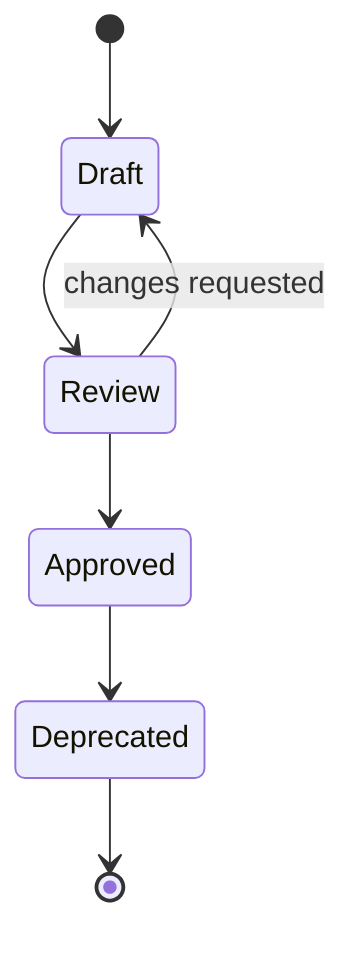

# SPEC-0002 Specification Guidelines

狀態：`Draft`

## 1. Purpose

本文件定義 SnipPlus 後續 Specification 的共同格式、追溯規則、狀態、命名、圖表與 Review 流程，讓產品、設計、開發與測試可以用同一份可驗收的行為契約合作。

本文件本身是 Specification Standard，不是 Capture、Overlay、Toolbar、Annotation 或其他產品功能 Spec。

## 2. Scope

本規範適用於 `Specs/` 下所有未來的功能 Specification，包含：

- 使用者可觀察的功能行為。
- 外部觸發、正常流程、狀態轉換與結束條件。
- 取消、錯誤、恢復與 edge cases。
- 與 PRD、FR、NFR 及其他已核准文件的追溯關係。
- 可供 Review、實作與測試共同使用的 acceptance criteria。

本規範不授權：

- 新增未經 PRD Freeze 的產品需求。
- 決定 UI visual design、Toolbar layout 或 tool set。
- 決定 class、function、API、framework、database 或 deployment。
- 以 Spec 取代 PRD、Architecture 或 ADR 的責任。

## 3. Document Structure

每份功能 Spec 至少包含以下 H2 章節，順序可依內容需要調整，但不得省略必要的追溯與驗收資訊：

### 3.1 Overview

- Spec ID 與標題。
- 文件狀態。
- 一句話說明本 Spec 的行為範圍。
- 直接引用的 PRD、FR 與 NFR。

### 3.2 Requirements

以使用者可觀察的語句描述本 Spec 必須滿足的行為，並為每項需求保留穩定的 local requirement ID，例如 `SR-001`。

Spec requirement 不得創造 PRD 沒有授權的新 capability。

### 3.3 State

若行為具有多個狀態，列出每個 state 的：

- Purpose。
- Entry condition。
- Exit condition。
- Trigger。
- Observable result。
- Failure 或 unknown boundary。

### 3.4 Sequence

以文字或 Mermaid 描述使用者與系統的事件順序。每一個重要步驟應能連回 requirement 或 acceptance criterion。

### 3.5 Edge Cases

列出取消、重複操作、輸入不完整、依賴失敗、關閉、權限與外部環境差異等邊界。

尚未確認的行為使用 `UNKNOWN`、`TBD` 或 `Assumption`，不得以推測補完。

### 3.6 Dependencies

列出本 Spec 依賴的：

- PRD requirement：`FR-`、`NFR-`。
- 其他已 Approved 的 Spec。
- 已核准的 Architecture 或 ADR（若已存在且確實相關）。
- 外部平台或產品行為來源（若本 Spec 必須引用）。

不得把尚未核准的文件當成已確定依賴。

### 3.7 Acceptance Criteria

每個 acceptance criterion 必須可被 Review 或測試判斷，並能回溯到至少一項 Spec requirement 與一個 PRD `FR-` 或 `NFR-` ID。

### 3.8 Open Questions

保留尚未決定的問題、風險與來源缺口，不在 Spec 階段偷偷替 PRD 做產品決策。

## 4. Traceability

每份 Spec 必須建立明確的追溯表：

| Spec requirement | PRD source | Related NFR | Acceptance criteria | Status |
| --- | --- | --- | --- | --- |
| `SR-001` | `FR-000` | `NFR-000` | `AC-001` | `TBD` |

最低追溯鏈為：

```text
PRD-0002 / PRD-0003 / PRD-0004 / FR / NFR
                         ↓
                    Specification
                         ↓
                   Acceptance Criteria
```

規則：

- 每份 Spec 至少引用一個 `FR-` 或 `NFR-`。
- 每個 `SR-` 必須有對應的 acceptance criterion。
- 每個 acceptance criterion 必須能回到 `SR-` 與 PRD requirement。
- 若 Spec 發現新的產品需求，停止撰寫並回到 PRD Change Control。
- 不得用 Spec 的文字取代 PRD 原有的產品決策。

## 5. Status

Spec 只能使用以下狀態：

- `Draft`：文件正在建立，不能作為 implementation commitment。
- `Review`：內容已完成初稿，等待產品、設計、開發與測試 Review。
- `Approved`：追溯、行為與 acceptance criteria 已核准，可作為 implementation baseline。
- `Deprecated`：保留歷史脈絡，不再作為新的 implementation baseline；必須連到替代文件或說明無替代文件。

狀態變更應在文件內更新 Review status，並同步根目錄 `CHANGELOG.md` 或相關變更紀錄。

## 6. Naming

### File name

格式：

```text
SPEC-NNNN-kebab-case.md
```

命名規則：

- `SPEC-NNNN` 必須在 Repository 內唯一，不得重用已存在的 Spec ID。
- 使用小寫 `kebab-case` 描述主題。
- 不使用 `Final`、`Latest`、日期或版本號表達文件狀態。
- 新文件必須加入 `Specs/README.md` 或對應導覽入口。
- 本文件使用 `SPEC-0002`，因 Repository 已有 `SPEC-0001-documentation-baseline.md`；不得建立同號的第二份文件。

### Internal headings and IDs

- H1 必須與 Spec 主題一致，且每份文件只能有一個 H1。
- Spec requirement 使用 `SR-NNN`。
- Acceptance criterion 使用 `AC-NNN`。
- State 使用穩定、可理解的名稱，不使用 implementation class name。

## 7. Diagram Rules

### Mermaid

- Mermaid 是 Spec 的預設圖表格式，直接放在 Markdown code fence 中。
- 只有當 state、sequence、dependency 或 ownership 關係比文字更清楚時才建立圖。
- 圖表中的節點名稱必須與正文的 state 或事件名稱一致。
- 圖表必須能從正文理解；不能只依賴圖表傳達 requirement。
- 不在 Spec 內嵌入截圖、未追溯的外部圖片或只展示 visual design 的圖。
- 未知轉移使用 `UNKNOWN`、`TBD` 或明確的 open boundary。
- Mermaid 圖保持單一目的；不要把 state、sequence、architecture 與 UI layout 混在同一張圖。

### State diagram baseline



此圖只表示 Spec 文件狀態，不表示任何 SnipPlus runtime state。

## 8. Review Process

每份功能 Spec 遵循以下流程：

1. 從已 Freeze 的 PRD、FR 與 NFR 建立 `Draft`。
2. 完成 Document Structure、Traceability、States、Sequence、Edge Cases、Dependencies 與 Acceptance Criteria。
3. 進行靜態文件檢查：連結、ID、狀態、圖表、未知標記與命名。
4. 將狀態改為 `Review`，由產品、設計、開發與測試依責任範圍審查。
5. 解決 review comments 後，確認沒有未記錄的產品需求，再改為 `Approved`。
6. 只有 `Approved` 的 Spec 才能成為 implementation baseline。
7. 若產品範圍改變，不直接覆寫既有 Approved Spec；依 PRD Change Control 重新 Review，必要時建立新版本或將舊文件標為 `Deprecated`。

## 9. Acceptance Criteria

一份 Spec 在進入 `Review` 前，至少必須符合：

- H1、狀態、Scope 與目的完整。
- 所有 requirement 都有穩定的 `SR-` ID。
- 所有 requirement 都能追溯到至少一個 `FR-` 或 `NFR-`。
- 所有 acceptance criteria 都有 `AC-` ID，且能回到對應的 `SR-`。
- Normal flow、edge cases、cancel、failure 與 open questions 已分開描述。
- 需要時有 Mermaid state 或 sequence diagram，且圖表與正文一致。
- 沒有 class、function、API、framework 或其他 implementation instruction。
- 沒有自行新增 PRD 未核准的 product capability。
- 相對連結、檔名、狀態與 Review 欄位均通過靜態檢查。

一份 Spec 在進入 `Approved` 前，另外必須確認：

- Review comments 已處理或明確保留為 open item。
- Product owner 接受行為範圍與 non-goals。
- 開發與測試可以僅依 Spec 理解驗收邊界。
- 沒有把 `UNKNOWN`、`TBD` 或 `Assumption` 偽裝成已核准行為。

## 10. Current boundary

- 本文件只建立 Specification Standard。
- 尚未建立任何 Overlay、Capture、Toolbar、Annotation 或其他功能 Spec。
- Architecture、Implementation、Tests 與 Release 必須依照已 Approved 的 Feature Specifications 建立。
