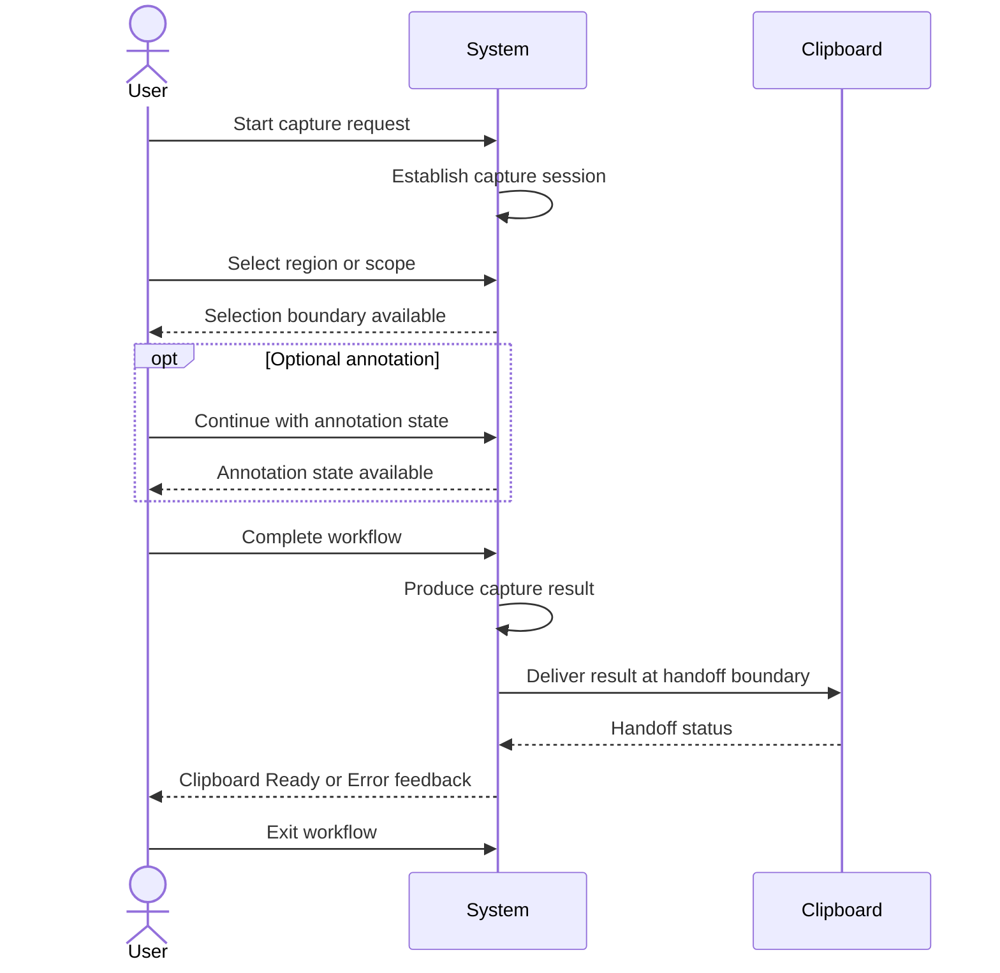

# SPEC-0003 System Requirements

狀態：`Draft`

## Overview

本 Spec 定義支撐 SnipPlus PRD v1.0 的共用系統層能力。它回答：系統必須具備哪些可被其他 Feature Spec 共用的 session、state、handoff 與 lifecycle 能力？

本 Spec 不是 Overlay、Toolbar、Capture Workflow 或 Annotation 的功能 Spec，也不決定 class、function、API、framework、database、renderer 或 UI。

## Scope

本 Spec 涵蓋：

- Capture Session lifecycle。
- Region Selection state boundary。
- Optional Annotation state。
- Clipboard handoff boundary。
- Shared Workflow state management。
- System-level cancellation、error 與 unknown boundary。

本 Spec 不涵蓋：

- Overlay、Toolbar、Arrow、Rectangle、OCR、AI 或 Plugin 的設計。
- 任何特定 UI visual、interaction layout 或 tool set。
- 技術架構、API、class、database、process 或 deployment。
- 未在 PRD v1.0 中核准的新 capability。

## Traceability

| Source type | Source |
| --- | --- |
| Product requirements | [PRD-0005 Functional Requirements](../PRD/PRD-0005-functional-requirements.md)、[PRD-0006 Non-functional Requirements](../PRD/PRD-0006-non-functional-requirements.md) |
| Product workflow | [PRD-0004 Core Workflow](../PRD/PRD-0004-core-workflow.md) |
| Product principles | [PRD-0002 UX Principles](../PRD/PRD-0002-user-experience-principles.md)、[PRD-0003 Product Vision](../PRD/PRD-0003-product-vision.md) |
| Specification standard | [SPEC-0002 Specification Guidelines](SPEC-0002-specification-guidelines.md) |

## Requirements

### SR-001 — Capture Session Lifecycle

| Field | Value |
| --- | --- |
| ID | `SR-001` |
| Description | 系統必須能維持一次 capture session 從 Capture Request、Region Selection、Complete 到 Clipboard Ready 或 Exit 的生命週期邊界。 |
| Priority | `Must` |
| Related PRD | `FR-001`、`FR-002`、`FR-003`、`FR-007`、`FR-009`、`NFR-002`、`NFR-003` |
| Source | [Core Workflow](../PRD/PRD-0004-core-workflow.md#2-primary-workflow)；[Workflow Control](../PRD/PRD-0005-functional-requirements.md#7-workflow-control) |

### SR-002 — Selection State

| Field | Value |
| --- | --- |
| ID | `SR-002` |
| Description | 系統必須能辨識 Region Selection 的開始、進行中、完成、取消與未知失敗邊界，並讓 capture session 不會在狀態不明時被視為完成。 |
| Priority | `Must` |
| Related PRD | `FR-002`、`FR-003`、`FR-010`、`NFR-002`、`NFR-004`、`NFR-006` |
| Source | [Core Workflow states](../PRD/PRD-0004-core-workflow.md#5-workflow-states)；[Capture requirement](../PRD/PRD-0005-functional-requirements.md#fr-002--select-capture-region-or-scope) |

### SR-003 — Optional Annotation State

| Field | Value |
| --- | --- |
| ID | `SR-003` |
| Description | 系統必須能將 Annotation 視為 capture result 之後的 optional workflow state；使用者可以略過它而完成基本 capture 與交付。 |
| Priority | `Should` |
| Related PRD | `FR-004`、`FR-005`、`FR-006`、`NFR-005`、`NFR-010` |
| Source | [Core Workflow scope](../PRD/PRD-0004-core-workflow.md#1-workflow-scope)；[Optional capability principle](../PRD/PRD-0002-user-experience-principles.md#principle-4--進階能力全部是-optional) |

### SR-004 — Clipboard Handoff

| Field | Value |
| --- | --- |
| ID | `SR-004` |
| Description | 系統必須能辨識 capture result 已達到可交付狀態，並維持交付至 clipboard 的 workflow boundary；不在本 Spec 定義 Clipboard API 或資料格式。 |
| Priority | `Must` |
| Related PRD | `FR-007`、`FR-008`、`FR-009`、`NFR-001`、`NFR-011` |
| Source | [Clipboard requirement](../PRD/PRD-0005-functional-requirements.md#5-clipboard)；[Clipboard handoff decision](../docs/Decision/Win11/capture-workflow-decision.md#automatic-clipboard-handoff) |

### SR-005 — Workflow State Management

| Field | Value |
| --- | --- |
| ID | `SR-005` |
| Description | 系統必須能維持並辨識 `Application Ready`、`Capture Request`、`Region Selection`、`Annotation`、`Complete`、`Clipboard Ready`、`Exit`、`Cancel` 與 `Error` 等 workflow state 邊界。 |
| Priority | `Must` |
| Related PRD | `FR-001` 至 `FR-011`、`NFR-002`、`NFR-003`、`NFR-013` |
| Source | [Core Workflow Mermaid](../PRD/PRD-0004-core-workflow.md#2-primary-workflow)；[Error Handling requirement](../PRD/PRD-0005-functional-requirements.md#8-error-handling) |

## State

以下是共用的 logical state contract；state 名稱不是 class name，也不指定任何 runtime implementation：

| State | Entry condition | Exit condition | Observable boundary |
| --- | --- | --- | --- |
| `Application Ready` | 合法 capture entry 可用。 | 使用者提出 Capture Request。 | 系統可接受一次新的 workflow。 |
| `Capture Request` | 使用者明確啟動 capture。 | 進入 Selection、Cancel 或 Error。 | 一次 capture session 已開始。 |
| `Region Selection` | Capture Request 已成立。 | Selection 完成、Cancel 或 Error。 | 系統知道目前正在等待或處理選取。 |
| `Annotation` | 使用者選擇進入 optional post-capture workflow。 | Annotation 結束、Cancel 或 Error。 | 系統知道 result 正在 optional 後續處理。 |
| `Complete` | Selection 或 Annotation 完成。 | Clipboard Ready 或 Error。 | Capture result 已產生。 |
| `Clipboard Ready` | Result 已達到可交付狀態。 | Exit 或 Error。 | Result 可進入下一個工作脈絡。 |
| `Exit` | Result 完成交付、Cancel 或 Error 結束。 | Workflow end。 | 本次 session 已離開。 |
| `Cancel` | 使用者在完成前放棄流程；實際觸發方式 `UNKNOWN`。 | Exit；recovery `UNKNOWN`。 | Workflow 不再被視為成功完成。 |
| `Error` | Capture、state transition 或 handoff 無法正常完成；具體條件 `UNKNOWN`。 | Exit；recovery `UNKNOWN`。 | 使用者可得到 failure boundary 的回饋。 |

## Sequence

以下 sequence 只表示系統層的事件邊界，不代表 UI、API 或 process design：

## Edge Cases

| Edge case | Required system boundary | Status |
| --- | --- | --- |
| User cancels during Capture Request | Session must not be treated as completed. | Trigger and recovery `UNKNOWN` |
| User cancels during Region Selection | Selection must not produce a successful result unless completion occurred. | `UNKNOWN` |
| User skips Annotation | Session must be able to proceed directly to Complete. | Defined by `SR-003` |
| Capture cannot complete | Session must enter an error boundary and provide appropriate feedback. | Failure details `UNKNOWN` |
| Clipboard handoff cannot complete | Result must not be silently reported as Clipboard Ready. | Recovery `UNKNOWN` |
| User exits after completion | Session must be distinguishable from a cancelled or failed session. | Close side effects `UNKNOWN` |
| Platform behavior differs | Unknown platform behavior must not be invented as a guaranteed transition. | `UNKNOWN` |

## Dependencies

| Dependency | Relationship |
| --- | --- |
| `FR-001` – `FR-011` | Functional capabilities supported by the shared system requirements. |
| `NFR-001` – `NFR-005` | Responsiveness, reliability and usability boundaries for state transitions. |
| `NFR-011` – `NFR-013` | Privacy, explicit user action and lifecycle governance boundaries. |
| [PRD-0004 Core Workflow](../PRD/PRD-0004-core-workflow.md) | Defines the product-level workflow states and exits. |
| [SPEC-0002 Specification Guidelines](SPEC-0002-specification-guidelines.md) | Defines Spec structure, IDs, traceability and acceptance rules. |

This section does not choose a technical Architecture or implementation dependency.

## Acceptance Criteria

| ID | Acceptance criterion | Traces to |
| --- | --- | --- |
| `AC-001` | A Review can identify the boundaries of one capture session from request through result delivery or exit. | `SR-001`, `FR-001`, `FR-009` |
| `AC-002` | The documented system states distinguish selection in progress from selection completed, cancelled or failed. | `SR-002`, `FR-002`, `FR-010` |
| `AC-003` | Annotation is documented as optional, and the basic path can proceed without entering Annotation. | `SR-003`, `FR-004`, `NFR-005` |
| `AC-004` | Clipboard handoff is a distinct boundary and is not described as a Clipboard API or file-format decision. | `SR-004`, `FR-007`, `NFR-011` |
| `AC-005` | The state table and sequence diagram use the same logical state names and include Cancel and Error boundaries. | `SR-005`, `FR-011`, `NFR-002` |
| `AC-006` | Every SR has a Priority, related PRD IDs and a Source link. | `SR-001` – `SR-005`, `NFR-008` |
| `AC-007` | No section introduces Overlay, Toolbar, Arrow, Rectangle, OCR, AI, Plugin, API, class or framework design. | All SRs, `NFR-013` |

## Open Questions

- `UNKNOWN`：Capture Session 是否需要保存跨 workflow 的 result identity。
- `UNKNOWN`：Cancel、Error 與 recovery 的完整狀態轉換。
- `UNKNOWN`：Clipboard handoff failure 的可觀察回饋與重試邊界。
- `TBD`：Annotation state 在 v1.0 的正式 capability 範圍。
- `TBD`：未來 Feature Spec 是否需要額外的 shared state contract。
- `UNKNOWN`：Windows version、DPI、多螢幕與其他 platform edge cases 對 state transition 的影響。

本 Spec 不回答以上問題；任何會改變產品範圍的答案必須回到 PRD Change Control。

## Review status

- Status：`Draft`
- Product review：`TBD`
- Engineering review：`TBD`
- Test review：`TBD`
- Approval date：`TBD`
