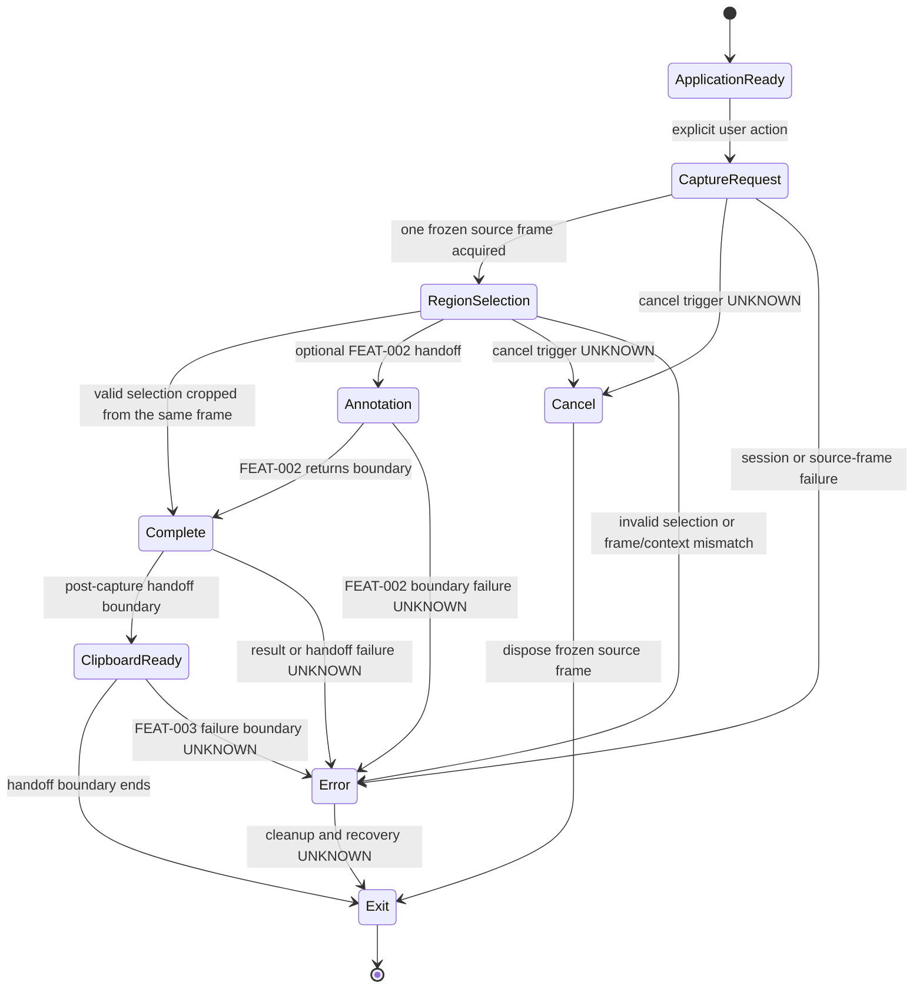

# SPEC-0005 Capture Workflow

狀態：`Draft`

## 1. Document Control

| Field | Value |
| --- | --- |
| Document ID | `SPEC-0005` |
| Feature ID | `FEAT-001 Capture Workflow` |
| Status | `Draft` |
| Version | `0.2` |
| Owner | `TBD` |
| Last Reviewed | `2026-07-27` |
| Corrective trigger | Initial runtime implementation displayed an opaque gray selection surface and acquired the source frame only after selection. |
| Dependencies | [SPEC-0002](SPEC-0002-specification-guidelines.md)、[SPEC-0003](SPEC-0003-system-requirements.md)、[SPEC-0004](SPEC-0004-feature-catalog.md) |

## 2. Overview

### Purpose

本 Spec 定義使用者從提出 Capture Request、看到可辨識的 frozen source frame、完成 Region Selection，到 capture result 進入後續處理階段的 `FEAT-001 Capture Workflow` 行為邊界。

### In scope

```text
Application Ready
→ Capture Request
→ Acquire and freeze one source frame
→ Region Selection on that same frame
→ Crop that same frame
→ Capture Completion
→ Post-capture Handoff
```

本文件涵蓋：

- 合法入口與使用者明確啟動。
- Capture session 的開始前提。
- Region Selection 前的單一 source-frame acquisition。
- Region Selection 期間的來源內容可見性。
- Selection 顯示與最終 Crop 使用同一張 immutable frame 的一致性。
- Selection、Crop 與 display-context snapshot 的行為邊界。
- Capture result 何時視為完成。
- Result 交給 post-capture consumer 的交接邊界。
- Cancel、Failure 與 platform unknown boundaries。

### Out of scope

- Clipboard 的詳細行為由 `FEAT-003 Clipboard Handoff` 負責。
- Output 的詳細產出規則由 `FEAT-004 Capture Output` 負責。
- Annotation 的詳細行為由 `FEAT-002 Annotation` 負責。
- Error feedback 的詳細規則由 `FEAT-005 Workflow Boundaries and Feedback` 負責。
- Toolbar、Arrow、Rectangle annotation tool、OCR、AI、Plugin、API、framework 與 class design。
- Selection overlay 的品牌色、精確透明度、邊框樣式、resize handle 與 cursor styling。

以下內容不是視覺美化，不能列為 out of scope：

- 使用者在 Region Selection 期間必須看得到 Capture Request 發生時的來源畫面。
- Selection 顯示的 source frame 與最終 Crop 使用的 source frame 必須相同。
- 不得以純色、空白或不包含來源內容的 surface 作為唯一 Selection 背景。

## 3. Requirements Mapping

| Feature | FR | SR | NFR | PRD source |
| --- | --- | --- | --- | --- |
| `FEAT-001 Capture Workflow` | `FR-001`、`FR-002`、`FR-003`、`FR-009`、`FR-010` | `SR-001`、`SR-002`、`SR-005` | `NFR-001`、`NFR-002`、`NFR-003`、`NFR-004`、`NFR-006`、`NFR-007`、`NFR-012` | [PRD-0002](../PRD/PRD-0002-user-experience-principles.md)、[PRD-0003](../PRD/PRD-0003-product-vision.md)、[PRD-0004](../PRD/PRD-0004-core-workflow.md)、[PRD-0005](../PRD/PRD-0005-functional-requirements.md)、[PRD-0006](../PRD/PRD-0006-non-functional-requirements.md) |

### Specification governance sources

- [SPEC-0002 Specification Guidelines](SPEC-0002-specification-guidelines.md)
- [SPEC-0003 System Requirements](SPEC-0003-system-requirements.md)
- [SPEC-0004 Feature Catalog](SPEC-0004-feature-catalog.md)

## 4. Preconditions

在 Capture Workflow 開始前：

- 系統處於 `Application Ready`，可以接受合法的 Capture Request。
- Capture Request 必須源自使用者明確動作。
- Capture session 的生命週期由 `SR-001` 管理。
- 目標 display context 必須能提供可驗證的 display bounds 與 DPI scale snapshot。
- 同時間是否允許多個 Capture Session：`TBD`。
- 若目前狀態不是 `Application Ready`，是否允許新的 Capture Request：`TBD`。
- 本 Spec 不建立自動排程、命令列、API 呼叫或其他未核准入口。
- 正常 Capture Workflow 不得啟動 Paint、Notepad 或其他外部 GUI 應用程式。

## 5. Trigger and Entry Points

只記錄已有 PRD 與 Decision 支持的入口：

| Entry point | User action | Expected workflow entry | Verification status |
| --- | --- | --- | --- |
| `PrintScreen / PrtSc` | 使用者按下 Windows 截圖入口。 | `Capture Request` | `UNKNOWN` — Research sources describe different behavior. |
| `Windows logo key + Shift + S` | 使用者啟動 Windows capture shortcut。 | `Capture Request` | Documented entry; SnipPlus runtime behavior `UNKNOWN`。 |
| Windows Start / application flow | 使用者從 Windows Start 或應用程式流程啟動。 | `Application Ready` 或 `Capture Request`；確切轉換 `TBD` | Platform flow documented; SnipPlus behavior `UNKNOWN`。 |

不得在本 Spec 新增自訂快捷鍵、system tray icon、命令列、自動排程或 API 入口。

## 6. Workflow States

狀態名稱沿用 [SPEC-0003 System Requirements](SPEC-0003-system-requirements.md#state) 的 logical state contract，不建立第二套狀態模型。Frozen source frame 是 Capture Request 與 Region Selection 之間必須完成的 session resource，不另增產品狀態名稱。

| State | Purpose | Valid entry | Valid exit | Failure boundary |
| --- | --- | --- | --- | --- |
| `Application Ready` | 等待使用者提出 capture request。 | 應用程式或合法入口可用。 | `Capture Request`。 | 無法接受 request 的條件 `UNKNOWN`。 |
| `Capture Request` | 建立一次 capture session，取得 display-context snapshot，並取得一張 immutable full-monitor source frame。 | 使用者明確啟動合法入口。 | Source frame ready 後進入 `Region Selection`；或進入 `Cancel`／`Error`。 | Source frame acquisition、display context 或 session 建立失敗。 |
| `Region Selection` | 在已凍結且可辨識的 source frame 上讓使用者指定 capture region。 | 同一 session 的 source frame 已取得並可呈現。 | `Complete`、`Annotation` boundary、`Cancel` 或 `Error`。 | Selection invalid、未完成、越界、frame/display context 不一致或 platform failure。 |
| `Annotation` | 表示可選的 post-capture handoff boundary。 | 使用者選擇繼續進入 `FEAT-002`。 | 回到 `Complete` 或進入下一個 Feature 的責任範圍。 | Annotation 詳細行為不在本 Spec。 |
| `Complete` | 同一張 frozen source frame 已依有效 Selection 完成 Crop，capture result 已產生。 | 有效 Selection 已完成並成功裁切同一 source frame；或 Annotation boundary 結束。 | `Clipboard Ready`、post-capture consumer handoff 或 `Error`。 | Crop、result 建立或 handoff failure。 |
| `Clipboard Ready` | 表示 result 已達到可交付到 `FEAT-003` 的 boundary。 | Complete 後可交付。 | `Exit` 或 `Error`。 | Clipboard 詳細 failure 由 FEAT-003 負責。 |
| `Exit` | 結束本次 Capture Workflow。 | Result 已交接、Cancel 或 Error 結束。 | Workflow end。 | Close side effects `UNKNOWN`。 |
| `Cancel` | 表示完成前使用者放棄本次流程。 | `Capture Request` 或 `Region Selection`；確切觸發 `UNKNOWN`。 | Cleanup frozen source frame 後進入 `Exit`。 | Recovery、focus restore 與 side effects `UNKNOWN`。 |
| `Error` | 表示流程無法正常完成。 | Session、source-frame acquisition、Selection、Crop 或 handoff failure。 | Cleanup frozen source frame 後進入 `Exit`；recovery `UNKNOWN`。 | 詳細 feedback 由 FEAT-005 負責。 |

## 7. State Machine

此圖只表示 `FEAT-001` 的產品狀態與必要 session resource boundary；不定義 Annotation、Clipboard、Output 或 Error Feedback 的內部行為。



## 8. Primary Sequence

參與者使用抽象角色，只描述行為邊界，不描述 API 呼叫或 class：

```mermaid
sequenceDiagram
    actor User
    participant CaptureWorkflow
    participant SourceFrameCapability
    participant SelectionCapability
    participant PostCaptureConsumer

    User->>CaptureWorkflow: Explicit capture request
    CaptureWorkflow->>CaptureWorkflow: Establish capture session and display context
    CaptureWorkflow->>SourceFrameCapability: Acquire one full-monitor source frame
    SourceFrameCapability-->>CaptureWorkflow: Immutable frozen source frame
    CaptureWorkflow->>SelectionCapability: Present that same frame for selection
    SelectionCapability-->>User: Source content visible; outside region may be dimmed
    User->>SelectionCapability: Start or update selection
    SelectionCapability-->>CaptureWorkflow: Valid, incomplete or invalid selection result

    alt Valid selection
        CaptureWorkflow->>SourceFrameCapability: Crop the same frozen source frame
        SourceFrameCapability-->>CaptureWorkflow: Cropped capture result
        opt Optional annotation handoff
            CaptureWorkflow->>PostCaptureConsumer: FEAT-002 boundary
            PostCaptureConsumer-->>CaptureWorkflow: Return boundary
        end
        CaptureWorkflow->>PostCaptureConsumer: Post-capture handoff boundary
        PostCaptureConsumer-->>CaptureWorkflow: Handoff status
        CaptureWorkflow-->>User: Complete or handoff feedback boundary
    else Cancelled
        CaptureWorkflow->>SourceFrameCapability: Dispose frozen source frame
        CaptureWorkflow-->>User: Cancelled boundary
    else Failed
        CaptureWorkflow->>SourceFrameCapability: Dispose frozen source frame
        CaptureWorkflow-->>User: Failed boundary; details FEAT-005
    end
```

## 9. Selection Behavior

本節定義 Selection Capability 的必要可用性與一致性；品牌樣式與 decoration 仍不在本 Spec：

- Capture Workflow 必須在 Region Selection 開始前取得一張完整、immutable 的 source frame。
- Region Selection 期間必須顯示該 source frame，使使用者可以辨識要截取的桌面內容。
- 不得使用純色、空白或不包含 source content 的 surface 作為唯一 Selection 背景。
- Selection 外部區域可以變暗；Selection 內部區域必須保持來源內容清晰可辨識。
- Selection 在確認前可以更新。
- Selection 的 UI pointer coordinates 可以使用 DIP，但必須透過同一 display-context snapshot 轉換為該 frozen frame 的 physical-pixel bounds。
- 最終 Crop 必須使用 Region Selection 所顯示的同一張 frozen source frame。
- 使用者完成 Selection 後，不得重新擷取另一個時間點的 desktop frame 作為結果來源。
- 零尺寸、越界、無效或與 frozen frame／display context 不一致的 Selection 不得進入成功完成。
- Selection 的取消會進入 `Cancel` boundary，且必須釋放 frozen source frame。
- Window、Full screen、Rectangle、Freeform 等正式 mode 範圍由 PRD／future review 決定；本 Spec 不新增 mode。
- 遮罩精確顏色、邊框粗細、resize handle 與 cursor styling 不在本 Spec；來源內容可見性與 same-frame consistency 在本 Spec 內。

## 10. Completion and Handoff

- Capture result 只有在有效 Selection 已從同一張 frozen source frame 完成 Crop 後，才能進入 `Complete`。
- `Complete` 只表示 result 已產生，不定義 output format 或儲存方式。
- Capture Workflow 不得以 Selection 完成後重新取得的 frame 取代原始 frozen source frame。
- Capture Workflow 將 result 交給抽象的 post-capture consumer；Clipboard、Output、Annotation 的詳細責任由各自 Feature 負責。
- `Clipboard Ready` 是與 `FEAT-003 Clipboard Handoff` 的交接 boundary，不是 Clipboard API 決策。
- Handoff failure 進入 `Error` boundary；錯誤回饋與 recovery 由 `FEAT-005` 負責。
- Capture Workflow 在 result 已交接、Cancel 或 Error 結束後進入 `Exit`，並完成 frozen source frame cleanup。

## 11. Cancellation

- 允許在 `Capture Request` 或 `Region Selection` 取消；是否允許在其他狀態取消：`TBD`。
- Cancel 後 Session 進入終止 boundary，不得產生成功的 capture result。
- Cancel 必須釋放 frozen source frame、pointer capture 與 selection presentation resources。
- Cancel 的確切按鍵、gesture、focus restore、window restore 與 side effects：`UNKNOWN`。
- Cancel 不應被描述成 Error；兩者是不同的 workflow outcome。

## 12. Edge Cases

| Edge case | Expected boundary | Verification |
| --- | --- | --- |
| Capture Request 在已有 Session 時發生 | 是否接受、排隊或拒絕第二個 session：`TBD`。 | `UNKNOWN` |
| Source frame 無法取得 | 不進入 Region Selection；進入 `Error` 或可分類 failure。 | Required |
| Selection 尚未完成即取消 | 進入 `Cancel`，釋放 frozen frame，不產生完成結果。 | Required |
| Selection 無效或尺寸為零 | 不進入 `Complete`；具體回饋由 FEAT-005 負責。 | Required |
| Selection 超出 frozen frame bounds | 不裁切、不進入成功流程。 | Required |
| 擷取目標在 Selection 期間改變 | Selection 與結果仍以 Capture Request 時取得的 frozen frame 為準。 | Required |
| 顯示器配置在流程中改變 | 若 display context 與 frozen frame 失效，不得以新的 frame 靜默替換；進入可分類 failure。 | Required |
| 多螢幕 | 第一個 vertical slice 只處理核准的單螢幕 scope；stitched result 不在範圍。 | Defined boundary |
| DPI scaling | Selection DIP 必須透過同一 display-context snapshot 對應 frozen frame pixel bounds。 | Required |
| HDR | Result behavior：`UNKNOWN`；不得阻止 SDR first slice correction。 | `UNKNOWN` |
| 系統或應用程式失去 focus | Focus restore 與 workflow continuation：`UNKNOWN`。 | `UNKNOWN` |
| Capture 完成但 post-capture handoff 失敗 | 進入 `Error`；詳細 feedback 由 FEAT-005 負責。 | Required boundary |
| 正常 Capture Workflow 啟動外部 GUI 程式 | 不允許；視為產品邊界違反。 | Required |

## 13. Acceptance Criteria

Acceptance Criteria 使用本文件專屬的 `SPEC-0005-AC-NNN` namespace：

| ID | Acceptance criterion | Traces to |
| --- | --- | --- |
| `SPEC-0005-AC-001` | 使用者明確動作可以提出 Capture Request，並建立一次 capture session。 | `FR-001`、`SR-001`、`NFR-012` |
| `SPEC-0005-AC-002` | 既有 PRD／Decision 支持的三類入口被列出，未經 runtime 驗證的入口行為標示 `UNKNOWN`。 | `FR-001`、`NFR-007` |
| `SPEC-0005-AC-003` | 有效 Selection 可以進入 `Complete`；未完成、零尺寸、越界或無效 Selection 不得被視為成功完成。 | `FR-002`、`FR-003`、`SR-002` |
| `SPEC-0005-AC-004` | State Table 與 Mermaid State Diagram 使用相同 logical state contract，並包含 Cancel、Error 與 Exit boundary。 | `SR-005`、`NFR-002` |
| `SPEC-0005-AC-005` | Primary Sequence 描述 Capture Request、單一 source-frame acquisition、Selection、same-frame Crop、Completion、Optional Handoff、Cancel 與 Failure。 | `SR-001`、`SR-002`、`SR-005` |
| `SPEC-0005-AC-006` | Annotation、Clipboard、Output 與 Error Feedback 只以交接 boundary 出現，沒有在本 Spec 定義其內部行為。 | `FR-009`、`NFR-004`、`NFR-006` |
| `SPEC-0005-AC-007` | Cancel 不產生成功 capture result，並釋放 frozen source frame 與 selection resources。 | `FR-010`、`NFR-002`、`NFR-003` |
| `SPEC-0005-AC-008` | Capture result 完成與 post-capture handoff boundary 有明確區分。 | `FR-003`、`FR-009`、`NFR-001` |
| `SPEC-0005-AC-009` | Edge Cases 包含 multi-session、source-frame failure、invalid selection、display change、multi-monitor、DPI、HDR、focus loss 與 handoff failure。 | `NFR-002`、`NFR-006`、`NFR-007` |
| `SPEC-0005-AC-010` | 本文件所有 requirement、state、sequence 與 acceptance criteria 都能追溯至 FEAT-001、FR、SR、NFR 與 PRD source。 | `NFR-008`、`NFR-013` |
| `SPEC-0005-AC-011` | Region Selection 開始前，系統已取得一張完整且 immutable 的單螢幕 source frame。 | `FR-002`、`NFR-001`、`NFR-002` |
| `SPEC-0005-AC-012` | Region Selection 期間必須顯示 Capture Request 發生時的 source content；不得以純色或空白 surface 取代。 | `FR-002`、`PRD-0002` Principles 1、3、5、9 |
| `SPEC-0005-AC-013` | Selection 外部區域可以變暗，但 Selection 內部的來源內容必須保持清晰可辨識。 | `FR-002`、`NFR-001` |
| `SPEC-0005-AC-014` | Selection presentation 與最終 Crop 必須使用同一張 frozen source frame。 | `FR-002`、`FR-003`、`NFR-002` |
| `SPEC-0005-AC-015` | Selection 完成後不得重新擷取另一時間點的 desktop frame 作為結果來源。 | `FR-003`、`NFR-002`、`NFR-003` |
| `SPEC-0005-AC-016` | Selection DIP、display-context snapshot 與 frozen frame pixel bounds 必須一致；不一致時不得產生成功結果。 | `SR-002`、`NFR-002`、`NFR-007` |
| `SPEC-0005-AC-017` | Source acquisition、Selection、Crop、Cancel 與 Error path 都有明確 frozen-frame ownership 與 cleanup boundary。 | `NFR-002`、`NFR-003` |
| `SPEC-0005-AC-018` | 正常 SnipPlus Capture Workflow 不得啟動 Paint 或其他外部 GUI 應用程式。 | `NFR-004`、`NFR-012` |

## 14. Open Questions

只整理仍未由本次 corrective clarification 決定的問題：

- `PrtSc／PrintScreen` 在目標 Windows 環境的 runtime 行為。
- 同時存在多個 Capture Request 時的處理方式。
- Cancel 的確切操作與允許狀態。
- Window、Full screen、Rectangle、Freeform 等正式 scope。
- 多螢幕 stitched capture、HDR 與 focus loss 的完整行為。
- Capture failure 與 post-capture handoff failure 的 recovery。
- Capture result 的 Output 與 Clipboard 交接細節。
- Selection overlay 的精確品牌樣式、透明度、邊框與 resize affordance。

以下內容不再是 Open Question：

- Region Selection 必須顯示 frozen source content。
- Selection 與 Crop 必須使用同一張 frame。
- Selection 完成後不得重新擷取另一張 frame。
- 正常 Capture Workflow 不得啟動外部 GUI fixture。

## Review status

- Status：`Draft`
- Corrective specification update：`Completed`
- Product review：`Requested by repository owner through explicit correction instruction`
- Engineering review：`Pending implementation correction`
- Test review：`Pending corrected workflow verification`
- Last reviewed：`2026-07-27`
