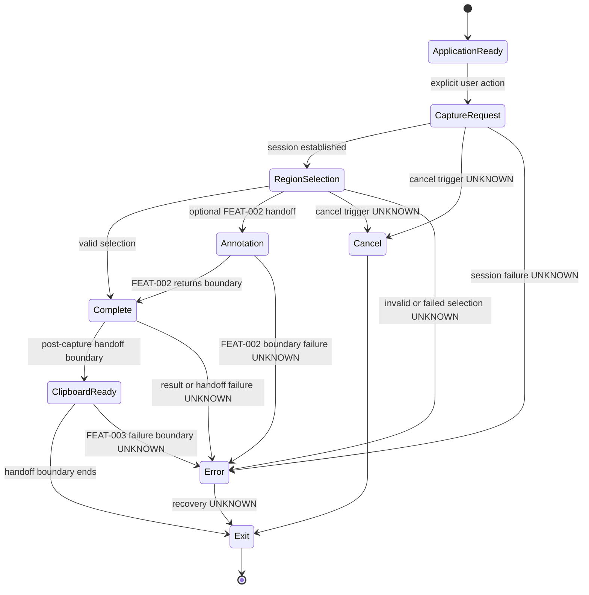

# SPEC-0005 Capture Workflow

狀態：`Draft`

## 1. Document Control

| Field | Value |
| --- | --- |
| Document ID | `SPEC-0005` |
| Feature ID | `FEAT-001 Capture Workflow` |
| Status | `Draft` |
| Version | `0.1` |
| Owner | `TBD` |
| Last Reviewed | `Not reviewed` |
| Dependencies | [SPEC-0002](SPEC-0002-specification-guidelines.md)、[SPEC-0003](SPEC-0003-system-requirements.md)、[SPEC-0004](SPEC-0004-feature-catalog.md) |

## 2. Overview

### Purpose

本 Spec 定義使用者從提出 Capture Request 到 capture result 進入後續處理階段的 `FEAT-001 Capture Workflow` 行為邊界。

### In scope

```text
Application Ready → Capture Request → Selection → Capture Completion → Post-capture Handoff
```

本文件涵蓋：

- 合法入口與使用者明確啟動。
- Capture session 的開始前提。
- Region Selection 的行為邊界。
- Capture result 何時視為完成。
- Result 交給 post-capture consumer 的交接邊界。
- Cancel、Failure 與 platform unknown boundaries。

### Out of scope

- Clipboard 的詳細行為由 `FEAT-003 Clipboard Handoff` 負責。
- Output 的詳細產出規則由 `FEAT-004 Capture Output` 負責。
- Annotation 的詳細行為由 `FEAT-002 Annotation` 負責。
- Error feedback 的詳細規則由 `FEAT-005 Workflow Boundaries and Feedback` 負責。
- Overlay、Toolbar、Arrow、Rectangle、OCR、AI、Plugin、API、framework、class 與 UI visual design。

## 3. Requirements Mapping

| Feature | FR | SR | NFR | PRD source |
| --- | --- | --- | --- | --- |
| `FEAT-001 Capture Workflow` | `FR-001`、`FR-002`、`FR-003`、`FR-009`、`FR-010` | `SR-001`、`SR-002`、`SR-005` | `NFR-001`、`NFR-002`、`NFR-003`、`NFR-004`、`NFR-006`、`NFR-007`、`NFR-012` | [PRD-0002](../PRD/PRD-0002-user-experience-principles.md)、[PRD-0003](../PRD/PRD-0003-product-vision.md)、[PRD-0004](../PRD/PRD-0004-core-workflow.md)、[PRD-0005](../PRD/PRD-0005-functional-requirements.md)、[PRD-0006](../PRD/PRD-0006-non-functional-requirements.md) |

### Specification governance sources

- [SPEC-0002 Specification Guidelines](SPEC-0002-specification-guidelines.md)
- [SPEC-0003 System Requirements](SPEC-0003-system-requirements.md)
- [SPEC-0004 Feature Catalog](SPEC-0004-feature-catalog.md)

## 4. Preconditions

在 Capture Workflow 開始前：

- 系統處於 `Application Ready`，可以接受合法的 Capture Request。
- Capture Request 必須源自使用者明確動作。
- Capture session 的生命週期由 `SR-001` 管理。
- 同時間是否允許多個 Capture Session：`TBD`。
- 若目前狀態不是 `Application Ready`，是否允許新的 Capture Request：`TBD`。
- 本 Spec 不建立自動排程、命令列、API 呼叫或其他未核准入口。

## 5. Trigger and Entry Points

只記錄已有 PRD 與 Decision 支持的入口：

| Entry point | User action | Expected workflow entry | Verification status |
| --- | --- | --- | --- |
| `PrintScreen / PrtSc` | 使用者按下 Windows 截圖入口。 | `Capture Request` | `UNKNOWN` — Research sources describe different behavior. |
| `Windows logo key + Shift + S` | 使用者啟動 Windows capture shortcut。 | `Capture Request` | Documented entry; SnipPlus runtime behavior `UNKNOWN`。 |
| Windows Start / application flow | 使用者從 Windows Start 或應用程式流程啟動。 | `Application Ready` 或 `Capture Request`；確切轉換 `TBD` | Platform flow documented; SnipPlus behavior `UNKNOWN`。 |

不得在本 Spec 新增自訂快捷鍵、system tray icon、命令列、自動排程或 API 入口。

## 6. Workflow States

狀態名稱沿用 [SPEC-0003 System Requirements](SPEC-0003-system-requirements.md#state) 的 logical state contract，不建立第二套狀態模型。

| State | Purpose | Valid entry | Valid exit | Failure boundary |
| --- | --- | --- | --- | --- |
| `Application Ready` | 等待使用者提出 capture request。 | 應用程式或合法入口可用。 | `Capture Request`。 | 無法接受 request 的條件 `UNKNOWN`。 |
| `Capture Request` | 建立一次 capture session 的工作脈絡。 | 使用者明確啟動合法入口。 | `Region Selection`、`Cancel` 或 `Error`。 | Session 建立失敗 `UNKNOWN`。 |
| `Region Selection` | 讓使用者指定 capture region 或已核准的 scope。 | Capture Request 已成立。 | `Complete`、`Annotation` boundary、`Cancel` 或 `Error`。 | Selection invalid、未完成或平台差異 `UNKNOWN`。 |
| `Annotation` | 表示可選的 post-capture handoff boundary。 | 使用者選擇繼續進入 `FEAT-002`。 | 回到 `Complete` 或進入下一個 Feature 的責任範圍。 | Annotation 詳細行為不在本 Spec。 |
| `Complete` | Capture result 已產生。 | 有效 Selection 完成；或 Annotation boundary 結束。 | `Clipboard Ready`、post-capture consumer handoff 或 `Error`。 | Result 產生失敗 `UNKNOWN`。 |
| `Clipboard Ready` | 表示 result 已達到可交付到 `FEAT-003` 的 boundary。 | Complete 後可交付。 | `Exit` 或 `Error`。 | Clipboard 詳細 failure 由 FEAT-003 負責。 |
| `Exit` | 結束本次 Capture Workflow。 | Result 已交接、Cancel 或 Error 結束。 | Workflow end。 | Close side effects `UNKNOWN`。 |
| `Cancel` | 表示完成前使用者放棄本次流程。 | `Capture Request` 或 `Region Selection`；確切觸發 `UNKNOWN`。 | `Exit`。 | Recovery、focus restore 與 side effects `UNKNOWN`。 |
| `Error` | 表示流程無法正常完成。 | Session、Selection、Capture 或 handoff failure。 | `Exit`；recovery `UNKNOWN`。 | 詳細 feedback 由 FEAT-005 負責。 |

## 7. State Machine

此圖只表示 `FEAT-001` 的狀態與交接邊界；不定義 Annotation、Clipboard、Output 或 Error Feedback 的內部行為。



## 8. Primary Sequence

參與者使用抽象角色，只描述行為邊界，不描述 API 呼叫或 class：

```mermaid
sequenceDiagram
    actor User
    participant CaptureWorkflow
    participant SelectionCapability
    participant PostCaptureConsumer

    User->>CaptureWorkflow: Explicit capture request
    CaptureWorkflow->>CaptureWorkflow: Establish capture session
    CaptureWorkflow-->>User: Selection boundary available
    User->>SelectionCapability: Start or update selection
    SelectionCapability-->>CaptureWorkflow: Valid, incomplete or UNKNOWN selection result

    alt Valid selection
        User->>CaptureWorkflow: Complete capture
        CaptureWorkflow->>CaptureWorkflow: Produce capture result
        opt Optional annotation handoff
            CaptureWorkflow->>PostCaptureConsumer: FEAT-002 boundary
            PostCaptureConsumer-->>CaptureWorkflow: Return boundary
        end
        CaptureWorkflow->>PostCaptureConsumer: Post-capture handoff boundary
        PostCaptureConsumer-->>CaptureWorkflow: Handoff status UNKNOWN
        CaptureWorkflow-->>User: Complete or handoff feedback boundary
    else Cancelled
        User->>CaptureWorkflow: Cancel before completion
        CaptureWorkflow-->>User: Cancelled boundary
    else Failed
        CaptureWorkflow-->>User: Failed boundary; details FEAT-005
    end
```

## 9. Selection Behavior

本節只定義 `Selection Capability`，不定義 visual design 或擷取技術：

- 使用者可以開始範圍或已核准 scope 的選擇。
- Selection 在確認前可以更新。
- 有效 Selection 可以進入 `Complete`。
- 未完成或無效 Selection 不得被視為成功完成的 capture。
- `Capture Request` 開始時必須先取得單一完整 monitor frame，並將該 frame 凍結為本次 Selection 的唯一來源。
- Region Selection 期間必須顯示 Capture 開始時的桌面內容；不得以純色或沒有來源內容的畫面取代 Capture Source。
- 選取範圍外可以變暗，但選取範圍內必須保持來源內容清晰可辨識。
- Selection 顯示的 frame 與最終 Crop 使用的 frame 必須相同；Selection 完成後不得重新擷取不同時間點的 frame。
- Frozen frame 必須有明確所有權，並在成功、取消與失敗流程中釋放；取消、Capture failure、零尺寸或越界 Selection 不得產生成功結果。
- Selection 的取消會進入 `Cancel` boundary；確切使用者操作 `UNKNOWN`。
- Window、Full screen、Rectangle、Freeform 等正式 mode 範圍由 PRD / future review 決定；本 Spec 不新增 mode。
- Selection 的遮罩顏色、邊框粗細、resize handle、cursor 與 multi-monitor capture technique 不在本 Spec；Crop 前仍必須使用同一個 Display Context Snapshot 完成 DIP／physical-pixel conversion，並限制 Crop Bounds 在 Frozen Frame 內。
- 正常 Capture Workflow 與一般自動化測試不得啟動 Paint 或其他外部程式；需要外部 GUI fixture 的 Interactive Verification 必須先取得明確授權。

## 10. Completion and Handoff

- Capture result 在有效 Selection 完成且系統產生結果後，進入 `Complete`。
- `Complete` 只表示 result 已產生，不定義 output format 或儲存方式。
- Capture Workflow 將 result 交給抽象的 post-capture consumer；Clipboard、Output、Annotation 的詳細責任由各自 Feature 負責。
- `Clipboard Ready` 是與 `FEAT-003 Clipboard Handoff` 的交接 boundary，不是 Clipboard API 決策。
- Handoff failure 進入 `Error` boundary；錯誤回饋與 recovery 由 `FEAT-005` 負責。
- Capture Workflow 在 result 已交接、Cancel 或 Error 結束後進入 `Exit`。

## 11. Cancellation

- 允許在 `Capture Request` 或 `Region Selection` 取消；是否允許在其他狀態取消：`TBD`。
- Cancel 後 Session 進入終止 boundary，不得產生成功的 capture result。
- Cancel 的確切按鍵、gesture、focus restore、window restore 與 side effects：`UNKNOWN`。
- Cancel 不應被描述成 Error；兩者是不同的 workflow outcome。

## 12. Edge Cases

| Edge case | Expected boundary | Verification |
| --- | --- | --- |
| Capture Request 在已有 Session 時發生 | 是否接受、排隊或拒絕第二個 session：`TBD`。 | `UNKNOWN` |
| Selection 尚未完成即取消 | 進入 `Cancel`，不產生完成結果。 | Trigger `UNKNOWN` |
| Selection 無效或尺寸為零 | 不進入 `Complete`；具體回饋由 FEAT-005 負責。 | `UNKNOWN` |
| 擷取目標在 Selection 期間改變 | 本次 Selection 使用 Capture Request 開始時已凍結的 frame；後續桌面變化不改變本次 Selection Source。 | Core／Windows tests |
| 顯示器配置在流程中改變 | Workflow 是否繼續：`UNKNOWN`。 | `UNKNOWN` |
| 多螢幕 | Scope、座標與結果邊界：`UNKNOWN`。 | `UNKNOWN` |
| DPI scaling | Selection 與 result 的關係：`UNKNOWN`。 | `UNKNOWN` |
| HDR | Result behavior：`UNKNOWN`。 | `UNKNOWN` |
| 系統或應用程式失去 focus | Focus restore 與 workflow continuation：`UNKNOWN`。 | `UNKNOWN` |
| Capture 完成但 post-capture handoff 失敗 | 進入 `Error`；詳細 feedback 由 FEAT-005 負責。 | `UNKNOWN` |

本節只記錄邊界，不自行提出解法。

## 13. Acceptance Criteria

Acceptance Criteria 使用本文件專屬的 `SPEC-0005-AC-NNN` namespace：

| ID | Acceptance criterion | Traces to |
| --- | --- | --- |
| `SPEC-0005-AC-001` | 使用者明確動作可以提出 Capture Request，並建立一次 capture session。 | `FR-001`、`SR-001`、`NFR-012` |
| `SPEC-0005-AC-002` | 既有 PRD / Decision 支持的三類入口被列出，未經 runtime 驗證的入口行為標示 `UNKNOWN`。 | `FR-001`、`NFR-007` |
| `SPEC-0005-AC-003` | 有效 Selection 可以進入 `Complete`；未完成或無效 Selection 不得被視為成功完成。 | `FR-002`、`FR-003`、`SR-002` |
| `SPEC-0005-AC-004` | State Table 與 Mermaid State Diagram 使用相同 logical state contract，並包含 Cancel、Error 與 Exit boundary。 | `SR-005`、`NFR-002` |
| `SPEC-0005-AC-005` | Primary Sequence 使用抽象角色，描述 Capture Request、Selection、Completion、Optional Handoff、Cancel 與 Failure 行為邊界。 | `SR-001`、`SR-002`、`SR-005` |
| `SPEC-0005-AC-006` | Annotation、Clipboard、Output 與 Error Feedback 只以交接 boundary 出現，沒有在本 Spec 定義其內部行為。 | `FR-009`、`NFR-004`、`NFR-006` |
| `SPEC-0005-AC-007` | Cancel 不產生成功完成的 capture result，且確切操作未確認時保留 `UNKNOWN`。 | `FR-010`、`NFR-002`、`NFR-003` |
| `SPEC-0005-AC-008` | Capture result 完成與 post-capture handoff boundary 有明確區分，沒有定義格式、API 或技術實作。 | `FR-003`、`FR-009`、`NFR-001` |
| `SPEC-0005-AC-009` | Edge Cases 包含 multi-session、invalid selection、display change、multi-monitor、DPI、HDR、focus loss 與 handoff failure，未確認內容標示 `UNKNOWN` 或 `TBD`。 | `NFR-002`、`NFR-006`、`NFR-007` |
| `SPEC-0005-AC-010` | 本文件所有 requirement、state、sequence 與 acceptance criteria 都能追溯至 FEAT-001、FR、SR、NFR 與 PRD source。 | `NFR-008`、`NFR-013` |
| `SPEC-0005-AC-011` | Region Selection 顯示 Capture 開始時取得的完整 monitor frame；不得用純色或無來源內容的畫面取代 Capture Source。 | `FR-002`、`SR-002` |
| `SPEC-0005-AC-012` | Selection 外部區域可以變暗，Selection 內部區域仍保持來源內容清晰可辨識。 | `FR-002`、`NFR-005` |
| `SPEC-0005-AC-013` | 最終 Crop 使用與 Selection 顯示完全相同的 Frozen Frame；Selection 完成後不得觸發第二次 monitor capture。 | `FR-003`、`SR-002`、`NFR-002` |
| `SPEC-0005-AC-014` | Frozen Frame 在成功、取消與失敗路徑都有明確 ownership／cleanup；Capture failure、取消、零尺寸或越界 Selection 不得產生成功結果。 | `FR-003`、`FR-010`、`NFR-002` |
| `SPEC-0005-AC-015` | Crop 前以同一個 Display Context Snapshot 將 Selection DIP bounds 轉為 physical-pixel bounds，且 Crop bounds 不得超出 Frozen Frame。 | `SR-002`、`NFR-002`、`NFR-007` |
| `SPEC-0005-AC-016` | Clipboard handoff 只接收本次 Frozen Frame 的裁切結果，不依賴或重新取得其他 frame。 | `FR-009`、`NFR-001` |
| `SPEC-0005-AC-017` | 正常 Capture Workflow 與一般自動化測試不啟動 Paint 或其他外部程式；外部 GUI fixture 僅可在明確授權的 Interactive Verification 使用。 | `NFR-004`、`NFR-006` |

## 14. Open Questions

只整理與 `FEAT-001 Capture Workflow` 直接相關的既有問題：

- `PrtSc / PrintScreen` 在目標 Windows 環境的 runtime 行為。
- 同時存在多個 Capture Request 時的處理方式。
- Cancel 的確切操作與允許狀態。
- Selection 無效或未完成時的具體行為。
- Window、Full screen、Rectangle、Freeform 等正式 scope。
- 多螢幕、DPI、HDR 與 focus loss 的行為。
- Capture failure 與 post-capture handoff failure 的 recovery。
- Capture result 的 output 與 clipboard 交接細節。

本節不新增無關於 Capture Workflow 的產品問題，也不自行回答上述問題。

## Review status

- Status：`Draft`
- Product review：`TBD`
- Engineering review：`TBD`
- Test review：`TBD`
- Last reviewed：`Not reviewed`
