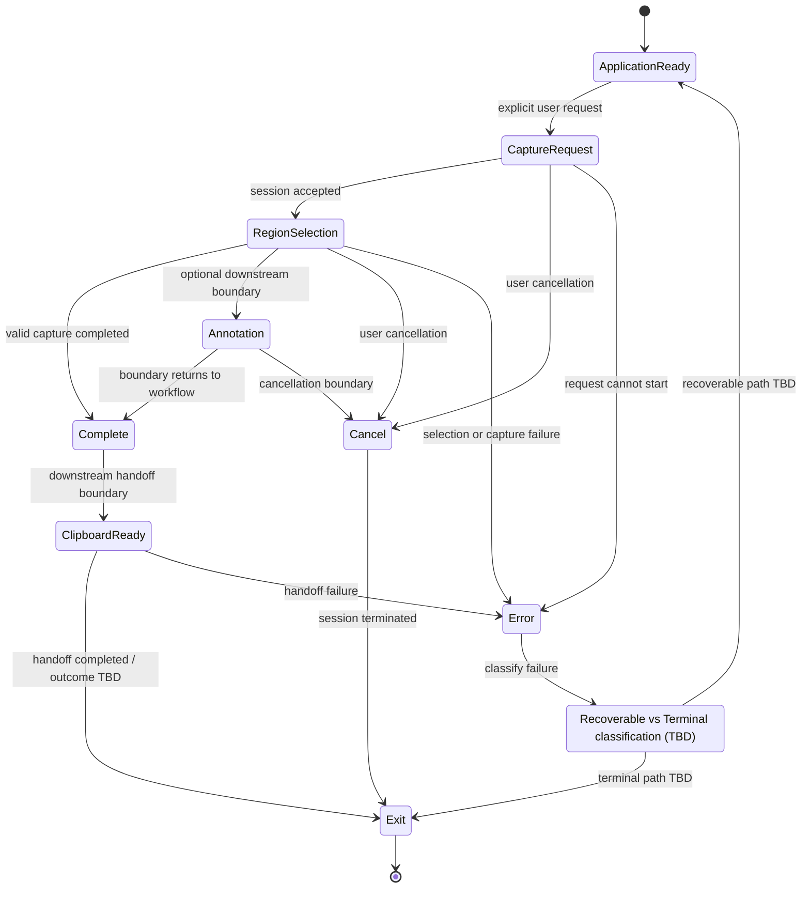

# SPEC-0006 Workflow Boundaries and Feedback

狀態：`Draft`

## 1. Document Control

| Field | Value |
| --- | --- |
| Document ID | `SPEC-0006` |
| Feature ID | `FEAT-005 Workflow Boundaries and Feedback` |
| Status | `Draft` |
| Version | `0.1` |
| Owner | `TBD` |
| Last Reviewed | `Not reviewed` |
| Dependencies | [SPEC-0002](SPEC-0002-specification-guidelines.md)、[SPEC-0003](SPEC-0003-system-requirements.md)、[SPEC-0004](SPEC-0004-feature-catalog.md)、[SPEC-0005](SPEC-0005-capture-workflow.md) |

## 2. Overview

### Purpose

本 Spec 定義 SnipPlus 在工作流程完成、使用者取消、流程失敗、後續交接異常與外部中斷時的共同行為邊界。它讓 `FEAT-001` 至 `FEAT-004` 使用一致的狀態語彙與回饋責任，不替任何 Feature 決定內部實作。

### Scope

本 Spec 涵蓋：

- Successful completion、User cancellation、Recoverable failure、Terminal failure、Downstream handoff failure 與 External interruption 的邊界分類。
- Session 是否產生完成結果，以及結果是否已交給下一個能力的區分。
- Cancel、Error、Exit 與安全狀態之間的狀態轉換邊界。
- Feedback 必須傳達的品質與責任，不指定呈現介面。
- `FEAT-001`、`FEAT-002`、`FEAT-003`、`FEAT-004` 與 `FEAT-005` 的錯誤責任分界。

### Out of scope

- Capture、Annotation、Clipboard 或 Output 的內部行為。
- Toast、Dialog、MessageBox、Notification、Icon、音效、顏色、文案或其他 UI 外觀。
- Exception Class、Logging Framework、Telemetry、Crash Reporting 或 Retry API。
- WPF、WinUI、C#、.NET、Windows Graphics Capture、GDI、SkiaSharp 或任何其他技術方案。
- 具體快捷鍵、控制項、視窗尺寸、動畫與回饋通道。

## 3. Requirements Mapping

| Feature | FR | SR | NFR | Upstream PRD |
| --- | --- | --- | --- | --- |
| `FEAT-005 Workflow Boundaries and Feedback` | `FR-009`、`FR-010`、`FR-011` | `SR-001`、`SR-002`、`SR-005` | `NFR-002`、`NFR-003`、`NFR-004`、`NFR-006`、`NFR-008`、`NFR-012` | [PRD-0002](../PRD/PRD-0002-user-experience-principles.md)、[PRD-0003](../PRD/PRD-0003-product-vision.md)、[PRD-0004](../PRD/PRD-0004-core-workflow.md)、[PRD-0005](../PRD/PRD-0005-functional-requirements.md)、[PRD-0006](../PRD/PRD-0006-non-functional-requirements.md) |

### Specification governance sources

- [SPEC-0002 Specification Guidelines](SPEC-0002-specification-guidelines.md)
- [SPEC-0003 System Requirements](SPEC-0003-system-requirements.md)
- [SPEC-0004 Feature Catalog](SPEC-0004-feature-catalog.md)
- [SPEC-0005 Capture Workflow](SPEC-0005-capture-workflow.md)

本文件只使用上游已存在的 Feature、FR、SR、NFR 與 PRD，不新增產品需求或技術決策。

`FR-003` 僅在 `SPEC-0006-AC-004` 用來說明「結果已產生」與「下游 handoff 已完成」的邊界，不擴張 `FEAT-005` 的產品範圍。

## 3.1 Boundary Taxonomy

| Boundary | Definition | FEAT-005 responsibility | Classification status |
| --- | --- | --- | --- |
| Successful completion | 目前工作的 Active Feature 已回報可交付的完成結果。 | 確保完成、取消與失敗不被混為一談。 | Contract boundary；下游交接是否同時算作完成：`TBD`。 |
| User cancellation | 使用者主動終止尚未完成的工作流程。 | 確保取消後不產生新的完成結果，並結束或回到安全狀態。 | Cancel trigger 與部分狀態的可取消性：`TBD`。 |
| Recoverable failure | 當前 Session 仍可能繼續或重新操作的失敗。 | 保留可恢復與不可恢復的語意差異，不決定 recovery implementation。 | 哪些 failure 屬於此類：`TBD`。 |
| Terminal failure | 當前 Session 無法繼續的失敗。 | 讓 Session 結束，且不誤報為成功。 | 具體分類與後續安全狀態：`TBD`。 |
| Downstream handoff failure | Active Feature 已產生結果，但交給下一能力時失敗。 | 保留 capture/result 已完成與 handoff 未完成的差異。 | 部分成功的產品語意：`TBD`。 |
| External interruption | Focus、Display、OS 或其他外部條件造成的中斷。 | 將中斷與使用者取消、一般 failure 分開記錄。 | 是否恢復、重試或終止：`TBD`。 |

不得將尚未決定的 failure 分類寫成已確認的產品行為。

## 3.2 Completion Boundary

工作流程在符合下列抽象條件時，才可進入 `Complete`：

- 目前 Active Feature 已回報一次可交付的 capture result 或對應結果。
- 結果尚未交給下一能力的事實，不得被誤寫成下一能力已成功接收。
- 完成、取消、失敗與交接異常必須能被區分。
- 完成後是否仍可修改結果，以及下游 handoff 失敗是否改變整體狀態：`TBD`。
- 取消或 Terminal Failure 不得產生新的 completed result。

本節只定義狀態與責任邊界，不定義 result 的資料格式、保存方式或傳遞技術。

## 3.3 Cancellation Boundary

取消適用於尚未進入已確認完成的工作狀態；精確觸發方式與各狀態的可取消性仍須以 runtime verification 與後續決策確認。

| State | Cancellation boundary | Result rule | Verification |
| --- | --- | --- | --- |
| `Capture Request` | 可提出取消要求，結束目前尚未完成的 Session。 | 不產生 completed result。 | Cancel trigger：`UNKNOWN`。 |
| `Region Selection` | 可提出取消要求，停止目前 selection 流程。 | 不產生 completed result。 | Exact behavior：`UNKNOWN`。 |
| `Annotation` | 若使用者仍在可選的後續能力中，取消責任由共同邊界承接。 | 不把未完成流程誤報為成功。 | 具體行為：`TBD`。 |
| `Complete` | 已完成狀態是否還有取消語意：`TBD`。 | 不得回溯抹除已回報的完成事實。 | Product rule：`TBD`。 |
| `Clipboard Ready` | 下游 handoff 期間是否允許取消：`TBD`。 | 不得將未完成 handoff 誤報為完整成功。 | Runtime behavior：`UNKNOWN`。 |
| `Cancel`、`Exit` | 已進入終止狀態，不再接受同一 Session 的新取消事件。 | 不建立新結果。 | Logical contract。 |

`Esc`、右鍵、按鈕或其他具體操作若未經確認，必須維持 `UNKNOWN`，不得在本 Spec 內指定。

## 3.4 Failure Boundary

| Failure boundary | Minimum boundary rule | Owning detail |
| --- | --- | --- |
| Capture Request cannot start | 不建立 completed result；目前 Session 的狀態必須可被辨識。 | `FEAT-001` 的開始條件；回饋與終止邊界由 `FEAT-005` 統一。 |
| Selection cannot complete | 不得把未完成 selection 當成成功 capture；recoverability：`TBD`。 | `FEAT-001` 的 selection 詳細行為。 |
| Capture result cannot be produced | 工作流程不得進入成功完成語意；terminal 或 recoverable 分類：`TBD`。 | `FEAT-001` 的 capture 詳細行為。 |
| Annotation operation fails | 保留 capture result 與 annotation failure 的差異，不吞併 `FEAT-002` 內部錯誤。 | `FEAT-002`。 |
| Clipboard handoff fails | 保留 result 已產生但 downstream handoff 未完成的差異。 | `FEAT-003`。 |
| Output generation fails | 不得將 output failure 誤報為完整 output success。 | `FEAT-004`。 |
| Session state is inconsistent | 不繼續猜測下一狀態；recoverable 或 terminal：`TBD`。 | `FEAT-005` 的共同狀態邊界。 |
| External interruption | 將中斷與使用者取消分開；是否恢復、重試或終止：`TBD`。 | 平台與 runtime 行為另行確認。 |

本 Spec 定義 failure boundary，不設計 recovery implementation、retry policy 或 logging implementation。

## 3.5 Feedback Requirements

Feedback 是讓使用者理解目前結果與下一步狀態的抽象能力，不等於特定 UI 元件或訊息通道。

- 回饋必須與目前的完成、取消、失敗或 handoff 問題相關。
- 回饋不得讓使用者誤以為未完成操作已成功。
- 回饋不得直接暴露未處理的技術例外、內部狀態或敏感資訊。
- 回饋不得破壞使用者目前的工作脈絡；是否保留可用結果：依 owning Feature 與 `TBD` 狀態處理。
- Recoverable 與 Terminal Failure 的語意應能區分；具體分類尚未決定時必須標示 `TBD`。
- Accessibility 方向必須被保留，但本 Spec 不指定 UI、音效、顏色、Icon、文案或呈現通道。
- 若操作無法繼續，應有與問題相符的狀態回饋；回饋本身無法呈現時的行為：`TBD`。

## 3.6 State Transitions

狀態名稱沿用 [SPEC-0003 System Requirements](SPEC-0003-system-requirements.md) 與 [SPEC-0005 Capture Workflow](SPEC-0005-capture-workflow.md)，不建立第二套狀態模型。

| Current state | Event | Next state | Result produced | Feedback required | Verification |
| --- | --- | --- | --- | --- | --- |
| `Application Ready` | 使用者提出合法 request。 | `Capture Request` | No。 | No failure feedback。 | Upstream contract。 |
| `Capture Request` | Request 無法開始。 | `Error` | No completed result。 | Yes；具體通道：`TBD`。 | Behavior：`UNKNOWN`。 |
| `Capture Request` | 使用者取消。 | `Cancel` | No。 | Cancellation feedback：`TBD`。 | Trigger：`UNKNOWN`。 |
| `Region Selection` | 形成有效 selection 並完成 capture。 | `Complete` | Yes。 | No failure feedback。 | Upstream contract。 |
| `Region Selection` | 使用者取消。 | `Cancel` | No。 | Cancellation feedback：`TBD`。 | Trigger：`UNKNOWN`。 |
| `Region Selection` | Selection 或 capture failure。 | `Error` | No completed result。 | Yes；分類：`TBD`。 | Runtime：`UNKNOWN`。 |
| `Annotation` | 進入或離開後續能力的 boundary。 | `Complete` 或下一 Feature 的責任範圍。 | Existing result status preserved。 | `TBD`。 | Handoff：`UNKNOWN`。 |
| `Complete` | 交給 downstream consumer。 | `Clipboard Ready` 或下一 Feature 的責任範圍。 | Existing result exists；handoff：`TBD`。 | `TBD`。 | Downstream behavior：`UNKNOWN`。 |
| `Clipboard Ready` | Handoff failure。 | `Error`。 | Result may exist；not full handoff success。 | Yes；具體通道：`TBD`。 | Runtime：`UNKNOWN`。 |
| Any active state | External interruption。 | `Error` 或安全終止狀態：`TBD`。 | 不新增 completed result。 | Yes；恢復語意：`TBD`。 | `UNKNOWN`。 |
| `Error` | Failure 被分類為 recoverable。 | `Application Ready` 或其他安全狀態：`TBD`。 | No new result。 | Required；內容：`TBD`。 | `UNKNOWN`。 |
| `Error` | Failure 被分類為 terminal。 | `Exit`。 | No new result。 | Required；內容：`TBD`。 | `UNKNOWN`。 |
| Any state | Unknown event。 | 不建立未定義轉換；處理方式：`TBD`。 | 不新增 completed result。 | `TBD`。 | `UNKNOWN`。 |

## 3.7 State Diagram



圖中 `TBD` 與 `UNKNOWN` 是未決或未驗證邊界，不代表已選定 recovery、retry 或終止方案。

## 3.8 Feedback Sequence

```mermaid
sequenceDiagram
    participant User
    participant AF as Active Feature
    participant WF as Workflow Boundary
    participant FB as Feedback Capability
    participant DC as Downstream Consumer

    User->>AF: initiate, cancel, or receive result
    AF->>WF: report completion, cancellation, failure, or handoff status

    alt Successful completion
        WF-->>User: expose completed state without failure ambiguity
        WF->>DC: handoff boundary when applicable
    else User cancellation
        WF->>FB: evaluate cancellation boundary
        FB-->>User: cancellation state; presentation TBD
    else Failure or interruption
        WF->>FB: provide classified boundary status
        FB-->>User: relevant feedback without internal technical details
    end
```

參與者是抽象責任，不對應任何 Class、Service、API 或 Framework。

## 3.9 Cross-feature Responsibilities

| Scenario | Owning Feature | FEAT-005 responsibility | Deferred detail |
| --- | --- | --- | --- |
| Capture cannot start | `FEAT-001` | 定義不可誤報成功、Session 邊界與回饋責任。 | Capture start implementation、失敗分類與具體回饋。 |
| Annotation operation fails | `FEAT-002` | 維持共同 failure、handoff 與 Session 結束語意。 | Annotation 內部行為與修復方式。 |
| Clipboard handoff fails | `FEAT-003` | 區分 result exists 與 downstream handoff success。 | Clipboard 詳細規則與失敗處理。 |
| Output generation fails | `FEAT-004` | 維持 output failure 不等於完整成功。 | Output 詳細規則與失敗處理。 |
| Cancel or terminal workflow exit | `FEAT-005` | 定義共同取消、終止、狀態與 feedback boundary。 | 具體觸發方式、恢復策略與呈現通道。 |

`FEAT-005` 負責共同邊界與回饋品質，不吞併其他 Feature 的內部錯誤處理。

## 3.10 Edge Cases

只記錄邊界、風險與 `UNKNOWN/TBD`，不在本 Spec 內決定技術方案：

- 同一 Session 收到重複取消。
- 完成與取消幾乎同時發生。
- Failure 發生後又收到完成事件。
- 下游交接部分成功。
- 使用者快速重複提出 Capture Request。
- Feedback 本身無法呈現。
- Focus loss。
- 顯示器、DPI 或 HDR 條件改變。
- 應用程式關閉或作業系統中斷。
- 未知狀態或無效狀態轉換。
- Active Feature 已有 result，但下一能力拒絕或無法接受。
- Recoverable 與 Terminal 的分類尚未由產品或驗證確認。

## 3.11 Acceptance Criteria

每項 Acceptance Criteria 都必須能回溯至本文件的 FR、SR 與 NFR；具體實作方式不屬於本 Spec。

- `SPEC-0006-AC-001`：成功、取消、Recoverable Failure、Terminal Failure 與 Downstream Handoff Failure 的結果語意可區分；引用 `FR-009`、`FR-010`、`FR-011`、`SR-001`、`SR-005`、`NFR-002`、`NFR-003`。
- `SPEC-0006-AC-002`：在允許取消的未完成狀態中，取消不產生新的 completed result；引用 `FR-010`、`SR-001`、`SR-002`、`NFR-002`、`NFR-003`。
- `SPEC-0006-AC-003`：Terminal Failure 結束目前 Session，且不得被誤報為成功；引用 `FR-009`、`FR-011`、`SR-001`、`SR-005`、`NFR-002`、`NFR-003`。
- `SPEC-0006-AC-004`：Downstream Handoff Failure 不得被誤判為完整成功，並保留 result 已產生與 handoff 未完成的差異；引用 `FR-003`、`FR-009`、`FR-011`、`SR-001`、`SR-005`、`NFR-002`、`NFR-003`。
- `SPEC-0006-AC-005`：Feedback 與當前問題相關，不暴露未處理的技術細節，也不破壞使用者工作脈絡；引用 `FR-011`、`SR-005`、`NFR-003`、`NFR-004`、`NFR-006`、`NFR-008`、`NFR-012`。
- `SPEC-0006-AC-006`：狀態轉換使用 `SPEC-0003` 與 `SPEC-0005` 的既有狀態語彙，不建立衝突的第二套流程；引用 `FR-009`、`FR-010`、`SR-001`、`SR-002`、`SR-005`、`NFR-008`。
- `SPEC-0006-AC-007`：`FEAT-001` 至 `FEAT-004` 的內部 failure responsibility 與 `FEAT-005` 的共同邊界 responsibility 清楚分離；引用 `FR-011`、`SR-001`、`SR-005`、`NFR-008`、`NFR-012`。
- `SPEC-0006-AC-008`：未經 runtime 或產品決策確認的行為維持 `UNKNOWN/TBD`，不被文件寫成確定功能；引用 `FR-011`、`SR-005`、`NFR-008`、`NFR-012`。
- `SPEC-0006-AC-009`：本文件不定義 UI、API、Framework、Class、Retry Policy 或實作策略；引用 `FR-011`、`SR-005`、`NFR-008`、`NFR-012`。

## 3.12 Open Questions

只保留與 `FEAT-005` 直接相關的問題：

- 哪些 Failure 屬於 Recoverable，哪些屬於 Terminal？
- 是否允許 Retry？若允許，產品語意為何？
- Cancel 的具體觸發方式與各狀態可取消性為何？
- Feedback 的呈現通道為何？
- Handoff 部分成功如何定義？
- Feedback 無法呈現時的行為為何？
- Application 或 OS 中斷後是否恢復 Session？
- Complete 後是否仍可修改結果？
- Runtime verification 尚未完成的行為何時確認？

## 4. 禁止事項

本任務不得建立或修改：

- `SPEC-0007` 或其他 Feature Spec。
- Clipboard、Output、Annotation、Overlay、Toolbar 的 Feature Spec。
- Architecture、ADR、Source code、Solution、Project 或 Tests。

本任務不得決定：

- WPF、WinUI、C#、.NET 或其他 framework。
- Exception Class、Logging Framework、Notification API、Telemetry 或 Crash Reporting。
- Retry Policy implementation。
- Dialog、Toast、MessageBox、UI 文案、顏色、動畫或尺寸。

不得修改 Frozen PRD。

## 5. 允許最小同步更新

主要交付物為：

- `Specs/SPEC-0006-workflow-boundaries-and-feedback.md`

允許最小更新：

- `Specs/README.md`
- `docs/index.md`
- `CHANGELOG.md`
- `TODO.md`

同步更新只能新增文件連結、Draft 狀態與待 Review 項目，不得新增需求、Feature 或產品決策。

## 6. 完成條件

必須滿足：

- 本文件存在，狀態為 `Draft`，且明確對應 `FEAT-005`。
- FR、SR、NFR、PRD 與上游 Spec 可追溯。
- 包含 Boundary Taxonomy、狀態轉換表、Mermaid State Diagram 與 Mermaid Sequence Diagram。
- 包含 Cross-feature Responsibilities、Edge Cases、Acceptance Criteria 與 Open Questions。
- 沒有修改 Frozen PRD。
- 沒有建立其他 Feature Spec、Architecture 或程式碼。
- Markdown 相對連結與 `git diff --check` 通過。

完成本 Spec 與必要的最小索引更新後立即停止；不要自行開始 `FEAT-002`、`FEAT-003`、`FEAT-004`、Overlay、Toolbar、Architecture 或 Coding。
