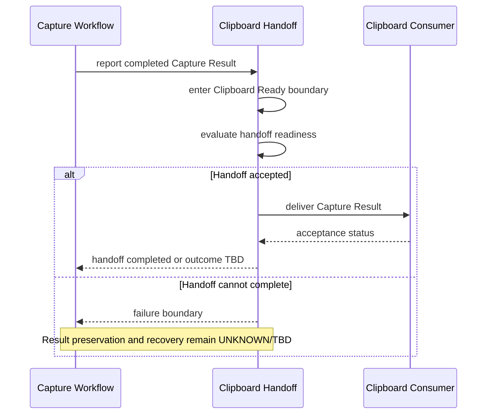

# SPEC-0007 Clipboard Handoff

狀態：`Draft`

## 1. Document Control

| Field | Value |
| --- | --- |
| Document ID | `SPEC-0007` |
| Feature ID | `FEAT-003 Clipboard Handoff` |
| Status | `Draft` |
| Version | `0.1` |
| Owner | `TBD` |
| Last Reviewed | `Not reviewed` |
| Dependencies | [SPEC-0002](SPEC-0002-specification-guidelines.md)、[SPEC-0003](SPEC-0003-system-requirements.md)、[SPEC-0004](SPEC-0004-feature-catalog.md)、[SPEC-0006](SPEC-0006-workflow-boundaries-and-feedback.md) |

## 1.1 Normative References

以下文件對本 Spec 具有約束力：

- [PRD-0004 Core Workflow](../PRD/PRD-0004-core-workflow.md)
- [PRD-0005 Functional Requirements](../PRD/PRD-0005-functional-requirements.md)
- [PRD-0006 Non-functional Requirements](../PRD/PRD-0006-non-functional-requirements.md)
- [SPEC-0003 System Requirements](SPEC-0003-system-requirements.md)
- [SPEC-0004 Feature Catalog](SPEC-0004-feature-catalog.md)
- [SPEC-0006 Workflow Boundaries and Feedback](SPEC-0006-workflow-boundaries-and-feedback.md)

## 1.2 Informative References

以下文件提供背景或相鄰流程參考，不在本 Spec 內新增約束：

- [PRD-0002 User Experience Principles](../PRD/PRD-0002-user-experience-principles.md)
- [PRD-0003 Product Vision](../PRD/PRD-0003-product-vision.md)
- [SPEC-0005 Capture Workflow](SPEC-0005-capture-workflow.md)

## 2. Overview

### Purpose

本 Spec 定義完成的 Capture Result 如何跨越 `FEAT-001` 與 `FEAT-003` 的責任邊界，進入 `Clipboard Ready` 並交付給抽象的 Clipboard Consumer。

本文件回答的唯一產品問題是：

> Capture Result 如何交付至 Clipboard Consumer？

本文件不回答 Clipboard 如何寫入、使用何種資料格式或使用何種平台技術。

### Scope

本 Spec 涵蓋：

- Capture Result 進入 Clipboard Handoff 的前提。
- `Capture`、`Clipboard Ready` 與 `Clipboard Consumer` 之間的交付邊界。
- `FEAT-003` 何時開始負責、何時停止負責。
- Handoff success、handoff failure 與 result 是否仍存在的邊界。
- Clipboard 相關的 logical state、抽象 sequence 與可驗收條件。

### Out of scope

- Clipboard API、作業系統 API、記憶體物件、影像資料格式或編碼。
- Capture Result 的建立、選取、Annotation 或 Output 內部行為。
- UI、通知、錯誤畫面、快捷鍵、視窗尺寸或呈現通道。
- Retry、Logging、Telemetry、Crash Reporting 或 recovery implementation。
- 任何 cloud storage、cloud sync、外部傳輸或未經決策的外部處理。

## 3. Requirements Mapping

| Feature | FR | SR | Related NFR | Upstream PRD |
| --- | --- | --- | --- | --- |
| `FEAT-003 Clipboard Handoff` | `FR-007`；handoff failure feedback 參照 `FR-011` | `SR-004`；shared lifecycle 參照 `SR-001`、`SR-005` | `NFR-001`、`NFR-002`、`NFR-003`、`NFR-004`、`NFR-006`、`NFR-008`、`NFR-011` | [PRD-0004](../PRD/PRD-0004-core-workflow.md)、[PRD-0005](../PRD/PRD-0005-functional-requirements.md)、[PRD-0006](../PRD/PRD-0006-non-functional-requirements.md) |

### Specification governance sources

- [SPEC-0002 Specification Guidelines](SPEC-0002-specification-guidelines.md)
- [SPEC-0003 System Requirements](SPEC-0003-system-requirements.md)
- [SPEC-0004 Feature Catalog](SPEC-0004-feature-catalog.md)
- [SPEC-0006 Workflow Boundaries and Feedback](SPEC-0006-workflow-boundaries-and-feedback.md)

`FEAT-003` 只承接完成結果的交付責任；`FR-011`、`SR-001` 與 `SR-005` 只在 failure、shared lifecycle 與 shared state boundary 需要時引用，不擴張 Clipboard Handoff 的產品範圍。

## 4. Handoff Boundary

```text
Capture Result → Clipboard Ready → Clipboard Consumer
```

| Boundary stage | Meaning | Owning responsibility | Status |
| --- | --- | --- | --- |
| `Capture Result` | `FEAT-001` 已產生可交付的完成結果。 | `FEAT-001` 負責 result 產生與完成判定。 | 由 Capture Workflow 定義；result 詳細內容不在本 Spec。 |
| `Clipboard Ready` | Result 已達到可以交給 Clipboard Handoff 的 logical boundary。 | `FEAT-003` 從此開始負責交付邊界與狀態區分。 | `SR-004` contract；具體 runtime 行為：`UNKNOWN`。 |
| `Clipboard Consumer` | 抽象的下一個工作脈絡或消費者，接收交付結果。 | Consumer 的內部行為不屬於 `FEAT-003`。 | Consumer acceptance 與具體通道：`UNKNOWN/TBD`。 |

`Clipboard Ready` 表示結果已可交付，不自動等同於 Clipboard Consumer 已接受結果。Handoff success 的判定與 Consumer 回報仍須維持可觀察的邊界。

## 5. Ownership

### FEAT-003 starts owning

`FEAT-003` 在下列條件成立後開始負責：

- 上游 Capture Workflow 已進入 `Complete` 語意。
- Capture Result 已被標示為可交付。
- 工作流程進入 `Clipboard Ready` boundary。

### FEAT-003 stops owning

`FEAT-003` 在下列抽象結果之一成立時停止目前 handoff responsibility：

- Clipboard Consumer 已接收結果，handoff outcome 為 completed。
- Handoff 無法完成，進入 [SPEC-0006 Workflow Boundaries and Feedback](SPEC-0006-workflow-boundaries-and-feedback.md) 的 failure boundary。
- Session 進入 `Exit`、`Cancel` 或其他共同終止狀態；具體 side effect：`UNKNOWN`。

### Responsibility boundaries

| Responsibility | Owning Feature | Not owned by FEAT-003 |
| --- | --- | --- |
| Produce Capture Result | `FEAT-001` | Result 的 capture、selection 與完成細節。 |
| Optional Annotation | `FEAT-002` | Annotation 的內部行為與後續修改。 |
| Deliver result to Clipboard Consumer | `FEAT-003` | Consumer 的內部處理與資料消費。 |
| Produce other capture output | `FEAT-004` | Output 產出、保存與其他交付方式。 |
| Common cancel/error boundary | `FEAT-005` | Feature 內部 failure implementation。 |

## 6. Failure Boundary

| Failure condition | Minimum required boundary | Result status | Verification |
| --- | --- | --- | --- |
| Capture Result 尚未完成 | 不得進入 `Clipboard Ready`。 | No completed handoff。 | Contract boundary。 |
| Result 已完成但無法開始 handoff | 不得回報 Clipboard Consumer 已接受。 | Result preservation：`TBD`。 | Runtime：`UNKNOWN`。 |
| Consumer 無法接受 result | 區分 result 已產生與 handoff 未完成。 | Result may exist；整體 success：`TBD`。 | Consumer behavior：`UNKNOWN`。 |
| Handoff 中斷或外部條件改變 | 進入 shared failure boundary，不自行猜測 recovery。 | Result status：`UNKNOWN`。 | `UNKNOWN`。 |
| Handoff 失敗後要求再次操作 | 是否允許 retry、重複交付或回到安全狀態：`TBD`。 | 不得靜默重複產生結果。 | `UNKNOWN`。 |
| Privacy boundary 不明確 | 不假設 cloud、sync、share 或外部處理。 | External transfer：未決。 | Product decision：`TBD`。 |

Handoff failure 不得被靜默忽略，也不得被誤寫成 `Clipboard Ready` 或完整成功。具體回饋責任引用 [SPEC-0006](SPEC-0006-workflow-boundaries-and-feedback.md)。

## 7. Clipboard State

下列是 `FEAT-003` 的 local handoff state contract；它們不得取代 [SPEC-0003](SPEC-0003-system-requirements.md) 的 shared workflow states。

| Local handoff state | Entry condition | Meaning | Exit boundary | Result status |
| --- | --- | --- | --- | --- |
| `Capture Result Ready` | 上游進入 `Complete`。 | Result 已由上游產生，等待交付責任轉移。 | `Clipboard Ready` 或 shared `Error`。 | Result exists。 |
| `Clipboard Ready` | Result 符合可交付前提。 | Result 可以進入 Clipboard Handoff，不表示 Consumer 已接受。 | `Clipboard Handoff Pending`、`Exit` 或 `Error`。 | Deliverable；acceptance：`TBD`。 |
| `Clipboard Handoff Pending` | Handoff 已開始。 | 交付尚未完成，Consumer outcome 尚未確認。 | `Clipboard Consumer Accepted` 或 `Handoff Error`。 | Result exists；completion：`TBD`。 |
| `Clipboard Consumer Accepted` | 抽象 Consumer 回報接收。 | Handoff outcome 可被視為 completed，確切 workflow exit：依 shared boundary。 | `Exit` 或下一工作脈絡。 | Handoff completed。 |
| `Handoff Error` | Handoff 無法完成或 outcome 不明。 | 交付失敗邊界，不能誤報為成功。 | Shared `Error`、安全狀態或 retry boundary：`TBD`。 | Result preservation：`UNKNOWN`。 |

## 8. Sequence Diagram



參與者是產品責任的抽象名稱，不代表 API、Service、Class 或 Framework。

## 9. Privacy and Context Boundary

- Handoff 只描述 Capture Result 交給 Clipboard Consumer 的產品邊界。
- 不假設結果會被保存、同步、分享、上傳或交給 cloud service。
- 不假設 Consumer 的內容、權限、生命週期或處理方式。
- Handoff failure 不應在未決定時破壞使用者目前工作脈絡；結果是否保留：`UNKNOWN`。
- 任何外部處理都必須另有產品決策與明確文件來源，不由本 Spec 推導。

## 10. Edge Cases

只記錄邊界與未決問題，不在本 Spec 內決定技術方案：

- Capture Result 已完成，但 Clipboard Handoff 尚未開始。
- Capture Result 進入 `Clipboard Ready` 後，Consumer 無法接受。
- Consumer 回報成功與 workflow exit 幾乎同時發生。
- Handoff 完成狀態遺失或無法確認。
- Handoff 失敗後，使用者快速提出下一次 Capture Request。
- Handoff 失敗後，是否仍可使用已產生的 result。
- 目前已有其他 clipboard 內容時的邊界：`UNKNOWN`。
- 多個可能的 Clipboard Consumer：`TBD`。
- Focus loss、Display change 或 OS interruption 發生於 handoff 期間。
- Privacy、permission 或外部處理條件改變。
- Handoff feedback 本身無法呈現。
- Retry、重複交付或重新進入 `Clipboard Ready` 的語意：`TBD`。

## 11. Acceptance Criteria

每項 Acceptance Criteria 都必須能回溯至 `FR`、`SR` 與 `NFR`；具體 API、資料格式與 implementation 不屬於本 Spec。

- `SPEC-0007-AC-001`：只有在 Capture Result 已完成且可交付時，流程才可進入 `Clipboard Ready`；引用 `FR-007`、`SR-004`、`NFR-001`。
- `SPEC-0007-AC-002`：文件清楚區分 `Capture Result` 已存在、`Clipboard Ready` 與 `Clipboard Consumer` 已接受三個邊界；引用 `FR-007`、`SR-001`、`SR-004`、`NFR-002`、`NFR-003`。
- `SPEC-0007-AC-003`：Handoff 以抽象 Consumer 為交付目標，不引入任何 API、平台類別或資料格式決策；引用 `FR-007`、`SR-004`、`NFR-008`、`NFR-011`。
- `SPEC-0007-AC-004`：Consumer 無法接受或 Handoff 中斷時，不得靜默回報完整成功，並必須進入 shared failure boundary；引用 `FR-007`、`FR-011`、`SR-004`、`SR-005`、`NFR-002`、`NFR-003`。
- `SPEC-0007-AC-005`：Clipboard Handoff 的責任從 `Clipboard Ready` 開始，並在 Consumer acceptance、failure 或 shared termination boundary 結束；引用 `FR-007`、`SR-001`、`SR-004`、`SR-005`、`NFR-008`。
- `SPEC-0007-AC-006`：Handoff 的主要流程保留熟悉且可理解的 Windows 工作脈絡，並保留 Accessibility 方向，不指定單一輸入或呈現方式；引用 `FR-007`、`SR-004`、`NFR-004`、`NFR-006`。
- `SPEC-0007-AC-007`：本 Spec 不假設 cloud storage、cloud sync、外部分享或未經決策的外部處理；引用 `FR-007`、`SR-004`、`NFR-008`、`NFR-011`。
- `SPEC-0007-AC-008`：尚未經 runtime 或產品決策確認的 result preservation、retry、Consumer behavior 與 failure recovery 維持 `UNKNOWN/TBD`；引用 `FR-011`、`SR-004`、`SR-005`、`NFR-002`、`NFR-008`。

## 12. Open Questions

- Capture Result 何時正式進入 `Clipboard Ready`？
- `Clipboard Ready` 與 Clipboard Consumer acceptance 是否為兩個可觀察的產品狀態？
- Handoff 是否由 workflow 自動開始，或需要額外使用者動作：`UNKNOWN/TBD`。
- Handoff failure 後，已產生的 result 是否仍可使用：`UNKNOWN`。
- Consumer 無法接受時是否允許 retry 或重新交付：`TBD`。
- Handoff outcome 無法確認時，整體 workflow 應如何分類：`TBD`。
- 目前已有其他 clipboard 內容時的保存或替換邊界：`UNKNOWN`。
- 是否存在多個 Clipboard Consumer，以及其 ownership 如何定義：`TBD`。
- Focus、Display、OS interruption 對 handoff 的影響：`UNKNOWN`。
- Privacy、permission 或任何外部處理是否需要獨立產品決策：`TBD`。

## 13. Forbidden Decisions

本 Spec 不得決定或引入：

- Win32 Clipboard API、Windows API、DataObject。
- Bitmap、PNG、JPEG、CF_DIB、CF_BITMAP 或其他影像資料格式。
- WPF、WinUI、C#、.NET 或任何 framework。
- 具體 API、Class、Service、資料結構、檔案保存或編碼方式。
- UI、通知、錯誤畫面、快捷鍵、顏色、動畫或尺寸。

不得建立 `SPEC-0008`、Annotation、Output、Overlay、Toolbar 的 Spec，不得修改 Frozen PRD、Architecture 或程式碼。

完成本 Spec 後立即停止。
