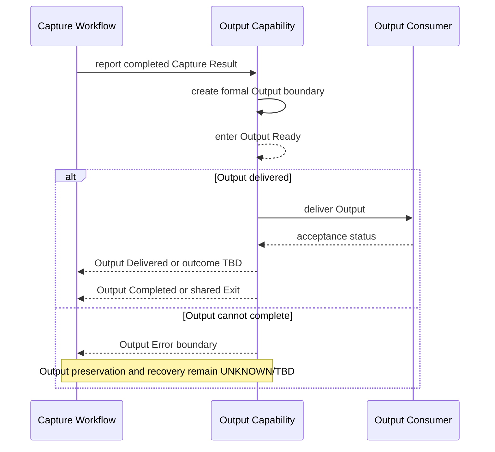

# SPEC-0008 Capture Output

狀態：`Draft`

## 1. Document Control

| Field | Value |
| --- | --- |
| Document ID | `SPEC-0008` |
| Feature ID | `FEAT-004 Capture Output` |
| Status | `Draft` |
| Version | `0.1` |
| Owner | `TBD` |
| Last Reviewed | `Not reviewed` |
| Dependencies | [SPEC-0002](SPEC-0002-specification-guidelines.md)、[SPEC-0003](SPEC-0003-system-requirements.md)、[SPEC-0004](SPEC-0004-feature-catalog.md)、[SPEC-0006](SPEC-0006-workflow-boundaries-and-feedback.md)、[SPEC-0007](SPEC-0007-clipboard-handoff.md) |

## 1.1 Normative References

以下文件對本 Spec 具有約束力：

- [PRD-0003 Product Vision](../PRD/PRD-0003-product-vision.md)
- [PRD-0004 Core Workflow](../PRD/PRD-0004-core-workflow.md)
- [PRD-0005 Functional Requirements](../PRD/PRD-0005-functional-requirements.md)
- [PRD-0006 Non-functional Requirements](../PRD/PRD-0006-non-functional-requirements.md)
- [SPEC-0003 System Requirements](SPEC-0003-system-requirements.md)
- [SPEC-0004 Feature Catalog](SPEC-0004-feature-catalog.md)
- [SPEC-0006 Workflow Boundaries and Feedback](SPEC-0006-workflow-boundaries-and-feedback.md)
- [SPEC-0007 Clipboard Handoff](SPEC-0007-clipboard-handoff.md)

## 1.2 Informative References

以下文件提供背景或相鄰流程參考，不在本 Spec 內新增約束：

- [PRD-0002 User Experience Principles](../PRD/PRD-0002-user-experience-principles.md)
- [SPEC-0005 Capture Workflow](SPEC-0005-capture-workflow.md)

## 2. Overview

### Purpose

本 Spec 定義完成的 Capture Result 如何成為可供使用者繼續處理或交付的正式 Output，並跨越 `FEAT-001` 與 `FEAT-004` 的責任邊界。

本文件回答的唯一產品問題是：

> Capture Result 如何成為正式 Output？

本文件不回答 Output 要存成什麼、存在哪裡或由哪一個平台技術產生。

### Scope

本 Spec 涵蓋：

- Capture Result 進入 Output lifecycle 的前提。
- `Capture Result`、`Output Ready` 與 `Output Consumer` 之間的交付邊界。
- `FEAT-004` 何時開始負責、何時停止負責。
- Output Created、Output Ready、Output Delivered、Output Completed 與 Output Failure 的抽象狀態。
- Output 交付成功、交付失敗與 result 是否仍存在的邊界。

### Non-goals

本 Spec 明確不負責：

- 定義檔案格式。
- 定義儲存位置。
- 定義檔案命名。
- 定義雲端同步。
- 定義分享流程。
- 定義 Save Dialog、檔案保存、File IO、Database 或 Cloud。
- 定義 Output 的影像編碼、壓縮、解析度或 metadata。
- 定義 UI、通知、錯誤畫面、快捷鍵、視窗尺寸或呈現通道。

## 3. Requirements Mapping

| Feature | FR | SR | Related NFR | Upstream PRD |
| --- | --- | --- | --- | --- |
| `FEAT-004 Capture Output` | `FR-008`；completion/failure feedback 參照 `FR-009`、`FR-011` | `SR-001`、`SR-004` | `NFR-001`、`NFR-002`、`NFR-003`、`NFR-004`、`NFR-006`、`NFR-008`、`NFR-011` | [PRD-0003](../PRD/PRD-0003-product-vision.md)、[PRD-0004](../PRD/PRD-0004-core-workflow.md)、[PRD-0005](../PRD/PRD-0005-functional-requirements.md)、[PRD-0006](../PRD/PRD-0006-non-functional-requirements.md) |

### Specification governance sources

- [SPEC-0002 Specification Guidelines](SPEC-0002-specification-guidelines.md)
- [SPEC-0003 System Requirements](SPEC-0003-system-requirements.md)
- [SPEC-0004 Feature Catalog](SPEC-0004-feature-catalog.md)
- [SPEC-0006 Workflow Boundaries and Feedback](SPEC-0006-workflow-boundaries-and-feedback.md)
- [SPEC-0007 Clipboard Handoff](SPEC-0007-clipboard-handoff.md)

`FEAT-004` 只承接 Capture Result 的 Output capability；`FR-009`、`FR-011` 與 `SR-004` 只在 completion、failure、delivery boundary 或相鄰交付責任需要時引用，不擴張 Capture Output 的產品範圍。

## 4. Output Boundary

```text
Capture Result → Output Ready → Output Consumer
```

| Boundary stage | Meaning | Owning responsibility | Status |
| --- | --- | --- | --- |
| `Capture Result` | `FEAT-001` 已產生可供後續使用的完成結果。 | `FEAT-001` 負責 result 產生與 Capture completion。 | 由 Capture Workflow 定義；result 詳細內容不在本 Spec。 |
| `Output Ready` | Result 已被 Output capability 接收並達到可交付狀態。 | `FEAT-004` 開始負責 Output lifecycle 與 delivery boundary。 | `FR-008` contract；具體 runtime 行為：`UNKNOWN`。 |
| `Output Consumer` | 抽象的使用者工作脈絡或下一個能力，接收正式 Output。 | Consumer 內部行為不屬於 `FEAT-004`。 | Consumer acceptance 與具體通道：`UNKNOWN/TBD`。 |

`Output Ready` 表示 Output 已可交付，不自動等同於 Output Consumer 已接受或使用 Output。

## 5. Ownership

### FEAT-004 starts owning

`FEAT-004` 在下列條件成立後開始負責：

- 上游 Capture Workflow 已進入 `Complete` 語意。
- Capture Result 已被標示為可供後續處理或交付。
- Output capability 接受開始建立正式 Output 的責任。

### FEAT-004 stops owning

`FEAT-004` 在下列抽象結果之一成立時停止目前 Output responsibility：

- Output Consumer 已接收 Output，Output lifecycle outcome 為 completed。
- Output 無法交付，進入 [SPEC-0006 Workflow Boundaries and Feedback](SPEC-0006-workflow-boundaries-and-feedback.md) 的 failure boundary。
- Session 進入 `Exit`、`Cancel` 或其他共同終止狀態；具體 side effect：`UNKNOWN`。

### Responsibility boundaries

| Responsibility | Owning Feature | Not owned by FEAT-004 |
| --- | --- | --- |
| Produce Capture Result | `FEAT-001` | Result 的 capture、selection 與完成細節。 |
| Optional Annotation | `FEAT-002` | Annotation 的內部行為與後續修改。 |
| Deliver result to Clipboard | `FEAT-003` | Clipboard Handoff 的內部交付細節。 |
| Produce and deliver formal Output | `FEAT-004` | Output format、storage、file naming 與 consumer 內部處理。 |
| Common cancel/error boundary | `FEAT-005` | Feature 內部 failure implementation。 |

## 6. Output Lifecycle

下列是 `FEAT-004` 的 local Output lifecycle；它不得取代 [SPEC-0003](SPEC-0003-system-requirements.md) 的 shared workflow states。

| Local Output state | Entry condition | Meaning | Exit boundary | Output status |
| --- | --- | --- | --- | --- |
| `Result Created` | 上游進入 `Complete`。 | Capture Result 已產生，尚未由 Output capability 完成承接。 | `Output Ready` 或 shared `Error`。 | Result exists。 |
| `Output Ready` | Output capability 接受 result。 | Output 已達到可供交付的 logical boundary。 | `Output Delivery Pending`、`Output Completed` 或 `Output Error`。 | Output ready；consumer acceptance：`TBD`。 |
| `Output Delivery Pending` | Output 交付已開始。 | 交付尚未完成，Consumer outcome 尚未確認。 | `Output Delivered` 或 `Output Error`。 | Output exists；completion：`TBD`。 |
| `Output Delivered` | Output Consumer 回報已接收。 | Output 已跨越交付 boundary；是否等同 lifecycle completed：`TBD`。 | `Output Completed` 或 shared `Exit`。 | Delivered。 |
| `Output Completed` | Output lifecycle 被判定完成。 | 本次 Output capability 的抽象工作已完成。 | `Exit` 或下一工作脈絡。 | Completed。 |
| `Output Error` | Output 無法建立、交付或確認。 | Output failure boundary，不能誤報為成功。 | Shared `Error`、安全狀態或 retry boundary：`TBD`。 | Output preservation：`UNKNOWN`。 |

## 7. Failure Boundary

| Failure condition | Minimum required boundary | Output status | Verification |
| --- | --- | --- | --- |
| Capture Result 尚未產生 | 不得進入 `Output Ready`。 | No completed output。 | Contract boundary。 |
| Result 已產生但 Output 無法建立 | 不得回報 Output Consumer 已收到。 | Result preservation：`TBD`。 | Runtime：`UNKNOWN`。 |
| Output 無法交付 | 區分 result 已存在、Output 已建立與 Output 未交付。 | Output success：`TBD`。 | `UNKNOWN`。 |
| Output Consumer 無法接受 | 不得靜默回報 `Output Delivered` 或 `Output Completed`。 | Output may exist；consumer acceptance：`UNKNOWN`。 | `UNKNOWN`。 |
| Output 交付中斷或外部條件改變 | 進入 shared failure boundary，不自行猜測 recovery。 | Output status：`UNKNOWN`。 | `UNKNOWN`。 |
| Output failure 後要求再次操作 | 是否允許 retry、重新交付或回到安全狀態：`TBD`。 | 不得靜默重複產生 output。 | `UNKNOWN`。 |
| Privacy boundary 不明確 | 不假設 storage、sync、share 或外部處理。 | External processing：未決。 | Product decision：`TBD`。 |

Output failure 不得被靜默忽略，也不得被誤寫成 `Output Ready`、`Output Delivered` 或完整成功。具體回饋責任引用 [SPEC-0006](SPEC-0006-workflow-boundaries-and-feedback.md)。

## 8. Sequence Diagram



參與者是產品責任的抽象名稱，不代表 API、Service、Class 或 Framework。

## 9. Privacy and Context Boundary

- Output 只描述 Capture Result 成為正式 Output 的產品邊界。
- 不假設 Output 會被保存、同步、分享、上傳或交給 cloud service。
- 不假設 Output Consumer 的內容、權限、生命週期或處理方式。
- Output failure 不應在未決定時破壞使用者目前工作脈絡；result 或 Output 是否保留：`UNKNOWN`。
- 任何外部處理都必須另有產品決策與明確文件來源，不由本 Spec 推導。

## 10. Edge Cases

只記錄邊界與未決問題，不在本 Spec 內決定技術方案：

- Capture Result 已完成，但 Output capability 尚未開始。
- Result 已建立，但 Output 無法進入 `Output Ready`。
- Output 進入 `Output Ready` 後，Consumer 無法接受。
- Consumer 回報成功與 workflow exit 幾乎同時發生。
- Output Delivered 狀態遺失或無法確認。
- Output failure 後，使用者快速提出下一次 Capture Request。
- Output failure 後，是否仍可使用已產生的 result。
- 多個可能的 Output Consumer：`TBD`。
- Focus loss、Display change 或 OS interruption 發生於 Output lifecycle 期間。
- Privacy、permission 或外部處理條件改變。
- Output feedback 本身無法呈現。
- Retry、重新交付或重新進入 `Output Ready` 的語意：`TBD`。

## 11. Acceptance Criteria

每項 Acceptance Criteria 都必須能回溯至 `FR`、`SR` 與 `NFR`；具體檔案、資料格式、儲存方式與 implementation 不屬於本 Spec。

- `SPEC-0008-AC-001`：只有在 Capture Result 已完成且可供後續處理或交付時，流程才可進入 `Output Ready`；引用 `FR-008`、`SR-001`、`SR-004`、`NFR-001`。
- `SPEC-0008-AC-002`：文件清楚區分 `Result Created`、`Output Ready`、`Output Delivered` 與 `Output Completed`；引用 `FR-008`、`SR-001`、`SR-004`、`NFR-008`。
- `SPEC-0008-AC-003`：Output 以抽象 Consumer 為交付目標，不引入任何檔案格式、儲存位置、Save Dialog、API 或平台類別決策；引用 `FR-008`、`SR-004`、`NFR-008`、`NFR-011`。
- `SPEC-0008-AC-004`：Output 無法建立、交付或被 Consumer 接受時，不得靜默回報完整成功，並必須進入 shared failure boundary；引用 `FR-008`、`FR-011`、`SR-001`、`SR-004`、`NFR-002`、`NFR-003`。
- `SPEC-0008-AC-005`：`FEAT-004` 的責任從 Output capability 接受 Capture Result 開始，並在 Consumer acceptance、failure 或 shared termination boundary 結束；引用 `FR-008`、`SR-001`、`SR-004`、`NFR-008`。
- `SPEC-0008-AC-006`：Output lifecycle 保留熟悉且可理解的 Windows 工作脈絡，並保留 Accessibility 方向，不指定單一輸入或呈現方式；引用 `FR-008`、`SR-001`、`NFR-004`、`NFR-006`。
- `SPEC-0008-AC-007`：本 Spec 不假設 storage、cloud sync、sharing、external processing 或其他未經決策的資料保存與傳輸；引用 `FR-008`、`SR-004`、`NFR-008`、`NFR-011`。
- `SPEC-0008-AC-008`：尚未經 runtime 或產品決策確認的 Output preservation、retry、Consumer behavior 與 failure recovery 維持 `UNKNOWN/TBD`；引用 `FR-011`、`SR-001`、`SR-004`、`NFR-002`、`NFR-008`。

## 12. Open Questions

- Capture Result 何時正式進入 `Output Ready`？
- `Output Ready`、`Output Delivered` 與 `Output Completed` 是否為三個可觀察的產品狀態？
- Output lifecycle 是否由 workflow 自動開始，或需要額外使用者動作：`UNKNOWN/TBD`。
- Output failure 後，已產生的 result 或 Output 是否仍可使用：`UNKNOWN`。
- Consumer 無法接受時是否允許 retry 或重新交付：`TBD`。
- Output outcome 無法確認時，整體 workflow 應如何分類：`TBD`。
- 是否存在多個 Output Consumer，以及其 ownership 如何定義：`TBD`。
- Focus、Display、OS interruption 對 Output lifecycle 的影響：`UNKNOWN`。
- Privacy、permission 或任何外部處理是否需要獨立產品決策：`TBD`。

## 13. Forbidden Decisions

本 Spec 不得決定或引入：

- PNG、JPEG、BMP、TIFF 或任何檔案格式。
- 檔案儲存、儲存位置、檔案命名、Save Dialog、File IO 或 Database。
- Windows API、Win32 或任何平台檔案技術。
- Cloud、cloud sync、sharing 或未經決策的 external processing。
- 具體 API、Class、Service、資料結構、編碼、壓縮或 metadata。
- UI、通知、錯誤畫面、快捷鍵、顏色、動畫或尺寸。

不得建立 `SPEC-0009`、Annotation、Overlay、Toolbar、OCR、AI 的 Spec，不得修改 Frozen PRD、Architecture 或程式碼。

完成本 Spec 後立即停止。
