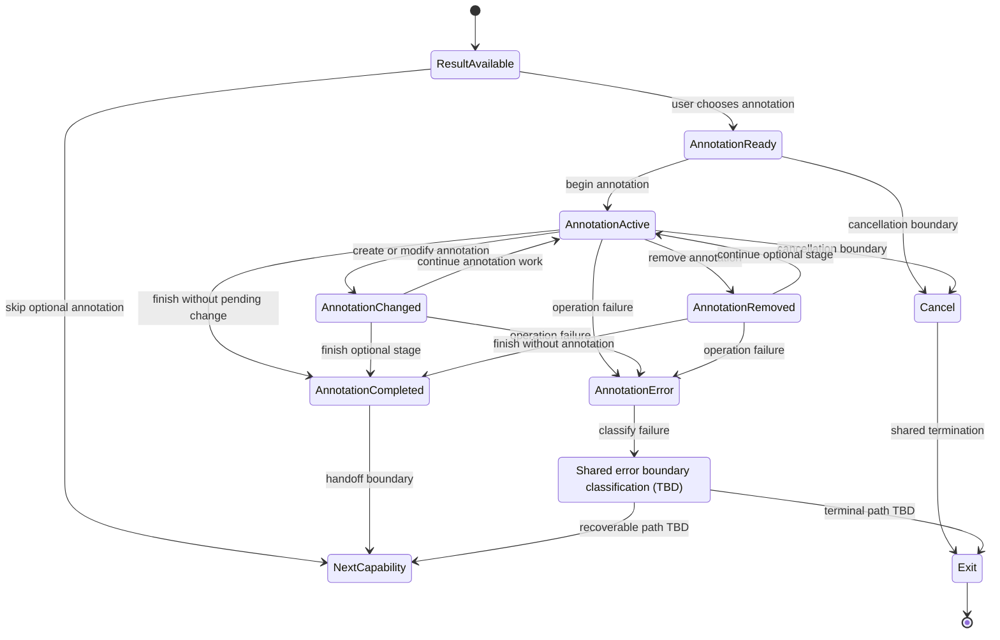
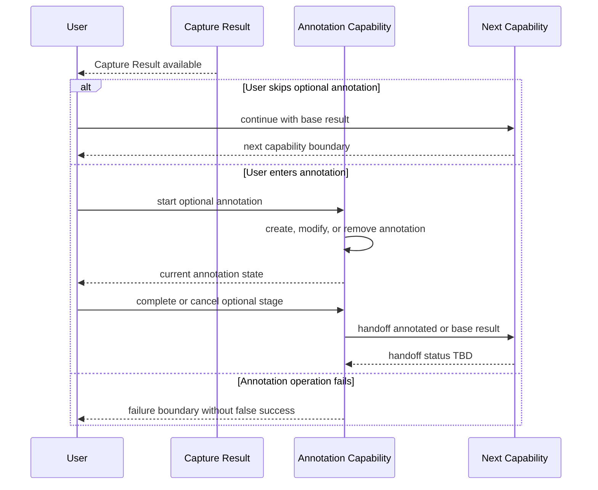

# SPEC-0009 Annotation Capability

狀態：`Draft`

## 1. Document Control

| Field | Value |
| --- | --- |
| Document ID | `SPEC-0009` |
| Feature ID | `FEAT-002 Annotation` |
| Status | `Draft` |
| Version | `0.1` |
| Owner | `TBD` |
| Last Reviewed | `Not reviewed` |
| Dependencies | [SPEC-0002](SPEC-0002-specification-guidelines.md)、[SPEC-0003](SPEC-0003-system-requirements.md)、[SPEC-0004](SPEC-0004-feature-catalog.md)、[SPEC-0006](SPEC-0006-workflow-boundaries-and-feedback.md)、[SPEC-0007](SPEC-0007-clipboard-handoff.md)、[SPEC-0008](SPEC-0008-capture-output.md) |

## 1.1 Normative References

以下文件對本 Spec 具有約束力：

- [PRD-0002 User Experience Principles](../PRD/PRD-0002-user-experience-principles.md)
- [PRD-0004 Core Workflow](../PRD/PRD-0004-core-workflow.md)
- [PRD-0005 Functional Requirements](../PRD/PRD-0005-functional-requirements.md)
- [PRD-0006 Non-functional Requirements](../PRD/PRD-0006-non-functional-requirements.md)
- [SPEC-0003 System Requirements](SPEC-0003-system-requirements.md)
- [SPEC-0004 Feature Catalog](SPEC-0004-feature-catalog.md)
- [SPEC-0006 Workflow Boundaries and Feedback](SPEC-0006-workflow-boundaries-and-feedback.md)

## 1.2 Informative References

以下文件提供背景或相鄰流程參考，不在本 Spec 內新增約束：

- [PRD-0003 Product Vision](../PRD/PRD-0003-product-vision.md)
- [SPEC-0005 Capture Workflow](SPEC-0005-capture-workflow.md)
- [SPEC-0007 Clipboard Handoff](SPEC-0007-clipboard-handoff.md)
- [SPEC-0008 Capture Output](SPEC-0008-capture-output.md)

## 2. Overview

### Purpose

本 Spec 定義使用者是否能在 Capture Result 上建立、修改與移除 Annotation，以及這些操作如何維持 optional workflow 的邊界。

本文件回答的唯一產品問題是：

> SnipPlus 是否支援在 Capture Result 上建立、修改與移除 Annotation capability？

本文件不回答有哪些 Annotation Tool，也不把任何工具視為已核准的產品能力。

### Scope

本 Spec 只描述：

- 在 Capture Result 上建立 Annotation。
- 修改已建立的 Annotation，而不要求重新建立整個 Capture Result。
- 移除已建立的 Annotation，並保留 Capture Result 的後續處理能力。
- 使用者略過 Annotation，直接進入基本流程的下一個責任邊界。
- Annotation capability 的 optional lifecycle、ownership、state transition 與 failure boundary。

### Non-goals

本 Spec 明確不負責：

- 定義任何 Annotation Tool。
- 定義工具列、Overlay、控制項或視覺布局。
- 定義顏色、筆刷、快捷鍵、圖層或 interaction gesture。
- 定義 Arrow、Rectangle、Ellipse、Text、Mosaic、Blur、Pen、Highlighter、Number、Sticker 或其他工具。
- 定義 AI、OCR、Plugin、History、Undo、Redo 或 collaboration。
- 定義 Annotation object format、serialization、storage format 或 persistence。
- 定義 Output、Clipboard、分享、雲端同步或外部傳輸的內部行為。

## 3. Requirements Mapping

| Feature | FR | SR | Related NFR | Upstream PRD |
| --- | --- | --- | --- | --- |
| `FEAT-002 Annotation` | `FR-004`、`FR-005`、`FR-006`；optional flow 參照 `FR-003` | `SR-003`、`SR-005` | `NFR-001`、`NFR-002`、`NFR-003`、`NFR-004`、`NFR-005`、`NFR-006`、`NFR-008`、`NFR-010` | [PRD-0002](../PRD/PRD-0002-user-experience-principles.md)、[PRD-0004](../PRD/PRD-0004-core-workflow.md)、[PRD-0005](../PRD/PRD-0005-functional-requirements.md)、[PRD-0006](../PRD/PRD-0006-non-functional-requirements.md) |

### Specification governance sources

- [SPEC-0002 Specification Guidelines](SPEC-0002-specification-guidelines.md)
- [SPEC-0003 System Requirements](SPEC-0003-system-requirements.md)
- [SPEC-0004 Feature Catalog](SPEC-0004-feature-catalog.md)
- [SPEC-0006 Workflow Boundaries and Feedback](SPEC-0006-workflow-boundaries-and-feedback.md)

`FR-003` 只用來說明 Annotation 作用於已完成的 Capture Result；`FEAT-002` 不接管 Capture Result 的產生責任，也不擴張成任何工具或編輯器產品。

## 4. Annotation Boundary

```text
Capture Result → Optional Annotation → Annotated Result → Next Capability
                    ↘ skip → Next Capability
```

| Boundary stage | Meaning | Owning responsibility | Status |
| --- | --- | --- | --- |
| `Capture Result` | `FEAT-001` 已產生可供後續處理的結果。 | `FEAT-001` 負責 result 產生與 Capture completion。 | Upstream boundary。 |
| `Optional Annotation` | 使用者選擇進入後續 Annotation capability。 | `FEAT-002` 從此開始負責 annotation lifecycle。 | Optional；是否在 v1.0 啟用：`TBD`。 |
| `Annotated Result` | Annotation capability 已完成一次可交付的後續處理。 | `FEAT-002` 回報 result 可交給下一個能力。 | Annotation detail：`UNKNOWN`。 |
| `Next Capability` | Output、Clipboard 或其他已核准的下一個責任邊界。 | 由對應 Feature 接手。 | Handoff status：`TBD`。 |
| `Skip Annotation` | 使用者不進入 Annotation，直接保留基本流程。 | `FEAT-005` 維持 shared boundary；下一 Feature 接手。 | Must not block basic flow。 |

Annotation 是 optional path，不得成為完成基本 Capture、Clipboard 或 Output 工作的必要前置條件。

## 5. Annotation Lifecycle (Local)

下列是 `FEAT-002` 的 local lifecycle；它不得取代 [SPEC-0003](SPEC-0003-system-requirements.md) 的 shared workflow states。

| Local Annotation state | Entry condition | Meaning | Exit boundary | Result status |
| --- | --- | --- | --- | --- |
| `Result Available` | Capture Result 已完成。 | 有可供 Annotation 的基礎結果。 | `Annotation Ready` 或 skip to next capability。 | Base result exists。 |
| `Annotation Ready` | 使用者選擇進入 optional capability。 | Annotation 可以開始，但尚未建立或修改內容。 | `Annotation Active`、`Cancel` 或 `Annotation Error`。 | Base result preserved。 |
| `Annotation Active` | Annotation operation 開始。 | 目前正在建立或修改 Annotation。 | `Annotation Changed`、`Annotation Removed`、`Annotation Completed`、`Cancel` 或 `Error`。 | Result state：`TBD`。 |
| `Annotation Changed` | 建立或修改操作完成一次變更。 | Result 帶有尚未結束的 Annotation work。 | `Annotation Active`、`Annotation Completed`、`Cancel` 或 `Error`。 | Annotated state：`UNKNOWN`。 |
| `Annotation Removed` | 使用者移除已建立的 Annotation。 | Annotation 被移除，但 Capture Result 應保留後續處理能力。 | `Annotation Active`、`Annotation Completed` 或 `Error`。 | Base result preserved：`TBD`。 |
| `Annotation Completed` | 使用者完成 optional Annotation stage。 | Result 可交給下一個 approved capability。 | `Clipboard Handoff`、`Capture Output` 或 shared `Exit`。 | Handoff：`TBD`。 |
| `Annotation Error` | 建立、修改、移除或完成 Annotation 失敗。 | Annotation failure boundary，不得誤報為完整成功。 | Shared `Error`、safe state 或 recovery：`TBD`。 | Result preservation：`UNKNOWN`。 |

## 6. Ownership

### FEAT-002 starts owning

`FEAT-002` 在下列條件成立後開始負責：

- Capture Result 已完成並可供後續處理。
- 使用者選擇進入 optional Annotation capability。
- Annotation lifecycle 進入 `Annotation Ready` 或 `Annotation Active`。

### FEAT-002 stops owning

`FEAT-002` 在下列抽象結果之一成立時停止目前 Annotation responsibility：

- 使用者略過 Annotation，基本流程交給下一個 approved capability。
- Annotation stage 完成，Annotated Result 交給 Clipboard、Output 或其他 approved consumer。
- Annotation operation 失敗，進入 [SPEC-0006](SPEC-0006-workflow-boundaries-and-feedback.md) 的 shared failure boundary。
- Session 進入 `Cancel`、`Exit` 或其他共同終止狀態；具體 side effect：`UNKNOWN`。

### Responsibility boundaries

| Responsibility | Owning Feature | Not owned by FEAT-002 |
| --- | --- | --- |
| Produce Capture Result | `FEAT-001` | Capture、selection、result creation 與基本完成流程。 |
| Create, modify, remove Annotation | `FEAT-002` | 具體 Annotation Tool、UI、資料格式與保存方式。 |
| Deliver result to Clipboard | `FEAT-003` | Clipboard Handoff 內部行為。 |
| Produce formal Output | `FEAT-004` | Output lifecycle 內部行為。 |
| Common cancel/error boundary | `FEAT-005` | Annotation 內部 failure implementation。 |

## 7. State Transition

| Current state | Event | Next state | Result rule | Verification |
| --- | --- | --- | --- | --- |
| `Result Available` | 使用者略過 Annotation。 | Next approved capability。 | Base result remains available。 | Product path：`TBD`。 |
| `Result Available` | 使用者選擇 Annotation。 | `Annotation Ready`。 | Base result preserved。 | Entry behavior：`UNKNOWN`。 |
| `Annotation Ready` | 開始 Annotation operation。 | `Annotation Active`。 | No completed handoff yet。 | Trigger：`UNKNOWN`。 |
| `Annotation Active` | 建立 Annotation。 | `Annotation Changed`。 | Annotated state：`TBD`。 | Tool-independent contract。 |
| `Annotation Active` | 修改 Annotation。 | `Annotation Changed`。 | 不要求重新建立整個 Capture Result。 | Behavior：`UNKNOWN`。 |
| `Annotation Active` | 移除 Annotation。 | `Annotation Removed`。 | Capture Result 後續處理能力應保留。 | Exact result rule：`TBD`。 |
| `Annotation Changed` | 繼續處理。 | `Annotation Active`。 | Previous change remains：`TBD`。 | History：`UNKNOWN`。 |
| `Annotation Active` 或 `Annotation Changed` | 完成 optional stage。 | `Annotation Completed`。 | Result 可進入下一 capability。 | Handoff：`UNKNOWN`。 |
| Any active annotation state | 使用者取消。 | Shared `Cancel` 或安全狀態：`TBD`。 | 不誤報為完整 annotation success。 | Trigger：`UNKNOWN`。 |
| Any active annotation state | Annotation operation failure。 | `Annotation Error`。 | Base result preservation：`UNKNOWN`。 | Failure：`UNKNOWN`。 |
| `Annotation Error` | Recoverable 或 terminal classification。 | Shared safe state 或 `Exit`：`TBD`。 | No false success。 | Recovery：`UNKNOWN`。 |

## 8. State Diagram



圖中的 `TBD` 與 `UNKNOWN` 是未決或未驗證邊界，不代表已決定 recovery、retry 或具體工具行為。

## 9. Sequence Diagram



參與者是產品責任的抽象名稱，不代表 API、Service、Class、Tool 或 Framework。

## 10. Failure Boundary

| Failure condition | Minimum required boundary | Result status | Verification |
| --- | --- | --- | --- |
| Capture Result 不存在或尚未完成 | 不得進入 `Annotation Ready`。 | No annotation success。 | Contract boundary。 |
| Annotation 無法開始 | 不得把 optional capability 視為已完成。 | Base result preservation：`TBD`。 | Runtime：`UNKNOWN`。 |
| Create、Modify 或 Remove operation 失敗 | 不得靜默回報 Annotation 已完成。 | Base result / change preservation：`UNKNOWN`。 | `UNKNOWN`。 |
| Annotation stage 完成但 downstream handoff 失敗 | 區分 annotation 完成與下一能力交付失敗。 | Annotated Result may exist；handoff：`TBD`。 | 由下游 Spec 與 shared boundary 共同確認。 |
| 使用者取消或外部中斷 | 進入 shared cancellation/failure boundary，不自行猜測 recovery。 | 不產生 false completion。 | `UNKNOWN`。 |
| Annotation failure 後要求再次操作 | 是否允許 retry、恢復 base result 或重新進入 Annotation：`TBD`。 | 不得靜默重複產生內容。 | `UNKNOWN`。 |
| Optional capability 影響基本流程 | Annotation 不得成為基本 Capture、Clipboard 或 Output 的必要前置條件。 | Skip path 必須保留。 | Product principle；runtime：`TBD`。 |

Annotation failure 不得被靜默忽略，也不得破壞基本流程的成功語意。具體回饋責任引用 [SPEC-0006](SPEC-0006-workflow-boundaries-and-feedback.md)。

## 11. Edge Cases

只記錄邊界與未決問題，不在本 Spec 內決定工具或技術方案：

- 使用者在 Annotation 開始前直接略過。
- 使用者在建立、修改或移除操作期間取消。
- Annotation operation 完成與取消幾乎同時發生。
- Result 已完成，但 Annotation capability 無法開始。
- Create、Modify 或 Remove 失敗後，base result 是否仍可交付。
- Annotation Completed 與 Clipboard/Output handoff 幾乎同時發生。
- Annotated Result 交給下一能力時失敗。
- 多個 Annotation operation 的順序、衝突與重複事件。
- Annotation history、undo 或 redo 的需求：`UNKNOWN`。
- Focus loss、Display change 或 OS interruption 發生於 Annotation lifecycle 期間。
- Accessibility path 與非單一輸入方式的完整行為：`TBD`。
- 使用者快速進入與離開 optional Annotation。
- Annotation feedback 本身無法呈現。

## 12. Acceptance Criteria

每項 Acceptance Criteria 都必須能回溯至 `FR`、`SR` 與 `NFR`；具體工具、資料格式、UI 與 implementation 不屬於本 Spec。

- `SPEC-0009-AC-001`：使用者可以在完成的 Capture Result 上選擇進入 Annotation，也可以略過 Annotation 而繼續基本流程；引用 `FR-004`、`SR-003`、`SR-005`、`NFR-005`、`NFR-010`。
- `SPEC-0009-AC-002`：Annotation capability 支援在 Capture Result 上建立 Annotation，但不要求指定任何 Annotation Tool；引用 `FR-004`、`SR-003`、`NFR-008`。
- `SPEC-0009-AC-003`：已建立的 Annotation 可以被修改，且修改不要求重新建立整個 Capture Result；引用 `FR-005`、`SR-003`、`NFR-001`、`NFR-003`、`NFR-008`。
- `SPEC-0009-AC-004`：已建立的 Annotation 可以被移除，且移除後仍保留 Capture Result 的後續處理能力；引用 `FR-006`、`SR-003`、`SR-005`、`NFR-002`、`NFR-003`。
- `SPEC-0009-AC-005`：Annotation local lifecycle 不取代 `SPEC-0003` shared workflow states，並包含建立、修改、移除、完成、取消與 Error boundary；引用 `FR-004`、`FR-005`、`FR-006`、`SR-003`、`SR-005`、`NFR-008`。
- `SPEC-0009-AC-006`：Annotation failure、取消或外部中斷不得被誤報為成功，也不得讓 optional capability 阻擋基本流程；引用 `FR-004`、`FR-006`、`SR-003`、`SR-005`、`NFR-002`、`NFR-003`、`NFR-010`。
- `SPEC-0009-AC-007`：Annotation lifecycle 應保留熟悉、可理解且可完成的 Windows 工作脈絡與 Accessibility 方向，不指定工具、輸入或呈現方式；引用 `FR-004`、`SR-003`、`NFR-004`、`NFR-006`。
- `SPEC-0009-AC-008`：尚未經 runtime 或產品決策確認的 Annotation preservation、retry、history、undo、redo 與 downstream handoff 維持 `UNKNOWN/TBD`；引用 `FR-005`、`FR-006`、`SR-003`、`NFR-002`、`NFR-008`。
- `SPEC-0009-AC-009`：本 Spec 不定義 Arrow、Rectangle、Ellipse、Text、Mosaic、Blur、Pen、Highlighter、Number、Sticker、AI 或任何具體 Annotation Tool；引用 `FR-004`、`SR-003`、`NFR-008`、`NFR-010`。

## 13. Open Questions

- Annotation capability 是否在 v1.0 正式啟用：`TBD`。
- 使用者如何進入與略過 Annotation stage：`UNKNOWN/TBD`。
- Create、Modify、Remove operation 的完整可觀察行為：`UNKNOWN`。
- 移除 Annotation 後的 base result preservation 規則：`TBD`。
- Annotation failure 後是否可以保留並交付未標註的 Capture Result：`UNKNOWN`。
- 是否允許多個 Annotation、其順序與衝突處理：`TBD`。
- 是否需要 history、undo、redo：`UNKNOWN`。
- Annotation stage 完成後如何交給 Clipboard 或 Output：`TBD`。
- Cancel、focus loss、display change 與 OS interruption 的具體行為：`UNKNOWN`。
- Accessibility 與非單一輸入方式的完整操作路徑：`TBD`。
- Annotation feedback 無法呈現時的行為：`UNKNOWN`。

## 14. Forbidden Decisions

本 Spec 不得決定或引入：

- Arrow、Rectangle、Ellipse、Text、Mosaic、Blur、Pen、Highlighter、Number、Sticker 或其他 Annotation Tool。
- Tool bar、Overlay、顏色、筆刷、快捷鍵、圖層、gesture 或 UI layout。
- AI、OCR、Plugin、History、Undo、Redo 或 collaboration。
- Annotation object format、serialization、storage format、persistence 或資料結構。
- 具體 API、Class、Service、Framework、renderer 或 implementation。

不得建立 `SPEC-0010`、Annotation 子工具、Overlay、Toolbar、OCR、AI 的 Spec，不得修改 Frozen PRD、Architecture 或程式碼。

完成本 Spec 後立即停止。
