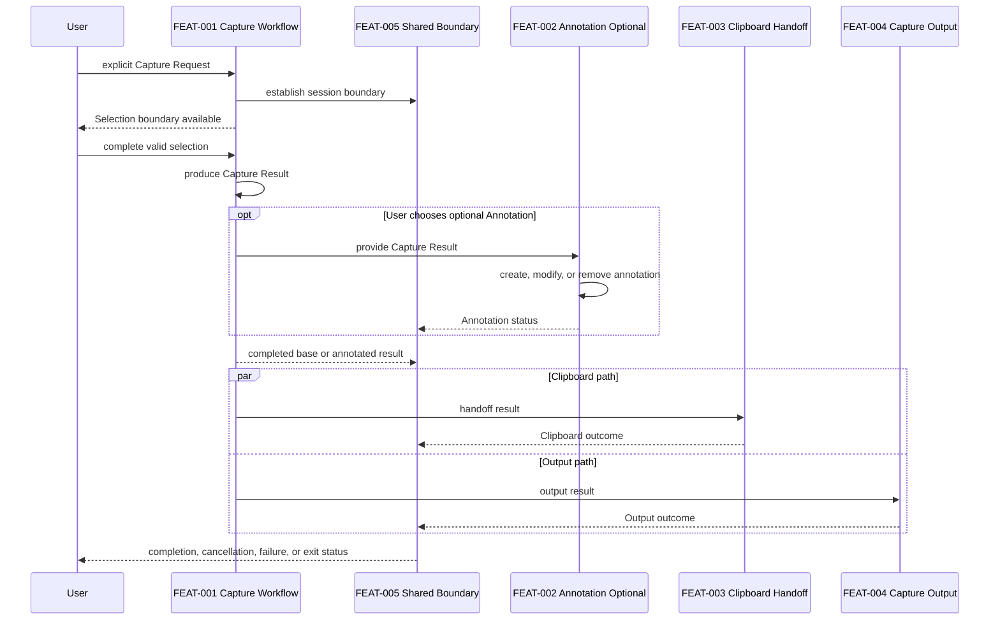

# SPEC-0010 Feature Integration

狀態：`Draft`

本文件是跨 Feature Integration Specification，不是新的產品 Feature，也不建立新的 `FEAT-NNN`。

## 1. Document Control

| Field | Value |
| --- | --- |
| Document ID | `SPEC-0010` |
| Document type | Cross-feature Integration Specification |
| Status | `Draft` |
| Version | `0.1` |
| Owner | `TBD` |
| Last Reviewed | `Not reviewed` |
| Covered Features | `FEAT-001`、`FEAT-002`、`FEAT-003`、`FEAT-004`、`FEAT-005` |
| Dependencies | [SPEC-0002](SPEC-0002-specification-guidelines.md)、[SPEC-0003](SPEC-0003-system-requirements.md)、[SPEC-0004](SPEC-0004-feature-catalog.md)、[SPEC-0005](SPEC-0005-capture-workflow.md)、[SPEC-0006](SPEC-0006-workflow-boundaries-and-feedback.md)、[SPEC-0007](SPEC-0007-clipboard-handoff.md)、[SPEC-0008](SPEC-0008-capture-output.md)、[SPEC-0009](SPEC-0009-annotation-capability.md) |

## 1.1 Normative References

以下文件對本 Integration Specification 具有約束力：

- [PRD-0002 User Experience Principles](../PRD/PRD-0002-user-experience-principles.md)
- [PRD-0003 Product Vision](../PRD/PRD-0003-product-vision.md)
- [PRD-0004 Core Workflow](../PRD/PRD-0004-core-workflow.md)
- [PRD-0005 Functional Requirements](../PRD/PRD-0005-functional-requirements.md)
- [PRD-0006 Non-functional Requirements](../PRD/PRD-0006-non-functional-requirements.md)
- [SPEC-0003 System Requirements](SPEC-0003-system-requirements.md)
- [SPEC-0004 Feature Catalog](SPEC-0004-feature-catalog.md)
- [SPEC-0005 Capture Workflow](SPEC-0005-capture-workflow.md)
- [SPEC-0006 Workflow Boundaries and Feedback](SPEC-0006-workflow-boundaries-and-feedback.md)
- [SPEC-0007 Clipboard Handoff](SPEC-0007-clipboard-handoff.md)
- [SPEC-0008 Capture Output](SPEC-0008-capture-output.md)
- [SPEC-0009 Annotation Capability](SPEC-0009-annotation-capability.md)

## 1.2 Informative References

- [SPEC-0002 Specification Guidelines](SPEC-0002-specification-guidelines.md)
- [PRD-0001 Product Foundation](../PRD/PRD-0001-product-foundation.md)
- [Research index](../docs/Research/README.md)
- [Analysis index](../docs/Analysis/README.md)
- [Decision index](../docs/Decision/README.md)

## 2. Integration Overview

### Purpose

本文件回答唯一問題：

> 五個核心 Feature 如何共同形成一個完整且一致的產品流程？

整合後的高階責任鏈為：

```text
User
  ↓
FEAT-001 Capture Workflow
  ↓
FEAT-002 Annotation（Optional）
  ↓
Capture Result
  ├── FEAT-003 Clipboard Handoff
  └── FEAT-004 Capture Output
  ↓
FEAT-005 Workflow Boundaries and Feedback
```

`FEAT-005` 是跨 Feature 的共同邊界與回饋能力，不是另一個取代其他 Feature 的功能節點。`FEAT-003` 與 `FEAT-004` 都接收同一份 Capture Result 或 Annotated Result；兩者是平行的下游責任，不互相形成新的必要依賴。

### Integration scope

本文件涵蓋：

- 五個 Feature 的唯一 Primary Owner 與 Supporting/Boundary responsibility。
- Shared workflow state 與各 Feature local state 的對應。
- Capture、optional Annotation、Clipboard Handoff、Capture Output 與 Workflow Boundary 的整合順序。
- Feature 間已存在的依賴、可獨立範圍與尚未決定的缺口。
- 跨 Feature 的共同 Acceptance Criteria 與追溯邊界。

### Integration non-goals

本文件不：

- 建立新的 Feature、FR、SR、NFR 或產品需求。
- 取代任何 Feature Spec 的內部規則。
- 決定 Annotation Tool、Clipboard API、Output format、Storage、UI、Architecture 或 Coding。
- 把 `FEAT-003` 與 `FEAT-004` 強制串成彼此依賴的順序。
- 解決 `UNKNOWN`、`TBD` 或 runtime verification 缺口。

## 3. Requirements Mapping

| Integration concern | Feature sources | FR | SR | Related NFR | Upstream PRD |
| --- | --- | --- | --- | --- | --- |
| Start, select and complete Capture | `FEAT-001` / [SPEC-0005](SPEC-0005-capture-workflow.md) | `FR-001`、`FR-002`、`FR-003` | `SR-001`、`SR-002`、`SR-005` | `NFR-001`、`NFR-002`、`NFR-003`、`NFR-004`、`NFR-006`、`NFR-007`、`NFR-012` | `PRD-0002`、`PRD-0003`、`PRD-0004`、`PRD-0005`、`PRD-0006` |
| Optional Annotation | `FEAT-002` / [SPEC-0009](SPEC-0009-annotation-capability.md) | `FR-004`、`FR-005`、`FR-006` | `SR-003`、`SR-005` | `NFR-001`、`NFR-002`、`NFR-003`、`NFR-004`、`NFR-005`、`NFR-006`、`NFR-008`、`NFR-010` | `PRD-0002`、`PRD-0004`、`PRD-0005`、`PRD-0006` |
| Clipboard Handoff | `FEAT-003` / [SPEC-0007](SPEC-0007-clipboard-handoff.md) | `FR-007` | `SR-001`、`SR-004` | `NFR-001`、`NFR-002`、`NFR-003`、`NFR-004`、`NFR-006`、`NFR-008`、`NFR-011` | `PRD-0004`、`PRD-0005`、`PRD-0006` |
| Capture Output | `FEAT-004` / [SPEC-0008](SPEC-0008-capture-output.md) | `FR-008` | `SR-001`、`SR-004` | `NFR-001`、`NFR-002`、`NFR-003`、`NFR-004`、`NFR-006`、`NFR-008`、`NFR-011` | `PRD-0003`、`PRD-0004`、`PRD-0005`、`PRD-0006` |
| Shared completion, cancel and failure boundary | `FEAT-005` / [SPEC-0006](SPEC-0006-workflow-boundaries-and-feedback.md) | `FR-009`、`FR-010`、`FR-011` | `SR-001`、`SR-002`、`SR-005` | `NFR-002`、`NFR-003`、`NFR-004`、`NFR-006`、`NFR-008`、`NFR-012` | `PRD-0002`、`PRD-0003`、`PRD-0004`、`PRD-0005`、`PRD-0006` |

本文件只整合既有需求，不新增任何 requirement 或產品決策。

## 4. Feature Responsibility Matrix

每個情境只能有一個 `Primary Owner`；其他 Feature 可標記為 `Supporting`、`Boundary` 或 `Not responsible`。

| Scenario | FEAT-001 | FEAT-002 | FEAT-003 | FEAT-004 | FEAT-005 | Primary Owner |
| --- | --- | --- | --- | --- | --- | --- |
| Start Capture Request | Primary：建立 Capture Session | Not responsible | Not responsible | Not responsible | Boundary：合法入口與安全狀態 | `FEAT-001` |
| Region Selection | Primary：Selection 與 Capture completion | Not responsible | Not responsible | Not responsible | Boundary：Cancel/Error | `FEAT-001` |
| Complete Capture Result | Primary：產生完成 Result | Supporting：可選後續入口 | Supporting：等待交付 | Supporting：等待 Output | Boundary：完成語意 | `FEAT-001` |
| Enter Annotation | Supporting：提供 Result | Primary：啟動 optional lifecycle | Not responsible | Not responsible | Boundary：optional/cancel/error | `FEAT-002` |
| Skip Annotation | Primary：維持基本 workflow result | Not responsible | Supporting：可承接 base result | Supporting：可承接 base result | Boundary：確保不阻擋基本流程 | `FEAT-001` |
| Create/Modify/Remove Annotation | Supporting：提供基礎 Result | Primary：Annotation lifecycle | Not responsible | Not responsible | Boundary：failure/cancel | `FEAT-002` |
| Clipboard Handoff | Supporting：提供 Result | Supporting：提供 Annotated Result；可略過 | Primary：交付至 Clipboard Consumer | Not responsible | Boundary：handoff failure/feedback | `FEAT-003` |
| Capture Output | Supporting：提供 Result | Supporting：提供 Annotated Result；可略過 | Not responsible | Primary：Output lifecycle 與 Consumer handoff | Boundary：output failure/feedback | `FEAT-004` |
| User Cancellation | Supporting：停止目前 Capture work | Supporting：停止 optional work | Supporting：停止 handoff boundary | Supporting：停止 output boundary | Primary：共同 Cancel 語意 | `FEAT-005` |
| Failure Classification and Feedback | Supporting：回報 Capture detail | Supporting：回報 Annotation detail | Supporting：回報 Clipboard detail | Supporting：回報 Output detail | Primary：共同 failure/feedback boundary | `FEAT-005` |
| Workflow Exit | Supporting：交付 Session status | Supporting：交付 Annotation status | Supporting：交付 Handoff status | Supporting：交付 Output status | Primary：Exit 與 shared termination | `FEAT-005` |

## 5. Integration Sequence



整合規則：

- `FEAT-002` 是 optional；略過後可直接進入兩個下游交付責任。
- `FEAT-003` 與 `FEAT-004` 是平行 downstream paths，不互相依賴，也不要求固定先後順序。
- `FEAT-005` 只負責共同 boundary、狀態區分與 feedback responsibility，不接管其他 Feature 的內部工作。
- 上圖的具體 trigger、consumer acceptance 與 exit side effects 若尚未驗證，維持 `UNKNOWN/TBD`。

## 6. Integration State Mapping

Shared state 沿用 [SPEC-0003](SPEC-0003-system-requirements.md)；各 Feature 的 local state 只能描述自身責任，不得建立衝突的第二套 shared workflow。

| Shared State | FEAT-001 | FEAT-002 | FEAT-003 | FEAT-004 | FEAT-005 |
| --- | --- | --- | --- | --- | --- |
| `Application Ready` | 等待合法 Capture Request。 | Not active。 | Not active。 | Not active。 | Shared entry boundary available。 |
| `Capture Request` | 建立並維持 Capture Session。 | Not active。 | Not active。 | Not active。 | Boundary：request/cancel/error。 |
| `Region Selection` | 維持 Selection 與完成條件。 | Not active。 | Not active。 | Not active。 | Boundary：cancel/error。 |
| `Annotation` | 提供 Capture Result。 | Optional local Annotation lifecycle active。 | Not active；等待 result。 | Not active；等待 result。 | Boundary：optional/cancel/error。 |
| `Complete` | Capture Result 已產生。 | 可提供 Annotated Result，或被略過。 | 可進入 Clipboard local handoff。 | 可進入 Output local lifecycle。 | Shared completion boundary。 |
| `Clipboard Ready` | Result 已可交付。 | Annotated Result 若存在則可交付。 | Clipboard local state active。 | 可獨立處理 Output，不依賴 Clipboard。 | Handoff/error/exit boundary。 |
| `Exit` | 結束 Capture Session。 | 結束 Annotation responsibility。 | 結束 Clipboard Handoff responsibility。 | 結束 Output responsibility。 | Primary：共同 termination。 |
| `Cancel` | 停止目前 Capture work。 | 停止 optional Annotation work。 | 停止目前 Handoff boundary。 | 停止目前 Output boundary。 | Primary：Cancel semantics。 |
| `Error` | 回報 Capture failure detail。 | 回報 Annotation failure detail。 | 回報 Clipboard failure detail。 | 回報 Output failure detail。 | Primary：failure classification/feedback。 |

### State consistency rules

- `Application Ready`、`Capture Request`、`Region Selection`、`Annotation`、`Complete`、`Clipboard Ready`、`Exit`、`Cancel` 與 `Error` 只使用 `SPEC-0003` 的 shared vocabulary。
- `FEAT-002`、`FEAT-003`、`FEAT-004` 的 local lifecycle 不改名、不覆寫 shared state。
- `FEAT-003` 與 `FEAT-004` 可以同時對同一個 result 建立各自 local handoff/output state；這不代表兩者必須同時完成，具體並行語意：`TBD`。
- `Error`、`Cancel` 與 `Exit` 的共同責任由 `FEAT-005` 維持，Feature-specific failure detail 由 owning Feature 提供。

## 7. Cross-feature Dependencies

| Feature | Depends on | Can operate independently from | Dependency boundary |
| --- | --- | --- | --- |
| `FEAT-001` Capture Workflow | `FEAT-005` 的共同 boundary vocabulary。 | `FEAT-002`、`FEAT-003`、`FEAT-004` 的內部行為。 | 必須先產生可交付 Capture Result。 |
| `FEAT-002` Annotation | `FEAT-001` 的完成 Result、`FEAT-005` 的 optional/cancel/error boundary。 | `FEAT-003`、`FEAT-004` 可不被進入；Annotation 可被略過。 | 只在使用者選擇 optional path 時啟動。 |
| `FEAT-003` Clipboard Handoff | `FEAT-001` 或 `FEAT-002` 提供可交付 Result、`FEAT-005` failure boundary。 | `FEAT-004`；不依賴 Output 完成。 | 以 `Clipboard Ready` 為 handoff boundary。 |
| `FEAT-004` Capture Output | `FEAT-001` 或 `FEAT-002` 提供可交付 Result、`FEAT-005` failure boundary。 | `FEAT-003`；不依賴 Clipboard 完成。 | 以 `Output Ready` 為 output boundary。 |
| `FEAT-005` Workflow Boundaries and Feedback | 各 Feature 回報狀態與 failure boundary。 | 不依賴任何 Feature 的內部實作。 | 只協調共同語意，不擁有其他 Feature 的工作。 |

不得由本文件新增新的 Feature-to-Feature dependency。未決的並行、順序、consumer acceptance 與結果保存行為維持 `UNKNOWN/TBD`。

## 8. Cross-feature Gaps

本節只整理缺口，不在本 Spec 內解決：

- `FEAT-002` 是否在 v1.0 啟用：`TBD`。
- Annotation 的進入、略過、完成與取消觸發方式：`UNKNOWN/TBD`。
- 同一 Capture Result 是否可同時進入 Clipboard 與 Output lifecycle：`TBD`。
- Clipboard 與 Output 的 consumer acceptance 是否可被共同觀察：`UNKNOWN`。
- Annotated Result 與 base Capture Result 的 identity、保存與 downstream handoff 關係：`UNKNOWN/TBD`。
- 某一 downstream handoff 失敗後，另一個 downstream path 是否仍可繼續：`TBD`。
- Capture、Annotation、Clipboard、Output failure 的 recoverable/terminal classification：`UNKNOWN`。
- Cancel、Exit、Error 的具體 trigger、focus、display、DPI、HDR 與 OS interruption 行為：`UNKNOWN`。
- Feedback 的實際呈現通道與 feedback failure 行為：`TBD`。
- Runtime verification 尚未覆蓋的 platform 與 multi-session 行為：`UNKNOWN`。

## 9. Acceptance Criteria

每項 Acceptance Criteria 都必須能回溯至既有 `FR`、`SR` 與 `NFR`；本文件不得新增產品需求或技術決策。

- `SPEC-0010-AC-001`：五個核心 Feature 可依既有 Scope 形成從 Capture Request、可選 Annotation、Result 產生、下游交付到 Exit/Feedback 的完整高階流程；引用 `FR-001` 至 `FR-011`、`SR-001` 至 `SR-005`、`NFR-001` 至 `NFR-013`。
- `SPEC-0010-AC-002`：每個整合情境都有且只有一個 Primary Owner，Supporting 與 Boundary responsibility 不被誤寫成共同擁有；引用 `FR-009`、`FR-011`、`SR-005`、`NFR-008`。
- `SPEC-0010-AC-003`：五個 Feature 使用同一套 shared state vocabulary，local lifecycle 不取代或改名 `SPEC-0003` 的 shared states；引用 `FR-001` 至 `FR-011`、`SR-001` 至 `SR-005`、`NFR-008`。
- `SPEC-0010-AC-004`：Annotation 可以被略過，基本 Capture、Clipboard Handoff 與 Capture Output 不以 Annotation 為必要前置條件；引用 `FR-004`、`FR-005`、`FR-006`、`FR-007`、`FR-008`、`SR-003`、`SR-004`、`NFR-005`、`NFR-010`。
- `SPEC-0010-AC-005`：Clipboard Handoff 與 Capture Output 都以 Capture Result 或 Annotated Result 為來源，但不形成彼此的必要依賴或固定先後順序；引用 `FR-007`、`FR-008`、`SR-001`、`SR-004`、`NFR-008`、`NFR-011`。
- `SPEC-0010-AC-006`：各 Feature 的 failure detail 交由 owning Feature 提供，Cancel、Error、Exit、classification 與共同 feedback boundary 由 `FEAT-005` 承接；引用 `FR-009`、`FR-010`、`FR-011`、`SR-001`、`SR-005`、`NFR-002`、`NFR-003`、`NFR-006`。
- `SPEC-0010-AC-007`：整合文件可追溯至五個 Feature Spec、Feature Catalog、System Requirements、PRD 與 NFR，且不產生新的 requirement、Feature 或 Architecture decision；引用 `FR-001` 至 `FR-011`、`SR-001` 至 `SR-005`、`NFR-008`、`NFR-013`。
- `SPEC-0010-AC-008`：所有尚未經產品決策或 runtime verification 確認的跨 Feature 行為維持 `UNKNOWN/TBD`，不在整合層自行補完；引用 `FR-011`、`SR-005`、`NFR-002`、`NFR-008`、`NFR-013`。
- `SPEC-0010-AC-009`：本文件沒有建立 Arrow、Rectangle、Text、Toolbar、Overlay、Architecture 或 Coding 文件，也沒有指定 API、Class、Framework、Storage 或 implementation；引用 `NFR-008`、`NFR-013`。

## 10. Review Status

`Draft`。本文件需在五個 Feature Spec 與上游 PRD 維持穩定後進行 Integration Review；Review 前不得把本文件視為 implementation contract。

完成本 Integration Specification 與必要的最小索引更新後立即停止；不要自行開始 Annotation 子工具、Overlay、Toolbar、Architecture 或 Coding。
