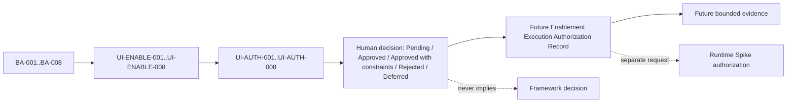

# UI Framework Phase 1 Enablement Execution Authorization Request

本文件把 `RESEARCH-TECH-UI-008` 定義的 `UI-ENABLE-001` 至 `UI-ENABLE-008` 轉成逐項、可撤銷、可追溯的人工授權請求。它只請求「關閉 Phase 1 Enablement 前置條件」所需的最小權限；不代表任何請求已獲批准，也不授權 Runtime Spike、Prototype、Screenshot、Screen recording 或產品實作。

## 1. Document Control

| Field | Value |
| --- | --- |
| Document ID | `RESEARCH-TECH-UI-009` |
| Title | UI Framework Phase 1 Enablement Execution Authorization Request |
| Status | `Draft` |
| Research Type | Execution Authorization Request |
| Enablement Specification | `RESEARCH-TECH-UI-008` |
| Phase 1 Readiness | `Not ready` |
| Authorization Decision | `Pending` |
| Current authorization | `Not granted` |
| Enablement Execution Authorized | `No` |
| Runtime Spike Execution Authorized | `No` |
| Execution permitted | `No` |
| Owner | TBD |
| Last reviewed | Not reviewed |
| Version | 0.1 |
| Request date | 2026-07-26 |
| Requested by | TBD |
| Decision authority | TBD |
| Normative References | `RESEARCH-TECH-UI-007`, `RESEARCH-TECH-UI-008`, `Architecture/adr/ADR-0002-ui-framework-selection.md` |
| Informative References | `RESEARCH-TECH-UI-001`, `RESEARCH-TECH-UI-002`, `RESEARCH-TECH-UI-003`, `RESEARCH-TECH-UI-004`, `RESEARCH-TECH-UI-005`, `RESEARCH-TECH-UI-006`, `Architecture/TECHNOLOGY-DECISION-ROADMAP.md` |
| Supersedes | None |
| Superseded by | None |

## 2. Purpose

本文件用於：

- 將 `UI-ENABLE-001` 至 `UI-ENABLE-008` 轉換為 `UI-AUTH-001` 至 `UI-AUTH-008` 的正式授權請求。
- 讓人工決策者逐項查看操作範圍、風險、系統影響、證據與 rollback/cleanup。
- 把 Enablement execution 與 Runtime Spike execution 分開。
- 防止「同意研究」被解讀成可任意安裝、下載、Restore、建立 Project、Build 或 Run。
- 為未來 Enablement Execution Record 提供已核准 scope、期限、限制與撤銷基線。

本文件的產出是「待人工決策的請求」，不是執行紀錄。所有請求目前都保持 `Authorization Decision: Pending`、`Execution permitted: No`。

## 3. Authorization Boundary

### 3.1 本文件最多可請求的操作

- 唯讀環境補充查核。
- 明確列出的 user-scope package acquisition 或 package restore。
- 明確列出的隔離式實驗 Project／Solution 建立。
- 隔離式實驗 Project 的 Build verification。
- 明確列出的 Repository-local evidence root 或文件型 evidence 建立。
- 不包含 Runtime 的 cleanup verification。
- 對上述操作設定 scope、owner、expiry、stop rule、rollback 與 evidence requirement。

### 3.2 本文件不得請求或授權的操作

- Runtime Spike execution 或任何未另行審批的 runtime comparison。
- 啟動正式 Overlay、Prototype 或產品程式。
- Screenshot、Screen recording、Print Screen hook、Capture API 或 Clipboard。
- 系統快捷鍵註冊、DPI／HDR／Registry／Display Settings 變更。
- Machine-scope 安裝 SDK、IDE、Build Tools、Runtime、Workload 或其他工具；若未來確有必要，必須建立新的 R3 request。
- 修改 `ADR-0002`、PRD、Specs、Architecture 或產品 source code。
- 把本文件的 `Pending` 改成 `Approved`，或把 `Readiness: Not ready` 改成 execution permission。

### 3.3 每一筆核准的最小 scope

人工決策者必須逐筆核准或拒絕 `UI-AUTH-001` 至 `UI-AUTH-008`。核准一筆不會連帶核准其他筆；核准 Enablement execution 也不會核准 Runtime Spike。任何未明列的操作都視為不允許。

## 4. Decision Vocabulary

### 4.1 Authorization Decision

只能使用：

- `Pending`
- `Approved`
- `Approved with constraints`
- `Rejected`
- `Deferred`

Draft 文件中所有請求固定為：`Authorization Decision: Pending`。

### 4.2 Execution Permission

只能使用 `Yes` 或 `No`。在本文件尚未取得人工決策前，所有請求固定為 `Execution permitted: No`。

### 4.3 Request status vocabulary

| Value | Meaning |
| --- | --- |
| `Requested` | 已列入本文件，等待人工決策；不表示可執行 |
| `Approved` | 人工決策者已批准完整 scope；仍須遵守 constraints、expiry 與 stop rules |
| `Approved with constraints` | 只可執行決策記錄中明列的子範圍 |
| `Rejected` | 不得執行該請求 |
| `Deferred` | 暫不決策；不得以其他請求或舊授權替代 |

### 4.4 Operation classifications

本文件使用下列分類：`Read-only inspection`、`Repository documentation mutation`、`Development environment installation`、`Package acquisition`、`Experimental project creation`、`Build execution`、`Runtime execution`、`System configuration mutation`、`Evidence capture`。

## 5. Authorization Request ID Policy

`UI-AUTH` 與上游項目一對一綁定：

| Authorization Request | Enablement Item | Blocking Action | Related Gate |
| --- | --- | --- | --- |
| `UI-AUTH-001` | `UI-ENABLE-001` | `BA-001` | `P1-GATE-002`, `P1-GATE-004` |
| `UI-AUTH-002` | `UI-ENABLE-002` | `BA-002` | `P1-GATE-003`, `P1-GATE-004` |
| `UI-AUTH-003` | `UI-ENABLE-003` | `BA-003` | `P1-GATE-005` |
| `UI-AUTH-004` | `UI-ENABLE-004` | `BA-004` | `P1-GATE-006` |
| `UI-AUTH-005` | `UI-ENABLE-005` | `BA-005` | `P1-GATE-007` |
| `UI-AUTH-006` | `UI-ENABLE-006` | `BA-006` | `P1-GATE-008` |
| `UI-AUTH-007` | `UI-ENABLE-007` | `BA-007` | `P1-GATE-009` |
| `UI-AUTH-008` | `UI-ENABLE-008` | `BA-008` | `P1-GATE-010` |

不得合併請求、拆分後改變上游語意、增加第九個 Blocking Action 或刪除任何 Enablement Item。

## 6. Authorization Request Register

| Request | Requested scope | Highest requested risk | Network／download | Install／Restore | Project／Build | Runtime | Current authorization | Current decision | Execution permitted |
| --- | --- | --- | --- | --- | --- | --- | --- | --- | --- |
| `UI-AUTH-001` | WinUI 3 provenance、隔離 project/build；不含 machine install 或 Runtime Spike | `R2 — User-scope acquisition` | Conditional | Conditional package restore；No machine install | Yes, isolated | Separate request only | `Not granted` | `Pending` | `No` |
| `UI-AUTH-002` | WPF／WinUI parity definition、隔離 project/build；不含 Runtime Spike | `R1 — Repository-local` | No, unless separately approved | Conditional package restore；No machine install | Yes, isolated | Separate request only | `Not granted` | `Pending` | `No` |
| `UI-AUTH-003` | Read-only display topology inspection | `R0 — Read-only` | No | No | No | No | `Not granted` | `Pending` | `No` |
| `UI-AUTH-004` | Read-only effective DPI evidence procedure | `R0 — Read-only` | No | No | No | No | `Not granted` | `Pending` | `No` |
| `UI-AUTH-005` | Synthetic contract review、隔離 project/build；不含 Runtime Spike | `R1 — Repository-local` | Conditional, candidate-dependent | Conditional package restore；No machine install | Yes, isolated | Separate request only | `Not granted` | `Pending` | `No` |
| `UI-AUTH-006` | Approved evidence root、metadata／retention governance | `R1 — Repository-local` | No | No | No | No | `Not granted` | `Pending` | `No` |
| `UI-AUTH-007` | Safety／cleanup procedure、隔離準備；不含 runtime acceptance | `R1 — Repository-local` | No | No | Conditional, future Spike separately | Separate request only | `Not granted` | `Pending` | `No` |
| `UI-AUTH-008` | Independent authorization review record and controls | `R0 — Read-only` | No | No | No | No | `Not granted` | `Pending` | `No` |

## 7. Risk Classification

| Risk | Definition | Allowed implication |
| --- | --- | --- |
| `R0 — Read-only` | 不改變本機或 Repository 狀態 | 可取得唯讀查核結果；仍須有 scope、owner 與 evidence boundary |
| `R1 — Repository-local` | 只建立隔離式研究文件或實驗產物 | 不得寫入產品 source tree；須有 approved root、cleanup 與 retention |
| `R2 — User-scope acquisition` | 取得 user-scope 的 Package、Cache 或工具 | 必須明列來源、版本、下載範圍、cache 影響與 rollback；不得推論為 machine install |
| `R3 — Machine-scope mutation` | 安裝 SDK、Build Tools、Runtime 或修改 machine | 本文件不請求；必須另行建立並明確審批 R3 request |
| `R4 — Runtime or system behavior` | 啟動程式、Overlay、Hook 或改變系統行為 | 本文件不得請求或核准；Runtime、Hook 與 system behavior 必須另行處理 |

本文件可以申請 `R0` 至 `R3`，但目前 Draft 沒有任何已批准操作；本文件不得申請或核准 `R4`。涉及多個層級時使用最高風險等級。

## 8. Requested Execution Batches

8 個 request 依依賴分批描述，但本文件不執行任何 Batch。每個 Batch 都必須有 `Entry criteria`、`Requested permissions`、`Exit criteria`、`Stop conditions`、`Evidence`、`Dependencies` 與 `Rollback boundary`。

### Batch A：Read-only completion

- 可包含工具鏈補充盤點、display topology／DPI 唯讀辨識，以及現有 SDK／Package／Build path 確認。
- 只可使用 `R0 — Read-only`；資料不足時保留 `Unknown`／`Insufficient`，不得用推測補足。
- Entry criteria：人工核准對應 `UI-AUTH`，且 read-only source 與 evidence owner 已指定。
- Exit criteria：Environment／provenance evidence 或明確 limitation 已保存。
- Stop conditions：需要下載、安裝、Restore、Project、Build、Runtime 或 system mutation。
- Evidence：Environment record、provenance record 或 failure record。
- Dependencies：`UI-ENABLE-001`、`UI-ENABLE-003`、`UI-ENABLE-004`。
- Rollback boundary：不修改本機；清理 temporary inspection output。

### Batch B：Development environment enablement

- 可包含經核准的 SDK／Build Tool 安裝、工具版本固定、安裝清單與 rollback 資料建立。
- 任何 machine-scope 安裝都是 `R3`，不在本 Draft 的執行許可內；必須另行逐項申請。
- Entry criteria：明列 package/tool/version/source、machine scope、privilege、rollback 與 expiry 的人工批准。
- Exit criteria：安裝前後環境、package/tool inventory 與 cleanup／rollback record 完整。
- Stop conditions：版本或來源與批准內容不同、需要 R4、無法 rollback。
- Evidence：Installation record、Environment before/after、package list、rollback record。
- Dependencies：`UI-ENABLE-001`、`UI-ENABLE-002`、`UI-ENABLE-006`、`UI-ENABLE-007`。
- Rollback boundary：只回復已批准的工具／package scope，不觸碰產品 source 或未列出的 machine state。

### Batch C：Isolated experimental setup

- 可包含隔離式 WinUI 3／WPF experimental Project、Package acquisition／Restore、candidate parity 設定與 synthetic contract 靜態資產。
- Project、Package 與 Restore 必須逐項批准；不代表產品 Project Structure 或正式依賴已決定。
- Entry criteria：approved isolated root、candidate、version、synthetic contract、evidence root 與 cleanup owner 已固定。
- Exit criteria：兩候選的隔離 setup 與 build-ready evidence 可追溯。
- Stop conditions：寫入 product source tree、需要真實桌面資料、Capture／Clipboard 或 Runtime UI。
- Evidence：Project inventory、package/restore record、candidate parity record、synthetic contract。
- Dependencies：Batch A、`UI-ENABLE-002`、`UI-ENABLE-005`、`UI-ENABLE-006`。
- Rollback boundary：刪除 isolated project/output/cache delta，保留 cleanup confirmation。

### Batch D：Build verification

- 可包含 approved isolated project 的 Restore／Build、Build log、Framework／SDK／Windows metadata 與 cleanup confirmation。
- Build approval 不代表 Run approval；`Build verified` 在本文件建立時固定為 `No`。
- Entry criteria：Build path、candidate parity、package scope、project root 與 build configuration 已批准。
- Exit criteria：Build result 或 failure reproduction、metadata、exit code 與 cleanup record 完整。
- Stop conditions：需要 Run、Overlay、Hook、Capture、Clipboard、產品 source 或未批准 package/version。
- Evidence：Build record、diagnostic log、failure reproduction、cleanup confirmation。
- Dependencies：Batch B、Batch C、`UI-ENABLE-001`、`UI-ENABLE-002`、`UI-ENABLE-005`。
- Rollback boundary：清理 build output、temporary package delta 與 process，不修改正式產品結構。

### 明確排除的 Batch

不得建立 Runtime execution batch。任何 Runtime、Overlay、Hook、Screenshot、Screen recording 或 system behavior 都不是本文件的 execution permission。

## 9. Minimum Authorization Principle

- 只申請關閉 `BA-001` 至 `BA-008` 所需的最小權限。
- 不以「完成 Phase 1」為理由申請不受限制的命令執行。
- Installation、Restore、Project creation、Build 必須分別列明。
- 未列入 Request Register 的操作一律未授權。
- 某個 Batch 核准不代表後續 Batch 自動核准。
- Build 核准不代表 Run 核准。
- Experimental Project 核准不代表產品 Project Structure 已決定。
- Package Restore 核准不代表 Package 成為正式產品依賴。
- Approval 不代表 Phase 1 Ready，也不代表 Runtime Spike Authorized。

## 10. Toolchain Authorization

### 10.1 Experimental toolchain baseline

| Candidate | Experimental framework | Runtime／SDK | Build path | Local status | Missing capability | Mutation required |
| --- | --- | --- | --- | --- | --- | --- |
| WinUI 3 | WinUI 3 experimental baseline only | Runtime package `2.3.1.0` observed；SDK／template unknown | Primary: `.NET CLI`／SDK-only if sufficient；Fallback: MSBuild／Build Tools path | Runtime observed；`Build verified: No` | SDK、template、package provenance、build capability | Potential R2/R3/R1 future operation；currently none |
| WPF | WPF experimental baseline only | .NET SDK `10.0.302`、Desktop Runtime `10.0.10` observed | Primary: `.NET CLI`／SDK-only；Fallback: MSBuild path | SDK／Desktop Runtime observed；`Build verified: No` | Equivalent candidate boundary、parity evidence、build record | Potential R1/R2 future operation；currently none |

官方相容版本、Runtime package、SDK package、Template、MSBuild 與 IDE 必須分開記錄。Windows App Runtime package 不得被視為 SDK build capability。WPF 本機條件較完整也不得直接授權 Framework selection。

### 10.2 Proposed experimental build paths

| Candidate | Primary experimental build path | Fallback experimental build path | Requested operation | Risk | Decision |
| --- | --- | --- | --- | --- | --- |
| WinUI 3 | `.NET CLI`／SDK-only path，前提是官方 template／SDK provenance 可證明 | Visual Studio Build Tools／MSBuild；若需要 machine install，另提 R3 | Provenance inspection、必要 package、isolated project、Build verification；不含 Runtime | `R2` with possible `R3` gap | `Pending` |
| WPF | `.NET CLI`／SDK-only path | Visual Studio Build Tools／MSBuild | Existing baseline inspection、isolated parity project、Build verification；不含 Runtime | `R1` with possible `R2` gap | `Pending` |

這些是實驗執行路徑，不是產品工具鏈 ADR。任何 path 尚未執行，`Build verified` 必須保持 `No`。

## 11. Repository Mutation Boundary

未來若經核准建立實驗產物，必須先規劃隔離位置。本文件只定義位置，不建立：

```text
experiments/ui-framework/winui3/
experiments/ui-framework/wpf/
docs/Research/Technology/results/ui-framework/
```

明確規定：

- 不得把實驗 Project 放入正式產品 Source tree。
- 不得建立產品 Project Structure。
- 不得修改 Architecture baseline。
- 實驗 Project 不得被正式產品引用。
- Result、Package cache 與 Build output 必須可識別及清理。
- 本文件完成時上述實驗目錄與 Result root 都必須不存在，除非日後取得獨立批准。

## 12. Evidence Obligations

每個已核准操作未來必須記錄：

- Authorization Request ID
- Decision authority
- Decision date
- Exact operation
- Actual command 或安裝方式
- Start／end timestamp
- Environment before
- Environment after
- Files created
- Packages downloaded
- System changes
- Exit code
- Failure details
- Cleanup status
- Evidence location

本任務不得建立實際 Evidence、Runtime result、Screenshot、Screen recording、Diagnostic log 或 Measurement data。

## 13. Stop Conditions

未來執行時，發生下列情形必須停止：

- 操作超出已核准 Request 或 Batch。
- 需要額外 machine-scope 安裝。
- Package、工具或版本與申請內容不同。
- 需要修改 Display／DPI／HDR／Registry 或其他 system configuration。
- 需要啟動 Overlay 或其他 Runtime UI。
- 需要加入 Capture、Clipboard 或正式 Annotation。
- 需要修改 Frozen PRD、Specs、Architecture 或 ADR-0002。
- 無法執行 rollback／cleanup。
- Evidence 無法完整保留或含未審查敏感資料。
- Framework A 未 cleanup 就要切換 Framework B。

## 14. Human Decision Record

本表正好對應 8 個 request；初始值全部為待決策狀態。

| Request | Enablement | Risk | Requested authorization | Decision | Constraints | Authority | Date | Execution permitted |
| --- | --- | --- | --- | --- | --- | --- | --- | --- |
| `UI-AUTH-001` | `UI-ENABLE-001` | `R2` with possible `R3` gap | `Required before execution` | `Pending` | Isolated provenance／build only；no Runtime | TBD | TBD | `No` |
| `UI-AUTH-002` | `UI-ENABLE-002` | `R1` with possible `R2` gap | `Required before execution` | `Pending` | Candidate parity；no Runtime | TBD | TBD | `No` |
| `UI-AUTH-003` | `UI-ENABLE-003` | `R0` | `Required before execution` | `Pending` | Read-only display topology；no mutation | TBD | TBD | `No` |
| `UI-AUTH-004` | `UI-ENABLE-004` | `R0` | `Required before execution` | `Pending` | Read-only DPI evidence；no mutation | TBD | TBD | `No` |
| `UI-AUTH-005` | `UI-ENABLE-005` | `R1` with possible `R2` gap | `Required before execution` | `Pending` | Synthetic-only isolated setup；no Runtime | TBD | TBD | `No` |
| `UI-AUTH-006` | `UI-ENABLE-006` | `R1` | `Required before execution` | `Pending` | Approved evidence root and governance only | TBD | TBD | `No` |
| `UI-AUTH-007` | `UI-ENABLE-007` | `R1` | `Required before execution` | `Pending` | Safety/cleanup documents only；no Runtime | TBD | TBD | `No` |
| `UI-AUTH-008` | `UI-ENABLE-008` | `R0` | `Required before execution` | `Pending` | Independent decision record only | TBD | TBD | `No` |

## 15. Overall Authorization Request Status

| Field | Value |
| --- | --- |
| Overall Authorization Request Status | `Conditionally ready for human authorization review` |
| Authorization Decision | `Pending` |
| Current authorization | `Not granted` |
| Enablement Execution Authorized | `No` |
| Runtime Spike Execution Authorized | `No` |
| Execution permitted | `No` |
| Human reviewer | TBD |
| Decision authority | TBD |
| Decision date | TBD |

這個狀態只表示文件已具備逐項提交人工核准的格式；不表示前置條件已關閉、Phase 1 已 Ready 或任何操作已獲批准。

## 16. Approval Effect

即使未來人工核准，本文件的效果最多只是允許依核准範圍執行指定的 Enablement operations，並產生 Enablement Execution Evidence。不代表：

- `BA-001` 至 `BA-008` 已關閉。
- Phase 1 已 Ready。
- Runtime Spike 可執行。
- WinUI 3 或 WPF 已通過。
- `ADR-0002` 可 Accepted。
- 可以開始正式 Coding。

## 17. Traceability

```text
BA-001..BA-008
  -> UI-ENABLE-001..UI-ENABLE-008
  -> UI-AUTH-001..UI-AUTH-008
  -> Human authorization decision
  -> Future enablement execution record
  -> Phase 1 execution authorization review
```

至少引用：

- `RESEARCH-TECH-UI-003`
- `RESEARCH-TECH-UI-004`
- `RESEARCH-TECH-UI-005`
- `RESEARCH-TECH-UI-006`
- `RESEARCH-TECH-UI-007`
- `RESEARCH-TECH-UI-008`
- `Architecture/adr/ADR-0002-ui-framework-selection.md`
- `Architecture/TECHNOLOGY-DECISION-ROADMAP.md`

## Appendix A. Detailed Authorization Request Records

下列每一筆 record 都是獨立請求。`Requested authorization` 描述待決策的最小 scope；不等同批准。

### 8.1 `UI-AUTH-001` — WinUI 3 SDK／template／build-path provenance

| Field | Value |
| --- | --- |
| Authorization Request ID | `UI-AUTH-001` |
| Source Enablement Item | `UI-ENABLE-001` |
| Source Blocking Action | `BA-001` |
| Related P1 Gate | `P1-GATE-002`, `P1-GATE-004` |
| Requested operation | Read-only provenance inspection；必要時取得 user-scope package，建立隔離 Spike project 並執行 build verification |
| Operation classifications | `Read-only inspection`; `Package acquisition`; `Experimental project creation`; `Build execution` |
| Exact scope | 只查核 WinUI Runtime／SDK／template／MSBuild provenance；只可在 approved isolated root 建立最小 experimental project；只驗證 build path，不執行 Runtime Spike |
| Explicit exclusions | Machine-scope installation、IDE／Build Tools 安裝、產品 source code、Runtime execution、Screenshot、Capture API、Clipboard、Display／DPI／Registry 變更 |
| Required environment | 現有 Windows 11 x64 baseline；WinUI candidate version、SDK、template、.NET／MSBuild metadata 必須逐項記錄 |
| Network access required | 只有決策者明確批准 package acquisition 時才需要；read-only inspection 不需要 |
| Download required | Conditional；只限官方或已核准來源的指定 package；本文件未批准下載 |
| Installation required | `No`；machine-scope installation 不在本請求內；若不可避免須另提 R3 request |
| Package Restore required | Conditional；只限 approved isolated project；不得 restore product solution |
| Repository mutation required | Conditional；只可寫入 approved research/evidence root，不改產品 source tree |
| Project creation required | Conditional；只限 isolated experimental project，不建立產品 project |
| Build required | Yes, future isolated build verification；本文件目前不 build |
| Runtime execution required | Future comparison may require it；本請求不包含 Runtime execution，須另行授權 |
| System configuration mutation required | `No` |
| Administrator privilege required | `Unknown` for any separately approved operation；本請求不預先取得管理員權限 |
| Expected files／directories created | Future approved isolated project、`Environment record`、`Build record`；目前不建立 |
| Expected system changes | 若只做 R0 inspection，無變更；若核准 R2，可能新增 user-scope package/cache；不得變更 machine |
| Risk level | `R2 — User-scope acquisition`，含 R1 isolated build；不含 R3 |
| Failure impact | 無法證明 SDK/template/build path，`BA-001` 保持 open；不得選定 framework |
| Rollback／cleanup | 依 approved root 移除 isolated project、package/cache delta、temporary process 與 evidence；保存 cleanup record；任何 failure 先停止 |
| Required evidence | Official/local version provenance、template source、resolved build path、environment metadata、build result 或 failure record |
| Requested authorization | 核准上述 R0/R1 scope；只有另列並核准時才可進行 R2 package acquisition；不核准 R3 或 Runtime |
| Proposed constraints | Official source only；product solution read-only；isolated root；single candidate attempt；no screenshots；stop on missing provenance；expiry required |
| Authorization Decision | `Pending` |
| Decision authority | TBD |
| Decision date | TBD |
| Execution permitted | `No` |
| Open questions | SDK/template 是否可由現有環境證明？若 package acquisition 必要，核准來源、版本、cache scope 與 expiry 為何？ |

### 8.2 `UI-AUTH-002` — WPF 與 WinUI 等價 build-path definition

| Field | Value |
| --- | --- |
| Authorization Request ID | `UI-AUTH-002` |
| Source Enablement Item | `UI-ENABLE-002` |
| Source Blocking Action | `BA-002` |
| Related P1 Gate | `P1-GATE-003`, `P1-GATE-004` |
| Requested operation | 建立 candidate parity checklist，查核兩候選 build path，必要時建立隔離 project 並 build |
| Operation classifications | `Repository documentation mutation`; `Read-only inspection`; `Experimental project creation`; `Build execution` |
| Exact scope | WPF 與 WinUI 使用同一 acceptance boundary、CPU/Windows/build configuration 與 synthetic contract；只記錄差異，不做 framework selection |
| Explicit exclusions | Runtime Spike、machine install、產品 solution、真實桌面資料、Screenshot、Capture API、Clipboard、系統設定變更 |
| Required environment | 既有 Windows 11 x64、.NET SDK／Desktop Runtime、WinUI candidate metadata；兩候選版本與 build configuration 必須並列 |
| Network access required | `No` for existing-environment inspection；若缺 package，須另列 package request |
| Download required | `No` in this request；任何 download 必須另行明列來源與批准 |
| Installation required | `No`；不請求 machine-scope installation |
| Package Restore required | Conditional；只限 approved isolated candidate project，不 restore product solution |
| Repository mutation required | Yes, only candidate parity documentation and approved evidence root |
| Project creation required | Conditional；只限 isolated parity project |
| Build required | Yes, future parity build verification；本文件目前不 build |
| Runtime execution required | Not included；future Windowing／Runtime Spike 需獨立授權 |
| System configuration mutation required | `No` |
| Administrator privilege required | `Unknown` for future operation；本請求不申請管理員權限 |
| Expected files／directories created | Future candidate parity record、isolated build records；目前不建立 |
| Expected system changes | Repository-local parity/evidence only；不得修改 machine 或 product source |
| Risk level | `R1 — Repository-local`；任何 package acquisition 需另行核准為 R2 |
| Failure impact | 無法在相同 acceptance boundary 比較兩候選，`BA-002` 保持 open |
| Rollback／cleanup | 清理 isolated candidate project、temporary package delta、build output 與 evidence；不刪除既有產品檔案 |
| Required evidence | Candidate version matrix、same-configuration build record、parity checklist、failure record |
| Requested authorization | 核准 R0 inspection、R1 parity documentation、必要的 isolated project/build；不核准 Runtime 或 machine install |
| Proposed constraints | Same synthetic content；same configuration；candidate-specific toolchain difference must be recorded；one candidate failure does not authorize workaround |
| Authorization Decision | `Pending` |
| Decision authority | TBD |
| Decision date | TBD |
| Execution permitted | `No` |
| Open questions | 是否存在不需安裝的 SDK-only fallback？兩候選是否能使用同一 build acceptance record？ |

### 8.3 `UI-AUTH-003` — Display topology baseline

| Field | Value |
| --- | --- |
| Authorization Request ID | `UI-AUTH-003` |
| Source Enablement Item | `UI-ENABLE-003` |
| Source Blocking Action | `BA-003` |
| Related P1 Gate | `P1-GATE-005` |
| Requested operation | 唯讀查核每個 display path 的 resolution、position、primary、extend/duplicate 與 identity mapping |
| Operation classifications | `Read-only inspection` |
| Exact scope | 只讀取目前 display topology；分別記錄 single-display 與 multi-display baseline 可取得性；不修改顯示設定 |
| Explicit exclusions | Display Settings、resolution、orientation、primary display、extend/duplicate、HDR、DPI、Registry、Screenshot、Runtime Spike |
| Required environment | 目前 Windows 11 x64 display baseline；每個 display path 的可重現識別與 timestamp |
| Network access required | `No` |
| Download required | `No` |
| Installation required | `No` |
| Package Restore required | `No` |
| Repository mutation required | Only future Environment record in approved evidence root；本文件目前不建立 |
| Project creation required | `No` |
| Build required | `No` |
| Runtime execution required | `No` |
| System configuration mutation required | `No` |
| Administrator privilege required | `Unknown` for the selected read-only evidence path；不預先宣告需要 |
| Expected files／directories created | Future Environment record；目前不建立 result root |
| Expected system changes | `None`；只產生 read-only evidence |
| Risk level | `R0 — Read-only` |
| Failure impact | 只能取得 active record 或 GPU aggregate mode 時，`BA-003` 保持 open |
| Rollback／cleanup | 不改設定；清理 temporary inspection output；不得留下 persistent setting |
| Required evidence | Per-display resolution、position、primary、mode、extend/duplicate、identity mapping、limitation 與 timestamp |
| Requested authorization | 核准一次 bounded read-only topology inspection與 future Environment record；不核准任何 display mutation |
| Proposed constraints | 不以 record count 推定 physical topology；Unknown 必須保留；不讀取桌面像素；單次查核失敗即保存 limitation 並停止 |
| Authorization Decision | `Pending` |
| Decision authority | TBD |
| Decision date | TBD |
| Execution permitted | `No` |
| Open questions | 哪個 read-only source 可提供 desktop position/primary？是否需要決策者指定 single-display test session？ |

### 8.4 `UI-AUTH-004` — Per-monitor DPI evidence path

| Field | Value |
| --- | --- |
| Authorization Request ID | `UI-AUTH-004` |
| Source Enablement Item | `UI-ENABLE-004` |
| Source Blocking Action | `BA-004` |
| Related P1 Gate | `P1-GATE-006` |
| Requested operation | 建立不修改顯示設定的 effective per-monitor DPI 唯讀查核方法與 baseline |
| Operation classifications | `Read-only inspection`; `Evidence capture` |
| Exact scope | 記錄每個 display path 的 raw/effective DPI、scaling、method、timestamp 與 limitation；區分 same-DPI 與 heterogeneous-DPI branch |
| Explicit exclusions | 修改 DPI、Display Settings、Registry、HDR、physical-size inference、Screenshot、Runtime Spike |
| Required environment | 目前 Windows 11 x64 display baseline；需能保留 source method 與 mapping uncertainty |
| Network access required | `No` |
| Download required | `No` |
| Installation required | `No` |
| Package Restore required | `No` |
| Repository mutation required | Only future Environment/Failure record in approved evidence root；本文件目前不建立 |
| Project creation required | `No` |
| Build required | `No` |
| Runtime execution required | `No` |
| System configuration mutation required | `No` |
| Administrator privilege required | `Unknown` for the selected read-only source；不申請管理員權限 |
| Expected files／directories created | Future Environment record and, if needed, Failure reproduction；目前不建立 |
| Expected system changes | `None`；不得變更 DPI 或 display state |
| Risk level | `R0 — Read-only` |
| Failure impact | 只有 global DPI、registry flag 或 monitor model 而無 effective value 時，`BA-004` 保持 open |
| Rollback／cleanup | 不修改系統；清除 temporary inspection output；不建立 persistent setting |
| Required evidence | Effective DPI method、per-display raw/effective value、scaling、display-path mapping、timestamp、limitation |
| Requested authorization | 核准一次 bounded read-only DPI inspection與 future Environment record；不核准 DPI mutation |
| Proposed constraints | 不以 physical size 推算；Unknown 必須保留；若 source 不可重現則標記 Insufficient 並停止 |
| Authorization Decision | `Pending` |
| Decision authority | TBD |
| Decision date | TBD |
| Execution permitted | `No` |
| Open questions | 可重現的 read-only effective DPI source 為何？如何證明 display path 與 scaling mapping？ |

### 8.5 `UI-AUTH-005` — Synthetic content/input isolation

| Field | Value |
| --- | --- |
| Authorization Request ID | `UI-AUTH-005` |
| Source Enablement Item | `UI-ENABLE-005` |
| Source Blocking Action | `BA-005` |
| Related P1 Gate | `P1-GATE-007` |
| Requested operation | 審查 synthetic contract，建立隔離 experimental project 並完成 build；Runtime validation 不在本請求內 |
| Operation classifications | `Repository documentation mutation`; `Experimental project creation`; `Build execution` |
| Exact scope | 使用固定 synthetic canvas、色塊、selection rectangle、pointer/focus/cancel sequence；只驗證內容與輸入邊界的可建置準備 |
| Explicit exclusions | Real desktop pixels、Print Screen hook、Capture API、Clipboard、Screenshot、Screen recording、產品 source、Runtime Spike |
| Required environment | Approved synthetic contract、candidate parity baseline、隔離 working root；不需要真實桌面資料 |
| Network access required | Conditional；只有 candidate project 缺 package 且另獲批准時才需要 |
| Download required | Conditional；不含在目前批准範圍；只可使用 approved source |
| Installation required | `No`；不申請 machine-scope installation |
| Package Restore required | Conditional；只限 isolated project，不 restore product solution |
| Repository mutation required | Yes, only synthetic contract/evidence in approved research root |
| Project creation required | Yes, future isolated project；本文件目前不建立 |
| Build required | Yes, future isolated build verification；本文件目前不 build |
| Runtime execution required | Future validation requires it；本請求不包含 Runtime execution |
| System configuration mutation required | `No` |
| Administrator privilege required | `Unknown` for future isolated process；本請求不申請管理員權限 |
| Expected files／directories created | Future isolated project、synthetic contract record、Build record；目前不建立 |
| Expected system changes | 只限 approved isolated project/build output；不得改產品資料、Clipboard 或系統設定 |
| Risk level | `R1 — Repository-local`；package acquisition 需另行核准為 R2 |
| Failure impact | 若必須讀取真實畫面或 Clipboard，立即停止；`BA-005` 保持 open |
| Rollback／cleanup | 終止 future process、清理 isolated project/output、確認無 hook/shortcut/Clipboard 殘留；保存 cleanup record |
| Required evidence | Synthetic content definition、input sequence、build result/failure、isolation assertion、future runtime request boundary |
| Requested authorization | 核准 R1 isolated project/build 與文件 evidence；不核准 Runtime、Capture API、Print Screen 或 Clipboard |
| Proposed constraints | Synthetic-only；fixed content；no external desktop reads；failure on boundary violation；runtime acceptance requires a new request |
| Authorization Decision | `Pending` |
| Decision authority | TBD |
| Decision date | TBD |
| Execution permitted | `No` |
| Open questions | Synthetic input 是否覆蓋所有 Phase 1 pointer/focus 行為？如何由 evidence 證明未讀取真實畫面？ |

### 8.6 `UI-AUTH-006` — Evidence storage governance

| Field | Value |
| --- | --- |
| Authorization Request ID | `UI-AUTH-006` |
| Source Enablement Item | `UI-ENABLE-006` |
| Source Blocking Action | `BA-006` |
| Related P1 Gate | `P1-GATE-008` |
| Requested operation | 核准 evidence root、owner、retention、metadata schema、sensitive-data review 與 artifact inventory boundary |
| Operation classifications | `Repository documentation mutation`; `Evidence capture` |
| Exact scope | 只建立隔離的 `docs/Research/Technology/results/ui-framework/` evidence root 與治理紀錄；不建立實際 Screenshot/Recording/Runtime artifact |
| Explicit exclusions | Product source tree、未審批的個資/敏感資料、Screenshot、Screen recording、Runtime result、Network download、package、system mutation |
| Required environment | Repository-local research root、approved owner、retention policy、metadata schema、sensitive-data review rule |
| Network access required | `No` |
| Download required | `No` |
| Installation required | `No` |
| Package Restore required | `No` |
| Repository mutation required | Yes, limited to approved evidence root and governance files |
| Project creation required | `No` |
| Build required | `No` |
| Runtime execution required | `No` |
| System configuration mutation required | `No` |
| Administrator privilege required | `No` for repository-local root; future external storage needs separate review |
| Expected files／directories created | Approved evidence root、metadata template、inventory/retention record；不建立 runtime media |
| Expected system changes | Repository-local directories/files only；不影響產品 source 或 machine |
| Risk level | `R1 — Repository-local` |
| Failure impact | 無 owner、retention、metadata 或 sensitive-data boundary 時不得保存 future evidence；`BA-006` 保持 open |
| Rollback／cleanup | 按 approved retention 清除 temporary artifacts；保留 cleanup/deletion record；不得刪除產品檔案 |
| Required evidence | Approved root、owner、retention、schema、artifact inventory、sensitive-data review、cleanup rule |
| Requested authorization | 核准建立治理用 evidence root 與文件；不核准 Screenshot、Recording、Runtime artifact 或外部上傳 |
| Proposed constraints | Repository-local only；no user data；每份 artifact 必須含 Spike ID、Framework、version、Windows build、architecture、configuration、timestamp、type、attempt number |
| Authorization Decision | `Pending` |
| Decision authority | TBD |
| Decision date | TBD |
| Execution permitted | `No` |
| Open questions | Storage owner、retention duration、sensitive diagnostic data review owner 為何？ |

### 8.7 `UI-AUTH-007` — Safety／cleanup acceptance

| Field | Value |
| --- | --- |
| Authorization Request ID | `UI-AUTH-007` |
| Source Enablement Item | `UI-ENABLE-007` |
| Source Blocking Action | `BA-007` |
| Related P1 Gate | `P1-GATE-009` |
| Requested operation | 審查 safety/rollback procedure，建立 future cleanup checklist；不執行 runtime acceptance |
| Operation classifications | `Repository documentation mutation`; `Evidence capture` |
| Exact scope | 固定 preflight、stop、forced termination、focus/topmost restore、shortcut/process check、interruption recovery 與 cleanup evidence 欄位 |
| Explicit exclusions | Overlay runtime、Focus/Topmost mutation、global shortcut、Runtime Spike、Screenshot、Capture API、產品 process |
| Required environment | Approved safety procedure、isolated process boundary、cleanup owner、failure/interrupt record schema |
| Network access required | `No` |
| Download required | `No` |
| Installation required | `No` |
| Package Restore required | `No` for policy preparation |
| Repository mutation required | Yes, only safety/cleanup documents in approved research root |
| Project creation required | No for policy preparation；future Spike project requires separate request |
| Build required | No for policy preparation；future Spike build requires separate request |
| Runtime execution required | Yes for future acceptance；not included in this request |
| System configuration mutation required | `No` |
| Administrator privilege required | `Unknown` for future runtime operation；not requested here |
| Expected files／directories created | Safety checklist、rollback template、cleanup confirmation template；目前不建立 runtime result |
| Expected system changes | Repository-local documents only；本請求不得啟動 process 或修改 focus/topmost/shortcut |
| Risk level | `R1 — Repository-local` |
| Failure impact | 沒有可驗證 stop/cleanup path 時，任何 future candidate 都不得執行；`BA-007` 保持 open |
| Rollback／cleanup | 文件本身只需撤銷未採用的 draft；future operation 必須 cleanup-before-next-run，並保留 interruption record |
| Required evidence | Preflight/stop checklist、cleanup owner、forced termination plan、focus/topmost/shortcut/process checks、future runtime acceptance boundary |
| Requested authorization | 核准建立 safety/cleanup governance documents；不核准 Runtime、Overlay、global shortcut 或 system mutation |
| Proposed constraints | Cleanup must precede next candidate；任何 residue blocks continuation；human owner and expiry required |
| Authorization Decision | `Pending` |
| Decision authority | TBD |
| Decision date | TBD |
| Execution permitted | `No` |
| Open questions | Forced termination owner、escalation path、interruption 時保存 cleanup record 的方式為何？ |

### 8.8 `UI-AUTH-008` — Independent Phase 1 authorization

| Field | Value |
| --- | --- |
| Authorization Request ID | `UI-AUTH-008` |
| Source Enablement Item | `UI-ENABLE-008` |
| Source Blocking Action | `BA-008` |
| Related P1 Gate | `P1-GATE-010` |
| Requested operation | 建立獨立 Phase 1 authorization review record、逐項 decision、scope、expiry、revoke、stop rule 與 evidence boundary |
| Operation classifications | `Repository documentation mutation`; `Read-only inspection` |
| Exact scope | 只建立並維護 authorization record；彙整 `UI-AUTH-001` 至 `UI-AUTH-007` 的請求，不代替人工決策 |
| Explicit exclusions | 任何 package/download/install、Project、Build、Runtime、Screenshot、Capture API、Clipboard、ADR/PRD/Specs/Architecture 修改 |
| Required environment | Approved reviewer、decision authority、request register、scope/expiry/revoke 欄位與 evidence policy |
| Network access required | `No` |
| Download required | `No` |
| Installation required | `No` |
| Package Restore required | `No` |
| Repository mutation required | Yes, only the independent authorization record in approved research documentation |
| Project creation required | `No` |
| Build required | `No` |
| Runtime execution required | `No` |
| System configuration mutation required | `No` |
| Administrator privilege required | `No` |
| Expected files／directories created | Future authorization record、decision log、expiry/revoke record；目前不建立 execution artifacts |
| Expected system changes | Repository-local authorization documentation only |
| Risk level | `R0 — Read-only` |
| Failure impact | 沒有獨立、可追溯、具期限的 authorization record 時，Phase 1 execution remains unauthorized；`BA-008` 保持 open |
| Rollback／cleanup | 撤銷或到期的 authorization 必須標記為 revoked/expired；不得刪除 decision history；保存 amendment record |
| Required evidence | Independent reviewer、decision authority、approved/rejected scope、constraints、date、expiry、revoke path、stop rules |
| Requested authorization | 核准建立獨立 review/authorization record；不核准任何 Enablement operation、Runtime Spike 或 framework decision |
| Proposed constraints | 每筆 request individually decided；scope default deny；expiry mandatory；revocation immediately blocks execution；no inferred approval |
| Authorization Decision | `Pending` |
| Decision authority | TBD |
| Decision date | TBD |
| Execution permitted | `No` |
| Open questions | 誰是獨立 reviewer？逐項或分批決策？有效期限、撤銷流程與 amendment owner 為何？ |

## Appendix B. Aggregate Decision Rules

### 9.1 Default deny

在每筆請求的 `Authorization Decision` 變成 `Approved` 或 `Approved with constraints` 以前：

- `Execution permitted` 必須是 `No`。
- 不得執行任何請求內的操作。
- 不得以 ChatGPT 回覆、文件 Review、既有 read-only authorization 或前一份文件推論出批准。
- 不得把一筆請求的批准擴張到另一筆請求。

### 9.2 Conditional approval

若決策為 `Approved with constraints`，決策記錄必須逐項列出：

- 可執行的 Request ID 與 operation classification。
- 精確 path、source、version、project boundary 與 package boundary。
- 是否可下載、Restore、建立 Project 或 Build。
- 明確排除 Runtime、Screenshot、Capture API、Clipboard 與 system mutation。
- owner、開始日期、expiry、stop rule、rollback、cleanup 與 evidence requirement。

### 9.3 Readiness remains independent

即使所有 Enablement request 都獲准，也不會自動產生：

- `RESEARCH-TECH-UI-007` 的 `Readiness Decision: Ready`。
- `Runtime Spike Execution Authorized: Yes`。
- WinUI 3、WPF 或其他 framework 的最終選擇。
- `ADR-0002` 的批准或修改。

## Appendix C. Authorization Record Required After Decision

人工決策完成後，必須另建立獨立 execution authorization record；不得直接把本 Draft 當成執行憑證。該 record 至少包含：

- Request ID、decision、decision authority、decision date。
- Approved scope、excluded scope、operation classification 與 exact path。
- Network/download/install/Restore/project/build/runtime permission。
- Risk、expected system effect、owner、expiry 與 revoke procedure。
- Preflight、stop rules、failure handling、rollback／cleanup。
- Required evidence type、storage root、metadata、retention 與 sensitive-data boundary。
- Actual start/end time、result、failure、cleanup confirmation 與 reviewer sign-off。

## Appendix D. Traceability Diagram and Detailed Mapping



| Chain | Evidence boundary |
| --- | --- |
| `BA-001` → `UI-ENABLE-001` → `UI-AUTH-001` | WinUI SDK/template/build-path provenance |
| `BA-002` → `UI-ENABLE-002` → `UI-AUTH-002` | WPF／WinUI parity build-path definition |
| `BA-003` → `UI-ENABLE-003` → `UI-AUTH-003` | Display topology baseline |
| `BA-004` → `UI-ENABLE-004` → `UI-AUTH-004` | Per-monitor DPI evidence path |
| `BA-005` → `UI-ENABLE-005` → `UI-AUTH-005` | Synthetic content/input isolation |
| `BA-006` → `UI-ENABLE-006` → `UI-AUTH-006` | Evidence storage governance |
| `BA-007` → `UI-ENABLE-007` → `UI-AUTH-007` | Safety／cleanup acceptance |
| `BA-008` → `UI-ENABLE-008` → `UI-AUTH-008` | Independent Phase 1 authorization |

## Appendix E. Completion Boundary

本文件完成時的固定狀態：

| Field | Value |
| --- | --- |
| Request records | 8 |
| Authorization Decision | `Pending` |
| Enablement Execution Authorized | `No` |
| Execution permitted | `No` |
| Runtime Spike Execution Authorized | `No` |
| Phase 1 Readiness | `Not ready` |
| Framework selected | `None` |
| Product source code created | `No` |
| Project／Prototype created | `No` |
| Result directory created | `No` |
| Screenshot／Recording created | `No` |
| Build／Runtime verification | `Not performed` |

本任務只建立授權請求文件；沒有安裝、下載、Restore、建立 Project、Build、Run、Publish、Deployment、Screenshot、Capture 功能或正式 Coding。

## Appendix F. Prohibited Actions for This Task

- 不得把 `Pending` 改成 `Approved`。
- 不得因為本文件存在就執行任何 `UI-AUTH`。
- 不得執行 `UI-SPIKE-001` 至 `UI-SPIKE-011`。
- 不得建立 Runtime result、Screenshot、Screen recording 或產品 source code。
- 不得修改 `RESEARCH-TECH-UI-003` 至 `RESEARCH-TECH-UI-008`、`ADR-0002`、PRD、Specs 或 Architecture。
- 不得新增第九個 Authorization Request 或改變 `BA`／`UI-ENABLE` 的一對一 mapping。
