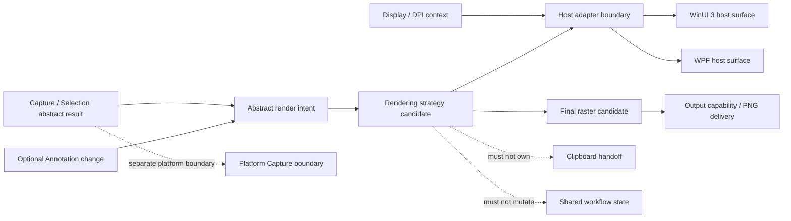

# Rendering Technology Feasibility

本文件為 `TD-002 Rendering Technology` 的技術可行性與決策證據研究。它只比較 SnipPlus 所需的 Rendering 能力，以及候選技術在 WinUI 3／WPF host 下的適配性與風險；不選擇 Desktop UI Framework、不選擇 Capture Backend、不建立 Prototype、不執行 Runtime、不建立 Screenshot，也不開始 Coding。

## Document Control

| Field | Value |
| --- | --- |
| Document ID | `RESEARCH-TECH-RENDER-001` |
| Title | Rendering Technology Feasibility |
| Status | `Draft` |
| Research Type | Technology Feasibility / Decision Evidence |
| Technology Decision | `TD-002 Rendering Technology` |
| Host Framework Decision | `Unresolved — ADR-0002 remains Draft` |
| Runtime Verification | `Not performed` |
| Rendering Decision | `Not made` |
| Owner | TBD |
| Last reviewed | Not reviewed |
| Version | 0.1 |
| Research date | 2026-07-26 |
| Normative References | `PRD-0002`, `PRD-0003`, `PRD-0004`, `PRD-0006`, `SPEC-0005`, `SPEC-0008`, `SPEC-0009`, `SPEC-0010`, `ARCH-0002`, `ARCH-0003`, `ARCH-0004`, `ARCH-0005`, `Architecture/TECHNOLOGY-DECISION-ROADMAP.md` |
| Informative References | `RESEARCH-TECH-UI-001`, `RESEARCH-TECH-UI-007`, `RESEARCH-TECH-UI-008`, `ADR-0002`、官方 Microsoft Learn 文件 |
| Supersedes | None |
| Superseded by | None |

## 1. Decision Boundary

### 1.1 Research scope

本研究只包含：

- Overlay 與 Selection rendering。
- 向量 Annotation object 的顯示能力。
- Resize／rotation handles 的幾何顯示與轉換需求。
- Point／geometry hit testing。
- Text rendering 與 text measurement 的需求。
- Mosaic／pixelation 的 raster effect 需求。
- Alpha composition 與透明內容的合成需求。
- 最終 PNG render/export compatibility。
- DPI、coordinate space 與 output pixel mapping 的證據。
- WinUI 3 與 WPF host 的適配性、依賴與維護風險。

### 1.2 Explicit non-goals

本文件不得決定：

- Desktop UI Framework。
- Capture Backend、Print Screen hook 或擷取 API。
- Clipboard API 或 Clipboard implementation。
- Image storage format、database schema 或 serialization format。
- Packaging、installer、update strategy 或 deployment mode。
- 正式 Runtime／SDK／Windows App SDK 版本。
- Product Project Structure。
- Class、Interface、Service、API、Event schema 或 Source Code。
- Annotation Tool catalog、Toolbar、Shortcut 或 visual layout。

### 1.3 Research status vocabulary

| Status | Meaning |
| --- | --- |
| `Confirmed by official documentation` | 官方文件直接描述相關能力，但不代表 SnipPlus runtime 已驗證 |
| `Partially supported` | 官方能力存在，但 host bridge、產品邊界或完整使用條件仍有缺口 |
| `Unknown` | 目前來源不足，不能從相鄰能力推論 |
| `Requires runtime prototype` | 文件層可提出候選，但必須經未來受控 runtime spike |
| `Not aligned` | 該候選本身不負責該能力；需由另一個明確 boundary 提供 |

本文件所有比較都屬靜態研究。`Confirmed by official documentation` 不等同於 runtime verification，`Requires runtime prototype` 不得被改寫為成功。

## 2. Candidate Strategies

候選是 Rendering strategy，不是 Framework Decision。每個候選都必須能放在既有 UI host、Domain Capability 與 Platform Integration 的責任邊界內。

| ID | Candidate | Primary model | WinUI 3 host relation | WPF host relation | Main dependency | Current status |
| --- | --- | --- | --- | --- | --- | --- |
| `RND-OPT-001` | Framework-native retained-mode rendering | Host XAML shapes、paths、text、images 與 visual tree | Native host primitives；Composition-backed | Native WPF visual tree | Host UI framework | `Partially supported` |
| `RND-OPT-002` | Direct2D／DirectWrite | Native 2D vector、text、bitmap and effect primitives | Requires WinUI surface／interop boundary | Requires WPF／HWND interop boundary | Direct2D／DirectWrite and host bridge | `Partially supported` |
| `RND-OPT-003` | Win2D | Immediate-mode 2D drawing、effects、text、bitmap | Official WinUI integration path | Requires a separate WPF bridge；not native | Win2D package and device lifecycle | `Partially supported` |
| `RND-OPT-004` | SkiaSharp | Shared vector/raster/text/effect engine | Requires WinUI surface adapter | Requires WPF surface adapter | Third-party package and host adapters | `Unknown` |
| `RND-OPT-005` | Hybrid interaction and rendering surface | Domain interaction semantics plus host-specific drawing/effect surfaces | Candidate host adapter required | Candidate host adapter required | Two-layer ownership and surface bridge | `Partially supported` |

`RND-OPT-004` and `RND-OPT-005` are retained as comparison categories only. This document does not select a third-party engine, approve a package, or create an acquisition request.

## 3. Evaluation Criteria and Rendering Capability Contract

### 3.0 Evaluation Criteria

| ID | Criterion |
| --- | --- |
| `RND-001` | Transparent overlay composition |
| `RND-002` | Selection rectangle redraw |
| `RND-003` | Coordinate precision |
| `RND-004` | Per-monitor DPI behavior |
| `RND-005` | Multi-monitor coordinate compatibility |
| `RND-006` | Vector object rendering |
| `RND-007` | Hit testing |
| `RND-008` | Resize and rotation handles |
| `RND-009` | Text rendering quality |
| `RND-010` | Arrow and geometric shape rendering |
| `RND-011` | Mosaic／pixelation capability |
| `RND-012` | Transform and clipping |
| `RND-013` | PNG export fidelity |
| `RND-014` | Alpha and color handling |
| `RND-015` | HDR implications |
| `RND-016` | CPU／GPU and memory implications |
| `RND-017` | Testability and deterministic output |
| `RND-018` | Maintainability and host-framework interop |

這 18 個 criteria 是比較維度，不是產品 KPI，也不會單獨產生 Rendering Decision。

### 3.1 Capability catalog

| Capability ID | Capability | Required behavior boundary | Product source |
| --- | --- | --- | --- |
| `RND-CAP-001` | Selection overlay | Display a selection region and its visual bounds without owning Capture entry or desktop pixels | `SPEC-0005`, `ARCH-0004` |
| `RND-CAP-002` | Vector geometry | Display rectangle, line, path and transformable geometry without committing an Annotation Tool catalog | `SPEC-0009`, `ARCH-0003` |
| `RND-CAP-003` | Resize／rotation handles | Display handles and transformed bounds; interaction ownership remains outside this research | `SPEC-0009`, `PRD-0002` |
| `RND-CAP-004` | Hit testing | Determine point／geometry membership and z-order behavior for selectable visual objects | `ARCH-0005`, official WPF／Win2D evidence |
| `RND-CAP-005` | Text rendering | Draw and measure text with a maintainable font and DPI path; localization remains a product concern | `PRD-0006`, `SPEC-0009` |
| `RND-CAP-006` | Mosaic／pixelation | Apply a deterministic raster effect to a bounded image region; algorithm and image format remain TBD | `PRD-0005`, `SPEC-0009` |
| `RND-CAP-007` | Alpha composition | Compose transparent selection／annotation content with a defined alpha mode and no assumption about desktop backdrop | `RESEARCH-TECH-UI-001`, `PRD-0002` |
| `RND-CAP-008` | PNG render/export | Produce a raster suitable for the separate Output boundary; encoder ownership remains outside Rendering research | `SPEC-0008`, `ARCH-0003` |
| `RND-CAP-009` | Coordinate and DPI mapping | Keep host DIPs, logical render coordinates and output pixels distinguishable | `RESEARCH-TECH-UI-001`, `RESEARCH-TECH-UI-007` |
| `RND-CAP-010` | Host adaptation | Permit the same abstract rendering intent to be hosted by WinUI 3 and WPF without making either host the domain owner | `ARCH-0002`, `ARCH-0003`, `ARCH-0004` |
| `RND-CAP-011` | Device/resource recovery | Define how device-dependent resources are recreated or invalidated without false success | Win2D evidence；`SPEC-0006` failure boundary |
| `RND-CAP-012` | Multi-year maintainability | Keep renderer, host adapter, Output and Annotation responsibilities separately replaceable | `PRD-0003`, `PRD-0006`, `ARCH-0001` |

### 3.2 Capability acceptance vocabulary

Each capability is assessed per candidate and host using only: `Confirmed by official documentation`、`Partially supported`、`Requires runtime prototype`、`Unknown` or `Not aligned`。A candidate is not considered feasible for a future product decision until the capability rows that require runtime evidence are independently verified.

## 4. Evidence Vocabulary and Evidence Sources

### 4.1 Allowed evidence vocabulary

Every candidate comparison and gate record must use only one of these evidence values:

- `Confirmed by official documentation`
- `Partially supported`
- `Requires runtime prototype`
- `Unknown`
- `Not aligned`

These values describe evidence maturity, not product acceptance or a technology decision. An official source may establish an API capability while leaving SnipPlus host integration, output fidelity or performance unresolved.

### 4.2 External evidence register

Each record below includes the claim, source, source date, access date, supported candidate, supported criterion, limitation and decision implication. A source date is recorded as `Not stated on source page` when the official page does not expose a publication or update date.

| Evidence ID | Claim | Official source | Source publication/update date | Access date | Supported candidate | Supported criterion | Limitation | Decision implication |
| --- | --- | --- | --- | --- | --- | --- | --- | --- |
| `RND-EVID-001` | WPF documents retained Visual rendering, vector drawing, transforms, clipping and visual-layer interaction. | [WPF graphics rendering overview](https://learn.microsoft.com/en-us/dotnet/desktop/wpf/graphics-multimedia/wpf-graphics-rendering-overview) | Not stated on source page | 2026-07-26 | `RND-OPT-001` | `RND-002`, `RND-006`, `RND-012`, `RND-018` | Does not prove mixed-DPI overlay behavior or product performance. | Confirms a host-native capability surface; host-specific SnipPlus evidence remains open. |
| `RND-EVID-002` | WPF documents point and geometry hit testing with multiple visual results and z-order traversal. | [WPF hit testing in the visual layer](https://learn.microsoft.com/en-us/dotnet/desktop/wpf/graphics-multimedia/hit-testing-in-the-visual-layer) | Not stated on source page | 2026-07-26 | `RND-OPT-001` | `RND-007`, `RND-008` | Does not define the SnipPlus annotation model or cross-host semantics. | Supports host-native hit-test research; does not close the interaction gate. |
| `RND-EVID-003` | WPF documents a Visual to `RenderTargetBitmap` to `PngBitmapEncoder` path. | [Encode a Visual to an image file](https://learn.microsoft.com/en-us/dotnet/desktop/wpf/graphics-multimedia/how-to-encode-a-visual-to-an-image-file) | Not stated on source page | 2026-07-26 | `RND-OPT-001` | `RND-013`, `RND-014` | Does not prove final scale, color policy or Output ownership. | Provides a documented export path for further fidelity analysis. |
| `RND-EVID-004` | Win2D documents immediate-mode 2D drawing, bitmap operations, effects, text, glyphs and command lists. | [Win2D overview](https://learn.microsoft.com/en-us/windows/apps/develop/win2d/in-a-core-app) | Not stated on source page | 2026-07-26 | `RND-OPT-003` | `RND-006`, `RND-009`, `RND-011`, `RND-012` | Does not prove WPF parity, input mapping or SnipPlus output fidelity. | Confirms a WinUI-oriented capability surface; runtime and host parity remain open. |
| `RND-EVID-005` | Win2D documents display DPI, DIPs and render-target DPI as separate concerns. | [Win2D DPI and DIPs](https://learn.microsoft.com/en-us/windows/apps/develop/win2d/dpi-and-dips) | Not stated on source page | 2026-07-26 | `RND-OPT-003` | `RND-003`, `RND-004`, `RND-005` | Does not prove multi-monitor selection/output alignment. | Supports DPI-specific spike design; it is not runtime proof. |
| `RND-EVID-006` | Windows Composition documents retained visuals, brushes, clipping, opacity and custom drawing interop. | [Windows Composition visual layer](https://learn.microsoft.com/en-us/windows/apps/develop/composition/visual-layer), [Composition brushes](https://learn.microsoft.com/en-us/windows/apps/develop/composition/composition-brushes) | Not stated on source page | 2026-07-26 | `RND-OPT-001`, `RND-OPT-002`, `RND-OPT-003` | `RND-001`, `RND-006`, `RND-012`, `RND-014` | Does not prove PNG export, WPF parity or annotation hit testing. | Supports host-surface comparison and identifies interop work for future spikes. |
| `RND-EVID-007` | WinUI 3 can host non-XAML content such as Composition, Win2D or Direct3D through content-island concepts. | [ContentIsland](https://learn.microsoft.com/en-us/windows/apps/develop/composition/content-island) | Not stated on source page | 2026-07-26 | `RND-OPT-002`, `RND-OPT-003`, `RND-OPT-005` | `RND-018` | Advanced host integration is not locally verified and does not establish WPF support. | Keeps native interop as an explicit compatibility risk. |
| `RND-EVID-008` | Existing repository research separates UI-framework evidence from SnipPlus-specific runtime verification. | [Existing UI framework feasibility](01-ui-framework-feasibility.md) | Repository document dated 2026-07-26 | 2026-07-26 | `RND-OPT-001` through `RND-OPT-005` | `RND-003`, `RND-004`, `RND-005`, `RND-018` | This document narrows Rendering and does not replace TD-001 research. | Preserves the unresolved host-framework boundary and prevents premature selection. |
| `RND-EVID-009` | Output is a separate capability and PNG acceptance remains a downstream boundary. | [SPEC-0008 Capture Output](../../../Specs/SPEC-0008-capture-output.md) | Repository document dated 2026-07-26 | 2026-07-26 | `RND-OPT-001` through `RND-OPT-005` | `RND-013`, `RND-014`, `RND-018` | Exact output dimensions, alpha and color thresholds are not yet defined. | Requires a future output-fidelity spike before any Rendering ADR. |

### 4.3 Evidence interpretation rules

- Official documentation establishes a capability surface, not product acceptance.
- A host-specific API is not automatically a shared renderer abstraction.
- A rendering capability is not a Capture Backend capability.
- A PNG encoder path is not an image storage decision.
- A documented DPI signal is not proof of cross-monitor coordinate fidelity.
- A documented effect or drawing API is not proof of acceptable latency, memory use or cleanup.

## 5. Host Compatibility Matrix

| Candidate | WinUI 3 compatibility | WPF compatibility | Native interop required | Primary evidence | Open risk |
| --- | --- | --- | --- | --- | --- |
| `RND-OPT-001` Framework-native retained-mode rendering | Can reference host primitives; can do basic drawing through XAML/Composition; can satisfy SnipPlus overlay only after runtime prototype | Can reference WPF Visual APIs; can do basic drawing and documented Visual-to-PNG; interactive annotation and overlay awaiting prototype | Host-native APIs are required; cross-host adapter is required for parity | `RND-EVID-001`, `RND-EVID-002`, `RND-EVID-003`, `RND-EVID-006` | Host-specific geometry, text, DPI and raster behavior may diverge |
| `RND-OPT-002` Direct2D／DirectWrite | Can reference native APIs; can do basic drawing through a surface; overlay and input integration awaiting prototype | Can reference native APIs through a WPF surface; can do basic drawing; interactive annotation and overlay awaiting prototype | Yes, WinUI surface and WPF/HWND interop | `RND-EVID-006`, `RND-EVID-007` | Surface lifecycle, text/font behavior and host parity |
| `RND-OPT-003` Win2D | Official WinUI path; can reference package and do basic drawing; overlay, hit testing and PNG path awaiting prototype | Can reference package only through a bridge; basic drawing may be hosted through a non-native surface; SnipPlus compatibility awaiting prototype | Yes for WPF bridge and reviewed surface | `RND-EVID-004`, `RND-EVID-005`, `RND-EVID-007` | Package architecture, device lifecycle, input mapping and WPF bridge |
| `RND-OPT-004` SkiaSharp | Can reference package only after dependency approval; basic drawing and overlay awaiting prototype | Can reference package only after dependency approval; basic drawing and overlay awaiting prototype | Yes, host surface adapters for both hosts | No official source reviewed for this candidate in this document | Dependency ownership, font/effect parity, licensing and maintenance |
| `RND-OPT-005` Hybrid interaction and rendering surface | Can reference host surface per capability; basic drawing and overlay awaiting prototype | Can reference host surface per capability; basic drawing and overlay awaiting prototype | Yes, domain render-intent boundary plus host adapters | `RND-EVID-006`, `RND-EVID-007`, `RND-EVID-008` | Boundary complexity and inconsistent host behavior |

`Can reference package` does not mean suitable for SnipPlus. `Can do basic drawing` does not mean the candidate can satisfy interactive annotation, overlay composition or PNG fidelity. Those claims remain `Awaiting prototype` until the future spikes are authorized and executed.

### 5.1 Host boundary rule

Rendering research may define an abstract render intent, for example selection bounds, vector object, text run, effect region or final raster request. It may not expose concrete `Microsoft.UI.Xaml`、`System.Windows`、Win2D、Composition or third-party types to the Domain Capability Layer. Concrete host and platform types remain below the Platform Integration boundary.

## 6. Criteria Comparison Matrix

Candidate cells use only the Evidence Vocabulary defined in Section 4. No cell is a selection or ranking.

| Criterion | Framework-native | Direct2D／DirectWrite | Win2D | SkiaSharp | Hybrid | Evidence |
| --- | --- | --- | --- | --- | --- | --- |
| `RND-001` Transparent overlay composition | Partially supported | Partially supported | Partially supported | Unknown | Partially supported | `RND-EVID-006`, `RND-EVID-007` |
| `RND-002` Selection rectangle redraw | Confirmed by official documentation | Confirmed by official documentation | Confirmed by official documentation | Unknown | Partially supported | `RND-EVID-001`, `RND-EVID-004` |
| `RND-003` Coordinate precision | Partially supported | Partially supported | Partially supported | Unknown | Partially supported | `RND-EVID-005`, `RND-EVID-008` |
| `RND-004` Per-monitor DPI behavior | Partially supported | Partially supported | Confirmed by official documentation | Unknown | Partially supported | `RND-EVID-005`, `RND-EVID-008` |
| `RND-005` Multi-monitor coordinate compatibility | Requires runtime prototype | Requires runtime prototype | Requires runtime prototype | Requires runtime prototype | Requires runtime prototype | `RND-EVID-005`, `RND-EVID-008` |
| `RND-006` Vector object rendering | Confirmed by official documentation | Confirmed by official documentation | Confirmed by official documentation | Unknown | Partially supported | `RND-EVID-001`, `RND-EVID-004`, `RND-EVID-006` |
| `RND-007` Hit testing | Partially supported | Partially supported | Partially supported | Unknown | Partially supported | `RND-EVID-002`, `RND-EVID-004` |
| `RND-008` Resize and rotation handles | Partially supported | Partially supported | Partially supported | Unknown | Partially supported | `RND-EVID-001`, `RND-EVID-006` |
| `RND-009` Text rendering quality | Confirmed by official documentation | Confirmed by official documentation | Confirmed by official documentation | Unknown | Partially supported | `RND-EVID-001`, `RND-EVID-004` |
| `RND-010` Arrow and geometric shape rendering | Confirmed by official documentation | Confirmed by official documentation | Confirmed by official documentation | Unknown | Partially supported | `RND-EVID-001`, `RND-EVID-004`, `RND-EVID-006` |
| `RND-011` Mosaic／pixelation capability | Not aligned | Partially supported | Confirmed by official documentation | Unknown | Partially supported | `RND-EVID-004`, `RND-EVID-006` |
| `RND-012` Transform and clipping | Confirmed by official documentation | Confirmed by official documentation | Confirmed by official documentation | Unknown | Partially supported | `RND-EVID-001`, `RND-EVID-006` |
| `RND-013` PNG export fidelity | Partially supported | Partially supported | Partially supported | Unknown | Partially supported | `RND-EVID-003`, `RND-EVID-009` |
| `RND-014` Alpha and color handling | Partially supported | Confirmed by official documentation | Confirmed by official documentation | Unknown | Partially supported | `RND-EVID-003`, `RND-EVID-006` |
| `RND-015` HDR implications | Unknown | Unknown | Unknown | Unknown | Unknown | `RND-EVID-008`, `RND-EVID-009` |
| `RND-016` CPU／GPU and memory implications | Unknown | Unknown | Unknown | Unknown | Unknown | `RND-EVID-004`, `RND-EVID-005` |
| `RND-017` Testability and deterministic output | Requires runtime prototype | Requires runtime prototype | Requires runtime prototype | Requires runtime prototype | Requires runtime prototype | `RND-EVID-008`, `RND-EVID-009` |
| `RND-018` Maintainability and host-framework interop | Partially supported | Partially supported | Partially supported | Unknown | Partially supported | `RND-EVID-007`, `RND-EVID-008` |

The matrix records evidence status only. It does not add scores and does not produce a Rendering or host-framework decision.

## 7. Critical Rendering Gates and Candidate Assessments

### 7.0 Critical rendering gates

Gate status uses only: `Satisfied by documentation`, `Partially satisfied`, `Requires runtime prototype`, `Unsatisfied`, `Not evaluated`.

| Gate ID | Gate | Required evidence | Status |
| --- | --- | --- | --- |
| `RND-GATE-001` | Transparent overlay composition | Transparent surface, alpha mode and host composition evidence | Partially satisfied |
| `RND-GATE-002` | Interactive vector rendering and hit testing | Object geometry, z-order, pointer mapping and handle evidence | Requires runtime prototype |
| `RND-GATE-003` | DPI and coordinate correctness | Same render intent across host DIPs, logical units and display pixels | Requires runtime prototype |
| `RND-GATE-004` | Text rendering fidelity | Font fallback, layout, baseline, scaling and output pixel evidence | Partially satisfied |
| `RND-GATE-005` | Mosaic interaction and performance | Bounded effect region, repaint behavior and resource observation | Requires runtime prototype |
| `RND-GATE-006` | PNG export fidelity | Display/output comparison including alpha, dimensions and color handling | Partially satisfied |
| `RND-GATE-007` | Host-framework interoperability | WinUI 3 and WPF surface, input and lifecycle evidence | Requires runtime prototype |
| `RND-GATE-008` | Testability and deterministic comparison | Reproducible synthetic scene and comparison method | Requires runtime prototype |
| `RND-GATE-009` | Color and HDR risk containment | Color-space, alpha and downgrade behavior evidence | Not evaluated |

No gate status authorizes a Prototype, Runtime, Build or product implementation.

### 7.1 `RND-OPT-001` — Framework-native retained-mode rendering

| Field | Assessment |
| --- | --- |
| Evidence | WinUI XAML is backed by Windows Composition; WPF documents retained Visual and vector drawing models |
| Strengths | Natural host layout, text/control accessibility surface, visual-tree integration and maintainable host alignment |
| Selection／vector fit | `Partially supported`; basic primitives are documented, but SnipPlus overlay and annotation behavior still needs runtime prototype |
| Hit-testing fit | `Partially supported`; host visual hit testing exists, but common cross-host semantics are not established |
| Mosaic／pixelation fit | `Requires runtime prototype`; custom bitmap/effect boundary is not supplied by basic XAML primitives alone |
| PNG fit | `Requires runtime prototype` for WinUI; `Confirmed by official documentation` WPF path exists through Visual → RenderTargetBitmap → PngBitmapEncoder |
| Main risk | Host-specific geometry, text and DPI behavior may diverge even when the abstract render intent is the same |
| Status | `Candidate baseline; no selection` |

### 7.2 `RND-OPT-002` — Direct2D／DirectWrite

| Field | Assessment |
| --- | --- |
| Evidence | Direct2D／DirectWrite are the native Windows 2D and text primitives behind several Windows rendering paths; this document records the category without selecting an API version |
| Strengths | Native vector, bitmap and text primitives with a direct Windows integration option |
| Selection／vector fit | `Confirmed by official documentation` at API capability level; SnipPlus selection and annotation semantics remain unverified |
| Hit-testing fit | `Partially supported`; geometry/text capabilities exist, but product hit-test routing and object z-order are not supplied by the API alone |
| Mosaic／pixelation fit | `Partially supported` to `Confirmed by official documentation` depending the effect path under review; exact output and quality remain open |
| PNG fit | `Partially supported`; bitmap load/save capability is documented, but final product encoder and color policy remain separate |
| Main risk | Host surface interop, text/font behavior, resource lifecycle and WPF／WinUI parity |
| Status | `Candidate; host and runtime evidence open` |

### 7.3 `RND-OPT-003` — Win2D

| Field | Assessment |
| --- | --- |
| Evidence | Win2D documents immediate-mode 2D drawing, bitmap operations, effects, text, glyphs, command lists and DPI behavior; it integrates with WinUI |
| Strengths | Broad 2D primitives, text and effect surface; explicit control of drawing resources and raster operations |
| Selection／vector fit | `Confirmed by official documentation` at API capability level; SnipPlus selection and annotation semantics remain unverified |
| Hit-testing fit | `Partially supported`; geometry/text capabilities exist, but product hit-test routing and object z-order are not supplied by the API alone |
| Mosaic／pixelation fit | `Partially supported` to `Confirmed by official documentation` depending the effect path under review; exact output and quality remain open |
| PNG fit | `Partially supported`; bitmap load/save capability is documented, but final product encoder and color policy remain separate |
| Main risk | Package and device-resource lifecycle, CPU architecture, WPF parity and host input integration |
| Status | `Candidate; parity and runtime evidence open` |

### 7.4 `RND-OPT-004` — SkiaSharp

| Field | Assessment |
| --- | --- |
| Evidence | No SkiaSharp source or package has been approved or verified in this research; the candidate is retained because a shared 2D engine is a comparison category |
| Strengths | Potential shared vector/raster/effect semantics across WinUI 3 and WPF |
| Selection／vector fit | `Unknown`; engine and host adapters are unverified |
| Hit-testing fit | `Unknown`; drawing capability does not establish host input semantics |
| Mosaic／pixelation fit | `Unknown`; effect and pixel-buffer evidence is not established here |
| PNG fit | `Unknown`; encoder, alpha, color and metadata behavior require primary evidence |
| Main risk | Dependency ownership, licensing, update cadence, text/font parity, host integration and abstraction cost |
| Status | `Unknown; no package, prototype or ADR` |

### 7.5 `RND-OPT-005` — Hybrid interaction and rendering surface

| Field | Assessment |
| --- | --- |
| Evidence | Combines domain interaction semantics with host-specific rendering surfaces; existing Architecture supports this separation but does not select a concrete surface |
| Strengths | Can preserve common selection/hit-test intent while using host-appropriate vector, effect and bitmap sub-paths |
| Selection／vector fit | `Partially supported`; requires a stable render-intent boundary and host adapters |
| Hit-testing fit | `Partially supported`; domain owns intent, host adapter owns coordinate translation |
| Mosaic／pixelation fit | `Partially supported`; may use a bitmap/effect sub-path without making it the complete renderer |
| PNG fit | `Partially supported`; output raster and encoder remain separate |
| Main risk | Boundary complexity, duplicated evidence, inconsistent host behavior and unclear ownership if not governed |
| Status | `Candidate; architecture boundary required` |

## 8. Rendering Ownership Boundary and Capability Findings

### 8.0 Ownership boundary

Domain／Feature owns:

- Annotation object semantics.
- Bounds, rotation, layer and style intent.
- Hit-test intent.
- Undo／Redo command semantics.
- Selection state.

Rendering Technology owns:

- Visual output.
- Drawing primitives.
- Text rasterization.
- Clipping.
- Composition.
- Render target.
- Export rendering implementation.

Rendering Technology must not own Workflow State Authority, the Annotation domain model, the Capture coordinator or the Clipboard coordinator.

### 8.1 Selection and overlay

The renderer needs to display selection geometry, handles and feedback, but it must not own Capture entry, desktop pixels, focus policy or global shortcuts. The existing architecture assigns platform capture to `COMP-014`／`MOD-008`, display context to `COMP-018`／`MOD-011`, and Selection semantics to the domain boundary. Therefore:

- A renderer receives an abstract selection render intent.
- A renderer does not call a Capture API.
- A renderer does not read real desktop pixels in this feasibility phase.
- A renderer does not decide whether one virtual overlay or one overlay per display is the product behavior.
- Z-order, focus and topmost behavior remain platform and workflow concerns.

Current status: `Requires runtime prototype` for every candidate that claims complete overlay behavior.

### 8.2 Vector objects and handles

WPF Visual／DrawingVisual and Windows Composition provide documented vector or visual primitives. Win2D provides documented geometry drawing. However, the product does not yet define an Annotation Tool catalog, object format, transform contract or serialization format. This means the current evidence supports primitive rendering, not a complete Annotation editor.

The future comparison must use the same synthetic object set:

| Object | Required observation |
| --- | --- |
| Rectangle | Fill, stroke, opacity and bounds |
| Line／arrow-like path | Stroke, transform and endpoint bounds; no product tool decision |
| Text run | Font resolution, layout bounds and baseline |
| Mosaic region | Effect bounds and raster result |
| Selection rectangle | Pointer-driven geometry and handle display |

### 8.3 Hit testing

Hit testing must remain separate from drawing commands. The future contract should distinguish:

1. Host input coordinate.
2. Renderer logical coordinate.
3. Object geometry.
4. Z-order resolution.
5. Resolved object or handle outcome.

WPF provides documented visual-layer point／geometry hit testing. Win2D and Composition can provide drawing and surface capabilities, but the product hit-test contract still needs an explicit host adapter and runtime evidence. No candidate may claim parity solely because it can draw the same shape.

### 8.4 Text

Text is both a rendering and measurement concern. The future evidence must record:

- Font family resolution and fallback.
- Text layout bounds and baseline.
- DPI and scaling branch.
- Unicode and right-to-left behavior relevant to the product scope.
- Hit-test or selection behavior if text becomes selectable.
- PNG raster result at the output pixel size.

Win2D documents text layout and glyph operations. WPF documents glyph and text drawing through the Visual layer. WinUI XAML provides host text capabilities. None of these facts decide the product font policy or text annotation feature.

### 8.5 Mosaic／pixelation

Mosaic／pixelation is a raster operation over a bounded region. It should not force all vector rendering to become a CPU bitmap pipeline. The comparison must record:

- Source pixel region and output pixel region.
- Alpha behavior at the region edge.
- Scaling and interpolation policy.
- Repaint cost while the region moves or resizes.
- Final PNG result.
- Failure behavior when the effect resource is unavailable.

Current status: no candidate has SnipPlus-specific quality or performance acceptance. Runtime evidence is required.

### 8.6 Alpha composition

Alpha must be described with the actual surface/pixel format and composition operation. A translucent in-app brush must not be interpreted as showing the desktop behind the application. Official WinUI materials documentation explicitly distinguishes in-app Acrylic from desktop system backdrop behavior; this research does not choose either behavior.

Required future evidence:

- Premultiplied or straight alpha mode.
- Surface pixel format.
- Transparent background result.
- Overlapping selection／annotation objects.
- Composition over a synthetic background only.
- Final PNG alpha preservation.

### 8.7 PNG render/export

Rendering creates a final raster or render result; `MOD-006`／`COMP-010` owns Output delivery. The boundary is:

```text
Abstract render intent
  -> renderer / host adapter
  -> final raster candidate
  -> Output capability
  -> approved PNG delivery
```

WPF has direct official evidence for Visual-to-PNG encoding. Win2D documents bitmap operations and render targets, but the exact SnipPlus final PNG path, alpha policy, color policy and Output handoff remain open. Composition surfaces likewise require a separate rasterization and encoding decision.

## 9. Output Fidelity Requirements and DPI/Coordinate Model

### 9.0 Output fidelity requirements

The future evidence record must answer the following without inventing product KPIs:

- Whether display rendering and PNG export use the same render path or explicitly equivalent render intent.
- How DPI, logical coordinates and output pixels map to one another.
- How alpha mode, color handling and transparent backgrounds are preserved.
- How font fallback, text measurement, baseline and scaling affect output.
- How stroke alignment, rotation and clipping affect display and PNG output.
- Whether mosaic output is consistent during interaction and final export.
- How color-space or HDR input is downgraded or preserved.
- How GPU display rendering relates to software or separate export rendering.

Unknown thresholds remain `TBD`; this document does not create latency, quality or memory KPIs.

### 9.1 Required coordinate spaces

The future design must not collapse these spaces into one number:

| Coordinate space | Owner／meaning | Current status |
| --- | --- | --- |
| Host DIPs | UI host layout and pointer coordinate space | Host-dependent |
| Renderer logical units | Abstract geometry and vector object space | Must be host-neutral |
| Display physical pixels | Platform display context | `Unknown` for current topology baseline |
| Output pixels | Final PNG raster dimensions | Output boundary; policy `TBD` |
| Effect region pixels | Mosaic／pixelation processing region | Renderer/effect boundary; policy `TBD` |

### 9.2 Static conclusion

Win2D documents DIPs and DPI-aware controls; WPF documents device-independent graphics. Those sources establish useful primitives, but they do not close SnipPlus multi-monitor, heterogeneous-DPI or captured-image alignment. `RND-CAP-009` therefore remains `Requires runtime prototype` for all candidates.

## Appendix A. Architecture Boundary Mapping

### Appendix A.1 Responsibility mapping

| Responsibility | Owning boundary | Rendering relationship | Prohibited renderer responsibility |
| --- | --- | --- | --- |
| Capture entry and platform capture | `COMP-004`／`COMP-014`; `MOD-003`／`MOD-008` | Supplies abstract result or failure | Calling Capture API, owning Print Screen or reading desktop pixels |
| Display/focus/DPI context | `COMP-018`; `MOD-011` | Supplies abstract context | Modifying Display Settings, DPI, HDR or focus policy |
| Selection semantics | `COMP-005`; `MOD-003` | Supplies selection render intent | Owning workflow state or capture session |
| Annotation lifecycle | `COMP-007`／`COMP-008`; `MOD-004` | Supplies annotation change/render intent | Defining Annotation Tool catalog or persistence |
| Rendering | Candidate renderer boundary; exact component `TBD` | Converts abstract intent to host visual/raster result | Owning Capture, Clipboard, Output delivery or shared state |
| Output delivery | `COMP-010`／`COMP-016`; `MOD-006`／`MOD-010` | Consumes approved final result | Making renderer responsible for File IO or delivery side effects |
| Clipboard handoff | `COMP-009`／`COMP-015`; `MOD-005`／`MOD-009` | Parallel downstream consumer | Being a prerequisite for rendering |
| Shared workflow state | `COMP-001` | Receives state transition request through coordinator | Direct state mutation by renderer |

### Appendix A.2 Dependency rule

The renderer may depend on an abstract render intent, coordinate context and host adapter. It must not introduce a dependency from Domain Capability Layer directly to concrete platform rendering APIs. The exact renderer Component／Module remains `TBD` and must not be added to Architecture through this research document.

### Appendix A.3 Architecture diagram



## 10. Future Runtime Spikes

本節只定義 future runtime spikes，不執行任何 Spike、Prototype、Project、Build、Screenshot 或 Runtime。所有 workload 都是 synthetic-only，不讀取真實桌面像素。

### 10.0 Synthetic baseline

- 1024 × 768 logical canvas。
- 固定純色背景與四個高對比色塊。
- 固定 selection rectangle initial position `(128, 96)`、size `160 × 120`。
- 固定 rectangle、line/path、text run、mosaic region object。
- 固定 pointer、focus restore、cancel sequence。
- 不使用 Print Screen hook、Capture API、Clipboard 或產品圖片。
- 每次未授權的 spike 狀態均為 `Not authorized`。

### 10.1 `RND-SPIKE-001` — Selection rectangle continuous redraw

- Purpose: 觀察 selection rectangle 在連續 pointer 更新時的重繪完整性與座標穩定性。
- Candidate technologies: `RND-OPT-001`、`RND-OPT-002`、`RND-OPT-003`、`RND-OPT-004`、`RND-OPT-005`。
- Host frameworks: WinUI 3、WPF。
- Synthetic workload: 以固定 canvas 連續更新 selection bounds，包含最小、反向與跨邊界矩形。
- Required evidence: 每次更新的邏輯 bounds、視覺結果、重繪遺留痕跡與 host coordinate mapping。
- Pass condition: 在授權的測試條件下，所有候選都能記錄一致的 bounds 與無殘影結果；實際 threshold TBD。
- Failure implication: 需要調整 render surface、invalidate boundary 或 coordinate mapping；不得直接宣告候選不適用。
- Dependency: `RND-001`、`RND-002`、`RND-003` 與 host surface authorization。
- Prohibited scope: 不建立產品 overlay、不讀取桌面、不加入 Capture 或 Screenshot 功能。

### 10.2 `RND-SPIKE-002` — Multiple vector objects and resize handles

- Purpose: 觀察多個向量物件、layer order、rotation bounds 與 resize handles 的繪製與互動邊界。
- Candidate technologies: 五個 `RND-OPT-001` 至 `RND-OPT-005` 候選。
- Host frameworks: WinUI 3、WPF。
- Synthetic workload: 固定 rectangle、line/path、text run 與兩個重疊物件，依固定 pointer sequence 移動與縮放 handles。
- Required evidence: object bounds、rotation transform、handle geometry、z-order 與 redraw evidence。
- Pass condition: render intent 可在 renderer 與 host adapter 間完整追蹤；互動 tolerance TBD。
- Failure implication: 需要重新界定 Domain hit-test intent 與 Rendering visual output 的責任，不產生產品模型。
- Dependency: `RND-006`、`RND-007`、`RND-008`、`SPEC-0009`。
- Prohibited scope: 不定義 Annotation Tool catalog、serialization 或 Undo／Redo implementation。

### 10.3 `RND-SPIKE-003` — Text, font fallback and scaling

- Purpose: 觀察 text layout、font fallback、baseline 與 DPI scaling 對顯示及輸出 raster 的影響。
- Candidate technologies: `RND-OPT-001`、`RND-OPT-002`、`RND-OPT-003`、`RND-OPT-004`、`RND-OPT-005`。
- Host frameworks: WinUI 3、WPF。
- Synthetic workload: 固定 Latin、CJK、mixed-script、fallback font 與不同 logical scale 的 text runs。
- Required evidence: resolved font、fallback chain、layout bounds、baseline、glyph result 與 host-to-output mapping。
- Pass condition: 每次執行都能記錄 deterministic input/output metadata；產品字型政策與 tolerance TBD。
- Failure implication: 需要補充 text abstraction、font policy 或 export path evidence。
- Dependency: `RND-009`、`RND-013`、`RND-014` 與未決的 product font scope。
- Prohibited scope: 不決定產品字型、不修改 PRD／Specs、不建立文字工具。

### 10.4 `RND-SPIKE-004` — Mosaic interaction

- Purpose: 觀察 bounded mosaic／pixelation region 在移動、縮放、旋轉時的 effect boundary 與重繪行為。
- Candidate technologies: `RND-OPT-002`、`RND-OPT-003`、`RND-OPT-004`、`RND-OPT-005`；`RND-OPT-001` 作為 host baseline。
- Host frameworks: WinUI 3、WPF。
- Synthetic workload: 固定 synthetic image-like color blocks 與 bounded effect region，依固定 pointer sequence 改變 region。
- Required evidence: region bounds、edge alpha、interpolation/effect path、repaint result 與 resource lifecycle。
- Pass condition: effect region 在 synthetic input 下可重現；品質與延遲 threshold TBD。
- Failure implication: 需要另設 effect sub-path 或保留 `Not aligned`，不得把所有 rendering 改成 CPU bitmap pipeline。
- Dependency: `RND-011`、`RND-012`、`RND-014` 與 synthetic-only image contract。
- Prohibited scope: 不讀取真實圖片、不實作產品馬賽克工具、不建立 Screenshot。

### 10.5 `RND-SPIKE-005` — Hit testing accuracy

- Purpose: 觀察 point、geometry、z-order 與 rotated object 的 hit-test 結果能否與 render intent 對齊。
- Candidate technologies: 五個 `RND-OPT-001` 至 `RND-OPT-005` 候選。
- Host frameworks: WinUI 3、WPF。
- Synthetic workload: 固定重疊 rectangle、line/path、rotated bounds、text run 與 handles，執行固定 pointer／geometry queries。
- Required evidence: host input point、logical point、candidate objects、z-order traversal、resolved result 與 mismatch record。
- Pass condition: 每個 query 都產生可重現的 decision record；產品 hit-test tolerance TBD。
- Failure implication: 需要補充 host adapter 或 Domain hit-test intent contract。
- Dependency: `RND-007`、`RND-008`、`ARCH-0005`。
- Prohibited scope: 不新增 selection state authority、不改 workflow state、不建立 input service。

### 10.6 `RND-SPIKE-006` — Same screen output at different DPI

- Purpose: 觀察同一 abstract render intent 在不同 display DPI 與 host scale 下的幾何、文字與像素映射。
- Candidate technologies: 五個 `RND-OPT-001` 至 `RND-OPT-005` 候選。
- Host frameworks: WinUI 3、WPF。
- Synthetic workload: 固定 scene 在 same-DPI 與 heterogeneous-DPI configurations 下以相同 logical coordinates render。
- Required evidence: host DIPs、renderer units、display physical pixels、output pixels、rounding 與 clipping records。
- Pass condition: mapping rules 可被完整記錄並重現；跨 monitor tolerance TBD。
- Failure implication: 需要明確 coordinate conversion boundary 或限制未支援 topology。
- Dependency: `RND-003`、`RND-004`、`RND-005`、`RESEARCH-TECH-UI-007`。
- Prohibited scope: 不修改 display settings、不操作真實桌面、不決定 Capture Backend。

### 10.7 `RND-SPIKE-007` — Display render versus PNG export comparison

- Purpose: 比較 display render 與 PNG export 是否共用 render intent，以及差異是否可追蹤。
- Candidate technologies: 五個 `RND-OPT-001` 至 `RND-OPT-005` 候選。
- Host frameworks: WinUI 3、WPF。
- Synthetic workload: 固定 vector、text、mosaic、alpha、rotation、clipping scene 產生 display candidate 與 PNG candidate。
- Required evidence: render path、pixel dimensions、alpha、color、font、stroke、rotation、clipping 與 mismatch record。
- Pass condition: 每個差異都有可追蹤的 path 或 policy explanation；product acceptance threshold TBD。
- Failure implication: 需要分離 display renderer 與 export renderer，或補充 equivalence evidence。
- Dependency: `RND-013`、`RND-014`、`SPEC-0008`、`ARCH-0004`。
- Prohibited scope: 不建立正式 PNG delivery、File IO policy、storage format 或 product output service。

### 10.8 `RND-SPIKE-008` — Alpha and transparent overlay

- Purpose: 觀察 transparent surface、premultiplied/straight alpha 與 synthetic background composition 的結果。
- Candidate technologies: `RND-OPT-001`、`RND-OPT-002`、`RND-OPT-003`、`RND-OPT-004`、`RND-OPT-005`。
- Host frameworks: WinUI 3、WPF。
- Synthetic workload: 固定透明背景、半透明 selection、overlapping annotations 與 opaque synthetic color blocks。
- Required evidence: pixel format、alpha mode、composition order、edge color、transparent export result。
- Pass condition: alpha behavior 可由記錄的 surface/pixel contract 重現；color policy TBD。
- Failure implication: 需要替換 surface path 或限制 renderer capability boundary。
- Dependency: `RND-001`、`RND-014`、`RND-015`、`RND-EVID-006`。
- Prohibited scope: 不宣告 desktop backdrop、Acrylic 或 HDR policy，不讀取 desktop pixels。

### 10.9 `RND-SPIKE-009` — CPU/GPU and memory observation

- Purpose: 觀察候選在 synthetic redraw、effect、text 與 export path 的資源使用與 recovery evidence。
- Candidate technologies: 五個 `RND-OPT-001` 至 `RND-OPT-005` 候選。
- Host frameworks: WinUI 3、WPF。
- Synthetic workload: 固定 scene、固定 iteration count、selection movement、mosaic effect、text fallback 與 export request。
- Required evidence: CPU/GPU observation method、memory snapshots、resource creation/release、device loss handling 與 run metadata。
- Pass condition: 同一 workload 可比較且無未記錄的 resource leak；數值門檻 TBD。
- Failure implication: 需要調整 device/resource boundary 或標示未知，不直接作技術決策。
- Dependency: `RND-016`、`RND-018`、`RND-SPIKE-001` 至 `RND-SPIKE-008`。
- Prohibited scope: 不建立效能 KPI、不進行 production benchmark、不執行本研究文件的 runtime。

### 10.10 `RND-SPIKE-010` — WinUI 3/WPF host interoperability

- Purpose: 觀察相同 abstract render intent 在 WinUI 3 與 WPF host 的 adapter、input、DPI、lifecycle 與 output evidence。
- Candidate technologies: 五個 `RND-OPT-001` 至 `RND-OPT-005` 候選，依各候選的 host fit 分開記錄。
- Host frameworks: WinUI 3、WPF。
- Synthetic workload: 固定 scene、pointer sequence、DPI cases、resource recovery event 與 display/export request。
- Required evidence: package/reference state、surface type、native interop boundary、input mapping、DPI mapping、lifecycle、output comparison。
- Pass condition: 每個 host/candidate pair 都能明確記錄 can reference、basic drawing、interactive annotation、overlay 與 export 的證據級別。
- Failure implication: 保留 host-specific boundary、`Unknown` 或 `Requires runtime prototype`，不修改 ADR-0002。
- Dependency: `ADR-0002`、`RND-GATE-007`、`RND-GATE-008` 與 host authorization。
- Prohibited scope: 不選擇 Desktop UI Framework、不接受 ADR、不建立正式 Project 或 product source code。

### 10.11 Spike authorization rules

- 每個 spike 必須記錄 candidate、host、version、Windows build、architecture、configuration、timestamp 與 attempt number。
- Build authorization 與 Runtime authorization 必須分開。
- 未完成或失敗的 spike 只能保留 `Unknown` 或 `Requires runtime prototype`。
- Candidate 或 host 切換前必須完成 cleanup evidence。
- 本研究不要求 Screenshot 或 screen recording；未來若需要，必須另行明確授權。
- 任何 tolerance、latency target、color policy 或 text-fidelity threshold 都必須來自後續產品決策。

## 11. Research Findings

研究發現只保留目前來源可支持的觀察：

1. WPF 官方來源直接涵蓋 retained Visual drawing、visual-layer hit testing 與 Visual-to-PNG 路徑；這是 host-specific evidence，不等於 SnipPlus runtime verification。
2. Win2D 官方來源直接涵蓋 WinUI-oriented 2D drawing、text、bitmap、effect 與 DPI concepts；WPF parity、input mapping、resource behavior 與產品輸出仍需 spike。
3. Windows Composition 官方來源涵蓋 retained visuals、brushes、opacity、clipping 與 drawing interop；其本身沒有關閉 PNG export、Annotation hit testing 或 WPF compatibility。
4. Framework-native retained rendering 可以作為 baseline，但 mosaic／pixelation、cross-host parity 與 final PNG fidelity 不能只從 basic XAML primitives 推論。
5. Direct2D／DirectWrite 的 native surface category 仍需要 WinUI 3 與 WPF interop evidence；本文件沒有執行該 evidence。
6. SkiaSharp 在本文件中沒有已核實的官方來源、package reference 或 host adapter evidence，因此相關 criteria 保持 `Unknown`。
7. Hybrid strategy 可以描述 domain render intent 與 host-specific surface 的邊界，但 boundary complexity 與兩個 host 的一致性仍需 runtime evidence。
8. DPI、coordinate conversion、alpha/color policy、HDR implications、CPU/GPU/memory 與 deterministic output 仍存在未關閉的 research gaps。

### 11.1 Current research posture

目前只保留兩條待驗證 evidence track：

- Host-native track：WinUI 3 host/Composition 與 WPF Visual baseline。
- 2D/effect track：Direct2D／Win2D 與可獨立驗證的 WPF surface/effect path。

這是研究排序與證據分組，不是 Rendering Technology、Desktop UI Framework、package、host 或產品架構的決定。

### 11.2 Open questions

- 是否由同一 abstract render intent 支援 overlay display 與 final PNG output？
- 第一個產品 scope 需要什麼 text/font policy？
- Output 需要什麼 alpha mode、color policy 與 HDR downgrade policy？
- Mosaic／pixelation 是 interaction-time、completion-time 或兩者都需要？
- Rotated 或 overlapping objects 的 hit-test semantics 是什麼？
- 每一項 Rendering capability 是否都必須維持 WPF parity？
- 未來 Rendering ADR 是否獨立於 `ADR-0002`，或仍作為 UI Framework decision 的下游文件？

## 12. Evidence Readiness

Allowed readiness values are only: `Sufficient for Rendering ADR`, `Partially sufficient`, `Insufficient for Rendering ADR`.

| Field | Value |
| --- | --- |
| Evidence Readiness | `Partially sufficient` |
| Rendering Decision | `Not made` |
| Rendering ADR | Not created |
| Runtime Verification | `Not performed` |
| Required next evidence | Future runtime spikes listed in Section 10 |

The evidence is sufficient to define the Rendering boundary, candidates, criteria and future spikes. It is not sufficient to create or accept a Rendering ADR. No Rendering ADR is created or modified by this document.

## 13. Traceability

```text
Product requirement
  -> Rendering criterion
  -> Candidate evidence
  -> Rendering gate
  -> Future runtime spike
  -> Future TD-002 Rendering ADR
```

| Traceability target | Source |
| --- | --- |
| Technology decision boundary | `Architecture/TECHNOLOGY-DECISION-ROADMAP.md` (`TD-002 Rendering Technology`) |
| Host framework remains unresolved | `Architecture/adr/ADR-0002-ui-framework-selection.md` |
| Existing UI feasibility and runtime evidence boundary | `docs/Research/Technology/01-ui-framework-feasibility.md`, `docs/Research/Technology/02-ui-framework-runtime-spike-plan.md`, `docs/Research/Technology/07-ui-framework-phase1-readiness-reassessment.md` |
| Product requirements | `PRD/PRD-0002-user-facing-capabilities.md`, `PRD/PRD-0003-non-functional-requirements.md`, `PRD/PRD-0004-platform-constraints.md`, `PRD/PRD-0006-non-functional-requirements.md` |
| Capture and annotation specifications | `Specs/SPEC-0005-capture-workflow.md`, `Specs/SPEC-0009-annotation-capability.md`, `Specs/SPEC-0010-annotation-interaction.md` |
| Architecture boundaries | `Architecture/ARCH-0002-layered-architecture.md`, `Architecture/ARCH-0003-module-catalog.md`, `Architecture/ARCH-0004-component-boundaries.md`, `Architecture/ARCH-0005-component-interactions.md` |
| Rendering criteria | `RND-001` through `RND-018` in Section 3 |
| Candidate evidence | `RND-EVID-001` through `RND-EVID-009` in Section 4 |
| Rendering gates | `RND-GATE-001` through `RND-GATE-009` in Section 7 |
| Future spikes | `RND-SPIKE-001` through `RND-SPIKE-010` in Section 10 |

The traceability chain is descriptive only. It does not authorize a Rendering ADR, host-framework decision, Prototype, Project or source-code change.

## 14. Completion Boundary

| Completion condition | Result |
| --- | --- |
| Only `docs/Research/Technology/10-rendering-technology-feasibility.md` modified for this task | Yes |
| Five required candidate strategies recorded | Yes |
| `RND-001` through `RND-018` established | Yes |
| Host Compatibility Matrix distinguishes reference, basic drawing, product fit and prototype status | Yes |
| 18-row Criteria Comparison Matrix | Yes |
| `RND-GATE-001` through `RND-GATE-009` established | Yes |
| Rendering ownership boundary recorded | Yes |
| At least 10 future runtime spikes defined with required fields | Yes |
| Rendering Decision | `Not made` |
| Host Framework Decision | `Unresolved — ADR-0002 remains Draft` |
| Runtime Verification | `Not performed` |
| Rendering ADR | Not created or modified |
| Project／Prototype／Result file | Not created |
| Product source code／Build file | Not created |
| Screenshot／Screen recording | Not created |

本文件完成不代表任何 Candidate 已升級為 `Ready` 或 `Accepted`，也不代表可以開始 Coding。沒有安裝、下載、Restore、Build、Run、Publish、Deployment、Prototype、Screenshot、Capture 或產品實作。

## Appendix B. Prohibited Actions for This Research

- 不得以本文件修改 `ADR-0002` 或建立 Rendering ADR。
- 不得選擇 WinUI 3、WPF、Win2D、Composition、WPF Visual、第三方 renderer 或 PNG encoder。
- 不得建立 Project、Prototype、Runtime Spike、Screenshot 或 Screen recording。
- 不得讀取真實桌面像素、使用 Print Screen hook、Capture API 或 Clipboard。
- 不得修改 PRD、Specs、Architecture baseline 或 Technology Decision Roadmap 的 Decision status。
- 不得把官方 capability evidence 宣告為 SnipPlus runtime verification。
