# Clipboard Integration Read-only Local Inspection Documentary Gap Closure Specification

## Document Control

| Field | Value |
|---|---|
| Document ID | `RESEARCH-TECH-CLIPBOARD-013` |
| Title | Clipboard Integration Read-only Local Inspection Documentary Gap Closure Specification |
| Status | Draft |
| Research Type | Documentary Gap Closure Specification |
| Technology Decision | `TD-004 Clipboard Integration` |
| Parent Gap Closure Plan | `RESEARCH-TECH-CLIPBOARD-012` |
| Parent Readiness Closure Specification | `RESEARCH-TECH-CLIPBOARD-011` |
| Parent Inspection Plan | `RESEARCH-TECH-CLIPBOARD-010` |
| Documentary Closure Execution | Performed in this document only |
| Parent Gap Status Mutation | Not performed |
| Inspection Authorization Request Created | No |
| Human Authorization Decision | Not made |
| Inspection Authorization | Not granted |
| Inspection Execution | Not started |
| Local／Package Cache Inspection | Not performed |
| Clipboard Read／Write／Clear | Not performed |
| Evidence Persistence | Not performed |
| Build／Runtime Verification | Not performed |
| Shared UI Authorization Artifact | Not found／TBD |
| Clipboard／Capture／Rendering Decision | Not made |
| Owner | TBD |
| Last reviewed | Not reviewed |

## 1. Purpose

本文件只回答：如何依照 `RESEARCH-TECH-CLIPBOARD-012`，產出足以供後續重新評估的八組最終靜態規格，使 Command Boundary、Allowlist、Denylist、Observation、Redaction、Batch 及 Authority dependency 不再停留於規劃層級。

本文件是文件規格 Closure 輸出，不是：

- Parent Gap 狀態修改
- Authorization Request
- Human Authorization Decision
- Inspection
- Runtime Evidence
- Clipboard 操作

本文件的 Closure 只表示靜態規格已具備重新評估所需的內容；不代表任何本機狀態已被觀察，不代表任何權限已取得，也不代表已選擇 Clipboard technology。

## 2. Source Preservation

本文件完整保留下列上游識別與邊界：

| Source set | Preserved range |
|---|---|
| Parent readiness gaps | `CLIP-INSPECT-REQREADY-GAP-001..008` |
| Parent closure items | `CLIP-INSPECT-REQCLOSE-001..008` |
| Readiness items | `CLIP-INSPECT-REQREADY-001..017` |
| Inspection items | `CLIP-INSPECT-001..017` |
| Observation IDs | `CLIP-LOCAL-OBS-001..017` |
| Evidence IDs | `CLIP-LOCAL-EVID-001..017` |
| Candidate–Host pairs | `CLIP-PAIR-001..010` |
| Inspection batches | `C-LI1..C-LI3` |

保留規則：

- 不改寫 Parent Gap 原文。
- 不合併、拆分或重新編號任何上游項目。
- 不在上游文件中將 Gap 改成 Closed。
- 不新增第 18 個 Inspection Item。
- 不把本文件的 Recommendation 當成 Parent 狀態變更。

## 3. Documentary Closure Binding

建立正好八組一對一 Documentary Closure Binding：

| Documentary Closure | Source Closure Plan Item | Source Parent Gap | Static closure scope |
|---|---|---|---|
| `CLIP-INSPECT-DOCCLOSE-001` | `CLIP-INSPECT-REQCLOSE-001` | `CLIP-INSPECT-REQREADY-GAP-001` | Workspace and named target resolution |
| `CLIP-INSPECT-DOCCLOSE-002` | `CLIP-INSPECT-REQCLOSE-002` | `CLIP-INSPECT-REQREADY-GAP-002` | Host asset identity and version boundary |
| `CLIP-INSPECT-DOCCLOSE-003` | `CLIP-INSPECT-REQCLOSE-003` | `CLIP-INSPECT-REQREADY-GAP-003` | Project and repository metadata boundary |
| `CLIP-INSPECT-DOCCLOSE-004` | `CLIP-INSPECT-REQCLOSE-004` | `CLIP-INSPECT-REQREADY-GAP-004` | Package and dependency metadata boundary |
| `CLIP-INSPECT-DOCCLOSE-005` | `CLIP-INSPECT-REQCLOSE-005` | `CLIP-INSPECT-REQREADY-GAP-005` | Windows App SDK and projection assets |
| `CLIP-INSPECT-DOCCLOSE-006` | `CLIP-INSPECT-REQCLOSE-006` | `CLIP-INSPECT-REQREADY-GAP-006` | OLE／COM and native declaration boundary |
| `CLIP-INSPECT-DOCCLOSE-007` | `CLIP-INSPECT-REQCLOSE-007` | `CLIP-INSPECT-REQREADY-GAP-007` | Format declaration boundary |
| `CLIP-INSPECT-DOCCLOSE-008` | `CLIP-INSPECT-REQCLOSE-008` | `CLIP-INSPECT-REQREADY-GAP-008` | Deployment and future runtime asset boundary |

每組只能關閉對應 Gap 的靜態規格缺口；不得藉由本文件改變實際本機狀態。

## 4. Controlled Vocabulary

### Documentary Closure Status

只能使用：

- Complete for reassessment
- Partially complete for reassessment
- Insufficient for reassessment
- Deferred

### Parent Gap Recommendation

只能使用：

- Recommend closing as static specification gap
- Recommend keeping open
- Recommend deferring
- No recommendation

### Execution Permission

固定為 `No`。

下列詞彙不得作為狀態或權限值：

- Authorized
- Approved
- Executed
- Observed
- Passed
- Runtime verified

## 5. 每個 Documentary Closure 固定欄位

每個 `CLIP-INSPECT-DOCCLOSE` 必須包含下列欄位，且欄位值只能描述文件規格，不得偽造 inspection 結果：

| Field group | Required fields |
|---|---|
| Identity | Documentary Closure ID、Source Closure Plan Item、Source Parent Gap、Exact original missing specification |
| Traceability | Related Readiness Items、Related Inspection Items、Related Observation IDs、Related Evidence IDs、Related Pairs、Related Batches |
| Final specification | Final documentary specification、Exact tool-class boundary、Exact target-resolution rule、Exact target maximum scope |
| Parameters | Exact permitted parameter classes、Explicitly prohibited parameter classes、Recursion rule、Maximum recursion depth、Wildcard rule、Pipeline rule |
| Output and privilege | Output-redirection rule、File-output rule、Network rule、Administrator rule |
| Scope | Registry boundary、File-system boundary、Package Cache boundary、Repository boundary、Clipboard boundary |
| Observation | Observation-field contract、Sanitization rule、Sensitive-data stop rule、Error classification |
| Stop and evidence | Item-level stop conditions、Batch-level stop effect、Cleanup obligation、Persistent Evidence exclusion |
| Authority | Shared authority dependency description、Human decision dependency、Remaining non-documentary evidence |
| Status | Documentary closure status、Parent Gap recommendation、Current authorization、Execution permitted、Owner、Open questions |

固定欄位值：

- Current authorization: `Not granted`
- Execution permitted: `No`
- Owner: `TBD`
- 本文件不建立 Request ID，不建立 Evidence directory，不產生 Result、Log 或 Artifact。

## 6. Final Tool-class Allowlist

本 Allowlist 只描述工具類別及使用邊界，不提供可直接執行的完整命令；工具只可用於未來經真人授權的 named metadata query。

| Tool class | Inspection Items | Permitted operation class | Required target restriction | Permitted output fields | Status |
|---|---|---|---|---|---|
| Windows／architecture metadata query | `001` | Public OS and architecture identity query | Standard named system metadata source | OS family、architecture class、version class | Retained |
| .NET SDK／Runtime information query | `002`, `003`, `008` | SDK／Runtime identity metadata query | Named SDK or runtime identity only | family、version、TFM class | Retained |
| Visual Studio／Build Tools discovery metadata | `009`, `010` | Installed tool family metadata query | Named installation metadata source | product family、version class | Retained |
| MSBuild version metadata | `010` | Build-tool identity metadata query only | Named MSBuild identity | family、version class | Retained |
| Windows SDK named-directory metadata | `004`, `011`, `012` | Named asset existence and identity query | Named SDK directory or asset | asset class、version class、existence | Retained |
| Named file／directory existence query | `001`, `003`, `005`, `014`, `017` | One named target metadata query | One named file, directory or asset | existence、type、sanitized relative identity | Retained |
| Named assembly metadata query | `002`, `007`, `008`, `016` | Named assembly identity query | One named assembly or metadata file | name、version class、TFM class | Retained |
| Named header／library existence query | `013` | Named native declaration metadata query | One named header or library | public name、version class、existence | Retained |
| Named WinRT metadata query | `012` | Named projection metadata identity query | Named WinRT or App SDK asset | namespace class、version class、existence | Retained |
| Named Package Cache metadata query | `006`, `008` | Named cache metadata query | One named Package Cache path or package identity | package ID、version class、TFM/RID class | Retained |
| Named NuGet package metadata read | `007`, `008` | Named package metadata read | Named package identity only | package ID、version、dependency class | Retained |
| Sanitized public package-source hostname observation | `007` | Public hostname category observation | Named source hostname only | hostname category、public/private class | Conditional |
| Named Repository metadata read | `003`, `005`, `014` | Named project/repository metadata read | Named repository file or bounded directory | project identity、TFM class、file identity | Retained |

不得納入：Clipboard API、Process／Consumer launch、Build／Restore、Write cmdlet、Screenshot 或 Capture 工具、任何會改變狀態的工具類別。

## 7. Final Target-resolution Rules

建立正好 17 列；每一列只描述解析規則，不宣稱解析已經發生。

| Inspection Item | Target class | Target resolution rule | Maximum scope | Recursion | Wildcard | Failure if unresolved |
|---|---|---|---|---|---|---|
| `CLIP-INSPECT-001` | Workspace boundary | Use the repository path named by the future request | One named repository boundary | No | No | Stop item |
| `CLIP-INSPECT-002` | Host asset | Use a named standard host asset source | One named asset or metadata file | No | No | Stop item |
| `CLIP-INSPECT-003` | Project metadata | Use a named project or solution metadata file | One named file | No | No | Stop item |
| `CLIP-INSPECT-004` | Windows SDK／host asset | Use a named SDK discovery source plus named asset | One named directory or asset | No | No | Stop item |
| `CLIP-INSPECT-005` | Repository project structure | Use the named project boundary and named metadata files | One named project boundary | Limited only with explicit depth | No | Stop item |
| `CLIP-INSPECT-006` | Package Cache root | Use the named Package Cache identity or path | One named package identity or directory | No | No | Stop item |
| `CLIP-INSPECT-007` | NuGet package metadata | Use the named package ID and source metadata | One named package identity | No | No | Stop item |
| `CLIP-INSPECT-008` | Dependency metadata | Use named dependency, TFM and RID metadata | One named metadata source | No | No | Stop item |
| `CLIP-INSPECT-009` | Toolchain family | Use named Visual Studio／Build Tools discovery metadata | One named product identity | No | No | Stop item |
| `CLIP-INSPECT-010` | MSBuild metadata | Use named MSBuild identity metadata | One named tool identity | No | No | Stop item |
| `CLIP-INSPECT-011` | SDK/reference identity | Use named SDK reference or asset metadata | One named file or asset | No | No | Stop item |
| `CLIP-INSPECT-012` | WinRT／App SDK asset | Use named projection asset metadata | One named asset or directory | No | No | Stop item |
| `CLIP-INSPECT-013` | OLE／COM declaration | Use named header or library identity | One named header/library | No | No | Stop item |
| `CLIP-INSPECT-014` | Repository isolation | Use the named repository boundary only | One named repository boundary | No | No | Stop item |
| `CLIP-INSPECT-015` | Format declaration | Use named format declaration metadata | One named file or declaration identity | No | No | Stop item |
| `CLIP-INSPECT-016` | Consumer asset identity | Use named consumer asset metadata | One named asset or metadata file | No | No | Stop item |
| `CLIP-INSPECT-017` | Deployment／runtime asset | Use named deployment asset metadata | One named asset or directory | No | No | Stop item |

解析規則：未知本機路徑不得虛構；必須以具名標準發現來源加最小 scope 描述解析；不得允許整個磁碟、整個 User Profile 或 Repository-wide scan；若需要 recursion，只能限定一個具名目錄及明確最大深度；target 無法安全解析時停止，不得擴大搜尋。

## 8. Final Parameter Boundary

建立正好 17 列；所有未列出的參數類別均視為禁止。

| Inspection Item | Permitted parameter classes | Prohibited parameter classes | Pipeline | Redirection | Mutation switch | Elevation switch |
|---|---|---|---|---|---|---|
| `CLIP-INSPECT-001` | Named target identity、read-only metadata selector | Drive root、profile root、recursive-all selector | No | No | Prohibited | Prohibited |
| `CLIP-INSPECT-002` | Named asset identity、version selector | Unbounded discovery、download selector | No | No | Prohibited | Prohibited |
| `CLIP-INSPECT-003` | Named project metadata selector | Full solution dump、write selector | No | No | Prohibited | Prohibited |
| `CLIP-INSPECT-004` | Named SDK asset selector | SDK installation or update selector | No | No | Prohibited | Prohibited |
| `CLIP-INSPECT-005` | Named project boundary、explicit depth when required | Repository-wide selector、unbounded depth | Limited only with explicit boundary | No | Prohibited | Prohibited |
| `CLIP-INSPECT-006` | Named package identity、metadata field selector | Cache repair、cache delete、source mutation | No | No | Prohibited | Prohibited |
| `CLIP-INSPECT-007` | Named package ID、public source hostname selector | Restore、install、credential selector | No | No | Prohibited | Prohibited |
| `CLIP-INSPECT-008` | Named dependency、TFM、RID field selector | Package resolution or restore selector | No | No | Prohibited | Prohibited |
| `CLIP-INSPECT-009` | Named product identity、version field selector | Full environment inventory | No | No | Prohibited | Prohibited |
| `CLIP-INSPECT-010` | Named MSBuild identity、version field selector | Build target、project execution selector | No | No | Prohibited | Prohibited |
| `CLIP-INSPECT-011` | Named SDK/reference identity selector | SDK installation or registry export selector | No | No | Prohibited | Prohibited |
| `CLIP-INSPECT-012` | Named projection asset、namespace field selector | App launch、projection generation | No | No | Prohibited | Prohibited |
| `CLIP-INSPECT-013` | Named header/library identity selector | Compiler execution、native loading | No | No | Prohibited | Prohibited |
| `CLIP-INSPECT-014` | Named repository root and explicit depth | Drive scan、unrelated tree selector | No | No | Prohibited | Prohibited |
| `CLIP-INSPECT-015` | Named declaration identity、format field selector | Payload generation、Clipboard selector | No | No | Prohibited | Prohibited |
| `CLIP-INSPECT-016` | Named consumer asset identity selector | Window/content selector、consumer launch | No | No | Prohibited | Prohibited |
| `CLIP-INSPECT-017` | Named deployment asset、version field selector | Runtime launch、deployment mutation | No | No | Prohibited | Prohibited |

固定：Redirection=`No`；Mutation switch=`Prohibited`；Elevation switch=`Prohibited`。Pipeline 只有在不擴大 scope、不寫入、不隱藏敏感資料來源時才可標示有限允許，否則為 `No`；不得寫出完整可執行 Command Line。

## 9. Final Denylist

下列禁止類別完整映射到受影響 Inspection Item；發現風險時停止受影響 Item，無法界定影響範圍時停止整個 Batch。

| Prohibited class | Affected Inspection Items | Detection rule | Required stop action |
|---|---|---|---|
| File write | `001..017` | Any write-capable operation appears | Stop before operation |
| Output redirection | `001..017` | Any redirection or output file appears | Stop before operation |
| Registry mutation | `004`, `011`, `012` | Registry write/export/delete path appears | Stop item |
| Environment-variable mutation | `001..017` | Environment set/clear path appears | Stop item |
| Package source mutation | `007`, `008` | Source add/remove/update path appears | Stop item |
| Package Cache mutation | `006`, `008` | Cache repair/delete/install path appears | Stop item |
| Download／Install | `002`, `004`, `007`, `008`, `012`, `017` | Network fetch or installation path appears | Stop item |
| Restore | `007`, `008` | Dependency restore path appears | Stop item |
| Build／Run／Test | `003`, `005`, `008`, `010`, `017` | Project or application execution path appears | Stop item |
| Clipboard cmdlet／API | `015`, `016`, `017` | Clipboard read/write/clear path appears | Stop item and do not access Clipboard |
| Process／Consumer launch | `012`, `016`, `017` | Process or consumer launch path appears | Stop item |
| Screenshot／screen capture | `001..017` | Screen or image capture path appears | Stop before capture |
| Full environment dump | `001`, `009`, `010`, `011` | Unbounded environment enumeration appears | Stop item |
| Full Registry export | `004`, `011`, `012` | Hive or broad registry export appears | Stop item |
| Full Profile scan | `001`, `006`, `014` | User Profile root or broad scan appears | Stop item |
| Recursive drive scan | `001`, `005`, `014`, `017` | Drive root or unbounded recursion appears | Stop item |
| Credential value access | `007`, `008` | Token, secret or credential value requested | Stop and redact |
| Token／Private key access | `007`, `008`, `017` | Token/private-key material requested | Stop and redact |
| SID／Account identity access | `001`, `006`, `007`, `014` | SID or account identity requested | Stop and redact |
| History／Cloud Clipboard access | `015`, `016`, `017` | History or cloud clipboard source requested | Stop and do not access |

## 10. Final Observation Contract

建立正好 17 列，覆蓋 `CLIP-LOCAL-OBS-001..017`。所有 Observation 都是 session-only，且只能記錄完成邊界判斷所需的 sanitized fields。

| Observation ID | Permitted fields | Required sanitization | Prohibited fields | Error categories | Session-only |
|---|---|---|---|---|---|
| `CLIP-LOCAL-OBS-001` | Boundary label、target class、stop reason | Remove private path segments | Full path、account identity | Target unavailable／Scope unresolved | Yes |
| `CLIP-LOCAL-OBS-002` | Host asset identity、version class | Remove install path | Private path、credential | Target unavailable／Sensitive data encountered | Yes |
| `CLIP-LOCAL-OBS-003` | Project file identity、TFM class | Keep named-file identity only | Full project contents | Access denied／Scope unresolved | Yes |
| `CLIP-LOCAL-OBS-004` | SDK asset class、version class | Sanitize SDK path | Full SDK tree | Target unavailable／Access denied | Yes |
| `CLIP-LOCAL-OBS-005` | Project boundary、metadata identity | Remove unrelated tree details | Full repository dump | Scope unresolved／Mutation risk detected | Yes |
| `CLIP-LOCAL-OBS-006` | Package Cache identity、version class | Remove account path | Full cache path、private config | Target unavailable／Sensitive data encountered | Yes |
| `CLIP-LOCAL-OBS-007` | Package ID、public source class | Remove query and credential | Token、private source detail | Sensitive data encountered／Network required | Yes |
| `CLIP-LOCAL-OBS-008` | Dependency、TFM、RID class | Remove private source and path | Credential、full config | Scope unresolved／Unsupported inspection method | Yes |
| `CLIP-LOCAL-OBS-009` | Toolchain family、version class | Minimize inventory | Full environment dump | Target unavailable／Scope unresolved | Yes |
| `CLIP-LOCAL-OBS-010` | MSBuild family、version class | Keep tool identity only | Build output、project execution | Unsupported inspection method／Stopped by policy | Yes |
| `CLIP-LOCAL-OBS-011` | SDK/reference identity、existence | Sanitize reference path | Full SDK inventory | Target unavailable／Access denied | Yes |
| `CLIP-LOCAL-OBS-012` | Projection asset、namespace class | Remove private path | Generated projection or payload | Unsupported inspection method／Mutation risk detected | Yes |
| `CLIP-LOCAL-OBS-013` | Header/library public identity | Remove native path | Native load or execution data | Target unavailable／Access denied | Yes |
| `CLIP-LOCAL-OBS-014` | Isolation boundary、named root class | Remove unrelated tree | Drive/profile scan | Scope unresolved／Stopped by policy | Yes |
| `CLIP-LOCAL-OBS-015` | Format declaration identity、field class | Never record payload | Clipboard payload、content | Sensitive data encountered／Stopped by policy | Yes |
| `CLIP-LOCAL-OBS-016` | Consumer asset identity | Remove window/content identity | Window title、desktop content | Process launch／Stopped by policy | Yes |
| `CLIP-LOCAL-OBS-017` | Deployment asset、version class | Remove account/process data | Runtime output、process identity | Network required／Elevation required | Yes |

統一 Error Categories 至少包括：Target unavailable、Access denied、Scope unresolved、Sensitive data encountered、Mutation risk detected、Network required、Elevation required、Unsupported inspection method、Stopped by policy。`Not observed` 不得解讀為 `Unsupported inspection method`。

## 11. Persistent Evidence Separation

建立正好 17 列，覆蓋 `CLIP-LOCAL-EVID-001..017`。Evidence 只描述未來可能持久化的 sanitized fields，並與本文件的 session Observation 分離。

| Evidence ID | Source Observation | Intended sanitized fields | Persistence authorization required | Created now |
|---|---|---|---|---|
| `CLIP-LOCAL-EVID-001` | `OBS-001` | Boundary label、stop reason | Yes | No |
| `CLIP-LOCAL-EVID-002` | `OBS-002` | Host asset identity、version class | Yes | No |
| `CLIP-LOCAL-EVID-003` | `OBS-003` | Project file identity、TFM class | Yes | No |
| `CLIP-LOCAL-EVID-004` | `OBS-004` | SDK asset class、version class | Yes | No |
| `CLIP-LOCAL-EVID-005` | `OBS-005` | Project boundary、metadata identity | Yes | No |
| `CLIP-LOCAL-EVID-006` | `OBS-006` | Package Cache identity、version class | Yes | No |
| `CLIP-LOCAL-EVID-007` | `OBS-007` | Package ID、public source class | Yes | No |
| `CLIP-LOCAL-EVID-008` | `OBS-008` | Dependency、TFM、RID class | Yes | No |
| `CLIP-LOCAL-EVID-009` | `OBS-009` | Toolchain family、version class | Yes | No |
| `CLIP-LOCAL-EVID-010` | `OBS-010` | MSBuild family、version class | Yes | No |
| `CLIP-LOCAL-EVID-011` | `OBS-011` | SDK/reference identity、existence | Yes | No |
| `CLIP-LOCAL-EVID-012` | `OBS-012` | Projection asset、namespace class | Yes | No |
| `CLIP-LOCAL-EVID-013` | `OBS-013` | Header/library public identity | Yes | No |
| `CLIP-LOCAL-EVID-014` | `OBS-014` | Isolation boundary、named root class | Yes | No |
| `CLIP-LOCAL-EVID-015` | `OBS-015` | Format declaration identity、field class | Yes | No |
| `CLIP-LOCAL-EVID-016` | `OBS-016` | Consumer asset identity | Yes | No |
| `CLIP-LOCAL-EVID-017` | `OBS-017` | Deployment asset、version class | Yes | No |

固定：Persistence authorization required=`Yes`；Created now=`No`。本文件不得建立 Evidence directory、Result、Log 或 Artifact。

## 12. Sensitive-data 及 Redaction Baseline

| Sensitive source | Allowed representation | Required sanitization | Prohibited detail | Stop condition | Related Inspection Items |
|---|---|---|---|---|---|
| User profile path | Sanitized path class only | Remove account segment | Full profile path | Unsanitized path | `001`, `006`, `014` |
| Repository path | Named boundary label | Remove unrelated segments | Full tree dump | Broad scan | `001`, `003`, `005`, `014` |
| Visual Studio path | Public tool identity | Remove installation path | Full install inventory | Unrelated inventory | `009`, `010` |
| Windows SDK path | Public asset family | Remove private path | Full SDK tree | Path disclosure | `004`, `011`, `012` |
| NuGet global-packages path | Sanitized root class | Remove user segment | Full private path | Credential/path disclosure | `006`, `008` |
| NuGet source configuration | Public hostname class | Remove query and credentials | Full config | Credential encounter | `007`, `008` |
| Credential-provider metadata | Presence class only | Use Present／Absent／Not inspected | Credential value | Value access | `007`, `008` |
| Registry values | Named value class only | Do not export or persist value | Registry export/write | Mutation or sensitive value | `004`, `011`, `012` |
| Package metadata | Package ID/version class | Remove private source/path | Full private config | Sensitive metadata | `006`, `007`, `008` |
| Error output | Error category and stop reason | Remove paths and identity | Full raw output | Sensitive error | `001..017` |

不得記錄 Credential value、Token、SID、Account identity、Clipboard 內容、Window title、Desktop 內容或無關私人路徑。偵測到禁止資料時停止，且不得輸出該值。

## 13. Batch Stop Policy

建立正好三列；每個 Inspection Item 只屬於一個主要 Batch。

| Batch | Included Inspection Items | Item-level failure behavior | Batch continuation rule | Batch termination rule | Human separability |
|---|---|---|---|---|---|
| `C-LI1` | `001..005`, `009..011` | 越界時立即停止該 Item | 只有在其餘 Item 的來源與安全邊界獨立時才可繼續 | 無法確認影響範圍時停止整個 Batch | Yes |
| `C-LI2` | `012`, `013`, `015`, `016` | Clipboard、consumer、native 或 payload 風險立即停止該 Item | 僅能繼續不受影響且不共用敏感來源的 Item | 任一風險無法隔離時停止整個 Batch | Yes |
| `C-LI3` | `006..008`, `014`, `017` | Package、repository、network、credential 或 runtime 風險立即停止該 Item | 僅能繼續具名 metadata 且邊界獨立的 Item | 無法界定 cache、profile 或 runtime 影響時停止整個 Batch | Yes |

每個 Batch 可由未來人類分別決定；本文件不作出批准結果。

## 14. Shared UI Authority Dependency Baseline

| Shared capability | Existing research source | Authority artifact found | Pending dependency description complete | Blocks request creation | Blocks execution |
|---|---|---|---|---|---|
| OS／architecture inspection | Existing technology research | No | Yes | Yes | Yes |
| .NET／SDK inspection | Existing technology research | No | Yes | Yes | Yes |
| Visual Studio／Build Tools inspection | Existing technology research | No | Yes | Yes | Yes |
| WPF／WinUI asset inspection | Existing UI research | No | Yes | Yes | Yes |
| Package Cache inspection | Existing technology research | No | Yes | Yes | Yes |
| Repository metadata inspection | Existing repository documentation | No | Yes | Yes | Yes |
| Future Runtime execution | Existing UI/runtime research | No | Yes | Yes | Yes |

固定：Authority artifact found=`No`；Authority reference=`TBD`；Authorization status=`Not granted`。不得建立或推測 `UI-AUTH-*`。Pending dependency 只表示可以被描述在未來 Request 中；實際 Inspection 仍需真人決定與授權。

## 15. Candidate–Host Coverage

建立正好 10 列，覆蓋 `CLIP-PAIR-001..010`；本表不排名、不選擇 Candidate。

| Pair | Related Inspection Items | Documentary Closure Items | Local status | Build status | Runtime status | Selection effect |
|---|---|---|---|---|---|---|
| `CLIP-PAIR-001` | `001`, `002` | `DOCCLOSE-001`, `002` | Unknown | Not verified | Not verified | None |
| `CLIP-PAIR-002` | `001`, `003` | `DOCCLOSE-001`, `003` | Unknown | Not verified | Not verified | None |
| `CLIP-PAIR-003` | `004`, `005` | `DOCCLOSE-002`, `003` | Unknown | Not verified | Not verified | None |
| `CLIP-PAIR-004` | `006`, `007` | `DOCCLOSE-004` | Unknown | Not verified | Not verified | None |
| `CLIP-PAIR-005` | `008`, `009` | `DOCCLOSE-004` | Unknown | Not verified | Not verified | None |
| `CLIP-PAIR-006` | `010`, `011` | `DOCCLOSE-004`, `005` | Unknown | Not verified | Not verified | None |
| `CLIP-PAIR-007` | `012`, `013` | `DOCCLOSE-005`, `006` | Unknown | Not verified | Not verified | None |
| `CLIP-PAIR-008` | `014`, `015` | `DOCCLOSE-003`, `007` | Unknown | Not verified | Not verified | None |
| `CLIP-PAIR-009` | `016` | `DOCCLOSE-008` | Unknown | Not verified | Not verified | None |
| `CLIP-PAIR-010` | `017` | `DOCCLOSE-008` | Unknown | Not verified | Not verified | None |

固定：Local status=`Unknown`；Build status=`Not verified`；Runtime status=`Not verified`；Selection effect=`None`。

## 16. Documentary Closure Completeness

建立正好八列；本表只判斷文件完整度，不修改 Parent Gap。

| Documentary Closure | Final specification present | Command boundary complete | Allowlist complete | Denylist complete | Observation complete | Safety controls complete | Parent Gap recommendation |
|---|---|---|---|---|---|---|---|
| `CLIP-INSPECT-DOCCLOSE-001` | Yes | Yes | Yes | Yes | Yes | Yes | Recommend closing as static specification gap |
| `CLIP-INSPECT-DOCCLOSE-002` | Yes | Yes | Yes | Yes | Yes | Yes | Recommend closing as static specification gap |
| `CLIP-INSPECT-DOCCLOSE-003` | Yes | Yes | Yes | Yes | Yes | Yes | Recommend closing as static specification gap |
| `CLIP-INSPECT-DOCCLOSE-004` | Yes | Yes | Yes | Yes | Yes | Yes | Recommend closing as static specification gap |
| `CLIP-INSPECT-DOCCLOSE-005` | Yes | Yes | Yes | Yes | Yes | Yes | Recommend closing as static specification gap |
| `CLIP-INSPECT-DOCCLOSE-006` | Yes | Yes | Yes | Yes | Yes | Yes | Recommend closing as static specification gap |
| `CLIP-INSPECT-DOCCLOSE-007` | Yes | Yes | Yes | Yes | Yes | Yes | Recommend closing as static specification gap |
| `CLIP-INSPECT-DOCCLOSE-008` | Yes | Yes | Yes | Yes | Yes | Yes | Recommend closing as static specification gap |

## 17. Documentary Closure Item Specifications

以下八項是本文件的完整靜態規格輸出。每項的 `Documentary closure status` 只描述文件是否足以重新評估；`Parent Gap recommendation` 不會自動改寫上游狀態。

### 17.1 `CLIP-INSPECT-DOCCLOSE-001`

| Field | Value |
|---|---|
| Documentary Closure ID | `CLIP-INSPECT-DOCCLOSE-001` |
| Source Closure Plan Item | `CLIP-INSPECT-REQCLOSE-001` |
| Source Parent Gap | `CLIP-INSPECT-REQREADY-GAP-001` |
| Exact original missing specification | Exact workspace and target allowlist was not fixed. |
| Related Readiness Items | `CLIP-INSPECT-REQREADY-001` |
| Related Inspection Items | `CLIP-INSPECT-001` |
| Related Observation IDs | `CLIP-LOCAL-OBS-001` |
| Related Evidence IDs | `CLIP-LOCAL-EVID-001` |
| Related Pairs | `CLIP-PAIR-001`, `CLIP-PAIR-002`, `CLIP-PAIR-009`, `CLIP-PAIR-010` |
| Related Batches | `C-LI1` |
| Final documentary specification | Future request names one repository boundary and one target class; no path is fabricated by this document. |
| Exact tool-class boundary | Windows／architecture metadata query or named file／directory existence query only. |
| Exact target-resolution rule | Resolve only from a future named repository path or named standard metadata source. |
| Exact target maximum scope | One named repository boundary or one named metadata target. |
| Exact permitted parameter classes | Named target identity and read-only metadata selector. |
| Explicitly prohibited parameter classes | Drive root, User Profile root, recursive-all selector, write selector and output file selector. |
| Recursion rule | No recursion. |
| Maximum recursion depth | `0`. |
| Wildcard rule | No wildcard. |
| Pipeline rule | No pipeline unless it remains a read-only projection of the same named target. |
| Output-redirection rule | No redirection. |
| File-output rule | No file output. |
| Network rule | No network. |
| Administrator rule | Standard-user boundary; no elevation. |
| Registry boundary | No registry access in this closure. |
| File-system boundary | One named repository or named metadata target only. |
| Package Cache boundary | Not in scope. |
| Repository boundary | Named repository boundary only; no unrelated tree. |
| Clipboard boundary | No read, write, clear, history or cloud access. |
| Observation-field contract | Boundary label, target class and stop reason only. |
| Sanitization rule | Remove private path segments and account identity. |
| Sensitive-data stop rule | Stop before emitting an unsanitized path or account value. |
| Error classification | Target unavailable, Scope unresolved, Access denied or Stopped by policy. |
| Item-level stop conditions | Unresolved path, scope expansion, sensitive data, mutation risk or elevation request. |
| Batch-level stop effect | Stop `C-LI1` when the affected scope cannot be isolated. |
| Cleanup obligation | No mutation or temporary output may be created; no cleanup execution is required. |
| Persistent Evidence exclusion | No Evidence write, directory or artifact. |
| Shared authority dependency description | OS／architecture authority artifact remains not found and must be supplied separately. |
| Human decision dependency | Future human decision is required before any inspection request. |
| Remaining non-documentary evidence | Actual repository path and host metadata remain unobserved. |
| Documentary closure status | Complete for reassessment |
| Parent Gap recommendation | Recommend closing as static specification gap |
| Current authorization | Not granted |
| Execution permitted | No |
| Owner | TBD |
| Open questions | Which exact named repository boundary will a future human request authorize? |

### 17.2 `CLIP-INSPECT-DOCCLOSE-002`

| Field | Value |
|---|---|
| Documentary Closure ID | `CLIP-INSPECT-DOCCLOSE-002` |
| Source Closure Plan Item | `CLIP-INSPECT-REQCLOSE-002` |
| Source Parent Gap | `CLIP-INSPECT-REQREADY-GAP-002` |
| Exact original missing specification | Host asset identity, path and version allowlist was not fixed. |
| Related Readiness Items | `CLIP-INSPECT-REQREADY-004` |
| Related Inspection Items | `CLIP-INSPECT-004` |
| Related Observation IDs | `CLIP-LOCAL-OBS-004` |
| Related Evidence IDs | `CLIP-LOCAL-EVID-004` |
| Related Pairs | `CLIP-PAIR-003` |
| Related Batches | `C-LI1` |
| Final documentary specification | Future request names one SDK or host asset and records only public identity, existence and version class. |
| Exact tool-class boundary | Windows SDK named-directory metadata or named file／directory existence query. |
| Exact target-resolution rule | Resolve through a named standard SDK discovery source and one named asset. |
| Exact target maximum scope | One named SDK directory or asset; no SDK tree inventory. |
| Exact permitted parameter classes | Named asset identity and version field selector. |
| Explicitly prohibited parameter classes | Install, update, download, registry export, full-tree and write parameters. |
| Recursion rule | No recursion. |
| Maximum recursion depth | `0`. |
| Wildcard rule | No wildcard. |
| Pipeline rule | No pipeline. |
| Output-redirection rule | No redirection. |
| File-output rule | No file output. |
| Network rule | No network or download. |
| Administrator rule | No administrator privilege. |
| Registry boundary | Named registry identity may be described only as a future read-only dependency; no current query. |
| File-system boundary | One named SDK asset or directory. |
| Package Cache boundary | Not in scope. |
| Repository boundary | Not in scope. |
| Clipboard boundary | No Clipboard access. |
| Observation-field contract | SDK asset class, version class and sanitized existence. |
| Sanitization rule | Remove installation path and private user segments. |
| Sensitive-data stop rule | Stop on private path, credential provider or unbounded inventory. |
| Error classification | Target unavailable, Access denied, Scope unresolved or Sensitive data encountered. |
| Item-level stop conditions | Asset unresolved, install action proposed, path disclosure or elevation request. |
| Batch-level stop effect | Stop `C-LI1` if the host asset source cannot remain named and bounded. |
| Cleanup obligation | No install, cache, registry or temporary-file mutation is allowed. |
| Persistent Evidence exclusion | Do not create asset evidence or output file. |
| Shared authority dependency description | OS／architecture and Windows SDK authority remain external dependencies. |
| Human decision dependency | Human decision is required before host metadata inspection. |
| Remaining non-documentary evidence | Actual SDK asset and version remain unobserved. |
| Documentary closure status | Complete for reassessment |
| Parent Gap recommendation | Recommend closing as static specification gap |
| Current authorization | Not granted |
| Execution permitted | No |
| Owner | TBD |
| Open questions | Which exact SDK asset identity is acceptable for a future request? |

### 17.3 `CLIP-INSPECT-DOCCLOSE-003`

| Field | Value |
|---|---|
| Documentary Closure ID | `CLIP-INSPECT-DOCCLOSE-003` |
| Source Closure Plan Item | `CLIP-INSPECT-REQCLOSE-003` |
| Source Parent Gap | `CLIP-INSPECT-REQREADY-GAP-003` |
| Exact original missing specification | Exact project metadata file and repository isolation boundary was not fixed. |
| Related Readiness Items | `CLIP-INSPECT-REQREADY-005` |
| Related Inspection Items | `CLIP-INSPECT-005` |
| Related Observation IDs | `CLIP-LOCAL-OBS-005` |
| Related Evidence IDs | `CLIP-LOCAL-EVID-005` |
| Related Pairs | `CLIP-PAIR-002`, `CLIP-PAIR-003`, `CLIP-PAIR-008` |
| Related Batches | `C-LI1` |
| Final documentary specification | Future request names one project boundary and named metadata files; bounded depth is explicit only when required. |
| Exact tool-class boundary | Named Repository metadata read and named file／directory existence query. |
| Exact target-resolution rule | Resolve from the named project boundary and named metadata file list. |
| Exact target maximum scope | One named project boundary with explicit maximum depth when recursion is unavoidable. |
| Exact permitted parameter classes | Named project boundary, metadata selector and explicit depth. |
| Explicitly prohibited parameter classes | Repository-wide scan, drive scan, full project dump, build, run, test and write parameters. |
| Recursion rule | No recursion by default; limited recursion requires named directory and depth. |
| Maximum recursion depth | `1` only when a named metadata directory requires it; otherwise `0`. |
| Wildcard rule | No wildcard; every target is named. |
| Pipeline rule | Limited read-only projection only; no scope expansion. |
| Output-redirection rule | No redirection. |
| File-output rule | No file output. |
| Network rule | No network. |
| Administrator rule | Standard-user boundary. |
| Registry boundary | No registry export or mutation. |
| File-system boundary | One named project boundary and named metadata files. |
| Package Cache boundary | Package Cache is not read by this item. |
| Repository boundary | Named repository/project boundary only. |
| Clipboard boundary | No Clipboard, capture or rendering access. |
| Observation-field contract | Project boundary label, metadata identity, TFM class and stop reason. |
| Sanitization rule | Remove unrelated tree segments and private path details. |
| Sensitive-data stop rule | Stop on full tree output, account identity or private configuration. |
| Error classification | Scope unresolved, Access denied, Mutation risk detected or Stopped by policy. |
| Item-level stop conditions | Boundary unresolved, depth expansion, project execution or output persistence. |
| Batch-level stop effect | Stop `C-LI1` when project isolation cannot be proven. |
| Cleanup obligation | No project file is changed and no temporary output is created. |
| Persistent Evidence exclusion | No project evidence artifact or log. |
| Shared authority dependency description | Repository path authority artifact remains not found and must be supplied separately. |
| Human decision dependency | Human decision is required before repository metadata inspection. |
| Remaining non-documentary evidence | Actual project structure and TFM remain unobserved. |
| Documentary closure status | Complete for reassessment |
| Parent Gap recommendation | Recommend closing as static specification gap |
| Current authorization | Not granted |
| Execution permitted | No |
| Owner | TBD |
| Open questions | Which named project metadata files are allowed in a future request? |

### 17.4 `CLIP-INSPECT-DOCCLOSE-004`

| Field | Value |
|---|---|
| Documentary Closure ID | `CLIP-INSPECT-DOCCLOSE-004` |
| Source Closure Plan Item | `CLIP-INSPECT-REQCLOSE-004` |
| Source Parent Gap | `CLIP-INSPECT-REQREADY-GAP-004` |
| Exact original missing specification | Package dependency, TFM, RID and Package Cache field allowlist was not fixed. |
| Related Readiness Items | `CLIP-INSPECT-REQREADY-008` |
| Related Inspection Items | `CLIP-INSPECT-008` |
| Related Observation IDs | `CLIP-LOCAL-OBS-008` |
| Related Evidence IDs | `CLIP-LOCAL-EVID-008` |
| Related Pairs | `CLIP-PAIR-004`, `CLIP-PAIR-005`, `CLIP-PAIR-006` |
| Related Batches | `C-LI3` |
| Final documentary specification | Future request names package identity and reads only dependency, TFM and RID classes from named metadata. |
| Exact tool-class boundary | Named Package Cache metadata query and named NuGet package metadata read. |
| Exact target-resolution rule | Resolve one named package identity from a named metadata source. |
| Exact target maximum scope | One named package identity or one named cache metadata entry. |
| Exact permitted parameter classes | Package ID, version, dependency, TFM and RID field selectors. |
| Explicitly prohibited parameter classes | Restore, install, source mutation, cache mutation, credential and download parameters. |
| Recursion rule | No recursion. |
| Maximum recursion depth | `0`. |
| Wildcard rule | No wildcard. |
| Pipeline rule | No pipeline unless it projects fields from the same named package identity. |
| Output-redirection rule | No redirection. |
| File-output rule | No file output. |
| Network rule | No network and no source fetch. |
| Administrator rule | No elevation. |
| Registry boundary | No registry access. |
| File-system boundary | One named Package Cache metadata entry only. |
| Package Cache boundary | Named package ID/version metadata only; no cache repair or deletion. |
| Repository boundary | Not in scope except a named dependency declaration. |
| Clipboard boundary | No Clipboard access. |
| Observation-field contract | Dependency, TFM, RID and package identity classes. |
| Sanitization rule | Remove source query, account path and credential details. |
| Sensitive-data stop rule | Stop on credential provider, token, private source or private path. |
| Error classification | Sensitive data encountered, Network required, Scope unresolved or Stopped by policy. |
| Item-level stop conditions | Restore suggestion, cache mutation, source fetch, credential access or unresolved package identity. |
| Batch-level stop effect | Stop `C-LI3` when package scope or source identity cannot be isolated. |
| Cleanup obligation | No cache, package source or repository mutation is permitted. |
| Persistent Evidence exclusion | No dependency evidence file or package log. |
| Shared authority dependency description | Package Cache authority remains not found and must be treated as a separate dependency. |
| Human decision dependency | Human decision is required before package metadata inspection. |
| Remaining non-documentary evidence | Actual dependency graph and package metadata remain unobserved. |
| Documentary closure status | Complete for reassessment |
| Parent Gap recommendation | Recommend closing as static specification gap |
| Current authorization | Not granted |
| Execution permitted | No |
| Owner | TBD |
| Open questions | Which exact package IDs and fields may a future request include? |

### 17.5 `CLIP-INSPECT-DOCCLOSE-005`

| Field | Value |
|---|---|
| Documentary Closure ID | `CLIP-INSPECT-DOCCLOSE-005` |
| Source Closure Plan Item | `CLIP-INSPECT-REQCLOSE-005` |
| Source Parent Gap | `CLIP-INSPECT-REQREADY-GAP-005` |
| Exact original missing specification | WinRT／Windows App SDK projection asset identity allowlist was not fixed. |
| Related Readiness Items | `CLIP-INSPECT-REQREADY-012` |
| Related Inspection Items | `CLIP-INSPECT-012` |
| Related Observation IDs | `CLIP-LOCAL-OBS-012` |
| Related Evidence IDs | `CLIP-LOCAL-EVID-012` |
| Related Pairs | `CLIP-PAIR-006`, `CLIP-PAIR-007` |
| Related Batches | `C-LI2` |
| Final documentary specification | Future request names one projection asset and records only public namespace, version class and existence. |
| Exact tool-class boundary | Named WinRT metadata query and Windows SDK named-directory metadata. |
| Exact target-resolution rule | Resolve one named projection or App SDK asset from a standard named source. |
| Exact target maximum scope | One named asset or directory. |
| Exact permitted parameter classes | Named asset, namespace and version field selectors. |
| Explicitly prohibited parameter classes | Projection generation, app launch, native loading, installation and write parameters. |
| Recursion rule | No recursion. |
| Maximum recursion depth | `0`. |
| Wildcard rule | No wildcard. |
| Pipeline rule | No pipeline. |
| Output-redirection rule | No redirection. |
| File-output rule | No file output. |
| Network rule | No network. |
| Administrator rule | No elevation. |
| Registry boundary | No registry export or mutation. |
| File-system boundary | One named projection asset or SDK directory. |
| Package Cache boundary | Not in scope. |
| Repository boundary | Not in scope. |
| Clipboard boundary | No Clipboard or rendering access. |
| Observation-field contract | Projection asset identity, namespace class and version class. |
| Sanitization rule | Remove private installation paths. |
| Sensitive-data stop rule | Stop on private path, generated payload or unrelated asset. |
| Error classification | Target unavailable, Unsupported inspection method, Mutation risk detected or Stopped by policy. |
| Item-level stop conditions | Projection generation, app launch, mutation, unknown asset or payload exposure. |
| Batch-level stop effect | Stop `C-LI2` if projection asset scope cannot be isolated. |
| Cleanup obligation | No generated projection, process, image or temporary asset may be created. |
| Persistent Evidence exclusion | No UI or projection artifact is persisted. |
| Shared authority dependency description | WPF／WinUI authority artifact remains not found and must be supplied separately. |
| Human decision dependency | Human decision is required before projection metadata inspection. |
| Remaining non-documentary evidence | Actual Windows App SDK and projection asset availability remain unobserved. |
| Documentary closure status | Complete for reassessment |
| Parent Gap recommendation | Recommend closing as static specification gap |
| Current authorization | Not granted |
| Execution permitted | No |
| Owner | TBD |
| Open questions | Which named projection asset is needed for a future reassessment? |

### 17.6 `CLIP-INSPECT-DOCCLOSE-006`

| Field | Value |
|---|---|
| Documentary Closure ID | `CLIP-INSPECT-DOCCLOSE-006` |
| Source Closure Plan Item | `CLIP-INSPECT-REQCLOSE-006` |
| Source Parent Gap | `CLIP-INSPECT-REQREADY-GAP-006` |
| Exact original missing specification | OLE／COM declaration and native header/library scope was not fixed. |
| Related Readiness Items | `CLIP-INSPECT-REQREADY-013` |
| Related Inspection Items | `CLIP-INSPECT-013` |
| Related Observation IDs | `CLIP-LOCAL-OBS-013` |
| Related Evidence IDs | `CLIP-LOCAL-EVID-013` |
| Related Pairs | `CLIP-PAIR-007` |
| Related Batches | `C-LI2` |
| Final documentary specification | Future request names one public header or library identity and excludes loading or execution. |
| Exact tool-class boundary | Named header／library existence query only. |
| Exact target-resolution rule | Resolve one named header or library from a named SDK or project asset source. |
| Exact target maximum scope | One named header or library. |
| Exact permitted parameter classes | Public identity, version class and existence selectors. |
| Explicitly prohibited parameter classes | Compiler execution, native loading, process launch and file-write parameters. |
| Recursion rule | No recursion. |
| Maximum recursion depth | `0`. |
| Wildcard rule | No wildcard. |
| Pipeline rule | No pipeline. |
| Output-redirection rule | No redirection. |
| File-output rule | No file output. |
| Network rule | No network. |
| Administrator rule | No elevation. |
| Registry boundary | Named registry metadata is outside this item; no export or mutation. |
| File-system boundary | One named header or library. |
| Package Cache boundary | Not in scope. |
| Repository boundary | Only a named declaration asset if explicitly included later. |
| Clipboard boundary | No Clipboard access. |
| Observation-field contract | Header/library public identity, version class and existence. |
| Sanitization rule | Remove native installation path and unrelated headers. |
| Sensitive-data stop rule | Stop on private path, native loading or account identity. |
| Error classification | Target unavailable, Access denied, Mutation risk detected or Stopped by policy. |
| Item-level stop conditions | Native execution, compiler invocation, unresolved header or broad SDK scan. |
| Batch-level stop effect | Stop `C-LI2` if native scope cannot be kept to one named asset. |
| Cleanup obligation | No compiler, loader, project output or temporary file is created. |
| Persistent Evidence exclusion | No native artifact or output log. |
| Shared authority dependency description | Native asset authority remains not found and is separate from UI authority. |
| Human decision dependency | Human decision is required before native metadata inspection. |
| Remaining non-documentary evidence | Actual header/library availability remains unobserved. |
| Documentary closure status | Complete for reassessment |
| Parent Gap recommendation | Recommend closing as static specification gap |
| Current authorization | Not granted |
| Execution permitted | No |
| Owner | TBD |
| Open questions | Which named header or library identity is required for future reassessment? |

### 17.7 `CLIP-INSPECT-DOCCLOSE-007`

| Field | Value |
|---|---|
| Documentary Closure ID | `CLIP-INSPECT-DOCCLOSE-007` |
| Source Closure Plan Item | `CLIP-INSPECT-REQCLOSE-007` |
| Source Parent Gap | `CLIP-INSPECT-REQREADY-GAP-007` |
| Exact original missing specification | Format declaration allowlist and payload boundary was not fixed. |
| Related Readiness Items | `CLIP-INSPECT-REQREADY-015` |
| Related Inspection Items | `CLIP-INSPECT-015` |
| Related Observation IDs | `CLIP-LOCAL-OBS-015` |
| Related Evidence IDs | `CLIP-LOCAL-EVID-015` |
| Related Pairs | `CLIP-PAIR-008` |
| Related Batches | `C-LI2` |
| Final documentary specification | Future request names a format declaration identity and field class; it never includes Clipboard payload or content. |
| Exact tool-class boundary | Named assembly or format declaration metadata query only. |
| Exact target-resolution rule | Resolve one named declaration file or public format identity. |
| Exact target maximum scope | One named declaration or format identity. |
| Exact permitted parameter classes | Format name, declaration identity and field class selector. |
| Explicitly prohibited parameter classes | Payload generation, Clipboard selector, content read/write and screen capture parameters. |
| Recursion rule | No recursion. |
| Maximum recursion depth | `0`. |
| Wildcard rule | No wildcard. |
| Pipeline rule | No pipeline that can carry content or payload. |
| Output-redirection rule | No redirection. |
| File-output rule | No file output. |
| Network rule | No network. |
| Administrator rule | No elevation. |
| Registry boundary | No registry access. |
| File-system boundary | One named declaration file or identity. |
| Package Cache boundary | Not in scope. |
| Repository boundary | Only a named declaration file if supplied in a future request. |
| Clipboard boundary | No read, write, clear, history, cloud or payload access. |
| Observation-field contract | Declaration identity, format class, field class and stop reason. |
| Sanitization rule | Never record payload, content, window title or desktop content. |
| Sensitive-data stop rule | Stop immediately on Clipboard content, payload or private path. |
| Error classification | Sensitive data encountered, Unsupported inspection method or Stopped by policy. |
| Item-level stop conditions | Any Clipboard API/cmdlet, payload creation, content access or capture path. |
| Batch-level stop effect | Stop `C-LI2` when format scope can no longer be separated from content. |
| Cleanup obligation | No payload, Clipboard entry, image or temporary declaration is created. |
| Persistent Evidence exclusion | No format payload, result or artifact. |
| Shared authority dependency description | Clipboard authority and UI authority remain not granted and separate. |
| Human decision dependency | Human decision is required before any format-related inspection. |
| Remaining non-documentary evidence | Actual format declarations and runtime behavior remain unobserved. |
| Documentary closure status | Complete for reassessment |
| Parent Gap recommendation | Recommend closing as static specification gap |
| Current authorization | Not granted |
| Execution permitted | No |
| Owner | TBD |
| Open questions | Which declaration identity is needed without introducing payload scope? |

### 17.8 `CLIP-INSPECT-DOCCLOSE-008`

| Field | Value |
|---|---|
| Documentary Closure ID | `CLIP-INSPECT-DOCCLOSE-008` |
| Source Closure Plan Item | `CLIP-INSPECT-REQCLOSE-008` |
| Source Parent Gap | `CLIP-INSPECT-REQREADY-GAP-008` |
| Exact original missing specification | Packaged／unpackaged deployment asset and future runtime boundary was not fixed. |
| Related Readiness Items | `CLIP-INSPECT-REQREADY-017` |
| Related Inspection Items | `CLIP-INSPECT-017` |
| Related Observation IDs | `CLIP-LOCAL-OBS-017` |
| Related Evidence IDs | `CLIP-LOCAL-EVID-017` |
| Related Pairs | `CLIP-PAIR-009`, `CLIP-PAIR-010` |
| Related Batches | `C-LI3` |
| Final documentary specification | Future request names one deployment asset and records only asset identity and version class; runtime launch remains excluded. |
| Exact tool-class boundary | Named file／directory existence query and named assembly metadata query. |
| Exact target-resolution rule | Resolve one named deployment asset from a future named repository or toolchain boundary. |
| Exact target maximum scope | One named asset or directory. |
| Exact permitted parameter classes | Asset identity, version class and existence selectors. |
| Explicitly prohibited parameter classes | Runtime launch, deployment mutation, process identity, network and account parameters. |
| Recursion rule | No recursion. |
| Maximum recursion depth | `0`. |
| Wildcard rule | No wildcard. |
| Pipeline rule | No pipeline that launches or emits runtime output. |
| Output-redirection rule | No redirection. |
| File-output rule | No file output. |
| Network rule | No network or package fetch. |
| Administrator rule | No elevation. |
| Registry boundary | Named registry dependency may be described only as future read-only metadata; no export or mutation. |
| File-system boundary | One named deployment asset or directory. |
| Package Cache boundary | Only a named package identity if explicitly included; no cache mutation. |
| Repository boundary | One named deployment asset under a named repository boundary. |
| Clipboard boundary | No Clipboard or cloud history access. |
| Observation-field contract | Deployment asset identity, version class, existence and stop reason. |
| Sanitization rule | Remove process, account, private path and runtime output. |
| Sensitive-data stop rule | Stop on process identity, account identity, private key, token or raw runtime output. |
| Error classification | Network required, Elevation required, Sensitive data encountered or Stopped by policy. |
| Item-level stop conditions | Runtime launch, deployment mutation, network fetch, unresolved asset or credential access. |
| Batch-level stop effect | Stop `C-LI3` when deployment scope or runtime boundary cannot be isolated. |
| Cleanup obligation | No deployment, process, package or runtime artifact is created. |
| Persistent Evidence exclusion | No runtime result, deployment log or artifact. |
| Shared authority dependency description | Future Runtime authority artifact remains not found and must be separately decided. |
| Human decision dependency | Human decision is required before deployment metadata inspection or any future runtime action. |
| Remaining non-documentary evidence | Actual deployment assets and runtime behavior remain unobserved. |
| Documentary closure status | Complete for reassessment |
| Parent Gap recommendation | Recommend closing as static specification gap |
| Current authorization | Not granted |
| Execution permitted | No |
| Owner | TBD |
| Open questions | Which named deployment asset may be included without enabling runtime execution? |

## 18. Mechanical Final Status

### Documentary Closure Status

`Documentary gap closure specification complete`

### Reassessment Readiness

`Ready to reassess clipboard read-only local inspection authorization request creation readiness`

推導依據：

- 8 Documentary Closure Items 完整。
- 17 target-resolution rules 完整。
- 17 parameter boundaries 完整。
- Final Allowlist 與 Denylist 完整。
- 17 Observation contracts 完整。
- 17 Evidence separations 完整。
- Sensitive-data controls 完整。
- 3 個 Batch stop policies 完整。
- Shared UI authority dependency 已描述，但 artifact 仍不存在。

即使本文件達到重新評估條件，以下狀態固定不變：

| State | Value |
|---|---|
| Inspection Authorization Request Created | No |
| Human Authorization Decision | Not made |
| Inspection Authorization | Not granted |
| Inspection Execution | Not started |
| Local／Package Cache Inspection | Not performed |
| Clipboard Read／Write／Clear | Not performed |
| Evidence Persistence | Not performed |
| Build／Runtime Verification | Not performed |
| Parent Gap Status Mutation | Not performed |
| Clipboard Technology Decision | Not made |

## 19. Traceability

```mermaid
flowchart LR
  G["CLIP-INSPECT-REQREADY-GAP-001..008"] --> P["RESEARCH-TECH-CLIPBOARD-012"]
  P --> D["CLIP-INSPECT-DOCCLOSE-001..008"]
  D --> R["CLIP-INSPECT-REQREADY-001..017"]
  R --> I["CLIP-INSPECT-001..017"]
  I --> B["Final allowlist / denylist / boundaries"]
  B --> O["CLIP-LOCAL-OBS-001..017"]
  O --> E["CLIP-LOCAL-EVID-001..017"]
  E --> F["Future readiness reassessment"]
  F -. separate human decision .-> A["Authorization not granted"]
```

引用範圍：

- `RESEARCH-TECH-CLIPBOARD-001..012`
- `TD-004 Clipboard Integration`
- 實際存在的 UI Research 文件
- `Architecture/adr/ADR-0002-ui-framework-selection.md`
- Frozen PRD、Clipboard Specs 及 Architecture 責任邊界

不得引用不存在的 `UI-AUTH-*`；不得把 future readiness reassessment 當成 authorization 或 inspection。

## 20. Completion Conditions

- 只建立 `41-clipboard-integration-read-only-local-inspection-documentary-gap-closure-specification.md`。
- Document ID 固定為 `RESEARCH-TECH-CLIPBOARD-013`。
- 建立正好 8 個 `CLIP-INSPECT-DOCCLOSE-001..008`。
- 每個 Documentary Closure 與一個 Parent Closure Plan Item、Parent Gap 一對一對應。
- 建立正好 17 列 Target-resolution Rules。
- 建立正好 17 列 Parameter Boundary。
- 覆蓋 17 個 Observation 與 17 個 Evidence ID。
- 建立正好 3 列 Batch Stop Policy。
- 覆蓋 10 個 Candidate–Host Pair。
- 建立正好 8 列 Documentary Closure Completeness。
- 不修改任何 Parent Gap 或上游文件。
- 不建立 Authorization Request、Request ID 或 Human Decision。
- 不執行任何 Command、API、Inspection 或 Clipboard 操作。
- 不建立 Project、Consumer、Synthetic Image、Payload、Result、Source Code 或 Evidence。
- 不執行下載、安裝、Restore、Build、Run、Test 或 Runtime Spike。
- 不修改 UI／Capture／Rendering Research Line。
- 不選擇 Clipboard Technology。
- 不建立 Clipboard ADR。
- 不開始 Clipboard 或截圖功能。
- 完成後只做靜態文件檢查，等待下一個指令。
