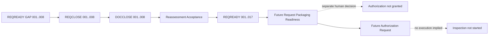

# Clipboard Integration Read-only Local Inspection Authorization Request Creation Readiness Reassessment

## Document Control

| Field | Value |
|---|---|
| Document ID | `RESEARCH-TECH-CLIPBOARD-014` |
| Title | Clipboard Integration Read-only Local Inspection Authorization Request Creation Readiness Reassessment |
| Status | Draft |
| Research Type | Authorization Request Creation Readiness Reassessment |
| Technology Decision | `TD-004 Clipboard Integration` |
| Parent Documentary Closure | `RESEARCH-TECH-CLIPBOARD-013` |
| Parent Gap Closure Plan | `RESEARCH-TECH-CLIPBOARD-012` |
| Parent Readiness Specification | `RESEARCH-TECH-CLIPBOARD-011` |
| Parent Inspection Plan | `RESEARCH-TECH-CLIPBOARD-010` |
| Reassessment Execution | Performed in this document only |
| Parent Gap Status Mutation | Not performed |
| Inspection Authorization Request Created | No |
| Request ID Created | No |
| Human Authorization Decision | Not made |
| Inspection Authorization | Not granted |
| Inspection Execution | Not started |
| Local／Package Cache Inspection | Not performed |
| Clipboard Read／Write／Clear | Not performed |
| Evidence Persistence | Not performed |
| Build／Runtime Verification | Not performed |
| Shared UI Authorization Artifact | Not found／TBD |
| Clipboard／Capture／Rendering Decision | Not made |
| Owner | TBD |
| Last reviewed | Not reviewed |

## 1. Purpose

本文件只回答：納入 `RESEARCH-TECH-CLIPBOARD-013` 的八組最終靜態規格後，八個 Inspection Request-readiness Gap 是否可建議從「靜態規格缺口」中移除，以及未來 Read-only Local Inspection Authorization Request 是否已具備建立條件。

這是 Readiness Reassessment，不是：

- Authorization Request
- Request ID
- Human Authorization Decision
- Parent Gap 狀態更新
- Inspection
- Persistent Evidence
- Clipboard 操作

本文件的 `Ready to create` 只表示未來 Request 文件可以被建立與交由真人決定；不代表 Request 已建立，不代表任何 Inspection 已被授權。

## 2. Scope

本次完整重評估下列既有文件化識別：

| Scope | Preserved range |
|---|---|
| Parent readiness gaps | `CLIP-INSPECT-REQREADY-GAP-001..008` |
| Parent closure items | `CLIP-INSPECT-REQCLOSE-001..008` |
| Documentary closure items | `CLIP-INSPECT-DOCCLOSE-001..008` |
| Readiness items | `CLIP-INSPECT-REQREADY-001..017` |
| Inspection items | `CLIP-INSPECT-001..017` |
| Observation IDs | `CLIP-LOCAL-OBS-001..017` |
| Evidence IDs | `CLIP-LOCAL-EVID-001..017` |
| Existing closure items | `CLIP-REQCLOSE-001..012` |
| Candidate–Host pairs | `CLIP-PAIR-001..010` |
| Inspection batches | `C-LI1..C-LI3` |
| Shared capability | Shared UI authority dependency |

本文件不進行新的官方研究、本機查核、Package Cache 查核、Build、Run、Test 或 Clipboard 操作。

## 3. Controlled Vocabulary

### Documentary Evidence Acceptance

只能使用：`Accepted`、`Accepted with limitation`、`Insufficient`、`Conflicting`、`Deferred`、`Not applicable`。

### Static Gap Recommendation

只能使用：`Recommend closing as static specification gap`、`Recommend keeping open`、`Recommend deferring`、`No recommendation`。

### Readiness Item Status

只能使用：`Specified`、`Partially specified`、`Blocked`、`Deferred`、`Not applicable`。

### Final Request Creation Readiness

只能使用：

- Ready to create clipboard read-only local inspection authorization request
- Conditionally ready to create clipboard read-only local inspection authorization request
- Not ready to create clipboard read-only local inspection authorization request

不得使用下列詞彙作為本文件的授權或驗證狀態：Authorized、Approved、Executed、Observed、Passed、Runtime verified。

## 4. Documentary Closure Acceptance Matrix

建立正好八列；`Accepted` 只代表靜態規格足以供未來 Request packaging，不代表 Parent Gap 已實際修改、不代表 Command 已驗證，也不代表 Inspection 已授權或執行。

| Documentary Closure | Source Gap | Final specification | Acceptance | Limitation | Static Gap recommendation |
|---|---|---|---|---|---|
| `CLIP-INSPECT-DOCCLOSE-001` | `GAP-001` | Workspace boundary and named target rule complete | Accepted | Actual path not observed | Recommend closing as static specification gap |
| `CLIP-INSPECT-DOCCLOSE-002` | `GAP-002` | Host asset identity and version rule complete | Accepted | Actual asset not observed | Recommend closing as static specification gap |
| `CLIP-INSPECT-DOCCLOSE-003` | `GAP-003` | Project and repository boundary rule complete | Accepted | Actual project files not observed | Recommend closing as static specification gap |
| `CLIP-INSPECT-DOCCLOSE-004` | `GAP-004` | Package, dependency, TFM and RID rule complete | Accepted | Actual package metadata not observed | Recommend closing as static specification gap |
| `CLIP-INSPECT-DOCCLOSE-005` | `GAP-005` | Projection and Windows App SDK asset rule complete | Accepted | Actual asset not observed | Recommend closing as static specification gap |
| `CLIP-INSPECT-DOCCLOSE-006` | `GAP-006` | OLE／COM and native declaration rule complete | Accepted | Actual native asset not observed | Recommend closing as static specification gap |
| `CLIP-INSPECT-DOCCLOSE-007` | `GAP-007` | Format declaration and payload exclusion complete | Accepted | Actual declaration not observed | Recommend closing as static specification gap |
| `CLIP-INSPECT-DOCCLOSE-008` | `GAP-008` | Deployment asset and future runtime boundary complete | Accepted | Actual deployment asset not observed | Recommend closing as static specification gap |

## 5. Parent Gap Reassessment

建立正好八列；Previous status 全部保持 `Open`，Recommendation 不直接修改 Parent。

| Parent Gap | Previous status | Accepted Documentary Closure | Remaining static gap | Remaining non-documentary evidence | Recommendation |
|---|---|---|---|---|---|
| `CLIP-INSPECT-REQREADY-GAP-001` | Open | `DOCCLOSE-001` | None in current documentary scope | Named workspace path remains unobserved | Recommend closing as static specification gap |
| `CLIP-INSPECT-REQREADY-GAP-002` | Open | `DOCCLOSE-002` | None in current documentary scope | Host asset availability remains unobserved | Recommend closing as static specification gap |
| `CLIP-INSPECT-REQREADY-GAP-003` | Open | `DOCCLOSE-003` | None in current documentary scope | Project structure remains unobserved | Recommend closing as static specification gap |
| `CLIP-INSPECT-REQREADY-GAP-004` | Open | `DOCCLOSE-004` | None in current documentary scope | Package metadata remains unobserved | Recommend closing as static specification gap |
| `CLIP-INSPECT-REQREADY-GAP-005` | Open | `DOCCLOSE-005` | None in current documentary scope | Projection asset remains unobserved | Recommend closing as static specification gap |
| `CLIP-INSPECT-REQREADY-GAP-006` | Open | `DOCCLOSE-006` | None in current documentary scope | Native declaration remains unobserved | Recommend closing as static specification gap |
| `CLIP-INSPECT-REQREADY-GAP-007` | Open | `DOCCLOSE-007` | None in current documentary scope | Format declaration remains unobserved | Recommend closing as static specification gap |
| `CLIP-INSPECT-REQREADY-GAP-008` | Open | `DOCCLOSE-008` | None in current documentary scope | Deployment asset remains unobserved | Recommend closing as static specification gap |

Inspection 結果、Package Cache 結果、Local availability、Build／Runtime 結果與 Clipboard technology decision 都不是本次靜態 Gap；但若未來無法安全描述操作範圍，該範圍才會成為新的靜態阻塞。

## 6. Inspection Readiness Item Reassessment

建立正好 17 列；不修改 Parent 狀態、不新增第 18 個 Inspection Item。`Specified` 只表示可納入未來 Request。

| Readiness Item | Related Documentary Closures | Exact question status | Data-source status | Command boundary status | Safety-control status | New recommendation |
|---|---|---|---|---|---|---|
| `CLIP-INSPECT-REQREADY-001` | `DOCCLOSE-001` | Specified | Not observed | Specified | Specified | Specified |
| `CLIP-INSPECT-REQREADY-002` | `DOCCLOSE-001` | Specified | Not observed | Specified | Specified | Specified |
| `CLIP-INSPECT-REQREADY-003` | `DOCCLOSE-001`, `003` | Specified | Not observed | Specified | Specified | Specified |
| `CLIP-INSPECT-REQREADY-004` | `DOCCLOSE-002` | Specified | Not observed | Specified | Specified | Specified |
| `CLIP-INSPECT-REQREADY-005` | `DOCCLOSE-003` | Specified | Not observed | Specified | Specified | Specified |
| `CLIP-INSPECT-REQREADY-006` | `DOCCLOSE-003` | Specified | Not observed | Specified | Specified | Specified |
| `CLIP-INSPECT-REQREADY-007` | `DOCCLOSE-004` | Specified | Not observed | Specified | Specified | Specified |
| `CLIP-INSPECT-REQREADY-008` | `DOCCLOSE-004` | Specified | Not observed | Specified | Specified | Specified |
| `CLIP-INSPECT-REQREADY-009` | `DOCCLOSE-004` | Specified | Not observed | Specified | Specified | Specified |
| `CLIP-INSPECT-REQREADY-010` | `DOCCLOSE-004` | Specified | Not observed | Specified | Specified | Specified |
| `CLIP-INSPECT-REQREADY-011` | `DOCCLOSE-005` | Specified | Not observed | Specified | Specified | Specified |
| `CLIP-INSPECT-REQREADY-012` | `DOCCLOSE-005` | Specified | Not observed | Specified | Specified | Specified |
| `CLIP-INSPECT-REQREADY-013` | `DOCCLOSE-006` | Specified | Not observed | Specified | Specified | Specified |
| `CLIP-INSPECT-REQREADY-014` | `DOCCLOSE-003`, `006` | Specified | Not observed | Specified | Specified | Specified |
| `CLIP-INSPECT-REQREADY-015` | `DOCCLOSE-007` | Specified | Not observed | Specified | Specified | Specified |
| `CLIP-INSPECT-REQREADY-016` | `DOCCLOSE-007` | Specified | Not observed | Specified | Specified | Specified |
| `CLIP-INSPECT-REQREADY-017` | `DOCCLOSE-008` | Specified | Not observed | Specified | Specified | Specified |

## 7. Command Boundary Acceptance

建立正好 17 列；具名 target 或安全解析規則必須存在。

| Inspection Item | Tool class accepted | Target rule accepted | Parameter rule accepted | Denylist coverage | Remaining ambiguity | Boundary recommendation |
|---|---|---|---|---|---|---|
| `CLIP-INSPECT-001` | Yes | Yes | Yes | Complete | Actual path | Accept |
| `CLIP-INSPECT-002` | Yes | Yes | Yes | Complete | Actual host asset | Accept |
| `CLIP-INSPECT-003` | Yes | Yes | Yes | Complete | Actual project file | Accept |
| `CLIP-INSPECT-004` | Yes | Yes | Yes | Complete | Actual SDK asset | Accept |
| `CLIP-INSPECT-005` | Yes | Yes | Yes | Complete | Actual project boundary | Accept |
| `CLIP-INSPECT-006` | Yes | Yes | Yes | Complete | Actual cache identity | Accept |
| `CLIP-INSPECT-007` | Yes | Yes | Yes | Complete | Actual package source class | Accept |
| `CLIP-INSPECT-008` | Yes | Yes | Yes | Complete | Actual dependency metadata | Accept |
| `CLIP-INSPECT-009` | Yes | Yes | Yes | Complete | Actual toolchain identity | Accept |
| `CLIP-INSPECT-010` | Yes | Yes | Yes | Complete | Actual MSBuild identity | Accept |
| `CLIP-INSPECT-011` | Yes | Yes | Yes | Complete | Actual SDK reference | Accept |
| `CLIP-INSPECT-012` | Yes | Yes | Yes | Complete | Actual projection asset | Accept |
| `CLIP-INSPECT-013` | Yes | Yes | Yes | Complete | Actual header/library | Accept |
| `CLIP-INSPECT-014` | Yes | Yes | Yes | Complete | Actual repository root | Accept |
| `CLIP-INSPECT-015` | Yes | Yes | Yes | Complete | Actual declaration identity | Accept |
| `CLIP-INSPECT-016` | Yes | Yes | Yes | Complete | Actual consumer asset | Accept |
| `CLIP-INSPECT-017` | Yes | Yes | Yes | Complete | Actual deployment asset | Accept |

Boundary is accepted only with Drive-wide、Profile-wide、Repository-wide scan、Output redirection、File output、Mutation、Network、Elevation、Clipboard access 與 Application launch all excluded. Recursion and Wildcard remain `No` by default. No complete executable Command Line is defined here.

## 8. Tool／Target／Parameter Allowlist Reassessment

### Tool-class Allowlist

| Tool class | Related Inspection Items | Accepted scope | Remaining issue | Recommendation |
|---|---|---|---|---|
| Windows／architecture metadata query | `001` | Named public metadata | Actual host not observed | Accepted |
| .NET SDK／Runtime information query | `002`, `003`, `008` | Named SDK／Runtime identity | Actual version not observed | Accepted |
| Visual Studio／Build Tools discovery metadata | `009`, `010` | Named product metadata | Actual installation not observed | Accepted |
| Windows SDK named-directory metadata | `004`, `011`, `012` | Named asset | Actual asset not observed | Accepted |
| Named file／directory existence query | `001`, `003`, `005`, `014`, `017` | Named target only | Actual path not observed | Accepted |
| Named assembly metadata query | `002`, `007`, `008`, `016` | Named assembly only | Actual assembly not observed | Accepted |
| Named header／library existence query | `013` | Named native asset only | Actual asset not observed | Accepted |
| Named WinRT metadata query | `012` | Named projection asset only | Actual asset not observed | Accepted |
| Named Package Cache metadata query | `006`, `008` | Named package identity | Actual cache not observed | Accepted |
| Named NuGet package metadata read | `007`, `008` | Named package metadata | Actual package not observed | Accepted |
| Sanitized public package-source hostname observation | `007` | Public hostname class only | Actual source not observed | Accepted with limitation |
| Named Repository metadata read | `003`, `005`, `014` | Named repository metadata | Actual repository not observed | Accepted |

### Target-resolution Rules

| Inspection Item | Target class | Maximum scope | Recursion | Wildcard | Resolution failure behavior | Accepted |
|---|---|---|---|---|---|---|
| `CLIP-INSPECT-001` | Workspace | One named boundary | No | No | Stop item | Yes |
| `CLIP-INSPECT-002` | Host asset | One named asset | No | No | Stop item | Yes |
| `CLIP-INSPECT-003` | Project metadata | One named file | No | No | Stop item | Yes |
| `CLIP-INSPECT-004` | SDK asset | One named asset | No | No | Stop item | Yes |
| `CLIP-INSPECT-005` | Project boundary | One named project | Limited only with depth | No | Stop item | Yes |
| `CLIP-INSPECT-006` | Package Cache | One named package | No | No | Stop item | Yes |
| `CLIP-INSPECT-007` | Package metadata | One named package | No | No | Stop item | Yes |
| `CLIP-INSPECT-008` | Dependency metadata | One named source | No | No | Stop item | Yes |
| `CLIP-INSPECT-009` | Toolchain | One named product | No | No | Stop item | Yes |
| `CLIP-INSPECT-010` | MSBuild | One named identity | No | No | Stop item | Yes |
| `CLIP-INSPECT-011` | SDK reference | One named asset | No | No | Stop item | Yes |
| `CLIP-INSPECT-012` | Projection asset | One named asset | No | No | Stop item | Yes |
| `CLIP-INSPECT-013` | Header/library | One named asset | No | No | Stop item | Yes |
| `CLIP-INSPECT-014` | Repository isolation | One named boundary | No | No | Stop item | Yes |
| `CLIP-INSPECT-015` | Format declaration | One named identity | No | No | Stop item | Yes |
| `CLIP-INSPECT-016` | Consumer asset | One named asset | No | No | Stop item | Yes |
| `CLIP-INSPECT-017` | Deployment asset | One named asset | No | No | Stop item | Yes |

### Parameter Boundary

| Inspection Item | Permitted classes | Prohibited classes | Pipeline | Redirection | Mutation／Elevation | Accepted |
|---|---|---|---|---|---|---|
| `CLIP-INSPECT-001` | Named target、metadata selector | Drive/profile scan | No | No | Prohibited | Yes |
| `CLIP-INSPECT-002` | Named asset、version selector | Download/install | No | No | Prohibited | Yes |
| `CLIP-INSPECT-003` | Named project metadata | Full dump/build | No | No | Prohibited | Yes |
| `CLIP-INSPECT-004` | Named SDK asset | Install/update | No | No | Prohibited | Yes |
| `CLIP-INSPECT-005` | Named boundary、explicit depth | Unbounded depth | Limited | No | Prohibited | Yes |
| `CLIP-INSPECT-006` | Package identity、field selector | Cache mutation | No | No | Prohibited | Yes |
| `CLIP-INSPECT-007` | Package ID、hostname class | Restore/credential | No | No | Prohibited | Yes |
| `CLIP-INSPECT-008` | Dependency、TFM、RID fields | Restore/source mutation | No | No | Prohibited | Yes |
| `CLIP-INSPECT-009` | Product/version fields | Full environment | No | No | Prohibited | Yes |
| `CLIP-INSPECT-010` | MSBuild identity | Build execution | No | No | Prohibited | Yes |
| `CLIP-INSPECT-011` | SDK/reference identity | Install/export | No | No | Prohibited | Yes |
| `CLIP-INSPECT-012` | Projection asset fields | App launch/generation | No | No | Prohibited | Yes |
| `CLIP-INSPECT-013` | Header/library fields | Native load/compile | No | No | Prohibited | Yes |
| `CLIP-INSPECT-014` | Named root、explicit depth | Drive scan | No | No | Prohibited | Yes |
| `CLIP-INSPECT-015` | Format declaration fields | Payload/Clipboard | No | No | Prohibited | Yes |
| `CLIP-INSPECT-016` | Consumer asset fields | Window/content/launch | No | No | Prohibited | Yes |
| `CLIP-INSPECT-017` | Deployment asset fields | Runtime/deployment mutation | No | No | Prohibited | Yes |

## 9. Denylist Coverage Reassessment

下表覆蓋 Parent 的 20 個禁止類別，不弱化任何上游 Denylist。

| Prohibited class | Applicable Inspection Items | Detection rule specified | Stop action specified | Coverage status |
|---|---|---|---|---|
| File write | `001..017` | Yes | Yes | Accepted |
| Output redirection | `001..017` | Yes | Yes | Accepted |
| Registry mutation | `004`, `011`, `012` | Yes | Yes | Accepted |
| Environment-variable mutation | `001..017` | Yes | Yes | Accepted |
| Package source mutation | `007`, `008` | Yes | Yes | Accepted |
| Package Cache mutation | `006`, `008` | Yes | Yes | Accepted |
| Download／Install | `002`, `004`, `007`, `008`, `012`, `017` | Yes | Yes | Accepted |
| Restore | `007`, `008` | Yes | Yes | Accepted |
| Build／Run／Test | `003`, `005`, `008`, `010`, `017` | Yes | Yes | Accepted |
| Clipboard cmdlet／API | `015`, `016`, `017` | Yes | Yes | Accepted |
| Process／Consumer launch | `012`, `016`, `017` | Yes | Yes | Accepted |
| Screenshot／screen capture | `001..017` | Yes | Yes | Accepted |
| Full environment dump | `001`, `009`, `010`, `011` | Yes | Yes | Accepted |
| Full Registry export | `004`, `011`, `012` | Yes | Yes | Accepted |
| Full Profile scan | `001`, `006`, `014` | Yes | Yes | Accepted |
| Recursive drive scan | `001`, `005`, `014`, `017` | Yes | Yes | Accepted |
| Credential value access | `007`, `008` | Yes | Yes | Accepted |
| Token／Private key access | `007`, `008`, `017` | Yes | Yes | Accepted |
| SID／Account identity access | `001`, `006`, `007`, `014` | Yes | Yes | Accepted |
| History／Cloud Clipboard access | `015`, `016`, `017` | Yes | Yes | Accepted |

## 10. Observation Contract Reassessment

建立正好 17 列；Session-only 保持 `Yes`，Not observed 不解讀為 Unsupported。

| Observation ID | Permitted fields complete | Sanitization complete | Prohibited fields complete | Error categories complete | Session-only preserved | Recommendation |
|---|---|---|---|---|---|---|
| `CLIP-LOCAL-OBS-001` | Yes | Yes | Yes | Yes | Yes | Accepted |
| `CLIP-LOCAL-OBS-002` | Yes | Yes | Yes | Yes | Yes | Accepted |
| `CLIP-LOCAL-OBS-003` | Yes | Yes | Yes | Yes | Yes | Accepted |
| `CLIP-LOCAL-OBS-004` | Yes | Yes | Yes | Yes | Yes | Accepted |
| `CLIP-LOCAL-OBS-005` | Yes | Yes | Yes | Yes | Yes | Accepted |
| `CLIP-LOCAL-OBS-006` | Yes | Yes | Yes | Yes | Yes | Accepted |
| `CLIP-LOCAL-OBS-007` | Yes | Yes | Yes | Yes | Yes | Accepted |
| `CLIP-LOCAL-OBS-008` | Yes | Yes | Yes | Yes | Yes | Accepted |
| `CLIP-LOCAL-OBS-009` | Yes | Yes | Yes | Yes | Yes | Accepted |
| `CLIP-LOCAL-OBS-010` | Yes | Yes | Yes | Yes | Yes | Accepted |
| `CLIP-LOCAL-OBS-011` | Yes | Yes | Yes | Yes | Yes | Accepted |
| `CLIP-LOCAL-OBS-012` | Yes | Yes | Yes | Yes | Yes | Accepted |
| `CLIP-LOCAL-OBS-013` | Yes | Yes | Yes | Yes | Yes | Accepted |
| `CLIP-LOCAL-OBS-014` | Yes | Yes | Yes | Yes | Yes | Accepted |
| `CLIP-LOCAL-OBS-015` | Yes | Yes | Yes | Yes | Yes | Accepted |
| `CLIP-LOCAL-OBS-016` | Yes | Yes | Yes | Yes | Yes | Accepted |
| `CLIP-LOCAL-OBS-017` | Yes | Yes | Yes | Yes | Yes | Accepted |

Credential、Token、SID、Account identity 及 Clipboard 內容不得出現在 Observation。

## 11. Persistent Evidence Boundary Reassessment

建立正好 17 列；Separate authority 保持 `Yes`，Created now 保持 `No`。

| Evidence ID | Source Observation | Intended fields bounded | Redaction bounded | Separate authority preserved | Created now |
|---|---|---|---|---|---|
| `CLIP-LOCAL-EVID-001` | `OBS-001` | Yes | Yes | Yes | No |
| `CLIP-LOCAL-EVID-002` | `OBS-002` | Yes | Yes | Yes | No |
| `CLIP-LOCAL-EVID-003` | `OBS-003` | Yes | Yes | Yes | No |
| `CLIP-LOCAL-EVID-004` | `OBS-004` | Yes | Yes | Yes | No |
| `CLIP-LOCAL-EVID-005` | `OBS-005` | Yes | Yes | Yes | No |
| `CLIP-LOCAL-EVID-006` | `OBS-006` | Yes | Yes | Yes | No |
| `CLIP-LOCAL-EVID-007` | `OBS-007` | Yes | Yes | Yes | No |
| `CLIP-LOCAL-EVID-008` | `OBS-008` | Yes | Yes | Yes | No |
| `CLIP-LOCAL-EVID-009` | `OBS-009` | Yes | Yes | Yes | No |
| `CLIP-LOCAL-EVID-010` | `OBS-010` | Yes | Yes | Yes | No |
| `CLIP-LOCAL-EVID-011` | `OBS-011` | Yes | Yes | Yes | No |
| `CLIP-LOCAL-EVID-012` | `OBS-012` | Yes | Yes | Yes | No |
| `CLIP-LOCAL-EVID-013` | `OBS-013` | Yes | Yes | Yes | No |
| `CLIP-LOCAL-EVID-014` | `OBS-014` | Yes | Yes | Yes | No |
| `CLIP-LOCAL-EVID-015` | `OBS-015` | Yes | Yes | Yes | No |
| `CLIP-LOCAL-EVID-016` | `OBS-016` | Yes | Yes | Yes | No |
| `CLIP-LOCAL-EVID-017` | `OBS-017` | Yes | Yes | Yes | No |

Inspection Authorization 不隱含 Evidence Write、Result directory creation、Log persistence 或 Repository Evidence mutation。

## 12. Sensitive-data Control Reassessment

| Sensitive class | Allowed representation | Sanitization | Prohibited detail | Stop condition | Status |
|---|---|---|---|---|---|
| User profile path | Sanitized path class | Remove account segment | Full profile path | Unsanitized path | Specified |
| Repository path | Named boundary label | Remove unrelated segments | Full tree dump | Broad scan | Specified |
| Visual Studio path | Public tool identity | Remove installation path | Full inventory | Unrelated inventory | Specified |
| Windows SDK path | Public asset family | Remove private path | Full SDK tree | Path disclosure | Specified |
| NuGet global-packages path | Sanitized root class | Remove user segment | Full private path | Path disclosure | Specified |
| NuGet source configuration | Public hostname class | Remove query and credential | Full config | Credential encounter | Specified |
| Credential-provider metadata | Presence class only | Present／Absent／Not inspected | Credential value | Value access | Specified |
| Registry values | Named value class only | No export or persistence | Registry export/write | Mutation or sensitive value | Specified |
| Package metadata | ID/version/dependency class | Remove private source/path | Full private config | Sensitive metadata | Specified |
| Error output | Error category and stop reason | Remove path and identity | Full raw output | Sensitive error | Specified |

## 13. Batch Packaging Reassessment

建立正好三列；每個 Inspection Item 只屬於一個主要 Batch，Batch 不擴大 Item allowlist。

| Batch | Inspection Items | Item independence defined | Item stop policy | Batch stop policy | Human separability | Packaging recommendation |
|---|---|---|---|---|---|---|
| `C-LI1` | `001..005`, `009..011` | Yes | Stop affected Item | Stop Batch when scope cannot be isolated | Yes | Accepted |
| `C-LI2` | `012`, `013`, `015`, `016` | Yes | Stop on native、Clipboard、consumer or payload risk | Stop Batch when risk cannot be isolated | Yes | Accepted |
| `C-LI3` | `006..008`, `014`, `017` | Yes | Stop on package、credential、network or runtime risk | Stop Batch when impact cannot be isolated | Yes | Accepted |

本文件不作出人類批准結果。

## 14. Shared UI Authority Dependency Reassessment

| Shared capability | Existing research source | Authority artifact found | Pending dependency sufficiently described | Blocks request creation | Blocks execution | Recommendation |
|---|---|---|---|---|---|---|
| OS／architecture inspection | Existing technology research | No | Yes | No | Yes | Keep as pending dependency |
| .NET／SDK inspection | Existing technology research | No | Yes | No | Yes | Keep as pending dependency |
| Visual Studio／Build Tools inspection | Existing technology research | No | Yes | No | Yes | Keep as pending dependency |
| WPF／WinUI asset inspection | Existing UI research | No | Yes | No | Yes | Keep as pending dependency |
| Package Cache inspection | Existing technology research | No | Yes | No | Yes | Keep as pending dependency |
| Repository metadata inspection | Existing repository documentation | No | Yes | No | Yes | Keep as pending dependency |
| Future Runtime execution | Existing UI/runtime research | No | Yes | No | Yes | Keep as pending dependency |

固定：Authority artifact found=`No`；Authority reference=`TBD`；Authorization status=`Not granted`。缺少 Shared UI authority artifact 不阻止建立 Request packaging；缺少真人授權必定阻止實際 Inspection。不得建立或推測 `UI-AUTH-*`。

## 15. Candidate–Host Impact Reassessment

建立正好 10 列；不排名、不選擇、不排除 Candidate。

| Pair | Related Inspection Items | Static scope readiness | Local evidence remaining | Build evidence remaining | Runtime evidence remaining | Selection effect |
|---|---|---|---|---|---|---|
| `CLIP-PAIR-001` | `001`, `002` | Specified | Yes | Yes | Yes | None |
| `CLIP-PAIR-002` | `001`, `003` | Specified | Yes | Yes | Yes | None |
| `CLIP-PAIR-003` | `004`, `005` | Specified | Yes | Yes | Yes | None |
| `CLIP-PAIR-004` | `006`, `007` | Specified | Yes | Yes | Yes | None |
| `CLIP-PAIR-005` | `008`, `009` | Specified | Yes | Yes | Yes | None |
| `CLIP-PAIR-006` | `010`, `011` | Specified | Yes | Yes | Yes | None |
| `CLIP-PAIR-007` | `012`, `013` | Specified | Yes | Yes | Yes | None |
| `CLIP-PAIR-008` | `014`, `015` | Specified | Yes | Yes | Yes | None |
| `CLIP-PAIR-009` | `016` | Specified | Yes | Yes | Yes | None |
| `CLIP-PAIR-010` | `017` | Specified | Yes | Yes | Yes | None |

## 16. Authorization Request Packaging Readiness

建立正好 17 列。`Yes` 只表示 Item 可被寫入未來 Request，不代表已授權。

| Inspection Item | Exact question | Tool allowlist | Target allowlist | Parameter allowlist | Denylist | Observation contract | Stop policy | Ready for Request |
|---|---|---|---|---|---|---|---|---|
| `CLIP-INSPECT-001` | Which named workspace boundary may be described? | Yes | Yes | Yes | Yes | Yes | Yes | Yes |
| `CLIP-INSPECT-002` | Which named host asset identity may be described? | Yes | Yes | Yes | Yes | Yes | Yes | Yes |
| `CLIP-INSPECT-003` | Which named project metadata may be described? | Yes | Yes | Yes | Yes | Yes | Yes | Yes |
| `CLIP-INSPECT-004` | Which named SDK asset may be described? | Yes | Yes | Yes | Yes | Yes | Yes | Yes |
| `CLIP-INSPECT-005` | Which bounded project scope may be described? | Yes | Yes | Yes | Yes | Yes | Yes | Yes |
| `CLIP-INSPECT-006` | Which named Package Cache metadata may be described? | Yes | Yes | Yes | Yes | Yes | Yes | Yes |
| `CLIP-INSPECT-007` | Which named package metadata may be described? | Yes | Yes | Yes | Yes | Yes | Yes | Yes |
| `CLIP-INSPECT-008` | Which dependency, TFM and RID fields may be described? | Yes | Yes | Yes | Yes | Yes | Yes | Yes |
| `CLIP-INSPECT-009` | Which named toolchain identity may be described? | Yes | Yes | Yes | Yes | Yes | Yes | Yes |
| `CLIP-INSPECT-010` | Which named MSBuild identity may be described? | Yes | Yes | Yes | Yes | Yes | Yes | Yes |
| `CLIP-INSPECT-011` | Which named SDK reference may be described? | Yes | Yes | Yes | Yes | Yes | Yes | Yes |
| `CLIP-INSPECT-012` | Which named projection asset may be described? | Yes | Yes | Yes | Yes | Yes | Yes | Yes |
| `CLIP-INSPECT-013` | Which named header or library may be described? | Yes | Yes | Yes | Yes | Yes | Yes | Yes |
| `CLIP-INSPECT-014` | Which named repository boundary may be described? | Yes | Yes | Yes | Yes | Yes | Yes | Yes |
| `CLIP-INSPECT-015` | Which format declaration may be described without payload? | Yes | Yes | Yes | Yes | Yes | Yes | Yes |
| `CLIP-INSPECT-016` | Which consumer asset identity may be described? | Yes | Yes | Yes | Yes | Yes | Yes | Yes |
| `CLIP-INSPECT-017` | Which deployment asset may be described without runtime launch? | Yes | Yes | Yes | Yes | Yes | Yes | Yes |

## 17. Minimum Remaining Static Actions

本次沒有剩餘會阻止建立 Request packaging 的靜態文件動作；以下列出明確的零阻塞結論，避免把未執行的外部狀態誤列為文件缺口。

| Action | Source IDs | Missing specification | Required documentary action | Blocks Request |
|---|---|---|---|---|
| `STATIC-ACTION-NONE` | `DOCCLOSE-001..008`, `REQREADY-001..017` | None in current documentary scope | No further documentary action required before Request packaging; future human decision remains separate | No |

不得把尚未取得 Inspection 結果、尚未執行 Package Cache 查核、尚未取得 Local availability、尚未 Build 或 Runtime 驗證、尚未建立 Persistent Evidence、尚未取得最終 Clipboard Technology Decision 列為本次靜態阻塞。若未來無法安全描述操作範圍，則必須新增具體文件缺口並重新評估。

## 18. Mechanical Final Decision

機械式推導輸入：

- 8 Documentary Closure Acceptance results
- 8 Parent Gap recommendations
- 17 Readiness Item results
- 17 command／target／parameter boundaries
- 20 Denylist categories complete
- 17 Observation contracts
- 17 Evidence separations
- 10 Sensitive-data controls
- 3 Batch packaging results
- Shared authority dependency description
- No remaining static action that blocks Request packaging

### Final Decision

`Ready to create clipboard read-only local inspection authorization request`

此 Final Decision 不是直接照抄 Parent 的 `Ready to reassess`，而是由本文件矩陣及 `STATIC-ACTION-NONE` 逐項推導；它只允許進入「建立 Request 文件」階段，仍不代表真人批准或實際執行。

## 19. Fixed Status Boundary

不論 Final Decision 為何，以下狀態固定：

| State | Value |
|---|---|
| Parent Gap Status Mutation | Not performed |
| Inspection Authorization Request Created | No |
| Request ID Created | No |
| Human Authorization Decision | Not made |
| Inspection Authorization | Not granted |
| Inspection Execution | Not started |
| Local Environment Inspection | Not performed |
| Package Cache Inspection | Not performed |
| Clipboard Read／Write／Clear | Not performed |
| Evidence Persistence | Not performed |
| Build／Runtime Verification | Not performed |
| Clipboard Decision | Not made |
| Capture Decision | Not made |
| Rendering Decision | Not made |

## 20. Traceability

引用範圍：

- `RESEARCH-TECH-CLIPBOARD-001..013`
- `TD-004 Clipboard Integration`
- 實際存在的 UI Research 文件
- `Architecture/adr/ADR-0002-ui-framework-selection.md`
- Frozen PRD、Clipboard Specs 及 Architecture 責任邊界

不得引用不存在的 `UI-AUTH-*`；不得把 Request packaging readiness 當成 authorization、inspection、runtime 或 Clipboard decision。

## 21. Completion Conditions

- 只建立 `42-clipboard-integration-read-only-local-inspection-authorization-request-creation-readiness-reassessment.md`。
- Document ID 固定為 `RESEARCH-TECH-CLIPBOARD-014`。
- 建立正好 8 列 Documentary Closure Acceptance。
- 建立正好 8 列 Parent Gap Reassessment，Previous status 全部保持 Open。
- 建立正好 17 列 Readiness Item Reassessment。
- 建立正好 17 列 Command Boundary Acceptance。
- 建立正好 17 列 Target-resolution Reassessment。
- 建立正好 17 列 Parameter Boundary Reassessment。
- 覆蓋 20 個 Denylist 類別。
- 建立正好 17 列 Observation Reassessment。
- 建立正好 17 列 Evidence Boundary Reassessment。
- 建立正好 3 列 Batch Packaging Reassessment。
- 建立正好 10 列 Candidate–Host Impact Reassessment。
- 建立正好 17 列 Authorization Request Packaging Readiness。
- Final Decision 由矩陣機械式推導為 `Ready to create clipboard read-only local inspection authorization request`。
- 不修改 Parent Gap 狀態或任何上游文件。
- 不建立 Authorization Request、Request ID 或 Human Decision。
- 不執行任何 Command、API、Inspection 或 Clipboard 操作。
- 不建立 Project、Consumer、Synthetic Image、Payload、Result、Source Code 或 Evidence。
- 不執行下載、安裝、Restore、Build、Run、Test 或 Runtime Spike。
- 不修改 UI／Capture／Rendering Research Line。
- 不選擇 Clipboard Technology。
- 不建立 Clipboard ADR。
- 不開始 Clipboard 或截圖功能。
- 完成後只做靜態文件檢查，等待下一個指令。
