# Clipboard Integration Research Line Traceability Index

## 1. Document Control

| Field | Value |
|---|---|
| Document ID | `RESEARCH-TECH-CLIPBOARD-015` |
| Title | Clipboard Integration Research Line Traceability Index |
| Status | Draft |
| Research Type | Research Traceability and Status Index |
| Technology Decision | `TD-004 Clipboard Integration` |
| Covered Documents | `RESEARCH-TECH-CLIPBOARD-001..014` |
| Parent Readiness Reassessment | `RESEARCH-TECH-CLIPBOARD-014` |
| Authorization Request Created | No |
| Request ID Created | No |
| Human Authorization Decision | Not made |
| Inspection Authorization | Not granted |
| Inspection Execution | Not started |
| Clipboard Runtime Spike | Not started |
| Clipboard Read/Write/Clear | Not performed |
| Evidence Persistence | Not performed |
| Build/Runtime Verification | Not performed |
| Clipboard Technology Decision | Not made |
| Owner | TBD |
| Last reviewed | Not reviewed |

This document is a read-only index of the Clipboard research line. It aggregates document identity, evidence lineage, open gaps, gates, closure records, readiness statements, and authorization boundaries. It does not change the status of any parent document.

### Scope and non-goals

In scope are the fourteen Clipboard research documents, their identifier namespaces, candidate/host traceability, gate and gap status, current recommendation boundaries, and the frozen execution state.

Out of scope are an authorization request, a human decision, local inspection execution, a runtime spike, project creation, package acquisition, restore, build, Clipboard access, evidence persistence, technology selection, or a Clipboard ADR. No next action is authorized by this index.

## 2. Document Register

The register covers the Clipboard lineage only. A later document is listed as superseding an earlier assessment only when it provides a later assessment of the same research line; this does not mutate the earlier document.

| Document ID | Filename | Title | Research Type | Parent | Reported status | Primary output | Supersedes |
|---|---|---|---|---|---|---|---|
| `RESEARCH-TECH-CLIPBOARD-001` | `29-clipboard-integration-feasibility.md` | Clipboard Integration Feasibility | Technology feasibility research | None | Complete | Feasibility options, evidence needs, and initial gaps | None; historical baseline |
| `RESEARCH-TECH-CLIPBOARD-002` | `30-clipboard-integration-runtime-spike-plan.md` | Clipboard Integration Runtime Spike Plan | Runtime research planning | `001` | Complete | Isolated spike scope, controls, and evidence plan | Later plan; no upstream mutation |
| `RESEARCH-TECH-CLIPBOARD-003` | `31-clipboard-integration-runtime-spike-execution-readiness.md` | Clipboard Integration Runtime Spike Execution Readiness | Execution-readiness research | `002` | Complete | Preconditions and execution-readiness gaps | Later reassessment; no upstream mutation |
| `RESEARCH-TECH-CLIPBOARD-004` | `32-clipboard-integration-prerequisite-closure-plan.md` | Clipboard Integration Prerequisite Closure Plan | Prerequisite closure planning | `003` | Complete | Closure items and evidence requirements | Later enablement assessment; no upstream mutation |
| `RESEARCH-TECH-CLIPBOARD-005` | `33-clipboard-integration-prerequisite-execution-enablement-specification.md` | Clipboard Integration Prerequisite Execution Enablement Specification | Execution enablement specification | `004` | Complete | Enablement bindings and controlled execution boundaries | Later enablement assessment; no upstream mutation |
| `RESEARCH-TECH-CLIPBOARD-006` | `34-clipboard-integration-official-prerequisite-evidence-baseline.md` | Clipboard Integration Official Prerequisite Evidence Baseline | Official evidence research | `005` | Complete | Microsoft-only prerequisite evidence baseline | Later reassessment; no upstream mutation |
| `RESEARCH-TECH-CLIPBOARD-007` | `35-clipboard-integration-prerequisite-execution-enablement-reassessment.md` | Clipboard Integration Prerequisite Execution Enablement Reassessment | Enablement reassessment | `006` | Complete | Latest enablement recommendation and remaining gaps | Reassesses `001..006`; no upstream mutation |
| `RESEARCH-TECH-CLIPBOARD-008` | `36-clipboard-integration-authorization-request-readiness-closure-specification.md` | Clipboard Integration Authorization Request Readiness Closure Specification | Authorization-request readiness closure | `007` | Complete | Closure specification for future request packaging | Later gap-closure assessment; no upstream mutation |
| `RESEARCH-TECH-CLIPBOARD-009` | `37-clipboard-integration-authorization-request-readiness-gap-closure-plan.md` | Clipboard Integration Authorization Request Readiness Gap Closure Plan | Authorization-request readiness gap closure | `008` | Complete | Gap closure plan and fixed request fields | Later reassessment; no upstream mutation |
| `RESEARCH-TECH-CLIPBOARD-010` | `38-clipboard-integration-read-only-local-prerequisite-inspection-plan.md` | Clipboard Integration Read-only Local Prerequisite Inspection Plan | Local inspection planning | `009` | Complete | Read-only inspection targets and observations | Later request-readiness assessment; no upstream mutation |
| `RESEARCH-TECH-CLIPBOARD-011` | `39-clipboard-integration-read-only-local-inspection-authorization-request-readiness-closure-specification.md` | Clipboard Integration Read-only Local Inspection Authorization Request Readiness Closure Specification | Inspection request-readiness closure | `010` | Complete | Documentary closure specification for a future request | Later gap-closure assessment; no upstream mutation |
| `RESEARCH-TECH-CLIPBOARD-012` | `40-clipboard-integration-read-only-local-inspection-authorization-request-readiness-gap-closure-plan.md` | Clipboard Integration Read-only Local Inspection Authorization Request Readiness Gap Closure Plan | Inspection request-readiness gap closure | `011` | Complete | Inspection request-readiness gap closure plan | Later documentary closure; no upstream mutation |
| `RESEARCH-TECH-CLIPBOARD-013` | `41-clipboard-integration-read-only-local-inspection-documentary-gap-closure-specification.md` | Clipboard Integration Read-only Local Inspection Documentary Gap Closure Specification | Documentary gap closure | `012` | Complete | Documentary gap closure specification | Later request-creation reassessment; no upstream mutation |
| `RESEARCH-TECH-CLIPBOARD-014` | `42-clipboard-integration-read-only-local-inspection-authorization-request-creation-readiness-reassessment.md` | Clipboard Integration Read-only Local Inspection Authorization Request Creation Readiness Reassessment | Request-creation readiness reassessment | `013` | Complete; ready to create future request artifact | Mechanical reassessment of request-creation readiness | Reassesses `010..013`; no upstream mutation |

The `Reported status` column records the state reported by the corresponding research document. The current frozen status is maintained in Section 12 and does not rewrite those reports.

## 3. Identifier Namespace Index

All ranges below are closed ranges as documented by the Clipboard research line. This index does not renumber identifiers or issue new-generation execution identifiers.

| Namespace | Range | Defined by | Latest evaluated by | Purpose | Current mutation authority |
|---|---|---|---|---|---|
| `CLIP-OPT` | `CLIP-OPT-001..005` | `RESEARCH-TECH-CLIPBOARD-001` | `RESEARCH-TECH-CLIPBOARD-007` | Feasibility and integration options | None in this document |
| `CLIP-EVID` | `CLIP-EVID-001..018` | `RESEARCH-TECH-CLIPBOARD-001` | `RESEARCH-TECH-CLIPBOARD-007` | Initial feasibility evidence items | None in this document |
| `CLIP-GAP` | `CLIP-GAP-001..018` | `RESEARCH-TECH-CLIPBOARD-001` | `RESEARCH-TECH-CLIPBOARD-007` | Original feasibility gaps | None in this document |
| `CLIP-OFF-EVID` | `CLIP-OFF-EVID-001..020` | `RESEARCH-TECH-CLIPBOARD-006` | `RESEARCH-TECH-CLIPBOARD-007` | Official prerequisite evidence items | None in this document |
| `CLIP-OFF-GAP` | `CLIP-OFF-GAP-001..020` | `RESEARCH-TECH-CLIPBOARD-006` | `RESEARCH-TECH-CLIPBOARD-007` | Official evidence gaps | None in this document |
| `CLIP-PREQ` | `CLIP-PREQ-001..032` | `RESEARCH-TECH-CLIPBOARD-004` | `RESEARCH-TECH-CLIPBOARD-014` | Prerequisite closure requirements | None in this document |
| `CLIP-BLOCK` | `CLIP-BLOCK-001..013` | `RESEARCH-TECH-CLIPBOARD-003` | `RESEARCH-TECH-CLIPBOARD-014` | Blocking conditions for future enablement | None in this document |
| `CLIP-PAIR` | `CLIP-PAIR-001..010` | `RESEARCH-TECH-CLIPBOARD-002` | `RESEARCH-TECH-CLIPBOARD-014` | Candidate/host pairs retained for future inspection | None in this document |
| `CLIP-SPIKE` | `CLIP-SPIKE-001..012` | `RESEARCH-TECH-CLIPBOARD-002` | `RESEARCH-TECH-CLIPBOARD-014` | Isolated runtime-spike controls and steps | None in this document |
| `CLIP-GATE` | `CLIP-GATE-001..010` | `RESEARCH-TECH-CLIPBOARD-003` | `RESEARCH-TECH-CLIPBOARD-014` | Runtime and execution gates | None in this document |
| `CLIP-BA` | `CLIP-BA-001..006` | `RESEARCH-TECH-CLIPBOARD-004` | `RESEARCH-TECH-CLIPBOARD-014` | Prerequisite baseline/assessment bindings | None in this document |
| `CLIP-CLOSE` | `CLIP-CLOSE-001..006` | `RESEARCH-TECH-CLIPBOARD-004` | `RESEARCH-TECH-CLIPBOARD-014` | Prerequisite closure records | None in this document |
| `CLIP-ENABLE` | `CLIP-ENABLE-001..006` | `RESEARCH-TECH-CLIPBOARD-005` | `RESEARCH-TECH-CLIPBOARD-014` | Execution enablement bindings | None in this document |
| `CLIP-CGATE` | `CLIP-CGATE-001..011` | `RESEARCH-TECH-CLIPBOARD-005` | `RESEARCH-TECH-CLIPBOARD-014` | Documentary and closure gates | None in this document |
| `CLIP-REQREADY` | `CLIP-REQREADY-001..006` | `RESEARCH-TECH-CLIPBOARD-008` | `RESEARCH-TECH-CLIPBOARD-014` | Future authorization-request readiness items | None in this document |
| `CLIP-REQREADY-GAP` | `CLIP-REQREADY-GAP-001..012` | `RESEARCH-TECH-CLIPBOARD-009` | `RESEARCH-TECH-CLIPBOARD-014` | Authorization-request readiness gaps | None in this document |
| `CLIP-REQCLOSE` | `CLIP-REQCLOSE-001..012` | `RESEARCH-TECH-CLIPBOARD-009` | `RESEARCH-TECH-CLIPBOARD-014` | Authorization-request readiness closure items | None in this document |
| `CLIP-INSPECT` | `CLIP-INSPECT-001..017` | `RESEARCH-TECH-CLIPBOARD-010` | `RESEARCH-TECH-CLIPBOARD-014` | Read-only local inspection targets | None in this document |
| `CLIP-LOCAL-OBS` | `CLIP-LOCAL-OBS-001..017` | `RESEARCH-TECH-CLIPBOARD-010` | `RESEARCH-TECH-CLIPBOARD-014` | Future local inspection observations | None in this document |
| `CLIP-LOCAL-EVID` | `CLIP-LOCAL-EVID-001..017` | `RESEARCH-TECH-CLIPBOARD-010` | `RESEARCH-TECH-CLIPBOARD-014` | Future local inspection evidence | None in this document |
| `CLIP-INSPECT-REQREADY` | `CLIP-INSPECT-REQREADY-001..017` | `RESEARCH-TECH-CLIPBOARD-011` | `RESEARCH-TECH-CLIPBOARD-014` | Future inspection request packaging readiness | None in this document |
| `CLIP-INSPECT-REQREADY-GAP` | `CLIP-INSPECT-REQREADY-GAP-001..008` | `RESEARCH-TECH-CLIPBOARD-012` | `RESEARCH-TECH-CLIPBOARD-014` | Inspection request-readiness gaps | None in this document |
| `CLIP-INSPECT-REQCLOSE` | `CLIP-INSPECT-REQCLOSE-001..008` | `RESEARCH-TECH-CLIPBOARD-013` | `RESEARCH-TECH-CLIPBOARD-014` | Inspection request-readiness closure items | None in this document |
| `CLIP-INSPECT-DOCCLOSE` | `CLIP-INSPECT-DOCCLOSE-001..008` | `RESEARCH-TECH-CLIPBOARD-013` | `RESEARCH-TECH-CLIPBOARD-014` | Documentary closure items for future inspection request | None in this document |
| `C-LI` | `C-LI1..C-LI3` | `RESEARCH-TECH-CLIPBOARD-001` | `RESEARCH-TECH-CLIPBOARD-014` | Cross-line Clipboard research control references | None in this document |
| `CLIP-ENABLE-GAP` | `CLIP-ENABLE-GAP-001` | `RESEARCH-TECH-CLIPBOARD-007` | `RESEARCH-TECH-CLIPBOARD-014` | Consolidated enablement gap | None in this document |

No namespace in this index authorizes a mutation, an inspection, a runtime spike, or an execution result. No new-generation execution IDs are created here.

## 4. End-to-end Traceability Matrix

`Not applicable` means that the source document does not establish a direct relation in the research line. It does not mean that a gate or authorization has been passed.

| Root source | BA | CLOSE | ENABLE | REQREADY | REQCLOSE | INSPECT | Inspection readiness | Documentary closure | Future evidence |
|---|---|---|---|---|---|---|---|---|---|
| `CLIP-PREQ-001..032` and `CLIP-BLOCK-001..013` | `CLIP-BA-001..006` | `CLIP-CLOSE-001..006` | `CLIP-ENABLE-001..006` | `CLIP-REQREADY-001..006` | `CLIP-REQCLOSE-001..012` | `CLIP-INSPECT-001..017` | `CLIP-INSPECT-REQREADY-001..017` | `CLIP-INSPECT-DOCCLOSE-001..008` | `CLIP-LOCAL-EVID-001..017` |
| `CLIP-OFF-EVID-001..020` | Not applicable | Not applicable | `CLIP-ENABLE-GAP-001` | `CLIP-REQREADY-001..006` | `CLIP-REQCLOSE-001..012` | `CLIP-INSPECT-001..017` | `CLIP-INSPECT-REQREADY-001..017` | `CLIP-INSPECT-DOCCLOSE-001..008` | `CLIP-LOCAL-EVID-001..017` |
| `CLIP-OFF-GAP-001..020` | Not applicable | Not applicable | `CLIP-ENABLE-GAP-001` | `CLIP-REQREADY-GAP-001..012` | `CLIP-REQCLOSE-001..012` | Not applicable | `CLIP-INSPECT-REQREADY-GAP-001..008` | `CLIP-INSPECT-REQCLOSE-001..008` | `CLIP-LOCAL-EVID-001..017` |
| `CLIP-PAIR-001..010` | Not applicable | Not applicable | Not applicable | `CLIP-REQREADY-001..006` | `CLIP-REQCLOSE-001..012` | `CLIP-INSPECT-001..017` | `CLIP-INSPECT-REQREADY-001..017` | `CLIP-INSPECT-DOCCLOSE-001..008` | `CLIP-LOCAL-EVID-001..017` |
| `CLIP-SPIKE-001..012` | Not applicable | Not applicable | `CLIP-ENABLE-001..006` | `CLIP-REQREADY-001..006` | `CLIP-REQCLOSE-001..012` | Not applicable | Not applicable | Not applicable | `CLIP-LOCAL-EVID-001..017` |
| `CLIP-GATE-001..010` | `CLIP-BA-001..006` | `CLIP-CLOSE-001..006` | `CLIP-ENABLE-001..006` | `CLIP-REQREADY-001..006` | `CLIP-REQCLOSE-001..012` | `CLIP-INSPECT-001..017` | `CLIP-INSPECT-REQREADY-001..017` | `CLIP-INSPECT-DOCCLOSE-001..008` | `CLIP-LOCAL-EVID-001..017` |
| `CLIP-CGATE-001..011` | `CLIP-BA-001..006` | `CLIP-CLOSE-001..006` | `CLIP-ENABLE-001..006` | `CLIP-REQREADY-001..006` | `CLIP-REQCLOSE-001..012` | `CLIP-INSPECT-001..017` | `CLIP-INSPECT-REQREADY-001..017` | `CLIP-INSPECT-DOCCLOSE-001..008` | `CLIP-LOCAL-EVID-001..017` |

This matrix is a lineage view only. It does not turn a planned future relation into an executed relation.

## 5. Candidate–Host Index

Candidate and host names are `TBD` where the current research lineage does not provide a verified local name. The index intentionally retains all ten pairs without ranking, selection, exclusion, or implementation effect.

| Pair | Candidate | Host | Official evidence document | Local inspection items | Current local status | Build status | Runtime status | Selection effect |
|---|---|---|---|---|---|---|---|---|
| `CLIP-PAIR-001` | TBD | TBD | `RESEARCH-TECH-CLIPBOARD-006` | `CLIP-INSPECT-001..017` | Unknown | Not verified | Not verified | None |
| `CLIP-PAIR-002` | TBD | TBD | `RESEARCH-TECH-CLIPBOARD-006` | `CLIP-INSPECT-001..017` | Unknown | Not verified | Not verified | None |
| `CLIP-PAIR-003` | TBD | TBD | `RESEARCH-TECH-CLIPBOARD-006` | `CLIP-INSPECT-001..017` | Unknown | Not verified | Not verified | None |
| `CLIP-PAIR-004` | TBD | TBD | `RESEARCH-TECH-CLIPBOARD-006` | `CLIP-INSPECT-001..017` | Unknown | Not verified | Not verified | None |
| `CLIP-PAIR-005` | TBD | TBD | `RESEARCH-TECH-CLIPBOARD-006` | `CLIP-INSPECT-001..017` | Unknown | Not verified | Not verified | None |
| `CLIP-PAIR-006` | TBD | TBD | `RESEARCH-TECH-CLIPBOARD-006` | `CLIP-INSPECT-001..017` | Unknown | Not verified | Not verified | None |
| `CLIP-PAIR-007` | TBD | TBD | `RESEARCH-TECH-CLIPBOARD-006` | `CLIP-INSPECT-001..017` | Unknown | Not verified | Not verified | None |
| `CLIP-PAIR-008` | TBD | TBD | `RESEARCH-TECH-CLIPBOARD-006` | `CLIP-INSPECT-001..017` | Unknown | Not verified | Not verified | None |
| `CLIP-PAIR-009` | TBD | TBD | `RESEARCH-TECH-CLIPBOARD-006` | `CLIP-INSPECT-001..017` | Unknown | Not verified | Not verified | None |
| `CLIP-PAIR-010` | TBD | TBD | `RESEARCH-TECH-CLIPBOARD-006` | `CLIP-INSPECT-001..017` | Unknown | Not verified | Not verified | None |

## 6. Gate Index

### 6.1 Runtime Gates

| Gate | Defined by | Latest assessment | Current recommendation | Required future evidence | Execution implication |
|---|---|---|---|---|---|
| `CLIP-GATE-001` | `RESEARCH-TECH-CLIPBOARD-003` | `RESEARCH-TECH-CLIPBOARD-014` | Environment identity remains unestablished | Authorized read-only OS/architecture observation | No inspection or runtime execution |
| `CLIP-GATE-002` | `RESEARCH-TECH-CLIPBOARD-003` | `RESEARCH-TECH-CLIPBOARD-014` | .NET/SDK prerequisite remains unestablished | Authorized read-only .NET/SDK observation | No project creation or restore |
| `CLIP-GATE-003` | `RESEARCH-TECH-CLIPBOARD-003` | `RESEARCH-TECH-CLIPBOARD-014` | Build-tool prerequisite remains unestablished | Authorized read-only Visual Studio/Build Tools observation | No build verification |
| `CLIP-GATE-004` | `RESEARCH-TECH-CLIPBOARD-003` | `RESEARCH-TECH-CLIPBOARD-014` | WPF/WinUI asset prerequisite remains unestablished | Authorized read-only asset observation | No candidate/host selection |
| `CLIP-GATE-005` | `RESEARCH-TECH-CLIPBOARD-003` | `RESEARCH-TECH-CLIPBOARD-014` | Package/reference resolution remains unestablished | Authorized read-only package-cache observation | No package acquisition or restore |
| `CLIP-GATE-006` | `RESEARCH-TECH-CLIPBOARD-003` | `RESEARCH-TECH-CLIPBOARD-014` | Isolated project creation remains unperformed | Explicit project-creation authorization and result | No project creation |
| `CLIP-GATE-007` | `RESEARCH-TECH-CLIPBOARD-003` | `RESEARCH-TECH-CLIPBOARD-014` | Build status remains unverified | Explicit build authorization and build output | No build |
| `CLIP-GATE-008` | `RESEARCH-TECH-CLIPBOARD-003` | `RESEARCH-TECH-CLIPBOARD-014` | Runtime host launch remains unverified | Explicit runtime authorization and observation record | No runtime execution |
| `CLIP-GATE-009` | `RESEARCH-TECH-CLIPBOARD-003` | `RESEARCH-TECH-CLIPBOARD-014` | Clipboard Read/Write/Clear remains unperformed | Explicit Clipboard authorization and isolated spike evidence | No Clipboard access |
| `CLIP-GATE-010` | `RESEARCH-TECH-CLIPBOARD-003` | `RESEARCH-TECH-CLIPBOARD-014` | Evidence persistence remains unperformed | Explicit persistence authorization and evidence record | No result-directory or evidence mutation |

### 6.2 Closure Gates

| Gate | Defined by | Latest assessment | Current recommendation | Required future evidence | Execution implication |
|---|---|---|---|---|---|
| `CLIP-CGATE-001` | `RESEARCH-TECH-CLIPBOARD-005` | `RESEARCH-TECH-CLIPBOARD-014` | Preserve source-document identity | Static register comparison | No parent status mutation |
| `CLIP-CGATE-002` | `RESEARCH-TECH-CLIPBOARD-005` | `RESEARCH-TECH-CLIPBOARD-014` | Preserve identifier ranges | Static namespace comparison | No renumbering |
| `CLIP-CGATE-003` | `RESEARCH-TECH-CLIPBOARD-005` | `RESEARCH-TECH-CLIPBOARD-014` | Preserve target/parameter pairing | Authorized inspection output, if later approved | No inspection |
| `CLIP-CGATE-004` | `RESEARCH-TECH-CLIPBOARD-005` | `RESEARCH-TECH-CLIPBOARD-014` | Preserve denylist controls | Authorized inspection output, if later approved | No sensitive-data access |
| `CLIP-CGATE-005` | `RESEARCH-TECH-CLIPBOARD-005` | `RESEARCH-TECH-CLIPBOARD-014` | Keep observation separate from evidence | Future observation and evidence records | No evidence persistence |
| `CLIP-CGATE-006` | `RESEARCH-TECH-CLIPBOARD-005` | `RESEARCH-TECH-CLIPBOARD-014` | Keep evidence separate from authorization | Future authority and evidence references | No execution |
| `CLIP-CGATE-007` | `RESEARCH-TECH-CLIPBOARD-005` | `RESEARCH-TECH-CLIPBOARD-014` | Preserve sensitive-data minimization | Future redaction/result review | No credential or secret inspection |
| `CLIP-CGATE-008` | `RESEARCH-TECH-CLIPBOARD-005` | `RESEARCH-TECH-CLIPBOARD-014` | Preserve batch boundaries | Future batch-level observation record | No batch execution |
| `CLIP-CGATE-009` | `RESEARCH-TECH-CLIPBOARD-005` | `RESEARCH-TECH-CLIPBOARD-014` | Preserve shared UI authority boundary | Future authority artifact, if any | No UI/Capture/Rendering mutation |
| `CLIP-CGATE-010` | `RESEARCH-TECH-CLIPBOARD-005` | `RESEARCH-TECH-CLIPBOARD-014` | Preserve candidate/host neutrality | Future verified candidate/host observation | No ranking or selection |
| `CLIP-CGATE-011` | `RESEARCH-TECH-CLIPBOARD-005` | `RESEARCH-TECH-CLIPBOARD-014` | Keep documentary closure distinct from execution closure | Future execution record, if separately authorized | No execution or decision |

The word `Gate` in this section describes a control boundary. It is not a claim that a gate has passed or been satisfied.

## 7. Gap Status Layering

| Gap namespace | Count | Source document | Latest evaluation | Static recommendation | Actual parent mutation | Non-documentary evidence remaining |
|---|---:|---|---|---|---|---|
| Original Feasibility Gap: `CLIP-GAP-001..018` | 18 | `RESEARCH-TECH-CLIPBOARD-001` | `RESEARCH-TECH-CLIPBOARD-007` | Preserve as historical gaps and carry unresolved items forward | Not performed | Verified local environment and isolated feasibility evidence, if later authorized |
| Official Evidence Gap: `CLIP-OFF-GAP-001..020` | 20 | `RESEARCH-TECH-CLIPBOARD-006` | `RESEARCH-TECH-CLIPBOARD-007` | Keep official evidence boundaries explicit | Not performed | Local prerequisite observations and repository-specific evidence, if later authorized |
| Enablement Gap: `CLIP-ENABLE-GAP-001` | 1 | `RESEARCH-TECH-CLIPBOARD-007` | `RESEARCH-TECH-CLIPBOARD-014` | Keep execution enablement pending | Not performed | Authorized local prerequisite inspection and separately authorized execution evidence |
| Request-readiness Gap: `CLIP-REQREADY-GAP-001..012` | 12 | `RESEARCH-TECH-CLIPBOARD-009` | `RESEARCH-TECH-CLIPBOARD-014` | Keep request packaging boundaries closed until a future request artifact is explicitly created | Not performed | Human decision and authority artifact; no request exists now |
| Inspection Request-readiness Gap: `CLIP-INSPECT-REQREADY-GAP-001..008` | 8 | `RESEARCH-TECH-CLIPBOARD-012` | `RESEARCH-TECH-CLIPBOARD-014` | Treat documentary readiness as a preparation state only | Not performed | Human decision, inspection execution, observation, and evidence, in that order |

The following distinctions are mandatory:

- Recommending closure does not mean the parent gap is closed.
- `Ready to create` does not mean a request was created.
- A created request does not mean a human approved it.
- A human approval does not mean execution completed.
- An observation does not mean evidence was persisted.

## 8. Latest Effective Recommendation Register

| Topic | Earlier status | Latest recommendation | Authoritative latest document | What it permits | What it does not permit |
|---|---|---|---|---|---|
| Official evidence sufficiency | Official evidence baseline recorded; local evidence absent | Use official evidence as a documentation baseline only; keep local sufficiency unresolved | `RESEARCH-TECH-CLIPBOARD-007` | Future planning and traceability | Local inspection, execution, or technology selection |
| Prerequisite closure readiness | Prerequisite closure defined | Preserve closure controls and pending evidence | `RESEARCH-TECH-CLIPBOARD-007` | Documentary reassessment | Parent closure mutation or execution |
| Execution enablement readiness | Enablement specification documented | Not executable without separately authorized local evidence | `RESEARCH-TECH-CLIPBOARD-007` | Future request packaging | Project creation, restore, build, or runtime |
| Authorization-request readiness | Request fields and gaps documented | Future request artifact can be prepared only when explicitly requested | `RESEARCH-TECH-CLIPBOARD-014` | Creation of a future request document | Human approval or execution |
| Read-only inspection plan readiness | Inspection plan documented | Plan remains a future controlled activity | `RESEARCH-TECH-CLIPBOARD-010` | Documentary planning | Inspection or environment access |
| Inspection request creation readiness | Documentary gaps closed and reassessed | Ready to create a future inspection authorization request | `RESEARCH-TECH-CLIPBOARD-014` | Future request-document creation | Request creation now, authorization, or inspection |
| Candidate selection | Ten candidate/host pairs retained | Do not rank, select, or exclude any pair | `RESEARCH-TECH-CLIPBOARD-014` | Neutral traceability | Candidate/host selection |
| Clipboard runtime readiness | Runtime plan exists; runtime not started | Not ready for a runtime spike | `RESEARCH-TECH-CLIPBOARD-014` | Future planning | Runtime execution or Clipboard access |
| Clipboard technology decision | No decision made | Keep `TD-004 Clipboard Integration` undecided | `RESEARCH-TECH-CLIPBOARD-014` | Continued research | Technology selection or Clipboard ADR |

## 9. Authorization Boundary Ledger

| Operation | Request artifact exists | Human decision exists | Authorized | Executed |
|---|---|---|---|---|
| Official research | No | No | No | No |
| Local read-only inspection | No | No | No | No |
| Package Cache inspection | No | No | No | No |
| Project creation | No | No | No | No |
| Package acquisition | No | No | No | No |
| Restore | No | No | No | No |
| Build | No | No | No | No |
| Clipboard Read | No | No | No | No |
| Clipboard Write | No | No | No | No |
| Clipboard Clear | No | No | No | No |
| Runtime execution | No | No | No | No |
| Session observation | No | No | No | No |
| Evidence persistence | No | No | No | No |
| Result directory creation | No | No | No | No |
| History/Cloud mutation | No | No | No | No |

No Request ID or Authority ID exists. The ledger is a status record, not an authorization artifact.

## 10. Shared UI Authority Dependency Index

| Shared capability | UI research source | Authority artifact found | Authority reference | Blocks document preparation | Blocks execution |
|---|---|---|---|---|---|
| OS/architecture inspection | `RESEARCH-TECH-CLIPBOARD-010` | No | TBD | No | Yes |
| .NET/SDK inspection | `RESEARCH-TECH-CLIPBOARD-010` | No | TBD | No | Yes |
| Visual Studio/Build Tools inspection | `RESEARCH-TECH-CLIPBOARD-010` | No | TBD | No | Yes |
| WPF/WinUI asset inspection | `RESEARCH-TECH-CLIPBOARD-010` | No | TBD | No | Yes |
| Package Cache inspection | `RESEARCH-TECH-CLIPBOARD-010` | No | TBD | No | Yes |
| Repository metadata inspection | `RESEARCH-TECH-CLIPBOARD-010` | No | TBD | No | Yes |
| Future Project/Restore/Build/Runtime | `RESEARCH-TECH-CLIPBOARD-003` | No | TBD | No | Yes |

No `UI-AUTH-*` identifier is created or referenced. Shared UI authority has not been granted.

## 11. Repository Responsibility Boundary

The research lineage does not expose a verified repository source document for the responsibility statements below. Each source is therefore explicitly marked `TBD`; this index does not infer or invent an implementation boundary.

| Responsibility | Required boundary | Repository source |
|---|---|---|
| Clipboard and File Output | Parallel independent responsibilities | TBD; no verified repository source in this research line |
| Clipboard failure | Must not restart Capture or Rendering | TBD; no verified repository source in this research line |
| Clipboard component | Must not modify Shared Workflow State | TBD; no verified repository source in this research line |
| Phase L1 inspection | Must not access Clipboard | TBD; no verified repository source in this research line |
| Synthetic Image and formal Capture output | Must remain separate artifacts | TBD; no verified repository source in this research line |
| Session Observation and Persistent Evidence | Must remain separate records | `RESEARCH-TECH-CLIPBOARD-010` |
| Research recommendation and Architecture Decision | Must remain separate artifacts | `RESEARCH-TECH-CLIPBOARD-014` |

These boundaries are frozen research constraints. They are not source-code changes and do not imply that any implementation exists.

## 12. Current Frozen Status Snapshot

| Item | Current status |
|---|---|
| Latest completed research document | `RESEARCH-TECH-CLIPBOARD-014` |
| Current document | `RESEARCH-TECH-CLIPBOARD-015` |
| Inspection Request Creation Readiness | Ready to create a future request artifact |
| Request Created | No |
| Request ID | No |
| Human decision | Not made |
| Inspection authorization | Not granted |
| Inspection | Not started |
| Clipboard Read/Write/Clear | Not performed |
| Evidence | Not persisted |
| Build/runtime | Not performed |
| Clipboard decision | Not made |
| Clipboard ADR | Not created |
| Screenshot functionality | Not started |

## 13. Allowed Next-document Classes

The entries below are future document classes only. They are not created by this index and are not an automatic next action. In this round, the only candidate future class directly enabled by the current readiness statement is an Inspection Authorization Request, but it still requires an explicit instruction to create it.

| Future document class | Preconditions | Current readiness | Prohibited assumptions |
|---|---|---|---|
| Inspection Authorization Request | `RESEARCH-TECH-CLIPBOARD-014` remains current; explicit creation instruction | Ready to create future document | Request already exists, approval exists, or execution is authorized |
| Inspection Human Decision Record | Request artifact exists; human decision is actually made | Not ready; no request | Readiness equals approval |
| Inspection Execution Record | Human authorization exists and scope is fixed | Not ready; no authority | Approval equals execution |
| Session Observation Record | Inspection execution is authorized and performed | Not ready | Planned observation equals observed result |
| Persistent Evidence Authorization Request | Evidence scope and persistence target are explicitly bounded | Not ready | Observation equals persisted evidence |
| Enablement Reassessment | New authorized prerequisite evidence exists | Not ready; no new evidence | This index creates evidence |
| Runtime Spike Authorization Request | Enablement and authority prerequisites are separately satisfied | Not ready | Runtime plan equals runtime permission |
| Clipboard ADR | Technology trade-off and decision are formally resolved | Not ready; decision not made | Research recommendation equals architecture decision |

## 14. Prohibited Transitions

The following transitions are explicitly prohibited by this index:

- `Ready` → `Request created`
- `Request created` → `Approved`
- `Approved` → `Executed`
- `Observation exists` → `Evidence persisted`
- `Asset exists` → `Build verified`
- `Build succeeds` → `Runtime verified`
- `Runtime succeeds` → `Technology selected`
- `Candidate documented` → `Candidate selected`
- `Clipboard success` → `File Output success`
- `Clipboard failure` → `Capture/Rendering restart`

## 15. Mermaid Traceability Diagram

```mermaid
flowchart LR
    F[Feasibility] --> P[Runtime Plan]
    P --> R[Readiness]
    R --> C[Closure]
    C --> E[Enablement]
    E --> O[Official Evidence]
    O --> A[Reassessment]
    A --> Q[Request-readiness]
    Q --> I[Inspection Plan]
    I --> D[Documentary Closure]
    D --> L[Latest Reassessment]

    L -. future request .-> X[Future Authorization Request]
    X -. future human decision .-> H[Future Human Decision]
    H -. future inspection .-> Y[Future Inspection]
    Y -. future evidence .-> V[Future Evidence]

    L --> S[Current frozen state]
    S --> N[No execution, Clipboard access, or evidence persistence]
```

The dotted edges represent future, separately authorized artifacts and activities. They do not represent existing authority or completed execution.

## 16. Index Completeness Status

`Clipboard research traceability index complete` for the documentary scope of this file.

The following conditions are recorded as satisfied by this index:

- Only `43-clipboard-integration-research-line-traceability-index.md` is created in this task.
- The document ID is `RESEARCH-TECH-CLIPBOARD-015`.
- `RESEARCH-TECH-CLIPBOARD-001..014` are covered by exactly fourteen register rows.
- All required identifier namespaces and ranges are listed.
- Ten candidate/host pairs are listed without ranking, selection, or exclusion.
- Ten runtime gates and eleven closure gates are listed.
- Latest recommendations are separated from parent document state.
- Parent mutation is `Not performed` throughout the ledger and gap layer.
- No authorization request, Request ID, Authority ID, or human decision exists.
- No inspection, Clipboard operation, evidence persistence, build, or runtime verification was performed.
- No project, consumer, synthetic image, payload, result directory, source code, or implementation artifact was created.
- No UI, Capture, or Rendering line was modified.
- No technology selection, Clipboard ADR, or screenshot functionality was started.
- The Mermaid traceability diagram is included.

This completeness statement is documentary only. It does not authorize any future action.
