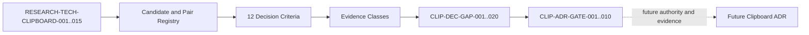

# Clipboard Integration Technology Decision Input Baseline

## Document Control

| Field | Value |
|---|---|
| Document ID | `RESEARCH-TECH-CLIPBOARD-016` |
| Title | Clipboard Integration Technology Decision Input Baseline |
| Status | Draft |
| Research Type | Technology Decision Input Baseline |
| Technology Decision | `TD-004 Clipboard Integration` |
| Parent Traceability Index | `RESEARCH-TECH-CLIPBOARD-015` |
| Covered Research Documents | `RESEARCH-TECH-CLIPBOARD-001..015` |
| Candidate Ranking | Not performed |
| Candidate Selection | Not performed |
| Technology Recommendation | Not made |
| Clipboard Technology Decision | Not made |
| Clipboard ADR | Not created |
| Authorization Request | Not created |
| Human Authorization Decision | Not made |
| Local/Package Cache Inspection | Not performed |
| Build/Runtime Verification | Not performed |
| Clipboard Read/Write/Clear | Not performed |
| Evidence Persistence | Not performed |
| Owner | TBD |
| Last reviewed | Not reviewed |

## 1. Purpose

This document defines the comparison inputs that a future `TD-004 Clipboard Integration` decision and future Clipboard ADR must contain. It does so without selecting a technology, ranking candidates, requesting authorization, or executing any inspection or runtime activity.

The baseline answers:

- which candidate identities and host combinations must remain comparable;
- which decision criteria and hard constraints must be traced;
- which evidence classes can support each conclusion;
- which gaps prevent a defensible comparison or final decision; and
- which gates must be revisited before an ADR can be accepted.

This document is not a Clipboard Technology Decision, candidate ranking, candidate recommendation, Clipboard ADR, authorization request, inspection plan execution record, runtime spike, source-code change, or feature implementation.

## 2. Source-of-truth Hierarchy

The following order controls future decision inputs:

1. Frozen PRD, Specs, and Architecture responsibility boundaries.
2. Accepted ADRs.
3. The latest effective research reassessment.
4. Microsoft first-party evidence.
5. Authorized local inspection evidence.
6. Authorized build evidence.
7. Authorized runtime evidence.
8. Authorized consumer-interoperability evidence.
9. Informative third-party material.

Rules:

- A draft ADR cannot override a frozen requirement.
- A newer reassessment may update a recommendation without rewriting upstream history.
- Official documentation cannot replace local, build, or runtime evidence.
- A file being present does not establish a successful build.
- A successful build does not establish successful runtime behavior.
- Successful runtime behavior does not automatically establish a technology decision.
- This baseline does not grant authority to collect any missing evidence.

## 3. Candidate Registry

The registry contains exactly five candidate identities. `Host-neutral Adapter strategy` is an architecture strategy, not a Windows Clipboard API.

| Candidate | Candidate ID | Exact identity | API/Interop layer | Host dependency | Current disposition |
|---|---|---|---|---|---|
| WPF Clipboard | `CLIP-OPT-001` | WPF Clipboard with managed `IDataObject` handoff | WPF managed Clipboard/DataObject surface | WPF Dispatcher and Windows desktop Clipboard boundary | Conditionally in scope |
| WinRT Clipboard | `CLIP-OPT-002` | WinRT Clipboard with `DataPackage` | Windows Runtime Clipboard/DataPackage surface | WinUI 3/Windows App SDK activation boundary | Conditionally in scope |
| OLE/COM IDataObject | `CLIP-OPT-003` | OLE/COM `IDataObject` interchange | OLE/COM data-object interop | STA/COM-capable Windows desktop host | Conditionally in scope |
| Raw Win32 Clipboard | `CLIP-OPT-004` | Raw Win32 Clipboard API route | Win32 Clipboard and native format surface | Win32 window, thread, and message-loop boundary | Insufficient evidence |
| Host-neutral Adapter strategy | `CLIP-OPT-005` | Adapter boundary over a separately selected backend | Architecture strategy; backend remains to be compared | Backend-specific; not itself a Clipboard API | Conditionally in scope |

No candidate is ranked, selected, or recommended. No candidate is excluded without direct evidence.

## 4. Candidate–Host Registry

This registry contains exactly ten static comparison rows. The pairing is a comparison baseline, not a verified local mapping or a selection result. WPF and WinUI 3 remain separate hosts.

| Pair | Candidate | Host | Invocation route | Static evidence | Local evidence | Build evidence | Runtime evidence | Selection effect |
|---|---|---|---|---|---|---|---|---|
| `CLIP-PAIR-001` | `CLIP-OPT-001` WPF Clipboard | WPF | WPF Dispatcher/managed Clipboard route | Confirmed for static specification | Not available | Not available | Not available | None |
| `CLIP-PAIR-002` | `CLIP-OPT-001` WPF Clipboard | WinUI 3 | Interop/bridge route to WPF-managed surface | Partially confirmed | Not available | Not available | Not available | None |
| `CLIP-PAIR-003` | `CLIP-OPT-002` WinRT Clipboard | WPF | Windows Runtime/DataPackage route from WPF host | Partially confirmed | Not available | Not available | Not available | None |
| `CLIP-PAIR-004` | `CLIP-OPT-002` WinRT Clipboard | WinUI 3 | Windows App SDK/WinRT route | Confirmed for static specification | Not available | Not available | Not available | None |
| `CLIP-PAIR-005` | `CLIP-OPT-003` OLE/COM IDataObject | WPF | STA/COM data-object route | Partially confirmed | Not available | Not available | Not available | None |
| `CLIP-PAIR-006` | `CLIP-OPT-003` OLE/COM IDataObject | WinUI 3 | COM interop route from WinUI 3 host | Partially confirmed | Not available | Not available | Not available | None |
| `CLIP-PAIR-007` | `CLIP-OPT-004` Raw Win32 Clipboard | WPF | Native Win32 route behind WPF host boundary | Partially confirmed | Not available | Not available | Not available | None |
| `CLIP-PAIR-008` | `CLIP-OPT-004` Raw Win32 Clipboard | WinUI 3 | Native Win32 route behind WinUI 3 host boundary | Partially confirmed | Not available | Not available | Not available | None |
| `CLIP-PAIR-009` | `CLIP-OPT-005` Host-neutral Adapter strategy | WPF | Adapter route with backend supplied separately | Confirmed for static specification | Not available | Not available | Not available | None |
| `CLIP-PAIR-010` | `CLIP-OPT-005` Host-neutral Adapter strategy | WinUI 3 | Adapter route with backend supplied separately | Confirmed for static specification | Not available | Not available | Not available | None |

The host labels describe separate comparison contexts. `.NET` reachability alone is not evidence that both host integrations have been verified.

## 5. Decision Criteria Register

Each criterion has the same fixed fields. The criteria are ready to be used in a future comparison; their evidence is not thereby collected.

### `CLIP-DEC-CRIT-001` — Host Integration Fit

| Field | Value |
|---|---|
| Criterion ID | `CLIP-DEC-CRIT-001` |
| Decision question | Can the candidate integrate with each target host without violating the host's threading, dispatcher, activation, or lifecycle boundary? |
| Requirement source | `Specs/SPEC-0007-clipboard-handoff.md`; `Architecture/ARCH-0004-component-boundaries.md` |
| Applicable candidates | `CLIP-OPT-001..005` |
| Applicable hosts | WPF; WinUI 3 |
| Minimum static evidence | API identity, host API surface, documented activation model |
| Minimum local evidence | Host and installed asset observation, if authorized |
| Minimum build evidence | Candidate/host project reference and build output, if authorized |
| Minimum runtime evidence | Host activation and isolated publication observation, if authorized |
| Consumer evidence requirement | Host-specific paste/read observation, if authorized |
| Privacy implication | Host integration must not widen Clipboard data exposure |
| Failure implication | Integration failure must remain local to Clipboard publication |
| Disqualifying condition | Direct evidence of an unresolvable host-boundary violation |
| Deferrable evidence | Large-host matrix beyond the minimum WPF and WinUI 3 paths |
| Current evidence state | Partially confirmed |
| Remaining gap | No authorized local, build, or runtime host evidence |
| Decision impact | Blocks defensible comparison when host behavior differs |
| Owner | TBD |
| Status | Ready for future comparison |

### `CLIP-DEC-CRIT-002` — API/Interop Complexity

| Field | Value |
|---|---|
| Criterion ID | `CLIP-DEC-CRIT-002` |
| Decision question | What interop surface, marshaling, conversion, and ownership work is required for each candidate/host pair? |
| Requirement source | `Specs/SPEC-0007-clipboard-handoff.md`; `RESEARCH-TECH-CLIPBOARD-006` |
| Applicable candidates | `CLIP-OPT-001..005` |
| Applicable hosts | WPF; WinUI 3 |
| Minimum static evidence | Official API and type identity for each route |
| Minimum local evidence | Installed reference/asset observation, if authorized |
| Minimum build evidence | Reference resolution and build output, if authorized |
| Minimum runtime evidence | Isolated invocation result and failure surface, if authorized |
| Consumer evidence requirement | Evidence that the published format can be consumed by the target host path |
| Privacy implication | Interop conversion must not copy or retain private Clipboard content beyond scope |
| Failure implication | Conversion failure must return a bounded Clipboard failure |
| Disqualifying condition | Direct evidence that required interop cannot be isolated or controlled |
| Deferrable evidence | Non-minimum formats and non-target consumers |
| Current evidence state | Partially confirmed |
| Remaining gap | No local/build/runtime comparison of interop surfaces |
| Decision impact | Blocks comparison of maintenance and failure boundaries |
| Owner | TBD |
| Status | Ready for future comparison |

### `CLIP-DEC-CRIT-003` — Threading/COM/Dispatcher Correctness

| Field | Value |
|---|---|
| Criterion ID | `CLIP-DEC-CRIT-003` |
| Decision question | Can the route obey required STA, COM, dispatcher, and thread-affinity rules without hidden workflow coupling? |
| Requirement source | `Architecture/ARCH-0002-layer-model.md`; `Specs/SPEC-0007-clipboard-handoff.md` |
| Applicable candidates | `CLIP-OPT-001..005` |
| Applicable hosts | WPF; WinUI 3 |
| Minimum static evidence | Documented threading and activation requirements |
| Minimum local evidence | Host/thread prerequisite observation, if authorized |
| Minimum build evidence | Buildable thread-boundary integration, if authorized |
| Minimum runtime evidence | Isolated STA/COM/dispatcher behavior and failure observation, if authorized |
| Consumer evidence requirement | Not applicable for basic threading proof; consumer evidence remains separate |
| Privacy implication | Thread-boundary failure must not leak or persist Clipboard data |
| Failure implication | Threading failure must be reported as Clipboard failure only |
| Disqualifying condition | Direct evidence of an unresolvable required thread-model conflict |
| Deferrable evidence | Stress-level concurrency beyond minimum host activation |
| Current evidence state | Requires local inspection |
| Remaining gap | No authorized thread-model observation or runtime proof |
| Decision impact | Blocks acceptance of a thread-sensitive route |
| Owner | TBD |
| Status | Ready for future comparison |

### `CLIP-DEC-CRIT-004` — Clipboard Format Coverage

| Field | Value |
|---|---|
| Criterion ID | `CLIP-DEC-CRIT-004` |
| Decision question | Which required image/data formats can the candidate publish and preserve across the target host boundary? |
| Requirement source | `Specs/SPEC-0007-clipboard-handoff.md`; `Specs/SPEC-0008-capture-output.md` |
| Applicable candidates | `CLIP-OPT-001..005` |
| Applicable hosts | WPF; WinUI 3 |
| Minimum static evidence | Official format/data-object documentation |
| Minimum local evidence | Available format/asset observation, if authorized |
| Minimum build evidence | Format path compiles in the isolated comparison project, if authorized |
| Minimum runtime evidence | Isolated format publication and read observation, if authorized |
| Consumer evidence requirement | Paste/read observation for the minimum consumer set, if authorized |
| Privacy implication | Format conversion must not retain private source content |
| Failure implication | Unsupported format must produce a bounded Clipboard failure |
| Disqualifying condition | Direct evidence that a frozen minimum format cannot be published safely |
| Deferrable evidence | Non-minimum formats and large-image variants |
| Current evidence state | Requires runtime evidence |
| Remaining gap | No format enumeration or consumer observation |
| Decision impact | Blocks comparison of publication usefulness |
| Owner | TBD |
| Status | Ready for future comparison |

### `CLIP-DEC-CRIT-005` — Ownership/Lifetime Semantics

| Field | Value |
|---|---|
| Criterion ID | `CLIP-DEC-CRIT-005` |
| Decision question | Who owns the published data and how long must it remain valid after the producer returns or terminates? |
| Requirement source | `RESEARCH-TECH-CLIPBOARD-002`; `RESEARCH-TECH-CLIPBOARD-014` |
| Applicable candidates | `CLIP-OPT-001..005` |
| Applicable hosts | WPF; WinUI 3 |
| Minimum static evidence | Official ownership and data-lifetime documentation |
| Minimum local evidence | Installed host/reference observation, if authorized |
| Minimum build evidence | Isolated ownership path builds, if authorized |
| Minimum runtime evidence | Producer return/termination and later consumer read observation, if authorized |
| Consumer evidence requirement | Consumer read after producer termination, if authorized |
| Privacy implication | Retained Clipboard content must not exceed the frozen privacy boundary |
| Failure implication | Lifetime failure must not restart Capture or Rendering |
| Disqualifying condition | Direct evidence that minimum lifetime behavior cannot be bounded |
| Deferrable evidence | Long-duration resource profiling |
| Current evidence state | Requires runtime evidence |
| Remaining gap | No producer termination or lifetime observation |
| Decision impact | Blocks durability comparison |
| Owner | TBD |
| Status | Ready for future comparison |

### `CLIP-DEC-CRIT-006` — Alpha/Pixel/Color Fidelity

| Field | Value |
|---|---|
| Criterion ID | `CLIP-DEC-CRIT-006` |
| Decision question | Does the publication path preserve the required pixel, alpha, and color semantics for the minimum image contract? |
| Requirement source | `Specs/SPEC-0008-capture-output.md`; `RESEARCH-TECH-CLIPBOARD-001` |
| Applicable candidates | `CLIP-OPT-001..005` |
| Applicable hosts | WPF; WinUI 3 |
| Minimum static evidence | Documented format and conversion semantics |
| Minimum local evidence | Available image/format asset observation, if authorized |
| Minimum build evidence | Isolated conversion path builds, if authorized |
| Minimum runtime evidence | Published/read-back image comparison, if authorized |
| Consumer evidence requirement | Consumer-specific pixel/alpha observation, if required by frozen scope |
| Privacy implication | Comparison must use authorized synthetic or bounded test data only |
| Failure implication | Fidelity failure must not cause recapture or rerender automatically |
| Disqualifying condition | Direct evidence of an unmitigable violation of the minimum pixel contract |
| Deferrable evidence | Large-image performance and extended format matrix |
| Current evidence state | Requires consumer evidence |
| Remaining gap | No authorized pixel/alpha/consumer evidence |
| Decision impact | Blocks fidelity comparison |
| Owner | TBD |
| Status | Ready for future comparison |

### `CLIP-DEC-CRIT-007` — Contention/Failure/Retry Boundary

| Field | Value |
|---|---|
| Criterion ID | `CLIP-DEC-CRIT-007` |
| Decision question | How does each route behave under Clipboard contention, publication failure, and bounded retry without crossing workflow boundaries? |
| Requirement source | `Specs/SPEC-0006-workflow-boundaries-and-feedback.md`; `RESEARCH-TECH-CLIPBOARD-014` |
| Applicable candidates | `CLIP-OPT-001..005` |
| Applicable hosts | WPF; WinUI 3 |
| Minimum static evidence | Documented failure and ownership behavior |
| Minimum local evidence | Host contention prerequisite observation, if authorized |
| Minimum build evidence | Isolated retry/failure path builds, if authorized |
| Minimum runtime evidence | Contention, failure, and bounded retry observation, if authorized |
| Consumer evidence requirement | Not applicable for the minimum failure-boundary proof |
| Privacy implication | Retry must not duplicate or retain private Clipboard data unexpectedly |
| Failure implication | Clipboard failure must not restart Capture or Rendering |
| Disqualifying condition | Direct evidence that failure handling crosses a frozen workflow boundary |
| Deferrable evidence | Full contention matrix beyond minimum cases |
| Current evidence state | Requires runtime evidence |
| Remaining gap | No authorized contention or retry observation |
| Decision impact | Blocks safe failure-boundary comparison |
| Owner | TBD |
| Status | Ready for future comparison |

### `CLIP-DEC-CRIT-008` — Producer Termination Durability

| Field | Value |
|---|---|
| Criterion ID | `CLIP-DEC-CRIT-008` |
| Decision question | Does published content remain available for the required consumer after the producing process returns or terminates? |
| Requirement source | `RESEARCH-TECH-CLIPBOARD-002`; `Specs/SPEC-0007-clipboard-handoff.md` |
| Applicable candidates | `CLIP-OPT-001..005` |
| Applicable hosts | WPF; WinUI 3 |
| Minimum static evidence | Official ownership/lifetime statements |
| Minimum local evidence | Host/process prerequisite observation, if authorized |
| Minimum build evidence | Isolated producer/consumer project builds, if authorized |
| Minimum runtime evidence | Producer termination followed by consumer read, if authorized |
| Consumer evidence requirement | Consumer read after producer termination, if authorized |
| Privacy implication | Post-termination retention must remain within the allowed Clipboard boundary |
| Failure implication | Durability failure must be isolated to Clipboard publication |
| Disqualifying condition | Direct evidence of required durability failure with no bounded mitigation |
| Deferrable evidence | Abnormal termination stress beyond minimum lifecycle proof |
| Current evidence state | Requires runtime evidence |
| Remaining gap | No process-lifetime observation |
| Decision impact | Blocks durability decision input |
| Owner | TBD |
| Status | Ready for future comparison |

### `CLIP-DEC-CRIT-009` — Packaged/Unpackaged Compatibility

| Field | Value |
|---|---|
| Criterion ID | `CLIP-DEC-CRIT-009` |
| Decision question | Which packaged and unpackaged host contexts are supported by each route and what activation differences remain? |
| Requirement source | `RESEARCH-TECH-CLIPBOARD-006`; `RESEARCH-TECH-CLIPBOARD-014` |
| Applicable candidates | `CLIP-OPT-001..005` |
| Applicable hosts | WPF; WinUI 3 |
| Minimum static evidence | Official packaged/unpackaged API requirements |
| Minimum local evidence | Installed host/package context observation, if authorized |
| Minimum build evidence | Separately scoped packaged/unpackaged build evidence, if authorized |
| Minimum runtime evidence | Host-context activation observation, if authorized |
| Consumer evidence requirement | Only where host packaging changes consumer behavior |
| Privacy implication | Packaging context must not add undeclared Clipboard history/cloud access |
| Failure implication | Packaging failure must remain a host/Clipboard failure |
| Disqualifying condition | Direct evidence of an unavoidable packaged/unpackaged requirement conflict |
| Deferrable evidence | Full deployment matrix beyond target contexts |
| Current evidence state | Requires local inspection |
| Remaining gap | No packaged/unpackaged local, build, or runtime evidence |
| Decision impact | Blocks host-context comparison |
| Owner | TBD |
| Status | Ready for future comparison |

### `CLIP-DEC-CRIT-010` — Privacy/History/Cloud Control

| Field | Value |
|---|---|
| Criterion ID | `CLIP-DEC-CRIT-010` |
| Decision question | Can the route operate without implicit access to private Clipboard history or cloud synchronization? |
| Requirement source | `PRD/PRD-0006-non-functional-requirements.md`; `Specs/SPEC-0007-clipboard-handoff.md` |
| Applicable candidates | `CLIP-OPT-001..005` |
| Applicable hosts | WPF; WinUI 3 |
| Minimum static evidence | Official privacy, history, and cloud behavior documentation |
| Minimum local evidence | Authorized local configuration/asset observation without private payload access |
| Minimum build evidence | Isolated code path build evidence, if authorized |
| Minimum runtime evidence | Bounded privacy/history/cleanup observation, if authorized |
| Consumer evidence requirement | Not required for the privacy boundary itself |
| Privacy implication | Private Clipboard payloads and image bytes are outside this baseline |
| Failure implication | Privacy-boundary failure blocks the route without changing workflow state |
| Disqualifying condition | Direct evidence of unavoidable private Clipboard or cloud access |
| Deferrable evidence | Extended history behavior beyond the minimum boundary |
| Current evidence state | Partially confirmed |
| Remaining gap | No authorized local or runtime privacy observation |
| Decision impact | Blocks privacy acceptance |
| Owner | TBD |
| Status | Ready for future comparison |

### `CLIP-DEC-CRIT-011` — Isolation/Testability/Evidence Quality

| Field | Value |
|---|---|
| Criterion ID | `CLIP-DEC-CRIT-011` |
| Decision question | Can the route be isolated, tested, observed, and evidenced without mutating the main workflow or private user data? |
| Requirement source | `RESEARCH-TECH-CLIPBOARD-010`; `RESEARCH-TECH-CLIPBOARD-013` |
| Applicable candidates | `CLIP-OPT-001..005` |
| Applicable hosts | WPF; WinUI 3 |
| Minimum static evidence | Explicit isolation and evidence boundary |
| Minimum local evidence | Authorized prerequisite observation, if authorized |
| Minimum build evidence | Isolated project build output, if authorized |
| Minimum runtime evidence | Session observation with no automatic persistence, if authorized |
| Consumer evidence requirement | Only for a consumer-specific claim |
| Privacy implication | Evidence must exclude private Clipboard payloads and image bytes |
| Failure implication | Isolation failure blocks the experiment; it does not restart another component |
| Disqualifying condition | Direct evidence that safe isolation cannot be maintained |
| Deferrable evidence | Long-running resource stress |
| Current evidence state | Requires local inspection |
| Remaining gap | No authorized isolation, observation, or evidence record |
| Decision impact | Blocks evidence-quality comparison |
| Owner | TBD |
| Status | Ready for future comparison |

### `CLIP-DEC-CRIT-012` — Architecture and Workflow Boundary Fit

| Field | Value |
|---|---|
| Criterion ID | `CLIP-DEC-CRIT-012` |
| Decision question | Can the candidate fit the frozen architecture while keeping Clipboard, Capture, Rendering, File Output, and Shared Workflow State responsibilities separate? |
| Requirement source | `Architecture/ARCH-0001-architecture-principles.md`; `Architecture/ARCH-0004-component-boundaries.md`; `Specs/SPEC-0006-workflow-boundaries-and-feedback.md` |
| Applicable candidates | `CLIP-OPT-001..005` |
| Applicable hosts | WPF; WinUI 3 |
| Minimum static evidence | Responsibility and dependency traceability |
| Minimum local evidence | Not applicable to the static boundary; local evidence is still required for implementation claims |
| Minimum build evidence | Isolated build boundary, if authorized |
| Minimum runtime evidence | Failure/cancellation/cleanup boundary observation, if authorized |
| Consumer evidence requirement | Not applicable for responsibility boundaries |
| Privacy implication | Shared boundaries must not expose private Clipboard content |
| Failure implication | Clipboard failure must remain independent of Capture and Rendering |
| Disqualifying condition | Direct evidence of an unavoidable frozen-boundary violation |
| Deferrable evidence | Non-target host or extended stress scenarios |
| Current evidence state | Confirmed for static specification |
| Remaining gap | No implementation evidence; no decision authority exists |
| Decision impact | Blocks acceptance of any route that crosses a frozen boundary |
| Owner | TBD |
| Status | Ready for future comparison |

No criterion receives a weight, score, percentage, total, threshold, or ranking value.

## 6. Controlled Vocabulary

### Evidence State

Only these values are valid:

- `Confirmed for static specification`
- `Partially confirmed`
- `Requires local inspection`
- `Requires build evidence`
- `Requires runtime evidence`
- `Requires consumer evidence`
- `Conflicting`
- `Unknown`
- `Not applicable`

### Criterion Readiness

Only these values are valid:

- `Ready for future comparison`
- `Partially ready`
- `Blocked`
- `Deferred`
- `Not applicable`

### Candidate Decision Readiness

Only these values are valid:

- `Ready for decision comparison`
- `Conditionally ready for comparison`
- `Not ready for comparison`
- `Deferred`
- `Excluded with direct evidence`

Decision-status labels that imply selection, approval, production readiness, or runtime verification are not valid in this baseline.

## 7. Candidate–Criterion Evidence Matrix

Each candidate cell records only an Evidence State. The matrix does not calculate, score, order, or select candidates.

| Criterion | WPF Clipboard | WinRT DataPackage | OLE/COM | Raw Win32 | Host-neutral Adapter | Remaining evidence |
|---|---|---|---|---|---|---|
| `CLIP-DEC-CRIT-001` Host Integration Fit | Requires local inspection | Requires local inspection | Requires local inspection | Requires local inspection | Partially confirmed | Host-specific local/build/runtime evidence |
| `CLIP-DEC-CRIT-002` API/Interop Complexity | Partially confirmed | Partially confirmed | Requires local inspection | Requires local inspection | Partially confirmed | Isolated interop comparison |
| `CLIP-DEC-CRIT-003` Threading/COM/Dispatcher Correctness | Requires local inspection | Requires local inspection | Requires runtime evidence | Requires runtime evidence | Requires runtime evidence | Thread-model and failure observation |
| `CLIP-DEC-CRIT-004` Clipboard Format Coverage | Requires runtime evidence | Requires runtime evidence | Requires runtime evidence | Requires runtime evidence | Requires runtime evidence | Format publication and consumer evidence |
| `CLIP-DEC-CRIT-005` Ownership/Lifetime Semantics | Requires runtime evidence | Requires runtime evidence | Requires runtime evidence | Requires runtime evidence | Requires runtime evidence | Ownership and lifetime observation |
| `CLIP-DEC-CRIT-006` Alpha/Pixel/Color Fidelity | Requires consumer evidence | Requires consumer evidence | Requires consumer evidence | Requires consumer evidence | Requires consumer evidence | Pixel/alpha and consumer comparison |
| `CLIP-DEC-CRIT-007` Contention/Failure/Retry Boundary | Requires runtime evidence | Requires runtime evidence | Requires runtime evidence | Requires runtime evidence | Requires runtime evidence | Bounded failure and retry observation |
| `CLIP-DEC-CRIT-008` Producer Termination Durability | Requires runtime evidence | Requires runtime evidence | Requires runtime evidence | Requires runtime evidence | Requires runtime evidence | Producer termination and later consumer read |
| `CLIP-DEC-CRIT-009` Packaged/Unpackaged Compatibility | Requires local inspection | Requires local inspection | Requires local inspection | Requires local inspection | Requires local inspection | Context-specific local/build/runtime evidence |
| `CLIP-DEC-CRIT-010` Privacy/History/Cloud Control | Partially confirmed | Partially confirmed | Requires runtime evidence | Requires runtime evidence | Requires runtime evidence | Bounded privacy and cleanup observation |
| `CLIP-DEC-CRIT-011` Isolation/Testability/Evidence Quality | Requires local inspection | Requires local inspection | Requires local inspection | Requires local inspection | Requires local inspection | Authorized observation and evidence record |
| `CLIP-DEC-CRIT-012` Architecture and Workflow Boundary Fit | Confirmed for static specification | Confirmed for static specification | Confirmed for static specification | Confirmed for static specification | Confirmed for static specification | Isolated implementation evidence |

`Requires runtime evidence` is an evidence state, not a negative score. Adapter evidence must separately identify the adapter boundary and the backend that it contains.

## 8. Hard Constraint Register

| Constraint | Source | Candidate applicability | Violation effect | Evidence required |
|---|---|---|---|---|
| Clipboard and File Output remain parallel and independent | `Specs/SPEC-0007-clipboard-handoff.md` | `CLIP-OPT-001..005` | Blocks the affected route; no cross-component retry | Static boundary trace and future isolated failure observation |
| Clipboard failure must not restart Capture | `Specs/SPEC-0006-workflow-boundaries-and-feedback.md` | `CLIP-OPT-001..005` | Clipboard failure only | Failure observation, if authorized |
| Clipboard failure must not restart Rendering | `Specs/SPEC-0006-workflow-boundaries-and-feedback.md` | `CLIP-OPT-001..005` | Clipboard failure only | Failure observation, if authorized |
| Clipboard component must not modify Shared Workflow State | `Architecture/ARCH-0004-component-boundaries.md` | `CLIP-OPT-001..005` | Blocks the route that crosses the state boundary | Static dependency trace and isolated evidence |
| Clipboard Adapter must not advance Workflow | `Architecture/ARCH-0004-component-boundaries.md` | `CLIP-OPT-005` | Blocks adapter design that owns workflow progression | Static responsibility trace |
| Phase L1 permits Synthetic Image only | `Specs/SPEC-0005-capture-workflow.md` | All candidates | Blocks use of formal Capture output in Phase L1 | Static payload-boundary evidence |
| Formal Capture output is not the Phase L1 initial payload | `Specs/SPEC-0005-capture-workflow.md` | All candidates | Blocks an invalid L1 input route | Static payload-boundary evidence |
| Clipboard Read, Write, and Clear remain separate operations | `RESEARCH-TECH-CLIPBOARD-014` | `CLIP-OPT-001..005` | Blocks combined operation authority | Future separately scoped evidence |
| Runtime and Evidence persistence remain separate | `RESEARCH-TECH-CLIPBOARD-013` | `CLIP-OPT-001..005` | Blocks automatic persistence | Separate observation and persistence records |
| Project creation, package acquisition, restore, build, and run remain separate | `RESEARCH-TECH-CLIPBOARD-014` | `CLIP-OPT-001..005` | Blocks bundled execution scope | Separate future authority and result records |
| History/Cloud mutation is not implicit | `PRD/PRD-0006-non-functional-requirements.md`; `Specs/SPEC-0007-clipboard-handoff.md` | `CLIP-OPT-001..005` | Blocks undeclared history/cloud access | Explicit privacy and history evidence |
| Session Observation does not auto-persist | `RESEARCH-TECH-CLIPBOARD-013` | `CLIP-OPT-001..005` | Blocks silent evidence mutation | Separate observation and persistence authority |
| Private Clipboard payloads and image bytes are not recorded | `RESEARCH-TECH-CLIPBOARD-014` | `CLIP-OPT-001..005` | Blocks the affected evidence path | Redacted/bounded evidence record |
| Candidate comparison must not change the frozen user flow | `PRD/PRD-0004-core-workflow.md`; `Architecture/ARCH-0004-component-boundaries.md` | `CLIP-OPT-001..005` | Blocks a route that changes Capture/Rendering/File Output behavior | Static workflow trace and future isolated evidence |

## 9. Disqualifier Policy

A disqualifier may be used only with direct evidence. Until such evidence exists, `Current candidate affected` remains `None confirmed`.

| Disqualifier | Required evidence class | Can official evidence alone disqualify | Requires runtime evidence | Current candidate affected |
|---|---|---|---|---|
| Cannot satisfy the frozen Architecture responsibility boundary | Confirmed for static specification plus direct boundary evidence | Yes | No | None confirmed |
| Must be driven by the Platform layer to advance Workflow | Confirmed for static specification plus direct dependency evidence | Yes | No | None confirmed |
| Cannot safely isolate Clipboard data | Requires local inspection and runtime evidence | No | Yes | None confirmed |
| Must read private Clipboard content to complete basic publication | Confirmed for static specification or direct privacy evidence | Yes | No | None confirmed |
| Cannot separate Read, Write, and Clear authority | Requires runtime evidence | No | Yes | None confirmed |
| Cannot provide a required minimum format | Requires consumer evidence | No | Yes | None confirmed |
| Cannot be called or built in the target host | Requires build evidence | No | No | None confirmed |
| Cannot satisfy the required STA/COM model | Requires runtime evidence | No | Yes | None confirmed |
| Cannot satisfy minimum consumer interoperability | Requires consumer evidence | No | Yes | None confirmed |
| Has an unacceptable and unmitigable privacy risk | Requires local inspection and runtime evidence | No | Yes | None confirmed |

## 10. Decision Evidence Classes

Each class has a bounded claim. No class may silently prove the next class.

| Evidence class | Proves | Does not prove | Current availability | Future document class |
|---|---|---|---|---|
| Official documentation | Static API identity and documented behavior | Local availability, build, runtime, or consumer behavior | Confirmed for static specification | Official evidence baseline |
| Official sample | Documented usage shape | Repository compatibility or runtime result here | Confirmed for static specification | Official evidence baseline |
| Local asset observation | Presence and identity of authorized local assets | Build or runtime behavior | Requires local inspection | Local inspection record |
| Package metadata observation | Package/reference metadata visible in the authorized scope | Restore, build, or runtime success | Requires local inspection | Local inspection record |
| Experimental Project creation | Project creation result | Restore, build, runtime, or consumer result | Requires build evidence | Project creation record |
| Restore | Dependency resolution result | Build or runtime result | Requires build evidence | Restore record |
| Build | Compilation result for the scoped project | Runtime, Clipboard, or consumer result | Requires build evidence | Build record |
| Clipboard publication runtime | Isolated runtime publication behavior | Consumer fidelity or technology decision | Requires runtime evidence | Runtime observation record |
| Format enumeration | Formats observed in the isolated route | Fidelity, consumer interoperability, or privacy acceptance | Requires runtime evidence | Runtime observation record |
| Consumer paste observation | A bounded consumer read/paste result | All other consumers or technology selection | Requires consumer evidence | Consumer observation record |
| Pixel/Alpha comparison | Bounded image fidelity result | General API or workflow correctness | Requires consumer evidence | Fidelity observation record |
| Process termination observation | Behavior after producer return/termination | All packaging or consumer cases | Requires runtime evidence | Runtime observation record |
| Contention/Retry observation | Bounded failure and retry behavior | General performance or technology selection | Requires runtime evidence | Runtime observation record |
| History/Cloud observation | Explicitly scoped history/cloud behavior | Unobserved privacy behavior or approval | Requires runtime evidence | Privacy observation record |
| Persistent Evidence | Persisted, bounded evidence artifact | Authorization or technology selection | Requires runtime evidence | Persistent evidence record |

## 11. Current Evidence Sufficiency by Candidate

No row contains a ranking or technology recommendation. The decision-readiness value uses only the controlled Candidate Decision Readiness vocabulary.

| Candidate | Static identity | Host integration | Format | Threading | Lifetime | Privacy | Local/Build/Runtime missing | Decision readiness |
|---|---|---|---|---|---|---|---|---|
| `CLIP-OPT-001` WPF Clipboard | Confirmed for static specification | Requires local inspection | Requires runtime evidence | Requires local inspection | Requires runtime evidence | Partially confirmed | Host, format, lifetime, and privacy evidence | Not ready for comparison |
| `CLIP-OPT-002` WinRT Clipboard | Confirmed for static specification | Requires local inspection | Requires runtime evidence | Requires local inspection | Requires runtime evidence | Partially confirmed | Host, format, lifetime, and privacy evidence | Not ready for comparison |
| `CLIP-OPT-003` OLE/COM IDataObject | Confirmed for static specification | Requires local inspection | Requires runtime evidence | Requires runtime evidence | Requires runtime evidence | Requires runtime evidence | Host, COM, format, lifetime, and privacy evidence | Not ready for comparison |
| `CLIP-OPT-004` Raw Win32 Clipboard | Confirmed for static specification | Requires local inspection | Requires runtime evidence | Requires runtime evidence | Requires runtime evidence | Requires runtime evidence | Host, format, lifetime, and privacy evidence | Not ready for comparison |
| `CLIP-OPT-005` Host-neutral Adapter strategy | Confirmed for static specification | Requires local inspection | Requires runtime evidence | Requires runtime evidence | Requires runtime evidence | Requires runtime evidence | Backend and host evidence; adapter/backend separation | Not ready for comparison |

## 12. Decision Gap Register

The current register contains twenty concrete gaps, numbered continuously from `CLIP-DEC-GAP-001` through `CLIP-DEC-GAP-020`. The count is the actual number of rows in this baseline; it does not include the fact that no candidate has been selected.

| Gap ID | Related Candidate | Related Host | Related Pair | Related Criterion | Missing evidence | Evidence class required | Existing source | Why existing evidence is insufficient | Local inspection required | Project required | Restore required | Build required | Clipboard operation required | Runtime required | Consumer required | Evidence persistence required | Authorization dependency | Blocks candidate comparison | Blocks final technology decision | Deferrable phase | Status |
|---|---|---|---|---|---|---|---|---|---|---|---|---|---|---|---|---|---|---|---|---|---|
| `CLIP-DEC-GAP-001` | All | WPF; WinUI 3 | `CLIP-PAIR-001..010` | `CLIP-DEC-CRIT-001` | Host activation identity | Local inspection; build; runtime | `RESEARCH-TECH-CLIPBOARD-010` | No local authority or result exists | Yes | Yes | Yes | Yes | No | Yes | No | No | Not granted | Yes | Yes | L1 | Open |
| `CLIP-DEC-GAP-002` | All | WPF; WinUI 3 | `CLIP-PAIR-001..010` | `CLIP-DEC-CRIT-002` | Interop/reference resolution | Local inspection; build; runtime | `RESEARCH-TECH-CLIPBOARD-006` | Official evidence is not repository evidence | Yes | Yes | Yes | Yes | No | Yes | No | No | Not granted | Yes | Yes | L1 | Open |
| `CLIP-DEC-GAP-003` | All | WPF; WinUI 3 | `CLIP-PAIR-001..010` | `CLIP-DEC-CRIT-003` | Threading and COM/Dispatcher behavior | Local inspection; runtime | `RESEARCH-TECH-CLIPBOARD-003` | No authorized thread observation exists | Yes | Yes | No | Yes | Yes | Yes | No | No | Not granted | Yes | Yes | L1 | Open |
| `CLIP-DEC-GAP-004` | All | WPF; WinUI 3 | `CLIP-PAIR-001..010` | `CLIP-DEC-CRIT-004` | Minimum format publication | Runtime; consumer | `Specs/SPEC-0007-clipboard-handoff.md` | No publication or read result exists | No | Yes | No | Yes | Yes | Yes | Yes | No | Not granted | Yes | Yes | L1 | Open |
| `CLIP-DEC-GAP-005` | All | WPF; WinUI 3 | `CLIP-PAIR-001..010` | `CLIP-DEC-CRIT-005` | Ownership and lifetime result | Runtime; consumer | `RESEARCH-TECH-CLIPBOARD-002` | Plan is not an observation | No | Yes | No | Yes | Yes | Yes | Yes | No | Not granted | Yes | Yes | L1 | Open |
| `CLIP-DEC-GAP-006` | All | WPF; WinUI 3 | `CLIP-PAIR-001..010` | `CLIP-DEC-CRIT-006` | Pixel/alpha/color fidelity | Runtime; consumer | `Specs/SPEC-0008-capture-output.md` | Capture specification is not Clipboard evidence | No | Yes | No | Yes | Yes | Yes | Yes | No | Not granted | Yes | Yes | L1 | Open |
| `CLIP-DEC-GAP-007` | All | WPF; WinUI 3 | `CLIP-PAIR-001..010` | `CLIP-DEC-CRIT-007` | Contention and bounded retry | Runtime | `Specs/SPEC-0006-workflow-boundaries-and-feedback.md` | Boundary requirement has no runtime result | No | Yes | No | Yes | Yes | Yes | No | No | Not granted | Yes | Yes | L1 | Open |
| `CLIP-DEC-GAP-008` | All | WPF; WinUI 3 | `CLIP-PAIR-001..010` | `CLIP-DEC-CRIT-008` | Producer termination durability | Runtime; consumer | `RESEARCH-TECH-CLIPBOARD-002` | No producer/consumer lifecycle result exists | No | Yes | No | Yes | Yes | Yes | Yes | No | Not granted | Yes | Yes | L1 | Open |
| `CLIP-DEC-GAP-009` | All | WPF; WinUI 3 | `CLIP-PAIR-001..010` | `CLIP-DEC-CRIT-009` | Packaged/unpackaged context behavior | Local inspection; build; runtime | `RESEARCH-TECH-CLIPBOARD-006` | Official context rules are not local evidence | Yes | Yes | Yes | Yes | No | Yes | No | No | Not granted | Yes | Yes | L2/L3 | Deferred |
| `CLIP-DEC-GAP-010` | All | WPF; WinUI 3 | `CLIP-PAIR-001..010` | `CLIP-DEC-CRIT-010` | Privacy/history/cloud boundary | Local inspection; runtime | `PRD/PRD-0006-non-functional-requirements.md` | Requirement exists; behavior is unobserved | Yes | Yes | No | Yes | Yes | Yes | No | Yes | Not granted | Yes | Yes | L1 | Open |
| `CLIP-DEC-GAP-011` | All | WPF; WinUI 3 | `CLIP-PAIR-001..010` | `CLIP-DEC-CRIT-011` | Isolated evidence quality | Local inspection; build; runtime | `RESEARCH-TECH-CLIPBOARD-013` | Documentary controls are not execution evidence | Yes | Yes | Yes | Yes | Yes | Yes | No | Yes | Not granted | Yes | Yes | L1 | Open |
| `CLIP-DEC-GAP-012` | All | WPF; WinUI 3 | `CLIP-PAIR-001..010` | `CLIP-DEC-CRIT-012` | Implementation boundary evidence | Build; runtime | `Architecture/ARCH-0004-component-boundaries.md` | Static architecture is not implementation evidence | No | Yes | Yes | Yes | Yes | Yes | No | No | Not granted | Yes | Yes | L1 | Open |
| `CLIP-DEC-GAP-013` | All | WPF; WinUI 3 | `CLIP-PAIR-001..010` | `CLIP-DEC-CRIT-001` | WPF/WinUI pair-specific invocation route | Local inspection; build | `RESEARCH-TECH-CLIPBOARD-015` | Pair rows are not locally verified | Yes | Yes | Yes | Yes | No | No | No | No | Not granted | Yes | Yes | L1 | Open |
| `CLIP-DEC-GAP-014` | All | WPF; WinUI 3 | `CLIP-PAIR-001..010` | `CLIP-DEC-CRIT-004` | Read/Write/Clear separation evidence | Runtime | `RESEARCH-TECH-CLIPBOARD-014` | Boundary is documented; operation is unperformed | No | Yes | No | Yes | Yes | Yes | No | No | Not granted | Yes | Yes | L1 | Open |
| `CLIP-DEC-GAP-015` | All | WPF; WinUI 3 | `CLIP-PAIR-001..010` | `CLIP-DEC-CRIT-005` | Backend/adapter ownership separation | Build; runtime | `RESEARCH-TECH-CLIPBOARD-015` | Adapter strategy has no implementation evidence | No | Yes | Yes | Yes | Yes | Yes | No | No | Not granted | Yes | Yes | L1 | Open |
| `CLIP-DEC-GAP-016` | All | WPF; WinUI 3 | `CLIP-PAIR-001..010` | `CLIP-DEC-CRIT-007` | File Output independence under Clipboard failure | Runtime | `Specs/SPEC-0007-clipboard-handoff.md` | No isolated failure observation exists | No | Yes | No | Yes | Yes | Yes | No | No | Not granted | Yes | Yes | L1 | Open |
| `CLIP-DEC-GAP-017` | All | WPF; WinUI 3 | `CLIP-PAIR-001..010` | `CLIP-DEC-CRIT-010` | No private payload/image-byte access | Local inspection; runtime | `RESEARCH-TECH-CLIPBOARD-014` | No authorized privacy inspection exists | Yes | Yes | No | Yes | Yes | Yes | No | Yes | Not granted | Yes | Yes | L1 | Open |
| `CLIP-DEC-GAP-018` | All | WPF; WinUI 3 | `CLIP-PAIR-001..010` | `CLIP-DEC-CRIT-011` | Observation/evidence separation | Local inspection; runtime | `RESEARCH-TECH-CLIPBOARD-013` | No observation or persistence record exists | Yes | Yes | No | Yes | Yes | Yes | No | Yes | Not granted | Yes | Yes | L1 | Open |
| `CLIP-DEC-GAP-019` | All | WPF; WinUI 3 | `CLIP-PAIR-001..010` | `CLIP-DEC-CRIT-009` | Long-duration resource behavior | Runtime | `RESEARCH-TECH-CLIPBOARD-002` | Spike was not executed | No | Yes | No | Yes | Yes | Yes | No | No | Not granted | No | Yes | L2/L3 | Deferred |
| `CLIP-DEC-GAP-020` | All | WPF; WinUI 3 | `CLIP-PAIR-001..010` | `CLIP-DEC-CRIT-006` | Extended consumer and large-image matrix | Runtime; consumer | `Specs/SPEC-0008-capture-output.md` | Minimum Clipboard consumer behavior is unobserved | No | Yes | No | Yes | Yes | Yes | Yes | No | Not granted | No | Yes | L2/L3 | Deferred |

## 13. Minimum ADR Input Gates

There are exactly ten gates. `Current state` uses only `Specified`, `Partially specified`, `Blocked`, or `Deferred`.

| Gate | Requirement | Current state | Remaining evidence | Blocks ADR drafting | Blocks ADR acceptance |
|---|---|---|---|---|---|
| `CLIP-ADR-GATE-001` | Candidate identities fixed | Specified | None for identity; implementation identity remains future evidence | No | Yes |
| `CLIP-ADR-GATE-002` | Host scope fixed | Specified | Host-specific local/build/runtime evidence | No | Yes |
| `CLIP-ADR-GATE-003` | Hard constraints traced | Specified | Implementation boundary evidence | No | Yes |
| `CLIP-ADR-GATE-004` | Static evidence accepted | Partially specified | Source review and traceability acceptance | No | Yes |
| `CLIP-ADR-GATE-005` | Local availability assessed | Blocked | Authorized local/package-cache inspection | Yes | Yes |
| `CLIP-ADR-GATE-006` | Project/Restore/Build evidence assessed | Blocked | Separately authorized project, restore, and build results | Yes | Yes |
| `CLIP-ADR-GATE-007` | Minimum runtime publication evidence assessed | Blocked | Separately authorized runtime observation | Yes | Yes |
| `CLIP-ADR-GATE-008` | Minimum format/consumer fidelity assessed | Blocked | Format and consumer observation | Yes | Yes |
| `CLIP-ADR-GATE-009` | Privacy/ownership/cleanup assessed | Partially specified | Bounded local/runtime privacy and lifetime evidence | Yes | Yes |
| `CLIP-ADR-GATE-010` | Alternatives and consequences comparable | Partially specified | Gap closure without ranking or selection | Yes | Yes |

No gate is reported as passed or satisfied.

## 14. ADR Drafting Boundary

A future Clipboard ADR may contain:

- Context
- Decision drivers
- Candidate alternatives
- Accepted evidence
- Known unknowns
- Consequences
- Risks
- Deferred validation
- A decision made by the appropriate authority

This baseline does not produce:

- an ADR number;
- an ADR file;
- a candidate recommendation;
- a technology decision;
- an accepted status;
- a decision authority assignment; or
- a decision date.

`Architecture/adr/ADR-0002-ui-framework-selection.md` remains the UI Framework ADR and is not a Clipboard decision.

## 15. Deferred Evidence Register

### Phase L1 minimum decision evidence

| Evidence item | Minimum claim | Current state | Required future evidence | Risk if deferred |
|---|---|---|---|---|
| Host activation | The target WPF or WinUI 3 host can reach the scoped route | Requires local inspection | Authorized host observation and build/runtime result | Host route may be unavailable |
| Basic publication | The route can publish the minimum bounded image/data form | Requires runtime evidence | Isolated publication result | Basic feature may not work |
| Minimum format path | The minimum required format can be offered/read | Requires consumer evidence | Bounded format and consumer observation | Fidelity or interoperability may fail |
| Minimum consumer | The minimum consumer can read the published result | Requires consumer evidence | Consumer observation | Publication may be unusable |
| STA/COM correctness | Required thread and COM model is respected | Requires runtime evidence | Isolated thread-model observation | Intermittent failure risk |
| Process lifetime basic behavior | Minimum producer-return/termination behavior is known | Requires runtime evidence | Producer/consumer lifecycle observation | Durability is unknown |
| Privacy/cleanup basic boundary | No private payload/bytes or undeclared history/cloud mutation is required | Requires local inspection | Bounded privacy and cleanup observation | Privacy boundary is unproven |

### Phase L2/L3 deferrable evidence

| Evidence item | Current state | Deferral effect |
|---|---|---|
| Large-image performance | Deferred | Does not by itself block an initial ADR draft; remains a stated risk |
| Complete contention matrix | Deferred | Minimum failure cases remain required before acceptance |
| Final retry policy | Deferred | Bounded failure behavior remains required |
| Full Office/Browser consumer matrix | Deferred | Minimum consumer evidence remains required |
| Complete history behavior | Deferred | Minimum privacy/history boundary remains required |
| Cloud Clipboard behavior | Deferred | No cloud mutation is implied |
| Abnormal termination stress | Deferred | Minimum producer termination evidence remains required |
| Full packaged/unpackaged comparison | Deferred | Target contexts remain required |
| Long-duration memory/resource testing | Deferred | No performance conclusion may be drawn |

Deferral does not erase risk or authorize execution. It only prevents all non-minimum evidence from being treated as an automatic blocker to drafting a future ADR.

## 16. Cross-component Decision Boundary

| Boundary | Clipboard implication | Capture implication | Rendering implication | File Output implication | Workflow implication |
|---|---|---|---|---|---|
| Input image identity | Consumes a bounded handoff identity | Remains owner of Capture output identity | Remains owner of render output identity | Receives its independent output identity | No shared identity mutation |
| Pixel/Alpha contract | Must preserve or report the bounded contract | Defines source contract | Defines rendered contract | Defines file contract | No cross-component reinterpretation |
| Publication result | Reports Clipboard result only | Capture remains complete/failed independently | Rendering remains complete/failed independently | File Output remains complete/failed independently | No implicit workflow advancement |
| Clipboard failure | Bounded Clipboard failure | No recapture | No rerender | No File Output retry implied | No Shared Workflow State mutation |
| File Output failure | No Clipboard retry implied | No recapture | No rerender | File Output failure only | No Clipboard state mutation |
| Retry | Only a separately bounded Clipboard retry, if later authorized | Capture retry remains separate | Rendering retry remains separate | File Output retry remains separate | No automatic cross-component retry |
| Cancellation | Stops only the authorized Clipboard operation | Capture cancellation remains separate | Rendering cancellation remains separate | File Output cancellation remains separate | No hidden state transition |
| Cleanup | Clipboard cleanup is bounded and explicit | Capture cleanup remains separate | Rendering cleanup remains separate | File cleanup remains separate | No automatic evidence persistence |
| Component ownership | Clipboard owns publication boundary | Capture owns Capture | Rendering owns Rendering | File Output owns File Output | Platform owns orchestration |
| Shared state mutation | Must not modify Shared Workflow State | Owns its state boundary | Owns its state boundary | Owns its state boundary | Only the defined orchestrator may advance workflow |

Clipboard comparison must not choose Capture or Rendering technology. Clipboard success does not mean File Output success. Clipboard failure does not trigger recapture or rerender.

## 17. Current Decision-readiness Snapshot

| Item | Status |
|---|---|
| Candidate Registry | Complete |
| Decision Criteria | Complete |
| Static Evidence | Partial |
| Local Evidence | Not available |
| Build Evidence | Not available |
| Runtime Evidence | Not available |
| Consumer Evidence | Not available |
| Candidate Ranking | Not performed |
| Candidate Selection | Not performed |
| Clipboard Technology Decision | Not made |
| Clipboard ADR | Not created |
| Authorization Request | Not created |
| Inspection | Not performed |
| Clipboard Operation | Not performed |

## 18. Mechanical Final Status

### Decision Input Baseline Status

`Clipboard technology decision input baseline complete`

### ADR Input Readiness

`Conditionally ready to draft clipboard technology ADR`

This mechanical state is derived from:

```text
5 Candidate identities
+ 10 Candidate–Host pairs
+ 12 Decision Criteria
+ Hard Constraints
+ Evidence classes
+ Decision Gaps
+ 10 ADR Input Gates
+ Minimum versus Deferred evidence
→ ADR Input Readiness
```

Even if the readiness value changes later, this document cannot create an ADR or make a Clipboard Technology Decision.

## 19. Traceability

### Research-line mapping

| Traceability input | Source |
|---|---|
| Clipboard research line | `RESEARCH-TECH-CLIPBOARD-001..015`; files `docs/Research/Technology/29-clipboard-integration-feasibility.md` through `docs/Research/Technology/43-clipboard-integration-research-line-traceability-index.md` |
| UI research line | `docs/Research/Technology/01-ui-framework-feasibility.md` through `docs/Research/Technology/09-ui-framework-phase1-enablement-execution-authorization-request.md` |
| Rendering research line | `docs/Research/Technology/10-rendering-technology-feasibility.md` through `docs/Research/Technology/18-rendering-technology-read-only-local-inspection-authorization-request.md` |
| Capture research line | `docs/Research/Technology/20-capture-backend-feasibility.md` through `docs/Research/Technology/28-capture-backend-read-only-local-prerequisite-inspection-plan.md` |
| Technology decision namespace | `TD-004 Clipboard Integration` |
| UI ADR boundary | `Architecture/adr/ADR-0002-ui-framework-selection.md` |
| Frozen PRD | `PRD/PRD-0001-product-foundation.md`, `PRD/PRD-0004-core-workflow.md`, and `PRD/PRD-0006-non-functional-requirements.md` |
| Clipboard Specs | `Specs/SPEC-0007-clipboard-handoff.md`; related workflow/output boundaries in `Specs/SPEC-0005-capture-workflow.md`, `Specs/SPEC-0006-workflow-boundaries-and-feedback.md`, and `Specs/SPEC-0008-capture-output.md` |
| Architecture responsibility boundary | `Architecture/ARCH-0001-architecture-principles.md`, `Architecture/ARCH-0002-layer-model.md`, and `Architecture/ARCH-0004-component-boundaries.md` |

### Traceability flow



The dotted edge is future-only. It does not imply ADR creation, decision authority, approval, or runtime execution.

## Boundary and Completion Record

Only this file is created by this task. No other file is modified. No candidate is selected or recommended. No Clipboard ADR, authorization request, Request ID, Authority ID, or human decision is created. No inspection, Clipboard operation, evidence persistence, project creation, package acquisition, restore, build, run, or runtime activity is performed. No UI, Capture, or Rendering research line is modified. No screenshot functionality is started.
