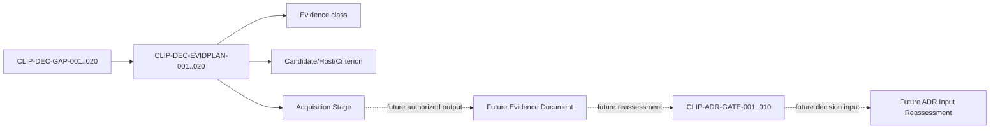

# Clipboard Integration Technology Decision Evidence Acquisition Plan

## Document Control

| Field | Value |
|---|---|
| Document ID | `RESEARCH-TECH-CLIPBOARD-017` |
| Title | Clipboard Integration Technology Decision Evidence Acquisition Plan |
| Status | Draft |
| Research Type | Technology Decision Evidence Acquisition Plan |
| Technology Decision | `TD-004 Clipboard Integration` |
| Parent Decision Input Baseline | `RESEARCH-TECH-CLIPBOARD-016` |
| Parent Traceability Index | `RESEARCH-TECH-CLIPBOARD-015` |
| Covered Decision Gaps | `CLIP-DEC-GAP-001..020` |
| Covered Decision Criteria | `CLIP-DEC-CRIT-001..012` |
| Covered ADR Gates | `CLIP-ADR-GATE-001..010` |
| Evidence Acquisition Execution | Not started |
| Candidate Ranking | Not performed |
| Candidate Selection | Not performed |
| Technology Recommendation | Not made |
| Clipboard Technology Decision | Not made |
| Clipboard ADR | Not created |
| Authorization Request | Not created |
| Human Authorization Decision | Not made |
| Local/Package Cache Inspection | Not performed |
| Project/Restore/Build | Not performed |
| Clipboard Read/Write/Clear | Not performed |
| Runtime/Consumer Verification | Not performed |
| Evidence Persistence | Not performed |
| Owner | TBD |
| Last reviewed | Not reviewed |

## 1. Purpose

This document maps each `CLIP-DEC-GAP-001..020` to the evidence classes, prerequisite documents, operation boundaries, authority dependencies, future outputs, and stop conditions needed for a later Clipboard technology comparison and ADR input reassessment.

This is an Evidence Acquisition Plan. It is not evidence-acquisition execution, a candidate comparison result, candidate ranking, technology recommendation, Clipboard Technology Decision, Clipboard ADR, authorization request, inspection execution, project operation, build operation, runtime operation, or feature implementation.

## 2. Source Preservation

The plan preserves the following identifiers and does not change their status:

- `CLIP-OPT-001..005`
- `CLIP-PAIR-001..010`
- `CLIP-DEC-CRIT-001..012`
- `CLIP-DEC-GAP-001..020`
- `CLIP-ADR-GATE-001..010`
- `CLIP-INSPECT-001..017`
- `CLIP-LOCAL-OBS-001..017`
- `CLIP-LOCAL-EVID-001..017`
- `C-LI1..C-LI3`

The plan does not modify Decision Gaps, Decision Criteria, ADR Gate state, upstream research, candidates, or evidence availability. No not-yet-acquired evidence is marked available. No contradiction was identified, so no `CLIP-DEC-EVIDPLAN-GAP-*` identifier is created.

## 3. Controlled Vocabulary

### Evidence Route

Only these values are valid:

- Existing static evidence reuse
- Additional official evidence
- Read-only local inspection
- Package Cache inspection
- Experimental project specification
- Experimental project creation
- Package acquisition
- Restore
- Build
- Clipboard publication runtime
- Format enumeration runtime
- Consumer interoperability runtime
- Pixel/Alpha comparison
- Process lifetime observation
- Contention/retry observation
- History/Cloud observation
- Persistent evidence
- Separate human decision
- Deferred Phase L2
- Deferred Phase L3

### Plan Item Status

Only these values are valid:

- Planned
- Partially planned
- Blocked
- Deferred
- Not applicable

### Evidence Availability

Only these values are valid:

- Available
- Partially available
- Not available
- Conflicting
- Not applicable

### Decision Effect

Only these values are valid:

- Required for minimum comparison
- Required for final decision
- Supports comparison
- Deferred validation
- No direct decision effect

No plan status implies selection, approval, completion, runtime verification, or execution permission.

## 4. Decision Gap Evidence-plan Binding

The binding is exactly one-to-one. A plan item may contain multiple stages, but each item has one primary route and preserves the identity of its source gap.

| Evidence Plan Item ID | Source Decision Gap | Primary route | Minimum phase | Status |
|---|---|---|---|---|
| `CLIP-DEC-EVIDPLAN-001` | `CLIP-DEC-GAP-001` | Read-only local inspection | L1 | Planned |
| `CLIP-DEC-EVIDPLAN-002` | `CLIP-DEC-GAP-002` | Package Cache inspection | L1 | Planned |
| `CLIP-DEC-EVIDPLAN-003` | `CLIP-DEC-GAP-003` | Read-only local inspection | L1 | Planned |
| `CLIP-DEC-EVIDPLAN-004` | `CLIP-DEC-GAP-004` | Clipboard publication runtime | L1 | Planned |
| `CLIP-DEC-EVIDPLAN-005` | `CLIP-DEC-GAP-005` | Process lifetime observation | L1 | Planned |
| `CLIP-DEC-EVIDPLAN-006` | `CLIP-DEC-GAP-006` | Pixel/Alpha comparison | L1 | Planned |
| `CLIP-DEC-EVIDPLAN-007` | `CLIP-DEC-GAP-007` | Contention/retry observation | L1 | Planned |
| `CLIP-DEC-EVIDPLAN-008` | `CLIP-DEC-GAP-008` | Process lifetime observation | L1 | Planned |
| `CLIP-DEC-EVIDPLAN-009` | `CLIP-DEC-GAP-009` | Read-only local inspection | L2/L3 | Deferred |
| `CLIP-DEC-EVIDPLAN-010` | `CLIP-DEC-GAP-010` | Read-only local inspection | L1 | Planned |
| `CLIP-DEC-EVIDPLAN-011` | `CLIP-DEC-GAP-011` | Read-only local inspection | L1 | Planned |
| `CLIP-DEC-EVIDPLAN-012` | `CLIP-DEC-GAP-012` | Experimental project specification | L1 | Planned |
| `CLIP-DEC-EVIDPLAN-013` | `CLIP-DEC-GAP-013` | Read-only local inspection | L1 | Planned |
| `CLIP-DEC-EVIDPLAN-014` | `CLIP-DEC-GAP-014` | Clipboard publication runtime | L1 | Planned |
| `CLIP-DEC-EVIDPLAN-015` | `CLIP-DEC-GAP-015` | Experimental project specification | L1 | Planned |
| `CLIP-DEC-EVIDPLAN-016` | `CLIP-DEC-GAP-016` | Clipboard publication runtime | L1 | Planned |
| `CLIP-DEC-EVIDPLAN-017` | `CLIP-DEC-GAP-017` | Read-only local inspection | L1 | Planned |
| `CLIP-DEC-EVIDPLAN-018` | `CLIP-DEC-GAP-018` | Persistent evidence | L1 | Planned |
| `CLIP-DEC-EVIDPLAN-019` | `CLIP-DEC-GAP-019` | Deferred Phase L2 | L2/L3 | Deferred |
| `CLIP-DEC-EVIDPLAN-020` | `CLIP-DEC-GAP-020` | Deferred Phase L3 | L2/L3 | Deferred |

No binding closes a Decision Gap. No twenty-first plan item is created.

## 5. Evidence-plan Items

Every item below contains the fixed field set required for future evidence planning. Values describe future scope only; they do not claim that the operation or evidence exists.

### `CLIP-DEC-EVIDPLAN-001`

| Field | Value |
|---|---|
| Evidence Plan Item ID | `CLIP-DEC-EVIDPLAN-001` |
| Source Decision Gap | `CLIP-DEC-GAP-001` |
| Related Candidate | `CLIP-OPT-001..005` |
| Related Host | WPF; WinUI 3 |
| Related Pair | `CLIP-PAIR-001..010` |
| Related Decision Criteria | `CLIP-DEC-CRIT-001` |
| Related ADR Gates | `CLIP-ADR-GATE-001`, `CLIP-ADR-GATE-002` |
| Existing evidence | `RESEARCH-TECH-CLIPBOARD-006`; `RESEARCH-TECH-CLIPBOARD-010` |
| Existing evidence limitation | Official evidence and a plan do not identify the local host activation state |
| Missing decision information | Verified WPF and WinUI 3 host activation identity |
| Primary evidence route | Read-only local inspection |
| Secondary evidence route | Experimental project specification |
| Decision effect | Required for minimum comparison |
| Minimum phase | L1 |
| Prerequisite documents | `RESEARCH-TECH-CLIPBOARD-010`; `RESEARCH-TECH-CLIPBOARD-014` |
| Required future authorization class | Read-only Local Inspection Authorization Request |
| Shared UI authority dependency | OS/architecture, .NET/SDK, Visual Studio/Build Tools, WPF/WinUI asset inspection |
| Clipboard-specific authority dependency | None for the read-only host identity observation |
| Local inspection requirement | Yes; read-only, standard-user, no-network, no-mutation |
| Package Cache requirement | Not applicable |
| Experimental Project requirement | No; specification only |
| Package acquisition requirement | No |
| Restore requirement | No |
| Build requirement | No |
| Clipboard Read requirement | No |
| Clipboard Write requirement | No |
| Clipboard Clear requirement | No |
| Runtime requirement | No |
| Consumer requirement | No |
| Pixel/Alpha requirement | No |
| Process lifetime requirement | No |
| Contention requirement | No |
| History/Cloud requirement | No |
| Persistent Evidence requirement | No; future observation may be recorded separately |
| Isolation requirement | Read-only local scope only |
| Synthetic Image requirement | No |
| Privacy requirement | Do not access private Clipboard payloads or image bytes |
| Cleanup requirement | No local mutation or output |
| Stop conditions | Any request for mutation, network, Clipboard access, or unauthorized host scope |
| Expected session observation | Future host/prerequisite observation record |
| Expected persistent evidence | None in this plan |
| Success interpretation | Future observation identifies the scoped host prerequisites without mutation |
| Not-observed interpretation | Gap remains open; no host conclusion is formed |
| Failure interpretation | Record bounded inspection failure; do not change upstream status |
| Evidence sufficiency rule | Static identity plus authorized local observation; build/runtime remain separate |
| Candidate comparison effect | Enables host-specific comparison input only |
| ADR Gate effect | Supplies input to `CLIP-ADR-GATE-001` and `CLIP-ADR-GATE-002` |
| Current authorization | Not granted |
| Execution permitted | No |
| Owner | TBD |
| Status | Planned |
| Open questions | Exact local host activation state is unverified |

### `CLIP-DEC-EVIDPLAN-002`

| Field | Value |
|---|---|
| Evidence Plan Item ID | `CLIP-DEC-EVIDPLAN-002` |
| Source Decision Gap | `CLIP-DEC-GAP-002` |
| Related Candidate | `CLIP-OPT-001..005` |
| Related Host | WPF; WinUI 3 |
| Related Pair | `CLIP-PAIR-001..010` |
| Related Decision Criteria | `CLIP-DEC-CRIT-002` |
| Related ADR Gates | `CLIP-ADR-GATE-004`, `CLIP-ADR-GATE-005`, `CLIP-ADR-GATE-006` |
| Existing evidence | `RESEARCH-TECH-CLIPBOARD-006`; `RESEARCH-TECH-CLIPBOARD-010` |
| Existing evidence limitation | Official API identity does not prove local reference or package resolution |
| Missing decision information | Local reference/package metadata and availability |
| Primary evidence route | Package Cache inspection |
| Secondary evidence route | Read-only local inspection |
| Decision effect | Required for minimum comparison |
| Minimum phase | L1 |
| Prerequisite documents | `RESEARCH-TECH-CLIPBOARD-010`; `RESEARCH-TECH-CLIPBOARD-014` |
| Required future authorization class | Read-only Local Inspection Authorization Request |
| Shared UI authority dependency | Package Cache and repository metadata inspection |
| Clipboard-specific authority dependency | None for metadata only |
| Local inspection requirement | Yes; read-only and no-network |
| Package Cache requirement | Yes; read-only metadata only |
| Experimental Project requirement | No; specification only |
| Package acquisition requirement | No |
| Restore requirement | No |
| Build requirement | No |
| Clipboard Read requirement | No |
| Clipboard Write requirement | No |
| Clipboard Clear requirement | No |
| Runtime requirement | No |
| Consumer requirement | No |
| Pixel/Alpha requirement | No |
| Process lifetime requirement | No |
| Contention requirement | No |
| History/Cloud requirement | No |
| Persistent Evidence requirement | No |
| Isolation requirement | Package metadata scope only |
| Synthetic Image requirement | No |
| Privacy requirement | Do not inspect credentials, secrets, or private payloads |
| Cleanup requirement | No cache or repository mutation |
| Stop conditions | Missing scope, network requirement, package mutation, or secret exposure |
| Expected session observation | Future package/reference metadata observation |
| Expected persistent evidence | None in this plan |
| Success interpretation | Future metadata is attributable and bounded |
| Not-observed interpretation | Gap remains open; no build claim |
| Failure interpretation | Record metadata inspection limitation; no upstream mutation |
| Evidence sufficiency rule | Metadata is not restore/build/runtime evidence |
| Candidate comparison effect | Clarifies future reference-resolution work |
| ADR Gate effect | Supplies input to Gates 004-006 |
| Current authorization | Not granted |
| Execution permitted | No |
| Owner | TBD |
| Status | Planned |
| Open questions | Exact local cache/reference state is unverified |

### `CLIP-DEC-EVIDPLAN-003`

| Field | Value |
|---|---|
| Evidence Plan Item ID | `CLIP-DEC-EVIDPLAN-003` |
| Source Decision Gap | `CLIP-DEC-GAP-003` |
| Related Candidate | `CLIP-OPT-001..005` |
| Related Host | WPF; WinUI 3 |
| Related Pair | `CLIP-PAIR-001..010` |
| Related Decision Criteria | `CLIP-DEC-CRIT-003` |
| Related ADR Gates | `CLIP-ADR-GATE-002`, `CLIP-ADR-GATE-007` |
| Existing evidence | `RESEARCH-TECH-CLIPBOARD-003`; `Architecture/ARCH-0002-layer-model.md` |
| Existing evidence limitation | Threading rules are documented but not locally or behaviorally observed |
| Missing decision information | STA/COM/Dispatcher behavior for each host route |
| Primary evidence route | Read-only local inspection |
| Secondary evidence route | Clipboard publication runtime |
| Decision effect | Required for minimum comparison |
| Minimum phase | L1 |
| Prerequisite documents | `RESEARCH-TECH-CLIPBOARD-010`; future isolated scope specification |
| Required future authorization class | Read-only Local Inspection Authorization Request, then separate Clipboard Runtime Authorization Request |
| Shared UI authority dependency | OS/architecture, .NET/SDK, WPF/WinUI asset inspection |
| Clipboard-specific authority dependency | Separate Clipboard Write authority for runtime only |
| Local inspection requirement | Yes |
| Package Cache requirement | Maybe, only if static metadata is missing; no mutation |
| Experimental Project requirement | Yes, only in a separately authorized future scope |
| Package acquisition requirement | No unless explicitly scoped later |
| Restore requirement | Yes, only in a separate build scope |
| Build requirement | Yes, only in a separate build scope |
| Clipboard Read requirement | No for the minimum thread proof |
| Clipboard Write requirement | Yes for runtime proof only |
| Clipboard Clear requirement | No; separate operation |
| Runtime requirement | Yes, future isolated observation |
| Consumer requirement | No for basic thread proof |
| Pixel/Alpha requirement | No |
| Process lifetime requirement | No for the first thread proof |
| Contention requirement | No |
| History/Cloud requirement | No |
| Persistent Evidence requirement | No automatic persistence |
| Isolation requirement | Isolated host/thread scope |
| Synthetic Image requirement | Yes for future runtime only |
| Privacy requirement | No private Clipboard input |
| Cleanup requirement | Explicit future cleanup scope |
| Stop conditions | STA/COM ambiguity, unbounded host access, or any unscheduled Clipboard operation |
| Expected session observation | Thread/dispatcher and bounded failure observation |
| Expected persistent evidence | None unless separately authorized |
| Success interpretation | Future observation shows the required thread model can be isolated |
| Not-observed interpretation | Thread gap remains open |
| Failure interpretation | Route remains unresolved; no candidate exclusion |
| Evidence sufficiency rule | Local/static evidence cannot substitute for runtime thread behavior |
| Candidate comparison effect | Adds thread-model evidence to the matrix |
| ADR Gate effect | Supplies Gates 002 and 007 |
| Current authorization | Not granted |
| Execution permitted | No |
| Owner | TBD |
| Status | Planned |
| Open questions | Exact STA/COM/Dispatcher behavior remains unknown |

### `CLIP-DEC-EVIDPLAN-004`

| Field | Value |
|---|---|
| Evidence Plan Item ID | `CLIP-DEC-EVIDPLAN-004` |
| Source Decision Gap | `CLIP-DEC-GAP-004` |
| Related Candidate | `CLIP-OPT-001..005` |
| Related Host | WPF; WinUI 3 |
| Related Pair | `CLIP-PAIR-001..010` |
| Related Decision Criteria | `CLIP-DEC-CRIT-004` |
| Related ADR Gates | `CLIP-ADR-GATE-007`, `CLIP-ADR-GATE-008` |
| Existing evidence | `Specs/SPEC-0007-clipboard-handoff.md`; `RESEARCH-TECH-CLIPBOARD-002` |
| Existing evidence limitation | Format requirements and runtime publication are not the same evidence |
| Missing decision information | Minimum format publication and read behavior |
| Primary evidence route | Clipboard publication runtime |
| Secondary evidence route | Format enumeration runtime |
| Decision effect | Required for minimum comparison |
| Minimum phase | L1 |
| Prerequisite documents | Future experimental project scope specification; future build evidence |
| Required future authorization class | Clipboard Runtime Authorization Request |
| Shared UI authority dependency | Host activation and build prerequisites must be separately available |
| Clipboard-specific authority dependency | Clipboard Write; Clipboard Read only in a separately scoped read step |
| Local inspection requirement | Yes, before project/runtime scope is fixed |
| Package Cache requirement | As separately authorized prerequisite only |
| Experimental Project requirement | Yes, future isolated project |
| Package acquisition requirement | Only if separately authorized and needed |
| Restore requirement | Yes, separate operation |
| Build requirement | Yes, separate operation |
| Clipboard Read requirement | Separate; not implied by Write |
| Clipboard Write requirement | Yes, future runtime scope |
| Clipboard Clear requirement | No; separate operation |
| Runtime requirement | Yes |
| Consumer requirement | Yes for minimum consumer read |
| Pixel/Alpha requirement | Future consumer-specific step |
| Process lifetime requirement | No for minimum publication |
| Contention requirement | No for first publication |
| History/Cloud requirement | Bounded observation only if separately authorized |
| Persistent Evidence requirement | Separate evidence authority only |
| Isolation requirement | Synthetic payload and isolated Clipboard scope |
| Synthetic Image requirement | Yes |
| Privacy requirement | No private Clipboard data |
| Cleanup requirement | Explicitly bounded future cleanup |
| Stop conditions | Any attempt to read/clear without separate authority or any private payload access |
| Expected session observation | Published minimum format and bounded result |
| Expected persistent evidence | None by default |
| Success interpretation | Future runtime result meets the minimum format question |
| Not-observed interpretation | Format gap remains open |
| Failure interpretation | Record publication failure; do not restart Capture/Rendering |
| Evidence sufficiency rule | Publication does not prove consumer fidelity |
| Candidate comparison effect | Provides minimum format route data |
| ADR Gate effect | Supplies Gates 007 and 008 |
| Current authorization | Not granted |
| Execution permitted | No |
| Owner | TBD |
| Status | Planned |
| Open questions | Minimum target formats and consumers require future scope confirmation |

### `CLIP-DEC-EVIDPLAN-005`

| Field | Value |
|---|---|
| Evidence Plan Item ID | `CLIP-DEC-EVIDPLAN-005` |
| Source Decision Gap | `CLIP-DEC-GAP-005` |
| Related Candidate | `CLIP-OPT-001..005` |
| Related Host | WPF; WinUI 3 |
| Related Pair | `CLIP-PAIR-001..010` |
| Related Decision Criteria | `CLIP-DEC-CRIT-005` |
| Related ADR Gates | `CLIP-ADR-GATE-007`, `CLIP-ADR-GATE-009` |
| Existing evidence | `RESEARCH-TECH-CLIPBOARD-002` |
| Existing evidence limitation | Planned ownership/lifetime questions have no observation result |
| Missing decision information | Ownership and lifetime behavior after publication |
| Primary evidence route | Process lifetime observation |
| Secondary evidence route | Consumer interoperability runtime |
| Decision effect | Required for minimum comparison |
| Minimum phase | L1 |
| Prerequisite documents | Future project scope, build record, and runtime authority |
| Required future authorization class | Clipboard Runtime Authorization Request |
| Shared UI authority dependency | Host/process observation boundary |
| Clipboard-specific authority dependency | Clipboard Write; consumer read separately scoped |
| Local inspection requirement | Yes, for host/process prerequisites |
| Package Cache requirement | Not applicable to the observation itself |
| Experimental Project requirement | Yes |
| Package acquisition requirement | Only if separately authorized |
| Restore requirement | Yes, separate |
| Build requirement | Yes, separate |
| Clipboard Read requirement | Yes, separate consumer step |
| Clipboard Write requirement | Yes |
| Clipboard Clear requirement | No; separate |
| Runtime requirement | Yes |
| Consumer requirement | Yes |
| Pixel/Alpha requirement | No for lifetime proof |
| Process lifetime requirement | Yes |
| Contention requirement | No for first lifetime proof |
| History/Cloud requirement | No |
| Persistent Evidence requirement | Separate authority only |
| Isolation requirement | Producer/consumer process boundary |
| Synthetic Image requirement | Yes |
| Privacy requirement | Bounded synthetic content only |
| Cleanup requirement | Explicit cleanup after observation |
| Stop conditions | Any attempt to access unbounded user Clipboard or persist payload |
| Expected session observation | Producer return/termination and consumer read result |
| Expected persistent evidence | None by default |
| Success interpretation | Future observation answers the minimum ownership/lifetime question |
| Not-observed interpretation | Lifetime gap remains open |
| Failure interpretation | Record bounded lifetime failure only |
| Evidence sufficiency rule | A plan or static API note does not prove lifetime behavior |
| Candidate comparison effect | Adds ownership/lifetime evidence |
| ADR Gate effect | Supplies Gates 007 and 009 |
| Current authorization | Not granted |
| Execution permitted | No |
| Owner | TBD |
| Status | Planned |
| Open questions | Required termination scenarios remain to be fixed by future scope |

### `CLIP-DEC-EVIDPLAN-006`

| Field | Value |
|---|---|
| Evidence Plan Item ID | `CLIP-DEC-EVIDPLAN-006` |
| Source Decision Gap | `CLIP-DEC-GAP-006` |
| Related Candidate | `CLIP-OPT-001..005` |
| Related Host | WPF; WinUI 3 |
| Related Pair | `CLIP-PAIR-001..010` |
| Related Decision Criteria | `CLIP-DEC-CRIT-006` |
| Related ADR Gates | `CLIP-ADR-GATE-007`, `CLIP-ADR-GATE-008` |
| Existing evidence | `Specs/SPEC-0008-capture-output.md`; `RESEARCH-TECH-CLIPBOARD-001` |
| Existing evidence limitation | Capture output requirements do not prove Clipboard conversion fidelity |
| Missing decision information | Pixel, alpha, and color behavior across publication and consumer read |
| Primary evidence route | Pixel/Alpha comparison |
| Secondary evidence route | Consumer interoperability runtime |
| Decision effect | Required for minimum comparison |
| Minimum phase | L1 |
| Prerequisite documents | Future Synthetic Image specification; future runtime and consumer scopes |
| Required future authorization class | Clipboard Runtime Authorization Request |
| Shared UI authority dependency | Synthetic test asset and consumer host scope |
| Clipboard-specific authority dependency | Clipboard Write and Read in separate authorized steps |
| Local inspection requirement | No private image access; prerequisite inspection may be separate |
| Package Cache requirement | Not applicable to comparison itself |
| Experimental Project requirement | Yes |
| Package acquisition requirement | Only if separately authorized |
| Restore requirement | Yes, separate |
| Build requirement | Yes, separate |
| Clipboard Read requirement | Yes, separate |
| Clipboard Write requirement | Yes |
| Clipboard Clear requirement | No; separate |
| Runtime requirement | Yes |
| Consumer requirement | Yes |
| Pixel/Alpha requirement | Yes |
| Process lifetime requirement | No for initial fidelity |
| Contention requirement | No for initial fidelity |
| History/Cloud requirement | No |
| Persistent Evidence requirement | Separate authority only |
| Isolation requirement | Fixed Synthetic Image and isolated consumer |
| Synthetic Image requirement | Yes |
| Privacy requirement | Synthetic content only; no private image bytes |
| Cleanup requirement | Remove only authorized temporary artifacts |
| Stop conditions | Missing fixed image contract, private data exposure, or unscoped consumer |
| Expected session observation | Bounded output and comparison observations |
| Expected persistent evidence | Separate redacted fidelity record, if authorized |
| Success interpretation | Future comparison answers the defined fidelity questions |
| Not-observed interpretation | Fidelity gap remains open |
| Failure interpretation | Record failure category; no recapture or rerender |
| Evidence sufficiency rule | Consumer result is required for consumer fidelity claims |
| Candidate comparison effect | Adds fidelity evidence without ranking |
| ADR Gate effect | Supplies Gates 007 and 008 |
| Current authorization | Not granted |
| Execution permitted | No |
| Owner | TBD |
| Status | Planned |
| Open questions | Final minimum consumer and format set remains to be fixed |

### `CLIP-DEC-EVIDPLAN-007`

| Field | Value |
|---|---|
| Evidence Plan Item ID | `CLIP-DEC-EVIDPLAN-007` |
| Source Decision Gap | `CLIP-DEC-GAP-007` |
| Related Candidate | `CLIP-OPT-001..005` |
| Related Host | WPF; WinUI 3 |
| Related Pair | `CLIP-PAIR-001..010` |
| Related Decision Criteria | `CLIP-DEC-CRIT-007` |
| Related ADR Gates | `CLIP-ADR-GATE-007`, `CLIP-ADR-GATE-009` |
| Existing evidence | `Specs/SPEC-0006-workflow-boundaries-and-feedback.md` |
| Existing evidence limitation | Failure boundaries are specified but not behaviorally observed |
| Missing decision information | Contention, failure, and bounded retry behavior |
| Primary evidence route | Contention/retry observation |
| Secondary evidence route | Clipboard publication runtime |
| Decision effect | Required for minimum comparison |
| Minimum phase | L1 |
| Prerequisite documents | Future isolated runtime scope; failure observation format |
| Required future authorization class | Clipboard Runtime Authorization Request |
| Shared UI authority dependency | Host activation and workflow boundary only |
| Clipboard-specific authority dependency | Clipboard Write; retry scope explicitly separate |
| Local inspection requirement | Yes for prerequisites only |
| Package Cache requirement | Not applicable to the observation itself |
| Experimental Project requirement | Yes |
| Package acquisition requirement | Only if separately authorized |
| Restore requirement | Yes, separate |
| Build requirement | Yes, separate |
| Clipboard Read requirement | No for the first failure route unless needed by scope |
| Clipboard Write requirement | Yes |
| Clipboard Clear requirement | No |
| Runtime requirement | Yes |
| Consumer requirement | No for basic contention |
| Pixel/Alpha requirement | No |
| Process lifetime requirement | No for basic contention |
| Contention requirement | Yes |
| History/Cloud requirement | No |
| Persistent Evidence requirement | Separate authority only |
| Isolation requirement | Failure must be isolated from Capture/Rendering/File Output |
| Synthetic Image requirement | Yes |
| Privacy requirement | Synthetic content only |
| Cleanup requirement | Explicit cleanup after each future scenario |
| Stop conditions | Cross-component retry, unbounded retry, private content, or workflow mutation |
| Expected session observation | Bounded failure and retry observation |
| Expected persistent evidence | None by default |
| Success interpretation | Future observation confirms the failure boundary can remain local |
| Not-observed interpretation | Failure-boundary gap remains open |
| Failure interpretation | Record failure; do not restart Capture or Rendering |
| Evidence sufficiency rule | Static boundary text cannot prove runtime isolation |
| Candidate comparison effect | Adds failure-boundary evidence |
| ADR Gate effect | Supplies Gates 007 and 009 |
| Current authorization | Not granted |
| Execution permitted | No |
| Owner | TBD |
| Status | Planned |
| Open questions | Retry policy must remain future scope; no count/interval/timeout is fixed here |

### `CLIP-DEC-EVIDPLAN-008`

| Field | Value |
|---|---|
| Evidence Plan Item ID | `CLIP-DEC-EVIDPLAN-008` |
| Source Decision Gap | `CLIP-DEC-GAP-008` |
| Related Candidate | `CLIP-OPT-001..005` |
| Related Host | WPF; WinUI 3 |
| Related Pair | `CLIP-PAIR-001..010` |
| Related Decision Criteria | `CLIP-DEC-CRIT-008` |
| Related ADR Gates | `CLIP-ADR-GATE-007`, `CLIP-ADR-GATE-009` |
| Existing evidence | `RESEARCH-TECH-CLIPBOARD-002`; `Specs/SPEC-0007-clipboard-handoff.md` |
| Existing evidence limitation | Producer termination durability is unobserved |
| Missing decision information | Result availability after producer return or termination |
| Primary evidence route | Process lifetime observation |
| Secondary evidence route | Consumer interoperability runtime |
| Decision effect | Required for minimum comparison |
| Minimum phase | L1 |
| Prerequisite documents | Future isolated project and lifecycle observation scope |
| Required future authorization class | Clipboard Runtime Authorization Request |
| Shared UI authority dependency | Process and host lifecycle boundary |
| Clipboard-specific authority dependency | Clipboard Write and separately scoped Read |
| Local inspection requirement | Yes for host/process prerequisites |
| Package Cache requirement | Not applicable to lifecycle observation |
| Experimental Project requirement | Yes |
| Package acquisition requirement | Only if separately authorized |
| Restore requirement | Yes, separate |
| Build requirement | Yes, separate |
| Clipboard Read requirement | Yes, separate consumer read |
| Clipboard Write requirement | Yes |
| Clipboard Clear requirement | No |
| Runtime requirement | Yes |
| Consumer requirement | Yes |
| Pixel/Alpha requirement | No |
| Process lifetime requirement | Yes |
| Contention requirement | No for initial lifetime proof |
| History/Cloud requirement | No |
| Persistent Evidence requirement | Separate authority only |
| Isolation requirement | Producer and consumer separated |
| Synthetic Image requirement | Yes |
| Privacy requirement | Synthetic content only |
| Cleanup requirement | Explicit future cleanup |
| Stop conditions | Private payload, unbounded process control, or cross-component workflow change |
| Expected session observation | Producer return/termination followed by consumer read |
| Expected persistent evidence | None by default |
| Success interpretation | Future lifecycle observation answers the minimum durability question |
| Not-observed interpretation | Durability gap remains open |
| Failure interpretation | Record lifecycle failure only |
| Evidence sufficiency rule | A successful publication before termination does not prove post-termination behavior |
| Candidate comparison effect | Adds producer-lifetime evidence |
| ADR Gate effect | Supplies Gates 007 and 009 |
| Current authorization | Not granted |
| Execution permitted | No |
| Owner | TBD |
| Status | Planned |
| Open questions | Abnormal termination remains a deferred scope |

### `CLIP-DEC-EVIDPLAN-009`

| Field | Value |
|---|---|
| Evidence Plan Item ID | `CLIP-DEC-EVIDPLAN-009` |
| Source Decision Gap | `CLIP-DEC-GAP-009` |
| Related Candidate | `CLIP-OPT-001..005` |
| Related Host | WPF; WinUI 3 |
| Related Pair | `CLIP-PAIR-001..010` |
| Related Decision Criteria | `CLIP-DEC-CRIT-009` |
| Related ADR Gates | `CLIP-ADR-GATE-002`, `CLIP-ADR-GATE-005`, `CLIP-ADR-GATE-006` |
| Existing evidence | `RESEARCH-TECH-CLIPBOARD-006`; `RESEARCH-TECH-CLIPBOARD-010` |
| Existing evidence limitation | Packaged/unpackaged rules are not local context evidence |
| Missing decision information | Target-context availability and activation differences |
| Primary evidence route | Read-only local inspection |
| Secondary evidence route | Deferred Phase L2 |
| Decision effect | Deferred validation |
| Minimum phase | L2/L3 |
| Prerequisite documents | Future context-specific inspection request and scope specification |
| Required future authorization class | Read-only Local Inspection Authorization Request |
| Shared UI authority dependency | OS/architecture, host assets, package metadata |
| Clipboard-specific authority dependency | None for static/local context observation |
| Local inspection requirement | Yes, future authorized scope |
| Package Cache requirement | Maybe, read-only |
| Experimental Project requirement | Future context-specific specification |
| Package acquisition requirement | No in this planning stage |
| Restore requirement | Future separate scope |
| Build requirement | Future separate scope |
| Clipboard Read requirement | No |
| Clipboard Write requirement | No |
| Clipboard Clear requirement | No |
| Runtime requirement | Deferred context runtime |
| Consumer requirement | Only if packaging changes consumer behavior |
| Pixel/Alpha requirement | No |
| Process lifetime requirement | No |
| Contention requirement | No |
| History/Cloud requirement | Bounded context observation only |
| Persistent Evidence requirement | Separate authority only |
| Isolation requirement | Context-specific and no-network |
| Synthetic Image requirement | No for local prerequisite observation |
| Privacy requirement | No private payload or cloud mutation |
| Cleanup requirement | No local mutation |
| Stop conditions | Context ambiguity or request for package/deployment mutation |
| Expected session observation | Packaged/unpackaged prerequisite observation |
| Expected persistent evidence | None by default |
| Success interpretation | Future context differences are documented for later comparison |
| Not-observed interpretation | Gap remains deferred |
| Failure interpretation | Keep gap deferred; do not infer exclusion |
| Evidence sufficiency rule | Static documentation does not prove local context behavior |
| Candidate comparison effect | Supports later host-context comparison |
| ADR Gate effect | Supplies Gates 002, 005, and 006 |
| Current authorization | Not granted |
| Execution permitted | No |
| Owner | TBD |
| Status | Deferred |
| Open questions | Exact packaged/unpackaged target scope is not fixed |

### `CLIP-DEC-EVIDPLAN-010`

| Field | Value |
|---|---|
| Evidence Plan Item ID | `CLIP-DEC-EVIDPLAN-010` |
| Source Decision Gap | `CLIP-DEC-GAP-010` |
| Related Candidate | `CLIP-OPT-001..005` |
| Related Host | WPF; WinUI 3 |
| Related Pair | `CLIP-PAIR-001..010` |
| Related Decision Criteria | `CLIP-DEC-CRIT-010` |
| Related ADR Gates | `CLIP-ADR-GATE-009` |
| Existing evidence | `PRD/PRD-0006-non-functional-requirements.md`; `RESEARCH-TECH-CLIPBOARD-014` |
| Existing evidence limitation | Privacy requirement exists without authorized local/runtime observation |
| Missing decision information | History/cloud/cleanup boundary for each route |
| Primary evidence route | Read-only local inspection |
| Secondary evidence route | History/Cloud observation |
| Decision effect | Required for final decision |
| Minimum phase | L1 |
| Prerequisite documents | Future privacy-bounded inspection and runtime scopes |
| Required future authorization class | Read-only Local Inspection Authorization Request, then separate runtime authority |
| Shared UI authority dependency | Repository metadata and local configuration boundary |
| Clipboard-specific authority dependency | Explicit history/cloud observation authority, if required |
| Local inspection requirement | Yes; no private payload access |
| Package Cache requirement | Not applicable |
| Experimental Project requirement | Future isolated project only |
| Package acquisition requirement | No in this plan |
| Restore requirement | Future separate scope |
| Build requirement | Future separate scope |
| Clipboard Read requirement | No private read; only a separately authorized synthetic scope |
| Clipboard Write requirement | Future synthetic publication only |
| Clipboard Clear requirement | Separate, not implied |
| Runtime requirement | Yes for behavior claims |
| Consumer requirement | No for basic privacy boundary |
| Pixel/Alpha requirement | No |
| Process lifetime requirement | No for initial privacy proof |
| Contention requirement | No |
| History/Cloud requirement | Yes, bounded if separately authorized |
| Persistent Evidence requirement | Separate redacted evidence authority |
| Isolation requirement | No-network, synthetic-only, redacted output |
| Synthetic Image requirement | Yes for any future runtime publication |
| Privacy requirement | No private Clipboard payloads or image bytes |
| Cleanup requirement | Explicit cleanup/history boundary |
| Stop conditions | Any private payload, cloud mutation, credential access, or unbounded persistence |
| Expected session observation | Bounded privacy/history/cleanup observation |
| Expected persistent evidence | Redacted privacy record only if separately authorized |
| Success interpretation | Future evidence shows the required privacy boundary is observable and bounded |
| Not-observed interpretation | Privacy gap remains open |
| Failure interpretation | Stop the scoped activity; no candidate exclusion without direct evidence |
| Evidence sufficiency rule | Requirement text cannot prove runtime privacy behavior |
| Candidate comparison effect | Supplies privacy comparison input |
| ADR Gate effect | Supplies Gate 009 |
| Current authorization | Not granted |
| Execution permitted | No |
| Owner | TBD |
| Status | Planned |
| Open questions | Exact history/cloud behavior must be scoped before any future request |

### `CLIP-DEC-EVIDPLAN-011`

| Field | Value |
|---|---|
| Evidence Plan Item ID | `CLIP-DEC-EVIDPLAN-011` |
| Source Decision Gap | `CLIP-DEC-GAP-011` |
| Related Candidate | `CLIP-OPT-001..005` |
| Related Host | WPF; WinUI 3 |
| Related Pair | `CLIP-PAIR-001..010` |
| Related Decision Criteria | `CLIP-DEC-CRIT-011` |
| Related ADR Gates | `CLIP-ADR-GATE-004`, `CLIP-ADR-GATE-005`, `CLIP-ADR-GATE-006` |
| Existing evidence | `RESEARCH-TECH-CLIPBOARD-010`; `RESEARCH-TECH-CLIPBOARD-013` |
| Existing evidence limitation | Documentary isolation controls have no session observation or evidence artifact |
| Missing decision information | Evidence quality under isolated execution boundaries |
| Primary evidence route | Read-only local inspection |
| Secondary evidence route | Experimental project specification |
| Decision effect | Required for minimum comparison |
| Minimum phase | L1 |
| Prerequisite documents | `RESEARCH-TECH-CLIPBOARD-010`; future observation and evidence schemas |
| Required future authorization class | Read-only Local Inspection Authorization Request |
| Shared UI authority dependency | All shared prerequisite observations in the approved scope |
| Clipboard-specific authority dependency | None for inspection; later runtime authority is separate |
| Local inspection requirement | Yes |
| Package Cache requirement | Maybe, read-only |
| Experimental Project requirement | Future specification only |
| Package acquisition requirement | No |
| Restore requirement | No |
| Build requirement | No |
| Clipboard Read requirement | No |
| Clipboard Write requirement | No |
| Clipboard Clear requirement | No |
| Runtime requirement | Future, separately authorized |
| Consumer requirement | No for isolation baseline |
| Pixel/Alpha requirement | No |
| Process lifetime requirement | No |
| Contention requirement | No |
| History/Cloud requirement | No |
| Persistent Evidence requirement | Separate authority; not automatic |
| Isolation requirement | Yes; no-network/no-mutation/no-output inspection boundary |
| Synthetic Image requirement | Future runtime only |
| Privacy requirement | No private data |
| Cleanup requirement | No mutation; future temporary scope must define cleanup |
| Stop conditions | Any output, mutation, network, Clipboard access, or missing boundary |
| Expected session observation | Future inspection and scope observation |
| Expected persistent evidence | None in this plan |
| Success interpretation | Future scope is attributable, isolated, and redaction-safe |
| Not-observed interpretation | Evidence-quality gap remains open |
| Failure interpretation | Preserve gap and stop the affected scope |
| Evidence sufficiency rule | Documentary controls do not equal an observation record |
| Candidate comparison effect | Supports evidence-quality comparison |
| ADR Gate effect | Supplies Gates 004-006 |
| Current authorization | Not granted |
| Execution permitted | No |
| Owner | TBD |
| Status | Planned |
| Open questions | Final evidence schema and authority artifact remain future work |

### `CLIP-DEC-EVIDPLAN-012`

| Field | Value |
|---|---|
| Evidence Plan Item ID | `CLIP-DEC-EVIDPLAN-012` |
| Source Decision Gap | `CLIP-DEC-GAP-012` |
| Related Candidate | `CLIP-OPT-001..005` |
| Related Host | WPF; WinUI 3 |
| Related Pair | `CLIP-PAIR-001..010` |
| Related Decision Criteria | `CLIP-DEC-CRIT-012` |
| Related ADR Gates | `CLIP-ADR-GATE-003`, `CLIP-ADR-GATE-006`, `CLIP-ADR-GATE-010` |
| Existing evidence | `Architecture/ARCH-0004-component-boundaries.md`; `Specs/SPEC-0006-workflow-boundaries-and-feedback.md` |
| Existing evidence limitation | Static responsibility boundaries do not prove an isolated implementation boundary |
| Missing decision information | Candidate/host implementation fit without Shared Workflow State mutation |
| Primary evidence route | Experimental project specification |
| Secondary evidence route | Build |
| Decision effect | Required for final decision |
| Minimum phase | L1 |
| Prerequisite documents | Frozen Architecture boundary; future isolated project scope |
| Required future authorization class | Experimental Project Scope Specification |
| Shared UI authority dependency | Host and workflow ownership boundary |
| Clipboard-specific authority dependency | Clipboard publication authority only in later runtime scope |
| Local inspection requirement | Yes, before project scope confirmation |
| Package Cache requirement | Future read-only prerequisite only |
| Experimental Project requirement | Future, separately authorized |
| Package acquisition requirement | Separate if required |
| Restore requirement | Separate |
| Build requirement | Separate |
| Clipboard Read requirement | No for boundary specification |
| Clipboard Write requirement | No for boundary specification |
| Clipboard Clear requirement | No |
| Runtime requirement | Future isolated runtime only |
| Consumer requirement | No for static boundary |
| Pixel/Alpha requirement | No |
| Process lifetime requirement | No |
| Contention requirement | No |
| History/Cloud requirement | No |
| Persistent Evidence requirement | Separate authority only |
| Isolation requirement | Clipboard must remain independent of Capture/Rendering/File Output |
| Synthetic Image requirement | Future runtime only |
| Privacy requirement | No private data |
| Cleanup requirement | Future project/output scope must define cleanup |
| Stop conditions | Any workflow advancement, shared state mutation, or source-line change |
| Expected session observation | Future component-boundary observation |
| Expected persistent evidence | None in this plan |
| Success interpretation | Future scoped evidence preserves frozen component boundaries |
| Not-observed interpretation | Boundary gap remains open |
| Failure interpretation | Stop the isolated scope; no workflow recovery action |
| Evidence sufficiency rule | Architecture documentation remains distinct from implementation evidence |
| Candidate comparison effect | Supports architecture-boundary comparison |
| ADR Gate effect | Supplies Gates 003, 006, and 010 |
| Current authorization | Not granted |
| Execution permitted | No |
| Owner | TBD |
| Status | Planned |
| Open questions | Exact future project boundary is not yet authorized |

### `CLIP-DEC-EVIDPLAN-013`

| Field | Value |
|---|---|
| Evidence Plan Item ID | `CLIP-DEC-EVIDPLAN-013` |
| Source Decision Gap | `CLIP-DEC-GAP-013` |
| Related Candidate | `CLIP-OPT-001..005` |
| Related Host | WPF; WinUI 3 |
| Related Pair | `CLIP-PAIR-001..010` |
| Related Decision Criteria | `CLIP-DEC-CRIT-001`, `CLIP-DEC-CRIT-002` |
| Related ADR Gates | `CLIP-ADR-GATE-001`, `CLIP-ADR-GATE-002` |
| Existing evidence | `RESEARCH-TECH-CLIPBOARD-015` |
| Existing evidence limitation | Pair index is documentary and does not verify invocation routes locally |
| Missing decision information | Pair-specific route and host identity |
| Primary evidence route | Read-only local inspection |
| Secondary evidence route | Experimental project specification |
| Decision effect | Required for minimum comparison |
| Minimum phase | L1 |
| Prerequisite documents | `RESEARCH-TECH-CLIPBOARD-010`; candidate/host matrix |
| Required future authorization class | Read-only Local Inspection Authorization Request |
| Shared UI authority dependency | WPF/WinUI asset and repository metadata inspection |
| Clipboard-specific authority dependency | None for static route mapping |
| Local inspection requirement | Yes |
| Package Cache requirement | Maybe, read-only |
| Experimental Project requirement | Future specification only |
| Package acquisition requirement | No |
| Restore requirement | No |
| Build requirement | Future separate scope |
| Clipboard Read requirement | No |
| Clipboard Write requirement | No |
| Clipboard Clear requirement | No |
| Runtime requirement | Future separate scope |
| Consumer requirement | No |
| Pixel/Alpha requirement | No |
| Process lifetime requirement | No |
| Contention requirement | No |
| History/Cloud requirement | No |
| Persistent Evidence requirement | No |
| Isolation requirement | Pair identity only |
| Synthetic Image requirement | No |
| Privacy requirement | No private data |
| Cleanup requirement | No mutation |
| Stop conditions | Any pair ranking, exclusion, or host mutation |
| Expected session observation | Future pair-specific route observation |
| Expected persistent evidence | None in this plan |
| Success interpretation | Pair identity and route are attributable |
| Not-observed interpretation | Pair gap remains open |
| Failure interpretation | Keep pair neutral; do not infer selection effect |
| Evidence sufficiency rule | A pair row does not prove local/build/runtime behavior |
| Candidate comparison effect | Supplies pair-specific input only |
| ADR Gate effect | Supplies Gates 001 and 002 |
| Current authorization | Not granted |
| Execution permitted | No |
| Owner | TBD |
| Status | Planned |
| Open questions | Exact local pair route remains unverified |

### `CLIP-DEC-EVIDPLAN-014`

| Field | Value |
|---|---|
| Evidence Plan Item ID | `CLIP-DEC-EVIDPLAN-014` |
| Source Decision Gap | `CLIP-DEC-GAP-014` |
| Related Candidate | `CLIP-OPT-001..005` |
| Related Host | WPF; WinUI 3 |
| Related Pair | `CLIP-PAIR-001..010` |
| Related Decision Criteria | `CLIP-DEC-CRIT-004`, `CLIP-DEC-CRIT-007` |
| Related ADR Gates | `CLIP-ADR-GATE-007`, `CLIP-ADR-GATE-008` |
| Existing evidence | `RESEARCH-TECH-CLIPBOARD-014` |
| Existing evidence limitation | Read/Write/Clear separation is a boundary statement, not executed evidence |
| Missing decision information | Independent operation behavior and authority scope |
| Primary evidence route | Clipboard publication runtime |
| Secondary evidence route | Format enumeration runtime |
| Decision effect | Required for minimum comparison |
| Minimum phase | L1 |
| Prerequisite documents | Future runtime authority request and operation-specific scope |
| Required future authorization class | Clipboard Runtime Authorization Request |
| Shared UI authority dependency | Host runtime context, separately assessed |
| Clipboard-specific authority dependency | Clipboard Write; Read and Clear separately requested |
| Local inspection requirement | Prerequisite only |
| Package Cache requirement | Not applicable to operation separation |
| Experimental Project requirement | Yes, future isolated project |
| Package acquisition requirement | Separate if required |
| Restore requirement | Separate |
| Build requirement | Separate |
| Clipboard Read requirement | Separate future operation |
| Clipboard Write requirement | Separate future operation |
| Clipboard Clear requirement | Separate future operation |
| Runtime requirement | Yes, per operation |
| Consumer requirement | Only for Read/format claims |
| Pixel/Alpha requirement | No for operation separation |
| Process lifetime requirement | No for first operation proof |
| Contention requirement | No |
| History/Cloud requirement | No |
| Persistent Evidence requirement | Separate authority |
| Isolation requirement | One operation scope at a time |
| Synthetic Image requirement | Yes for future Write |
| Privacy requirement | No private Clipboard content |
| Cleanup requirement | Clear only if separately authorized |
| Stop conditions | Any implicit Read/Clear or combined authority |
| Expected session observation | Operation-level runtime observation |
| Expected persistent evidence | None by default |
| Success interpretation | Future results show operation scopes remain distinct |
| Not-observed interpretation | Operation gap remains open |
| Failure interpretation | Stop only the affected operation |
| Evidence sufficiency rule | Write success does not prove Read or Clear behavior |
| Candidate comparison effect | Adds operation-boundary evidence |
| ADR Gate effect | Supplies Gates 007 and 008 |
| Current authorization | Not granted |
| Execution permitted | No |
| Owner | TBD |
| Status | Planned |
| Open questions | Separate future scopes for Read and Clear are not defined |

### `CLIP-DEC-EVIDPLAN-015`

| Field | Value |
|---|---|
| Evidence Plan Item ID | `CLIP-DEC-EVIDPLAN-015` |
| Source Decision Gap | `CLIP-DEC-GAP-015` |
| Related Candidate | `CLIP-OPT-005` with `CLIP-OPT-001..004` backends |
| Related Host | WPF; WinUI 3 |
| Related Pair | `CLIP-PAIR-009..010` |
| Related Decision Criteria | `CLIP-DEC-CRIT-002`, `CLIP-DEC-CRIT-012` |
| Related ADR Gates | `CLIP-ADR-GATE-003`, `CLIP-ADR-GATE-010` |
| Existing evidence | `RESEARCH-TECH-CLIPBOARD-016` |
| Existing evidence limitation | Adapter is an architecture strategy with no implementation evidence |
| Missing decision information | Adapter/backend separation and boundary behavior |
| Primary evidence route | Experimental project specification |
| Secondary evidence route | Build |
| Decision effect | Required for final decision |
| Minimum phase | L1 |
| Prerequisite documents | Architecture boundary; future adapter/backend scope |
| Required future authorization class | Experimental Project Scope Specification |
| Shared UI authority dependency | Host activation and workflow ownership |
| Clipboard-specific authority dependency | Backend-specific runtime authority later |
| Local inspection requirement | Yes for prerequisites only |
| Package Cache requirement | Future read-only prerequisite |
| Experimental Project requirement | Future, separately authorized |
| Package acquisition requirement | Separate if needed |
| Restore requirement | Separate |
| Build requirement | Separate |
| Clipboard Read requirement | No for architecture specification |
| Clipboard Write requirement | Future backend runtime only |
| Clipboard Clear requirement | No; separate |
| Runtime requirement | Future adapter/backend observation |
| Consumer requirement | Future host/consumer scope |
| Pixel/Alpha requirement | Future fidelity scope |
| Process lifetime requirement | Future lifecycle scope |
| Contention requirement | Future failure scope |
| History/Cloud requirement | No implicit access |
| Persistent Evidence requirement | Separate authority |
| Isolation requirement | Adapter cannot own workflow advancement |
| Synthetic Image requirement | Future runtime only |
| Privacy requirement | No private payload |
| Cleanup requirement | Adapter cleanup boundary must be explicit |
| Stop conditions | Adapter/backend conflation or workflow mutation |
| Expected session observation | Future adapter/backend boundary observation |
| Expected persistent evidence | None by default |
| Success interpretation | Future evidence distinguishes adapter behavior from backend behavior |
| Not-observed interpretation | Adapter gap remains open |
| Failure interpretation | Backend failure does not restart Capture/Rendering |
| Evidence sufficiency rule | Adapter architecture text cannot prove backend runtime behavior |
| Candidate comparison effect | Keeps strategy and backend evidence separate |
| ADR Gate effect | Supplies Gates 003 and 010 |
| Current authorization | Not granted |
| Execution permitted | No |
| Owner | TBD |
| Status | Planned |
| Open questions | Backend selection remains undecided |

### `CLIP-DEC-EVIDPLAN-016`

| Field | Value |
|---|---|
| Evidence Plan Item ID | `CLIP-DEC-EVIDPLAN-016` |
| Source Decision Gap | `CLIP-DEC-GAP-016` |
| Related Candidate | `CLIP-OPT-001..005` |
| Related Host | WPF; WinUI 3 |
| Related Pair | `CLIP-PAIR-001..010` |
| Related Decision Criteria | `CLIP-DEC-CRIT-007`, `CLIP-DEC-CRIT-012` |
| Related ADR Gates | `CLIP-ADR-GATE-003`, `CLIP-ADR-GATE-007` |
| Existing evidence | `Specs/SPEC-0007-clipboard-handoff.md`; `Specs/SPEC-0006-workflow-boundaries-and-feedback.md` |
| Existing evidence limitation | File Output independence is specified but not observed under Clipboard failure |
| Missing decision information | Cross-component failure independence |
| Primary evidence route | Clipboard publication runtime |
| Secondary evidence route | Contention/retry observation |
| Decision effect | Required for minimum comparison |
| Minimum phase | L1 |
| Prerequisite documents | Future isolated workflow-boundary scope |
| Required future authorization class | Clipboard Runtime Authorization Request |
| Shared UI authority dependency | Capture, Rendering, and File Output boundaries must be excluded from mutation |
| Clipboard-specific authority dependency | Clipboard Write and bounded failure scope |
| Local inspection requirement | Prerequisite only |
| Package Cache requirement | Not applicable to boundary observation |
| Experimental Project requirement | Yes, isolated scope |
| Package acquisition requirement | Separate if needed |
| Restore requirement | Separate |
| Build requirement | Separate |
| Clipboard Read requirement | No for initial failure boundary |
| Clipboard Write requirement | Yes |
| Clipboard Clear requirement | No |
| Runtime requirement | Yes |
| Consumer requirement | No |
| Pixel/Alpha requirement | No |
| Process lifetime requirement | No |
| Contention requirement | Yes, bounded |
| History/Cloud requirement | No |
| Persistent Evidence requirement | Separate authority |
| Isolation requirement | Capture/Rendering/File Output must remain independent |
| Synthetic Image requirement | Yes |
| Privacy requirement | Synthetic only |
| Cleanup requirement | Future test-scope cleanup only |
| Stop conditions | Recapture, rerender, File Output mutation, shared state mutation, or unbounded retry |
| Expected session observation | Clipboard failure with other components unchanged |
| Expected persistent evidence | None by default |
| Success interpretation | Future observation preserves parallel independent responsibilities |
| Not-observed interpretation | Independence gap remains open |
| Failure interpretation | Stop Clipboard scope; no workflow restart |
| Evidence sufficiency rule | Clipboard success/failure does not prove File Output result |
| Candidate comparison effect | Adds component-boundary evidence |
| ADR Gate effect | Supplies Gates 003 and 007 |
| Current authorization | Not granted |
| Execution permitted | No |
| Owner | TBD |
| Status | Planned |
| Open questions | Exact isolated failure injection remains future scope |

### `CLIP-DEC-EVIDPLAN-017`

| Field | Value |
|---|---|
| Evidence Plan Item ID | `CLIP-DEC-EVIDPLAN-017` |
| Source Decision Gap | `CLIP-DEC-GAP-017` |
| Related Candidate | `CLIP-OPT-001..005` |
| Related Host | WPF; WinUI 3 |
| Related Pair | `CLIP-PAIR-001..010` |
| Related Decision Criteria | `CLIP-DEC-CRIT-010`, `CLIP-DEC-CRIT-011` |
| Related ADR Gates | `CLIP-ADR-GATE-005`, `CLIP-ADR-GATE-009` |
| Existing evidence | `RESEARCH-TECH-CLIPBOARD-014` |
| Existing evidence limitation | Privacy boundary is documentary; no observation exists |
| Missing decision information | Proof that the route does not require private payload/image-byte access |
| Primary evidence route | Read-only local inspection |
| Secondary evidence route | History/Cloud observation |
| Decision effect | Required for final decision |
| Minimum phase | L1 |
| Prerequisite documents | Privacy-bounded inspection scope; redaction rules |
| Required future authorization class | Read-only Local Inspection Authorization Request |
| Shared UI authority dependency | Repository/configuration boundary only |
| Clipboard-specific authority dependency | Explicit privacy/history authority if runtime is needed |
| Local inspection requirement | Yes; no private payload access |
| Package Cache requirement | No |
| Experimental Project requirement | Future isolated project only |
| Package acquisition requirement | No in this plan |
| Restore requirement | No in this plan |
| Build requirement | Future separate scope |
| Clipboard Read requirement | No private Read; synthetic Read only if separately authorized |
| Clipboard Write requirement | Future synthetic scope only |
| Clipboard Clear requirement | Separate |
| Runtime requirement | Yes for behavior claims |
| Consumer requirement | No for privacy boundary |
| Pixel/Alpha requirement | No |
| Process lifetime requirement | No |
| Contention requirement | No |
| History/Cloud requirement | Bounded only if separately authorized |
| Persistent Evidence requirement | Redacted record only with separate authority |
| Isolation requirement | No-network, no-private-data scope |
| Synthetic Image requirement | Yes for runtime |
| Privacy requirement | Mandatory; private payloads and image bytes excluded |
| Cleanup requirement | No undeclared persistence |
| Stop conditions | Private data exposure, cloud mutation, or persistence outside scope |
| Expected session observation | Redacted privacy-boundary observation |
| Expected persistent evidence | Redacted privacy record, if authorized |
| Success interpretation | Future scope demonstrates the required privacy boundary |
| Not-observed interpretation | Privacy gap remains open |
| Failure interpretation | Stop and preserve the privacy boundary; no selection effect |
| Evidence sufficiency rule | No private-data access is a constraint, not an execution result |
| Candidate comparison effect | Supplies privacy/isolation evidence |
| ADR Gate effect | Supplies Gates 005 and 009 |
| Current authorization | Not granted |
| Execution permitted | No |
| Owner | TBD |
| Status | Planned |
| Open questions | Exact non-sensitive observation fields require future approval |

### `CLIP-DEC-EVIDPLAN-018`

| Field | Value |
|---|---|
| Evidence Plan Item ID | `CLIP-DEC-EVIDPLAN-018` |
| Source Decision Gap | `CLIP-DEC-GAP-018` |
| Related Candidate | `CLIP-OPT-001..005` |
| Related Host | WPF; WinUI 3 |
| Related Pair | `CLIP-PAIR-001..010` |
| Related Decision Criteria | `CLIP-DEC-CRIT-011` |
| Related ADR Gates | `CLIP-ADR-GATE-004`, `CLIP-ADR-GATE-009` |
| Existing evidence | `RESEARCH-TECH-CLIPBOARD-013`; `RESEARCH-TECH-CLIPBOARD-014` |
| Existing evidence limitation | Observation and persistence are separated by policy but neither record exists |
| Missing decision information | Session observation contract and future evidence persistence boundary |
| Primary evidence route | Persistent evidence |
| Secondary evidence route | Read-only local inspection |
| Decision effect | Required for final decision |
| Minimum phase | L1 |
| Prerequisite documents | Observation schema; separate persistence authority request |
| Required future authorization class | Persistent Evidence Authorization Request |
| Shared UI authority dependency | Evidence/result directory boundary, if later approved |
| Clipboard-specific authority dependency | Clipboard runtime authority must be separate from persistence |
| Local inspection requirement | Maybe, only as separately authorized prerequisite |
| Package Cache requirement | No |
| Experimental Project requirement | No for the evidence boundary itself |
| Package acquisition requirement | No |
| Restore requirement | No |
| Build requirement | No |
| Clipboard Read requirement | No |
| Clipboard Write requirement | No |
| Clipboard Clear requirement | No |
| Runtime requirement | Future source observation only |
| Consumer requirement | No |
| Pixel/Alpha requirement | No |
| Process lifetime requirement | No |
| Contention requirement | No |
| History/Cloud requirement | No |
| Persistent Evidence requirement | Yes, separately authorized |
| Isolation requirement | Observation and evidence stores remain separate |
| Synthetic Image requirement | Future evidence may reference synthetic identifiers only |
| Privacy requirement | No payloads or image bytes |
| Cleanup requirement | Evidence retention and cleanup require separate scope |
| Stop conditions | Auto-persistence, missing redaction, or unapproved result directory |
| Expected session observation | Non-persistent observation record |
| Expected persistent evidence | Redacted, authorized evidence artifact |
| Success interpretation | Observation and persistence remain distinct and attributable |
| Not-observed interpretation | Evidence gap remains open |
| Failure interpretation | No persistence; preserve session boundary |
| Evidence sufficiency rule | Session observation does not equal Persistent Evidence |
| Candidate comparison effect | Establishes evidence-quality traceability |
| ADR Gate effect | Supplies Gates 004 and 009 |
| Current authorization | Not granted |
| Execution permitted | No |
| Owner | TBD |
| Status | Planned |
| Open questions | Persistence target and retention policy require separate approval |

### `CLIP-DEC-EVIDPLAN-019`

| Field | Value |
|---|---|
| Evidence Plan Item ID | `CLIP-DEC-EVIDPLAN-019` |
| Source Decision Gap | `CLIP-DEC-GAP-019` |
| Related Candidate | `CLIP-OPT-001..005` |
| Related Host | WPF; WinUI 3 |
| Related Pair | `CLIP-PAIR-001..010` |
| Related Decision Criteria | `CLIP-DEC-CRIT-009` |
| Related ADR Gates | `CLIP-ADR-GATE-007`, `CLIP-ADR-GATE-010` |
| Existing evidence | `RESEARCH-TECH-CLIPBOARD-002` |
| Existing evidence limitation | No long-duration resource observation exists |
| Missing decision information | Long-duration memory/resource behavior |
| Primary evidence route | Deferred Phase L2 |
| Secondary evidence route | Process lifetime observation |
| Decision effect | Deferred validation |
| Minimum phase | L2/L3 |
| Prerequisite documents | Future runtime stress scope; resource observation schema |
| Required future authorization class | Runtime Spike Authorization Request |
| Shared UI authority dependency | Runtime host/resource boundary |
| Clipboard-specific authority dependency | Clipboard Write and runtime observation scope |
| Local inspection requirement | Prerequisite only |
| Package Cache requirement | No |
| Experimental Project requirement | Yes, future isolated project |
| Package acquisition requirement | Separate if needed |
| Restore requirement | Separate |
| Build requirement | Separate |
| Clipboard Read requirement | Only if stress scope requires it |
| Clipboard Write requirement | Yes for publication stress |
| Clipboard Clear requirement | Separate |
| Runtime requirement | Yes |
| Consumer requirement | Deferred unless required by stress scenario |
| Pixel/Alpha requirement | No for resource baseline |
| Process lifetime requirement | Yes |
| Contention requirement | Deferred full matrix |
| History/Cloud requirement | No implicit mutation |
| Persistent Evidence requirement | Separate authority |
| Isolation requirement | Isolated stress environment |
| Synthetic Image requirement | Yes |
| Privacy requirement | Synthetic-only |
| Cleanup requirement | Explicit resource cleanup scope |
| Stop conditions | Unbounded duration, resource mutation outside scope, or private data |
| Expected session observation | Resource/lifetime observation |
| Expected persistent evidence | Deferred redacted stress record |
| Success interpretation | Future stress observation supplies deferred resource input |
| Not-observed interpretation | Deferred gap remains open |
| Failure interpretation | Keep deferred risk; no candidate exclusion |
| Evidence sufficiency rule | Deferred stress evidence is not required for initial planning completeness |
| Candidate comparison effect | Deferred validation only |
| ADR Gate effect | Supports Gates 007 and 010 later |
| Current authorization | Not granted |
| Execution permitted | No |
| Owner | TBD |
| Status | Deferred |
| Open questions | Duration and resource measures are not fixed |

### `CLIP-DEC-EVIDPLAN-020`

| Field | Value |
|---|---|
| Evidence Plan Item ID | `CLIP-DEC-EVIDPLAN-020` |
| Source Decision Gap | `CLIP-DEC-GAP-020` |
| Related Candidate | `CLIP-OPT-001..005` |
| Related Host | WPF; WinUI 3; deferred Office; Browser; image editor |
| Related Pair | `CLIP-PAIR-001..010` |
| Related Decision Criteria | `CLIP-DEC-CRIT-004`, `CLIP-DEC-CRIT-006`, `CLIP-DEC-CRIT-008` |
| Related ADR Gates | `CLIP-ADR-GATE-008`, `CLIP-ADR-GATE-010` |
| Existing evidence | `Specs/SPEC-0008-capture-output.md`; `RESEARCH-TECH-CLIPBOARD-016` |
| Existing evidence limitation | Extended consumer and large-image behavior is unobserved |
| Missing decision information | Extended consumer, pixel/alpha, and large-image matrix |
| Primary evidence route | Deferred Phase L3 |
| Secondary evidence route | Consumer interoperability runtime |
| Decision effect | Deferred validation |
| Minimum phase | L2/L3 |
| Prerequisite documents | Future consumer evidence plan; Synthetic Image specification |
| Required future authorization class | Consumer Evidence Authorization Request |
| Shared UI authority dependency | Consumer application scope and evidence boundary |
| Clipboard-specific authority dependency | Clipboard Write/Read for each separately authorized consumer scope |
| Local inspection requirement | No private data; host prerequisite only |
| Package Cache requirement | No |
| Experimental Project requirement | Future isolated project |
| Package acquisition requirement | Separate if required |
| Restore requirement | Separate |
| Build requirement | Separate |
| Clipboard Read requirement | Yes per future consumer scope |
| Clipboard Write requirement | Yes per future consumer scope |
| Clipboard Clear requirement | Separate |
| Runtime requirement | Yes |
| Consumer requirement | Yes |
| Pixel/Alpha requirement | Yes |
| Process lifetime requirement | Deferred extended cases |
| Contention requirement | Deferred |
| History/Cloud requirement | Deferred and explicitly bounded |
| Persistent Evidence requirement | Separate authority |
| Isolation requirement | One consumer class at a time; synthetic input |
| Synthetic Image requirement | Yes |
| Privacy requirement | No private Clipboard or image data |
| Cleanup requirement | Consumer-specific temporary cleanup |
| Stop conditions | Unscoped consumer, cloud mutation, private data, or product-source change |
| Expected session observation | Consumer and fidelity observations |
| Expected persistent evidence | Deferred redacted consumer record |
| Success interpretation | Future matrix fills deferred consumer/fidelity questions |
| Not-observed interpretation | Deferred gap remains open |
| Failure interpretation | Record consumer-specific failure without technology conclusion |
| Evidence sufficiency rule | One consumer result does not prove all consumers |
| Candidate comparison effect | Deferred validation only |
| ADR Gate effect | Supports Gate 008 and Gate 010 later |
| Current authorization | Not granted |
| Execution permitted | No |
| Owner | TBD |
| Status | Deferred |
| Open questions | Consumer classes and large-image scope require future approval |

## 6. Evidence Class Acquisition Register

| Evidence class | Current availability | Acquisition route | Minimum scope | Does not prove | Authority dependency | Future artifact |
|---|---|---|---|---|---|---|
| Official documentation | Available | Existing static evidence reuse; Additional official evidence | API identity and documented constraints | Repository build or runtime behavior | None for existing source; future research scope for additions | Official Evidence Supplement |
| Official sample | Partially available | Additional official evidence | Usage shape and API relationship | Repository build or runtime behavior | Future official research scope | Official Evidence Supplement |
| Local asset observation | Not available | Read-only local inspection | Authorized host/reference presence | Project, build, or runtime result | Read-only inspection authority | Local Inspection Observation Record |
| Package metadata observation | Not available | Package Cache inspection | Authorized metadata only | Restore, build, or runtime result | Read-only inspection authority | Local Inspection Observation Record |
| Experimental Project creation | Not available | Experimental project creation | Future isolated project only | Restore, build, runtime, or consumer result | Project creation authority | Experimental Project Scope Specification |
| Restore | Not available | Restore | Separate dependency resolution | Build or runtime result | Restore authority | Restore Evidence Record |
| Build | Not available | Build | Scoped project compilation | Runtime, Clipboard, or consumer result | Build authority | Build Evidence Record |
| Clipboard publication runtime | Not available | Clipboard publication runtime | Synthetic and isolated Write scope | Consumer fidelity or decision | Clipboard Runtime Authorization Request | Runtime Observation Record |
| Format enumeration | Not available | Format enumeration runtime | Scoped output formats | Fidelity or consumer acceptance | Clipboard Runtime Authorization Request | Runtime Observation Record |
| Consumer paste observation | Not available | Consumer interoperability runtime | One named consumer scope | Other consumers or decision | Consumer evidence authority | Consumer Evidence Record |
| Pixel/Alpha comparison | Not available | Pixel/Alpha comparison | Fixed Synthetic Image contract | General API or workflow behavior | Runtime and consumer authority | Pixel/Alpha Evidence Record |
| Process termination observation | Not available | Process lifetime observation | Producer return/termination | All packaging or consumer cases | Runtime authority | Runtime Observation Record |
| Contention/retry observation | Not available | Contention/retry observation | Bounded failure cases | Performance or decision | Runtime authority | Runtime Observation Record |
| History/Cloud observation | Not available | History/Cloud observation | Explicitly scoped behavior only | Unobserved privacy behavior | Explicit privacy authority | Privacy Observation Record |
| Persistent Evidence | Not available | Persistent evidence | Redacted authorized result | Authorization or technology decision | Persistent Evidence Authorization Request | Persistent Evidence Record |

Rules:

- Official samples do not prove repository buildability.
- Local assets do not prove project buildability.
- Restore does not prove build success.
- Build does not prove runtime success.
- Clipboard publication does not prove consumer fidelity.
- Session observation does not equal Persistent Evidence.
- Persistent Evidence does not equal a Technology Decision.

## 7. Candidate-neutral Minimum Evidence Package

| Evidence obligation | Applicable criteria | Applicable candidates | Minimum Phase L1 requirement | Deferrable portion | ADR effect |
|---|---|---|---|---|---|
| Candidate API/Interop identity | `CLIP-DEC-CRIT-001..002` | `CLIP-OPT-001..005` | Static identity and attributable host route | Non-target API variants | Supports comparison |
| Host activation | `CLIP-DEC-CRIT-001..003` | `CLIP-OPT-001..005` | WPF and WinUI 3 host scope | Additional host contexts | Required for minimum comparison |
| Local asset availability | `CLIP-DEC-CRIT-001..003` | `CLIP-OPT-001..005` | Authorized read-only observation | Extended asset inventory | Required for minimum comparison |
| Minimum project specification | `CLIP-DEC-CRIT-011..012` | `CLIP-OPT-001..005` | Isolated project scope document | Extended project matrix | Supports comparison |
| Restore/Build viability | `CLIP-DEC-CRIT-002..003` | `CLIP-OPT-001..005` | Separate restore and build records | Additional configurations | Required for final decision |
| Basic Synthetic Image publication | `CLIP-DEC-CRIT-004..007` | `CLIP-OPT-001..005` | Separate Clipboard Write runtime scope | Large images | Required for minimum comparison |
| Minimum format enumeration | `CLIP-DEC-CRIT-004` | `CLIP-OPT-001..005` | One bounded format scope | Full format matrix | Required for minimum comparison |
| Minimum WPF consumer | `CLIP-DEC-CRIT-004`, `006` | `CLIP-OPT-001..005` | One WPF consumer observation | Office/browser/image editor | Required for minimum comparison |
| Minimum WinUI 3 consumer | `CLIP-DEC-CRIT-004`, `006` | `CLIP-OPT-001..005` | One WinUI 3 consumer observation | Cross-device consumers | Required for minimum comparison |
| STA/COM/Dispatcher correctness | `CLIP-DEC-CRIT-003` | `CLIP-OPT-001..005` | Minimum host thread proof | Stress concurrency | Required for final decision |
| Basic process-lifetime behavior | `CLIP-DEC-CRIT-005`, `008` | `CLIP-OPT-001..005` | Producer return/termination | Abnormal termination stress | Required for minimum comparison |
| Clipboard contention basic observation | `CLIP-DEC-CRIT-007` | `CLIP-OPT-001..005` | Bounded failure case | Full contention matrix | Required for minimum comparison |
| Privacy/cleanup boundary | `CLIP-DEC-CRIT-010..011` | `CLIP-OPT-001..005` | No-private-data bounded scope | Full history behavior | Required for final decision |
| Session observation contract | `CLIP-DEC-CRIT-011` | `CLIP-OPT-001..005` | Non-persistent observation format | Long-term telemetry | Required for minimum comparison |
| Persistent Evidence separation | `CLIP-DEC-CRIT-011` | `CLIP-OPT-001..005` | Explicit authority boundary | Retention/stress evidence | Required for final decision |

This package is candidate-neutral and does not favor a candidate.

## 8. Decision Criteria Evidence Coverage

| Criterion | Current static evidence | Required local evidence | Required build evidence | Required runtime evidence | Required consumer evidence | Related Plan Items | Comparison readiness |
|---|---|---|---|---|---|---|---|
| `CLIP-DEC-CRIT-001` | Partially available | `001`, `013` | `002`, `012` | `003` | Not applicable | `001`, `013` | Partially ready |
| `CLIP-DEC-CRIT-002` | Partially available | `002`, `013` | `002`, `012` | `003`, `015` | Not applicable | `002`, `013`, `015` | Partially ready |
| `CLIP-DEC-CRIT-003` | Partially available | `001`, `003` | `002`, `012` | `003` | Not applicable | `001`, `003` | Blocked |
| `CLIP-DEC-CRIT-004` | Partially available | `001` | `002`, `004` | `004`, `014` | `004`, `020` | `004`, `014`, `020` | Blocked |
| `CLIP-DEC-CRIT-005` | Partially available | `001` | `002`, `005` | `005`, `008` | `005`, `008` | `005`, `008` | Blocked |
| `CLIP-DEC-CRIT-006` | Partially available | Not applicable | `004`, `006` | `006`, `020` | `006`, `020` | `006`, `020` | Blocked |
| `CLIP-DEC-CRIT-007` | Partially available | `001` | `002`, `007` | `007`, `016` | Not applicable | `007`, `016` | Blocked |
| `CLIP-DEC-CRIT-008` | Partially available | `001` | `002`, `008` | `008` | `005`, `008` | `005`, `008` | Blocked |
| `CLIP-DEC-CRIT-009` | Partially available | `009` | `009` | `009` | Deferred | `009` | Deferred |
| `CLIP-DEC-CRIT-010` | Partially available | `010`, `017` | `011` | `010`, `017` | Not applicable | `010`, `017` | Blocked |
| `CLIP-DEC-CRIT-011` | Partially available | `001`, `011`, `017`, `018` | `002`, `011` | `011`, `018` | Not applicable | `011`, `017`, `018` | Blocked |
| `CLIP-DEC-CRIT-012` | Available | `001` | `012`, `015` | `012`, `015`, `016` | Not applicable | `012`, `015`, `016` | Partially ready |

No row is scored or ordered.

## 9. Candidate Evidence Acquisition Matrix

| Candidate | Static evidence route | Local route | Build route | Runtime route | Consumer route | Deferred route | Related Plan Items |
|---|---|---|---|---|---|---|---|
| `CLIP-OPT-001` WPF Clipboard | Existing static evidence reuse | Read-only local inspection | Experimental project specification, Restore, Build | Clipboard publication runtime | WPF consumer; WinUI 3 bridge only if separately scoped | L2/L3 consumer/resource | `001..014`, `019..020` as applicable |
| `CLIP-OPT-002` WinRT Clipboard | Existing static evidence reuse | Read-only local inspection | Experimental project specification, Restore, Build | Clipboard publication runtime | WPF and WinUI 3 separately | L2/L3 consumer/resource | `001..014`, `019..020` as applicable |
| `CLIP-OPT-003` OLE/COM IDataObject | Existing static evidence reuse | Read-only local inspection | Experimental project specification, Restore, Build | Clipboard publication runtime | WPF, WinUI 3, and Win32/OLE separately | L2/L3 consumer/resource | `001..014`, `019..020` as applicable |
| `CLIP-OPT-004` Raw Win32 Clipboard | Existing static evidence reuse | Read-only local inspection | Experimental project specification, Restore, Build | Clipboard publication runtime | WPF, WinUI 3, and Win32/OLE separately | L2/L3 consumer/resource | `001..014`, `019..020` as applicable |
| `CLIP-OPT-005` Host-neutral Adapter strategy | Existing static evidence reuse | Read-only local inspection | Adapter/backend project specification, Restore, Build | Backend-specific runtime | Host-specific consumer route | L2/L3 adapter/backend matrix | `001..020` as applicable |

The Adapter row separately requires adapter-architecture evidence and backend evidence. No route quantity implies a comparison advantage.

## 10. Candidate–Host Evidence Acquisition Matrix

| Pair | Static identity | Local acquisition route | Project/Build route | Runtime route | Consumer route | Blocking Plan Items | Current evidence state |
|---|---|---|---|---|---|---|---|
| `CLIP-PAIR-001` | `CLIP-OPT-001` on WPF | Read-only local inspection | Experimental project specification, Restore, Build | Clipboard publication runtime | WPF consumer | `001`, `003`, `004`, `005`, `006`, `007`, `008`, `010`, `011`, `014`, `016` | Not available beyond static evidence |
| `CLIP-PAIR-002` | `CLIP-OPT-001` on WinUI 3 | Read-only local inspection | Experimental project specification, Restore, Build | Clipboard publication runtime | WinUI 3 consumer | `001`, `003`, `004`, `005`, `006`, `007`, `008`, `010`, `011`, `014`, `016` | Not available beyond static evidence |
| `CLIP-PAIR-003` | `CLIP-OPT-002` on WPF | Read-only local inspection | Experimental project specification, Restore, Build | Clipboard publication runtime | WPF consumer | `001`, `003`, `004`, `005`, `006`, `007`, `008`, `010`, `011`, `014`, `016` | Not available beyond static evidence |
| `CLIP-PAIR-004` | `CLIP-OPT-002` on WinUI 3 | Read-only local inspection | Experimental project specification, Restore, Build | Clipboard publication runtime | WinUI 3 consumer | `001`, `003`, `004`, `005`, `006`, `007`, `008`, `010`, `011`, `014`, `016` | Not available beyond static evidence |
| `CLIP-PAIR-005` | `CLIP-OPT-003` on WPF | Read-only local inspection | Experimental project specification, Restore, Build | Clipboard publication runtime | WPF consumer | `001`, `003`, `004`, `005`, `006`, `007`, `008`, `010`, `011`, `014`, `016` | Not available beyond static evidence |
| `CLIP-PAIR-006` | `CLIP-OPT-003` on WinUI 3 | Read-only local inspection | Experimental project specification, Restore, Build | Clipboard publication runtime | WinUI 3 consumer | `001`, `003`, `004`, `005`, `006`, `007`, `008`, `010`, `011`, `014`, `016` | Not available beyond static evidence |
| `CLIP-PAIR-007` | `CLIP-OPT-004` on WPF | Read-only local inspection | Experimental project specification, Restore, Build | Clipboard publication runtime | WPF/Win32 consumer | `001`, `003`, `004`, `005`, `006`, `007`, `008`, `010`, `011`, `014`, `016` | Not available beyond static evidence |
| `CLIP-PAIR-008` | `CLIP-OPT-004` on WinUI 3 | Read-only local inspection | Experimental project specification, Restore, Build | Clipboard publication runtime | WinUI 3/Win32 consumer | `001`, `003`, `004`, `005`, `006`, `007`, `008`, `010`, `011`, `014`, `016` | Not available beyond static evidence |
| `CLIP-PAIR-009` | `CLIP-OPT-005` on WPF | Read-only local inspection | Adapter/backend project specification, Restore, Build | Backend-specific runtime | WPF consumer | `001`, `003`, `011`, `012`, `015`, `016` | Not available beyond static evidence |
| `CLIP-PAIR-010` | `CLIP-OPT-005` on WinUI 3 | Read-only local inspection | Adapter/backend project specification, Restore, Build | Backend-specific runtime | WinUI 3 consumer | `001`, `003`, `011`, `012`, `015`, `016` | Not available beyond static evidence |

## 11. Evidence Acquisition Stages

This section plans stages only. No stage is executed by this document.

### Stage D0 — Static Evidence Consolidation

| Field | Value |
|---|---|
| Entry conditions | Existing research line and official evidence references are identified |
| Included Plan Items | `001..020` static portions |
| Included Evidence classes | Official documentation; Official sample |
| Excluded operations | Local inspection, project, package, restore, build, runtime, Clipboard, consumer, persistence |
| Required authority | None for existing sources; separate authority for new research |
| Expected outputs | Static identity and requirement traceability |
| Stop conditions | Source conflict or request for execution |
| Exit conditions | Static sources are attributable and preserved |
| Execution permitted | No |

### Stage D1 — Read-only Local Prerequisite Evidence

| Field | Value |
|---|---|
| Entry conditions | Future inspection request is created and human authorization exists |
| Included Plan Items | `001`, `002`, `003`, `009`, `010`, `011`, `013`, `017` |
| Included Evidence classes | Local asset observation; Package metadata observation |
| Excluded operations | Network, mutation, output, project, restore, build, Clipboard, runtime |
| Required authority | Read-only Local Inspection Authorization Request and human decision |
| Expected outputs | Session observation record; no automatic persistence |
| Stop conditions | Any mutation, network access, private-data access, or scope drift |
| Exit conditions | Authorized observations are recorded or explicitly not observed |
| Execution permitted | No |

### Stage D2 — Experimental Scope Specification

| Field | Value |
|---|---|
| Entry conditions | D1 scope is reviewed; no project is created |
| Included Plan Items | `004`, `005`, `006`, `012`, `015` |
| Included Evidence classes | Experimental Project specification |
| Excluded operations | Project creation, package acquisition, restore, build, run, Clipboard, consumer |
| Required authority | Future scope-document instruction only; execution authority remains absent |
| Expected outputs | Project/host/backend/consumer scope document |
| Stop conditions | Request to create project or acquire packages |
| Exit conditions | Synthetic Image and isolation boundaries are specified |
| Execution permitted | No |

### Stage D3 — Project/Package/Restore/Build Evidence

| Field | Value |
|---|---|
| Entry conditions | Future project scope and separate authority exist |
| Included Plan Items | `002`, `003`, `004`, `005`, `006`, `009`, `011`, `012`, `013`, `015`, `016` |
| Included Evidence classes | Experimental Project creation; Package acquisition; Restore; Build |
| Excluded operations | Runtime and Clipboard permissions |
| Required authority | Separate authority per operation |
| Expected outputs | Project, restore, and build records kept separate |
| Stop conditions | Bundled operation, network expansion, source mutation, or runtime request |
| Exit conditions | Each authorized operation has an attributable result or not-observed record |
| Execution permitted | No |

### Stage D4 — Minimum Clipboard Runtime Evidence

| Field | Value |
|---|---|
| Entry conditions | Build evidence exists and a separate runtime authorization exists |
| Included Plan Items | `003`, `004`, `005`, `007`, `008`, `010`, `014`, `016`, `017` |
| Included Evidence classes | Clipboard publication runtime; Format enumeration; Process lifetime observation; Contention/retry observation |
| Excluded operations | Unscoped Read, Clear, private payload access, automatic persistence, workflow mutation |
| Required authority | Clipboard Runtime Authorization Request and human decision |
| Expected outputs | Session observation only unless persistence is separately authorized |
| Stop conditions | Private data, unbounded retry, cross-component restart, or scope drift |
| Exit conditions | Minimum runtime claims are recorded with explicit not-observed cases |
| Execution permitted | No |

### Stage D5 — Minimum Consumer/Pixel/Lifetime Evidence

| Field | Value |
|---|---|
| Entry conditions | Minimum runtime publication scope is separately authorized |
| Included Plan Items | `004`, `005`, `006`, `008`, `014`, `018` |
| Included Evidence classes | Consumer interoperability runtime; Pixel/Alpha comparison; Process lifetime observation |
| Excluded operations | Unscoped consumer applications, private data, cloud mutation, automatic persistence |
| Required authority | Separate consumer/evidence authority |
| Expected outputs | Consumer, fidelity, and lifetime observation records |
| Stop conditions | Consumer scope drift or payload/privacy breach |
| Exit conditions | Minimum consumer/fidelity/lifetime questions have explicit results or remain open |
| Execution permitted | No |

### Stage D6 — Deferred Phase L2/L3 Evidence

| Field | Value |
|---|---|
| Entry conditions | Minimum decision evidence is separately assessed |
| Included Plan Items | `009`, `019`, `020` |
| Included Evidence classes | Deferred Phase L2; Deferred Phase L3; resource, extended consumer, and history/cloud observations |
| Excluded operations | Any operation not separately authorized |
| Required authority | Separate future authorization per evidence class |
| Expected outputs | Deferred validation records |
| Stop conditions | Unbounded stress, product-source mutation, private data, or implicit cloud/history access |
| Exit conditions | Deferred risks are explicitly recorded; no automatic decision effect |
| Execution permitted | No |

## 12. Evidence Dependency Matrix

| Evidence item | Depends on | Must precede | Can run independently | Prohibited inference |
|---|---|---|---|---|
| Local inspection | Future inspection authority | Safe project scope confirmation | Yes, within read-only scope | Does not prove build/runtime |
| Project specification | Local scope and frozen boundaries | Project creation | Yes, as a document | Does not create a project |
| Package acquisition | Explicit package scope | Restore only when package is missing | Yes, only if separately authorized | Does not prove restore/build |
| Restore | Project/package scope | Build | No; requires project/package context | Does not prove build/runtime |
| Build | Restore/project scope | Runtime | No; requires build scope | Does not prove runtime |
| Runtime publication | Build and runtime authority | Consumer evaluation | No; requires runtime host | Does not prove consumer fidelity |
| Consumer output | Runtime publication | Pixel/Alpha comparison | No; requires named consumer | Does not prove all consumers |
| Session observation | Authorized operation | Persistent Evidence | Yes, without persistence | Does not equal Persistent Evidence |
| Evidence package | Attributable evidence records | Technology recommendation | Yes, as a documentary package | Does not make a decision |
| Technology recommendation | Evidence sufficiency and comparison | Human decision | No; authority remains separate | Does not equal human decision |
| Human decision | Request and decision authority | ADR acceptance | No; requires actual human action | Does not equal execution |

Document order is not execution authorization.

## 13. Isolation and Synthetic Evidence Baseline

### Isolation baseline

| Boundary | Required state | Evidence route | Failure action |
|---|---|---|---|
| Isolated session/environment | Separate from production and user workflow | Read-only inspection; future isolated runtime | Stop affected scope |
| No private Clipboard dependency | No private payload or image bytes | Privacy-bounded observation | Stop and discard unscoped result |
| History/Cloud known state | Explicitly documented; no implicit mutation | Bounded history/cloud observation | Stop if state cannot be bounded |
| Product source isolation | No UI/Capture/Rendering source mutation | Static boundary review | Stop on source mutation request |
| Experimental output isolation | Separate future result scope | Future evidence record | Stop on unapproved output |
| Consumer isolation | One named consumer class at a time | Consumer observation | Stop on scope drift |
| Cleanup boundary | Explicit temporary/evidence cleanup | Cleanup observation | Stop on undeclared retention |

### Synthetic Image baseline

| Property | Requirement | Decision criteria supported | Future evidence field |
|---|---|---|---|
| Fixed dimensions | Defined before any future runtime | Format; pixel fidelity | Dimensions |
| Known RGBA values | Deterministic test values | Pixel/alpha/color | RGBA map |
| Alpha reference regions | Explicit transparent/opaque areas | Alpha fidelity | Alpha result |
| 1-pixel border | Detect edge loss or crop | Edge preservation | Border result |
| Color markers | Known channel markers | Color fidelity | Marker result |
| Grayscale markers | Known neutral markers | Color conversion | Grayscale result |
| Known coordinate map | Traceable source positions | Pixel comparison | Coordinate result |
| Synthetic run ID | Non-sensitive identifier only | Evidence traceability | Run ID |
| No private image content | Mandatory | Privacy/isolation | Privacy check |

This document does not create a Synthetic Image.

## 14. Consumer Evidence Plan

| Consumer class | Minimum phase | Applicable formats | Evidence question | Decision criteria | Deferred scope |
|---|---|---|---|---|---|
| WPF consumer | L1 | Minimum image/data format | Can the named WPF consumer read the bounded result? | `CLIP-DEC-CRIT-004`, `006` | Extended WPF formats |
| WinUI 3 consumer | L1 | Minimum image/data format | Can the named WinUI 3 consumer read the bounded result? | `CLIP-DEC-CRIT-004`, `006` | Extended WinUI formats |
| Win32/OLE consumer | L1/L2 | OLE/Win32-compatible format | Can the named native consumer read the bounded result? | `CLIP-DEC-CRIT-004`, `008` | Full native consumer matrix |
| Office | L2/L3 | Deferred | What consumer-specific conversion occurs? | `CLIP-DEC-CRIT-004`, `006` | Deferred |
| Browser | L2/L3 | Deferred | What consumer-specific conversion occurs? | `CLIP-DEC-CRIT-004`, `006` | Deferred |
| Image editor | L2/L3 | Deferred | What consumer-specific fidelity occurs? | `CLIP-DEC-CRIT-006` | Deferred |
| Clipboard History/Cross-device Cloud Clipboard | L2/L3 | Deferred | What history/cloud behavior is observable? | `CLIP-DEC-CRIT-010` | Deferred and separately authorized |

No consumer is started or created by this plan.

## 15. Pixel/Alpha/Color Evidence Plan

| Evidence question | Input contract | Consumer output | Comparison method class | Failure category | Decision effect |
|---|---|---|---|---|---|
| Pixel dimensions | Fixed Synthetic Image dimensions | Named consumer result | Dimension comparison | Resize/crop | Required for minimum comparison |
| Edge preservation | 1-pixel border | Named consumer result | Coordinate comparison | Crop/edge loss | Required for minimum comparison |
| Alpha channel | Known transparent/opaque regions | Named consumer result | Alpha-state comparison | Alpha loss | Required for final decision |
| Premultiplication | Known alpha/color markers | Named consumer result | Pixel comparison | Premultiplication change | Supports comparison |
| RGB channel order | Known channel markers | Named consumer result | Channel comparison | Channel swap | Supports comparison |
| Color-space metadata | Defined input metadata | Named consumer result | Metadata/visual comparison | Color shift | Deferred validation |
| Transparency after consumer read | Known transparent regions | Named consumer result | Alpha comparison | Transparency loss | Required for final decision |
| Multi-format consistency | Same synthetic source | Multiple separately scoped formats | Cross-format comparison | Format divergence | Deferred validation |

No final product threshold value is set here; only evidence questions and comparison-method classes are defined.

## 16. Ownership/Lifetime/Failure Evidence Plan

| Scenario | Required evidence class | Minimum phase | Related Candidate | Related Criterion | Deferrable |
|---|---|---|---|---|---|
| Immediate copy | Clipboard publication runtime | L1 | `CLIP-OPT-001..005` | `CLIP-DEC-CRIT-005` | No |
| Delayed rendering | Consumer interoperability runtime | L1 | `CLIP-OPT-001..005` | `CLIP-DEC-CRIT-005`, `006` | No |
| Clipboard ownership change | Process lifetime observation | L1 | `CLIP-OPT-001..005` | `CLIP-DEC-CRIT-005` | No |
| Producer normal termination | Process lifetime observation | L1 | `CLIP-OPT-001..005` | `CLIP-DEC-CRIT-008` | No |
| Producer abnormal termination | Process lifetime observation | L2/L3 | `CLIP-OPT-001..005` | `CLIP-DEC-CRIT-008` | Yes |
| Stream lifetime | Process lifetime observation | L1/L2 | `CLIP-OPT-001..005` | `CLIP-DEC-CRIT-005` | Yes |
| Native handle lifetime | Process lifetime observation | L1/L2 | `CLIP-OPT-003..004` | `CLIP-DEC-CRIT-005` | Yes |
| Dispatcher shutdown | Process lifetime observation | L1 | `CLIP-OPT-001..005` | `CLIP-DEC-CRIT-003`, `008` | No |
| Clipboard contention | Contention/retry observation | L1 | `CLIP-OPT-001..005` | `CLIP-DEC-CRIT-007` | No |
| Partial multi-format publication | Clipboard publication runtime | L2/L3 | `CLIP-OPT-001..005` | `CLIP-DEC-CRIT-004`, `007` | Yes |
| Memory allocation failure | Contention/retry observation | L2/L3 | `CLIP-OPT-001..005` | `CLIP-DEC-CRIT-007` | Yes |
| Cleanup failure | History/Cloud observation; Persistent evidence | L1/L2 | `CLIP-OPT-001..005` | `CLIP-DEC-CRIT-010`, `011` | Yes |

No formal retry count, interval, or timeout is set by this plan.

## 17. Authorization Dependency Ledger

| Operation | Shared or Clipboard-specific | Request exists | Human decision exists | Authorized | Executed |
|---|---|---|---|---|---|
| Official research | Shared | No | No | No | No |
| Local inspection | Shared | No | No | No | No |
| Package Cache inspection | Shared | No | No | No | No |
| Project creation | Shared | No | No | No | No |
| Consumer creation | Shared | No | No | No | No |
| Synthetic Image creation | Shared | No | No | No | No |
| Package acquisition | Shared | No | No | No | No |
| Restore | Shared | No | No | No | No |
| Build | Shared | No | No | No | No |
| Clipboard Read | Clipboard-specific | No | No | No | No |
| Clipboard Write | Clipboard-specific | No | No | No | No |
| Clipboard Clear | Clipboard-specific | No | No | No | No |
| Runtime | Shared and Clipboard-specific | No | No | No | No |
| Evidence persistence | Shared | No | No | No | No |
| History/Cloud mutation | Clipboard-specific | No | No | No | No |

All request artifacts and human decisions are absent. No Request ID, Authority ID, or Decision is created.

## 18. ADR Gate Evidence Plan

| ADR Gate | Current state | Required Plan Items | Minimum evidence | Deferred evidence allowed | Future reassessment trigger |
|---|---|---|---|---|---|
| `CLIP-ADR-GATE-001` | Specified | `001`, `013` | Five candidate identities and attributable pair rows | Additional candidate/host contexts | Identity or pair source changes |
| `CLIP-ADR-GATE-002` | Partially specified | `001`, `009`, `013` | WPF and WinUI 3 host scope | Additional packaging contexts | Host scope changes |
| `CLIP-ADR-GATE-003` | Specified | `012`, `015`, `016` | Frozen responsibility trace | Non-target stress cases | Architecture boundary changes |
| `CLIP-ADR-GATE-004` | Partially specified | `001`, `002`, `011`, `018` | Attributable static/evidence boundary | Additional official material | Source conflict |
| `CLIP-ADR-GATE-005` | Blocked | `001`, `002`, `009`, `010`, `011`, `017` | Authorized local availability and privacy evidence | Extended local inventory | New authorized local evidence |
| `CLIP-ADR-GATE-006` | Blocked | `002`, `012`, `013`, `015` | Separate project/package/restore/build records | Additional configurations | New build evidence |
| `CLIP-ADR-GATE-007` | Blocked | `003..008`, `014`, `016` | Minimum isolated runtime evidence | Long-duration stress | New runtime observation |
| `CLIP-ADR-GATE-008` | Blocked | `004`, `006`, `014`, `020` | Minimum format/consumer/fidelity evidence | Extended consumer matrix | New consumer evidence |
| `CLIP-ADR-GATE-009` | Partially specified | `005`, `007`, `008`, `010`, `017`, `018` | Privacy/ownership/cleanup boundary | Full history/cloud and stress | New bounded privacy/lifetime evidence |
| `CLIP-ADR-GATE-010` | Partially specified | `012`, `015`, `019`, `020` | Comparable alternatives and consequences | L2/L3 validation | New evidence package and reassessment |

No gate is marked passed, satisfied, or closed.

## 19. Future-document Routing

The following routes are future document classes only. None is created in this task.

| Plan Item | Future document class | Execution involved | Separate authorization required | Current readiness |
|---|---|---|---|---|
| `001` | Read-only Local Inspection Authorization Request | No | Yes | Not ready to create |
| `002` | Read-only Local Inspection Authorization Request | No | Yes | Not ready to create |
| `003` | Read-only Local Inspection Authorization Request; later Runtime Observation Record | Future only | Yes | Not ready to create |
| `004` | Clipboard Runtime Authorization Request | Future only | Yes | Not ready to create |
| `005` | Clipboard Runtime Authorization Request | Future only | Yes | Not ready to create |
| `006` | Pixel/Alpha Evidence Record | Future only | Yes | Not ready to create |
| `007` | Clipboard Runtime Authorization Request | Future only | Yes | Not ready to create |
| `008` | Runtime Observation Record | Future only | Yes | Not ready to create |
| `009` | Read-only Local Inspection Authorization Request | No | Yes | Deferred |
| `010` | Read-only Local Inspection Authorization Request | No | Yes | Not ready to create |
| `011` | Read-only Local Inspection Authorization Request | No | Yes | Not ready to create |
| `012` | Experimental Project Scope Specification | No | No for the document; yes for execution | Not ready to create |
| `013` | Read-only Local Inspection Authorization Request | No | Yes | Not ready to create |
| `014` | Clipboard Runtime Authorization Request | Future only | Yes | Not ready to create |
| `015` | Experimental Project Scope Specification | No | No for the document; yes for execution | Not ready to create |
| `016` | Clipboard Runtime Authorization Request | Future only | Yes | Not ready to create |
| `017` | Read-only Local Inspection Authorization Request | No | Yes | Not ready to create |
| `018` | Persistent Evidence Authorization Request | Future only | Yes | Not ready to create |
| `019` | Runtime Spike Authorization Request | Future only | Yes | Deferred |
| `020` | Consumer Evidence Plan | No | Yes for later execution | Deferred |

## 20. Mechanical Status

### Evidence Acquisition Plan Status

`Clipboard technology decision evidence acquisition plan complete`

### Evidence Acquisition Readiness

`Conditionally ready to prepare evidence-specific authorization documents`

Mechanical derivation:

```text
20 Decision Gaps preserved
+ 20 Evidence Plan bindings
+ 12 Decision Criteria covered
+ 5 Candidates covered
+ 10 Candidate–Host Pairs covered
+ Evidence stages and dependencies
+ Isolation/Synthetic/Consumer/Pixel/Lifetime plans
+ 10 ADR Gates mapped
+ Authorization dependencies separated
→ Evidence Acquisition Readiness
```

Even this readiness state does not create an authorization request or start evidence acquisition.

## 21. Traceability



Sources:

- `RESEARCH-TECH-CLIPBOARD-001..016`
- `TD-004 Clipboard Integration`
- `docs/Research/Technology/01-ui-framework-feasibility.md` through `docs/Research/Technology/09-ui-framework-phase1-enablement-execution-authorization-request.md`
- `docs/Research/Technology/10-rendering-technology-feasibility.md` through `docs/Research/Technology/18-rendering-technology-read-only-local-inspection-authorization-request.md`
- `docs/Research/Technology/20-capture-backend-feasibility.md` through `docs/Research/Technology/28-capture-backend-read-only-local-prerequisite-inspection-plan.md`
- `Architecture/adr/ADR-0002-ui-framework-selection.md`
- `PRD/PRD-0004-core-workflow.md`, `PRD/PRD-0006-non-functional-requirements.md`
- `Specs/SPEC-0005-capture-workflow.md`, `Specs/SPEC-0006-workflow-boundaries-and-feedback.md`, `Specs/SPEC-0007-clipboard-handoff.md`, `Specs/SPEC-0008-capture-output.md`
- `Architecture/ARCH-0001-architecture-principles.md`, `Architecture/ARCH-0002-layer-model.md`, `Architecture/ARCH-0004-component-boundaries.md`

No nonexistent authorization identifier is created or referenced.

## Boundary and Completion Record

Only this file is created by this task. No Decision Gap or ADR Gate is modified. No candidate is ranked, selected, or recommended. No Clipboard ADR, authorization request, Request ID, Authority ID, or human decision is created. No inspection, Clipboard operation, evidence acquisition, project creation, package acquisition, restore, build, run, runtime, consumer, Synthetic Image, payload, result, or source-code activity is performed. No UI, Capture, or Rendering research line is modified. No screenshot functionality is started.
