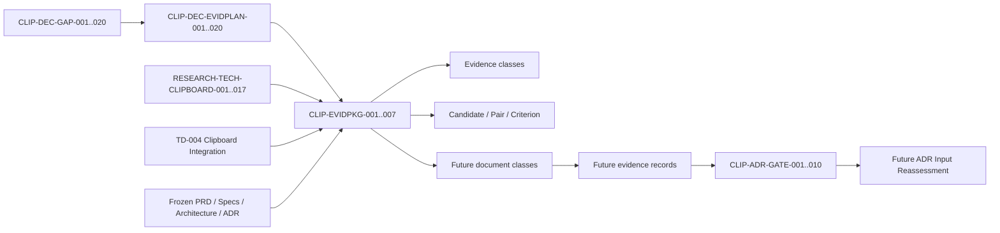

# Clipboard Integration Evidence-specific Document Package Specification

## Document Control

| Field | Value |
|---|---|
| Document ID | `RESEARCH-TECH-CLIPBOARD-018` |
| Title | Clipboard Integration Evidence-specific Document Package Specification |
| Status | Draft |
| Research Type | Evidence-specific Document Package Specification |
| Technology Decision | `TD-004 Clipboard Integration` |
| Parent Evidence Acquisition Plan | `RESEARCH-TECH-CLIPBOARD-017` |
| Parent Decision Input Baseline | `RESEARCH-TECH-CLIPBOARD-016` |
| Covered Plan Items | `CLIP-DEC-EVIDPLAN-001..020` |
| Covered Acquisition Stages | `D0..D6` |
| Evidence Document Created | No |
| Authorization Request Created | No |
| Request ID Created | No |
| Human Authorization Decision | Not made |
| Evidence Acquisition Execution | Not started |
| Candidate Ranking/Selection | Not performed |
| Technology Recommendation/Decision | Not made |
| Clipboard ADR | Not created |
| Inspection/Clipboard/Build/Runtime | Not performed |
| Evidence Persistence | Not performed |
| Owner | TBD |
| Last reviewed | Not reviewed |

## 1. Purpose

This document specifies the future document packages that organize the twenty evidence-plan items from `RESEARCH-TECH-CLIPBOARD-017`. Each package has an independent review boundary, explicit inputs and outputs, authority dependencies, privacy controls, and completion conditions.

This is a package specification only. It is not an evidence record, authorization request, human decision, inspection or runtime execution, candidate comparison, technology recommendation, Clipboard ADR, project operation, build operation, or feature implementation.

## 2. Source Preservation

The package specification preserves these upstream identifiers and boundaries:

- `CLIP-DEC-EVIDPLAN-001..020`
- `CLIP-DEC-GAP-001..020`
- `CLIP-DEC-CRIT-001..012`
- `CLIP-ADR-GATE-001..010`
- `CLIP-OPT-001..005`
- `CLIP-PAIR-001..010`
- `CLIP-INSPECT-001..017`
- `CLIP-LOCAL-OBS-001..017`
- `CLIP-LOCAL-EVID-001..017`
- `D0..D6`

No upstream Gap, Plan Item, Criterion, Candidate, Pair, or Gate is modified, renumbered, merged, excluded, or closed. Package routing does not grant permission to perform any operation.

## 3. Controlled Vocabulary

### Package Readiness

Only these values are valid: `Specified`, `Partially specified`, `Blocked`, `Deferred`, and `Not applicable`.

### Future Document State

Only these values are valid: `Not created`, `Eligible for future preparation`, `Conditionally eligible`, `Blocked`, and `Deferred`.

### Execution Boundary

All packages in this document have the fixed boundary `Current authorization: Not granted` and `Execution status: Not executed`.

The following values are prohibited as package status or evidence claims: `Approved`, `Authorized`, `Executed`, `Passed`, `Verified`, `Selected`, and `Recommended`.

## 4. Evidence Package Registry

Exactly seven packages are defined. No eighth package is created.

| Package ID | Stage | Package name | Primary evidence scope |
|---|---|---|---|
| `CLIP-EVIDPKG-001` | D0 | Static Evidence Consolidation Package | Existing research and official evidence |
| `CLIP-EVIDPKG-002` | D1 | Read-only Local Prerequisite Package | Local and Package Cache read-only observation |
| `CLIP-EVIDPKG-003` | D2 | Experimental Scope Specification Package | Project, host, consumer, and synthetic specifications |
| `CLIP-EVIDPKG-004` | D3 | Project/Package/Restore/Build Package | Project and build evidence boundary |
| `CLIP-EVIDPKG-005` | D4 | Minimum Clipboard Publication Runtime Package | Synthetic Clipboard publication |
| `CLIP-EVIDPKG-006` | D5 | Consumer/Fidelity/Lifetime Package | Consumer, pixel, alpha, lifetime, and basic contention evidence |
| `CLIP-EVIDPKG-007` | D6 | Deferred Validation Package | Phase L2/L3 evidence |

## 5. Package Specifications

Each package uses the same fixed fields. The values below describe future scope only; they are not execution records.

### `CLIP-EVIDPKG-001` — Static Evidence Consolidation Package

| Field | Value |
|---|---|
| Package ID | `CLIP-EVIDPKG-001` |
| Acquisition Stage | D0 |
| Package name | Static Evidence Consolidation Package |
| Purpose | Consolidate existing research and official evidence identities without acquiring new evidence |
| Included Evidence Plan Items | `CLIP-DEC-EVIDPLAN-010` |
| Excluded Evidence Plan Items | `CLIP-DEC-EVIDPLAN-001..009`, `011..020` |
| Included Candidates | `CLIP-OPT-001..005` |
| Included Hosts | WPF; WinUI 3 |
| Included Pairs | `CLIP-PAIR-001..010` |
| Included Decision Criteria | `CLIP-DEC-CRIT-001..012` |
| Included ADR Gates | `CLIP-ADR-GATE-001..004` |
| Required source documents | `RESEARCH-TECH-CLIPBOARD-001..017`; `TD-004 Clipboard Integration`; frozen PRD, Specs, Architecture, and existing official evidence |
| Required previous package outputs | None; this is the first package |
| Evidence classes | Official documentation; Official sample |
| Primary future document class | Static Evidence Supplement |
| Supporting future document classes | ADR Input Reassessment |
| Expected session observation | None; this package is documentary |
| Expected persistent evidence | Source references, identity mapping, and review notes only if separately authorized for persistence |
| Persistent Evidence authority requirement | Separate persistence authority; not present |
| Shared UI authority dependency | No authority artifact found; specification remains documentary |
| Clipboard-specific authority dependency | None for source reuse; no Clipboard access |
| Project creation dependency | Not applicable |
| Package acquisition dependency | Not applicable |
| Restore dependency | Not applicable |
| Build dependency | Not applicable |
| Clipboard Read dependency | Not applicable |
| Clipboard Write dependency | Not applicable |
| Clipboard Clear dependency | Not applicable |
| Runtime dependency | Not applicable |
| Consumer dependency | Not applicable |
| Network boundary | No network operation in this package |
| Mutation boundary | Repository documentation only if a future document is separately authorized |
| Privacy boundary | Do not use private Clipboard contents or user identity data |
| Isolation boundary | Use source-document isolation; no runtime session |
| Synthetic Image boundary | None created or accepted |
| Cleanup boundary | No temporary or runtime output |
| Stop conditions | Missing source lineage, conflicting identity, or any request to infer runtime behavior from static evidence |
| Prohibited inference | Official documentation or sample does not prove local availability, build, runtime, or consumer fidelity |
| Entry conditions | Upstream identifiers are preserved and the source hierarchy is known |
| Exit conditions | Static evidence references and limitations are enumerated |
| Completion evidence | Future static supplement or review record, if separately authorized |
| Package readiness | Specified |
| Future document state | Not created |
| Current authorization | Not granted |
| Execution status | Not executed |
| Owner | TBD |
| Open questions | Which official evidence requires a later supplement remains open |

### `CLIP-EVIDPKG-002` — Read-only Local Prerequisite Package

| Field | Value |
|---|---|
| Package ID | `CLIP-EVIDPKG-002` |
| Acquisition Stage | D1 |
| Package name | Read-only Local Prerequisite Package |
| Purpose | Define the bounded local and Package Cache observations needed before experimental scope is confirmed |
| Included Evidence Plan Items | `CLIP-DEC-EVIDPLAN-001..003`, `CLIP-DEC-EVIDPLAN-011`, `CLIP-DEC-EVIDPLAN-013`, `CLIP-DEC-EVIDPLAN-017` |
| Excluded Evidence Plan Items | `CLIP-DEC-EVIDPLAN-004..010`, `012`, `014..016`, `018..020` |
| Included Candidates | `CLIP-OPT-001..005` |
| Included Hosts | WPF; WinUI 3 |
| Included Pairs | `CLIP-PAIR-001..010` |
| Included Decision Criteria | `CLIP-DEC-CRIT-001..004`, `CLIP-DEC-CRIT-009`, `CLIP-DEC-CRIT-011` |
| Included ADR Gates | `CLIP-ADR-GATE-005` |
| Required source documents | `RESEARCH-TECH-CLIPBOARD-017`; `CLIP-INSPECT-001..017`; frozen Architecture and Specs |
| Required previous package outputs | `CLIP-EVIDPKG-001` source identity outputs, if later created |
| Evidence classes | Local asset observation; Package metadata observation |
| Primary future document class | Read-only Local Inspection Request Package |
| Supporting future document classes | Local Session Observation Record; Persistent Local Evidence Record |
| Expected session observation | Presence, identity, and non-sensitive prerequisite facts within the approved target scope |
| Expected persistent evidence | Redacted observation fields only if separately authorized |
| Persistent Evidence authority requirement | Separate authority from observation permission |
| Shared UI authority dependency | Required for any shared UI prerequisite inspection; no artifact found |
| Clipboard-specific authority dependency | No Clipboard Read, Write, or Clear permission is implied |
| Project creation dependency | Must precede any project-scope confirmation; project creation is excluded here |
| Package acquisition dependency | Package Cache observation only; no acquisition |
| Restore dependency | Excluded |
| Build dependency | Excluded |
| Clipboard Read dependency | Excluded |
| Clipboard Write dependency | Excluded |
| Clipboard Clear dependency | Excluded |
| Runtime dependency | Excluded |
| Consumer dependency | Excluded |
| Network boundary | No network |
| Mutation boundary | Read-only; no repository, machine, cache, or Clipboard mutation |
| Privacy boundary | Standard-user scope; no secrets, tokens, profile identity, or private Clipboard content |
| Isolation boundary | Targeted local paths and Package Cache metadata only |
| Synthetic Image boundary | None |
| Cleanup boundary | No output or temporary artifacts |
| Stop conditions | Target ambiguity, permission escalation, sensitive data exposure, or any mutation requirement |
| Prohibited inference | Local presence does not prove restore, build, runtime, or consumer behavior |
| Entry conditions | A future read-only authorization request is separately prepared and decided |
| Exit conditions | Read-only observation scope and gaps are recorded without mutation |
| Completion evidence | Local Session Observation Record, if later authorized |
| Package readiness | Partially specified |
| Future document state | Not created |
| Current authorization | Not granted |
| Execution status | Not executed |
| Owner | TBD |
| Open questions | Exact local target paths and redaction rules require a future request |

### `CLIP-EVIDPKG-003` — Experimental Scope Specification Package

| Field | Value |
|---|---|
| Package ID | `CLIP-EVIDPKG-003` |
| Acquisition Stage | D2 |
| Package name | Experimental Scope Specification Package |
| Purpose | Specify isolated project, host, consumer, synthetic-image, and backend combinations before any creation |
| Included Evidence Plan Items | `CLIP-DEC-EVIDPLAN-012`, `CLIP-DEC-EVIDPLAN-015` |
| Excluded Evidence Plan Items | `CLIP-DEC-EVIDPLAN-001..011`, `013..014`, `016..020` |
| Included Candidates | `CLIP-OPT-001..005` |
| Included Hosts | WPF; WinUI 3; Win32/OLE consumer scope only as a specification |
| Included Pairs | `CLIP-PAIR-001..010` |
| Included Decision Criteria | `CLIP-DEC-CRIT-001..012` |
| Included ADR Gates | `CLIP-ADR-GATE-002`, `CLIP-ADR-GATE-003`, `CLIP-ADR-GATE-006` |
| Required source documents | `RESEARCH-TECH-CLIPBOARD-017`; frozen PRD, Specs, Architecture, and ADRs |
| Required previous package outputs | `CLIP-EVIDPKG-001`; future `CLIP-EVIDPKG-002` scope output if local prerequisites are required |
| Evidence classes | Experimental Project creation specification |
| Primary future document class | Experimental Project Scope Specification |
| Supporting future document classes | Project/Package/Restore/Build Request Package; Consumer Evidence Plan |
| Expected session observation | None; specifications are documentary |
| Expected persistent evidence | Project scope fields only if separately authorized for persistence |
| Persistent Evidence authority requirement | Separate persistence authority |
| Shared UI authority dependency | Shared UI host scope must be identified, not executed |
| Clipboard-specific authority dependency | No Clipboard authority in specification stage |
| Project creation dependency | Specification is a prerequisite; creation is excluded |
| Package acquisition dependency | Must be described, not performed |
| Restore dependency | Must be described, not performed |
| Build dependency | Must be described, not performed |
| Clipboard Read dependency | Excluded |
| Clipboard Write dependency | Excluded |
| Clipboard Clear dependency | Excluded |
| Runtime dependency | Excluded |
| Consumer dependency | Consumer boundaries are specified only |
| Network boundary | No network or package acquisition |
| Mutation boundary | Documentation only; no project or source creation |
| Privacy boundary | Synthetic data contract must exclude private content |
| Isolation boundary | Separate experimental root, consumer boundary, and output boundary are required in the specification |
| Synthetic Image boundary | Define fixed contract only; do not create an image |
| Cleanup boundary | Define future cleanup ownership only |
| Stop conditions | Missing host boundary, private-data dependency, or unbounded output/mutation scope |
| Prohibited inference | A complete specification does not prove project creation, restore, build, or runtime |
| Entry conditions | Static identity and prerequisite gaps are known |
| Exit conditions | Future project and consumer scope is independently reviewable |
| Completion evidence | Experimental Project Scope Specification, if later created |
| Package readiness | Specified |
| Future document state | Not created |
| Current authorization | Not granted |
| Execution status | Not executed |
| Owner | TBD |
| Open questions | Exact target framework, package versions, and consumer harness remain future inputs |

### `CLIP-EVIDPKG-004` — Project/Package/Restore/Build Package

| Field | Value |
|---|---|
| Package ID | `CLIP-EVIDPKG-004` |
| Acquisition Stage | D3 |
| Package name | Project/Package/Restore/Build Package |
| Purpose | Keep project creation, package acquisition, restore, and build as separately observable future operations |
| Included Evidence Plan Items | `CLIP-DEC-EVIDPLAN-015` |
| Excluded Evidence Plan Items | `CLIP-DEC-EVIDPLAN-001..014`, `016..020` |
| Included Candidates | `CLIP-OPT-001..005` |
| Included Hosts | WPF; WinUI 3 |
| Included Pairs | `CLIP-PAIR-001..010` |
| Included Decision Criteria | `CLIP-DEC-CRIT-001..004`, `CLIP-DEC-CRIT-009`, `CLIP-DEC-CRIT-011`, `CLIP-DEC-CRIT-012` |
| Included ADR Gates | `CLIP-ADR-GATE-006` |
| Required source documents | `RESEARCH-TECH-CLIPBOARD-017`; future scope specification; frozen project boundary |
| Required previous package outputs | `CLIP-EVIDPKG-003`; any separately authorized local prerequisite record |
| Evidence classes | Experimental Project creation; Restore; Build |
| Primary future document class | Project/Package/Restore/Build Request Package |
| Supporting future document classes | Build Observation Record; Deferred Evidence Register |
| Expected session observation | Independently attributable project, package, restore, and build outcomes |
| Expected persistent evidence | Redacted project/build observation fields if separately authorized |
| Persistent Evidence authority requirement | Separate persistence authority |
| Shared UI authority dependency | Shared framework/tooling permission must be explicit |
| Clipboard-specific authority dependency | No Clipboard authority; runtime is excluded |
| Project creation dependency | Future project scope specification must precede creation |
| Package acquisition dependency | Only when required package is unavailable and separately authorized |
| Restore dependency | Separate from package acquisition and build |
| Build dependency | Restore and project scope must precede build |
| Clipboard Read dependency | Excluded |
| Clipboard Write dependency | Excluded |
| Clipboard Clear dependency | Excluded |
| Runtime dependency | Excluded |
| Consumer dependency | Consumer execution is excluded |
| Network boundary | Package acquisition and restore require explicit separate network authority if needed |
| Mutation boundary | Project/output/cache mutation is future and separately authorized |
| Privacy boundary | No private Clipboard payload, credentials, tokens, SIDs, or account identity |
| Isolation boundary | Dedicated experimental root and output directory |
| Synthetic Image boundary | No image creation in this package |
| Cleanup boundary | Future request must identify generated project, cache, and output cleanup |
| Stop conditions | Unapproved package acquisition, restore/build coupling, sensitive output, or runtime request |
| Prohibited inference | Restore success does not prove build; build success does not prove runtime |
| Entry conditions | Scope specification exists and separate operation boundaries are reviewable |
| Exit conditions | Future project/build observations can be attributed to one operation each |
| Completion evidence | Build Observation Record, if later authorized |
| Package readiness | Partially specified |
| Future document state | Not created |
| Current authorization | Not granted |
| Execution status | Not executed |
| Owner | TBD |
| Open questions | Whether required packages are already available and what exact build command is permitted |

### `CLIP-EVIDPKG-005` — Minimum Clipboard Publication Runtime Package

| Field | Value |
|---|---|
| Package ID | `CLIP-EVIDPKG-005` |
| Acquisition Stage | D4 |
| Package name | Minimum Clipboard Publication Runtime Package |
| Purpose | Specify the smallest isolated Clipboard publication runtime observation after build evidence exists |
| Included Evidence Plan Items | `CLIP-DEC-EVIDPLAN-004`, `CLIP-DEC-EVIDPLAN-014`, `CLIP-DEC-EVIDPLAN-016` |
| Excluded Evidence Plan Items | `CLIP-DEC-EVIDPLAN-001..003`, `005..013`, `015`, `017..020` |
| Included Candidates | `CLIP-OPT-001..005` |
| Included Hosts | WPF; WinUI 3 |
| Included Pairs | `CLIP-PAIR-001..010` |
| Included Decision Criteria | `CLIP-DEC-CRIT-001..004`, `CLIP-DEC-CRIT-007`, `CLIP-DEC-CRIT-012` |
| Included ADR Gates | `CLIP-ADR-GATE-007` |
| Required source documents | `RESEARCH-TECH-CLIPBOARD-017`; future scope and build records; frozen Clipboard boundary |
| Required previous package outputs | `CLIP-EVIDPKG-003`; `CLIP-EVIDPKG-004` |
| Evidence classes | Clipboard publication runtime; Format enumeration |
| Primary future document class | Clipboard Runtime Request Package |
| Supporting future document classes | Clipboard Runtime Observation Record |
| Expected session observation | Bounded synthetic publication attempt and format surface observation |
| Expected persistent evidence | Redacted result metadata only if separately authorized |
| Persistent Evidence authority requirement | Separate from runtime permission |
| Shared UI authority dependency | Host activation permission must be explicit |
| Clipboard-specific authority dependency | Separate Clipboard Write authority; Clipboard Read and Clear remain independent |
| Project creation dependency | Isolated project must exist from a prior package |
| Package acquisition dependency | Must already be resolved or separately authorized |
| Restore dependency | Must already be evidenced |
| Build dependency | Must already be evidenced |
| Clipboard Read dependency | Not automatically included; separate request required |
| Clipboard Write dependency | Required for future runtime publication and not granted here |
| Clipboard Clear dependency | Excluded unless separately requested |
| Runtime dependency | Future runtime request and human decision |
| Consumer dependency | Consumer evaluation is excluded |
| Network boundary | No network during minimum runtime unless separately authorized |
| Mutation boundary | Clipboard mutation is future and separately authorized; no repository mutation here |
| Privacy boundary | Synthetic payload only; no private Clipboard read or history/cloud access |
| Isolation boundary | Dedicated session, synthetic payload, isolated producer and bounded cleanup |
| Synthetic Image boundary | Contract may be referenced; image creation is excluded |
| Cleanup boundary | Clipboard cleanup must be separately authorized and recorded |
| Stop conditions | Missing build evidence, non-synthetic payload, read/clear expansion, or consumer inference |
| Prohibited inference | Publication does not prove consumer fidelity, pixel fidelity, lifetime, or technology choice |
| Entry conditions | Scope and build outputs exist under separate authority |
| Exit conditions | Minimum publication observation is independently attributable and bounded |
| Completion evidence | Clipboard Runtime Observation Record, if later authorized |
| Package readiness | Blocked |
| Future document state | Blocked |
| Current authorization | Not granted |
| Execution status | Not executed |
| Owner | TBD |
| Open questions | Exact synthetic payload and whether Clipboard Write authority will be granted |

### `CLIP-EVIDPKG-006` — Consumer/Fidelity/Lifetime Package

| Field | Value |
|---|---|
| Package ID | `CLIP-EVIDPKG-006` |
| Acquisition Stage | D5 |
| Package name | Consumer/Fidelity/Lifetime Package |
| Purpose | Specify consumer interoperability, pixel/alpha comparison, ownership/lifetime, termination, and basic contention evidence |
| Included Evidence Plan Items | `CLIP-DEC-EVIDPLAN-005`, `CLIP-DEC-EVIDPLAN-006`, `CLIP-DEC-EVIDPLAN-008` |
| Excluded Evidence Plan Items | `CLIP-DEC-EVIDPLAN-001..004`, `007`, `009..020` |
| Included Candidates | `CLIP-OPT-001..005` |
| Included Hosts | WPF; WinUI 3; Win32/OLE consumer scope |
| Included Pairs | `CLIP-PAIR-001..010` |
| Included Decision Criteria | `CLIP-DEC-CRIT-005`, `CLIP-DEC-CRIT-006`, `CLIP-DEC-CRIT-008`, `CLIP-DEC-CRIT-011` |
| Included ADR Gates | `CLIP-ADR-GATE-008`, `CLIP-ADR-GATE-009` |
| Required source documents | `RESEARCH-TECH-CLIPBOARD-017`; future runtime observation; frozen capture-output and privacy boundaries |
| Required previous package outputs | `CLIP-EVIDPKG-005` |
| Evidence classes | Consumer paste observation; Pixel/Alpha comparison; Process termination observation |
| Primary future document class | Consumer Interoperability Record |
| Supporting future document classes | Pixel/Alpha Comparison Record; Ownership/Lifetime Observation Record |
| Expected session observation | Consumer output, fidelity comparison, producer return/termination, and basic ownership behavior |
| Expected persistent evidence | Redacted comparison and lifetime metadata only if separately authorized |
| Persistent Evidence authority requirement | Separate persistence authority |
| Shared UI authority dependency | Consumer host activation permission must be explicit |
| Clipboard-specific authority dependency | Runtime publication and any Read/Clear operation must be separately authorized |
| Project creation dependency | Isolated producer and consumer scope must already exist |
| Package acquisition dependency | No acquisition in this package |
| Restore dependency | Prior build package output required |
| Build dependency | Prior build evidence required |
| Clipboard Read dependency | Required only where consumer observation reads Clipboard output; separate permission |
| Clipboard Write dependency | Prior runtime publication authority required |
| Clipboard Clear dependency | Excluded unless separately requested |
| Runtime dependency | Prior minimum runtime observation required |
| Consumer dependency | Separate WPF, WinUI 3, and Win32/OLE consumer scope |
| Network boundary | No network or cloud Clipboard |
| Mutation boundary | Consumer and Clipboard observations are future and separately authorized |
| Privacy boundary | Synthetic content only; no History, Cloud, credentials, or user identity |
| Isolation boundary | Consumer process, producer process, and evidence output are isolated |
| Synthetic Image boundary | Only a future approved synthetic contract may be consumed |
| Cleanup boundary | Producer, consumer, Clipboard, and temporary output cleanup must be explicit |
| Stop conditions | Consumer scope collapse, private data, ambiguous ownership, or fidelity inference without read-back |
| Prohibited inference | Session observation does not become persistent evidence; consumer output does not prove all formats |
| Entry conditions | Minimum runtime observation exists under separate authority |
| Exit conditions | Consumer, fidelity, and lifetime questions have independent observation boundaries |
| Completion evidence | Consumer, Pixel/Alpha, and Ownership/Lifetime records, if later authorized |
| Package readiness | Blocked |
| Future document state | Blocked |
| Current authorization | Not granted |
| Execution status | Not executed |
| Owner | TBD |
| Open questions | Minimum consumer set and read-back method require future approval |

### `CLIP-EVIDPKG-007` — Deferred Validation Package

| Field | Value |
|---|---|
| Package ID | `CLIP-EVIDPKG-007` |
| Acquisition Stage | D6 |
| Package name | Deferred Validation Package |
| Purpose | Hold Phase L2/L3 evidence that is not required for the minimum comparison package |
| Included Evidence Plan Items | `CLIP-DEC-EVIDPLAN-007`, `CLIP-DEC-EVIDPLAN-009`, `CLIP-DEC-EVIDPLAN-018`, `CLIP-DEC-EVIDPLAN-019`, `CLIP-DEC-EVIDPLAN-020` |
| Excluded Evidence Plan Items | `CLIP-DEC-EVIDPLAN-001..006`, `008`, `010..017` |
| Included Candidates | `CLIP-OPT-001..005` |
| Included Hosts | WPF; WinUI 3; deferred consumer and cloud contexts only if separately approved |
| Included Pairs | `CLIP-PAIR-001..010` |
| Included Decision Criteria | `CLIP-DEC-CRIT-007..011` |
| Included ADR Gates | `CLIP-ADR-GATE-009`, `CLIP-ADR-GATE-010` |
| Required source documents | `RESEARCH-TECH-CLIPBOARD-017`; prior package records; future deferred-evidence scope |
| Required previous package outputs | Relevant D0-D5 outputs; no shortcut around minimum evidence |
| Evidence classes | Contention/Retry observation; History/Cloud observation; Persistent Evidence |
| Primary future document class | Deferred Evidence Register |
| Supporting future document classes | Persistent Local Evidence Record; ADR Input Reassessment |
| Expected session observation | Deferred stress, history/cloud, and abnormal-lifetime results only when independently authorized |
| Expected persistent evidence | Explicitly authorized deferred evidence with redaction and provenance |
| Persistent Evidence authority requirement | Separate persistence authority always required |
| Shared UI authority dependency | Depends on each deferred host scope |
| Clipboard-specific authority dependency | Separate Clipboard, History, Cloud, and cleanup decisions; none are granted |
| Project creation dependency | Must reuse or separately specify an isolated project |
| Package acquisition dependency | Only if explicitly authorized for a deferred scope |
| Restore dependency | Depends on the relevant project package |
| Build dependency | Depends on the relevant build record |
| Clipboard Read dependency | Separate and explicit |
| Clipboard Write dependency | Separate and explicit |
| Clipboard Clear dependency | Separate and explicit |
| Runtime dependency | Depends on prior minimum runtime evidence |
| Consumer dependency | Depends on separately bounded consumer scope |
| Network boundary | History/Cloud and package network access are excluded unless separately authorized |
| Mutation boundary | No automatic mutation; deferred scope must define every mutation |
| Privacy boundary | No private Clipboard or cloud content; synthetic or redacted data only |
| Isolation boundary | Deferred stress and cloud scenarios must remain isolated from product and user data |
| Synthetic Image boundary | Synthetic baseline only; no image creation in this document |
| Cleanup boundary | Deferred cleanup and abnormal-termination handling must be separately specified |
| Stop conditions | Deferred evidence becomes a prerequisite for minimum comparison, or privacy/authority boundary is missing |
| Prohibited inference | Deferred evidence is not a reason to block the minimum Phase L1 package automatically |
| Entry conditions | A future reassessment identifies a specific deferred question and authority class |
| Exit conditions | Deferred evidence is either documented as out of scope or separately recorded |
| Completion evidence | Deferred Evidence Register or ADR Input Reassessment, if later authorized |
| Package readiness | Deferred |
| Future document state | Deferred |
| Current authorization | Not granted |
| Execution status | Not executed |
| Owner | TBD |
| Open questions | Which deferred questions materially affect the final ADR remains open |

## 6. Plan Item Package Routing

Each Plan Item has exactly one primary package. A secondary package is used only to show a necessary hand-off; it does not authorize execution.

| Evidence Plan Item | Decision Gap | Primary Package | Secondary Package | Routing reason | Cross-package dependency |
|---|---|---|---|---|---|
| `CLIP-DEC-EVIDPLAN-001` | `CLIP-DEC-GAP-001` | `CLIP-EVIDPKG-002` | Not applicable | Local prerequisite observation | D1 scope requires a future read-only request |
| `CLIP-DEC-EVIDPLAN-002` | `CLIP-DEC-GAP-002` | `CLIP-EVIDPKG-002` | Not applicable | Package Cache metadata observation | No acquisition or restore shortcut |
| `CLIP-DEC-EVIDPLAN-003` | `CLIP-DEC-GAP-003` | `CLIP-EVIDPKG-002` | `CLIP-EVIDPKG-003` | Local host prerequisite precedes scope specification | D1 output may inform D2 scope |
| `CLIP-DEC-EVIDPLAN-004` | `CLIP-DEC-GAP-004` | `CLIP-EVIDPKG-005` | `CLIP-EVIDPKG-004` | Minimum publication requires prior build evidence | D3 precedes D4 |
| `CLIP-DEC-EVIDPLAN-005` | `CLIP-DEC-GAP-005` | `CLIP-EVIDPKG-006` | `CLIP-EVIDPKG-005` | Lifetime observation follows publication | D4 precedes D5 |
| `CLIP-DEC-EVIDPLAN-006` | `CLIP-DEC-GAP-006` | `CLIP-EVIDPKG-006` | `CLIP-EVIDPKG-005` | Fidelity comparison consumes runtime output | D4 output is an input only |
| `CLIP-DEC-EVIDPLAN-007` | `CLIP-DEC-GAP-007` | `CLIP-EVIDPKG-007` | `CLIP-EVIDPKG-006` | Full contention is deferred beyond minimum evidence | D5 basic observation may precede D6 |
| `CLIP-DEC-EVIDPLAN-008` | `CLIP-DEC-GAP-008` | `CLIP-EVIDPKG-006` | `CLIP-EVIDPKG-005` | Producer termination follows publication | D4 precedes D5 |
| `CLIP-DEC-EVIDPLAN-009` | `CLIP-DEC-GAP-009` | `CLIP-EVIDPKG-007` | Not applicable | Deferred host or package question | D6 does not block minimum L1 by itself |
| `CLIP-DEC-EVIDPLAN-010` | `CLIP-DEC-GAP-010` | `CLIP-EVIDPKG-001` | `CLIP-EVIDPKG-003` | Static identity consolidation | D0 output may constrain D2 scope |
| `CLIP-DEC-EVIDPLAN-011` | `CLIP-DEC-GAP-011` | `CLIP-EVIDPKG-002` | `CLIP-EVIDPKG-003` | Local prerequisite and host scope | D1 precedes D2 |
| `CLIP-DEC-EVIDPLAN-012` | `CLIP-DEC-GAP-012` | `CLIP-EVIDPKG-003` | `CLIP-EVIDPKG-004` | Minimum project specification | D2 precedes D3 |
| `CLIP-DEC-EVIDPLAN-013` | `CLIP-DEC-GAP-013` | `CLIP-EVIDPKG-002` | `CLIP-EVIDPKG-003` | Local availability is a D1 question | D1 precedes D2 |
| `CLIP-DEC-EVIDPLAN-014` | `CLIP-DEC-GAP-014` | `CLIP-EVIDPKG-005` | `CLIP-EVIDPKG-006` | Publication is separated from consumer evaluation | D4 precedes D5 |
| `CLIP-DEC-EVIDPLAN-015` | `CLIP-DEC-GAP-015` | `CLIP-EVIDPKG-004` | `CLIP-EVIDPKG-003` | Restore/build viability is independently observable | D2 scope precedes D3 |
| `CLIP-DEC-EVIDPLAN-016` | `CLIP-DEC-GAP-016` | `CLIP-EVIDPKG-005` | `CLIP-EVIDPKG-004` | Runtime publication requires build output | D3 precedes D4 |
| `CLIP-DEC-EVIDPLAN-017` | `CLIP-DEC-GAP-017` | `CLIP-EVIDPKG-002` | Not applicable | Read-only prerequisite observation | No runtime inference |
| `CLIP-DEC-EVIDPLAN-018` | `CLIP-DEC-GAP-018` | `CLIP-EVIDPKG-007` | `CLIP-EVIDPKG-006` | Persistence is separated from session observation | D5 session output is not persistence |
| `CLIP-DEC-EVIDPLAN-019` | `CLIP-DEC-GAP-019` | `CLIP-EVIDPKG-007` | Not applicable | Phase L2 deferred validation | Requires future trigger |
| `CLIP-DEC-EVIDPLAN-020` | `CLIP-DEC-GAP-020` | `CLIP-EVIDPKG-007` | Not applicable | Phase L3 deferred validation | Requires future trigger |

## 7. Evidence Class Package Routing

| Evidence class | Primary Package | Required predecessor | Future document form | Session-only possible | Persistence required | Prohibited inference |
|---|---|---|---|---|---|---|
| Official documentation | `CLIP-EVIDPKG-001` | Source hierarchy | Static Evidence Supplement | Yes | No | Does not prove local availability |
| Official sample | `CLIP-EVIDPKG-001` | Official documentation identity | Static Evidence Supplement | Yes | No | Does not prove Repository build |
| Local asset observation | `CLIP-EVIDPKG-002` | Read-only scope | Local Session Observation Record | Yes | No | Does not prove build |
| Package metadata observation | `CLIP-EVIDPKG-002` | Read-only scope | Local Session Observation Record | Yes | No | Does not prove restore or build |
| Experimental Project creation | `CLIP-EVIDPKG-004` | Scope specification | Project/Package/Restore/Build Request Package | Yes | No | Does not prove runtime |
| Restore | `CLIP-EVIDPKG-004` | Project/package boundary | Build Observation Record | Yes | No | Does not prove build |
| Build | `CLIP-EVIDPKG-004` | Restore and project scope | Build Observation Record | Yes | No | Does not prove runtime |
| Clipboard publication runtime | `CLIP-EVIDPKG-005` | Build evidence and runtime authority | Clipboard Runtime Observation Record | Yes | No | Does not prove consumer fidelity |
| Format enumeration | `CLIP-EVIDPKG-005` | Runtime scope | Clipboard Runtime Observation Record | Yes | No | Does not prove all consumers |
| Consumer paste observation | `CLIP-EVIDPKG-006` | Publication observation and consumer scope | Consumer Interoperability Record | Yes | No | Does not prove every format |
| Pixel/Alpha comparison | `CLIP-EVIDPKG-006` | Consumer output and synthetic contract | Pixel/Alpha Comparison Record | Yes | No | Does not select technology |
| Process termination observation | `CLIP-EVIDPKG-006` | Publication and lifetime scope | Ownership/Lifetime Observation Record | Yes | No | Does not prove long-duration behavior |
| Contention/Retry observation | `CLIP-EVIDPKG-007` | Minimum runtime baseline | Deferred Evidence Register | Yes | No | Does not establish formal retry policy |
| History/Cloud observation | `CLIP-EVIDPKG-007` | Explicit future privacy and authority decision | Deferred Evidence Register | Yes | No | Does not authorize history/cloud mutation |
| Persistent Evidence | `CLIP-EVIDPKG-007` | Session observation and separate persistence authority | Persistent Local Evidence Record | No | Yes | Does not equal a technology decision |

The routing preserves these non-equivalences: local observation does not prove build; restore does not prove build; build does not prove runtime; runtime publication does not prove consumer fidelity; session observation is not Persistent Evidence; and completed evidence is not a Technology Decision.

## 8. Candidate Coverage

All five candidates remain in scope without quantity-based preference, ranking, or recommendation. The Adapter candidate keeps architecture evidence and backend evidence in separate fields.

| Candidate | Applicable Packages | Static package | Local package | Build package | Runtime package | Consumer package | Deferred package |
|---|---|---|---|---|---|---|---|
| `CLIP-OPT-001` WPF Clipboard | `CLIP-EVIDPKG-001..007` | `CLIP-EVIDPKG-001` | `CLIP-EVIDPKG-002` | `CLIP-EVIDPKG-004` | `CLIP-EVIDPKG-005` | `CLIP-EVIDPKG-006` | `CLIP-EVIDPKG-007` |
| `CLIP-OPT-002` WinRT Clipboard | `CLIP-EVIDPKG-001..007` | `CLIP-EVIDPKG-001` | `CLIP-EVIDPKG-002` | `CLIP-EVIDPKG-004` | `CLIP-EVIDPKG-005` | `CLIP-EVIDPKG-006` | `CLIP-EVIDPKG-007` |
| `CLIP-OPT-003` OLE/COM IDataObject | `CLIP-EVIDPKG-001..007` | `CLIP-EVIDPKG-001` | `CLIP-EVIDPKG-002` | `CLIP-EVIDPKG-004` | `CLIP-EVIDPKG-005` | `CLIP-EVIDPKG-006` | `CLIP-EVIDPKG-007` |
| `CLIP-OPT-004` Raw Win32 Clipboard | `CLIP-EVIDPKG-001..007` | `CLIP-EVIDPKG-001` | `CLIP-EVIDPKG-002` | `CLIP-EVIDPKG-004` | `CLIP-EVIDPKG-005` | `CLIP-EVIDPKG-006` | `CLIP-EVIDPKG-007` |
| `CLIP-OPT-005` Host-neutral Adapter strategy | `CLIP-EVIDPKG-001..007` | `CLIP-EVIDPKG-001` (architecture strategy) | `CLIP-EVIDPKG-002` | `CLIP-EVIDPKG-004` (backend evidence separate) | `CLIP-EVIDPKG-005` (backend evidence separate) | `CLIP-EVIDPKG-006` | `CLIP-EVIDPKG-007` |

The Adapter row does not make its backend evidence implicit. Its architecture-boundary evidence and the selected-backend evidence remain separate future records.

## 9. Candidate–Host Coverage

| Pair | Candidate | Host | Applicable Packages | First non-static package | Runtime package | Consumer package | Current state |
|---|---|---|---|---|---|---|---|
| `CLIP-PAIR-001` | `CLIP-OPT-001` WPF Clipboard | WPF | `CLIP-EVIDPKG-001..007` | `CLIP-EVIDPKG-002` | `CLIP-EVIDPKG-005` | `CLIP-EVIDPKG-006` | Static evidence only |
| `CLIP-PAIR-002` | `CLIP-OPT-001` WPF Clipboard | WinUI 3 | `CLIP-EVIDPKG-001..007` | `CLIP-EVIDPKG-002` | `CLIP-EVIDPKG-005` | `CLIP-EVIDPKG-006` | Static evidence only |
| `CLIP-PAIR-003` | `CLIP-OPT-002` WinRT Clipboard | WPF | `CLIP-EVIDPKG-001..007` | `CLIP-EVIDPKG-002` | `CLIP-EVIDPKG-005` | `CLIP-EVIDPKG-006` | Static evidence only |
| `CLIP-PAIR-004` | `CLIP-OPT-002` WinRT Clipboard | WinUI 3 | `CLIP-EVIDPKG-001..007` | `CLIP-EVIDPKG-002` | `CLIP-EVIDPKG-005` | `CLIP-EVIDPKG-006` | Static evidence only |
| `CLIP-PAIR-005` | `CLIP-OPT-003` OLE/COM IDataObject | WPF | `CLIP-EVIDPKG-001..007` | `CLIP-EVIDPKG-002` | `CLIP-EVIDPKG-005` | `CLIP-EVIDPKG-006` | Static evidence only |
| `CLIP-PAIR-006` | `CLIP-OPT-003` OLE/COM IDataObject | WinUI 3 | `CLIP-EVIDPKG-001..007` | `CLIP-EVIDPKG-002` | `CLIP-EVIDPKG-005` | `CLIP-EVIDPKG-006` | Static evidence only |
| `CLIP-PAIR-007` | `CLIP-OPT-004` Raw Win32 Clipboard | WPF | `CLIP-EVIDPKG-001..007` | `CLIP-EVIDPKG-002` | `CLIP-EVIDPKG-005` | `CLIP-EVIDPKG-006` | Static evidence only |
| `CLIP-PAIR-008` | `CLIP-OPT-004` Raw Win32 Clipboard | WinUI 3 | `CLIP-EVIDPKG-001..007` | `CLIP-EVIDPKG-002` | `CLIP-EVIDPKG-005` | `CLIP-EVIDPKG-006` | Static evidence only |
| `CLIP-PAIR-009` | `CLIP-OPT-005` Host-neutral Adapter strategy | WPF | `CLIP-EVIDPKG-001..007` | `CLIP-EVIDPKG-002` | `CLIP-EVIDPKG-005` | `CLIP-EVIDPKG-006` | Static evidence only |
| `CLIP-PAIR-010` | `CLIP-OPT-005` Host-neutral Adapter strategy | WinUI 3 | `CLIP-EVIDPKG-001..007` | `CLIP-EVIDPKG-002` | `CLIP-EVIDPKG-005` | `CLIP-EVIDPKG-006` | Static evidence only |

WPF and WinUI 3 remain separate host contexts. No Pair is excluded or treated as a recommendation.

## 10. Decision Criteria Coverage

| Criterion | Required Packages | Minimum comparison package | Final-decision package | Deferred evidence allowed | Current coverage |
|---|---|---|---|---|---|
| `CLIP-DEC-CRIT-001` Host Integration Fit | `CLIP-EVIDPKG-001..005` | `CLIP-EVIDPKG-002..005` | `CLIP-EVIDPKG-006` | Extended host matrix | Partially specified |
| `CLIP-DEC-CRIT-002` API/Interop Complexity | `CLIP-EVIDPKG-001..005` | `CLIP-EVIDPKG-001..005` | `CLIP-EVIDPKG-006` | Non-minimum interop | Partially specified |
| `CLIP-DEC-CRIT-003` Threading/COM/Dispatcher Correctness | `CLIP-EVIDPKG-001..005` | `CLIP-EVIDPKG-002..005` | `CLIP-EVIDPKG-006` | Stress concurrency | Partially specified |
| `CLIP-DEC-CRIT-004` Clipboard Format Coverage | `CLIP-EVIDPKG-001..006` | `CLIP-EVIDPKG-005` | `CLIP-EVIDPKG-006` | Extended format matrix | Partially specified |
| `CLIP-DEC-CRIT-005` Ownership/Lifetime Semantics | `CLIP-EVIDPKG-005..006` | `CLIP-EVIDPKG-006` | `CLIP-EVIDPKG-007` | Long-duration profiling | Partially specified |
| `CLIP-DEC-CRIT-006` Alpha/Pixel/Color Fidelity | `CLIP-EVIDPKG-005..006` | `CLIP-EVIDPKG-006` | `CLIP-EVIDPKG-007` | Large-image and extended formats | Partially specified |
| `CLIP-DEC-CRIT-007` Contention/Failure/Retry Boundary | `CLIP-EVIDPKG-005..007` | `CLIP-EVIDPKG-005` | `CLIP-EVIDPKG-007` | Full contention matrix | Deferred |
| `CLIP-DEC-CRIT-008` Producer Termination Durability | `CLIP-EVIDPKG-005..006` | `CLIP-EVIDPKG-006` | `CLIP-EVIDPKG-007` | Abnormal termination stress | Partially specified |
| `CLIP-DEC-CRIT-009` Packaged/Unpackaged Compatibility | `CLIP-EVIDPKG-001..004` | `CLIP-EVIDPKG-002..004` | `CLIP-EVIDPKG-007` | Additional deployment forms | Partially specified |
| `CLIP-DEC-CRIT-010` Privacy/History/Cloud Control | `CLIP-EVIDPKG-001..007` | `CLIP-EVIDPKG-001..005` | `CLIP-EVIDPKG-007` | History and Cloud | Deferred |
| `CLIP-DEC-CRIT-011` Isolation/Testability/Evidence Quality | `CLIP-EVIDPKG-001..007` | `CLIP-EVIDPKG-001..006` | `CLIP-EVIDPKG-007` | Extended evidence persistence | Partially specified |
| `CLIP-DEC-CRIT-012` Architecture and Workflow Boundary Fit | `CLIP-EVIDPKG-001..005` | `CLIP-EVIDPKG-001..005` | `CLIP-EVIDPKG-006` | Non-minimum workflow variants | Partially specified |

No criterion is scored, weighted, sorted, or used to select a candidate in this document.

## 11. ADR Gate Package Mapping

| ADR Gate | Required Packages | Minimum package outputs | Deferred outputs allowed | Reassessment document class | Current state |
|---|---|---|---|---|---|
| `CLIP-ADR-GATE-001` Candidate identities fixed | `CLIP-EVIDPKG-001` | Static candidate identity map | None | ADR Input Reassessment | Specified |
| `CLIP-ADR-GATE-002` Host scope fixed | `CLIP-EVIDPKG-001..003` | Separate WPF and WinUI 3 scope | Extended hosts | ADR Input Reassessment | Specified |
| `CLIP-ADR-GATE-003` Hard constraints traced | `CLIP-EVIDPKG-001..003` | Constraint-to-package trace | Implementation details | ADR Input Reassessment | Partially specified |
| `CLIP-ADR-GATE-004` Static evidence accepted | `CLIP-EVIDPKG-001` | Source and limitation register | Additional official evidence | ADR Input Reassessment | Partially specified |
| `CLIP-ADR-GATE-005` Local availability assessed | `CLIP-EVIDPKG-002` | Authorized observation record | None for local prerequisite | ADR Input Reassessment | Blocked |
| `CLIP-ADR-GATE-006` Project/Restore/Build evidence assessed | `CLIP-EVIDPKG-003..004` | Independently attributable build records | Deferred deployment forms | ADR Input Reassessment | Blocked |
| `CLIP-ADR-GATE-007` Minimum runtime publication evidence assessed | `CLIP-EVIDPKG-005` | Bounded runtime observation | Non-minimum payloads | ADR Input Reassessment | Blocked |
| `CLIP-ADR-GATE-008` Minimum format/consumer fidelity assessed | `CLIP-EVIDPKG-006` | Consumer and fidelity records | Extended consumer matrix | ADR Input Reassessment | Blocked |
| `CLIP-ADR-GATE-009` Privacy/ownership/cleanup assessed | `CLIP-EVIDPKG-005..007` | Bounded privacy and lifetime evidence | History/Cloud and stress evidence | ADR Input Reassessment | Partially specified |
| `CLIP-ADR-GATE-010` Alternatives and consequences comparable | `CLIP-EVIDPKG-001..007` | Gap-preserving comparison inputs | Deferred L2/L3 evidence | ADR Input Reassessment | Blocked |

No Gate is labelled as Passed, Satisfied, or Closed.

## 12. Future Document Class Registry

The following classes are routing labels only. None is created by this document.

| Document class | Package | Execution involved | Authority required | Persistent output | Current state |
|---|---|---|---|---|---|
| Static Evidence Supplement | `CLIP-EVIDPKG-001` | No | Separate documentary review | Optional | Not created |
| Read-only Local Inspection Request Package | `CLIP-EVIDPKG-002` | Future read-only inspection | Separate human decision | No | Not created |
| Local Session Observation Record | `CLIP-EVIDPKG-002` | Future read-only inspection | Separate observation authority | No | Not created |
| Persistent Local Evidence Record | `CLIP-EVIDPKG-002`, `007` | Future persistence | Separate persistence authority | Yes | Not created |
| Experimental Project Scope Specification | `CLIP-EVIDPKG-003` | No | Documentary review | Optional | Not created |
| Project/Package/Restore/Build Request Package | `CLIP-EVIDPKG-004` | Future project/build operations | Separate operation decisions | No | Not created |
| Build Observation Record | `CLIP-EVIDPKG-004` | Future build | Separate build authority | Optional | Not created |
| Clipboard Runtime Request Package | `CLIP-EVIDPKG-005` | Future runtime | Separate Clipboard authority | No | Not created |
| Clipboard Runtime Observation Record | `CLIP-EVIDPKG-005` | Future runtime | Separate runtime authority | No | Not created |
| Consumer Interoperability Record | `CLIP-EVIDPKG-006` | Future consumer observation | Separate consumer authority | Optional | Not created |
| Pixel/Alpha Comparison Record | `CLIP-EVIDPKG-006` | Future comparison | Separate runtime/consumer authority | Optional | Not created |
| Ownership/Lifetime Observation Record | `CLIP-EVIDPKG-006` | Future lifetime observation | Separate runtime authority | Optional | Not created |
| Deferred Evidence Register | `CLIP-EVIDPKG-007` | Future deferred evidence | Separate scope decision | Optional | Not created |
| ADR Input Reassessment | `CLIP-EVIDPKG-001..007` | No by itself | Separate decision process | Optional | Not created |

## 13. Request and Evidence Document Separation

| Document purpose | May request authority | May record human decision | May record execution | May persist evidence | May select technology |
|---|---|---|---|---|---|
| Package Specification | No | No | No | No | No |
| Authorization Request | Yes, as a request only | No | No | No | No |
| Human Decision Record | No | Yes | No | No | No |
| Session Observation Record | No | No | May record a separately authorized observation | No by default | No |
| Persistent Evidence Record | No | No | May contain separately authorized evidence | Yes, with separate authority | No |
| ADR Input Reassessment | No | No | No | May reference authorized records | No; it prepares inputs only |
| Clipboard ADR | No | No | No | May reference accepted inputs | Future decision artifact only |

Requests do not pre-fill a human decision. Human decisions do not claim execution. Observation does not automatically become Persistent Evidence. An Evidence Record does not form a Technology Decision, and an ADR does not grant execution permission.

## 14. Package Dependency Matrix

| Package | Depends on | Must precede | May proceed independently from | Prohibited shortcut |
|---|---|---|---|---|
| `CLIP-EVIDPKG-001` D0 | Existing source hierarchy | Evidence reuse assessment | Local inspection planning | Treating official sample as build proof |
| `CLIP-EVIDPKG-002` D1 | D0 identity and future read-only scope | Local availability confirmation | Static source review | Mutating local or cache state |
| `CLIP-EVIDPKG-003` D2 | D0 and, where needed, D1 scope | Project creation specification | Documentary evidence review | Creating a project before scope specification |
| `CLIP-EVIDPKG-004` D3 | D2 project/package scope | Runtime specification | Consumer planning | Treating restore as build or build as runtime |
| `CLIP-EVIDPKG-005` D4 | D3 build evidence | Consumer/fidelity observation | Deferred planning | Writing Clipboard without separate authority |
| `CLIP-EVIDPKG-006` D5 | D4 runtime output and consumer scope | Final ADR input reassessment | D6 deferred register | Treating one consumer as universal fidelity |
| `CLIP-EVIDPKG-007` D6 | Relevant D0-D5 outputs | Deferred ADR input reassessment | Minimum Phase L1 comparison planning | Making deferred evidence an automatic L1 blocker |

Document dependency is not execution authorization.

## 15. Package Mutation Boundary

| Package | Repository mutation | Local-machine mutation | Package Cache mutation | Clipboard mutation | Evidence persistence |
|---|---|---|---|---|---|
| D0 | Future documentation only | None | None | None | No |
| D1 | None | Read-only observation only if separately authorized | Read-only metadata observation only if separately authorized | None | Separate authority |
| D2 | Future scope document only | None | None | None | Separate authority |
| D3 | Future isolated project/output only if separately authorized | Project/tooling mutation may occur only under separate request | Acquisition/restore only under separate request | None | Separate authority |
| D4 | None required | Runtime process may run only under separate request | None | Clipboard Write only under separate request; Read/Clear separate | Separate authority |
| D5 | None required | Consumer processes may run only under separate request | None | Read/Write/Clear each remain separate | Separate authority |
| D6 | None required | Deferred scope may mutate only under its own request | Separate if required | History/Cloud and Clipboard operations require separate decisions | Separate authority |

All values describe future boundaries. This document performed no mutation and created no package output.

## 16. Shared UI Dependency Package Mapping

| Shared capability | Applicable Package | Existing research source | Authority artifact found | Blocks package specification | Blocks execution |
|---|---|---|---|---|---|
| OS/architecture inspection | D1 | `CLIP-INSPECT-001..017` | No | No | Yes |
| .NET/SDK inspection | D1, D3 | `CLIP-INSPECT-001..017` | No | No | Yes |
| Visual Studio/Build Tools inspection | D1, D3 | `CLIP-INSPECT-001..017` | No | No | Yes |
| WPF/WinUI asset inspection | D1, D2 | `CLIP-LOCAL-OBS-001..017` | No | No | Yes |
| Package Cache inspection | D1, D3 | `CLIP-LOCAL-EVID-001..017` | No | No | Yes |
| Project creation | D2, D3 | `RESEARCH-TECH-CLIPBOARD-017` | No | No | Yes |
| Restore | D3 | `RESEARCH-TECH-CLIPBOARD-017` | No | No | Yes |
| Build | D3 | `RESEARCH-TECH-CLIPBOARD-017` | No | No | Yes |
| Runtime | D4, D5, D6 | `RESEARCH-TECH-CLIPBOARD-017` | No | No | Yes |

`Authority artifact found: No` and `Authority reference: TBD` are fixed for every future capability mapping. No new authority identifier is created or inferred.

## 17. Privacy and Data-handling Package Boundary

| Data class | Permitted Package | Allowed handling | Persistence | Required redaction | Stop condition |
|---|---|---|---|---|---|
| Private Clipboard payload | None in D0-D6 minimum specification | Prohibited | Prohibited | Not applicable | Any request to use private content |
| Clipboard History | D6 only as separately scoped future evidence | Observation only if separately authorized | Separate authority | Remove content and identity | History access expands beyond scope |
| Cloud Clipboard | D6 only as separately scoped future evidence | No default access | Separate authority | Remove content and identity | Network/cloud mutation appears |
| Synthetic Image | D2-D6 as a future contract only | Bounded synthetic data | Separate authority | No private content | Contract includes private data |
| Consumer output | D5 only under future consumer scope | Bounded observation | Separate authority | Redact image bytes and identity | Output cannot be isolated |
| Session Observation | D1-D6 by future record type | Record approved fields only | No automatic persistence | Redact sensitive fields | Sensitive field appears |
| Persistent Evidence | D0-D7 routing only under separate persistence authority | Redacted provenance and result metadata | Yes, only after authority | Credentials, tokens, SIDs, accounts, bytes | Persistence authority missing |
| Error output | D0-D6 only as bounded metadata | Preserve failure category, not secrets | Separate authority | Redact paths and credentials | Error exposes sensitive data |
| User profile path | None by default | Do not enumerate unrelated profile data | Prohibited | Not applicable | Scope broadens outside repository/approved target |
| Credential/Token/SID/Account identity | None | Prohibited | Prohibited | Not applicable | Any value is encountered |

Fixed privacy boundary: private Clipboard content is not used by any D0-D5 minimum evidence package; Synthetic Image content must be non-private; image bytes are not written to ordinary logs; credentials, tokens, SIDs, and account identity are not recorded.

## 18. Package Completion Matrix

| Package | Scope complete | Routing complete | Authority separated | Evidence output bounded | Privacy controls bounded | Ready for future document preparation |
|---|---|---|---|---|---|---|
| `CLIP-EVIDPKG-001` | Yes | Yes | Yes | Yes | Yes | Yes |
| `CLIP-EVIDPKG-002` | Partially | Yes | Yes | Yes | Yes | Partially |
| `CLIP-EVIDPKG-003` | Yes | Yes | Yes | Yes | Yes | Yes |
| `CLIP-EVIDPKG-004` | Partially | Yes | Yes | Yes | Yes | Partially |
| `CLIP-EVIDPKG-005` | Partially | Yes | Yes | Yes | Yes | No |
| `CLIP-EVIDPKG-006` | Partially | Yes | Yes | Yes | Yes | No |
| `CLIP-EVIDPKG-007` | Partially | Yes | Yes | Yes | Yes | Partially |

`Yes` means only that a future document may be prepared. It never means that the package may be executed.

## 19. Mechanical Final Status

### Package Specification Status

**Evidence-specific document package specification complete**

### Future Document Preparation Readiness

**Conditionally ready to prepare evidence-specific planning documents**

Derivation:

```text
7 Packages
+ 20 Plan Item routes
+ 15 Evidence Class routes
+ Candidate/Host/Criterion coverage
+ ADR Gate mapping
+ Future document classes
+ Authority/Execution/Persistence separation
+ Privacy boundaries
→ Future Document Preparation Readiness
```

This result is not `Ready to execute`, `Ready to inspect`, `Ready to access Clipboard`, `Ready to build`, or `Ready to select Technology`.

## 20. Fixed Status Boundary

| Status field | Fixed value |
|---|---|
| Evidence Document Created | No |
| Authorization Request Created | No |
| Request ID Created | No |
| Human Authorization Decision | Not made |
| Evidence Acquisition Execution | Not started |
| Local/Package Cache Inspection | Not performed |
| Project/Restore/Build | Not performed |
| Clipboard Read/Write/Clear | Not performed |
| Runtime/Consumer Verification | Not performed |
| Evidence Persistence | Not performed |
| Candidate Ranking/Selection | Not performed |
| Technology Recommendation/Decision | Not made |
| Clipboard ADR | Not created |

## 21. Traceability



The traceability chain also preserves the actual UI/Capture/Rendering research documents and `Architecture/adr/ADR-0002-ui-framework-selection.md` as source references. It does not create or infer an authorization artifact.

## Completion Record

- Only `46-clipboard-integration-evidence-specific-document-package-specification.md` is created by this task.
- Exactly seven `CLIP-EVIDPKG-001..007` packages are defined.
- Exactly twenty Plan Item routes, fifteen Evidence Class routes, five Candidate rows, ten Candidate–Host rows, twelve Decision Criteria rows, ten ADR Gate rows, and seven Package Completion rows are defined.
- No Evidence document, Authorization Request, Request ID, Human Decision, Project, Consumer, Synthetic Image, Payload, Result, or Source Code is created.
- No Inspection, Clipboard, Evidence, Restore, Build, Run, Runtime, or Consumer operation is performed.
- No candidate weighting, scoring, ranking, selection, recommendation, or Clipboard ADR is produced.
- No screenshot functionality is started.
