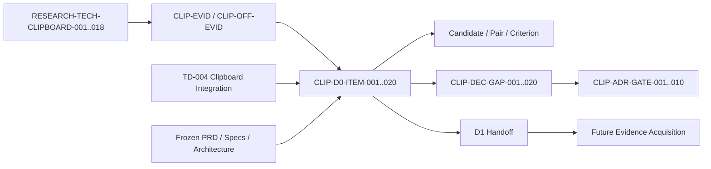

# Clipboard Integration Static Evidence Consolidation Package

## Document Control

| Field | Value |
|---|---|
| Document ID | `RESEARCH-TECH-CLIPBOARD-019` |
| Title | Clipboard Integration Static Evidence Consolidation Package |
| Status | Draft |
| Research Type | Static Evidence Consolidation Package |
| Technology Decision | `TD-004 Clipboard Integration` |
| Package | `CLIP-EVIDPKG-001` |
| Acquisition Stage | D0 — Static Evidence Consolidation |
| Parent Package Specification | `RESEARCH-TECH-CLIPBOARD-018` |
| Parent Evidence Acquisition Plan | `RESEARCH-TECH-CLIPBOARD-017` |
| Parent Decision Input Baseline | `RESEARCH-TECH-CLIPBOARD-016` |
| Covered Documents | `RESEARCH-TECH-CLIPBOARD-001..018` |
| New Official-source Research | Not performed |
| Local/Package Cache Inspection | Not performed |
| Project/Restore/Build | Not performed |
| Clipboard Read/Write/Clear | Not performed |
| Runtime/Consumer Verification | Not performed |
| Operational Evidence Artifact | Not created |
| Persistent Evidence | Not created |
| Candidate Ranking/Selection | Not performed |
| Technology Recommendation/Decision | Not made |
| Clipboard ADR | Not created |
| Authorization Request | Not created |
| Human Authorization Decision | Not made |
| Owner | TBD |
| Last reviewed | Not reviewed |

## 1. Purpose

This package consolidates only the existing Clipboard research line and the Microsoft first-party evidence already recorded in the repository. It records what those static sources can establish for the five candidates, ten Candidate–Host Pairs, twelve Decision Criteria, twenty Decision Gaps, and ten ADR Gates, together with the limits of those claims.

This is the D0 static consolidation package. It is not new official research, local inspection, Package Cache inspection, build or runtime evidence, a candidate comparison, a recommendation, an authorization request, operational evidence, a Clipboard ADR, or feature implementation.

## 2. Source Preservation

The package preserves the following upstream namespaces without changing their IDs, status, or original conclusion:

- `RESEARCH-TECH-CLIPBOARD-001..018`
- `CLIP-EVID-001..018`
- `CLIP-GAP-001..018`
- `CLIP-OFF-EVID-001..020`
- `CLIP-OFF-GAP-001..020`
- `CLIP-OPT-001..005`
- `CLIP-PAIR-001..010`
- `CLIP-DEC-CRIT-001..012`
- `CLIP-DEC-GAP-001..020`
- `CLIP-DEC-EVIDPLAN-001..020`
- `CLIP-ADR-GATE-001..010`
- `CLIP-EVIDPKG-001..007`

The package does not re-browse, search for new sources, run local checks, add candidates or pairs, broaden an official claim, or turn a prior recommendation into a fact.

## 3. Controlled Vocabulary

### Static Evidence Acceptance

Only these values are used: `Accepted for static identity`, `Accepted for static specification`, `Accepted with limitation`, `Partially accepted`, `Conflicting`, `Insufficient`, `Deferred`, and `Not applicable`.

### Static Coverage

Only these values are used: `Covered`, `Partially covered`, `Not covered`, `Conflicting`, `Deferred`, and `Not applicable`.

### D0 Disposition

Only these values are used: `D0 complete`, `D0 complete with limitation`, `Requires non-static evidence`, `Deferred to D6`, and `Not applicable`.

### Evidence Availability

Only these values are used: `Available from existing research`, `Partially available`, `Not available`, `Conflicting`, and `Not applicable`.

The package does not use `Verified`, `Runtime verified`, `Build verified`, `Production ready`, `Selected`, `Preferred`, `Recommended`, or `Winner` as a conclusion.

## 4. Source Document Register

The register contains exactly eighteen rows. The filenames below are the repository filenames for `RESEARCH-TECH-CLIPBOARD-001..018`.

| Document ID | Filename | Research role | Static evidence contributed | Latest-valid contribution | Superseded interpretation | D0 use |
|---|---|---|---|---|---|---|
| `RESEARCH-TECH-CLIPBOARD-001` | `29-clipboard-integration-feasibility.md` | Clipboard feasibility and candidate baseline | Candidate identities, official evidence, criteria, gaps | Initial static candidate and evidence baseline | None | Source and limitation reuse |
| `RESEARCH-TECH-CLIPBOARD-002` | `30-clipboard-integration-runtime-spike-plan.md` | Runtime spike planning | Future evidence questions, isolation, consumer, format, lifetime boundaries | Runtime planning boundary | Not a runtime result | Future-stage routing |
| `RESEARCH-TECH-CLIPBOARD-003` | `31-clipboard-integration-runtime-spike-execution-readiness.md` | Runtime readiness | Prerequisite and blocker vocabulary | Readiness boundary | Not execution | Non-static gap identification |
| `RESEARCH-TECH-CLIPBOARD-004` | `32-clipboard-integration-prerequisite-closure-plan.md` | Prerequisite closure planning | Shared UI and Clipboard prerequisite boundaries | Closure dependencies | Not closure execution | Dependency routing |
| `RESEARCH-TECH-CLIPBOARD-005` | `33-clipboard-integration-prerequisite-execution-enablement-specification.md` | Enablement specification | Operation, authority, and isolation separation | Enablement boundary | Not authorization | Authority limitation |
| `RESEARCH-TECH-CLIPBOARD-006` | `34-clipboard-integration-official-prerequisite-evidence-baseline.md` | Official evidence baseline | `CLIP-OFF-EVID-001..020` | Official evidence register | Official evidence is not local or runtime evidence | Official claim reuse |
| `RESEARCH-TECH-CLIPBOARD-007` | `35-clipboard-integration-prerequisite-execution-enablement-reassessment.md` | Enablement reassessment | Reassessment and remaining blockers | Latest prerequisite reassessment | Does not authorize execution | Reassessment lineage |
| `RESEARCH-TECH-CLIPBOARD-008` | `36-clipboard-integration-authorization-request-readiness-closure-specification.md` | Request-readiness closure | Authorization request readiness fields | Request-readiness boundary | No request created | Authority gap reuse |
| `RESEARCH-TECH-CLIPBOARD-009` | `37-clipboard-integration-authorization-request-readiness-gap-closure-plan.md` | Request-readiness gap plan | Gap closure structure | Latest gap plan | No request created | Gap limitation |
| `RESEARCH-TECH-CLIPBOARD-010` | `38-clipboard-integration-read-only-local-prerequisite-inspection-plan.md` | Local prerequisite inspection plan | Read-only inspection scope | Local inspection plan | No inspection performed | D1 handoff |
| `RESEARCH-TECH-CLIPBOARD-011` | `39-clipboard-integration-read-only-local-inspection-authorization-request-readiness-closure-specification.md` | Local request-readiness closure | Local request fixed fields | Request-readiness boundary | No request created | D1 limitation |
| `RESEARCH-TECH-CLIPBOARD-012` | `40-clipboard-integration-read-only-local-inspection-authorization-request-readiness-gap-closure-plan.md` | Local request gap plan | Documentary closure matrix | Latest local gap plan | No inspection performed | D1 handoff |
| `RESEARCH-TECH-CLIPBOARD-013` | `41-clipboard-integration-read-only-local-inspection-documentary-gap-closure-specification.md` | Documentary gap closure | Eight documentary closure items | Documentary closure boundary | No local evidence | D1 limitation |
| `RESEARCH-TECH-CLIPBOARD-014` | `42-clipboard-integration-read-only-local-inspection-authorization-request-creation-readiness-reassessment.md` | Request creation readiness | Readiness reassessment | Latest request-creation readiness | No request created | D1 planning input |
| `RESEARCH-TECH-CLIPBOARD-015` | `43-clipboard-integration-research-line-traceability-index.md` | Research traceability index | Research namespace and source lineage | Latest research-line index | No decision or execution | Traceability |
| `RESEARCH-TECH-CLIPBOARD-016` | `44-clipboard-integration-technology-decision-input-baseline.md` | Decision input baseline | Candidates, pairs, criteria, gaps, gates | Latest decision input baseline | No ranking or recommendation | Decision boundary |
| `RESEARCH-TECH-CLIPBOARD-017` | `45-clipboard-integration-technology-decision-evidence-acquisition-plan.md` | Evidence acquisition plan | Evidence routes, stages, and dependencies | Latest acquisition plan | No evidence acquisition | Future route |
| `RESEARCH-TECH-CLIPBOARD-018` | `46-clipboard-integration-evidence-specific-document-package-specification.md` | Evidence package specification | D0-D6 package contracts | Latest package specification | No package execution | Package boundary |

The latest-valid contribution column identifies the most recent source used for that documentary topic. It does not delete or invalidate historical records.

## 5. D0 Evidence Item Binding

The binding is exactly one-to-one. No twenty-first D0 item is created.

| D0 Item | Evidence Plan Item | Decision Gap | Primary static focus | Required next acquisition stage |
|---|---|---|---|---|
| `CLIP-D0-ITEM-001` | `CLIP-DEC-EVIDPLAN-001` | `CLIP-DEC-GAP-001` | Windows and host availability identity | D1 |
| `CLIP-D0-ITEM-002` | `CLIP-DEC-EVIDPLAN-002` | `CLIP-DEC-GAP-002` | WPF API and host identity | D1 |
| `CLIP-D0-ITEM-003` | `CLIP-DEC-EVIDPLAN-003` | `CLIP-DEC-GAP-003` | WinUI 3/WinRT API and host identity | D1 |
| `CLIP-D0-ITEM-004` | `CLIP-DEC-EVIDPLAN-004` | `CLIP-DEC-GAP-004` | Packaged compatibility boundary | D3 |
| `CLIP-D0-ITEM-005` | `CLIP-DEC-EVIDPLAN-005` | `CLIP-DEC-GAP-005` | Unpackaged compatibility boundary | D3 |
| `CLIP-D0-ITEM-006` | `CLIP-DEC-EVIDPLAN-006` | `CLIP-DEC-GAP-006` | Bitmap interoperability identity | D4/D5 |
| `CLIP-D0-ITEM-007` | `CLIP-DEC-EVIDPLAN-007` | `CLIP-DEC-GAP-007` | DIB/DIBV5 format identity | D4/D5 |
| `CLIP-D0-ITEM-008` | `CLIP-DEC-EVIDPLAN-008` | `CLIP-DEC-GAP-008` | Registered PNG format identity | D4 |
| `CLIP-D0-ITEM-009` | `CLIP-DEC-EVIDPLAN-009` | `CLIP-DEC-GAP-009` | Multi-format publication identity | D4 |
| `CLIP-D0-ITEM-010` | `CLIP-DEC-EVIDPLAN-010` | `CLIP-DEC-GAP-010` | Alpha-channel format boundary | D5 |
| `CLIP-D0-ITEM-011` | `CLIP-DEC-EVIDPLAN-011` | `CLIP-DEC-GAP-011` | Pixel and stride format boundary | D5 |
| `CLIP-D0-ITEM-012` | `CLIP-DEC-EVIDPLAN-012` | `CLIP-DEC-GAP-012` | Color and HDR-to-SDR boundary | D5 |
| `CLIP-D0-ITEM-013` | `CLIP-DEC-EVIDPLAN-013` | `CLIP-DEC-GAP-013` | STA and COM identity | D1/D4 |
| `CLIP-D0-ITEM-014` | `CLIP-DEC-EVIDPLAN-014` | `CLIP-DEC-GAP-014` | Dispatcher and background-thread boundary | D1/D4 |
| `CLIP-D0-ITEM-015` | `CLIP-DEC-EVIDPLAN-015` | `CLIP-DEC-GAP-015` | Contention boundary | D4/D6 |
| `CLIP-D0-ITEM-016` | `CLIP-DEC-EVIDPLAN-016` | `CLIP-DEC-GAP-016` | Retry and timeout boundary | D6 |
| `CLIP-D0-ITEM-017` | `CLIP-DEC-EVIDPLAN-017` | `CLIP-DEC-GAP-017` | Ownership and lifetime identity | D5 |
| `CLIP-D0-ITEM-018` | `CLIP-DEC-EVIDPLAN-018` | `CLIP-DEC-GAP-018` | Immediate and delayed rendering identity | D4/D5 |
| `CLIP-D0-ITEM-019` | `CLIP-DEC-EVIDPLAN-019` | `CLIP-DEC-GAP-019` | History and Cloud boundary | D6 |
| `CLIP-D0-ITEM-020` | `CLIP-DEC-EVIDPLAN-020` | `CLIP-DEC-GAP-020` | Large-image, failure, cleanup, and privacy boundary | D6 |

Each item records whether static evidence applies. A D0 limitation routes the question to D1-D6; it does not close the source Gap.

## 6. D0 Item Specifications

Each item contains the same fixed fields. `No` values for local, package, project, restore, build, runtime, consumer, and pixel/alpha fields are deliberate: static documentation cannot establish those states.

### `CLIP-D0-ITEM-001`

| Field | Value |
|---|---|
| D0 Item ID | `CLIP-D0-ITEM-001` |
| Source Evidence Plan Item | `CLIP-DEC-EVIDPLAN-001` |
| Source Decision Gap | `CLIP-DEC-GAP-001` |
| Related Candidate | `CLIP-OPT-001..005` |
| Related Host | WPF; WinUI 3 |
| Related Pair | `CLIP-PAIR-001..010` |
| Related Decision Criteria | `CLIP-DEC-CRIT-001`, `CLIP-DEC-CRIT-009` |
| Related ADR Gates | `CLIP-ADR-GATE-001`, `CLIP-ADR-GATE-002`, `CLIP-ADR-GATE-005` |
| Existing Research sources | `RESEARCH-TECH-CLIPBOARD-001`, `006`, `015..018` |
| Existing Official Evidence IDs | `CLIP-OFF-EVID-008`, `CLIP-OFF-EVID-018..020` |
| Existing Research Evidence IDs | `CLIP-EVID-008`, `CLIP-EVID-016..017` |
| Static decision question | Is the Windows desktop and host identity specified for future local assessment? |
| Accepted static claims | Windows desktop Clipboard and target host identities are documented |
| Claims accepted with limitation | Availability and host activation are documentation-only claims |
| Conflicting claims | None identified from available static sources |
| Unsupported claims | Local OS, installed assets, and active host availability |
| Static identity established | Yes, for documented identity |
| API/Interop identity established | Partially established |
| Host dependency established | Partially established |
| Format identity established | Partially established |
| Threading/COM identity established | Partially established |
| Ownership/lifetime semantics established | No |
| Privacy/History/Cloud boundary established | Partially established |
| Architecture boundary established | Yes, at responsibility level |
| Local availability established | No |
| Package availability established | No |
| Project viability established | No |
| Restore viability established | No |
| Build viability established | No |
| Runtime viability established | No |
| Consumer interoperability established | No |
| Pixel/Alpha fidelity established | No |
| Static Evidence Acceptance | Accepted with limitation |
| Remaining evidence class | Local asset observation; Package metadata observation |
| Required next acquisition stage | D1 |
| Decision Gap effect | Static portion partially specified; Gap remains open |
| ADR Gate effect | Supports Gate 001/002; Gate 005 still blocked |
| Prohibited inference | Documentation does not prove local availability |
| Current authorization | Not granted |
| Execution permitted | No |
| Owner | TBD |
| D0 disposition | Requires non-static evidence |
| Open questions | Exact local OS, SDK, and host assets remain unobserved |

### `CLIP-D0-ITEM-002`

| Field | Value |
|---|---|
| D0 Item ID | `CLIP-D0-ITEM-002` |
| Source Evidence Plan Item | `CLIP-DEC-EVIDPLAN-002` |
| Source Decision Gap | `CLIP-DEC-GAP-002` |
| Related Candidate | `CLIP-OPT-001` |
| Related Host | WPF |
| Related Pair | `CLIP-PAIR-001` |
| Related Decision Criteria | `CLIP-DEC-CRIT-001`, `CLIP-DEC-CRIT-002`, `CLIP-DEC-CRIT-004` |
| Related ADR Gates | `CLIP-ADR-GATE-001`, `CLIP-ADR-GATE-002`, `CLIP-ADR-GATE-005` |
| Existing Research sources | `RESEARCH-TECH-CLIPBOARD-001`, `006`, `015..018` |
| Existing Official Evidence IDs | `CLIP-OFF-EVID-001..003`, `CLIP-OFF-EVID-019` |
| Existing Research Evidence IDs | `CLIP-EVID-001..003` |
| Static decision question | What WPF Clipboard and DataObject identity is documented? |
| Accepted static claims | WPF exposes managed Clipboard and IDataObject-related API surfaces |
| Claims accepted with limitation | SetDataObject retention and WPF wrapper behavior are documented only |
| Conflicting claims | None identified from available static sources |
| Unsupported claims | SnipPlus WPF build, dispatcher activation, and consumer fidelity |
| Static identity established | Yes |
| API/Interop identity established | Yes, for WPF API identity |
| Host dependency established | Partially established |
| Format identity established | Partially established |
| Threading/COM identity established | Partially established |
| Ownership/lifetime semantics established | Partially established |
| Privacy/History/Cloud boundary established | Partially established |
| Architecture boundary established | Yes |
| Local availability established | No |
| Package availability established | No |
| Project viability established | No |
| Restore viability established | No |
| Build viability established | No |
| Runtime viability established | No |
| Consumer interoperability established | No |
| Pixel/Alpha fidelity established | No |
| Static Evidence Acceptance | Accepted for static identity |
| Remaining evidence class | Local asset observation; Build; Clipboard publication runtime |
| Required next acquisition stage | D1 |
| Decision Gap effect | Static API identity supplied; host/runtime gap remains open |
| ADR Gate effect | Supports Gate 001/002/004; Gate 005/007 remain blocked |
| Prohibited inference | WPF API documentation does not prove SnipPlus integration |
| Current authorization | Not granted |
| Execution permitted | No |
| Owner | TBD |
| D0 disposition | Requires non-static evidence |
| Open questions | Local WPF assets, project references, and host behavior remain unknown |

### `CLIP-D0-ITEM-003`

| Field | Value |
|---|---|
| D0 Item ID | `CLIP-D0-ITEM-003` |
| Source Evidence Plan Item | `CLIP-DEC-EVIDPLAN-003` |
| Source Decision Gap | `CLIP-DEC-GAP-003` |
| Related Candidate | `CLIP-OPT-002` |
| Related Host | WinUI 3 |
| Related Pair | `CLIP-PAIR-004` |
| Related Decision Criteria | `CLIP-DEC-CRIT-001`, `CLIP-DEC-CRIT-002`, `CLIP-DEC-CRIT-003` |
| Related ADR Gates | `CLIP-ADR-GATE-001`, `CLIP-ADR-GATE-002`, `CLIP-ADR-GATE-005` |
| Existing Research sources | `RESEARCH-TECH-CLIPBOARD-001`, `006`, `015..018` |
| Existing Official Evidence IDs | `CLIP-OFF-EVID-005..007`, `CLIP-OFF-EVID-020` |
| Existing Research Evidence IDs | `CLIP-EVID-004..007` |
| Static decision question | What WinRT Clipboard and DataPackage identity is documented? |
| Accepted static claims | WinRT Clipboard and DataPackage APIs are documented for the relevant Windows Runtime surface |
| Claims accepted with limitation | Foreground, DispatcherQueue, packaging, and stream behavior remain host questions |
| Conflicting claims | None identified from available static sources |
| Unsupported claims | WinUI 3 project availability, build, and runtime publication |
| Static identity established | Yes |
| API/Interop identity established | Yes, for WinRT surface |
| Host dependency established | Partially established |
| Format identity established | Partially established |
| Threading/COM identity established | Partially established |
| Ownership/lifetime semantics established | Partially established |
| Privacy/History/Cloud boundary established | Partially established |
| Architecture boundary established | Yes |
| Local availability established | No |
| Package availability established | No |
| Project viability established | No |
| Restore viability established | No |
| Build viability established | No |
| Runtime viability established | No |
| Consumer interoperability established | No |
| Pixel/Alpha fidelity established | No |
| Static Evidence Acceptance | Accepted with limitation |
| Remaining evidence class | Local asset observation; Build; Clipboard publication runtime |
| Required next acquisition stage | D1 |
| Decision Gap effect | Static identity supplied; host and packaging gap remains open |
| ADR Gate effect | Supports Gate 001/002/004; Gate 005/006/007 remain blocked |
| Prohibited inference | WinRT API documentation does not prove WinUI 3 integration |
| Current authorization | Not granted |
| Execution permitted | No |
| Owner | TBD |
| D0 disposition | Requires non-static evidence |
| Open questions | DispatcherQueue and local Windows App SDK availability remain unknown |

### `CLIP-D0-ITEM-004`

| Field | Value |
|---|---|
| D0 Item ID | `CLIP-D0-ITEM-004` |
| Source Evidence Plan Item | `CLIP-DEC-EVIDPLAN-004` |
| Source Decision Gap | `CLIP-DEC-GAP-004` |
| Related Candidate | `CLIP-OPT-001..005` |
| Related Host | WPF; WinUI 3 |
| Related Pair | `CLIP-PAIR-001..010` |
| Related Decision Criteria | `CLIP-DEC-CRIT-009`, `CLIP-DEC-CRIT-012` |
| Related ADR Gates | `CLIP-ADR-GATE-002`, `CLIP-ADR-GATE-006` |
| Existing Research sources | `RESEARCH-TECH-CLIPBOARD-001`, `006`, `016..018` |
| Existing Official Evidence IDs | `CLIP-OFF-EVID-005`, `CLIP-OFF-EVID-018` |
| Existing Research Evidence IDs | `CLIP-EVID-004..007` |
| Static decision question | What packaged desktop compatibility boundary is documented? |
| Accepted static claims | Packaged desktop and Windows App SDK boundaries are distinct documented contexts |
| Claims accepted with limitation | Candidate API identity does not establish a packaged project path |
| Conflicting claims | None identified from available static sources |
| Unsupported claims | Packaged SnipPlus project creation, restore, and build |
| Static identity established | Partially established |
| API/Interop identity established | Partially established |
| Host dependency established | Partially established |
| Format identity established | No |
| Threading/COM identity established | Partially established |
| Ownership/lifetime semantics established | No |
| Privacy/History/Cloud boundary established | Partially established |
| Architecture boundary established | Yes |
| Local availability established | No |
| Package availability established | No |
| Project viability established | No |
| Restore viability established | No |
| Build viability established | No |
| Runtime viability established | No |
| Consumer interoperability established | No |
| Pixel/Alpha fidelity established | No |
| Static Evidence Acceptance | Accepted with limitation |
| Remaining evidence class | Package metadata observation; Experimental Project creation; Restore; Build |
| Required next acquisition stage | D3 |
| Decision Gap effect | Static packaging boundary supplied; viability remains open |
| ADR Gate effect | Supports Gate 002; Gate 006 remains blocked |
| Prohibited inference | Official packaging guidance does not prove local project viability |
| Current authorization | Not granted |
| Execution permitted | No |
| Owner | TBD |
| D0 disposition | Requires non-static evidence |
| Open questions | Exact package mode and toolchain are unknown |

### `CLIP-D0-ITEM-005`

| Field | Value |
|---|---|
| D0 Item ID | `CLIP-D0-ITEM-005` |
| Source Evidence Plan Item | `CLIP-DEC-EVIDPLAN-005` |
| Source Decision Gap | `CLIP-DEC-GAP-005` |
| Related Candidate | `CLIP-OPT-001..005` |
| Related Host | WPF; WinUI 3 |
| Related Pair | `CLIP-PAIR-001..010` |
| Related Decision Criteria | `CLIP-DEC-CRIT-009`, `CLIP-DEC-CRIT-012` |
| Related ADR Gates | `CLIP-ADR-GATE-002`, `CLIP-ADR-GATE-006` |
| Existing Research sources | `RESEARCH-TECH-CLIPBOARD-001`, `006`, `016..018` |
| Existing Official Evidence IDs | `CLIP-OFF-EVID-018` |
| Existing Research Evidence IDs | `CLIP-EVID-004..005`, `CLIP-EVID-012` |
| Static decision question | What unpackaged desktop compatibility boundary is documented? |
| Accepted static claims | Unpackaged desktop routes remain distinct from packaged routes |
| Claims accepted with limitation | Native and managed API documentation does not establish the repository's project mode |
| Conflicting claims | None identified from available static sources |
| Unsupported claims | Unpackaged SnipPlus project, restore, and build viability |
| Static identity established | Partially established |
| API/Interop identity established | Partially established |
| Host dependency established | Partially established |
| Format identity established | No |
| Threading/COM identity established | Partially established |
| Ownership/lifetime semantics established | No |
| Privacy/History/Cloud boundary established | Partially established |
| Architecture boundary established | Yes |
| Local availability established | No |
| Package availability established | No |
| Project viability established | No |
| Restore viability established | No |
| Build viability established | No |
| Runtime viability established | No |
| Consumer interoperability established | No |
| Pixel/Alpha fidelity established | No |
| Static Evidence Acceptance | Accepted with limitation |
| Remaining evidence class | Package metadata observation; Experimental Project creation; Restore; Build |
| Required next acquisition stage | D3 |
| Decision Gap effect | Static unpackaged boundary supplied; viability remains open |
| ADR Gate effect | Supports Gate 002; Gate 006 remains blocked |
| Prohibited inference | Unpackaged guidance does not prove this repository can build |
| Current authorization | Not granted |
| Execution permitted | No |
| Owner | TBD |
| D0 disposition | Requires non-static evidence |
| Open questions | Actual project style and available SDKs remain unknown |

### `CLIP-D0-ITEM-006`

| Field | Value |
|---|---|
| D0 Item ID | `CLIP-D0-ITEM-006` |
| Source Evidence Plan Item | `CLIP-DEC-EVIDPLAN-006` |
| Source Decision Gap | `CLIP-DEC-GAP-006` |
| Related Candidate | `CLIP-OPT-001..005` |
| Related Host | WPF; WinUI 3 |
| Related Pair | `CLIP-PAIR-001..010` |
| Related Decision Criteria | `CLIP-DEC-CRIT-004`, `CLIP-DEC-CRIT-006` |
| Related ADR Gates | `CLIP-ADR-GATE-004`, `CLIP-ADR-GATE-007`, `CLIP-ADR-GATE-008` |
| Existing Research sources | `RESEARCH-TECH-CLIPBOARD-001`, `006`, `015..018` |
| Existing Official Evidence IDs | `CLIP-OFF-EVID-001`, `CLIP-OFF-EVID-007`, `CLIP-OFF-EVID-011` |
| Existing Research Evidence IDs | `CLIP-EVID-001`, `CLIP-EVID-005..006`, `CLIP-EVID-011` |
| Static decision question | Which bitmap representations are statically identified? |
| Accepted static claims | WPF, WinRT, and standard native bitmap identities are documented |
| Claims accepted with limitation | Representation identity does not establish conversion or consumer round-trip |
| Conflicting claims | None identified from available static sources |
| Unsupported claims | Basic bitmap publication and consumer fidelity in SnipPlus |
| Static identity established | Yes, for format identities |
| API/Interop identity established | Partially established |
| Host dependency established | Partially established |
| Format identity established | Yes, for documented representations |
| Threading/COM identity established | Partially established |
| Ownership/lifetime semantics established | Partially established |
| Privacy/History/Cloud boundary established | Partially established |
| Architecture boundary established | Yes |
| Local availability established | No |
| Package availability established | No |
| Project viability established | No |
| Restore viability established | No |
| Build viability established | No |
| Runtime viability established | No |
| Consumer interoperability established | No |
| Pixel/Alpha fidelity established | No |
| Static Evidence Acceptance | Accepted for static specification |
| Remaining evidence class | Clipboard publication runtime; Consumer paste observation; Pixel/Alpha comparison |
| Required next acquisition stage | D4/D5 |
| Decision Gap effect | Bitmap identity supplied; fidelity gap remains open |
| ADR Gate effect | Supports Gate 004; Gates 007/008 remain blocked |
| Prohibited inference | Bitmap API identity does not prove consumer fidelity |
| Current authorization | Not granted |
| Execution permitted | No |
| Owner | TBD |
| D0 disposition | Requires non-static evidence |
| Open questions | Minimum published representation and consumer set remain open |

### `CLIP-D0-ITEM-007`

| Field | Value |
|---|---|
| D0 Item ID | `CLIP-D0-ITEM-007` |
| Source Evidence Plan Item | `CLIP-DEC-EVIDPLAN-007` |
| Source Decision Gap | `CLIP-DEC-GAP-007` |
| Related Candidate | `CLIP-OPT-003`, `CLIP-OPT-004` |
| Related Host | WPF; WinUI 3; Win32/OLE consumer scope |
| Related Pair | `CLIP-PAIR-005..008` |
| Related Decision Criteria | `CLIP-DEC-CRIT-004`, `CLIP-DEC-CRIT-006` |
| Related ADR Gates | `CLIP-ADR-GATE-004`, `CLIP-ADR-GATE-008` |
| Existing Research sources | `RESEARCH-TECH-CLIPBOARD-001`, `006`, `015..018` |
| Existing Official Evidence IDs | `CLIP-OFF-EVID-011..012` |
| Existing Research Evidence IDs | `CLIP-EVID-009..011` |
| Static decision question | What DIB and DIBV5 format identities and conversion boundaries are documented? |
| Accepted static claims | CF_DIB and CF_DIBV5 identities and related conversion boundaries are documented |
| Claims accepted with limitation | Format identity does not establish alpha, stride, color, or consumer round-trip |
| Conflicting claims | None identified from available static sources |
| Unsupported claims | DIB/DIBV5 runtime and pixel fidelity |
| Static identity established | Yes |
| API/Interop identity established | Partially established |
| Host dependency established | Partially established |
| Format identity established | Yes |
| Threading/COM identity established | Partially established |
| Ownership/lifetime semantics established | Partially established |
| Privacy/History/Cloud boundary established | Partially established |
| Architecture boundary established | Yes |
| Local availability established | No |
| Package availability established | No |
| Project viability established | No |
| Restore viability established | No |
| Build viability established | No |
| Runtime viability established | No |
| Consumer interoperability established | No |
| Pixel/Alpha fidelity established | No |
| Static Evidence Acceptance | Accepted with limitation |
| Remaining evidence class | Clipboard publication runtime; Consumer paste observation; Pixel/Alpha comparison |
| Required next acquisition stage | D4/D5 |
| Decision Gap effect | Format identity supplied; round-trip gap remains open |
| ADR Gate effect | Supports Gate 004; Gate 008 remains blocked |
| Prohibited inference | DIB/DIBV5 documentation does not prove alpha preservation |
| Current authorization | Not granted |
| Execution permitted | No |
| Owner | TBD |
| D0 disposition | Requires non-static evidence |
| Open questions | Consumer support and conversion semantics remain unknown |

### `CLIP-D0-ITEM-008`

| Field | Value |
|---|---|
| D0 Item ID | `CLIP-D0-ITEM-008` |
| Source Evidence Plan Item | `CLIP-DEC-EVIDPLAN-008` |
| Source Decision Gap | `CLIP-DEC-GAP-008` |
| Related Candidate | `CLIP-OPT-002..004` |
| Related Host | WPF; WinUI 3 |
| Related Pair | `CLIP-PAIR-003..008` |
| Related Decision Criteria | `CLIP-DEC-CRIT-004`, `CLIP-DEC-CRIT-006` |
| Related ADR Gates | `CLIP-ADR-GATE-004`, `CLIP-ADR-GATE-007`, `CLIP-ADR-GATE-008` |
| Existing Research sources | `RESEARCH-TECH-CLIPBOARD-001`, `006`, `015..018` |
| Existing Official Evidence IDs | `CLIP-OFF-EVID-013` |
| Existing Research Evidence IDs | `CLIP-EVID-007`, `CLIP-EVID-010`, `CLIP-EVID-018` |
| Static decision question | What registered-format identity is documented for a future PNG route? |
| Accepted static claims | Application-defined registered format identity and registration APIs are documented |
| Claims accepted with limitation | Registration does not establish payload publication or consumer recognition |
| Conflicting claims | None identified from available static sources |
| Unsupported claims | PNG publication, consumer recognition, and fidelity |
| Static identity established | Yes, for registered-format concept |
| API/Interop identity established | Partially established |
| Host dependency established | Partially established |
| Format identity established | Partially established |
| Threading/COM identity established | No |
| Ownership/lifetime semantics established | No |
| Privacy/History/Cloud boundary established | Partially established |
| Architecture boundary established | Yes |
| Local availability established | No |
| Package availability established | No |
| Project viability established | No |
| Restore viability established | No |
| Build viability established | No |
| Runtime viability established | No |
| Consumer interoperability established | No |
| Pixel/Alpha fidelity established | No |
| Static Evidence Acceptance | Accepted with limitation |
| Remaining evidence class | Clipboard publication runtime; Format enumeration; Consumer paste observation |
| Required next acquisition stage | D4 |
| Decision Gap effect | Registration identity supplied; consumer gap remains open |
| ADR Gate effect | Supports Gate 004; Gates 007/008 remain blocked |
| Prohibited inference | Registered format identity does not prove a consumer can paste it |
| Current authorization | Not granted |
| Execution permitted | No |
| Owner | TBD |
| D0 disposition | Requires non-static evidence |
| Open questions | Format payload contract and consumer scope remain undefined |

### `CLIP-D0-ITEM-009`

| Field | Value |
|---|---|
| D0 Item ID | `CLIP-D0-ITEM-009` |
| Source Evidence Plan Item | `CLIP-DEC-EVIDPLAN-009` |
| Source Decision Gap | `CLIP-DEC-GAP-009` |
| Related Candidate | `CLIP-OPT-001..005` |
| Related Host | WPF; WinUI 3 |
| Related Pair | `CLIP-PAIR-001..010` |
| Related Decision Criteria | `CLIP-DEC-CRIT-004`, `CLIP-DEC-CRIT-012` |
| Related ADR Gates | `CLIP-ADR-GATE-004`, `CLIP-ADR-GATE-007`, `CLIP-ADR-GATE-008` |
| Existing Research sources | `RESEARCH-TECH-CLIPBOARD-001`, `006`, `015..018` |
| Existing Official Evidence IDs | `CLIP-OFF-EVID-008..010`, `CLIP-OFF-EVID-015` |
| Existing Research Evidence IDs | `CLIP-EVID-009..010`, `CLIP-EVID-015` |
| Static decision question | What multi-format publication identity and limitation are documented? |
| Accepted static claims | Windows supports multiple formats and distinct ownership/conversion concepts |
| Claims accepted with limitation | Consumer format choice and atomic behavior are not established for SnipPlus |
| Conflicting claims | None identified from available static sources |
| Unsupported claims | Atomic publication, consumer selection, and cross-host fidelity |
| Static identity established | Partially established |
| API/Interop identity established | Partially established |
| Host dependency established | Partially established |
| Format identity established | Yes, at system concept level |
| Threading/COM identity established | Partially established |
| Ownership/lifetime semantics established | Partially established |
| Privacy/History/Cloud boundary established | Partially established |
| Architecture boundary established | Yes |
| Local availability established | No |
| Package availability established | No |
| Project viability established | No |
| Restore viability established | No |
| Build viability established | No |
| Runtime viability established | No |
| Consumer interoperability established | No |
| Pixel/Alpha fidelity established | No |
| Static Evidence Acceptance | Accepted with limitation |
| Remaining evidence class | Clipboard publication runtime; Format enumeration; Consumer interoperability |
| Required next acquisition stage | D4 |
| Decision Gap effect | Static publication model supplied; multi-consumer gap remains open |
| ADR Gate effect | Supports Gate 004; Gates 007/008 remain blocked |
| Prohibited inference | Multiple documented formats do not prove a consumer will choose the desired one |
| Current authorization | Not granted |
| Execution permitted | No |
| Owner | TBD |
| D0 disposition | Requires non-static evidence |
| Open questions | Minimum format set and atomic failure behavior remain open |

### `CLIP-D0-ITEM-010`

| Field | Value |
|---|---|
| D0 Item ID | `CLIP-D0-ITEM-010` |
| Source Evidence Plan Item | `CLIP-DEC-EVIDPLAN-010` |
| Source Decision Gap | `CLIP-DEC-GAP-010` |
| Related Candidate | `CLIP-OPT-001..005` |
| Related Host | WPF; WinUI 3 |
| Related Pair | `CLIP-PAIR-001..010` |
| Related Decision Criteria | `CLIP-DEC-CRIT-006` |
| Related ADR Gates | `CLIP-ADR-GATE-004`, `CLIP-ADR-GATE-008` |
| Existing Research sources | `RESEARCH-TECH-CLIPBOARD-001`, `006`, `015..018` |
| Existing Official Evidence IDs | `CLIP-OFF-EVID-011..012` |
| Existing Research Evidence IDs | `CLIP-EVID-010..011` |
| Static decision question | What alpha-channel claims are actually supported by existing static sources? |
| Accepted static claims | DIBV5 and color-space fields are documented as format concepts |
| Claims accepted with limitation | Documentation does not establish conversion or consumer alpha behavior |
| Conflicting claims | None identified from available static sources |
| Unsupported claims | Alpha fidelity in any SnipPlus consumer path |
| Static identity established | Partially established |
| API/Interop identity established | Partially established |
| Host dependency established | Partially established |
| Format identity established | Yes, for documented formats |
| Threading/COM identity established | No |
| Ownership/lifetime semantics established | No |
| Privacy/History/Cloud boundary established | Partially established |
| Architecture boundary established | Yes |
| Local availability established | No |
| Package availability established | No |
| Project viability established | No |
| Restore viability established | No |
| Build viability established | No |
| Runtime viability established | No |
| Consumer interoperability established | No |
| Pixel/Alpha fidelity established | No |
| Static Evidence Acceptance | Accepted with limitation |
| Remaining evidence class | Pixel/Alpha comparison; Consumer paste observation |
| Required next acquisition stage | D5 |
| Decision Gap effect | Static alpha question bounded; fidelity gap remains open |
| ADR Gate effect | Supports Gate 004; Gate 008 remains blocked |
| Prohibited inference | A documented alpha-capable format does not prove preserved alpha |
| Current authorization | Not granted |
| Execution permitted | No |
| Owner | TBD |
| D0 disposition | Requires non-static evidence |
| Open questions | Synthetic contract and consumer read-back remain open |

### `CLIP-D0-ITEM-011`

| Field | Value |
|---|---|
| D0 Item ID | `CLIP-D0-ITEM-011` |
| Source Evidence Plan Item | `CLIP-DEC-EVIDPLAN-011` |
| Source Decision Gap | `CLIP-DEC-GAP-011` |
| Related Candidate | `CLIP-OPT-003`, `CLIP-OPT-004` |
| Related Host | WPF; WinUI 3; Win32/OLE consumer scope |
| Related Pair | `CLIP-PAIR-005..008` |
| Related Decision Criteria | `CLIP-DEC-CRIT-006` |
| Related ADR Gates | `CLIP-ADR-GATE-004`, `CLIP-ADR-GATE-008` |
| Existing Research sources | `RESEARCH-TECH-CLIPBOARD-001`, `006`, `015..018` |
| Existing Official Evidence IDs | `CLIP-OFF-EVID-011..012` |
| Existing Research Evidence IDs | `CLIP-EVID-010..011` |
| Static decision question | What pixel, stride, and bitmap-header identity is statically established? |
| Accepted static claims | Standard bitmap format identities and header concepts are documented |
| Claims accepted with limitation | Stride and round-trip pixel behavior require synthetic comparison |
| Conflicting claims | None identified from available static sources |
| Unsupported claims | Pixel equality or consumer round-trip |
| Static identity established | Partially established |
| API/Interop identity established | Partially established |
| Host dependency established | Partially established |
| Format identity established | Yes |
| Threading/COM identity established | No |
| Ownership/lifetime semantics established | No |
| Privacy/History/Cloud boundary established | Partially established |
| Architecture boundary established | Yes |
| Local availability established | No |
| Package availability established | No |
| Project viability established | No |
| Restore viability established | No |
| Build viability established | No |
| Runtime viability established | No |
| Consumer interoperability established | No |
| Pixel/Alpha fidelity established | No |
| Static Evidence Acceptance | Accepted with limitation |
| Remaining evidence class | Pixel/Alpha comparison; Consumer paste observation |
| Required next acquisition stage | D5 |
| Decision Gap effect | Pixel contract is bounded but not observed |
| ADR Gate effect | Supports Gate 004; Gate 008 remains blocked |
| Prohibited inference | Format headers do not prove pixel fidelity |
| Current authorization | Not granted |
| Execution permitted | No |
| Owner | TBD |
| D0 disposition | Requires non-static evidence |
| Open questions | Pixel map, stride conversion, and consumer comparison remain open |

### `CLIP-D0-ITEM-012`

| Field | Value |
|---|---|
| D0 Item ID | `CLIP-D0-ITEM-012` |
| Source Evidence Plan Item | `CLIP-DEC-EVIDPLAN-012` |
| Source Decision Gap | `CLIP-DEC-GAP-012` |
| Related Candidate | `CLIP-OPT-001..005` |
| Related Host | WPF; WinUI 3 |
| Related Pair | `CLIP-PAIR-001..010` |
| Related Decision Criteria | `CLIP-DEC-CRIT-006`, `CLIP-DEC-CRIT-011` |
| Related ADR Gates | `CLIP-ADR-GATE-004`, `CLIP-ADR-GATE-008`, `CLIP-ADR-GATE-010` |
| Existing Research sources | `RESEARCH-TECH-CLIPBOARD-001`, `006`, `015..018` |
| Existing Official Evidence IDs | `CLIP-OFF-EVID-010..012` |
| Existing Research Evidence IDs | `CLIP-EVID-010..011` |
| Static decision question | What color-space and HDR-to-SDR responsibility is documented? |
| Accepted static claims | Native formats can carry color-space-related metadata and conversion boundaries |
| Claims accepted with limitation | Product color policy and consumer conversion are not closed |
| Conflicting claims | None identified from available static sources |
| Unsupported claims | Color fidelity and HDR-to-SDR behavior in SnipPlus |
| Static identity established | Partially established |
| API/Interop identity established | Partially established |
| Host dependency established | Partially established |
| Format identity established | Partially established |
| Threading/COM identity established | No |
| Ownership/lifetime semantics established | No |
| Privacy/History/Cloud boundary established | Partially established |
| Architecture boundary established | Yes |
| Local availability established | No |
| Package availability established | No |
| Project viability established | No |
| Restore viability established | No |
| Build viability established | No |
| Runtime viability established | No |
| Consumer interoperability established | No |
| Pixel/Alpha fidelity established | No |
| Static Evidence Acceptance | Accepted with limitation |
| Remaining evidence class | Pixel/Alpha comparison; Consumer interoperability |
| Required next acquisition stage | D5 |
| Decision Gap effect | Responsibility boundary supplied; product color behavior remains open |
| ADR Gate effect | Supports Gate 004; Gates 008/010 remain blocked |
| Prohibited inference | Color metadata documentation does not prove color fidelity |
| Current authorization | Not granted |
| Execution permitted | No |
| Owner | TBD |
| D0 disposition | Requires non-static evidence |
| Open questions | Minimum color contract and SDR policy remain open |

### `CLIP-D0-ITEM-013`

| Field | Value |
|---|---|
| D0 Item ID | `CLIP-D0-ITEM-013` |
| Source Evidence Plan Item | `CLIP-DEC-EVIDPLAN-013` |
| Source Decision Gap | `CLIP-DEC-GAP-013` |
| Related Candidate | `CLIP-OPT-003` |
| Related Host | WPF; WinUI 3; native host scope |
| Related Pair | `CLIP-PAIR-005..006` |
| Related Decision Criteria | `CLIP-DEC-CRIT-003`, `CLIP-DEC-CRIT-012` |
| Related ADR Gates | `CLIP-ADR-GATE-003`, `CLIP-ADR-GATE-004`, `CLIP-ADR-GATE-007` |
| Existing Research sources | `RESEARCH-TECH-CLIPBOARD-001`, `006`, `015..018` |
| Existing Official Evidence IDs | `CLIP-OFF-EVID-004`, `CLIP-OFF-EVID-014..016` |
| Existing Research Evidence IDs | `CLIP-EVID-012..014` |
| Static decision question | What STA and COM identity is documented for OLE/COM publication? |
| Accepted static claims | COM apartment and OLE Clipboard ownership concepts are documented |
| Claims accepted with limitation | Host dispatcher and shutdown behavior remain unobserved |
| Conflicting claims | None identified from available static sources |
| Unsupported claims | SnipPlus STA/COM runtime correctness |
| Static identity established | Yes, for COM concepts |
| API/Interop identity established | Yes, for OLE/COM identity |
| Host dependency established | Partially established |
| Format identity established | Partially established |
| Threading/COM identity established | Yes, as documented requirement |
| Ownership/lifetime semantics established | Partially established |
| Privacy/History/Cloud boundary established | Partially established |
| Architecture boundary established | Yes |
| Local availability established | No |
| Package availability established | No |
| Project viability established | No |
| Restore viability established | No |
| Build viability established | No |
| Runtime viability established | No |
| Consumer interoperability established | No |
| Pixel/Alpha fidelity established | No |
| Static Evidence Acceptance | Accepted for static specification |
| Remaining evidence class | Local asset observation; Process lifetime observation; Clipboard publication runtime |
| Required next acquisition stage | D1/D4 |
| Decision Gap effect | COM requirement supplied; host behavior gap remains open |
| ADR Gate effect | Supports Gate 003/004; Gate 007 remains blocked |
| Prohibited inference | COM documentation does not prove dispatcher correctness |
| Current authorization | Not granted |
| Execution permitted | No |
| Owner | TBD |
| D0 disposition | Requires non-static evidence |
| Open questions | Exact STA thread, message pump, and shutdown path remain unknown |

### `CLIP-D0-ITEM-014`

| Field | Value |
|---|---|
| D0 Item ID | `CLIP-D0-ITEM-014` |
| Source Evidence Plan Item | `CLIP-DEC-EVIDPLAN-014` |
| Source Decision Gap | `CLIP-DEC-GAP-014` |
| Related Candidate | `CLIP-OPT-001..005` |
| Related Host | WPF; WinUI 3 |
| Related Pair | `CLIP-PAIR-001..010` |
| Related Decision Criteria | `CLIP-DEC-CRIT-001`, `CLIP-DEC-CRIT-003`, `CLIP-DEC-CRIT-012` |
| Related ADR Gates | `CLIP-ADR-GATE-002`, `CLIP-ADR-GATE-003`, `CLIP-ADR-GATE-007` |
| Existing Research sources | `RESEARCH-TECH-CLIPBOARD-001`, `006`, `015..018` |
| Existing Official Evidence IDs | `CLIP-OFF-EVID-019..020` |
| Existing Research Evidence IDs | `CLIP-EVID-001`, `CLIP-EVID-013..014` |
| Static decision question | What Dispatcher and background-thread dependencies are documented? |
| Accepted static claims | WPF Dispatcher and WinUI DispatcherQueue are distinct host boundaries |
| Claims accepted with limitation | Cross-thread invocation and shutdown behavior remain unobserved |
| Conflicting claims | None identified from available static sources |
| Unsupported claims | Background-thread publication and dispatcher recovery |
| Static identity established | Partially established |
| API/Interop identity established | Partially established |
| Host dependency established | Yes, as a documented boundary |
| Format identity established | No |
| Threading/COM identity established | Partially established |
| Ownership/lifetime semantics established | No |
| Privacy/History/Cloud boundary established | Partially established |
| Architecture boundary established | Yes |
| Local availability established | No |
| Package availability established | No |
| Project viability established | No |
| Restore viability established | No |
| Build viability established | No |
| Runtime viability established | No |
| Consumer interoperability established | No |
| Pixel/Alpha fidelity established | No |
| Static Evidence Acceptance | Accepted with limitation |
| Remaining evidence class | Local asset observation; Clipboard publication runtime; Process lifetime observation |
| Required next acquisition stage | D1/D4 |
| Decision Gap effect | Host dispatch boundary supplied; execution behavior remains open |
| ADR Gate effect | Supports Gate 002/003; Gate 007 remains blocked |
| Prohibited inference | A documented Dispatcher API does not prove correct invocation |
| Current authorization | Not granted |
| Execution permitted | No |
| Owner | TBD |
| D0 disposition | Requires non-static evidence |
| Open questions | Dispatcher ownership, thread affinity, and shutdown sequence remain unknown |

### `CLIP-D0-ITEM-015`

| Field | Value |
|---|---|
| D0 Item ID | `CLIP-D0-ITEM-015` |
| Source Evidence Plan Item | `CLIP-DEC-EVIDPLAN-015` |
| Source Decision Gap | `CLIP-DEC-GAP-015` |
| Related Candidate | `CLIP-OPT-001..005` |
| Related Host | WPF; WinUI 3 |
| Related Pair | `CLIP-PAIR-001..010` |
| Related Decision Criteria | `CLIP-DEC-CRIT-007`, `CLIP-DEC-CRIT-012` |
| Related ADR Gates | `CLIP-ADR-GATE-003`, `CLIP-ADR-GATE-007`, `CLIP-ADR-GATE-010` |
| Existing Research sources | `RESEARCH-TECH-CLIPBOARD-001`, `006`, `015..018` |
| Existing Official Evidence IDs | `CLIP-OFF-EVID-008..010`, `CLIP-OFF-EVID-015` |
| Existing Research Evidence IDs | `CLIP-EVID-009`, `CLIP-EVID-012`, `CLIP-EVID-015` |
| Static decision question | What Clipboard contention boundary is documented? |
| Accepted static claims | Windows Clipboard has an exclusive open/ownership boundary and failure surfaces |
| Claims accepted with limitation | Product retry behavior and contention duration are not defined by official APIs |
| Conflicting claims | None identified from available static sources |
| Unsupported claims | Bounded retry behavior in SnipPlus |
| Static identity established | Yes, for system boundary |
| API/Interop identity established | Partially established |
| Host dependency established | Partially established |
| Format identity established | Partially established |
| Threading/COM identity established | Partially established |
| Ownership/lifetime semantics established | Partially established |
| Privacy/History/Cloud boundary established | Partially established |
| Architecture boundary established | Yes |
| Local availability established | No |
| Package availability established | No |
| Project viability established | No |
| Restore viability established | No |
| Build viability established | No |
| Runtime viability established | No |
| Consumer interoperability established | No |
| Pixel/Alpha fidelity established | No |
| Static Evidence Acceptance | Accepted with limitation |
| Remaining evidence class | Contention/Retry observation; Clipboard publication runtime |
| Required next acquisition stage | D4/D6 |
| Decision Gap effect | Contention boundary supplied; retry policy remains open |
| ADR Gate effect | Supports Gate 003; Gates 007/010 remain blocked |
| Prohibited inference | An API failure surface does not establish product retry policy |
| Current authorization | Not granted |
| Execution permitted | No |
| Owner | TBD |
| D0 disposition | Requires non-static evidence |
| Open questions | Retry count, interval, and timeout are intentionally unspecified |

### `CLIP-D0-ITEM-016`

| Field | Value |
|---|---|
| D0 Item ID | `CLIP-D0-ITEM-016` |
| Source Evidence Plan Item | `CLIP-DEC-EVIDPLAN-016` |
| Source Decision Gap | `CLIP-DEC-GAP-016` |
| Related Candidate | `CLIP-OPT-001..005` |
| Related Host | WPF; WinUI 3 |
| Related Pair | `CLIP-PAIR-001..010` |
| Related Decision Criteria | `CLIP-DEC-CRIT-007` |
| Related ADR Gates | `CLIP-ADR-GATE-003`, `CLIP-ADR-GATE-010` |
| Existing Research sources | `RESEARCH-TECH-CLIPBOARD-001`, `006`, `015..018` |
| Existing Official Evidence IDs | `CLIP-OFF-EVID-004`, `CLIP-OFF-EVID-008..010`, `CLIP-OFF-EVID-015` |
| Existing Research Evidence IDs | `CLIP-EVID-009`, `CLIP-EVID-012`, `CLIP-EVID-015` |
| Static decision question | What retry and timeout information is available without inventing policy? |
| Accepted static claims | Official sources describe failure and contention conditions |
| Claims accepted with limitation | No formal retry count, interval, or timeout is supplied by static sources |
| Conflicting claims | None identified from available static sources |
| Unsupported claims | Any final retry policy or timeout |
| Static identity established | Partially established |
| API/Interop identity established | Partially established |
| Host dependency established | Partially established |
| Format identity established | No |
| Threading/COM identity established | Partially established |
| Ownership/lifetime semantics established | Partially established |
| Privacy/History/Cloud boundary established | Partially established |
| Architecture boundary established | Yes |
| Local availability established | No |
| Package availability established | No |
| Project viability established | No |
| Restore viability established | No |
| Build viability established | No |
| Runtime viability established | No |
| Consumer interoperability established | No |
| Pixel/Alpha fidelity established | No |
| Static Evidence Acceptance | Accepted with limitation |
| Remaining evidence class | Contention/Retry observation |
| Required next acquisition stage | D6 |
| Decision Gap effect | Static failure boundary supplied; policy gap remains open |
| ADR Gate effect | Supports Gate 003; Gate 010 remains blocked |
| Prohibited inference | No static source establishes a final retry policy |
| Current authorization | Not granted |
| Execution permitted | No |
| Owner | TBD |
| D0 disposition | Deferred to D6 |
| Open questions | Future policy owner and evidence threshold remain open |

### `CLIP-D0-ITEM-017`

| Field | Value |
|---|---|
| D0 Item ID | `CLIP-D0-ITEM-017` |
| Source Evidence Plan Item | `CLIP-DEC-EVIDPLAN-017` |
| Source Decision Gap | `CLIP-DEC-GAP-017` |
| Related Candidate | `CLIP-OPT-001..005` |
| Related Host | WPF; WinUI 3 |
| Related Pair | `CLIP-PAIR-001..010` |
| Related Decision Criteria | `CLIP-DEC-CRIT-005`, `CLIP-DEC-CRIT-008` |
| Related ADR Gates | `CLIP-ADR-GATE-007`, `CLIP-ADR-GATE-009` |
| Existing Research sources | `RESEARCH-TECH-CLIPBOARD-001`, `006`, `015..018` |
| Existing Official Evidence IDs | `CLIP-OFF-EVID-002`, `CLIP-OFF-EVID-009`, `CLIP-OFF-EVID-015..016` |
| Existing Research Evidence IDs | `CLIP-EVID-002`, `CLIP-EVID-009`, `CLIP-EVID-012` |
| Static decision question | What ownership and lifetime semantics are documented? |
| Accepted static claims | WPF retention, native ownership, OLE references, and flush concepts are documented |
| Claims accepted with limitation | Producer termination and consumer availability remain unobserved |
| Conflicting claims | None identified from available static sources |
| Unsupported claims | Post-shutdown availability and delayed-rendering durability in SnipPlus |
| Static identity established | Partially established |
| API/Interop identity established | Partially established |
| Host dependency established | Partially established |
| Format identity established | Partially established |
| Threading/COM identity established | Partially established |
| Ownership/lifetime semantics established | Yes, as documented concepts |
| Privacy/History/Cloud boundary established | Partially established |
| Architecture boundary established | Yes |
| Local availability established | No |
| Package availability established | No |
| Project viability established | No |
| Restore viability established | No |
| Build viability established | No |
| Runtime viability established | No |
| Consumer interoperability established | No |
| Pixel/Alpha fidelity established | No |
| Static Evidence Acceptance | Accepted with limitation |
| Remaining evidence class | Process termination observation; Clipboard publication runtime; Consumer paste observation |
| Required next acquisition stage | D5 |
| Decision Gap effect | Static lifetime concepts supplied; durability gap remains open |
| ADR Gate effect | Supports Gate 009; Gate 007 remains blocked |
| Prohibited inference | Documentation does not prove behavior after producer termination |
| Current authorization | Not granted |
| Execution permitted | No |
| Owner | TBD |
| D0 disposition | Requires non-static evidence |
| Open questions | Immediate copy, delayed rendering, and shutdown behavior remain unknown |

### `CLIP-D0-ITEM-018`

| Field | Value |
|---|---|
| D0 Item ID | `CLIP-D0-ITEM-018` |
| Source Evidence Plan Item | `CLIP-DEC-EVIDPLAN-018` |
| Source Decision Gap | `CLIP-DEC-GAP-018` |
| Related Candidate | `CLIP-OPT-001..005` |
| Related Host | WPF; WinUI 3 |
| Related Pair | `CLIP-PAIR-001..010` |
| Related Decision Criteria | `CLIP-DEC-CRIT-005`, `CLIP-DEC-CRIT-008` |
| Related ADR Gates | `CLIP-ADR-GATE-007`, `CLIP-ADR-GATE-009` |
| Existing Research sources | `RESEARCH-TECH-CLIPBOARD-001`, `006`, `015..018` |
| Existing Official Evidence IDs | `CLIP-OFF-EVID-002`, `CLIP-OFF-EVID-010`, `CLIP-OFF-EVID-015..016` |
| Existing Research Evidence IDs | `CLIP-EVID-002`, `CLIP-EVID-009`, `CLIP-EVID-012` |
| Static decision question | What immediate and delayed rendering identities are documented? |
| Accepted static claims | Immediate and delayed rendering are distinct documented mechanisms |
| Claims accepted with limitation | Host and process lifetime determine actual availability |
| Conflicting claims | None identified from available static sources |
| Unsupported claims | Post-return consumer availability and cleanup success |
| Static identity established | Yes, for mechanism identity |
| API/Interop identity established | Partially established |
| Host dependency established | Partially established |
| Format identity established | Partially established |
| Threading/COM identity established | Partially established |
| Ownership/lifetime semantics established | Partially established |
| Privacy/History/Cloud boundary established | Partially established |
| Architecture boundary established | Yes |
| Local availability established | No |
| Package availability established | No |
| Project viability established | No |
| Restore viability established | No |
| Build viability established | No |
| Runtime viability established | No |
| Consumer interoperability established | No |
| Pixel/Alpha fidelity established | No |
| Static Evidence Acceptance | Accepted for static specification |
| Remaining evidence class | Clipboard publication runtime; Process termination observation; Consumer paste observation |
| Required next acquisition stage | D4/D5 |
| Decision Gap effect | Rendering mechanism supplied; lifetime behavior remains open |
| ADR Gate effect | Supports Gate 004/009; Gates 007/008 remain blocked |
| Prohibited inference | A documented delayed-rendering mechanism does not prove durability |
| Current authorization | Not granted |
| Execution permitted | No |
| Owner | TBD |
| D0 disposition | Requires non-static evidence |
| Open questions | Ownership transfer, stream/handle lifetime, and cleanup remain unknown |

### `CLIP-D0-ITEM-019`

| Field | Value |
|---|---|
| D0 Item ID | `CLIP-D0-ITEM-019` |
| Source Evidence Plan Item | `CLIP-DEC-EVIDPLAN-019` |
| Source Decision Gap | `CLIP-DEC-GAP-019` |
| Related Candidate | `CLIP-OPT-001..005` |
| Related Host | Windows 11; WPF; WinUI 3 |
| Related Pair | `CLIP-PAIR-001..010` |
| Related Decision Criteria | `CLIP-DEC-CRIT-010` |
| Related ADR Gates | `CLIP-ADR-GATE-009`, `CLIP-ADR-GATE-010` |
| Existing Research sources | `RESEARCH-TECH-CLIPBOARD-001`, `006`, `015..018` |
| Existing Official Evidence IDs | `CLIP-OFF-EVID-006`, `CLIP-OFF-EVID-010`, `CLIP-OFF-EVID-016..017` |
| Existing Research Evidence IDs | `CLIP-EVID-010`, `CLIP-EVID-016..017` |
| Static decision question | What History and Cloud Clipboard boundaries are statically documented? |
| Accepted static claims | History limits, bitmap support, and optional cross-device sync are documented settings-dependent behavior |
| Claims accepted with limitation | User settings, account state, and format treatment remain context-dependent |
| Conflicting claims | None identified from available static sources |
| Unsupported claims | Actual local History or Cloud behavior and any mutation |
| Static identity established | Yes, for documented boundary |
| API/Interop identity established | No |
| Host dependency established | Partially established |
| Format identity established | Partially established |
| Threading/COM identity established | No |
| Ownership/lifetime semantics established | Partially established |
| Privacy/History/Cloud boundary established | Yes, as a prohibition and dependency boundary |
| Architecture boundary established | Yes |
| Local availability established | No |
| Package availability established | No |
| Project viability established | No |
| Restore viability established | No |
| Build viability established | No |
| Runtime viability established | No |
| Consumer interoperability established | No |
| Pixel/Alpha fidelity established | No |
| Static Evidence Acceptance | Accepted with limitation |
| Remaining evidence class | History/Cloud observation; Privacy evidence |
| Required next acquisition stage | D6 |
| Decision Gap effect | Privacy and History/Cloud boundary supplied; runtime context remains open |
| ADR Gate effect | Supports Gate 009; Gate 010 remains blocked |
| Prohibited inference | Support guidance does not authorize or prove History/Cloud mutation |
| Current authorization | Not granted |
| Execution permitted | No |
| Owner | TBD |
| D0 disposition | Deferred to D6 |
| Open questions | No History or Cloud access is permitted without a separate future decision |

### `CLIP-D0-ITEM-020`

| Field | Value |
|---|---|
| D0 Item ID | `CLIP-D0-ITEM-020` |
| Source Evidence Plan Item | `CLIP-DEC-EVIDPLAN-020` |
| Source Decision Gap | `CLIP-DEC-GAP-020` |
| Related Candidate | `CLIP-OPT-001..005` |
| Related Host | WPF; WinUI 3 |
| Related Pair | `CLIP-PAIR-001..010` |
| Related Decision Criteria | `CLIP-DEC-CRIT-007`, `CLIP-DEC-CRIT-010`, `CLIP-DEC-CRIT-011`, `CLIP-DEC-CRIT-012` |
| Related ADR Gates | `CLIP-ADR-GATE-007`, `CLIP-ADR-GATE-009`, `CLIP-ADR-GATE-010` |
| Existing Research sources | `RESEARCH-TECH-CLIPBOARD-001..018` |
| Existing Official Evidence IDs | `CLIP-OFF-EVID-008..010`, `CLIP-OFF-EVID-016..017` |
| Existing Research Evidence IDs | `CLIP-EVID-009`, `CLIP-EVID-016..017` |
| Static decision question | What large-image, failure, cleanup, privacy, and testability boundaries can static sources provide? |
| Accepted static claims | Size guidance, failure surfaces, privacy boundaries, and synthetic-evidence separation are documented |
| Claims accepted with limitation | Large-image memory, cleanup, persistence, and testability require future bounded evidence |
| Conflicting claims | None identified from available static sources |
| Unsupported claims | Large-image runtime performance, failure recovery, evidence persistence, and consumer results |
| Static identity established | Partially established |
| API/Interop identity established | Partially established |
| Host dependency established | Partially established |
| Format identity established | Partially established |
| Threading/COM identity established | Partially established |
| Ownership/lifetime semantics established | Partially established |
| Privacy/History/Cloud boundary established | Yes, as a boundary |
| Architecture boundary established | Yes |
| Local availability established | No |
| Package availability established | No |
| Project viability established | No |
| Restore viability established | No |
| Build viability established | No |
| Runtime viability established | No |
| Consumer interoperability established | No |
| Pixel/Alpha fidelity established | No |
| Static Evidence Acceptance | Accepted with limitation |
| Remaining evidence class | Contention/Retry observation; History/Cloud observation; Persistent Evidence |
| Required next acquisition stage | D6 |
| Decision Gap effect | Static responsibility and privacy limits supplied; operational gap remains open |
| ADR Gate effect | Supports Gate 009; Gate 010 remains blocked |
| Prohibited inference | Static evidence completeness does not establish a candidate ranking or technology decision |
| Current authorization | Not granted |
| Execution permitted | No |
| Owner | TBD |
| D0 disposition | Deferred to D6 |
| Open questions | Future evidence persistence, cleanup, and large-image scope require separate documents |

## 7. Existing Research Evidence Acceptance

Exactly eighteen rows reuse the `CLIP-EVID-001..018` records from the initial feasibility document. Each row preserves the original limitation.

| Evidence ID | Original source | Claim category | Accepted claim | Limitation | Related Candidate/Pair | Acceptance |
|---|---|---|---|---|---|---|
| `CLIP-EVID-001` | `29-clipboard-integration-feasibility.md` | WPF API | WPF Clipboard exposes managed publication methods | Does not prove host/runtime behavior | `CLIP-OPT-001`; `CLIP-PAIR-001` | Accepted for static identity |
| `CLIP-EVID-002` | `29-clipboard-integration-feasibility.md` | WPF retention | WPF SetDataObject exposes a retention choice | Does not establish process shutdown behavior | `CLIP-OPT-001` | Accepted with limitation |
| `CLIP-EVID-003` | `29-clipboard-integration-feasibility.md` | WPF data object | WPF DataObject/IDataObject participates in transfer | Does not prove multi-format fidelity | `CLIP-OPT-001` | Accepted for static specification |
| `CLIP-EVID-004` | `29-clipboard-integration-feasibility.md` | WinRT DataPackage | DataPackage supports documented data representations | Host projection remains contextual | `CLIP-OPT-002` | Accepted with limitation |
| `CLIP-EVID-005` | `29-clipboard-integration-feasibility.md` | WinRT publication | Clipboard.SetContent accepts a DataPackage | Does not prove desktop host invocation | `CLIP-OPT-002` | Accepted with limitation |
| `CLIP-EVID-006` | `29-clipboard-integration-feasibility.md` | WinRT bitmap | SetBitmap accepts a stream reference | Does not prove stream lifetime or fidelity | `CLIP-OPT-002` | Accepted with limitation |
| `CLIP-EVID-007` | `29-clipboard-integration-feasibility.md` | WinRT custom format | DataPackage supports custom format identity | Source and target must agree; no consumer result | `CLIP-OPT-002` | Accepted with limitation |
| `CLIP-EVID-008` | `29-clipboard-integration-feasibility.md` | Native boundary | System Clipboard and format categories are documented | Cross-process privacy and ownership remain | `CLIP-OPT-003..004` | Accepted for static specification |
| `CLIP-EVID-009` | `29-clipboard-integration-feasibility.md` | Native transaction | Open, empty, set, close, ownership, and delayed rendering are distinct | Contention and cleanup need runtime evidence | `CLIP-OPT-004` | Accepted with limitation |
| `CLIP-EVID-010` | `29-clipboard-integration-feasibility.md` | Native formats | Multiple and synthesized formats are documented | Conversion is not consumer fidelity | `CLIP-OPT-004` | Accepted with limitation |
| `CLIP-EVID-011` | `29-clipboard-integration-feasibility.md` | Bitmap formats | CF_BITMAP, CF_DIB, and CF_DIBV5 have distinct identities | Alpha and color behavior remain open | `CLIP-OPT-004` | Accepted with limitation |
| `CLIP-EVID-012` | `29-clipboard-integration-feasibility.md` | OLE publication | OleSetClipboard stores IDataObject and exposes lifetime concepts | STA and shutdown behavior need evidence | `CLIP-OPT-003` | Accepted for static specification |
| `CLIP-EVID-013` | `29-clipboard-integration-feasibility.md` | COM apartments | STA/MTA and message-loop requirements are documented | Host adapter behavior remains open | `CLIP-OPT-003` | Accepted for static specification |
| `CLIP-EVID-014` | `29-clipboard-integration-feasibility.md` | STA object rule | STA objects require owning-thread calls and message dispatch | Does not prove product dispatcher path | `CLIP-OPT-003` | Accepted with limitation |
| `CLIP-EVID-015` | `29-clipboard-integration-feasibility.md` | Desktop wrapper | WinForms SetData exposes multi-format and failure surface | It is not a WPF/WinUI decision | `CLIP-OPT-005` | Accepted with limitation |
| `CLIP-EVID-016` | `29-clipboard-integration-feasibility.md` | History guidance | Windows support documents Bitmap and a per-item history size | It is not a product memory or privacy result | `CLIP-OPT-001..005` | Accepted with limitation |
| `CLIP-EVID-017` | `29-clipboard-integration-feasibility.md` | Cloud guidance | History count and optional cross-device sync are documented | Settings and account state remain contextual | `CLIP-OPT-001..005` | Accepted with limitation |
| `CLIP-EVID-018` | `29-clipboard-integration-feasibility.md` | Registered formats | Application-defined formats require registration | Registration does not prove consumer support | `CLIP-OPT-004` | Accepted with limitation |

Research Evidence is not Local Evidence, Build Evidence, Runtime Evidence, Consumer Evidence, or Persistent Evidence.

## 8. Official Evidence Acceptance

Exactly twenty rows reuse only the Microsoft evidence already recorded in `RESEARCH-TECH-CLIPBOARD-006`. No new official source is searched or added.

| Official Evidence ID | Microsoft source identity | Claim | Candidate/Host applicability | Accepted scope | Explicit limitation | Acceptance |
|---|---|---|---|---|---|---|
| `CLIP-OFF-EVID-001` | WPF Clipboard identity | WPF Clipboard API identity is documented | `CLIP-OPT-001`; WPF | Static API identity | Local assembly and runtime remain unknown | Accepted for static identity |
| `CLIP-OFF-EVID-002` | WPF SetDataObject retention | Retention parameter is documented | `CLIP-OPT-001`; WPF | Static lifetime concept | Product shutdown behavior is unknown | Accepted with limitation |
| `CLIP-OFF-EVID-003` | WPF IDataObject access | WPF data-object surface is documented | `CLIP-OPT-001`; WPF | Static interop identity | Multi-format fidelity is unknown | Accepted for static specification |
| `CLIP-OFF-EVID-004` | .NET STA and retry surface | STA and wrapper failure concepts are documented | `CLIP-OPT-001`, `003`, `005`; desktop | Static prerequisite | Not a product retry policy | Accepted with limitation |
| `CLIP-OFF-EVID-005` | WinRT Clipboard and foreground rule | WinRT Clipboard identity and foreground requirement are documented | `CLIP-OPT-002`; WinUI 3 | Static API and host rule | Local activation remains unknown | Accepted with limitation |
| `CLIP-OFF-EVID-006` | WinRT SetContent and History/Cloud | SetContent and system retention boundary are documented | `CLIP-OPT-002`; WinUI 3 | Static API/privacy scope | Settings and account behavior remain contextual | Accepted with limitation |
| `CLIP-OFF-EVID-007` | WinRT DataPackage Bitmap | Bitmap representation through DataPackage is documented | `CLIP-OPT-002`; WinUI 3 | Static format identity | Stream and consumer fidelity remain unknown | Accepted with limitation |
| `CLIP-OFF-EVID-008` | Win32 exclusivity and ownership | Clipboard open/ownership boundary is documented | `CLIP-OPT-003..004`; desktop | Static transaction identity | Contention result is unknown | Accepted for static specification |
| `CLIP-OFF-EVID-009` | Native handle ownership transfer | Native handle and ownership transfer are documented | `CLIP-OPT-004`; desktop | Static ownership concept | Cleanup and process behavior remain unknown | Accepted with limitation |
| `CLIP-OFF-EVID-010` | Delayed rendering and message boundary | Delayed rendering and message interactions are documented | `CLIP-OPT-003..004`; desktop | Static mechanism identity | Consumer and shutdown behavior remain unknown | Accepted with limitation |
| `CLIP-OFF-EVID-011` | Standard image format identity | CF_BITMAP, CF_DIB, and CF_DIBV5 identities are documented | `CLIP-OPT-004`; desktop | Static format scope | Fidelity is not established | Accepted for static specification |
| `CLIP-OFF-EVID-012` | DIB conversion and color boundary | DIB conversion and color-related fields are documented | `CLIP-OPT-004`; desktop | Static format boundary | Pixel/color round-trip is unknown | Accepted with limitation |
| `CLIP-OFF-EVID-013` | Registered format identity | Registered format identity is documented | `CLIP-OPT-004`; desktop | Static registration concept | Consumer recognition is unknown | Accepted with limitation |
| `CLIP-OFF-EVID-014` | OLE COM initialization | OLE/COM initialization requirements are documented | `CLIP-OPT-003`; desktop | Static COM prerequisite | Product initialization is unknown | Accepted for static specification |
| `CLIP-OFF-EVID-015` | OLE delayed rendering and ownership | OLE delayed rendering and ownership are documented | `CLIP-OPT-003`; desktop | Static lifetime concept | Host and process results are unknown | Accepted with limitation |
| `CLIP-OFF-EVID-016` | OLE flush and post-shutdown availability | OLE flush and shutdown concepts are documented | `CLIP-OPT-003`; desktop | Static lifecycle question | No local shutdown result exists | Accepted with limitation |
| `CLIP-OFF-EVID-017` | OLE read and untrusted data boundary | OLE read and untrusted data concerns are documented | `CLIP-OPT-003`; desktop | Static privacy boundary | No Clipboard Read is performed | Accepted with limitation |
| `CLIP-OFF-EVID-018` | Windows App SDK host and packaging boundary | Host and packaging boundary is documented | `CLIP-OPT-002`, `005`; WinUI 3/WPF | Static host scope | Local package state is unknown | Accepted with limitation |
| `CLIP-OFF-EVID-019` | WPF Dispatcher boundary | WPF Dispatcher boundary is documented | WPF pairs | Static host-thread boundary | Invocation result is unknown | Accepted with limitation |
| `CLIP-OFF-EVID-020` | WinUI 3 DispatcherQueue boundary | WinUI 3 DispatcherQueue boundary is documented | WinUI 3 pairs | Static host-thread boundary | Invocation result is unknown | Accepted with limitation |

Official API existence, official samples, and official format descriptions do not establish local availability, SnipPlus build viability, or consumer fidelity.

## 9. Evidence Conflict Register

No conflict was identified from the available static sources in this consolidation pass. No `CLIP-D0-CONFLICT` identifier is created. If a later source review finds conflicting statements, a future reassessment must record the exact sources, preserved historical statement, latest-valid interpretation, remaining ambiguity, decision effect, resolution route, and one of `Open`, `Accepted limitation`, or `Deferred`.

## 10. Candidate Static Evidence Baseline

Exactly five candidates remain in the baseline. The table records evidence boundaries, not comparative value.

| Candidate | Exact identity | Static API evidence | Host dependency evidence | Format evidence | Threading evidence | Lifetime evidence | Privacy evidence | D0 disposition |
|---|---|---|---|---|---|---|---|---|
| `CLIP-OPT-001` WPF Clipboard | WPF Clipboard/DataObject | `CLIP-EVID-001..003`; `CLIP-OFF-EVID-001..003` | WPF Dispatcher boundary; `CLIP-OFF-EVID-019` | Bitmap/DataObject identity | STA/Dispatcher remains a future question | Retention concept only | System Clipboard boundary applies | Requires non-static evidence |
| `CLIP-OPT-002` WinRT Clipboard | WinRT Clipboard/DataPackage | `CLIP-EVID-004..007`; `CLIP-OFF-EVID-005..007` | WinUI 3/foreground/DispatcherQueue | Bitmap/custom format identity | Host activation remains open | DataPackage/flush concepts only | History/Cloud settings remain contextual | Requires non-static evidence |
| `CLIP-OPT-003` OLE/COM IDataObject | OLE/COM IDataObject | `CLIP-EVID-012..014`; `CLIP-OFF-EVID-014..017` | STA/COM and host dispatcher | FORMATETC/STGMEDIUM concepts | COM apartment requirement documented | Delayed rendering and flush concepts | Untrusted read boundary documented | Requires non-static evidence |
| `CLIP-OPT-004` Raw Win32 Clipboard | User32 Clipboard and native formats | `CLIP-EVID-008..011`, `018`; `CLIP-OFF-EVID-008..013` | Window/message/native host | CF_BITMAP/CF_DIB/CF_DIBV5/registered formats | Window/message ownership remains open | Native handle ownership documented | Cross-process system boundary | Requires non-static evidence |
| `CLIP-OPT-005` Host-neutral Adapter strategy | Architecture strategy over a separately selected backend | Adapter architecture is static; backend evidence remains separate | WPF and WinUI 3 adapters remain separate | Backend-dependent | Backend-dependent | Backend-dependent | Product boundary can remain explicit | Requires non-static evidence |

The Adapter row does not establish a backend and does not imply a preference.

## 11. Candidate–Host Static Evidence Baseline

Exactly ten rows are preserved. WPF and WinUI 3 remain separate.

| Pair | Candidate | Host | Invocation identity | Static support evidence | Static limitation | Local status | Build status | Runtime status | D0 disposition |
|---|---|---|---|---|---|---|---|---|---|
| `CLIP-PAIR-001` | `CLIP-OPT-001` WPF Clipboard | WPF | WPF managed Clipboard/DataObject | `CLIP-OFF-EVID-001..003`, `019` | Dispatcher/runtime unobserved | Unknown | Not verified | Not verified | Requires non-static evidence |
| `CLIP-PAIR-002` | `CLIP-OPT-001` WPF Clipboard | WinUI 3 | Cross-host WPF-managed route | `CLIP-OFF-EVID-001`, `018..020` | Bridge not established | Unknown | Not verified | Not verified | Requires non-static evidence |
| `CLIP-PAIR-003` | `CLIP-OPT-002` WinRT Clipboard | WPF | WinRT route from WPF | `CLIP-OFF-EVID-005..007`, `019` | Projection/foreground path unobserved | Unknown | Not verified | Not verified | Requires non-static evidence |
| `CLIP-PAIR-004` | `CLIP-OPT-002` WinRT Clipboard | WinUI 3 | Windows App SDK/WinRT route | `CLIP-OFF-EVID-005..007`, `020` | Host activation unobserved | Unknown | Not verified | Not verified | Requires non-static evidence |
| `CLIP-PAIR-005` | `CLIP-OPT-003` OLE/COM IDataObject | WPF | STA/OLE route | `CLIP-OFF-EVID-014..017`, `019` | Host shutdown unobserved | Unknown | Not verified | Not verified | Requires non-static evidence |
| `CLIP-PAIR-006` | `CLIP-OPT-003` OLE/COM IDataObject | WinUI 3 | COM route from WinUI 3 | `CLIP-OFF-EVID-014..017`, `020` | Dispatcher/COM bridge unobserved | Unknown | Not verified | Not verified | Requires non-static evidence |
| `CLIP-PAIR-007` | `CLIP-OPT-004` Raw Win32 Clipboard | WPF | Native route behind WPF | `CLIP-OFF-EVID-008..013`, `019` | Native/managed boundary unobserved | Unknown | Not verified | Not verified | Requires non-static evidence |
| `CLIP-PAIR-008` | `CLIP-OPT-004` Raw Win32 Clipboard | WinUI 3 | Native route behind WinUI 3 | `CLIP-OFF-EVID-008..013`, `020` | Native/DispatcherQueue boundary unobserved | Unknown | Not verified | Not verified | Requires non-static evidence |
| `CLIP-PAIR-009` | `CLIP-OPT-005` Adapter strategy | WPF | Future WPF adapter over a backend | `CLIP-OFF-EVID-001..004`, `018..019` | Backend is not selected | Unknown | Not verified | Not verified | Requires non-static evidence |
| `CLIP-PAIR-010` | `CLIP-OPT-005` Adapter strategy | WinUI 3 | Future WinUI adapter over a backend | `CLIP-OFF-EVID-005..020` | Backend is not selected | Unknown | Not verified | Not verified | Requires non-static evidence |

## 12. Decision Criteria Static Coverage

Exactly twelve criteria are covered without scoring or ranking.

| Criterion | Static requirement | Existing evidence | Coverage | Remaining local evidence | Remaining build evidence | Remaining runtime/consumer evidence | D0 effect |
|---|---|---|---|---|---|---|---|
| `CLIP-DEC-CRIT-001` Host Integration Fit | Host API, dispatcher, activation, and lifecycle identity | `CLIP-EVID-001..007`, `CLIP-OFF-EVID-001..007`, `019..020` | Partially covered | Host assets and activation | Host project reference | Host activation and consumer | Requires non-static evidence |
| `CLIP-DEC-CRIT-002` API/Interop Complexity | API and marshaling identity | `CLIP-EVID-001..015`, `CLIP-OFF-EVID-001..018` | Partially covered | Installed references | Reference resolution | Isolated invocation | Requires non-static evidence |
| `CLIP-DEC-CRIT-003` Threading/COM/Dispatcher Correctness | STA, COM, Dispatcher, and DispatcherQueue requirements | `CLIP-EVID-013..014`, `CLIP-OFF-EVID-004`, `014`, `019..020` | Partially covered | Thread prerequisites | Thread-boundary project | Dispatcher/COM observation | Requires non-static evidence |
| `CLIP-DEC-CRIT-004` Clipboard Format Coverage | Required format identity | `CLIP-EVID-004`, `007..011`, `018`; `CLIP-OFF-EVID-007`, `011..013` | Partially covered | Format assets | Format path build | Format enumeration and consumers | Requires non-static evidence |
| `CLIP-DEC-CRIT-005` Ownership/Lifetime Semantics | Ownership and data lifetime | `CLIP-EVID-002`, `009`, `012`; `CLIP-OFF-EVID-002`, `009`, `015..016` | Partially covered | Host prerequisites | Lifetime path build | Producer termination/read | Requires non-static evidence |
| `CLIP-DEC-CRIT-006` Alpha/Pixel/Color Fidelity | Image semantic preservation | `CLIP-EVID-010..011`; `CLIP-OFF-EVID-011..012` | Partially covered | Image assets | Conversion path | Pixel/alpha comparison | Requires non-static evidence |
| `CLIP-DEC-CRIT-007` Contention/Failure/Retry Boundary | Failure and contention identity | `CLIP-EVID-009`, `012`, `015`; `CLIP-OFF-EVID-004`, `008..010`, `015` | Partially covered | Host conditions | Failure path build | Contention observation | Requires non-static evidence |
| `CLIP-DEC-CRIT-008` Producer Termination Durability | Post-return and post-termination behavior | `CLIP-EVID-002`, `009`, `012`; `CLIP-OFF-EVID-002`, `015..016` | Partially covered | Host/process prerequisites | Lifetime path build | Termination and consumer read | Requires non-static evidence |
| `CLIP-DEC-CRIT-009` Packaged/Unpackaged Compatibility | Packaging boundary | `CLIP-EVID-004..005`, `012`; `CLIP-OFF-EVID-005`, `018` | Partially covered | Package assets | Project/restore/build | Packaged/unpackaged runtime | Requires non-static evidence |
| `CLIP-DEC-CRIT-010` Privacy/History/Cloud Control | History, Cloud, and privacy boundary | `CLIP-EVID-008`, `016..017`; `CLIP-OFF-EVID-006`, `017` | Partially covered | Settings only if separately authorized | None in D0 | Explicit future observation | Deferred to D6 |
| `CLIP-DEC-CRIT-011` Isolation/Testability/Evidence Quality | Synthetic, isolation, and provenance boundary | `RESEARCH-TECH-CLIPBOARD-001..018` | Partially covered | Approved local scope | Isolated project | Evidence and consumer records | Requires non-static evidence |
| `CLIP-DEC-CRIT-012` Architecture and Workflow Boundary Fit | Independent Clipboard/File Output and failure boundary | `RESEARCH-TECH-CLIPBOARD-001`, `004..018` | Covered with limitation | None for static boundary | None for static boundary | Runtime independence | D0 complete with limitation |

Static Coverage is not Criterion acceptance.

## 13. Decision Gap Static Contribution

Exactly twenty rows preserve Gap status. Every row has `Gap status mutation: Not performed`.

| Decision Gap | D0 Item | Static information supplied | Static limitation | Remaining Evidence Stage | Gap status mutation | D0 recommendation |
|---|---|---|---|---|---|---|
| `CLIP-DEC-GAP-001` | `CLIP-D0-ITEM-001` | Windows/host identity | Local state unknown | D1 | Not performed | Static portion partially specified |
| `CLIP-DEC-GAP-002` | `CLIP-D0-ITEM-002` | WPF API identity | Local/build/runtime unknown | D1/D3/D4 | Not performed | Static portion sufficiently specified |
| `CLIP-DEC-GAP-003` | `CLIP-D0-ITEM-003` | WinRT/WinUI API identity | Host activation unknown | D1/D3/D4 | Not performed | Static portion partially specified |
| `CLIP-DEC-GAP-004` | `CLIP-D0-ITEM-004` | Packaged boundary | Project viability unknown | D3 | Not performed | Static portion partially specified |
| `CLIP-DEC-GAP-005` | `CLIP-D0-ITEM-005` | Unpackaged boundary | Project viability unknown | D3 | Not performed | Static portion partially specified |
| `CLIP-DEC-GAP-006` | `CLIP-D0-ITEM-006` | Bitmap identity | Consumer fidelity unknown | D4/D5 | Not performed | Static portion partially specified |
| `CLIP-DEC-GAP-007` | `CLIP-D0-ITEM-007` | DIB/DIBV5 identity | Pixel/alpha round-trip unknown | D4/D5 | Not performed | Static portion partially specified |
| `CLIP-DEC-GAP-008` | `CLIP-D0-ITEM-008` | Registered format identity | Consumer support unknown | D4/D5 | Not performed | Static portion partially specified |
| `CLIP-DEC-GAP-009` | `CLIP-D0-ITEM-009` | Multi-format concepts | Atomic consumer behavior unknown | D4/D5 | Not performed | Static portion partially specified |
| `CLIP-DEC-GAP-010` | `CLIP-D0-ITEM-010` | Alpha-capable format concepts | Alpha fidelity unknown | D5 | Not performed | Static portion insufficient |
| `CLIP-DEC-GAP-011` | `CLIP-D0-ITEM-011` | Pixel/stride format concepts | Pixel equality unknown | D5 | Not performed | Static portion insufficient |
| `CLIP-DEC-GAP-012` | `CLIP-D0-ITEM-012` | Color metadata boundary | Product color behavior unknown | D5 | Not performed | Static portion partially specified |
| `CLIP-DEC-GAP-013` | `CLIP-D0-ITEM-013` | STA/COM identity | Host behavior unknown | D1/D4 | Not performed | Static portion partially specified |
| `CLIP-DEC-GAP-014` | `CLIP-D0-ITEM-014` | Dispatcher boundary | Invocation behavior unknown | D1/D4 | Not performed | Static portion partially specified |
| `CLIP-DEC-GAP-015` | `CLIP-D0-ITEM-015` | Contention boundary | Product retry unknown | D4/D6 | Not performed | Static portion partially specified |
| `CLIP-DEC-GAP-016` | `CLIP-D0-ITEM-016` | Failure surface | Formal policy unknown | D6 | Not performed | Deferred |
| `CLIP-DEC-GAP-017` | `CLIP-D0-ITEM-017` | Ownership concepts | Termination behavior unknown | D5 | Not performed | Static portion partially specified |
| `CLIP-DEC-GAP-018` | `CLIP-D0-ITEM-018` | Rendering mechanisms | Lifetime result unknown | D4/D5 | Not performed | Static portion partially specified |
| `CLIP-DEC-GAP-019` | `CLIP-D0-ITEM-019` | History/Cloud boundary | User context unknown | D6 | Not performed | Deferred |
| `CLIP-DEC-GAP-020` | `CLIP-D0-ITEM-020` | Privacy/cleanup/testability boundary | Operational evidence unknown | D6 | Not performed | Deferred |

No row uses `Closed` or `Resolved`.

## 14. ADR Gate Static Contribution

Every row has `Gate status mutation: Not performed`; no Gate is passed, satisfied, or closed.

| ADR Gate | Static input required | Static evidence available | Coverage | Remaining non-static evidence | Gate status mutation | D0 recommendation |
|---|---|---|---|---|---|---|
| `CLIP-ADR-GATE-001` Candidate identities fixed | Candidate identity register | `CLIP-OPT-001..005`; `CLIP-EVID-001..018` | Covered | None for identity; backend evidence remains separate | Not performed | Static portion sufficiently specified |
| `CLIP-ADR-GATE-002` Host scope fixed | WPF and WinUI 3 host scope | `CLIP-PAIR-001..010`; `CLIP-OFF-EVID-018..020` | Covered with limitation | Local host availability | Not performed | Static portion partially specified |
| `CLIP-ADR-GATE-003` Hard constraints traced | Frozen boundary trace | Specs, Architecture, and research line | Covered with limitation | Runtime independence | Not performed | Static portion sufficiently specified |
| `CLIP-ADR-GATE-004` Static evidence accepted | Source and limitation register | `CLIP-EVID-001..018`; `CLIP-OFF-EVID-001..020` | Covered with limitation | None for D0; non-static claims remain | Not performed | Static portion sufficiently specified |
| `CLIP-ADR-GATE-005` Local availability assessed | Authorized local evidence | D0 only identifies missing evidence | Not covered | D1 local observation | Not performed | Requires non-static evidence |
| `CLIP-ADR-GATE-006` Project/Restore/Build evidence assessed | Operation-separated records | D0 identifies operation boundaries | Not covered | D3 records | Not performed | Requires non-static evidence |
| `CLIP-ADR-GATE-007` Minimum runtime publication assessed | Isolated runtime record | D0 identifies API and runtime questions | Not covered | D4 runtime record | Not performed | Requires non-static evidence |
| `CLIP-ADR-GATE-008` Format/consumer fidelity assessed | Consumer and fidelity records | D0 identifies format limits | Not covered | D5 records | Not performed | Requires non-static evidence |
| `CLIP-ADR-GATE-009` Privacy/ownership/cleanup assessed | Bounded privacy/lifetime evidence | Static boundaries only | Partially covered | D5/D6 evidence | Not performed | Static portion partially specified |
| `CLIP-ADR-GATE-010` Alternatives comparable | Gap-preserving evidence package | Candidate and Pair identity only | Partially covered | D1-D6 evidence and reassessment | Not performed | Requires non-static evidence |

## 15. Hard Constraint Traceability

| Constraint | Source document | Static evidence | Candidate applicability | Violation effect | Non-static evidence remaining |
|---|---|---|---|---|---|
| Clipboard and File Output remain parallel and independent | `Specs/SPEC-0007-clipboard-handoff.md`; `SPEC-0010-feature-integration.md` | Boundary is documented | All candidates | Workflow coupling | Runtime failure independence |
| Clipboard does not advance Shared Workflow State | Architecture and Clipboard Specs | Responsibility boundary documented | All candidates | State mutation risk | Runtime call-chain observation |
| Clipboard failure does not trigger Recapture | Clipboard Specs | Failure boundary documented | All candidates | Unexpected capture loop | Runtime failure observation |
| Clipboard failure does not trigger Rerender | Clipboard Specs | Failure boundary documented | All candidates | Unexpected render loop | Runtime failure observation |
| Clipboard Read, Write, and Clear remain separate | `RESEARCH-TECH-CLIPBOARD-017..018` | Authority separation documented | All candidates | Scope expansion | Future authorization records |
| Runtime and Evidence Persistence remain separate | `RESEARCH-TECH-CLIPBOARD-017..018` | Package boundary documented | All candidates | Unapproved data retention | Future persistence record |
| Project, Package, Restore, Build, and Run remain separate | `RESEARCH-TECH-CLIPBOARD-017..018` | Operation separation documented | All candidates | Attribution ambiguity | D3 records |
| Phase L1 uses Synthetic Image only | `RESEARCH-TECH-CLIPBOARD-001..018` | Privacy boundary documented | All candidates | Private-data exposure | Future synthetic runtime record |
| Private Clipboard payload is not research input | Package specification and privacy boundary | Prohibited by static boundary | All candidates | Privacy violation | None unless policy changes |
| History/Cloud mutation is never implicit | Official evidence and package specification | Settings/authority dependency documented | All candidates | Cloud/history mutation | D6 only under separate scope |
| Candidate choice cannot change frozen workflow | PRD, Specs, Architecture | Architecture responsibility boundary documented | All candidates | Product scope drift | Future ADR reassessment |

## 16. Prohibited Inference Ledger

| Existing evidence | Prohibited inference |
|---|---|
| API documentation exists | Local API is available |
| Reference asset has an official name | Asset is installed locally |
| Package has official documentation | Package Cache contains the required version |
| Official sample exists | Experimental Project can be created |
| Restore specification is known | Restore succeeded |
| Build requirements are known | Build succeeded |
| Clipboard publication API exists | Runtime publication succeeded |
| Format identity is known | Consumer can paste correctly |
| Alpha-capable format is documented | Pixel/Alpha fidelity is correct |
| Lifetime semantics are documented | Process termination behavior is verified |
| Static Evidence is complete | Candidate can be ranked |
| D0 Package is complete | Technology Decision is available |

## 17. D0 Package Output Contract

### This package may produce

- Static Claim Acceptance
- Static Limitation
- Static Conflict, only if a conflict is actually found
- Candidate Identity Baseline
- Pair Identity Baseline
- Criterion Static Coverage
- Decision Gap Static Contribution
- ADR Gate Static Contribution
- Next Evidence Stage Routing

### This package may not produce

- Local Observation
- Build Observation
- Runtime Observation
- Consumer Result
- Pixel/Alpha Result
- Persistent operational Evidence
- Candidate Score
- Candidate Ranking
- Technology Recommendation
- Human Decision
- ADR Decision

## 18. D1 Handoff Matrix

Exactly seventeen rows are routed to future D1 planning. Every row has `Execution permission: No`.

| Inspection Item | Static prerequisite supplied by D0 | Remaining local question | D0 limitation | Eligible for future D1 planning | Execution permission |
|---|---|---|---|---|---|
| `CLIP-INSPECT-001` | OS/architecture identity | Exact OS and architecture state | Static only | Yes | No |
| `CLIP-INSPECT-002` | .NET identity boundary | Installed runtime/targeting pack | Static only | Yes | No |
| `CLIP-INSPECT-003` | SDK identity boundary | Installed SDK state | Static only | Yes | No |
| `CLIP-INSPECT-004` | Visual Studio/Build Tools boundary | Installed tooling state | Static only | Yes | No |
| `CLIP-INSPECT-005` | WPF host identity | WPF assets/reference state | Static only | Yes | No |
| `CLIP-INSPECT-006` | WinUI 3 host identity | Windows App SDK assets | Static only | Yes | No |
| `CLIP-INSPECT-007` | Package mode boundary | Packaged/unpackaged prerequisite | Static only | Yes | No |
| `CLIP-INSPECT-008` | Clipboard API identity | Local API/reference reachability | Static only | Yes | No |
| `CLIP-INSPECT-009` | OLE/COM identity | COM prerequisite state | Static only | Yes | No |
| `CLIP-INSPECT-010` | Dispatcher boundary | Host dispatcher prerequisite | Static only | Yes | No |
| `CLIP-INSPECT-011` | Format identity | Local format/asset availability | Static only | Yes | No |
| `CLIP-INSPECT-012` | Package cache boundary | Metadata/cache state | Static only | Yes | No |
| `CLIP-INSPECT-013` | Experimental isolation boundary | Safe target scope | Static only | Yes | No |
| `CLIP-INSPECT-014` | Synthetic privacy boundary | Approved future input contract | Static only | Partially | No |
| `CLIP-INSPECT-015` | Consumer boundary | Consumer prerequisites | Static only | Partially | No |
| `CLIP-INSPECT-016` | Evidence boundary | Safe evidence output path | Static only | Partially | No |
| `CLIP-INSPECT-017` | Cleanup boundary | Cleanup target scope | Static only | Partially | No |

No D1 Authorization Request is created by this handoff.

## 19. D0 Package Completeness Matrix

Exactly twenty rows are included. `Complete` means the D0 documentary consolidation is complete, not that the source Gap is closed.

| D0 Item | Existing sources identified | Static claims bounded | Limitations recorded | Prohibited inference recorded | Next stage routed | Complete |
|---|---|---|---|---|---|---|
| `CLIP-D0-ITEM-001` | Yes | Yes | Yes | Yes | D1 | Yes |
| `CLIP-D0-ITEM-002` | Yes | Yes | Yes | Yes | D1 | Yes |
| `CLIP-D0-ITEM-003` | Yes | Yes | Yes | Yes | D1 | Yes |
| `CLIP-D0-ITEM-004` | Yes | Yes | Yes | Yes | D3 | Yes |
| `CLIP-D0-ITEM-005` | Yes | Yes | Yes | Yes | D3 | Yes |
| `CLIP-D0-ITEM-006` | Yes | Yes | Yes | Yes | D4/D5 | Yes |
| `CLIP-D0-ITEM-007` | Yes | Yes | Yes | Yes | D4/D5 | Yes |
| `CLIP-D0-ITEM-008` | Yes | Yes | Yes | Yes | D4 | Yes |
| `CLIP-D0-ITEM-009` | Yes | Yes | Yes | Yes | D4 | Yes |
| `CLIP-D0-ITEM-010` | Yes | Yes | Yes | Yes | D5 | Yes |
| `CLIP-D0-ITEM-011` | Yes | Yes | Yes | Yes | D5 | Yes |
| `CLIP-D0-ITEM-012` | Yes | Yes | Yes | Yes | D5 | Yes |
| `CLIP-D0-ITEM-013` | Yes | Yes | Yes | Yes | D1/D4 | Yes |
| `CLIP-D0-ITEM-014` | Yes | Yes | Yes | Yes | D1/D4 | Yes |
| `CLIP-D0-ITEM-015` | Yes | Yes | Yes | Yes | D4/D6 | Yes |
| `CLIP-D0-ITEM-016` | Yes | Yes | Yes | Yes | D6 | Yes |
| `CLIP-D0-ITEM-017` | Yes | Yes | Yes | Yes | D5 | Yes |
| `CLIP-D0-ITEM-018` | Yes | Yes | Yes | Yes | D4/D5 | Yes |
| `CLIP-D0-ITEM-019` | Yes | Yes | Yes | Yes | D6 | Yes |
| `CLIP-D0-ITEM-020` | Yes | Yes | Yes | Yes | D6 | Yes |

## 20. Mechanical Final Status

### D0 Package Status

**Static evidence consolidation package complete**

### D1 Documentary Handoff Readiness

**Conditionally ready to prepare D1 read-only local prerequisite documentary package**

Derivation:

```text
18 Source Documents
+ 20 D0 Item bindings
+ 18 Research Evidence acceptances
+ 20 Official Evidence acceptances
+ Candidate/Pair identities
+ 12 Criterion coverage results
+ 20 Decision Gap contributions
+ 10 ADR Gate contributions
+ Hard Constraints
+ Prohibited Inferences
+ 17 D1 handoff rows
→ D0 Package Status and D1 Documentary Handoff Readiness
```

This status does not mean `Ready to inspect`, `Ready to execute`, `Ready to access Clipboard`, `Ready to build`, or `Ready to select Technology`.

## 21. Fixed Status Boundary

| Status field | Fixed value |
|---|---|
| New Official-source Research | Not performed |
| Local Environment Inspection | Not performed |
| Package Cache Inspection | Not performed |
| Project/Package/Restore/Build | Not performed |
| Clipboard Read/Write/Clear | Not performed |
| Runtime/Consumer Verification | Not performed |
| Operational Evidence Artifact | Not created |
| Persistent Evidence | Not created |
| Authorization Request | Not created |
| Request ID | Not created |
| Human Authorization Decision | Not made |
| Candidate Ranking/Selection | Not performed |
| Technology Recommendation/Decision | Not made |
| Clipboard ADR | Not created |
| Screenshot functionality | Not started |

## 22. Traceability



The traceability chain also preserves the actual UI, Capture, and Rendering research documents and `Architecture/adr/ADR-0002-ui-framework-selection.md` as source references. It does not create an authority artifact.

## Completion Record

- Only `47-clipboard-integration-static-evidence-consolidation-package.md` is created by this task.
- Exactly 18 Source Document Register rows, 20 D0 Item bindings, 18 Research Evidence Acceptance rows, 20 Official Evidence Acceptance rows, 5 Candidate rows, 10 Pair rows, 12 Criteria rows, 20 Gap rows, 10 ADR Gate rows, 17 D1 handoff rows, and 20 Completeness rows are included.
- No upstream identifier or status is modified.
- No new official research, local inspection, Package Cache inspection, project, restore, build, run, runtime, consumer, Clipboard, or operational evidence is performed.
- No Authorization Request, Request ID, Authority ID, Human Decision, candidate weight, score, ranking, winner, recommendation, or Clipboard ADR is created.
- No screenshot functionality is started.
