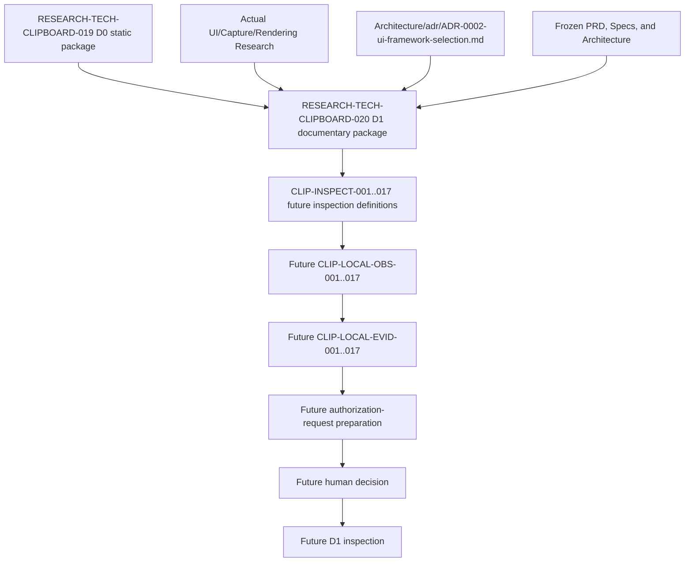

# Clipboard Integration D1 Read-only Local Prerequisite Documentary Package

## 1. Document Control

| Field | Value |
|---|---|
| Document ID | `RESEARCH-TECH-CLIPBOARD-020` |
| Title | Clipboard Integration D1 Read-only Local Prerequisite Documentary Package |
| Status | Draft |
| Research Type | Read-only Local Prerequisite Documentary Package |
| Technology Decision | TD-004 Clipboard Integration |
| Package | `CLIP-EVIDPKG-002` |
| Acquisition Stage | D1 — Read-only Local Prerequisite Evidence |
| Parent D0 Package | `RESEARCH-TECH-CLIPBOARD-019` |
| Parent Package Specification | `RESEARCH-TECH-CLIPBOARD-018` |
| Parent Evidence Acquisition Plan | `RESEARCH-TECH-CLIPBOARD-017` |
| Covered Inspection Items | `CLIP-INSPECT-001..017` |
| Covered Observation IDs | `CLIP-LOCAL-OBS-001..017` |
| Covered Evidence IDs | `CLIP-LOCAL-EVID-001..017` |
| Local Inspection Authorization Request | Not created |
| Request ID | Not created |
| Human Authorization Decision | Not made |
| Inspection Authorization | Not granted |
| Local/Package Cache Inspection | Not performed |
| Session Observation | Not created |
| Persistent Evidence | Not created |
| Clipboard Read/Write/Clear | Not performed |
| Project/Restore/Build/Runtime | Not performed |
| Candidate Ranking/Selection | Not performed |
| Technology Recommendation/Decision | Not made |
| Clipboard ADR | Not created |
| Owner | TBD |
| Last reviewed | Not reviewed |

## 2. Purpose and Fixed Boundary

This document defines how the seventeen named inspection items are organized into a D1 documentary package. It supplies complete documentary inputs, questions, data-source classes, read-only tool classes, parameter boundaries, Allowlist, Denylist, privacy controls, stop conditions, and observation contracts for a possible later authorization-request preparation step.

This document is not an Authorization Request, human decision, inspection execution, observation record, evidence record, command/API execution, or Clipboard operation. Completion of this package does not make any inspection executable.

The package preserves upstream identity and status. It does not create an eighteenth inspection item, change an inspection item or gap status, renumber, merge, split, create a Request, create an observation, create evidence, or execute any planned operation.

## 3. Source Preservation

- `RESEARCH-TECH-CLIPBOARD-010..014`
- `RESEARCH-TECH-CLIPBOARD-017..019`
- `CLIP-INSPECT-001..017`
- `CLIP-INSPECT-REQREADY-001..017`
- `CLIP-INSPECT-REQREADY-GAP-001..008`
- `CLIP-INSPECT-REQCLOSE-001..008`
- `CLIP-INSPECT-DOCCLOSE-001..008`
- `CLIP-LOCAL-OBS-001..017`
- `CLIP-LOCAL-EVID-001..017`
- `CLIP-D0-ITEM-001..020`
- `C-LI1`, `C-LI2`, `C-LI3`
- `CLIP-EVIDPKG-002`

No upstream Inspection Item or Gap status is changed. No identifier is renumbered, merged, or split. No actual Request, Decision, Observation, or execution is created.

## 4. Controlled Vocabulary

### 4.1 D1 Documentary Item Status

- Documentary scope complete
- Documentary scope complete with limitation
- Documentary scope partially complete
- Blocked by static ambiguity
- Deferred
- Not applicable

### 4.2 D1 Package Readiness

- Ready for future authorization-request preparation
- Conditionally ready for future authorization-request preparation
- Not ready for future authorization-request preparation

### 4.3 Inspection State

- Not authorized
- Not executed
- Not observed

### 4.4 Prohibited Conclusions

The following conclusions are not available from this document: Authorized, Approved, Executed, Observed, Passed, Verified, or Available locally.

## 5. D1 Documentary Item Binding

| D1 Documentary Item | Inspection Item | Future Observation | Future Evidence |
|---|---|---|---|
| `CLIP-D1-DOCITEM-001` | `CLIP-INSPECT-001` | `CLIP-LOCAL-OBS-001` | `CLIP-LOCAL-EVID-001` |
| `CLIP-D1-DOCITEM-002` | `CLIP-INSPECT-002` | `CLIP-LOCAL-OBS-002` | `CLIP-LOCAL-EVID-002` |
| `CLIP-D1-DOCITEM-003` | `CLIP-INSPECT-003` | `CLIP-LOCAL-OBS-003` | `CLIP-LOCAL-EVID-003` |
| `CLIP-D1-DOCITEM-004` | `CLIP-INSPECT-004` | `CLIP-LOCAL-OBS-004` | `CLIP-LOCAL-EVID-004` |
| `CLIP-D1-DOCITEM-005` | `CLIP-INSPECT-005` | `CLIP-LOCAL-OBS-005` | `CLIP-LOCAL-EVID-005` |
| `CLIP-D1-DOCITEM-006` | `CLIP-INSPECT-006` | `CLIP-LOCAL-OBS-006` | `CLIP-LOCAL-EVID-006` |
| `CLIP-D1-DOCITEM-007` | `CLIP-INSPECT-007` | `CLIP-LOCAL-OBS-007` | `CLIP-LOCAL-EVID-007` |
| `CLIP-D1-DOCITEM-008` | `CLIP-INSPECT-008` | `CLIP-LOCAL-OBS-008` | `CLIP-LOCAL-EVID-008` |
| `CLIP-D1-DOCITEM-009` | `CLIP-INSPECT-009` | `CLIP-LOCAL-OBS-009` | `CLIP-LOCAL-EVID-009` |
| `CLIP-D1-DOCITEM-010` | `CLIP-INSPECT-010` | `CLIP-LOCAL-OBS-010` | `CLIP-LOCAL-EVID-010` |
| `CLIP-D1-DOCITEM-011` | `CLIP-INSPECT-011` | `CLIP-LOCAL-OBS-011` | `CLIP-LOCAL-EVID-011` |
| `CLIP-D1-DOCITEM-012` | `CLIP-INSPECT-012` | `CLIP-LOCAL-OBS-012` | `CLIP-LOCAL-EVID-012` |
| `CLIP-D1-DOCITEM-013` | `CLIP-INSPECT-013` | `CLIP-LOCAL-OBS-013` | `CLIP-LOCAL-EVID-013` |
| `CLIP-D1-DOCITEM-014` | `CLIP-INSPECT-014` | `CLIP-LOCAL-OBS-014` | `CLIP-LOCAL-EVID-014` |
| `CLIP-D1-DOCITEM-015` | `CLIP-INSPECT-015` | `CLIP-LOCAL-OBS-015` | `CLIP-LOCAL-EVID-015` |
| `CLIP-D1-DOCITEM-016` | `CLIP-INSPECT-016` | `CLIP-LOCAL-OBS-016` | `CLIP-LOCAL-EVID-016` |
| `CLIP-D1-DOCITEM-017` | `CLIP-INSPECT-017` | `CLIP-LOCAL-OBS-017` | `CLIP-LOCAL-EVID-017` |

Binding rules:

- The seventeen groups are one-to-one and preserve their upstream order.
- Every D1 item points to its related D0 static input; no D1 item merges or splits an upstream item.
- No eighteenth item is introduced.
- Package completion is documentary completeness only and does not make inspection executable.
- Static contradictions are recorded only as a D1 Documentary Gap; execution absence is not a D1 documentary gap.

### `CLIP-D1-DOCITEM-001`

| Field | Value |
|---|---|
| D1 Documentary Item ID | `CLIP-D1-DOCITEM-001` |
| Source Inspection Item | `CLIP-INSPECT-001` |
| Source Readiness Item | `CLIP-INSPECT-REQREADY-001` |
| Future Observation ID | `CLIP-LOCAL-OBS-001` |
| Future Evidence ID | `CLIP-LOCAL-EVID-001` |
| Related D0 Items | `CLIP-D0-ITEM-001` |
| Related Decision Gaps | `CLIP-DEC-GAP-001` |
| Related Candidate | `CLIP-OPT-001` |
| Related Host | `WPF` |
| Related Pair | `CLIP-PAIR-001` |
| Related Decision Criteria | `CLIP-DEC-CRIT-001` |
| Related ADR Gates | `CLIP-ADR-GATE-001` |
| Related Batch | `C-LI1` |
| D0 static prerequisite | Static identity, boundary, and limitation records from `CLIP-D0-ITEM-001`; no local result is inferred. |
| D0 limitation | D0 identifies the question and boundary but does not establish local availability or an executable target. |
| Exact remaining local question | Which public repository-boundary metadata can be described for the named workspace without expanding scope? |
| Why local observation is required | The question concerns a named local metadata boundary that the D0 package cannot establish from documentary sources alone. |
| Exact data-source class | `Named Repository path metadata` |
| Exact tool/executable class | `Repository path metadata reader class` |
| Permitted operation class | Read-only metadata observation class; not executed. |
| Exact target-resolution rule | Resolve only the named target from the future Request; if it cannot be resolved safely, stop the item without expanding scope. |
| Maximum target scope | One named target class or one explicitly named path; no drive-wide, profile-wide, or repository-wide search. |
| Recursion rule | No recursion unless a future Request names one directory and a maximum depth; this package grants none. |
| Maximum recursion depth | `0` under this package. |
| Wildcard rule | No wildcard; a future Request may name one single target class only. |
| Pipeline rule | No pipeline composition. |
| Permitted parameter classes | Named target/path, public metadata field selection, and sanitization selector only. |
| Prohibited parameter classes | Mutation, elevation, network, process launch, Clipboard access, recursion, wildcard expansion, redirection, credential access, and environment mutation parameters. |
| Network boundary | No network. |
| Administrator boundary | Standard user only. |
| Repository mutation boundary | No mutation. |
| Registry mutation boundary | No mutation. |
| Package Cache mutation boundary | No mutation. |
| Clipboard-access boundary | No access. |
| File-output boundary | No output. |
| Output-redirection boundary | No redirection. |
| Process-launch boundary | No application launch. |
| Credential-access boundary | No credential values. |
| Permitted session observation fields | Public version, architecture, named asset existence, named public identity, sanitized path representation, public package-source hostname, credential presence as Present/Absent/Not inspected, error category, and stop-condition trigger. |
| Prohibited observation fields | Credential value, token, private key, SID, account identity, computer name, Clipboard content, window title, desktop content, full private path, and full environment dump. |
| Sanitization rule | Retain only the minimum public identity, version, existence, and sanitized path representation needed for the item; remove private path segments and sensitive values before any future record. |
| Sensitive-data classification | Public metadata may be retained in bounded form; private paths are sanitized; credentials, tokens, private keys, SIDs, and account identities are stop-condition data. |
| Item-level stop conditions | Target unresolved, scope expansion required, sensitive data encountered, mutation risk detected, network required, elevation required, Clipboard access required, process launch required, or unsupported read-only method. |
| Batch-level stop effect | Stop the item immediately; if the effect on the shared batch boundary is unclear, stop the whole batch. |
| Cleanup obligation | No cleanup operation is authorized; leave repository, Registry, cache, Clipboard, environment, and processes unchanged. |
| Not-observed interpretation | Not observed means no local observation exists; it is not a failure, absence, unsupported method, or approval. |
| Error interpretation | Classify the error using Section 12 and stop or defer as specified; do not infer local availability from an error-free documentary plan. |
| Persistent Evidence separation | Any future persistent Evidence requires separate authority and must not be created by a session observation. |
| Shared UI authority dependency | This item cannot change Shared Workflow State, Capture, Rendering, File Output, or user-flow authority. |
| Clipboard-specific authority dependency | No Clipboard Read, Write, Clear, history, cloud, or payload access is included. |
| Future Request packaging requirement | A future Request must copy this item’s exact data-source class, target rule, parameter Allowlist, Denylist, observation fields, privacy controls, and stop conditions. |
| Current authorization | Not granted. |
| Execution permitted | No. |
| Observation state | Not observed. |
| Owner | TBD. |
| Documentary status | Documentary scope complete with limitation. |
| Open questions | Whether a future human-authorized inspection can resolve the named target and return only the permitted sanitized fields; no action is taken here. |

### `CLIP-D1-DOCITEM-002`

| Field | Value |
|---|---|
| D1 Documentary Item ID | `CLIP-D1-DOCITEM-002` |
| Source Inspection Item | `CLIP-INSPECT-002` |
| Source Readiness Item | `CLIP-INSPECT-REQREADY-002` |
| Future Observation ID | `CLIP-LOCAL-OBS-002` |
| Future Evidence ID | `CLIP-LOCAL-EVID-002` |
| Related D0 Items | `CLIP-D0-ITEM-002` |
| Related Decision Gaps | `CLIP-DEC-GAP-002` |
| Related Candidate | `CLIP-OPT-001` |
| Related Host | `WinUI 3` |
| Related Pair | `CLIP-PAIR-002` |
| Related Decision Criteria | `CLIP-DEC-CRIT-002` |
| Related ADR Gates | `CLIP-ADR-GATE-002` |
| Related Batch | `C-LI1` |
| D0 static prerequisite | Static identity, boundary, and limitation records from `CLIP-D0-ITEM-002`; no local result is inferred. |
| D0 limitation | D0 provides static identity and boundary only; local existence remains unobserved. |
| Exact remaining local question | Can the named UI, Capture, and Rendering research document identities be described at their known paths? |
| Why local observation is required | The question concerns a named local metadata boundary that the D0 package cannot establish from documentary sources alone. |
| Exact data-source class | `Named Repository path metadata` |
| Exact tool/executable class | `Document identity metadata reader class` |
| Permitted operation class | Read-only metadata observation class; not executed. |
| Exact target-resolution rule | Resolve only the named target from the future Request; if it cannot be resolved safely, stop the item without expanding scope. |
| Maximum target scope | One named target class or one explicitly named path; no drive-wide, profile-wide, or repository-wide search. |
| Recursion rule | No recursion unless a future Request names one directory and a maximum depth; this package grants none. |
| Maximum recursion depth | `0` under this package. |
| Wildcard rule | No wildcard; a future Request may name one single target class only. |
| Pipeline rule | No pipeline composition. |
| Permitted parameter classes | Named target/path, public metadata field selection, and sanitization selector only. |
| Prohibited parameter classes | Mutation, elevation, network, process launch, Clipboard access, recursion, wildcard expansion, redirection, credential access, and environment mutation parameters. |
| Network boundary | No network. |
| Administrator boundary | Standard user only. |
| Repository mutation boundary | No mutation. |
| Registry mutation boundary | No mutation. |
| Package Cache mutation boundary | No mutation. |
| Clipboard-access boundary | No access. |
| File-output boundary | No output. |
| Output-redirection boundary | No redirection. |
| Process-launch boundary | No application launch. |
| Credential-access boundary | No credential values. |
| Permitted session observation fields | Public version, architecture, named asset existence, named public identity, sanitized path representation, public package-source hostname, credential presence as Present/Absent/Not inspected, error category, and stop-condition trigger. |
| Prohibited observation fields | Credential value, token, private key, SID, account identity, computer name, Clipboard content, window title, desktop content, full private path, and full environment dump. |
| Sanitization rule | Retain only the minimum public identity, version, existence, and sanitized path representation needed for the item; remove private path segments and sensitive values before any future record. |
| Sensitive-data classification | Public metadata may be retained in bounded form; private paths are sanitized; credentials, tokens, private keys, SIDs, and account identities are stop-condition data. |
| Item-level stop conditions | Target unresolved, scope expansion required, sensitive data encountered, mutation risk detected, network required, elevation required, Clipboard access required, process launch required, or unsupported read-only method. |
| Batch-level stop effect | Stop the item immediately; if the effect on the shared batch boundary is unclear, stop the whole batch. |
| Cleanup obligation | No cleanup operation is authorized; leave repository, Registry, cache, Clipboard, environment, and processes unchanged. |
| Not-observed interpretation | Not observed means no local observation exists; it is not a failure, absence, unsupported method, or approval. |
| Error interpretation | Classify the error using Section 12 and stop or defer as specified; do not infer local availability from an error-free documentary plan. |
| Persistent Evidence separation | Any future persistent Evidence requires separate authority and must not be created by a session observation. |
| Shared UI authority dependency | This item cannot change Shared Workflow State, Capture, Rendering, File Output, or user-flow authority. |
| Clipboard-specific authority dependency | No Clipboard Read, Write, Clear, history, cloud, or payload access is included. |
| Future Request packaging requirement | A future Request must copy this item’s exact data-source class, target rule, parameter Allowlist, Denylist, observation fields, privacy controls, and stop conditions. |
| Current authorization | Not granted. |
| Execution permitted | No. |
| Observation state | Not observed. |
| Owner | TBD. |
| Documentary status | Documentary scope complete with limitation. |
| Open questions | Whether a future human-authorized inspection can resolve the named target and return only the permitted sanitized fields; no action is taken here. |

### `CLIP-D1-DOCITEM-003`

| Field | Value |
|---|---|
| D1 Documentary Item ID | `CLIP-D1-DOCITEM-003` |
| Source Inspection Item | `CLIP-INSPECT-003` |
| Source Readiness Item | `CLIP-INSPECT-REQREADY-003` |
| Future Observation ID | `CLIP-LOCAL-OBS-003` |
| Future Evidence ID | `CLIP-LOCAL-EVID-003` |
| Related D0 Items | `CLIP-D0-ITEM-003` |
| Related Decision Gaps | `CLIP-DEC-GAP-003` |
| Related Candidate | `CLIP-OPT-001` |
| Related Host | `WPF` |
| Related Pair | `CLIP-PAIR-003` |
| Related Decision Criteria | `CLIP-DEC-CRIT-003` |
| Related ADR Gates | `CLIP-ADR-GATE-003` |
| Related Batch | `C-LI1` |
| D0 static prerequisite | Static identity, boundary, and limitation records from `CLIP-D0-ITEM-003`; no local result is inferred. |
| D0 limitation | D0 provides static identity and boundary only; local existence remains unobserved. |
| Exact remaining local question | Which public Windows edition, build, and architecture fields are available under the stated boundary? |
| Why local observation is required | The question concerns a named local metadata boundary that the D0 package cannot establish from documentary sources alone. |
| Exact data-source class | `OS/architecture metadata` |
| Exact tool/executable class | `OS metadata reader class` |
| Permitted operation class | Read-only metadata observation class; not executed. |
| Exact target-resolution rule | Resolve only the named target from the future Request; if it cannot be resolved safely, stop the item without expanding scope. |
| Maximum target scope | One named target class or one explicitly named path; no drive-wide, profile-wide, or repository-wide search. |
| Recursion rule | No recursion unless a future Request names one directory and a maximum depth; this package grants none. |
| Maximum recursion depth | `0` under this package. |
| Wildcard rule | No wildcard; a future Request may name one single target class only. |
| Pipeline rule | No pipeline composition. |
| Permitted parameter classes | Named target/path, public metadata field selection, and sanitization selector only. |
| Prohibited parameter classes | Mutation, elevation, network, process launch, Clipboard access, recursion, wildcard expansion, redirection, credential access, and environment mutation parameters. |
| Network boundary | No network. |
| Administrator boundary | Standard user only. |
| Repository mutation boundary | No mutation. |
| Registry mutation boundary | No mutation. |
| Package Cache mutation boundary | No mutation. |
| Clipboard-access boundary | No access. |
| File-output boundary | No output. |
| Output-redirection boundary | No redirection. |
| Process-launch boundary | No application launch. |
| Credential-access boundary | No credential values. |
| Permitted session observation fields | Public version, architecture, named asset existence, named public identity, sanitized path representation, public package-source hostname, credential presence as Present/Absent/Not inspected, error category, and stop-condition trigger. |
| Prohibited observation fields | Credential value, token, private key, SID, account identity, computer name, Clipboard content, window title, desktop content, full private path, and full environment dump. |
| Sanitization rule | Retain only the minimum public identity, version, existence, and sanitized path representation needed for the item; remove private path segments and sensitive values before any future record. |
| Sensitive-data classification | Public metadata may be retained in bounded form; private paths are sanitized; credentials, tokens, private keys, SIDs, and account identities are stop-condition data. |
| Item-level stop conditions | Target unresolved, scope expansion required, sensitive data encountered, mutation risk detected, network required, elevation required, Clipboard access required, process launch required, or unsupported read-only method. |
| Batch-level stop effect | Stop the item immediately; if the effect on the shared batch boundary is unclear, stop the whole batch. |
| Cleanup obligation | No cleanup operation is authorized; leave repository, Registry, cache, Clipboard, environment, and processes unchanged. |
| Not-observed interpretation | Not observed means no local observation exists; it is not a failure, absence, unsupported method, or approval. |
| Error interpretation | Classify the error using Section 12 and stop or defer as specified; do not infer local availability from an error-free documentary plan. |
| Persistent Evidence separation | Any future persistent Evidence requires separate authority and must not be created by a session observation. |
| Shared UI authority dependency | This item cannot change Shared Workflow State, Capture, Rendering, File Output, or user-flow authority. |
| Clipboard-specific authority dependency | No Clipboard Read, Write, Clear, history, cloud, or payload access is included. |
| Future Request packaging requirement | A future Request must copy this item’s exact data-source class, target rule, parameter Allowlist, Denylist, observation fields, privacy controls, and stop conditions. |
| Current authorization | Not granted. |
| Execution permitted | No. |
| Observation state | Not observed. |
| Owner | TBD. |
| Documentary status | Documentary scope complete with limitation. |
| Open questions | Whether a future human-authorized inspection can resolve the named target and return only the permitted sanitized fields; no action is taken here. |

### `CLIP-D1-DOCITEM-004`

| Field | Value |
|---|---|
| D1 Documentary Item ID | `CLIP-D1-DOCITEM-004` |
| Source Inspection Item | `CLIP-INSPECT-004` |
| Source Readiness Item | `CLIP-INSPECT-REQREADY-004` |
| Future Observation ID | `CLIP-LOCAL-OBS-004` |
| Future Evidence ID | `CLIP-LOCAL-EVID-004` |
| Related D0 Items | `CLIP-D0-ITEM-004` |
| Related Decision Gaps | `CLIP-DEC-GAP-004` |
| Related Candidate | `CLIP-OPT-002` |
| Related Host | `WinUI 3` |
| Related Pair | `CLIP-PAIR-004` |
| Related Decision Criteria | `CLIP-DEC-CRIT-004` |
| Related ADR Gates | `CLIP-ADR-GATE-004` |
| Related Batch | `C-LI1` |
| D0 static prerequisite | Static identity, boundary, and limitation records from `CLIP-D0-ITEM-004`; no local result is inferred. |
| D0 limitation | D0 identifies the question and boundary but does not establish local availability or an executable target. |
| Exact remaining local question | Which named WPF, WinUI 3, and Windows App SDK asset identities can be described without activation? |
| Why local observation is required | The question concerns a named local metadata boundary that the D0 package cannot establish from documentary sources alone. |
| Exact data-source class | `Named reference assembly metadata` |
| Exact tool/executable class | `Named asset metadata reader class` |
| Permitted operation class | Read-only metadata observation class; not executed. |
| Exact target-resolution rule | Resolve only the named target from the future Request; if it cannot be resolved safely, stop the item without expanding scope. |
| Maximum target scope | One named target class or one explicitly named path; no drive-wide, profile-wide, or repository-wide search. |
| Recursion rule | No recursion unless a future Request names one directory and a maximum depth; this package grants none. |
| Maximum recursion depth | `0` under this package. |
| Wildcard rule | No wildcard; a future Request may name one single target class only. |
| Pipeline rule | No pipeline composition. |
| Permitted parameter classes | Named target/path, public metadata field selection, and sanitization selector only. |
| Prohibited parameter classes | Mutation, elevation, network, process launch, Clipboard access, recursion, wildcard expansion, redirection, credential access, and environment mutation parameters. |
| Network boundary | No network. |
| Administrator boundary | Standard user only. |
| Repository mutation boundary | No mutation. |
| Registry mutation boundary | No mutation. |
| Package Cache mutation boundary | No mutation. |
| Clipboard-access boundary | No access. |
| File-output boundary | No output. |
| Output-redirection boundary | No redirection. |
| Process-launch boundary | No application launch. |
| Credential-access boundary | No credential values. |
| Permitted session observation fields | Public version, architecture, named asset existence, named public identity, sanitized path representation, public package-source hostname, credential presence as Present/Absent/Not inspected, error category, and stop-condition trigger. |
| Prohibited observation fields | Credential value, token, private key, SID, account identity, computer name, Clipboard content, window title, desktop content, full private path, and full environment dump. |
| Sanitization rule | Retain only the minimum public identity, version, existence, and sanitized path representation needed for the item; remove private path segments and sensitive values before any future record. |
| Sensitive-data classification | Public metadata may be retained in bounded form; private paths are sanitized; credentials, tokens, private keys, SIDs, and account identities are stop-condition data. |
| Item-level stop conditions | Target unresolved, scope expansion required, sensitive data encountered, mutation risk detected, network required, elevation required, Clipboard access required, process launch required, or unsupported read-only method. |
| Batch-level stop effect | Stop the item immediately; if the effect on the shared batch boundary is unclear, stop the whole batch. |
| Cleanup obligation | No cleanup operation is authorized; leave repository, Registry, cache, Clipboard, environment, and processes unchanged. |
| Not-observed interpretation | Not observed means no local observation exists; it is not a failure, absence, unsupported method, or approval. |
| Error interpretation | Classify the error using Section 12 and stop or defer as specified; do not infer local availability from an error-free documentary plan. |
| Persistent Evidence separation | Any future persistent Evidence requires separate authority and must not be created by a session observation. |
| Shared UI authority dependency | This item cannot change Shared Workflow State, Capture, Rendering, File Output, or user-flow authority. |
| Clipboard-specific authority dependency | No Clipboard Read, Write, Clear, history, cloud, or payload access is included. |
| Future Request packaging requirement | A future Request must copy this item’s exact data-source class, target rule, parameter Allowlist, Denylist, observation fields, privacy controls, and stop conditions. |
| Current authorization | Not granted. |
| Execution permitted | No. |
| Observation state | Not observed. |
| Owner | TBD. |
| Documentary status | Documentary scope complete with limitation. |
| Open questions | Whether a future human-authorized inspection can resolve the named target and return only the permitted sanitized fields; no action is taken here. |

### `CLIP-D1-DOCITEM-005`

| Field | Value |
|---|---|
| D1 Documentary Item ID | `CLIP-D1-DOCITEM-005` |
| Source Inspection Item | `CLIP-INSPECT-005` |
| Source Readiness Item | `CLIP-INSPECT-REQREADY-005` |
| Future Observation ID | `CLIP-LOCAL-OBS-005` |
| Future Evidence ID | `CLIP-LOCAL-EVID-005` |
| Related D0 Items | `CLIP-D0-ITEM-005` |
| Related Decision Gaps | `CLIP-DEC-GAP-005` |
| Related Candidate | `CLIP-OPT-002` |
| Related Host | `WPF` |
| Related Pair | `CLIP-PAIR-005` |
| Related Decision Criteria | `CLIP-DEC-CRIT-005` |
| Related ADR Gates | `CLIP-ADR-GATE-005` |
| Related Batch | `C-LI1` |
| D0 static prerequisite | Static identity, boundary, and limitation records from `CLIP-D0-ITEM-005`; no local result is inferred. |
| D0 limitation | D0 identifies the question and boundary but does not establish local availability or an executable target. |
| Exact remaining local question | Which named solution and project metadata defines the future experimental boundary? |
| Why local observation is required | The question concerns a named local metadata boundary that the D0 package cannot establish from documentary sources alone. |
| Exact data-source class | `Named Project/Solution metadata` |
| Exact tool/executable class | `Project metadata reader class` |
| Permitted operation class | Read-only metadata observation class; not executed. |
| Exact target-resolution rule | Resolve only the named target from the future Request; if it cannot be resolved safely, stop the item without expanding scope. |
| Maximum target scope | One named target class or one explicitly named path; no drive-wide, profile-wide, or repository-wide search. |
| Recursion rule | No recursion unless a future Request names one directory and a maximum depth; this package grants none. |
| Maximum recursion depth | `0` under this package. |
| Wildcard rule | No wildcard; a future Request may name one single target class only. |
| Pipeline rule | No pipeline composition. |
| Permitted parameter classes | Named target/path, public metadata field selection, and sanitization selector only. |
| Prohibited parameter classes | Mutation, elevation, network, process launch, Clipboard access, recursion, wildcard expansion, redirection, credential access, and environment mutation parameters. |
| Network boundary | No network. |
| Administrator boundary | Standard user only. |
| Repository mutation boundary | No mutation. |
| Registry mutation boundary | No mutation. |
| Package Cache mutation boundary | No mutation. |
| Clipboard-access boundary | No access. |
| File-output boundary | No output. |
| Output-redirection boundary | No redirection. |
| Process-launch boundary | No application launch. |
| Credential-access boundary | No credential values. |
| Permitted session observation fields | Public version, architecture, named asset existence, named public identity, sanitized path representation, public package-source hostname, credential presence as Present/Absent/Not inspected, error category, and stop-condition trigger. |
| Prohibited observation fields | Credential value, token, private key, SID, account identity, computer name, Clipboard content, window title, desktop content, full private path, and full environment dump. |
| Sanitization rule | Retain only the minimum public identity, version, existence, and sanitized path representation needed for the item; remove private path segments and sensitive values before any future record. |
| Sensitive-data classification | Public metadata may be retained in bounded form; private paths are sanitized; credentials, tokens, private keys, SIDs, and account identities are stop-condition data. |
| Item-level stop conditions | Target unresolved, scope expansion required, sensitive data encountered, mutation risk detected, network required, elevation required, Clipboard access required, process launch required, or unsupported read-only method. |
| Batch-level stop effect | Stop the item immediately; if the effect on the shared batch boundary is unclear, stop the whole batch. |
| Cleanup obligation | No cleanup operation is authorized; leave repository, Registry, cache, Clipboard, environment, and processes unchanged. |
| Not-observed interpretation | Not observed means no local observation exists; it is not a failure, absence, unsupported method, or approval. |
| Error interpretation | Classify the error using Section 12 and stop or defer as specified; do not infer local availability from an error-free documentary plan. |
| Persistent Evidence separation | Any future persistent Evidence requires separate authority and must not be created by a session observation. |
| Shared UI authority dependency | This item cannot change Shared Workflow State, Capture, Rendering, File Output, or user-flow authority. |
| Clipboard-specific authority dependency | No Clipboard Read, Write, Clear, history, cloud, or payload access is included. |
| Future Request packaging requirement | A future Request must copy this item’s exact data-source class, target rule, parameter Allowlist, Denylist, observation fields, privacy controls, and stop conditions. |
| Current authorization | Not granted. |
| Execution permitted | No. |
| Observation state | Not observed. |
| Owner | TBD. |
| Documentary status | Documentary scope complete with limitation. |
| Open questions | Whether a future human-authorized inspection can resolve the named target and return only the permitted sanitized fields; no action is taken here. |

### `CLIP-D1-DOCITEM-006`

| Field | Value |
|---|---|
| D1 Documentary Item ID | `CLIP-D1-DOCITEM-006` |
| Source Inspection Item | `CLIP-INSPECT-006` |
| Source Readiness Item | `CLIP-INSPECT-REQREADY-006` |
| Future Observation ID | `CLIP-LOCAL-OBS-006` |
| Future Evidence ID | `CLIP-LOCAL-EVID-006` |
| Related D0 Items | `CLIP-D0-ITEM-006` |
| Related Decision Gaps | `CLIP-DEC-GAP-006` |
| Related Candidate | `CLIP-OPT-002` |
| Related Host | `WinUI 3` |
| Related Pair | `CLIP-PAIR-006` |
| Related Decision Criteria | `CLIP-DEC-CRIT-006` |
| Related ADR Gates | `CLIP-ADR-GATE-006` |
| Related Batch | `C-LI1` |
| D0 static prerequisite | Static identity, boundary, and limitation records from `CLIP-D0-ITEM-006`; no local result is inferred. |
| D0 limitation | D0 provides static identity and boundary only; local existence remains unobserved. |
| Exact remaining local question | Can the named package-cache location be represented in sanitized form without changing it? |
| Why local observation is required | The question concerns a named local metadata boundary that the D0 package cannot establish from documentary sources alone. |
| Exact data-source class | `Named Package Cache metadata` |
| Exact tool/executable class | `Package Cache metadata reader class` |
| Permitted operation class | Read-only metadata observation class; not executed. |
| Exact target-resolution rule | Resolve only the named target from the future Request; if it cannot be resolved safely, stop the item without expanding scope. |
| Maximum target scope | One named target class or one explicitly named path; no drive-wide, profile-wide, or repository-wide search. |
| Recursion rule | No recursion unless a future Request names one directory and a maximum depth; this package grants none. |
| Maximum recursion depth | `0` under this package. |
| Wildcard rule | No wildcard; a future Request may name one single target class only. |
| Pipeline rule | No pipeline composition. |
| Permitted parameter classes | Named target/path, public metadata field selection, and sanitization selector only. |
| Prohibited parameter classes | Mutation, elevation, network, process launch, Clipboard access, recursion, wildcard expansion, redirection, credential access, and environment mutation parameters. |
| Network boundary | No network. |
| Administrator boundary | Standard user only. |
| Repository mutation boundary | No mutation. |
| Registry mutation boundary | No mutation. |
| Package Cache mutation boundary | No mutation. |
| Clipboard-access boundary | No access. |
| File-output boundary | No output. |
| Output-redirection boundary | No redirection. |
| Process-launch boundary | No application launch. |
| Credential-access boundary | No credential values. |
| Permitted session observation fields | Public version, architecture, named asset existence, named public identity, sanitized path representation, public package-source hostname, credential presence as Present/Absent/Not inspected, error category, and stop-condition trigger. |
| Prohibited observation fields | Credential value, token, private key, SID, account identity, computer name, Clipboard content, window title, desktop content, full private path, and full environment dump. |
| Sanitization rule | Retain only the minimum public identity, version, existence, and sanitized path representation needed for the item; remove private path segments and sensitive values before any future record. |
| Sensitive-data classification | Public metadata may be retained in bounded form; private paths are sanitized; credentials, tokens, private keys, SIDs, and account identities are stop-condition data. |
| Item-level stop conditions | Target unresolved, scope expansion required, sensitive data encountered, mutation risk detected, network required, elevation required, Clipboard access required, process launch required, or unsupported read-only method. |
| Batch-level stop effect | Stop the item immediately; if the effect on the shared batch boundary is unclear, stop the whole batch. |
| Cleanup obligation | No cleanup operation is authorized; leave repository, Registry, cache, Clipboard, environment, and processes unchanged. |
| Not-observed interpretation | Not observed means no local observation exists; it is not a failure, absence, unsupported method, or approval. |
| Error interpretation | Classify the error using Section 12 and stop or defer as specified; do not infer local availability from an error-free documentary plan. |
| Persistent Evidence separation | Any future persistent Evidence requires separate authority and must not be created by a session observation. |
| Shared UI authority dependency | This item cannot change Shared Workflow State, Capture, Rendering, File Output, or user-flow authority. |
| Clipboard-specific authority dependency | No Clipboard Read, Write, Clear, history, cloud, or payload access is included. |
| Future Request packaging requirement | A future Request must copy this item’s exact data-source class, target rule, parameter Allowlist, Denylist, observation fields, privacy controls, and stop conditions. |
| Current authorization | Not granted. |
| Execution permitted | No. |
| Observation state | Not observed. |
| Owner | TBD. |
| Documentary status | Documentary scope complete with limitation. |
| Open questions | Whether a future human-authorized inspection can resolve the named target and return only the permitted sanitized fields; no action is taken here. |

### `CLIP-D1-DOCITEM-007`

| Field | Value |
|---|---|
| D1 Documentary Item ID | `CLIP-D1-DOCITEM-007` |
| Source Inspection Item | `CLIP-INSPECT-007` |
| Source Readiness Item | `CLIP-INSPECT-REQREADY-007` |
| Future Observation ID | `CLIP-LOCAL-OBS-007` |
| Future Evidence ID | `CLIP-LOCAL-EVID-007` |
| Related D0 Items | `CLIP-D0-ITEM-007` |
| Related Decision Gaps | `CLIP-DEC-GAP-007` |
| Related Candidate | `CLIP-OPT-003` |
| Related Host | `WPF` |
| Related Pair | `CLIP-PAIR-007` |
| Related Decision Criteria | `CLIP-DEC-CRIT-007` |
| Related ADR Gates | `CLIP-ADR-GATE-007` |
| Related Batch | `C-LI2` |
| D0 static prerequisite | Static identity, boundary, and limitation records from `CLIP-D0-ITEM-007`; no local result is inferred. |
| D0 limitation | D0 provides static identity and boundary only; local existence remains unobserved. |
| Exact remaining local question | Which named package IDs and public versions are already represented without download or update? |
| Why local observation is required | The question concerns a named local metadata boundary that the D0 package cannot establish from documentary sources alone. |
| Exact data-source class | `Named NuGet package metadata` |
| Exact tool/executable class | `Named package metadata reader class` |
| Permitted operation class | Read-only metadata observation class; not executed. |
| Exact target-resolution rule | Resolve only the named target from the future Request; if it cannot be resolved safely, stop the item without expanding scope. |
| Maximum target scope | One named target class or one explicitly named path; no drive-wide, profile-wide, or repository-wide search. |
| Recursion rule | No recursion unless a future Request names one directory and a maximum depth; this package grants none. |
| Maximum recursion depth | `0` under this package. |
| Wildcard rule | No wildcard; a future Request may name one single target class only. |
| Pipeline rule | No pipeline composition. |
| Permitted parameter classes | Named target/path, public metadata field selection, and sanitization selector only. |
| Prohibited parameter classes | Mutation, elevation, network, process launch, Clipboard access, recursion, wildcard expansion, redirection, credential access, and environment mutation parameters. |
| Network boundary | No network. |
| Administrator boundary | Standard user only. |
| Repository mutation boundary | No mutation. |
| Registry mutation boundary | No mutation. |
| Package Cache mutation boundary | No mutation. |
| Clipboard-access boundary | No access. |
| File-output boundary | No output. |
| Output-redirection boundary | No redirection. |
| Process-launch boundary | No application launch. |
| Credential-access boundary | No credential values. |
| Permitted session observation fields | Public version, architecture, named asset existence, named public identity, sanitized path representation, public package-source hostname, credential presence as Present/Absent/Not inspected, error category, and stop-condition trigger. |
| Prohibited observation fields | Credential value, token, private key, SID, account identity, computer name, Clipboard content, window title, desktop content, full private path, and full environment dump. |
| Sanitization rule | Retain only the minimum public identity, version, existence, and sanitized path representation needed for the item; remove private path segments and sensitive values before any future record. |
| Sensitive-data classification | Public metadata may be retained in bounded form; private paths are sanitized; credentials, tokens, private keys, SIDs, and account identities are stop-condition data. |
| Item-level stop conditions | Target unresolved, scope expansion required, sensitive data encountered, mutation risk detected, network required, elevation required, Clipboard access required, process launch required, or unsupported read-only method. |
| Batch-level stop effect | Stop the item immediately; if the effect on the shared batch boundary is unclear, stop the whole batch. |
| Cleanup obligation | No cleanup operation is authorized; leave repository, Registry, cache, Clipboard, environment, and processes unchanged. |
| Not-observed interpretation | Not observed means no local observation exists; it is not a failure, absence, unsupported method, or approval. |
| Error interpretation | Classify the error using Section 12 and stop or defer as specified; do not infer local availability from an error-free documentary plan. |
| Persistent Evidence separation | Any future persistent Evidence requires separate authority and must not be created by a session observation. |
| Shared UI authority dependency | This item cannot change Shared Workflow State, Capture, Rendering, File Output, or user-flow authority. |
| Clipboard-specific authority dependency | No Clipboard Read, Write, Clear, history, cloud, or payload access is included. |
| Future Request packaging requirement | A future Request must copy this item’s exact data-source class, target rule, parameter Allowlist, Denylist, observation fields, privacy controls, and stop conditions. |
| Current authorization | Not granted. |
| Execution permitted | No. |
| Observation state | Not observed. |
| Owner | TBD. |
| Documentary status | Documentary scope complete with limitation. |
| Open questions | Whether a future human-authorized inspection can resolve the named target and return only the permitted sanitized fields; no action is taken here. |

### `CLIP-D1-DOCITEM-008`

| Field | Value |
|---|---|
| D1 Documentary Item ID | `CLIP-D1-DOCITEM-008` |
| Source Inspection Item | `CLIP-INSPECT-008` |
| Source Readiness Item | `CLIP-INSPECT-REQREADY-008` |
| Future Observation ID | `CLIP-LOCAL-OBS-008` |
| Future Evidence ID | `CLIP-LOCAL-EVID-008` |
| Related D0 Items | `CLIP-D0-ITEM-008` |
| Related Decision Gaps | `CLIP-DEC-GAP-008` |
| Related Candidate | `CLIP-OPT-003` |
| Related Host | `WinUI 3` |
| Related Pair | `CLIP-PAIR-008` |
| Related Decision Criteria | `CLIP-DEC-CRIT-008` |
| Related ADR Gates | `CLIP-ADR-GATE-008` |
| Related Batch | `C-LI2` |
| D0 static prerequisite | Static identity, boundary, and limitation records from `CLIP-D0-ITEM-008`; no local result is inferred. |
| D0 limitation | D0 identifies the question and boundary but does not establish local availability or an executable target. |
| Exact remaining local question | Which named dependency, target-framework, runtime-identifier, and native-asset metadata can be described without Restore? |
| Why local observation is required | The question concerns a named local metadata boundary that the D0 package cannot establish from documentary sources alone. |
| Exact data-source class | `Named NuGet package metadata` |
| Exact tool/executable class | `Package dependency metadata reader class` |
| Permitted operation class | Read-only metadata observation class; not executed. |
| Exact target-resolution rule | Resolve only the named target from the future Request; if it cannot be resolved safely, stop the item without expanding scope. |
| Maximum target scope | One named target class or one explicitly named path; no drive-wide, profile-wide, or repository-wide search. |
| Recursion rule | No recursion unless a future Request names one directory and a maximum depth; this package grants none. |
| Maximum recursion depth | `0` under this package. |
| Wildcard rule | No wildcard; a future Request may name one single target class only. |
| Pipeline rule | No pipeline composition. |
| Permitted parameter classes | Named target/path, public metadata field selection, and sanitization selector only. |
| Prohibited parameter classes | Mutation, elevation, network, process launch, Clipboard access, recursion, wildcard expansion, redirection, credential access, and environment mutation parameters. |
| Network boundary | No network. |
| Administrator boundary | Standard user only. |
| Repository mutation boundary | No mutation. |
| Registry mutation boundary | No mutation. |
| Package Cache mutation boundary | No mutation. |
| Clipboard-access boundary | No access. |
| File-output boundary | No output. |
| Output-redirection boundary | No redirection. |
| Process-launch boundary | No application launch. |
| Credential-access boundary | No credential values. |
| Permitted session observation fields | Public version, architecture, named asset existence, named public identity, sanitized path representation, public package-source hostname, credential presence as Present/Absent/Not inspected, error category, and stop-condition trigger. |
| Prohibited observation fields | Credential value, token, private key, SID, account identity, computer name, Clipboard content, window title, desktop content, full private path, and full environment dump. |
| Sanitization rule | Retain only the minimum public identity, version, existence, and sanitized path representation needed for the item; remove private path segments and sensitive values before any future record. |
| Sensitive-data classification | Public metadata may be retained in bounded form; private paths are sanitized; credentials, tokens, private keys, SIDs, and account identities are stop-condition data. |
| Item-level stop conditions | Target unresolved, scope expansion required, sensitive data encountered, mutation risk detected, network required, elevation required, Clipboard access required, process launch required, or unsupported read-only method. |
| Batch-level stop effect | Stop the item immediately; if the effect on the shared batch boundary is unclear, stop the whole batch. |
| Cleanup obligation | No cleanup operation is authorized; leave repository, Registry, cache, Clipboard, environment, and processes unchanged. |
| Not-observed interpretation | Not observed means no local observation exists; it is not a failure, absence, unsupported method, or approval. |
| Error interpretation | Classify the error using Section 12 and stop or defer as specified; do not infer local availability from an error-free documentary plan. |
| Persistent Evidence separation | Any future persistent Evidence requires separate authority and must not be created by a session observation. |
| Shared UI authority dependency | This item cannot change Shared Workflow State, Capture, Rendering, File Output, or user-flow authority. |
| Clipboard-specific authority dependency | No Clipboard Read, Write, Clear, history, cloud, or payload access is included. |
| Future Request packaging requirement | A future Request must copy this item’s exact data-source class, target rule, parameter Allowlist, Denylist, observation fields, privacy controls, and stop conditions. |
| Current authorization | Not granted. |
| Execution permitted | No. |
| Observation state | Not observed. |
| Owner | TBD. |
| Documentary status | Documentary scope complete with limitation. |
| Open questions | Whether a future human-authorized inspection can resolve the named target and return only the permitted sanitized fields; no action is taken here. |

### `CLIP-D1-DOCITEM-009`

| Field | Value |
|---|---|
| D1 Documentary Item ID | `CLIP-D1-DOCITEM-009` |
| Source Inspection Item | `CLIP-INSPECT-009` |
| Source Readiness Item | `CLIP-INSPECT-REQREADY-009` |
| Future Observation ID | `CLIP-LOCAL-OBS-009` |
| Future Evidence ID | `CLIP-LOCAL-EVID-009` |
| Related D0 Items | `CLIP-D0-ITEM-009` |
| Related Decision Gaps | `CLIP-DEC-GAP-009` |
| Related Candidate | `CLIP-OPT-003` |
| Related Host | `WPF` |
| Related Pair | `CLIP-PAIR-009` |
| Related Decision Criteria | `CLIP-DEC-CRIT-009` |
| Related ADR Gates | `CLIP-ADR-GATE-009` |
| Related Batch | `C-LI2` |
| D0 static prerequisite | Static identity, boundary, and limitation records from `CLIP-D0-ITEM-009`; no local result is inferred. |
| D0 limitation | D0 provides static identity and boundary only; local existence remains unobserved. |
| Exact remaining local question | Which installed .NET SDK, runtime, and targeting-pack metadata is available as public version identity? |
| Why local observation is required | The question concerns a named local metadata boundary that the D0 package cannot establish from documentary sources alone. |
| Exact data-source class | `Installed .NET metadata` |
| Exact tool/executable class | `Installed framework metadata reader class` |
| Permitted operation class | Read-only metadata observation class; not executed. |
| Exact target-resolution rule | Resolve only the named target from the future Request; if it cannot be resolved safely, stop the item without expanding scope. |
| Maximum target scope | One named target class or one explicitly named path; no drive-wide, profile-wide, or repository-wide search. |
| Recursion rule | No recursion unless a future Request names one directory and a maximum depth; this package grants none. |
| Maximum recursion depth | `0` under this package. |
| Wildcard rule | No wildcard; a future Request may name one single target class only. |
| Pipeline rule | No pipeline composition. |
| Permitted parameter classes | Named target/path, public metadata field selection, and sanitization selector only. |
| Prohibited parameter classes | Mutation, elevation, network, process launch, Clipboard access, recursion, wildcard expansion, redirection, credential access, and environment mutation parameters. |
| Network boundary | No network. |
| Administrator boundary | Standard user only. |
| Repository mutation boundary | No mutation. |
| Registry mutation boundary | No mutation. |
| Package Cache mutation boundary | No mutation. |
| Clipboard-access boundary | No access. |
| File-output boundary | No output. |
| Output-redirection boundary | No redirection. |
| Process-launch boundary | No application launch. |
| Credential-access boundary | No credential values. |
| Permitted session observation fields | Public version, architecture, named asset existence, named public identity, sanitized path representation, public package-source hostname, credential presence as Present/Absent/Not inspected, error category, and stop-condition trigger. |
| Prohibited observation fields | Credential value, token, private key, SID, account identity, computer name, Clipboard content, window title, desktop content, full private path, and full environment dump. |
| Sanitization rule | Retain only the minimum public identity, version, existence, and sanitized path representation needed for the item; remove private path segments and sensitive values before any future record. |
| Sensitive-data classification | Public metadata may be retained in bounded form; private paths are sanitized; credentials, tokens, private keys, SIDs, and account identities are stop-condition data. |
| Item-level stop conditions | Target unresolved, scope expansion required, sensitive data encountered, mutation risk detected, network required, elevation required, Clipboard access required, process launch required, or unsupported read-only method. |
| Batch-level stop effect | Stop the item immediately; if the effect on the shared batch boundary is unclear, stop the whole batch. |
| Cleanup obligation | No cleanup operation is authorized; leave repository, Registry, cache, Clipboard, environment, and processes unchanged. |
| Not-observed interpretation | Not observed means no local observation exists; it is not a failure, absence, unsupported method, or approval. |
| Error interpretation | Classify the error using Section 12 and stop or defer as specified; do not infer local availability from an error-free documentary plan. |
| Persistent Evidence separation | Any future persistent Evidence requires separate authority and must not be created by a session observation. |
| Shared UI authority dependency | This item cannot change Shared Workflow State, Capture, Rendering, File Output, or user-flow authority. |
| Clipboard-specific authority dependency | No Clipboard Read, Write, Clear, history, cloud, or payload access is included. |
| Future Request packaging requirement | A future Request must copy this item’s exact data-source class, target rule, parameter Allowlist, Denylist, observation fields, privacy controls, and stop conditions. |
| Current authorization | Not granted. |
| Execution permitted | No. |
| Observation state | Not observed. |
| Owner | TBD. |
| Documentary status | Documentary scope complete with limitation. |
| Open questions | Whether a future human-authorized inspection can resolve the named target and return only the permitted sanitized fields; no action is taken here. |

### `CLIP-D1-DOCITEM-010`

| Field | Value |
|---|---|
| D1 Documentary Item ID | `CLIP-D1-DOCITEM-010` |
| Source Inspection Item | `CLIP-INSPECT-010` |
| Source Readiness Item | `CLIP-INSPECT-REQREADY-010` |
| Future Observation ID | `CLIP-LOCAL-OBS-010` |
| Future Evidence ID | `CLIP-LOCAL-EVID-010` |
| Related D0 Items | `CLIP-D0-ITEM-010` |
| Related Decision Gaps | `CLIP-DEC-GAP-010` |
| Related Candidate | `CLIP-OPT-004` |
| Related Host | `WinUI 3` |
| Related Pair | `CLIP-PAIR-010` |
| Related Decision Criteria | `CLIP-DEC-CRIT-010` |
| Related ADR Gates | `CLIP-ADR-GATE-010` |
| Related Batch | `C-LI2` |
| D0 static prerequisite | Static identity, boundary, and limitation records from `CLIP-D0-ITEM-010`; no local result is inferred. |
| D0 limitation | D0 provides static identity and boundary only; local existence remains unobserved. |
| Exact remaining local question | Which Visual Studio, Build Tools, and MSBuild identity metadata is available without Build? |
| Why local observation is required | The question concerns a named local metadata boundary that the D0 package cannot establish from documentary sources alone. |
| Exact data-source class | `Visual Studio/Build Tools installation metadata` |
| Exact tool/executable class | `Build-tool installation metadata reader class` |
| Permitted operation class | Read-only metadata observation class; not executed. |
| Exact target-resolution rule | Resolve only the named target from the future Request; if it cannot be resolved safely, stop the item without expanding scope. |
| Maximum target scope | One named target class or one explicitly named path; no drive-wide, profile-wide, or repository-wide search. |
| Recursion rule | No recursion unless a future Request names one directory and a maximum depth; this package grants none. |
| Maximum recursion depth | `0` under this package. |
| Wildcard rule | No wildcard; a future Request may name one single target class only. |
| Pipeline rule | No pipeline composition. |
| Permitted parameter classes | Named target/path, public metadata field selection, and sanitization selector only. |
| Prohibited parameter classes | Mutation, elevation, network, process launch, Clipboard access, recursion, wildcard expansion, redirection, credential access, and environment mutation parameters. |
| Network boundary | No network. |
| Administrator boundary | Standard user only. |
| Repository mutation boundary | No mutation. |
| Registry mutation boundary | No mutation. |
| Package Cache mutation boundary | No mutation. |
| Clipboard-access boundary | No access. |
| File-output boundary | No output. |
| Output-redirection boundary | No redirection. |
| Process-launch boundary | No application launch. |
| Credential-access boundary | No credential values. |
| Permitted session observation fields | Public version, architecture, named asset existence, named public identity, sanitized path representation, public package-source hostname, credential presence as Present/Absent/Not inspected, error category, and stop-condition trigger. |
| Prohibited observation fields | Credential value, token, private key, SID, account identity, computer name, Clipboard content, window title, desktop content, full private path, and full environment dump. |
| Sanitization rule | Retain only the minimum public identity, version, existence, and sanitized path representation needed for the item; remove private path segments and sensitive values before any future record. |
| Sensitive-data classification | Public metadata may be retained in bounded form; private paths are sanitized; credentials, tokens, private keys, SIDs, and account identities are stop-condition data. |
| Item-level stop conditions | Target unresolved, scope expansion required, sensitive data encountered, mutation risk detected, network required, elevation required, Clipboard access required, process launch required, or unsupported read-only method. |
| Batch-level stop effect | Stop the item immediately; if the effect on the shared batch boundary is unclear, stop the whole batch. |
| Cleanup obligation | No cleanup operation is authorized; leave repository, Registry, cache, Clipboard, environment, and processes unchanged. |
| Not-observed interpretation | Not observed means no local observation exists; it is not a failure, absence, unsupported method, or approval. |
| Error interpretation | Classify the error using Section 12 and stop or defer as specified; do not infer local availability from an error-free documentary plan. |
| Persistent Evidence separation | Any future persistent Evidence requires separate authority and must not be created by a session observation. |
| Shared UI authority dependency | This item cannot change Shared Workflow State, Capture, Rendering, File Output, or user-flow authority. |
| Clipboard-specific authority dependency | No Clipboard Read, Write, Clear, history, cloud, or payload access is included. |
| Future Request packaging requirement | A future Request must copy this item’s exact data-source class, target rule, parameter Allowlist, Denylist, observation fields, privacy controls, and stop conditions. |
| Current authorization | Not granted. |
| Execution permitted | No. |
| Observation state | Not observed. |
| Owner | TBD. |
| Documentary status | Documentary scope complete with limitation. |
| Open questions | Whether a future human-authorized inspection can resolve the named target and return only the permitted sanitized fields; no action is taken here. |

### `CLIP-D1-DOCITEM-011`

| Field | Value |
|---|---|
| D1 Documentary Item ID | `CLIP-D1-DOCITEM-011` |
| Source Inspection Item | `CLIP-INSPECT-011` |
| Source Readiness Item | `CLIP-INSPECT-REQREADY-011` |
| Future Observation ID | `CLIP-LOCAL-OBS-011` |
| Future Evidence ID | `CLIP-LOCAL-EVID-011` |
| Related D0 Items | `CLIP-D0-ITEM-011` |
| Related Decision Gaps | `CLIP-DEC-GAP-011` |
| Related Candidate | `CLIP-OPT-004` |
| Related Host | `WPF` |
| Related Pair | `CLIP-PAIR-001` |
| Related Decision Criteria | `CLIP-DEC-CRIT-011` |
| Related ADR Gates | `CLIP-ADR-GATE-001` |
| Related Batch | `C-LI2` |
| D0 static prerequisite | Static identity, boundary, and limitation records from `CLIP-D0-ITEM-011`; no local result is inferred. |
| D0 limitation | D0 provides static identity and boundary only; local existence remains unobserved. |
| Exact remaining local question | Which Windows SDK, reference-assembly, and targeting-asset identities can be described? |
| Why local observation is required | The question concerns a named local metadata boundary that the D0 package cannot establish from documentary sources alone. |
| Exact data-source class | `Windows SDK metadata` |
| Exact tool/executable class | `SDK metadata reader class` |
| Permitted operation class | Read-only metadata observation class; not executed. |
| Exact target-resolution rule | Resolve only the named target from the future Request; if it cannot be resolved safely, stop the item without expanding scope. |
| Maximum target scope | One named target class or one explicitly named path; no drive-wide, profile-wide, or repository-wide search. |
| Recursion rule | No recursion unless a future Request names one directory and a maximum depth; this package grants none. |
| Maximum recursion depth | `0` under this package. |
| Wildcard rule | No wildcard; a future Request may name one single target class only. |
| Pipeline rule | No pipeline composition. |
| Permitted parameter classes | Named target/path, public metadata field selection, and sanitization selector only. |
| Prohibited parameter classes | Mutation, elevation, network, process launch, Clipboard access, recursion, wildcard expansion, redirection, credential access, and environment mutation parameters. |
| Network boundary | No network. |
| Administrator boundary | Standard user only. |
| Repository mutation boundary | No mutation. |
| Registry mutation boundary | No mutation. |
| Package Cache mutation boundary | No mutation. |
| Clipboard-access boundary | No access. |
| File-output boundary | No output. |
| Output-redirection boundary | No redirection. |
| Process-launch boundary | No application launch. |
| Credential-access boundary | No credential values. |
| Permitted session observation fields | Public version, architecture, named asset existence, named public identity, sanitized path representation, public package-source hostname, credential presence as Present/Absent/Not inspected, error category, and stop-condition trigger. |
| Prohibited observation fields | Credential value, token, private key, SID, account identity, computer name, Clipboard content, window title, desktop content, full private path, and full environment dump. |
| Sanitization rule | Retain only the minimum public identity, version, existence, and sanitized path representation needed for the item; remove private path segments and sensitive values before any future record. |
| Sensitive-data classification | Public metadata may be retained in bounded form; private paths are sanitized; credentials, tokens, private keys, SIDs, and account identities are stop-condition data. |
| Item-level stop conditions | Target unresolved, scope expansion required, sensitive data encountered, mutation risk detected, network required, elevation required, Clipboard access required, process launch required, or unsupported read-only method. |
| Batch-level stop effect | Stop the item immediately; if the effect on the shared batch boundary is unclear, stop the whole batch. |
| Cleanup obligation | No cleanup operation is authorized; leave repository, Registry, cache, Clipboard, environment, and processes unchanged. |
| Not-observed interpretation | Not observed means no local observation exists; it is not a failure, absence, unsupported method, or approval. |
| Error interpretation | Classify the error using Section 12 and stop or defer as specified; do not infer local availability from an error-free documentary plan. |
| Persistent Evidence separation | Any future persistent Evidence requires separate authority and must not be created by a session observation. |
| Shared UI authority dependency | This item cannot change Shared Workflow State, Capture, Rendering, File Output, or user-flow authority. |
| Clipboard-specific authority dependency | No Clipboard Read, Write, Clear, history, cloud, or payload access is included. |
| Future Request packaging requirement | A future Request must copy this item’s exact data-source class, target rule, parameter Allowlist, Denylist, observation fields, privacy controls, and stop conditions. |
| Current authorization | Not granted. |
| Execution permitted | No. |
| Observation state | Not observed. |
| Owner | TBD. |
| Documentary status | Documentary scope complete with limitation. |
| Open questions | Whether a future human-authorized inspection can resolve the named target and return only the permitted sanitized fields; no action is taken here. |

### `CLIP-D1-DOCITEM-012`

| Field | Value |
|---|---|
| D1 Documentary Item ID | `CLIP-D1-DOCITEM-012` |
| Source Inspection Item | `CLIP-INSPECT-012` |
| Source Readiness Item | `CLIP-INSPECT-REQREADY-012` |
| Future Observation ID | `CLIP-LOCAL-OBS-012` |
| Future Evidence ID | `CLIP-LOCAL-EVID-012` |
| Related D0 Items | `CLIP-D0-ITEM-012` |
| Related Decision Gaps | `CLIP-DEC-GAP-012` |
| Related Candidate | `CLIP-OPT-004` |
| Related Host | `WinUI 3` |
| Related Pair | `CLIP-PAIR-002` |
| Related Decision Criteria | `CLIP-DEC-CRIT-012` |
| Related ADR Gates | `CLIP-ADR-GATE-002` |
| Related Batch | `C-LI2` |
| D0 static prerequisite | Static identity, boundary, and limitation records from `CLIP-D0-ITEM-012`; no local result is inferred. |
| D0 limitation | D0 identifies the question and boundary but does not establish local availability or an executable target. |
| Exact remaining local question | Which named WinRT metadata and Windows App SDK reference identities can be described without activation? |
| Why local observation is required | The question concerns a named local metadata boundary that the D0 package cannot establish from documentary sources alone. |
| Exact data-source class | `Named WinRT metadata` |
| Exact tool/executable class | `WinRT metadata reader class` |
| Permitted operation class | Read-only metadata observation class; not executed. |
| Exact target-resolution rule | Resolve only the named target from the future Request; if it cannot be resolved safely, stop the item without expanding scope. |
| Maximum target scope | One named target class or one explicitly named path; no drive-wide, profile-wide, or repository-wide search. |
| Recursion rule | No recursion unless a future Request names one directory and a maximum depth; this package grants none. |
| Maximum recursion depth | `0` under this package. |
| Wildcard rule | No wildcard; a future Request may name one single target class only. |
| Pipeline rule | No pipeline composition. |
| Permitted parameter classes | Named target/path, public metadata field selection, and sanitization selector only. |
| Prohibited parameter classes | Mutation, elevation, network, process launch, Clipboard access, recursion, wildcard expansion, redirection, credential access, and environment mutation parameters. |
| Network boundary | No network. |
| Administrator boundary | Standard user only. |
| Repository mutation boundary | No mutation. |
| Registry mutation boundary | No mutation. |
| Package Cache mutation boundary | No mutation. |
| Clipboard-access boundary | No access. |
| File-output boundary | No output. |
| Output-redirection boundary | No redirection. |
| Process-launch boundary | No application launch. |
| Credential-access boundary | No credential values. |
| Permitted session observation fields | Public version, architecture, named asset existence, named public identity, sanitized path representation, public package-source hostname, credential presence as Present/Absent/Not inspected, error category, and stop-condition trigger. |
| Prohibited observation fields | Credential value, token, private key, SID, account identity, computer name, Clipboard content, window title, desktop content, full private path, and full environment dump. |
| Sanitization rule | Retain only the minimum public identity, version, existence, and sanitized path representation needed for the item; remove private path segments and sensitive values before any future record. |
| Sensitive-data classification | Public metadata may be retained in bounded form; private paths are sanitized; credentials, tokens, private keys, SIDs, and account identities are stop-condition data. |
| Item-level stop conditions | Target unresolved, scope expansion required, sensitive data encountered, mutation risk detected, network required, elevation required, Clipboard access required, process launch required, or unsupported read-only method. |
| Batch-level stop effect | Stop the item immediately; if the effect on the shared batch boundary is unclear, stop the whole batch. |
| Cleanup obligation | No cleanup operation is authorized; leave repository, Registry, cache, Clipboard, environment, and processes unchanged. |
| Not-observed interpretation | Not observed means no local observation exists; it is not a failure, absence, unsupported method, or approval. |
| Error interpretation | Classify the error using Section 12 and stop or defer as specified; do not infer local availability from an error-free documentary plan. |
| Persistent Evidence separation | Any future persistent Evidence requires separate authority and must not be created by a session observation. |
| Shared UI authority dependency | This item cannot change Shared Workflow State, Capture, Rendering, File Output, or user-flow authority. |
| Clipboard-specific authority dependency | No Clipboard Read, Write, Clear, history, cloud, or payload access is included. |
| Future Request packaging requirement | A future Request must copy this item’s exact data-source class, target rule, parameter Allowlist, Denylist, observation fields, privacy controls, and stop conditions. |
| Current authorization | Not granted. |
| Execution permitted | No. |
| Observation state | Not observed. |
| Owner | TBD. |
| Documentary status | Documentary scope complete with limitation. |
| Open questions | Whether a future human-authorized inspection can resolve the named target and return only the permitted sanitized fields; no action is taken here. |

### `CLIP-D1-DOCITEM-013`

| Field | Value |
|---|---|
| D1 Documentary Item ID | `CLIP-D1-DOCITEM-013` |
| Source Inspection Item | `CLIP-INSPECT-013` |
| Source Readiness Item | `CLIP-INSPECT-REQREADY-013` |
| Future Observation ID | `CLIP-LOCAL-OBS-013` |
| Future Evidence ID | `CLIP-LOCAL-EVID-013` |
| Related D0 Items | `CLIP-D0-ITEM-013` |
| Related Decision Gaps | `CLIP-DEC-GAP-013` |
| Related Candidate | `CLIP-OPT-005` |
| Related Host | `WPF` |
| Related Pair | `CLIP-PAIR-003` |
| Related Decision Criteria | `CLIP-DEC-CRIT-001` |
| Related ADR Gates | `CLIP-ADR-GATE-003` |
| Related Batch | `C-LI3` |
| D0 static prerequisite | Static identity, boundary, and limitation records from `CLIP-D0-ITEM-013`; no local result is inferred. |
| D0 limitation | D0 identifies the question and boundary but does not establish local availability or an executable target. |
| Exact remaining local question | Which named OLE/COM declaration, header, and import-library identities can be described without API use? |
| Why local observation is required | The question concerns a named local metadata boundary that the D0 package cannot establish from documentary sources alone. |
| Exact data-source class | `Named header/import-library metadata` |
| Exact tool/executable class | `Native declaration metadata reader class` |
| Permitted operation class | Read-only metadata observation class; not executed. |
| Exact target-resolution rule | Resolve only the named target from the future Request; if it cannot be resolved safely, stop the item without expanding scope. |
| Maximum target scope | One named target class or one explicitly named path; no drive-wide, profile-wide, or repository-wide search. |
| Recursion rule | No recursion unless a future Request names one directory and a maximum depth; this package grants none. |
| Maximum recursion depth | `0` under this package. |
| Wildcard rule | No wildcard; a future Request may name one single target class only. |
| Pipeline rule | No pipeline composition. |
| Permitted parameter classes | Named target/path, public metadata field selection, and sanitization selector only. |
| Prohibited parameter classes | Mutation, elevation, network, process launch, Clipboard access, recursion, wildcard expansion, redirection, credential access, and environment mutation parameters. |
| Network boundary | No network. |
| Administrator boundary | Standard user only. |
| Repository mutation boundary | No mutation. |
| Registry mutation boundary | No mutation. |
| Package Cache mutation boundary | No mutation. |
| Clipboard-access boundary | No access. |
| File-output boundary | No output. |
| Output-redirection boundary | No redirection. |
| Process-launch boundary | No application launch. |
| Credential-access boundary | No credential values. |
| Permitted session observation fields | Public version, architecture, named asset existence, named public identity, sanitized path representation, public package-source hostname, credential presence as Present/Absent/Not inspected, error category, and stop-condition trigger. |
| Prohibited observation fields | Credential value, token, private key, SID, account identity, computer name, Clipboard content, window title, desktop content, full private path, and full environment dump. |
| Sanitization rule | Retain only the minimum public identity, version, existence, and sanitized path representation needed for the item; remove private path segments and sensitive values before any future record. |
| Sensitive-data classification | Public metadata may be retained in bounded form; private paths are sanitized; credentials, tokens, private keys, SIDs, and account identities are stop-condition data. |
| Item-level stop conditions | Target unresolved, scope expansion required, sensitive data encountered, mutation risk detected, network required, elevation required, Clipboard access required, process launch required, or unsupported read-only method. |
| Batch-level stop effect | Stop the item immediately; if the effect on the shared batch boundary is unclear, stop the whole batch. |
| Cleanup obligation | No cleanup operation is authorized; leave repository, Registry, cache, Clipboard, environment, and processes unchanged. |
| Not-observed interpretation | Not observed means no local observation exists; it is not a failure, absence, unsupported method, or approval. |
| Error interpretation | Classify the error using Section 12 and stop or defer as specified; do not infer local availability from an error-free documentary plan. |
| Persistent Evidence separation | Any future persistent Evidence requires separate authority and must not be created by a session observation. |
| Shared UI authority dependency | This item cannot change Shared Workflow State, Capture, Rendering, File Output, or user-flow authority. |
| Clipboard-specific authority dependency | No Clipboard Read, Write, Clear, history, cloud, or payload access is included. |
| Future Request packaging requirement | A future Request must copy this item’s exact data-source class, target rule, parameter Allowlist, Denylist, observation fields, privacy controls, and stop conditions. |
| Current authorization | Not granted. |
| Execution permitted | No. |
| Observation state | Not observed. |
| Owner | TBD. |
| Documentary status | Documentary scope complete with limitation. |
| Open questions | Whether a future human-authorized inspection can resolve the named target and return only the permitted sanitized fields; no action is taken here. |

### `CLIP-D1-DOCITEM-014`

| Field | Value |
|---|---|
| D1 Documentary Item ID | `CLIP-D1-DOCITEM-014` |
| Source Inspection Item | `CLIP-INSPECT-014` |
| Source Readiness Item | `CLIP-INSPECT-REQREADY-014` |
| Future Observation ID | `CLIP-LOCAL-OBS-014` |
| Future Evidence ID | `CLIP-LOCAL-EVID-014` |
| Related D0 Items | `CLIP-D0-ITEM-014` |
| Related Decision Gaps | `CLIP-DEC-GAP-014` |
| Related Candidate | `CLIP-OPT-005` |
| Related Host | `WinUI 3` |
| Related Pair | `CLIP-PAIR-004` |
| Related Decision Criteria | `CLIP-DEC-CRIT-002` |
| Related ADR Gates | `CLIP-ADR-GATE-004` |
| Related Batch | `C-LI3` |
| D0 static prerequisite | Static identity, boundary, and limitation records from `CLIP-D0-ITEM-014`; no local result is inferred. |
| D0 limitation | D0 provides static identity and boundary only; local existence remains unobserved. |
| Exact remaining local question | Does the named future experiment boundary exist as metadata without changing the repository tree? |
| Why local observation is required | The question concerns a named local metadata boundary that the D0 package cannot establish from documentary sources alone. |
| Exact data-source class | `Named Repository path metadata` |
| Exact tool/executable class | `Named directory metadata reader class` |
| Permitted operation class | Read-only metadata observation class; not executed. |
| Exact target-resolution rule | Resolve only the named target from the future Request; if it cannot be resolved safely, stop the item without expanding scope. |
| Maximum target scope | One named target class or one explicitly named path; no drive-wide, profile-wide, or repository-wide search. |
| Recursion rule | No recursion unless a future Request names one directory and a maximum depth; this package grants none. |
| Maximum recursion depth | `0` under this package. |
| Wildcard rule | No wildcard; a future Request may name one single target class only. |
| Pipeline rule | No pipeline composition. |
| Permitted parameter classes | Named target/path, public metadata field selection, and sanitization selector only. |
| Prohibited parameter classes | Mutation, elevation, network, process launch, Clipboard access, recursion, wildcard expansion, redirection, credential access, and environment mutation parameters. |
| Network boundary | No network. |
| Administrator boundary | Standard user only. |
| Repository mutation boundary | No mutation. |
| Registry mutation boundary | No mutation. |
| Package Cache mutation boundary | No mutation. |
| Clipboard-access boundary | No access. |
| File-output boundary | No output. |
| Output-redirection boundary | No redirection. |
| Process-launch boundary | No application launch. |
| Credential-access boundary | No credential values. |
| Permitted session observation fields | Public version, architecture, named asset existence, named public identity, sanitized path representation, public package-source hostname, credential presence as Present/Absent/Not inspected, error category, and stop-condition trigger. |
| Prohibited observation fields | Credential value, token, private key, SID, account identity, computer name, Clipboard content, window title, desktop content, full private path, and full environment dump. |
| Sanitization rule | Retain only the minimum public identity, version, existence, and sanitized path representation needed for the item; remove private path segments and sensitive values before any future record. |
| Sensitive-data classification | Public metadata may be retained in bounded form; private paths are sanitized; credentials, tokens, private keys, SIDs, and account identities are stop-condition data. |
| Item-level stop conditions | Target unresolved, scope expansion required, sensitive data encountered, mutation risk detected, network required, elevation required, Clipboard access required, process launch required, or unsupported read-only method. |
| Batch-level stop effect | Stop the item immediately; if the effect on the shared batch boundary is unclear, stop the whole batch. |
| Cleanup obligation | No cleanup operation is authorized; leave repository, Registry, cache, Clipboard, environment, and processes unchanged. |
| Not-observed interpretation | Not observed means no local observation exists; it is not a failure, absence, unsupported method, or approval. |
| Error interpretation | Classify the error using Section 12 and stop or defer as specified; do not infer local availability from an error-free documentary plan. |
| Persistent Evidence separation | Any future persistent Evidence requires separate authority and must not be created by a session observation. |
| Shared UI authority dependency | This item cannot change Shared Workflow State, Capture, Rendering, File Output, or user-flow authority. |
| Clipboard-specific authority dependency | No Clipboard Read, Write, Clear, history, cloud, or payload access is included. |
| Future Request packaging requirement | A future Request must copy this item’s exact data-source class, target rule, parameter Allowlist, Denylist, observation fields, privacy controls, and stop conditions. |
| Current authorization | Not granted. |
| Execution permitted | No. |
| Observation state | Not observed. |
| Owner | TBD. |
| Documentary status | Documentary scope complete with limitation. |
| Open questions | Whether a future human-authorized inspection can resolve the named target and return only the permitted sanitized fields; no action is taken here. |

### `CLIP-D1-DOCITEM-015`

| Field | Value |
|---|---|
| D1 Documentary Item ID | `CLIP-D1-DOCITEM-015` |
| Source Inspection Item | `CLIP-INSPECT-015` |
| Source Readiness Item | `CLIP-INSPECT-REQREADY-015` |
| Future Observation ID | `CLIP-LOCAL-OBS-015` |
| Future Evidence ID | `CLIP-LOCAL-EVID-015` |
| Related D0 Items | `CLIP-D0-ITEM-015` |
| Related Decision Gaps | `CLIP-DEC-GAP-015` |
| Related Candidate | `CLIP-OPT-005` |
| Related Host | `WPF` |
| Related Pair | `CLIP-PAIR-005` |
| Related Decision Criteria | `CLIP-DEC-CRIT-003` |
| Related ADR Gates | `CLIP-ADR-GATE-005` |
| Related Batch | `C-LI3` |
| D0 static prerequisite | Static identity, boundary, and limitation records from `CLIP-D0-ITEM-015`; no local result is inferred. |
| D0 limitation | D0 identifies the question and boundary but does not establish local availability or an executable target. |
| Exact remaining local question | Which named Clipboard format declaration identities can be described without Clipboard access? |
| Why local observation is required | The question concerns a named local metadata boundary that the D0 package cannot establish from documentary sources alone. |
| Exact data-source class | `Named reference assembly metadata` |
| Exact tool/executable class | `Format declaration metadata reader class` |
| Permitted operation class | Read-only metadata observation class; not executed. |
| Exact target-resolution rule | Resolve only the named target from the future Request; if it cannot be resolved safely, stop the item without expanding scope. |
| Maximum target scope | One named target class or one explicitly named path; no drive-wide, profile-wide, or repository-wide search. |
| Recursion rule | No recursion unless a future Request names one directory and a maximum depth; this package grants none. |
| Maximum recursion depth | `0` under this package. |
| Wildcard rule | No wildcard; a future Request may name one single target class only. |
| Pipeline rule | No pipeline composition. |
| Permitted parameter classes | Named target/path, public metadata field selection, and sanitization selector only. |
| Prohibited parameter classes | Mutation, elevation, network, process launch, Clipboard access, recursion, wildcard expansion, redirection, credential access, and environment mutation parameters. |
| Network boundary | No network. |
| Administrator boundary | Standard user only. |
| Repository mutation boundary | No mutation. |
| Registry mutation boundary | No mutation. |
| Package Cache mutation boundary | No mutation. |
| Clipboard-access boundary | No access. |
| File-output boundary | No output. |
| Output-redirection boundary | No redirection. |
| Process-launch boundary | No application launch. |
| Credential-access boundary | No credential values. |
| Permitted session observation fields | Public version, architecture, named asset existence, named public identity, sanitized path representation, public package-source hostname, credential presence as Present/Absent/Not inspected, error category, and stop-condition trigger. |
| Prohibited observation fields | Credential value, token, private key, SID, account identity, computer name, Clipboard content, window title, desktop content, full private path, and full environment dump. |
| Sanitization rule | Retain only the minimum public identity, version, existence, and sanitized path representation needed for the item; remove private path segments and sensitive values before any future record. |
| Sensitive-data classification | Public metadata may be retained in bounded form; private paths are sanitized; credentials, tokens, private keys, SIDs, and account identities are stop-condition data. |
| Item-level stop conditions | Target unresolved, scope expansion required, sensitive data encountered, mutation risk detected, network required, elevation required, Clipboard access required, process launch required, or unsupported read-only method. |
| Batch-level stop effect | Stop the item immediately; if the effect on the shared batch boundary is unclear, stop the whole batch. |
| Cleanup obligation | No cleanup operation is authorized; leave repository, Registry, cache, Clipboard, environment, and processes unchanged. |
| Not-observed interpretation | Not observed means no local observation exists; it is not a failure, absence, unsupported method, or approval. |
| Error interpretation | Classify the error using Section 12 and stop or defer as specified; do not infer local availability from an error-free documentary plan. |
| Persistent Evidence separation | Any future persistent Evidence requires separate authority and must not be created by a session observation. |
| Shared UI authority dependency | This item cannot change Shared Workflow State, Capture, Rendering, File Output, or user-flow authority. |
| Clipboard-specific authority dependency | No Clipboard Read, Write, Clear, history, cloud, or payload access is included. |
| Future Request packaging requirement | A future Request must copy this item’s exact data-source class, target rule, parameter Allowlist, Denylist, observation fields, privacy controls, and stop conditions. |
| Current authorization | Not granted. |
| Execution permitted | No. |
| Observation state | Not observed. |
| Owner | TBD. |
| Documentary status | Documentary scope complete with limitation. |
| Open questions | Whether a future human-authorized inspection can resolve the named target and return only the permitted sanitized fields; no action is taken here. |

### `CLIP-D1-DOCITEM-016`

| Field | Value |
|---|---|
| D1 Documentary Item ID | `CLIP-D1-DOCITEM-016` |
| Source Inspection Item | `CLIP-INSPECT-016` |
| Source Readiness Item | `CLIP-INSPECT-REQREADY-016` |
| Future Observation ID | `CLIP-LOCAL-OBS-016` |
| Future Evidence ID | `CLIP-LOCAL-EVID-016` |
| Related D0 Items | `CLIP-D0-ITEM-016` |
| Related Decision Gaps | `CLIP-DEC-GAP-016` |
| Related Candidate | `CLIP-OPT-005` |
| Related Host | `WinUI 3` |
| Related Pair | `CLIP-PAIR-006` |
| Related Decision Criteria | `CLIP-DEC-CRIT-004` |
| Related ADR Gates | `CLIP-ADR-GATE-006` |
| Related Batch | `C-LI3` |
| D0 static prerequisite | Static identity, boundary, and limitation records from `CLIP-D0-ITEM-016`; no local result is inferred. |
| D0 limitation | D0 provides static identity and boundary only; local existence remains unobserved. |
| Exact remaining local question | Which named consumer prerequisite identities can be described without launching a consumer? |
| Why local observation is required | The question concerns a named local metadata boundary that the D0 package cannot establish from documentary sources alone. |
| Exact data-source class | `Named Repository path metadata` |
| Exact tool/executable class | `Consumer asset metadata reader class` |
| Permitted operation class | Read-only metadata observation class; not executed. |
| Exact target-resolution rule | Resolve only the named target from the future Request; if it cannot be resolved safely, stop the item without expanding scope. |
| Maximum target scope | One named target class or one explicitly named path; no drive-wide, profile-wide, or repository-wide search. |
| Recursion rule | No recursion unless a future Request names one directory and a maximum depth; this package grants none. |
| Maximum recursion depth | `0` under this package. |
| Wildcard rule | No wildcard; a future Request may name one single target class only. |
| Pipeline rule | No pipeline composition. |
| Permitted parameter classes | Named target/path, public metadata field selection, and sanitization selector only. |
| Prohibited parameter classes | Mutation, elevation, network, process launch, Clipboard access, recursion, wildcard expansion, redirection, credential access, and environment mutation parameters. |
| Network boundary | No network. |
| Administrator boundary | Standard user only. |
| Repository mutation boundary | No mutation. |
| Registry mutation boundary | No mutation. |
| Package Cache mutation boundary | No mutation. |
| Clipboard-access boundary | No access. |
| File-output boundary | No output. |
| Output-redirection boundary | No redirection. |
| Process-launch boundary | No application launch. |
| Credential-access boundary | No credential values. |
| Permitted session observation fields | Public version, architecture, named asset existence, named public identity, sanitized path representation, public package-source hostname, credential presence as Present/Absent/Not inspected, error category, and stop-condition trigger. |
| Prohibited observation fields | Credential value, token, private key, SID, account identity, computer name, Clipboard content, window title, desktop content, full private path, and full environment dump. |
| Sanitization rule | Retain only the minimum public identity, version, existence, and sanitized path representation needed for the item; remove private path segments and sensitive values before any future record. |
| Sensitive-data classification | Public metadata may be retained in bounded form; private paths are sanitized; credentials, tokens, private keys, SIDs, and account identities are stop-condition data. |
| Item-level stop conditions | Target unresolved, scope expansion required, sensitive data encountered, mutation risk detected, network required, elevation required, Clipboard access required, process launch required, or unsupported read-only method. |
| Batch-level stop effect | Stop the item immediately; if the effect on the shared batch boundary is unclear, stop the whole batch. |
| Cleanup obligation | No cleanup operation is authorized; leave repository, Registry, cache, Clipboard, environment, and processes unchanged. |
| Not-observed interpretation | Not observed means no local observation exists; it is not a failure, absence, unsupported method, or approval. |
| Error interpretation | Classify the error using Section 12 and stop or defer as specified; do not infer local availability from an error-free documentary plan. |
| Persistent Evidence separation | Any future persistent Evidence requires separate authority and must not be created by a session observation. |
| Shared UI authority dependency | This item cannot change Shared Workflow State, Capture, Rendering, File Output, or user-flow authority. |
| Clipboard-specific authority dependency | No Clipboard Read, Write, Clear, history, cloud, or payload access is included. |
| Future Request packaging requirement | A future Request must copy this item’s exact data-source class, target rule, parameter Allowlist, Denylist, observation fields, privacy controls, and stop conditions. |
| Current authorization | Not granted. |
| Execution permitted | No. |
| Observation state | Not observed. |
| Owner | TBD. |
| Documentary status | Documentary scope complete with limitation. |
| Open questions | Whether a future human-authorized inspection can resolve the named target and return only the permitted sanitized fields; no action is taken here. |

### `CLIP-D1-DOCITEM-017`

| Field | Value |
|---|---|
| D1 Documentary Item ID | `CLIP-D1-DOCITEM-017` |
| Source Inspection Item | `CLIP-INSPECT-017` |
| Source Readiness Item | `CLIP-INSPECT-REQREADY-017` |
| Future Observation ID | `CLIP-LOCAL-OBS-017` |
| Future Evidence ID | `CLIP-LOCAL-EVID-017` |
| Related D0 Items | `CLIP-D0-ITEM-017` |
| Related Decision Gaps | `CLIP-DEC-GAP-017` |
| Related Candidate | `CLIP-OPT-005` |
| Related Host | `WPF` |
| Related Pair | `CLIP-PAIR-007` |
| Related Decision Criteria | `CLIP-DEC-CRIT-005` |
| Related ADR Gates | `CLIP-ADR-GATE-007` |
| Related Batch | `C-LI3` |
| D0 static prerequisite | Static identity, boundary, and limitation records from `CLIP-D0-ITEM-017`; no local result is inferred. |
| D0 limitation | D0 identifies the question and boundary but does not establish local availability or an executable target. |
| Exact remaining local question | Which named packaged or unpackaged deployment asset identities can be described without launching anything? |
| Why local observation is required | The question concerns a named local metadata boundary that the D0 package cannot establish from documentary sources alone. |
| Exact data-source class | `Named Windows App SDK metadata` |
| Exact tool/executable class | `Deployment asset metadata reader class` |
| Permitted operation class | Read-only metadata observation class; not executed. |
| Exact target-resolution rule | Resolve only the named target from the future Request; if it cannot be resolved safely, stop the item without expanding scope. |
| Maximum target scope | One named target class or one explicitly named path; no drive-wide, profile-wide, or repository-wide search. |
| Recursion rule | No recursion unless a future Request names one directory and a maximum depth; this package grants none. |
| Maximum recursion depth | `0` under this package. |
| Wildcard rule | No wildcard; a future Request may name one single target class only. |
| Pipeline rule | No pipeline composition. |
| Permitted parameter classes | Named target/path, public metadata field selection, and sanitization selector only. |
| Prohibited parameter classes | Mutation, elevation, network, process launch, Clipboard access, recursion, wildcard expansion, redirection, credential access, and environment mutation parameters. |
| Network boundary | No network. |
| Administrator boundary | Standard user only. |
| Repository mutation boundary | No mutation. |
| Registry mutation boundary | No mutation. |
| Package Cache mutation boundary | No mutation. |
| Clipboard-access boundary | No access. |
| File-output boundary | No output. |
| Output-redirection boundary | No redirection. |
| Process-launch boundary | No application launch. |
| Credential-access boundary | No credential values. |
| Permitted session observation fields | Public version, architecture, named asset existence, named public identity, sanitized path representation, public package-source hostname, credential presence as Present/Absent/Not inspected, error category, and stop-condition trigger. |
| Prohibited observation fields | Credential value, token, private key, SID, account identity, computer name, Clipboard content, window title, desktop content, full private path, and full environment dump. |
| Sanitization rule | Retain only the minimum public identity, version, existence, and sanitized path representation needed for the item; remove private path segments and sensitive values before any future record. |
| Sensitive-data classification | Public metadata may be retained in bounded form; private paths are sanitized; credentials, tokens, private keys, SIDs, and account identities are stop-condition data. |
| Item-level stop conditions | Target unresolved, scope expansion required, sensitive data encountered, mutation risk detected, network required, elevation required, Clipboard access required, process launch required, or unsupported read-only method. |
| Batch-level stop effect | Stop the item immediately; if the effect on the shared batch boundary is unclear, stop the whole batch. |
| Cleanup obligation | No cleanup operation is authorized; leave repository, Registry, cache, Clipboard, environment, and processes unchanged. |
| Not-observed interpretation | Not observed means no local observation exists; it is not a failure, absence, unsupported method, or approval. |
| Error interpretation | Classify the error using Section 12 and stop or defer as specified; do not infer local availability from an error-free documentary plan. |
| Persistent Evidence separation | Any future persistent Evidence requires separate authority and must not be created by a session observation. |
| Shared UI authority dependency | This item cannot change Shared Workflow State, Capture, Rendering, File Output, or user-flow authority. |
| Clipboard-specific authority dependency | No Clipboard Read, Write, Clear, history, cloud, or payload access is included. |
| Future Request packaging requirement | A future Request must copy this item’s exact data-source class, target rule, parameter Allowlist, Denylist, observation fields, privacy controls, and stop conditions. |
| Current authorization | Not granted. |
| Execution permitted | No. |
| Observation state | Not observed. |
| Owner | TBD. |
| Documentary status | Documentary scope complete with limitation. |
| Open questions | Whether a future human-authorized inspection can resolve the named target and return only the permitted sanitized fields; no action is taken here. |

## 6. D0-to-D1 Input Matrix

| D1 Item | Inspection Item | Related D0 Items | Static facts supplied | Static limitations | Remaining local question |
|---|---|---|---|---|---|
| `CLIP-D1-DOCITEM-001` | `CLIP-INSPECT-001` | `CLIP-D0-ITEM-001` | Named identity, boundary, and documentary prerequisite are recorded. | D0 does not establish local existence, availability, or execution permission. | Which public repository-boundary metadata can be described for the named workspace without expanding scope? |
| `CLIP-D1-DOCITEM-002` | `CLIP-INSPECT-002` | `CLIP-D0-ITEM-002` | Named identity, boundary, and documentary prerequisite are recorded. | D0 does not establish local existence, availability, or execution permission. | Can the named UI, Capture, and Rendering research document identities be described at their known paths? |
| `CLIP-D1-DOCITEM-003` | `CLIP-INSPECT-003` | `CLIP-D0-ITEM-003` | Named identity, boundary, and documentary prerequisite are recorded. | D0 does not establish local existence, availability, or execution permission. | Which public Windows edition, build, and architecture fields are available under the stated boundary? |
| `CLIP-D1-DOCITEM-004` | `CLIP-INSPECT-004` | `CLIP-D0-ITEM-004` | Named identity, boundary, and documentary prerequisite are recorded. | D0 does not establish local existence, availability, or execution permission. | Which named WPF, WinUI 3, and Windows App SDK asset identities can be described without activation? |
| `CLIP-D1-DOCITEM-005` | `CLIP-INSPECT-005` | `CLIP-D0-ITEM-005` | Named identity, boundary, and documentary prerequisite are recorded. | D0 does not establish local existence, availability, or execution permission. | Which named solution and project metadata defines the future experimental boundary? |
| `CLIP-D1-DOCITEM-006` | `CLIP-INSPECT-006` | `CLIP-D0-ITEM-006` | Named identity, boundary, and documentary prerequisite are recorded. | D0 does not establish local existence, availability, or execution permission. | Can the named package-cache location be represented in sanitized form without changing it? |
| `CLIP-D1-DOCITEM-007` | `CLIP-INSPECT-007` | `CLIP-D0-ITEM-007` | Named identity, boundary, and documentary prerequisite are recorded. | D0 does not establish local existence, availability, or execution permission. | Which named package IDs and public versions are already represented without download or update? |
| `CLIP-D1-DOCITEM-008` | `CLIP-INSPECT-008` | `CLIP-D0-ITEM-008` | Named identity, boundary, and documentary prerequisite are recorded. | D0 does not establish local existence, availability, or execution permission. | Which named dependency, target-framework, runtime-identifier, and native-asset metadata can be described without Restore? |
| `CLIP-D1-DOCITEM-009` | `CLIP-INSPECT-009` | `CLIP-D0-ITEM-009` | Named identity, boundary, and documentary prerequisite are recorded. | D0 does not establish local existence, availability, or execution permission. | Which installed .NET SDK, runtime, and targeting-pack metadata is available as public version identity? |
| `CLIP-D1-DOCITEM-010` | `CLIP-INSPECT-010` | `CLIP-D0-ITEM-010` | Named identity, boundary, and documentary prerequisite are recorded. | D0 does not establish local existence, availability, or execution permission. | Which Visual Studio, Build Tools, and MSBuild identity metadata is available without Build? |
| `CLIP-D1-DOCITEM-011` | `CLIP-INSPECT-011` | `CLIP-D0-ITEM-011` | Named identity, boundary, and documentary prerequisite are recorded. | D0 does not establish local existence, availability, or execution permission. | Which Windows SDK, reference-assembly, and targeting-asset identities can be described? |
| `CLIP-D1-DOCITEM-012` | `CLIP-INSPECT-012` | `CLIP-D0-ITEM-012` | Named identity, boundary, and documentary prerequisite are recorded. | D0 does not establish local existence, availability, or execution permission. | Which named WinRT metadata and Windows App SDK reference identities can be described without activation? |
| `CLIP-D1-DOCITEM-013` | `CLIP-INSPECT-013` | `CLIP-D0-ITEM-013` | Named identity, boundary, and documentary prerequisite are recorded. | D0 does not establish local existence, availability, or execution permission. | Which named OLE/COM declaration, header, and import-library identities can be described without API use? |
| `CLIP-D1-DOCITEM-014` | `CLIP-INSPECT-014` | `CLIP-D0-ITEM-014` | Named identity, boundary, and documentary prerequisite are recorded. | D0 does not establish local existence, availability, or execution permission. | Does the named future experiment boundary exist as metadata without changing the repository tree? |
| `CLIP-D1-DOCITEM-015` | `CLIP-INSPECT-015` | `CLIP-D0-ITEM-015` | Named identity, boundary, and documentary prerequisite are recorded. | D0 does not establish local existence, availability, or execution permission. | Which named Clipboard format declaration identities can be described without Clipboard access? |
| `CLIP-D1-DOCITEM-016` | `CLIP-INSPECT-016` | `CLIP-D0-ITEM-016` | Named identity, boundary, and documentary prerequisite are recorded. | D0 does not establish local existence, availability, or execution permission. | Which named consumer prerequisite identities can be described without launching a consumer? |
| `CLIP-D1-DOCITEM-017` | `CLIP-INSPECT-017` | `CLIP-D0-ITEM-017` | Named identity, boundary, and documentary prerequisite are recorded. | D0 does not establish local existence, availability, or execution permission. | Which named packaged or unpackaged deployment asset identities can be described without launching anything? |

D0 supplies static input only. A direct local mapping that cannot be resolved from the named inputs remains `TBD` and would require a D1 Documentary Gap; no local existence is inferred from API, package, or asset identity.

## 7. Exact Data-source Register

| Inspection Item | Data-source class | Named target class | Resolution source | Maximum scope | Mutation risk | Unresolved-target action |
|---|---|---|---|---|---|---|
| `CLIP-INSPECT-001` | Named Repository path metadata | Repository boundary and documentation paths | Future Request named target and frozen repository/document context | One named target class | No mutation permitted | Stop item; do not broaden, recurse, wildcard, connect, elevate, launch, or fabricate a path |
| `CLIP-INSPECT-002` | Named Repository path metadata | Actual UI/Capture/Rendering research identities | Future Request named target and frozen repository/document context | One named target class | No mutation permitted | Stop item; do not broaden, recurse, wildcard, connect, elevate, launch, or fabricate a path |
| `CLIP-INSPECT-003` | OS/architecture metadata | Windows host edition/build/architecture | Future Request named target and frozen repository/document context | One named target class | No mutation permitted | Stop item; do not broaden, recurse, wildcard, connect, elevate, launch, or fabricate a path |
| `CLIP-INSPECT-004` | Named reference assembly metadata | WPF, WinUI 3, and Windows App SDK assets | Future Request named target and frozen repository/document context | One named target class | No mutation permitted | Stop item; do not broaden, recurse, wildcard, connect, elevate, launch, or fabricate a path |
| `CLIP-INSPECT-005` | Named Project/Solution metadata | Named solution/project metadata | Future Request named target and frozen repository/document context | One named target class | No mutation permitted | Stop item; do not broaden, recurse, wildcard, connect, elevate, launch, or fabricate a path |
| `CLIP-INSPECT-006` | Named Package Cache metadata | Named package-cache root representation | Future Request named target and frozen repository/document context | One named target class | No mutation permitted | Stop item; do not broaden, recurse, wildcard, connect, elevate, launch, or fabricate a path |
| `CLIP-INSPECT-007` | Named NuGet package metadata | Named package ID/version metadata | Future Request named target and frozen repository/document context | One named target class | No mutation permitted | Stop item; do not broaden, recurse, wildcard, connect, elevate, launch, or fabricate a path |
| `CLIP-INSPECT-008` | Named NuGet package metadata | Named package dependency metadata | Future Request named target and frozen repository/document context | One named target class | No mutation permitted | Stop item; do not broaden, recurse, wildcard, connect, elevate, launch, or fabricate a path |
| `CLIP-INSPECT-009` | Installed .NET metadata | .NET SDK/runtime/targeting metadata | Future Request named target and frozen repository/document context | One named target class | No mutation permitted | Stop item; do not broaden, recurse, wildcard, connect, elevate, launch, or fabricate a path |
| `CLIP-INSPECT-010` | Visual Studio/Build Tools installation metadata | Visual Studio/Build Tools/MSBuild metadata | Future Request named target and frozen repository/document context | One named target class | No mutation permitted | Stop item; do not broaden, recurse, wildcard, connect, elevate, launch, or fabricate a path |
| `CLIP-INSPECT-011` | Windows SDK metadata | Windows SDK/reference-assembly metadata | Future Request named target and frozen repository/document context | One named target class | No mutation permitted | Stop item; do not broaden, recurse, wildcard, connect, elevate, launch, or fabricate a path |
| `CLIP-INSPECT-012` | Named WinRT metadata | WinRT/Windows App SDK metadata | Future Request named target and frozen repository/document context | One named target class | No mutation permitted | Stop item; do not broaden, recurse, wildcard, connect, elevate, launch, or fabricate a path |
| `CLIP-INSPECT-013` | Named header/import-library metadata | OLE/COM header/import-library metadata | Future Request named target and frozen repository/document context | One named target class | No mutation permitted | Stop item; do not broaden, recurse, wildcard, connect, elevate, launch, or fabricate a path |
| `CLIP-INSPECT-014` | Named Repository path metadata | Named `experiments/clipboard/` boundary | Future Request named target and frozen repository/document context | One named target class | No mutation permitted | Stop item; do not broaden, recurse, wildcard, connect, elevate, launch, or fabricate a path |
| `CLIP-INSPECT-015` | Named reference assembly metadata | Clipboard format declaration metadata | Future Request named target and frozen repository/document context | One named target class | No mutation permitted | Stop item; do not broaden, recurse, wildcard, connect, elevate, launch, or fabricate a path |
| `CLIP-INSPECT-016` | Named Repository path metadata | Named consumer prerequisite metadata | Future Request named target and frozen repository/document context | One named target class | No mutation permitted | Stop item; do not broaden, recurse, wildcard, connect, elevate, launch, or fabricate a path |
| `CLIP-INSPECT-017` | Named Windows App SDK metadata | Packaged/unpackaged deployment metadata | Future Request named target and frozen repository/document context | One named target class | No mutation permitted | Stop item; do not broaden, recurse, wildcard, connect, elevate, launch, or fabricate a path |

Allowed data-source classes are limited to the named classes in this register. Safe resolution failure stops the item; no Drive-wide, Profile-wide, or Repository-wide search is permitted.

## 8. Tool-class Allowlist

| Tool class | Related Inspection Items | Permitted read-only use | Target restriction | Permitted output fields | Documentary status |
|---|---|---|---|---|---|
| Repository path metadata reader class | `CLIP-INSPECT-001` | Read the named public metadata class only; no execution is included. | One future-Request-named target; no broad enumeration. | Public identity, version, architecture, existence, sanitized path representation, error category, stop trigger. | Documentary scope complete with limitation |
| Document identity metadata reader class | `CLIP-INSPECT-002` | Read the named public metadata class only; no execution is included. | One future-Request-named target; no broad enumeration. | Public identity, version, architecture, existence, sanitized path representation, error category, stop trigger. | Documentary scope complete with limitation |
| OS metadata reader class | `CLIP-INSPECT-003` | Read the named public metadata class only; no execution is included. | One future-Request-named target; no broad enumeration. | Public identity, version, architecture, existence, sanitized path representation, error category, stop trigger. | Documentary scope complete with limitation |
| Named asset metadata reader class | `CLIP-INSPECT-004` | Read the named public metadata class only; no execution is included. | One future-Request-named target; no broad enumeration. | Public identity, version, architecture, existence, sanitized path representation, error category, stop trigger. | Documentary scope complete with limitation |
| Project metadata reader class | `CLIP-INSPECT-005` | Read the named public metadata class only; no execution is included. | One future-Request-named target; no broad enumeration. | Public identity, version, architecture, existence, sanitized path representation, error category, stop trigger. | Documentary scope complete with limitation |
| Package Cache metadata reader class | `CLIP-INSPECT-006` | Read the named public metadata class only; no execution is included. | One future-Request-named target; no broad enumeration. | Public identity, version, architecture, existence, sanitized path representation, error category, stop trigger. | Documentary scope complete with limitation |
| Named package metadata reader class | `CLIP-INSPECT-007` | Read the named public metadata class only; no execution is included. | One future-Request-named target; no broad enumeration. | Public identity, version, architecture, existence, sanitized path representation, error category, stop trigger. | Documentary scope complete with limitation |
| Package dependency metadata reader class | `CLIP-INSPECT-008` | Read the named public metadata class only; no execution is included. | One future-Request-named target; no broad enumeration. | Public identity, version, architecture, existence, sanitized path representation, error category, stop trigger. | Documentary scope complete with limitation |
| Installed framework metadata reader class | `CLIP-INSPECT-009` | Read the named public metadata class only; no execution is included. | One future-Request-named target; no broad enumeration. | Public identity, version, architecture, existence, sanitized path representation, error category, stop trigger. | Documentary scope complete with limitation |
| Build-tool installation metadata reader class | `CLIP-INSPECT-010` | Read the named public metadata class only; no execution is included. | One future-Request-named target; no broad enumeration. | Public identity, version, architecture, existence, sanitized path representation, error category, stop trigger. | Documentary scope complete with limitation |
| SDK metadata reader class | `CLIP-INSPECT-011` | Read the named public metadata class only; no execution is included. | One future-Request-named target; no broad enumeration. | Public identity, version, architecture, existence, sanitized path representation, error category, stop trigger. | Documentary scope complete with limitation |
| WinRT metadata reader class | `CLIP-INSPECT-012` | Read the named public metadata class only; no execution is included. | One future-Request-named target; no broad enumeration. | Public identity, version, architecture, existence, sanitized path representation, error category, stop trigger. | Documentary scope complete with limitation |
| Native declaration metadata reader class | `CLIP-INSPECT-013` | Read the named public metadata class only; no execution is included. | One future-Request-named target; no broad enumeration. | Public identity, version, architecture, existence, sanitized path representation, error category, stop trigger. | Documentary scope complete with limitation |
| Named directory metadata reader class | `CLIP-INSPECT-014` | Read the named public metadata class only; no execution is included. | One future-Request-named target; no broad enumeration. | Public identity, version, architecture, existence, sanitized path representation, error category, stop trigger. | Documentary scope complete with limitation |
| Format declaration metadata reader class | `CLIP-INSPECT-015` | Read the named public metadata class only; no execution is included. | One future-Request-named target; no broad enumeration. | Public identity, version, architecture, existence, sanitized path representation, error category, stop trigger. | Documentary scope complete with limitation |
| Consumer asset metadata reader class | `CLIP-INSPECT-016` | Read the named public metadata class only; no execution is included. | One future-Request-named target; no broad enumeration. | Public identity, version, architecture, existence, sanitized path representation, error category, stop trigger. | Documentary scope complete with limitation |
| Deployment asset metadata reader class | `CLIP-INSPECT-017` | Read the named public metadata class only; no execution is included. | One future-Request-named target; no broad enumeration. | Public identity, version, architecture, existence, sanitized path representation, error category, stop trigger. | Documentary scope complete with limitation |

The Allowlist excludes write-capable PowerShell cmdlets, Clipboard APIs/cmdlets, process or consumer launch, Restore, Build, Run, Test, package download/install, screenshot/capture, Registry mutation, and environment mutation. No complete executable command line is provided.

## 9. Parameter Allowlist

| Inspection Item | Permitted parameter classes | Prohibited parameter classes | Pipeline | Redirection | Recursion | Wildcard |
|---|---|---|---|---|---|---|
| `CLIP-INSPECT-001` | Named target/path; public metadata field selector; sanitization selector | Mutation, elevation, network, process-launch, Clipboard, credential, environment, output, recursion, and wildcard parameters | No | No | No unless a future Request names one directory and maximum depth | No unless a future Request names one single target class |
| `CLIP-INSPECT-002` | Named target/path; public metadata field selector; sanitization selector | Mutation, elevation, network, process-launch, Clipboard, credential, environment, output, recursion, and wildcard parameters | No | No | No unless a future Request names one directory and maximum depth | No unless a future Request names one single target class |
| `CLIP-INSPECT-003` | Named target/path; public metadata field selector; sanitization selector | Mutation, elevation, network, process-launch, Clipboard, credential, environment, output, recursion, and wildcard parameters | No | No | No unless a future Request names one directory and maximum depth | No unless a future Request names one single target class |
| `CLIP-INSPECT-004` | Named target/path; public metadata field selector; sanitization selector | Mutation, elevation, network, process-launch, Clipboard, credential, environment, output, recursion, and wildcard parameters | No | No | No unless a future Request names one directory and maximum depth | No unless a future Request names one single target class |
| `CLIP-INSPECT-005` | Named target/path; public metadata field selector; sanitization selector | Mutation, elevation, network, process-launch, Clipboard, credential, environment, output, recursion, and wildcard parameters | No | No | No unless a future Request names one directory and maximum depth | No unless a future Request names one single target class |
| `CLIP-INSPECT-006` | Named target/path; public metadata field selector; sanitization selector | Mutation, elevation, network, process-launch, Clipboard, credential, environment, output, recursion, and wildcard parameters | No | No | No unless a future Request names one directory and maximum depth | No unless a future Request names one single target class |
| `CLIP-INSPECT-007` | Named target/path; public metadata field selector; sanitization selector | Mutation, elevation, network, process-launch, Clipboard, credential, environment, output, recursion, and wildcard parameters | No | No | No unless a future Request names one directory and maximum depth | No unless a future Request names one single target class |
| `CLIP-INSPECT-008` | Named target/path; public metadata field selector; sanitization selector | Mutation, elevation, network, process-launch, Clipboard, credential, environment, output, recursion, and wildcard parameters | No | No | No unless a future Request names one directory and maximum depth | No unless a future Request names one single target class |
| `CLIP-INSPECT-009` | Named target/path; public metadata field selector; sanitization selector | Mutation, elevation, network, process-launch, Clipboard, credential, environment, output, recursion, and wildcard parameters | No | No | No unless a future Request names one directory and maximum depth | No unless a future Request names one single target class |
| `CLIP-INSPECT-010` | Named target/path; public metadata field selector; sanitization selector | Mutation, elevation, network, process-launch, Clipboard, credential, environment, output, recursion, and wildcard parameters | No | No | No unless a future Request names one directory and maximum depth | No unless a future Request names one single target class |
| `CLIP-INSPECT-011` | Named target/path; public metadata field selector; sanitization selector | Mutation, elevation, network, process-launch, Clipboard, credential, environment, output, recursion, and wildcard parameters | No | No | No unless a future Request names one directory and maximum depth | No unless a future Request names one single target class |
| `CLIP-INSPECT-012` | Named target/path; public metadata field selector; sanitization selector | Mutation, elevation, network, process-launch, Clipboard, credential, environment, output, recursion, and wildcard parameters | No | No | No unless a future Request names one directory and maximum depth | No unless a future Request names one single target class |
| `CLIP-INSPECT-013` | Named target/path; public metadata field selector; sanitization selector | Mutation, elevation, network, process-launch, Clipboard, credential, environment, output, recursion, and wildcard parameters | No | No | No unless a future Request names one directory and maximum depth | No unless a future Request names one single target class |
| `CLIP-INSPECT-014` | Named target/path; public metadata field selector; sanitization selector | Mutation, elevation, network, process-launch, Clipboard, credential, environment, output, recursion, and wildcard parameters | No | No | No unless a future Request names one directory and maximum depth | No unless a future Request names one single target class |
| `CLIP-INSPECT-015` | Named target/path; public metadata field selector; sanitization selector | Mutation, elevation, network, process-launch, Clipboard, credential, environment, output, recursion, and wildcard parameters | No | No | No unless a future Request names one directory and maximum depth | No unless a future Request names one single target class |
| `CLIP-INSPECT-016` | Named target/path; public metadata field selector; sanitization selector | Mutation, elevation, network, process-launch, Clipboard, credential, environment, output, recursion, and wildcard parameters | No | No | No unless a future Request names one directory and maximum depth | No unless a future Request names one single target class |
| `CLIP-INSPECT-017` | Named target/path; public metadata field selector; sanitization selector | Mutation, elevation, network, process-launch, Clipboard, credential, environment, output, recursion, and wildcard parameters | No | No | No unless a future Request names one directory and maximum depth | No unless a future Request names one single target class |

No parameter row authorizes mutation, elevation, network, process launch, Clipboard access, output, redirection, or a complete command line.

## 10. Denylist Baseline

| Prohibited class | Related Items | Detection condition | Required stop action |
|---|---|---|---|
| File write | `CLIP-INSPECT-001..017` | Any write-capable operation is proposed or detected | Stop item; no output |
| Output redirection | `CLIP-INSPECT-001..017` | Any redirection target or output file is proposed | Stop item; discard proposed route |
| Registry mutation | `CLIP-INSPECT-001..017` | Any create, set, delete, import, or export mutation is proposed | Stop item; do not alter Registry |
| Environment-variable mutation | `CLIP-INSPECT-001..017` | Any set, clear, or persistent environment change is proposed | Stop item; do not alter environment |
| Package-source mutation | `CLIP-INSPECT-006..008` | Any source add, remove, reorder, or credential configuration change is proposed | Stop item; do not alter package-source configuration |
| Package Cache mutation | `CLIP-INSPECT-006..008` | Any cache write, delete, repair, or update is proposed | Stop item; do not alter cache |
| Download/Install | `CLIP-INSPECT-006..012` | Any download or install is required | Stop item; do not connect or install |
| Restore | `CLIP-INSPECT-005,008` | Dependency resolution or Restore is required | Stop item; defer to separate authority |
| Build/Run/Test | `CLIP-INSPECT-005,009..012,017` | Build, Run, or Test is proposed or required | Stop item; no execution |
| Clipboard Read/Write/Clear | `CLIP-INSPECT-015` | Any Clipboard operation is proposed | Stop item; no Clipboard access |
| Clipboard History/Cloud access | `CLIP-INSPECT-015` | History or cloud access is proposed or detected | Stop item; no history/cloud access |
| Process/Consumer launch | `CLIP-INSPECT-004,016,017` | Application, consumer, or process launch is proposed | Stop item; no launch |
| Screenshot/Capture | `CLIP-INSPECT-001..017` | Screenshot or capture operation is proposed | Stop item; no capture |
| Full environment dump | `CLIP-INSPECT-003,009,010` | Unbounded environment inventory is proposed | Stop item; restrict to named public fields |
| Full Registry export | `CLIP-INSPECT-003,010` | Unbounded Registry export is proposed | Stop item; no Registry export |
| Full User Profile scan | `CLIP-INSPECT-001,006` | Profile-wide enumeration is proposed | Stop item; no broad scan |
| Recursive drive scan | `CLIP-INSPECT-001..017` | Drive-wide recursion or wildcard expansion is proposed | Stop item; keep named target |
| Repository-wide scan | `CLIP-INSPECT-001,002,005,014` | Unbounded repository traversal is proposed | Stop item; use named path only |
| Credential/Token/Private key access | `CLIP-INSPECT-001..017` | Any secret or private identity value is encountered or requested | Stop item; do not output value |
| SID/Account identity access | `CLIP-INSPECT-003,010` | SID or account identity is requested or exposed | Stop item; do not output value |

## 11. Observation Contract

| Observation ID | Inspection Item | Permitted fields | Prohibited fields | Required sanitization | Error categories | Session-only |
|---|---|---|---|---|---|---|
| `CLIP-LOCAL-OBS-001` | `CLIP-INSPECT-001` | Public version, architecture, named asset existence, named public identity, sanitized path representation, public package-source hostname, credential presence as Present/Absent/Not inspected, error category, stop-condition trigger | Credential value, token, private key, SID, account identity, computer name, Clipboard content, window title, desktop content, full private path, full environment dump | Remove private path segments and all sensitive values before any future session record | Target unavailable; Target unresolved; Access denied; Scope expansion required; Sensitive data encountered; Mutation risk detected; Network required; Elevation required; Clipboard access required; Process launch required; Unsupported read-only method; Stopped by policy | Yes |
| `CLIP-LOCAL-OBS-002` | `CLIP-INSPECT-002` | Public version, architecture, named asset existence, named public identity, sanitized path representation, public package-source hostname, credential presence as Present/Absent/Not inspected, error category, stop-condition trigger | Credential value, token, private key, SID, account identity, computer name, Clipboard content, window title, desktop content, full private path, full environment dump | Remove private path segments and all sensitive values before any future session record | Target unavailable; Target unresolved; Access denied; Scope expansion required; Sensitive data encountered; Mutation risk detected; Network required; Elevation required; Clipboard access required; Process launch required; Unsupported read-only method; Stopped by policy | Yes |
| `CLIP-LOCAL-OBS-003` | `CLIP-INSPECT-003` | Public version, architecture, named asset existence, named public identity, sanitized path representation, public package-source hostname, credential presence as Present/Absent/Not inspected, error category, stop-condition trigger | Credential value, token, private key, SID, account identity, computer name, Clipboard content, window title, desktop content, full private path, full environment dump | Remove private path segments and all sensitive values before any future session record | Target unavailable; Target unresolved; Access denied; Scope expansion required; Sensitive data encountered; Mutation risk detected; Network required; Elevation required; Clipboard access required; Process launch required; Unsupported read-only method; Stopped by policy | Yes |
| `CLIP-LOCAL-OBS-004` | `CLIP-INSPECT-004` | Public version, architecture, named asset existence, named public identity, sanitized path representation, public package-source hostname, credential presence as Present/Absent/Not inspected, error category, stop-condition trigger | Credential value, token, private key, SID, account identity, computer name, Clipboard content, window title, desktop content, full private path, full environment dump | Remove private path segments and all sensitive values before any future session record | Target unavailable; Target unresolved; Access denied; Scope expansion required; Sensitive data encountered; Mutation risk detected; Network required; Elevation required; Clipboard access required; Process launch required; Unsupported read-only method; Stopped by policy | Yes |
| `CLIP-LOCAL-OBS-005` | `CLIP-INSPECT-005` | Public version, architecture, named asset existence, named public identity, sanitized path representation, public package-source hostname, credential presence as Present/Absent/Not inspected, error category, stop-condition trigger | Credential value, token, private key, SID, account identity, computer name, Clipboard content, window title, desktop content, full private path, full environment dump | Remove private path segments and all sensitive values before any future session record | Target unavailable; Target unresolved; Access denied; Scope expansion required; Sensitive data encountered; Mutation risk detected; Network required; Elevation required; Clipboard access required; Process launch required; Unsupported read-only method; Stopped by policy | Yes |
| `CLIP-LOCAL-OBS-006` | `CLIP-INSPECT-006` | Public version, architecture, named asset existence, named public identity, sanitized path representation, public package-source hostname, credential presence as Present/Absent/Not inspected, error category, stop-condition trigger | Credential value, token, private key, SID, account identity, computer name, Clipboard content, window title, desktop content, full private path, full environment dump | Remove private path segments and all sensitive values before any future session record | Target unavailable; Target unresolved; Access denied; Scope expansion required; Sensitive data encountered; Mutation risk detected; Network required; Elevation required; Clipboard access required; Process launch required; Unsupported read-only method; Stopped by policy | Yes |
| `CLIP-LOCAL-OBS-007` | `CLIP-INSPECT-007` | Public version, architecture, named asset existence, named public identity, sanitized path representation, public package-source hostname, credential presence as Present/Absent/Not inspected, error category, stop-condition trigger | Credential value, token, private key, SID, account identity, computer name, Clipboard content, window title, desktop content, full private path, full environment dump | Remove private path segments and all sensitive values before any future session record | Target unavailable; Target unresolved; Access denied; Scope expansion required; Sensitive data encountered; Mutation risk detected; Network required; Elevation required; Clipboard access required; Process launch required; Unsupported read-only method; Stopped by policy | Yes |
| `CLIP-LOCAL-OBS-008` | `CLIP-INSPECT-008` | Public version, architecture, named asset existence, named public identity, sanitized path representation, public package-source hostname, credential presence as Present/Absent/Not inspected, error category, stop-condition trigger | Credential value, token, private key, SID, account identity, computer name, Clipboard content, window title, desktop content, full private path, full environment dump | Remove private path segments and all sensitive values before any future session record | Target unavailable; Target unresolved; Access denied; Scope expansion required; Sensitive data encountered; Mutation risk detected; Network required; Elevation required; Clipboard access required; Process launch required; Unsupported read-only method; Stopped by policy | Yes |
| `CLIP-LOCAL-OBS-009` | `CLIP-INSPECT-009` | Public version, architecture, named asset existence, named public identity, sanitized path representation, public package-source hostname, credential presence as Present/Absent/Not inspected, error category, stop-condition trigger | Credential value, token, private key, SID, account identity, computer name, Clipboard content, window title, desktop content, full private path, full environment dump | Remove private path segments and all sensitive values before any future session record | Target unavailable; Target unresolved; Access denied; Scope expansion required; Sensitive data encountered; Mutation risk detected; Network required; Elevation required; Clipboard access required; Process launch required; Unsupported read-only method; Stopped by policy | Yes |
| `CLIP-LOCAL-OBS-010` | `CLIP-INSPECT-010` | Public version, architecture, named asset existence, named public identity, sanitized path representation, public package-source hostname, credential presence as Present/Absent/Not inspected, error category, stop-condition trigger | Credential value, token, private key, SID, account identity, computer name, Clipboard content, window title, desktop content, full private path, full environment dump | Remove private path segments and all sensitive values before any future session record | Target unavailable; Target unresolved; Access denied; Scope expansion required; Sensitive data encountered; Mutation risk detected; Network required; Elevation required; Clipboard access required; Process launch required; Unsupported read-only method; Stopped by policy | Yes |
| `CLIP-LOCAL-OBS-011` | `CLIP-INSPECT-011` | Public version, architecture, named asset existence, named public identity, sanitized path representation, public package-source hostname, credential presence as Present/Absent/Not inspected, error category, stop-condition trigger | Credential value, token, private key, SID, account identity, computer name, Clipboard content, window title, desktop content, full private path, full environment dump | Remove private path segments and all sensitive values before any future session record | Target unavailable; Target unresolved; Access denied; Scope expansion required; Sensitive data encountered; Mutation risk detected; Network required; Elevation required; Clipboard access required; Process launch required; Unsupported read-only method; Stopped by policy | Yes |
| `CLIP-LOCAL-OBS-012` | `CLIP-INSPECT-012` | Public version, architecture, named asset existence, named public identity, sanitized path representation, public package-source hostname, credential presence as Present/Absent/Not inspected, error category, stop-condition trigger | Credential value, token, private key, SID, account identity, computer name, Clipboard content, window title, desktop content, full private path, full environment dump | Remove private path segments and all sensitive values before any future session record | Target unavailable; Target unresolved; Access denied; Scope expansion required; Sensitive data encountered; Mutation risk detected; Network required; Elevation required; Clipboard access required; Process launch required; Unsupported read-only method; Stopped by policy | Yes |
| `CLIP-LOCAL-OBS-013` | `CLIP-INSPECT-013` | Public version, architecture, named asset existence, named public identity, sanitized path representation, public package-source hostname, credential presence as Present/Absent/Not inspected, error category, stop-condition trigger | Credential value, token, private key, SID, account identity, computer name, Clipboard content, window title, desktop content, full private path, full environment dump | Remove private path segments and all sensitive values before any future session record | Target unavailable; Target unresolved; Access denied; Scope expansion required; Sensitive data encountered; Mutation risk detected; Network required; Elevation required; Clipboard access required; Process launch required; Unsupported read-only method; Stopped by policy | Yes |
| `CLIP-LOCAL-OBS-014` | `CLIP-INSPECT-014` | Public version, architecture, named asset existence, named public identity, sanitized path representation, public package-source hostname, credential presence as Present/Absent/Not inspected, error category, stop-condition trigger | Credential value, token, private key, SID, account identity, computer name, Clipboard content, window title, desktop content, full private path, full environment dump | Remove private path segments and all sensitive values before any future session record | Target unavailable; Target unresolved; Access denied; Scope expansion required; Sensitive data encountered; Mutation risk detected; Network required; Elevation required; Clipboard access required; Process launch required; Unsupported read-only method; Stopped by policy | Yes |
| `CLIP-LOCAL-OBS-015` | `CLIP-INSPECT-015` | Public version, architecture, named asset existence, named public identity, sanitized path representation, public package-source hostname, credential presence as Present/Absent/Not inspected, error category, stop-condition trigger | Credential value, token, private key, SID, account identity, computer name, Clipboard content, window title, desktop content, full private path, full environment dump | Remove private path segments and all sensitive values before any future session record | Target unavailable; Target unresolved; Access denied; Scope expansion required; Sensitive data encountered; Mutation risk detected; Network required; Elevation required; Clipboard access required; Process launch required; Unsupported read-only method; Stopped by policy | Yes |
| `CLIP-LOCAL-OBS-016` | `CLIP-INSPECT-016` | Public version, architecture, named asset existence, named public identity, sanitized path representation, public package-source hostname, credential presence as Present/Absent/Not inspected, error category, stop-condition trigger | Credential value, token, private key, SID, account identity, computer name, Clipboard content, window title, desktop content, full private path, full environment dump | Remove private path segments and all sensitive values before any future session record | Target unavailable; Target unresolved; Access denied; Scope expansion required; Sensitive data encountered; Mutation risk detected; Network required; Elevation required; Clipboard access required; Process launch required; Unsupported read-only method; Stopped by policy | Yes |
| `CLIP-LOCAL-OBS-017` | `CLIP-INSPECT-017` | Public version, architecture, named asset existence, named public identity, sanitized path representation, public package-source hostname, credential presence as Present/Absent/Not inspected, error category, stop-condition trigger | Credential value, token, private key, SID, account identity, computer name, Clipboard content, window title, desktop content, full private path, full environment dump | Remove private path segments and all sensitive values before any future session record | Target unavailable; Target unresolved; Access denied; Scope expansion required; Sensitive data encountered; Mutation risk detected; Network required; Elevation required; Clipboard access required; Process launch required; Unsupported read-only method; Stopped by policy | Yes |

The contract records only session-scoped, sanitized fields. It does not create persistent evidence and does not authorize any observation.

## 12. Error Classification Baseline

| Error category | Interpretation | Evidence effect | Required action |
|---|---|---|---|
| Target unavailable | Named target is not available at the bounded location | No local availability claim | Stop item and retain Not observed |
| Target unresolved | Named target cannot be safely resolved | No target identity may be inferred | Stop item; do not expand scope |
| Access denied | Standard-user read was denied | No elevation or availability inference | Stop item; do not elevate |
| Scope expansion required | The named question would require broader scope | No broader evidence may be collected | Stop item; require documentary correction |
| Sensitive data encountered | A prohibited sensitive field is exposed | Do not retain or output the value | Stop item; sanitize boundary |
| Mutation risk detected | The path would alter state | No mutation evidence | Stop item; do not continue |
| Network required | The target requires network access | No network evidence | Stop item; do not connect |
| Elevation required | The target requires administrator authority | No elevated evidence | Stop item; do not elevate |
| Clipboard access required | The target requires Clipboard operation | No Clipboard evidence | Stop item; do not access Clipboard |
| Process launch required | The target requires launching an application or process | No launch evidence | Stop item; do not launch |
| Unsupported read-only method | The named read-only method is unavailable | Not observed remains; not an authorization failure | Stop item or defer method correction |
| Stopped by policy | A fixed boundary or Denylist rule was reached | No evidence is created | Stop item and record the stop category only |

Not observed is not equivalent to Unsupported. Access denied does not trigger elevation. Unresolved targets do not expand scope. Network required does not auto-connect.

## 13. Sensitive-data and Redaction Matrix

| Data class | Allowed representation | Required sanitization | Prohibited detail | Stop condition | Related Items |
|---|---|---|---|---|---|
| User profile path | Sanitized root category only | Remove account segment | Full private path | Sensitive data encountered | `CLIP-INSPECT-001,006` |
| Repository path | Named relative boundary or sanitized path representation | Remove unrelated and private segments | Full private path | Scope expansion required | `CLIP-INSPECT-001,002,005,014` |
| Visual Studio path | Product family, version, and existence | Remove machine-specific segments | Full installation path | Sensitive data encountered | `CLIP-INSPECT-010` |
| Windows SDK path | SDK family, version, and existence | Remove machine-specific segments | Full installation path | Sensitive data encountered | `CLIP-INSPECT-011` |
| NuGet global-packages path | Sanitized cache category and existence | Remove account segment | Full cache path | Sensitive data encountered | `CLIP-INSPECT-006` |
| NuGet source configuration | Public hostname only if already available | Remove credentials and private source details | Credential/token/private source values | Sensitive data encountered | `CLIP-INSPECT-007,008` |
| Credential-provider metadata | Present/Absent/Not inspected only | Do not retain provider secrets or identity | Credential values, tokens, private keys | Sensitive data encountered | `CLIP-INSPECT-008` |
| Registry values | Named public existence/version field only | Exclude identity and secret values | SID, account identity, secret values | Sensitive data encountered | `CLIP-INSPECT-003,010` |
| Package metadata | Named package ID, public version, and bounded dependency identity | Remove private source and credential details | Private source configuration | Sensitive data encountered | `CLIP-INSPECT-007,008` |
| Error output | Error category and stop trigger | Remove paths, identities, and secrets | Raw private error detail | Sensitive data encountered | `CLIP-INSPECT-001..017` |

Privacy principles: retain version, existence, and public identity; represent paths only in the sanitized form needed by the question; an encountered credential, token, SID, account identity, or private key stops the item and its value is not output.

## 14. Batch Documentary Package

| Batch | Included D1 Items | Shared data-source class | Item-level stop rule | Batch continuation rule | Future independent decision |
|---|---|---|---|---|---|
| `C-LI1` | `CLIP-D1-DOCITEM-001..006` | OS/architecture, repository, document, host, and project metadata | Breach stops the affected item | Continue only when the boundary impact is clear; unclear impact stops the whole batch | Yes; future human decision remains separate |
| `C-LI2` | `CLIP-D1-DOCITEM-007..012` | Package, framework, build-tool, SDK, and WinRT metadata | Breach stops the affected item | Continue only when the boundary impact is clear; unclear impact stops the whole batch | Yes; future human decision remains separate |
| `C-LI3` | `CLIP-D1-DOCITEM-013..017` | Native declaration, isolation, format, consumer, and deployment metadata | Breach stops the affected item | Continue only when the boundary impact is clear; unclear impact stops the whole batch | Yes; future human decision remains separate |

Every D1 item has exactly one primary batch. A batch does not expand the target or tool Allowlist. No decision is made in this document.

## 15. Candidate–Host D1 Relevance

| Pair | Candidate | Host | Related D1 Items | Static status | Local question remaining | Build/Runtime implication | Selection effect |
|---|---|---|---|---|---|---|---|
| `CLIP-PAIR-001` | `CLIP-OPT-001` | WPF | `CLIP-D1-DOCITEM-001`, `CLIP-D1-DOCITEM-002` | D0 only | Yes | Not established | None |
| `CLIP-PAIR-002` | `CLIP-OPT-001` | WinUI 3 | `CLIP-D1-DOCITEM-003`, `CLIP-D1-DOCITEM-004` | D0 only | Yes | Not established | None |
| `CLIP-PAIR-003` | `CLIP-OPT-002` | WPF | `CLIP-D1-DOCITEM-005`, `CLIP-D1-DOCITEM-006` | D0 only | Yes | Not established | None |
| `CLIP-PAIR-004` | `CLIP-OPT-002` | WinUI 3 | `CLIP-D1-DOCITEM-007`, `CLIP-D1-DOCITEM-008` | D0 only | Yes | Not established | None |
| `CLIP-PAIR-005` | `CLIP-OPT-003` | WPF | `CLIP-D1-DOCITEM-009`, `CLIP-D1-DOCITEM-010` | D0 only | Yes | Not established | None |
| `CLIP-PAIR-006` | `CLIP-OPT-003` | WinUI 3 | `CLIP-D1-DOCITEM-011`, `CLIP-D1-DOCITEM-012` | D0 only | Yes | Not established | None |
| `CLIP-PAIR-007` | `CLIP-OPT-004` | WPF | `CLIP-D1-DOCITEM-013` | D0 only | Yes | Not established | None |
| `CLIP-PAIR-008` | `CLIP-OPT-004` | WinUI 3 | `CLIP-D1-DOCITEM-014` | D0 only | Yes | Not established | None |
| `CLIP-PAIR-009` | `CLIP-OPT-005` | WPF | `CLIP-D1-DOCITEM-015`, `CLIP-D1-DOCITEM-016` | D0 only | Yes | Not established | None |
| `CLIP-PAIR-010` | `CLIP-OPT-005` | WinUI 3 | `CLIP-D1-DOCITEM-017` | D0 only | Yes | Not established | None |

No ranking, selection, exclusion, score, weight, winner, or recommendation is produced.

## 16. Decision Criteria D1 Relevance

| Criterion | Related D1 Items | D0 static coverage | Local evidence question | D1 documentary coverage | Decision effect |
|---|---|---|---|---|---|
| `CLIP-DEC-CRIT-001` | `CLIP-D1-DOCITEM-001` | Static only | Host Integration Fit requires future bounded local or later-stage evidence. | Partially covered | None |
| `CLIP-DEC-CRIT-002` | `CLIP-D1-DOCITEM-002` | Static only | API/Interop Complexity requires future bounded local or later-stage evidence. | Partially covered | None |
| `CLIP-DEC-CRIT-003` | `CLIP-D1-DOCITEM-003` | Static only | Threading/COM/Dispatcher Correctness requires future bounded local or later-stage evidence. | Partially covered | None |
| `CLIP-DEC-CRIT-004` | `CLIP-D1-DOCITEM-004` | Static only | Clipboard Format Coverage requires future bounded local or later-stage evidence. | Partially covered | None |
| `CLIP-DEC-CRIT-005` | `CLIP-D1-DOCITEM-005` | Static only | Ownership/Lifetime Semantics requires future bounded local or later-stage evidence. | Partially covered | None |
| `CLIP-DEC-CRIT-006` | `CLIP-D1-DOCITEM-006` | Static only | Alpha/Pixel/Color Fidelity requires future bounded local or later-stage evidence. | Partially covered | None |
| `CLIP-DEC-CRIT-007` | `CLIP-D1-DOCITEM-007` | Static only | Contention/Failure/Retry Boundary requires future bounded local or later-stage evidence. | Partially covered | None |
| `CLIP-DEC-CRIT-008` | `CLIP-D1-DOCITEM-008` | Static only | Producer Termination Durability requires future bounded local or later-stage evidence. | Partially covered | None |
| `CLIP-DEC-CRIT-009` | `CLIP-D1-DOCITEM-009` | Static only | Packaged/Unpackaged Compatibility requires future bounded local or later-stage evidence. | Partially covered | None |
| `CLIP-DEC-CRIT-010` | `CLIP-D1-DOCITEM-010` | Static only | Privacy/History/Cloud Control requires future bounded local or later-stage evidence. | Partially covered | None |
| `CLIP-DEC-CRIT-011` | `CLIP-D1-DOCITEM-011` | Static only | Isolation/Testability/Evidence Quality requires future bounded local or later-stage evidence. | Partially covered | None |
| `CLIP-DEC-CRIT-012` | `CLIP-D1-DOCITEM-012` | Static only | Architecture and Workflow Boundary Fit requires future bounded local or later-stage evidence. | Partially covered | None |

D1 documentary coverage does not mean that a criterion passed, was verified, or was satisfied.

## 17. ADR Gate D1 Contribution

| ADR Gate | Related D1 Items | D0 contribution | D1 documentary contribution | Remaining execution evidence | Gate mutation |
|---|---|---|---|---|---|
| `CLIP-ADR-GATE-001` | `CLIP-D1-DOCITEM-001` | Static baseline only | Bounded documentary inputs and future observation contract | Future separately authorized evidence, if any | Not performed |
| `CLIP-ADR-GATE-002` | `CLIP-D1-DOCITEM-002` | Static baseline only | Bounded documentary inputs and future observation contract | Future separately authorized evidence, if any | Not performed |
| `CLIP-ADR-GATE-003` | `CLIP-D1-DOCITEM-003` | Static baseline only | Bounded documentary inputs and future observation contract | Future separately authorized evidence, if any | Not performed |
| `CLIP-ADR-GATE-004` | `CLIP-D1-DOCITEM-004` | Static baseline only | Bounded documentary inputs and future observation contract | Future separately authorized evidence, if any | Not performed |
| `CLIP-ADR-GATE-005` | `CLIP-D1-DOCITEM-005` | Static baseline only | Bounded documentary inputs and future observation contract | Future separately authorized evidence, if any | Not performed |
| `CLIP-ADR-GATE-006` | `CLIP-D1-DOCITEM-006` | Static baseline only | Bounded documentary inputs and future observation contract | Future separately authorized evidence, if any | Not performed |
| `CLIP-ADR-GATE-007` | `CLIP-D1-DOCITEM-007` | Static baseline only | Bounded documentary inputs and future observation contract | Future separately authorized evidence, if any | Not performed |
| `CLIP-ADR-GATE-008` | `CLIP-D1-DOCITEM-008` | Static baseline only | Bounded documentary inputs and future observation contract | Future separately authorized evidence, if any | Not performed |
| `CLIP-ADR-GATE-009` | `CLIP-D1-DOCITEM-009` | Static baseline only | Bounded documentary inputs and future observation contract | Future separately authorized evidence, if any | Not performed |
| `CLIP-ADR-GATE-010` | `CLIP-D1-DOCITEM-010` | Static baseline only | Bounded documentary inputs and future observation contract | Future separately authorized evidence, if any | Not performed |

No ADR gate is Passed, Satisfied, or Closed by this package.

## 18. Persistent Evidence Separation

| Evidence ID | Source Observation | Intended sanitized fields | Separate persistence authority | Created now |
|---|---|---|---|---|
| `CLIP-LOCAL-EVID-001` | `CLIP-LOCAL-OBS-001` | Public identity, version, architecture, existence, sanitized path representation, error category, stop trigger | Required | No |
| `CLIP-LOCAL-EVID-002` | `CLIP-LOCAL-OBS-002` | Public identity, version, architecture, existence, sanitized path representation, error category, stop trigger | Required | No |
| `CLIP-LOCAL-EVID-003` | `CLIP-LOCAL-OBS-003` | Public identity, version, architecture, existence, sanitized path representation, error category, stop trigger | Required | No |
| `CLIP-LOCAL-EVID-004` | `CLIP-LOCAL-OBS-004` | Public identity, version, architecture, existence, sanitized path representation, error category, stop trigger | Required | No |
| `CLIP-LOCAL-EVID-005` | `CLIP-LOCAL-OBS-005` | Public identity, version, architecture, existence, sanitized path representation, error category, stop trigger | Required | No |
| `CLIP-LOCAL-EVID-006` | `CLIP-LOCAL-OBS-006` | Public identity, version, architecture, existence, sanitized path representation, error category, stop trigger | Required | No |
| `CLIP-LOCAL-EVID-007` | `CLIP-LOCAL-OBS-007` | Public identity, version, architecture, existence, sanitized path representation, error category, stop trigger | Required | No |
| `CLIP-LOCAL-EVID-008` | `CLIP-LOCAL-OBS-008` | Public identity, version, architecture, existence, sanitized path representation, error category, stop trigger | Required | No |
| `CLIP-LOCAL-EVID-009` | `CLIP-LOCAL-OBS-009` | Public identity, version, architecture, existence, sanitized path representation, error category, stop trigger | Required | No |
| `CLIP-LOCAL-EVID-010` | `CLIP-LOCAL-OBS-010` | Public identity, version, architecture, existence, sanitized path representation, error category, stop trigger | Required | No |
| `CLIP-LOCAL-EVID-011` | `CLIP-LOCAL-OBS-011` | Public identity, version, architecture, existence, sanitized path representation, error category, stop trigger | Required | No |
| `CLIP-LOCAL-EVID-012` | `CLIP-LOCAL-OBS-012` | Public identity, version, architecture, existence, sanitized path representation, error category, stop trigger | Required | No |
| `CLIP-LOCAL-EVID-013` | `CLIP-LOCAL-OBS-013` | Public identity, version, architecture, existence, sanitized path representation, error category, stop trigger | Required | No |
| `CLIP-LOCAL-EVID-014` | `CLIP-LOCAL-OBS-014` | Public identity, version, architecture, existence, sanitized path representation, error category, stop trigger | Required | No |
| `CLIP-LOCAL-EVID-015` | `CLIP-LOCAL-OBS-015` | Public identity, version, architecture, existence, sanitized path representation, error category, stop trigger | Required | No |
| `CLIP-LOCAL-EVID-016` | `CLIP-LOCAL-OBS-016` | Public identity, version, architecture, existence, sanitized path representation, error category, stop trigger | Required | No |
| `CLIP-LOCAL-EVID-017` | `CLIP-LOCAL-OBS-017` | Public identity, version, architecture, existence, sanitized path representation, error category, stop trigger | Required | No |

There is no implicit Evidence Write, no session auto-persist, and no Evidence directory, result, or log is created.

## 19. Future Authorization Request Input Contract

A future authorization Request, if separately authorized for preparation, must reference all of the following:

- Document ID and Package IDs.
- Included and excluded D1 items and batches.
- Exact tool and data-source Allowlist.
- Exact target-resolution rule and maximum scope.
- Parameter Allowlist, Denylist, no-recursion rule, wildcard rule, and no-pipeline rule.
- Standard user only; no network; no mutation; no output; no redirection; no Clipboard access.
- Observation contract, session-only boundary, sensitive-data controls, and item/batch stop conditions.
- Persistent-evidence exclusion and separate persistence authority.
- Shared UI authority dependencies and Clipboard-specific authority dependency.
- Human authority, decision, execution permission, and constraints as separate future fields.

| Request field | Current state |
|---|---|
| Authorization Request Created | No |
| Request ID | Not created |
| Human decision authority | TBD |
| Decision | Not made |
| Execution permission | No |

This section defines inputs only. It does not create a Request body or ID.

## 20. D1 Documentary Gap Register

No D1 documentary gap identified from available sources.

The absence of a D1 documentary gap does not remove the separate future need for local evidence, human authority, execution permission, or later-stage decision evidence. Not-executed, not-observed, Build/Runtime absence, persistence absence, and technology non-selection are not documentary gaps.

## 21. D1 Package Completeness

| D1 Item | D0 input bound | Question precise | Data source bounded | Tool/parameter bounded | Observation bounded | Privacy/stop controls bounded | Complete |
|---|---|---|---|---|---|---|---|
| `CLIP-D1-DOCITEM-001` | Yes | Yes | Yes | Yes | Yes | Yes | Yes |
| `CLIP-D1-DOCITEM-002` | Yes | Yes | Yes | Yes | Yes | Yes | Yes |
| `CLIP-D1-DOCITEM-003` | Yes | Yes | Yes | Yes | Yes | Yes | Yes |
| `CLIP-D1-DOCITEM-004` | Yes | Yes | Yes | Yes | Yes | Yes | Yes |
| `CLIP-D1-DOCITEM-005` | Yes | Yes | Yes | Yes | Yes | Yes | Yes |
| `CLIP-D1-DOCITEM-006` | Yes | Yes | Yes | Yes | Yes | Yes | Yes |
| `CLIP-D1-DOCITEM-007` | Yes | Yes | Yes | Yes | Yes | Yes | Yes |
| `CLIP-D1-DOCITEM-008` | Yes | Yes | Yes | Yes | Yes | Yes | Yes |
| `CLIP-D1-DOCITEM-009` | Yes | Yes | Yes | Yes | Yes | Yes | Yes |
| `CLIP-D1-DOCITEM-010` | Yes | Yes | Yes | Yes | Yes | Yes | Yes |
| `CLIP-D1-DOCITEM-011` | Yes | Yes | Yes | Yes | Yes | Yes | Yes |
| `CLIP-D1-DOCITEM-012` | Yes | Yes | Yes | Yes | Yes | Yes | Yes |
| `CLIP-D1-DOCITEM-013` | Yes | Yes | Yes | Yes | Yes | Yes | Yes |
| `CLIP-D1-DOCITEM-014` | Yes | Yes | Yes | Yes | Yes | Yes | Yes |
| `CLIP-D1-DOCITEM-015` | Yes | Yes | Yes | Yes | Yes | Yes | Yes |
| `CLIP-D1-DOCITEM-016` | Yes | Yes | Yes | Yes | Yes | Yes | Yes |
| `CLIP-D1-DOCITEM-017` | Yes | Yes | Yes | Yes | Yes | Yes | Yes |

Complete means ready for future authorization-request preparation only. It does not mean a Request exists, inspection is authorized, or any local operation may start.

## 22. Mechanical Final Status

| Status field | Value |
|---|---|
| D1 Documentary Package Status | D1 read-only local prerequisite documentary package complete |
| Future Request-preparation Readiness | Conditionally ready for future read-only local inspection authorization-request preparation |

Derivation:

- Seventeen one-to-one bindings are present.
- D0 static inputs, exact remaining questions, exact data-source classes, target boundaries, tool classes, parameter boundaries, and Denylist controls are present.
- Seventeen observation contracts, privacy/redaction controls, three batch boundaries, and seventeen persistence separations are present.
- No D1 documentary gap was identified from available sources.
- Conditional readiness reflects that the Request is not created, human authority is not decided, inspection authorization is not granted, and no operation is permitted.

The package is not a readiness statement to inspect, execute, access Clipboard, create a project, select a Technology, create an ADR, or start screenshot functionality.

## 23. Fixed Status Boundary

| Boundary | Status |
|---|---|
| Local Inspection Authorization Request | Not created |
| Request ID | Not created |
| Human Authorization Decision | Not made |
| Inspection Authorization | Not granted |
| Inspection Execution | Not started |
| Local Environment Inspection | Not performed |
| Package Cache Inspection | Not performed |
| Session Observation | Not created |
| Persistent Evidence | Not created |
| Project/Restore/Build | Not performed |
| Clipboard Read/Write/Clear | Not performed |
| Runtime/Consumer Verification | Not performed |
| Candidate Ranking/Selection | Not performed |
| Technology Recommendation/Decision | Not made |
| Clipboard ADR | Not created |
| Screenshot functionality | Not started |

## 24. Traceability

| Traceability layer | References |
|---|---|
| Research source | `RESEARCH-TECH-CLIPBOARD-001..019` |
| Decision | TD-004 Clipboard Integration |
| Existing research context | Actual UI, Capture, and Rendering Research |
| Architecture decision context | `Architecture/adr/ADR-0002-ui-framework-selection.md` |
| Product/document context | Frozen PRD, Specs, and Architecture |
| Future chain | `CLIP-D0-ITEM` → `CLIP-D1-DOCITEM` → `CLIP-INSPECT` → Future `CLIP-LOCAL-OBS` → Future `CLIP-LOCAL-EVID` → Future authorization-request preparation → Future human decision → Future D1 inspection |

## 25. Completion Record

- Only this D1 documentary package file is created by task 48.
- Document ID `RESEARCH-TECH-CLIPBOARD-020`, Package `CLIP-EVIDPKG-002`, and Stage D1 are fixed.
- Exactly seventeen D1 Documentary Items are bound one-to-one to seventeen Inspection Items, Observation IDs, and Evidence IDs.
- Exactly seventeen D0-to-D1 rows, data-source rows, parameter rows, observation rows, persistence-separation rows, and completeness rows are present.
- Exactly three batch rows, ten Candidate–Host rows, twelve Decision Criteria rows, and ten ADR Gate rows are present.
- No Request, Request ID, human decision, authority grant, command, API operation, inspection, Clipboard operation, observation, evidence, project operation, consumer verification, synthetic activity, or later-stage result is created.
- No download, install, Restore, Build, Run, Test, network access, elevation, process launch, ranking, winner, recommendation, Technology decision, ADR, or screenshot functionality is started.
- The package is complete as a documentary prerequisite and remains conditionally ready only for a future authorization-request preparation step.
