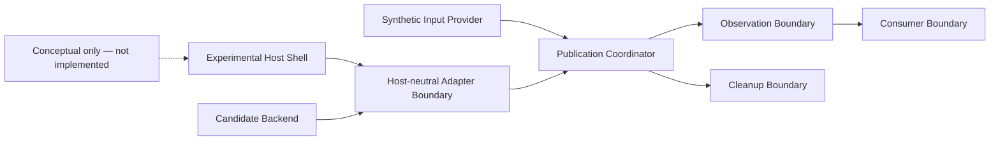
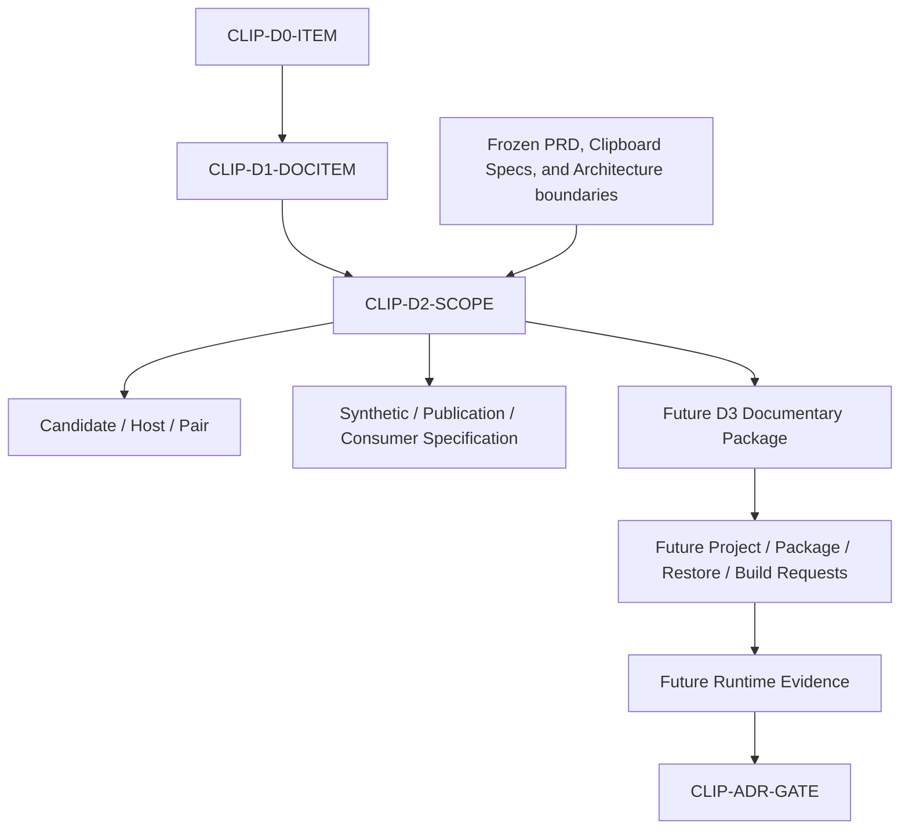

# Clipboard Integration D2 Experimental Scope Specification Package

## 1. Document Control

| Field | Required value |
|---|---|
| Document ID | `RESEARCH-TECH-CLIPBOARD-021` |
| Title | Clipboard Integration D2 Experimental Scope Specification Package |
| Status | Draft |
| Research Type | Experimental Scope Specification Package |
| Technology Decision | TD-004 Clipboard Integration |
| Package | `CLIP-EVIDPKG-003` |
| Acquisition Stage | D2 — Experimental Scope Specification |
| Parent D1 Package | `RESEARCH-TECH-CLIPBOARD-020` |
| Parent D0 Package | `RESEARCH-TECH-CLIPBOARD-019` |
| Parent Package Specification | `RESEARCH-TECH-CLIPBOARD-018` |
| Parent Evidence Acquisition Plan | `RESEARCH-TECH-CLIPBOARD-017` |
| Covered Candidates | `CLIP-OPT-001..005` |
| Covered Candidate–Host Pairs | `CLIP-PAIR-001..010` |
| Covered Criteria | `CLIP-DEC-CRIT-001..012` |
| Covered Decision Gaps | `CLIP-DEC-GAP-001..020` |
| Covered ADR Gates | `CLIP-ADR-GATE-001..010` |
| Experimental Project Created | No |
| Consumer Created | No |
| Synthetic Image Created | No |
| Source Code Created | No |
| Package Acquired | No |
| Restore／Build／Run | Not performed |
| Clipboard Read／Write／Clear | Not performed |
| Runtime／Consumer Verification | Not performed |
| Evidence Persistence | Not performed |
| Authorization Request | Not created |
| Human Authorization Decision | Not made |
| Candidate Ranking／Selection | Not performed |
| Technology Recommendation／Decision | Not made |
| Clipboard ADR | Not created |
| Owner | TBD |
| Last reviewed | Not reviewed |

## 2. Purpose and Fixed Boundary

This document specifies the candidate-neutral experimental topology, host boundary, backend boundary, future project identity, package/reference boundary, synthetic-image contract, publication profiles, consumer contracts, and isolation policy required before a later D3 documentary handoff can be prepared.

This is a documentary experiment-scope specification only. It is not an experimental project, project or solution file, package manifest, synthetic image, Clipboard payload, consumer implementation, authorization request, human decision, build/runtime evidence, technology recommendation, or ADR.

No project, solution, directory, source file, consumer, synthetic image, payload, result, log, or evidence is created. No package acquisition, Restore, Build, Run, inspection, Clipboard access, or runtime verification is performed.

## 3. Source Preservation

- `RESEARCH-TECH-CLIPBOARD-016..020`
- `CLIP-OPT-001..005`
- `CLIP-PAIR-001..010`
- `CLIP-DEC-CRIT-001..012`
- `CLIP-DEC-GAP-001..020`
- `CLIP-DEC-EVIDPLAN-001..020`
- `CLIP-ADR-GATE-001..010`
- `CLIP-D0-ITEM-001..020`
- `CLIP-D1-DOCITEM-001..017`
- `CLIP-INSPECT-001..017`
- `CLIP-EVIDPKG-003`
- Stages D0..D6

Upstream status, Candidate and Pair identities, Criteria, Decision Gaps, Evidence Plan Items, D0/D1 mappings, and ADR Gates remain unchanged. D1 observations are not treated as available local evidence. Static documentation does not establish package, build, or runtime viability.

## 4. Controlled Vocabulary

### 4.1 D2 Scope Status

- Fully specified
- Specified with pending D1 dependency
- Partially specified
- Blocked by static ambiguity
- Deferred
- Not applicable

### 4.2 Future Project Eligibility

- Eligible for future project-request preparation
- Conditionally eligible
- Not eligible
- Deferred

### 4.3 Evidence State

- Static evidence only
- Pending D1 observation
- Pending project evidence
- Pending build evidence
- Pending runtime evidence
- Pending consumer evidence
- Deferred
- Not applicable

### 4.4 Execution Boundary

| Boundary | Value |
|---|---|
| Current authorization | Not granted |
| Execution permitted | No |

The D2 status vocabulary does not use Created, Restored, Built, Executed, Verified, Passed, Selected, Preferred, Recommended, or Production ready as a conclusion. Required fixed-status records in Section 27 remain historical boundary statements only.

## 5. D2 Scope Binding

| D2 Scope Item | Candidate–Host Pair |
|---|---|
| `CLIP-D2-SCOPE-001` | `CLIP-PAIR-001` |
| `CLIP-D2-SCOPE-002` | `CLIP-PAIR-002` |
| `CLIP-D2-SCOPE-003` | `CLIP-PAIR-003` |
| `CLIP-D2-SCOPE-004` | `CLIP-PAIR-004` |
| `CLIP-D2-SCOPE-005` | `CLIP-PAIR-005` |
| `CLIP-D2-SCOPE-006` | `CLIP-PAIR-006` |
| `CLIP-D2-SCOPE-007` | `CLIP-PAIR-007` |
| `CLIP-D2-SCOPE-008` | `CLIP-PAIR-008` |
| `CLIP-D2-SCOPE-009` | `CLIP-PAIR-009` |
| `CLIP-D2-SCOPE-010` | `CLIP-PAIR-010` |

Each Candidate–Host Pair receives exactly one D2 Scope Item. WPF and WinUI 3 remain separate experimental hosts. Different Candidates are not combined, and no `CLIP-D2-SCOPE-011` is added. Scope definition does not imply Candidate viability or preference. Any new documentary ambiguity would be recorded only as a D2 Documentary Gap.

## 6. Fixed Fields for Every D2 Scope Item

### `CLIP-D2-SCOPE-001`

| Field | Value |
|---|---|
| D2 Scope Item ID | `CLIP-D2-SCOPE-001` |
| Candidate–Host Pair | `CLIP-PAIR-001` |
| Candidate ID | `CLIP-OPT-001` |
| Candidate identity | WPF Clipboard |
| Host identity | WPF |
| Backend identity | WPF Clipboard |
| Adapter role | Host-neutral Adapter Boundary; candidate-specific variation remains future scope. |
| Related Decision Gaps | `CLIP-DEC-GAP-001,002` |
| Related Evidence Plan Items | `CLIP-DEC-EVIDPLAN-001,002` |
| Related D0 Items | `CLIP-D0-ITEM-001,002` |
| Related D1 Items | `CLIP-D1-DOCITEM-001,002` |
| Related Decision Criteria | `CLIP-DEC-CRIT-001` |
| Related ADR Gates | `CLIP-ADR-GATE-001` |
| Static evidence available | Static evidence only; official and repository documentary inputs are preserved without local availability inference. |
| D1 observation dependency | Pending D1 observation for local target, framework, SDK, package, and host availability. |
| D1 observation state | Not observed |
| Experimental question | What bounded host/backend topology can answer the candidate-neutral publication, ownership, format, privacy, and isolation questions for this Pair? |
| Why an experiment would be required | Static documents define boundaries but cannot establish local host assets, package availability, threading behavior, publication behavior, consumer interoperability, or cleanup evidence. |
| Experimental host role | WPF host shell with Dispatcher boundary |
| Experimental backend role | WPF Clipboard candidate boundary; implementation not created |
| Experimental adapter role | Translate the candidate-neutral publication contract at the host boundary without owning product workflow state. |
| Experimental producer role | Future synthetic input provider and publication coordinator only; no Capture or Rendering. |
| Experimental consumer role | Future bounded consumer contract only; no consumer implementation or launch. |
| Project model class | Future isolated experimental project scope; no project or solution artifact. |
| Runtime family | Frozen C#/.NET product baseline where applicable; local resolution pending D1. |
| Target-framework resolution rule | Resolve from future D1 local observation or approved evidence; otherwise keep parameterized. |
| Target-architecture resolution rule | Resolve from future D1 local observation; do not fabricate architecture. |
| Windows target resolution rule | Resolve from future D1 local observation and approved target identity; static support is not local availability. |
| Packaging model | Packaged and unpackaged variants may be specified separately; no packaging choice is made. |
| Reference-asset classes | Framework references, Windows SDK assets, WinRT metadata, Windows App SDK assets, and named native declarations as applicable. |
| Package classes | Named framework or third-party package classes only; no package ID, version, source, or manifest is created. |
| Package-version resolution rule | Use D1 local observation or approved official evidence; do not identify a latest version. |
| Project isolation boundary | Future authorized isolated root only; no root is created by this document. |
| Repository isolation boundary | No mutation and no product-tree dependency beyond explicitly approved references. |
| Product-code isolation boundary | Product binaries and product workflow state remain outside the experiment. |
| Shared workflow isolation | Required |
| Synthetic-image contract | `CLIP-D2-SYNTHSPEC-001`; deterministic specification only; no image or bytes created. |
| Publication-profile applicability | `CLIP-D2-FMTPROFILE-001..003` remain documentary profiles; applicability requires evidence. |
| Consumer-contract applicability | `CLIP-D2-CONSPEC-001..003` remain documentary consumer contracts; no interoperability conclusion. |
| Threading／dispatcher contract | Future host-thread, Dispatcher, and backend-thread evidence question; no thread or application is started. |
| COM／apartment contract | Future COM/apartment evidence question where applicable; no COM activation. |
| Ownership／lifetime contract | Future observation must define ownership, release, producer termination, and cleanup boundaries. |
| Error-reporting contract | Future structured categories include target, access, scope, mutation, privacy, network, launch, and policy stops. |
| Logging boundary | Sanitized session fields only; no ordinary logs or private payloads. |
| Privacy boundary | Private Clipboard payload, credentials, tokens, SIDs, account identity, and private images are prohibited. |
| Clipboard Read boundary | Not included |
| Clipboard Write boundary | Not included |
| Clipboard Clear boundary | Not included |
| History／Cloud boundary | Not included |
| File-output boundary | Not included |
| Network boundary | No network |
| Mutation boundary | No mutation |
| Cleanup boundary | Future cleanup contract only; no cleanup mutation or output. |
| Project-creation dependency | Separate future D3 documentary package and separate authority; not included. |
| Package-acquisition dependency | Separate future D3 package evidence and authority; not included. |
| Restore dependency | Separate future D3 scope and authority; not performed. |
| Build dependency | Separate future D3 scope and authority; not performed. |
| Runtime dependency | Separate future runtime evidence and authority; not performed. |
| Consumer dependency | Separate future consumer evidence and authority; not performed. |
| Persistent-evidence dependency | Separate persistence authority; no session auto-persist. |
| Entry conditions | D0/D1 static inputs, frozen boundaries, Pair identity, and candidate-neutral contract are documented. |
| Exit conditions | D2 scope, dependencies, topology, synthetic specification, profiles, consumers, isolation, and operation separation are documented. |
| Stop conditions | Static ambiguity, unsafe target resolution, missing D1 mapping, unbounded package class, nondeterministic synthetic rule, privacy breach, or operation-boundary expansion. |
| Prohibited inference | Do not infer viability, support, local availability, ranking, selection, winner, recommendation, or technology decision. |
| Current authorization | Not granted |
| Execution permitted | No |
| Owner | TBD |
| D2 scope status | Specified with pending D1 dependency |
| Future project eligibility | Conditionally eligible |
| Open questions | Which future D1 observations and later-stage evidence can resolve local target, package, threading, publication, consumer, and cleanup questions for this Pair? |

### `CLIP-D2-SCOPE-002`

| Field | Value |
|---|---|
| D2 Scope Item ID | `CLIP-D2-SCOPE-002` |
| Candidate–Host Pair | `CLIP-PAIR-002` |
| Candidate ID | `CLIP-OPT-001` |
| Candidate identity | WPF Clipboard |
| Host identity | WinUI 3 |
| Backend identity | WPF Clipboard |
| Adapter role | Host-neutral Adapter Boundary; candidate-specific variation remains future scope. |
| Related Decision Gaps | `CLIP-DEC-GAP-003,004` |
| Related Evidence Plan Items | `CLIP-DEC-EVIDPLAN-003,004` |
| Related D0 Items | `CLIP-D0-ITEM-003,004` |
| Related D1 Items | `CLIP-D1-DOCITEM-003,004` |
| Related Decision Criteria | `CLIP-DEC-CRIT-002` |
| Related ADR Gates | `CLIP-ADR-GATE-002` |
| Static evidence available | Static evidence only; official and repository documentary inputs are preserved without local availability inference. |
| D1 observation dependency | Pending D1 observation for local target, framework, SDK, package, and host availability. |
| D1 observation state | Not observed |
| Experimental question | What bounded host/backend topology can answer the candidate-neutral publication, ownership, format, privacy, and isolation questions for this Pair? |
| Why an experiment would be required | Static documents define boundaries but cannot establish local host assets, package availability, threading behavior, publication behavior, consumer interoperability, or cleanup evidence. |
| Experimental host role | WinUI 3 host shell with Windows App SDK boundary |
| Experimental backend role | WPF Clipboard candidate boundary; implementation not created |
| Experimental adapter role | Translate the candidate-neutral publication contract at the host boundary without owning product workflow state. |
| Experimental producer role | Future synthetic input provider and publication coordinator only; no Capture or Rendering. |
| Experimental consumer role | Future bounded consumer contract only; no consumer implementation or launch. |
| Project model class | Future isolated experimental project scope; no project or solution artifact. |
| Runtime family | Frozen C#/.NET product baseline where applicable; local resolution pending D1. |
| Target-framework resolution rule | Resolve from future D1 local observation or approved evidence; otherwise keep parameterized. |
| Target-architecture resolution rule | Resolve from future D1 local observation; do not fabricate architecture. |
| Windows target resolution rule | Resolve from future D1 local observation and approved target identity; static support is not local availability. |
| Packaging model | Packaged and unpackaged variants may be specified separately; no packaging choice is made. |
| Reference-asset classes | Framework references, Windows SDK assets, WinRT metadata, Windows App SDK assets, and named native declarations as applicable. |
| Package classes | Named framework or third-party package classes only; no package ID, version, source, or manifest is created. |
| Package-version resolution rule | Use D1 local observation or approved official evidence; do not identify a latest version. |
| Project isolation boundary | Future authorized isolated root only; no root is created by this document. |
| Repository isolation boundary | No mutation and no product-tree dependency beyond explicitly approved references. |
| Product-code isolation boundary | Product binaries and product workflow state remain outside the experiment. |
| Shared workflow isolation | Required |
| Synthetic-image contract | `CLIP-D2-SYNTHSPEC-001`; deterministic specification only; no image or bytes created. |
| Publication-profile applicability | `CLIP-D2-FMTPROFILE-001..003` remain documentary profiles; applicability requires evidence. |
| Consumer-contract applicability | `CLIP-D2-CONSPEC-001..003` remain documentary consumer contracts; no interoperability conclusion. |
| Threading／dispatcher contract | Future host-thread, Dispatcher, and backend-thread evidence question; no thread or application is started. |
| COM／apartment contract | Future COM/apartment evidence question where applicable; no COM activation. |
| Ownership／lifetime contract | Future observation must define ownership, release, producer termination, and cleanup boundaries. |
| Error-reporting contract | Future structured categories include target, access, scope, mutation, privacy, network, launch, and policy stops. |
| Logging boundary | Sanitized session fields only; no ordinary logs or private payloads. |
| Privacy boundary | Private Clipboard payload, credentials, tokens, SIDs, account identity, and private images are prohibited. |
| Clipboard Read boundary | Not included |
| Clipboard Write boundary | Not included |
| Clipboard Clear boundary | Not included |
| History／Cloud boundary | Not included |
| File-output boundary | Not included |
| Network boundary | No network |
| Mutation boundary | No mutation |
| Cleanup boundary | Future cleanup contract only; no cleanup mutation or output. |
| Project-creation dependency | Separate future D3 documentary package and separate authority; not included. |
| Package-acquisition dependency | Separate future D3 package evidence and authority; not included. |
| Restore dependency | Separate future D3 scope and authority; not performed. |
| Build dependency | Separate future D3 scope and authority; not performed. |
| Runtime dependency | Separate future runtime evidence and authority; not performed. |
| Consumer dependency | Separate future consumer evidence and authority; not performed. |
| Persistent-evidence dependency | Separate persistence authority; no session auto-persist. |
| Entry conditions | D0/D1 static inputs, frozen boundaries, Pair identity, and candidate-neutral contract are documented. |
| Exit conditions | D2 scope, dependencies, topology, synthetic specification, profiles, consumers, isolation, and operation separation are documented. |
| Stop conditions | Static ambiguity, unsafe target resolution, missing D1 mapping, unbounded package class, nondeterministic synthetic rule, privacy breach, or operation-boundary expansion. |
| Prohibited inference | Do not infer viability, support, local availability, ranking, selection, winner, recommendation, or technology decision. |
| Current authorization | Not granted |
| Execution permitted | No |
| Owner | TBD |
| D2 scope status | Specified with pending D1 dependency |
| Future project eligibility | Conditionally eligible |
| Open questions | Which future D1 observations and later-stage evidence can resolve local target, package, threading, publication, consumer, and cleanup questions for this Pair? |

### `CLIP-D2-SCOPE-003`

| Field | Value |
|---|---|
| D2 Scope Item ID | `CLIP-D2-SCOPE-003` |
| Candidate–Host Pair | `CLIP-PAIR-003` |
| Candidate ID | `CLIP-OPT-002` |
| Candidate identity | WinRT Clipboard |
| Host identity | WPF |
| Backend identity | WinRT Clipboard |
| Adapter role | Host-neutral Adapter Boundary; candidate-specific variation remains future scope. |
| Related Decision Gaps | `CLIP-DEC-GAP-005,006` |
| Related Evidence Plan Items | `CLIP-DEC-EVIDPLAN-005,006` |
| Related D0 Items | `CLIP-D0-ITEM-005,006` |
| Related D1 Items | `CLIP-D1-DOCITEM-005,006` |
| Related Decision Criteria | `CLIP-DEC-CRIT-003` |
| Related ADR Gates | `CLIP-ADR-GATE-003` |
| Static evidence available | Static evidence only; official and repository documentary inputs are preserved without local availability inference. |
| D1 observation dependency | Pending D1 observation for local target, framework, SDK, package, and host availability. |
| D1 observation state | Not observed |
| Experimental question | What bounded host/backend topology can answer the candidate-neutral publication, ownership, format, privacy, and isolation questions for this Pair? |
| Why an experiment would be required | Static documents define boundaries but cannot establish local host assets, package availability, threading behavior, publication behavior, consumer interoperability, or cleanup evidence. |
| Experimental host role | WPF host shell with Dispatcher boundary |
| Experimental backend role | WinRT Clipboard candidate boundary; implementation not created |
| Experimental adapter role | Translate the candidate-neutral publication contract at the host boundary without owning product workflow state. |
| Experimental producer role | Future synthetic input provider and publication coordinator only; no Capture or Rendering. |
| Experimental consumer role | Future bounded consumer contract only; no consumer implementation or launch. |
| Project model class | Future isolated experimental project scope; no project or solution artifact. |
| Runtime family | Frozen C#/.NET product baseline where applicable; local resolution pending D1. |
| Target-framework resolution rule | Resolve from future D1 local observation or approved evidence; otherwise keep parameterized. |
| Target-architecture resolution rule | Resolve from future D1 local observation; do not fabricate architecture. |
| Windows target resolution rule | Resolve from future D1 local observation and approved target identity; static support is not local availability. |
| Packaging model | Packaged and unpackaged variants may be specified separately; no packaging choice is made. |
| Reference-asset classes | Framework references, Windows SDK assets, WinRT metadata, Windows App SDK assets, and named native declarations as applicable. |
| Package classes | Named framework or third-party package classes only; no package ID, version, source, or manifest is created. |
| Package-version resolution rule | Use D1 local observation or approved official evidence; do not identify a latest version. |
| Project isolation boundary | Future authorized isolated root only; no root is created by this document. |
| Repository isolation boundary | No mutation and no product-tree dependency beyond explicitly approved references. |
| Product-code isolation boundary | Product binaries and product workflow state remain outside the experiment. |
| Shared workflow isolation | Required |
| Synthetic-image contract | `CLIP-D2-SYNTHSPEC-001`; deterministic specification only; no image or bytes created. |
| Publication-profile applicability | `CLIP-D2-FMTPROFILE-001..003` remain documentary profiles; applicability requires evidence. |
| Consumer-contract applicability | `CLIP-D2-CONSPEC-001..003` remain documentary consumer contracts; no interoperability conclusion. |
| Threading／dispatcher contract | Future host-thread, Dispatcher, and backend-thread evidence question; no thread or application is started. |
| COM／apartment contract | Future COM/apartment evidence question where applicable; no COM activation. |
| Ownership／lifetime contract | Future observation must define ownership, release, producer termination, and cleanup boundaries. |
| Error-reporting contract | Future structured categories include target, access, scope, mutation, privacy, network, launch, and policy stops. |
| Logging boundary | Sanitized session fields only; no ordinary logs or private payloads. |
| Privacy boundary | Private Clipboard payload, credentials, tokens, SIDs, account identity, and private images are prohibited. |
| Clipboard Read boundary | Not included |
| Clipboard Write boundary | Not included |
| Clipboard Clear boundary | Not included |
| History／Cloud boundary | Not included |
| File-output boundary | Not included |
| Network boundary | No network |
| Mutation boundary | No mutation |
| Cleanup boundary | Future cleanup contract only; no cleanup mutation or output. |
| Project-creation dependency | Separate future D3 documentary package and separate authority; not included. |
| Package-acquisition dependency | Separate future D3 package evidence and authority; not included. |
| Restore dependency | Separate future D3 scope and authority; not performed. |
| Build dependency | Separate future D3 scope and authority; not performed. |
| Runtime dependency | Separate future runtime evidence and authority; not performed. |
| Consumer dependency | Separate future consumer evidence and authority; not performed. |
| Persistent-evidence dependency | Separate persistence authority; no session auto-persist. |
| Entry conditions | D0/D1 static inputs, frozen boundaries, Pair identity, and candidate-neutral contract are documented. |
| Exit conditions | D2 scope, dependencies, topology, synthetic specification, profiles, consumers, isolation, and operation separation are documented. |
| Stop conditions | Static ambiguity, unsafe target resolution, missing D1 mapping, unbounded package class, nondeterministic synthetic rule, privacy breach, or operation-boundary expansion. |
| Prohibited inference | Do not infer viability, support, local availability, ranking, selection, winner, recommendation, or technology decision. |
| Current authorization | Not granted |
| Execution permitted | No |
| Owner | TBD |
| D2 scope status | Specified with pending D1 dependency |
| Future project eligibility | Conditionally eligible |
| Open questions | Which future D1 observations and later-stage evidence can resolve local target, package, threading, publication, consumer, and cleanup questions for this Pair? |

### `CLIP-D2-SCOPE-004`

| Field | Value |
|---|---|
| D2 Scope Item ID | `CLIP-D2-SCOPE-004` |
| Candidate–Host Pair | `CLIP-PAIR-004` |
| Candidate ID | `CLIP-OPT-002` |
| Candidate identity | WinRT Clipboard |
| Host identity | WinUI 3 |
| Backend identity | WinRT Clipboard |
| Adapter role | Host-neutral Adapter Boundary; candidate-specific variation remains future scope. |
| Related Decision Gaps | `CLIP-DEC-GAP-007,008` |
| Related Evidence Plan Items | `CLIP-DEC-EVIDPLAN-007,008` |
| Related D0 Items | `CLIP-D0-ITEM-007,008` |
| Related D1 Items | `CLIP-D1-DOCITEM-007,008` |
| Related Decision Criteria | `CLIP-DEC-CRIT-004` |
| Related ADR Gates | `CLIP-ADR-GATE-004` |
| Static evidence available | Static evidence only; official and repository documentary inputs are preserved without local availability inference. |
| D1 observation dependency | Pending D1 observation for local target, framework, SDK, package, and host availability. |
| D1 observation state | Not observed |
| Experimental question | What bounded host/backend topology can answer the candidate-neutral publication, ownership, format, privacy, and isolation questions for this Pair? |
| Why an experiment would be required | Static documents define boundaries but cannot establish local host assets, package availability, threading behavior, publication behavior, consumer interoperability, or cleanup evidence. |
| Experimental host role | WinUI 3 host shell with Windows App SDK boundary |
| Experimental backend role | WinRT Clipboard candidate boundary; implementation not created |
| Experimental adapter role | Translate the candidate-neutral publication contract at the host boundary without owning product workflow state. |
| Experimental producer role | Future synthetic input provider and publication coordinator only; no Capture or Rendering. |
| Experimental consumer role | Future bounded consumer contract only; no consumer implementation or launch. |
| Project model class | Future isolated experimental project scope; no project or solution artifact. |
| Runtime family | Frozen C#/.NET product baseline where applicable; local resolution pending D1. |
| Target-framework resolution rule | Resolve from future D1 local observation or approved evidence; otherwise keep parameterized. |
| Target-architecture resolution rule | Resolve from future D1 local observation; do not fabricate architecture. |
| Windows target resolution rule | Resolve from future D1 local observation and approved target identity; static support is not local availability. |
| Packaging model | Packaged and unpackaged variants may be specified separately; no packaging choice is made. |
| Reference-asset classes | Framework references, Windows SDK assets, WinRT metadata, Windows App SDK assets, and named native declarations as applicable. |
| Package classes | Named framework or third-party package classes only; no package ID, version, source, or manifest is created. |
| Package-version resolution rule | Use D1 local observation or approved official evidence; do not identify a latest version. |
| Project isolation boundary | Future authorized isolated root only; no root is created by this document. |
| Repository isolation boundary | No mutation and no product-tree dependency beyond explicitly approved references. |
| Product-code isolation boundary | Product binaries and product workflow state remain outside the experiment. |
| Shared workflow isolation | Required |
| Synthetic-image contract | `CLIP-D2-SYNTHSPEC-001`; deterministic specification only; no image or bytes created. |
| Publication-profile applicability | `CLIP-D2-FMTPROFILE-001..003` remain documentary profiles; applicability requires evidence. |
| Consumer-contract applicability | `CLIP-D2-CONSPEC-001..003` remain documentary consumer contracts; no interoperability conclusion. |
| Threading／dispatcher contract | Future host-thread, Dispatcher, and backend-thread evidence question; no thread or application is started. |
| COM／apartment contract | Future COM/apartment evidence question where applicable; no COM activation. |
| Ownership／lifetime contract | Future observation must define ownership, release, producer termination, and cleanup boundaries. |
| Error-reporting contract | Future structured categories include target, access, scope, mutation, privacy, network, launch, and policy stops. |
| Logging boundary | Sanitized session fields only; no ordinary logs or private payloads. |
| Privacy boundary | Private Clipboard payload, credentials, tokens, SIDs, account identity, and private images are prohibited. |
| Clipboard Read boundary | Not included |
| Clipboard Write boundary | Not included |
| Clipboard Clear boundary | Not included |
| History／Cloud boundary | Not included |
| File-output boundary | Not included |
| Network boundary | No network |
| Mutation boundary | No mutation |
| Cleanup boundary | Future cleanup contract only; no cleanup mutation or output. |
| Project-creation dependency | Separate future D3 documentary package and separate authority; not included. |
| Package-acquisition dependency | Separate future D3 package evidence and authority; not included. |
| Restore dependency | Separate future D3 scope and authority; not performed. |
| Build dependency | Separate future D3 scope and authority; not performed. |
| Runtime dependency | Separate future runtime evidence and authority; not performed. |
| Consumer dependency | Separate future consumer evidence and authority; not performed. |
| Persistent-evidence dependency | Separate persistence authority; no session auto-persist. |
| Entry conditions | D0/D1 static inputs, frozen boundaries, Pair identity, and candidate-neutral contract are documented. |
| Exit conditions | D2 scope, dependencies, topology, synthetic specification, profiles, consumers, isolation, and operation separation are documented. |
| Stop conditions | Static ambiguity, unsafe target resolution, missing D1 mapping, unbounded package class, nondeterministic synthetic rule, privacy breach, or operation-boundary expansion. |
| Prohibited inference | Do not infer viability, support, local availability, ranking, selection, winner, recommendation, or technology decision. |
| Current authorization | Not granted |
| Execution permitted | No |
| Owner | TBD |
| D2 scope status | Specified with pending D1 dependency |
| Future project eligibility | Conditionally eligible |
| Open questions | Which future D1 observations and later-stage evidence can resolve local target, package, threading, publication, consumer, and cleanup questions for this Pair? |

### `CLIP-D2-SCOPE-005`

| Field | Value |
|---|---|
| D2 Scope Item ID | `CLIP-D2-SCOPE-005` |
| Candidate–Host Pair | `CLIP-PAIR-005` |
| Candidate ID | `CLIP-OPT-003` |
| Candidate identity | OLE/COM IDataObject |
| Host identity | WPF |
| Backend identity | OLE/COM IDataObject |
| Adapter role | Host-neutral Adapter Boundary; candidate-specific variation remains future scope. |
| Related Decision Gaps | `CLIP-DEC-GAP-009,010` |
| Related Evidence Plan Items | `CLIP-DEC-EVIDPLAN-009,010` |
| Related D0 Items | `CLIP-D0-ITEM-009,010` |
| Related D1 Items | `CLIP-D1-DOCITEM-009,010` |
| Related Decision Criteria | `CLIP-DEC-CRIT-005` |
| Related ADR Gates | `CLIP-ADR-GATE-005` |
| Static evidence available | Static evidence only; official and repository documentary inputs are preserved without local availability inference. |
| D1 observation dependency | Pending D1 observation for local target, framework, SDK, package, and host availability. |
| D1 observation state | Not observed |
| Experimental question | What bounded host/backend topology can answer the candidate-neutral publication, ownership, format, privacy, and isolation questions for this Pair? |
| Why an experiment would be required | Static documents define boundaries but cannot establish local host assets, package availability, threading behavior, publication behavior, consumer interoperability, or cleanup evidence. |
| Experimental host role | WPF host shell with Dispatcher boundary |
| Experimental backend role | OLE/COM IDataObject candidate boundary; implementation not created |
| Experimental adapter role | Translate the candidate-neutral publication contract at the host boundary without owning product workflow state. |
| Experimental producer role | Future synthetic input provider and publication coordinator only; no Capture or Rendering. |
| Experimental consumer role | Future bounded consumer contract only; no consumer implementation or launch. |
| Project model class | Future isolated experimental project scope; no project or solution artifact. |
| Runtime family | Frozen C#/.NET product baseline where applicable; local resolution pending D1. |
| Target-framework resolution rule | Resolve from future D1 local observation or approved evidence; otherwise keep parameterized. |
| Target-architecture resolution rule | Resolve from future D1 local observation; do not fabricate architecture. |
| Windows target resolution rule | Resolve from future D1 local observation and approved target identity; static support is not local availability. |
| Packaging model | Packaged and unpackaged variants may be specified separately; no packaging choice is made. |
| Reference-asset classes | Framework references, Windows SDK assets, WinRT metadata, Windows App SDK assets, and named native declarations as applicable. |
| Package classes | Named framework or third-party package classes only; no package ID, version, source, or manifest is created. |
| Package-version resolution rule | Use D1 local observation or approved official evidence; do not identify a latest version. |
| Project isolation boundary | Future authorized isolated root only; no root is created by this document. |
| Repository isolation boundary | No mutation and no product-tree dependency beyond explicitly approved references. |
| Product-code isolation boundary | Product binaries and product workflow state remain outside the experiment. |
| Shared workflow isolation | Required |
| Synthetic-image contract | `CLIP-D2-SYNTHSPEC-001`; deterministic specification only; no image or bytes created. |
| Publication-profile applicability | `CLIP-D2-FMTPROFILE-001..003` remain documentary profiles; applicability requires evidence. |
| Consumer-contract applicability | `CLIP-D2-CONSPEC-001..003` remain documentary consumer contracts; no interoperability conclusion. |
| Threading／dispatcher contract | Future host-thread, Dispatcher, and backend-thread evidence question; no thread or application is started. |
| COM／apartment contract | Future COM/apartment evidence question where applicable; no COM activation. |
| Ownership／lifetime contract | Future observation must define ownership, release, producer termination, and cleanup boundaries. |
| Error-reporting contract | Future structured categories include target, access, scope, mutation, privacy, network, launch, and policy stops. |
| Logging boundary | Sanitized session fields only; no ordinary logs or private payloads. |
| Privacy boundary | Private Clipboard payload, credentials, tokens, SIDs, account identity, and private images are prohibited. |
| Clipboard Read boundary | Not included |
| Clipboard Write boundary | Not included |
| Clipboard Clear boundary | Not included |
| History／Cloud boundary | Not included |
| File-output boundary | Not included |
| Network boundary | No network |
| Mutation boundary | No mutation |
| Cleanup boundary | Future cleanup contract only; no cleanup mutation or output. |
| Project-creation dependency | Separate future D3 documentary package and separate authority; not included. |
| Package-acquisition dependency | Separate future D3 package evidence and authority; not included. |
| Restore dependency | Separate future D3 scope and authority; not performed. |
| Build dependency | Separate future D3 scope and authority; not performed. |
| Runtime dependency | Separate future runtime evidence and authority; not performed. |
| Consumer dependency | Separate future consumer evidence and authority; not performed. |
| Persistent-evidence dependency | Separate persistence authority; no session auto-persist. |
| Entry conditions | D0/D1 static inputs, frozen boundaries, Pair identity, and candidate-neutral contract are documented. |
| Exit conditions | D2 scope, dependencies, topology, synthetic specification, profiles, consumers, isolation, and operation separation are documented. |
| Stop conditions | Static ambiguity, unsafe target resolution, missing D1 mapping, unbounded package class, nondeterministic synthetic rule, privacy breach, or operation-boundary expansion. |
| Prohibited inference | Do not infer viability, support, local availability, ranking, selection, winner, recommendation, or technology decision. |
| Current authorization | Not granted |
| Execution permitted | No |
| Owner | TBD |
| D2 scope status | Specified with pending D1 dependency |
| Future project eligibility | Conditionally eligible |
| Open questions | Which future D1 observations and later-stage evidence can resolve local target, package, threading, publication, consumer, and cleanup questions for this Pair? |

### `CLIP-D2-SCOPE-006`

| Field | Value |
|---|---|
| D2 Scope Item ID | `CLIP-D2-SCOPE-006` |
| Candidate–Host Pair | `CLIP-PAIR-006` |
| Candidate ID | `CLIP-OPT-003` |
| Candidate identity | OLE/COM IDataObject |
| Host identity | WinUI 3 |
| Backend identity | OLE/COM IDataObject |
| Adapter role | Host-neutral Adapter Boundary; candidate-specific variation remains future scope. |
| Related Decision Gaps | `CLIP-DEC-GAP-011,012` |
| Related Evidence Plan Items | `CLIP-DEC-EVIDPLAN-011,012` |
| Related D0 Items | `CLIP-D0-ITEM-011,012` |
| Related D1 Items | `CLIP-D1-DOCITEM-011,012` |
| Related Decision Criteria | `CLIP-DEC-CRIT-006` |
| Related ADR Gates | `CLIP-ADR-GATE-006` |
| Static evidence available | Static evidence only; official and repository documentary inputs are preserved without local availability inference. |
| D1 observation dependency | Pending D1 observation for local target, framework, SDK, package, and host availability. |
| D1 observation state | Not observed |
| Experimental question | What bounded host/backend topology can answer the candidate-neutral publication, ownership, format, privacy, and isolation questions for this Pair? |
| Why an experiment would be required | Static documents define boundaries but cannot establish local host assets, package availability, threading behavior, publication behavior, consumer interoperability, or cleanup evidence. |
| Experimental host role | WinUI 3 host shell with Windows App SDK boundary |
| Experimental backend role | OLE/COM IDataObject candidate boundary; implementation not created |
| Experimental adapter role | Translate the candidate-neutral publication contract at the host boundary without owning product workflow state. |
| Experimental producer role | Future synthetic input provider and publication coordinator only; no Capture or Rendering. |
| Experimental consumer role | Future bounded consumer contract only; no consumer implementation or launch. |
| Project model class | Future isolated experimental project scope; no project or solution artifact. |
| Runtime family | Frozen C#/.NET product baseline where applicable; local resolution pending D1. |
| Target-framework resolution rule | Resolve from future D1 local observation or approved evidence; otherwise keep parameterized. |
| Target-architecture resolution rule | Resolve from future D1 local observation; do not fabricate architecture. |
| Windows target resolution rule | Resolve from future D1 local observation and approved target identity; static support is not local availability. |
| Packaging model | Packaged and unpackaged variants may be specified separately; no packaging choice is made. |
| Reference-asset classes | Framework references, Windows SDK assets, WinRT metadata, Windows App SDK assets, and named native declarations as applicable. |
| Package classes | Named framework or third-party package classes only; no package ID, version, source, or manifest is created. |
| Package-version resolution rule | Use D1 local observation or approved official evidence; do not identify a latest version. |
| Project isolation boundary | Future authorized isolated root only; no root is created by this document. |
| Repository isolation boundary | No mutation and no product-tree dependency beyond explicitly approved references. |
| Product-code isolation boundary | Product binaries and product workflow state remain outside the experiment. |
| Shared workflow isolation | Required |
| Synthetic-image contract | `CLIP-D2-SYNTHSPEC-001`; deterministic specification only; no image or bytes created. |
| Publication-profile applicability | `CLIP-D2-FMTPROFILE-001..003` remain documentary profiles; applicability requires evidence. |
| Consumer-contract applicability | `CLIP-D2-CONSPEC-001..003` remain documentary consumer contracts; no interoperability conclusion. |
| Threading／dispatcher contract | Future host-thread, Dispatcher, and backend-thread evidence question; no thread or application is started. |
| COM／apartment contract | Future COM/apartment evidence question where applicable; no COM activation. |
| Ownership／lifetime contract | Future observation must define ownership, release, producer termination, and cleanup boundaries. |
| Error-reporting contract | Future structured categories include target, access, scope, mutation, privacy, network, launch, and policy stops. |
| Logging boundary | Sanitized session fields only; no ordinary logs or private payloads. |
| Privacy boundary | Private Clipboard payload, credentials, tokens, SIDs, account identity, and private images are prohibited. |
| Clipboard Read boundary | Not included |
| Clipboard Write boundary | Not included |
| Clipboard Clear boundary | Not included |
| History／Cloud boundary | Not included |
| File-output boundary | Not included |
| Network boundary | No network |
| Mutation boundary | No mutation |
| Cleanup boundary | Future cleanup contract only; no cleanup mutation or output. |
| Project-creation dependency | Separate future D3 documentary package and separate authority; not included. |
| Package-acquisition dependency | Separate future D3 package evidence and authority; not included. |
| Restore dependency | Separate future D3 scope and authority; not performed. |
| Build dependency | Separate future D3 scope and authority; not performed. |
| Runtime dependency | Separate future runtime evidence and authority; not performed. |
| Consumer dependency | Separate future consumer evidence and authority; not performed. |
| Persistent-evidence dependency | Separate persistence authority; no session auto-persist. |
| Entry conditions | D0/D1 static inputs, frozen boundaries, Pair identity, and candidate-neutral contract are documented. |
| Exit conditions | D2 scope, dependencies, topology, synthetic specification, profiles, consumers, isolation, and operation separation are documented. |
| Stop conditions | Static ambiguity, unsafe target resolution, missing D1 mapping, unbounded package class, nondeterministic synthetic rule, privacy breach, or operation-boundary expansion. |
| Prohibited inference | Do not infer viability, support, local availability, ranking, selection, winner, recommendation, or technology decision. |
| Current authorization | Not granted |
| Execution permitted | No |
| Owner | TBD |
| D2 scope status | Specified with pending D1 dependency |
| Future project eligibility | Conditionally eligible |
| Open questions | Which future D1 observations and later-stage evidence can resolve local target, package, threading, publication, consumer, and cleanup questions for this Pair? |

### `CLIP-D2-SCOPE-007`

| Field | Value |
|---|---|
| D2 Scope Item ID | `CLIP-D2-SCOPE-007` |
| Candidate–Host Pair | `CLIP-PAIR-007` |
| Candidate ID | `CLIP-OPT-004` |
| Candidate identity | Raw Win32 Clipboard |
| Host identity | WPF |
| Backend identity | Raw Win32 Clipboard |
| Adapter role | Host-neutral Adapter Boundary; candidate-specific variation remains future scope. |
| Related Decision Gaps | `CLIP-DEC-GAP-013,014` |
| Related Evidence Plan Items | `CLIP-DEC-EVIDPLAN-013,014` |
| Related D0 Items | `CLIP-D0-ITEM-013,014` |
| Related D1 Items | `CLIP-D1-DOCITEM-013,014` |
| Related Decision Criteria | `CLIP-DEC-CRIT-007` |
| Related ADR Gates | `CLIP-ADR-GATE-007` |
| Static evidence available | Static evidence only; official and repository documentary inputs are preserved without local availability inference. |
| D1 observation dependency | Pending D1 observation for local target, framework, SDK, package, and host availability. |
| D1 observation state | Not observed |
| Experimental question | What bounded host/backend topology can answer the candidate-neutral publication, ownership, format, privacy, and isolation questions for this Pair? |
| Why an experiment would be required | Static documents define boundaries but cannot establish local host assets, package availability, threading behavior, publication behavior, consumer interoperability, or cleanup evidence. |
| Experimental host role | WPF host shell with Dispatcher boundary |
| Experimental backend role | Raw Win32 Clipboard candidate boundary; implementation not created |
| Experimental adapter role | Translate the candidate-neutral publication contract at the host boundary without owning product workflow state. |
| Experimental producer role | Future synthetic input provider and publication coordinator only; no Capture or Rendering. |
| Experimental consumer role | Future bounded consumer contract only; no consumer implementation or launch. |
| Project model class | Future isolated experimental project scope; no project or solution artifact. |
| Runtime family | Frozen C#/.NET product baseline where applicable; local resolution pending D1. |
| Target-framework resolution rule | Resolve from future D1 local observation or approved evidence; otherwise keep parameterized. |
| Target-architecture resolution rule | Resolve from future D1 local observation; do not fabricate architecture. |
| Windows target resolution rule | Resolve from future D1 local observation and approved target identity; static support is not local availability. |
| Packaging model | Packaged and unpackaged variants may be specified separately; no packaging choice is made. |
| Reference-asset classes | Framework references, Windows SDK assets, WinRT metadata, Windows App SDK assets, and named native declarations as applicable. |
| Package classes | Named framework or third-party package classes only; no package ID, version, source, or manifest is created. |
| Package-version resolution rule | Use D1 local observation or approved official evidence; do not identify a latest version. |
| Project isolation boundary | Future authorized isolated root only; no root is created by this document. |
| Repository isolation boundary | No mutation and no product-tree dependency beyond explicitly approved references. |
| Product-code isolation boundary | Product binaries and product workflow state remain outside the experiment. |
| Shared workflow isolation | Required |
| Synthetic-image contract | `CLIP-D2-SYNTHSPEC-001`; deterministic specification only; no image or bytes created. |
| Publication-profile applicability | `CLIP-D2-FMTPROFILE-001..003` remain documentary profiles; applicability requires evidence. |
| Consumer-contract applicability | `CLIP-D2-CONSPEC-001..003` remain documentary consumer contracts; no interoperability conclusion. |
| Threading／dispatcher contract | Future host-thread, Dispatcher, and backend-thread evidence question; no thread or application is started. |
| COM／apartment contract | Future COM/apartment evidence question where applicable; no COM activation. |
| Ownership／lifetime contract | Future observation must define ownership, release, producer termination, and cleanup boundaries. |
| Error-reporting contract | Future structured categories include target, access, scope, mutation, privacy, network, launch, and policy stops. |
| Logging boundary | Sanitized session fields only; no ordinary logs or private payloads. |
| Privacy boundary | Private Clipboard payload, credentials, tokens, SIDs, account identity, and private images are prohibited. |
| Clipboard Read boundary | Not included |
| Clipboard Write boundary | Not included |
| Clipboard Clear boundary | Not included |
| History／Cloud boundary | Not included |
| File-output boundary | Not included |
| Network boundary | No network |
| Mutation boundary | No mutation |
| Cleanup boundary | Future cleanup contract only; no cleanup mutation or output. |
| Project-creation dependency | Separate future D3 documentary package and separate authority; not included. |
| Package-acquisition dependency | Separate future D3 package evidence and authority; not included. |
| Restore dependency | Separate future D3 scope and authority; not performed. |
| Build dependency | Separate future D3 scope and authority; not performed. |
| Runtime dependency | Separate future runtime evidence and authority; not performed. |
| Consumer dependency | Separate future consumer evidence and authority; not performed. |
| Persistent-evidence dependency | Separate persistence authority; no session auto-persist. |
| Entry conditions | D0/D1 static inputs, frozen boundaries, Pair identity, and candidate-neutral contract are documented. |
| Exit conditions | D2 scope, dependencies, topology, synthetic specification, profiles, consumers, isolation, and operation separation are documented. |
| Stop conditions | Static ambiguity, unsafe target resolution, missing D1 mapping, unbounded package class, nondeterministic synthetic rule, privacy breach, or operation-boundary expansion. |
| Prohibited inference | Do not infer viability, support, local availability, ranking, selection, winner, recommendation, or technology decision. |
| Current authorization | Not granted |
| Execution permitted | No |
| Owner | TBD |
| D2 scope status | Specified with pending D1 dependency |
| Future project eligibility | Conditionally eligible |
| Open questions | Which future D1 observations and later-stage evidence can resolve local target, package, threading, publication, consumer, and cleanup questions for this Pair? |

### `CLIP-D2-SCOPE-008`

| Field | Value |
|---|---|
| D2 Scope Item ID | `CLIP-D2-SCOPE-008` |
| Candidate–Host Pair | `CLIP-PAIR-008` |
| Candidate ID | `CLIP-OPT-004` |
| Candidate identity | Raw Win32 Clipboard |
| Host identity | WinUI 3 |
| Backend identity | Raw Win32 Clipboard |
| Adapter role | Host-neutral Adapter Boundary; candidate-specific variation remains future scope. |
| Related Decision Gaps | `CLIP-DEC-GAP-015,016` |
| Related Evidence Plan Items | `CLIP-DEC-EVIDPLAN-015,016` |
| Related D0 Items | `CLIP-D0-ITEM-015,016` |
| Related D1 Items | `CLIP-D1-DOCITEM-015,016` |
| Related Decision Criteria | `CLIP-DEC-CRIT-008` |
| Related ADR Gates | `CLIP-ADR-GATE-008` |
| Static evidence available | Static evidence only; official and repository documentary inputs are preserved without local availability inference. |
| D1 observation dependency | Pending D1 observation for local target, framework, SDK, package, and host availability. |
| D1 observation state | Not observed |
| Experimental question | What bounded host/backend topology can answer the candidate-neutral publication, ownership, format, privacy, and isolation questions for this Pair? |
| Why an experiment would be required | Static documents define boundaries but cannot establish local host assets, package availability, threading behavior, publication behavior, consumer interoperability, or cleanup evidence. |
| Experimental host role | WinUI 3 host shell with Windows App SDK boundary |
| Experimental backend role | Raw Win32 Clipboard candidate boundary; implementation not created |
| Experimental adapter role | Translate the candidate-neutral publication contract at the host boundary without owning product workflow state. |
| Experimental producer role | Future synthetic input provider and publication coordinator only; no Capture or Rendering. |
| Experimental consumer role | Future bounded consumer contract only; no consumer implementation or launch. |
| Project model class | Future isolated experimental project scope; no project or solution artifact. |
| Runtime family | Frozen C#/.NET product baseline where applicable; local resolution pending D1. |
| Target-framework resolution rule | Resolve from future D1 local observation or approved evidence; otherwise keep parameterized. |
| Target-architecture resolution rule | Resolve from future D1 local observation; do not fabricate architecture. |
| Windows target resolution rule | Resolve from future D1 local observation and approved target identity; static support is not local availability. |
| Packaging model | Packaged and unpackaged variants may be specified separately; no packaging choice is made. |
| Reference-asset classes | Framework references, Windows SDK assets, WinRT metadata, Windows App SDK assets, and named native declarations as applicable. |
| Package classes | Named framework or third-party package classes only; no package ID, version, source, or manifest is created. |
| Package-version resolution rule | Use D1 local observation or approved official evidence; do not identify a latest version. |
| Project isolation boundary | Future authorized isolated root only; no root is created by this document. |
| Repository isolation boundary | No mutation and no product-tree dependency beyond explicitly approved references. |
| Product-code isolation boundary | Product binaries and product workflow state remain outside the experiment. |
| Shared workflow isolation | Required |
| Synthetic-image contract | `CLIP-D2-SYNTHSPEC-001`; deterministic specification only; no image or bytes created. |
| Publication-profile applicability | `CLIP-D2-FMTPROFILE-001..003` remain documentary profiles; applicability requires evidence. |
| Consumer-contract applicability | `CLIP-D2-CONSPEC-001..003` remain documentary consumer contracts; no interoperability conclusion. |
| Threading／dispatcher contract | Future host-thread, Dispatcher, and backend-thread evidence question; no thread or application is started. |
| COM／apartment contract | Future COM/apartment evidence question where applicable; no COM activation. |
| Ownership／lifetime contract | Future observation must define ownership, release, producer termination, and cleanup boundaries. |
| Error-reporting contract | Future structured categories include target, access, scope, mutation, privacy, network, launch, and policy stops. |
| Logging boundary | Sanitized session fields only; no ordinary logs or private payloads. |
| Privacy boundary | Private Clipboard payload, credentials, tokens, SIDs, account identity, and private images are prohibited. |
| Clipboard Read boundary | Not included |
| Clipboard Write boundary | Not included |
| Clipboard Clear boundary | Not included |
| History／Cloud boundary | Not included |
| File-output boundary | Not included |
| Network boundary | No network |
| Mutation boundary | No mutation |
| Cleanup boundary | Future cleanup contract only; no cleanup mutation or output. |
| Project-creation dependency | Separate future D3 documentary package and separate authority; not included. |
| Package-acquisition dependency | Separate future D3 package evidence and authority; not included. |
| Restore dependency | Separate future D3 scope and authority; not performed. |
| Build dependency | Separate future D3 scope and authority; not performed. |
| Runtime dependency | Separate future runtime evidence and authority; not performed. |
| Consumer dependency | Separate future consumer evidence and authority; not performed. |
| Persistent-evidence dependency | Separate persistence authority; no session auto-persist. |
| Entry conditions | D0/D1 static inputs, frozen boundaries, Pair identity, and candidate-neutral contract are documented. |
| Exit conditions | D2 scope, dependencies, topology, synthetic specification, profiles, consumers, isolation, and operation separation are documented. |
| Stop conditions | Static ambiguity, unsafe target resolution, missing D1 mapping, unbounded package class, nondeterministic synthetic rule, privacy breach, or operation-boundary expansion. |
| Prohibited inference | Do not infer viability, support, local availability, ranking, selection, winner, recommendation, or technology decision. |
| Current authorization | Not granted |
| Execution permitted | No |
| Owner | TBD |
| D2 scope status | Specified with pending D1 dependency |
| Future project eligibility | Conditionally eligible |
| Open questions | Which future D1 observations and later-stage evidence can resolve local target, package, threading, publication, consumer, and cleanup questions for this Pair? |

### `CLIP-D2-SCOPE-009`

| Field | Value |
|---|---|
| D2 Scope Item ID | `CLIP-D2-SCOPE-009` |
| Candidate–Host Pair | `CLIP-PAIR-009` |
| Candidate ID | `CLIP-OPT-005` |
| Candidate identity | Host-neutral Adapter strategy |
| Host identity | WPF |
| Backend identity | Host-neutral Adapter strategy |
| Adapter role | Host-neutral Adapter Boundary; candidate-specific variation remains future scope. |
| Related Decision Gaps | `CLIP-DEC-GAP-017,018` |
| Related Evidence Plan Items | `CLIP-DEC-EVIDPLAN-017,018` |
| Related D0 Items | `CLIP-D0-ITEM-017,018` |
| Related D1 Items | `CLIP-D1-DOCITEM-017,018` |
| Related Decision Criteria | `CLIP-DEC-CRIT-009` |
| Related ADR Gates | `CLIP-ADR-GATE-009` |
| Static evidence available | Static evidence only; official and repository documentary inputs are preserved without local availability inference. |
| D1 observation dependency | Pending D1 observation for local target, framework, SDK, package, and host availability. |
| D1 observation state | Not observed |
| Experimental question | What bounded host/backend topology can answer the candidate-neutral publication, ownership, format, privacy, and isolation questions for this Pair? |
| Why an experiment would be required | Static documents define boundaries but cannot establish local host assets, package availability, threading behavior, publication behavior, consumer interoperability, or cleanup evidence. |
| Experimental host role | WPF host shell with Dispatcher boundary |
| Experimental backend role | Host-neutral Adapter strategy candidate boundary; implementation not created |
| Experimental adapter role | Translate the candidate-neutral publication contract at the host boundary without owning product workflow state. |
| Experimental producer role | Future synthetic input provider and publication coordinator only; no Capture or Rendering. |
| Experimental consumer role | Future bounded consumer contract only; no consumer implementation or launch. |
| Project model class | Future isolated experimental project scope; no project or solution artifact. |
| Runtime family | Frozen C#/.NET product baseline where applicable; local resolution pending D1. |
| Target-framework resolution rule | Resolve from future D1 local observation or approved evidence; otherwise keep parameterized. |
| Target-architecture resolution rule | Resolve from future D1 local observation; do not fabricate architecture. |
| Windows target resolution rule | Resolve from future D1 local observation and approved target identity; static support is not local availability. |
| Packaging model | Packaged and unpackaged variants may be specified separately; no packaging choice is made. |
| Reference-asset classes | Framework references, Windows SDK assets, WinRT metadata, Windows App SDK assets, and named native declarations as applicable. |
| Package classes | Named framework or third-party package classes only; no package ID, version, source, or manifest is created. |
| Package-version resolution rule | Use D1 local observation or approved official evidence; do not identify a latest version. |
| Project isolation boundary | Future authorized isolated root only; no root is created by this document. |
| Repository isolation boundary | No mutation and no product-tree dependency beyond explicitly approved references. |
| Product-code isolation boundary | Product binaries and product workflow state remain outside the experiment. |
| Shared workflow isolation | Required |
| Synthetic-image contract | `CLIP-D2-SYNTHSPEC-001`; deterministic specification only; no image or bytes created. |
| Publication-profile applicability | `CLIP-D2-FMTPROFILE-001..003` remain documentary profiles; applicability requires evidence. |
| Consumer-contract applicability | `CLIP-D2-CONSPEC-001..003` remain documentary consumer contracts; no interoperability conclusion. |
| Threading／dispatcher contract | Future host-thread, Dispatcher, and backend-thread evidence question; no thread or application is started. |
| COM／apartment contract | Future COM/apartment evidence question where applicable; no COM activation. |
| Ownership／lifetime contract | Future observation must define ownership, release, producer termination, and cleanup boundaries. |
| Error-reporting contract | Future structured categories include target, access, scope, mutation, privacy, network, launch, and policy stops. |
| Logging boundary | Sanitized session fields only; no ordinary logs or private payloads. |
| Privacy boundary | Private Clipboard payload, credentials, tokens, SIDs, account identity, and private images are prohibited. |
| Clipboard Read boundary | Not included |
| Clipboard Write boundary | Not included |
| Clipboard Clear boundary | Not included |
| History／Cloud boundary | Not included |
| File-output boundary | Not included |
| Network boundary | No network |
| Mutation boundary | No mutation |
| Cleanup boundary | Future cleanup contract only; no cleanup mutation or output. |
| Project-creation dependency | Separate future D3 documentary package and separate authority; not included. |
| Package-acquisition dependency | Separate future D3 package evidence and authority; not included. |
| Restore dependency | Separate future D3 scope and authority; not performed. |
| Build dependency | Separate future D3 scope and authority; not performed. |
| Runtime dependency | Separate future runtime evidence and authority; not performed. |
| Consumer dependency | Separate future consumer evidence and authority; not performed. |
| Persistent-evidence dependency | Separate persistence authority; no session auto-persist. |
| Entry conditions | D0/D1 static inputs, frozen boundaries, Pair identity, and candidate-neutral contract are documented. |
| Exit conditions | D2 scope, dependencies, topology, synthetic specification, profiles, consumers, isolation, and operation separation are documented. |
| Stop conditions | Static ambiguity, unsafe target resolution, missing D1 mapping, unbounded package class, nondeterministic synthetic rule, privacy breach, or operation-boundary expansion. |
| Prohibited inference | Do not infer viability, support, local availability, ranking, selection, winner, recommendation, or technology decision. |
| Current authorization | Not granted |
| Execution permitted | No |
| Owner | TBD |
| D2 scope status | Specified with pending D1 dependency |
| Future project eligibility | Conditionally eligible |
| Open questions | Which future D1 observations and later-stage evidence can resolve local target, package, threading, publication, consumer, and cleanup questions for this Pair? |

### `CLIP-D2-SCOPE-010`

| Field | Value |
|---|---|
| D2 Scope Item ID | `CLIP-D2-SCOPE-010` |
| Candidate–Host Pair | `CLIP-PAIR-010` |
| Candidate ID | `CLIP-OPT-005` |
| Candidate identity | Host-neutral Adapter strategy |
| Host identity | WinUI 3 |
| Backend identity | Host-neutral Adapter strategy |
| Adapter role | Host-neutral Adapter Boundary; candidate-specific variation remains future scope. |
| Related Decision Gaps | `CLIP-DEC-GAP-019,020` |
| Related Evidence Plan Items | `CLIP-DEC-EVIDPLAN-019,020` |
| Related D0 Items | `CLIP-D0-ITEM-019,020` |
| Related D1 Items | `CLIP-D1-DOCITEM-019,020` |
| Related Decision Criteria | `CLIP-DEC-CRIT-010` |
| Related ADR Gates | `CLIP-ADR-GATE-010` |
| Static evidence available | Static evidence only; official and repository documentary inputs are preserved without local availability inference. |
| D1 observation dependency | Pending D1 observation for local target, framework, SDK, package, and host availability. |
| D1 observation state | Not observed |
| Experimental question | What bounded host/backend topology can answer the candidate-neutral publication, ownership, format, privacy, and isolation questions for this Pair? |
| Why an experiment would be required | Static documents define boundaries but cannot establish local host assets, package availability, threading behavior, publication behavior, consumer interoperability, or cleanup evidence. |
| Experimental host role | WinUI 3 host shell with Windows App SDK boundary |
| Experimental backend role | Host-neutral Adapter strategy candidate boundary; implementation not created |
| Experimental adapter role | Translate the candidate-neutral publication contract at the host boundary without owning product workflow state. |
| Experimental producer role | Future synthetic input provider and publication coordinator only; no Capture or Rendering. |
| Experimental consumer role | Future bounded consumer contract only; no consumer implementation or launch. |
| Project model class | Future isolated experimental project scope; no project or solution artifact. |
| Runtime family | Frozen C#/.NET product baseline where applicable; local resolution pending D1. |
| Target-framework resolution rule | Resolve from future D1 local observation or approved evidence; otherwise keep parameterized. |
| Target-architecture resolution rule | Resolve from future D1 local observation; do not fabricate architecture. |
| Windows target resolution rule | Resolve from future D1 local observation and approved target identity; static support is not local availability. |
| Packaging model | Packaged and unpackaged variants may be specified separately; no packaging choice is made. |
| Reference-asset classes | Framework references, Windows SDK assets, WinRT metadata, Windows App SDK assets, and named native declarations as applicable. |
| Package classes | Named framework or third-party package classes only; no package ID, version, source, or manifest is created. |
| Package-version resolution rule | Use D1 local observation or approved official evidence; do not identify a latest version. |
| Project isolation boundary | Future authorized isolated root only; no root is created by this document. |
| Repository isolation boundary | No mutation and no product-tree dependency beyond explicitly approved references. |
| Product-code isolation boundary | Product binaries and product workflow state remain outside the experiment. |
| Shared workflow isolation | Required |
| Synthetic-image contract | `CLIP-D2-SYNTHSPEC-001`; deterministic specification only; no image or bytes created. |
| Publication-profile applicability | `CLIP-D2-FMTPROFILE-001..003` remain documentary profiles; applicability requires evidence. |
| Consumer-contract applicability | `CLIP-D2-CONSPEC-001..003` remain documentary consumer contracts; no interoperability conclusion. |
| Threading／dispatcher contract | Future host-thread, Dispatcher, and backend-thread evidence question; no thread or application is started. |
| COM／apartment contract | Future COM/apartment evidence question where applicable; no COM activation. |
| Ownership／lifetime contract | Future observation must define ownership, release, producer termination, and cleanup boundaries. |
| Error-reporting contract | Future structured categories include target, access, scope, mutation, privacy, network, launch, and policy stops. |
| Logging boundary | Sanitized session fields only; no ordinary logs or private payloads. |
| Privacy boundary | Private Clipboard payload, credentials, tokens, SIDs, account identity, and private images are prohibited. |
| Clipboard Read boundary | Not included |
| Clipboard Write boundary | Not included |
| Clipboard Clear boundary | Not included |
| History／Cloud boundary | Not included |
| File-output boundary | Not included |
| Network boundary | No network |
| Mutation boundary | No mutation |
| Cleanup boundary | Future cleanup contract only; no cleanup mutation or output. |
| Project-creation dependency | Separate future D3 documentary package and separate authority; not included. |
| Package-acquisition dependency | Separate future D3 package evidence and authority; not included. |
| Restore dependency | Separate future D3 scope and authority; not performed. |
| Build dependency | Separate future D3 scope and authority; not performed. |
| Runtime dependency | Separate future runtime evidence and authority; not performed. |
| Consumer dependency | Separate future consumer evidence and authority; not performed. |
| Persistent-evidence dependency | Separate persistence authority; no session auto-persist. |
| Entry conditions | D0/D1 static inputs, frozen boundaries, Pair identity, and candidate-neutral contract are documented. |
| Exit conditions | D2 scope, dependencies, topology, synthetic specification, profiles, consumers, isolation, and operation separation are documented. |
| Stop conditions | Static ambiguity, unsafe target resolution, missing D1 mapping, unbounded package class, nondeterministic synthetic rule, privacy breach, or operation-boundary expansion. |
| Prohibited inference | Do not infer viability, support, local availability, ranking, selection, winner, recommendation, or technology decision. |
| Current authorization | Not granted |
| Execution permitted | No |
| Owner | TBD |
| D2 scope status | Specified with pending D1 dependency |
| Future project eligibility | Conditionally eligible |
| Open questions | Which future D1 observations and later-stage evidence can resolve local target, package, threading, publication, consumer, and cleanup questions for this Pair? |

## 7. D1-to-D2 Dependency Matrix

| D1 Item | Inspection Item | D2 scope items affected | Local fact required | Current observation state | D2 treatment if unavailable |
|---|---|---|---|---|---|
| `CLIP-D1-DOCITEM-001` | `CLIP-INSPECT-001` | `CLIP-D2-SCOPE-001` | repository and named-document boundary | Not observed | Keep the D2 rule parameterized; if safe parameterization is impossible, record a D2 Documentary Gap. |
| `CLIP-D1-DOCITEM-002` | `CLIP-INSPECT-002` | `CLIP-D2-SCOPE-002` | UI/Capture/Rendering document identity | Not observed | Keep the D2 rule parameterized; if safe parameterization is impossible, record a D2 Documentary Gap. |
| `CLIP-D1-DOCITEM-003` | `CLIP-INSPECT-003` | `CLIP-D2-SCOPE-003` | Windows host identity | Not observed | Keep the D2 rule parameterized; if safe parameterization is impossible, record a D2 Documentary Gap. |
| `CLIP-D1-DOCITEM-004` | `CLIP-INSPECT-004` | `CLIP-D2-SCOPE-004` | host asset identity | Not observed | Keep the D2 rule parameterized; if safe parameterization is impossible, record a D2 Documentary Gap. |
| `CLIP-D1-DOCITEM-005` | `CLIP-INSPECT-005` | `CLIP-D2-SCOPE-005` | project boundary metadata | Not observed | Keep the D2 rule parameterized; if safe parameterization is impossible, record a D2 Documentary Gap. |
| `CLIP-D1-DOCITEM-006` | `CLIP-INSPECT-006` | `CLIP-D2-SCOPE-006` | package-cache representation | Not observed | Keep the D2 rule parameterized; if safe parameterization is impossible, record a D2 Documentary Gap. |
| `CLIP-D1-DOCITEM-007` | `CLIP-INSPECT-007` | `CLIP-D2-SCOPE-007` | package identity/version | Not observed | Keep the D2 rule parameterized; if safe parameterization is impossible, record a D2 Documentary Gap. |
| `CLIP-D1-DOCITEM-008` | `CLIP-INSPECT-008` | `CLIP-D2-SCOPE-008` | dependency and target metadata | Not observed | Keep the D2 rule parameterized; if safe parameterization is impossible, record a D2 Documentary Gap. |
| `CLIP-D1-DOCITEM-009` | `CLIP-INSPECT-009` | `CLIP-D2-SCOPE-009` | .NET SDK/runtime identity | Not observed | Keep the D2 rule parameterized; if safe parameterization is impossible, record a D2 Documentary Gap. |
| `CLIP-D1-DOCITEM-010` | `CLIP-INSPECT-010` | `CLIP-D2-SCOPE-010` | Build Tools/MSBuild identity | Not observed | Keep the D2 rule parameterized; if safe parameterization is impossible, record a D2 Documentary Gap. |
| `CLIP-D1-DOCITEM-011` | `CLIP-INSPECT-011` | `CLIP-D2-SCOPE-001` | Windows SDK/reference identity | Not observed | Keep the D2 rule parameterized; if safe parameterization is impossible, record a D2 Documentary Gap. |
| `CLIP-D1-DOCITEM-012` | `CLIP-INSPECT-012` | `CLIP-D2-SCOPE-002` | WinRT/App SDK identity | Not observed | Keep the D2 rule parameterized; if safe parameterization is impossible, record a D2 Documentary Gap. |
| `CLIP-D1-DOCITEM-013` | `CLIP-INSPECT-013` | `CLIP-D2-SCOPE-003` | OLE/COM declaration identity | Not observed | Keep the D2 rule parameterized; if safe parameterization is impossible, record a D2 Documentary Gap. |
| `CLIP-D1-DOCITEM-014` | `CLIP-INSPECT-014` | `CLIP-D2-SCOPE-004` | experiment isolation boundary | Not observed | Keep the D2 rule parameterized; if safe parameterization is impossible, record a D2 Documentary Gap. |
| `CLIP-D1-DOCITEM-015` | `CLIP-INSPECT-015` | `CLIP-D2-SCOPE-005` | format declaration identity | Not observed | Keep the D2 rule parameterized; if safe parameterization is impossible, record a D2 Documentary Gap. |
| `CLIP-D1-DOCITEM-016` | `CLIP-INSPECT-016` | `CLIP-D2-SCOPE-006` | consumer prerequisite identity | Not observed | Keep the D2 rule parameterized; if safe parameterization is impossible, record a D2 Documentary Gap. |
| `CLIP-D1-DOCITEM-017` | `CLIP-INSPECT-017` | `CLIP-D2-SCOPE-007` | packaging/deployment identity | Not observed | Keep the D2 rule parameterized; if safe parameterization is impossible, record a D2 Documentary Gap. |

No D1 authorization request is created. Missing D1 evidence is not replaced with invented local paths, versions, or assets.

## 8. Candidate–Host Experimental Scope Matrix

| Pair | Candidate | Host | Project model class | Backend class | Packaging scope | D1 dependency | D3 applicability | Selection effect |
|---|---|---|---|---|---|---|---|---|
| `CLIP-PAIR-001` | `CLIP-OPT-001` | WPF | Future isolated experiment scope | WPF Clipboard boundary | Packaged and unpackaged scope parameterized | Pending | Conditionally applicable | None |
| `CLIP-PAIR-002` | `CLIP-OPT-001` | WinUI 3 | Future isolated experiment scope | WPF Clipboard boundary | Packaged and unpackaged scope parameterized | Pending | Conditionally applicable | None |
| `CLIP-PAIR-003` | `CLIP-OPT-002` | WPF | Future isolated experiment scope | WinRT Clipboard boundary | Packaged and unpackaged scope parameterized | Pending | Conditionally applicable | None |
| `CLIP-PAIR-004` | `CLIP-OPT-002` | WinUI 3 | Future isolated experiment scope | WinRT Clipboard boundary | Packaged and unpackaged scope parameterized | Pending | Conditionally applicable | None |
| `CLIP-PAIR-005` | `CLIP-OPT-003` | WPF | Future isolated experiment scope | OLE/COM IDataObject boundary | Packaged and unpackaged scope parameterized | Pending | Conditionally applicable | None |
| `CLIP-PAIR-006` | `CLIP-OPT-003` | WinUI 3 | Future isolated experiment scope | OLE/COM IDataObject boundary | Packaged and unpackaged scope parameterized | Pending | Conditionally applicable | None |
| `CLIP-PAIR-007` | `CLIP-OPT-004` | WPF | Future isolated experiment scope | Raw Win32 Clipboard boundary | Packaged and unpackaged scope parameterized | Pending | Conditionally applicable | None |
| `CLIP-PAIR-008` | `CLIP-OPT-004` | WinUI 3 | Future isolated experiment scope | Raw Win32 Clipboard boundary | Packaged and unpackaged scope parameterized | Pending | Conditionally applicable | None |
| `CLIP-PAIR-009` | `CLIP-OPT-005` | WPF | Future isolated experiment scope | Host-neutral Adapter strategy boundary | Packaged and unpackaged scope parameterized | Pending | Conditionally applicable | None |
| `CLIP-PAIR-010` | `CLIP-OPT-005` | WinUI 3 | Future isolated experiment scope | Host-neutral Adapter strategy boundary | Packaged and unpackaged scope parameterized | Pending | Conditionally applicable | None |

No Pair is ranked, selected, excluded, scored, weighted, or recommended. No direct disqualifier is added by this document.

## 9. Logical Experimental Topology

The following topology is conceptual only—not implemented.

| Logical role | Responsibility | Allowed dependencies | Prohibited dependencies | Workflow-state access |
|---|---|---|---|---|
| Experimental Host Shell | Represent one named WPF or WinUI 3 host boundary | Named host contract and future target resolution | Capture, Rendering, product binaries, private images | None |
| Candidate Backend | Represent one Candidate backend boundary | Candidate-neutral publication contract | Shared workflow state, unbounded retries, history/cloud, product output | None |
| Host-neutral Adapter Boundary | Translate host/backend contract without owning workflow | Host and backend contracts | Workflow advancement, Capture, Rendering | None |
| Synthetic Input Provider | Describe deterministic synthetic input specification | `CLIP-D2-SYNTHSPEC-001` | Real screenshot, private image, product Capture | None |
| Publication Coordinator | Request one future backend publication action | Adapter and publication profile contracts | Read, Clear, history/cloud, File Output | No state mutation |
| Observation Boundary | Define future sanitized observation fields | Future observation contract | Private payloads, credentials, full paths, ordinary logs | Read-only future boundary |
| Consumer Boundary | Define future consumer question and boundary | One `CLIP-D2-CONSPEC` contract | Consumer launch, Office/browser/editor, history/cloud | None |
| Cleanup Boundary | Define future cleanup responsibility | Future cleanup contract and separate authority | Implicit deletion, repository or cache mutation | None |

Only the future Publication Coordinator may request a backend publication action. No experimental component may alter product Shared Workflow State. No component may invoke Capture or Rendering or use a real screenshot or private image. No logical topology item constitutes a project, class, or source file.

## 10. Future Experimental Project Identity Schema

| Schema field | Required future value |
|---|---|
| Scope ID | `<future-scope-id>` |
| Candidate ID | `<candidate-id>` |
| Pair ID | `<pair-id>` |
| Host class | `<host-class>` |
| Backend class | `<backend-class>` |
| Adapter mode | `<adapter-mode>` |
| Runtime family | `<runtime-family>` |
| Target-framework identity | `<resolved-target-framework>` |
| Windows target identity | `<resolved-windows-target>` |
| Architecture identity | `<resolved-architecture>` |
| Packaging mode | `<packaging-mode>` |
| Project isolation root | `<future-authorized-isolated-root>` |
| Product-reference policy | No product-code dependency unless separately authorized |
| Package-reference policy | Named references only after approved evidence |
| Synthetic asset specification ID | `CLIP-D2-SYNTHSPEC-001` |
| Publication profile IDs | `CLIP-D2-FMTPROFILE-001..003` |
| Consumer specification IDs | `CLIP-D2-CONSPEC-001..003` |
| Logging policy | Sanitized session fields; no ordinary logs |
| Cleanup policy | Separate future cleanup contract and authority |
| Authorization source | `<future-authorization-source>` |
| Human decision | `<future-human-decision>` |
| Execution permission | `<future-execution-permission>` |

No real project name, solution name, repository path, project file, XML/JSON/template, or unestablished package version is provided.

## 11. Runtime／Target Resolution Rules

| D2 Scope Item | Runtime family | Target-framework resolution source | Windows target resolution source | Architecture resolution source | Unresolved action |
|---|---|---|---|---|---|
| `CLIP-D2-SCOPE-001` | C#/.NET frozen baseline where applicable | Future D1 local observation or approved evidence | Future D1 local observation and approved target identity | Future D1 local observation | Block D3 execution preparation or retain parameterized value; no local query |
| `CLIP-D2-SCOPE-002` | C#/.NET frozen baseline where applicable | Future D1 local observation or approved evidence | Future D1 local observation and approved target identity | Future D1 local observation | Block D3 execution preparation or retain parameterized value; no local query |
| `CLIP-D2-SCOPE-003` | C#/.NET frozen baseline where applicable | Future D1 local observation or approved evidence | Future D1 local observation and approved target identity | Future D1 local observation | Block D3 execution preparation or retain parameterized value; no local query |
| `CLIP-D2-SCOPE-004` | C#/.NET frozen baseline where applicable | Future D1 local observation or approved evidence | Future D1 local observation and approved target identity | Future D1 local observation | Block D3 execution preparation or retain parameterized value; no local query |
| `CLIP-D2-SCOPE-005` | C#/.NET frozen baseline where applicable | Future D1 local observation or approved evidence | Future D1 local observation and approved target identity | Future D1 local observation | Block D3 execution preparation or retain parameterized value; no local query |
| `CLIP-D2-SCOPE-006` | C#/.NET frozen baseline where applicable | Future D1 local observation or approved evidence | Future D1 local observation and approved target identity | Future D1 local observation | Block D3 execution preparation or retain parameterized value; no local query |
| `CLIP-D2-SCOPE-007` | C#/.NET frozen baseline where applicable | Future D1 local observation or approved evidence | Future D1 local observation and approved target identity | Future D1 local observation | Block D3 execution preparation or retain parameterized value; no local query |
| `CLIP-D2-SCOPE-008` | C#/.NET frozen baseline where applicable | Future D1 local observation or approved evidence | Future D1 local observation and approved target identity | Future D1 local observation | Block D3 execution preparation or retain parameterized value; no local query |
| `CLIP-D2-SCOPE-009` | C#/.NET frozen baseline where applicable | Future D1 local observation or approved evidence | Future D1 local observation and approved target identity | Future D1 local observation | Block D3 execution preparation or retain parameterized value; no local query |
| `CLIP-D2-SCOPE-010` | C#/.NET frozen baseline where applicable | Future D1 local observation or approved evidence | Future D1 local observation and approved target identity | Future D1 local observation | Block D3 execution preparation or retain parameterized value; no local query |

Installed SDKs, targeting packs, architectures, and local availability are not fabricated. Static official support does not prove local availability.

## 12. Reference and Package Boundary

| D2 Scope Item | Reference-asset classes | Package classes | Existing-local requirement | Acquisition potentially required | Version resolution | Current availability |
|---|---|---|---|---|---|---|
| `CLIP-D2-SCOPE-001` | Framework references; Windows SDK; WinRT; Windows App SDK; named native declarations as applicable | Named framework or third-party package classes only | Named identity must be established by future D1 evidence | Potentially, but separate D3 scope and authority | D1 local observation or approved evidence; no latest | Not observed |
| `CLIP-D2-SCOPE-002` | Framework references; Windows SDK; WinRT; Windows App SDK; named native declarations as applicable | Named framework or third-party package classes only | Named identity must be established by future D1 evidence | Potentially, but separate D3 scope and authority | D1 local observation or approved evidence; no latest | Not observed |
| `CLIP-D2-SCOPE-003` | Framework references; Windows SDK; WinRT; Windows App SDK; named native declarations as applicable | Named framework or third-party package classes only | Named identity must be established by future D1 evidence | Potentially, but separate D3 scope and authority | D1 local observation or approved evidence; no latest | Not observed |
| `CLIP-D2-SCOPE-004` | Framework references; Windows SDK; WinRT; Windows App SDK; named native declarations as applicable | Named framework or third-party package classes only | Named identity must be established by future D1 evidence | Potentially, but separate D3 scope and authority | D1 local observation or approved evidence; no latest | Not observed |
| `CLIP-D2-SCOPE-005` | Framework references; Windows SDK; WinRT; Windows App SDK; named native declarations as applicable | Named framework or third-party package classes only | Named identity must be established by future D1 evidence | Potentially, but separate D3 scope and authority | D1 local observation or approved evidence; no latest | Not observed |
| `CLIP-D2-SCOPE-006` | Framework references; Windows SDK; WinRT; Windows App SDK; named native declarations as applicable | Named framework or third-party package classes only | Named identity must be established by future D1 evidence | Potentially, but separate D3 scope and authority | D1 local observation or approved evidence; no latest | Not observed |
| `CLIP-D2-SCOPE-007` | Framework references; Windows SDK; WinRT; Windows App SDK; named native declarations as applicable | Named framework or third-party package classes only | Named identity must be established by future D1 evidence | Potentially, but separate D3 scope and authority | D1 local observation or approved evidence; no latest | Not observed |
| `CLIP-D2-SCOPE-008` | Framework references; Windows SDK; WinRT; Windows App SDK; named native declarations as applicable | Named framework or third-party package classes only | Named identity must be established by future D1 evidence | Potentially, but separate D3 scope and authority | D1 local observation or approved evidence; no latest | Not observed |
| `CLIP-D2-SCOPE-009` | Framework references; Windows SDK; WinRT; Windows App SDK; named native declarations as applicable | Named framework or third-party package classes only | Named identity must be established by future D1 evidence | Potentially, but separate D3 scope and authority | D1 local observation or approved evidence; no latest | Not observed |
| `CLIP-D2-SCOPE-010` | Framework references; Windows SDK; WinRT; Windows App SDK; named native declarations as applicable | Named framework or third-party package classes only | Named identity must be established by future D1 evidence | Potentially, but separate D3 scope and authority | D1 local observation or approved evidence; no latest | Not observed |

Package documentation is not Package Cache presence. No package source is queried, no manifest is created, and no acquisition or Restore is authorized.

## 13. Backend and Adapter Contract

The future contract is candidate-neutral prose only. It describes concerns, not an interface definition, method signature, pseudocode, or source file.

| Contract concern | Required behavior | Candidate-specific variation allowed | Prohibited behavior |
|---|---|---|---|
| Configuration | Validate bounded configuration before publication | Backend-specific validation details later | Workflow mutation or implicit defaults |
| Synthetic publication request | Accept only the future deterministic synthetic specification | Format mapping may vary by Candidate | Real screenshot or private image |
| Data representation | Prepare candidate-specific representation | Representation may vary by format profile | Private payload or unbounded format |
| Publication | Publish only through a future separately authorized backend action | Candidate API route may vary | Clipboard Read, Clear, history, cloud, Capture, Rendering, File Output |
| Publication result | Return a future structured publication result | Fields require later evidence contract | No current result or log |
| Resource release | Release candidate-owned resources at the future boundary | Ownership details require later evidence | Implicit lifetime or process control |
| Cleanup | Report future cleanup status separately | Cleanup mechanism may vary with authority | Implicit deletion or repository/cache mutation |

Workflow advancement and retry policy selection are excluded. No operation is authorized by this contract.

## 14. Threading, Dispatcher and COM Contract

| Pair | Required threading evidence question | Dispatcher dependency | COM／apartment dependency | Lifetime dependency | Current evidence state |
|---|---|---|---|---|---|
| `CLIP-PAIR-001` | What host-thread, backend-thread, Dispatcher, and producer/consumer lifetime facts must be observed for this Pair? | Host-specific Dispatcher or message-loop question remains pending | COM/apartment question remains pending where applicable; no activation | Ownership, release, producer termination, and cleanup evidence pending | Static evidence only |
| `CLIP-PAIR-002` | What host-thread, backend-thread, Dispatcher, and producer/consumer lifetime facts must be observed for this Pair? | Host-specific Dispatcher or message-loop question remains pending | COM/apartment question remains pending where applicable; no activation | Ownership, release, producer termination, and cleanup evidence pending | Static evidence only |
| `CLIP-PAIR-003` | What host-thread, backend-thread, Dispatcher, and producer/consumer lifetime facts must be observed for this Pair? | Host-specific Dispatcher or message-loop question remains pending | COM/apartment question remains pending where applicable; no activation | Ownership, release, producer termination, and cleanup evidence pending | Static evidence only |
| `CLIP-PAIR-004` | What host-thread, backend-thread, Dispatcher, and producer/consumer lifetime facts must be observed for this Pair? | Host-specific Dispatcher or message-loop question remains pending | COM/apartment question remains pending where applicable; no activation | Ownership, release, producer termination, and cleanup evidence pending | Static evidence only |
| `CLIP-PAIR-005` | What host-thread, backend-thread, Dispatcher, and producer/consumer lifetime facts must be observed for this Pair? | Host-specific Dispatcher or message-loop question remains pending | COM/apartment question remains pending where applicable; no activation | Ownership, release, producer termination, and cleanup evidence pending | Static evidence only |
| `CLIP-PAIR-006` | What host-thread, backend-thread, Dispatcher, and producer/consumer lifetime facts must be observed for this Pair? | Host-specific Dispatcher or message-loop question remains pending | COM/apartment question remains pending where applicable; no activation | Ownership, release, producer termination, and cleanup evidence pending | Static evidence only |
| `CLIP-PAIR-007` | What host-thread, backend-thread, Dispatcher, and producer/consumer lifetime facts must be observed for this Pair? | Host-specific Dispatcher or message-loop question remains pending | COM/apartment question remains pending where applicable; no activation | Ownership, release, producer termination, and cleanup evidence pending | Static evidence only |
| `CLIP-PAIR-008` | What host-thread, backend-thread, Dispatcher, and producer/consumer lifetime facts must be observed for this Pair? | Host-specific Dispatcher or message-loop question remains pending | COM/apartment question remains pending where applicable; no activation | Ownership, release, producer termination, and cleanup evidence pending | Static evidence only |
| `CLIP-PAIR-009` | What host-thread, backend-thread, Dispatcher, and producer/consumer lifetime facts must be observed for this Pair? | Host-specific Dispatcher or message-loop question remains pending | COM/apartment question remains pending where applicable; no activation | Ownership, release, producer termination, and cleanup evidence pending | Static evidence only |
| `CLIP-PAIR-010` | What host-thread, backend-thread, Dispatcher, and producer/consumer lifetime facts must be observed for this Pair? | Host-specific Dispatcher or message-loop question remains pending | COM/apartment question remains pending where applicable; no activation | Ownership, release, producer termination, and cleanup evidence pending | Static evidence only |

STA, Dispatcher, COM correctness, and lifetime behavior are not observed. Host-thread requirements remain separate from backend requirements; no thread, COM object, or application is started.

## 15. Synthetic Image Specification

Exactly one documentary specification is defined: `CLIP-D2-SYNTHSPEC-001`.

| Specification field | Deterministic documentary rule | Created now |
|---|---|---|
| Dimensions | 64 × 64 pixels, fixed square dimensions | No |
| Outer border | Exactly one-pixel opaque black border on all four edges | No |
| Opaque regions | Interior quadrants include opaque red, green, blue, and white regions with fixed coordinate ranges | No |
| Partially transparent regions | A fixed interior stripe uses alpha 128 over a fixed opaque blue base | No |
| Fully transparent regions | A fixed interior block uses alpha 0 with known RGB values (17, 34, 51) | No |
| Grayscale markers | Fixed grayscale markers at documented coordinates from black through white | No |
| Primary-color markers | Fixed red, green, and blue markers at documented coordinates | No |
| Coordinate reference markers | Origin, center, and maximum-coordinate markers are specified by coordinate, not generated | No |
| Edge and corner markers | Four corners and each edge midpoint have fixed marker roles | No |
| Version | `CLIP-D2-SYNTHSPEC-001-v1` is the deterministic specification version | No |
| Content boundary | No private content, captured frame, user identity, or machine metadata | No |
| Expected pixel-map description | Coordinate ranges, RGBA intent, and marker roles are the expected future comparison contract | No |
| Generation authority | Future generation requires a separate project/operation authority | No |
| Persistence authority | Future persistence requires separate Evidence authority | No |

No image, image bytes, PNG, repository file, screenshot, or captured frame is created.

## 16. Publication Profile Registry

| Profile | Purpose | Required format class | Candidate applicability | Consumer applicability | Evidence question | Created now |
|---|---|---|---|---|---|---|
| `CLIP-D2-FMTPROFILE-001` | Minimum native bitmap-compatible publication | Native bitmap-compatible class | Requires Candidate evidence | Requires consumer evidence | Which bounded native format is published and consumed without loss? | No |
| `CLIP-D2-FMTPROFILE-002` | PNG-compatible byte-stream publication | PNG-compatible byte-stream class | Requires Candidate evidence | Requires consumer evidence | Which bounded byte-stream representation is published and consumed? | No |
| `CLIP-D2-FMTPROFILE-003` | Multi-format publication combination | Documented combination of profile 001 and 002 | Requires separate partial-publication evidence | Requires separate consumer evidence | How is partial multi-format publication reported without implying success? | No |

No Candidate is claimed to support a profile, no format data is created, and no profile is a product format decision.

## 17. Consumer Specification Registry

| Consumer spec | Host class | Applicable publication profiles | Paste／consumption question | Observation boundary | Deferred scope | Created now |
|---|---|---|---|---|---|---|
| `CLIP-D2-CONSPEC-001` | WPF | `CLIP-D2-FMTPROFILE-001..003` | Can the WPF consumer observe the bounded published formats under the future contract? | Sanitized consumer observation only | Office, browser, editor, history, cloud | No |
| `CLIP-D2-CONSPEC-002` | WinUI 3 | `CLIP-D2-FMTPROFILE-001..003` | Can the WinUI 3 consumer observe the bounded published formats under the future contract? | Sanitized consumer observation only | Office, browser, editor, history, cloud | No |
| `CLIP-D2-CONSPEC-003` | Win32/OLE | `CLIP-D2-FMTPROFILE-001..003` | Can the Win32/OLE consumer observe the bounded published formats under the future contract? | Sanitized consumer observation only | Office, browser, editor, history, cloud | No |

Consumer implementation and launch are prohibited. A consumer specification is not successful interoperability.

## 18. Isolation Boundary

| Isolation concern | Required D2 rule | Future D3 implication | Stop condition |
|---|---|---|---|
| Repository isolation | No repository mutation or unbounded traversal | D3 must name an isolated authorized root | Scope expansion or mutation risk |
| Product-source isolation | No product source dependency beyond approved static references | D3 must document explicit reference policy | Product workflow coupling |
| Product-binary isolation | No product binary launch or dependency | D3 must keep experimental binaries separate | Process or product launch |
| Package Cache mutation isolation | No cache write, repair, delete, or update | D3 must keep acquisition/cache authority separate | Cache mutation |
| Clipboard isolation | No Clipboard Read, Write, Clear, History, or Cloud operation | D3 may only request separately scoped operations | Clipboard access required |
| Private-data isolation | No private payload, identity, credential, token, or SID | D3 must retain sanitized fields only | Sensitive data encountered |
| Output-directory isolation | No product output or experiment output directory is created | D3 must name a future isolated output boundary | File output or path expansion |
| Consumer isolation | No consumer implementation, launch, or attachment | D3 must specify consumer separately | Process/consumer launch |
| History／Cloud isolation | No History or Cloud Clipboard access | D3 must treat these as separate deferred scope | History/cloud access |
| Cleanup isolation | No implicit cleanup mutation | D3 must specify cleanup and authority independently | Unbounded deletion or mutation |
| Evidence persistence isolation | No session auto-persist | D3 must reference separate Evidence authority | Persistence write |

Future experiments do not reference production Capture output, mutate product workflow state, or use product output locations. No isolated directory is created.

## 19. Privacy and Data-handling Boundary

| Data class | Future experimental handling | Persistence rule | Redaction | Prohibited use | Stop condition |
|---|---|---|---|---|---|
| Private Clipboard payload | Prohibited | Never persist | Not collected | No Read/Write/Clear or payload access | Sensitive data encountered |
| Clipboard History | Prohibited | Never persist | Not collected | No history access | Clipboard access required |
| Cloud Clipboard | Prohibited | Never persist | Not collected | No cloud access | Network required |
| Synthetic image | Specification only | Separate future authority | No private content or metadata | No image bytes in ordinary logs | Generation or file output |
| Consumer output | Future sanitized observation only | Separate evidence authority | Remove window, desktop, and private paths | No consumer content capture | Process launch required |
| Error output | Category and stop trigger only | Session-only unless separately authorized | Remove paths, identities, and secrets | No raw private error text | Sensitive data encountered |
| Session observation | Permitted fields only | No auto-persist | Sanitized before record | No evidence write | Persistence mutation |
| Persistent evidence | Not created here | Separate authority required | Bounded sanitized fields | No implicit write | Evidence write |
| User profile path | Sanitized category only | No raw path persistence | Remove account segment | No full private path | Sensitive data encountered |
| Repository path | Sanitized named boundary only | No unrelated path output | Remove private and unrelated segments | No repository-wide scan | Scope expansion required |
| Credential／Token／SID／Account identity | Prohibited | Never persist or output | Immediate stop; value discarded | No access or recording | Sensitive data encountered |

Private Clipboard payload use is Prohibited. Credential, Token, SID, and Account identity recording is Prohibited. Image bytes in ordinary logs are Prohibited. Persistent evidence requires separate authority.

## 20. D3 Operation-separation Contract

| Future operation | Separate document required | Separate authorization required | May be bundled with another operation | Current state |
|---|---|---|---|---|
| Isolated root creation | Yes | Yes | No | Not created／Not authorized／Not executed |
| Project creation | Yes | Yes | No | Not created／Not authorized／Not executed |
| Consumer creation | Yes | Yes | No | Not created／Not authorized／Not executed |
| Synthetic image creation | Yes | Yes | No | Not created／Not authorized／Not executed |
| Package acquisition | Yes | Yes | No | Not created／Not authorized／Not executed |
| Restore | Yes | Yes | No | Not performed／Not authorized |
| Build | Yes | Yes | No | Not performed／Not authorized |
| Application launch | Yes | Yes | No | Not performed／Not authorized |
| Clipboard Write | Yes | Yes | No | Not performed／Not authorized |
| Clipboard Read | Yes | Yes | No | Not performed／Not authorized |
| Clipboard Clear | Yes | Yes | No | Not performed／Not authorized |
| Runtime observation | Yes | Yes | No | Not created／Not authorized／Not executed |
| Consumer observation | Yes | Yes | No | Not created／Not authorized／Not executed |
| Evidence persistence | Yes | Yes | No | Not created／Not authorized／Not executed |
| Cleanup mutation | Yes | Yes | No | Not performed／Not authorized |

Project creation, package acquisition, Restore, and Build remain independently reviewable. Clipboard Write, Read, and Clear remain separate. Runtime does not include Evidence Persistence. No operation inherits authorization from this D2 document.

## 21. Decision Criteria D2 Coverage

| Criterion | Related D2 Scope Items | D0 input | D1 dependency | D2 specification contribution | Remaining evidence | Criterion mutation |
|---|---|---|---|---|---|---|
| `CLIP-DEC-CRIT-001` | `CLIP-D2-SCOPE-001` | Static baseline | Pending D1 observation | Candidate-neutral scope, topology, boundary, and future evidence question | Future D1/project/build/runtime/consumer evidence as applicable | Not performed |
| `CLIP-DEC-CRIT-002` | `CLIP-D2-SCOPE-002` | Static baseline | Pending D1 observation | Candidate-neutral scope, topology, boundary, and future evidence question | Future D1/project/build/runtime/consumer evidence as applicable | Not performed |
| `CLIP-DEC-CRIT-003` | `CLIP-D2-SCOPE-003` | Static baseline | Pending D1 observation | Candidate-neutral scope, topology, boundary, and future evidence question | Future D1/project/build/runtime/consumer evidence as applicable | Not performed |
| `CLIP-DEC-CRIT-004` | `CLIP-D2-SCOPE-004` | Static baseline | Pending D1 observation | Candidate-neutral scope, topology, boundary, and future evidence question | Future D1/project/build/runtime/consumer evidence as applicable | Not performed |
| `CLIP-DEC-CRIT-005` | `CLIP-D2-SCOPE-005` | Static baseline | Pending D1 observation | Candidate-neutral scope, topology, boundary, and future evidence question | Future D1/project/build/runtime/consumer evidence as applicable | Not performed |
| `CLIP-DEC-CRIT-006` | `CLIP-D2-SCOPE-006` | Static baseline | Pending D1 observation | Candidate-neutral scope, topology, boundary, and future evidence question | Future D1/project/build/runtime/consumer evidence as applicable | Not performed |
| `CLIP-DEC-CRIT-007` | `CLIP-D2-SCOPE-007` | Static baseline | Pending D1 observation | Candidate-neutral scope, topology, boundary, and future evidence question | Future D1/project/build/runtime/consumer evidence as applicable | Not performed |
| `CLIP-DEC-CRIT-008` | `CLIP-D2-SCOPE-008` | Static baseline | Pending D1 observation | Candidate-neutral scope, topology, boundary, and future evidence question | Future D1/project/build/runtime/consumer evidence as applicable | Not performed |
| `CLIP-DEC-CRIT-009` | `CLIP-D2-SCOPE-009` | Static baseline | Pending D1 observation | Candidate-neutral scope, topology, boundary, and future evidence question | Future D1/project/build/runtime/consumer evidence as applicable | Not performed |
| `CLIP-DEC-CRIT-010` | `CLIP-D2-SCOPE-010` | Static baseline | Pending D1 observation | Candidate-neutral scope, topology, boundary, and future evidence question | Future D1/project/build/runtime/consumer evidence as applicable | Not performed |
| `CLIP-DEC-CRIT-011` | `CLIP-D2-SCOPE-001` | Static baseline | Pending D1 observation | Candidate-neutral scope, topology, boundary, and future evidence question | Future D1/project/build/runtime/consumer evidence as applicable | Not performed |
| `CLIP-DEC-CRIT-012` | `CLIP-D2-SCOPE-002` | Static baseline | Pending D1 observation | Candidate-neutral scope, topology, boundary, and future evidence question | Future D1/project/build/runtime/consumer evidence as applicable | Not performed |

No Criterion is scored, weighted, ranked, selected, or marked as passed.

## 22. Decision Gap D2 Contribution

| Decision Gap | Evidence Plan Item | D2 applicability | D2 specification supplied | Remaining stage | Gap mutation | Recommendation |
|---|---|---|---|---|---|---|
| `CLIP-DEC-GAP-001` | `CLIP-DEC-EVIDPLAN-001` | Conditionally applicable | Pair-bound scope and future evidence boundary | D1/D3 or later stage as applicable | Not performed | D2 scope sufficiently specified |
| `CLIP-DEC-GAP-002` | `CLIP-DEC-EVIDPLAN-002` | Conditionally applicable | Pair-bound scope and future evidence boundary | D1/D3 or later stage as applicable | Not performed | D2 scope sufficiently specified |
| `CLIP-DEC-GAP-003` | `CLIP-DEC-EVIDPLAN-003` | Conditionally applicable | Pair-bound scope and future evidence boundary | D1/D3 or later stage as applicable | Not performed | D2 scope sufficiently specified |
| `CLIP-DEC-GAP-004` | `CLIP-DEC-EVIDPLAN-004` | Conditionally applicable | Pair-bound scope and future evidence boundary | D1/D3 or later stage as applicable | Not performed | D2 scope sufficiently specified |
| `CLIP-DEC-GAP-005` | `CLIP-DEC-EVIDPLAN-005` | Conditionally applicable | Pair-bound scope and future evidence boundary | D1/D3 or later stage as applicable | Not performed | D2 scope sufficiently specified |
| `CLIP-DEC-GAP-006` | `CLIP-DEC-EVIDPLAN-006` | Conditionally applicable | Pair-bound scope and future evidence boundary | D1/D3 or later stage as applicable | Not performed | D2 scope sufficiently specified |
| `CLIP-DEC-GAP-007` | `CLIP-DEC-EVIDPLAN-007` | Conditionally applicable | Pair-bound scope and future evidence boundary | D1/D3 or later stage as applicable | Not performed | D2 scope sufficiently specified |
| `CLIP-DEC-GAP-008` | `CLIP-DEC-EVIDPLAN-008` | Conditionally applicable | Pair-bound scope and future evidence boundary | D1/D3 or later stage as applicable | Not performed | D2 scope sufficiently specified |
| `CLIP-DEC-GAP-009` | `CLIP-DEC-EVIDPLAN-009` | Conditionally applicable | Pair-bound scope and future evidence boundary | D1/D3 or later stage as applicable | Not performed | D2 scope sufficiently specified |
| `CLIP-DEC-GAP-010` | `CLIP-DEC-EVIDPLAN-010` | Conditionally applicable | Pair-bound scope and future evidence boundary | D1/D3 or later stage as applicable | Not performed | D2 scope sufficiently specified |
| `CLIP-DEC-GAP-011` | `CLIP-DEC-EVIDPLAN-011` | Conditionally applicable | Pair-bound scope and future evidence boundary | D1/D3 or later stage as applicable | Not performed | D2 scope sufficiently specified |
| `CLIP-DEC-GAP-012` | `CLIP-DEC-EVIDPLAN-012` | Conditionally applicable | Pair-bound scope and future evidence boundary | D1/D3 or later stage as applicable | Not performed | D2 scope sufficiently specified |
| `CLIP-DEC-GAP-013` | `CLIP-DEC-EVIDPLAN-013` | Conditionally applicable | Pair-bound scope and future evidence boundary | D1/D3 or later stage as applicable | Not performed | D2 scope sufficiently specified |
| `CLIP-DEC-GAP-014` | `CLIP-DEC-EVIDPLAN-014` | Conditionally applicable | Pair-bound scope and future evidence boundary | D1/D3 or later stage as applicable | Not performed | D2 scope sufficiently specified |
| `CLIP-DEC-GAP-015` | `CLIP-DEC-EVIDPLAN-015` | Conditionally applicable | Pair-bound scope and future evidence boundary | D1/D3 or later stage as applicable | Not performed | D2 scope sufficiently specified |
| `CLIP-DEC-GAP-016` | `CLIP-DEC-EVIDPLAN-016` | Conditionally applicable | Pair-bound scope and future evidence boundary | D1/D3 or later stage as applicable | Not performed | D2 scope sufficiently specified |
| `CLIP-DEC-GAP-017` | `CLIP-DEC-EVIDPLAN-017` | Conditionally applicable | Pair-bound scope and future evidence boundary | D1/D3 or later stage as applicable | Not performed | D2 scope sufficiently specified |
| `CLIP-DEC-GAP-018` | `CLIP-DEC-EVIDPLAN-018` | Conditionally applicable | Pair-bound scope and future evidence boundary | D1/D3 or later stage as applicable | Not performed | D2 scope sufficiently specified |
| `CLIP-DEC-GAP-019` | `CLIP-DEC-EVIDPLAN-019` | Conditionally applicable | Pair-bound scope and future evidence boundary | D1/D3 or later stage as applicable | Not performed | D2 scope sufficiently specified |
| `CLIP-DEC-GAP-020` | `CLIP-DEC-EVIDPLAN-020` | Conditionally applicable | Pair-bound scope and future evidence boundary | D1/D3 or later stage as applicable | Not performed | D2 scope sufficiently specified |

Recommendation here is a documentary scope disposition only; it is not a technology recommendation. No Gap is Closed or Resolved.

## 23. ADR Gate D2 Contribution

| ADR Gate | Related D2 Scope Items | Required D2 input | D2 coverage | Remaining evidence | Gate mutation |
|---|---|---|---|---|---|
| `CLIP-ADR-GATE-001` | `CLIP-D2-SCOPE-001` | Pair-bound scope, D1 dependency, and candidate-neutral boundary | Specified with pending D1 dependency | Future local, project, build, runtime, consumer, privacy, and cleanup evidence | Not performed |
| `CLIP-ADR-GATE-002` | `CLIP-D2-SCOPE-002` | Pair-bound scope, D1 dependency, and candidate-neutral boundary | Specified with pending D1 dependency | Future local, project, build, runtime, consumer, privacy, and cleanup evidence | Not performed |
| `CLIP-ADR-GATE-003` | `CLIP-D2-SCOPE-003` | Pair-bound scope, D1 dependency, and candidate-neutral boundary | Specified with pending D1 dependency | Future local, project, build, runtime, consumer, privacy, and cleanup evidence | Not performed |
| `CLIP-ADR-GATE-004` | `CLIP-D2-SCOPE-004` | Pair-bound scope, D1 dependency, and candidate-neutral boundary | Specified with pending D1 dependency | Future local, project, build, runtime, consumer, privacy, and cleanup evidence | Not performed |
| `CLIP-ADR-GATE-005` | `CLIP-D2-SCOPE-005` | Pair-bound scope, D1 dependency, and candidate-neutral boundary | Specified with pending D1 dependency | Future local, project, build, runtime, consumer, privacy, and cleanup evidence | Not performed |
| `CLIP-ADR-GATE-006` | `CLIP-D2-SCOPE-006` | Pair-bound scope, D1 dependency, and candidate-neutral boundary | Specified with pending D1 dependency | Future local, project, build, runtime, consumer, privacy, and cleanup evidence | Not performed |
| `CLIP-ADR-GATE-007` | `CLIP-D2-SCOPE-007` | Pair-bound scope, D1 dependency, and candidate-neutral boundary | Specified with pending D1 dependency | Future local, project, build, runtime, consumer, privacy, and cleanup evidence | Not performed |
| `CLIP-ADR-GATE-008` | `CLIP-D2-SCOPE-008` | Pair-bound scope, D1 dependency, and candidate-neutral boundary | Specified with pending D1 dependency | Future local, project, build, runtime, consumer, privacy, and cleanup evidence | Not performed |
| `CLIP-ADR-GATE-009` | `CLIP-D2-SCOPE-009` | Pair-bound scope, D1 dependency, and candidate-neutral boundary | Specified with pending D1 dependency | Future local, project, build, runtime, consumer, privacy, and cleanup evidence | Not performed |
| `CLIP-ADR-GATE-010` | `CLIP-D2-SCOPE-010` | Pair-bound scope, D1 dependency, and candidate-neutral boundary | Specified with pending D1 dependency | Future local, project, build, runtime, consumer, privacy, and cleanup evidence | Not performed |

No ADR Gate is Passed, Satisfied, or Closed.

## 24. Future Project Artifact Manifest

| Future artifact class | Required for which Scope Items | Creation stage | Mutation involved | Authorization required | Created now |
|---|---|---|---|---|---|
| Isolated solution container | All future D2 Scope Items | D3 project scope | Yes | Yes | No |
| Host project | Each selected future Pair scope, if separately authorized | D3 project scope | Yes | Yes | No |
| Candidate backend project or module | Each future Candidate boundary, if separately authorized | D3 project scope | Yes | Yes | No |
| Adapter module | Each future host/backend boundary, if separately authorized | D3 project scope | Yes | Yes | No |
| Synthetic input provider | `CLIP-D2-SYNTHSPEC-001` future scope | D3 project scope | Yes | Yes | No |
| Consumer project | Each future Consumer Specification, if separately authorized | D3 consumer scope | Yes | Yes | No |
| Shared experiment contracts | All future Scope Items | D3 project scope | Yes | Yes | No |
| Experiment configuration | Each future Scope Item | D3 project scope | Yes | Yes | No |
| Session observation output | Future observation scope | D3/runtime scope | Yes | Yes | No |
| Cleanup record | Future cleanup scope | D3/runtime scope | Yes | Yes | No |

No filenames, directory trees, class names, project names, solution names, or code templates are supplied.

## 25. D2 Documentary Gap Register

No D2 documentary gap identified from available sources

The scope is mechanically complete as a documentary package. D1 not being executed, project nonexistence, Restore/Build absence, Clipboard runtime absence, unavailable consumer evidence, and technology non-selection are not D2 Documentary Gaps.

## 26. D2 Completeness Matrix

| D2 Scope Item | Pair bound | D1 dependency bound | Project identity bounded | Reference／package bounded | Threading bounded | Synthetic／profile／consumer bounded | Isolation／privacy bounded | Complete |
|---|---|---|---|---|---|---|---|---|
| `CLIP-D2-SCOPE-001` | Yes | Yes | Yes | Yes | Yes | Yes | Yes | Yes |
| `CLIP-D2-SCOPE-002` | Yes | Yes | Yes | Yes | Yes | Yes | Yes | Yes |
| `CLIP-D2-SCOPE-003` | Yes | Yes | Yes | Yes | Yes | Yes | Yes | Yes |
| `CLIP-D2-SCOPE-004` | Yes | Yes | Yes | Yes | Yes | Yes | Yes | Yes |
| `CLIP-D2-SCOPE-005` | Yes | Yes | Yes | Yes | Yes | Yes | Yes | Yes |
| `CLIP-D2-SCOPE-006` | Yes | Yes | Yes | Yes | Yes | Yes | Yes | Yes |
| `CLIP-D2-SCOPE-007` | Yes | Yes | Yes | Yes | Yes | Yes | Yes | Yes |
| `CLIP-D2-SCOPE-008` | Yes | Yes | Yes | Yes | Yes | Yes | Yes | Yes |
| `CLIP-D2-SCOPE-009` | Yes | Yes | Yes | Yes | Yes | Yes | Yes | Yes |
| `CLIP-D2-SCOPE-010` | Yes | Yes | Yes | Yes | Yes | Yes | Yes | Yes |

Complete means only that a future D3 planning document can be prepared. It does not authorize project creation, package acquisition, Restore, Build, Run, Clipboard access, or technology selection.

## 27. Mechanical Final Status

| Status field | Value |
|---|---|
| D2 Package Status | D2 experimental scope specification package complete |
| D3 Documentary Handoff Readiness | Conditionally ready to prepare D3 project/package/restore/build documentary package |

Derivation:

- Ten Pair-bound Scope Items are present.
- Seventeen D1 dependency mappings, runtime/target rules, reference/package boundaries, candidate-neutral backend contract, threading/COM questions, deterministic synthetic specification, three publication profiles, and three consumer specifications are present.
- Isolation, privacy, D3 operation separation, twelve Criteria contributions, twenty Decision Gap contributions, and ten ADR Gate contributions are present.
- No D2 Documentary Gap was identified from available sources.
- Conditional readiness reflects pending D1 observations and the absence of project, package, Restore, Build, Run, Clipboard, runtime, consumer, and human-authority actions.

This is not a statement that the system is ready to create a project, acquire packages, Restore, Build, Run, access Clipboard, or select a Technology.

## 28. Fixed Status Boundary

| Boundary | Status |
|---|---|
| Experimental Project Created | No |
| Project／Solution Files Created | No |
| Consumer Created | No |
| Synthetic Image Created | No |
| Publication Payload Created | No |
| Source Code Created | No |
| Package Acquired | No |
| Restore | Not performed |
| Build | Not performed |
| Run／Runtime | Not performed |
| Clipboard Read／Write／Clear | Not performed |
| Runtime／Consumer Observation | Not created |
| Persistent Evidence | Not created |
| Authorization Request | Not created |
| Request ID | Not created |
| Human Authorization Decision | Not made |
| Candidate Ranking／Selection | Not performed |
| Technology Recommendation／Decision | Not made |
| Clipboard ADR | Not created |
| Screenshot functionality | Not started |

## 29. Traceability

| Traceability layer | References |
|---|---|
| Research source | `RESEARCH-TECH-CLIPBOARD-001..020` |
| Decision | TD-004 Clipboard Integration |
| Research context | Actual UI, Capture, and Rendering research documents |
| Architecture decision | `Architecture/adr/ADR-0002-ui-framework-selection.md` |
| Product/document context | Frozen PRD, Clipboard Specs, and Architecture responsibility boundaries |
| Future chain | `CLIP-D0-ITEM` → `CLIP-D1-DOCITEM` → `CLIP-D2-SCOPE` → Candidate/Host/Pair → Synthetic/Publication/Consumer Specification → Future D3 Documentary Package → Future Project/Package/Restore/Build Requests → Future Runtime Evidence → `CLIP-ADR-GATE` |

## 30. Completion Record

- Only `docs/Research/Technology/49-clipboard-integration-d2-experimental-scope-specification-package.md` is created by task 49.
- Document ID `RESEARCH-TECH-CLIPBOARD-021`, Package `CLIP-EVIDPKG-003`, and Stage D2 are fixed.
- Exactly ten `CLIP-D2-SCOPE-001..010` items and ten Pair-bound bindings are present.
- Exactly seventeen D1-to-D2 dependency rows, ten Candidate–Host rows, ten runtime/target rows, ten reference/package rows, ten threading rows, twelve Criteria rows, twenty Decision Gap rows, ten ADR Gate rows, and ten Completeness rows are present.
- Exactly one `CLIP-D2-SYNTHSPEC-001`, three publication profiles, and three consumer specifications are defined without creating artifacts.
- No project, solution, directory, source file, consumer, synthetic image, payload, result, log, evidence, Request, Request ID, Authority ID, or Human Decision is created.
- No package acquisition, Restore, Build, Run, inspection, Clipboard access, runtime verification, ranking, selection, recommendation, Technology decision, ADR, or screenshot functionality is started.
- The D2 documentary package is complete and conditionally ready only to prepare a future D3 documentary handoff.
