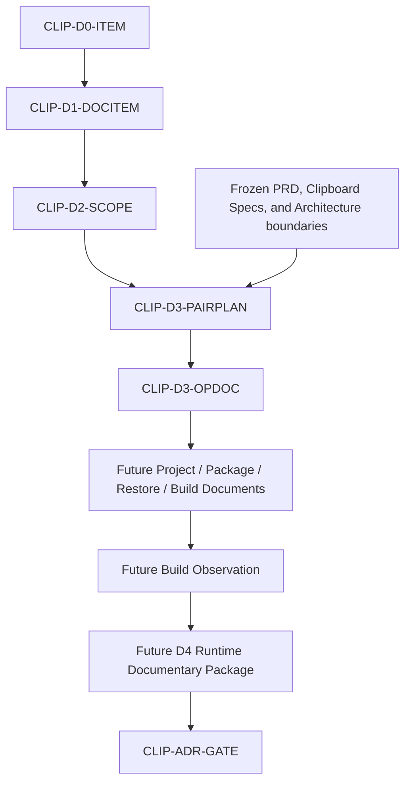

# Clipboard Integration D3 Project Package Restore Build Documentary Package

## 1. Document Control

| Field | Required value |
|---|---|
| Document ID | `RESEARCH-TECH-CLIPBOARD-022` |
| Title | Clipboard Integration D3 Project Package Restore Build Documentary Package |
| Status | Draft |
| Research Type | Project／Package／Restore／Build Documentary Package |
| Technology Decision | TD-004 Clipboard Integration |
| Package | `CLIP-EVIDPKG-004` |
| Acquisition Stage | D3 — Project／Package／Restore／Build Evidence |
| Parent D2 Package | `RESEARCH-TECH-CLIPBOARD-021` |
| Parent D1 Package | `RESEARCH-TECH-CLIPBOARD-020` |
| Parent D0 Package | `RESEARCH-TECH-CLIPBOARD-019` |
| Parent Package Specification | `RESEARCH-TECH-CLIPBOARD-018` |
| Covered D2 Scope Items | `CLIP-D2-SCOPE-001..010` |
| Covered Candidate–Host Pairs | `CLIP-PAIR-001..010` |
| Experimental Root Created | No |
| Project／Solution Created | No |
| Source Code Created | No |
| Consumer Created | No |
| Synthetic Image Created | No |
| Package Acquired | No |
| Restore／Build | Not performed |
| Application／Runtime | Not started |
| Clipboard Read／Write／Clear | Not performed |
| Build Observation | Not created |
| Persistent Evidence | Not created |
| Authorization Request | Not created |
| Human Authorization Decision | Not made |
| Candidate Ranking／Selection | Not performed |
| Technology Recommendation／Decision | Not made |
| Clipboard ADR | Not created |
| Owner | TBD |
| Last reviewed | Not reviewed |

## 2. Purpose and Fixed Boundary

This document defines how each of the ten D2 Candidate–Host experimental scopes is translated into independently reviewable future isolated-root, project-creation, reference/package-resolution, package-acquisition, Restore, Build, and cleanup boundaries without creating or executing any artifact.

This is a D3 documentary package specification. It is not a project or solution, directory tree, source code, project-file template, package manifest, Authorization Request, Human Decision, Restore or Build execution, Build evidence, Runtime or Clipboard evidence, Candidate comparison, or selection.

No directory, project, solution, manifest, source file, consumer, synthetic image, payload, output, log, observation, or evidence is created. No package acquisition, Restore, Build, Test, Run, inspection, Clipboard access, or Runtime is performed.

## 3. Source Preservation

- `RESEARCH-TECH-CLIPBOARD-016..021`
- `CLIP-OPT-001..005`
- `CLIP-PAIR-001..010`
- `CLIP-D2-SCOPE-001..010`
- `CLIP-D2-SYNTHSPEC-001`
- `CLIP-D2-FMTPROFILE-001..003`
- `CLIP-D2-CONSPEC-001..003`
- `CLIP-D1-DOCITEM-001..017`
- `CLIP-D0-ITEM-001..020`
- `CLIP-DEC-CRIT-001..012`
- `CLIP-DEC-GAP-001..020`
- `CLIP-DEC-EVIDPLAN-001..020`
- `CLIP-ADR-GATE-001..010`
- `CLIP-EVIDPKG-004`

Upstream status, D1/D2 mappings, Decision Gaps, Criteria, Evidence Plan Items, and ADR Gates remain unchanged. D1 observations are not treated as available. Installed SDKs, package versions, local paths, Candidate rankings, and executable instructions are not fabricated.

## 4. Controlled Vocabulary

### 4.1 D3 Documentary Status

- Fully specified
- Specified with pending D1 dependency
- Partially specified
- Blocked by documentary ambiguity
- Deferred
- Not applicable

### 4.2 Future Operation Eligibility

- Eligible for future operation-request preparation
- Conditionally eligible
- Not eligible
- Deferred

### 4.3 Availability

- Static identity known
- Pending D1 observation
- Not observed
- Not available
- Not applicable

### 4.4 Current Operation State

- Not created
- Not acquired
- Not restored
- Not built
- Not executed

| Boundary | Value |
|---|---|
| Current authorization | Not granted |
| Execution permitted | No |

Do not use Authorized, Approved, Created successfully, Restored successfully, Built successfully, Passed, Verified, Recommended, Selected, or Production ready as conclusions.

## 5. D3 Pair-plan Binding

| D3 Pair Plan | D2 Scope Item | Candidate–Host Pair |
|---|---|---|
| `CLIP-D3-PAIRPLAN-001` | `CLIP-D2-SCOPE-001` | `CLIP-PAIR-001` |
| `CLIP-D3-PAIRPLAN-002` | `CLIP-D2-SCOPE-002` | `CLIP-PAIR-002` |
| `CLIP-D3-PAIRPLAN-003` | `CLIP-D2-SCOPE-003` | `CLIP-PAIR-003` |
| `CLIP-D3-PAIRPLAN-004` | `CLIP-D2-SCOPE-004` | `CLIP-PAIR-004` |
| `CLIP-D3-PAIRPLAN-005` | `CLIP-D2-SCOPE-005` | `CLIP-PAIR-005` |
| `CLIP-D3-PAIRPLAN-006` | `CLIP-D2-SCOPE-006` | `CLIP-PAIR-006` |
| `CLIP-D3-PAIRPLAN-007` | `CLIP-D2-SCOPE-007` | `CLIP-PAIR-007` |
| `CLIP-D3-PAIRPLAN-008` | `CLIP-D2-SCOPE-008` | `CLIP-PAIR-008` |
| `CLIP-D3-PAIRPLAN-009` | `CLIP-D2-SCOPE-009` | `CLIP-PAIR-009` |
| `CLIP-D3-PAIRPLAN-010` | `CLIP-D2-SCOPE-010` | `CLIP-PAIR-010` |

Each D2 Scope Item receives exactly one D3 Pair Plan. WPF and WinUI 3 remain separate, different Candidates are not merged, and no `CLIP-D3-PAIRPLAN-011` is created. A Pair Plan defines only future operation boundaries. Documentary ambiguity would be recorded only as a D3 Documentary Gap.

## 6. Fixed Fields for Every D3 Pair Plan

### `CLIP-D3-PAIRPLAN-001`

| Field | Value |
|---|---|
| D3 Pair Plan ID | `CLIP-D3-PAIRPLAN-001` |
| Source D2 Scope Item | `CLIP-D2-SCOPE-001` |
| Candidate–Host Pair | `CLIP-PAIR-001` |
| Candidate ID | `CLIP-OPT-001` |
| Candidate identity | WPF Clipboard |
| Host identity | WPF |
| Backend identity | WPF Clipboard |
| Adapter mode | Candidate-neutral Adapter Boundary; candidate-specific details remain future scope. |
| Related D1 Items | `CLIP-D1-DOCITEM-001,002` |
| Related Decision Gaps | `CLIP-DEC-GAP-001..002` |
| Related Evidence Plan Items | `CLIP-DEC-EVIDPLAN-001..002` |
| Related Decision Criteria | `CLIP-DEC-CRIT-001` |
| Related ADR Gates | `CLIP-ADR-GATE-001` |
| D2 scope status | Specified with pending D1 dependency |
| D1 dependency state | Not observed |
| Experimental build question | What independently reviewable project, reference, package, Restore, Build, and cleanup boundary is needed for this Pair without implying viability? |
| Why Project evidence is required | A future isolated project boundary must establish host/backend/adapter composition without product-tree coupling. |
| Why Restore evidence is required | A future Restore record must establish bounded package resolution separately from acquisition and Build. |
| Why Build evidence is required | A future Build record must establish only the approved isolated scope under resolved parameters. |
| Isolated-root requirement | Use only `<future-authorized-isolated-root>`; no real root or directory is supplied. |
| Project-container requirement | Future isolated solution/project container requires a separate operation document and decision. |
| Host-project requirement | Future host project is independently scoped to WPF; no project is created. |
| Backend-module requirement | Future backend module is independently scoped to WPF Clipboard; no module is created. |
| Adapter-module requirement | Future adapter module remains separate from host, backend, Capture, Rendering, and workflow state. |
| Consumer-project requirement | Future consumer project is optional and separately authorized through the D2 consumer contract. |
| Synthetic-input requirement | Use `CLIP-D2-SYNTHSPEC-001` as a future specification only; no image is created. |
| Shared-contract requirement | Future shared experiment contracts remain bounded and separate from product workflow contracts. |
| Project-model class | Future isolated experiment container; no real project model is selected. |
| Runtime-family placeholder | `<resolved-runtime-family>` |
| Target-framework placeholder | `<resolved-target-framework>` |
| Windows-target placeholder | `<resolved-windows-target>` |
| Architecture placeholder | `<resolved-architecture>` |
| Packaging-mode placeholder | `<resolved-packaging-mode>` |
| Reference-asset classes | Framework, Windows SDK, WinRT, Windows App SDK, and named native reference classes as applicable. |
| Package classes | Named framework or third-party package classes only; no package ID/version/source is selected. |
| Package-version rule | Resolve from future D1 observation or approved evidence; never substitute latest. |
| Package-source rule | Future source class must be explicitly bounded; private or credentialed source is separate scope. |
| Existing-local reference requirement | Local reference availability remains Pending D1 observation. |
| Existing-local package requirement | Local package/cache availability remains Pending D1 observation. |
| Network requirement by operation | No network now; future acquisition/Restore network boundary requires separate authority. |
| Repository-isolation requirement | Required; no product repository mutation or unbounded traversal. |
| Product-source isolation | Required; no product-source dependency beyond approved static references. |
| Product-binary isolation | Required; no product binary launch or dependency. |
| Output isolation | Future output only inside approved isolated scope; no product output. |
| Package Cache isolation | No cache mutation now; cache authority remains separate. |
| Build-intermediate isolation | Future intermediates remain inside the approved isolated scope. |
| Build-output isolation | Future outputs remain inside the approved isolated scope and are not published to product locations. |
| Logging boundary | Sanitized diagnostics only; no raw private build log or ordinary repository log. |
| Privacy boundary | Credentials, tokens, SIDs, account identity, private paths, Clipboard data, and screenshot content are prohibited. |
| Credential boundary | No credential values; encounter stops the affected operation. |
| Clipboard boundary | No access. |
| History／Cloud boundary | No access |
| File Output boundary | No product output |
| Project-creation operation | `CLIP-D3-OPDOC-002`; separate future authority; Not created. |
| Module-creation operation | `CLIP-D3-OPDOC-003`; separate future authority; Not created. |
| Consumer-creation operation | `CLIP-D3-OPDOC-004`; separate future authority; Not created. |
| Synthetic-asset-creation operation | `CLIP-D3-OPDOC-004`; separate future authority; Not created. |
| Package-resolution operation | `CLIP-D3-OPDOC-005`; separate future authority; Not executed. |
| Package-acquisition operation | `CLIP-D3-OPDOC-006`; separate future authority; Not acquired. |
| Restore operation | `CLIP-D3-OPDOC-007`; separate future authority; Not restored. |
| Build operation | `CLIP-D3-OPDOC-008`; separate future authority; Not built. |
| Cleanup operation | `CLIP-D3-OPDOC-009`; separate future authority; Not executed. |
| Operation bundling rule | No operation inherits authority from another; project, acquisition, Restore, Build, and cleanup remain independently reviewable. |
| Future observation contract | Session-only sanitized fields: resolved identities, outcome categories, mutation/network/elevation flags, stop trigger, and cleanup status. |
| Persistent Evidence separation | Required; no Build observation auto-persists and no evidence directory, log, or result file is created. |
| Entry conditions | D2 scope, D1 dependency mapping, operation registry, and frozen isolation boundaries are documented. |
| Exit conditions | Pair Plan, operation boundaries, placeholders, observation contract, failure/rollback rules, and future input contracts are documented. |
| Stop conditions | D1 unresolved, target/package/version ambiguity, private source/credential, network/elevation, mutation, scope expansion, Restore/Build failure, launch, Clipboard access, or cleanup ambiguity. |
| Rollback boundary | Only a separately authorized isolated scope may be rolled back; no product-tree or cache cleanup is implied. |
| Prohibited inference | Do not infer local availability, Build success, Runtime viability, Candidate suitability, ranking, selection, or recommendation. |
| Current authorization | Not granted |
| Execution permitted | No |
| Owner | TBD |
| Documentary status | Specified with pending D1 dependency |
| Future operation eligibility | Conditionally eligible |
| Open questions | Which future D1 facts, package boundaries, target values, operation authorities, and sanitized Build observations can resolve this Pair? |

### `CLIP-D3-PAIRPLAN-002`

| Field | Value |
|---|---|
| D3 Pair Plan ID | `CLIP-D3-PAIRPLAN-002` |
| Source D2 Scope Item | `CLIP-D2-SCOPE-002` |
| Candidate–Host Pair | `CLIP-PAIR-002` |
| Candidate ID | `CLIP-OPT-001` |
| Candidate identity | WPF Clipboard |
| Host identity | WinUI 3 |
| Backend identity | WPF Clipboard |
| Adapter mode | Candidate-neutral Adapter Boundary; candidate-specific details remain future scope. |
| Related D1 Items | `CLIP-D1-DOCITEM-003,004` |
| Related Decision Gaps | `CLIP-DEC-GAP-003..004` |
| Related Evidence Plan Items | `CLIP-DEC-EVIDPLAN-003..004` |
| Related Decision Criteria | `CLIP-DEC-CRIT-002` |
| Related ADR Gates | `CLIP-ADR-GATE-002` |
| D2 scope status | Specified with pending D1 dependency |
| D1 dependency state | Not observed |
| Experimental build question | What independently reviewable project, reference, package, Restore, Build, and cleanup boundary is needed for this Pair without implying viability? |
| Why Project evidence is required | A future isolated project boundary must establish host/backend/adapter composition without product-tree coupling. |
| Why Restore evidence is required | A future Restore record must establish bounded package resolution separately from acquisition and Build. |
| Why Build evidence is required | A future Build record must establish only the approved isolated scope under resolved parameters. |
| Isolated-root requirement | Use only `<future-authorized-isolated-root>`; no real root or directory is supplied. |
| Project-container requirement | Future isolated solution/project container requires a separate operation document and decision. |
| Host-project requirement | Future host project is independently scoped to WinUI 3; no project is created. |
| Backend-module requirement | Future backend module is independently scoped to WPF Clipboard; no module is created. |
| Adapter-module requirement | Future adapter module remains separate from host, backend, Capture, Rendering, and workflow state. |
| Consumer-project requirement | Future consumer project is optional and separately authorized through the D2 consumer contract. |
| Synthetic-input requirement | Use `CLIP-D2-SYNTHSPEC-001` as a future specification only; no image is created. |
| Shared-contract requirement | Future shared experiment contracts remain bounded and separate from product workflow contracts. |
| Project-model class | Future isolated experiment container; no real project model is selected. |
| Runtime-family placeholder | `<resolved-runtime-family>` |
| Target-framework placeholder | `<resolved-target-framework>` |
| Windows-target placeholder | `<resolved-windows-target>` |
| Architecture placeholder | `<resolved-architecture>` |
| Packaging-mode placeholder | `<resolved-packaging-mode>` |
| Reference-asset classes | Framework, Windows SDK, WinRT, Windows App SDK, and named native reference classes as applicable. |
| Package classes | Named framework or third-party package classes only; no package ID/version/source is selected. |
| Package-version rule | Resolve from future D1 observation or approved evidence; never substitute latest. |
| Package-source rule | Future source class must be explicitly bounded; private or credentialed source is separate scope. |
| Existing-local reference requirement | Local reference availability remains Pending D1 observation. |
| Existing-local package requirement | Local package/cache availability remains Pending D1 observation. |
| Network requirement by operation | No network now; future acquisition/Restore network boundary requires separate authority. |
| Repository-isolation requirement | Required; no product repository mutation or unbounded traversal. |
| Product-source isolation | Required; no product-source dependency beyond approved static references. |
| Product-binary isolation | Required; no product binary launch or dependency. |
| Output isolation | Future output only inside approved isolated scope; no product output. |
| Package Cache isolation | No cache mutation now; cache authority remains separate. |
| Build-intermediate isolation | Future intermediates remain inside the approved isolated scope. |
| Build-output isolation | Future outputs remain inside the approved isolated scope and are not published to product locations. |
| Logging boundary | Sanitized diagnostics only; no raw private build log or ordinary repository log. |
| Privacy boundary | Credentials, tokens, SIDs, account identity, private paths, Clipboard data, and screenshot content are prohibited. |
| Credential boundary | No credential values; encounter stops the affected operation. |
| Clipboard boundary | No access. |
| History／Cloud boundary | No access |
| File Output boundary | No product output |
| Project-creation operation | `CLIP-D3-OPDOC-002`; separate future authority; Not created. |
| Module-creation operation | `CLIP-D3-OPDOC-003`; separate future authority; Not created. |
| Consumer-creation operation | `CLIP-D3-OPDOC-004`; separate future authority; Not created. |
| Synthetic-asset-creation operation | `CLIP-D3-OPDOC-004`; separate future authority; Not created. |
| Package-resolution operation | `CLIP-D3-OPDOC-005`; separate future authority; Not executed. |
| Package-acquisition operation | `CLIP-D3-OPDOC-006`; separate future authority; Not acquired. |
| Restore operation | `CLIP-D3-OPDOC-007`; separate future authority; Not restored. |
| Build operation | `CLIP-D3-OPDOC-008`; separate future authority; Not built. |
| Cleanup operation | `CLIP-D3-OPDOC-009`; separate future authority; Not executed. |
| Operation bundling rule | No operation inherits authority from another; project, acquisition, Restore, Build, and cleanup remain independently reviewable. |
| Future observation contract | Session-only sanitized fields: resolved identities, outcome categories, mutation/network/elevation flags, stop trigger, and cleanup status. |
| Persistent Evidence separation | Required; no Build observation auto-persists and no evidence directory, log, or result file is created. |
| Entry conditions | D2 scope, D1 dependency mapping, operation registry, and frozen isolation boundaries are documented. |
| Exit conditions | Pair Plan, operation boundaries, placeholders, observation contract, failure/rollback rules, and future input contracts are documented. |
| Stop conditions | D1 unresolved, target/package/version ambiguity, private source/credential, network/elevation, mutation, scope expansion, Restore/Build failure, launch, Clipboard access, or cleanup ambiguity. |
| Rollback boundary | Only a separately authorized isolated scope may be rolled back; no product-tree or cache cleanup is implied. |
| Prohibited inference | Do not infer local availability, Build success, Runtime viability, Candidate suitability, ranking, selection, or recommendation. |
| Current authorization | Not granted |
| Execution permitted | No |
| Owner | TBD |
| Documentary status | Specified with pending D1 dependency |
| Future operation eligibility | Conditionally eligible |
| Open questions | Which future D1 facts, package boundaries, target values, operation authorities, and sanitized Build observations can resolve this Pair? |

### `CLIP-D3-PAIRPLAN-003`

| Field | Value |
|---|---|
| D3 Pair Plan ID | `CLIP-D3-PAIRPLAN-003` |
| Source D2 Scope Item | `CLIP-D2-SCOPE-003` |
| Candidate–Host Pair | `CLIP-PAIR-003` |
| Candidate ID | `CLIP-OPT-002` |
| Candidate identity | WinRT Clipboard |
| Host identity | WPF |
| Backend identity | WinRT Clipboard |
| Adapter mode | Candidate-neutral Adapter Boundary; candidate-specific details remain future scope. |
| Related D1 Items | `CLIP-D1-DOCITEM-005,006` |
| Related Decision Gaps | `CLIP-DEC-GAP-005..006` |
| Related Evidence Plan Items | `CLIP-DEC-EVIDPLAN-005..006` |
| Related Decision Criteria | `CLIP-DEC-CRIT-003` |
| Related ADR Gates | `CLIP-ADR-GATE-003` |
| D2 scope status | Specified with pending D1 dependency |
| D1 dependency state | Not observed |
| Experimental build question | What independently reviewable project, reference, package, Restore, Build, and cleanup boundary is needed for this Pair without implying viability? |
| Why Project evidence is required | A future isolated project boundary must establish host/backend/adapter composition without product-tree coupling. |
| Why Restore evidence is required | A future Restore record must establish bounded package resolution separately from acquisition and Build. |
| Why Build evidence is required | A future Build record must establish only the approved isolated scope under resolved parameters. |
| Isolated-root requirement | Use only `<future-authorized-isolated-root>`; no real root or directory is supplied. |
| Project-container requirement | Future isolated solution/project container requires a separate operation document and decision. |
| Host-project requirement | Future host project is independently scoped to WPF; no project is created. |
| Backend-module requirement | Future backend module is independently scoped to WinRT Clipboard; no module is created. |
| Adapter-module requirement | Future adapter module remains separate from host, backend, Capture, Rendering, and workflow state. |
| Consumer-project requirement | Future consumer project is optional and separately authorized through the D2 consumer contract. |
| Synthetic-input requirement | Use `CLIP-D2-SYNTHSPEC-001` as a future specification only; no image is created. |
| Shared-contract requirement | Future shared experiment contracts remain bounded and separate from product workflow contracts. |
| Project-model class | Future isolated experiment container; no real project model is selected. |
| Runtime-family placeholder | `<resolved-runtime-family>` |
| Target-framework placeholder | `<resolved-target-framework>` |
| Windows-target placeholder | `<resolved-windows-target>` |
| Architecture placeholder | `<resolved-architecture>` |
| Packaging-mode placeholder | `<resolved-packaging-mode>` |
| Reference-asset classes | Framework, Windows SDK, WinRT, Windows App SDK, and named native reference classes as applicable. |
| Package classes | Named framework or third-party package classes only; no package ID/version/source is selected. |
| Package-version rule | Resolve from future D1 observation or approved evidence; never substitute latest. |
| Package-source rule | Future source class must be explicitly bounded; private or credentialed source is separate scope. |
| Existing-local reference requirement | Local reference availability remains Pending D1 observation. |
| Existing-local package requirement | Local package/cache availability remains Pending D1 observation. |
| Network requirement by operation | No network now; future acquisition/Restore network boundary requires separate authority. |
| Repository-isolation requirement | Required; no product repository mutation or unbounded traversal. |
| Product-source isolation | Required; no product-source dependency beyond approved static references. |
| Product-binary isolation | Required; no product binary launch or dependency. |
| Output isolation | Future output only inside approved isolated scope; no product output. |
| Package Cache isolation | No cache mutation now; cache authority remains separate. |
| Build-intermediate isolation | Future intermediates remain inside the approved isolated scope. |
| Build-output isolation | Future outputs remain inside the approved isolated scope and are not published to product locations. |
| Logging boundary | Sanitized diagnostics only; no raw private build log or ordinary repository log. |
| Privacy boundary | Credentials, tokens, SIDs, account identity, private paths, Clipboard data, and screenshot content are prohibited. |
| Credential boundary | No credential values; encounter stops the affected operation. |
| Clipboard boundary | No access. |
| History／Cloud boundary | No access |
| File Output boundary | No product output |
| Project-creation operation | `CLIP-D3-OPDOC-002`; separate future authority; Not created. |
| Module-creation operation | `CLIP-D3-OPDOC-003`; separate future authority; Not created. |
| Consumer-creation operation | `CLIP-D3-OPDOC-004`; separate future authority; Not created. |
| Synthetic-asset-creation operation | `CLIP-D3-OPDOC-004`; separate future authority; Not created. |
| Package-resolution operation | `CLIP-D3-OPDOC-005`; separate future authority; Not executed. |
| Package-acquisition operation | `CLIP-D3-OPDOC-006`; separate future authority; Not acquired. |
| Restore operation | `CLIP-D3-OPDOC-007`; separate future authority; Not restored. |
| Build operation | `CLIP-D3-OPDOC-008`; separate future authority; Not built. |
| Cleanup operation | `CLIP-D3-OPDOC-009`; separate future authority; Not executed. |
| Operation bundling rule | No operation inherits authority from another; project, acquisition, Restore, Build, and cleanup remain independently reviewable. |
| Future observation contract | Session-only sanitized fields: resolved identities, outcome categories, mutation/network/elevation flags, stop trigger, and cleanup status. |
| Persistent Evidence separation | Required; no Build observation auto-persists and no evidence directory, log, or result file is created. |
| Entry conditions | D2 scope, D1 dependency mapping, operation registry, and frozen isolation boundaries are documented. |
| Exit conditions | Pair Plan, operation boundaries, placeholders, observation contract, failure/rollback rules, and future input contracts are documented. |
| Stop conditions | D1 unresolved, target/package/version ambiguity, private source/credential, network/elevation, mutation, scope expansion, Restore/Build failure, launch, Clipboard access, or cleanup ambiguity. |
| Rollback boundary | Only a separately authorized isolated scope may be rolled back; no product-tree or cache cleanup is implied. |
| Prohibited inference | Do not infer local availability, Build success, Runtime viability, Candidate suitability, ranking, selection, or recommendation. |
| Current authorization | Not granted |
| Execution permitted | No |
| Owner | TBD |
| Documentary status | Specified with pending D1 dependency |
| Future operation eligibility | Conditionally eligible |
| Open questions | Which future D1 facts, package boundaries, target values, operation authorities, and sanitized Build observations can resolve this Pair? |

### `CLIP-D3-PAIRPLAN-004`

| Field | Value |
|---|---|
| D3 Pair Plan ID | `CLIP-D3-PAIRPLAN-004` |
| Source D2 Scope Item | `CLIP-D2-SCOPE-004` |
| Candidate–Host Pair | `CLIP-PAIR-004` |
| Candidate ID | `CLIP-OPT-002` |
| Candidate identity | WinRT Clipboard |
| Host identity | WinUI 3 |
| Backend identity | WinRT Clipboard |
| Adapter mode | Candidate-neutral Adapter Boundary; candidate-specific details remain future scope. |
| Related D1 Items | `CLIP-D1-DOCITEM-007,008` |
| Related Decision Gaps | `CLIP-DEC-GAP-007..008` |
| Related Evidence Plan Items | `CLIP-DEC-EVIDPLAN-007..008` |
| Related Decision Criteria | `CLIP-DEC-CRIT-004` |
| Related ADR Gates | `CLIP-ADR-GATE-004` |
| D2 scope status | Specified with pending D1 dependency |
| D1 dependency state | Not observed |
| Experimental build question | What independently reviewable project, reference, package, Restore, Build, and cleanup boundary is needed for this Pair without implying viability? |
| Why Project evidence is required | A future isolated project boundary must establish host/backend/adapter composition without product-tree coupling. |
| Why Restore evidence is required | A future Restore record must establish bounded package resolution separately from acquisition and Build. |
| Why Build evidence is required | A future Build record must establish only the approved isolated scope under resolved parameters. |
| Isolated-root requirement | Use only `<future-authorized-isolated-root>`; no real root or directory is supplied. |
| Project-container requirement | Future isolated solution/project container requires a separate operation document and decision. |
| Host-project requirement | Future host project is independently scoped to WinUI 3; no project is created. |
| Backend-module requirement | Future backend module is independently scoped to WinRT Clipboard; no module is created. |
| Adapter-module requirement | Future adapter module remains separate from host, backend, Capture, Rendering, and workflow state. |
| Consumer-project requirement | Future consumer project is optional and separately authorized through the D2 consumer contract. |
| Synthetic-input requirement | Use `CLIP-D2-SYNTHSPEC-001` as a future specification only; no image is created. |
| Shared-contract requirement | Future shared experiment contracts remain bounded and separate from product workflow contracts. |
| Project-model class | Future isolated experiment container; no real project model is selected. |
| Runtime-family placeholder | `<resolved-runtime-family>` |
| Target-framework placeholder | `<resolved-target-framework>` |
| Windows-target placeholder | `<resolved-windows-target>` |
| Architecture placeholder | `<resolved-architecture>` |
| Packaging-mode placeholder | `<resolved-packaging-mode>` |
| Reference-asset classes | Framework, Windows SDK, WinRT, Windows App SDK, and named native reference classes as applicable. |
| Package classes | Named framework or third-party package classes only; no package ID/version/source is selected. |
| Package-version rule | Resolve from future D1 observation or approved evidence; never substitute latest. |
| Package-source rule | Future source class must be explicitly bounded; private or credentialed source is separate scope. |
| Existing-local reference requirement | Local reference availability remains Pending D1 observation. |
| Existing-local package requirement | Local package/cache availability remains Pending D1 observation. |
| Network requirement by operation | No network now; future acquisition/Restore network boundary requires separate authority. |
| Repository-isolation requirement | Required; no product repository mutation or unbounded traversal. |
| Product-source isolation | Required; no product-source dependency beyond approved static references. |
| Product-binary isolation | Required; no product binary launch or dependency. |
| Output isolation | Future output only inside approved isolated scope; no product output. |
| Package Cache isolation | No cache mutation now; cache authority remains separate. |
| Build-intermediate isolation | Future intermediates remain inside the approved isolated scope. |
| Build-output isolation | Future outputs remain inside the approved isolated scope and are not published to product locations. |
| Logging boundary | Sanitized diagnostics only; no raw private build log or ordinary repository log. |
| Privacy boundary | Credentials, tokens, SIDs, account identity, private paths, Clipboard data, and screenshot content are prohibited. |
| Credential boundary | No credential values; encounter stops the affected operation. |
| Clipboard boundary | No access. |
| History／Cloud boundary | No access |
| File Output boundary | No product output |
| Project-creation operation | `CLIP-D3-OPDOC-002`; separate future authority; Not created. |
| Module-creation operation | `CLIP-D3-OPDOC-003`; separate future authority; Not created. |
| Consumer-creation operation | `CLIP-D3-OPDOC-004`; separate future authority; Not created. |
| Synthetic-asset-creation operation | `CLIP-D3-OPDOC-004`; separate future authority; Not created. |
| Package-resolution operation | `CLIP-D3-OPDOC-005`; separate future authority; Not executed. |
| Package-acquisition operation | `CLIP-D3-OPDOC-006`; separate future authority; Not acquired. |
| Restore operation | `CLIP-D3-OPDOC-007`; separate future authority; Not restored. |
| Build operation | `CLIP-D3-OPDOC-008`; separate future authority; Not built. |
| Cleanup operation | `CLIP-D3-OPDOC-009`; separate future authority; Not executed. |
| Operation bundling rule | No operation inherits authority from another; project, acquisition, Restore, Build, and cleanup remain independently reviewable. |
| Future observation contract | Session-only sanitized fields: resolved identities, outcome categories, mutation/network/elevation flags, stop trigger, and cleanup status. |
| Persistent Evidence separation | Required; no Build observation auto-persists and no evidence directory, log, or result file is created. |
| Entry conditions | D2 scope, D1 dependency mapping, operation registry, and frozen isolation boundaries are documented. |
| Exit conditions | Pair Plan, operation boundaries, placeholders, observation contract, failure/rollback rules, and future input contracts are documented. |
| Stop conditions | D1 unresolved, target/package/version ambiguity, private source/credential, network/elevation, mutation, scope expansion, Restore/Build failure, launch, Clipboard access, or cleanup ambiguity. |
| Rollback boundary | Only a separately authorized isolated scope may be rolled back; no product-tree or cache cleanup is implied. |
| Prohibited inference | Do not infer local availability, Build success, Runtime viability, Candidate suitability, ranking, selection, or recommendation. |
| Current authorization | Not granted |
| Execution permitted | No |
| Owner | TBD |
| Documentary status | Specified with pending D1 dependency |
| Future operation eligibility | Conditionally eligible |
| Open questions | Which future D1 facts, package boundaries, target values, operation authorities, and sanitized Build observations can resolve this Pair? |

### `CLIP-D3-PAIRPLAN-005`

| Field | Value |
|---|---|
| D3 Pair Plan ID | `CLIP-D3-PAIRPLAN-005` |
| Source D2 Scope Item | `CLIP-D2-SCOPE-005` |
| Candidate–Host Pair | `CLIP-PAIR-005` |
| Candidate ID | `CLIP-OPT-003` |
| Candidate identity | OLE/COM IDataObject |
| Host identity | WPF |
| Backend identity | OLE/COM IDataObject |
| Adapter mode | Candidate-neutral Adapter Boundary; candidate-specific details remain future scope. |
| Related D1 Items | `CLIP-D1-DOCITEM-009,010` |
| Related Decision Gaps | `CLIP-DEC-GAP-009..010` |
| Related Evidence Plan Items | `CLIP-DEC-EVIDPLAN-009..010` |
| Related Decision Criteria | `CLIP-DEC-CRIT-005` |
| Related ADR Gates | `CLIP-ADR-GATE-005` |
| D2 scope status | Specified with pending D1 dependency |
| D1 dependency state | Not observed |
| Experimental build question | What independently reviewable project, reference, package, Restore, Build, and cleanup boundary is needed for this Pair without implying viability? |
| Why Project evidence is required | A future isolated project boundary must establish host/backend/adapter composition without product-tree coupling. |
| Why Restore evidence is required | A future Restore record must establish bounded package resolution separately from acquisition and Build. |
| Why Build evidence is required | A future Build record must establish only the approved isolated scope under resolved parameters. |
| Isolated-root requirement | Use only `<future-authorized-isolated-root>`; no real root or directory is supplied. |
| Project-container requirement | Future isolated solution/project container requires a separate operation document and decision. |
| Host-project requirement | Future host project is independently scoped to WPF; no project is created. |
| Backend-module requirement | Future backend module is independently scoped to OLE/COM IDataObject; no module is created. |
| Adapter-module requirement | Future adapter module remains separate from host, backend, Capture, Rendering, and workflow state. |
| Consumer-project requirement | Future consumer project is optional and separately authorized through the D2 consumer contract. |
| Synthetic-input requirement | Use `CLIP-D2-SYNTHSPEC-001` as a future specification only; no image is created. |
| Shared-contract requirement | Future shared experiment contracts remain bounded and separate from product workflow contracts. |
| Project-model class | Future isolated experiment container; no real project model is selected. |
| Runtime-family placeholder | `<resolved-runtime-family>` |
| Target-framework placeholder | `<resolved-target-framework>` |
| Windows-target placeholder | `<resolved-windows-target>` |
| Architecture placeholder | `<resolved-architecture>` |
| Packaging-mode placeholder | `<resolved-packaging-mode>` |
| Reference-asset classes | Framework, Windows SDK, WinRT, Windows App SDK, and named native reference classes as applicable. |
| Package classes | Named framework or third-party package classes only; no package ID/version/source is selected. |
| Package-version rule | Resolve from future D1 observation or approved evidence; never substitute latest. |
| Package-source rule | Future source class must be explicitly bounded; private or credentialed source is separate scope. |
| Existing-local reference requirement | Local reference availability remains Pending D1 observation. |
| Existing-local package requirement | Local package/cache availability remains Pending D1 observation. |
| Network requirement by operation | No network now; future acquisition/Restore network boundary requires separate authority. |
| Repository-isolation requirement | Required; no product repository mutation or unbounded traversal. |
| Product-source isolation | Required; no product-source dependency beyond approved static references. |
| Product-binary isolation | Required; no product binary launch or dependency. |
| Output isolation | Future output only inside approved isolated scope; no product output. |
| Package Cache isolation | No cache mutation now; cache authority remains separate. |
| Build-intermediate isolation | Future intermediates remain inside the approved isolated scope. |
| Build-output isolation | Future outputs remain inside the approved isolated scope and are not published to product locations. |
| Logging boundary | Sanitized diagnostics only; no raw private build log or ordinary repository log. |
| Privacy boundary | Credentials, tokens, SIDs, account identity, private paths, Clipboard data, and screenshot content are prohibited. |
| Credential boundary | No credential values; encounter stops the affected operation. |
| Clipboard boundary | No access. |
| History／Cloud boundary | No access |
| File Output boundary | No product output |
| Project-creation operation | `CLIP-D3-OPDOC-002`; separate future authority; Not created. |
| Module-creation operation | `CLIP-D3-OPDOC-003`; separate future authority; Not created. |
| Consumer-creation operation | `CLIP-D3-OPDOC-004`; separate future authority; Not created. |
| Synthetic-asset-creation operation | `CLIP-D3-OPDOC-004`; separate future authority; Not created. |
| Package-resolution operation | `CLIP-D3-OPDOC-005`; separate future authority; Not executed. |
| Package-acquisition operation | `CLIP-D3-OPDOC-006`; separate future authority; Not acquired. |
| Restore operation | `CLIP-D3-OPDOC-007`; separate future authority; Not restored. |
| Build operation | `CLIP-D3-OPDOC-008`; separate future authority; Not built. |
| Cleanup operation | `CLIP-D3-OPDOC-009`; separate future authority; Not executed. |
| Operation bundling rule | No operation inherits authority from another; project, acquisition, Restore, Build, and cleanup remain independently reviewable. |
| Future observation contract | Session-only sanitized fields: resolved identities, outcome categories, mutation/network/elevation flags, stop trigger, and cleanup status. |
| Persistent Evidence separation | Required; no Build observation auto-persists and no evidence directory, log, or result file is created. |
| Entry conditions | D2 scope, D1 dependency mapping, operation registry, and frozen isolation boundaries are documented. |
| Exit conditions | Pair Plan, operation boundaries, placeholders, observation contract, failure/rollback rules, and future input contracts are documented. |
| Stop conditions | D1 unresolved, target/package/version ambiguity, private source/credential, network/elevation, mutation, scope expansion, Restore/Build failure, launch, Clipboard access, or cleanup ambiguity. |
| Rollback boundary | Only a separately authorized isolated scope may be rolled back; no product-tree or cache cleanup is implied. |
| Prohibited inference | Do not infer local availability, Build success, Runtime viability, Candidate suitability, ranking, selection, or recommendation. |
| Current authorization | Not granted |
| Execution permitted | No |
| Owner | TBD |
| Documentary status | Specified with pending D1 dependency |
| Future operation eligibility | Conditionally eligible |
| Open questions | Which future D1 facts, package boundaries, target values, operation authorities, and sanitized Build observations can resolve this Pair? |

### `CLIP-D3-PAIRPLAN-006`

| Field | Value |
|---|---|
| D3 Pair Plan ID | `CLIP-D3-PAIRPLAN-006` |
| Source D2 Scope Item | `CLIP-D2-SCOPE-006` |
| Candidate–Host Pair | `CLIP-PAIR-006` |
| Candidate ID | `CLIP-OPT-003` |
| Candidate identity | OLE/COM IDataObject |
| Host identity | WinUI 3 |
| Backend identity | OLE/COM IDataObject |
| Adapter mode | Candidate-neutral Adapter Boundary; candidate-specific details remain future scope. |
| Related D1 Items | `CLIP-D1-DOCITEM-011,012` |
| Related Decision Gaps | `CLIP-DEC-GAP-011..012` |
| Related Evidence Plan Items | `CLIP-DEC-EVIDPLAN-011..012` |
| Related Decision Criteria | `CLIP-DEC-CRIT-006` |
| Related ADR Gates | `CLIP-ADR-GATE-006` |
| D2 scope status | Specified with pending D1 dependency |
| D1 dependency state | Not observed |
| Experimental build question | What independently reviewable project, reference, package, Restore, Build, and cleanup boundary is needed for this Pair without implying viability? |
| Why Project evidence is required | A future isolated project boundary must establish host/backend/adapter composition without product-tree coupling. |
| Why Restore evidence is required | A future Restore record must establish bounded package resolution separately from acquisition and Build. |
| Why Build evidence is required | A future Build record must establish only the approved isolated scope under resolved parameters. |
| Isolated-root requirement | Use only `<future-authorized-isolated-root>`; no real root or directory is supplied. |
| Project-container requirement | Future isolated solution/project container requires a separate operation document and decision. |
| Host-project requirement | Future host project is independently scoped to WinUI 3; no project is created. |
| Backend-module requirement | Future backend module is independently scoped to OLE/COM IDataObject; no module is created. |
| Adapter-module requirement | Future adapter module remains separate from host, backend, Capture, Rendering, and workflow state. |
| Consumer-project requirement | Future consumer project is optional and separately authorized through the D2 consumer contract. |
| Synthetic-input requirement | Use `CLIP-D2-SYNTHSPEC-001` as a future specification only; no image is created. |
| Shared-contract requirement | Future shared experiment contracts remain bounded and separate from product workflow contracts. |
| Project-model class | Future isolated experiment container; no real project model is selected. |
| Runtime-family placeholder | `<resolved-runtime-family>` |
| Target-framework placeholder | `<resolved-target-framework>` |
| Windows-target placeholder | `<resolved-windows-target>` |
| Architecture placeholder | `<resolved-architecture>` |
| Packaging-mode placeholder | `<resolved-packaging-mode>` |
| Reference-asset classes | Framework, Windows SDK, WinRT, Windows App SDK, and named native reference classes as applicable. |
| Package classes | Named framework or third-party package classes only; no package ID/version/source is selected. |
| Package-version rule | Resolve from future D1 observation or approved evidence; never substitute latest. |
| Package-source rule | Future source class must be explicitly bounded; private or credentialed source is separate scope. |
| Existing-local reference requirement | Local reference availability remains Pending D1 observation. |
| Existing-local package requirement | Local package/cache availability remains Pending D1 observation. |
| Network requirement by operation | No network now; future acquisition/Restore network boundary requires separate authority. |
| Repository-isolation requirement | Required; no product repository mutation or unbounded traversal. |
| Product-source isolation | Required; no product-source dependency beyond approved static references. |
| Product-binary isolation | Required; no product binary launch or dependency. |
| Output isolation | Future output only inside approved isolated scope; no product output. |
| Package Cache isolation | No cache mutation now; cache authority remains separate. |
| Build-intermediate isolation | Future intermediates remain inside the approved isolated scope. |
| Build-output isolation | Future outputs remain inside the approved isolated scope and are not published to product locations. |
| Logging boundary | Sanitized diagnostics only; no raw private build log or ordinary repository log. |
| Privacy boundary | Credentials, tokens, SIDs, account identity, private paths, Clipboard data, and screenshot content are prohibited. |
| Credential boundary | No credential values; encounter stops the affected operation. |
| Clipboard boundary | No access. |
| History／Cloud boundary | No access |
| File Output boundary | No product output |
| Project-creation operation | `CLIP-D3-OPDOC-002`; separate future authority; Not created. |
| Module-creation operation | `CLIP-D3-OPDOC-003`; separate future authority; Not created. |
| Consumer-creation operation | `CLIP-D3-OPDOC-004`; separate future authority; Not created. |
| Synthetic-asset-creation operation | `CLIP-D3-OPDOC-004`; separate future authority; Not created. |
| Package-resolution operation | `CLIP-D3-OPDOC-005`; separate future authority; Not executed. |
| Package-acquisition operation | `CLIP-D3-OPDOC-006`; separate future authority; Not acquired. |
| Restore operation | `CLIP-D3-OPDOC-007`; separate future authority; Not restored. |
| Build operation | `CLIP-D3-OPDOC-008`; separate future authority; Not built. |
| Cleanup operation | `CLIP-D3-OPDOC-009`; separate future authority; Not executed. |
| Operation bundling rule | No operation inherits authority from another; project, acquisition, Restore, Build, and cleanup remain independently reviewable. |
| Future observation contract | Session-only sanitized fields: resolved identities, outcome categories, mutation/network/elevation flags, stop trigger, and cleanup status. |
| Persistent Evidence separation | Required; no Build observation auto-persists and no evidence directory, log, or result file is created. |
| Entry conditions | D2 scope, D1 dependency mapping, operation registry, and frozen isolation boundaries are documented. |
| Exit conditions | Pair Plan, operation boundaries, placeholders, observation contract, failure/rollback rules, and future input contracts are documented. |
| Stop conditions | D1 unresolved, target/package/version ambiguity, private source/credential, network/elevation, mutation, scope expansion, Restore/Build failure, launch, Clipboard access, or cleanup ambiguity. |
| Rollback boundary | Only a separately authorized isolated scope may be rolled back; no product-tree or cache cleanup is implied. |
| Prohibited inference | Do not infer local availability, Build success, Runtime viability, Candidate suitability, ranking, selection, or recommendation. |
| Current authorization | Not granted |
| Execution permitted | No |
| Owner | TBD |
| Documentary status | Specified with pending D1 dependency |
| Future operation eligibility | Conditionally eligible |
| Open questions | Which future D1 facts, package boundaries, target values, operation authorities, and sanitized Build observations can resolve this Pair? |

### `CLIP-D3-PAIRPLAN-007`

| Field | Value |
|---|---|
| D3 Pair Plan ID | `CLIP-D3-PAIRPLAN-007` |
| Source D2 Scope Item | `CLIP-D2-SCOPE-007` |
| Candidate–Host Pair | `CLIP-PAIR-007` |
| Candidate ID | `CLIP-OPT-004` |
| Candidate identity | Raw Win32 Clipboard |
| Host identity | WPF |
| Backend identity | Raw Win32 Clipboard |
| Adapter mode | Candidate-neutral Adapter Boundary; candidate-specific details remain future scope. |
| Related D1 Items | `CLIP-D1-DOCITEM-013,014` |
| Related Decision Gaps | `CLIP-DEC-GAP-013..014` |
| Related Evidence Plan Items | `CLIP-DEC-EVIDPLAN-013..014` |
| Related Decision Criteria | `CLIP-DEC-CRIT-007` |
| Related ADR Gates | `CLIP-ADR-GATE-007` |
| D2 scope status | Specified with pending D1 dependency |
| D1 dependency state | Not observed |
| Experimental build question | What independently reviewable project, reference, package, Restore, Build, and cleanup boundary is needed for this Pair without implying viability? |
| Why Project evidence is required | A future isolated project boundary must establish host/backend/adapter composition without product-tree coupling. |
| Why Restore evidence is required | A future Restore record must establish bounded package resolution separately from acquisition and Build. |
| Why Build evidence is required | A future Build record must establish only the approved isolated scope under resolved parameters. |
| Isolated-root requirement | Use only `<future-authorized-isolated-root>`; no real root or directory is supplied. |
| Project-container requirement | Future isolated solution/project container requires a separate operation document and decision. |
| Host-project requirement | Future host project is independently scoped to WPF; no project is created. |
| Backend-module requirement | Future backend module is independently scoped to Raw Win32 Clipboard; no module is created. |
| Adapter-module requirement | Future adapter module remains separate from host, backend, Capture, Rendering, and workflow state. |
| Consumer-project requirement | Future consumer project is optional and separately authorized through the D2 consumer contract. |
| Synthetic-input requirement | Use `CLIP-D2-SYNTHSPEC-001` as a future specification only; no image is created. |
| Shared-contract requirement | Future shared experiment contracts remain bounded and separate from product workflow contracts. |
| Project-model class | Future isolated experiment container; no real project model is selected. |
| Runtime-family placeholder | `<resolved-runtime-family>` |
| Target-framework placeholder | `<resolved-target-framework>` |
| Windows-target placeholder | `<resolved-windows-target>` |
| Architecture placeholder | `<resolved-architecture>` |
| Packaging-mode placeholder | `<resolved-packaging-mode>` |
| Reference-asset classes | Framework, Windows SDK, WinRT, Windows App SDK, and named native reference classes as applicable. |
| Package classes | Named framework or third-party package classes only; no package ID/version/source is selected. |
| Package-version rule | Resolve from future D1 observation or approved evidence; never substitute latest. |
| Package-source rule | Future source class must be explicitly bounded; private or credentialed source is separate scope. |
| Existing-local reference requirement | Local reference availability remains Pending D1 observation. |
| Existing-local package requirement | Local package/cache availability remains Pending D1 observation. |
| Network requirement by operation | No network now; future acquisition/Restore network boundary requires separate authority. |
| Repository-isolation requirement | Required; no product repository mutation or unbounded traversal. |
| Product-source isolation | Required; no product-source dependency beyond approved static references. |
| Product-binary isolation | Required; no product binary launch or dependency. |
| Output isolation | Future output only inside approved isolated scope; no product output. |
| Package Cache isolation | No cache mutation now; cache authority remains separate. |
| Build-intermediate isolation | Future intermediates remain inside the approved isolated scope. |
| Build-output isolation | Future outputs remain inside the approved isolated scope and are not published to product locations. |
| Logging boundary | Sanitized diagnostics only; no raw private build log or ordinary repository log. |
| Privacy boundary | Credentials, tokens, SIDs, account identity, private paths, Clipboard data, and screenshot content are prohibited. |
| Credential boundary | No credential values; encounter stops the affected operation. |
| Clipboard boundary | No access. |
| History／Cloud boundary | No access |
| File Output boundary | No product output |
| Project-creation operation | `CLIP-D3-OPDOC-002`; separate future authority; Not created. |
| Module-creation operation | `CLIP-D3-OPDOC-003`; separate future authority; Not created. |
| Consumer-creation operation | `CLIP-D3-OPDOC-004`; separate future authority; Not created. |
| Synthetic-asset-creation operation | `CLIP-D3-OPDOC-004`; separate future authority; Not created. |
| Package-resolution operation | `CLIP-D3-OPDOC-005`; separate future authority; Not executed. |
| Package-acquisition operation | `CLIP-D3-OPDOC-006`; separate future authority; Not acquired. |
| Restore operation | `CLIP-D3-OPDOC-007`; separate future authority; Not restored. |
| Build operation | `CLIP-D3-OPDOC-008`; separate future authority; Not built. |
| Cleanup operation | `CLIP-D3-OPDOC-009`; separate future authority; Not executed. |
| Operation bundling rule | No operation inherits authority from another; project, acquisition, Restore, Build, and cleanup remain independently reviewable. |
| Future observation contract | Session-only sanitized fields: resolved identities, outcome categories, mutation/network/elevation flags, stop trigger, and cleanup status. |
| Persistent Evidence separation | Required; no Build observation auto-persists and no evidence directory, log, or result file is created. |
| Entry conditions | D2 scope, D1 dependency mapping, operation registry, and frozen isolation boundaries are documented. |
| Exit conditions | Pair Plan, operation boundaries, placeholders, observation contract, failure/rollback rules, and future input contracts are documented. |
| Stop conditions | D1 unresolved, target/package/version ambiguity, private source/credential, network/elevation, mutation, scope expansion, Restore/Build failure, launch, Clipboard access, or cleanup ambiguity. |
| Rollback boundary | Only a separately authorized isolated scope may be rolled back; no product-tree or cache cleanup is implied. |
| Prohibited inference | Do not infer local availability, Build success, Runtime viability, Candidate suitability, ranking, selection, or recommendation. |
| Current authorization | Not granted |
| Execution permitted | No |
| Owner | TBD |
| Documentary status | Specified with pending D1 dependency |
| Future operation eligibility | Conditionally eligible |
| Open questions | Which future D1 facts, package boundaries, target values, operation authorities, and sanitized Build observations can resolve this Pair? |

### `CLIP-D3-PAIRPLAN-008`

| Field | Value |
|---|---|
| D3 Pair Plan ID | `CLIP-D3-PAIRPLAN-008` |
| Source D2 Scope Item | `CLIP-D2-SCOPE-008` |
| Candidate–Host Pair | `CLIP-PAIR-008` |
| Candidate ID | `CLIP-OPT-004` |
| Candidate identity | Raw Win32 Clipboard |
| Host identity | WinUI 3 |
| Backend identity | Raw Win32 Clipboard |
| Adapter mode | Candidate-neutral Adapter Boundary; candidate-specific details remain future scope. |
| Related D1 Items | `CLIP-D1-DOCITEM-015,016` |
| Related Decision Gaps | `CLIP-DEC-GAP-015..016` |
| Related Evidence Plan Items | `CLIP-DEC-EVIDPLAN-015..016` |
| Related Decision Criteria | `CLIP-DEC-CRIT-008` |
| Related ADR Gates | `CLIP-ADR-GATE-008` |
| D2 scope status | Specified with pending D1 dependency |
| D1 dependency state | Not observed |
| Experimental build question | What independently reviewable project, reference, package, Restore, Build, and cleanup boundary is needed for this Pair without implying viability? |
| Why Project evidence is required | A future isolated project boundary must establish host/backend/adapter composition without product-tree coupling. |
| Why Restore evidence is required | A future Restore record must establish bounded package resolution separately from acquisition and Build. |
| Why Build evidence is required | A future Build record must establish only the approved isolated scope under resolved parameters. |
| Isolated-root requirement | Use only `<future-authorized-isolated-root>`; no real root or directory is supplied. |
| Project-container requirement | Future isolated solution/project container requires a separate operation document and decision. |
| Host-project requirement | Future host project is independently scoped to WinUI 3; no project is created. |
| Backend-module requirement | Future backend module is independently scoped to Raw Win32 Clipboard; no module is created. |
| Adapter-module requirement | Future adapter module remains separate from host, backend, Capture, Rendering, and workflow state. |
| Consumer-project requirement | Future consumer project is optional and separately authorized through the D2 consumer contract. |
| Synthetic-input requirement | Use `CLIP-D2-SYNTHSPEC-001` as a future specification only; no image is created. |
| Shared-contract requirement | Future shared experiment contracts remain bounded and separate from product workflow contracts. |
| Project-model class | Future isolated experiment container; no real project model is selected. |
| Runtime-family placeholder | `<resolved-runtime-family>` |
| Target-framework placeholder | `<resolved-target-framework>` |
| Windows-target placeholder | `<resolved-windows-target>` |
| Architecture placeholder | `<resolved-architecture>` |
| Packaging-mode placeholder | `<resolved-packaging-mode>` |
| Reference-asset classes | Framework, Windows SDK, WinRT, Windows App SDK, and named native reference classes as applicable. |
| Package classes | Named framework or third-party package classes only; no package ID/version/source is selected. |
| Package-version rule | Resolve from future D1 observation or approved evidence; never substitute latest. |
| Package-source rule | Future source class must be explicitly bounded; private or credentialed source is separate scope. |
| Existing-local reference requirement | Local reference availability remains Pending D1 observation. |
| Existing-local package requirement | Local package/cache availability remains Pending D1 observation. |
| Network requirement by operation | No network now; future acquisition/Restore network boundary requires separate authority. |
| Repository-isolation requirement | Required; no product repository mutation or unbounded traversal. |
| Product-source isolation | Required; no product-source dependency beyond approved static references. |
| Product-binary isolation | Required; no product binary launch or dependency. |
| Output isolation | Future output only inside approved isolated scope; no product output. |
| Package Cache isolation | No cache mutation now; cache authority remains separate. |
| Build-intermediate isolation | Future intermediates remain inside the approved isolated scope. |
| Build-output isolation | Future outputs remain inside the approved isolated scope and are not published to product locations. |
| Logging boundary | Sanitized diagnostics only; no raw private build log or ordinary repository log. |
| Privacy boundary | Credentials, tokens, SIDs, account identity, private paths, Clipboard data, and screenshot content are prohibited. |
| Credential boundary | No credential values; encounter stops the affected operation. |
| Clipboard boundary | No access. |
| History／Cloud boundary | No access |
| File Output boundary | No product output |
| Project-creation operation | `CLIP-D3-OPDOC-002`; separate future authority; Not created. |
| Module-creation operation | `CLIP-D3-OPDOC-003`; separate future authority; Not created. |
| Consumer-creation operation | `CLIP-D3-OPDOC-004`; separate future authority; Not created. |
| Synthetic-asset-creation operation | `CLIP-D3-OPDOC-004`; separate future authority; Not created. |
| Package-resolution operation | `CLIP-D3-OPDOC-005`; separate future authority; Not executed. |
| Package-acquisition operation | `CLIP-D3-OPDOC-006`; separate future authority; Not acquired. |
| Restore operation | `CLIP-D3-OPDOC-007`; separate future authority; Not restored. |
| Build operation | `CLIP-D3-OPDOC-008`; separate future authority; Not built. |
| Cleanup operation | `CLIP-D3-OPDOC-009`; separate future authority; Not executed. |
| Operation bundling rule | No operation inherits authority from another; project, acquisition, Restore, Build, and cleanup remain independently reviewable. |
| Future observation contract | Session-only sanitized fields: resolved identities, outcome categories, mutation/network/elevation flags, stop trigger, and cleanup status. |
| Persistent Evidence separation | Required; no Build observation auto-persists and no evidence directory, log, or result file is created. |
| Entry conditions | D2 scope, D1 dependency mapping, operation registry, and frozen isolation boundaries are documented. |
| Exit conditions | Pair Plan, operation boundaries, placeholders, observation contract, failure/rollback rules, and future input contracts are documented. |
| Stop conditions | D1 unresolved, target/package/version ambiguity, private source/credential, network/elevation, mutation, scope expansion, Restore/Build failure, launch, Clipboard access, or cleanup ambiguity. |
| Rollback boundary | Only a separately authorized isolated scope may be rolled back; no product-tree or cache cleanup is implied. |
| Prohibited inference | Do not infer local availability, Build success, Runtime viability, Candidate suitability, ranking, selection, or recommendation. |
| Current authorization | Not granted |
| Execution permitted | No |
| Owner | TBD |
| Documentary status | Specified with pending D1 dependency |
| Future operation eligibility | Conditionally eligible |
| Open questions | Which future D1 facts, package boundaries, target values, operation authorities, and sanitized Build observations can resolve this Pair? |

### `CLIP-D3-PAIRPLAN-009`

| Field | Value |
|---|---|
| D3 Pair Plan ID | `CLIP-D3-PAIRPLAN-009` |
| Source D2 Scope Item | `CLIP-D2-SCOPE-009` |
| Candidate–Host Pair | `CLIP-PAIR-009` |
| Candidate ID | `CLIP-OPT-005` |
| Candidate identity | Host-neutral Adapter strategy |
| Host identity | WPF |
| Backend identity | Host-neutral Adapter strategy |
| Adapter mode | Candidate-neutral Adapter Boundary; candidate-specific details remain future scope. |
| Related D1 Items | `CLIP-D1-DOCITEM-017` |
| Related Decision Gaps | `CLIP-DEC-GAP-017..018` |
| Related Evidence Plan Items | `CLIP-DEC-EVIDPLAN-017..018` |
| Related Decision Criteria | `CLIP-DEC-CRIT-009` |
| Related ADR Gates | `CLIP-ADR-GATE-009` |
| D2 scope status | Specified with pending D1 dependency |
| D1 dependency state | Not observed |
| Experimental build question | What independently reviewable project, reference, package, Restore, Build, and cleanup boundary is needed for this Pair without implying viability? |
| Why Project evidence is required | A future isolated project boundary must establish host/backend/adapter composition without product-tree coupling. |
| Why Restore evidence is required | A future Restore record must establish bounded package resolution separately from acquisition and Build. |
| Why Build evidence is required | A future Build record must establish only the approved isolated scope under resolved parameters. |
| Isolated-root requirement | Use only `<future-authorized-isolated-root>`; no real root or directory is supplied. |
| Project-container requirement | Future isolated solution/project container requires a separate operation document and decision. |
| Host-project requirement | Future host project is independently scoped to WPF; no project is created. |
| Backend-module requirement | Future backend module is independently scoped to Host-neutral Adapter strategy; no module is created. |
| Adapter-module requirement | Future adapter module remains separate from host, backend, Capture, Rendering, and workflow state. |
| Consumer-project requirement | Future consumer project is optional and separately authorized through the D2 consumer contract. |
| Synthetic-input requirement | Use `CLIP-D2-SYNTHSPEC-001` as a future specification only; no image is created. |
| Shared-contract requirement | Future shared experiment contracts remain bounded and separate from product workflow contracts. |
| Project-model class | Future isolated experiment container; no real project model is selected. |
| Runtime-family placeholder | `<resolved-runtime-family>` |
| Target-framework placeholder | `<resolved-target-framework>` |
| Windows-target placeholder | `<resolved-windows-target>` |
| Architecture placeholder | `<resolved-architecture>` |
| Packaging-mode placeholder | `<resolved-packaging-mode>` |
| Reference-asset classes | Framework, Windows SDK, WinRT, Windows App SDK, and named native reference classes as applicable. |
| Package classes | Named framework or third-party package classes only; no package ID/version/source is selected. |
| Package-version rule | Resolve from future D1 observation or approved evidence; never substitute latest. |
| Package-source rule | Future source class must be explicitly bounded; private or credentialed source is separate scope. |
| Existing-local reference requirement | Local reference availability remains Pending D1 observation. |
| Existing-local package requirement | Local package/cache availability remains Pending D1 observation. |
| Network requirement by operation | No network now; future acquisition/Restore network boundary requires separate authority. |
| Repository-isolation requirement | Required; no product repository mutation or unbounded traversal. |
| Product-source isolation | Required; no product-source dependency beyond approved static references. |
| Product-binary isolation | Required; no product binary launch or dependency. |
| Output isolation | Future output only inside approved isolated scope; no product output. |
| Package Cache isolation | No cache mutation now; cache authority remains separate. |
| Build-intermediate isolation | Future intermediates remain inside the approved isolated scope. |
| Build-output isolation | Future outputs remain inside the approved isolated scope and are not published to product locations. |
| Logging boundary | Sanitized diagnostics only; no raw private build log or ordinary repository log. |
| Privacy boundary | Credentials, tokens, SIDs, account identity, private paths, Clipboard data, and screenshot content are prohibited. |
| Credential boundary | No credential values; encounter stops the affected operation. |
| Clipboard boundary | No access. |
| History／Cloud boundary | No access |
| File Output boundary | No product output |
| Project-creation operation | `CLIP-D3-OPDOC-002`; separate future authority; Not created. |
| Module-creation operation | `CLIP-D3-OPDOC-003`; separate future authority; Not created. |
| Consumer-creation operation | `CLIP-D3-OPDOC-004`; separate future authority; Not created. |
| Synthetic-asset-creation operation | `CLIP-D3-OPDOC-004`; separate future authority; Not created. |
| Package-resolution operation | `CLIP-D3-OPDOC-005`; separate future authority; Not executed. |
| Package-acquisition operation | `CLIP-D3-OPDOC-006`; separate future authority; Not acquired. |
| Restore operation | `CLIP-D3-OPDOC-007`; separate future authority; Not restored. |
| Build operation | `CLIP-D3-OPDOC-008`; separate future authority; Not built. |
| Cleanup operation | `CLIP-D3-OPDOC-009`; separate future authority; Not executed. |
| Operation bundling rule | No operation inherits authority from another; project, acquisition, Restore, Build, and cleanup remain independently reviewable. |
| Future observation contract | Session-only sanitized fields: resolved identities, outcome categories, mutation/network/elevation flags, stop trigger, and cleanup status. |
| Persistent Evidence separation | Required; no Build observation auto-persists and no evidence directory, log, or result file is created. |
| Entry conditions | D2 scope, D1 dependency mapping, operation registry, and frozen isolation boundaries are documented. |
| Exit conditions | Pair Plan, operation boundaries, placeholders, observation contract, failure/rollback rules, and future input contracts are documented. |
| Stop conditions | D1 unresolved, target/package/version ambiguity, private source/credential, network/elevation, mutation, scope expansion, Restore/Build failure, launch, Clipboard access, or cleanup ambiguity. |
| Rollback boundary | Only a separately authorized isolated scope may be rolled back; no product-tree or cache cleanup is implied. |
| Prohibited inference | Do not infer local availability, Build success, Runtime viability, Candidate suitability, ranking, selection, or recommendation. |
| Current authorization | Not granted |
| Execution permitted | No |
| Owner | TBD |
| Documentary status | Specified with pending D1 dependency |
| Future operation eligibility | Conditionally eligible |
| Open questions | Which future D1 facts, package boundaries, target values, operation authorities, and sanitized Build observations can resolve this Pair? |

### `CLIP-D3-PAIRPLAN-010`

| Field | Value |
|---|---|
| D3 Pair Plan ID | `CLIP-D3-PAIRPLAN-010` |
| Source D2 Scope Item | `CLIP-D2-SCOPE-010` |
| Candidate–Host Pair | `CLIP-PAIR-010` |
| Candidate ID | `CLIP-OPT-005` |
| Candidate identity | Host-neutral Adapter strategy |
| Host identity | WinUI 3 |
| Backend identity | Host-neutral Adapter strategy |
| Adapter mode | Candidate-neutral Adapter Boundary; candidate-specific details remain future scope. |
| Related D1 Items | `CLIP-D1-DOCITEM-017` |
| Related Decision Gaps | `CLIP-DEC-GAP-019..020` |
| Related Evidence Plan Items | `CLIP-DEC-EVIDPLAN-019..020` |
| Related Decision Criteria | `CLIP-DEC-CRIT-010` |
| Related ADR Gates | `CLIP-ADR-GATE-010` |
| D2 scope status | Specified with pending D1 dependency |
| D1 dependency state | Not observed |
| Experimental build question | What independently reviewable project, reference, package, Restore, Build, and cleanup boundary is needed for this Pair without implying viability? |
| Why Project evidence is required | A future isolated project boundary must establish host/backend/adapter composition without product-tree coupling. |
| Why Restore evidence is required | A future Restore record must establish bounded package resolution separately from acquisition and Build. |
| Why Build evidence is required | A future Build record must establish only the approved isolated scope under resolved parameters. |
| Isolated-root requirement | Use only `<future-authorized-isolated-root>`; no real root or directory is supplied. |
| Project-container requirement | Future isolated solution/project container requires a separate operation document and decision. |
| Host-project requirement | Future host project is independently scoped to WinUI 3; no project is created. |
| Backend-module requirement | Future backend module is independently scoped to Host-neutral Adapter strategy; no module is created. |
| Adapter-module requirement | Future adapter module remains separate from host, backend, Capture, Rendering, and workflow state. |
| Consumer-project requirement | Future consumer project is optional and separately authorized through the D2 consumer contract. |
| Synthetic-input requirement | Use `CLIP-D2-SYNTHSPEC-001` as a future specification only; no image is created. |
| Shared-contract requirement | Future shared experiment contracts remain bounded and separate from product workflow contracts. |
| Project-model class | Future isolated experiment container; no real project model is selected. |
| Runtime-family placeholder | `<resolved-runtime-family>` |
| Target-framework placeholder | `<resolved-target-framework>` |
| Windows-target placeholder | `<resolved-windows-target>` |
| Architecture placeholder | `<resolved-architecture>` |
| Packaging-mode placeholder | `<resolved-packaging-mode>` |
| Reference-asset classes | Framework, Windows SDK, WinRT, Windows App SDK, and named native reference classes as applicable. |
| Package classes | Named framework or third-party package classes only; no package ID/version/source is selected. |
| Package-version rule | Resolve from future D1 observation or approved evidence; never substitute latest. |
| Package-source rule | Future source class must be explicitly bounded; private or credentialed source is separate scope. |
| Existing-local reference requirement | Local reference availability remains Pending D1 observation. |
| Existing-local package requirement | Local package/cache availability remains Pending D1 observation. |
| Network requirement by operation | No network now; future acquisition/Restore network boundary requires separate authority. |
| Repository-isolation requirement | Required; no product repository mutation or unbounded traversal. |
| Product-source isolation | Required; no product-source dependency beyond approved static references. |
| Product-binary isolation | Required; no product binary launch or dependency. |
| Output isolation | Future output only inside approved isolated scope; no product output. |
| Package Cache isolation | No cache mutation now; cache authority remains separate. |
| Build-intermediate isolation | Future intermediates remain inside the approved isolated scope. |
| Build-output isolation | Future outputs remain inside the approved isolated scope and are not published to product locations. |
| Logging boundary | Sanitized diagnostics only; no raw private build log or ordinary repository log. |
| Privacy boundary | Credentials, tokens, SIDs, account identity, private paths, Clipboard data, and screenshot content are prohibited. |
| Credential boundary | No credential values; encounter stops the affected operation. |
| Clipboard boundary | No access. |
| History／Cloud boundary | No access |
| File Output boundary | No product output |
| Project-creation operation | `CLIP-D3-OPDOC-002`; separate future authority; Not created. |
| Module-creation operation | `CLIP-D3-OPDOC-003`; separate future authority; Not created. |
| Consumer-creation operation | `CLIP-D3-OPDOC-004`; separate future authority; Not created. |
| Synthetic-asset-creation operation | `CLIP-D3-OPDOC-004`; separate future authority; Not created. |
| Package-resolution operation | `CLIP-D3-OPDOC-005`; separate future authority; Not executed. |
| Package-acquisition operation | `CLIP-D3-OPDOC-006`; separate future authority; Not acquired. |
| Restore operation | `CLIP-D3-OPDOC-007`; separate future authority; Not restored. |
| Build operation | `CLIP-D3-OPDOC-008`; separate future authority; Not built. |
| Cleanup operation | `CLIP-D3-OPDOC-009`; separate future authority; Not executed. |
| Operation bundling rule | No operation inherits authority from another; project, acquisition, Restore, Build, and cleanup remain independently reviewable. |
| Future observation contract | Session-only sanitized fields: resolved identities, outcome categories, mutation/network/elevation flags, stop trigger, and cleanup status. |
| Persistent Evidence separation | Required; no Build observation auto-persists and no evidence directory, log, or result file is created. |
| Entry conditions | D2 scope, D1 dependency mapping, operation registry, and frozen isolation boundaries are documented. |
| Exit conditions | Pair Plan, operation boundaries, placeholders, observation contract, failure/rollback rules, and future input contracts are documented. |
| Stop conditions | D1 unresolved, target/package/version ambiguity, private source/credential, network/elevation, mutation, scope expansion, Restore/Build failure, launch, Clipboard access, or cleanup ambiguity. |
| Rollback boundary | Only a separately authorized isolated scope may be rolled back; no product-tree or cache cleanup is implied. |
| Prohibited inference | Do not infer local availability, Build success, Runtime viability, Candidate suitability, ranking, selection, or recommendation. |
| Current authorization | Not granted |
| Execution permitted | No |
| Owner | TBD |
| Documentary status | Specified with pending D1 dependency |
| Future operation eligibility | Conditionally eligible |
| Open questions | Which future D1 facts, package boundaries, target values, operation authorities, and sanitized Build observations can resolve this Pair? |

## 7. D2-to-D3 Dependency Matrix

| D3 Pair Plan | D2 Scope Item | Pair | D2 specification supplied | Pending D1 facts | D3 parameterization | Blocking ambiguity |
|---|---|---|---|---|---|---|
| `CLIP-D3-PAIRPLAN-001` | `CLIP-D2-SCOPE-001` | `001,002` | Host/backend boundary, isolation, synthetic, profile, consumer, and operation separation | Target, framework, architecture, package, and local reference facts remain Not observed | Use approved placeholders and future D1-derived values | None from static sources; unsafe future resolution stops the plan |
| `CLIP-D3-PAIRPLAN-002` | `CLIP-D2-SCOPE-002` | `003,004` | Host/backend boundary, isolation, synthetic, profile, consumer, and operation separation | Target, framework, architecture, package, and local reference facts remain Not observed | Use approved placeholders and future D1-derived values | None from static sources; unsafe future resolution stops the plan |
| `CLIP-D3-PAIRPLAN-003` | `CLIP-D2-SCOPE-003` | `005,006` | Host/backend boundary, isolation, synthetic, profile, consumer, and operation separation | Target, framework, architecture, package, and local reference facts remain Not observed | Use approved placeholders and future D1-derived values | None from static sources; unsafe future resolution stops the plan |
| `CLIP-D3-PAIRPLAN-004` | `CLIP-D2-SCOPE-004` | `007,008` | Host/backend boundary, isolation, synthetic, profile, consumer, and operation separation | Target, framework, architecture, package, and local reference facts remain Not observed | Use approved placeholders and future D1-derived values | None from static sources; unsafe future resolution stops the plan |
| `CLIP-D3-PAIRPLAN-005` | `CLIP-D2-SCOPE-005` | `009,010` | Host/backend boundary, isolation, synthetic, profile, consumer, and operation separation | Target, framework, architecture, package, and local reference facts remain Not observed | Use approved placeholders and future D1-derived values | None from static sources; unsafe future resolution stops the plan |
| `CLIP-D3-PAIRPLAN-006` | `CLIP-D2-SCOPE-006` | `011,012` | Host/backend boundary, isolation, synthetic, profile, consumer, and operation separation | Target, framework, architecture, package, and local reference facts remain Not observed | Use approved placeholders and future D1-derived values | None from static sources; unsafe future resolution stops the plan |
| `CLIP-D3-PAIRPLAN-007` | `CLIP-D2-SCOPE-007` | `013,014` | Host/backend boundary, isolation, synthetic, profile, consumer, and operation separation | Target, framework, architecture, package, and local reference facts remain Not observed | Use approved placeholders and future D1-derived values | None from static sources; unsafe future resolution stops the plan |
| `CLIP-D3-PAIRPLAN-008` | `CLIP-D2-SCOPE-008` | `015,016` | Host/backend boundary, isolation, synthetic, profile, consumer, and operation separation | Target, framework, architecture, package, and local reference facts remain Not observed | Use approved placeholders and future D1-derived values | None from static sources; unsafe future resolution stops the plan |
| `CLIP-D3-PAIRPLAN-009` | `CLIP-D2-SCOPE-009` | `017` | Host/backend boundary, isolation, synthetic, profile, consumer, and operation separation | Target, framework, architecture, package, and local reference facts remain Not observed | Use approved placeholders and future D1-derived values | None from static sources; unsafe future resolution stops the plan |
| `CLIP-D3-PAIRPLAN-010` | `CLIP-D2-SCOPE-010` | `017` | Host/backend boundary, isolation, synthetic, profile, consumer, and operation separation | Target, framework, architecture, package, and local reference facts remain Not observed | Use approved placeholders and future D1-derived values | None from static sources; unsafe future resolution stops the plan |

Every D2 Scope Item appears once. Missing local values remain placeholders and are never replaced with guessed SDK, architecture, package, version, or path values.

## 8. D1 Prerequisite Dependency Matrix

| D1 Item | Inspection Item | D3 Pair Plans affected | Required future local fact | Current state | D3 treatment |
|---|---|---|---|---|---|
| `CLIP-D1-DOCITEM-001` | `CLIP-INSPECT-001` | `CLIP-D3-PAIRPLAN-001` | repository/document identity | Not observed | Retain a safe placeholder; if unsafe, stop and record a D3 Documentary Gap. |
| `CLIP-D1-DOCITEM-002` | `CLIP-INSPECT-002` | `CLIP-D3-PAIRPLAN-002` | UI/Capture/Rendering document identity | Not observed | Retain a safe placeholder; if unsafe, stop and record a D3 Documentary Gap. |
| `CLIP-D1-DOCITEM-003` | `CLIP-INSPECT-003` | `CLIP-D3-PAIRPLAN-003` | Windows host identity | Not observed | Retain a safe placeholder; if unsafe, stop and record a D3 Documentary Gap. |
| `CLIP-D1-DOCITEM-004` | `CLIP-INSPECT-004` | `CLIP-D3-PAIRPLAN-004` | host asset identity | Not observed | Retain a safe placeholder; if unsafe, stop and record a D3 Documentary Gap. |
| `CLIP-D1-DOCITEM-005` | `CLIP-INSPECT-005` | `CLIP-D3-PAIRPLAN-005` | project boundary | Not observed | Retain a safe placeholder; if unsafe, stop and record a D3 Documentary Gap. |
| `CLIP-D1-DOCITEM-006` | `CLIP-INSPECT-006` | `CLIP-D3-PAIRPLAN-006` | package cache path | Not observed | Retain a safe placeholder; if unsafe, stop and record a D3 Documentary Gap. |
| `CLIP-D1-DOCITEM-007` | `CLIP-INSPECT-007` | `CLIP-D3-PAIRPLAN-007` | package identity/version | Not observed | Retain a safe placeholder; if unsafe, stop and record a D3 Documentary Gap. |
| `CLIP-D1-DOCITEM-008` | `CLIP-INSPECT-008` | `CLIP-D3-PAIRPLAN-008` | dependency metadata | Not observed | Retain a safe placeholder; if unsafe, stop and record a D3 Documentary Gap. |
| `CLIP-D1-DOCITEM-009` | `CLIP-INSPECT-009` | `CLIP-D3-PAIRPLAN-009` | .NET identity | Not observed | Retain a safe placeholder; if unsafe, stop and record a D3 Documentary Gap. |
| `CLIP-D1-DOCITEM-010` | `CLIP-INSPECT-010` | `CLIP-D3-PAIRPLAN-010` | Build Tools identity | Not observed | Retain a safe placeholder; if unsafe, stop and record a D3 Documentary Gap. |
| `CLIP-D1-DOCITEM-011` | `CLIP-INSPECT-011` | `CLIP-D3-PAIRPLAN-001` | SDK/reference identity | Not observed | Retain a safe placeholder; if unsafe, stop and record a D3 Documentary Gap. |
| `CLIP-D1-DOCITEM-012` | `CLIP-INSPECT-012` | `CLIP-D3-PAIRPLAN-002` | WinRT/App SDK identity | Not observed | Retain a safe placeholder; if unsafe, stop and record a D3 Documentary Gap. |
| `CLIP-D1-DOCITEM-013` | `CLIP-INSPECT-013` | `CLIP-D3-PAIRPLAN-003` | OLE/COM identity | Not observed | Retain a safe placeholder; if unsafe, stop and record a D3 Documentary Gap. |
| `CLIP-D1-DOCITEM-014` | `CLIP-INSPECT-014` | `CLIP-D3-PAIRPLAN-004` | isolation boundary | Not observed | Retain a safe placeholder; if unsafe, stop and record a D3 Documentary Gap. |
| `CLIP-D1-DOCITEM-015` | `CLIP-INSPECT-015` | `CLIP-D3-PAIRPLAN-005` | format identity | Not observed | Retain a safe placeholder; if unsafe, stop and record a D3 Documentary Gap. |
| `CLIP-D1-DOCITEM-016` | `CLIP-INSPECT-016` | `CLIP-D3-PAIRPLAN-006` | consumer identity | Not observed | Retain a safe placeholder; if unsafe, stop and record a D3 Documentary Gap. |
| `CLIP-D1-DOCITEM-017` | `CLIP-INSPECT-017` | `CLIP-D3-PAIRPLAN-007` | deployment identity | Not observed | Retain a safe placeholder; if unsafe, stop and record a D3 Documentary Gap. |

## 9. D3 Operation-document Registry

| Operation document ID | Documentary operation | Mutation class | Network potentially required | Separate authority required | Required predecessor | Current state |
|---|---|---|---|---|---|---|
| `CLIP-D3-OPDOC-001` | Isolated Root Preparation | Root mutation | No now | Yes | None | Not created |
| `CLIP-D3-OPDOC-002` | Project／Solution Container Creation | Repository/isolated-root mutation | No now | Yes | `CLIP-D3-OPDOC-001` | Not created |
| `CLIP-D3-OPDOC-003` | Host／Backend／Adapter Module Creation | Isolated-root mutation | No now | Yes | `CLIP-D3-OPDOC-002` | Not created |
| `CLIP-D3-OPDOC-004` | Consumer／Synthetic Asset Creation | Isolated-root mutation | No now | Yes | `CLIP-D3-OPDOC-003` | Not created |
| `CLIP-D3-OPDOC-005` | Reference／Package Resolution | Metadata/package resolution | Potentially later | Yes | `CLIP-D3-OPDOC-003` | Not executed |
| `CLIP-D3-OPDOC-006` | Package Acquisition | Package Cache/network mutation | Potentially later | Yes | `CLIP-D3-OPDOC-005` | Not acquired |
| `CLIP-D3-OPDOC-007` | Restore | Package/cache/output mutation | Potentially later | Yes | `CLIP-D3-OPDOC-006` | Not restored |
| `CLIP-D3-OPDOC-008` | Build | Intermediate/output mutation | No or later by decision | Yes | `CLIP-D3-OPDOC-007` | Not built |
| `CLIP-D3-OPDOC-009` | Cleanup／Rollback | Isolated-root mutation | No now | Yes | `CLIP-D3-OPDOC-008` | Not executed |

Each operation requires a future separate human-reviewable decision. No Request is created in this document.

## 10. Operation-separation Rules

| Preceding operation | Prohibited automatic transition | Required future decision boundary |
|---|---|---|
| Isolated-root creation | Does not authorize project creation | Separate project-container decision |
| Project creation | Does not authorize package acquisition | Separate acquisition decision |
| Package resolution | Does not authorize package acquisition | Separate source/version decision |
| Package acquisition | Does not authorize Restore | Separate Restore decision |
| Restore | Does not authorize Build | Separate Build decision |
| Build | Does not authorize Runtime | Separate Runtime decision |
| Build | Does not authorize Clipboard access | Separate Clipboard decision |
| Runtime | Does not authorize Persistent Evidence | Separate persistence decision |
| Cleanup | Does not inherit another operation's authority | Separate cleanup/rollback decision |
| Any failed operation | Does not automatically retry or trigger the next operation | Human review of failure and rollback |

Operation success does not imply Candidate suitability. Cleanup authority must be explicitly scoped.

## 11. Future Isolated-root Contract

| Concern | Required rule | Prohibited assumption | Future evidence |
|---|---|---|---|
| Location | Outside product source and product output locations | A real path is known | Approved isolated-root identity |
| Synchronization | Not inside a synchronized product working tree unless explicitly approved | An existing user directory is safe | Isolation and ownership evidence |
| Identity | `<future-authorized-isolated-root>` | A placeholder is an actual directory | Resolved future root identity |
| Scope | Bounded maximum scope | Drive-wide/profile-wide scope | Scope and target evidence |
| Cleanup | Cleanup ownership declared before mutation | Cleanup is implicit | Separate cleanup authority |
| Privacy | No private Clipboard or screenshot data | Synthetic and private data are interchangeable | Sanitized data policy |
| Creation | Root is not created by this document | Documentation creates a directory | Future operation record |
| Output | Future outputs stay inside the root | Product output is reusable | Output isolation evidence |

No real path or directory-creation command is provided.

## 12. Future Project-container Schema

| Schema field | Required future value |
|---|---|
| Pair Plan ID | `<d3-pair-plan-id>` |
| Candidate ID | `<candidate-id>` |
| Host ID | `<host-id>` |
| Backend mode | Future bounded value; no artifact created |
| Adapter mode | Future bounded value; no artifact created |
| Consumer inclusion | Future bounded value; no artifact created |
| Synthetic-input inclusion | Future bounded value; no artifact created |
| Runtime family | `<resolved-runtime-family>` |
| Target framework | `<resolved-target-framework>` |
| Windows target | `<resolved-windows-target>` |
| Architecture | `<resolved-architecture>` |
| Packaging mode | `<resolved-packaging-mode>` |
| Isolated root | `<future-authorized-isolated-root>` |
| Project-container identity | Future bounded value; no artifact created |
| Product-reference policy | Future bounded value; no artifact created |
| Package-reference policy | Future bounded value; no artifact created |
| Output policy | Future bounded value; no artifact created |
| Intermediate-output policy | Future bounded value; no artifact created |
| Logging policy | Future bounded value; no artifact created |
| Cleanup policy | Future bounded value; no artifact created |
| Authorization source | Future bounded value; no artifact created |
| Human decision | Future bounded value; no artifact created |
| Execution permission | Future bounded value; no artifact created |

No real solution/project name, directory tree, `.sln`, project file, manifest, XML, JSON, source code, pseudocode, class name, method name, or template is provided.

## 13. Pair Project-composition Matrix

| Pair Plan | Host container | Backend module | Adapter module | Consumer scope | Synthetic scope | Shared contract scope | Current state |
|---|---|---|---|---|---|---|---|
| `CLIP-D3-PAIRPLAN-001` | Future WPF host container | Future WPF Clipboard module | Future adapter module | Optional `CLIP-D2-CONSPEC-001..003` | `CLIP-D2-SYNTHSPEC-001` | Future isolated contracts | Not created |
| `CLIP-D3-PAIRPLAN-002` | Future WinUI 3 host container | Future WPF Clipboard module | Future adapter module | Optional `CLIP-D2-CONSPEC-001..003` | `CLIP-D2-SYNTHSPEC-001` | Future isolated contracts | Not created |
| `CLIP-D3-PAIRPLAN-003` | Future WPF host container | Future WinRT Clipboard module | Future adapter module | Optional `CLIP-D2-CONSPEC-001..003` | `CLIP-D2-SYNTHSPEC-001` | Future isolated contracts | Not created |
| `CLIP-D3-PAIRPLAN-004` | Future WinUI 3 host container | Future WinRT Clipboard module | Future adapter module | Optional `CLIP-D2-CONSPEC-001..003` | `CLIP-D2-SYNTHSPEC-001` | Future isolated contracts | Not created |
| `CLIP-D3-PAIRPLAN-005` | Future WPF host container | Future OLE/COM IDataObject module | Future adapter module | Optional `CLIP-D2-CONSPEC-001..003` | `CLIP-D2-SYNTHSPEC-001` | Future isolated contracts | Not created |
| `CLIP-D3-PAIRPLAN-006` | Future WinUI 3 host container | Future OLE/COM IDataObject module | Future adapter module | Optional `CLIP-D2-CONSPEC-001..003` | `CLIP-D2-SYNTHSPEC-001` | Future isolated contracts | Not created |
| `CLIP-D3-PAIRPLAN-007` | Future WPF host container | Future Raw Win32 Clipboard module | Future adapter module | Optional `CLIP-D2-CONSPEC-001..003` | `CLIP-D2-SYNTHSPEC-001` | Future isolated contracts | Not created |
| `CLIP-D3-PAIRPLAN-008` | Future WinUI 3 host container | Future Raw Win32 Clipboard module | Future adapter module | Optional `CLIP-D2-CONSPEC-001..003` | `CLIP-D2-SYNTHSPEC-001` | Future isolated contracts | Not created |
| `CLIP-D3-PAIRPLAN-009` | Future WPF host container | Future Host-neutral Adapter strategy module | Future adapter module | Optional `CLIP-D2-CONSPEC-001..003` | `CLIP-D2-SYNTHSPEC-001` | Future isolated contracts | Not created |
| `CLIP-D3-PAIRPLAN-010` | Future WinUI 3 host container | Future Host-neutral Adapter strategy module | Future adapter module | Optional `CLIP-D2-CONSPEC-001..003` | `CLIP-D2-SYNTHSPEC-001` | Future isolated contracts | Not created |

Adapter architecture and backend evidence remain separate. Consumer and synthetic components are optional future artifacts. No Pair references product Capture, Rendering, or Clipboard source artifacts, and no Pair alters Shared Workflow State.

## 14. Runtime／Target-resolution Matrix

| Pair Plan | Runtime family source | Target-framework source | Windows-target source | Architecture source | Packaging source | Unresolved action |
|---|---|---|---|---|---|---|
| `CLIP-D3-PAIRPLAN-001` | Future D1 observation / frozen C#/.NET baseline | Future D1 observation or approved target evidence | Future D1 observation or approved target evidence | Future D1 observation | Future D2/D3 documentary scope | Block affected future operation; retain placeholder; no local command |
| `CLIP-D3-PAIRPLAN-002` | Future D1 observation / frozen C#/.NET baseline | Future D1 observation or approved target evidence | Future D1 observation or approved target evidence | Future D1 observation | Future D2/D3 documentary scope | Block affected future operation; retain placeholder; no local command |
| `CLIP-D3-PAIRPLAN-003` | Future D1 observation / frozen C#/.NET baseline | Future D1 observation or approved target evidence | Future D1 observation or approved target evidence | Future D1 observation | Future D2/D3 documentary scope | Block affected future operation; retain placeholder; no local command |
| `CLIP-D3-PAIRPLAN-004` | Future D1 observation / frozen C#/.NET baseline | Future D1 observation or approved target evidence | Future D1 observation or approved target evidence | Future D1 observation | Future D2/D3 documentary scope | Block affected future operation; retain placeholder; no local command |
| `CLIP-D3-PAIRPLAN-005` | Future D1 observation / frozen C#/.NET baseline | Future D1 observation or approved target evidence | Future D1 observation or approved target evidence | Future D1 observation | Future D2/D3 documentary scope | Block affected future operation; retain placeholder; no local command |
| `CLIP-D3-PAIRPLAN-006` | Future D1 observation / frozen C#/.NET baseline | Future D1 observation or approved target evidence | Future D1 observation or approved target evidence | Future D1 observation | Future D2/D3 documentary scope | Block affected future operation; retain placeholder; no local command |
| `CLIP-D3-PAIRPLAN-007` | Future D1 observation / frozen C#/.NET baseline | Future D1 observation or approved target evidence | Future D1 observation or approved target evidence | Future D1 observation | Future D2/D3 documentary scope | Block affected future operation; retain placeholder; no local command |
| `CLIP-D3-PAIRPLAN-008` | Future D1 observation / frozen C#/.NET baseline | Future D1 observation or approved target evidence | Future D1 observation or approved target evidence | Future D1 observation | Future D2/D3 documentary scope | Block affected future operation; retain placeholder; no local command |
| `CLIP-D3-PAIRPLAN-009` | Future D1 observation / frozen C#/.NET baseline | Future D1 observation or approved target evidence | Future D1 observation or approved target evidence | Future D1 observation | Future D2/D3 documentary scope | Block affected future operation; retain placeholder; no local command |
| `CLIP-D3-PAIRPLAN-010` | Future D1 observation / frozen C#/.NET baseline | Future D1 observation or approved target evidence | Future D1 observation or approved target evidence | Future D1 observation | Future D2/D3 documentary scope | Block affected future operation; retain placeholder; no local command |

No installed version is invented, “latest” is not used, and no local command is executed.

## 15. Reference／Package-resolution Matrix

| Pair Plan | Framework references | SDK／metadata references | Package classes | Version-resolution source | Current availability | Acquisition implication |
|---|---|---|---|---|---|---|
| `CLIP-D3-PAIRPLAN-001` | Framework reference class as applicable | Windows SDK, WinRT, Windows App SDK, native declarations as applicable | Named framework/third-party classes only | Future D1 observation or approved evidence | Not observed | Separate future acquisition decision; no package selected |
| `CLIP-D3-PAIRPLAN-002` | Framework reference class as applicable | Windows SDK, WinRT, Windows App SDK, native declarations as applicable | Named framework/third-party classes only | Future D1 observation or approved evidence | Not observed | Separate future acquisition decision; no package selected |
| `CLIP-D3-PAIRPLAN-003` | Framework reference class as applicable | Windows SDK, WinRT, Windows App SDK, native declarations as applicable | Named framework/third-party classes only | Future D1 observation or approved evidence | Not observed | Separate future acquisition decision; no package selected |
| `CLIP-D3-PAIRPLAN-004` | Framework reference class as applicable | Windows SDK, WinRT, Windows App SDK, native declarations as applicable | Named framework/third-party classes only | Future D1 observation or approved evidence | Not observed | Separate future acquisition decision; no package selected |
| `CLIP-D3-PAIRPLAN-005` | Framework reference class as applicable | Windows SDK, WinRT, Windows App SDK, native declarations as applicable | Named framework/third-party classes only | Future D1 observation or approved evidence | Not observed | Separate future acquisition decision; no package selected |
| `CLIP-D3-PAIRPLAN-006` | Framework reference class as applicable | Windows SDK, WinRT, Windows App SDK, native declarations as applicable | Named framework/third-party classes only | Future D1 observation or approved evidence | Not observed | Separate future acquisition decision; no package selected |
| `CLIP-D3-PAIRPLAN-007` | Framework reference class as applicable | Windows SDK, WinRT, Windows App SDK, native declarations as applicable | Named framework/third-party classes only | Future D1 observation or approved evidence | Not observed | Separate future acquisition decision; no package selected |
| `CLIP-D3-PAIRPLAN-008` | Framework reference class as applicable | Windows SDK, WinRT, Windows App SDK, native declarations as applicable | Named framework/third-party classes only | Future D1 observation or approved evidence | Not observed | Separate future acquisition decision; no package selected |
| `CLIP-D3-PAIRPLAN-009` | Framework reference class as applicable | Windows SDK, WinRT, Windows App SDK, native declarations as applicable | Named framework/third-party classes only | Future D1 observation or approved evidence | Not observed | Separate future acquisition decision; no package selected |
| `CLIP-D3-PAIRPLAN-010` | Framework reference class as applicable | Windows SDK, WinRT, Windows App SDK, native declarations as applicable | Named framework/third-party classes only | Future D1 observation or approved evidence | Not observed | Separate future acquisition decision; no package selected |

Official documentation does not prove local presence. Package-source configuration is not inspected, no package version is selected, and no package manifest is created.

## 16. Package-acquisition Boundary

| Pair Plan | Acquisition potentially required | Trigger condition | Permitted source class | Network implication | Cache mutation implication | Current state |
|---|---|---|---|---|---|---|
| `CLIP-D3-PAIRPLAN-001` | Potentially, only after D1 and explicit decision | Required reference/package is not locally available and approved evidence permits acquisition | Explicitly named public or separately approved source class | Potentially required; separately authorized | Cache mutation is separately authorized | Not acquired |
| `CLIP-D3-PAIRPLAN-002` | Potentially, only after D1 and explicit decision | Required reference/package is not locally available and approved evidence permits acquisition | Explicitly named public or separately approved source class | Potentially required; separately authorized | Cache mutation is separately authorized | Not acquired |
| `CLIP-D3-PAIRPLAN-003` | Potentially, only after D1 and explicit decision | Required reference/package is not locally available and approved evidence permits acquisition | Explicitly named public or separately approved source class | Potentially required; separately authorized | Cache mutation is separately authorized | Not acquired |
| `CLIP-D3-PAIRPLAN-004` | Potentially, only after D1 and explicit decision | Required reference/package is not locally available and approved evidence permits acquisition | Explicitly named public or separately approved source class | Potentially required; separately authorized | Cache mutation is separately authorized | Not acquired |
| `CLIP-D3-PAIRPLAN-005` | Potentially, only after D1 and explicit decision | Required reference/package is not locally available and approved evidence permits acquisition | Explicitly named public or separately approved source class | Potentially required; separately authorized | Cache mutation is separately authorized | Not acquired |
| `CLIP-D3-PAIRPLAN-006` | Potentially, only after D1 and explicit decision | Required reference/package is not locally available and approved evidence permits acquisition | Explicitly named public or separately approved source class | Potentially required; separately authorized | Cache mutation is separately authorized | Not acquired |
| `CLIP-D3-PAIRPLAN-007` | Potentially, only after D1 and explicit decision | Required reference/package is not locally available and approved evidence permits acquisition | Explicitly named public or separately approved source class | Potentially required; separately authorized | Cache mutation is separately authorized | Not acquired |
| `CLIP-D3-PAIRPLAN-008` | Potentially, only after D1 and explicit decision | Required reference/package is not locally available and approved evidence permits acquisition | Explicitly named public or separately approved source class | Potentially required; separately authorized | Cache mutation is separately authorized | Not acquired |
| `CLIP-D3-PAIRPLAN-009` | Potentially, only after D1 and explicit decision | Required reference/package is not locally available and approved evidence permits acquisition | Explicitly named public or separately approved source class | Potentially required; separately authorized | Cache mutation is separately authorized | Not acquired |
| `CLIP-D3-PAIRPLAN-010` | Potentially, only after D1 and explicit decision | Required reference/package is not locally available and approved evidence permits acquisition | Explicitly named public or separately approved source class | Potentially required; separately authorized | Cache mutation is separately authorized | Not acquired |

Acquisition is conditional, is not hidden inside Restore, and has no current network request or cache mutation. Credentialed or private sources require separate specification.

## 17. Restore Documentary Boundary

| Pair Plan | Restore input contract | Package-source boundary | Network boundary | Cache mutation boundary | Output boundary | Success observation | Current state |
|---|---|---|---|---|---|---|---|
| `CLIP-D3-PAIRPLAN-001` | Future exact package/reference and target inputs | Named source class and version only | No network now; future boundary explicit | No mutation now; future boundary explicit | Future isolated scope only | Future sanitized Restore outcome category | Not restored |
| `CLIP-D3-PAIRPLAN-002` | Future exact package/reference and target inputs | Named source class and version only | No network now; future boundary explicit | No mutation now; future boundary explicit | Future isolated scope only | Future sanitized Restore outcome category | Not restored |
| `CLIP-D3-PAIRPLAN-003` | Future exact package/reference and target inputs | Named source class and version only | No network now; future boundary explicit | No mutation now; future boundary explicit | Future isolated scope only | Future sanitized Restore outcome category | Not restored |
| `CLIP-D3-PAIRPLAN-004` | Future exact package/reference and target inputs | Named source class and version only | No network now; future boundary explicit | No mutation now; future boundary explicit | Future isolated scope only | Future sanitized Restore outcome category | Not restored |
| `CLIP-D3-PAIRPLAN-005` | Future exact package/reference and target inputs | Named source class and version only | No network now; future boundary explicit | No mutation now; future boundary explicit | Future isolated scope only | Future sanitized Restore outcome category | Not restored |
| `CLIP-D3-PAIRPLAN-006` | Future exact package/reference and target inputs | Named source class and version only | No network now; future boundary explicit | No mutation now; future boundary explicit | Future isolated scope only | Future sanitized Restore outcome category | Not restored |
| `CLIP-D3-PAIRPLAN-007` | Future exact package/reference and target inputs | Named source class and version only | No network now; future boundary explicit | No mutation now; future boundary explicit | Future isolated scope only | Future sanitized Restore outcome category | Not restored |
| `CLIP-D3-PAIRPLAN-008` | Future exact package/reference and target inputs | Named source class and version only | No network now; future boundary explicit | No mutation now; future boundary explicit | Future isolated scope only | Future sanitized Restore outcome category | Not restored |
| `CLIP-D3-PAIRPLAN-009` | Future exact package/reference and target inputs | Named source class and version only | No network now; future boundary explicit | No mutation now; future boundary explicit | Future isolated scope only | Future sanitized Restore outcome category | Not restored |
| `CLIP-D3-PAIRPLAN-010` | Future exact package/reference and target inputs | Named source class and version only | No network now; future boundary explicit | No mutation now; future boundary explicit | Future isolated scope only | Future sanitized Restore outcome category | Not restored |

Restore is independently authorized; offline and network-enabled Restore are distinct. Restore success does not imply Build success and may not launch the application. No complete command line is provided.

## 18. Build Documentary Boundary

| Pair Plan | Build input contract | Configuration placeholder | Architecture placeholder | Output boundary | Prohibited operations | Success observation | Current state |
|---|---|---|---|---|---|---|---|
| `CLIP-D3-PAIRPLAN-001` | Future approved project, reference, package, and target inputs | `<resolved-configuration>` | `<resolved-architecture>` | Future isolated scope only | Launch, Test unless separately specified, Clipboard, consumer, capture, deployment, installer, signing, publishing, persistence | Future sanitized Build outcome category | Not built |
| `CLIP-D3-PAIRPLAN-002` | Future approved project, reference, package, and target inputs | `<resolved-configuration>` | `<resolved-architecture>` | Future isolated scope only | Launch, Test unless separately specified, Clipboard, consumer, capture, deployment, installer, signing, publishing, persistence | Future sanitized Build outcome category | Not built |
| `CLIP-D3-PAIRPLAN-003` | Future approved project, reference, package, and target inputs | `<resolved-configuration>` | `<resolved-architecture>` | Future isolated scope only | Launch, Test unless separately specified, Clipboard, consumer, capture, deployment, installer, signing, publishing, persistence | Future sanitized Build outcome category | Not built |
| `CLIP-D3-PAIRPLAN-004` | Future approved project, reference, package, and target inputs | `<resolved-configuration>` | `<resolved-architecture>` | Future isolated scope only | Launch, Test unless separately specified, Clipboard, consumer, capture, deployment, installer, signing, publishing, persistence | Future sanitized Build outcome category | Not built |
| `CLIP-D3-PAIRPLAN-005` | Future approved project, reference, package, and target inputs | `<resolved-configuration>` | `<resolved-architecture>` | Future isolated scope only | Launch, Test unless separately specified, Clipboard, consumer, capture, deployment, installer, signing, publishing, persistence | Future sanitized Build outcome category | Not built |
| `CLIP-D3-PAIRPLAN-006` | Future approved project, reference, package, and target inputs | `<resolved-configuration>` | `<resolved-architecture>` | Future isolated scope only | Launch, Test unless separately specified, Clipboard, consumer, capture, deployment, installer, signing, publishing, persistence | Future sanitized Build outcome category | Not built |
| `CLIP-D3-PAIRPLAN-007` | Future approved project, reference, package, and target inputs | `<resolved-configuration>` | `<resolved-architecture>` | Future isolated scope only | Launch, Test unless separately specified, Clipboard, consumer, capture, deployment, installer, signing, publishing, persistence | Future sanitized Build outcome category | Not built |
| `CLIP-D3-PAIRPLAN-008` | Future approved project, reference, package, and target inputs | `<resolved-configuration>` | `<resolved-architecture>` | Future isolated scope only | Launch, Test unless separately specified, Clipboard, consumer, capture, deployment, installer, signing, publishing, persistence | Future sanitized Build outcome category | Not built |
| `CLIP-D3-PAIRPLAN-009` | Future approved project, reference, package, and target inputs | `<resolved-configuration>` | `<resolved-architecture>` | Future isolated scope only | Launch, Test unless separately specified, Clipboard, consumer, capture, deployment, installer, signing, publishing, persistence | Future sanitized Build outcome category | Not built |
| `CLIP-D3-PAIRPLAN-010` | Future approved project, reference, package, and target inputs | `<resolved-configuration>` | `<resolved-architecture>` | Future isolated scope only | Launch, Test unless separately specified, Clipboard, consumer, capture, deployment, installer, signing, publishing, persistence | Future sanitized Build outcome category | Not built |

Build must exclude application launch, Test unless separately specified, Clipboard access, consumer launch, screenshot capture, product deployment, installer creation, signing, publishing, and Evidence write. Build success proves only the approved isolated scope compiled under approved parameters.

## 19. Command-class Boundary

| Operation | Permitted command class | Required argument boundary | Prohibited switches／behavior | Output handling |
|---|---|---|---|---|
| Isolated-root creation | Bounded directory metadata/mutation class | Named future isolated root only | Wildcard, drive/profile recursion, product-tree mutation | No output now |
| Project-container creation | Future project-container creation class | Named Pair Plan and isolated root | Real name/path, template/source creation | Future isolated scope only |
| Project/module creation | Future module creation class | Named host/backend/adapter scope | Product source coupling, unbounded files | Future isolated scope only |
| Reference resolution | Read-only reference/package metadata class | Named reference class | Private source, credential, network mutation | Sanitized category |
| Package acquisition | Bounded package acquisition class | Named source, package class, version | Latest substitution, private credential, cache expansion | Future isolated scope only |
| Restore | Bounded Restore class | Approved project and source boundary | Changed source, hidden network, application launch | Future isolated scope only |
| Build | Bounded Build class | Approved project, target, configuration, output | Launch, Clipboard, consumer, capture, deployment | Future sanitized outcome |
| Cleanup | Bounded isolated cleanup class | Approved isolated root only | Product-tree deletion, drive/profile scope | Future cleanup record |

No executable command is provided. Unbounded wildcard, recursive drive/profile operations, elevation, hidden network access, Clipboard API, unspecified output redirection, and deletion outside the isolated root are prohibited.

## 20. Mutation Boundary Matrix

| Operation | Repository mutation | Isolated-root mutation | Package Cache mutation | Network | Clipboard mutation | Product output mutation |
|---|---|---|---|---|---|---|
| Isolated-root creation | No now | Future separate authority | No | No now | No | No |
| Project/container/module creation | No now | Future separate authority | No | No now | No | No |
| Reference resolution | No | No now | No | No now | No | No |
| Package acquisition | No now | Future separate authority | Future separate authority | Potentially future | No | No |
| Restore | No now | Future separate authority | Potentially future | Potentially future | No | No |
| Build | No now | Future separate authority | No now | No now | No | No |
| Cleanup | No now | Future separate authority | No | No now | No | No |

For this document every operation remains Not authorized, Not executed, and No mutation performed. The table describes future operation classes only.

## 21. Build Observation Contract

| Observation field | Allowed value class | Required sanitization | Prohibited content |
|---|---|---|---|
| Pair Plan ID | Bounded public identity/category/flag | Remove private paths, identities, credentials, tokens, and raw diagnostics | Credentials, tokens, SID/account identity, machine name, full private paths, Clipboard data, screenshot content, full environment dump, raw build log |
| Operation document ID | Bounded public identity/category/flag | Remove private paths, identities, credentials, tokens, and raw diagnostics | Credentials, tokens, SID/account identity, machine name, full private paths, Clipboard data, screenshot content, full environment dump, raw build log |
| Resolved runtime family | Bounded public identity/category/flag | Remove private paths, identities, credentials, tokens, and raw diagnostics | Credentials, tokens, SID/account identity, machine name, full private paths, Clipboard data, screenshot content, full environment dump, raw build log |
| Resolved target framework | Bounded public identity/category/flag | Remove private paths, identities, credentials, tokens, and raw diagnostics | Credentials, tokens, SID/account identity, machine name, full private paths, Clipboard data, screenshot content, full environment dump, raw build log |
| Resolved Windows target | Bounded public identity/category/flag | Remove private paths, identities, credentials, tokens, and raw diagnostics | Credentials, tokens, SID/account identity, machine name, full private paths, Clipboard data, screenshot content, full environment dump, raw build log |
| Resolved architecture | Bounded public identity/category/flag | Remove private paths, identities, credentials, tokens, and raw diagnostics | Credentials, tokens, SID/account identity, machine name, full private paths, Clipboard data, screenshot content, full environment dump, raw build log |
| Packaging mode | Bounded public identity/category/flag | Remove private paths, identities, credentials, tokens, and raw diagnostics | Credentials, tokens, SID/account identity, machine name, full private paths, Clipboard data, screenshot content, full environment dump, raw build log |
| Reference-resolution category | Bounded public identity/category/flag | Remove private paths, identities, credentials, tokens, and raw diagnostics | Credentials, tokens, SID/account identity, machine name, full private paths, Clipboard data, screenshot content, full environment dump, raw build log |
| Package-resolution category | Bounded public identity/category/flag | Remove private paths, identities, credentials, tokens, and raw diagnostics | Credentials, tokens, SID/account identity, machine name, full private paths, Clipboard data, screenshot content, full environment dump, raw build log |
| Restore outcome category | Bounded public identity/category/flag | Remove private paths, identities, credentials, tokens, and raw diagnostics | Credentials, tokens, SID/account identity, machine name, full private paths, Clipboard data, screenshot content, full environment dump, raw build log |
| Build outcome category | Bounded public identity/category/flag | Remove private paths, identities, credentials, tokens, and raw diagnostics | Credentials, tokens, SID/account identity, machine name, full private paths, Clipboard data, screenshot content, full environment dump, raw build log |
| Sanitized diagnostic category | Bounded public identity/category/flag | Remove private paths, identities, credentials, tokens, and raw diagnostics | Credentials, tokens, SID/account identity, machine name, full private paths, Clipboard data, screenshot content, full environment dump, raw build log |
| Expected isolated artifacts present | Bounded public identity/category/flag | Remove private paths, identities, credentials, tokens, and raw diagnostics | Credentials, tokens, SID/account identity, machine name, full private paths, Clipboard data, screenshot content, full environment dump, raw build log |
| Unexpected product-tree mutation detected | Bounded public identity/category/flag | Remove private paths, identities, credentials, tokens, and raw diagnostics | Credentials, tokens, SID/account identity, machine name, full private paths, Clipboard data, screenshot content, full environment dump, raw build log |
| Network used | Bounded public identity/category/flag | Remove private paths, identities, credentials, tokens, and raw diagnostics | Credentials, tokens, SID/account identity, machine name, full private paths, Clipboard data, screenshot content, full environment dump, raw build log |
| Elevation used | Bounded public identity/category/flag | Remove private paths, identities, credentials, tokens, and raw diagnostics | Credentials, tokens, SID/account identity, machine name, full private paths, Clipboard data, screenshot content, full environment dump, raw build log |
| Stop-condition trigger | Bounded public identity/category/flag | Remove private paths, identities, credentials, tokens, and raw diagnostics | Credentials, tokens, SID/account identity, machine name, full private paths, Clipboard data, screenshot content, full environment dump, raw build log |
| Cleanup status | Bounded public identity/category/flag | Remove private paths, identities, credentials, tokens, and raw diagnostics | Credentials, tokens, SID/account identity, machine name, full private paths, Clipboard data, screenshot content, full environment dump, raw build log |

No observation is created now.

## 22. Persistent Evidence Separation

| Pair Plan | Intended future Build observation | Intended sanitized evidence | Separate persistence authority | Created now |
|---|---|---|---|---|
| `CLIP-D3-PAIRPLAN-001` | Sanitized Build and operation categories | Bounded target, reference/package, Restore/Build category, stop trigger, cleanup status | Required | No |
| `CLIP-D3-PAIRPLAN-002` | Sanitized Build and operation categories | Bounded target, reference/package, Restore/Build category, stop trigger, cleanup status | Required | No |
| `CLIP-D3-PAIRPLAN-003` | Sanitized Build and operation categories | Bounded target, reference/package, Restore/Build category, stop trigger, cleanup status | Required | No |
| `CLIP-D3-PAIRPLAN-004` | Sanitized Build and operation categories | Bounded target, reference/package, Restore/Build category, stop trigger, cleanup status | Required | No |
| `CLIP-D3-PAIRPLAN-005` | Sanitized Build and operation categories | Bounded target, reference/package, Restore/Build category, stop trigger, cleanup status | Required | No |
| `CLIP-D3-PAIRPLAN-006` | Sanitized Build and operation categories | Bounded target, reference/package, Restore/Build category, stop trigger, cleanup status | Required | No |
| `CLIP-D3-PAIRPLAN-007` | Sanitized Build and operation categories | Bounded target, reference/package, Restore/Build category, stop trigger, cleanup status | Required | No |
| `CLIP-D3-PAIRPLAN-008` | Sanitized Build and operation categories | Bounded target, reference/package, Restore/Build category, stop trigger, cleanup status | Required | No |
| `CLIP-D3-PAIRPLAN-009` | Sanitized Build and operation categories | Bounded target, reference/package, Restore/Build category, stop trigger, cleanup status | Required | No |
| `CLIP-D3-PAIRPLAN-010` | Sanitized Build and operation categories | Bounded target, reference/package, Restore/Build category, stop trigger, cleanup status | Required | No |

Build authorization does not imply Evidence Persistence. Session diagnostics do not automatically enter the repository. No evidence directory, log, or result file is created.

## 23. Failure, Stop and Rollback Contract

| Condition | Required stop action | Rollback scope | Prohibited fallback |
|---|---|---|---|
| D1 dependency unresolved | Stop affected operation; retain bounded status and sanitized category | Only separately authorized isolated scope | No scope expansion, substitution, network, elevation, changed source/parameters, Candidate substitution, or product-tree cleanup |
| Target framework unresolved | Stop affected operation; retain bounded status and sanitized category | Only separately authorized isolated scope | No scope expansion, substitution, network, elevation, changed source/parameters, Candidate substitution, or product-tree cleanup |
| Windows target unresolved | Stop affected operation; retain bounded status and sanitized category | Only separately authorized isolated scope | No scope expansion, substitution, network, elevation, changed source/parameters, Candidate substitution, or product-tree cleanup |
| Architecture unresolved | Stop affected operation; retain bounded status and sanitized category | Only separately authorized isolated scope | No scope expansion, substitution, network, elevation, changed source/parameters, Candidate substitution, or product-tree cleanup |
| Package version unresolved | Stop affected operation; retain bounded status and sanitized category | Only separately authorized isolated scope | No scope expansion, substitution, network, elevation, changed source/parameters, Candidate substitution, or product-tree cleanup |
| Private source or credential required | Stop affected operation; retain bounded status and sanitized category | Only separately authorized isolated scope | No scope expansion, substitution, network, elevation, changed source/parameters, Candidate substitution, or product-tree cleanup |
| Network required but not authorized | Stop affected operation; retain bounded status and sanitized category | Only separately authorized isolated scope | No scope expansion, substitution, network, elevation, changed source/parameters, Candidate substitution, or product-tree cleanup |
| Elevation required | Stop affected operation; retain bounded status and sanitized category | Only separately authorized isolated scope | No scope expansion, substitution, network, elevation, changed source/parameters, Candidate substitution, or product-tree cleanup |
| Product-repository mutation detected | Stop affected operation; retain bounded status and sanitized category | Only separately authorized isolated scope | No scope expansion, substitution, network, elevation, changed source/parameters, Candidate substitution, or product-tree cleanup |
| Scope expansion required | Stop affected operation; retain bounded status and sanitized category | Only separately authorized isolated scope | No scope expansion, substitution, network, elevation, changed source/parameters, Candidate substitution, or product-tree cleanup |
| Restore failure | Stop affected operation; retain bounded status and sanitized category | Only separately authorized isolated scope | No scope expansion, substitution, network, elevation, changed source/parameters, Candidate substitution, or product-tree cleanup |
| Build failure | Stop affected operation; retain bounded status and sanitized category | Only separately authorized isolated scope | No scope expansion, substitution, network, elevation, changed source/parameters, Candidate substitution, or product-tree cleanup |
| Unexpected application launch | Stop affected operation; retain bounded status and sanitized category | Only separately authorized isolated scope | No scope expansion, substitution, network, elevation, changed source/parameters, Candidate substitution, or product-tree cleanup |
| Clipboard access detected | Stop affected operation; retain bounded status and sanitized category | Only separately authorized isolated scope | No scope expansion, substitution, network, elevation, changed source/parameters, Candidate substitution, or product-tree cleanup |
| Cleanup target ambiguity | Stop affected operation; retain bounded status and sanitized category | Only separately authorized isolated scope | No scope expansion, substitution, network, elevation, changed source/parameters, Candidate substitution, or product-tree cleanup |

No automatic scope expansion, version substitution, network enablement, elevation, Restore retry with changed sources, Build retry with changed parameters, Candidate substitution, or product-tree cleanup is allowed.

## 24. Candidate–Host D3 Coverage

| Pair | D3 Pair Plan | Project scope | Package scope | Restore scope | Build scope | Remaining evidence | Selection effect |
|---|---|---|---|---|---|---|---|
| `CLIP-PAIR-001` | `CLIP-D3-PAIRPLAN-001` | Future isolated project boundary | Future bounded reference/package boundary | Future independently authorized Restore boundary | Future independently authorized Build boundary | D1/local/project/Restore/Build evidence pending | None |
| `CLIP-PAIR-002` | `CLIP-D3-PAIRPLAN-002` | Future isolated project boundary | Future bounded reference/package boundary | Future independently authorized Restore boundary | Future independently authorized Build boundary | D1/local/project/Restore/Build evidence pending | None |
| `CLIP-PAIR-003` | `CLIP-D3-PAIRPLAN-003` | Future isolated project boundary | Future bounded reference/package boundary | Future independently authorized Restore boundary | Future independently authorized Build boundary | D1/local/project/Restore/Build evidence pending | None |
| `CLIP-PAIR-004` | `CLIP-D3-PAIRPLAN-004` | Future isolated project boundary | Future bounded reference/package boundary | Future independently authorized Restore boundary | Future independently authorized Build boundary | D1/local/project/Restore/Build evidence pending | None |
| `CLIP-PAIR-005` | `CLIP-D3-PAIRPLAN-005` | Future isolated project boundary | Future bounded reference/package boundary | Future independently authorized Restore boundary | Future independently authorized Build boundary | D1/local/project/Restore/Build evidence pending | None |
| `CLIP-PAIR-006` | `CLIP-D3-PAIRPLAN-006` | Future isolated project boundary | Future bounded reference/package boundary | Future independently authorized Restore boundary | Future independently authorized Build boundary | D1/local/project/Restore/Build evidence pending | None |
| `CLIP-PAIR-007` | `CLIP-D3-PAIRPLAN-007` | Future isolated project boundary | Future bounded reference/package boundary | Future independently authorized Restore boundary | Future independently authorized Build boundary | D1/local/project/Restore/Build evidence pending | None |
| `CLIP-PAIR-008` | `CLIP-D3-PAIRPLAN-008` | Future isolated project boundary | Future bounded reference/package boundary | Future independently authorized Restore boundary | Future independently authorized Build boundary | D1/local/project/Restore/Build evidence pending | None |
| `CLIP-PAIR-009` | `CLIP-D3-PAIRPLAN-009` | Future isolated project boundary | Future bounded reference/package boundary | Future independently authorized Restore boundary | Future independently authorized Build boundary | D1/local/project/Restore/Build evidence pending | None |
| `CLIP-PAIR-010` | `CLIP-D3-PAIRPLAN-010` | Future isolated project boundary | Future bounded reference/package boundary | Future independently authorized Restore boundary | Future independently authorized Build boundary | D1/local/project/Restore/Build evidence pending | None |

Pair quality and complexity are not compared.

## 25. Decision Criteria D3 Contribution

| Criterion | Related Pair Plans | D2 contribution | D3 documentary contribution | Remaining execution evidence | Criterion mutation |
|---|---|---|---|---|---|
| `CLIP-DEC-CRIT-001` | `CLIP-D3-PAIRPLAN-001` | Static D2 scope | Project/package/Restore/Build operation boundaries | Future authorized operation and Build evidence | Not performed |
| `CLIP-DEC-CRIT-002` | `CLIP-D3-PAIRPLAN-002` | Static D2 scope | Project/package/Restore/Build operation boundaries | Future authorized operation and Build evidence | Not performed |
| `CLIP-DEC-CRIT-003` | `CLIP-D3-PAIRPLAN-003` | Static D2 scope | Project/package/Restore/Build operation boundaries | Future authorized operation and Build evidence | Not performed |
| `CLIP-DEC-CRIT-004` | `CLIP-D3-PAIRPLAN-004` | Static D2 scope | Project/package/Restore/Build operation boundaries | Future authorized operation and Build evidence | Not performed |
| `CLIP-DEC-CRIT-005` | `CLIP-D3-PAIRPLAN-005` | Static D2 scope | Project/package/Restore/Build operation boundaries | Future authorized operation and Build evidence | Not performed |
| `CLIP-DEC-CRIT-006` | `CLIP-D3-PAIRPLAN-006` | Static D2 scope | Project/package/Restore/Build operation boundaries | Future authorized operation and Build evidence | Not performed |
| `CLIP-DEC-CRIT-007` | `CLIP-D3-PAIRPLAN-007` | Static D2 scope | Project/package/Restore/Build operation boundaries | Future authorized operation and Build evidence | Not performed |
| `CLIP-DEC-CRIT-008` | `CLIP-D3-PAIRPLAN-008` | Static D2 scope | Project/package/Restore/Build operation boundaries | Future authorized operation and Build evidence | Not performed |
| `CLIP-DEC-CRIT-009` | `CLIP-D3-PAIRPLAN-009` | Static D2 scope | Project/package/Restore/Build operation boundaries | Future authorized operation and Build evidence | Not performed |
| `CLIP-DEC-CRIT-010` | `CLIP-D3-PAIRPLAN-010` | Static D2 scope | Project/package/Restore/Build operation boundaries | Future authorized operation and Build evidence | Not performed |
| `CLIP-DEC-CRIT-011` | `CLIP-D3-PAIRPLAN-001` | Static D2 scope | Project/package/Restore/Build operation boundaries | Future authorized operation and Build evidence | Not performed |
| `CLIP-DEC-CRIT-012` | `CLIP-D3-PAIRPLAN-002` | Static D2 scope | Project/package/Restore/Build operation boundaries | Future authorized operation and Build evidence | Not performed |

No Criterion is scored, weighted, ranked, selected, or marked as passed.

## 26. Decision Gap D3 Contribution

| Decision Gap | Related Pair Plans | D3 applicability | D3 specification supplied | Remaining evidence stage | Gap mutation | Recommendation |
|---|---|---|---|---|---|---|
| `CLIP-DEC-GAP-001` | `CLIP-D3-PAIRPLAN-001` | Conditionally applicable | Pair-plan and operation-document boundary | Future D1/project/Restore/Build evidence | Not performed | D3 documentary scope sufficiently specified |
| `CLIP-DEC-GAP-002` | `CLIP-D3-PAIRPLAN-002` | Conditionally applicable | Pair-plan and operation-document boundary | Future D1/project/Restore/Build evidence | Not performed | D3 documentary scope sufficiently specified |
| `CLIP-DEC-GAP-003` | `CLIP-D3-PAIRPLAN-003` | Conditionally applicable | Pair-plan and operation-document boundary | Future D1/project/Restore/Build evidence | Not performed | D3 documentary scope sufficiently specified |
| `CLIP-DEC-GAP-004` | `CLIP-D3-PAIRPLAN-004` | Conditionally applicable | Pair-plan and operation-document boundary | Future D1/project/Restore/Build evidence | Not performed | D3 documentary scope sufficiently specified |
| `CLIP-DEC-GAP-005` | `CLIP-D3-PAIRPLAN-005` | Conditionally applicable | Pair-plan and operation-document boundary | Future D1/project/Restore/Build evidence | Not performed | D3 documentary scope sufficiently specified |
| `CLIP-DEC-GAP-006` | `CLIP-D3-PAIRPLAN-006` | Conditionally applicable | Pair-plan and operation-document boundary | Future D1/project/Restore/Build evidence | Not performed | D3 documentary scope sufficiently specified |
| `CLIP-DEC-GAP-007` | `CLIP-D3-PAIRPLAN-007` | Conditionally applicable | Pair-plan and operation-document boundary | Future D1/project/Restore/Build evidence | Not performed | D3 documentary scope sufficiently specified |
| `CLIP-DEC-GAP-008` | `CLIP-D3-PAIRPLAN-008` | Conditionally applicable | Pair-plan and operation-document boundary | Future D1/project/Restore/Build evidence | Not performed | D3 documentary scope sufficiently specified |
| `CLIP-DEC-GAP-009` | `CLIP-D3-PAIRPLAN-009` | Conditionally applicable | Pair-plan and operation-document boundary | Future D1/project/Restore/Build evidence | Not performed | D3 documentary scope sufficiently specified |
| `CLIP-DEC-GAP-010` | `CLIP-D3-PAIRPLAN-010` | Conditionally applicable | Pair-plan and operation-document boundary | Future D1/project/Restore/Build evidence | Not performed | D3 documentary scope sufficiently specified |
| `CLIP-DEC-GAP-011` | `CLIP-D3-PAIRPLAN-001` | Conditionally applicable | Pair-plan and operation-document boundary | Future D1/project/Restore/Build evidence | Not performed | D3 documentary scope sufficiently specified |
| `CLIP-DEC-GAP-012` | `CLIP-D3-PAIRPLAN-002` | Conditionally applicable | Pair-plan and operation-document boundary | Future D1/project/Restore/Build evidence | Not performed | D3 documentary scope sufficiently specified |
| `CLIP-DEC-GAP-013` | `CLIP-D3-PAIRPLAN-003` | Conditionally applicable | Pair-plan and operation-document boundary | Future D1/project/Restore/Build evidence | Not performed | D3 documentary scope sufficiently specified |
| `CLIP-DEC-GAP-014` | `CLIP-D3-PAIRPLAN-004` | Conditionally applicable | Pair-plan and operation-document boundary | Future D1/project/Restore/Build evidence | Not performed | D3 documentary scope sufficiently specified |
| `CLIP-DEC-GAP-015` | `CLIP-D3-PAIRPLAN-005` | Conditionally applicable | Pair-plan and operation-document boundary | Future D1/project/Restore/Build evidence | Not performed | D3 documentary scope sufficiently specified |
| `CLIP-DEC-GAP-016` | `CLIP-D3-PAIRPLAN-006` | Conditionally applicable | Pair-plan and operation-document boundary | Future D1/project/Restore/Build evidence | Not performed | D3 documentary scope sufficiently specified |
| `CLIP-DEC-GAP-017` | `CLIP-D3-PAIRPLAN-007` | Conditionally applicable | Pair-plan and operation-document boundary | Future D1/project/Restore/Build evidence | Not performed | D3 documentary scope sufficiently specified |
| `CLIP-DEC-GAP-018` | `CLIP-D3-PAIRPLAN-008` | Conditionally applicable | Pair-plan and operation-document boundary | Future D1/project/Restore/Build evidence | Not performed | D3 documentary scope sufficiently specified |
| `CLIP-DEC-GAP-019` | `CLIP-D3-PAIRPLAN-009` | Conditionally applicable | Pair-plan and operation-document boundary | Future D1/project/Restore/Build evidence | Not performed | D3 documentary scope sufficiently specified |
| `CLIP-DEC-GAP-020` | `CLIP-D3-PAIRPLAN-010` | Conditionally applicable | Pair-plan and operation-document boundary | Future D1/project/Restore/Build evidence | Not performed | D3 documentary scope sufficiently specified |

No Gap is Closed or Resolved. Recommendation is a documentary scope disposition only, not a technology recommendation.

## 27. ADR Gate D3 Contribution

| ADR Gate | Related Pair Plans | Required D3 input | D3 documentary coverage | Remaining evidence | Gate mutation |
|---|---|---|---|---|---|
| `CLIP-ADR-GATE-001` | `CLIP-D3-PAIRPLAN-001` | Pair plan, operation registry, isolation, target/package boundaries | Specified with pending D1 dependency | Future project, acquisition, Restore, Build, privacy, and cleanup evidence | Not performed |
| `CLIP-ADR-GATE-002` | `CLIP-D3-PAIRPLAN-002` | Pair plan, operation registry, isolation, target/package boundaries | Specified with pending D1 dependency | Future project, acquisition, Restore, Build, privacy, and cleanup evidence | Not performed |
| `CLIP-ADR-GATE-003` | `CLIP-D3-PAIRPLAN-003` | Pair plan, operation registry, isolation, target/package boundaries | Specified with pending D1 dependency | Future project, acquisition, Restore, Build, privacy, and cleanup evidence | Not performed |
| `CLIP-ADR-GATE-004` | `CLIP-D3-PAIRPLAN-004` | Pair plan, operation registry, isolation, target/package boundaries | Specified with pending D1 dependency | Future project, acquisition, Restore, Build, privacy, and cleanup evidence | Not performed |
| `CLIP-ADR-GATE-005` | `CLIP-D3-PAIRPLAN-005` | Pair plan, operation registry, isolation, target/package boundaries | Specified with pending D1 dependency | Future project, acquisition, Restore, Build, privacy, and cleanup evidence | Not performed |
| `CLIP-ADR-GATE-006` | `CLIP-D3-PAIRPLAN-006` | Pair plan, operation registry, isolation, target/package boundaries | Specified with pending D1 dependency | Future project, acquisition, Restore, Build, privacy, and cleanup evidence | Not performed |
| `CLIP-ADR-GATE-007` | `CLIP-D3-PAIRPLAN-007` | Pair plan, operation registry, isolation, target/package boundaries | Specified with pending D1 dependency | Future project, acquisition, Restore, Build, privacy, and cleanup evidence | Not performed |
| `CLIP-ADR-GATE-008` | `CLIP-D3-PAIRPLAN-008` | Pair plan, operation registry, isolation, target/package boundaries | Specified with pending D1 dependency | Future project, acquisition, Restore, Build, privacy, and cleanup evidence | Not performed |
| `CLIP-ADR-GATE-009` | `CLIP-D3-PAIRPLAN-009` | Pair plan, operation registry, isolation, target/package boundaries | Specified with pending D1 dependency | Future project, acquisition, Restore, Build, privacy, and cleanup evidence | Not performed |
| `CLIP-ADR-GATE-010` | `CLIP-D3-PAIRPLAN-010` | Pair plan, operation registry, isolation, target/package boundaries | Specified with pending D1 dependency | Future project, acquisition, Restore, Build, privacy, and cleanup evidence | Not performed |

No ADR Gate is Passed, Satisfied, or Closed.

## 28. Future Operation-request Input Contracts

| Future contract | Required input classes | Current authorization | Request state | Execution permission |
|---|---|---|---|---|
| Isolated Root／Project Creation | Pair Plans; operation documents; isolated scope; targets; references/packages; network/mutation/output boundaries; command class; privacy; stop/rollback; observation; persistence exclusion; human decision; constraints | Not granted | Not created | No |
| Package Acquisition | Pair Plans; operation documents; isolated scope; targets; references/packages; network/mutation/output boundaries; command class; privacy; stop/rollback; observation; persistence exclusion; human decision; constraints | Not granted | Not created | No |
| Restore | Pair Plans; operation documents; isolated scope; targets; references/packages; network/mutation/output boundaries; command class; privacy; stop/rollback; observation; persistence exclusion; human decision; constraints | Not granted | Not created | No |
| Build | Pair Plans; operation documents; isolated scope; targets; references/packages; network/mutation/output boundaries; command class; privacy; stop/rollback; observation; persistence exclusion; human decision; constraints | Not granted | Not created | No |
| Cleanup | Pair Plans; operation documents; isolated scope; targets; references/packages; network/mutation/output boundaries; command class; privacy; stop/rollback; observation; persistence exclusion; human decision; constraints | Not granted | Not created | No |

- Included Pair Plans and operation documents must be explicit.
- Exact isolated scope, targets, references/packages, network, mutation, command, output, privacy, stop, rollback, observation, and persistence boundaries are required.
- Human decision authority, Decision, Constraints, and Execution permission remain separate future fields.

| Authorization Request Created | No |
| Request ID | Not created |
| Human decision authority | TBD |
| Decision | Not made |
| Execution permission | No |

No Request text or identifier is created.

## 29. D3 Documentary Gap Register

No D3 documentary gap identified from available sources

Project nonexistence, package nonacquisition, Restore absence, Build absence, Runtime absence, Clipboard nonaccess, and Candidate nonselection are not D3 Documentary Gaps. No Gap ID is invented.

## 30. D3 Completeness Matrix

| Pair Plan | D2 bound | D1 dependencies bound | Project scope bounded | Package scope bounded | Restore scope bounded | Build scope bounded | Stop／rollback bounded | Complete |
|---|---|---|---|---|---|---|---|---|
| `CLIP-D3-PAIRPLAN-001` | Yes | Yes | Yes | Yes | Yes | Yes | Yes | Yes |
| `CLIP-D3-PAIRPLAN-002` | Yes | Yes | Yes | Yes | Yes | Yes | Yes | Yes |
| `CLIP-D3-PAIRPLAN-003` | Yes | Yes | Yes | Yes | Yes | Yes | Yes | Yes |
| `CLIP-D3-PAIRPLAN-004` | Yes | Yes | Yes | Yes | Yes | Yes | Yes | Yes |
| `CLIP-D3-PAIRPLAN-005` | Yes | Yes | Yes | Yes | Yes | Yes | Yes | Yes |
| `CLIP-D3-PAIRPLAN-006` | Yes | Yes | Yes | Yes | Yes | Yes | Yes | Yes |
| `CLIP-D3-PAIRPLAN-007` | Yes | Yes | Yes | Yes | Yes | Yes | Yes | Yes |
| `CLIP-D3-PAIRPLAN-008` | Yes | Yes | Yes | Yes | Yes | Yes | Yes | Yes |
| `CLIP-D3-PAIRPLAN-009` | Yes | Yes | Yes | Yes | Yes | Yes | Yes | Yes |
| `CLIP-D3-PAIRPLAN-010` | Yes | Yes | Yes | Yes | Yes | Yes | Yes | Yes |

Yes means only that future operation-specific planning or Request documents may be prepared.

## 31. Mechanical Final Status

| Status field | Value |
|---|---|
| D3 Package Status | D3 project package restore build documentary package complete |
| D4 Documentary Handoff Readiness | Conditionally ready to prepare D4 minimum Clipboard publication runtime documentary package |

Derivation: ten Pair Plans; seventeen D1 mappings; nine operation-document definitions; project-container, runtime/target, reference/package, acquisition, Restore, Build, observation/persistence, failure/rollback, Criteria, Decision Gap, and ADR Gate boundaries are present; no D3 Documentary Gap is identified.

This is not a statement that a project, package acquisition, Restore, Build, Run, Clipboard access, or technology selection is ready.

## 32. Fixed Status Boundary

| Boundary | Status |
|---|---|
| Experimental Root Created | No |
| Project／Solution Created | No |
| Project／Solution Files Created | No |
| Source Code Created | No |
| Consumer Created | No |
| Synthetic Image Created | No |
| Publication Payload Created | No |
| Package Acquired | No |
| Restore | Not performed |
| Build | Not performed |
| Application／Runtime | Not started |
| Clipboard Read／Write／Clear | Not performed |
| Build Observation | Not created |
| Persistent Evidence | Not created |
| Authorization Request | Not created |
| Request ID | Not created |
| Human Authorization Decision | Not made |
| Candidate Ranking／Selection | Not performed |
| Technology Recommendation／Decision | Not made |
| Clipboard ADR | Not created |
| Screenshot functionality | Not started |

## 33. Traceability

| Traceability layer | References |
|---|---|
| Research source | `RESEARCH-TECH-CLIPBOARD-001..021` |
| Decision | TD-004 Clipboard Integration |
| Research context | Actual UI, Capture, and Rendering research documents |
| Architecture decision | `Architecture/adr/ADR-0002-ui-framework-selection.md` |
| Product/document context | Frozen PRD, Clipboard Specs, and Architecture responsibility boundaries |
| Future chain | `CLIP-D0-ITEM` → `CLIP-D1-DOCITEM` → `CLIP-D2-SCOPE` → `CLIP-D3-PAIRPLAN` → `CLIP-D3-OPDOC` → Future Project/Package/Restore/Build Documents → Future Build Observation → Future D4 Runtime Documentary Package → `CLIP-ADR-GATE` |

## 34. Completion Record

- Only `docs/Research/Technology/50-clipboard-integration-d3-project-package-restore-build-documentary-package.md` is created by task 50.
- Document ID `RESEARCH-TECH-CLIPBOARD-022`, Package `CLIP-EVIDPKG-004`, and Stage D3 are fixed.
- Exactly ten `CLIP-D3-PAIRPLAN-001..010` items, seventeen D1 rows, nine operation documents, ten composition rows, ten runtime rows, ten reference/package rows, ten acquisition rows, ten Restore rows, ten Build rows, ten persistence rows, ten Candidate–Host rows, twelve Criteria rows, twenty Decision Gap rows, ten ADR Gate rows, and ten Completeness rows are present.
- All 76 fixed fields are present in every Pair Plan; D1 dependency, isolation, Clipboard, History/Cloud, File Output, authorization, execution, owner, and persistence values remain fixed.
- No directory, project, solution, manifest, source file, consumer, synthetic image, payload, output, log, observation, evidence, Request, Request ID, Authority ID, or Human Decision is created.
- No package acquisition, Restore, Build, Test, Run, inspection, Clipboard access, Runtime, ranking, selection, recommendation, Technology decision, ADR, or screenshot functionality is started.
- The D3 documentary package is complete and conditionally ready only to prepare a future D4 minimum Clipboard publication runtime documentary package.
