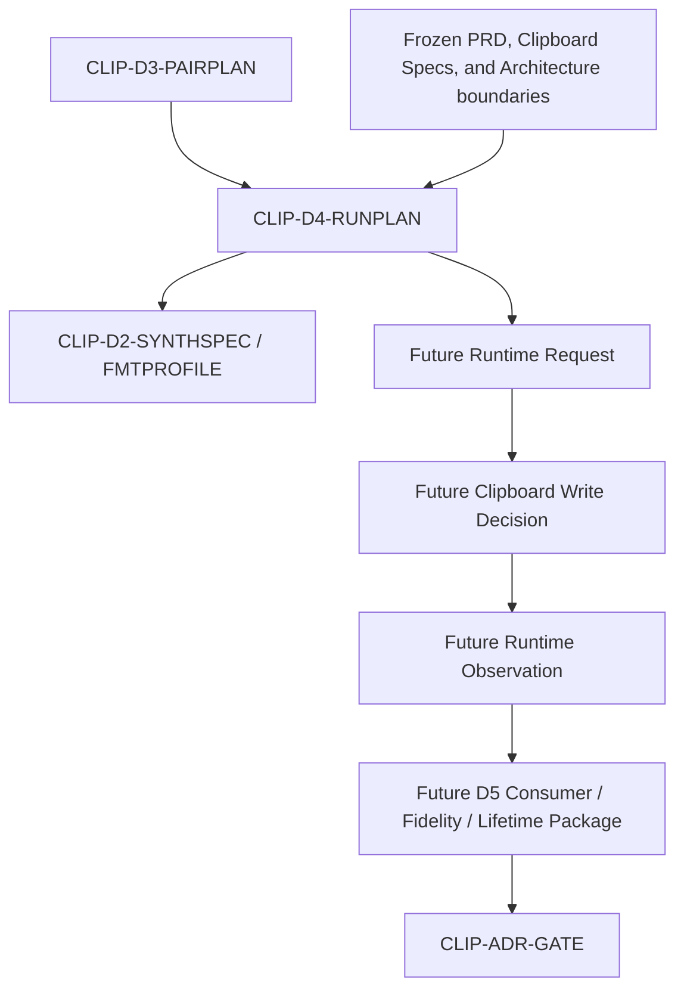

# Clipboard Integration D4 Minimum Clipboard Publication Runtime Documentary Package

## 1. Document Control

| Field | Required value |
|---|---|
| Document ID | `RESEARCH-TECH-CLIPBOARD-023` |
| Title | Clipboard Integration D4 Minimum Clipboard Publication Runtime Documentary Package |
| Status | Draft |
| Research Type | Minimum Clipboard Publication Runtime Documentary Package |
| Technology Decision | TD-004 Clipboard Integration |
| Package | `CLIP-EVIDPKG-005` |
| Acquisition Stage | D4 — Minimum Clipboard Publication Runtime Evidence |
| Parent D3 Package | `RESEARCH-TECH-CLIPBOARD-022` |
| Parent D2 Package | `RESEARCH-TECH-CLIPBOARD-021` |
| Parent Package Specification | `RESEARCH-TECH-CLIPBOARD-018` |
| Covered Pair Plans | `CLIP-D3-PAIRPLAN-001..010` |
| Covered Publication Profiles | `CLIP-D2-FMTPROFILE-001..003` |
| Synthetic Specification | `CLIP-D2-SYNTHSPEC-001` |
| Runtime Application Created | No |
| Runtime Application Launched | No |
| Synthetic Image Created | No |
| Publication Payload Created | No |
| Clipboard Write | Not performed |
| Clipboard Read／Clear | Not performed |
| Clipboard History／Cloud | Not accessed |
| Runtime Observation | Not created |
| Persistent Evidence | Not created |
| Authorization Request | Not created |
| Human Authorization Decision | Not made |
| Candidate Ranking／Selection | Not performed |
| Technology Recommendation／Decision | Not made |
| Clipboard ADR | Not created |
| Owner | TBD |
| Last reviewed | Not reviewed |

## 2. Purpose and Fixed Boundary

This document defines the minimum future runtime-publication boundaries, synthetic input rules, Clipboard Write scope, threading conditions, format profiles, result categories, stop conditions, and observation contracts for each Candidate–Host Pair before any runtime authorization document could be prepared.

This is a runtime documentary package only. It is not Runtime execution, Clipboard publication, Clipboard Read or Clear, application launch, source code, synthetic image generation, a payload, an Authorization Request, a Human Decision, runtime evidence, Candidate comparison, or selection.

Only a bounded future Write may be conditionally included. Clipboard Read, Clipboard Clear, History, Cloud, Consumer launch, Capture, Rendering, File Output, and Shared Workflow State access remain excluded.

## 3. Source Preservation

- `RESEARCH-TECH-CLIPBOARD-016..022`
- `CLIP-D3-PAIRPLAN-001..010`
- `CLIP-D3-OPDOC-001..009`
- `CLIP-D2-SCOPE-001..010`
- `CLIP-D2-SYNTHSPEC-001`
- `CLIP-D2-FMTPROFILE-001..003`
- `CLIP-D2-CONSPEC-001..003`
- `CLIP-OPT-001..005`
- `CLIP-PAIR-001..010`
- `CLIP-DEC-CRIT-001..012`
- `CLIP-DEC-GAP-001..020`
- `CLIP-ADR-GATE-001..010`
- `CLIP-EVIDPKG-005`

Upstream status, Gaps, Gates, Candidates, Pairs, and profiles remain unchanged. Runtime Plans describe only future isolated synthetic publication.

## 4. Controlled Vocabulary

### 4.1 D4 Documentary Status

- Fully specified
- Specified with pending D1／D3 evidence
- Partially specified
- Blocked by documentary ambiguity
- Deferred
- Not applicable

### 4.2 Future Runtime-request Eligibility

- Eligible for future runtime-request preparation
- Conditionally eligible
- Not eligible
- Deferred

### 4.3 Runtime Evidence State

- Static specification only
- Pending D1 observation
- Pending Build evidence
- Pending Runtime evidence
- Pending Consumer evidence
- Deferred
- Not applicable

| Boundary | Value |
|---|---|
| Current authorization | Not granted |
| Execution permitted | No |
| Runtime state | Not executed |

Do not use Passed, Verified, Supported, Recommended, Selected, or Production ready.

## 5. D4 Runtime-plan Binding

| D4 Runtime Plan | D3 Pair Plan | Candidate–Host Pair |
|---|---|---|
| `CLIP-D4-RUNPLAN-001` | `CLIP-D3-PAIRPLAN-001` | `CLIP-PAIR-001` |
| `CLIP-D4-RUNPLAN-002` | `CLIP-D3-PAIRPLAN-002` | `CLIP-PAIR-002` |
| `CLIP-D4-RUNPLAN-003` | `CLIP-D3-PAIRPLAN-003` | `CLIP-PAIR-003` |
| `CLIP-D4-RUNPLAN-004` | `CLIP-D3-PAIRPLAN-004` | `CLIP-PAIR-004` |
| `CLIP-D4-RUNPLAN-005` | `CLIP-D3-PAIRPLAN-005` | `CLIP-PAIR-005` |
| `CLIP-D4-RUNPLAN-006` | `CLIP-D3-PAIRPLAN-006` | `CLIP-PAIR-006` |
| `CLIP-D4-RUNPLAN-007` | `CLIP-D3-PAIRPLAN-007` | `CLIP-PAIR-007` |
| `CLIP-D4-RUNPLAN-008` | `CLIP-D3-PAIRPLAN-008` | `CLIP-PAIR-008` |
| `CLIP-D4-RUNPLAN-009` | `CLIP-D3-PAIRPLAN-009` | `CLIP-PAIR-009` |
| `CLIP-D4-RUNPLAN-010` | `CLIP-D3-PAIRPLAN-010` | `CLIP-PAIR-010` |

One Runtime Plan exists per Candidate–Host Pair. WPF and WinUI 3 remain separate, Candidate backends are not merged, and no `CLIP-D4-RUNPLAN-011` is created. Runtime Plans describe only future isolated synthetic publication.

### `CLIP-D4-RUNPLAN-001`

| Field | Value |
|---|---|
| D4 Runtime Plan ID | `CLIP-D4-RUNPLAN-001` |
| Source D3 Pair Plan | `CLIP-D3-PAIRPLAN-001` |
| Candidate–Host Pair | `CLIP-PAIR-001` |
| Candidate ID | `CLIP-OPT-001` |
| Candidate identity | WPF Clipboard |
| Host identity | WPF |
| Backend identity | WPF Clipboard |
| Adapter mode | Candidate-neutral Adapter Boundary; candidate-specific details remain future scope. |
| Related D1 Items | `CLIP-D1-DOCITEM-001,002` |
| Related D2 Scope Item | `CLIP-D2-SCOPE-001` |
| Related Decision Gaps | `CLIP-DEC-GAP-001..002` |
| Related Decision Criteria | `CLIP-DEC-CRIT-001` |
| Related ADR Gates | `CLIP-ADR-GATE-001` |
| D1 dependency state | Not observed |
| D3 Project state | Not created |
| D3 Restore state | Not restored |
| D3 Build state | Not built |
| Minimum runtime question | What minimum isolated synthetic publication and session-observation boundary is needed for this Pair without Read, Clear, History, Cloud, Capture, Rendering, or workflow access? |
| Why runtime evidence is required | Static D0-D3 documents cannot establish host activation, threading, publication, resource lifetime, contention, result category, or cleanup behavior. |
| Runtime host role | WPF runtime host shell; no application launch now. |
| Publication coordinator role | Request one future bounded Write operation only; no current publication. |
| Backend role | WPF Clipboard boundary; no Candidate implementation. |
| Synthetic provider role | Reference `CLIP-D2-SYNTHSPEC-001`; no image or payload created. |
| Observation boundary | Future session-only sanitized categories, flags, profile identity, stop trigger, release status, and cleanup status. |
| Consumer boundary | Future consumer contract only; no Consumer launch or interoperability claim. |
| Runtime-family placeholder | `<resolved-runtime-family>` |
| Target-framework placeholder | `<resolved-target-framework>` |
| Windows-target placeholder | `<resolved-windows-target>` |
| Architecture placeholder | `<resolved-architecture>` |
| Packaging-mode placeholder | `<resolved-packaging-mode>` |
| Process model | Future isolated process model; no application or process is launched. |
| Threading requirement question | What host/backend thread facts must be established before one bounded Write? |
| Dispatcher requirement question | What WPF Dispatcher or WinUI activation boundary must be established? |
| COM／apartment requirement question | What COM/apartment fact is required for this Pair, if any? |
| Ownership model question | Which future operation owns the publication resource and release responsibility? |
| Producer lifetime question | What happens when the producer terminates normally or abnormally? |
| Resource lifetime question | How are streams, native handles, and COM objects released? |
| Clipboard contention question | How is temporary unavailability classified without choosing retry policy? |
| Synthetic specification | `CLIP-D2-SYNTHSPEC-001` |
| Applicable publication profiles | `CLIP-D2-FMTPROFILE-001..003` |
| Required publication sequence | Validate configuration; confirm synthetic identity; confirm profile; prepare representation; one bounded Write; structured result; release; cleanup; session observation. |
| Partial-publication behavior | Classify partial or uncertain multi-format publication separately; never treat it as complete success. |
| Publication result contract | Use bounded categories: completed, partial, unavailable, invalid, requirement unmet, failed, release failed, cleanup incomplete, stopped by policy. |
| Clipboard Write scope | Future separately authorized minimum publication only |
| Clipboard Read scope | Not included |
| Clipboard Clear scope | Not included |
| History scope | Not included |
| Cloud scope | Not included |
| File Output scope | Not included |
| Capture scope | Not included |
| Rendering scope | Not included |
| Shared Workflow State scope | No access |
| Network boundary | No network now; future network requirement is separate authority. |
| Repository mutation boundary | No repository mutation. |
| Product-output boundary | No product output. |
| Private-data boundary | No private Clipboard content, image bytes, credentials, tokens, SIDs, account identity, machine name, or full private paths. |
| Logging boundary | Sanitized session fields only; no ordinary logs or raw diagnostics. |
| Session observation contract | Session-only: Plan/Pair/profile/run identity, resolved categories, threading/Dispatcher/COM categories, result category, partial indicator, flags, stop trigger, release and cleanup status. |
| Persistent Evidence separation | Required; Runtime authorization does not imply Evidence Persistence. |
| Cleanup boundary | Future bounded cleanup only; no current mutation or deletion. |
| Entry conditions | D3 Pair Plan, Build boundary, synthetic specification, profiles, D1 dependency, and isolation rules are documented. |
| Exit conditions | Runtime Plan, capability boundary, profile mapping, sequence, result, contention, lifetime, observation, privacy, isolation, and cleanup contracts are documented. |
| Stop conditions | D1/D3 dependency unresolved, target unresolved, unsupported profile, threading/Dispatcher/COM ambiguity, contention, private data, Read/Clear/History/Cloud, network/elevation, launch, mutation, or cleanup ambiguity. |
| Failure categories | Configuration invalid; Clipboard unavailable; requirement unmet; format preparation failed; publication failed; release failed; cleanup incomplete; stopped by policy. |
| Prohibited inference | Do not infer successful publication, Consumer interoperability, pixel/alpha fidelity, termination durability, Candidate superiority, product readiness, or technology selection. |
| Current authorization | Not granted |
| Execution permitted | No |
| Runtime state | Not executed |
| Owner | TBD |
| Documentary status | Specified with pending D1／D3 evidence |
| Future runtime-request eligibility | Conditionally eligible |
| Open questions | Which future D1/D3 facts and runtime authorization can resolve local target, threading, ownership, profile, result, and cleanup questions for this Pair? |

### `CLIP-D4-RUNPLAN-002`

| Field | Value |
|---|---|
| D4 Runtime Plan ID | `CLIP-D4-RUNPLAN-002` |
| Source D3 Pair Plan | `CLIP-D3-PAIRPLAN-002` |
| Candidate–Host Pair | `CLIP-PAIR-002` |
| Candidate ID | `CLIP-OPT-001` |
| Candidate identity | WPF Clipboard |
| Host identity | WinUI 3 |
| Backend identity | WPF Clipboard |
| Adapter mode | Candidate-neutral Adapter Boundary; candidate-specific details remain future scope. |
| Related D1 Items | `CLIP-D1-DOCITEM-003,004` |
| Related D2 Scope Item | `CLIP-D2-SCOPE-002` |
| Related Decision Gaps | `CLIP-DEC-GAP-003..004` |
| Related Decision Criteria | `CLIP-DEC-CRIT-002` |
| Related ADR Gates | `CLIP-ADR-GATE-002` |
| D1 dependency state | Not observed |
| D3 Project state | Not created |
| D3 Restore state | Not restored |
| D3 Build state | Not built |
| Minimum runtime question | What minimum isolated synthetic publication and session-observation boundary is needed for this Pair without Read, Clear, History, Cloud, Capture, Rendering, or workflow access? |
| Why runtime evidence is required | Static D0-D3 documents cannot establish host activation, threading, publication, resource lifetime, contention, result category, or cleanup behavior. |
| Runtime host role | WinUI 3 runtime host shell; no application launch now. |
| Publication coordinator role | Request one future bounded Write operation only; no current publication. |
| Backend role | WPF Clipboard boundary; no Candidate implementation. |
| Synthetic provider role | Reference `CLIP-D2-SYNTHSPEC-001`; no image or payload created. |
| Observation boundary | Future session-only sanitized categories, flags, profile identity, stop trigger, release status, and cleanup status. |
| Consumer boundary | Future consumer contract only; no Consumer launch or interoperability claim. |
| Runtime-family placeholder | `<resolved-runtime-family>` |
| Target-framework placeholder | `<resolved-target-framework>` |
| Windows-target placeholder | `<resolved-windows-target>` |
| Architecture placeholder | `<resolved-architecture>` |
| Packaging-mode placeholder | `<resolved-packaging-mode>` |
| Process model | Future isolated process model; no application or process is launched. |
| Threading requirement question | What host/backend thread facts must be established before one bounded Write? |
| Dispatcher requirement question | What WPF Dispatcher or WinUI activation boundary must be established? |
| COM／apartment requirement question | What COM/apartment fact is required for this Pair, if any? |
| Ownership model question | Which future operation owns the publication resource and release responsibility? |
| Producer lifetime question | What happens when the producer terminates normally or abnormally? |
| Resource lifetime question | How are streams, native handles, and COM objects released? |
| Clipboard contention question | How is temporary unavailability classified without choosing retry policy? |
| Synthetic specification | `CLIP-D2-SYNTHSPEC-001` |
| Applicable publication profiles | `CLIP-D2-FMTPROFILE-001..003` |
| Required publication sequence | Validate configuration; confirm synthetic identity; confirm profile; prepare representation; one bounded Write; structured result; release; cleanup; session observation. |
| Partial-publication behavior | Classify partial or uncertain multi-format publication separately; never treat it as complete success. |
| Publication result contract | Use bounded categories: completed, partial, unavailable, invalid, requirement unmet, failed, release failed, cleanup incomplete, stopped by policy. |
| Clipboard Write scope | Future separately authorized minimum publication only |
| Clipboard Read scope | Not included |
| Clipboard Clear scope | Not included |
| History scope | Not included |
| Cloud scope | Not included |
| File Output scope | Not included |
| Capture scope | Not included |
| Rendering scope | Not included |
| Shared Workflow State scope | No access |
| Network boundary | No network now; future network requirement is separate authority. |
| Repository mutation boundary | No repository mutation. |
| Product-output boundary | No product output. |
| Private-data boundary | No private Clipboard content, image bytes, credentials, tokens, SIDs, account identity, machine name, or full private paths. |
| Logging boundary | Sanitized session fields only; no ordinary logs or raw diagnostics. |
| Session observation contract | Session-only: Plan/Pair/profile/run identity, resolved categories, threading/Dispatcher/COM categories, result category, partial indicator, flags, stop trigger, release and cleanup status. |
| Persistent Evidence separation | Required; Runtime authorization does not imply Evidence Persistence. |
| Cleanup boundary | Future bounded cleanup only; no current mutation or deletion. |
| Entry conditions | D3 Pair Plan, Build boundary, synthetic specification, profiles, D1 dependency, and isolation rules are documented. |
| Exit conditions | Runtime Plan, capability boundary, profile mapping, sequence, result, contention, lifetime, observation, privacy, isolation, and cleanup contracts are documented. |
| Stop conditions | D1/D3 dependency unresolved, target unresolved, unsupported profile, threading/Dispatcher/COM ambiguity, contention, private data, Read/Clear/History/Cloud, network/elevation, launch, mutation, or cleanup ambiguity. |
| Failure categories | Configuration invalid; Clipboard unavailable; requirement unmet; format preparation failed; publication failed; release failed; cleanup incomplete; stopped by policy. |
| Prohibited inference | Do not infer successful publication, Consumer interoperability, pixel/alpha fidelity, termination durability, Candidate superiority, product readiness, or technology selection. |
| Current authorization | Not granted |
| Execution permitted | No |
| Runtime state | Not executed |
| Owner | TBD |
| Documentary status | Specified with pending D1／D3 evidence |
| Future runtime-request eligibility | Conditionally eligible |
| Open questions | Which future D1/D3 facts and runtime authorization can resolve local target, threading, ownership, profile, result, and cleanup questions for this Pair? |

### `CLIP-D4-RUNPLAN-003`

| Field | Value |
|---|---|
| D4 Runtime Plan ID | `CLIP-D4-RUNPLAN-003` |
| Source D3 Pair Plan | `CLIP-D3-PAIRPLAN-003` |
| Candidate–Host Pair | `CLIP-PAIR-003` |
| Candidate ID | `CLIP-OPT-002` |
| Candidate identity | WinRT Clipboard |
| Host identity | WPF |
| Backend identity | WinRT Clipboard |
| Adapter mode | Candidate-neutral Adapter Boundary; candidate-specific details remain future scope. |
| Related D1 Items | `CLIP-D1-DOCITEM-005,006` |
| Related D2 Scope Item | `CLIP-D2-SCOPE-003` |
| Related Decision Gaps | `CLIP-DEC-GAP-005..006` |
| Related Decision Criteria | `CLIP-DEC-CRIT-003` |
| Related ADR Gates | `CLIP-ADR-GATE-003` |
| D1 dependency state | Not observed |
| D3 Project state | Not created |
| D3 Restore state | Not restored |
| D3 Build state | Not built |
| Minimum runtime question | What minimum isolated synthetic publication and session-observation boundary is needed for this Pair without Read, Clear, History, Cloud, Capture, Rendering, or workflow access? |
| Why runtime evidence is required | Static D0-D3 documents cannot establish host activation, threading, publication, resource lifetime, contention, result category, or cleanup behavior. |
| Runtime host role | WPF runtime host shell; no application launch now. |
| Publication coordinator role | Request one future bounded Write operation only; no current publication. |
| Backend role | WinRT Clipboard boundary; no Candidate implementation. |
| Synthetic provider role | Reference `CLIP-D2-SYNTHSPEC-001`; no image or payload created. |
| Observation boundary | Future session-only sanitized categories, flags, profile identity, stop trigger, release status, and cleanup status. |
| Consumer boundary | Future consumer contract only; no Consumer launch or interoperability claim. |
| Runtime-family placeholder | `<resolved-runtime-family>` |
| Target-framework placeholder | `<resolved-target-framework>` |
| Windows-target placeholder | `<resolved-windows-target>` |
| Architecture placeholder | `<resolved-architecture>` |
| Packaging-mode placeholder | `<resolved-packaging-mode>` |
| Process model | Future isolated process model; no application or process is launched. |
| Threading requirement question | What host/backend thread facts must be established before one bounded Write? |
| Dispatcher requirement question | What WPF Dispatcher or WinUI activation boundary must be established? |
| COM／apartment requirement question | What COM/apartment fact is required for this Pair, if any? |
| Ownership model question | Which future operation owns the publication resource and release responsibility? |
| Producer lifetime question | What happens when the producer terminates normally or abnormally? |
| Resource lifetime question | How are streams, native handles, and COM objects released? |
| Clipboard contention question | How is temporary unavailability classified without choosing retry policy? |
| Synthetic specification | `CLIP-D2-SYNTHSPEC-001` |
| Applicable publication profiles | `CLIP-D2-FMTPROFILE-001..003` |
| Required publication sequence | Validate configuration; confirm synthetic identity; confirm profile; prepare representation; one bounded Write; structured result; release; cleanup; session observation. |
| Partial-publication behavior | Classify partial or uncertain multi-format publication separately; never treat it as complete success. |
| Publication result contract | Use bounded categories: completed, partial, unavailable, invalid, requirement unmet, failed, release failed, cleanup incomplete, stopped by policy. |
| Clipboard Write scope | Future separately authorized minimum publication only |
| Clipboard Read scope | Not included |
| Clipboard Clear scope | Not included |
| History scope | Not included |
| Cloud scope | Not included |
| File Output scope | Not included |
| Capture scope | Not included |
| Rendering scope | Not included |
| Shared Workflow State scope | No access |
| Network boundary | No network now; future network requirement is separate authority. |
| Repository mutation boundary | No repository mutation. |
| Product-output boundary | No product output. |
| Private-data boundary | No private Clipboard content, image bytes, credentials, tokens, SIDs, account identity, machine name, or full private paths. |
| Logging boundary | Sanitized session fields only; no ordinary logs or raw diagnostics. |
| Session observation contract | Session-only: Plan/Pair/profile/run identity, resolved categories, threading/Dispatcher/COM categories, result category, partial indicator, flags, stop trigger, release and cleanup status. |
| Persistent Evidence separation | Required; Runtime authorization does not imply Evidence Persistence. |
| Cleanup boundary | Future bounded cleanup only; no current mutation or deletion. |
| Entry conditions | D3 Pair Plan, Build boundary, synthetic specification, profiles, D1 dependency, and isolation rules are documented. |
| Exit conditions | Runtime Plan, capability boundary, profile mapping, sequence, result, contention, lifetime, observation, privacy, isolation, and cleanup contracts are documented. |
| Stop conditions | D1/D3 dependency unresolved, target unresolved, unsupported profile, threading/Dispatcher/COM ambiguity, contention, private data, Read/Clear/History/Cloud, network/elevation, launch, mutation, or cleanup ambiguity. |
| Failure categories | Configuration invalid; Clipboard unavailable; requirement unmet; format preparation failed; publication failed; release failed; cleanup incomplete; stopped by policy. |
| Prohibited inference | Do not infer successful publication, Consumer interoperability, pixel/alpha fidelity, termination durability, Candidate superiority, product readiness, or technology selection. |
| Current authorization | Not granted |
| Execution permitted | No |
| Runtime state | Not executed |
| Owner | TBD |
| Documentary status | Specified with pending D1／D3 evidence |
| Future runtime-request eligibility | Conditionally eligible |
| Open questions | Which future D1/D3 facts and runtime authorization can resolve local target, threading, ownership, profile, result, and cleanup questions for this Pair? |

### `CLIP-D4-RUNPLAN-004`

| Field | Value |
|---|---|
| D4 Runtime Plan ID | `CLIP-D4-RUNPLAN-004` |
| Source D3 Pair Plan | `CLIP-D3-PAIRPLAN-004` |
| Candidate–Host Pair | `CLIP-PAIR-004` |
| Candidate ID | `CLIP-OPT-002` |
| Candidate identity | WinRT Clipboard |
| Host identity | WinUI 3 |
| Backend identity | WinRT Clipboard |
| Adapter mode | Candidate-neutral Adapter Boundary; candidate-specific details remain future scope. |
| Related D1 Items | `CLIP-D1-DOCITEM-007,008` |
| Related D2 Scope Item | `CLIP-D2-SCOPE-004` |
| Related Decision Gaps | `CLIP-DEC-GAP-007..008` |
| Related Decision Criteria | `CLIP-DEC-CRIT-004` |
| Related ADR Gates | `CLIP-ADR-GATE-004` |
| D1 dependency state | Not observed |
| D3 Project state | Not created |
| D3 Restore state | Not restored |
| D3 Build state | Not built |
| Minimum runtime question | What minimum isolated synthetic publication and session-observation boundary is needed for this Pair without Read, Clear, History, Cloud, Capture, Rendering, or workflow access? |
| Why runtime evidence is required | Static D0-D3 documents cannot establish host activation, threading, publication, resource lifetime, contention, result category, or cleanup behavior. |
| Runtime host role | WinUI 3 runtime host shell; no application launch now. |
| Publication coordinator role | Request one future bounded Write operation only; no current publication. |
| Backend role | WinRT Clipboard boundary; no Candidate implementation. |
| Synthetic provider role | Reference `CLIP-D2-SYNTHSPEC-001`; no image or payload created. |
| Observation boundary | Future session-only sanitized categories, flags, profile identity, stop trigger, release status, and cleanup status. |
| Consumer boundary | Future consumer contract only; no Consumer launch or interoperability claim. |
| Runtime-family placeholder | `<resolved-runtime-family>` |
| Target-framework placeholder | `<resolved-target-framework>` |
| Windows-target placeholder | `<resolved-windows-target>` |
| Architecture placeholder | `<resolved-architecture>` |
| Packaging-mode placeholder | `<resolved-packaging-mode>` |
| Process model | Future isolated process model; no application or process is launched. |
| Threading requirement question | What host/backend thread facts must be established before one bounded Write? |
| Dispatcher requirement question | What WPF Dispatcher or WinUI activation boundary must be established? |
| COM／apartment requirement question | What COM/apartment fact is required for this Pair, if any? |
| Ownership model question | Which future operation owns the publication resource and release responsibility? |
| Producer lifetime question | What happens when the producer terminates normally or abnormally? |
| Resource lifetime question | How are streams, native handles, and COM objects released? |
| Clipboard contention question | How is temporary unavailability classified without choosing retry policy? |
| Synthetic specification | `CLIP-D2-SYNTHSPEC-001` |
| Applicable publication profiles | `CLIP-D2-FMTPROFILE-001..003` |
| Required publication sequence | Validate configuration; confirm synthetic identity; confirm profile; prepare representation; one bounded Write; structured result; release; cleanup; session observation. |
| Partial-publication behavior | Classify partial or uncertain multi-format publication separately; never treat it as complete success. |
| Publication result contract | Use bounded categories: completed, partial, unavailable, invalid, requirement unmet, failed, release failed, cleanup incomplete, stopped by policy. |
| Clipboard Write scope | Future separately authorized minimum publication only |
| Clipboard Read scope | Not included |
| Clipboard Clear scope | Not included |
| History scope | Not included |
| Cloud scope | Not included |
| File Output scope | Not included |
| Capture scope | Not included |
| Rendering scope | Not included |
| Shared Workflow State scope | No access |
| Network boundary | No network now; future network requirement is separate authority. |
| Repository mutation boundary | No repository mutation. |
| Product-output boundary | No product output. |
| Private-data boundary | No private Clipboard content, image bytes, credentials, tokens, SIDs, account identity, machine name, or full private paths. |
| Logging boundary | Sanitized session fields only; no ordinary logs or raw diagnostics. |
| Session observation contract | Session-only: Plan/Pair/profile/run identity, resolved categories, threading/Dispatcher/COM categories, result category, partial indicator, flags, stop trigger, release and cleanup status. |
| Persistent Evidence separation | Required; Runtime authorization does not imply Evidence Persistence. |
| Cleanup boundary | Future bounded cleanup only; no current mutation or deletion. |
| Entry conditions | D3 Pair Plan, Build boundary, synthetic specification, profiles, D1 dependency, and isolation rules are documented. |
| Exit conditions | Runtime Plan, capability boundary, profile mapping, sequence, result, contention, lifetime, observation, privacy, isolation, and cleanup contracts are documented. |
| Stop conditions | D1/D3 dependency unresolved, target unresolved, unsupported profile, threading/Dispatcher/COM ambiguity, contention, private data, Read/Clear/History/Cloud, network/elevation, launch, mutation, or cleanup ambiguity. |
| Failure categories | Configuration invalid; Clipboard unavailable; requirement unmet; format preparation failed; publication failed; release failed; cleanup incomplete; stopped by policy. |
| Prohibited inference | Do not infer successful publication, Consumer interoperability, pixel/alpha fidelity, termination durability, Candidate superiority, product readiness, or technology selection. |
| Current authorization | Not granted |
| Execution permitted | No |
| Runtime state | Not executed |
| Owner | TBD |
| Documentary status | Specified with pending D1／D3 evidence |
| Future runtime-request eligibility | Conditionally eligible |
| Open questions | Which future D1/D3 facts and runtime authorization can resolve local target, threading, ownership, profile, result, and cleanup questions for this Pair? |

### `CLIP-D4-RUNPLAN-005`

| Field | Value |
|---|---|
| D4 Runtime Plan ID | `CLIP-D4-RUNPLAN-005` |
| Source D3 Pair Plan | `CLIP-D3-PAIRPLAN-005` |
| Candidate–Host Pair | `CLIP-PAIR-005` |
| Candidate ID | `CLIP-OPT-003` |
| Candidate identity | OLE/COM IDataObject |
| Host identity | WPF |
| Backend identity | OLE/COM IDataObject |
| Adapter mode | Candidate-neutral Adapter Boundary; candidate-specific details remain future scope. |
| Related D1 Items | `CLIP-D1-DOCITEM-009,010` |
| Related D2 Scope Item | `CLIP-D2-SCOPE-005` |
| Related Decision Gaps | `CLIP-DEC-GAP-009..010` |
| Related Decision Criteria | `CLIP-DEC-CRIT-005` |
| Related ADR Gates | `CLIP-ADR-GATE-005` |
| D1 dependency state | Not observed |
| D3 Project state | Not created |
| D3 Restore state | Not restored |
| D3 Build state | Not built |
| Minimum runtime question | What minimum isolated synthetic publication and session-observation boundary is needed for this Pair without Read, Clear, History, Cloud, Capture, Rendering, or workflow access? |
| Why runtime evidence is required | Static D0-D3 documents cannot establish host activation, threading, publication, resource lifetime, contention, result category, or cleanup behavior. |
| Runtime host role | WPF runtime host shell; no application launch now. |
| Publication coordinator role | Request one future bounded Write operation only; no current publication. |
| Backend role | OLE/COM IDataObject boundary; no Candidate implementation. |
| Synthetic provider role | Reference `CLIP-D2-SYNTHSPEC-001`; no image or payload created. |
| Observation boundary | Future session-only sanitized categories, flags, profile identity, stop trigger, release status, and cleanup status. |
| Consumer boundary | Future consumer contract only; no Consumer launch or interoperability claim. |
| Runtime-family placeholder | `<resolved-runtime-family>` |
| Target-framework placeholder | `<resolved-target-framework>` |
| Windows-target placeholder | `<resolved-windows-target>` |
| Architecture placeholder | `<resolved-architecture>` |
| Packaging-mode placeholder | `<resolved-packaging-mode>` |
| Process model | Future isolated process model; no application or process is launched. |
| Threading requirement question | What host/backend thread facts must be established before one bounded Write? |
| Dispatcher requirement question | What WPF Dispatcher or WinUI activation boundary must be established? |
| COM／apartment requirement question | What COM/apartment fact is required for this Pair, if any? |
| Ownership model question | Which future operation owns the publication resource and release responsibility? |
| Producer lifetime question | What happens when the producer terminates normally or abnormally? |
| Resource lifetime question | How are streams, native handles, and COM objects released? |
| Clipboard contention question | How is temporary unavailability classified without choosing retry policy? |
| Synthetic specification | `CLIP-D2-SYNTHSPEC-001` |
| Applicable publication profiles | `CLIP-D2-FMTPROFILE-001..003` |
| Required publication sequence | Validate configuration; confirm synthetic identity; confirm profile; prepare representation; one bounded Write; structured result; release; cleanup; session observation. |
| Partial-publication behavior | Classify partial or uncertain multi-format publication separately; never treat it as complete success. |
| Publication result contract | Use bounded categories: completed, partial, unavailable, invalid, requirement unmet, failed, release failed, cleanup incomplete, stopped by policy. |
| Clipboard Write scope | Future separately authorized minimum publication only |
| Clipboard Read scope | Not included |
| Clipboard Clear scope | Not included |
| History scope | Not included |
| Cloud scope | Not included |
| File Output scope | Not included |
| Capture scope | Not included |
| Rendering scope | Not included |
| Shared Workflow State scope | No access |
| Network boundary | No network now; future network requirement is separate authority. |
| Repository mutation boundary | No repository mutation. |
| Product-output boundary | No product output. |
| Private-data boundary | No private Clipboard content, image bytes, credentials, tokens, SIDs, account identity, machine name, or full private paths. |
| Logging boundary | Sanitized session fields only; no ordinary logs or raw diagnostics. |
| Session observation contract | Session-only: Plan/Pair/profile/run identity, resolved categories, threading/Dispatcher/COM categories, result category, partial indicator, flags, stop trigger, release and cleanup status. |
| Persistent Evidence separation | Required; Runtime authorization does not imply Evidence Persistence. |
| Cleanup boundary | Future bounded cleanup only; no current mutation or deletion. |
| Entry conditions | D3 Pair Plan, Build boundary, synthetic specification, profiles, D1 dependency, and isolation rules are documented. |
| Exit conditions | Runtime Plan, capability boundary, profile mapping, sequence, result, contention, lifetime, observation, privacy, isolation, and cleanup contracts are documented. |
| Stop conditions | D1/D3 dependency unresolved, target unresolved, unsupported profile, threading/Dispatcher/COM ambiguity, contention, private data, Read/Clear/History/Cloud, network/elevation, launch, mutation, or cleanup ambiguity. |
| Failure categories | Configuration invalid; Clipboard unavailable; requirement unmet; format preparation failed; publication failed; release failed; cleanup incomplete; stopped by policy. |
| Prohibited inference | Do not infer successful publication, Consumer interoperability, pixel/alpha fidelity, termination durability, Candidate superiority, product readiness, or technology selection. |
| Current authorization | Not granted |
| Execution permitted | No |
| Runtime state | Not executed |
| Owner | TBD |
| Documentary status | Specified with pending D1／D3 evidence |
| Future runtime-request eligibility | Conditionally eligible |
| Open questions | Which future D1/D3 facts and runtime authorization can resolve local target, threading, ownership, profile, result, and cleanup questions for this Pair? |

### `CLIP-D4-RUNPLAN-006`

| Field | Value |
|---|---|
| D4 Runtime Plan ID | `CLIP-D4-RUNPLAN-006` |
| Source D3 Pair Plan | `CLIP-D3-PAIRPLAN-006` |
| Candidate–Host Pair | `CLIP-PAIR-006` |
| Candidate ID | `CLIP-OPT-003` |
| Candidate identity | OLE/COM IDataObject |
| Host identity | WinUI 3 |
| Backend identity | OLE/COM IDataObject |
| Adapter mode | Candidate-neutral Adapter Boundary; candidate-specific details remain future scope. |
| Related D1 Items | `CLIP-D1-DOCITEM-011,012` |
| Related D2 Scope Item | `CLIP-D2-SCOPE-006` |
| Related Decision Gaps | `CLIP-DEC-GAP-011..012` |
| Related Decision Criteria | `CLIP-DEC-CRIT-006` |
| Related ADR Gates | `CLIP-ADR-GATE-006` |
| D1 dependency state | Not observed |
| D3 Project state | Not created |
| D3 Restore state | Not restored |
| D3 Build state | Not built |
| Minimum runtime question | What minimum isolated synthetic publication and session-observation boundary is needed for this Pair without Read, Clear, History, Cloud, Capture, Rendering, or workflow access? |
| Why runtime evidence is required | Static D0-D3 documents cannot establish host activation, threading, publication, resource lifetime, contention, result category, or cleanup behavior. |
| Runtime host role | WinUI 3 runtime host shell; no application launch now. |
| Publication coordinator role | Request one future bounded Write operation only; no current publication. |
| Backend role | OLE/COM IDataObject boundary; no Candidate implementation. |
| Synthetic provider role | Reference `CLIP-D2-SYNTHSPEC-001`; no image or payload created. |
| Observation boundary | Future session-only sanitized categories, flags, profile identity, stop trigger, release status, and cleanup status. |
| Consumer boundary | Future consumer contract only; no Consumer launch or interoperability claim. |
| Runtime-family placeholder | `<resolved-runtime-family>` |
| Target-framework placeholder | `<resolved-target-framework>` |
| Windows-target placeholder | `<resolved-windows-target>` |
| Architecture placeholder | `<resolved-architecture>` |
| Packaging-mode placeholder | `<resolved-packaging-mode>` |
| Process model | Future isolated process model; no application or process is launched. |
| Threading requirement question | What host/backend thread facts must be established before one bounded Write? |
| Dispatcher requirement question | What WPF Dispatcher or WinUI activation boundary must be established? |
| COM／apartment requirement question | What COM/apartment fact is required for this Pair, if any? |
| Ownership model question | Which future operation owns the publication resource and release responsibility? |
| Producer lifetime question | What happens when the producer terminates normally or abnormally? |
| Resource lifetime question | How are streams, native handles, and COM objects released? |
| Clipboard contention question | How is temporary unavailability classified without choosing retry policy? |
| Synthetic specification | `CLIP-D2-SYNTHSPEC-001` |
| Applicable publication profiles | `CLIP-D2-FMTPROFILE-001..003` |
| Required publication sequence | Validate configuration; confirm synthetic identity; confirm profile; prepare representation; one bounded Write; structured result; release; cleanup; session observation. |
| Partial-publication behavior | Classify partial or uncertain multi-format publication separately; never treat it as complete success. |
| Publication result contract | Use bounded categories: completed, partial, unavailable, invalid, requirement unmet, failed, release failed, cleanup incomplete, stopped by policy. |
| Clipboard Write scope | Future separately authorized minimum publication only |
| Clipboard Read scope | Not included |
| Clipboard Clear scope | Not included |
| History scope | Not included |
| Cloud scope | Not included |
| File Output scope | Not included |
| Capture scope | Not included |
| Rendering scope | Not included |
| Shared Workflow State scope | No access |
| Network boundary | No network now; future network requirement is separate authority. |
| Repository mutation boundary | No repository mutation. |
| Product-output boundary | No product output. |
| Private-data boundary | No private Clipboard content, image bytes, credentials, tokens, SIDs, account identity, machine name, or full private paths. |
| Logging boundary | Sanitized session fields only; no ordinary logs or raw diagnostics. |
| Session observation contract | Session-only: Plan/Pair/profile/run identity, resolved categories, threading/Dispatcher/COM categories, result category, partial indicator, flags, stop trigger, release and cleanup status. |
| Persistent Evidence separation | Required; Runtime authorization does not imply Evidence Persistence. |
| Cleanup boundary | Future bounded cleanup only; no current mutation or deletion. |
| Entry conditions | D3 Pair Plan, Build boundary, synthetic specification, profiles, D1 dependency, and isolation rules are documented. |
| Exit conditions | Runtime Plan, capability boundary, profile mapping, sequence, result, contention, lifetime, observation, privacy, isolation, and cleanup contracts are documented. |
| Stop conditions | D1/D3 dependency unresolved, target unresolved, unsupported profile, threading/Dispatcher/COM ambiguity, contention, private data, Read/Clear/History/Cloud, network/elevation, launch, mutation, or cleanup ambiguity. |
| Failure categories | Configuration invalid; Clipboard unavailable; requirement unmet; format preparation failed; publication failed; release failed; cleanup incomplete; stopped by policy. |
| Prohibited inference | Do not infer successful publication, Consumer interoperability, pixel/alpha fidelity, termination durability, Candidate superiority, product readiness, or technology selection. |
| Current authorization | Not granted |
| Execution permitted | No |
| Runtime state | Not executed |
| Owner | TBD |
| Documentary status | Specified with pending D1／D3 evidence |
| Future runtime-request eligibility | Conditionally eligible |
| Open questions | Which future D1/D3 facts and runtime authorization can resolve local target, threading, ownership, profile, result, and cleanup questions for this Pair? |

### `CLIP-D4-RUNPLAN-007`

| Field | Value |
|---|---|
| D4 Runtime Plan ID | `CLIP-D4-RUNPLAN-007` |
| Source D3 Pair Plan | `CLIP-D3-PAIRPLAN-007` |
| Candidate–Host Pair | `CLIP-PAIR-007` |
| Candidate ID | `CLIP-OPT-004` |
| Candidate identity | Raw Win32 Clipboard |
| Host identity | WPF |
| Backend identity | Raw Win32 Clipboard |
| Adapter mode | Candidate-neutral Adapter Boundary; candidate-specific details remain future scope. |
| Related D1 Items | `CLIP-D1-DOCITEM-013,014` |
| Related D2 Scope Item | `CLIP-D2-SCOPE-007` |
| Related Decision Gaps | `CLIP-DEC-GAP-013..014` |
| Related Decision Criteria | `CLIP-DEC-CRIT-007` |
| Related ADR Gates | `CLIP-ADR-GATE-007` |
| D1 dependency state | Not observed |
| D3 Project state | Not created |
| D3 Restore state | Not restored |
| D3 Build state | Not built |
| Minimum runtime question | What minimum isolated synthetic publication and session-observation boundary is needed for this Pair without Read, Clear, History, Cloud, Capture, Rendering, or workflow access? |
| Why runtime evidence is required | Static D0-D3 documents cannot establish host activation, threading, publication, resource lifetime, contention, result category, or cleanup behavior. |
| Runtime host role | WPF runtime host shell; no application launch now. |
| Publication coordinator role | Request one future bounded Write operation only; no current publication. |
| Backend role | Raw Win32 Clipboard boundary; no Candidate implementation. |
| Synthetic provider role | Reference `CLIP-D2-SYNTHSPEC-001`; no image or payload created. |
| Observation boundary | Future session-only sanitized categories, flags, profile identity, stop trigger, release status, and cleanup status. |
| Consumer boundary | Future consumer contract only; no Consumer launch or interoperability claim. |
| Runtime-family placeholder | `<resolved-runtime-family>` |
| Target-framework placeholder | `<resolved-target-framework>` |
| Windows-target placeholder | `<resolved-windows-target>` |
| Architecture placeholder | `<resolved-architecture>` |
| Packaging-mode placeholder | `<resolved-packaging-mode>` |
| Process model | Future isolated process model; no application or process is launched. |
| Threading requirement question | What host/backend thread facts must be established before one bounded Write? |
| Dispatcher requirement question | What WPF Dispatcher or WinUI activation boundary must be established? |
| COM／apartment requirement question | What COM/apartment fact is required for this Pair, if any? |
| Ownership model question | Which future operation owns the publication resource and release responsibility? |
| Producer lifetime question | What happens when the producer terminates normally or abnormally? |
| Resource lifetime question | How are streams, native handles, and COM objects released? |
| Clipboard contention question | How is temporary unavailability classified without choosing retry policy? |
| Synthetic specification | `CLIP-D2-SYNTHSPEC-001` |
| Applicable publication profiles | `CLIP-D2-FMTPROFILE-001..003` |
| Required publication sequence | Validate configuration; confirm synthetic identity; confirm profile; prepare representation; one bounded Write; structured result; release; cleanup; session observation. |
| Partial-publication behavior | Classify partial or uncertain multi-format publication separately; never treat it as complete success. |
| Publication result contract | Use bounded categories: completed, partial, unavailable, invalid, requirement unmet, failed, release failed, cleanup incomplete, stopped by policy. |
| Clipboard Write scope | Future separately authorized minimum publication only |
| Clipboard Read scope | Not included |
| Clipboard Clear scope | Not included |
| History scope | Not included |
| Cloud scope | Not included |
| File Output scope | Not included |
| Capture scope | Not included |
| Rendering scope | Not included |
| Shared Workflow State scope | No access |
| Network boundary | No network now; future network requirement is separate authority. |
| Repository mutation boundary | No repository mutation. |
| Product-output boundary | No product output. |
| Private-data boundary | No private Clipboard content, image bytes, credentials, tokens, SIDs, account identity, machine name, or full private paths. |
| Logging boundary | Sanitized session fields only; no ordinary logs or raw diagnostics. |
| Session observation contract | Session-only: Plan/Pair/profile/run identity, resolved categories, threading/Dispatcher/COM categories, result category, partial indicator, flags, stop trigger, release and cleanup status. |
| Persistent Evidence separation | Required; Runtime authorization does not imply Evidence Persistence. |
| Cleanup boundary | Future bounded cleanup only; no current mutation or deletion. |
| Entry conditions | D3 Pair Plan, Build boundary, synthetic specification, profiles, D1 dependency, and isolation rules are documented. |
| Exit conditions | Runtime Plan, capability boundary, profile mapping, sequence, result, contention, lifetime, observation, privacy, isolation, and cleanup contracts are documented. |
| Stop conditions | D1/D3 dependency unresolved, target unresolved, unsupported profile, threading/Dispatcher/COM ambiguity, contention, private data, Read/Clear/History/Cloud, network/elevation, launch, mutation, or cleanup ambiguity. |
| Failure categories | Configuration invalid; Clipboard unavailable; requirement unmet; format preparation failed; publication failed; release failed; cleanup incomplete; stopped by policy. |
| Prohibited inference | Do not infer successful publication, Consumer interoperability, pixel/alpha fidelity, termination durability, Candidate superiority, product readiness, or technology selection. |
| Current authorization | Not granted |
| Execution permitted | No |
| Runtime state | Not executed |
| Owner | TBD |
| Documentary status | Specified with pending D1／D3 evidence |
| Future runtime-request eligibility | Conditionally eligible |
| Open questions | Which future D1/D3 facts and runtime authorization can resolve local target, threading, ownership, profile, result, and cleanup questions for this Pair? |

### `CLIP-D4-RUNPLAN-008`

| Field | Value |
|---|---|
| D4 Runtime Plan ID | `CLIP-D4-RUNPLAN-008` |
| Source D3 Pair Plan | `CLIP-D3-PAIRPLAN-008` |
| Candidate–Host Pair | `CLIP-PAIR-008` |
| Candidate ID | `CLIP-OPT-004` |
| Candidate identity | Raw Win32 Clipboard |
| Host identity | WinUI 3 |
| Backend identity | Raw Win32 Clipboard |
| Adapter mode | Candidate-neutral Adapter Boundary; candidate-specific details remain future scope. |
| Related D1 Items | `CLIP-D1-DOCITEM-015,016` |
| Related D2 Scope Item | `CLIP-D2-SCOPE-008` |
| Related Decision Gaps | `CLIP-DEC-GAP-015..016` |
| Related Decision Criteria | `CLIP-DEC-CRIT-008` |
| Related ADR Gates | `CLIP-ADR-GATE-008` |
| D1 dependency state | Not observed |
| D3 Project state | Not created |
| D3 Restore state | Not restored |
| D3 Build state | Not built |
| Minimum runtime question | What minimum isolated synthetic publication and session-observation boundary is needed for this Pair without Read, Clear, History, Cloud, Capture, Rendering, or workflow access? |
| Why runtime evidence is required | Static D0-D3 documents cannot establish host activation, threading, publication, resource lifetime, contention, result category, or cleanup behavior. |
| Runtime host role | WinUI 3 runtime host shell; no application launch now. |
| Publication coordinator role | Request one future bounded Write operation only; no current publication. |
| Backend role | Raw Win32 Clipboard boundary; no Candidate implementation. |
| Synthetic provider role | Reference `CLIP-D2-SYNTHSPEC-001`; no image or payload created. |
| Observation boundary | Future session-only sanitized categories, flags, profile identity, stop trigger, release status, and cleanup status. |
| Consumer boundary | Future consumer contract only; no Consumer launch or interoperability claim. |
| Runtime-family placeholder | `<resolved-runtime-family>` |
| Target-framework placeholder | `<resolved-target-framework>` |
| Windows-target placeholder | `<resolved-windows-target>` |
| Architecture placeholder | `<resolved-architecture>` |
| Packaging-mode placeholder | `<resolved-packaging-mode>` |
| Process model | Future isolated process model; no application or process is launched. |
| Threading requirement question | What host/backend thread facts must be established before one bounded Write? |
| Dispatcher requirement question | What WPF Dispatcher or WinUI activation boundary must be established? |
| COM／apartment requirement question | What COM/apartment fact is required for this Pair, if any? |
| Ownership model question | Which future operation owns the publication resource and release responsibility? |
| Producer lifetime question | What happens when the producer terminates normally or abnormally? |
| Resource lifetime question | How are streams, native handles, and COM objects released? |
| Clipboard contention question | How is temporary unavailability classified without choosing retry policy? |
| Synthetic specification | `CLIP-D2-SYNTHSPEC-001` |
| Applicable publication profiles | `CLIP-D2-FMTPROFILE-001..003` |
| Required publication sequence | Validate configuration; confirm synthetic identity; confirm profile; prepare representation; one bounded Write; structured result; release; cleanup; session observation. |
| Partial-publication behavior | Classify partial or uncertain multi-format publication separately; never treat it as complete success. |
| Publication result contract | Use bounded categories: completed, partial, unavailable, invalid, requirement unmet, failed, release failed, cleanup incomplete, stopped by policy. |
| Clipboard Write scope | Future separately authorized minimum publication only |
| Clipboard Read scope | Not included |
| Clipboard Clear scope | Not included |
| History scope | Not included |
| Cloud scope | Not included |
| File Output scope | Not included |
| Capture scope | Not included |
| Rendering scope | Not included |
| Shared Workflow State scope | No access |
| Network boundary | No network now; future network requirement is separate authority. |
| Repository mutation boundary | No repository mutation. |
| Product-output boundary | No product output. |
| Private-data boundary | No private Clipboard content, image bytes, credentials, tokens, SIDs, account identity, machine name, or full private paths. |
| Logging boundary | Sanitized session fields only; no ordinary logs or raw diagnostics. |
| Session observation contract | Session-only: Plan/Pair/profile/run identity, resolved categories, threading/Dispatcher/COM categories, result category, partial indicator, flags, stop trigger, release and cleanup status. |
| Persistent Evidence separation | Required; Runtime authorization does not imply Evidence Persistence. |
| Cleanup boundary | Future bounded cleanup only; no current mutation or deletion. |
| Entry conditions | D3 Pair Plan, Build boundary, synthetic specification, profiles, D1 dependency, and isolation rules are documented. |
| Exit conditions | Runtime Plan, capability boundary, profile mapping, sequence, result, contention, lifetime, observation, privacy, isolation, and cleanup contracts are documented. |
| Stop conditions | D1/D3 dependency unresolved, target unresolved, unsupported profile, threading/Dispatcher/COM ambiguity, contention, private data, Read/Clear/History/Cloud, network/elevation, launch, mutation, or cleanup ambiguity. |
| Failure categories | Configuration invalid; Clipboard unavailable; requirement unmet; format preparation failed; publication failed; release failed; cleanup incomplete; stopped by policy. |
| Prohibited inference | Do not infer successful publication, Consumer interoperability, pixel/alpha fidelity, termination durability, Candidate superiority, product readiness, or technology selection. |
| Current authorization | Not granted |
| Execution permitted | No |
| Runtime state | Not executed |
| Owner | TBD |
| Documentary status | Specified with pending D1／D3 evidence |
| Future runtime-request eligibility | Conditionally eligible |
| Open questions | Which future D1/D3 facts and runtime authorization can resolve local target, threading, ownership, profile, result, and cleanup questions for this Pair? |

### `CLIP-D4-RUNPLAN-009`

| Field | Value |
|---|---|
| D4 Runtime Plan ID | `CLIP-D4-RUNPLAN-009` |
| Source D3 Pair Plan | `CLIP-D3-PAIRPLAN-009` |
| Candidate–Host Pair | `CLIP-PAIR-009` |
| Candidate ID | `CLIP-OPT-005` |
| Candidate identity | Host-neutral Adapter strategy |
| Host identity | WPF |
| Backend identity | Host-neutral Adapter strategy |
| Adapter mode | Candidate-neutral Adapter Boundary; candidate-specific details remain future scope. |
| Related D1 Items | `CLIP-D1-DOCITEM-017` |
| Related D2 Scope Item | `CLIP-D2-SCOPE-009` |
| Related Decision Gaps | `CLIP-DEC-GAP-017..018` |
| Related Decision Criteria | `CLIP-DEC-CRIT-009` |
| Related ADR Gates | `CLIP-ADR-GATE-009` |
| D1 dependency state | Not observed |
| D3 Project state | Not created |
| D3 Restore state | Not restored |
| D3 Build state | Not built |
| Minimum runtime question | What minimum isolated synthetic publication and session-observation boundary is needed for this Pair without Read, Clear, History, Cloud, Capture, Rendering, or workflow access? |
| Why runtime evidence is required | Static D0-D3 documents cannot establish host activation, threading, publication, resource lifetime, contention, result category, or cleanup behavior. |
| Runtime host role | WPF runtime host shell; no application launch now. |
| Publication coordinator role | Request one future bounded Write operation only; no current publication. |
| Backend role | Host-neutral Adapter strategy boundary; no Candidate implementation. |
| Synthetic provider role | Reference `CLIP-D2-SYNTHSPEC-001`; no image or payload created. |
| Observation boundary | Future session-only sanitized categories, flags, profile identity, stop trigger, release status, and cleanup status. |
| Consumer boundary | Future consumer contract only; no Consumer launch or interoperability claim. |
| Runtime-family placeholder | `<resolved-runtime-family>` |
| Target-framework placeholder | `<resolved-target-framework>` |
| Windows-target placeholder | `<resolved-windows-target>` |
| Architecture placeholder | `<resolved-architecture>` |
| Packaging-mode placeholder | `<resolved-packaging-mode>` |
| Process model | Future isolated process model; no application or process is launched. |
| Threading requirement question | What host/backend thread facts must be established before one bounded Write? |
| Dispatcher requirement question | What WPF Dispatcher or WinUI activation boundary must be established? |
| COM／apartment requirement question | What COM/apartment fact is required for this Pair, if any? |
| Ownership model question | Which future operation owns the publication resource and release responsibility? |
| Producer lifetime question | What happens when the producer terminates normally or abnormally? |
| Resource lifetime question | How are streams, native handles, and COM objects released? |
| Clipboard contention question | How is temporary unavailability classified without choosing retry policy? |
| Synthetic specification | `CLIP-D2-SYNTHSPEC-001` |
| Applicable publication profiles | `CLIP-D2-FMTPROFILE-001..003` |
| Required publication sequence | Validate configuration; confirm synthetic identity; confirm profile; prepare representation; one bounded Write; structured result; release; cleanup; session observation. |
| Partial-publication behavior | Classify partial or uncertain multi-format publication separately; never treat it as complete success. |
| Publication result contract | Use bounded categories: completed, partial, unavailable, invalid, requirement unmet, failed, release failed, cleanup incomplete, stopped by policy. |
| Clipboard Write scope | Future separately authorized minimum publication only |
| Clipboard Read scope | Not included |
| Clipboard Clear scope | Not included |
| History scope | Not included |
| Cloud scope | Not included |
| File Output scope | Not included |
| Capture scope | Not included |
| Rendering scope | Not included |
| Shared Workflow State scope | No access |
| Network boundary | No network now; future network requirement is separate authority. |
| Repository mutation boundary | No repository mutation. |
| Product-output boundary | No product output. |
| Private-data boundary | No private Clipboard content, image bytes, credentials, tokens, SIDs, account identity, machine name, or full private paths. |
| Logging boundary | Sanitized session fields only; no ordinary logs or raw diagnostics. |
| Session observation contract | Session-only: Plan/Pair/profile/run identity, resolved categories, threading/Dispatcher/COM categories, result category, partial indicator, flags, stop trigger, release and cleanup status. |
| Persistent Evidence separation | Required; Runtime authorization does not imply Evidence Persistence. |
| Cleanup boundary | Future bounded cleanup only; no current mutation or deletion. |
| Entry conditions | D3 Pair Plan, Build boundary, synthetic specification, profiles, D1 dependency, and isolation rules are documented. |
| Exit conditions | Runtime Plan, capability boundary, profile mapping, sequence, result, contention, lifetime, observation, privacy, isolation, and cleanup contracts are documented. |
| Stop conditions | D1/D3 dependency unresolved, target unresolved, unsupported profile, threading/Dispatcher/COM ambiguity, contention, private data, Read/Clear/History/Cloud, network/elevation, launch, mutation, or cleanup ambiguity. |
| Failure categories | Configuration invalid; Clipboard unavailable; requirement unmet; format preparation failed; publication failed; release failed; cleanup incomplete; stopped by policy. |
| Prohibited inference | Do not infer successful publication, Consumer interoperability, pixel/alpha fidelity, termination durability, Candidate superiority, product readiness, or technology selection. |
| Current authorization | Not granted |
| Execution permitted | No |
| Runtime state | Not executed |
| Owner | TBD |
| Documentary status | Specified with pending D1／D3 evidence |
| Future runtime-request eligibility | Conditionally eligible |
| Open questions | Which future D1/D3 facts and runtime authorization can resolve local target, threading, ownership, profile, result, and cleanup questions for this Pair? |

### `CLIP-D4-RUNPLAN-010`

| Field | Value |
|---|---|
| D4 Runtime Plan ID | `CLIP-D4-RUNPLAN-010` |
| Source D3 Pair Plan | `CLIP-D3-PAIRPLAN-010` |
| Candidate–Host Pair | `CLIP-PAIR-010` |
| Candidate ID | `CLIP-OPT-005` |
| Candidate identity | Host-neutral Adapter strategy |
| Host identity | WinUI 3 |
| Backend identity | Host-neutral Adapter strategy |
| Adapter mode | Candidate-neutral Adapter Boundary; candidate-specific details remain future scope. |
| Related D1 Items | `CLIP-D1-DOCITEM-017` |
| Related D2 Scope Item | `CLIP-D2-SCOPE-010` |
| Related Decision Gaps | `CLIP-DEC-GAP-019..020` |
| Related Decision Criteria | `CLIP-DEC-CRIT-010` |
| Related ADR Gates | `CLIP-ADR-GATE-010` |
| D1 dependency state | Not observed |
| D3 Project state | Not created |
| D3 Restore state | Not restored |
| D3 Build state | Not built |
| Minimum runtime question | What minimum isolated synthetic publication and session-observation boundary is needed for this Pair without Read, Clear, History, Cloud, Capture, Rendering, or workflow access? |
| Why runtime evidence is required | Static D0-D3 documents cannot establish host activation, threading, publication, resource lifetime, contention, result category, or cleanup behavior. |
| Runtime host role | WinUI 3 runtime host shell; no application launch now. |
| Publication coordinator role | Request one future bounded Write operation only; no current publication. |
| Backend role | Host-neutral Adapter strategy boundary; no Candidate implementation. |
| Synthetic provider role | Reference `CLIP-D2-SYNTHSPEC-001`; no image or payload created. |
| Observation boundary | Future session-only sanitized categories, flags, profile identity, stop trigger, release status, and cleanup status. |
| Consumer boundary | Future consumer contract only; no Consumer launch or interoperability claim. |
| Runtime-family placeholder | `<resolved-runtime-family>` |
| Target-framework placeholder | `<resolved-target-framework>` |
| Windows-target placeholder | `<resolved-windows-target>` |
| Architecture placeholder | `<resolved-architecture>` |
| Packaging-mode placeholder | `<resolved-packaging-mode>` |
| Process model | Future isolated process model; no application or process is launched. |
| Threading requirement question | What host/backend thread facts must be established before one bounded Write? |
| Dispatcher requirement question | What WPF Dispatcher or WinUI activation boundary must be established? |
| COM／apartment requirement question | What COM/apartment fact is required for this Pair, if any? |
| Ownership model question | Which future operation owns the publication resource and release responsibility? |
| Producer lifetime question | What happens when the producer terminates normally or abnormally? |
| Resource lifetime question | How are streams, native handles, and COM objects released? |
| Clipboard contention question | How is temporary unavailability classified without choosing retry policy? |
| Synthetic specification | `CLIP-D2-SYNTHSPEC-001` |
| Applicable publication profiles | `CLIP-D2-FMTPROFILE-001..003` |
| Required publication sequence | Validate configuration; confirm synthetic identity; confirm profile; prepare representation; one bounded Write; structured result; release; cleanup; session observation. |
| Partial-publication behavior | Classify partial or uncertain multi-format publication separately; never treat it as complete success. |
| Publication result contract | Use bounded categories: completed, partial, unavailable, invalid, requirement unmet, failed, release failed, cleanup incomplete, stopped by policy. |
| Clipboard Write scope | Future separately authorized minimum publication only |
| Clipboard Read scope | Not included |
| Clipboard Clear scope | Not included |
| History scope | Not included |
| Cloud scope | Not included |
| File Output scope | Not included |
| Capture scope | Not included |
| Rendering scope | Not included |
| Shared Workflow State scope | No access |
| Network boundary | No network now; future network requirement is separate authority. |
| Repository mutation boundary | No repository mutation. |
| Product-output boundary | No product output. |
| Private-data boundary | No private Clipboard content, image bytes, credentials, tokens, SIDs, account identity, machine name, or full private paths. |
| Logging boundary | Sanitized session fields only; no ordinary logs or raw diagnostics. |
| Session observation contract | Session-only: Plan/Pair/profile/run identity, resolved categories, threading/Dispatcher/COM categories, result category, partial indicator, flags, stop trigger, release and cleanup status. |
| Persistent Evidence separation | Required; Runtime authorization does not imply Evidence Persistence. |
| Cleanup boundary | Future bounded cleanup only; no current mutation or deletion. |
| Entry conditions | D3 Pair Plan, Build boundary, synthetic specification, profiles, D1 dependency, and isolation rules are documented. |
| Exit conditions | Runtime Plan, capability boundary, profile mapping, sequence, result, contention, lifetime, observation, privacy, isolation, and cleanup contracts are documented. |
| Stop conditions | D1/D3 dependency unresolved, target unresolved, unsupported profile, threading/Dispatcher/COM ambiguity, contention, private data, Read/Clear/History/Cloud, network/elevation, launch, mutation, or cleanup ambiguity. |
| Failure categories | Configuration invalid; Clipboard unavailable; requirement unmet; format preparation failed; publication failed; release failed; cleanup incomplete; stopped by policy. |
| Prohibited inference | Do not infer successful publication, Consumer interoperability, pixel/alpha fidelity, termination durability, Candidate superiority, product readiness, or technology selection. |
| Current authorization | Not granted |
| Execution permitted | No |
| Runtime state | Not executed |
| Owner | TBD |
| Documentary status | Specified with pending D1／D3 evidence |
| Future runtime-request eligibility | Conditionally eligible |
| Open questions | Which future D1/D3 facts and runtime authorization can resolve local target, threading, ownership, profile, result, and cleanup questions for this Pair? |

## 6. D3-to-D4 Dependency Matrix

| D4 Runtime Plan | D3 Pair Plan | Required Project evidence | Required Restore evidence | Required Build evidence | Current state | D4 treatment |
|---|---|---|---|---|---|---|
| `CLIP-D4-RUNPLAN-001` | `CLIP-D3-PAIRPLAN-001` | Future isolated project identity and host/backend boundary | Future bounded Restore identity/category | Future bounded Build identity/category | Project: Not created; Restore: Not restored; Build: Not built | Keep runtime parameters blocked or placeholder-based until prior evidence exists |
| `CLIP-D4-RUNPLAN-002` | `CLIP-D3-PAIRPLAN-002` | Future isolated project identity and host/backend boundary | Future bounded Restore identity/category | Future bounded Build identity/category | Project: Not created; Restore: Not restored; Build: Not built | Keep runtime parameters blocked or placeholder-based until prior evidence exists |
| `CLIP-D4-RUNPLAN-003` | `CLIP-D3-PAIRPLAN-003` | Future isolated project identity and host/backend boundary | Future bounded Restore identity/category | Future bounded Build identity/category | Project: Not created; Restore: Not restored; Build: Not built | Keep runtime parameters blocked or placeholder-based until prior evidence exists |
| `CLIP-D4-RUNPLAN-004` | `CLIP-D3-PAIRPLAN-004` | Future isolated project identity and host/backend boundary | Future bounded Restore identity/category | Future bounded Build identity/category | Project: Not created; Restore: Not restored; Build: Not built | Keep runtime parameters blocked or placeholder-based until prior evidence exists |
| `CLIP-D4-RUNPLAN-005` | `CLIP-D3-PAIRPLAN-005` | Future isolated project identity and host/backend boundary | Future bounded Restore identity/category | Future bounded Build identity/category | Project: Not created; Restore: Not restored; Build: Not built | Keep runtime parameters blocked or placeholder-based until prior evidence exists |
| `CLIP-D4-RUNPLAN-006` | `CLIP-D3-PAIRPLAN-006` | Future isolated project identity and host/backend boundary | Future bounded Restore identity/category | Future bounded Build identity/category | Project: Not created; Restore: Not restored; Build: Not built | Keep runtime parameters blocked or placeholder-based until prior evidence exists |
| `CLIP-D4-RUNPLAN-007` | `CLIP-D3-PAIRPLAN-007` | Future isolated project identity and host/backend boundary | Future bounded Restore identity/category | Future bounded Build identity/category | Project: Not created; Restore: Not restored; Build: Not built | Keep runtime parameters blocked or placeholder-based until prior evidence exists |
| `CLIP-D4-RUNPLAN-008` | `CLIP-D3-PAIRPLAN-008` | Future isolated project identity and host/backend boundary | Future bounded Restore identity/category | Future bounded Build identity/category | Project: Not created; Restore: Not restored; Build: Not built | Keep runtime parameters blocked or placeholder-based until prior evidence exists |
| `CLIP-D4-RUNPLAN-009` | `CLIP-D3-PAIRPLAN-009` | Future isolated project identity and host/backend boundary | Future bounded Restore identity/category | Future bounded Build identity/category | Project: Not created; Restore: Not restored; Build: Not built | Keep runtime parameters blocked or placeholder-based until prior evidence exists |
| `CLIP-D4-RUNPLAN-010` | `CLIP-D3-PAIRPLAN-010` | Future isolated project identity and host/backend boundary | Future bounded Restore identity/category | Future bounded Build identity/category | Project: Not created; Restore: Not restored; Build: Not built | Keep runtime parameters blocked or placeholder-based until prior evidence exists |

Documentary preparation may continue with placeholders, but runtime execution readiness remains blocked until required prior evidence exists.

## 7. D1 Dependency Matrix

| D1 Item | Inspection Item | D4 Runtime Plans affected | Required local fact | Current state | Runtime effect |
|---|---|---|---|---|---|
| `CLIP-D1-DOCITEM-001` | `CLIP-INSPECT-001` | `CLIP-D4-RUNPLAN-001` | Named host, framework, package, target, format, consumer, or deployment fact as applicable | Not observed | Keep parameterized; no local availability inference |
| `CLIP-D1-DOCITEM-002` | `CLIP-INSPECT-002` | `CLIP-D4-RUNPLAN-002` | Named host, framework, package, target, format, consumer, or deployment fact as applicable | Not observed | Keep parameterized; no local availability inference |
| `CLIP-D1-DOCITEM-003` | `CLIP-INSPECT-003` | `CLIP-D4-RUNPLAN-003` | Named host, framework, package, target, format, consumer, or deployment fact as applicable | Not observed | Keep parameterized; no local availability inference |
| `CLIP-D1-DOCITEM-004` | `CLIP-INSPECT-004` | `CLIP-D4-RUNPLAN-004` | Named host, framework, package, target, format, consumer, or deployment fact as applicable | Not observed | Keep parameterized; no local availability inference |
| `CLIP-D1-DOCITEM-005` | `CLIP-INSPECT-005` | `CLIP-D4-RUNPLAN-005` | Named host, framework, package, target, format, consumer, or deployment fact as applicable | Not observed | Keep parameterized; no local availability inference |
| `CLIP-D1-DOCITEM-006` | `CLIP-INSPECT-006` | `CLIP-D4-RUNPLAN-006` | Named host, framework, package, target, format, consumer, or deployment fact as applicable | Not observed | Keep parameterized; no local availability inference |
| `CLIP-D1-DOCITEM-007` | `CLIP-INSPECT-007` | `CLIP-D4-RUNPLAN-007` | Named host, framework, package, target, format, consumer, or deployment fact as applicable | Not observed | Keep parameterized; no local availability inference |
| `CLIP-D1-DOCITEM-008` | `CLIP-INSPECT-008` | `CLIP-D4-RUNPLAN-008` | Named host, framework, package, target, format, consumer, or deployment fact as applicable | Not observed | Keep parameterized; no local availability inference |
| `CLIP-D1-DOCITEM-009` | `CLIP-INSPECT-009` | `CLIP-D4-RUNPLAN-009` | Named host, framework, package, target, format, consumer, or deployment fact as applicable | Not observed | Keep parameterized; no local availability inference |
| `CLIP-D1-DOCITEM-010` | `CLIP-INSPECT-010` | `CLIP-D4-RUNPLAN-010` | Named host, framework, package, target, format, consumer, or deployment fact as applicable | Not observed | Keep parameterized; no local availability inference |
| `CLIP-D1-DOCITEM-011` | `CLIP-INSPECT-011` | `CLIP-D4-RUNPLAN-001` | Named host, framework, package, target, format, consumer, or deployment fact as applicable | Not observed | Keep parameterized; no local availability inference |
| `CLIP-D1-DOCITEM-012` | `CLIP-INSPECT-012` | `CLIP-D4-RUNPLAN-002` | Named host, framework, package, target, format, consumer, or deployment fact as applicable | Not observed | Keep parameterized; no local availability inference |
| `CLIP-D1-DOCITEM-013` | `CLIP-INSPECT-013` | `CLIP-D4-RUNPLAN-003` | Named host, framework, package, target, format, consumer, or deployment fact as applicable | Not observed | Keep parameterized; no local availability inference |
| `CLIP-D1-DOCITEM-014` | `CLIP-INSPECT-014` | `CLIP-D4-RUNPLAN-004` | Named host, framework, package, target, format, consumer, or deployment fact as applicable | Not observed | Keep parameterized; no local availability inference |
| `CLIP-D1-DOCITEM-015` | `CLIP-INSPECT-015` | `CLIP-D4-RUNPLAN-005` | Named host, framework, package, target, format, consumer, or deployment fact as applicable | Not observed | Keep parameterized; no local availability inference |
| `CLIP-D1-DOCITEM-016` | `CLIP-INSPECT-016` | `CLIP-D4-RUNPLAN-006` | Named host, framework, package, target, format, consumer, or deployment fact as applicable | Not observed | Keep parameterized; no local availability inference |
| `CLIP-D1-DOCITEM-017` | `CLIP-INSPECT-017` | `CLIP-D4-RUNPLAN-007` | Named host, framework, package, target, format, consumer, or deployment fact as applicable | Not observed | Keep parameterized; no local availability inference |

No D1 Request is created and no inspection is executed.

## 8. Runtime Operation-document Registry

| ID | Documentary operation |
|---|---|
| `CLIP-D4-OPDOC-001` | Runtime Environment Verification |
| `CLIP-D4-OPDOC-002` | Synthetic Input Materialization |
| `CLIP-D4-OPDOC-003` | Runtime Application Launch |
| `CLIP-D4-OPDOC-004` | Clipboard Publication |
| `CLIP-D4-OPDOC-005` | Session Observation |
| `CLIP-D4-OPDOC-006` | Runtime Cleanup |
| `CLIP-D4-OPDOC-007` | Runtime Rollback |

| Operation document | Mutation class | Clipboard capability | Separate authority required | Required predecessor | Current state |
|---|---|---|---|---|---|
| `CLIP-D4-OPDOC-001` | Metadata observation | No Clipboard | Yes | D3 Build evidence | Not created |
| `CLIP-D4-OPDOC-002` | Isolated future asset mutation | No Clipboard | Yes | OPDOC-001 | Not created |
| `CLIP-D4-OPDOC-003` | Process launch | No Clipboard | Yes | OPDOC-001 | Not created |
| `CLIP-D4-OPDOC-004` | Clipboard Write | Write only if separately authorized | Yes | OPDOC-002/003 | Not created |
| `CLIP-D4-OPDOC-005` | Session observation | No Clipboard Read | Yes | OPDOC-004 | Not created |
| `CLIP-D4-OPDOC-006` | Isolated cleanup mutation | No Clipboard | Yes | OPDOC-005 | Not created |
| `CLIP-D4-OPDOC-007` | Isolated rollback mutation | No Clipboard | Yes | OPDOC-006 | Not created |

All operations remain Not created, Not authorized, or Not executed as applicable.

## 9. Operation-separation Rules

| Preceding operation | Prohibited automatic transition | Required future decision |
|---|---|---|
| Build success | Does not authorize application launch | Separate launch decision |
| Application launch | Does not authorize Clipboard Write | Separate Write decision |
| Clipboard Write | Does not authorize Clipboard Read | Separate Read decision |
| Clipboard Write | Does not authorize Clipboard Clear | Separate Clear decision |
| Clipboard Write | Does not authorize History or Cloud | Separate privacy decision |
| Clipboard publication | Does not authorize Consumer launch | Separate Consumer decision |
| Runtime observation | Does not authorize Evidence Persistence | Separate persistence decision |
| Cleanup | Does not inherit runtime authority | Separate cleanup decision |
| Failure | Does not authorize changed parameters or retries | Human failure review |
| Success | Does not imply Candidate suitability | Separate decision evidence |

## 10. Synthetic Runtime-input Contract

| Concern | Required runtime rule | Prohibited behavior |
|---|---|---|
| Specification identity | Reference only `CLIP-D2-SYNTHSPEC-001` | Creating a new or ambiguous synthetic specification |
| Dimensions and map | Use deterministic documented dimensions and pixel map | Changing dimensions or coordinates at runtime |
| RGBA regions | Preserve known opaque, partial-alpha, and transparent regions | Private or captured image |
| Content | Synthetic-only content with no user or machine metadata | Screenshot, captured frame, or private image |
| Generation authority | Separate future authority required | Creating an image now |
| Persistence authority | Separate future authority required | Writing image bytes to ordinary logs |
| Run identity | One synthetic run identity per future authorized run | Reusing an unbounded identity |
| Payload boundary | Future publication payload derives only from the approved synthetic specification | Creating a payload now |

No image or payload is created.

## 11. Publication-profile Applicability

| Runtime Plan | Publication Profile | Documentary applicability | Required backend representation | Expected publication question | Current evidence state |
|---|---|---|---|---|---|
| `CLIP-D4-RUNPLAN-001` | `CLIP-D2-FMTPROFILE-001` | Applicable | Minimum native bitmap-compatible class | What bounded representation and result category must be observed for this profile? | Pending Runtime evidence |
| `CLIP-D4-RUNPLAN-001` | `CLIP-D2-FMTPROFILE-002` | Conditionally applicable | PNG-compatible byte-stream class | What bounded representation and result category must be observed for this profile? | Pending Runtime evidence |
| `CLIP-D4-RUNPLAN-001` | `CLIP-D2-FMTPROFILE-003` | Conditionally applicable | Multi-format combination class | What bounded representation and result category must be observed for this profile? | Pending Runtime evidence |
| `CLIP-D4-RUNPLAN-002` | `CLIP-D2-FMTPROFILE-001` | Applicable | Minimum native bitmap-compatible class | What bounded representation and result category must be observed for this profile? | Pending Runtime evidence |
| `CLIP-D4-RUNPLAN-002` | `CLIP-D2-FMTPROFILE-002` | Conditionally applicable | PNG-compatible byte-stream class | What bounded representation and result category must be observed for this profile? | Pending Runtime evidence |
| `CLIP-D4-RUNPLAN-002` | `CLIP-D2-FMTPROFILE-003` | Conditionally applicable | Multi-format combination class | What bounded representation and result category must be observed for this profile? | Pending Runtime evidence |
| `CLIP-D4-RUNPLAN-003` | `CLIP-D2-FMTPROFILE-001` | Applicable | Minimum native bitmap-compatible class | What bounded representation and result category must be observed for this profile? | Pending Runtime evidence |
| `CLIP-D4-RUNPLAN-003` | `CLIP-D2-FMTPROFILE-002` | Conditionally applicable | PNG-compatible byte-stream class | What bounded representation and result category must be observed for this profile? | Pending Runtime evidence |
| `CLIP-D4-RUNPLAN-003` | `CLIP-D2-FMTPROFILE-003` | Conditionally applicable | Multi-format combination class | What bounded representation and result category must be observed for this profile? | Pending Runtime evidence |
| `CLIP-D4-RUNPLAN-004` | `CLIP-D2-FMTPROFILE-001` | Applicable | Minimum native bitmap-compatible class | What bounded representation and result category must be observed for this profile? | Pending Runtime evidence |
| `CLIP-D4-RUNPLAN-004` | `CLIP-D2-FMTPROFILE-002` | Conditionally applicable | PNG-compatible byte-stream class | What bounded representation and result category must be observed for this profile? | Pending Runtime evidence |
| `CLIP-D4-RUNPLAN-004` | `CLIP-D2-FMTPROFILE-003` | Conditionally applicable | Multi-format combination class | What bounded representation and result category must be observed for this profile? | Pending Runtime evidence |
| `CLIP-D4-RUNPLAN-005` | `CLIP-D2-FMTPROFILE-001` | Applicable | Minimum native bitmap-compatible class | What bounded representation and result category must be observed for this profile? | Pending Runtime evidence |
| `CLIP-D4-RUNPLAN-005` | `CLIP-D2-FMTPROFILE-002` | Conditionally applicable | PNG-compatible byte-stream class | What bounded representation and result category must be observed for this profile? | Pending Runtime evidence |
| `CLIP-D4-RUNPLAN-005` | `CLIP-D2-FMTPROFILE-003` | Conditionally applicable | Multi-format combination class | What bounded representation and result category must be observed for this profile? | Pending Runtime evidence |
| `CLIP-D4-RUNPLAN-006` | `CLIP-D2-FMTPROFILE-001` | Applicable | Minimum native bitmap-compatible class | What bounded representation and result category must be observed for this profile? | Pending Runtime evidence |
| `CLIP-D4-RUNPLAN-006` | `CLIP-D2-FMTPROFILE-002` | Conditionally applicable | PNG-compatible byte-stream class | What bounded representation and result category must be observed for this profile? | Pending Runtime evidence |
| `CLIP-D4-RUNPLAN-006` | `CLIP-D2-FMTPROFILE-003` | Conditionally applicable | Multi-format combination class | What bounded representation and result category must be observed for this profile? | Pending Runtime evidence |
| `CLIP-D4-RUNPLAN-007` | `CLIP-D2-FMTPROFILE-001` | Applicable | Minimum native bitmap-compatible class | What bounded representation and result category must be observed for this profile? | Pending Runtime evidence |
| `CLIP-D4-RUNPLAN-007` | `CLIP-D2-FMTPROFILE-002` | Conditionally applicable | PNG-compatible byte-stream class | What bounded representation and result category must be observed for this profile? | Pending Runtime evidence |
| `CLIP-D4-RUNPLAN-007` | `CLIP-D2-FMTPROFILE-003` | Conditionally applicable | Multi-format combination class | What bounded representation and result category must be observed for this profile? | Pending Runtime evidence |
| `CLIP-D4-RUNPLAN-008` | `CLIP-D2-FMTPROFILE-001` | Applicable | Minimum native bitmap-compatible class | What bounded representation and result category must be observed for this profile? | Pending Runtime evidence |
| `CLIP-D4-RUNPLAN-008` | `CLIP-D2-FMTPROFILE-002` | Conditionally applicable | PNG-compatible byte-stream class | What bounded representation and result category must be observed for this profile? | Pending Runtime evidence |
| `CLIP-D4-RUNPLAN-008` | `CLIP-D2-FMTPROFILE-003` | Conditionally applicable | Multi-format combination class | What bounded representation and result category must be observed for this profile? | Pending Runtime evidence |
| `CLIP-D4-RUNPLAN-009` | `CLIP-D2-FMTPROFILE-001` | Applicable | Minimum native bitmap-compatible class | What bounded representation and result category must be observed for this profile? | Pending Runtime evidence |
| `CLIP-D4-RUNPLAN-009` | `CLIP-D2-FMTPROFILE-002` | Conditionally applicable | PNG-compatible byte-stream class | What bounded representation and result category must be observed for this profile? | Pending Runtime evidence |
| `CLIP-D4-RUNPLAN-009` | `CLIP-D2-FMTPROFILE-003` | Conditionally applicable | Multi-format combination class | What bounded representation and result category must be observed for this profile? | Pending Runtime evidence |
| `CLIP-D4-RUNPLAN-010` | `CLIP-D2-FMTPROFILE-001` | Applicable | Minimum native bitmap-compatible class | What bounded representation and result category must be observed for this profile? | Pending Runtime evidence |
| `CLIP-D4-RUNPLAN-010` | `CLIP-D2-FMTPROFILE-002` | Conditionally applicable | PNG-compatible byte-stream class | What bounded representation and result category must be observed for this profile? | Pending Runtime evidence |
| `CLIP-D4-RUNPLAN-010` | `CLIP-D2-FMTPROFILE-003` | Conditionally applicable | Multi-format combination class | What bounded representation and result category must be observed for this profile? | Pending Runtime evidence |

No Candidate support is claimed. Current evidence remains Pending Runtime evidence or Not applicable.

## 12. Minimum Publication Sequence

| Sequence step | Required precondition | Permitted effect | Prohibited effect |
|---|---|---|---|
| Validate approved runtime configuration | Future authorized target and configuration | Classify configuration | No launch or mutation beyond scope |
| Confirm synthetic input identity | Approved `CLIP-D2-SYNTHSPEC-001` | Bind one run identity | No image creation now |
| Confirm allowed publication profile | One authorized profile | Bind one profile | No format decision beyond scope |
| Prepare candidate-specific representation | Approved backend boundary | Prepare future bounded representation | No payload now |
| Attempt one bounded publication operation | Explicit Write authority | One future Write | No Read, Clear, History, Cloud |
| Return structured result | Publication attempt complete | Return category only | No success inference |
| Release owned resources | Ownership contract | Release bounded resources | No unrelated cleanup |
| Perform bounded cleanup | Separate cleanup authority | Cleanup approved isolated scope | No product/output/repository mutation |
| Produce session-only observation | Observation contract | Record sanitized categories | No persistent Evidence |

No source code, method signature, or executable instruction is provided.

## 13. Clipboard Capability Boundary

| Capability | Included in minimum D4 scope | Separate future authority | Current state |
|---|---|---|---|
| Open/acquire Clipboard for Write | Conditionally included only for one future bounded Write | Required | Not performed |
| Publish one format | Conditionally included through one approved profile | Required | Not performed |
| Publish multiple formats | Not included in minimum scope; future separate profile decision | Required | Not performed |
| Clipboard Read | Not included | Required | Not performed |
| Clipboard format enumeration by reading Clipboard | Not included | Required | Not performed |
| Clipboard Clear | Not included | Required | Not performed |
| Clipboard ownership replacement | Not included in minimum scope | Required | Not performed |
| Clipboard History | Not included | Required | Not accessed |
| Cloud Clipboard | Not included | Required | Not accessed |
| Private payload inspection | Not included | Required | Not performed |

Only bounded future Write may be conditionally included. All other capabilities remain excluded unless separately authorized.

## 14. Threading／Dispatcher／COM Matrix

| Runtime Plan | Host-thread question | Dispatcher question | COM／apartment question | Backend-thread question | Required observation | Current evidence |
|---|---|---|---|---|---|---|
| `CLIP-D4-RUNPLAN-001` | What host thread must own the future bounded operation? | What Dispatcher or message-loop fact is required? | What COM/apartment fact is required, if any? | What backend thread/lifetime fact is required? | Session-only category and stop trigger | Static specification only |
| `CLIP-D4-RUNPLAN-002` | What host thread must own the future bounded operation? | What Dispatcher or message-loop fact is required? | What COM/apartment fact is required, if any? | What backend thread/lifetime fact is required? | Session-only category and stop trigger | Static specification only |
| `CLIP-D4-RUNPLAN-003` | What host thread must own the future bounded operation? | What Dispatcher or message-loop fact is required? | What COM/apartment fact is required, if any? | What backend thread/lifetime fact is required? | Session-only category and stop trigger | Static specification only |
| `CLIP-D4-RUNPLAN-004` | What host thread must own the future bounded operation? | What Dispatcher or message-loop fact is required? | What COM/apartment fact is required, if any? | What backend thread/lifetime fact is required? | Session-only category and stop trigger | Static specification only |
| `CLIP-D4-RUNPLAN-005` | What host thread must own the future bounded operation? | What Dispatcher or message-loop fact is required? | What COM/apartment fact is required, if any? | What backend thread/lifetime fact is required? | Session-only category and stop trigger | Static specification only |
| `CLIP-D4-RUNPLAN-006` | What host thread must own the future bounded operation? | What Dispatcher or message-loop fact is required? | What COM/apartment fact is required, if any? | What backend thread/lifetime fact is required? | Session-only category and stop trigger | Static specification only |
| `CLIP-D4-RUNPLAN-007` | What host thread must own the future bounded operation? | What Dispatcher or message-loop fact is required? | What COM/apartment fact is required, if any? | What backend thread/lifetime fact is required? | Session-only category and stop trigger | Static specification only |
| `CLIP-D4-RUNPLAN-008` | What host thread must own the future bounded operation? | What Dispatcher or message-loop fact is required? | What COM/apartment fact is required, if any? | What backend thread/lifetime fact is required? | Session-only category and stop trigger | Static specification only |
| `CLIP-D4-RUNPLAN-009` | What host thread must own the future bounded operation? | What Dispatcher or message-loop fact is required? | What COM/apartment fact is required, if any? | What backend thread/lifetime fact is required? | Session-only category and stop trigger | Static specification only |
| `CLIP-D4-RUNPLAN-010` | What host thread must own the future bounded operation? | What Dispatcher or message-loop fact is required? | What COM/apartment fact is required, if any? | What backend thread/lifetime fact is required? | Session-only category and stop trigger | Static specification only |

STA, Dispatcher, and COM correctness are not verified.

## 15. Ownership and Lifetime Matrix

| Runtime Plan | Producer ownership question | Clipboard ownership question | Data lifetime question | Native-resource lifetime question | Process-termination implication | Current evidence |
|---|---|---|---|---|---|---|
| `CLIP-D4-RUNPLAN-001` | Who owns synthetic input and publication resources? | What ownership transition is expected after Write? | Immediate-copy or delayed-rendering fact? | How are streams, handles, and COM objects released? | What is observed after normal/abnormal termination? | Static specification only |
| `CLIP-D4-RUNPLAN-002` | Who owns synthetic input and publication resources? | What ownership transition is expected after Write? | Immediate-copy or delayed-rendering fact? | How are streams, handles, and COM objects released? | What is observed after normal/abnormal termination? | Static specification only |
| `CLIP-D4-RUNPLAN-003` | Who owns synthetic input and publication resources? | What ownership transition is expected after Write? | Immediate-copy or delayed-rendering fact? | How are streams, handles, and COM objects released? | What is observed after normal/abnormal termination? | Static specification only |
| `CLIP-D4-RUNPLAN-004` | Who owns synthetic input and publication resources? | What ownership transition is expected after Write? | Immediate-copy or delayed-rendering fact? | How are streams, handles, and COM objects released? | What is observed after normal/abnormal termination? | Static specification only |
| `CLIP-D4-RUNPLAN-005` | Who owns synthetic input and publication resources? | What ownership transition is expected after Write? | Immediate-copy or delayed-rendering fact? | How are streams, handles, and COM objects released? | What is observed after normal/abnormal termination? | Static specification only |
| `CLIP-D4-RUNPLAN-006` | Who owns synthetic input and publication resources? | What ownership transition is expected after Write? | Immediate-copy or delayed-rendering fact? | How are streams, handles, and COM objects released? | What is observed after normal/abnormal termination? | Static specification only |
| `CLIP-D4-RUNPLAN-007` | Who owns synthetic input and publication resources? | What ownership transition is expected after Write? | Immediate-copy or delayed-rendering fact? | How are streams, handles, and COM objects released? | What is observed after normal/abnormal termination? | Static specification only |
| `CLIP-D4-RUNPLAN-008` | Who owns synthetic input and publication resources? | What ownership transition is expected after Write? | Immediate-copy or delayed-rendering fact? | How are streams, handles, and COM objects released? | What is observed after normal/abnormal termination? | Static specification only |
| `CLIP-D4-RUNPLAN-009` | Who owns synthetic input and publication resources? | What ownership transition is expected after Write? | Immediate-copy or delayed-rendering fact? | How are streams, handles, and COM objects released? | What is observed after normal/abnormal termination? | Static specification only |
| `CLIP-D4-RUNPLAN-010` | Who owns synthetic input and publication resources? | What ownership transition is expected after Write? | Immediate-copy or delayed-rendering fact? | How are streams, handles, and COM objects released? | What is observed after normal/abnormal termination? | Static specification only |

Future questions cover immediate-copy semantics, delayed rendering, normal/abnormal termination, stream/native-handle/COM lifetime, and Dispatcher shutdown. No result is claimed.

## 16. Contention and Retry Documentary Boundary

| Scenario | Initial action | Retry permitted now | Future policy dependency | Required stop behavior |
|---|---|---|---|---|
| Clipboard temporarily unavailable | Classify unavailable | No | Future retry policy decision | Stop operation and preserve category |
| Clipboard ownership changes | Classify contention | No | Future ownership policy | Stop operation |
| Publication interrupted | Classify failed/partial | No | Future failure policy | Stop and release as authorized |
| Partial multi-format publication | Classify partial | No | Future profile policy | Do not classify complete success |
| Backend reports retryable failure | Record category only | No | Future explicit policy | Stop; no retry |
| Backend reports non-retryable failure | Record category only | No | Future explicit policy | Stop; no retry |

Final retry count, interval, timeout, and backoff are not specified.

## 17. Publication-result Contract

| Result category | Meaning | Does not prove | Required next action |
|---|---|---|---|
| Publication completed | Future bounded category for one publication attempt | Consumer interoperability, pixel/alpha fidelity, termination durability, Candidate superiority, or product readiness | Stop, release, cleanup, or future review according to category |
| Publication partially completed | Future bounded category for one publication attempt | Consumer interoperability, pixel/alpha fidelity, termination durability, Candidate superiority, or product readiness | Stop, release, cleanup, or future review according to category |
| Clipboard unavailable | Future bounded category for one publication attempt | Consumer interoperability, pixel/alpha fidelity, termination durability, Candidate superiority, or product readiness | Stop, release, cleanup, or future review according to category |
| Configuration invalid | Future bounded category for one publication attempt | Consumer interoperability, pixel/alpha fidelity, termination durability, Candidate superiority, or product readiness | Stop, release, cleanup, or future review according to category |
| Threading requirement unmet | Future bounded category for one publication attempt | Consumer interoperability, pixel/alpha fidelity, termination durability, Candidate superiority, or product readiness | Stop, release, cleanup, or future review according to category |
| Dispatcher requirement unmet | Future bounded category for one publication attempt | Consumer interoperability, pixel/alpha fidelity, termination durability, Candidate superiority, or product readiness | Stop, release, cleanup, or future review according to category |
| COM／apartment requirement unmet | Future bounded category for one publication attempt | Consumer interoperability, pixel/alpha fidelity, termination durability, Candidate superiority, or product readiness | Stop, release, cleanup, or future review according to category |
| Format preparation failed | Future bounded category for one publication attempt | Consumer interoperability, pixel/alpha fidelity, termination durability, Candidate superiority, or product readiness | Stop, release, cleanup, or future review according to category |
| Publication failed | Future bounded category for one publication attempt | Consumer interoperability, pixel/alpha fidelity, termination durability, Candidate superiority, or product readiness | Stop, release, cleanup, or future review according to category |
| Resource release failed | Future bounded category for one publication attempt | Consumer interoperability, pixel/alpha fidelity, termination durability, Candidate superiority, or product readiness | Stop, release, cleanup, or future review according to category |
| Cleanup incomplete | Future bounded category for one publication attempt | Consumer interoperability, pixel/alpha fidelity, termination durability, Candidate superiority, or product readiness | Stop, release, cleanup, or future review according to category |
| Stopped by policy | Future bounded category for one publication attempt | Consumer interoperability, pixel/alpha fidelity, termination durability, Candidate superiority, or product readiness | Stop, release, cleanup, or future review according to category |

Publication completed does not prove Consumer interoperability, Pixel/Alpha fidelity, Process-termination durability, Candidate superiority, or Product readiness.

## 18. Partial Multi-format Publication Contract

| Condition | Required classification | Permitted cleanup | Prohibited inference |
|---|---|---|---|
| First format succeeds, second fails | Publication partially completed | Separate authorized cleanup only | Not complete success |
| Multiple formats reported but final commit uncertain | Publication partially completed or stopped by policy | Separate authorized cleanup only | No committed-format inference |
| Backend publishes fewer formats than requested | Publication partially completed | Separate authorized cleanup only | No profile support conclusion |
| Publication result cannot identify committed formats | Stopped by policy | No implicit cleanup | No success inference |
| Cleanup changes ownership state | Cleanup incomplete | Separate cleanup review | No publication success inference |

Partial publication is never treated as complete success.

## 19. Runtime Session-observation Contract

| Observation field | Allowed value class | Sanitization | Prohibited content |
|---|---|---|---|
| Runtime Plan ID | Bounded identity/category/boolean flag | Remove private paths, identities, credentials, tokens, and raw diagnostics | Clipboard payload/content, image bytes, credential/token, SID/account identity, computer name, full private path, window title, desktop content, raw unbounded log |
| Pair ID | Bounded identity/category/boolean flag | Remove private paths, identities, credentials, tokens, and raw diagnostics | Clipboard payload/content, image bytes, credential/token, SID/account identity, computer name, full private path, window title, desktop content, raw unbounded log |
| Synthetic specification ID | Bounded identity/category/boolean flag | Remove private paths, identities, credentials, tokens, and raw diagnostics | Clipboard payload/content, image bytes, credential/token, SID/account identity, computer name, full private path, window title, desktop content, raw unbounded log |
| Synthetic run ID | Bounded identity/category/boolean flag | Remove private paths, identities, credentials, tokens, and raw diagnostics | Clipboard payload/content, image bytes, credential/token, SID/account identity, computer name, full private path, window title, desktop content, raw unbounded log |
| Publication profile | Bounded identity/category/boolean flag | Remove private paths, identities, credentials, tokens, and raw diagnostics | Clipboard payload/content, image bytes, credential/token, SID/account identity, computer name, full private path, window title, desktop content, raw unbounded log |
| Resolved runtime／target／architecture categories | Bounded identity/category/boolean flag | Remove private paths, identities, credentials, tokens, and raw diagnostics | Clipboard payload/content, image bytes, credential/token, SID/account identity, computer name, full private path, window title, desktop content, raw unbounded log |
| Threading category | Bounded identity/category/boolean flag | Remove private paths, identities, credentials, tokens, and raw diagnostics | Clipboard payload/content, image bytes, credential/token, SID/account identity, computer name, full private path, window title, desktop content, raw unbounded log |
| Dispatcher category | Bounded identity/category/boolean flag | Remove private paths, identities, credentials, tokens, and raw diagnostics | Clipboard payload/content, image bytes, credential/token, SID/account identity, computer name, full private path, window title, desktop content, raw unbounded log |
| COM／apartment category | Bounded identity/category/boolean flag | Remove private paths, identities, credentials, tokens, and raw diagnostics | Clipboard payload/content, image bytes, credential/token, SID/account identity, computer name, full private path, window title, desktop content, raw unbounded log |
| Publication-result category | Bounded identity/category/boolean flag | Remove private paths, identities, credentials, tokens, and raw diagnostics | Clipboard payload/content, image bytes, credential/token, SID/account identity, computer name, full private path, window title, desktop content, raw unbounded log |
| Reported format classes | Bounded identity/category/boolean flag | Remove private paths, identities, credentials, tokens, and raw diagnostics | Clipboard payload/content, image bytes, credential/token, SID/account identity, computer name, full private path, window title, desktop content, raw unbounded log |
| Partial-publication indicator | Bounded identity/category/boolean flag | Remove private paths, identities, credentials, tokens, and raw diagnostics | Clipboard payload/content, image bytes, credential/token, SID/account identity, computer name, full private path, window title, desktop content, raw unbounded log |
| Clipboard-content inspection performed | Bounded identity/category/boolean flag | Remove private paths, identities, credentials, tokens, and raw diagnostics | Clipboard payload/content, image bytes, credential/token, SID/account identity, computer name, full private path, window title, desktop content, raw unbounded log |
| Clipboard Clear performed | Bounded identity/category/boolean flag | Remove private paths, identities, credentials, tokens, and raw diagnostics | Clipboard payload/content, image bytes, credential/token, SID/account identity, computer name, full private path, window title, desktop content, raw unbounded log |
| History／Cloud accessed | Bounded identity/category/boolean flag | Remove private paths, identities, credentials, tokens, and raw diagnostics | Clipboard payload/content, image bytes, credential/token, SID/account identity, computer name, full private path, window title, desktop content, raw unbounded log |
| Network used | Bounded identity/category/boolean flag | Remove private paths, identities, credentials, tokens, and raw diagnostics | Clipboard payload/content, image bytes, credential/token, SID/account identity, computer name, full private path, window title, desktop content, raw unbounded log |
| Elevation used | Bounded identity/category/boolean flag | Remove private paths, identities, credentials, tokens, and raw diagnostics | Clipboard payload/content, image bytes, credential/token, SID/account identity, computer name, full private path, window title, desktop content, raw unbounded log |
| Stop condition | Bounded identity/category/boolean flag | Remove private paths, identities, credentials, tokens, and raw diagnostics | Clipboard payload/content, image bytes, credential/token, SID/account identity, computer name, full private path, window title, desktop content, raw unbounded log |
| Resource-release status | Bounded identity/category/boolean flag | Remove private paths, identities, credentials, tokens, and raw diagnostics | Clipboard payload/content, image bytes, credential/token, SID/account identity, computer name, full private path, window title, desktop content, raw unbounded log |
| Cleanup status | Bounded identity/category/boolean flag | Remove private paths, identities, credentials, tokens, and raw diagnostics | Clipboard payload/content, image bytes, credential/token, SID/account identity, computer name, full private path, window title, desktop content, raw unbounded log |

No observation is created now.

## 20. Persistent Evidence Separation

| Runtime Plan | Future session observation | Intended sanitized evidence | Separate persistence authority | Created now |
|---|---|---|---|---|
| `CLIP-D4-RUNPLAN-001` | Session-only result, profile, threading, ownership, stop, release, and cleanup categories | Bounded sanitized categories only | Required | No |
| `CLIP-D4-RUNPLAN-002` | Session-only result, profile, threading, ownership, stop, release, and cleanup categories | Bounded sanitized categories only | Required | No |
| `CLIP-D4-RUNPLAN-003` | Session-only result, profile, threading, ownership, stop, release, and cleanup categories | Bounded sanitized categories only | Required | No |
| `CLIP-D4-RUNPLAN-004` | Session-only result, profile, threading, ownership, stop, release, and cleanup categories | Bounded sanitized categories only | Required | No |
| `CLIP-D4-RUNPLAN-005` | Session-only result, profile, threading, ownership, stop, release, and cleanup categories | Bounded sanitized categories only | Required | No |
| `CLIP-D4-RUNPLAN-006` | Session-only result, profile, threading, ownership, stop, release, and cleanup categories | Bounded sanitized categories only | Required | No |
| `CLIP-D4-RUNPLAN-007` | Session-only result, profile, threading, ownership, stop, release, and cleanup categories | Bounded sanitized categories only | Required | No |
| `CLIP-D4-RUNPLAN-008` | Session-only result, profile, threading, ownership, stop, release, and cleanup categories | Bounded sanitized categories only | Required | No |
| `CLIP-D4-RUNPLAN-009` | Session-only result, profile, threading, ownership, stop, release, and cleanup categories | Bounded sanitized categories only | Required | No |
| `CLIP-D4-RUNPLAN-010` | Session-only result, profile, threading, ownership, stop, release, and cleanup categories | Bounded sanitized categories only | Required | No |

Runtime authorization does not imply Evidence Persistence.

## 21. Privacy and Data-handling Matrix

| Data class | Permitted future handling | Persistence rule | Redaction | Stop condition |
|---|---|---|---|---|
| Private Clipboard payload | Prohibited | Separate authority required; no auto-persist | Remove private paths, identities, credentials, tokens, and raw data | Sensitive data, forbidden access, or persistence mutation |
| Existing Clipboard contents | Prohibited | Separate authority required; no auto-persist | Remove private paths, identities, credentials, tokens, and raw data | Sensitive data, forbidden access, or persistence mutation |
| Clipboard History | Prohibited | Separate authority required; no auto-persist | Remove private paths, identities, credentials, tokens, and raw data | Sensitive data, forbidden access, or persistence mutation |
| Cloud Clipboard | Prohibited | Separate authority required; no auto-persist | Remove private paths, identities, credentials, tokens, and raw data | Sensitive data, forbidden access, or persistence mutation |
| Synthetic image | Sanitized bounded category only | Separate authority required; no auto-persist | Remove private paths, identities, credentials, tokens, and raw data | Sensitive data, forbidden access, or persistence mutation |
| Publication representation | Sanitized bounded category only | Separate authority required; no auto-persist | Remove private paths, identities, credentials, tokens, and raw data | Sensitive data, forbidden access, or persistence mutation |
| Runtime error | Sanitized bounded category only | Separate authority required; no auto-persist | Remove private paths, identities, credentials, tokens, and raw data | Sensitive data, forbidden access, or persistence mutation |
| Session observation | Sanitized bounded category only | Separate authority required; no auto-persist | Remove private paths, identities, credentials, tokens, and raw data | Sensitive data, forbidden access, or persistence mutation |
| Persistent evidence | Sanitized bounded category only | Separate authority required; no auto-persist | Remove private paths, identities, credentials, tokens, and raw data | Sensitive data, forbidden access, or persistence mutation |
| User profile path | Sanitized bounded category only | Separate authority required; no auto-persist | Remove private paths, identities, credentials, tokens, and raw data | Sensitive data, forbidden access, or persistence mutation |
| Repository path | Sanitized bounded category only | Separate authority required; no auto-persist | Remove private paths, identities, credentials, tokens, and raw data | Sensitive data, forbidden access, or persistence mutation |
| Credential／Token／SID／Account identity | Prohibited | Separate authority required; no auto-persist | Remove private paths, identities, credentials, tokens, and raw data | Sensitive data, forbidden access, or persistence mutation |

Private Clipboard payload inspection, Existing Clipboard content capture, and Credential/Token/SID/Account identity recording are Prohibited. Image bytes in ordinary logs are Prohibited.

## 22. Isolation Boundary

| Isolation concern | Required D4 rule | Violation effect |
|---|---|---|
| Product-source isolation | No access or mutation beyond the bounded future Runtime Plan | Stop operation; preserve sanitized stop category |
| Product-binary isolation | No access or mutation beyond the bounded future Runtime Plan | Stop operation; preserve sanitized stop category |
| Build-output isolation | No access or mutation beyond the bounded future Runtime Plan | Stop operation; preserve sanitized stop category |
| Runtime-process isolation | No access or mutation beyond the bounded future Runtime Plan | Stop operation; preserve sanitized stop category |
| Clipboard-operation isolation | No access or mutation beyond the bounded future Runtime Plan | Stop operation; preserve sanitized stop category |
| Synthetic-input isolation | No access or mutation beyond the bounded future Runtime Plan | Stop operation; preserve sanitized stop category |
| Consumer isolation | No access or mutation beyond the bounded future Runtime Plan | Stop operation; preserve sanitized stop category |
| History／Cloud isolation | No access or mutation beyond the bounded future Runtime Plan | Stop operation; preserve sanitized stop category |
| Session-observation isolation | No access or mutation beyond the bounded future Runtime Plan | Stop operation; preserve sanitized stop category |
| Evidence-persistence isolation | No access or mutation beyond the bounded future Runtime Plan | Stop operation; preserve sanitized stop category |
| Cleanup isolation | No access or mutation beyond the bounded future Runtime Plan | Stop operation; preserve sanitized stop category |

Runtime must not access Capture, Rendering, or product Shared Workflow State.

## 23. Failure, Stop and Cleanup Contract

| Condition | Required stop action | Cleanup boundary | Prohibited fallback |
|---|---|---|---|
| D1 dependency unresolved | Stop affected operation and record sanitized category | Only separately authorized bounded cleanup | No automatic retry, scope expansion, Candidate substitution, or private Clipboard inspection |
| D3 Build evidence unavailable | Stop affected operation and record sanitized category | Only separately authorized bounded cleanup | No automatic retry, scope expansion, Candidate substitution, or private Clipboard inspection |
| Runtime target unresolved | Stop affected operation and record sanitized category | Only separately authorized bounded cleanup | No automatic retry, scope expansion, Candidate substitution, or private Clipboard inspection |
| Application launch outside approved scope | Stop affected operation and record sanitized category | Only separately authorized bounded cleanup | No automatic retry, scope expansion, Candidate substitution, or private Clipboard inspection |
| Private Clipboard dependency detected | Stop affected operation and record sanitized category | Only separately authorized bounded cleanup | No automatic retry, scope expansion, Candidate substitution, or private Clipboard inspection |
| Clipboard Read attempted | Stop affected operation and record sanitized category | Only separately authorized bounded cleanup | No automatic retry, scope expansion, Candidate substitution, or private Clipboard inspection |
| Clipboard Clear attempted | Stop affected operation and record sanitized category | Only separately authorized bounded cleanup | No automatic retry, scope expansion, Candidate substitution, or private Clipboard inspection |
| History／Cloud access attempted | Stop affected operation and record sanitized category | Only separately authorized bounded cleanup | No automatic retry, scope expansion, Candidate substitution, or private Clipboard inspection |
| Network required | Stop affected operation and record sanitized category | Only separately authorized bounded cleanup | No automatic retry, scope expansion, Candidate substitution, or private Clipboard inspection |
| Elevation required | Stop affected operation and record sanitized category | Only separately authorized bounded cleanup | No automatic retry, scope expansion, Candidate substitution, or private Clipboard inspection |
| Threading boundary unresolved | Stop affected operation and record sanitized category | Only separately authorized bounded cleanup | No automatic retry, scope expansion, Candidate substitution, or private Clipboard inspection |
| COM boundary unresolved | Stop affected operation and record sanitized category | Only separately authorized bounded cleanup | No automatic retry, scope expansion, Candidate substitution, or private Clipboard inspection |
| Publication profile unsupported by specification | Stop affected operation and record sanitized category | Only separately authorized bounded cleanup | No automatic retry, scope expansion, Candidate substitution, or private Clipboard inspection |
| Partial publication | Stop affected operation and record sanitized category | Only separately authorized bounded cleanup | No automatic retry, scope expansion, Candidate substitution, or private Clipboard inspection |
| Resource release failure | Stop affected operation and record sanitized category | Only separately authorized bounded cleanup | No automatic retry, scope expansion, Candidate substitution, or private Clipboard inspection |
| Cleanup ambiguity | Stop affected operation and record sanitized category | Only separately authorized bounded cleanup | No automatic retry, scope expansion, Candidate substitution, or private Clipboard inspection |
| Product-tree mutation detected | Stop affected operation and record sanitized category | Only separately authorized bounded cleanup | No automatic retry, scope expansion, Candidate substitution, or private Clipboard inspection |

## 24. Candidate–Host D4 Coverage

| Pair | Runtime Plan | Applicable profiles | Threading scope | Ownership scope | Observation scope | Remaining evidence | Selection effect |
|---|---|---|---|---|---|---|---|
| `CLIP-PAIR-001` | `CLIP-D4-RUNPLAN-001` | `CLIP-D2-FMTPROFILE-001..003` | Future host/backend questions | Future producer/resource/Clipboard ownership questions | Sanitized session-only fields | Future Build, Runtime, Consumer, and cleanup evidence | None |
| `CLIP-PAIR-002` | `CLIP-D4-RUNPLAN-002` | `CLIP-D2-FMTPROFILE-001..003` | Future host/backend questions | Future producer/resource/Clipboard ownership questions | Sanitized session-only fields | Future Build, Runtime, Consumer, and cleanup evidence | None |
| `CLIP-PAIR-003` | `CLIP-D4-RUNPLAN-003` | `CLIP-D2-FMTPROFILE-001..003` | Future host/backend questions | Future producer/resource/Clipboard ownership questions | Sanitized session-only fields | Future Build, Runtime, Consumer, and cleanup evidence | None |
| `CLIP-PAIR-004` | `CLIP-D4-RUNPLAN-004` | `CLIP-D2-FMTPROFILE-001..003` | Future host/backend questions | Future producer/resource/Clipboard ownership questions | Sanitized session-only fields | Future Build, Runtime, Consumer, and cleanup evidence | None |
| `CLIP-PAIR-005` | `CLIP-D4-RUNPLAN-005` | `CLIP-D2-FMTPROFILE-001..003` | Future host/backend questions | Future producer/resource/Clipboard ownership questions | Sanitized session-only fields | Future Build, Runtime, Consumer, and cleanup evidence | None |
| `CLIP-PAIR-006` | `CLIP-D4-RUNPLAN-006` | `CLIP-D2-FMTPROFILE-001..003` | Future host/backend questions | Future producer/resource/Clipboard ownership questions | Sanitized session-only fields | Future Build, Runtime, Consumer, and cleanup evidence | None |
| `CLIP-PAIR-007` | `CLIP-D4-RUNPLAN-007` | `CLIP-D2-FMTPROFILE-001..003` | Future host/backend questions | Future producer/resource/Clipboard ownership questions | Sanitized session-only fields | Future Build, Runtime, Consumer, and cleanup evidence | None |
| `CLIP-PAIR-008` | `CLIP-D4-RUNPLAN-008` | `CLIP-D2-FMTPROFILE-001..003` | Future host/backend questions | Future producer/resource/Clipboard ownership questions | Sanitized session-only fields | Future Build, Runtime, Consumer, and cleanup evidence | None |
| `CLIP-PAIR-009` | `CLIP-D4-RUNPLAN-009` | `CLIP-D2-FMTPROFILE-001..003` | Future host/backend questions | Future producer/resource/Clipboard ownership questions | Sanitized session-only fields | Future Build, Runtime, Consumer, and cleanup evidence | None |
| `CLIP-PAIR-010` | `CLIP-D4-RUNPLAN-010` | `CLIP-D2-FMTPROFILE-001..003` | Future host/backend questions | Future producer/resource/Clipboard ownership questions | Sanitized session-only fields | Future Build, Runtime, Consumer, and cleanup evidence | None |

## 25. Decision Criteria D4 Contribution

| Criterion | Related Runtime Plans | D3 contribution | D4 documentary contribution | Remaining runtime／consumer evidence | Criterion mutation |
|---|---|---|---|---|---|
| `CLIP-DEC-CRIT-001` | `CLIP-D4-RUNPLAN-001` | D3 operation and isolation boundary | Runtime profile, threading, ownership, result, observation, and privacy question | Future Runtime and Consumer evidence | Not performed |
| `CLIP-DEC-CRIT-002` | `CLIP-D4-RUNPLAN-002` | D3 operation and isolation boundary | Runtime profile, threading, ownership, result, observation, and privacy question | Future Runtime and Consumer evidence | Not performed |
| `CLIP-DEC-CRIT-003` | `CLIP-D4-RUNPLAN-003` | D3 operation and isolation boundary | Runtime profile, threading, ownership, result, observation, and privacy question | Future Runtime and Consumer evidence | Not performed |
| `CLIP-DEC-CRIT-004` | `CLIP-D4-RUNPLAN-004` | D3 operation and isolation boundary | Runtime profile, threading, ownership, result, observation, and privacy question | Future Runtime and Consumer evidence | Not performed |
| `CLIP-DEC-CRIT-005` | `CLIP-D4-RUNPLAN-005` | D3 operation and isolation boundary | Runtime profile, threading, ownership, result, observation, and privacy question | Future Runtime and Consumer evidence | Not performed |
| `CLIP-DEC-CRIT-006` | `CLIP-D4-RUNPLAN-006` | D3 operation and isolation boundary | Runtime profile, threading, ownership, result, observation, and privacy question | Future Runtime and Consumer evidence | Not performed |
| `CLIP-DEC-CRIT-007` | `CLIP-D4-RUNPLAN-007` | D3 operation and isolation boundary | Runtime profile, threading, ownership, result, observation, and privacy question | Future Runtime and Consumer evidence | Not performed |
| `CLIP-DEC-CRIT-008` | `CLIP-D4-RUNPLAN-008` | D3 operation and isolation boundary | Runtime profile, threading, ownership, result, observation, and privacy question | Future Runtime and Consumer evidence | Not performed |
| `CLIP-DEC-CRIT-009` | `CLIP-D4-RUNPLAN-009` | D3 operation and isolation boundary | Runtime profile, threading, ownership, result, observation, and privacy question | Future Runtime and Consumer evidence | Not performed |
| `CLIP-DEC-CRIT-010` | `CLIP-D4-RUNPLAN-010` | D3 operation and isolation boundary | Runtime profile, threading, ownership, result, observation, and privacy question | Future Runtime and Consumer evidence | Not performed |
| `CLIP-DEC-CRIT-011` | `CLIP-D4-RUNPLAN-001` | D3 operation and isolation boundary | Runtime profile, threading, ownership, result, observation, and privacy question | Future Runtime and Consumer evidence | Not performed |
| `CLIP-DEC-CRIT-012` | `CLIP-D4-RUNPLAN-002` | D3 operation and isolation boundary | Runtime profile, threading, ownership, result, observation, and privacy question | Future Runtime and Consumer evidence | Not performed |

No Criterion is scored, weighted, ranked, selected, or marked as passed.

## 26. Decision Gap D4 Contribution

| Decision Gap | Related Runtime Plans | D4 applicability | D4 specification supplied | Remaining stage | Gap mutation | Recommendation |
|---|---|---|---|---|---|---|
| `CLIP-DEC-GAP-001` | `CLIP-D4-RUNPLAN-001` | Conditionally applicable | Minimum publication, capability, result, observation, privacy, and cleanup boundary | Future Runtime/Consumer stage | Not performed | D4 documentary scope sufficiently specified |
| `CLIP-DEC-GAP-002` | `CLIP-D4-RUNPLAN-002` | Conditionally applicable | Minimum publication, capability, result, observation, privacy, and cleanup boundary | Future Runtime/Consumer stage | Not performed | D4 documentary scope sufficiently specified |
| `CLIP-DEC-GAP-003` | `CLIP-D4-RUNPLAN-003` | Conditionally applicable | Minimum publication, capability, result, observation, privacy, and cleanup boundary | Future Runtime/Consumer stage | Not performed | D4 documentary scope sufficiently specified |
| `CLIP-DEC-GAP-004` | `CLIP-D4-RUNPLAN-004` | Conditionally applicable | Minimum publication, capability, result, observation, privacy, and cleanup boundary | Future Runtime/Consumer stage | Not performed | D4 documentary scope sufficiently specified |
| `CLIP-DEC-GAP-005` | `CLIP-D4-RUNPLAN-005` | Conditionally applicable | Minimum publication, capability, result, observation, privacy, and cleanup boundary | Future Runtime/Consumer stage | Not performed | D4 documentary scope sufficiently specified |
| `CLIP-DEC-GAP-006` | `CLIP-D4-RUNPLAN-006` | Conditionally applicable | Minimum publication, capability, result, observation, privacy, and cleanup boundary | Future Runtime/Consumer stage | Not performed | D4 documentary scope sufficiently specified |
| `CLIP-DEC-GAP-007` | `CLIP-D4-RUNPLAN-007` | Conditionally applicable | Minimum publication, capability, result, observation, privacy, and cleanup boundary | Future Runtime/Consumer stage | Not performed | D4 documentary scope sufficiently specified |
| `CLIP-DEC-GAP-008` | `CLIP-D4-RUNPLAN-008` | Conditionally applicable | Minimum publication, capability, result, observation, privacy, and cleanup boundary | Future Runtime/Consumer stage | Not performed | D4 documentary scope sufficiently specified |
| `CLIP-DEC-GAP-009` | `CLIP-D4-RUNPLAN-009` | Conditionally applicable | Minimum publication, capability, result, observation, privacy, and cleanup boundary | Future Runtime/Consumer stage | Not performed | D4 documentary scope sufficiently specified |
| `CLIP-DEC-GAP-010` | `CLIP-D4-RUNPLAN-010` | Conditionally applicable | Minimum publication, capability, result, observation, privacy, and cleanup boundary | Future Runtime/Consumer stage | Not performed | D4 documentary scope sufficiently specified |
| `CLIP-DEC-GAP-011` | `CLIP-D4-RUNPLAN-001` | Conditionally applicable | Minimum publication, capability, result, observation, privacy, and cleanup boundary | Future Runtime/Consumer stage | Not performed | D4 documentary scope sufficiently specified |
| `CLIP-DEC-GAP-012` | `CLIP-D4-RUNPLAN-002` | Conditionally applicable | Minimum publication, capability, result, observation, privacy, and cleanup boundary | Future Runtime/Consumer stage | Not performed | D4 documentary scope sufficiently specified |
| `CLIP-DEC-GAP-013` | `CLIP-D4-RUNPLAN-003` | Conditionally applicable | Minimum publication, capability, result, observation, privacy, and cleanup boundary | Future Runtime/Consumer stage | Not performed | D4 documentary scope sufficiently specified |
| `CLIP-DEC-GAP-014` | `CLIP-D4-RUNPLAN-004` | Conditionally applicable | Minimum publication, capability, result, observation, privacy, and cleanup boundary | Future Runtime/Consumer stage | Not performed | D4 documentary scope sufficiently specified |
| `CLIP-DEC-GAP-015` | `CLIP-D4-RUNPLAN-005` | Conditionally applicable | Minimum publication, capability, result, observation, privacy, and cleanup boundary | Future Runtime/Consumer stage | Not performed | D4 documentary scope sufficiently specified |
| `CLIP-DEC-GAP-016` | `CLIP-D4-RUNPLAN-006` | Conditionally applicable | Minimum publication, capability, result, observation, privacy, and cleanup boundary | Future Runtime/Consumer stage | Not performed | D4 documentary scope sufficiently specified |
| `CLIP-DEC-GAP-017` | `CLIP-D4-RUNPLAN-007` | Conditionally applicable | Minimum publication, capability, result, observation, privacy, and cleanup boundary | Future Runtime/Consumer stage | Not performed | D4 documentary scope sufficiently specified |
| `CLIP-DEC-GAP-018` | `CLIP-D4-RUNPLAN-008` | Conditionally applicable | Minimum publication, capability, result, observation, privacy, and cleanup boundary | Future Runtime/Consumer stage | Not performed | D4 documentary scope sufficiently specified |
| `CLIP-DEC-GAP-019` | `CLIP-D4-RUNPLAN-009` | Conditionally applicable | Minimum publication, capability, result, observation, privacy, and cleanup boundary | Future Runtime/Consumer stage | Not performed | D4 documentary scope sufficiently specified |
| `CLIP-DEC-GAP-020` | `CLIP-D4-RUNPLAN-010` | Conditionally applicable | Minimum publication, capability, result, observation, privacy, and cleanup boundary | Future Runtime/Consumer stage | Not performed | D4 documentary scope sufficiently specified |

No Gap is Closed or Resolved. Recommendation is documentary scope disposition only.

## 27. ADR Gate D4 Contribution

| ADR Gate | Related Runtime Plans | Required D4 input | D4 coverage | Remaining evidence | Gate mutation |
|---|---|---|---|---|---|
| `CLIP-ADR-GATE-001` | `CLIP-D4-RUNPLAN-001` | Runtime Plan, profile, capability, threading, ownership, result, privacy, and cleanup boundary | Specified with pending D1／D3 evidence | Future Runtime, Consumer, and persistence evidence | Not performed |
| `CLIP-ADR-GATE-002` | `CLIP-D4-RUNPLAN-002` | Runtime Plan, profile, capability, threading, ownership, result, privacy, and cleanup boundary | Specified with pending D1／D3 evidence | Future Runtime, Consumer, and persistence evidence | Not performed |
| `CLIP-ADR-GATE-003` | `CLIP-D4-RUNPLAN-003` | Runtime Plan, profile, capability, threading, ownership, result, privacy, and cleanup boundary | Specified with pending D1／D3 evidence | Future Runtime, Consumer, and persistence evidence | Not performed |
| `CLIP-ADR-GATE-004` | `CLIP-D4-RUNPLAN-004` | Runtime Plan, profile, capability, threading, ownership, result, privacy, and cleanup boundary | Specified with pending D1／D3 evidence | Future Runtime, Consumer, and persistence evidence | Not performed |
| `CLIP-ADR-GATE-005` | `CLIP-D4-RUNPLAN-005` | Runtime Plan, profile, capability, threading, ownership, result, privacy, and cleanup boundary | Specified with pending D1／D3 evidence | Future Runtime, Consumer, and persistence evidence | Not performed |
| `CLIP-ADR-GATE-006` | `CLIP-D4-RUNPLAN-006` | Runtime Plan, profile, capability, threading, ownership, result, privacy, and cleanup boundary | Specified with pending D1／D3 evidence | Future Runtime, Consumer, and persistence evidence | Not performed |
| `CLIP-ADR-GATE-007` | `CLIP-D4-RUNPLAN-007` | Runtime Plan, profile, capability, threading, ownership, result, privacy, and cleanup boundary | Specified with pending D1／D3 evidence | Future Runtime, Consumer, and persistence evidence | Not performed |
| `CLIP-ADR-GATE-008` | `CLIP-D4-RUNPLAN-008` | Runtime Plan, profile, capability, threading, ownership, result, privacy, and cleanup boundary | Specified with pending D1／D3 evidence | Future Runtime, Consumer, and persistence evidence | Not performed |
| `CLIP-ADR-GATE-009` | `CLIP-D4-RUNPLAN-009` | Runtime Plan, profile, capability, threading, ownership, result, privacy, and cleanup boundary | Specified with pending D1／D3 evidence | Future Runtime, Consumer, and persistence evidence | Not performed |
| `CLIP-ADR-GATE-010` | `CLIP-D4-RUNPLAN-010` | Runtime Plan, profile, capability, threading, ownership, result, privacy, and cleanup boundary | Specified with pending D1／D3 evidence | Future Runtime, Consumer, and persistence evidence | Not performed |

No ADR Gate is Passed, Satisfied, or Closed.

## 28. Future Runtime-request Input Contract

- Included Runtime Plans and publication profiles.
- Exact synthetic specification and resolved runtime/target identities.
- Exact process/threading/Dispatcher/COM boundary and one bounded Clipboard Write capability.
- Explicit Read, Clear, History, Cloud, launch, mutation, privacy, stop, cleanup, observation, and persistence exclusions.
- Human decision authority, Decision, Constraints, and Execution permission.

| Authorization Request Created | No |
| Request ID | Not created |
| Human decision authority | TBD |
| Decision | Not made |
| Execution permission | No |

No Request text or identifier is created.

## 29. D4 Documentary Gap Register

No D4 documentary gap identified from available sources

Unexecuted Build, Runtime, Clipboard, and Consumer evidence are not D4 Documentary Gaps. No Gap ID is invented.

## 30. D4 Completeness Matrix

| Runtime Plan | D3 dependency bound | Profiles bounded | Clipboard capability bounded | Threading bounded | Ownership bounded | Observation bounded | Privacy／stop／cleanup bounded | Complete |
|---|---|---|---|---|---|---|---|---|
| `CLIP-D4-RUNPLAN-001` | Yes | Yes | Yes | Yes | Yes | Yes | Yes | Yes |
| `CLIP-D4-RUNPLAN-002` | Yes | Yes | Yes | Yes | Yes | Yes | Yes | Yes |
| `CLIP-D4-RUNPLAN-003` | Yes | Yes | Yes | Yes | Yes | Yes | Yes | Yes |
| `CLIP-D4-RUNPLAN-004` | Yes | Yes | Yes | Yes | Yes | Yes | Yes | Yes |
| `CLIP-D4-RUNPLAN-005` | Yes | Yes | Yes | Yes | Yes | Yes | Yes | Yes |
| `CLIP-D4-RUNPLAN-006` | Yes | Yes | Yes | Yes | Yes | Yes | Yes | Yes |
| `CLIP-D4-RUNPLAN-007` | Yes | Yes | Yes | Yes | Yes | Yes | Yes | Yes |
| `CLIP-D4-RUNPLAN-008` | Yes | Yes | Yes | Yes | Yes | Yes | Yes | Yes |
| `CLIP-D4-RUNPLAN-009` | Yes | Yes | Yes | Yes | Yes | Yes | Yes | Yes |
| `CLIP-D4-RUNPLAN-010` | Yes | Yes | Yes | Yes | Yes | Yes | Yes | Yes |

Yes means only that a future runtime-request document may be prepared.

## 31. Mechanical Final Status

| Status field | Value |
|---|---|
| D4 Package Status | D4 minimum Clipboard publication runtime documentary package complete |
| D5 Documentary Handoff Readiness | Conditionally ready to prepare D5 consumer fidelity lifetime documentary package |

Derivation: ten Runtime Plans; D1/D3 dependencies; seven operation documents; synthetic input contract; thirty profile mappings; capability boundary; threading/ownership/contention; result/partial-publication; observation/persistence; privacy/isolation/cleanup; Criteria/Gap/Gate contributions; and no D4 Documentary Gap.

This is not readiness to run, publish, access Clipboard, or select a technology.

## 32. Fixed Status Boundary

| Boundary | Status |
|---|---|
| Runtime Application Created | No |
| Runtime Application Launched | No |
| Synthetic Image Created | No |
| Publication Payload Created | No |
| Clipboard Write | Not performed |
| Clipboard Read／Clear | Not performed |
| Clipboard History／Cloud | Not accessed |
| Runtime Observation | Not created |
| Persistent Evidence | Not created |
| Authorization Request | Not created |
| Request ID | Not created |
| Human Authorization Decision | Not made |
| Candidate Ranking／Selection | Not performed |
| Technology Recommendation／Decision | Not made |
| Clipboard ADR | Not created |
| Screenshot functionality | Not started |

## 33. Traceability

| Traceability layer | References |
|---|---|
| Research source | `RESEARCH-TECH-CLIPBOARD-001..022` |
| Decision | TD-004 Clipboard Integration |
| Research context | Actual UI, Capture, and Rendering research documents |
| Architecture decision | `Architecture/adr/ADR-0002-ui-framework-selection.md` |
| Product/document context | Frozen PRD, Clipboard Specs, and Architecture boundaries |
| Future chain | `CLIP-D3-PAIRPLAN` → `CLIP-D4-RUNPLAN` → `CLIP-D2-SYNTHSPEC/FMTPROFILE` → Future Runtime Request → Future Clipboard Write Decision → Future Runtime Observation → Future D5 Package → `CLIP-ADR-GATE` |

## 34. Completion Record

- Only `docs/Research/Technology/51-clipboard-integration-d4-minimum-clipboard-publication-runtime-documentary-package.md` is created by task 51.
- Document ID `RESEARCH-TECH-CLIPBOARD-023`, Package `CLIP-EVIDPKG-005`, and Stage D4 are fixed.
- Exactly ten Runtime Plans, ten D3-to-D4 rows, seventeen D1 rows, seven runtime operation documents, thirty profile rows, ten threading rows, ten ownership rows, ten persistence rows, ten Candidate–Host rows, twelve Criteria rows, twenty Decision Gap rows, ten ADR Gate rows, and ten Completeness rows are present.
- All 72 fixed fields are present in every Runtime Plan; D1/D3 states, synthetic identity, Clipboard capability exclusions, privacy, isolation, persistence, authorization, execution, and runtime states remain fixed.
- No source code, runtime application, synthetic image, payload, consumer, output, observation, log, evidence, Request, Request ID, Authority ID, or Human Decision is created.
- No Build, Run, Clipboard Write, Read, Clear, History, Cloud, Consumer, or Runtime operation is executed.
- No Candidate ranking, selection, recommendation, Technology decision, ADR, UI/Capture/Rendering research mutation, Clipboard functionality, or screenshot functionality is started.
- The D4 documentary package is complete and conditionally ready only to prepare a future D5 consumer fidelity lifetime documentary package.
