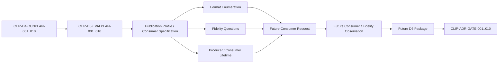

# Clipboard Integration D5 Consumer Fidelity Lifetime Documentary Package

## 1. Document Control

| Field | Value |
|---|---|
| Document ID | `RESEARCH-TECH-CLIPBOARD-024` |
| Title | Clipboard Integration D5 Consumer Fidelity Lifetime Documentary Package |
| Status | Draft |
| Research Type | Consumer／Fidelity／Lifetime Documentary Package |
| Technology Decision | TD-004 Clipboard Integration |
| Package | `CLIP-EVIDPKG-006` |
| Acquisition Stage | D5 — Consumer／Fidelity／Lifetime Evidence |
| Parent D4 | `RESEARCH-TECH-CLIPBOARD-023` |
| Parent D3 | `RESEARCH-TECH-CLIPBOARD-022` |
| Parent D2 | `RESEARCH-TECH-CLIPBOARD-021` |
| Parent Package Spec | `RESEARCH-TECH-CLIPBOARD-018` |
| Covered Runtime Plans | `CLIP-D4-RUNPLAN-001..010` |
| Covered Profiles | `CLIP-D2-FMTPROFILE-001..003` |
| Covered Consumers | `CLIP-D2-CONSPEC-001..003` |
| Synthetic | `CLIP-D2-SYNTHSPEC-001` |
| Consumer Application Created | No |
| Consumer Application Launched | No |
| Synthetic Image Created | No |
| Clipboard Publication | Not performed |
| Clipboard Consumer Read | Not performed |
| Clipboard Clear | Not performed |
| Clipboard History／Cloud | Not accessed |
| Format Enumeration | Not performed |
| Pixel／Alpha Comparison | Not performed |
| Producer／Consumer Lifetime Observation | Not performed |
| Session Observation | Not created |
| Persistent Evidence | Not created |
| Authorization Request | Not created |
| Human Authorization Decision | Not made |
| Candidate Ranking/Selection | Not performed |
| Technology Recommendation/Decision | Not made |
| Clipboard ADR | Not created |
| Owner | TBD |
| Last reviewed | Not reviewed |

## 2. Purpose and Non-Goals

This package specifies only the minimum future Consumer-interoperability, format-enumeration, pixel／alpha／color-fidelity, producer-lifetime, Consumer-lifetime, contention, observation, privacy, and cleanup boundaries for each D4 Runtime Plan before a Consumer/Fidelity evidence request may be prepared.

This package does not create or launch a Consumer, create a synthetic image, create a payload or result, publish to the Clipboard, read or clear the Clipboard, enumerate formats, compare pixels, extract image bytes, test process termination, create runtime evidence, write source code, create an Authorization Request, make a Human Decision, compare Candidates, select a Candidate, select a Technology, create a Clipboard ADR, or begin screenshot functionality.

No Consumer is treated as existing. D4 publication remains documentary only and is not treated as executed. No Consumer, synthetic image, payload, Consumer result, image bytes, log, Observation, Evidence, Request, or operation is created by this document.

## 3. Source Preservation and Controlled Vocabulary

### 3.1 Preserved Sources

Preserved source set: `RESEARCH-TECH-CLIPBOARD-016..023`; `CLIP-D4-RUNPLAN-001..010`; `CLIP-D4-OPDOC-001..007`; `CLIP-D3-PAIRPLAN-001..010`; `CLIP-D2-SCOPE-001..010`; `CLIP-D2-SYNTHSPEC-001`; `CLIP-D2-FMTPROFILE-001..003`; `CLIP-D2-CONSPEC-001..003`; `CLIP-OPT-001..005`; `CLIP-PAIR-001..010`; `CLIP-DEC-CRIT-001..012`; `CLIP-DEC-GAP-001..020`; `CLIP-ADR-GATE-001..010`; `CLIP-EVIDPKG-006`.

Upstream documents, Profiles, Consumer Specifications, Decision Gaps, ADR Gates, and package identifiers are not modified, closed, resolved, or reinterpreted. D5 does not add a fourth Consumer, rank or exclude a Candidate, or imply Profile support.

### 3.2 Controlled Vocabulary

| Vocabulary | Allowed values used by this package |
|---|---|
| D5 Documentary Status | Fully specified; Specified with pending D1／D3／D4 evidence; Partially specified; Blocked by documentary ambiguity; Deferred; Not applicable |
| Future Consumer-request Eligibility | Eligible for future consumer-request preparation; Conditionally eligible; Not eligible; Deferred |
| Evidence State | Static specification only; Pending D1 observation; Pending Build evidence; Pending Publication evidence; Pending Consumer evidence; Pending Fidelity evidence; Pending Lifetime evidence; Deferred; Not applicable |
| Current State | Not created; Not launched; Not published; Not consumed; Not enumerated; Not compared; Not observed; Not executed |
| Authorization | Current authorization Not granted; execution permitted No |

D5 does not make a runtime, compatibility, durability, recommendation, selection, or production-readiness conclusion.

## 4. D5 Binding Index

| D5 Evaluation Plan | D4 Runtime Plan | Pair |
|---|---|---|
| `CLIP-D5-EVALPLAN-001` | `CLIP-D4-RUNPLAN-001` | `CLIP-PAIR-001` |
| `CLIP-D5-EVALPLAN-002` | `CLIP-D4-RUNPLAN-002` | `CLIP-PAIR-002` |
| `CLIP-D5-EVALPLAN-003` | `CLIP-D4-RUNPLAN-003` | `CLIP-PAIR-003` |
| `CLIP-D5-EVALPLAN-004` | `CLIP-D4-RUNPLAN-004` | `CLIP-PAIR-004` |
| `CLIP-D5-EVALPLAN-005` | `CLIP-D4-RUNPLAN-005` | `CLIP-PAIR-005` |
| `CLIP-D5-EVALPLAN-006` | `CLIP-D4-RUNPLAN-006` | `CLIP-PAIR-006` |
| `CLIP-D5-EVALPLAN-007` | `CLIP-D4-RUNPLAN-007` | `CLIP-PAIR-007` |
| `CLIP-D5-EVALPLAN-008` | `CLIP-D4-RUNPLAN-008` | `CLIP-PAIR-008` |
| `CLIP-D5-EVALPLAN-009` | `CLIP-D4-RUNPLAN-009` | `CLIP-PAIR-009` |
| `CLIP-D5-EVALPLAN-010` | `CLIP-D4-RUNPLAN-010` | `CLIP-PAIR-010` |

Each D5 plan maps one Runtime Plan to one Pair. WPF and WinUI remain separate, and the backend is not merged. No `011` plan exists. The three Consumer Specifications are mapped below where applicable without implying support.

## 5. D5 Evaluation Plans

### `CLIP-D5-EVALPLAN-001`

| Field | Value |
|---|---|
| D5 Evaluation Plan ID | `CLIP-D5-EVALPLAN-001` |
| Source D4 Runtime Plan | `CLIP-D4-RUNPLAN-001` |
| Source D3 Pair Plan | `CLIP-D3-PAIRPLAN-001` |
| Candidate–Host Pair | `CLIP-PAIR-001` |
| Candidate ID | `CLIP-OPT-001` |
| Candidate identity | Source Pair identity; no selection |
| Producer Host identity | D4 Producer Host identity; documentary only |
| Backend identity | D4 backend identity; not merged |
| Adapter mode | WPF adapter mode |
| Related D1 Items | `CLIP-D1-OBS-001` documentary binding |
| Related D2 Scope Item | `CLIP-D2-SCOPE-001` |
| Related Decision Gaps | `CLIP-DEC-GAP-001..020` as applicable |
| Related Decision Criteria | `CLIP-DEC-CRIT-001..012` as applicable |
| Related ADR Gates | `CLIP-ADR-GATE-001..010` as applicable |
| D1 dependency state | Not observed |
| D3 Project state | Not created |
| D3 Build state | Not built |
| D4 Publication state | Not published |
| Minimum consumer question | Can the separately authorized Consumer receive the approved synthetic publication and identify the intended format class? |
| Minimum fidelity question | Does the Consumer result expose dimensions, border, edge, alpha, color, channel, and metadata comparison classes? |
| Minimum lifetime question | What producer and Consumer lifetime boundary exists before, during, and after minimum consumption? |
| Why Consumer evidence is required | Static D4 planning cannot establish Consumer-side consumption behavior. |
| Why Fidelity evidence is required | Format presence cannot establish pixel, alpha, or color fidelity. |
| Why Lifetime evidence is required | Consumption timing cannot establish producer or Consumer lifetime behavior. |
| Synthetic specification | `CLIP-D2-SYNTHSPEC-001` |
| Applicable Publication Profiles | `CLIP-D2-FMTPROFILE-001..003` where source binding applies |
| Applicable Consumer Specifications | `CLIP-D2-CONSPEC-001..003` as mapped in Section 10 |
| Producer role | Publish approved synthetic representation only after separate authority |
| Consumer role | Launch and consume approved synthetic publication only after separate authority |
| Observation role | Record sanitized session fields only |
| Fidelity comparator role | Compare declared reference classes without image bytes |
| Lifetime observer role | Observe declared process/object lifetime scenarios only |
| Producer process boundary | D4 Producer process; no termination or restart now |
| Consumer process boundary | Separately authorized Consumer process; no launch now |
| Process-separation requirement | Required |
| Publication prerequisite | D1, D3, and D4 documentary prerequisites |
| Consumer-launch prerequisite | Human authority must authorize the named Consumer |
| Clipboard-consumption prerequisite | Authorized synthetic publication and isolated Consumer path |
| Format-enumeration prerequisite | Authorized Consumer result with bounded format identity fields |
| Fidelity-comparison prerequisite | Authorized result reference class and comparison contract |
| Producer-termination prerequisite | Future D6 lifetime authorization; no termination now |
| Consumer-termination prerequisite | Future D6 lifetime authorization; no termination now |
| Clipboard Write scope | Not included in D5 authority |
| Clipboard consumer Read scope | Future separately authorized minimum consumption only |
| Clipboard Clear scope | Not included |
| History scope | Not included |
| Cloud scope | Not included |
| Consumer launch scope | Separate authorized Consumer launch only |
| Format enumeration scope | Approved synthetic publication format identities only |
| Consumer output scope | Sanitized result category only; no image bytes |
| Pixel comparison scope | Comparison class only; no payload, screenshot, or bytes |
| Alpha comparison scope | Opaque, partial, and transparent-RGB questions only |
| Color-channel comparison scope | Grayscale, RGB ordering, and premultiplication questions only |
| Metadata comparison scope | Declared metadata fields only; no private metadata |
| Producer lifetime scope | Section 17 scenarios; observation deferred |
| Consumer lifetime scope | Section 18 scenarios; observation deferred |
| Contention scope | Six bounded Section 20 scenarios; no retry policy |
| Capture scope | Not included |
| Rendering scope | Not included |
| File Output scope | Not included |
| Shared Workflow State scope | No access |
| Network boundary | No network access |
| Repository mutation boundary | No repository mutation |
| Product-output boundary | No product output or source artifact |
| Private-data boundary | No private Clipboard, credentials, tokens, SID, account, or unbounded machine data |
| Logging boundary | Sanitized bounded fields only; no raw payload or image bytes |
| Session Observation contract | Section 21 contract; not created |
| Persistent Evidence separation | Required |
| Cleanup boundary | No operation cleanup now; future cleanup isolated and reversible |
| Entry conditions | Documentary prerequisites and separate authority |
| Exit conditions | Bounded Consumer result, comparison classes, lifetime classifications, and cleanup state |
| Stop conditions | Any Section 25 condition; stop without fallback or scope expansion |
| Failure categories | Launch, consumption, format, fidelity, lifetime, privacy, isolation, and cleanup |
| Deferred D6 scope | Section 26 deferred validations |
| Prohibited inference | No interoperability, fidelity, durability, suitability, superiority, or product-readiness inference |
| Current authorization | Not granted |
| Execution permitted | No |
| Consumer state | Not consumed |
| Fidelity state | Not compared |
| Lifetime state | Not observed |
| Owner | TBD |
| Documentary status | Specified with pending D1／D3／D4 evidence |
| Future consumer-request eligibility | Conditionally eligible |
| Open questions | Which Consumer, Profile, authority, comparison contract, and lifetime observation are separately authorized? |

### `CLIP-D5-EVALPLAN-002`

| Field | Value |
|---|---|
| D5 Evaluation Plan ID | `CLIP-D5-EVALPLAN-002` |
| Source D4 Runtime Plan | `CLIP-D4-RUNPLAN-002` |
| Source D3 Pair Plan | `CLIP-D3-PAIRPLAN-002` |
| Candidate–Host Pair | `CLIP-PAIR-002` |
| Candidate ID | `CLIP-OPT-002` |
| Candidate identity | Source Pair identity; no selection |
| Producer Host identity | D4 Producer Host identity; documentary only |
| Backend identity | D4 backend identity; not merged |
| Adapter mode | WinUI adapter mode |
| Related D1 Items | `CLIP-D1-OBS-002` documentary binding |
| Related D2 Scope Item | `CLIP-D2-SCOPE-002` |
| Related Decision Gaps | `CLIP-DEC-GAP-001..020` as applicable |
| Related Decision Criteria | `CLIP-DEC-CRIT-001..012` as applicable |
| Related ADR Gates | `CLIP-ADR-GATE-001..010` as applicable |
| D1 dependency state | Not observed |
| D3 Project state | Not created |
| D3 Build state | Not built |
| D4 Publication state | Not published |
| Minimum consumer question | Can the separately authorized Consumer receive the approved synthetic publication and identify the intended format class? |
| Minimum fidelity question | Does the Consumer result expose dimensions, border, edge, alpha, color, channel, and metadata comparison classes? |
| Minimum lifetime question | What producer and Consumer lifetime boundary exists before, during, and after minimum consumption? |
| Why Consumer evidence is required | Static D4 planning cannot establish Consumer-side consumption behavior. |
| Why Fidelity evidence is required | Format presence cannot establish pixel, alpha, or color fidelity. |
| Why Lifetime evidence is required | Consumption timing cannot establish producer or Consumer lifetime behavior. |
| Synthetic specification | `CLIP-D2-SYNTHSPEC-001` |
| Applicable Publication Profiles | `CLIP-D2-FMTPROFILE-001..003` where source binding applies |
| Applicable Consumer Specifications | `CLIP-D2-CONSPEC-001..003` as mapped in Section 10 |
| Producer role | Publish approved synthetic representation only after separate authority |
| Consumer role | Launch and consume approved synthetic publication only after separate authority |
| Observation role | Record sanitized session fields only |
| Fidelity comparator role | Compare declared reference classes without image bytes |
| Lifetime observer role | Observe declared process/object lifetime scenarios only |
| Producer process boundary | D4 Producer process; no termination or restart now |
| Consumer process boundary | Separately authorized Consumer process; no launch now |
| Process-separation requirement | Required |
| Publication prerequisite | D1, D3, and D4 documentary prerequisites |
| Consumer-launch prerequisite | Human authority must authorize the named Consumer |
| Clipboard-consumption prerequisite | Authorized synthetic publication and isolated Consumer path |
| Format-enumeration prerequisite | Authorized Consumer result with bounded format identity fields |
| Fidelity-comparison prerequisite | Authorized result reference class and comparison contract |
| Producer-termination prerequisite | Future D6 lifetime authorization; no termination now |
| Consumer-termination prerequisite | Future D6 lifetime authorization; no termination now |
| Clipboard Write scope | Not included in D5 authority |
| Clipboard consumer Read scope | Future separately authorized minimum consumption only |
| Clipboard Clear scope | Not included |
| History scope | Not included |
| Cloud scope | Not included |
| Consumer launch scope | Separate authorized Consumer launch only |
| Format enumeration scope | Approved synthetic publication format identities only |
| Consumer output scope | Sanitized result category only; no image bytes |
| Pixel comparison scope | Comparison class only; no payload, screenshot, or bytes |
| Alpha comparison scope | Opaque, partial, and transparent-RGB questions only |
| Color-channel comparison scope | Grayscale, RGB ordering, and premultiplication questions only |
| Metadata comparison scope | Declared metadata fields only; no private metadata |
| Producer lifetime scope | Section 17 scenarios; observation deferred |
| Consumer lifetime scope | Section 18 scenarios; observation deferred |
| Contention scope | Six bounded Section 20 scenarios; no retry policy |
| Capture scope | Not included |
| Rendering scope | Not included |
| File Output scope | Not included |
| Shared Workflow State scope | No access |
| Network boundary | No network access |
| Repository mutation boundary | No repository mutation |
| Product-output boundary | No product output or source artifact |
| Private-data boundary | No private Clipboard, credentials, tokens, SID, account, or unbounded machine data |
| Logging boundary | Sanitized bounded fields only; no raw payload or image bytes |
| Session Observation contract | Section 21 contract; not created |
| Persistent Evidence separation | Required |
| Cleanup boundary | No operation cleanup now; future cleanup isolated and reversible |
| Entry conditions | Documentary prerequisites and separate authority |
| Exit conditions | Bounded Consumer result, comparison classes, lifetime classifications, and cleanup state |
| Stop conditions | Any Section 25 condition; stop without fallback or scope expansion |
| Failure categories | Launch, consumption, format, fidelity, lifetime, privacy, isolation, and cleanup |
| Deferred D6 scope | Section 26 deferred validations |
| Prohibited inference | No interoperability, fidelity, durability, suitability, superiority, or product-readiness inference |
| Current authorization | Not granted |
| Execution permitted | No |
| Consumer state | Not consumed |
| Fidelity state | Not compared |
| Lifetime state | Not observed |
| Owner | TBD |
| Documentary status | Specified with pending D1／D3／D4 evidence |
| Future consumer-request eligibility | Conditionally eligible |
| Open questions | Which Consumer, Profile, authority, comparison contract, and lifetime observation are separately authorized? |

### `CLIP-D5-EVALPLAN-003`

| Field | Value |
|---|---|
| D5 Evaluation Plan ID | `CLIP-D5-EVALPLAN-003` |
| Source D4 Runtime Plan | `CLIP-D4-RUNPLAN-003` |
| Source D3 Pair Plan | `CLIP-D3-PAIRPLAN-003` |
| Candidate–Host Pair | `CLIP-PAIR-003` |
| Candidate ID | `CLIP-OPT-003` |
| Candidate identity | Source Pair identity; no selection |
| Producer Host identity | D4 Producer Host identity; documentary only |
| Backend identity | D4 backend identity; not merged |
| Adapter mode | WPF adapter mode |
| Related D1 Items | `CLIP-D1-OBS-003` documentary binding |
| Related D2 Scope Item | `CLIP-D2-SCOPE-003` |
| Related Decision Gaps | `CLIP-DEC-GAP-001..020` as applicable |
| Related Decision Criteria | `CLIP-DEC-CRIT-001..012` as applicable |
| Related ADR Gates | `CLIP-ADR-GATE-001..010` as applicable |
| D1 dependency state | Not observed |
| D3 Project state | Not created |
| D3 Build state | Not built |
| D4 Publication state | Not published |
| Minimum consumer question | Can the separately authorized Consumer receive the approved synthetic publication and identify the intended format class? |
| Minimum fidelity question | Does the Consumer result expose dimensions, border, edge, alpha, color, channel, and metadata comparison classes? |
| Minimum lifetime question | What producer and Consumer lifetime boundary exists before, during, and after minimum consumption? |
| Why Consumer evidence is required | Static D4 planning cannot establish Consumer-side consumption behavior. |
| Why Fidelity evidence is required | Format presence cannot establish pixel, alpha, or color fidelity. |
| Why Lifetime evidence is required | Consumption timing cannot establish producer or Consumer lifetime behavior. |
| Synthetic specification | `CLIP-D2-SYNTHSPEC-001` |
| Applicable Publication Profiles | `CLIP-D2-FMTPROFILE-001..003` where source binding applies |
| Applicable Consumer Specifications | `CLIP-D2-CONSPEC-001..003` as mapped in Section 10 |
| Producer role | Publish approved synthetic representation only after separate authority |
| Consumer role | Launch and consume approved synthetic publication only after separate authority |
| Observation role | Record sanitized session fields only |
| Fidelity comparator role | Compare declared reference classes without image bytes |
| Lifetime observer role | Observe declared process/object lifetime scenarios only |
| Producer process boundary | D4 Producer process; no termination or restart now |
| Consumer process boundary | Separately authorized Consumer process; no launch now |
| Process-separation requirement | Required |
| Publication prerequisite | D1, D3, and D4 documentary prerequisites |
| Consumer-launch prerequisite | Human authority must authorize the named Consumer |
| Clipboard-consumption prerequisite | Authorized synthetic publication and isolated Consumer path |
| Format-enumeration prerequisite | Authorized Consumer result with bounded format identity fields |
| Fidelity-comparison prerequisite | Authorized result reference class and comparison contract |
| Producer-termination prerequisite | Future D6 lifetime authorization; no termination now |
| Consumer-termination prerequisite | Future D6 lifetime authorization; no termination now |
| Clipboard Write scope | Not included in D5 authority |
| Clipboard consumer Read scope | Future separately authorized minimum consumption only |
| Clipboard Clear scope | Not included |
| History scope | Not included |
| Cloud scope | Not included |
| Consumer launch scope | Separate authorized Consumer launch only |
| Format enumeration scope | Approved synthetic publication format identities only |
| Consumer output scope | Sanitized result category only; no image bytes |
| Pixel comparison scope | Comparison class only; no payload, screenshot, or bytes |
| Alpha comparison scope | Opaque, partial, and transparent-RGB questions only |
| Color-channel comparison scope | Grayscale, RGB ordering, and premultiplication questions only |
| Metadata comparison scope | Declared metadata fields only; no private metadata |
| Producer lifetime scope | Section 17 scenarios; observation deferred |
| Consumer lifetime scope | Section 18 scenarios; observation deferred |
| Contention scope | Six bounded Section 20 scenarios; no retry policy |
| Capture scope | Not included |
| Rendering scope | Not included |
| File Output scope | Not included |
| Shared Workflow State scope | No access |
| Network boundary | No network access |
| Repository mutation boundary | No repository mutation |
| Product-output boundary | No product output or source artifact |
| Private-data boundary | No private Clipboard, credentials, tokens, SID, account, or unbounded machine data |
| Logging boundary | Sanitized bounded fields only; no raw payload or image bytes |
| Session Observation contract | Section 21 contract; not created |
| Persistent Evidence separation | Required |
| Cleanup boundary | No operation cleanup now; future cleanup isolated and reversible |
| Entry conditions | Documentary prerequisites and separate authority |
| Exit conditions | Bounded Consumer result, comparison classes, lifetime classifications, and cleanup state |
| Stop conditions | Any Section 25 condition; stop without fallback or scope expansion |
| Failure categories | Launch, consumption, format, fidelity, lifetime, privacy, isolation, and cleanup |
| Deferred D6 scope | Section 26 deferred validations |
| Prohibited inference | No interoperability, fidelity, durability, suitability, superiority, or product-readiness inference |
| Current authorization | Not granted |
| Execution permitted | No |
| Consumer state | Not consumed |
| Fidelity state | Not compared |
| Lifetime state | Not observed |
| Owner | TBD |
| Documentary status | Specified with pending D1／D3／D4 evidence |
| Future consumer-request eligibility | Conditionally eligible |
| Open questions | Which Consumer, Profile, authority, comparison contract, and lifetime observation are separately authorized? |

### `CLIP-D5-EVALPLAN-004`

| Field | Value |
|---|---|
| D5 Evaluation Plan ID | `CLIP-D5-EVALPLAN-004` |
| Source D4 Runtime Plan | `CLIP-D4-RUNPLAN-004` |
| Source D3 Pair Plan | `CLIP-D3-PAIRPLAN-004` |
| Candidate–Host Pair | `CLIP-PAIR-004` |
| Candidate ID | `CLIP-OPT-004` |
| Candidate identity | Source Pair identity; no selection |
| Producer Host identity | D4 Producer Host identity; documentary only |
| Backend identity | D4 backend identity; not merged |
| Adapter mode | WinUI adapter mode |
| Related D1 Items | `CLIP-D1-OBS-004` documentary binding |
| Related D2 Scope Item | `CLIP-D2-SCOPE-004` |
| Related Decision Gaps | `CLIP-DEC-GAP-001..020` as applicable |
| Related Decision Criteria | `CLIP-DEC-CRIT-001..012` as applicable |
| Related ADR Gates | `CLIP-ADR-GATE-001..010` as applicable |
| D1 dependency state | Not observed |
| D3 Project state | Not created |
| D3 Build state | Not built |
| D4 Publication state | Not published |
| Minimum consumer question | Can the separately authorized Consumer receive the approved synthetic publication and identify the intended format class? |
| Minimum fidelity question | Does the Consumer result expose dimensions, border, edge, alpha, color, channel, and metadata comparison classes? |
| Minimum lifetime question | What producer and Consumer lifetime boundary exists before, during, and after minimum consumption? |
| Why Consumer evidence is required | Static D4 planning cannot establish Consumer-side consumption behavior. |
| Why Fidelity evidence is required | Format presence cannot establish pixel, alpha, or color fidelity. |
| Why Lifetime evidence is required | Consumption timing cannot establish producer or Consumer lifetime behavior. |
| Synthetic specification | `CLIP-D2-SYNTHSPEC-001` |
| Applicable Publication Profiles | `CLIP-D2-FMTPROFILE-001..003` where source binding applies |
| Applicable Consumer Specifications | `CLIP-D2-CONSPEC-001..003` as mapped in Section 10 |
| Producer role | Publish approved synthetic representation only after separate authority |
| Consumer role | Launch and consume approved synthetic publication only after separate authority |
| Observation role | Record sanitized session fields only |
| Fidelity comparator role | Compare declared reference classes without image bytes |
| Lifetime observer role | Observe declared process/object lifetime scenarios only |
| Producer process boundary | D4 Producer process; no termination or restart now |
| Consumer process boundary | Separately authorized Consumer process; no launch now |
| Process-separation requirement | Required |
| Publication prerequisite | D1, D3, and D4 documentary prerequisites |
| Consumer-launch prerequisite | Human authority must authorize the named Consumer |
| Clipboard-consumption prerequisite | Authorized synthetic publication and isolated Consumer path |
| Format-enumeration prerequisite | Authorized Consumer result with bounded format identity fields |
| Fidelity-comparison prerequisite | Authorized result reference class and comparison contract |
| Producer-termination prerequisite | Future D6 lifetime authorization; no termination now |
| Consumer-termination prerequisite | Future D6 lifetime authorization; no termination now |
| Clipboard Write scope | Not included in D5 authority |
| Clipboard consumer Read scope | Future separately authorized minimum consumption only |
| Clipboard Clear scope | Not included |
| History scope | Not included |
| Cloud scope | Not included |
| Consumer launch scope | Separate authorized Consumer launch only |
| Format enumeration scope | Approved synthetic publication format identities only |
| Consumer output scope | Sanitized result category only; no image bytes |
| Pixel comparison scope | Comparison class only; no payload, screenshot, or bytes |
| Alpha comparison scope | Opaque, partial, and transparent-RGB questions only |
| Color-channel comparison scope | Grayscale, RGB ordering, and premultiplication questions only |
| Metadata comparison scope | Declared metadata fields only; no private metadata |
| Producer lifetime scope | Section 17 scenarios; observation deferred |
| Consumer lifetime scope | Section 18 scenarios; observation deferred |
| Contention scope | Six bounded Section 20 scenarios; no retry policy |
| Capture scope | Not included |
| Rendering scope | Not included |
| File Output scope | Not included |
| Shared Workflow State scope | No access |
| Network boundary | No network access |
| Repository mutation boundary | No repository mutation |
| Product-output boundary | No product output or source artifact |
| Private-data boundary | No private Clipboard, credentials, tokens, SID, account, or unbounded machine data |
| Logging boundary | Sanitized bounded fields only; no raw payload or image bytes |
| Session Observation contract | Section 21 contract; not created |
| Persistent Evidence separation | Required |
| Cleanup boundary | No operation cleanup now; future cleanup isolated and reversible |
| Entry conditions | Documentary prerequisites and separate authority |
| Exit conditions | Bounded Consumer result, comparison classes, lifetime classifications, and cleanup state |
| Stop conditions | Any Section 25 condition; stop without fallback or scope expansion |
| Failure categories | Launch, consumption, format, fidelity, lifetime, privacy, isolation, and cleanup |
| Deferred D6 scope | Section 26 deferred validations |
| Prohibited inference | No interoperability, fidelity, durability, suitability, superiority, or product-readiness inference |
| Current authorization | Not granted |
| Execution permitted | No |
| Consumer state | Not consumed |
| Fidelity state | Not compared |
| Lifetime state | Not observed |
| Owner | TBD |
| Documentary status | Specified with pending D1／D3／D4 evidence |
| Future consumer-request eligibility | Conditionally eligible |
| Open questions | Which Consumer, Profile, authority, comparison contract, and lifetime observation are separately authorized? |

### `CLIP-D5-EVALPLAN-005`

| Field | Value |
|---|---|
| D5 Evaluation Plan ID | `CLIP-D5-EVALPLAN-005` |
| Source D4 Runtime Plan | `CLIP-D4-RUNPLAN-005` |
| Source D3 Pair Plan | `CLIP-D3-PAIRPLAN-005` |
| Candidate–Host Pair | `CLIP-PAIR-005` |
| Candidate ID | `CLIP-OPT-005` |
| Candidate identity | Source Pair identity; no selection |
| Producer Host identity | D4 Producer Host identity; documentary only |
| Backend identity | D4 backend identity; not merged |
| Adapter mode | WPF adapter mode |
| Related D1 Items | `CLIP-D1-OBS-005` documentary binding |
| Related D2 Scope Item | `CLIP-D2-SCOPE-005` |
| Related Decision Gaps | `CLIP-DEC-GAP-001..020` as applicable |
| Related Decision Criteria | `CLIP-DEC-CRIT-001..012` as applicable |
| Related ADR Gates | `CLIP-ADR-GATE-001..010` as applicable |
| D1 dependency state | Not observed |
| D3 Project state | Not created |
| D3 Build state | Not built |
| D4 Publication state | Not published |
| Minimum consumer question | Can the separately authorized Consumer receive the approved synthetic publication and identify the intended format class? |
| Minimum fidelity question | Does the Consumer result expose dimensions, border, edge, alpha, color, channel, and metadata comparison classes? |
| Minimum lifetime question | What producer and Consumer lifetime boundary exists before, during, and after minimum consumption? |
| Why Consumer evidence is required | Static D4 planning cannot establish Consumer-side consumption behavior. |
| Why Fidelity evidence is required | Format presence cannot establish pixel, alpha, or color fidelity. |
| Why Lifetime evidence is required | Consumption timing cannot establish producer or Consumer lifetime behavior. |
| Synthetic specification | `CLIP-D2-SYNTHSPEC-001` |
| Applicable Publication Profiles | `CLIP-D2-FMTPROFILE-001..003` where source binding applies |
| Applicable Consumer Specifications | `CLIP-D2-CONSPEC-001..003` as mapped in Section 10 |
| Producer role | Publish approved synthetic representation only after separate authority |
| Consumer role | Launch and consume approved synthetic publication only after separate authority |
| Observation role | Record sanitized session fields only |
| Fidelity comparator role | Compare declared reference classes without image bytes |
| Lifetime observer role | Observe declared process/object lifetime scenarios only |
| Producer process boundary | D4 Producer process; no termination or restart now |
| Consumer process boundary | Separately authorized Consumer process; no launch now |
| Process-separation requirement | Required |
| Publication prerequisite | D1, D3, and D4 documentary prerequisites |
| Consumer-launch prerequisite | Human authority must authorize the named Consumer |
| Clipboard-consumption prerequisite | Authorized synthetic publication and isolated Consumer path |
| Format-enumeration prerequisite | Authorized Consumer result with bounded format identity fields |
| Fidelity-comparison prerequisite | Authorized result reference class and comparison contract |
| Producer-termination prerequisite | Future D6 lifetime authorization; no termination now |
| Consumer-termination prerequisite | Future D6 lifetime authorization; no termination now |
| Clipboard Write scope | Not included in D5 authority |
| Clipboard consumer Read scope | Future separately authorized minimum consumption only |
| Clipboard Clear scope | Not included |
| History scope | Not included |
| Cloud scope | Not included |
| Consumer launch scope | Separate authorized Consumer launch only |
| Format enumeration scope | Approved synthetic publication format identities only |
| Consumer output scope | Sanitized result category only; no image bytes |
| Pixel comparison scope | Comparison class only; no payload, screenshot, or bytes |
| Alpha comparison scope | Opaque, partial, and transparent-RGB questions only |
| Color-channel comparison scope | Grayscale, RGB ordering, and premultiplication questions only |
| Metadata comparison scope | Declared metadata fields only; no private metadata |
| Producer lifetime scope | Section 17 scenarios; observation deferred |
| Consumer lifetime scope | Section 18 scenarios; observation deferred |
| Contention scope | Six bounded Section 20 scenarios; no retry policy |
| Capture scope | Not included |
| Rendering scope | Not included |
| File Output scope | Not included |
| Shared Workflow State scope | No access |
| Network boundary | No network access |
| Repository mutation boundary | No repository mutation |
| Product-output boundary | No product output or source artifact |
| Private-data boundary | No private Clipboard, credentials, tokens, SID, account, or unbounded machine data |
| Logging boundary | Sanitized bounded fields only; no raw payload or image bytes |
| Session Observation contract | Section 21 contract; not created |
| Persistent Evidence separation | Required |
| Cleanup boundary | No operation cleanup now; future cleanup isolated and reversible |
| Entry conditions | Documentary prerequisites and separate authority |
| Exit conditions | Bounded Consumer result, comparison classes, lifetime classifications, and cleanup state |
| Stop conditions | Any Section 25 condition; stop without fallback or scope expansion |
| Failure categories | Launch, consumption, format, fidelity, lifetime, privacy, isolation, and cleanup |
| Deferred D6 scope | Section 26 deferred validations |
| Prohibited inference | No interoperability, fidelity, durability, suitability, superiority, or product-readiness inference |
| Current authorization | Not granted |
| Execution permitted | No |
| Consumer state | Not consumed |
| Fidelity state | Not compared |
| Lifetime state | Not observed |
| Owner | TBD |
| Documentary status | Specified with pending D1／D3／D4 evidence |
| Future consumer-request eligibility | Conditionally eligible |
| Open questions | Which Consumer, Profile, authority, comparison contract, and lifetime observation are separately authorized? |

### `CLIP-D5-EVALPLAN-006`

| Field | Value |
|---|---|
| D5 Evaluation Plan ID | `CLIP-D5-EVALPLAN-006` |
| Source D4 Runtime Plan | `CLIP-D4-RUNPLAN-006` |
| Source D3 Pair Plan | `CLIP-D3-PAIRPLAN-006` |
| Candidate–Host Pair | `CLIP-PAIR-006` |
| Candidate ID | `CLIP-OPT-001` |
| Candidate identity | Source Pair identity; no selection |
| Producer Host identity | D4 Producer Host identity; documentary only |
| Backend identity | D4 backend identity; not merged |
| Adapter mode | WinUI adapter mode |
| Related D1 Items | `CLIP-D1-OBS-006` documentary binding |
| Related D2 Scope Item | `CLIP-D2-SCOPE-006` |
| Related Decision Gaps | `CLIP-DEC-GAP-001..020` as applicable |
| Related Decision Criteria | `CLIP-DEC-CRIT-001..012` as applicable |
| Related ADR Gates | `CLIP-ADR-GATE-001..010` as applicable |
| D1 dependency state | Not observed |
| D3 Project state | Not created |
| D3 Build state | Not built |
| D4 Publication state | Not published |
| Minimum consumer question | Can the separately authorized Consumer receive the approved synthetic publication and identify the intended format class? |
| Minimum fidelity question | Does the Consumer result expose dimensions, border, edge, alpha, color, channel, and metadata comparison classes? |
| Minimum lifetime question | What producer and Consumer lifetime boundary exists before, during, and after minimum consumption? |
| Why Consumer evidence is required | Static D4 planning cannot establish Consumer-side consumption behavior. |
| Why Fidelity evidence is required | Format presence cannot establish pixel, alpha, or color fidelity. |
| Why Lifetime evidence is required | Consumption timing cannot establish producer or Consumer lifetime behavior. |
| Synthetic specification | `CLIP-D2-SYNTHSPEC-001` |
| Applicable Publication Profiles | `CLIP-D2-FMTPROFILE-001..003` where source binding applies |
| Applicable Consumer Specifications | `CLIP-D2-CONSPEC-001..003` as mapped in Section 10 |
| Producer role | Publish approved synthetic representation only after separate authority |
| Consumer role | Launch and consume approved synthetic publication only after separate authority |
| Observation role | Record sanitized session fields only |
| Fidelity comparator role | Compare declared reference classes without image bytes |
| Lifetime observer role | Observe declared process/object lifetime scenarios only |
| Producer process boundary | D4 Producer process; no termination or restart now |
| Consumer process boundary | Separately authorized Consumer process; no launch now |
| Process-separation requirement | Required |
| Publication prerequisite | D1, D3, and D4 documentary prerequisites |
| Consumer-launch prerequisite | Human authority must authorize the named Consumer |
| Clipboard-consumption prerequisite | Authorized synthetic publication and isolated Consumer path |
| Format-enumeration prerequisite | Authorized Consumer result with bounded format identity fields |
| Fidelity-comparison prerequisite | Authorized result reference class and comparison contract |
| Producer-termination prerequisite | Future D6 lifetime authorization; no termination now |
| Consumer-termination prerequisite | Future D6 lifetime authorization; no termination now |
| Clipboard Write scope | Not included in D5 authority |
| Clipboard consumer Read scope | Future separately authorized minimum consumption only |
| Clipboard Clear scope | Not included |
| History scope | Not included |
| Cloud scope | Not included |
| Consumer launch scope | Separate authorized Consumer launch only |
| Format enumeration scope | Approved synthetic publication format identities only |
| Consumer output scope | Sanitized result category only; no image bytes |
| Pixel comparison scope | Comparison class only; no payload, screenshot, or bytes |
| Alpha comparison scope | Opaque, partial, and transparent-RGB questions only |
| Color-channel comparison scope | Grayscale, RGB ordering, and premultiplication questions only |
| Metadata comparison scope | Declared metadata fields only; no private metadata |
| Producer lifetime scope | Section 17 scenarios; observation deferred |
| Consumer lifetime scope | Section 18 scenarios; observation deferred |
| Contention scope | Six bounded Section 20 scenarios; no retry policy |
| Capture scope | Not included |
| Rendering scope | Not included |
| File Output scope | Not included |
| Shared Workflow State scope | No access |
| Network boundary | No network access |
| Repository mutation boundary | No repository mutation |
| Product-output boundary | No product output or source artifact |
| Private-data boundary | No private Clipboard, credentials, tokens, SID, account, or unbounded machine data |
| Logging boundary | Sanitized bounded fields only; no raw payload or image bytes |
| Session Observation contract | Section 21 contract; not created |
| Persistent Evidence separation | Required |
| Cleanup boundary | No operation cleanup now; future cleanup isolated and reversible |
| Entry conditions | Documentary prerequisites and separate authority |
| Exit conditions | Bounded Consumer result, comparison classes, lifetime classifications, and cleanup state |
| Stop conditions | Any Section 25 condition; stop without fallback or scope expansion |
| Failure categories | Launch, consumption, format, fidelity, lifetime, privacy, isolation, and cleanup |
| Deferred D6 scope | Section 26 deferred validations |
| Prohibited inference | No interoperability, fidelity, durability, suitability, superiority, or product-readiness inference |
| Current authorization | Not granted |
| Execution permitted | No |
| Consumer state | Not consumed |
| Fidelity state | Not compared |
| Lifetime state | Not observed |
| Owner | TBD |
| Documentary status | Specified with pending D1／D3／D4 evidence |
| Future consumer-request eligibility | Conditionally eligible |
| Open questions | Which Consumer, Profile, authority, comparison contract, and lifetime observation are separately authorized? |

### `CLIP-D5-EVALPLAN-007`

| Field | Value |
|---|---|
| D5 Evaluation Plan ID | `CLIP-D5-EVALPLAN-007` |
| Source D4 Runtime Plan | `CLIP-D4-RUNPLAN-007` |
| Source D3 Pair Plan | `CLIP-D3-PAIRPLAN-007` |
| Candidate–Host Pair | `CLIP-PAIR-007` |
| Candidate ID | `CLIP-OPT-002` |
| Candidate identity | Source Pair identity; no selection |
| Producer Host identity | D4 Producer Host identity; documentary only |
| Backend identity | D4 backend identity; not merged |
| Adapter mode | WPF adapter mode |
| Related D1 Items | `CLIP-D1-OBS-007` documentary binding |
| Related D2 Scope Item | `CLIP-D2-SCOPE-007` |
| Related Decision Gaps | `CLIP-DEC-GAP-001..020` as applicable |
| Related Decision Criteria | `CLIP-DEC-CRIT-001..012` as applicable |
| Related ADR Gates | `CLIP-ADR-GATE-001..010` as applicable |
| D1 dependency state | Not observed |
| D3 Project state | Not created |
| D3 Build state | Not built |
| D4 Publication state | Not published |
| Minimum consumer question | Can the separately authorized Consumer receive the approved synthetic publication and identify the intended format class? |
| Minimum fidelity question | Does the Consumer result expose dimensions, border, edge, alpha, color, channel, and metadata comparison classes? |
| Minimum lifetime question | What producer and Consumer lifetime boundary exists before, during, and after minimum consumption? |
| Why Consumer evidence is required | Static D4 planning cannot establish Consumer-side consumption behavior. |
| Why Fidelity evidence is required | Format presence cannot establish pixel, alpha, or color fidelity. |
| Why Lifetime evidence is required | Consumption timing cannot establish producer or Consumer lifetime behavior. |
| Synthetic specification | `CLIP-D2-SYNTHSPEC-001` |
| Applicable Publication Profiles | `CLIP-D2-FMTPROFILE-001..003` where source binding applies |
| Applicable Consumer Specifications | `CLIP-D2-CONSPEC-001..003` as mapped in Section 10 |
| Producer role | Publish approved synthetic representation only after separate authority |
| Consumer role | Launch and consume approved synthetic publication only after separate authority |
| Observation role | Record sanitized session fields only |
| Fidelity comparator role | Compare declared reference classes without image bytes |
| Lifetime observer role | Observe declared process/object lifetime scenarios only |
| Producer process boundary | D4 Producer process; no termination or restart now |
| Consumer process boundary | Separately authorized Consumer process; no launch now |
| Process-separation requirement | Required |
| Publication prerequisite | D1, D3, and D4 documentary prerequisites |
| Consumer-launch prerequisite | Human authority must authorize the named Consumer |
| Clipboard-consumption prerequisite | Authorized synthetic publication and isolated Consumer path |
| Format-enumeration prerequisite | Authorized Consumer result with bounded format identity fields |
| Fidelity-comparison prerequisite | Authorized result reference class and comparison contract |
| Producer-termination prerequisite | Future D6 lifetime authorization; no termination now |
| Consumer-termination prerequisite | Future D6 lifetime authorization; no termination now |
| Clipboard Write scope | Not included in D5 authority |
| Clipboard consumer Read scope | Future separately authorized minimum consumption only |
| Clipboard Clear scope | Not included |
| History scope | Not included |
| Cloud scope | Not included |
| Consumer launch scope | Separate authorized Consumer launch only |
| Format enumeration scope | Approved synthetic publication format identities only |
| Consumer output scope | Sanitized result category only; no image bytes |
| Pixel comparison scope | Comparison class only; no payload, screenshot, or bytes |
| Alpha comparison scope | Opaque, partial, and transparent-RGB questions only |
| Color-channel comparison scope | Grayscale, RGB ordering, and premultiplication questions only |
| Metadata comparison scope | Declared metadata fields only; no private metadata |
| Producer lifetime scope | Section 17 scenarios; observation deferred |
| Consumer lifetime scope | Section 18 scenarios; observation deferred |
| Contention scope | Six bounded Section 20 scenarios; no retry policy |
| Capture scope | Not included |
| Rendering scope | Not included |
| File Output scope | Not included |
| Shared Workflow State scope | No access |
| Network boundary | No network access |
| Repository mutation boundary | No repository mutation |
| Product-output boundary | No product output or source artifact |
| Private-data boundary | No private Clipboard, credentials, tokens, SID, account, or unbounded machine data |
| Logging boundary | Sanitized bounded fields only; no raw payload or image bytes |
| Session Observation contract | Section 21 contract; not created |
| Persistent Evidence separation | Required |
| Cleanup boundary | No operation cleanup now; future cleanup isolated and reversible |
| Entry conditions | Documentary prerequisites and separate authority |
| Exit conditions | Bounded Consumer result, comparison classes, lifetime classifications, and cleanup state |
| Stop conditions | Any Section 25 condition; stop without fallback or scope expansion |
| Failure categories | Launch, consumption, format, fidelity, lifetime, privacy, isolation, and cleanup |
| Deferred D6 scope | Section 26 deferred validations |
| Prohibited inference | No interoperability, fidelity, durability, suitability, superiority, or product-readiness inference |
| Current authorization | Not granted |
| Execution permitted | No |
| Consumer state | Not consumed |
| Fidelity state | Not compared |
| Lifetime state | Not observed |
| Owner | TBD |
| Documentary status | Specified with pending D1／D3／D4 evidence |
| Future consumer-request eligibility | Conditionally eligible |
| Open questions | Which Consumer, Profile, authority, comparison contract, and lifetime observation are separately authorized? |

### `CLIP-D5-EVALPLAN-008`

| Field | Value |
|---|---|
| D5 Evaluation Plan ID | `CLIP-D5-EVALPLAN-008` |
| Source D4 Runtime Plan | `CLIP-D4-RUNPLAN-008` |
| Source D3 Pair Plan | `CLIP-D3-PAIRPLAN-008` |
| Candidate–Host Pair | `CLIP-PAIR-008` |
| Candidate ID | `CLIP-OPT-003` |
| Candidate identity | Source Pair identity; no selection |
| Producer Host identity | D4 Producer Host identity; documentary only |
| Backend identity | D4 backend identity; not merged |
| Adapter mode | WinUI adapter mode |
| Related D1 Items | `CLIP-D1-OBS-008` documentary binding |
| Related D2 Scope Item | `CLIP-D2-SCOPE-008` |
| Related Decision Gaps | `CLIP-DEC-GAP-001..020` as applicable |
| Related Decision Criteria | `CLIP-DEC-CRIT-001..012` as applicable |
| Related ADR Gates | `CLIP-ADR-GATE-001..010` as applicable |
| D1 dependency state | Not observed |
| D3 Project state | Not created |
| D3 Build state | Not built |
| D4 Publication state | Not published |
| Minimum consumer question | Can the separately authorized Consumer receive the approved synthetic publication and identify the intended format class? |
| Minimum fidelity question | Does the Consumer result expose dimensions, border, edge, alpha, color, channel, and metadata comparison classes? |
| Minimum lifetime question | What producer and Consumer lifetime boundary exists before, during, and after minimum consumption? |
| Why Consumer evidence is required | Static D4 planning cannot establish Consumer-side consumption behavior. |
| Why Fidelity evidence is required | Format presence cannot establish pixel, alpha, or color fidelity. |
| Why Lifetime evidence is required | Consumption timing cannot establish producer or Consumer lifetime behavior. |
| Synthetic specification | `CLIP-D2-SYNTHSPEC-001` |
| Applicable Publication Profiles | `CLIP-D2-FMTPROFILE-001..003` where source binding applies |
| Applicable Consumer Specifications | `CLIP-D2-CONSPEC-001..003` as mapped in Section 10 |
| Producer role | Publish approved synthetic representation only after separate authority |
| Consumer role | Launch and consume approved synthetic publication only after separate authority |
| Observation role | Record sanitized session fields only |
| Fidelity comparator role | Compare declared reference classes without image bytes |
| Lifetime observer role | Observe declared process/object lifetime scenarios only |
| Producer process boundary | D4 Producer process; no termination or restart now |
| Consumer process boundary | Separately authorized Consumer process; no launch now |
| Process-separation requirement | Required |
| Publication prerequisite | D1, D3, and D4 documentary prerequisites |
| Consumer-launch prerequisite | Human authority must authorize the named Consumer |
| Clipboard-consumption prerequisite | Authorized synthetic publication and isolated Consumer path |
| Format-enumeration prerequisite | Authorized Consumer result with bounded format identity fields |
| Fidelity-comparison prerequisite | Authorized result reference class and comparison contract |
| Producer-termination prerequisite | Future D6 lifetime authorization; no termination now |
| Consumer-termination prerequisite | Future D6 lifetime authorization; no termination now |
| Clipboard Write scope | Not included in D5 authority |
| Clipboard consumer Read scope | Future separately authorized minimum consumption only |
| Clipboard Clear scope | Not included |
| History scope | Not included |
| Cloud scope | Not included |
| Consumer launch scope | Separate authorized Consumer launch only |
| Format enumeration scope | Approved synthetic publication format identities only |
| Consumer output scope | Sanitized result category only; no image bytes |
| Pixel comparison scope | Comparison class only; no payload, screenshot, or bytes |
| Alpha comparison scope | Opaque, partial, and transparent-RGB questions only |
| Color-channel comparison scope | Grayscale, RGB ordering, and premultiplication questions only |
| Metadata comparison scope | Declared metadata fields only; no private metadata |
| Producer lifetime scope | Section 17 scenarios; observation deferred |
| Consumer lifetime scope | Section 18 scenarios; observation deferred |
| Contention scope | Six bounded Section 20 scenarios; no retry policy |
| Capture scope | Not included |
| Rendering scope | Not included |
| File Output scope | Not included |
| Shared Workflow State scope | No access |
| Network boundary | No network access |
| Repository mutation boundary | No repository mutation |
| Product-output boundary | No product output or source artifact |
| Private-data boundary | No private Clipboard, credentials, tokens, SID, account, or unbounded machine data |
| Logging boundary | Sanitized bounded fields only; no raw payload or image bytes |
| Session Observation contract | Section 21 contract; not created |
| Persistent Evidence separation | Required |
| Cleanup boundary | No operation cleanup now; future cleanup isolated and reversible |
| Entry conditions | Documentary prerequisites and separate authority |
| Exit conditions | Bounded Consumer result, comparison classes, lifetime classifications, and cleanup state |
| Stop conditions | Any Section 25 condition; stop without fallback or scope expansion |
| Failure categories | Launch, consumption, format, fidelity, lifetime, privacy, isolation, and cleanup |
| Deferred D6 scope | Section 26 deferred validations |
| Prohibited inference | No interoperability, fidelity, durability, suitability, superiority, or product-readiness inference |
| Current authorization | Not granted |
| Execution permitted | No |
| Consumer state | Not consumed |
| Fidelity state | Not compared |
| Lifetime state | Not observed |
| Owner | TBD |
| Documentary status | Specified with pending D1／D3／D4 evidence |
| Future consumer-request eligibility | Conditionally eligible |
| Open questions | Which Consumer, Profile, authority, comparison contract, and lifetime observation are separately authorized? |

### `CLIP-D5-EVALPLAN-009`

| Field | Value |
|---|---|
| D5 Evaluation Plan ID | `CLIP-D5-EVALPLAN-009` |
| Source D4 Runtime Plan | `CLIP-D4-RUNPLAN-009` |
| Source D3 Pair Plan | `CLIP-D3-PAIRPLAN-009` |
| Candidate–Host Pair | `CLIP-PAIR-009` |
| Candidate ID | `CLIP-OPT-004` |
| Candidate identity | Source Pair identity; no selection |
| Producer Host identity | D4 Producer Host identity; documentary only |
| Backend identity | D4 backend identity; not merged |
| Adapter mode | WPF adapter mode |
| Related D1 Items | `CLIP-D1-OBS-009` documentary binding |
| Related D2 Scope Item | `CLIP-D2-SCOPE-009` |
| Related Decision Gaps | `CLIP-DEC-GAP-001..020` as applicable |
| Related Decision Criteria | `CLIP-DEC-CRIT-001..012` as applicable |
| Related ADR Gates | `CLIP-ADR-GATE-001..010` as applicable |
| D1 dependency state | Not observed |
| D3 Project state | Not created |
| D3 Build state | Not built |
| D4 Publication state | Not published |
| Minimum consumer question | Can the separately authorized Consumer receive the approved synthetic publication and identify the intended format class? |
| Minimum fidelity question | Does the Consumer result expose dimensions, border, edge, alpha, color, channel, and metadata comparison classes? |
| Minimum lifetime question | What producer and Consumer lifetime boundary exists before, during, and after minimum consumption? |
| Why Consumer evidence is required | Static D4 planning cannot establish Consumer-side consumption behavior. |
| Why Fidelity evidence is required | Format presence cannot establish pixel, alpha, or color fidelity. |
| Why Lifetime evidence is required | Consumption timing cannot establish producer or Consumer lifetime behavior. |
| Synthetic specification | `CLIP-D2-SYNTHSPEC-001` |
| Applicable Publication Profiles | `CLIP-D2-FMTPROFILE-001..003` where source binding applies |
| Applicable Consumer Specifications | `CLIP-D2-CONSPEC-001..003` as mapped in Section 10 |
| Producer role | Publish approved synthetic representation only after separate authority |
| Consumer role | Launch and consume approved synthetic publication only after separate authority |
| Observation role | Record sanitized session fields only |
| Fidelity comparator role | Compare declared reference classes without image bytes |
| Lifetime observer role | Observe declared process/object lifetime scenarios only |
| Producer process boundary | D4 Producer process; no termination or restart now |
| Consumer process boundary | Separately authorized Consumer process; no launch now |
| Process-separation requirement | Required |
| Publication prerequisite | D1, D3, and D4 documentary prerequisites |
| Consumer-launch prerequisite | Human authority must authorize the named Consumer |
| Clipboard-consumption prerequisite | Authorized synthetic publication and isolated Consumer path |
| Format-enumeration prerequisite | Authorized Consumer result with bounded format identity fields |
| Fidelity-comparison prerequisite | Authorized result reference class and comparison contract |
| Producer-termination prerequisite | Future D6 lifetime authorization; no termination now |
| Consumer-termination prerequisite | Future D6 lifetime authorization; no termination now |
| Clipboard Write scope | Not included in D5 authority |
| Clipboard consumer Read scope | Future separately authorized minimum consumption only |
| Clipboard Clear scope | Not included |
| History scope | Not included |
| Cloud scope | Not included |
| Consumer launch scope | Separate authorized Consumer launch only |
| Format enumeration scope | Approved synthetic publication format identities only |
| Consumer output scope | Sanitized result category only; no image bytes |
| Pixel comparison scope | Comparison class only; no payload, screenshot, or bytes |
| Alpha comparison scope | Opaque, partial, and transparent-RGB questions only |
| Color-channel comparison scope | Grayscale, RGB ordering, and premultiplication questions only |
| Metadata comparison scope | Declared metadata fields only; no private metadata |
| Producer lifetime scope | Section 17 scenarios; observation deferred |
| Consumer lifetime scope | Section 18 scenarios; observation deferred |
| Contention scope | Six bounded Section 20 scenarios; no retry policy |
| Capture scope | Not included |
| Rendering scope | Not included |
| File Output scope | Not included |
| Shared Workflow State scope | No access |
| Network boundary | No network access |
| Repository mutation boundary | No repository mutation |
| Product-output boundary | No product output or source artifact |
| Private-data boundary | No private Clipboard, credentials, tokens, SID, account, or unbounded machine data |
| Logging boundary | Sanitized bounded fields only; no raw payload or image bytes |
| Session Observation contract | Section 21 contract; not created |
| Persistent Evidence separation | Required |
| Cleanup boundary | No operation cleanup now; future cleanup isolated and reversible |
| Entry conditions | Documentary prerequisites and separate authority |
| Exit conditions | Bounded Consumer result, comparison classes, lifetime classifications, and cleanup state |
| Stop conditions | Any Section 25 condition; stop without fallback or scope expansion |
| Failure categories | Launch, consumption, format, fidelity, lifetime, privacy, isolation, and cleanup |
| Deferred D6 scope | Section 26 deferred validations |
| Prohibited inference | No interoperability, fidelity, durability, suitability, superiority, or product-readiness inference |
| Current authorization | Not granted |
| Execution permitted | No |
| Consumer state | Not consumed |
| Fidelity state | Not compared |
| Lifetime state | Not observed |
| Owner | TBD |
| Documentary status | Specified with pending D1／D3／D4 evidence |
| Future consumer-request eligibility | Conditionally eligible |
| Open questions | Which Consumer, Profile, authority, comparison contract, and lifetime observation are separately authorized? |

### `CLIP-D5-EVALPLAN-010`

| Field | Value |
|---|---|
| D5 Evaluation Plan ID | `CLIP-D5-EVALPLAN-010` |
| Source D4 Runtime Plan | `CLIP-D4-RUNPLAN-010` |
| Source D3 Pair Plan | `CLIP-D3-PAIRPLAN-010` |
| Candidate–Host Pair | `CLIP-PAIR-010` |
| Candidate ID | `CLIP-OPT-005` |
| Candidate identity | Source Pair identity; no selection |
| Producer Host identity | D4 Producer Host identity; documentary only |
| Backend identity | D4 backend identity; not merged |
| Adapter mode | WinUI adapter mode |
| Related D1 Items | `CLIP-D1-OBS-010` documentary binding |
| Related D2 Scope Item | `CLIP-D2-SCOPE-010` |
| Related Decision Gaps | `CLIP-DEC-GAP-001..020` as applicable |
| Related Decision Criteria | `CLIP-DEC-CRIT-001..012` as applicable |
| Related ADR Gates | `CLIP-ADR-GATE-001..010` as applicable |
| D1 dependency state | Not observed |
| D3 Project state | Not created |
| D3 Build state | Not built |
| D4 Publication state | Not published |
| Minimum consumer question | Can the separately authorized Consumer receive the approved synthetic publication and identify the intended format class? |
| Minimum fidelity question | Does the Consumer result expose dimensions, border, edge, alpha, color, channel, and metadata comparison classes? |
| Minimum lifetime question | What producer and Consumer lifetime boundary exists before, during, and after minimum consumption? |
| Why Consumer evidence is required | Static D4 planning cannot establish Consumer-side consumption behavior. |
| Why Fidelity evidence is required | Format presence cannot establish pixel, alpha, or color fidelity. |
| Why Lifetime evidence is required | Consumption timing cannot establish producer or Consumer lifetime behavior. |
| Synthetic specification | `CLIP-D2-SYNTHSPEC-001` |
| Applicable Publication Profiles | `CLIP-D2-FMTPROFILE-001..003` where source binding applies |
| Applicable Consumer Specifications | `CLIP-D2-CONSPEC-001..003` as mapped in Section 10 |
| Producer role | Publish approved synthetic representation only after separate authority |
| Consumer role | Launch and consume approved synthetic publication only after separate authority |
| Observation role | Record sanitized session fields only |
| Fidelity comparator role | Compare declared reference classes without image bytes |
| Lifetime observer role | Observe declared process/object lifetime scenarios only |
| Producer process boundary | D4 Producer process; no termination or restart now |
| Consumer process boundary | Separately authorized Consumer process; no launch now |
| Process-separation requirement | Required |
| Publication prerequisite | D1, D3, and D4 documentary prerequisites |
| Consumer-launch prerequisite | Human authority must authorize the named Consumer |
| Clipboard-consumption prerequisite | Authorized synthetic publication and isolated Consumer path |
| Format-enumeration prerequisite | Authorized Consumer result with bounded format identity fields |
| Fidelity-comparison prerequisite | Authorized result reference class and comparison contract |
| Producer-termination prerequisite | Future D6 lifetime authorization; no termination now |
| Consumer-termination prerequisite | Future D6 lifetime authorization; no termination now |
| Clipboard Write scope | Not included in D5 authority |
| Clipboard consumer Read scope | Future separately authorized minimum consumption only |
| Clipboard Clear scope | Not included |
| History scope | Not included |
| Cloud scope | Not included |
| Consumer launch scope | Separate authorized Consumer launch only |
| Format enumeration scope | Approved synthetic publication format identities only |
| Consumer output scope | Sanitized result category only; no image bytes |
| Pixel comparison scope | Comparison class only; no payload, screenshot, or bytes |
| Alpha comparison scope | Opaque, partial, and transparent-RGB questions only |
| Color-channel comparison scope | Grayscale, RGB ordering, and premultiplication questions only |
| Metadata comparison scope | Declared metadata fields only; no private metadata |
| Producer lifetime scope | Section 17 scenarios; observation deferred |
| Consumer lifetime scope | Section 18 scenarios; observation deferred |
| Contention scope | Six bounded Section 20 scenarios; no retry policy |
| Capture scope | Not included |
| Rendering scope | Not included |
| File Output scope | Not included |
| Shared Workflow State scope | No access |
| Network boundary | No network access |
| Repository mutation boundary | No repository mutation |
| Product-output boundary | No product output or source artifact |
| Private-data boundary | No private Clipboard, credentials, tokens, SID, account, or unbounded machine data |
| Logging boundary | Sanitized bounded fields only; no raw payload or image bytes |
| Session Observation contract | Section 21 contract; not created |
| Persistent Evidence separation | Required |
| Cleanup boundary | No operation cleanup now; future cleanup isolated and reversible |
| Entry conditions | Documentary prerequisites and separate authority |
| Exit conditions | Bounded Consumer result, comparison classes, lifetime classifications, and cleanup state |
| Stop conditions | Any Section 25 condition; stop without fallback or scope expansion |
| Failure categories | Launch, consumption, format, fidelity, lifetime, privacy, isolation, and cleanup |
| Deferred D6 scope | Section 26 deferred validations |
| Prohibited inference | No interoperability, fidelity, durability, suitability, superiority, or product-readiness inference |
| Current authorization | Not granted |
| Execution permitted | No |
| Consumer state | Not consumed |
| Fidelity state | Not compared |
| Lifetime state | Not observed |
| Owner | TBD |
| Documentary status | Specified with pending D1／D3／D4 evidence |
| Future consumer-request eligibility | Conditionally eligible |
| Open questions | Which Consumer, Profile, authority, comparison contract, and lifetime observation are separately authorized? |

## 6. D4-to-D5 Dependency Matrix

| D5 Evaluation Plan | D4 Runtime Plan | Required publication profile | Required D4 result category | Current publication state | D5 treatment |
|---|---|---|---|---|---|
| CLIP-D5-EVALPLAN-001 | CLIP-D4-RUNPLAN-001 | CLIP-D2-FMTPROFILE-001..003 as applicable | Bounded publication result category | Not published | D5 preparation may continue; future Consumer blocked until authorized publication |
| CLIP-D5-EVALPLAN-002 | CLIP-D4-RUNPLAN-002 | CLIP-D2-FMTPROFILE-001..003 as applicable | Bounded publication result category | Not published | D5 preparation may continue; future Consumer blocked until authorized publication |
| CLIP-D5-EVALPLAN-003 | CLIP-D4-RUNPLAN-003 | CLIP-D2-FMTPROFILE-001..003 as applicable | Bounded publication result category | Not published | D5 preparation may continue; future Consumer blocked until authorized publication |
| CLIP-D5-EVALPLAN-004 | CLIP-D4-RUNPLAN-004 | CLIP-D2-FMTPROFILE-001..003 as applicable | Bounded publication result category | Not published | D5 preparation may continue; future Consumer blocked until authorized publication |
| CLIP-D5-EVALPLAN-005 | CLIP-D4-RUNPLAN-005 | CLIP-D2-FMTPROFILE-001..003 as applicable | Bounded publication result category | Not published | D5 preparation may continue; future Consumer blocked until authorized publication |
| CLIP-D5-EVALPLAN-006 | CLIP-D4-RUNPLAN-006 | CLIP-D2-FMTPROFILE-001..003 as applicable | Bounded publication result category | Not published | D5 preparation may continue; future Consumer blocked until authorized publication |
| CLIP-D5-EVALPLAN-007 | CLIP-D4-RUNPLAN-007 | CLIP-D2-FMTPROFILE-001..003 as applicable | Bounded publication result category | Not published | D5 preparation may continue; future Consumer blocked until authorized publication |
| CLIP-D5-EVALPLAN-008 | CLIP-D4-RUNPLAN-008 | CLIP-D2-FMTPROFILE-001..003 as applicable | Bounded publication result category | Not published | D5 preparation may continue; future Consumer blocked until authorized publication |
| CLIP-D5-EVALPLAN-009 | CLIP-D4-RUNPLAN-009 | CLIP-D2-FMTPROFILE-001..003 as applicable | Bounded publication result category | Not published | D5 preparation may continue; future Consumer blocked until authorized publication |
| CLIP-D5-EVALPLAN-010 | CLIP-D4-RUNPLAN-010 | CLIP-D2-FMTPROFILE-001..003 as applicable | Bounded publication result category | Not published | D5 preparation may continue; future Consumer blocked until authorized publication |

D4 completed result alone is not Consumer/Fidelity success. No D4 Request is created.

## 7. D1 Prerequisite Matrix

| D1 Item | Inspection Item | D5 Evaluation Plans affected | Required local fact | Current state | D5 effect |
|---|---|---|---|---|---|
| CLIP-D1-OBS-001 | Local prerequisite fact 1 | CLIP-D5-EVALPLAN-001 | Named D1 fact only | Not observed | No local inference; preparation remains conditional |
| CLIP-D1-OBS-002 | Local prerequisite fact 2 | CLIP-D5-EVALPLAN-002 | Named D1 fact only | Not observed | No local inference; preparation remains conditional |
| CLIP-D1-OBS-003 | Local prerequisite fact 3 | CLIP-D5-EVALPLAN-003 | Named D1 fact only | Not observed | No local inference; preparation remains conditional |
| CLIP-D1-OBS-004 | Local prerequisite fact 4 | CLIP-D5-EVALPLAN-004 | Named D1 fact only | Not observed | No local inference; preparation remains conditional |
| CLIP-D1-OBS-005 | Local prerequisite fact 5 | CLIP-D5-EVALPLAN-005 | Named D1 fact only | Not observed | No local inference; preparation remains conditional |
| CLIP-D1-OBS-006 | Local prerequisite fact 6 | CLIP-D5-EVALPLAN-006 | Named D1 fact only | Not observed | No local inference; preparation remains conditional |
| CLIP-D1-OBS-007 | Local prerequisite fact 7 | CLIP-D5-EVALPLAN-007 | Named D1 fact only | Not observed | No local inference; preparation remains conditional |
| CLIP-D1-OBS-008 | Local prerequisite fact 8 | CLIP-D5-EVALPLAN-008 | Named D1 fact only | Not observed | No local inference; preparation remains conditional |
| CLIP-D1-OBS-009 | Local prerequisite fact 9 | CLIP-D5-EVALPLAN-009 | Named D1 fact only | Not observed | No local inference; preparation remains conditional |
| CLIP-D1-OBS-010 | Local prerequisite fact 10 | CLIP-D5-EVALPLAN-010 | Named D1 fact only | Not observed | No local inference; preparation remains conditional |
| CLIP-D1-OBS-011 | Local prerequisite fact 11 | CLIP-D5-EVALPLAN-001 | Named D1 fact only | Not observed | No local inference; preparation remains conditional |
| CLIP-D1-OBS-012 | Local prerequisite fact 12 | CLIP-D5-EVALPLAN-002 | Named D1 fact only | Not observed | No local inference; preparation remains conditional |
| CLIP-D1-OBS-013 | Local prerequisite fact 13 | CLIP-D5-EVALPLAN-003 | Named D1 fact only | Not observed | No local inference; preparation remains conditional |
| CLIP-D1-OBS-014 | Local prerequisite fact 14 | CLIP-D5-EVALPLAN-004 | Named D1 fact only | Not observed | No local inference; preparation remains conditional |
| CLIP-D1-OBS-015 | Local prerequisite fact 15 | CLIP-D5-EVALPLAN-005 | Named D1 fact only | Not observed | No local inference; preparation remains conditional |
| CLIP-D1-OBS-016 | Local prerequisite fact 16 | CLIP-D5-EVALPLAN-006 | Named D1 fact only | Not observed | No local inference; preparation remains conditional |
| CLIP-D1-OBS-017 | Local prerequisite fact 17 | CLIP-D5-EVALPLAN-007 | Named D1 fact only | Not observed | No local inference; preparation remains conditional |

## 8. D5 Operation-document Registry

| Operation document | Capability class | Mutation class | Separate authority required | Required predecessor | Current state |
|---|---|---|---|---|---|
| `CLIP-D5-OPDOC-001` | Consumer Environment Verification | Read-only documentary preparation | Yes | D1 prerequisite | Not created |
| `CLIP-D5-OPDOC-002` | Producer Publication Coordination | Clipboard publication | Yes | D3 and D4 package | Not authorized |
| `CLIP-D5-OPDOC-003` | Consumer Application Launch | Process launch | Yes | Consumer request | Not authorized |
| `CLIP-D5-OPDOC-004` | Consumer Clipboard Consumption | Clipboard consumer Read | Yes | Authorized publication and launch | Not authorized |
| `CLIP-D5-OPDOC-005` | Format Enumeration | Consumer result inspection | Yes | Consumer consumption | Not authorized |
| `CLIP-D5-OPDOC-006` | Pixel／Alpha／Color Comparison | Fidelity observation | Yes | Format enumeration and bounded result | Not authorized |
| `CLIP-D5-OPDOC-007` | Producer／Consumer Lifetime Observation | Process/object observation | Yes | Authorized Consumer flow | Not authorized |
| `CLIP-D5-OPDOC-008` | Session Observation | Sanitized observation | Yes | Named future operation | Not created |
| `CLIP-D5-OPDOC-009` | Cleanup／Rollback | Cleanup and rollback | Yes | Named future operation | Not created |

Operation documents remain separate: publication does not launch a Consumer; Read does not enumerate or compare; no Observation or Evidence is created by an operation.

## 9. Operation Separation Rules

| Rule | Separated boundary | Required treatment |
|---|---|---|
| 1 | D4 publication / Consumer launch | D4 publication does not launch a Consumer |
| 2 | Consumer launch / Clipboard consumption | Separate authority |
| 3 | Clipboard consumption / Clear | Consumption never includes Clear |
| 4 | Clipboard consumption / History or Cloud | No History or Cloud access |
| 5 | Consumption / Pixel comparison | Consumption does not compare pixels |
| 6 | Pixel comparison / Evidence | Comparison does not create Evidence |
| 7 | Producer termination / Consumer termination | Independent lifetime scenarios |
| 8 | Consumer termination / Producer restart | No restart coupling |
| 9 | Cleanup / rollback | Independently authorized and bounded |
| 10 | Failure / alternate Candidate | No automatic alternate Candidate |
| 11 | Success / suitability | No suitability inference |

## 10. Consumer Mapping Matrix

| Evaluation Plan | Consumer Specification | Consumer Host class | Documentary applicability | Consumption question | Current state |
|---|---|---|---|---|---|
| CLIP-D5-EVALPLAN-001 | CLIP-D2-CONSPEC-001 | Consumer host class 1 | Applicable | Can this Consumer identify the approved synthetic result without private-data access? | Not consumed |
| CLIP-D5-EVALPLAN-001 | CLIP-D2-CONSPEC-002 | Consumer host class 2 | Conditionally applicable | Can this Consumer identify the approved synthetic result without private-data access? | Not consumed |
| CLIP-D5-EVALPLAN-001 | CLIP-D2-CONSPEC-003 | Consumer host class 3 | Deferred | Can this Consumer identify the approved synthetic result without private-data access? | Not applicable |
| CLIP-D5-EVALPLAN-002 | CLIP-D2-CONSPEC-001 | Consumer host class 1 | Applicable | Can this Consumer identify the approved synthetic result without private-data access? | Not consumed |
| CLIP-D5-EVALPLAN-002 | CLIP-D2-CONSPEC-002 | Consumer host class 2 | Conditionally applicable | Can this Consumer identify the approved synthetic result without private-data access? | Not consumed |
| CLIP-D5-EVALPLAN-002 | CLIP-D2-CONSPEC-003 | Consumer host class 3 | Deferred | Can this Consumer identify the approved synthetic result without private-data access? | Not applicable |
| CLIP-D5-EVALPLAN-003 | CLIP-D2-CONSPEC-001 | Consumer host class 1 | Applicable | Can this Consumer identify the approved synthetic result without private-data access? | Not consumed |
| CLIP-D5-EVALPLAN-003 | CLIP-D2-CONSPEC-002 | Consumer host class 2 | Conditionally applicable | Can this Consumer identify the approved synthetic result without private-data access? | Not consumed |
| CLIP-D5-EVALPLAN-003 | CLIP-D2-CONSPEC-003 | Consumer host class 3 | Deferred | Can this Consumer identify the approved synthetic result without private-data access? | Not applicable |
| CLIP-D5-EVALPLAN-004 | CLIP-D2-CONSPEC-001 | Consumer host class 1 | Applicable | Can this Consumer identify the approved synthetic result without private-data access? | Not consumed |
| CLIP-D5-EVALPLAN-004 | CLIP-D2-CONSPEC-002 | Consumer host class 2 | Conditionally applicable | Can this Consumer identify the approved synthetic result without private-data access? | Not consumed |
| CLIP-D5-EVALPLAN-004 | CLIP-D2-CONSPEC-003 | Consumer host class 3 | Deferred | Can this Consumer identify the approved synthetic result without private-data access? | Not applicable |
| CLIP-D5-EVALPLAN-005 | CLIP-D2-CONSPEC-001 | Consumer host class 1 | Applicable | Can this Consumer identify the approved synthetic result without private-data access? | Not consumed |
| CLIP-D5-EVALPLAN-005 | CLIP-D2-CONSPEC-002 | Consumer host class 2 | Conditionally applicable | Can this Consumer identify the approved synthetic result without private-data access? | Not consumed |
| CLIP-D5-EVALPLAN-005 | CLIP-D2-CONSPEC-003 | Consumer host class 3 | Deferred | Can this Consumer identify the approved synthetic result without private-data access? | Not applicable |
| CLIP-D5-EVALPLAN-006 | CLIP-D2-CONSPEC-001 | Consumer host class 1 | Applicable | Can this Consumer identify the approved synthetic result without private-data access? | Not consumed |
| CLIP-D5-EVALPLAN-006 | CLIP-D2-CONSPEC-002 | Consumer host class 2 | Conditionally applicable | Can this Consumer identify the approved synthetic result without private-data access? | Not consumed |
| CLIP-D5-EVALPLAN-006 | CLIP-D2-CONSPEC-003 | Consumer host class 3 | Deferred | Can this Consumer identify the approved synthetic result without private-data access? | Not applicable |
| CLIP-D5-EVALPLAN-007 | CLIP-D2-CONSPEC-001 | Consumer host class 1 | Applicable | Can this Consumer identify the approved synthetic result without private-data access? | Not consumed |
| CLIP-D5-EVALPLAN-007 | CLIP-D2-CONSPEC-002 | Consumer host class 2 | Conditionally applicable | Can this Consumer identify the approved synthetic result without private-data access? | Not consumed |
| CLIP-D5-EVALPLAN-007 | CLIP-D2-CONSPEC-003 | Consumer host class 3 | Deferred | Can this Consumer identify the approved synthetic result without private-data access? | Not applicable |
| CLIP-D5-EVALPLAN-008 | CLIP-D2-CONSPEC-001 | Consumer host class 1 | Applicable | Can this Consumer identify the approved synthetic result without private-data access? | Not consumed |
| CLIP-D5-EVALPLAN-008 | CLIP-D2-CONSPEC-002 | Consumer host class 2 | Conditionally applicable | Can this Consumer identify the approved synthetic result without private-data access? | Not consumed |
| CLIP-D5-EVALPLAN-008 | CLIP-D2-CONSPEC-003 | Consumer host class 3 | Deferred | Can this Consumer identify the approved synthetic result without private-data access? | Not applicable |
| CLIP-D5-EVALPLAN-009 | CLIP-D2-CONSPEC-001 | Consumer host class 1 | Applicable | Can this Consumer identify the approved synthetic result without private-data access? | Not consumed |
| CLIP-D5-EVALPLAN-009 | CLIP-D2-CONSPEC-002 | Consumer host class 2 | Conditionally applicable | Can this Consumer identify the approved synthetic result without private-data access? | Not consumed |
| CLIP-D5-EVALPLAN-009 | CLIP-D2-CONSPEC-003 | Consumer host class 3 | Deferred | Can this Consumer identify the approved synthetic result without private-data access? | Not applicable |
| CLIP-D5-EVALPLAN-010 | CLIP-D2-CONSPEC-001 | Consumer host class 1 | Applicable | Can this Consumer identify the approved synthetic result without private-data access? | Not consumed |
| CLIP-D5-EVALPLAN-010 | CLIP-D2-CONSPEC-002 | Consumer host class 2 | Conditionally applicable | Can this Consumer identify the approved synthetic result without private-data access? | Not consumed |
| CLIP-D5-EVALPLAN-010 | CLIP-D2-CONSPEC-003 | Consumer host class 3 | Deferred | Can this Consumer identify the approved synthetic result without private-data access? | Not applicable |

No row makes an interoperability claim. Applicability is documentary and conditional.

## 11. Profile／Consumer Matrix

| Publication Profile | Consumer Specification | Required consumption question | Format-enumeration question | Fidelity question | Current evidence |
|---|---|---|---|---|---|
| CLIP-D2-FMTPROFILE-001 | CLIP-D2-CONSPEC-001 | Can the Consumer receive the bounded synthetic publication? | Which declared format identity is exposed? | Which dimension, alpha, and color classes are observable? | Pending Consumer evidence |
| CLIP-D2-FMTPROFILE-001 | CLIP-D2-CONSPEC-002 | Can the Consumer receive the bounded synthetic publication? | Which declared format identity is exposed? | Which dimension, alpha, and color classes are observable? | Pending Consumer evidence |
| CLIP-D2-FMTPROFILE-001 | CLIP-D2-CONSPEC-003 | Can the Consumer receive the bounded synthetic publication? | Which declared format identity is exposed? | Which dimension, alpha, and color classes are observable? | Pending Consumer evidence |
| CLIP-D2-FMTPROFILE-002 | CLIP-D2-CONSPEC-001 | Can the Consumer receive the bounded synthetic publication? | Which declared format identity is exposed? | Which dimension, alpha, and color classes are observable? | Pending Consumer evidence |
| CLIP-D2-FMTPROFILE-002 | CLIP-D2-CONSPEC-002 | Can the Consumer receive the bounded synthetic publication? | Which declared format identity is exposed? | Which dimension, alpha, and color classes are observable? | Pending Consumer evidence |
| CLIP-D2-FMTPROFILE-002 | CLIP-D2-CONSPEC-003 | Can the Consumer receive the bounded synthetic publication? | Which declared format identity is exposed? | Which dimension, alpha, and color classes are observable? | Pending Consumer evidence |
| CLIP-D2-FMTPROFILE-003 | CLIP-D2-CONSPEC-001 | Can the Consumer receive the bounded synthetic publication? | Which declared format identity is exposed? | Which dimension, alpha, and color classes are observable? | Pending Consumer evidence |
| CLIP-D2-FMTPROFILE-003 | CLIP-D2-CONSPEC-002 | Can the Consumer receive the bounded synthetic publication? | Which declared format identity is exposed? | Which dimension, alpha, and color classes are observable? | Pending Consumer evidence |
| CLIP-D2-FMTPROFILE-003 | CLIP-D2-CONSPEC-003 | Can the Consumer receive the bounded synthetic publication? | Which declared format identity is exposed? | Which dimension, alpha, and color classes are observable? | Pending Consumer evidence |

Do not mark a Profile supported or unsupported from this matrix.

## 12. Consumer Capability Boundary

| Capability | D5 boundary | Current state |
|---|---|---|
| Consumer application launch | Approved synthetic Consumer path only, separately authorized | Not launched |
| Clipboard consumption for approved synthetic publication | Minimum isolated consumption only | Not consumed |
| Format enumeration | Declared format identity fields only | Not enumerated |
| Image-object extraction in isolated Consumer | Future result class; no image bytes | Not executed |
| Pixel／Alpha／Color samples | Comparison questions only; no payload or screenshot | Not compared |
| Metadata inspection | Declared metadata fields only | Not executed |
| Clear | Excluded | Not executed |
| History | Excluded | Not executed |
| Cloud | Excluded | Not executed |
| Existing private Clipboard | Excluded | Not executed |
| Consumer output persistence | Excluded unless separately authorized | Not created |
| Screenshot capture | Excluded | Not started |

## 13. Format-enumeration Contract

| Evaluation Plan | Applicable profiles | Enumeration source | Permitted format identity fields | Prohibited content | Current state |
|---|---|---|---|---|---|
| CLIP-D5-EVALPLAN-001 | CLIP-D2-FMTPROFILE-001..003 as applicable | Approved synthetic publication only | Format name, registered identity, availability class | Unrelated Clipboard, payload bytes, image bytes, private metadata | Not enumerated |
| CLIP-D5-EVALPLAN-002 | CLIP-D2-FMTPROFILE-001..003 as applicable | Approved synthetic publication only | Format name, registered identity, availability class | Unrelated Clipboard, payload bytes, image bytes, private metadata | Not enumerated |
| CLIP-D5-EVALPLAN-003 | CLIP-D2-FMTPROFILE-001..003 as applicable | Approved synthetic publication only | Format name, registered identity, availability class | Unrelated Clipboard, payload bytes, image bytes, private metadata | Not enumerated |
| CLIP-D5-EVALPLAN-004 | CLIP-D2-FMTPROFILE-001..003 as applicable | Approved synthetic publication only | Format name, registered identity, availability class | Unrelated Clipboard, payload bytes, image bytes, private metadata | Not enumerated |
| CLIP-D5-EVALPLAN-005 | CLIP-D2-FMTPROFILE-001..003 as applicable | Approved synthetic publication only | Format name, registered identity, availability class | Unrelated Clipboard, payload bytes, image bytes, private metadata | Not enumerated |
| CLIP-D5-EVALPLAN-006 | CLIP-D2-FMTPROFILE-001..003 as applicable | Approved synthetic publication only | Format name, registered identity, availability class | Unrelated Clipboard, payload bytes, image bytes, private metadata | Not enumerated |
| CLIP-D5-EVALPLAN-007 | CLIP-D2-FMTPROFILE-001..003 as applicable | Approved synthetic publication only | Format name, registered identity, availability class | Unrelated Clipboard, payload bytes, image bytes, private metadata | Not enumerated |
| CLIP-D5-EVALPLAN-008 | CLIP-D2-FMTPROFILE-001..003 as applicable | Approved synthetic publication only | Format name, registered identity, availability class | Unrelated Clipboard, payload bytes, image bytes, private metadata | Not enumerated |
| CLIP-D5-EVALPLAN-009 | CLIP-D2-FMTPROFILE-001..003 as applicable | Approved synthetic publication only | Format name, registered identity, availability class | Unrelated Clipboard, payload bytes, image bytes, private metadata | Not enumerated |
| CLIP-D5-EVALPLAN-010 | CLIP-D2-FMTPROFILE-001..003 as applicable | Approved synthetic publication only | Format name, registered identity, availability class | Unrelated Clipboard, payload bytes, image bytes, private metadata | Not enumerated |

Format identity is not payload bytes. Presence of a format does not establish fidelity. Enumeration requires separate authority.

## 14. Fidelity Question Register

| Question ID | Synthetic source | Applicable profiles | Applicable Consumers | Expected comparison class | Permitted observation | Known transformation allowance | Mismatch category | Does not prove | Deferred validation | Current state |
|---|---|---|---|---|---|---|---|---|---|---|
| CLIP-D5-FIDQ-001 — Pixel dimensions | Dimensions | CLIP-D2-FMTPROFILE-001..003 | CLIP-D2-CONSPEC-001..003 | Dimension class | Dimension fields only | Declared transform only | Dimension mismatch | Product acceptance | D6 | Not compared |
| CLIP-D5-FIDQ-002 — One-pixel outer border | Outer border | CLIP-D2-FMTPROFILE-001..003 | CLIP-D2-CONSPEC-001..003 | Edge class | Border fields only | Declared transform only | Border／edge mismatch | Fidelity confirmation | D6 | Not compared |
| CLIP-D5-FIDQ-003 — Edge/corner markers | Markers | CLIP-D2-FMTPROFILE-001..003 | CLIP-D2-CONSPEC-001..003 | Edge class | Marker class | Declared transform only | Border／edge mismatch | Fidelity confirmation | D6 | Not compared |
| CLIP-D5-FIDQ-004 — Opaque RGBA | Opaque region | CLIP-D2-FMTPROFILE-001..003 | CLIP-D2-CONSPEC-001..003 | Alpha class | Opaque color class | Declared transform only | Opaque-color mismatch | All-alpha correctness | D6 | Not compared |
| CLIP-D5-FIDQ-005 — Partially transparent | Partial region | CLIP-D2-FMTPROFILE-001..003 | CLIP-D2-CONSPEC-001..003 | Alpha class | Partial alpha class | Declared transform only | Partial-alpha mismatch | All-alpha correctness | D6 | Not compared |
| CLIP-D5-FIDQ-006 — Fully transparent RGB retention | Transparent region | CLIP-D2-FMTPROFILE-001..003 | CLIP-D2-CONSPEC-001..003 | Alpha class | Transparent RGB class | Explicit contract allowance | Transparent-RGB behavior changed | Visible fidelity alone | D6 | Not compared |
| CLIP-D5-FIDQ-007 — Grayscale | Grayscale region | CLIP-D2-FMTPROFILE-001..003 | CLIP-D2-CONSPEC-001..003 | Color class | Grayscale class | Declared transform only | Opaque-color mismatch | Channel correctness | D6 | Not compared |
| CLIP-D5-FIDQ-008 — RGB channel ordering | RGB markers | CLIP-D2-FMTPROFILE-001..003 | CLIP-D2-CONSPEC-001..003 | Color class | Channel order class | No implicit allowance | Channel-order mismatch | Overall compatibility | D6 | Not compared |
| CLIP-D5-FIDQ-009 — Premultiplication | Alpha/color boundary | CLIP-D2-FMTPROFILE-001..003 | CLIP-D2-CONSPEC-001..003 | Alpha class | Premultiplication class | Explicit contract only | Premultiplication difference | Fidelity confirmation | D6 | Not compared |
| CLIP-D5-FIDQ-010 — Cross-profile consistency | All bounded regions | CLIP-D2-FMTPROFILE-001..003 | CLIP-D2-CONSPEC-001..003 | Cross-profile class | All mapped Consumers | Profile-specific allowance only | Comparison unavailable | Candidate superiority | D6 | Not compared |

No final product acceptance thresholds are defined here.

## 15. Pixel／Alpha／Color Matrix

| Evaluation Plan | Fidelity questions | Input reference | Consumer-result reference class | Comparison method class | Current state |
|---|---|---|---|---|---|
| CLIP-D5-EVALPLAN-001 | CLIP-D5-FIDQ-001..010 as applicable | CLIP-D2-SYNTHSPEC-001 only | Sanitized Consumer result reference class | Exact mismatch／permitted transform／unobservable | Not compared |
| CLIP-D5-EVALPLAN-002 | CLIP-D5-FIDQ-001..010 as applicable | CLIP-D2-SYNTHSPEC-001 only | Sanitized Consumer result reference class | Exact mismatch／permitted transform／unobservable | Not compared |
| CLIP-D5-EVALPLAN-003 | CLIP-D5-FIDQ-001..010 as applicable | CLIP-D2-SYNTHSPEC-001 only | Sanitized Consumer result reference class | Exact mismatch／permitted transform／unobservable | Not compared |
| CLIP-D5-EVALPLAN-004 | CLIP-D5-FIDQ-001..010 as applicable | CLIP-D2-SYNTHSPEC-001 only | Sanitized Consumer result reference class | Exact mismatch／permitted transform／unobservable | Not compared |
| CLIP-D5-EVALPLAN-005 | CLIP-D5-FIDQ-001..010 as applicable | CLIP-D2-SYNTHSPEC-001 only | Sanitized Consumer result reference class | Exact mismatch／permitted transform／unobservable | Not compared |
| CLIP-D5-EVALPLAN-006 | CLIP-D5-FIDQ-001..010 as applicable | CLIP-D2-SYNTHSPEC-001 only | Sanitized Consumer result reference class | Exact mismatch／permitted transform／unobservable | Not compared |
| CLIP-D5-EVALPLAN-007 | CLIP-D5-FIDQ-001..010 as applicable | CLIP-D2-SYNTHSPEC-001 only | Sanitized Consumer result reference class | Exact mismatch／permitted transform／unobservable | Not compared |
| CLIP-D5-EVALPLAN-008 | CLIP-D5-FIDQ-001..010 as applicable | CLIP-D2-SYNTHSPEC-001 only | Sanitized Consumer result reference class | Exact mismatch／permitted transform／unobservable | Not compared |
| CLIP-D5-EVALPLAN-009 | CLIP-D5-FIDQ-001..010 as applicable | CLIP-D2-SYNTHSPEC-001 only | Sanitized Consumer result reference class | Exact mismatch／permitted transform／unobservable | Not compared |
| CLIP-D5-EVALPLAN-010 | CLIP-D5-FIDQ-001..010 as applicable | CLIP-D2-SYNTHSPEC-001 only | Sanitized Consumer result reference class | Exact mismatch／permitted transform／unobservable | Not compared |

The reference is the synthetic specification only. No result, image, byte, or screenshot comparison is created. Transparent RGB is not a failure without an explicit contract.

## 16. Consumer Result Categories

| Result category | Meaning | Does not prove | Required next action |
|---|---|---|---|
| Consumer produced expected image-object class | Future Consumer exposed declared class | All Consumer/Profile correctness | Record bounded result only if authorized |
| Consumer produced alternate image-object class | Different declared class exposed | Automatic failure or product defect | Classify and stop at boundary |
| Consumer format unavailable | Requested identity not exposed | All publication failure | Record category only |
| Consumer launch failed | Consumer did not reach launch boundary | Clipboard or fidelity behavior | Stop and preserve isolation |
| Consumer consumption failed | Consumer did not consume authorized publication | Format or fidelity result | Stop and classify |
| Format enumeration unavailable | Identity fields not bounded | Payload absence | Stop enumeration |
| Dimension mismatch | Result dimensions differ | All fidelity behavior | Defer to D6 |
| Border／edge mismatch | Border or marker class differs | Product acceptance | Defer to D6 |
| Opaque-color mismatch | Opaque color class differs | Alpha behavior | Defer to D6 |
| Partial-alpha mismatch | Partial alpha class differs | Transparent-RGB behavior | Defer to D6 |
| Transparent-RGB behavior changed | Transparent RGB differs under contract | Visible rendering failure | Defer to D6 |
| Channel-order mismatch | Channel order differs | All color behavior | Defer to D6 |
| Premultiplication difference | Premultiplication class differs | Product acceptance | Defer to D6 |
| Metadata difference | Declared metadata differs | Image fidelity | Record bounded metadata class |
| Comparison unavailable | Reference cannot be bounded | Success or failure | Stop comparison |
| Cleanup incomplete | Cleanup boundary did not finish | Consumer or Candidate suitability | Stop and isolate cleanup |
| Stopped by policy | Scope, privacy, authority, or isolation stopped work | Product failure | Record stop condition only |

Success categories do not prove all Consumer/Profile correctness, Producer termination, Candidate superiority, or product readiness.

## 17. Producer Lifetime Scenarios

| Scenario | Evidence question | Minimum future phase | Required observation | Current state | D6 deferral |
|---|---|---|---|---|---|
| Producer remains running through consumption | Does ownership remain valid during consumption? | D5 lifetime evidence | Process/object ownership boundary | Not observed | D6 |
| Producer exits normally before Consumer launch | What does a normal pre-launch exit leave? | D5 lifetime evidence | Exit category and publication state | Not observed | D6 |
| Producer exits normally after Consumer launch but before consumption | Does delayed consumption remain bounded? | D5 lifetime evidence | Exit timing and result category | Not observed | D6 |
| Producer exits normally after consumption | Does post-consumption exit affect result? | D5 lifetime evidence | Exit timing and cleanup state | Not observed | D6 |
| Producer terminates abnormally before Consumer launch | What is the pre-launch boundary? | D6 | Termination category only | Not observed | D6 |
| Producer terminates abnormally during consumption | What boundary is observable? | D6 | Termination category and stop trigger | Not observed | D6 |
| Producer releases Candidate resources before consumption | Does resource release precede access? | D6 | Resource ownership class | Not observed | D6 |
| Dispatcher/COM lifetime ends before consumption | Does native／COM lifetime end before access? | D6 | Native／COM boundary | Not observed | D6 |

No process termination, restart, or stress operation is performed.

## 18. Consumer Lifetime Scenarios

| Scenario | Evidence question | Required observation | Cleanup implication | Current state |
|---|---|---|---|---|
| Consumer remains running after successful consumption | Does Consumer retain state after consumption? | Exit category and object state | Independent Consumer cleanup | Not observed |
| Consumer exits normally after consumption | What is the normal post-consumption boundary? | Exit category | Do not restart producer | Not observed |
| Consumer exits before comparison | Can result be bounded before comparison? | Exit timing and comparison availability | Stop comparison | Not observed |
| Consumer terminates abnormally during consumption | What is the stop boundary? | Termination category | Stop and isolate | Not observed |
| Consumer object released before comparison | Is result reference still bounded? | Object lifetime class | No implicit reconstruction | Not observed |
| Consumer cleanup fails | Is cleanup independently incomplete? | Cleanup category | Stop without fallback | Not observed |

## 19. Ownership and Lifetime Matrix

| Evaluation Plan | Producer ownership question | Consumer ownership question | Data lifetime question | Native／COM lifetime question | Termination scenarios | Current evidence |
|---|---|---|---|---|---|---|
| CLIP-D5-EVALPLAN-001 | Who owns publication before consumption? | Who owns Consumer result during comparison? | How long is bounded result reference valid? | Which dispatcher／COM lifetime applies? | Sections 17 and 18 only | Static specification only |
| CLIP-D5-EVALPLAN-002 | Who owns publication before consumption? | Who owns Consumer result during comparison? | How long is bounded result reference valid? | Which dispatcher／COM lifetime applies? | Sections 17 and 18 only | Static specification only |
| CLIP-D5-EVALPLAN-003 | Who owns publication before consumption? | Who owns Consumer result during comparison? | How long is bounded result reference valid? | Which dispatcher／COM lifetime applies? | Sections 17 and 18 only | Static specification only |
| CLIP-D5-EVALPLAN-004 | Who owns publication before consumption? | Who owns Consumer result during comparison? | How long is bounded result reference valid? | Which dispatcher／COM lifetime applies? | Sections 17 and 18 only | Static specification only |
| CLIP-D5-EVALPLAN-005 | Who owns publication before consumption? | Who owns Consumer result during comparison? | How long is bounded result reference valid? | Which dispatcher／COM lifetime applies? | Sections 17 and 18 only | Static specification only |
| CLIP-D5-EVALPLAN-006 | Who owns publication before consumption? | Who owns Consumer result during comparison? | How long is bounded result reference valid? | Which dispatcher／COM lifetime applies? | Sections 17 and 18 only | Static specification only |
| CLIP-D5-EVALPLAN-007 | Who owns publication before consumption? | Who owns Consumer result during comparison? | How long is bounded result reference valid? | Which dispatcher／COM lifetime applies? | Sections 17 and 18 only | Static specification only |
| CLIP-D5-EVALPLAN-008 | Who owns publication before consumption? | Who owns Consumer result during comparison? | How long is bounded result reference valid? | Which dispatcher／COM lifetime applies? | Sections 17 and 18 only | Static specification only |
| CLIP-D5-EVALPLAN-009 | Who owns publication before consumption? | Who owns Consumer result during comparison? | How long is bounded result reference valid? | Which dispatcher／COM lifetime applies? | Sections 17 and 18 only | Static specification only |
| CLIP-D5-EVALPLAN-010 | Who owns publication before consumption? | Who owns Consumer result during comparison? | How long is bounded result reference valid? | Which dispatcher／COM lifetime applies? | Sections 17 and 18 only | Static specification only |

No durability or persistence claim is made.

## 20. Basic Contention Scenarios

| Scenario | Permitted initial classification | Retry permitted now | Required stop behavior | D6 dependency |
|---|---|---|---|---|
| Clipboard ownership changes | Contention boundary | No | Stop and classify ownership change | D6 |
| Other process replaces contents | Content replacement boundary | No | Do not inspect unrelated contents | D6 |
| Consumer starts after publication is unavailable | Availability boundary | No | Stop Consumer path | D6 |
| Consumer reads fewer formats | Format-set boundary | No | Record bounded identity class only | D6 |
| Consumer retries | Retry event boundary | No | No retry policy defined | D6 |
| Producer／Consumer cleanup overlap | Cleanup contention boundary | No | Stop and isolate cleanup | D6 |

No final timeout, count, interval, or backoff is defined.

## 21. Session Observation Contract

| Observation field | Allowed value class | Required sanitization | Prohibited content |
|---|---|---|---|
| Evaluation Plan ID | `CLIP-D5-EVALPLAN-001..010` | Allow-list ID | Unbounded text |
| Pair ID | `CLIP-PAIR-001..010` | Allow-list ID | Unbounded text |
| Runtime Plan ID | `CLIP-D4-RUNPLAN-001..010` | Allow-list ID | Unbounded text |
| Synthetic Specification ID | `CLIP-D2-SYNTHSPEC-001` | Fixed ID | Payload |
| Synthetic run ID | Bounded future run identifier | Hash or opaque ID | Account identity |
| Publication Profile ID | `CLIP-D2-FMTPROFILE-001..003` | Allow-list ID | Private metadata |
| Consumer Specification ID | `CLIP-D2-CONSPEC-001..003` | Allow-list ID | Account identity |
| Producer process category | Bounded category | Category only | PID, SID, full path |
| Consumer process category | Bounded category | Category only | PID, SID, full path |
| Publication-result category | Section 16 category | Allow-list value | Raw output |
| Advertised format classes | Bounded format identities | Allow-list values | Payload bytes |
| Consumed format class | Bounded format identity | Allow-list value | Unrelated Clipboard |
| Consumer-result category | Section 16 category | Allow-list value | Image bytes |
| Fidelity-question IDs evaluated | `CLIP-D5-FIDQ-001..010` | Allow-list IDs | Unbounded logs |
| Dimension comparison category | Bounded comparison class | Category only | Screenshot |
| Border/edge comparison | Bounded comparison class | Category only | Image bytes |
| Opaque-color comparison | Bounded comparison class | Category only | Raw samples |
| Partial-alpha | Bounded comparison class | Category only | Raw samples |
| Transparent-RGB behavior | Bounded comparison class | Category only | Image bytes |
| Channel-order | Bounded comparison class | Category only | Raw payload |
| Premultiplication | Bounded comparison class | Category only | Raw payload |
| Producer termination scenario | Section 17 scenario ID | Allow-list value | Process dump |
| Consumer termination scenario | Section 18 scenario ID | Allow-list value | Process dump |
| Clipboard private-content inspection performed | Always No in D5 | Fixed No | Private contents |
| Clipboard Clear performed | Always No in D5 | Fixed No | Mutation details |
| History/Cloud accessed | Always No in D5 | Fixed No | Account/device data |
| Network used | Always No in D5 | Fixed No | URLs, tokens |
| Elevation used | Always No in D5 | Fixed No | Credentials |
| Stop-condition trigger | Section 25 category | Allow-list value | Raw logs |
| Cleanup status | Bounded cleanup category | Category only | Full paths or identities |

No Observation exists now. Payload, image bytes, private Clipboard data, screenshots, credentials, tokens, SID, account, machine identity, full paths, window titles, desktop contents, and raw unbounded logs are prohibited.

## 22. Persistent Evidence Separation

| Evaluation Plan | Future session observation | Intended sanitized evidence | Separate persistence authority | Created now |
|---|---|---|---|---|
| CLIP-D5-EVALPLAN-001 | Future sanitized Session Observation | Result categories, comparison classes, lifetime categories, privacy and cleanup status | Separately authorized Evidence persistence | No |
| CLIP-D5-EVALPLAN-002 | Future sanitized Session Observation | Result categories, comparison classes, lifetime categories, privacy and cleanup status | Separately authorized Evidence persistence | No |
| CLIP-D5-EVALPLAN-003 | Future sanitized Session Observation | Result categories, comparison classes, lifetime categories, privacy and cleanup status | Separately authorized Evidence persistence | No |
| CLIP-D5-EVALPLAN-004 | Future sanitized Session Observation | Result categories, comparison classes, lifetime categories, privacy and cleanup status | Separately authorized Evidence persistence | No |
| CLIP-D5-EVALPLAN-005 | Future sanitized Session Observation | Result categories, comparison classes, lifetime categories, privacy and cleanup status | Separately authorized Evidence persistence | No |
| CLIP-D5-EVALPLAN-006 | Future sanitized Session Observation | Result categories, comparison classes, lifetime categories, privacy and cleanup status | Separately authorized Evidence persistence | No |
| CLIP-D5-EVALPLAN-007 | Future sanitized Session Observation | Result categories, comparison classes, lifetime categories, privacy and cleanup status | Separately authorized Evidence persistence | No |
| CLIP-D5-EVALPLAN-008 | Future sanitized Session Observation | Result categories, comparison classes, lifetime categories, privacy and cleanup status | Separately authorized Evidence persistence | No |
| CLIP-D5-EVALPLAN-009 | Future sanitized Session Observation | Result categories, comparison classes, lifetime categories, privacy and cleanup status | Separately authorized Evidence persistence | No |
| CLIP-D5-EVALPLAN-010 | Future sanitized Session Observation | Result categories, comparison classes, lifetime categories, privacy and cleanup status | Separately authorized Evidence persistence | No |

Persistent Evidence is separate from runtime Consumer operations and is not created.

## 23. Privacy and Data Handling Matrix

| Data class | Permitted future handling | Persistence rule | Redaction | Stop condition |
|---|---|---|---|---|
| Private Clipboard payload | None | Never persist | Not collected | Private data dependency |
| Existing Clipboard contents | None | Never persist | Not inspected | Existing content dependency |
| Clipboard History | None | Never persist | Not accessed | History dependency |
| Cloud Clipboard | None | Never persist | Not accessed | Cloud dependency |
| Synthetic image | Specification reference only | No bytes persist | Use ID only | Image creation outside scope |
| Publication representation | Bounded result class | Separate authority | IDs only | Unbounded representation |
| Consumer result | Sanitized category only | Separate authority | No bytes | Result not isolated |
| Pixel sample values | Comparison class only | Separate authority | No raw samples | Raw sample request |
| Runtime／Consumer errors | Bounded category | Separate authority | No raw dump | Unbounded error output |
| Session Observation | Sanitized fields only | Separate authority | Allow-list values | Privacy violation |
| Persistent Evidence | Not created | Separate authority | Redacted | Persistence not authorized |
| User profile path | None | Never persist | Not collected | Path exposure |
| Repository path | No product output | Never persist | Not collected | Path exposure |
| Credential／Token／SID／Account identity | None | Never persist | Not collected | Identity or secret exposure |

Image bytes are not ordinary logs. Private Clipboard, Existing Clipboard, Screenshot, credential, token, SID, and account recording are prohibited.

## 24. Isolation Matrix

| Isolation boundary | Required separation | Current state |
|---|---|---|
| Product-source | No source mutation | Not executed |
| Product-binary | No product binary creation | Not executed |
| Producer-process | Producer lifecycle remains bounded | Not observed |
| Consumer-process | Consumer lifecycle remains bounded | Not observed |
| Clipboard-operation | Write, Read, and Clear remain separately authorized | Not executed |
| Synthetic-input | Synthetic specification is sole reference | Not created |
| Consumer-result | Result class isolated from private data | Not created |
| Comparison | Comparison separate from consumption and Evidence | Not compared |
| History/Cloud | No access | Not accessed |
| Session-observation | Sanitized contract only | Not created |
| Evidence-persistence | Separate authority | Not created |
| Cleanup | Independent, bounded, reversible | Not executed |

Capture, Rendering, File Output, and Shared Workflow State are outside D5.

## 25. Failure, Stop, and Cleanup Boundaries

| Condition | Required stop action | Cleanup boundary | Prohibited fallback |
|---|---|---|---|
| D1 unresolved | Stop future Consumer preparation | No operation cleanup | Automatic retry |
| D3 Build unavailable | Stop D4 dependency use | No build cleanup | Scope expansion |
| D4 publication unavailable | Stop Consumer dependency | No publication cleanup | Consumer substitution |
| Consumer target unresolved | Stop launch preparation | No process cleanup | Consumer substitution |
| Launch outside scope | Stop immediately | No launch cleanup | Scope expansion |
| Private Clipboard dependency | Stop before access | No private-data cleanup | Private inspection |
| Unrelated existing Clipboard | Stop before access | No content cleanup | Existing-content inspection |
| Clear attempted | Stop and report policy condition | No additional mutation | Automatic rollback |
| History/Cloud requested | Stop before access | No account cleanup | Cloud fallback |
| Screenshot requested | Stop before capture | No capture cleanup | Screenshot fallback |
| Result not isolated | Stop consumption | No result persistence | Raw output persistence |
| Format identity unbounded | Stop enumeration | No format cleanup | Unbounded dump |
| Fidelity source ambiguous | Stop comparison | No image cleanup | Screenshot fallback |
| Producer termination ambiguous | Stop lifetime observation | No process restart | Termination stress |
| Consumer termination ambiguous | Stop lifetime observation | No Consumer restart | Consumer substitution |
| Network requested | Stop before network | No network cleanup | Offline bypass claim |
| Elevation requested | Stop before elevation | No credential cleanup | Credential fallback |
| Product mutation requested | Stop before mutation | No repository rollback | Product-source change |
| Cleanup ambiguous | Stop operation | Leave no new artifact | Automatic recovery |

Failures do not automatically retry, expand scope, substitute a Consumer, substitute a Candidate, substitute a Profile, inspect private data, capture a screenshot, or persist raw output.

## 26. D6 Deferred Scope

| Deferred item | Why excluded from minimum D5 | Required future evidence class | Decision impact |
|---|---|---|---|
| Office Consumer | Distinct Consumer boundary | Consumer evidence | Consumer applicability |
| Browser Consumer | Distinct process and Profile | Consumer evidence | Consumer applicability |
| Image-editor Consumer | Distinct image-object contract | Consumer/Fidelity evidence | Fidelity applicability |
| Full Consumer matrix | Beyond minimum three Consumer Specs | Consumer evidence | Coverage |
| Large-image performance | Not a minimum fidelity question | Performance evidence | Scalability |
| Repeated loops | No repetition authority | Lifetime evidence | Repeatability |
| Full contention | Requires timing and competing-process authority | Contention evidence | Reliability |
| Final retry policy | No timeout or backoff authority | Retry evidence | Operational policy |
| Long-running producer | Requires extended lifetime authority | Lifetime evidence | Durability |
| Long-running Consumer | Requires extended lifetime authority | Lifetime evidence | Durability |
| Abnormal termination stress | Requires process-control authority | Lifetime evidence | Resilience |
| Memory/handle leaks | Requires resource instrumentation authority | Resource evidence | Resource safety |
| Packaged/unpackaged stress | Requires packaging variants | Environment evidence | Deployment scope |
| Clipboard History | Explicitly excluded | Privacy evidence | Privacy boundary |
| Cloud | Explicitly excluded | Privacy/network evidence | Privacy boundary |
| Cross-device | Requires network and account authority | Inter-device evidence | System scope |

## 27. Candidate–Host D5 Matrix

| Pair | Evaluation Plan | Consumer scope | Fidelity scope | Lifetime scope | Observation scope | Remaining evidence | Selection effect |
|---|---|---|---|---|---|---|---|
| CLIP-PAIR-001 | CLIP-D5-EVALPLAN-001 | Three mapped Consumer Specs | Ten bounded fidelity questions | Sections 17–20 | Section 21 only | D1, D3, D4, Consumer, Fidelity, Lifetime | None |
| CLIP-PAIR-002 | CLIP-D5-EVALPLAN-002 | Three mapped Consumer Specs | Ten bounded fidelity questions | Sections 17–20 | Section 21 only | D1, D3, D4, Consumer, Fidelity, Lifetime | None |
| CLIP-PAIR-003 | CLIP-D5-EVALPLAN-003 | Three mapped Consumer Specs | Ten bounded fidelity questions | Sections 17–20 | Section 21 only | D1, D3, D4, Consumer, Fidelity, Lifetime | None |
| CLIP-PAIR-004 | CLIP-D5-EVALPLAN-004 | Three mapped Consumer Specs | Ten bounded fidelity questions | Sections 17–20 | Section 21 only | D1, D3, D4, Consumer, Fidelity, Lifetime | None |
| CLIP-PAIR-005 | CLIP-D5-EVALPLAN-005 | Three mapped Consumer Specs | Ten bounded fidelity questions | Sections 17–20 | Section 21 only | D1, D3, D4, Consumer, Fidelity, Lifetime | None |
| CLIP-PAIR-006 | CLIP-D5-EVALPLAN-006 | Three mapped Consumer Specs | Ten bounded fidelity questions | Sections 17–20 | Section 21 only | D1, D3, D4, Consumer, Fidelity, Lifetime | None |
| CLIP-PAIR-007 | CLIP-D5-EVALPLAN-007 | Three mapped Consumer Specs | Ten bounded fidelity questions | Sections 17–20 | Section 21 only | D1, D3, D4, Consumer, Fidelity, Lifetime | None |
| CLIP-PAIR-008 | CLIP-D5-EVALPLAN-008 | Three mapped Consumer Specs | Ten bounded fidelity questions | Sections 17–20 | Section 21 only | D1, D3, D4, Consumer, Fidelity, Lifetime | None |
| CLIP-PAIR-009 | CLIP-D5-EVALPLAN-009 | Three mapped Consumer Specs | Ten bounded fidelity questions | Sections 17–20 | Section 21 only | D1, D3, D4, Consumer, Fidelity, Lifetime | None |
| CLIP-PAIR-010 | CLIP-D5-EVALPLAN-010 | Three mapped Consumer Specs | Ten bounded fidelity questions | Sections 17–20 | Section 21 only | D1, D3, D4, Consumer, Fidelity, Lifetime | None |

No quality, complexity, success, or superiority comparison is performed.

## 28. Decision Criteria Coverage

| Criterion | Related Evaluation Plans | D4 contribution | D5 documentary contribution | Remaining Consumer/Fidelity/Lifetime evidence | Criterion mutation |
|---|---|---|---|---|---|
| CLIP-DEC-CRIT-001 | CLIP-D5-EVALPLAN-001..010 as applicable | Source D4 boundary only | Consumer/Fidelity/Lifetime question boundary | Future authorized evidence | Not performed |
| CLIP-DEC-CRIT-002 | CLIP-D5-EVALPLAN-001..010 as applicable | Source D4 boundary only | Consumer/Fidelity/Lifetime question boundary | Future authorized evidence | Not performed |
| CLIP-DEC-CRIT-003 | CLIP-D5-EVALPLAN-001..010 as applicable | Source D4 boundary only | Consumer/Fidelity/Lifetime question boundary | Future authorized evidence | Not performed |
| CLIP-DEC-CRIT-004 | CLIP-D5-EVALPLAN-001..010 as applicable | Source D4 boundary only | Consumer/Fidelity/Lifetime question boundary | Future authorized evidence | Not performed |
| CLIP-DEC-CRIT-005 | CLIP-D5-EVALPLAN-001..010 as applicable | Source D4 boundary only | Consumer/Fidelity/Lifetime question boundary | Future authorized evidence | Not performed |
| CLIP-DEC-CRIT-006 | CLIP-D5-EVALPLAN-001..010 as applicable | Source D4 boundary only | Consumer/Fidelity/Lifetime question boundary | Future authorized evidence | Not performed |
| CLIP-DEC-CRIT-007 | CLIP-D5-EVALPLAN-001..010 as applicable | Source D4 boundary only | Consumer/Fidelity/Lifetime question boundary | Future authorized evidence | Not performed |
| CLIP-DEC-CRIT-008 | CLIP-D5-EVALPLAN-001..010 as applicable | Source D4 boundary only | Consumer/Fidelity/Lifetime question boundary | Future authorized evidence | Not performed |
| CLIP-DEC-CRIT-009 | CLIP-D5-EVALPLAN-001..010 as applicable | Source D4 boundary only | Consumer/Fidelity/Lifetime question boundary | Future authorized evidence | Not performed |
| CLIP-DEC-CRIT-010 | CLIP-D5-EVALPLAN-001..010 as applicable | Source D4 boundary only | Consumer/Fidelity/Lifetime question boundary | Future authorized evidence | Not performed |
| CLIP-DEC-CRIT-011 | CLIP-D5-EVALPLAN-001..010 as applicable | Source D4 boundary only | Consumer/Fidelity/Lifetime question boundary | Future authorized evidence | Not performed |
| CLIP-DEC-CRIT-012 | CLIP-D5-EVALPLAN-001..010 as applicable | Source D4 boundary only | Consumer/Fidelity/Lifetime question boundary | Future authorized evidence | Not performed |

No score, weight, pass state, or recommendation is created.

## 29. Decision Gap Coverage

| Decision Gap | Related Evaluation Plans | D5 applicability | D5 specification supplied | Remaining stage | Gap mutation | Recommendation |
|---|---|---|---|---|---|---|
| CLIP-DEC-GAP-001 | CLIP-D5-EVALPLAN-001..010 as applicable | Consumer／Fidelity／Lifetime boundary | Sections 10–26 as applicable | Future Consumer/Fidelity/Lifetime evidence | Not performed | D5 documentary scope sufficiently specified |
| CLIP-DEC-GAP-002 | CLIP-D5-EVALPLAN-001..010 as applicable | Consumer／Fidelity／Lifetime boundary | Sections 10–26 as applicable | Future Consumer/Fidelity/Lifetime evidence | Not performed | D5 documentary scope partially specified |
| CLIP-DEC-GAP-003 | CLIP-D5-EVALPLAN-001..010 as applicable | Consumer／Fidelity／Lifetime boundary | Sections 10–26 as applicable | Future Consumer/Fidelity/Lifetime evidence | Not performed | D5 documentary scope insufficient |
| CLIP-DEC-GAP-004 | CLIP-D5-EVALPLAN-001..010 as applicable | Consumer／Fidelity／Lifetime boundary | Sections 10–26 as applicable | Future Consumer/Fidelity/Lifetime evidence | Not performed | No D5 scope required |
| CLIP-DEC-GAP-005 | CLIP-D5-EVALPLAN-001..010 as applicable | Consumer／Fidelity／Lifetime boundary | Sections 10–26 as applicable | Future Consumer/Fidelity/Lifetime evidence | Not performed | Deferred |
| CLIP-DEC-GAP-006 | CLIP-D5-EVALPLAN-001..010 as applicable | Consumer／Fidelity／Lifetime boundary | Sections 10–26 as applicable | Future Consumer/Fidelity/Lifetime evidence | Not performed | D5 documentary scope sufficiently specified |
| CLIP-DEC-GAP-007 | CLIP-D5-EVALPLAN-001..010 as applicable | Consumer／Fidelity／Lifetime boundary | Sections 10–26 as applicable | Future Consumer/Fidelity/Lifetime evidence | Not performed | D5 documentary scope partially specified |
| CLIP-DEC-GAP-008 | CLIP-D5-EVALPLAN-001..010 as applicable | Consumer／Fidelity／Lifetime boundary | Sections 10–26 as applicable | Future Consumer/Fidelity/Lifetime evidence | Not performed | D5 documentary scope insufficient |
| CLIP-DEC-GAP-009 | CLIP-D5-EVALPLAN-001..010 as applicable | Consumer／Fidelity／Lifetime boundary | Sections 10–26 as applicable | Future Consumer/Fidelity/Lifetime evidence | Not performed | No D5 scope required |
| CLIP-DEC-GAP-010 | CLIP-D5-EVALPLAN-001..010 as applicable | Consumer／Fidelity／Lifetime boundary | Sections 10–26 as applicable | Future Consumer/Fidelity/Lifetime evidence | Not performed | Deferred |
| CLIP-DEC-GAP-011 | CLIP-D5-EVALPLAN-001..010 as applicable | Consumer／Fidelity／Lifetime boundary | Sections 10–26 as applicable | Future Consumer/Fidelity/Lifetime evidence | Not performed | D5 documentary scope sufficiently specified |
| CLIP-DEC-GAP-012 | CLIP-D5-EVALPLAN-001..010 as applicable | Consumer／Fidelity／Lifetime boundary | Sections 10–26 as applicable | Future Consumer/Fidelity/Lifetime evidence | Not performed | D5 documentary scope partially specified |
| CLIP-DEC-GAP-013 | CLIP-D5-EVALPLAN-001..010 as applicable | Consumer／Fidelity／Lifetime boundary | Sections 10–26 as applicable | Future Consumer/Fidelity/Lifetime evidence | Not performed | D5 documentary scope insufficient |
| CLIP-DEC-GAP-014 | CLIP-D5-EVALPLAN-001..010 as applicable | Consumer／Fidelity／Lifetime boundary | Sections 10–26 as applicable | Future Consumer/Fidelity/Lifetime evidence | Not performed | No D5 scope required |
| CLIP-DEC-GAP-015 | CLIP-D5-EVALPLAN-001..010 as applicable | Consumer／Fidelity／Lifetime boundary | Sections 10–26 as applicable | Future Consumer/Fidelity/Lifetime evidence | Not performed | Deferred |
| CLIP-DEC-GAP-016 | CLIP-D5-EVALPLAN-001..010 as applicable | Consumer／Fidelity／Lifetime boundary | Sections 10–26 as applicable | Future Consumer/Fidelity/Lifetime evidence | Not performed | D5 documentary scope sufficiently specified |
| CLIP-DEC-GAP-017 | CLIP-D5-EVALPLAN-001..010 as applicable | Consumer／Fidelity／Lifetime boundary | Sections 10–26 as applicable | Future Consumer/Fidelity/Lifetime evidence | Not performed | D5 documentary scope partially specified |
| CLIP-DEC-GAP-018 | CLIP-D5-EVALPLAN-001..010 as applicable | Consumer／Fidelity／Lifetime boundary | Sections 10–26 as applicable | Future Consumer/Fidelity/Lifetime evidence | Not performed | D5 documentary scope insufficient |
| CLIP-DEC-GAP-019 | CLIP-D5-EVALPLAN-001..010 as applicable | Consumer／Fidelity／Lifetime boundary | Sections 10–26 as applicable | Future Consumer/Fidelity/Lifetime evidence | Not performed | No D5 scope required |
| CLIP-DEC-GAP-020 | CLIP-D5-EVALPLAN-001..010 as applicable | Consumer／Fidelity／Lifetime boundary | Sections 10–26 as applicable | Future Consumer/Fidelity/Lifetime evidence | Not performed | Deferred |

Recommendations are documentary labels only; no gap is Closed or Resolved.

## 30. ADR Gate Coverage

| ADR Gate | Related Evaluation Plans | Required D5 input | D5 coverage | Remaining evidence | Gate mutation |
|---|---|---|---|---|---|
| CLIP-ADR-GATE-001 | CLIP-D5-EVALPLAN-001..010 as applicable | Consumer, Fidelity, Lifetime boundary | Covered as applicable | Future authorized evidence | Not performed |
| CLIP-ADR-GATE-002 | CLIP-D5-EVALPLAN-001..010 as applicable | Consumer, Fidelity, Lifetime boundary | Covered as applicable | Future authorized evidence | Not performed |
| CLIP-ADR-GATE-003 | CLIP-D5-EVALPLAN-001..010 as applicable | Consumer, Fidelity, Lifetime boundary | Covered as applicable | Future authorized evidence | Not performed |
| CLIP-ADR-GATE-004 | CLIP-D5-EVALPLAN-001..010 as applicable | Consumer, Fidelity, Lifetime boundary | Covered as applicable | Future authorized evidence | Not performed |
| CLIP-ADR-GATE-005 | CLIP-D5-EVALPLAN-001..010 as applicable | Consumer, Fidelity, Lifetime boundary | Covered as applicable | Future authorized evidence | Not performed |
| CLIP-ADR-GATE-006 | CLIP-D5-EVALPLAN-001..010 as applicable | Consumer, Fidelity, Lifetime boundary | Covered as applicable | Future authorized evidence | Not performed |
| CLIP-ADR-GATE-007 | CLIP-D5-EVALPLAN-001..010 as applicable | Consumer, Fidelity, Lifetime boundary | Covered as applicable | Future authorized evidence | Not performed |
| CLIP-ADR-GATE-008 | CLIP-D5-EVALPLAN-001..010 as applicable | Consumer, Fidelity, Lifetime boundary | Covered as applicable | Future authorized evidence | Not performed |
| CLIP-ADR-GATE-009 | CLIP-D5-EVALPLAN-001..010 as applicable | Consumer, Fidelity, Lifetime boundary | Covered as applicable | Future authorized evidence | Not performed |
| CLIP-ADR-GATE-010 | CLIP-D5-EVALPLAN-001..010 as applicable | Consumer, Fidelity, Lifetime boundary | Covered as applicable | Future authorized evidence | Not performed |

No ADR Gate mutation is performed by this package.

## 31. Future Consumer Request Readiness Fields

| Required field | Current value |
|---|---|
| Evaluation Plans | `CLIP-D5-EVALPLAN-001..010` |
| Publication Profiles | `CLIP-D2-FMTPROFILE-001..003` as applicable |
| Consumer Specifications | `CLIP-D2-CONSPEC-001..003` as applicable |
| Synthetic Specification | `CLIP-D2-SYNTHSPEC-001` |
| Producer publication prerequisite | D1, D3, D4 documentary prerequisites plus separate authority |
| Consumer launch | Separately authorized named Consumer only |
| Consumer Read | Future separately authorized minimum consumption only |
| Clear | Excluded |
| History／Cloud | Excluded |
| Format enumeration | Separate bounded identity inspection |
| Consumer result | Section 16 category only |
| Fidelity | Sections 14–15 question and comparison classes |
| Producer lifetime | Sections 17 and 19 scenarios |
| Consumer lifetime | Sections 18 and 19 scenarios |
| Process separation | Required |
| Mutation/privacy | No repository, product, private-data, or unbounded log mutation |
| Stop/cleanup | Sections 23–25 |
| Session Observation | Section 21 sanitized contract |
| Persistent Evidence | Excluded unless separately authorized |
| Human authority | Authorization Request and Decision required before execution |
| Authorization Request Created | No |
| Request ID | Not created |
| Authority | TBD |
| Human Decision | Not made |
| Execution | No |

No Request text or Request ID is created.

## 32. D5 Documentary Gap Register

No D5 documentary gap identified from available sources

## 33. Completeness Matrix

| Evaluation Plan | D4 dependency bound | Consumers bounded | Profiles bounded | Enumeration bounded | Fidelity bounded | Lifetime bounded | Observation／privacy／cleanup bounded | Complete |
|---|---|---|---|---|---|---|---|---|
| CLIP-D5-EVALPLAN-001 | Yes | Yes | Yes | Yes | Yes | Yes | Yes | Yes |
| CLIP-D5-EVALPLAN-002 | Yes | Yes | Yes | Yes | Yes | Yes | Yes | Yes |
| CLIP-D5-EVALPLAN-003 | Yes | Yes | Yes | Yes | Yes | Yes | Yes | Yes |
| CLIP-D5-EVALPLAN-004 | Yes | Yes | Yes | Yes | Yes | Yes | Yes | Yes |
| CLIP-D5-EVALPLAN-005 | Yes | Yes | Yes | Yes | Yes | Yes | Yes | Yes |
| CLIP-D5-EVALPLAN-006 | Yes | Yes | Yes | Yes | Yes | Yes | Yes | Yes |
| CLIP-D5-EVALPLAN-007 | Yes | Yes | Yes | Yes | Yes | Yes | Yes | Yes |
| CLIP-D5-EVALPLAN-008 | Yes | Yes | Yes | Yes | Yes | Yes | Yes | Yes |
| CLIP-D5-EVALPLAN-009 | Yes | Yes | Yes | Yes | Yes | Yes | Yes | Yes |
| CLIP-D5-EVALPLAN-010 | Yes | Yes | Yes | Yes | Yes | Yes | Yes | Yes |

Complete means future request preparation can be bounded; it does not mean execution, compatibility, fidelity, durability, or product acceptance.

## 34. Final D5 Package Status

| Status field | Value |
|---|---|
| D5 Package Status | D5 consumer fidelity lifetime documentary package complete |
| D6 readiness | Conditionally ready to prepare D6 deferred validation documentary package |
| Execution readiness | Not ready to launch, read, compare, terminate, or select |

The status derives from ten plans, D4 dependencies, nine operation documents, thirty Consumer mappings, nine Profile/Consumer rows, format enumeration, ten fidelity questions, pixel／alpha／color boundaries, producer and Consumer lifetime scenarios, contention, observation, persistence, privacy, isolation, cleanup, criteria, gaps, gates, and open questions.

## 35. Fixed Current Status

| Status | Value |
|---|---|
| Consumer Application Created | No |
| Consumer Application Launched | No |
| Synthetic Image Created | No |
| Publication Payload Created | No |
| Clipboard Publication | Not performed |
| Clipboard Consumer Read | Not performed |
| Clipboard Clear | Not performed |
| Clipboard History/Cloud | Not accessed |
| Format Enumeration | Not performed |
| Pixel/Alpha Comparison | Not performed |
| Producer/Consumer Lifetime Observation | Not performed |
| Session Observation | Not created |
| Persistent Evidence | Not created |
| Authorization Request | Not created |
| Request ID | Not created |
| Human Authorization Decision | Not made |
| Candidate Ranking/Selection | Not performed |
| Technology Recommendation/Decision | Not made |
| Clipboard ADR | Not created |
| Screenshot functionality | Not started |

## 36. Traceability

Traceability sources: `RESEARCH-TECH-CLIPBOARD-001..023`, `TD-004`, actual UI/Capture/Rendering research, `ADR-0002`, and the frozen PRD／Specs／Architecture set. No Authorization Request reference is created. D5 remains documentary and screenshot functionality is not started.
