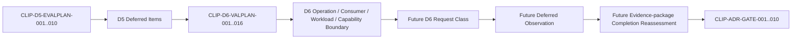

# Clipboard Integration D6 Deferred Validation Documentary Package

## Document Control

| Field | Required value |
|---|---|
| Document ID | `RESEARCH-TECH-CLIPBOARD-025` |
| Title | Clipboard Integration D6 Deferred Validation Documentary Package |
| Status | Draft |
| Research Type | Deferred Validation Documentary Package |
| Technology Decision | TD-004 Clipboard Integration |
| Package | `CLIP-EVIDPKG-007` |
| Acquisition Stage | D6 — Deferred Validation Evidence |
| Parent D5 Package | `RESEARCH-TECH-CLIPBOARD-024` |
| Parent D4 Package | `RESEARCH-TECH-CLIPBOARD-023` |
| Parent D3 Package | `RESEARCH-TECH-CLIPBOARD-022` |
| Parent Package Specification | `RESEARCH-TECH-CLIPBOARD-018` |
| Covered Deferred Items | 16 D5 deferred items |
| Deferred Validation Execution | Not started |
| Extended Consumer Created／Launched | No |
| Large／Stress Payload Created | No |
| Clipboard Publication／Read／Clear | Not performed |
| Clipboard History／Cloud | Not accessed |
| Cross-device Operation | Not performed |
| Performance／Stress Observation | Not created |
| Persistent Evidence | Not created |
| Authorization Request | Not created |
| Request ID | Not created |
| Human Authorization Decision | Not made |
| Candidate Ranking／Selection | Not performed |
| Technology Recommendation／Decision | Not made |
| Clipboard ADR | Not created |
| Owner | TBD |
| Last reviewed | Not reviewed |

## 1. Purpose

This package answers only which independent documents, authority boundaries, observations, privacy controls, stop rules, cleanup rules, and future evidence classes are needed for the sixteen items explicitly deferred by D5.

This is a D6 Deferred Validation Documentary Package. It is not deferred validation execution, performance or stress testing, Extended Consumer creation, Clipboard History or Cloud operation, cross-device operation, runtime Observation, an Authorization Request, a Candidate comparison, a Technology Decision, or a Clipboard ADR.

No Consumer, workload, payload, project, package, output, log, Observation, Evidence, or source code is created. No D6 operation is authorized or executed.

## 2. Source Preservation

Preserved sources: `RESEARCH-TECH-CLIPBOARD-016..024`; `CLIP-D5-EVALPLAN-001..010`; `CLIP-D5-OPDOC-001..009`; `CLIP-D5-FIDQ-001..010`; `CLIP-D4-RUNPLAN-001..010`; `CLIP-D3-PAIRPLAN-001..010`; `CLIP-D2-SYNTHSPEC-001`; `CLIP-D2-FMTPROFILE-001..003`; `CLIP-D2-CONSPEC-001..003`; `CLIP-OPT-001..005`; `CLIP-PAIR-001..010`; `CLIP-DEC-CRIT-001..012`; `CLIP-DEC-GAP-001..020`; `CLIP-ADR-GATE-001..010`; `CLIP-EVIDPKG-007`.

Upstream status, Deferred items, Decision Gaps, ADR Gates, Candidates, Pairs, Profiles, and Consumer Specifications are not modified. D6 does not elevate deferred evidence into a minimum requirement without an actual hard constraint.

## 3. Controlled Vocabulary

| Vocabulary | Allowed values used in this package |
|---|---|
| D6 Documentary Status | Fully specified; Partially specified; Blocked by documentary ambiguity; Deferred by design; Not applicable |
| Validation Priority | Post-minimum-comparison validation; Final-decision validation; Release-readiness validation; Optional research; Not applicable |
| Evidence State | Static specification only; Pending minimum runtime evidence; Pending consumer evidence; Pending deferred validation evidence; Deferred; Not applicable |
| Minimum-decision Effect | Does not block minimum comparison; Conditionally blocks minimum comparison; Blocks minimum comparison by hard requirement; Not applicable |
| Current authorization | Not granted |
| Execution permitted | No |
| Validation state | Not executed |

Every D6 Plan is documentary. No runtime conclusion, interoperability conclusion, durability conclusion, selection conclusion, or release conclusion is made.

## 4. D6 Deferred-validation Binding

| Plan ID | Deferred validation subject |
|---|---|
| `CLIP-D6-VALPLAN-001` | Office Consumer |
| `CLIP-D6-VALPLAN-002` | Browser Consumer |
| `CLIP-D6-VALPLAN-003` | Image-editor Consumer |
| `CLIP-D6-VALPLAN-004` | Full Consumer Application Matrix |
| `CLIP-D6-VALPLAN-005` | Large-image Performance |
| `CLIP-D6-VALPLAN-006` | Repeated Publication／Consumption Loops |
| `CLIP-D6-VALPLAN-007` | Full Contention Matrix |
| `CLIP-D6-VALPLAN-008` | Final Retry Policy Evidence |
| `CLIP-D6-VALPLAN-009` | Long-running Producer Lifetime |
| `CLIP-D6-VALPLAN-010` | Long-running Consumer Lifetime |
| `CLIP-D6-VALPLAN-011` | Abnormal Termination Stress |
| `CLIP-D6-VALPLAN-012` | Memory／Handle／Resource Stability |
| `CLIP-D6-VALPLAN-013` | Packaged／Unpackaged Comparison |
| `CLIP-D6-VALPLAN-014` | Clipboard History |
| `CLIP-D6-VALPLAN-015` | Cloud Clipboard |
| `CLIP-D6-VALPLAN-016` | Cross-device Behavior |

Each D5 Deferred Item maps one-to-one to one D6 Plan. No Plan 017 exists. A Plan does not authorize validation.

## 5. D6 Validation Plan Field Contract

The following field set is required in every D6 Plan. Values remain documentary and current state remains unexecuted.

### `CLIP-D6-VALPLAN-001`

| Field | Value |
|---|---|
| D6 Validation Plan ID | `CLIP-D6-VALPLAN-001` |
| Deferred validation subject | Office Consumer |
| Source D5 deferred item | `CLIP-D5-DEFER-001` documentary binding |
| Related D5 Evaluation Plans | `CLIP-D5-EVALPLAN-001..010` as applicable |
| Related D4 Runtime Plans | `CLIP-D4-RUNPLAN-001..010` as applicable |
| Related Candidate–Host Pairs | `CLIP-PAIR-001..010` as applicable |
| Related Candidates | `CLIP-OPT-001..005` as applicable; no ranking |
| Related Consumer Specifications | `CLIP-D2-CONSPEC-001..003` where source-bound |
| Related Publication Profiles | `CLIP-D2-FMTPROFILE-001..003` where source-bound |
| Related Decision Criteria | `CLIP-DEC-CRIT-001..012` as applicable |
| Related Decision Gaps | `CLIP-DEC-GAP-001..020` as applicable |
| Related ADR Gates | `CLIP-ADR-GATE-001..010` as applicable |
| Why deferred from minimum D5 | D5 bounded the minimum comparison and deferred this broader validation scope. |
| Why validation may still be required | The deferred subject may affect final-decision or release-readiness questions. |
| Minimum-decision effect | Does not block minimum comparison |
| Final-decision effect | May inform final-decision validation |
| Release-readiness effect | May inform release-readiness validation |
| Validation priority | Post-minimum-comparison validation |
| Required prerequisite evidence | D1, D3, D4, D5, and the named future authority |
| Required future document class | A separately authorized D6 request and operation package |
| Required operation classes | `CLIP-D6-OPDOC-001..010` as applicable |
| Required Consumer class | One named Extended Consumer class |
| Required workload class | Bounded workload class as applicable |
| Required repetition class | Single bounded operation unless the future Request expands it |
| Required packaging mode | Not applicable unless explicitly mapped |
| Required contention class | Not applicable unless contention is the subject |
| Required retry-policy question | Not applicable unless retry is the subject |
| Required lifetime scenario | Not applicable unless lifetime is the subject |
| Required termination scenario | Not applicable unless termination is the subject |
| Required resource metrics | Not applicable unless resource observation is the subject |
| Required History capability | No History access |
| Required Cloud capability | No Cloud access |
| Required cross-device capability | No cross-device access |
| Required network boundary | No network in this package; future use requires separate authority |
| Required account／identity boundary | No account, SID, token, credential, or device identity |
| Required elevation boundary | No elevation |
| Required synthetic-input boundary | `CLIP-D2-SYNTHSPEC-001` or a future explicitly defined workload only |
| Required Clipboard Write boundary | Future separately authorized bounded publication only |
| Required Clipboard Consumer Read boundary | Future separately authorized isolated minimum read only |
| Required Clipboard Clear boundary | Not included unless independently authorized |
| Required existing-Clipboard boundary | No unrelated existing Clipboard inspection |
| Required private-data boundary | No private Clipboard or screenshot content |
| Required process boundary | Only a named isolated future process boundary |
| Required mutation boundary | No repository, product, setting, package, account, or Clipboard-setting mutation |
| Required isolation boundary | Product, Producer, Consumer, workload, observation, and Evidence boundaries remain separate |
| Required Session Observation | Section 20 sanitized Session Observation contract |
| Required Persistent Evidence | Separate future Evidence authority only |
| Persistent Evidence authority | Separately required |
| Privacy controls | Sections 22–24; no private content or unbounded logs |
| Stop conditions | Any unresolved prerequisite, scope, privacy, authority, network, identity, or cleanup condition |
| Cleanup boundary | Independent future cleanup only |
| Rollback boundary | No automatic rollback; future operation must define a bounded rollback |
| Prohibited fallback | No retry, scope expansion, substitution, login, network enablement, elevation, or raw persistence |
| Prohibited inference | No performance, interoperability, durability, superiority, or release conclusion |
| Current authorization | Not granted |
| Execution permitted | No |
| Validation state | Not executed |
| Owner | TBD |
| Documentary status | Fully specified |
| Open questions | Which exact future Request, authority, workload, process, observation, and persistence boundary will be approved? |

### `CLIP-D6-VALPLAN-002`

| Field | Value |
|---|---|
| D6 Validation Plan ID | `CLIP-D6-VALPLAN-002` |
| Deferred validation subject | Browser Consumer |
| Source D5 deferred item | `CLIP-D5-DEFER-002` documentary binding |
| Related D5 Evaluation Plans | `CLIP-D5-EVALPLAN-001..010` as applicable |
| Related D4 Runtime Plans | `CLIP-D4-RUNPLAN-001..010` as applicable |
| Related Candidate–Host Pairs | `CLIP-PAIR-001..010` as applicable |
| Related Candidates | `CLIP-OPT-001..005` as applicable; no ranking |
| Related Consumer Specifications | `CLIP-D2-CONSPEC-001..003` where source-bound |
| Related Publication Profiles | `CLIP-D2-FMTPROFILE-001..003` where source-bound |
| Related Decision Criteria | `CLIP-DEC-CRIT-001..012` as applicable |
| Related Decision Gaps | `CLIP-DEC-GAP-001..020` as applicable |
| Related ADR Gates | `CLIP-ADR-GATE-001..010` as applicable |
| Why deferred from minimum D5 | D5 bounded the minimum comparison and deferred this broader validation scope. |
| Why validation may still be required | The deferred subject may affect final-decision or release-readiness questions. |
| Minimum-decision effect | Does not block minimum comparison |
| Final-decision effect | May inform final-decision validation |
| Release-readiness effect | May inform release-readiness validation |
| Validation priority | Post-minimum-comparison validation |
| Required prerequisite evidence | D1, D3, D4, D5, and the named future authority |
| Required future document class | A separately authorized D6 request and operation package |
| Required operation classes | `CLIP-D6-OPDOC-001..010` as applicable |
| Required Consumer class | One named Extended Consumer class |
| Required workload class | Bounded workload class as applicable |
| Required repetition class | Single bounded operation unless the future Request expands it |
| Required packaging mode | Not applicable unless explicitly mapped |
| Required contention class | Not applicable unless contention is the subject |
| Required retry-policy question | Not applicable unless retry is the subject |
| Required lifetime scenario | Not applicable unless lifetime is the subject |
| Required termination scenario | Not applicable unless termination is the subject |
| Required resource metrics | Not applicable unless resource observation is the subject |
| Required History capability | No History access |
| Required Cloud capability | No Cloud access |
| Required cross-device capability | No cross-device access |
| Required network boundary | No network in this package; future use requires separate authority |
| Required account／identity boundary | No account, SID, token, credential, or device identity |
| Required elevation boundary | No elevation |
| Required synthetic-input boundary | `CLIP-D2-SYNTHSPEC-001` or a future explicitly defined workload only |
| Required Clipboard Write boundary | Future separately authorized bounded publication only |
| Required Clipboard Consumer Read boundary | Future separately authorized isolated minimum read only |
| Required Clipboard Clear boundary | Not included unless independently authorized |
| Required existing-Clipboard boundary | No unrelated existing Clipboard inspection |
| Required private-data boundary | No private Clipboard or screenshot content |
| Required process boundary | Only a named isolated future process boundary |
| Required mutation boundary | No repository, product, setting, package, account, or Clipboard-setting mutation |
| Required isolation boundary | Product, Producer, Consumer, workload, observation, and Evidence boundaries remain separate |
| Required Session Observation | Section 20 sanitized Session Observation contract |
| Required Persistent Evidence | Separate future Evidence authority only |
| Persistent Evidence authority | Separately required |
| Privacy controls | Sections 22–24; no private content or unbounded logs |
| Stop conditions | Any unresolved prerequisite, scope, privacy, authority, network, identity, or cleanup condition |
| Cleanup boundary | Independent future cleanup only |
| Rollback boundary | No automatic rollback; future operation must define a bounded rollback |
| Prohibited fallback | No retry, scope expansion, substitution, login, network enablement, elevation, or raw persistence |
| Prohibited inference | No performance, interoperability, durability, superiority, or release conclusion |
| Current authorization | Not granted |
| Execution permitted | No |
| Validation state | Not executed |
| Owner | TBD |
| Documentary status | Fully specified |
| Open questions | Which exact future Request, authority, workload, process, observation, and persistence boundary will be approved? |

### `CLIP-D6-VALPLAN-003`

| Field | Value |
|---|---|
| D6 Validation Plan ID | `CLIP-D6-VALPLAN-003` |
| Deferred validation subject | Image-editor Consumer |
| Source D5 deferred item | `CLIP-D5-DEFER-003` documentary binding |
| Related D5 Evaluation Plans | `CLIP-D5-EVALPLAN-001..010` as applicable |
| Related D4 Runtime Plans | `CLIP-D4-RUNPLAN-001..010` as applicable |
| Related Candidate–Host Pairs | `CLIP-PAIR-001..010` as applicable |
| Related Candidates | `CLIP-OPT-001..005` as applicable; no ranking |
| Related Consumer Specifications | `CLIP-D2-CONSPEC-001..003` where source-bound |
| Related Publication Profiles | `CLIP-D2-FMTPROFILE-001..003` where source-bound |
| Related Decision Criteria | `CLIP-DEC-CRIT-001..012` as applicable |
| Related Decision Gaps | `CLIP-DEC-GAP-001..020` as applicable |
| Related ADR Gates | `CLIP-ADR-GATE-001..010` as applicable |
| Why deferred from minimum D5 | D5 bounded the minimum comparison and deferred this broader validation scope. |
| Why validation may still be required | The deferred subject may affect final-decision or release-readiness questions. |
| Minimum-decision effect | Does not block minimum comparison |
| Final-decision effect | May inform final-decision validation |
| Release-readiness effect | May inform release-readiness validation |
| Validation priority | Post-minimum-comparison validation |
| Required prerequisite evidence | D1, D3, D4, D5, and the named future authority |
| Required future document class | A separately authorized D6 request and operation package |
| Required operation classes | `CLIP-D6-OPDOC-001..010` as applicable |
| Required Consumer class | One named Extended Consumer class |
| Required workload class | Bounded workload class as applicable |
| Required repetition class | Single bounded operation unless the future Request expands it |
| Required packaging mode | Not applicable unless explicitly mapped |
| Required contention class | Not applicable unless contention is the subject |
| Required retry-policy question | Not applicable unless retry is the subject |
| Required lifetime scenario | Not applicable unless lifetime is the subject |
| Required termination scenario | Not applicable unless termination is the subject |
| Required resource metrics | Not applicable unless resource observation is the subject |
| Required History capability | No History access |
| Required Cloud capability | No Cloud access |
| Required cross-device capability | No cross-device access |
| Required network boundary | No network in this package; future use requires separate authority |
| Required account／identity boundary | No account, SID, token, credential, or device identity |
| Required elevation boundary | No elevation |
| Required synthetic-input boundary | `CLIP-D2-SYNTHSPEC-001` or a future explicitly defined workload only |
| Required Clipboard Write boundary | Future separately authorized bounded publication only |
| Required Clipboard Consumer Read boundary | Future separately authorized isolated minimum read only |
| Required Clipboard Clear boundary | Not included unless independently authorized |
| Required existing-Clipboard boundary | No unrelated existing Clipboard inspection |
| Required private-data boundary | No private Clipboard or screenshot content |
| Required process boundary | Only a named isolated future process boundary |
| Required mutation boundary | No repository, product, setting, package, account, or Clipboard-setting mutation |
| Required isolation boundary | Product, Producer, Consumer, workload, observation, and Evidence boundaries remain separate |
| Required Session Observation | Section 20 sanitized Session Observation contract |
| Required Persistent Evidence | Separate future Evidence authority only |
| Persistent Evidence authority | Separately required |
| Privacy controls | Sections 22–24; no private content or unbounded logs |
| Stop conditions | Any unresolved prerequisite, scope, privacy, authority, network, identity, or cleanup condition |
| Cleanup boundary | Independent future cleanup only |
| Rollback boundary | No automatic rollback; future operation must define a bounded rollback |
| Prohibited fallback | No retry, scope expansion, substitution, login, network enablement, elevation, or raw persistence |
| Prohibited inference | No performance, interoperability, durability, superiority, or release conclusion |
| Current authorization | Not granted |
| Execution permitted | No |
| Validation state | Not executed |
| Owner | TBD |
| Documentary status | Fully specified |
| Open questions | Which exact future Request, authority, workload, process, observation, and persistence boundary will be approved? |

### `CLIP-D6-VALPLAN-004`

| Field | Value |
|---|---|
| D6 Validation Plan ID | `CLIP-D6-VALPLAN-004` |
| Deferred validation subject | Full Consumer Application Matrix |
| Source D5 deferred item | `CLIP-D5-DEFER-004` documentary binding |
| Related D5 Evaluation Plans | `CLIP-D5-EVALPLAN-001..010` as applicable |
| Related D4 Runtime Plans | `CLIP-D4-RUNPLAN-001..010` as applicable |
| Related Candidate–Host Pairs | `CLIP-PAIR-001..010` as applicable |
| Related Candidates | `CLIP-OPT-001..005` as applicable; no ranking |
| Related Consumer Specifications | `CLIP-D2-CONSPEC-001..003` where source-bound |
| Related Publication Profiles | `CLIP-D2-FMTPROFILE-001..003` where source-bound |
| Related Decision Criteria | `CLIP-DEC-CRIT-001..012` as applicable |
| Related Decision Gaps | `CLIP-DEC-GAP-001..020` as applicable |
| Related ADR Gates | `CLIP-ADR-GATE-001..010` as applicable |
| Why deferred from minimum D5 | D5 bounded the minimum comparison and deferred this broader validation scope. |
| Why validation may still be required | The deferred subject may affect final-decision or release-readiness questions. |
| Minimum-decision effect | Does not block minimum comparison |
| Final-decision effect | May inform final-decision validation |
| Release-readiness effect | May inform release-readiness validation |
| Validation priority | Post-minimum-comparison validation |
| Required prerequisite evidence | D1, D3, D4, D5, and the named future authority |
| Required future document class | A separately authorized D6 request and operation package |
| Required operation classes | `CLIP-D6-OPDOC-001..010` as applicable |
| Required Consumer class | One named Extended Consumer class |
| Required workload class | Bounded workload class as applicable |
| Required repetition class | Single bounded operation unless the future Request expands it |
| Required packaging mode | Not applicable unless explicitly mapped |
| Required contention class | Not applicable unless contention is the subject |
| Required retry-policy question | Not applicable unless retry is the subject |
| Required lifetime scenario | Not applicable unless lifetime is the subject |
| Required termination scenario | Not applicable unless termination is the subject |
| Required resource metrics | Not applicable unless resource observation is the subject |
| Required History capability | No History access |
| Required Cloud capability | No Cloud access |
| Required cross-device capability | No cross-device access |
| Required network boundary | No network in this package; future use requires separate authority |
| Required account／identity boundary | No account, SID, token, credential, or device identity |
| Required elevation boundary | No elevation |
| Required synthetic-input boundary | `CLIP-D2-SYNTHSPEC-001` or a future explicitly defined workload only |
| Required Clipboard Write boundary | Future separately authorized bounded publication only |
| Required Clipboard Consumer Read boundary | Future separately authorized isolated minimum read only |
| Required Clipboard Clear boundary | Not included unless independently authorized |
| Required existing-Clipboard boundary | No unrelated existing Clipboard inspection |
| Required private-data boundary | No private Clipboard or screenshot content |
| Required process boundary | Only a named isolated future process boundary |
| Required mutation boundary | No repository, product, setting, package, account, or Clipboard-setting mutation |
| Required isolation boundary | Product, Producer, Consumer, workload, observation, and Evidence boundaries remain separate |
| Required Session Observation | Section 20 sanitized Session Observation contract |
| Required Persistent Evidence | Separate future Evidence authority only |
| Persistent Evidence authority | Separately required |
| Privacy controls | Sections 22–24; no private content or unbounded logs |
| Stop conditions | Any unresolved prerequisite, scope, privacy, authority, network, identity, or cleanup condition |
| Cleanup boundary | Independent future cleanup only |
| Rollback boundary | No automatic rollback; future operation must define a bounded rollback |
| Prohibited fallback | No retry, scope expansion, substitution, login, network enablement, elevation, or raw persistence |
| Prohibited inference | No performance, interoperability, durability, superiority, or release conclusion |
| Current authorization | Not granted |
| Execution permitted | No |
| Validation state | Not executed |
| Owner | TBD |
| Documentary status | Fully specified |
| Open questions | Which exact future Request, authority, workload, process, observation, and persistence boundary will be approved? |

### `CLIP-D6-VALPLAN-005`

| Field | Value |
|---|---|
| D6 Validation Plan ID | `CLIP-D6-VALPLAN-005` |
| Deferred validation subject | Large-image Performance |
| Source D5 deferred item | `CLIP-D5-DEFER-005` documentary binding |
| Related D5 Evaluation Plans | `CLIP-D5-EVALPLAN-001..010` as applicable |
| Related D4 Runtime Plans | `CLIP-D4-RUNPLAN-001..010` as applicable |
| Related Candidate–Host Pairs | `CLIP-PAIR-001..010` as applicable |
| Related Candidates | `CLIP-OPT-001..005` as applicable; no ranking |
| Related Consumer Specifications | `CLIP-D2-CONSPEC-001..003` where source-bound |
| Related Publication Profiles | `CLIP-D2-FMTPROFILE-001..003` where source-bound |
| Related Decision Criteria | `CLIP-DEC-CRIT-001..012` as applicable |
| Related Decision Gaps | `CLIP-DEC-GAP-001..020` as applicable |
| Related ADR Gates | `CLIP-ADR-GATE-001..010` as applicable |
| Why deferred from minimum D5 | D5 bounded the minimum comparison and deferred this broader validation scope. |
| Why validation may still be required | The deferred subject may affect final-decision or release-readiness questions. |
| Minimum-decision effect | Does not block minimum comparison |
| Final-decision effect | Deferred evidence may inform a future final decision |
| Release-readiness effect | May inform release-readiness validation |
| Validation priority | Post-minimum-comparison validation |
| Required prerequisite evidence | D1, D3, D4, D5, and the named future authority |
| Required future document class | A separately authorized D6 request and operation package |
| Required operation classes | `CLIP-D6-OPDOC-001..010` as applicable |
| Required Consumer class | Only where the deferred subject requires a Consumer |
| Required workload class | `CLIP-D6-WORKLOAD-002` |
| Required repetition class | Single bounded operation unless the future Request expands it |
| Required packaging mode | Not applicable unless explicitly mapped |
| Required contention class | Not applicable unless contention is the subject |
| Required retry-policy question | Not applicable unless retry is the subject |
| Required lifetime scenario | Not applicable unless lifetime is the subject |
| Required termination scenario | Not applicable unless termination is the subject |
| Required resource metrics | Not applicable unless resource observation is the subject |
| Required History capability | No History access |
| Required Cloud capability | No Cloud access |
| Required cross-device capability | No cross-device access |
| Required network boundary | No network in this package; future use requires separate authority |
| Required account／identity boundary | No account, SID, token, credential, or device identity |
| Required elevation boundary | No elevation |
| Required synthetic-input boundary | `CLIP-D2-SYNTHSPEC-001` or a future explicitly defined workload only |
| Required Clipboard Write boundary | Future separately authorized bounded publication only |
| Required Clipboard Consumer Read boundary | Future separately authorized isolated minimum read only |
| Required Clipboard Clear boundary | Not included unless independently authorized |
| Required existing-Clipboard boundary | No unrelated existing Clipboard inspection |
| Required private-data boundary | No private Clipboard or screenshot content |
| Required process boundary | Only a named isolated future process boundary |
| Required mutation boundary | No repository, product, setting, package, account, or Clipboard-setting mutation |
| Required isolation boundary | Product, Producer, Consumer, workload, observation, and Evidence boundaries remain separate |
| Required Session Observation | Section 20 sanitized Session Observation contract |
| Required Persistent Evidence | Separate future Evidence authority only |
| Persistent Evidence authority | Separately required |
| Privacy controls | Sections 22–24; no private content or unbounded logs |
| Stop conditions | Any unresolved prerequisite, scope, privacy, authority, network, identity, or cleanup condition |
| Cleanup boundary | Independent future cleanup only |
| Rollback boundary | No automatic rollback; future operation must define a bounded rollback |
| Prohibited fallback | No retry, scope expansion, substitution, login, network enablement, elevation, or raw persistence |
| Prohibited inference | No performance, interoperability, durability, superiority, or release conclusion |
| Current authorization | Not granted |
| Execution permitted | No |
| Validation state | Not executed |
| Owner | TBD |
| Documentary status | Fully specified |
| Open questions | Which exact future Request, authority, workload, process, observation, and persistence boundary will be approved? |

### `CLIP-D6-VALPLAN-006`

| Field | Value |
|---|---|
| D6 Validation Plan ID | `CLIP-D6-VALPLAN-006` |
| Deferred validation subject | Repeated Publication／Consumption Loops |
| Source D5 deferred item | `CLIP-D5-DEFER-006` documentary binding |
| Related D5 Evaluation Plans | `CLIP-D5-EVALPLAN-001..010` as applicable |
| Related D4 Runtime Plans | `CLIP-D4-RUNPLAN-001..010` as applicable |
| Related Candidate–Host Pairs | `CLIP-PAIR-001..010` as applicable |
| Related Candidates | `CLIP-OPT-001..005` as applicable; no ranking |
| Related Consumer Specifications | `CLIP-D2-CONSPEC-001..003` where source-bound |
| Related Publication Profiles | `CLIP-D2-FMTPROFILE-001..003` where source-bound |
| Related Decision Criteria | `CLIP-DEC-CRIT-001..012` as applicable |
| Related Decision Gaps | `CLIP-DEC-GAP-001..020` as applicable |
| Related ADR Gates | `CLIP-ADR-GATE-001..010` as applicable |
| Why deferred from minimum D5 | D5 bounded the minimum comparison and deferred this broader validation scope. |
| Why validation may still be required | The deferred subject may affect final-decision or release-readiness questions. |
| Minimum-decision effect | Does not block minimum comparison |
| Final-decision effect | Deferred evidence may inform a future final decision |
| Release-readiness effect | May inform release-readiness validation |
| Validation priority | Post-minimum-comparison validation |
| Required prerequisite evidence | D1, D3, D4, D5, and the named future authority |
| Required future document class | A separately authorized D6 request and operation package |
| Required operation classes | `CLIP-D6-OPDOC-001..010` as applicable |
| Required Consumer class | Only where the deferred subject requires a Consumer |
| Required workload class | Bounded workload class as applicable |
| Required repetition class | Bounded repeated or duration class as authorized |
| Required packaging mode | Not applicable unless explicitly mapped |
| Required contention class | Not applicable unless contention is the subject |
| Required retry-policy question | Not applicable unless retry is the subject |
| Required lifetime scenario | Not applicable unless lifetime is the subject |
| Required termination scenario | Not applicable unless termination is the subject |
| Required resource metrics | Not applicable unless resource observation is the subject |
| Required History capability | No History access |
| Required Cloud capability | No Cloud access |
| Required cross-device capability | No cross-device access |
| Required network boundary | No network in this package; future use requires separate authority |
| Required account／identity boundary | No account, SID, token, credential, or device identity |
| Required elevation boundary | No elevation |
| Required synthetic-input boundary | `CLIP-D2-SYNTHSPEC-001` or a future explicitly defined workload only |
| Required Clipboard Write boundary | Future separately authorized bounded publication only |
| Required Clipboard Consumer Read boundary | Future separately authorized isolated minimum read only |
| Required Clipboard Clear boundary | Not included unless independently authorized |
| Required existing-Clipboard boundary | No unrelated existing Clipboard inspection |
| Required private-data boundary | No private Clipboard or screenshot content |
| Required process boundary | Only a named isolated future process boundary |
| Required mutation boundary | No repository, product, setting, package, account, or Clipboard-setting mutation |
| Required isolation boundary | Product, Producer, Consumer, workload, observation, and Evidence boundaries remain separate |
| Required Session Observation | Section 20 sanitized Session Observation contract |
| Required Persistent Evidence | Separate future Evidence authority only |
| Persistent Evidence authority | Separately required |
| Privacy controls | Sections 22–24; no private content or unbounded logs |
| Stop conditions | Any unresolved prerequisite, scope, privacy, authority, network, identity, or cleanup condition |
| Cleanup boundary | Independent future cleanup only |
| Rollback boundary | No automatic rollback; future operation must define a bounded rollback |
| Prohibited fallback | No retry, scope expansion, substitution, login, network enablement, elevation, or raw persistence |
| Prohibited inference | No performance, interoperability, durability, superiority, or release conclusion |
| Current authorization | Not granted |
| Execution permitted | No |
| Validation state | Not executed |
| Owner | TBD |
| Documentary status | Fully specified |
| Open questions | Which exact future Request, authority, workload, process, observation, and persistence boundary will be approved? |

### `CLIP-D6-VALPLAN-007`

| Field | Value |
|---|---|
| D6 Validation Plan ID | `CLIP-D6-VALPLAN-007` |
| Deferred validation subject | Full Contention Matrix |
| Source D5 deferred item | `CLIP-D5-DEFER-007` documentary binding |
| Related D5 Evaluation Plans | `CLIP-D5-EVALPLAN-001..010` as applicable |
| Related D4 Runtime Plans | `CLIP-D4-RUNPLAN-001..010` as applicable |
| Related Candidate–Host Pairs | `CLIP-PAIR-001..010` as applicable |
| Related Candidates | `CLIP-OPT-001..005` as applicable; no ranking |
| Related Consumer Specifications | `CLIP-D2-CONSPEC-001..003` where source-bound |
| Related Publication Profiles | `CLIP-D2-FMTPROFILE-001..003` where source-bound |
| Related Decision Criteria | `CLIP-DEC-CRIT-001..012` as applicable |
| Related Decision Gaps | `CLIP-DEC-GAP-001..020` as applicable |
| Related ADR Gates | `CLIP-ADR-GATE-001..010` as applicable |
| Why deferred from minimum D5 | D5 bounded the minimum comparison and deferred this broader validation scope. |
| Why validation may still be required | The deferred subject may affect final-decision or release-readiness questions. |
| Minimum-decision effect | Does not block minimum comparison |
| Final-decision effect | Deferred evidence may inform a future final decision |
| Release-readiness effect | May inform release-readiness validation |
| Validation priority | Post-minimum-comparison validation |
| Required prerequisite evidence | D1, D3, D4, D5, and the named future authority |
| Required future document class | A separately authorized D6 request and operation package |
| Required operation classes | `CLIP-D6-OPDOC-001..010` as applicable |
| Required Consumer class | Only where the deferred subject requires a Consumer |
| Required workload class | Bounded workload class as applicable |
| Required repetition class | Single bounded operation unless the future Request expands it |
| Required packaging mode | Not applicable unless explicitly mapped |
| Required contention class | Full bounded contention scenarios |
| Required retry-policy question | Not applicable unless retry is the subject |
| Required lifetime scenario | Not applicable unless lifetime is the subject |
| Required termination scenario | Not applicable unless termination is the subject |
| Required resource metrics | Not applicable unless resource observation is the subject |
| Required History capability | No History access |
| Required Cloud capability | No Cloud access |
| Required cross-device capability | No cross-device access |
| Required network boundary | No network in this package; future use requires separate authority |
| Required account／identity boundary | No account, SID, token, credential, or device identity |
| Required elevation boundary | No elevation |
| Required synthetic-input boundary | `CLIP-D2-SYNTHSPEC-001` or a future explicitly defined workload only |
| Required Clipboard Write boundary | Future separately authorized bounded publication only |
| Required Clipboard Consumer Read boundary | Future separately authorized isolated minimum read only |
| Required Clipboard Clear boundary | Not included unless independently authorized |
| Required existing-Clipboard boundary | No unrelated existing Clipboard inspection |
| Required private-data boundary | No private Clipboard or screenshot content |
| Required process boundary | Only a named isolated future process boundary |
| Required mutation boundary | No repository, product, setting, package, account, or Clipboard-setting mutation |
| Required isolation boundary | Product, Producer, Consumer, workload, observation, and Evidence boundaries remain separate |
| Required Session Observation | Section 20 sanitized Session Observation contract |
| Required Persistent Evidence | Separate future Evidence authority only |
| Persistent Evidence authority | Separately required |
| Privacy controls | Sections 22–24; no private content or unbounded logs |
| Stop conditions | Any unresolved prerequisite, scope, privacy, authority, network, identity, or cleanup condition |
| Cleanup boundary | Independent future cleanup only |
| Rollback boundary | No automatic rollback; future operation must define a bounded rollback |
| Prohibited fallback | No retry, scope expansion, substitution, login, network enablement, elevation, or raw persistence |
| Prohibited inference | No performance, interoperability, durability, superiority, or release conclusion |
| Current authorization | Not granted |
| Execution permitted | No |
| Validation state | Not executed |
| Owner | TBD |
| Documentary status | Fully specified |
| Open questions | Which exact future Request, authority, workload, process, observation, and persistence boundary will be approved? |

### `CLIP-D6-VALPLAN-008`

| Field | Value |
|---|---|
| D6 Validation Plan ID | `CLIP-D6-VALPLAN-008` |
| Deferred validation subject | Final Retry Policy Evidence |
| Source D5 deferred item | `CLIP-D5-DEFER-008` documentary binding |
| Related D5 Evaluation Plans | `CLIP-D5-EVALPLAN-001..010` as applicable |
| Related D4 Runtime Plans | `CLIP-D4-RUNPLAN-001..010` as applicable |
| Related Candidate–Host Pairs | `CLIP-PAIR-001..010` as applicable |
| Related Candidates | `CLIP-OPT-001..005` as applicable; no ranking |
| Related Consumer Specifications | `CLIP-D2-CONSPEC-001..003` where source-bound |
| Related Publication Profiles | `CLIP-D2-FMTPROFILE-001..003` where source-bound |
| Related Decision Criteria | `CLIP-DEC-CRIT-001..012` as applicable |
| Related Decision Gaps | `CLIP-DEC-GAP-001..020` as applicable |
| Related ADR Gates | `CLIP-ADR-GATE-001..010` as applicable |
| Why deferred from minimum D5 | D5 bounded the minimum comparison and deferred this broader validation scope. |
| Why validation may still be required | The deferred subject may affect final-decision or release-readiness questions. |
| Minimum-decision effect | Does not block minimum comparison |
| Final-decision effect | Deferred evidence may inform a future final decision |
| Release-readiness effect | May inform release-readiness validation |
| Validation priority | Post-minimum-comparison validation |
| Required prerequisite evidence | D1, D3, D4, D5, and the named future authority |
| Required future document class | A separately authorized D6 request and operation package |
| Required operation classes | `CLIP-D6-OPDOC-001..010` as applicable |
| Required Consumer class | Only where the deferred subject requires a Consumer |
| Required workload class | Bounded workload class as applicable |
| Required repetition class | Single bounded operation unless the future Request expands it |
| Required packaging mode | Not applicable unless explicitly mapped |
| Required contention class | Not applicable unless contention is the subject |
| Required retry-policy question | Eight bounded retry-policy questions |
| Required lifetime scenario | Not applicable unless lifetime is the subject |
| Required termination scenario | Not applicable unless termination is the subject |
| Required resource metrics | Not applicable unless resource observation is the subject |
| Required History capability | No History access |
| Required Cloud capability | No Cloud access |
| Required cross-device capability | No cross-device access |
| Required network boundary | No network in this package; future use requires separate authority |
| Required account／identity boundary | No account, SID, token, credential, or device identity |
| Required elevation boundary | No elevation |
| Required synthetic-input boundary | `CLIP-D2-SYNTHSPEC-001` or a future explicitly defined workload only |
| Required Clipboard Write boundary | Future separately authorized bounded publication only |
| Required Clipboard Consumer Read boundary | Future separately authorized isolated minimum read only |
| Required Clipboard Clear boundary | Not included unless independently authorized |
| Required existing-Clipboard boundary | No unrelated existing Clipboard inspection |
| Required private-data boundary | No private Clipboard or screenshot content |
| Required process boundary | Only a named isolated future process boundary |
| Required mutation boundary | No repository, product, setting, package, account, or Clipboard-setting mutation |
| Required isolation boundary | Product, Producer, Consumer, workload, observation, and Evidence boundaries remain separate |
| Required Session Observation | Section 20 sanitized Session Observation contract |
| Required Persistent Evidence | Separate future Evidence authority only |
| Persistent Evidence authority | Separately required |
| Privacy controls | Sections 22–24; no private content or unbounded logs |
| Stop conditions | Any unresolved prerequisite, scope, privacy, authority, network, identity, or cleanup condition |
| Cleanup boundary | Independent future cleanup only |
| Rollback boundary | No automatic rollback; future operation must define a bounded rollback |
| Prohibited fallback | No retry, scope expansion, substitution, login, network enablement, elevation, or raw persistence |
| Prohibited inference | No performance, interoperability, durability, superiority, or release conclusion |
| Current authorization | Not granted |
| Execution permitted | No |
| Validation state | Not executed |
| Owner | TBD |
| Documentary status | Fully specified |
| Open questions | Which exact future Request, authority, workload, process, observation, and persistence boundary will be approved? |

### `CLIP-D6-VALPLAN-009`

| Field | Value |
|---|---|
| D6 Validation Plan ID | `CLIP-D6-VALPLAN-009` |
| Deferred validation subject | Long-running Producer Lifetime |
| Source D5 deferred item | `CLIP-D5-DEFER-009` documentary binding |
| Related D5 Evaluation Plans | `CLIP-D5-EVALPLAN-001..010` as applicable |
| Related D4 Runtime Plans | `CLIP-D4-RUNPLAN-001..010` as applicable |
| Related Candidate–Host Pairs | `CLIP-PAIR-001..010` as applicable |
| Related Candidates | `CLIP-OPT-001..005` as applicable; no ranking |
| Related Consumer Specifications | `CLIP-D2-CONSPEC-001..003` where source-bound |
| Related Publication Profiles | `CLIP-D2-FMTPROFILE-001..003` where source-bound |
| Related Decision Criteria | `CLIP-DEC-CRIT-001..012` as applicable |
| Related Decision Gaps | `CLIP-DEC-GAP-001..020` as applicable |
| Related ADR Gates | `CLIP-ADR-GATE-001..010` as applicable |
| Why deferred from minimum D5 | D5 bounded the minimum comparison and deferred this broader validation scope. |
| Why validation may still be required | The deferred subject may affect final-decision or release-readiness questions. |
| Minimum-decision effect | Does not block minimum comparison |
| Final-decision effect | Deferred evidence may inform a future final decision |
| Release-readiness effect | May inform release-readiness validation |
| Validation priority | Release-readiness validation |
| Required prerequisite evidence | D1, D3, D4, D5, and the named future authority |
| Required future document class | A separately authorized D6 request and operation package |
| Required operation classes | `CLIP-D6-OPDOC-001..010` as applicable |
| Required Consumer class | Only where the deferred subject requires a Consumer |
| Required workload class | Bounded workload class as applicable |
| Required repetition class | Bounded repeated or duration class as authorized |
| Required packaging mode | Not applicable unless explicitly mapped |
| Required contention class | Not applicable unless contention is the subject |
| Required retry-policy question | Not applicable unless retry is the subject |
| Required lifetime scenario | Named lifetime scenario from Section 15 |
| Required termination scenario | Not applicable unless termination is the subject |
| Required resource metrics | Not applicable unless resource observation is the subject |
| Required History capability | No History access |
| Required Cloud capability | No Cloud access |
| Required cross-device capability | No cross-device access |
| Required network boundary | No network in this package; future use requires separate authority |
| Required account／identity boundary | No account, SID, token, credential, or device identity |
| Required elevation boundary | No elevation |
| Required synthetic-input boundary | `CLIP-D2-SYNTHSPEC-001` or a future explicitly defined workload only |
| Required Clipboard Write boundary | Future separately authorized bounded publication only |
| Required Clipboard Consumer Read boundary | Future separately authorized isolated minimum read only |
| Required Clipboard Clear boundary | Not included unless independently authorized |
| Required existing-Clipboard boundary | No unrelated existing Clipboard inspection |
| Required private-data boundary | No private Clipboard or screenshot content |
| Required process boundary | Only a named isolated future process boundary |
| Required mutation boundary | No repository, product, setting, package, account, or Clipboard-setting mutation |
| Required isolation boundary | Product, Producer, Consumer, workload, observation, and Evidence boundaries remain separate |
| Required Session Observation | Section 20 sanitized Session Observation contract |
| Required Persistent Evidence | Separate future Evidence authority only |
| Persistent Evidence authority | Separately required |
| Privacy controls | Sections 22–24; no private content or unbounded logs |
| Stop conditions | Any unresolved prerequisite, scope, privacy, authority, network, identity, or cleanup condition |
| Cleanup boundary | Independent future cleanup only |
| Rollback boundary | No automatic rollback; future operation must define a bounded rollback |
| Prohibited fallback | No retry, scope expansion, substitution, login, network enablement, elevation, or raw persistence |
| Prohibited inference | No performance, interoperability, durability, superiority, or release conclusion |
| Current authorization | Not granted |
| Execution permitted | No |
| Validation state | Not executed |
| Owner | TBD |
| Documentary status | Fully specified |
| Open questions | Which exact future Request, authority, workload, process, observation, and persistence boundary will be approved? |

### `CLIP-D6-VALPLAN-010`

| Field | Value |
|---|---|
| D6 Validation Plan ID | `CLIP-D6-VALPLAN-010` |
| Deferred validation subject | Long-running Consumer Lifetime |
| Source D5 deferred item | `CLIP-D5-DEFER-010` documentary binding |
| Related D5 Evaluation Plans | `CLIP-D5-EVALPLAN-001..010` as applicable |
| Related D4 Runtime Plans | `CLIP-D4-RUNPLAN-001..010` as applicable |
| Related Candidate–Host Pairs | `CLIP-PAIR-001..010` as applicable |
| Related Candidates | `CLIP-OPT-001..005` as applicable; no ranking |
| Related Consumer Specifications | `CLIP-D2-CONSPEC-001..003` where source-bound |
| Related Publication Profiles | `CLIP-D2-FMTPROFILE-001..003` where source-bound |
| Related Decision Criteria | `CLIP-DEC-CRIT-001..012` as applicable |
| Related Decision Gaps | `CLIP-DEC-GAP-001..020` as applicable |
| Related ADR Gates | `CLIP-ADR-GATE-001..010` as applicable |
| Why deferred from minimum D5 | D5 bounded the minimum comparison and deferred this broader validation scope. |
| Why validation may still be required | The deferred subject may affect final-decision or release-readiness questions. |
| Minimum-decision effect | Does not block minimum comparison |
| Final-decision effect | Deferred evidence may inform a future final decision |
| Release-readiness effect | May inform release-readiness validation |
| Validation priority | Release-readiness validation |
| Required prerequisite evidence | D1, D3, D4, D5, and the named future authority |
| Required future document class | A separately authorized D6 request and operation package |
| Required operation classes | `CLIP-D6-OPDOC-001..010` as applicable |
| Required Consumer class | Only where the deferred subject requires a Consumer |
| Required workload class | Bounded workload class as applicable |
| Required repetition class | Bounded repeated or duration class as authorized |
| Required packaging mode | Not applicable unless explicitly mapped |
| Required contention class | Not applicable unless contention is the subject |
| Required retry-policy question | Not applicable unless retry is the subject |
| Required lifetime scenario | Named lifetime scenario from Section 15 |
| Required termination scenario | Not applicable unless termination is the subject |
| Required resource metrics | Not applicable unless resource observation is the subject |
| Required History capability | No History access |
| Required Cloud capability | No Cloud access |
| Required cross-device capability | No cross-device access |
| Required network boundary | No network in this package; future use requires separate authority |
| Required account／identity boundary | No account, SID, token, credential, or device identity |
| Required elevation boundary | No elevation |
| Required synthetic-input boundary | `CLIP-D2-SYNTHSPEC-001` or a future explicitly defined workload only |
| Required Clipboard Write boundary | Future separately authorized bounded publication only |
| Required Clipboard Consumer Read boundary | Future separately authorized isolated minimum read only |
| Required Clipboard Clear boundary | Not included unless independently authorized |
| Required existing-Clipboard boundary | No unrelated existing Clipboard inspection |
| Required private-data boundary | No private Clipboard or screenshot content |
| Required process boundary | Only a named isolated future process boundary |
| Required mutation boundary | No repository, product, setting, package, account, or Clipboard-setting mutation |
| Required isolation boundary | Product, Producer, Consumer, workload, observation, and Evidence boundaries remain separate |
| Required Session Observation | Section 20 sanitized Session Observation contract |
| Required Persistent Evidence | Separate future Evidence authority only |
| Persistent Evidence authority | Separately required |
| Privacy controls | Sections 22–24; no private content or unbounded logs |
| Stop conditions | Any unresolved prerequisite, scope, privacy, authority, network, identity, or cleanup condition |
| Cleanup boundary | Independent future cleanup only |
| Rollback boundary | No automatic rollback; future operation must define a bounded rollback |
| Prohibited fallback | No retry, scope expansion, substitution, login, network enablement, elevation, or raw persistence |
| Prohibited inference | No performance, interoperability, durability, superiority, or release conclusion |
| Current authorization | Not granted |
| Execution permitted | No |
| Validation state | Not executed |
| Owner | TBD |
| Documentary status | Fully specified |
| Open questions | Which exact future Request, authority, workload, process, observation, and persistence boundary will be approved? |

### `CLIP-D6-VALPLAN-011`

| Field | Value |
|---|---|
| D6 Validation Plan ID | `CLIP-D6-VALPLAN-011` |
| Deferred validation subject | Abnormal Termination Stress |
| Source D5 deferred item | `CLIP-D5-DEFER-011` documentary binding |
| Related D5 Evaluation Plans | `CLIP-D5-EVALPLAN-001..010` as applicable |
| Related D4 Runtime Plans | `CLIP-D4-RUNPLAN-001..010` as applicable |
| Related Candidate–Host Pairs | `CLIP-PAIR-001..010` as applicable |
| Related Candidates | `CLIP-OPT-001..005` as applicable; no ranking |
| Related Consumer Specifications | `CLIP-D2-CONSPEC-001..003` where source-bound |
| Related Publication Profiles | `CLIP-D2-FMTPROFILE-001..003` where source-bound |
| Related Decision Criteria | `CLIP-DEC-CRIT-001..012` as applicable |
| Related Decision Gaps | `CLIP-DEC-GAP-001..020` as applicable |
| Related ADR Gates | `CLIP-ADR-GATE-001..010` as applicable |
| Why deferred from minimum D5 | D5 bounded the minimum comparison and deferred this broader validation scope. |
| Why validation may still be required | The deferred subject may affect final-decision or release-readiness questions. |
| Minimum-decision effect | Does not block minimum comparison |
| Final-decision effect | Deferred evidence may inform a future final decision |
| Release-readiness effect | May inform release-readiness validation |
| Validation priority | Release-readiness validation |
| Required prerequisite evidence | D1, D3, D4, D5, and the named future authority |
| Required future document class | A separately authorized D6 request and operation package |
| Required operation classes | `CLIP-D6-OPDOC-001..010` as applicable |
| Required Consumer class | Only where the deferred subject requires a Consumer |
| Required workload class | Bounded workload class as applicable |
| Required repetition class | Bounded repeated or duration class as authorized |
| Required packaging mode | Not applicable unless explicitly mapped |
| Required contention class | Not applicable unless contention is the subject |
| Required retry-policy question | Not applicable unless retry is the subject |
| Required lifetime scenario | Named lifetime scenario from Section 15 |
| Required termination scenario | Named abnormal termination scenario |
| Required resource metrics | Not applicable unless resource observation is the subject |
| Required History capability | No History access |
| Required Cloud capability | No Cloud access |
| Required cross-device capability | No cross-device access |
| Required network boundary | No network in this package; future use requires separate authority |
| Required account／identity boundary | No account, SID, token, credential, or device identity |
| Required elevation boundary | No elevation |
| Required synthetic-input boundary | `CLIP-D2-SYNTHSPEC-001` or a future explicitly defined workload only |
| Required Clipboard Write boundary | Future separately authorized bounded publication only |
| Required Clipboard Consumer Read boundary | Future separately authorized isolated minimum read only |
| Required Clipboard Clear boundary | Not included unless independently authorized |
| Required existing-Clipboard boundary | No unrelated existing Clipboard inspection |
| Required private-data boundary | No private Clipboard or screenshot content |
| Required process boundary | Only a named isolated future process boundary |
| Required mutation boundary | No repository, product, setting, package, account, or Clipboard-setting mutation |
| Required isolation boundary | Product, Producer, Consumer, workload, observation, and Evidence boundaries remain separate |
| Required Session Observation | Section 20 sanitized Session Observation contract |
| Required Persistent Evidence | Separate future Evidence authority only |
| Persistent Evidence authority | Separately required |
| Privacy controls | Sections 22–24; no private content or unbounded logs |
| Stop conditions | Any unresolved prerequisite, scope, privacy, authority, network, identity, or cleanup condition |
| Cleanup boundary | Independent future cleanup only |
| Rollback boundary | No automatic rollback; future operation must define a bounded rollback |
| Prohibited fallback | No retry, scope expansion, substitution, login, network enablement, elevation, or raw persistence |
| Prohibited inference | No performance, interoperability, durability, superiority, or release conclusion |
| Current authorization | Not granted |
| Execution permitted | No |
| Validation state | Not executed |
| Owner | TBD |
| Documentary status | Fully specified |
| Open questions | Which exact future Request, authority, workload, process, observation, and persistence boundary will be approved? |

### `CLIP-D6-VALPLAN-012`

| Field | Value |
|---|---|
| D6 Validation Plan ID | `CLIP-D6-VALPLAN-012` |
| Deferred validation subject | Memory／Handle／Resource Stability |
| Source D5 deferred item | `CLIP-D5-DEFER-012` documentary binding |
| Related D5 Evaluation Plans | `CLIP-D5-EVALPLAN-001..010` as applicable |
| Related D4 Runtime Plans | `CLIP-D4-RUNPLAN-001..010` as applicable |
| Related Candidate–Host Pairs | `CLIP-PAIR-001..010` as applicable |
| Related Candidates | `CLIP-OPT-001..005` as applicable; no ranking |
| Related Consumer Specifications | `CLIP-D2-CONSPEC-001..003` where source-bound |
| Related Publication Profiles | `CLIP-D2-FMTPROFILE-001..003` where source-bound |
| Related Decision Criteria | `CLIP-DEC-CRIT-001..012` as applicable |
| Related Decision Gaps | `CLIP-DEC-GAP-001..020` as applicable |
| Related ADR Gates | `CLIP-ADR-GATE-001..010` as applicable |
| Why deferred from minimum D5 | D5 bounded the minimum comparison and deferred this broader validation scope. |
| Why validation may still be required | The deferred subject may affect final-decision or release-readiness questions. |
| Minimum-decision effect | Does not block minimum comparison |
| Final-decision effect | Deferred evidence may inform a future final decision |
| Release-readiness effect | May inform release-readiness validation |
| Validation priority | Release-readiness validation |
| Required prerequisite evidence | D1, D3, D4, D5, and the named future authority |
| Required future document class | A separately authorized D6 request and operation package |
| Required operation classes | `CLIP-D6-OPDOC-001..010` as applicable |
| Required Consumer class | Only where the deferred subject requires a Consumer |
| Required workload class | Bounded workload class as applicable |
| Required repetition class | Bounded repeated or duration class as authorized |
| Required packaging mode | Not applicable unless explicitly mapped |
| Required contention class | Not applicable unless contention is the subject |
| Required retry-policy question | Not applicable unless retry is the subject |
| Required lifetime scenario | Named lifetime scenario from Section 15 |
| Required termination scenario | Not applicable unless termination is the subject |
| Required resource metrics | Sanitized resource categories from Section 16 |
| Required History capability | No History access |
| Required Cloud capability | No Cloud access |
| Required cross-device capability | No cross-device access |
| Required network boundary | No network in this package; future use requires separate authority |
| Required account／identity boundary | No account, SID, token, credential, or device identity |
| Required elevation boundary | No elevation |
| Required synthetic-input boundary | `CLIP-D2-SYNTHSPEC-001` or a future explicitly defined workload only |
| Required Clipboard Write boundary | Future separately authorized bounded publication only |
| Required Clipboard Consumer Read boundary | Future separately authorized isolated minimum read only |
| Required Clipboard Clear boundary | Not included unless independently authorized |
| Required existing-Clipboard boundary | No unrelated existing Clipboard inspection |
| Required private-data boundary | No private Clipboard or screenshot content |
| Required process boundary | Only a named isolated future process boundary |
| Required mutation boundary | No repository, product, setting, package, account, or Clipboard-setting mutation |
| Required isolation boundary | Product, Producer, Consumer, workload, observation, and Evidence boundaries remain separate |
| Required Session Observation | Section 20 sanitized Session Observation contract |
| Required Persistent Evidence | Separate future Evidence authority only |
| Persistent Evidence authority | Separately required |
| Privacy controls | Sections 22–24; no private content or unbounded logs |
| Stop conditions | Any unresolved prerequisite, scope, privacy, authority, network, identity, or cleanup condition |
| Cleanup boundary | Independent future cleanup only |
| Rollback boundary | No automatic rollback; future operation must define a bounded rollback |
| Prohibited fallback | No retry, scope expansion, substitution, login, network enablement, elevation, or raw persistence |
| Prohibited inference | No performance, interoperability, durability, superiority, or release conclusion |
| Current authorization | Not granted |
| Execution permitted | No |
| Validation state | Not executed |
| Owner | TBD |
| Documentary status | Fully specified |
| Open questions | Which exact future Request, authority, workload, process, observation, and persistence boundary will be approved? |

### `CLIP-D6-VALPLAN-013`

| Field | Value |
|---|---|
| D6 Validation Plan ID | `CLIP-D6-VALPLAN-013` |
| Deferred validation subject | Packaged／Unpackaged Comparison |
| Source D5 deferred item | `CLIP-D5-DEFER-013` documentary binding |
| Related D5 Evaluation Plans | `CLIP-D5-EVALPLAN-001..010` as applicable |
| Related D4 Runtime Plans | `CLIP-D4-RUNPLAN-001..010` as applicable |
| Related Candidate–Host Pairs | `CLIP-PAIR-001..010` as applicable |
| Related Candidates | `CLIP-OPT-001..005` as applicable; no ranking |
| Related Consumer Specifications | `CLIP-D2-CONSPEC-001..003` where source-bound |
| Related Publication Profiles | `CLIP-D2-FMTPROFILE-001..003` where source-bound |
| Related Decision Criteria | `CLIP-DEC-CRIT-001..012` as applicable |
| Related Decision Gaps | `CLIP-DEC-GAP-001..020` as applicable |
| Related ADR Gates | `CLIP-ADR-GATE-001..010` as applicable |
| Why deferred from minimum D5 | D5 bounded the minimum comparison and deferred this broader validation scope. |
| Why validation may still be required | The deferred subject may affect final-decision or release-readiness questions. |
| Minimum-decision effect | Does not block minimum comparison |
| Final-decision effect | Deferred evidence may inform a future final decision |
| Release-readiness effect | May inform release-readiness validation |
| Validation priority | Release-readiness validation |
| Required prerequisite evidence | D1, D3, D4, D5, and the named future authority |
| Required future document class | A separately authorized D6 request and operation package |
| Required operation classes | `CLIP-D6-OPDOC-001..010` as applicable |
| Required Consumer class | Only where the deferred subject requires a Consumer |
| Required workload class | Bounded workload class as applicable |
| Required repetition class | Bounded repeated or duration class as authorized |
| Required packaging mode | Unpackaged and Packaged as separately authorized |
| Required contention class | Not applicable unless contention is the subject |
| Required retry-policy question | Not applicable unless retry is the subject |
| Required lifetime scenario | Not applicable unless lifetime is the subject |
| Required termination scenario | Not applicable unless termination is the subject |
| Required resource metrics | Not applicable unless resource observation is the subject |
| Required History capability | No History access |
| Required Cloud capability | No Cloud access |
| Required cross-device capability | No cross-device access |
| Required network boundary | No network in this package; future use requires separate authority |
| Required account／identity boundary | No account, SID, token, credential, or device identity |
| Required elevation boundary | No elevation |
| Required synthetic-input boundary | `CLIP-D2-SYNTHSPEC-001` or a future explicitly defined workload only |
| Required Clipboard Write boundary | Future separately authorized bounded publication only |
| Required Clipboard Consumer Read boundary | Future separately authorized isolated minimum read only |
| Required Clipboard Clear boundary | Not included unless independently authorized |
| Required existing-Clipboard boundary | No unrelated existing Clipboard inspection |
| Required private-data boundary | No private Clipboard or screenshot content |
| Required process boundary | Only a named isolated future process boundary |
| Required mutation boundary | No repository, product, setting, package, account, or Clipboard-setting mutation |
| Required isolation boundary | Product, Producer, Consumer, workload, observation, and Evidence boundaries remain separate |
| Required Session Observation | Section 20 sanitized Session Observation contract |
| Required Persistent Evidence | Separate future Evidence authority only |
| Persistent Evidence authority | Separately required |
| Privacy controls | Sections 22–24; no private content or unbounded logs |
| Stop conditions | Any unresolved prerequisite, scope, privacy, authority, network, identity, or cleanup condition |
| Cleanup boundary | Independent future cleanup only |
| Rollback boundary | No automatic rollback; future operation must define a bounded rollback |
| Prohibited fallback | No retry, scope expansion, substitution, login, network enablement, elevation, or raw persistence |
| Prohibited inference | No performance, interoperability, durability, superiority, or release conclusion |
| Current authorization | Not granted |
| Execution permitted | No |
| Validation state | Not executed |
| Owner | TBD |
| Documentary status | Fully specified |
| Open questions | Which exact future Request, authority, workload, process, observation, and persistence boundary will be approved? |

### `CLIP-D6-VALPLAN-014`

| Field | Value |
|---|---|
| D6 Validation Plan ID | `CLIP-D6-VALPLAN-014` |
| Deferred validation subject | Clipboard History |
| Source D5 deferred item | `CLIP-D5-DEFER-014` documentary binding |
| Related D5 Evaluation Plans | `CLIP-D5-EVALPLAN-001..010` as applicable |
| Related D4 Runtime Plans | `CLIP-D4-RUNPLAN-001..010` as applicable |
| Related Candidate–Host Pairs | `CLIP-PAIR-001..010` as applicable |
| Related Candidates | `CLIP-OPT-001..005` as applicable; no ranking |
| Related Consumer Specifications | `CLIP-D2-CONSPEC-001..003` where source-bound |
| Related Publication Profiles | `CLIP-D2-FMTPROFILE-001..003` where source-bound |
| Related Decision Criteria | `CLIP-DEC-CRIT-001..012` as applicable |
| Related Decision Gaps | `CLIP-DEC-GAP-001..020` as applicable |
| Related ADR Gates | `CLIP-ADR-GATE-001..010` as applicable |
| Why deferred from minimum D5 | D5 bounded the minimum comparison and deferred this broader validation scope. |
| Why validation may still be required | The deferred subject may affect final-decision or release-readiness questions. |
| Minimum-decision effect | Does not block minimum comparison |
| Final-decision effect | Deferred evidence may inform a future final decision |
| Release-readiness effect | May inform release-readiness validation |
| Validation priority | Release-readiness validation |
| Required prerequisite evidence | D1, D3, D4, D5, and the named future authority |
| Required future document class | A separately authorized D6 request and operation package |
| Required operation classes | `CLIP-D6-OPDOC-001..010` as applicable |
| Required Consumer class | Only where the deferred subject requires a Consumer |
| Required workload class | Bounded workload class as applicable |
| Required repetition class | Bounded repeated or duration class as authorized |
| Required packaging mode | Not applicable unless explicitly mapped |
| Required contention class | Not applicable unless contention is the subject |
| Required retry-policy question | Not applicable unless retry is the subject |
| Required lifetime scenario | Not applicable unless lifetime is the subject |
| Required termination scenario | Not applicable unless termination is the subject |
| Required resource metrics | Not applicable unless resource observation is the subject |
| Required History capability | Clipboard History as separately authorized capability |
| Required Cloud capability | No Cloud access |
| Required cross-device capability | No cross-device access |
| Required network boundary | No network in this package; future use requires separate authority |
| Required account／identity boundary | No account, SID, token, credential, or device identity |
| Required elevation boundary | No elevation |
| Required synthetic-input boundary | `CLIP-D2-SYNTHSPEC-001` or a future explicitly defined workload only |
| Required Clipboard Write boundary | Future separately authorized bounded publication only |
| Required Clipboard Consumer Read boundary | Future separately authorized isolated minimum read only |
| Required Clipboard Clear boundary | Not included unless independently authorized |
| Required existing-Clipboard boundary | No unrelated existing Clipboard inspection |
| Required private-data boundary | No private Clipboard or screenshot content |
| Required process boundary | Only a named isolated future process boundary |
| Required mutation boundary | No repository, product, setting, package, account, or Clipboard-setting mutation |
| Required isolation boundary | Product, Producer, Consumer, workload, observation, and Evidence boundaries remain separate |
| Required Session Observation | Section 20 sanitized Session Observation contract |
| Required Persistent Evidence | Separate future Evidence authority only |
| Persistent Evidence authority | Separately required |
| Privacy controls | Sections 22–24; no private content or unbounded logs |
| Stop conditions | Any unresolved prerequisite, scope, privacy, authority, network, identity, or cleanup condition |
| Cleanup boundary | Independent future cleanup only |
| Rollback boundary | No automatic rollback; future operation must define a bounded rollback |
| Prohibited fallback | No retry, scope expansion, substitution, login, network enablement, elevation, or raw persistence |
| Prohibited inference | No performance, interoperability, durability, superiority, or release conclusion |
| Current authorization | Not granted |
| Execution permitted | No |
| Validation state | Not executed |
| Owner | TBD |
| Documentary status | Fully specified |
| Open questions | Which exact future Request, authority, workload, process, observation, and persistence boundary will be approved? |

### `CLIP-D6-VALPLAN-015`

| Field | Value |
|---|---|
| D6 Validation Plan ID | `CLIP-D6-VALPLAN-015` |
| Deferred validation subject | Cloud Clipboard |
| Source D5 deferred item | `CLIP-D5-DEFER-015` documentary binding |
| Related D5 Evaluation Plans | `CLIP-D5-EVALPLAN-001..010` as applicable |
| Related D4 Runtime Plans | `CLIP-D4-RUNPLAN-001..010` as applicable |
| Related Candidate–Host Pairs | `CLIP-PAIR-001..010` as applicable |
| Related Candidates | `CLIP-OPT-001..005` as applicable; no ranking |
| Related Consumer Specifications | `CLIP-D2-CONSPEC-001..003` where source-bound |
| Related Publication Profiles | `CLIP-D2-FMTPROFILE-001..003` where source-bound |
| Related Decision Criteria | `CLIP-DEC-CRIT-001..012` as applicable |
| Related Decision Gaps | `CLIP-DEC-GAP-001..020` as applicable |
| Related ADR Gates | `CLIP-ADR-GATE-001..010` as applicable |
| Why deferred from minimum D5 | D5 bounded the minimum comparison and deferred this broader validation scope. |
| Why validation may still be required | The deferred subject may affect final-decision or release-readiness questions. |
| Minimum-decision effect | Does not block minimum comparison |
| Final-decision effect | Deferred evidence may inform a future final decision |
| Release-readiness effect | May inform release-readiness validation |
| Validation priority | Release-readiness validation |
| Required prerequisite evidence | D1, D3, D4, D5, and the named future authority |
| Required future document class | A separately authorized D6 request and operation package |
| Required operation classes | `CLIP-D6-OPDOC-001..010` as applicable |
| Required Consumer class | Only where the deferred subject requires a Consumer |
| Required workload class | Bounded workload class as applicable |
| Required repetition class | Bounded repeated or duration class as authorized |
| Required packaging mode | Not applicable unless explicitly mapped |
| Required contention class | Not applicable unless contention is the subject |
| Required retry-policy question | Not applicable unless retry is the subject |
| Required lifetime scenario | Not applicable unless lifetime is the subject |
| Required termination scenario | Not applicable unless termination is the subject |
| Required resource metrics | Not applicable unless resource observation is the subject |
| Required History capability | No History access |
| Required Cloud capability | Cloud Clipboard as separately authorized capability |
| Required cross-device capability | No cross-device access |
| Required network boundary | No network in this package; future use requires separate authority |
| Required account／identity boundary | No account, SID, token, credential, or device identity |
| Required elevation boundary | No elevation |
| Required synthetic-input boundary | `CLIP-D2-SYNTHSPEC-001` or a future explicitly defined workload only |
| Required Clipboard Write boundary | Future separately authorized bounded publication only |
| Required Clipboard Consumer Read boundary | Future separately authorized isolated minimum read only |
| Required Clipboard Clear boundary | Not included unless independently authorized |
| Required existing-Clipboard boundary | No unrelated existing Clipboard inspection |
| Required private-data boundary | No private Clipboard or screenshot content |
| Required process boundary | Only a named isolated future process boundary |
| Required mutation boundary | No repository, product, setting, package, account, or Clipboard-setting mutation |
| Required isolation boundary | Product, Producer, Consumer, workload, observation, and Evidence boundaries remain separate |
| Required Session Observation | Section 20 sanitized Session Observation contract |
| Required Persistent Evidence | Separate future Evidence authority only |
| Persistent Evidence authority | Separately required |
| Privacy controls | Sections 22–24; no private content or unbounded logs |
| Stop conditions | Any unresolved prerequisite, scope, privacy, authority, network, identity, or cleanup condition |
| Cleanup boundary | Independent future cleanup only |
| Rollback boundary | No automatic rollback; future operation must define a bounded rollback |
| Prohibited fallback | No retry, scope expansion, substitution, login, network enablement, elevation, or raw persistence |
| Prohibited inference | No performance, interoperability, durability, superiority, or release conclusion |
| Current authorization | Not granted |
| Execution permitted | No |
| Validation state | Not executed |
| Owner | TBD |
| Documentary status | Fully specified |
| Open questions | Which exact future Request, authority, workload, process, observation, and persistence boundary will be approved? |

### `CLIP-D6-VALPLAN-016`

| Field | Value |
|---|---|
| D6 Validation Plan ID | `CLIP-D6-VALPLAN-016` |
| Deferred validation subject | Cross-device Behavior |
| Source D5 deferred item | `CLIP-D5-DEFER-016` documentary binding |
| Related D5 Evaluation Plans | `CLIP-D5-EVALPLAN-001..010` as applicable |
| Related D4 Runtime Plans | `CLIP-D4-RUNPLAN-001..010` as applicable |
| Related Candidate–Host Pairs | `CLIP-PAIR-001..010` as applicable |
| Related Candidates | `CLIP-OPT-001..005` as applicable; no ranking |
| Related Consumer Specifications | `CLIP-D2-CONSPEC-001..003` where source-bound |
| Related Publication Profiles | `CLIP-D2-FMTPROFILE-001..003` where source-bound |
| Related Decision Criteria | `CLIP-DEC-CRIT-001..012` as applicable |
| Related Decision Gaps | `CLIP-DEC-GAP-001..020` as applicable |
| Related ADR Gates | `CLIP-ADR-GATE-001..010` as applicable |
| Why deferred from minimum D5 | D5 bounded the minimum comparison and deferred this broader validation scope. |
| Why validation may still be required | The deferred subject may affect final-decision or release-readiness questions. |
| Minimum-decision effect | Does not block minimum comparison |
| Final-decision effect | Deferred evidence may inform a future final decision |
| Release-readiness effect | May inform release-readiness validation |
| Validation priority | Release-readiness validation |
| Required prerequisite evidence | D1, D3, D4, D5, and the named future authority |
| Required future document class | A separately authorized D6 request and operation package |
| Required operation classes | `CLIP-D6-OPDOC-001..010` as applicable |
| Required Consumer class | Only where the deferred subject requires a Consumer |
| Required workload class | Bounded workload class as applicable |
| Required repetition class | Bounded repeated or duration class as authorized |
| Required packaging mode | Not applicable unless explicitly mapped |
| Required contention class | Not applicable unless contention is the subject |
| Required retry-policy question | Not applicable unless retry is the subject |
| Required lifetime scenario | Not applicable unless lifetime is the subject |
| Required termination scenario | Not applicable unless termination is the subject |
| Required resource metrics | Not applicable unless resource observation is the subject |
| Required History capability | No History access |
| Required Cloud capability | No Cloud access |
| Required cross-device capability | Cross-device capability as separately authorized |
| Required network boundary | No network in this package; future use requires separate authority |
| Required account／identity boundary | No account, SID, token, credential, or device identity |
| Required elevation boundary | No elevation |
| Required synthetic-input boundary | `CLIP-D2-SYNTHSPEC-001` or a future explicitly defined workload only |
| Required Clipboard Write boundary | Future separately authorized bounded publication only |
| Required Clipboard Consumer Read boundary | Future separately authorized isolated minimum read only |
| Required Clipboard Clear boundary | Not included unless independently authorized |
| Required existing-Clipboard boundary | No unrelated existing Clipboard inspection |
| Required private-data boundary | No private Clipboard or screenshot content |
| Required process boundary | Only a named isolated future process boundary |
| Required mutation boundary | No repository, product, setting, package, account, or Clipboard-setting mutation |
| Required isolation boundary | Product, Producer, Consumer, workload, observation, and Evidence boundaries remain separate |
| Required Session Observation | Section 20 sanitized Session Observation contract |
| Required Persistent Evidence | Separate future Evidence authority only |
| Persistent Evidence authority | Separately required |
| Privacy controls | Sections 22–24; no private content or unbounded logs |
| Stop conditions | Any unresolved prerequisite, scope, privacy, authority, network, identity, or cleanup condition |
| Cleanup boundary | Independent future cleanup only |
| Rollback boundary | No automatic rollback; future operation must define a bounded rollback |
| Prohibited fallback | No retry, scope expansion, substitution, login, network enablement, elevation, or raw persistence |
| Prohibited inference | No performance, interoperability, durability, superiority, or release conclusion |
| Current authorization | Not granted |
| Execution permitted | No |
| Validation state | Not executed |
| Owner | TBD |
| Documentary status | Fully specified |
| Open questions | Which exact future Request, authority, workload, process, observation, and persistence boundary will be approved? |

## 6. D5-to-D6 Handoff Matrix

| D6 Plan | D5 Deferred Item | D5 reason for deferral | Minimum evidence already specified | Remaining D6 question | Minimum-decision effect |
|---|---|---|---|---|---|
| CLIP-D6-VALPLAN-001 | Office Consumer | Scope intentionally deferred by D5 | D5 documentary boundary | What future evidence is required for this deferred subject? | Does not block minimum comparison |
| CLIP-D6-VALPLAN-002 | Browser Consumer | Scope intentionally deferred by D5 | D5 documentary boundary | What future evidence is required for this deferred subject? | Does not block minimum comparison |
| CLIP-D6-VALPLAN-003 | Image-editor Consumer | Scope intentionally deferred by D5 | D5 documentary boundary | What future evidence is required for this deferred subject? | Does not block minimum comparison |
| CLIP-D6-VALPLAN-004 | Full Consumer Application Matrix | Scope intentionally deferred by D5 | D5 documentary boundary | What future evidence is required for this deferred subject? | Does not block minimum comparison |
| CLIP-D6-VALPLAN-005 | Large-image Performance | Scope intentionally deferred by D5 | D5 documentary boundary | What future evidence is required for this deferred subject? | Does not block minimum comparison |
| CLIP-D6-VALPLAN-006 | Repeated Publication／Consumption Loops | Scope intentionally deferred by D5 | D5 documentary boundary | What future evidence is required for this deferred subject? | Does not block minimum comparison |
| CLIP-D6-VALPLAN-007 | Full Contention Matrix | Scope intentionally deferred by D5 | D5 documentary boundary | What future evidence is required for this deferred subject? | Does not block minimum comparison |
| CLIP-D6-VALPLAN-008 | Final Retry Policy Evidence | Scope intentionally deferred by D5 | D5 documentary boundary | What future evidence is required for this deferred subject? | Does not block minimum comparison |
| CLIP-D6-VALPLAN-009 | Long-running Producer Lifetime | Scope intentionally deferred by D5 | D5 documentary boundary | What future evidence is required for this deferred subject? | Does not block minimum comparison |
| CLIP-D6-VALPLAN-010 | Long-running Consumer Lifetime | Scope intentionally deferred by D5 | D5 documentary boundary | What future evidence is required for this deferred subject? | Does not block minimum comparison |
| CLIP-D6-VALPLAN-011 | Abnormal Termination Stress | Scope intentionally deferred by D5 | D5 documentary boundary | What future evidence is required for this deferred subject? | Does not block minimum comparison |
| CLIP-D6-VALPLAN-012 | Memory／Handle／Resource Stability | Scope intentionally deferred by D5 | D5 documentary boundary | What future evidence is required for this deferred subject? | Does not block minimum comparison |
| CLIP-D6-VALPLAN-013 | Packaged／Unpackaged Comparison | Scope intentionally deferred by D5 | D5 documentary boundary | What future evidence is required for this deferred subject? | Does not block minimum comparison |
| CLIP-D6-VALPLAN-014 | Clipboard History | Scope intentionally deferred by D5 | D5 documentary boundary | What future evidence is required for this deferred subject? | Does not block minimum comparison |
| CLIP-D6-VALPLAN-015 | Cloud Clipboard | Scope intentionally deferred by D5 | D5 documentary boundary | What future evidence is required for this deferred subject? | Does not block minimum comparison |
| CLIP-D6-VALPLAN-016 | Cross-device Behavior | Scope intentionally deferred by D5 | D5 documentary boundary | What future evidence is required for this deferred subject? | Does not block minimum comparison |

Every D5 Deferred Item appears once. Missing D6 execution results do not invalidate D5 documentary completeness. A hard constraint must be cited from an actual source before it can change minimum-decision effect.

## 7. D6 Operation-document Registry

| ID | Documentary operation |
|---|---|
| `CLIP-D6-OPDOC-001` | Extended Consumer Environment Preparation |
| `CLIP-D6-OPDOC-002` | Deferred Synthetic Workload Materialization |
| `CLIP-D6-OPDOC-003` | Large／Repeated Publication Coordination |
| `CLIP-D6-OPDOC-004` | Full Contention Scenario Coordination |
| `CLIP-D6-OPDOC-005` | Retry-policy Observation |
| `CLIP-D6-OPDOC-006` | Long-running Lifetime Observation |
| `CLIP-D6-OPDOC-007` | Abnormal Termination／Resource Stress |
| `CLIP-D6-OPDOC-008` | Packaging-mode Comparison |
| `CLIP-D6-OPDOC-009` | History／Cloud／Cross-device Validation |
| `CLIP-D6-OPDOC-010` | Deferred Validation Cleanup／Rollback |

| Operation document | Capability class | Mutation class | Network implication | Separate authority required | Current state |
|---|---|---|---|---|---|
| CLIP-D6-OPDOC-001 | Consumer environment | No product mutation | Possible future external dependency | Yes | Not created |
| CLIP-D6-OPDOC-002 | Workload materialization | Synthetic-only future artifact | No network | Yes | Not created |
| CLIP-D6-OPDOC-003 | Publication coordination | Clipboard publication | No network | Yes | Not created |
| CLIP-D6-OPDOC-004 | Contention coordination | Isolated process boundary | No unapproved external process | Yes | Not created |
| CLIP-D6-OPDOC-005 | Retry observation | No policy mutation | No network | Yes | Not created |
| CLIP-D6-OPDOC-006 | Lifetime observation | No unapproved termination | No network | Yes | Not created |
| CLIP-D6-OPDOC-007 | Resource stress | No environment dump | No network | Yes | Not created |
| CLIP-D6-OPDOC-008 | Packaging comparison | No package mutation | No acquisition | Yes | Not created |
| CLIP-D6-OPDOC-009 | History／Cloud／cross-device | Settings and account boundary | Network potentially required | Yes | Not created |
| CLIP-D6-OPDOC-010 | Cleanup／rollback | Bounded cleanup only | No network | Yes | Not created |

## 8. Operation-separation Rules

| Preceding operation | Prohibited automatic transition | Required future decision boundary |
|---|---|---|
| Extended Consumer Preparation | Consumer Launch | Separate named Consumer authority |
| Large workload materialization | Clipboard publication | Separate publication authority |
| Repeated loop | Unbounded execution | Explicit repetition and stop bounds |
| Contention coordination | Starting an arbitrary third-party process | Named isolated process authority |
| Retry observation | Changing retry policy | Separate policy decision |
| Termination observation | Terminating an unlisted process | Explicit termination target |
| Resource observation | Full process or environment dump | Sanitized resource contract |
| Packaged validation | Package acquisition or deployment | Separate packaging authority |
| History validation | Cloud Clipboard access | Separate capability authority |
| Cloud validation | Cross-device operation | Separate network and device authority |
| Cross-device validation | Other-device data access | Separate device and account authority |
| Session Observation | Persistent Evidence | Separate persistence authority |
| One operation success | Automatic next operation | Human decision boundary |

## 9. Extended Consumer Specification Registry

| Consumer spec | Consumer class | Applicable profiles | Minimum consumption question | Fidelity question | Launch authority | Created now |
|---|---|---|---|---|---|---|
| `CLIP-D6-CONSPEC-001` | Office Consumer class | Profiles as source-bound | Can the named Consumer receive the approved bounded representation? | Which declared fidelity classes can be observed? | Separately required | No |
| `CLIP-D6-CONSPEC-002` | Browser Consumer class | Profiles as source-bound | Can the named Consumer receive the approved bounded representation? | Which declared fidelity classes can be observed? | Separately required | No |
| `CLIP-D6-CONSPEC-003` | Image-editor Consumer class | Profiles as source-bound | Can the named Consumer receive the approved bounded representation? | Which declared fidelity classes can be observed? | Separately required | No |

No specific product version is assumed. No Consumer is created, launched, or described as having a runtime result.

## 10. Extended Consumer Coverage Matrix

| Evaluation Plan | Extended Consumer | Documentary applicability | Required profile classes | Required observation | Current evidence |
|---|---|---|---|---|---|
| CLIP-D6-VALPLAN-001 | CLIP-D6-CONSPEC-001 | Conditionally applicable | CLIP-D2-FMTPROFILE-001..003 as applicable | Sanitized Consumer, fidelity, lifetime, privacy, and cleanup categories | Pending deferred validation evidence |
| CLIP-D6-VALPLAN-001 | CLIP-D6-CONSPEC-002 | Conditionally applicable | CLIP-D2-FMTPROFILE-001..003 as applicable | Sanitized Consumer, fidelity, lifetime, privacy, and cleanup categories | Pending deferred validation evidence |
| CLIP-D6-VALPLAN-001 | CLIP-D6-CONSPEC-003 | Conditionally applicable | CLIP-D2-FMTPROFILE-001..003 as applicable | Sanitized Consumer, fidelity, lifetime, privacy, and cleanup categories | Pending deferred validation evidence |
| CLIP-D6-VALPLAN-002 | CLIP-D6-CONSPEC-001 | Conditionally applicable | CLIP-D2-FMTPROFILE-001..003 as applicable | Sanitized Consumer, fidelity, lifetime, privacy, and cleanup categories | Pending deferred validation evidence |
| CLIP-D6-VALPLAN-002 | CLIP-D6-CONSPEC-002 | Conditionally applicable | CLIP-D2-FMTPROFILE-001..003 as applicable | Sanitized Consumer, fidelity, lifetime, privacy, and cleanup categories | Pending deferred validation evidence |
| CLIP-D6-VALPLAN-002 | CLIP-D6-CONSPEC-003 | Conditionally applicable | CLIP-D2-FMTPROFILE-001..003 as applicable | Sanitized Consumer, fidelity, lifetime, privacy, and cleanup categories | Pending deferred validation evidence |
| CLIP-D6-VALPLAN-003 | CLIP-D6-CONSPEC-001 | Conditionally applicable | CLIP-D2-FMTPROFILE-001..003 as applicable | Sanitized Consumer, fidelity, lifetime, privacy, and cleanup categories | Pending deferred validation evidence |
| CLIP-D6-VALPLAN-003 | CLIP-D6-CONSPEC-002 | Conditionally applicable | CLIP-D2-FMTPROFILE-001..003 as applicable | Sanitized Consumer, fidelity, lifetime, privacy, and cleanup categories | Pending deferred validation evidence |
| CLIP-D6-VALPLAN-003 | CLIP-D6-CONSPEC-003 | Conditionally applicable | CLIP-D2-FMTPROFILE-001..003 as applicable | Sanitized Consumer, fidelity, lifetime, privacy, and cleanup categories | Pending deferred validation evidence |
| CLIP-D6-VALPLAN-004 | CLIP-D6-CONSPEC-001 | Conditionally applicable | CLIP-D2-FMTPROFILE-001..003 as applicable | Sanitized Consumer, fidelity, lifetime, privacy, and cleanup categories | Pending deferred validation evidence |
| CLIP-D6-VALPLAN-004 | CLIP-D6-CONSPEC-002 | Conditionally applicable | CLIP-D2-FMTPROFILE-001..003 as applicable | Sanitized Consumer, fidelity, lifetime, privacy, and cleanup categories | Pending deferred validation evidence |
| CLIP-D6-VALPLAN-004 | CLIP-D6-CONSPEC-003 | Conditionally applicable | CLIP-D2-FMTPROFILE-001..003 as applicable | Sanitized Consumer, fidelity, lifetime, privacy, and cleanup categories | Pending deferred validation evidence |
| CLIP-D6-VALPLAN-005 | CLIP-D6-CONSPEC-001 | Conditionally applicable | CLIP-D2-FMTPROFILE-001..003 as applicable | Sanitized Consumer, fidelity, lifetime, privacy, and cleanup categories | Pending deferred validation evidence |
| CLIP-D6-VALPLAN-005 | CLIP-D6-CONSPEC-002 | Conditionally applicable | CLIP-D2-FMTPROFILE-001..003 as applicable | Sanitized Consumer, fidelity, lifetime, privacy, and cleanup categories | Pending deferred validation evidence |
| CLIP-D6-VALPLAN-005 | CLIP-D6-CONSPEC-003 | Conditionally applicable | CLIP-D2-FMTPROFILE-001..003 as applicable | Sanitized Consumer, fidelity, lifetime, privacy, and cleanup categories | Pending deferred validation evidence |
| CLIP-D6-VALPLAN-006 | CLIP-D6-CONSPEC-001 | Conditionally applicable | CLIP-D2-FMTPROFILE-001..003 as applicable | Sanitized Consumer, fidelity, lifetime, privacy, and cleanup categories | Pending deferred validation evidence |
| CLIP-D6-VALPLAN-006 | CLIP-D6-CONSPEC-002 | Conditionally applicable | CLIP-D2-FMTPROFILE-001..003 as applicable | Sanitized Consumer, fidelity, lifetime, privacy, and cleanup categories | Pending deferred validation evidence |
| CLIP-D6-VALPLAN-006 | CLIP-D6-CONSPEC-003 | Conditionally applicable | CLIP-D2-FMTPROFILE-001..003 as applicable | Sanitized Consumer, fidelity, lifetime, privacy, and cleanup categories | Pending deferred validation evidence |
| CLIP-D6-VALPLAN-007 | CLIP-D6-CONSPEC-001 | Conditionally applicable | CLIP-D2-FMTPROFILE-001..003 as applicable | Sanitized Consumer, fidelity, lifetime, privacy, and cleanup categories | Pending deferred validation evidence |
| CLIP-D6-VALPLAN-007 | CLIP-D6-CONSPEC-002 | Conditionally applicable | CLIP-D2-FMTPROFILE-001..003 as applicable | Sanitized Consumer, fidelity, lifetime, privacy, and cleanup categories | Pending deferred validation evidence |
| CLIP-D6-VALPLAN-007 | CLIP-D6-CONSPEC-003 | Conditionally applicable | CLIP-D2-FMTPROFILE-001..003 as applicable | Sanitized Consumer, fidelity, lifetime, privacy, and cleanup categories | Pending deferred validation evidence |
| CLIP-D6-VALPLAN-008 | CLIP-D6-CONSPEC-001 | Conditionally applicable | CLIP-D2-FMTPROFILE-001..003 as applicable | Sanitized Consumer, fidelity, lifetime, privacy, and cleanup categories | Pending deferred validation evidence |
| CLIP-D6-VALPLAN-008 | CLIP-D6-CONSPEC-002 | Conditionally applicable | CLIP-D2-FMTPROFILE-001..003 as applicable | Sanitized Consumer, fidelity, lifetime, privacy, and cleanup categories | Pending deferred validation evidence |
| CLIP-D6-VALPLAN-008 | CLIP-D6-CONSPEC-003 | Conditionally applicable | CLIP-D2-FMTPROFILE-001..003 as applicable | Sanitized Consumer, fidelity, lifetime, privacy, and cleanup categories | Pending deferred validation evidence |
| CLIP-D6-VALPLAN-009 | CLIP-D6-CONSPEC-001 | Conditionally applicable | CLIP-D2-FMTPROFILE-001..003 as applicable | Sanitized Consumer, fidelity, lifetime, privacy, and cleanup categories | Pending deferred validation evidence |
| CLIP-D6-VALPLAN-009 | CLIP-D6-CONSPEC-002 | Conditionally applicable | CLIP-D2-FMTPROFILE-001..003 as applicable | Sanitized Consumer, fidelity, lifetime, privacy, and cleanup categories | Pending deferred validation evidence |
| CLIP-D6-VALPLAN-009 | CLIP-D6-CONSPEC-003 | Conditionally applicable | CLIP-D2-FMTPROFILE-001..003 as applicable | Sanitized Consumer, fidelity, lifetime, privacy, and cleanup categories | Pending deferred validation evidence |
| CLIP-D6-VALPLAN-010 | CLIP-D6-CONSPEC-001 | Conditionally applicable | CLIP-D2-FMTPROFILE-001..003 as applicable | Sanitized Consumer, fidelity, lifetime, privacy, and cleanup categories | Pending deferred validation evidence |
| CLIP-D6-VALPLAN-010 | CLIP-D6-CONSPEC-002 | Conditionally applicable | CLIP-D2-FMTPROFILE-001..003 as applicable | Sanitized Consumer, fidelity, lifetime, privacy, and cleanup categories | Pending deferred validation evidence |
| CLIP-D6-VALPLAN-010 | CLIP-D6-CONSPEC-003 | Conditionally applicable | CLIP-D2-FMTPROFILE-001..003 as applicable | Sanitized Consumer, fidelity, lifetime, privacy, and cleanup categories | Pending deferred validation evidence |

No coverage row makes a Consumer interoperability claim and no Candidate ranking is formed.

## 11. Deferred Workload Taxonomy

| Workload | Purpose | Required resolution fields | Prohibited assumption | Created now |
|---|---|---|---|---|
| `CLIP-D6-WORKLOAD-001` | Baseline-reference workload | Dimensions, pixel format, payload class, stop class | No default production workload | No |
| `CLIP-D6-WORKLOAD-002` | Large-image workload | Dimensions, pixel format, payload class, memory observation class | No performance conclusion | No |
| `CLIP-D6-WORKLOAD-003` | Repeated-loop workload | Iteration bound, duration bound, cleanup class | No unbounded loop | No |
| `CLIP-D6-WORKLOAD-004` | Long-duration stress workload | Duration bound, resource categories, stop class | No durability conclusion | No |

Future Requests must resolve dimensions, pixel format, approximate payload class, iteration or duration boundary, memory observation class, and stop threshold class. No payload or product performance threshold is defined here.

## 12. Repetition and Duration Boundary

| Execution class | Required future bounds | Permitted observation | Prohibited behavior |
|---|---|---|---|
| Single bounded operation | One named operation and stop condition | Sanitized result category | No implicit repetition |
| Bounded repeated operations | Explicit count and cleanup between operations | Count category only | No unbounded loop |
| Bounded duration operation | Explicit duration and stop condition | Duration category only | No indefinite execution |
| Stress operation with explicit stop policy | Explicit workload, resource, and stop contract | Sanitized resource categories | No threshold invention |

Counts, durations, retry values, timeouts, and backoff values remain unspecified in this package.

## 13. Full Contention Scenario Register

| Scenario | Required future setup | Permitted observation | Retry allowed now | Stop rule |
|---|---|---|---|---|
| Clipboard unavailable before publication | Isolated approved producer boundary | Availability category | No | Stop before publication |
| Clipboard ownership changes immediately after publication | Named competing boundary | Ownership category | No | Stop and classify |
| Another process replaces the synthetic publication | Named isolated process only | Replacement category | No | Do not inspect unrelated contents |
| Consumer starts after ownership replacement | Authorized Consumer boundary | Consumption category | No | Stop Consumer path |
| Multiple approved producer attempts contend | Multiple named isolated producers | Contention category | No | Stop on unbounded contention |
| Producer and Consumer overlap | Named producer and Consumer | Overlap category | No | Stop on isolation loss |
| Partial multi-format publication under contention | Bounded format set | Format category | No | Stop on unbounded format set |
| Cleanup overlaps ownership change | Independent cleanup boundary | Cleanup category | No | Stop and isolate cleanup |
| Contention continues beyond approved boundary | Explicit stop clock or count | Stop category | No | Stop without extension |
| Contention source cannot be safely identified | No source inspection | Unknown-source category | No | Stop before access |

Third-party process activation is not authorized.

## 14. Retry-policy Evidence Register

| Retry question | Evidence required | Minimum prerequisite | Decision impact | Value selected now |
|---|---|---|---|---|
| Retryable failure classification | Bounded failure class | Failure taxonomy | Future policy input | No |
| Non-retryable failure classification | Bounded failure class | Failure taxonomy | Future policy input | No |
| Maximum-attempt evidence question | Explicit count contract | Separate Request | Future policy input | No |
| Interval evidence question | Explicit interval contract | Separate Request | Future policy input | No |
| Backoff evidence question | Explicit backoff contract | Separate Request | Future policy input | No |
| Timeout evidence question | Explicit timeout contract | Separate Request | Future policy input | No |
| Cancellation interaction | Cancellation boundary | Separate Request | Future policy input | No |
| Cleanup between attempts | Cleanup contract | Separate Request | Future policy input | No |

No retry count, interval, timeout, or backoff is defined.

## 15. Lifetime and Termination Stress Register

| Scenario | Process boundary | Required evidence question | Permitted termination target | Current state |
|---|---|---|---|---|
| Long-running producer remains active | Named isolated producer | What ownership remains valid over duration? | Future named producer only | Not observed |
| Long-running Consumer remains active | Named isolated Consumer | What Consumer state remains valid over duration? | Future named Consumer only | Not observed |
| Producer exits repeatedly after publication | Named producer lifecycle | What result remains after each exit? | Future named producer only | Not observed |
| Consumer exits repeatedly after consumption | Named Consumer lifecycle | What result remains after each exit? | Future named Consumer only | Not observed |
| Producer abnormal termination | Named isolated producer | What stop and cleanup category results? | Future named producer only | Not observed |
| Consumer abnormal termination | Named isolated Consumer | What stop and cleanup category results? | Future named Consumer only | Not observed |
| Dispatcher／COM lifetime ends during repeated operation | Named dispatcher／COM boundary | What native lifetime category results? | Future isolated object only | Not observed |
| Cleanup failure after abnormal termination | Named cleanup boundary | What rollback category results? | No automatic target | Not observed |

Product, user, and unlisted processes are not termination targets.

## 16. Resource Observation Contract

| Observation field | Allowed value class | Required sanitization | Does not prove |
|---|---|---|---|
| Working-set category | Bounded category | Category only | Product performance |
| Managed-memory category | Bounded category | Category only | Leak absence |
| Native-memory category | Bounded category | Category only | System stability |
| Handle-count category | Bounded category | Category only | Resource safety |
| GDI-resource category | Bounded category | Category only | UI behavior |
| COM-object lifetime category | Bounded category | Category only | Native correctness |
| Stream lifetime category | Bounded category | Category only | Data durability |
| Clipboard native-handle category | Bounded category | Category only | Private content |
| Iteration category | Bounded count class | Count only | Loop safety |
| Duration category | Bounded duration class | Duration only | Long-term behavior |
| Peak category | Bounded category | Category only | Threshold acceptance |
| Post-cleanup category | Bounded category | Category only | Rollback success |
| Growth-pattern category | Bounded category | Category only | Leak conclusion |
| Resource-release category | Bounded category | Category only | Durable ownership |
| Stop-condition trigger | Allow-listed stop class | Category only | Failure cause beyond class |

No complete process dump, environment dump, or unbounded private diagnostic data is recorded.

## 17. Packaging-mode Comparison Matrix

| Pair | Packaging mode | Documentary applicability | Required assets | Required Build evidence | Required Runtime evidence | Current state |
|---|---|---|---|---|---|---|
| CLIP-PAIR-001 | Unpackaged | Conditionally applicable | Named future packaging inputs only | Pending Build evidence | Pending deferred validation evidence | Not evaluated |
| CLIP-PAIR-001 | Packaged | Conditionally applicable | Named future packaging inputs only | Pending Build evidence | Pending deferred validation evidence | Not evaluated |
| CLIP-PAIR-002 | Unpackaged | Conditionally applicable | Named future packaging inputs only | Pending Build evidence | Pending deferred validation evidence | Not evaluated |
| CLIP-PAIR-002 | Packaged | Conditionally applicable | Named future packaging inputs only | Pending Build evidence | Pending deferred validation evidence | Not evaluated |
| CLIP-PAIR-003 | Unpackaged | Conditionally applicable | Named future packaging inputs only | Pending Build evidence | Pending deferred validation evidence | Not evaluated |
| CLIP-PAIR-003 | Packaged | Conditionally applicable | Named future packaging inputs only | Pending Build evidence | Pending deferred validation evidence | Not evaluated |
| CLIP-PAIR-004 | Unpackaged | Conditionally applicable | Named future packaging inputs only | Pending Build evidence | Pending deferred validation evidence | Not evaluated |
| CLIP-PAIR-004 | Packaged | Conditionally applicable | Named future packaging inputs only | Pending Build evidence | Pending deferred validation evidence | Not evaluated |
| CLIP-PAIR-005 | Unpackaged | Conditionally applicable | Named future packaging inputs only | Pending Build evidence | Pending deferred validation evidence | Not evaluated |
| CLIP-PAIR-005 | Packaged | Conditionally applicable | Named future packaging inputs only | Pending Build evidence | Pending deferred validation evidence | Not evaluated |
| CLIP-PAIR-006 | Unpackaged | Conditionally applicable | Named future packaging inputs only | Pending Build evidence | Pending deferred validation evidence | Not evaluated |
| CLIP-PAIR-006 | Packaged | Conditionally applicable | Named future packaging inputs only | Pending Build evidence | Pending deferred validation evidence | Not evaluated |
| CLIP-PAIR-007 | Unpackaged | Conditionally applicable | Named future packaging inputs only | Pending Build evidence | Pending deferred validation evidence | Not evaluated |
| CLIP-PAIR-007 | Packaged | Conditionally applicable | Named future packaging inputs only | Pending Build evidence | Pending deferred validation evidence | Not evaluated |
| CLIP-PAIR-008 | Unpackaged | Conditionally applicable | Named future packaging inputs only | Pending Build evidence | Pending deferred validation evidence | Not evaluated |
| CLIP-PAIR-008 | Packaged | Conditionally applicable | Named future packaging inputs only | Pending Build evidence | Pending deferred validation evidence | Not evaluated |
| CLIP-PAIR-009 | Unpackaged | Conditionally applicable | Named future packaging inputs only | Pending Build evidence | Pending deferred validation evidence | Not evaluated |
| CLIP-PAIR-009 | Packaged | Conditionally applicable | Named future packaging inputs only | Pending Build evidence | Pending deferred validation evidence | Not evaluated |
| CLIP-PAIR-010 | Unpackaged | Conditionally applicable | Named future packaging inputs only | Pending Build evidence | Pending deferred validation evidence | Not evaluated |
| CLIP-PAIR-010 | Packaged | Conditionally applicable | Named future packaging inputs only | Pending Build evidence | Pending deferred validation evidence | Not evaluated |

Not applicable requires a static source. No Package, Manifest, Installer, Deployment, or packaging version is created.

## 18. History／Cloud／Cross-device Capability Matrix

| Capability | Required future prerequisite | Account／identity boundary | Network boundary | Data boundary | Current state |
|---|---|---|---|---|---|
| Clipboard History | Separate capability Request and human decision | No account identity, SID, token, or credential | Separate network decision if needed | No private history contents | Not accessed |
| Cloud Clipboard | Separate capability Request and human decision | No account identity, SID, token, or credential | Separate network decision if needed | No cloud contents | Not accessed |
| Cross-device Clipboard behavior | Separate device and network Request | No account identity or device identity | Separate network and device decision | No other-device data | Not executed |

History does not imply Cloud. Cloud does not imply cross-device behavior. Windows Clipboard settings are not changed.

## 19. Network and External-system Boundary

| Validation subject | Network potentially required | External system involved | Account dependency | Separate authority |
|---|---|---|---|---|
| Office Consumer acquisition or launch | Possible | Named Consumer environment | Must remain unresolved until authorized | Required |
| Browser Consumer | Possible | Named Browser environment | Must remain unresolved until authorized | Required |
| Image editor | Possible | Named image-editor environment | Must remain unresolved until authorized | Required |
| Package acquisition | Possible | Package source | No acquisition now | Required |
| Cloud Clipboard | Possible | Cloud service | No account or token | Required |
| Cross-device | Required by subject | Other device | No device identity | Required |
| Diagnostic symbol or telemetry retrieval | Possible | External telemetry | No identity | Required |

No network, download, installation, login, synchronization, or telemetry retrieval is authorized.

## 20. Session-observation Contract

| Observation field | Allowed value class | Required sanitization | Prohibited content |
|---|---|---|---|
| D6 Validation Plan ID | `CLIP-D6-VALPLAN-001..016` | Allow-list ID | Unbounded text |
| Pair ID | `CLIP-PAIR-001..010` | Allow-list ID | Private path |
| Candidate ID | `CLIP-OPT-001..005` | Allow-list ID | Selection claim |
| Consumer Specification ID | `CLIP-D6-CONSPEC-001..003` | Allow-list ID | Product identity beyond class |
| Publication Profile ID | `CLIP-D2-FMTPROFILE-001..003` | Allow-list ID | Private metadata |
| Workload class | `CLIP-D6-WORKLOAD-001..004` | Allow-list ID | Payload bytes |
| Repetition class | Four bounded classes | Allow-list value | Unbounded loop |
| Packaging mode | Packaged or Unpackaged | Allow-list value | Package files |
| Contention scenario | Section 13 scenario | Allow-list value | Other-process identity |
| Retry question IDs | Section 14 questions | Allow-list IDs | Policy value selection |
| Producer lifetime scenario | Section 15 scenario | Allow-list value | PID or dump |
| Consumer lifetime scenario | Section 15 scenario | Allow-list value | PID or dump |
| Termination scenario | Section 15 scenario | Allow-list value | Process identity |
| Resource observation categories | Section 16 fields | Category only | Full metrics dump |
| History accessed | No in this package | Fixed value | History contents |
| Cloud accessed | No in this package | Fixed value | Cloud contents |
| Cross-device involved | No in this package | Fixed value | Other-device data |
| Network used | No in this package | Fixed value | URLs or tokens |
| Account dependency encountered | No identity recording | Category only | Account identity |
| Elevation used | No in this package | Fixed value | Credentials |
| Stop-condition trigger | Section 24 category | Allow-list value | Raw logs |
| Cleanup status | Bounded cleanup class | Category only | Full path or identity |

No Observation is created. Payload bytes, private contents, Consumer image bytes, screenshots, credentials, tokens, SID, account identity, device identity, computer name, full private paths, window titles, desktop content, cross-device private data, and raw unbounded logs are prohibited.

## 21. Persistent Evidence Separation

| D6 Plan | Future Session Observation | Intended sanitized Evidence | Separate persistence authority | Created now |
|---|---|---|---|---|
| CLIP-D6-VALPLAN-001 | Future sanitized Session Observation | Bounded categories, stop state, cleanup state, and privacy state | Required separately | No |
| CLIP-D6-VALPLAN-002 | Future sanitized Session Observation | Bounded categories, stop state, cleanup state, and privacy state | Required separately | No |
| CLIP-D6-VALPLAN-003 | Future sanitized Session Observation | Bounded categories, stop state, cleanup state, and privacy state | Required separately | No |
| CLIP-D6-VALPLAN-004 | Future sanitized Session Observation | Bounded categories, stop state, cleanup state, and privacy state | Required separately | No |
| CLIP-D6-VALPLAN-005 | Future sanitized Session Observation | Bounded categories, stop state, cleanup state, and privacy state | Required separately | No |
| CLIP-D6-VALPLAN-006 | Future sanitized Session Observation | Bounded categories, stop state, cleanup state, and privacy state | Required separately | No |
| CLIP-D6-VALPLAN-007 | Future sanitized Session Observation | Bounded categories, stop state, cleanup state, and privacy state | Required separately | No |
| CLIP-D6-VALPLAN-008 | Future sanitized Session Observation | Bounded categories, stop state, cleanup state, and privacy state | Required separately | No |
| CLIP-D6-VALPLAN-009 | Future sanitized Session Observation | Bounded categories, stop state, cleanup state, and privacy state | Required separately | No |
| CLIP-D6-VALPLAN-010 | Future sanitized Session Observation | Bounded categories, stop state, cleanup state, and privacy state | Required separately | No |
| CLIP-D6-VALPLAN-011 | Future sanitized Session Observation | Bounded categories, stop state, cleanup state, and privacy state | Required separately | No |
| CLIP-D6-VALPLAN-012 | Future sanitized Session Observation | Bounded categories, stop state, cleanup state, and privacy state | Required separately | No |
| CLIP-D6-VALPLAN-013 | Future sanitized Session Observation | Bounded categories, stop state, cleanup state, and privacy state | Required separately | No |
| CLIP-D6-VALPLAN-014 | Future sanitized Session Observation | Bounded categories, stop state, cleanup state, and privacy state | Required separately | No |
| CLIP-D6-VALPLAN-015 | Future sanitized Session Observation | Bounded categories, stop state, cleanup state, and privacy state | Required separately | No |
| CLIP-D6-VALPLAN-016 | Future sanitized Session Observation | Bounded categories, stop state, cleanup state, and privacy state | Required separately | No |

Every D6 Operation Authority remains separate from Evidence Persistence.

## 22. Privacy and Data-handling Matrix

| Data class | Permitted future handling | Persistence rule | Redaction | Stop condition |
|---|---|---|---|---|
| Private Clipboard payload | None | Never persist | Not collected | Private-data dependency |
| Existing Clipboard contents | None | Never persist | Not inspected | Existing-content dependency |
| Synthetic workload | Specification or bounded future reference only | Separate authority | ID and category only | Unbounded workload |
| Extended Consumer result | Sanitized category only | Separate authority | No image bytes | Result not isolated |
| Pixel sample category | Comparison category only | Separate authority | No raw samples | Raw sample request |
| Resource observation | Sanitized category only | Separate authority | No full dump | Unbounded resource request |
| Process termination result | Scenario category only | Separate authority | No process identity | Target ambiguity |
| Clipboard History | None | Never persist | Not accessed | History dependency |
| Cloud Clipboard | None | Never persist | Not accessed | Cloud dependency |
| Cross-device data | None | Never persist | Not collected | Device dependency |
| Network diagnostic | Bounded category only | Separate authority | No URL, token, or account | Network dependency |
| Session Observation | Sanitized fields only | Separate authority | Allow-list values | Privacy violation |
| Persistent Evidence | Not created | Separate authority | Redacted | Persistence not authorized |
| User／Repository path | None | Never persist | Not collected | Path exposure |
| Credential／Token／SID／Account／Device identity | None | Never persist | Not collected | Identity or secret exposure |

Private Clipboard content is not a D6 input. Screenshot is not D6 Consumer evidence. Image bytes are not ordinary logs.

## 23. Isolation Boundary

| Isolation concern | Required D6 rule | Violation effect |
|---|---|---|
| Product-source isolation | No source mutation | Stop before mutation |
| Product-binary isolation | No product binary creation | Stop before output |
| Producer isolation | Named producer boundary only | Stop on boundary loss |
| Consumer isolation | Named Consumer boundary only | Stop on boundary loss |
| Workload isolation | Synthetic or named bounded workload only | Stop on unbounded input |
| Packaging isolation | No acquisition or deployment | Stop on packaging expansion |
| Contention isolation | Named isolated process boundaries only | Stop on unknown source |
| Termination-target isolation | Only future named isolated target | Stop on target ambiguity |
| History／Cloud isolation | Separate capability authority | Stop before access |
| Cross-device isolation | Separate device and network authority | Stop before access |
| Session Observation isolation | Sanitized contract only | Stop on unbounded data |
| Evidence Persistence isolation | Separate authority | Stop before persistence |
| Cleanup isolation | Independent bounded cleanup | Stop on ambiguous target |

No D6 operation invokes Capture, Rendering, formal Screenshot output, File Output, Shared Workflow State, or product deployment.

## 24. Failure, Stop and Rollback Contract

| Condition | Required stop action | Rollback boundary | Prohibited fallback |
|---|---|---|---|
| Minimum D3／D4／D5 evidence unavailable | Stop preparation | No rollback | Scope expansion |
| Consumer identity unresolved | Stop Consumer preparation | No process cleanup | Consumer substitution |
| Workload boundary unresolved | Stop workload preparation | No payload cleanup | Workload substitution |
| Iteration／duration boundary unresolved | Stop repetition preparation | No loop cleanup | Unbounded loop |
| Unapproved process required | Stop before process use | No process cleanup | Process substitution |
| Private Clipboard dependency detected | Stop before access | No private-data cleanup | Private inspection |
| Existing Clipboard data encountered | Stop before access | No content cleanup | Existing-content inspection |
| Network required but not authorized | Stop before network | No network rollback | Network enablement |
| Account／identity required | Stop before identity use | No account cleanup | Account login |
| Elevation required | Stop before elevation | No credential cleanup | Elevation |
| Contention source cannot be isolated | Stop contention preparation | No competing process | Scope expansion |
| Retry value substitution required | Stop policy preparation | No retry cleanup | Value substitution |
| Termination target ambiguous | Stop lifetime preparation | No process termination | Termination substitution |
| Resource observation scope expands | Stop observation | No dump cleanup | Environment dump |
| Packaging mode cannot be isolated | Stop packaging preparation | No package cleanup | Mode substitution |
| History or Cloud setting mutation required | Stop capability preparation | No settings rollback | Setting change |
| Cross-device scope ambiguous | Stop device preparation | No device cleanup | Device substitution |
| Product-tree mutation detected | Stop before mutation | No product rollback | Product change |
| Cleanup target ambiguous | Stop operation | Leave no new artifact | Automatic recovery |

Automatic retry, scope expansion, Consumer substitution, Candidate substitution, Profile substitution, package-mode substitution, network enablement, elevation, account login, History／Cloud setting changes, process termination, and raw Evidence Persistence are prohibited.

## 25. Candidate–Host D6 Coverage

| Pair | Applicable D6 Plans | Extended Consumer scope | Performance scope | Lifetime scope | Packaging scope | History／Cloud scope | Selection effect |
|---|---|---|---|---|---|---|---|
| CLIP-PAIR-001 | CLIP-D6-VALPLAN-001..016 as applicable | Three D6 Consumer classes as applicable | Workload categories only | Section 15 scenarios | Section 17 modes | Sections 18–19 boundaries | None |
| CLIP-PAIR-002 | CLIP-D6-VALPLAN-001..016 as applicable | Three D6 Consumer classes as applicable | Workload categories only | Section 15 scenarios | Section 17 modes | Sections 18–19 boundaries | None |
| CLIP-PAIR-003 | CLIP-D6-VALPLAN-001..016 as applicable | Three D6 Consumer classes as applicable | Workload categories only | Section 15 scenarios | Section 17 modes | Sections 18–19 boundaries | None |
| CLIP-PAIR-004 | CLIP-D6-VALPLAN-001..016 as applicable | Three D6 Consumer classes as applicable | Workload categories only | Section 15 scenarios | Section 17 modes | Sections 18–19 boundaries | None |
| CLIP-PAIR-005 | CLIP-D6-VALPLAN-001..016 as applicable | Three D6 Consumer classes as applicable | Workload categories only | Section 15 scenarios | Section 17 modes | Sections 18–19 boundaries | None |
| CLIP-PAIR-006 | CLIP-D6-VALPLAN-001..016 as applicable | Three D6 Consumer classes as applicable | Workload categories only | Section 15 scenarios | Section 17 modes | Sections 18–19 boundaries | None |
| CLIP-PAIR-007 | CLIP-D6-VALPLAN-001..016 as applicable | Three D6 Consumer classes as applicable | Workload categories only | Section 15 scenarios | Section 17 modes | Sections 18–19 boundaries | None |
| CLIP-PAIR-008 | CLIP-D6-VALPLAN-001..016 as applicable | Three D6 Consumer classes as applicable | Workload categories only | Section 15 scenarios | Section 17 modes | Sections 18–19 boundaries | None |
| CLIP-PAIR-009 | CLIP-D6-VALPLAN-001..016 as applicable | Three D6 Consumer classes as applicable | Workload categories only | Section 15 scenarios | Section 17 modes | Sections 18–19 boundaries | None |
| CLIP-PAIR-010 | CLIP-D6-VALPLAN-001..016 as applicable | Three D6 Consumer classes as applicable | Workload categories only | Section 15 scenarios | Section 17 modes | Sections 18–19 boundaries | None |

No Candidate quality, complexity, expected performance, score, or winner comparison is performed.

## 26. Decision Criteria D6 Contribution

| Criterion | Related D6 Plans | D5 contribution | D6 documentary contribution | Remaining deferred evidence | Criterion mutation |
|---|---|---|---|---|---|
| CLIP-DEC-CRIT-001 | CLIP-D6-VALPLAN-001..016 as applicable | D5 minimum boundary | Deferred validation boundary | Future authorized evidence | Not performed |
| CLIP-DEC-CRIT-002 | CLIP-D6-VALPLAN-001..016 as applicable | D5 minimum boundary | Deferred validation boundary | Future authorized evidence | Not performed |
| CLIP-DEC-CRIT-003 | CLIP-D6-VALPLAN-001..016 as applicable | D5 minimum boundary | Deferred validation boundary | Future authorized evidence | Not performed |
| CLIP-DEC-CRIT-004 | CLIP-D6-VALPLAN-001..016 as applicable | D5 minimum boundary | Deferred validation boundary | Future authorized evidence | Not performed |
| CLIP-DEC-CRIT-005 | CLIP-D6-VALPLAN-001..016 as applicable | D5 minimum boundary | Deferred validation boundary | Future authorized evidence | Not performed |
| CLIP-DEC-CRIT-006 | CLIP-D6-VALPLAN-001..016 as applicable | D5 minimum boundary | Deferred validation boundary | Future authorized evidence | Not performed |
| CLIP-DEC-CRIT-007 | CLIP-D6-VALPLAN-001..016 as applicable | D5 minimum boundary | Deferred validation boundary | Future authorized evidence | Not performed |
| CLIP-DEC-CRIT-008 | CLIP-D6-VALPLAN-001..016 as applicable | D5 minimum boundary | Deferred validation boundary | Future authorized evidence | Not performed |
| CLIP-DEC-CRIT-009 | CLIP-D6-VALPLAN-001..016 as applicable | D5 minimum boundary | Deferred validation boundary | Future authorized evidence | Not performed |
| CLIP-DEC-CRIT-010 | CLIP-D6-VALPLAN-001..016 as applicable | D5 minimum boundary | Deferred validation boundary | Future authorized evidence | Not performed |
| CLIP-DEC-CRIT-011 | CLIP-D6-VALPLAN-001..016 as applicable | D5 minimum boundary | Deferred validation boundary | Future authorized evidence | Not performed |
| CLIP-DEC-CRIT-012 | CLIP-D6-VALPLAN-001..016 as applicable | D5 minimum boundary | Deferred validation boundary | Future authorized evidence | Not performed |

No score, weight, or runtime criterion state is created.

## 27. Decision Gap D6 Contribution

| Decision Gap | Related D6 Plans | D6 applicability | D6 specification supplied | Remaining evidence | Gap mutation | Recommendation |
|---|---|---|---|---|---|---|
| CLIP-DEC-GAP-001 | CLIP-D6-VALPLAN-001..016 as applicable | Deferred validation boundary | Sections 4–24 as applicable | Future authorized evidence | Not performed | D6 documentary scope sufficiently specified |
| CLIP-DEC-GAP-002 | CLIP-D6-VALPLAN-001..016 as applicable | Deferred validation boundary | Sections 4–24 as applicable | Future authorized evidence | Not performed | D6 documentary scope partially specified |
| CLIP-DEC-GAP-003 | CLIP-D6-VALPLAN-001..016 as applicable | Deferred validation boundary | Sections 4–24 as applicable | Future authorized evidence | Not performed | D6 documentary scope insufficient |
| CLIP-DEC-GAP-004 | CLIP-D6-VALPLAN-001..016 as applicable | Deferred validation boundary | Sections 4–24 as applicable | Future authorized evidence | Not performed | No D6 scope required |
| CLIP-DEC-GAP-005 | CLIP-D6-VALPLAN-001..016 as applicable | Deferred validation boundary | Sections 4–24 as applicable | Future authorized evidence | Not performed | Deferred |
| CLIP-DEC-GAP-006 | CLIP-D6-VALPLAN-001..016 as applicable | Deferred validation boundary | Sections 4–24 as applicable | Future authorized evidence | Not performed | D6 documentary scope sufficiently specified |
| CLIP-DEC-GAP-007 | CLIP-D6-VALPLAN-001..016 as applicable | Deferred validation boundary | Sections 4–24 as applicable | Future authorized evidence | Not performed | D6 documentary scope partially specified |
| CLIP-DEC-GAP-008 | CLIP-D6-VALPLAN-001..016 as applicable | Deferred validation boundary | Sections 4–24 as applicable | Future authorized evidence | Not performed | D6 documentary scope insufficient |
| CLIP-DEC-GAP-009 | CLIP-D6-VALPLAN-001..016 as applicable | Deferred validation boundary | Sections 4–24 as applicable | Future authorized evidence | Not performed | No D6 scope required |
| CLIP-DEC-GAP-010 | CLIP-D6-VALPLAN-001..016 as applicable | Deferred validation boundary | Sections 4–24 as applicable | Future authorized evidence | Not performed | Deferred |
| CLIP-DEC-GAP-011 | CLIP-D6-VALPLAN-001..016 as applicable | Deferred validation boundary | Sections 4–24 as applicable | Future authorized evidence | Not performed | D6 documentary scope sufficiently specified |
| CLIP-DEC-GAP-012 | CLIP-D6-VALPLAN-001..016 as applicable | Deferred validation boundary | Sections 4–24 as applicable | Future authorized evidence | Not performed | D6 documentary scope partially specified |
| CLIP-DEC-GAP-013 | CLIP-D6-VALPLAN-001..016 as applicable | Deferred validation boundary | Sections 4–24 as applicable | Future authorized evidence | Not performed | D6 documentary scope insufficient |
| CLIP-DEC-GAP-014 | CLIP-D6-VALPLAN-001..016 as applicable | Deferred validation boundary | Sections 4–24 as applicable | Future authorized evidence | Not performed | No D6 scope required |
| CLIP-DEC-GAP-015 | CLIP-D6-VALPLAN-001..016 as applicable | Deferred validation boundary | Sections 4–24 as applicable | Future authorized evidence | Not performed | Deferred |
| CLIP-DEC-GAP-016 | CLIP-D6-VALPLAN-001..016 as applicable | Deferred validation boundary | Sections 4–24 as applicable | Future authorized evidence | Not performed | D6 documentary scope sufficiently specified |
| CLIP-DEC-GAP-017 | CLIP-D6-VALPLAN-001..016 as applicable | Deferred validation boundary | Sections 4–24 as applicable | Future authorized evidence | Not performed | D6 documentary scope partially specified |
| CLIP-DEC-GAP-018 | CLIP-D6-VALPLAN-001..016 as applicable | Deferred validation boundary | Sections 4–24 as applicable | Future authorized evidence | Not performed | D6 documentary scope insufficient |
| CLIP-DEC-GAP-019 | CLIP-D6-VALPLAN-001..016 as applicable | Deferred validation boundary | Sections 4–24 as applicable | Future authorized evidence | Not performed | No D6 scope required |
| CLIP-DEC-GAP-020 | CLIP-D6-VALPLAN-001..016 as applicable | Deferred validation boundary | Sections 4–24 as applicable | Future authorized evidence | Not performed | Deferred |

No D6 gap is Closed or Resolved by this package.

## 28. ADR Gate D6 Contribution

| ADR Gate | Related D6 Plans | D6 input relevance | D6 documentary coverage | Minimum ADR impact | Gate mutation |
|---|---|---|---|---|---|
| CLIP-ADR-GATE-001 | CLIP-D6-VALPLAN-001..016 as applicable | Deferred validation input | Covered as applicable | Does not block minimum comparison | Not performed |
| CLIP-ADR-GATE-002 | CLIP-D6-VALPLAN-001..016 as applicable | Deferred validation input | Covered as applicable | Does not block minimum comparison | Not performed |
| CLIP-ADR-GATE-003 | CLIP-D6-VALPLAN-001..016 as applicable | Deferred validation input | Covered as applicable | Does not block minimum comparison | Not performed |
| CLIP-ADR-GATE-004 | CLIP-D6-VALPLAN-001..016 as applicable | Deferred validation input | Covered as applicable | Does not block minimum comparison | Not performed |
| CLIP-ADR-GATE-005 | CLIP-D6-VALPLAN-001..016 as applicable | Deferred validation input | Covered as applicable | Does not block minimum comparison | Not performed |
| CLIP-ADR-GATE-006 | CLIP-D6-VALPLAN-001..016 as applicable | Deferred validation input | Covered as applicable | Does not block minimum comparison | Not performed |
| CLIP-ADR-GATE-007 | CLIP-D6-VALPLAN-001..016 as applicable | Deferred validation input | Covered as applicable | Does not block minimum comparison | Not performed |
| CLIP-ADR-GATE-008 | CLIP-D6-VALPLAN-001..016 as applicable | Deferred validation input | Covered as applicable | Does not block minimum comparison | Not performed |
| CLIP-ADR-GATE-009 | CLIP-D6-VALPLAN-001..016 as applicable | Deferred validation input | Covered as applicable | Does not block minimum comparison | Not performed |
| CLIP-ADR-GATE-010 | CLIP-D6-VALPLAN-001..016 as applicable | Deferred validation input | Covered as applicable | Does not block minimum comparison | Not performed |

Gate impact is documentary and no gate state is mutated.

## 29. Future D6 Request-class Registry

| Future Request class | Related D6 Plans | Execution involved | Separate authority required | Current state |
|---|---|---|---|---|
| Extended Consumer Validation Request | 001–004 | Future only | Yes | Not created |
| Large／Repeated Workload Request | 005–006 | Future only | Yes | Not created |
| Contention Validation Request | 007 | Future only | Yes | Not created |
| Retry-policy Evidence Request | 008 | Future only | Yes | Not created |
| Lifetime／Termination Stress Request | 009–011 | Future only | Yes | Not created |
| Resource Stability Request | 012 | Future only | Yes | Not created |
| Packaging Comparison Request | 013 | Future only | Yes | Not created |
| Clipboard History Request | 014 | Future only | Yes | Not created |
| Cloud Clipboard Request | 015 | Future only | Yes | Not created |
| Cross-device Validation Request | 016 | Future only | Yes | Not created |
| Persistent Evidence Request | 001–016 as applicable | Future only | Yes | Not created |

No Request ID, Authority ID, or Human Decision is created.

## 30. Future Request Input Contract

| Mandatory future input | Required current boundary |
|---|---|
| Included D6 Plans | Explicit allow-list only |
| Included Candidate–Host Pairs | Explicit allow-list only |
| Included Consumer classes | Named D6 Consumer class only |
| Exact Publication Profiles | Source-bound Profile IDs |
| Exact workload and repetition bounds | Explicit dimensions, format, count, duration, and stop class |
| Exact process boundaries | Named isolated processes only |
| Exact contention scenarios | Section 13 scenario IDs |
| Exact retry questions | Section 14 question IDs |
| Exact lifetime／termination scenarios | Section 15 scenario IDs |
| Exact packaging modes | Section 17 mode IDs |
| Exact History／Cloud／cross-device capability | Separate capability authority per Section 18 |
| Exact network boundary | No network until separately authorized |
| Exact account／identity exclusion | No account, SID, token, credential, or device identity |
| Exact Clipboard capabilities | Write, Read, and Clear separately authorized |
| Exact mutation and isolation boundaries | Sections 22–24 |
| Exact Observation contract | Section 20 sanitized fields |
| Persistent Evidence exclusion | Separate persistence authority required |
| Exact stop conditions | Section 24 |
| Cleanup and rollback boundary | Independent bounded operation |
| Human decision authority | TBD until separately decided |
| Decision | Not made |
| Constraints | No product, private-data, network, or settings mutation |
| Execution permission | No |

| Authorization Request Created | No |
| Request ID | Not created |
| Human decision authority | TBD |
| Decision | Not made |
| Execution permission | No |

No actual Request text is written.

## 31. D6 Documentary Gap Register

Only genuine documentary ambiguity may create a D6 gap. Missing execution results, missing performance results, an unlaunched Consumer, unaccessed History or Cloud, unperformed cross-device behavior, and an undecided Technology are not documentary gaps.

No D6 documentary gap identified from available sources

No D6 gap ID is created.

## 32. D6 Completeness Matrix

| D6 Plan | D5 source bound | Operations bounded | Workload／Consumer bounded | Capability bounded | Observation bounded | Privacy／stop／rollback bounded | Decision impact bounded | Complete |
|---|---|---|---|---|---|---|---|---|
| CLIP-D6-VALPLAN-001 | Yes | Yes | Yes | Yes | Yes | Yes | Yes | Yes |
| CLIP-D6-VALPLAN-002 | Yes | Yes | Yes | Yes | Yes | Yes | Yes | Yes |
| CLIP-D6-VALPLAN-003 | Yes | Yes | Yes | Yes | Yes | Yes | Yes | Yes |
| CLIP-D6-VALPLAN-004 | Yes | Yes | Yes | Yes | Yes | Yes | Yes | Yes |
| CLIP-D6-VALPLAN-005 | Yes | Yes | Yes | Yes | Yes | Yes | Yes | Yes |
| CLIP-D6-VALPLAN-006 | Yes | Yes | Yes | Yes | Yes | Yes | Yes | Yes |
| CLIP-D6-VALPLAN-007 | Yes | Yes | Yes | Yes | Yes | Yes | Yes | Yes |
| CLIP-D6-VALPLAN-008 | Yes | Yes | Yes | Yes | Yes | Yes | Yes | Yes |
| CLIP-D6-VALPLAN-009 | Yes | Yes | Yes | Yes | Yes | Yes | Yes | Yes |
| CLIP-D6-VALPLAN-010 | Yes | Yes | Yes | Yes | Yes | Yes | Yes | Yes |
| CLIP-D6-VALPLAN-011 | Yes | Yes | Yes | Yes | Yes | Yes | Yes | Yes |
| CLIP-D6-VALPLAN-012 | Yes | Yes | Yes | Yes | Yes | Yes | Yes | Yes |
| CLIP-D6-VALPLAN-013 | Yes | Yes | Yes | Yes | Yes | Yes | Yes | Yes |
| CLIP-D6-VALPLAN-014 | Yes | Yes | Yes | Yes | Yes | Yes | Yes | Yes |
| CLIP-D6-VALPLAN-015 | Yes | Yes | Yes | Yes | Yes | Yes | Yes | Yes |
| CLIP-D6-VALPLAN-016 | Yes | Yes | Yes | Yes | Yes | Yes | Yes | Yes |

Yes means only that the future D6 specialist document can be prepared; it does not mean execution is permitted.

## 33. Mechanical Final Status

| Status field | Value |
|---|---|
| D6 Package Status | D6 deferred validation documentary package complete |
| Research-package Reassessment Readiness | Conditionally ready to prepare clipboard evidence-package completion reassessment |
| Execution readiness | Not ready to execute D6, run stress validation, access History or Cloud, use another device, or select Clipboard Technology |

The status is mechanically derived from sixteen D6 Plans, ten Operation Documents, three Extended Consumer Specifications, thirty Extended Consumer mappings, four Workload Classes, four Repetition／Duration Classes, ten Contention Scenarios, eight Retry Questions, eight Lifetime／Termination Scenarios, the Resource contract, twenty Packaging rows, three History／Cloud／cross-device rows, Observation／Persistence separation, privacy/isolation/stop/rollback controls, Criteria／Gap／Gate contributions, and the D6 documentary gap register.

## 34. Fixed Status Boundary

| Status | Value |
|---|---|
| Deferred Validation Execution | Not started |
| Extended Consumer Created／Launched | No |
| Large／Stress Synthetic Payload Created | No |
| Repeated Publication／Consumption | Not performed |
| Contention Validation | Not performed |
| Retry-policy Validation | Not performed |
| Long-running Lifetime Observation | Not performed |
| Abnormal Termination Stress | Not performed |
| Resource Stability Observation | Not performed |
| Packaged／Unpackaged Comparison | Not performed |
| Clipboard History | Not accessed |
| Cloud Clipboard | Not accessed |
| Cross-device Operation | Not performed |
| Clipboard Write／Read／Clear | Not performed |
| Session Observation | Not created |
| Persistent Evidence | Not created |
| Authorization Request | Not created |
| Request ID | Not created |
| Human Authorization Decision | Not made |
| Candidate Ranking／Selection | Not performed |
| Technology Recommendation／Decision | Not made |
| Clipboard ADR | Not created |
| Screenshot functionality | Not started |

## 35. Traceability

Traceability sources: `RESEARCH-TECH-CLIPBOARD-001..024`, TD-004 Clipboard Integration, actual UI／Capture／Rendering research documents, `Architecture/adr/ADR-0002-ui-framework-selection.md`, and the frozen PRD／Specs／Architecture responsibility boundaries. No nonexistent UI-AUTH or CLIP-AUTH reference is created.

## Completion Conditions

Only this file is created: `53-clipboard-integration-d6-deferred-validation-documentary-package.md`.

Document ID is `RESEARCH-TECH-CLIPBOARD-025`. Package is `CLIP-EVIDPKG-007／D6`.

Exactly 16 `CLIP-D6-VALPLAN-001..016` items, 16 handoff rows, 10 operation documents, 3 Consumer Specifications, 30 Consumer mappings, 4 Workload Classes, 4 Repetition／Duration Classes, 10 Contention Scenarios, 8 Retry Questions, 8 Lifetime／Termination Scenarios, 20 Packaging rows, 3 History／Cloud／cross-device rows, 16 Persistent Evidence rows, 10 Candidate–Host rows, 12 Criteria rows, 20 Gap rows, 10 ADR Gate rows, and 16 Completeness rows are defined.

No Consumer, workload, payload, image, project, package, manifest, output, log, Observation, Evidence, Authorization Request, Request ID, Authority ID, Human Decision, or source code is created.

No Build, Run, Clipboard, Consumer, performance, stress, contention, retry, termination, History, Cloud, cross-device, download, installation, login, synchronization, or Windows Clipboard setting operation is executed.

No Screenshot is used as Evidence. No Candidate score, weight, ranking, winner, or Recommendation is created. No Clipboard Technology is set. No Clipboard ADR is created. UI／Capture／Rendering Research Lines are not modified. Clipboard and screenshot functionality are not started.

`git diff --check` is the required read-only document check. Complete the file and stop.
