# Clipboard Integration Evidence Package Completion Reassessment

## Document Control

| Field | Required value |
|---|---|
| Document ID | `RESEARCH-TECH-CLIPBOARD-026` |
| Title | Clipboard Integration Evidence Package Completion Reassessment |
| Status | Draft |
| Research Type | Evidence-package Completion and Readiness Reassessment |
| Technology Decision | TD-004 Clipboard Integration |
| Parent D6 Package | `RESEARCH-TECH-CLIPBOARD-025` |
| Parent Package Specification | `RESEARCH-TECH-CLIPBOARD-018` |
| Covered Research Documents | `RESEARCH-TECH-CLIPBOARD-001..025` |
| Covered Packages | `CLIP-EVIDPKG-001..007` |
| Covered Stages | D0..D6 |
| Evidence Acquisition Execution | Not started |
| Local Inspection | Not performed |
| Project／Restore／Build | Not performed |
| Clipboard Runtime | Not performed |
| Consumer／Fidelity／Lifetime Validation | Not performed |
| Deferred Validation | Not performed |
| Persistent Evidence | Not created |
| Authorization Request | Not created |
| Human Authorization Decision | Not made |
| Candidate Ranking／Selection | Not performed |
| Technology Recommendation／Decision | Not made |
| Clipboard ADR | Not created |
| Owner | TBD |
| Last reviewed | Not reviewed |

## 1. Purpose

This Reassessment determines whether `CLIP-EVIDPKG-001..007` form a complete, traceable, non-authorizing documentary system; which parts are documentary-only; which operational Evidence remains absent; and whether the current state is sufficient only to prepare future Candidate Comparison or Clipboard ADR input.

This document is not Evidence Acquisition Execution, an Authorization Request, a Human Decision, Candidate Comparison, Candidate Ranking, Technology Recommendation, Clipboard ADR, or an upstream-state mutation.

Document completeness never means that operational Evidence has been acquired. No package, Project, Consumer, workload, Observation, Evidence, Request, Authority ID, or source code is created here.

## 2. Source Preservation

Preserved sources: `RESEARCH-TECH-CLIPBOARD-001..025`; `CLIP-EVIDPKG-001..007`; `CLIP-D0-ITEM-001..020`; `CLIP-D1-DOCITEM-001..017`; `CLIP-D2-SCOPE-001..010`; `CLIP-D3-PAIRPLAN-001..010`; `CLIP-D4-RUNPLAN-001..010`; `CLIP-D5-EVALPLAN-001..010`; `CLIP-D6-VALPLAN-001..016`; `CLIP-OPT-001..005`; `CLIP-PAIR-001..010`; `CLIP-DEC-CRIT-001..012`; `CLIP-DEC-GAP-001..020`; `CLIP-ADR-GATE-001..010`; `CLIP-INSPECT-001..017`; `CLIP-LOCAL-OBS-001..017`; `CLIP-LOCAL-EVID-001..017`.

Upstream documents and statuses are not modified. Package, Gap, Criterion, Gate, Candidate, and Pair state is preserved. Documentation is not reclassified as acquired Evidence; unfinished work is not reclassified as a failure or exclusion.

## 3. Controlled Vocabulary

| Vocabulary | Allowed values used by this document |
|---|---|
| Documentary Completeness | Complete; Complete with documented limitations; Partially complete; Incomplete; Not applicable |
| Operational Evidence Availability | Available from static research; Partially available from static research; Not acquired; Deferred; Not applicable |
| Package Execution State | Not started; Not executed; Not applicable |
| Comparison Readiness | Ready for future comparison; Conditionally ready for future comparison; Not ready for comparison; Deferred; Not applicable |
| ADR Input Readiness | Ready for ADR input reassessment; Conditionally ready for ADR input reassessment; Not ready for ADR input reassessment |

Every assessment below is documentary. No runtime, interoperability, fidelity, durability, Candidate, or release conclusion is made.

## 4. Seven-package Reassessment Register

| Package | Stage | Source document | Documentary purpose | Documentary completeness | Operational evidence availability | Execution state | Latest effective assessment |
|---|---|---|---|---|---|---|---|
| `CLIP-EVIDPKG-001` | D0 | `RESEARCH-TECH-CLIPBOARD-001..015` | Static research and official-source baseline | Complete with documented limitations | Available from static research | Not started | D0 static baseline is bounded; operational acquisition remains separate |
| `CLIP-EVIDPKG-002` | D1 | `RESEARCH-TECH-CLIPBOARD-016` | Local prerequisite documentary package | Complete | Not acquired | Not executed | Local facts remain unobserved |
| `CLIP-EVIDPKG-003` | D2 | `RESEARCH-TECH-CLIPBOARD-021` | Experimental scope specification | Complete | Not acquired | Not started | Scope is defined; no Project exists |
| `CLIP-EVIDPKG-004` | D3 | `RESEARCH-TECH-CLIPBOARD-022` | Project／restore／build documentary package | Complete | Not acquired | Not executed | Project, restore, and build Evidence remain absent |
| `CLIP-EVIDPKG-005` | D4 | `RESEARCH-TECH-CLIPBOARD-023` | Minimum Clipboard publication runtime package | Complete | Not acquired | Not executed | Publication runtime remains absent |
| `CLIP-EVIDPKG-006` | D5 | `RESEARCH-TECH-CLIPBOARD-024` | Consumer／fidelity／lifetime documentary package | Complete | Not acquired | Not executed | Consumer, fidelity, and lifetime Evidence remain absent |
| `CLIP-EVIDPKG-007` | D6 | `RESEARCH-TECH-CLIPBOARD-025` | Deferred validation documentary package | Complete | Deferred | Not executed | Deferred validation remains future work |

D0 may record existing static research. D1–D6 do not claim operational Evidence. Documentary completeness does not derive execution readiness. D6 deferred scope does not automatically block the minimum comparison.

## 5. Documentary-output Coverage Matrix

| Package | Required documentary outputs | Outputs specified | Open documentary gaps | Upstream mutation performed | Package conclusion |
|---|---|---|---|---|---|
| `CLIP-EVIDPKG-001` | D0 source and static-evidence boundary | Yes | Preserve source-specific limitations | No | Documentary route bounded |
| `CLIP-EVIDPKG-002` | D1 inspection fields and local prerequisite matrix | Yes | Local facts remain unobserved | No | Documentary route bounded |
| `CLIP-EVIDPKG-003` | D2 scope, profiles, consumers, and synthetic specification | Yes | No Project or runtime result | No | Documentary route bounded |
| `CLIP-EVIDPKG-004` | D3 project, package, restore, and build prerequisites | Yes | No Project, restore, or build result | No | Documentary route bounded |
| `CLIP-EVIDPKG-005` | D4 publication operation and privacy boundaries | Yes | No publication result | No | Documentary route bounded |
| `CLIP-EVIDPKG-006` | D5 consumer, fidelity, lifetime, and cleanup boundaries | Yes | No Consumer or fidelity result | No | Documentary route bounded |
| `CLIP-EVIDPKG-007` | D6 deferred validation plans and future authority boundaries | Yes | Deferred validation remains unexecuted | No | Documentary route bounded |

Open documentary gaps are derived from actual source ambiguity only. Execution absence is not invented as a documentary gap.

## 6. Evidence-stage State Matrix

| Stage | Evidence class | Documentary definition | Actual observation／evidence | Authority state | Remaining prerequisite |
|---|---|---|---|---|---|
| D0 | Static research | Official and existing research inputs | Available from static research | Not granted | Source-specific limitation review |
| D1 | Local prerequisite | Local inspection contract and fields | Not acquired | Not granted | Separate local inspection authority |
| D2 | Experimental scope | Project and package scope | Not acquired | Not granted | Separate experimental authority |
| D3 | Project／Restore／Build | Project composition and build evidence | Not acquired | Not granted | Separate Project／Restore／Build authority |
| D4 | Clipboard publication runtime | Minimum publication operation | Not acquired | Not granted | Separate Clipboard runtime authority |
| D5 | Consumer／Fidelity／Lifetime | Consumer and comparison boundaries | Not acquired | Not granted | Separate Consumer/Fidelity/Lifetime authority |
| D6 | Deferred validation | Extended and stress validation boundaries | Deferred | Not granted | Future D6-specific authority |

Scope defined is not Evidence available. Every execution authority remains Not granted.

## 7. Candidate Documentary Coverage

| Candidate | Static identity | Pair coverage | D2 scope coverage | D3 coverage | D4 coverage | D5 coverage | D6 coverage | Operational evidence state | Selection effect |
|---|---|---|---|---|---|---|---|---|---|
| `CLIP-OPT-001` | Source-bound Candidate identity | `CLIP-PAIR-001..010` as applicable | Source-bound | Documentary only | Documentary only | Documentary only | Documentary only | Not acquired | None |
| `CLIP-OPT-002` | Source-bound Candidate identity | `CLIP-PAIR-001..010` as applicable | Source-bound | Documentary only | Documentary only | Documentary only | Documentary only | Not acquired | None |
| `CLIP-OPT-003` | Source-bound Candidate identity | `CLIP-PAIR-001..010` as applicable | Source-bound | Documentary only | Documentary only | Documentary only | Documentary only | Not acquired | None |
| `CLIP-OPT-004` | Source-bound Candidate identity | `CLIP-PAIR-001..010` as applicable | Source-bound | Documentary only | Documentary only | Documentary only | Documentary only | Not acquired | None |
| `CLIP-OPT-005` | Source-bound Candidate identity | `CLIP-PAIR-001..010` as applicable | Source-bound | Documentary only | Documentary only | Documentary only | Documentary only | Not acquired | None |

Host-neutral Adapter evidence remains separate from backend-specific evidence. No Candidate ranking or comparison is made.

## 8. Candidate–Host Pair Reassessment

| Pair | Candidate | Host | D0 coverage | D1 dependency | D2 scope | D3 scope | D4 scope | D5 scope | D6 scope | Actual evidence | Comparison readiness |
|---|---|---|---|---|---|---|---|---|---|---|---|
| CLIP-PAIR-001 | CLIP-OPT-001 | WPF Host | Static research as applicable | Not observed | Documentary scope | Documentary scope | Documentary scope | Documentary scope | Documentary scope | Not acquired | Not ready for comparison |
| CLIP-PAIR-002 | CLIP-OPT-002 | WinUI 3 Host | Static research as applicable | Not observed | Documentary scope | Documentary scope | Documentary scope | Documentary scope | Documentary scope | Not acquired | Not ready for comparison |
| CLIP-PAIR-003 | CLIP-OPT-003 | WPF Host | Static research as applicable | Not observed | Documentary scope | Documentary scope | Documentary scope | Documentary scope | Documentary scope | Not acquired | Not ready for comparison |
| CLIP-PAIR-004 | CLIP-OPT-004 | WinUI 3 Host | Static research as applicable | Not observed | Documentary scope | Documentary scope | Documentary scope | Documentary scope | Documentary scope | Not acquired | Not ready for comparison |
| CLIP-PAIR-005 | CLIP-OPT-005 | WPF Host | Static research as applicable | Not observed | Documentary scope | Documentary scope | Documentary scope | Documentary scope | Documentary scope | Not acquired | Not ready for comparison |
| CLIP-PAIR-006 | CLIP-OPT-001 | WinUI 3 Host | Static research as applicable | Not observed | Documentary scope | Documentary scope | Documentary scope | Documentary scope | Documentary scope | Not acquired | Not ready for comparison |
| CLIP-PAIR-007 | CLIP-OPT-002 | WPF Host | Static research as applicable | Not observed | Documentary scope | Documentary scope | Documentary scope | Documentary scope | Documentary scope | Not acquired | Not ready for comparison |
| CLIP-PAIR-008 | CLIP-OPT-003 | WinUI 3 Host | Static research as applicable | Not observed | Documentary scope | Documentary scope | Documentary scope | Documentary scope | Documentary scope | Not acquired | Not ready for comparison |
| CLIP-PAIR-009 | CLIP-OPT-004 | WPF Host | Static research as applicable | Not observed | Documentary scope | Documentary scope | Documentary scope | Documentary scope | Documentary scope | Not acquired | Not ready for comparison |
| CLIP-PAIR-010 | CLIP-OPT-005 | WinUI 3 Host | Static research as applicable | Not observed | Documentary scope | Documentary scope | Documentary scope | Documentary scope | Documentary scope | Not acquired | Not ready for comparison |

WPF and WinUI 3 remain separate. No Pair is removed, and document quantity is not a maturity score.

## 9. Decision Criteria Reassessment

| Criterion | Documentary coverage D0–D6 | Static evidence | Required local evidence | Required build evidence | Required runtime evidence | Required Consumer evidence | Deferred evidence | Current comparison readiness | Criterion mutation |
|---|---|---|---|---|---|---|---|---|---|
| CLIP-DEC-CRIT-001 | Specified across applicable packages | Available from static research where source-bound | Required | Required | Required | Required | Deferred where applicable | Not ready for comparison | Not performed |
| CLIP-DEC-CRIT-002 | Specified across applicable packages | Available from static research where source-bound | Required | Required | Required | Required | Deferred where applicable | Not ready for comparison | Not performed |
| CLIP-DEC-CRIT-003 | Specified across applicable packages | Available from static research where source-bound | Required | Required | Required | Required | Deferred where applicable | Not ready for comparison | Not performed |
| CLIP-DEC-CRIT-004 | Specified across applicable packages | Available from static research where source-bound | Required | Required | Required | Required | Deferred where applicable | Not ready for comparison | Not performed |
| CLIP-DEC-CRIT-005 | Specified across applicable packages | Available from static research where source-bound | Required | Required | Required | Required | Deferred where applicable | Not ready for comparison | Not performed |
| CLIP-DEC-CRIT-006 | Specified across applicable packages | Available from static research where source-bound | Required | Required | Required | Required | Deferred where applicable | Not ready for comparison | Not performed |
| CLIP-DEC-CRIT-007 | Specified across applicable packages | Available from static research where source-bound | Required | Required | Required | Required | Deferred where applicable | Not ready for comparison | Not performed |
| CLIP-DEC-CRIT-008 | Specified across applicable packages | Available from static research where source-bound | Required | Required | Required | Required | Deferred where applicable | Not ready for comparison | Not performed |
| CLIP-DEC-CRIT-009 | Specified across applicable packages | Available from static research where source-bound | Required | Required | Required | Required | Deferred where applicable | Not ready for comparison | Not performed |
| CLIP-DEC-CRIT-010 | Specified across applicable packages | Available from static research where source-bound | Required | Required | Required | Required | Deferred where applicable | Not ready for comparison | Not performed |
| CLIP-DEC-CRIT-011 | Specified across applicable packages | Available from static research where source-bound | Required | Required | Required | Required | Deferred where applicable | Not ready for comparison | Not performed |
| CLIP-DEC-CRIT-012 | Specified across applicable packages | Available from static research where source-bound | Required | Required | Required | Required | Deferred where applicable | Not ready for comparison | Not performed |

Documentary specification does not mean that a Criterion has a runtime result. No weight, score, or ranking is set.

## 10. Decision Gap Reassessment

| Decision Gap | Covered packages | Documentary specification state | Static contribution | Missing operational evidence | Deferred evidence | Current gap state preserved | Gap mutation | Latest recommendation |
|---|---|---|---|---|---|---|---|---|
| CLIP-DEC-GAP-001 | CLIP-EVIDPKG-001..007 as applicable | Preserved from upstream | Static contribution only | Operational Evidence not acquired | D6 where applicable | Preserved from upstream | Not performed | Documentary acquisition route fully specified |
| CLIP-DEC-GAP-002 | CLIP-EVIDPKG-001..007 as applicable | Preserved from upstream | Static contribution only | Operational Evidence not acquired | D6 where applicable | Preserved from upstream | Not performed | Documentary acquisition route partially specified |
| CLIP-DEC-GAP-003 | CLIP-EVIDPKG-001..007 as applicable | Preserved from upstream | Static contribution only | Operational Evidence not acquired | D6 where applicable | Preserved from upstream | Not performed | Documentary acquisition route insufficient |
| CLIP-DEC-GAP-004 | CLIP-EVIDPKG-001..007 as applicable | Preserved from upstream | Static contribution only | Operational Evidence not acquired | D6 where applicable | Preserved from upstream | Not performed | Operational evidence still required |
| CLIP-DEC-GAP-005 | CLIP-EVIDPKG-001..007 as applicable | Preserved from upstream | Static contribution only | Operational Evidence not acquired | D6 where applicable | Preserved from upstream | Not performed | Deferred evidence only |
| CLIP-DEC-GAP-006 | CLIP-EVIDPKG-001..007 as applicable | Preserved from upstream | Static contribution only | Operational Evidence not acquired | D6 where applicable | Preserved from upstream | Not performed | Not applicable |
| CLIP-DEC-GAP-007 | CLIP-EVIDPKG-001..007 as applicable | Preserved from upstream | Static contribution only | Operational Evidence not acquired | D6 where applicable | Preserved from upstream | Not performed | Documentary acquisition route fully specified |
| CLIP-DEC-GAP-008 | CLIP-EVIDPKG-001..007 as applicable | Preserved from upstream | Static contribution only | Operational Evidence not acquired | D6 where applicable | Preserved from upstream | Not performed | Documentary acquisition route partially specified |
| CLIP-DEC-GAP-009 | CLIP-EVIDPKG-001..007 as applicable | Preserved from upstream | Static contribution only | Operational Evidence not acquired | D6 where applicable | Preserved from upstream | Not performed | Documentary acquisition route insufficient |
| CLIP-DEC-GAP-010 | CLIP-EVIDPKG-001..007 as applicable | Preserved from upstream | Static contribution only | Operational Evidence not acquired | D6 where applicable | Preserved from upstream | Not performed | Operational evidence still required |
| CLIP-DEC-GAP-011 | CLIP-EVIDPKG-001..007 as applicable | Preserved from upstream | Static contribution only | Operational Evidence not acquired | D6 where applicable | Preserved from upstream | Not performed | Deferred evidence only |
| CLIP-DEC-GAP-012 | CLIP-EVIDPKG-001..007 as applicable | Preserved from upstream | Static contribution only | Operational Evidence not acquired | D6 where applicable | Preserved from upstream | Not performed | Not applicable |
| CLIP-DEC-GAP-013 | CLIP-EVIDPKG-001..007 as applicable | Preserved from upstream | Static contribution only | Operational Evidence not acquired | D6 where applicable | Preserved from upstream | Not performed | Documentary acquisition route fully specified |
| CLIP-DEC-GAP-014 | CLIP-EVIDPKG-001..007 as applicable | Preserved from upstream | Static contribution only | Operational Evidence not acquired | D6 where applicable | Preserved from upstream | Not performed | Documentary acquisition route partially specified |
| CLIP-DEC-GAP-015 | CLIP-EVIDPKG-001..007 as applicable | Preserved from upstream | Static contribution only | Operational Evidence not acquired | D6 where applicable | Preserved from upstream | Not performed | Documentary acquisition route insufficient |
| CLIP-DEC-GAP-016 | CLIP-EVIDPKG-001..007 as applicable | Preserved from upstream | Static contribution only | Operational Evidence not acquired | D6 where applicable | Preserved from upstream | Not performed | Operational evidence still required |
| CLIP-DEC-GAP-017 | CLIP-EVIDPKG-001..007 as applicable | Preserved from upstream | Static contribution only | Operational Evidence not acquired | D6 where applicable | Preserved from upstream | Not performed | Deferred evidence only |
| CLIP-DEC-GAP-018 | CLIP-EVIDPKG-001..007 as applicable | Preserved from upstream | Static contribution only | Operational Evidence not acquired | D6 where applicable | Preserved from upstream | Not performed | Not applicable |
| CLIP-DEC-GAP-019 | CLIP-EVIDPKG-001..007 as applicable | Preserved from upstream | Static contribution only | Operational Evidence not acquired | D6 where applicable | Preserved from upstream | Not performed | Documentary acquisition route fully specified |
| CLIP-DEC-GAP-020 | CLIP-EVIDPKG-001..007 as applicable | Preserved from upstream | Static contribution only | Operational Evidence not acquired | D6 where applicable | Preserved from upstream | Not performed | Documentary acquisition route partially specified |

Current gap state is preserved; no Gap is changed to Closed or Resolved.

## 11. ADR Gate Reassessment

| ADR Gate | Documentary input coverage | Static input availability | Required operational evidence | Deferred evidence treatment | Current gate state preserved | Gate mutation | ADR effect |
|---|---|---|---|---|---|---|---|
| CLIP-ADR-GATE-001 | Covered by applicable package | Available from static research where source-bound | Required | Disclosed separately | Preserved from upstream | Not performed | Blocks ADR input reassessment |
| CLIP-ADR-GATE-002 | Covered by applicable package | Available from static research where source-bound | Required | Disclosed separately | Preserved from upstream | Not performed | Conditionally blocks ADR input reassessment |
| CLIP-ADR-GATE-003 | Covered by applicable package | Available from static research where source-bound | Required | Disclosed separately | Preserved from upstream | Not performed | Allows documentary ADR preparation only |
| CLIP-ADR-GATE-004 | Covered by applicable package | Available from static research where source-bound | Required | Disclosed separately | Preserved from upstream | Not performed | Deferred validation disclosure required |
| CLIP-ADR-GATE-005 | Covered by applicable package | Available from static research where source-bound | Required | Disclosed separately | Preserved from upstream | Not performed | Not applicable |
| CLIP-ADR-GATE-006 | Covered by applicable package | Available from static research where source-bound | Required | Disclosed separately | Preserved from upstream | Not performed | Blocks ADR input reassessment |
| CLIP-ADR-GATE-007 | Covered by applicable package | Available from static research where source-bound | Required | Disclosed separately | Preserved from upstream | Not performed | Conditionally blocks ADR input reassessment |
| CLIP-ADR-GATE-008 | Covered by applicable package | Available from static research where source-bound | Required | Disclosed separately | Preserved from upstream | Not performed | Allows documentary ADR preparation only |
| CLIP-ADR-GATE-009 | Covered by applicable package | Available from static research where source-bound | Required | Disclosed separately | Preserved from upstream | Not performed | Deferred validation disclosure required |
| CLIP-ADR-GATE-010 | Covered by applicable package | Available from static research where source-bound | Required | Disclosed separately | Preserved from upstream | Not performed | Not applicable |

No ADR Gate state is mutated.

## 12. Documentary-gap Consolidation

| Package | Documentary gap namespace | Gap IDs found | No-gap statement found | Execution absence treated as gap | Reassessment disposition |
|---|---|---|---|---|---|
| `CLIP-EVIDPKG-001` | D0 Conflict／Static ambiguity | Source-bound only | Source-dependent | No | Preserve source state |
| `CLIP-EVIDPKG-002` | CLIP-D1-DOC-GAP | No new ID | No actual new ID | No | Preserve source state |
| `CLIP-EVIDPKG-003` | CLIP-D2-DOC-GAP | No new ID | No actual new ID | No | Preserve source state |
| `CLIP-EVIDPKG-004` | CLIP-D3-DOC-GAP | No new ID | No actual new ID | No | Preserve source state |
| `CLIP-EVIDPKG-005` | CLIP-D4-DOC-GAP | No new ID | No actual new ID | No | Preserve source state |
| `CLIP-EVIDPKG-006` | CLIP-D5-DOC-GAP | No new ID | No actual new ID | No | Preserve source state |
| `CLIP-EVIDPKG-007` | CLIP-D6-DOC-GAP | No new ID | No actual new ID | No | Preserve source state |

Missing execution is not a documentary gap. No unsupported Gap ID is created.

## 13. Evidence-class Availability Register

| Evidence class | Documentary route | Current availability | Missing authority | Missing execution | Prohibited inference |
|---|---|---|---|---|---|
| Official documentation | D0 source set | Available from static research | None for documentary use | Not applicable | Does not prove runtime |
| Official sample | D0 source set | Available from static research where cited | None for documentary use | Not applicable | Does not prove Build |
| Local asset observation | D1 package | Not acquired | Local inspection authority | Local inspection not performed | Does not prove local state |
| Package metadata observation | D1／D3 package | Not acquired | Inspection authority | Metadata not inspected | Does not prove package viability |
| Experimental Project creation | D2 package | Not acquired | Experimental authority | Project not created | Does not prove Build |
| Restore | D3 package | Not acquired | Project／Restore authority | Restore not executed | Does not prove Build |
| Build | D3 package | Not acquired | Build authority | Build not executed | Does not prove runtime |
| Clipboard publication runtime | D4 package | Not acquired | Clipboard runtime authority | Publication not executed | Does not prove Consumer fidelity |
| Format enumeration | D5 package | Not acquired | Consumer inspection authority | Enumeration not executed | Does not prove payload fidelity |
| Consumer paste／consumption | D5 package | Not acquired | Consumer authority | Consumption not executed | Does not prove all Consumers |
| Pixel／Alpha comparison | D5 package | Not acquired | Fidelity authority | Comparison not executed | Does not prove product acceptance |
| Process termination observation | D5／D6 package | Deferred | Lifetime authority | Termination not executed | Does not prove durability |
| Contention／Retry observation | D6 package | Deferred | Contention authority | Observation not executed | Does not prove policy |
| History／Cloud／Cross-device observation | D6 package | Deferred | Capability and network authority | Observation not executed | Does not prove system behavior |
| Persistent Evidence | Evidence persistence boundary | Not acquired | Separate persistence authority | Evidence not created | Does not prove any runtime result |

Observation is not Persistent Evidence. A complete Evidence Package is not a Technology Decision.

## 14. Minimum-comparison Evidence Baseline

| Minimum obligation | Documentary specification | Actual evidence | Blocks minimum comparison | Remaining stage |
|---|---|---|---|---|
| Candidate identity | D0–D6 source-bound Candidate fields | Static research only | Conditionally | Future Candidate evidence |
| Host identity | Pair and Host class fields | Static research only | Conditionally | Future local evidence |
| Candidate–Host invocation | Pair boundary and operation contract | Not acquired | Yes for runtime comparison | Future invocation evidence |
| Local availability | D1 prerequisite fields | Not acquired | Yes for local comparison | Future local inspection |
| Project viability | D2/D3 project contract | Not acquired | Yes for project comparison | Future Project evidence |
| Restore viability | D3 restore contract | Not acquired | Yes for build preparation | Future Restore evidence |
| Build viability | D3 build contract | Not acquired | Yes for runtime comparison | Future Build evidence |
| Minimum publication | D4 publication contract | Not acquired | Yes for publication comparison | Future D4 Evidence |
| Minimum format identity | D4/D5 format boundary | Not acquired | Yes for format comparison | Future format Evidence |
| Minimum WPF Consumer | D5 Consumer boundary | Not acquired | Yes for WPF comparison | Future Consumer Evidence |
| Minimum WinUI 3 Consumer | D5 Consumer boundary | Not acquired | Yes for WinUI 3 comparison | Future Consumer Evidence |
| STA／Dispatcher／COM correctness | D4/D5 lifetime boundary | Not acquired | Yes for runtime comparison | Future runtime Evidence |
| Ownership／lifetime basic behavior | D4/D5 lifetime contract | Not acquired | Yes for runtime comparison | Future lifetime Evidence |
| Privacy／cleanup boundary | D4–D6 privacy and cleanup rules | Static specification only | No, unless a future request requires it | Future observation |

Specifications and Evidence are explicitly distinct. D6 execution does not automatically block the minimum comparison, while absent D1, D3, D4, and D5 minimum Evidence remains visible.

## 15. D6 Minimum-decision Impact Matrix

| D6 Plan | Deferred subject | Minimum-decision effect | Final-decision effect | Release-readiness effect | Hard-requirement source |
|---|---|---|---|---|---|
| CLIP-D6-VALPLAN-001 | Deferred subject 001 | Does not block minimum comparison | May inform final-decision validation | May inform release-readiness validation | None identified |
| CLIP-D6-VALPLAN-002 | Deferred subject 002 | Does not block minimum comparison | May inform final-decision validation | May inform release-readiness validation | None identified |
| CLIP-D6-VALPLAN-003 | Deferred subject 003 | Does not block minimum comparison | May inform final-decision validation | May inform release-readiness validation | None identified |
| CLIP-D6-VALPLAN-004 | Deferred subject 004 | Does not block minimum comparison | May inform final-decision validation | May inform release-readiness validation | None identified |
| CLIP-D6-VALPLAN-005 | Deferred subject 005 | Does not block minimum comparison | May inform final-decision validation | May inform release-readiness validation | None identified |
| CLIP-D6-VALPLAN-006 | Deferred subject 006 | Does not block minimum comparison | May inform final-decision validation | May inform release-readiness validation | None identified |
| CLIP-D6-VALPLAN-007 | Deferred subject 007 | Does not block minimum comparison | May inform final-decision validation | May inform release-readiness validation | None identified |
| CLIP-D6-VALPLAN-008 | Deferred subject 008 | Does not block minimum comparison | May inform final-decision validation | May inform release-readiness validation | None identified |
| CLIP-D6-VALPLAN-009 | Deferred subject 009 | Does not block minimum comparison | May inform final-decision validation | May inform release-readiness validation | None identified |
| CLIP-D6-VALPLAN-010 | Deferred subject 010 | Does not block minimum comparison | May inform final-decision validation | May inform release-readiness validation | None identified |
| CLIP-D6-VALPLAN-011 | Deferred subject 011 | Does not block minimum comparison | May inform final-decision validation | May inform release-readiness validation | None identified |
| CLIP-D6-VALPLAN-012 | Deferred subject 012 | Does not block minimum comparison | May inform final-decision validation | May inform release-readiness validation | None identified |
| CLIP-D6-VALPLAN-013 | Deferred subject 013 | Does not block minimum comparison | May inform final-decision validation | May inform release-readiness validation | None identified |
| CLIP-D6-VALPLAN-014 | Deferred subject 014 | Does not block minimum comparison | May inform final-decision validation | May inform release-readiness validation | None identified |
| CLIP-D6-VALPLAN-015 | Deferred subject 015 | Does not block minimum comparison | May inform final-decision validation | May inform release-readiness validation | None identified |
| CLIP-D6-VALPLAN-016 | Deferred subject 016 | Does not block minimum comparison | May inform final-decision validation | May inform release-readiness validation | None identified |

History, Cloud, and cross-device behavior do not become minimum comparison gates unless a frozen requirement explicitly says so.

## 16. Authorization Boundary Ledger

| Operation | Request exists | Human decision exists | Authorized | Executed | Evidence created |
|---|---|---|---|---|---|
| Additional official research | No | No | No | No | No |
| D1 Local Inspection | No | No | No | No | No |
| Package Cache Inspection | No | No | No | No | No |
| Experimental Root creation | No | No | No | No | No |
| Project／Solution creation | No | No | No | No | No |
| Package acquisition | No | No | No | No | No |
| Restore | No | No | No | No | No |
| Build | No | No | No | No | No |
| Application launch | No | No | No | No | No |
| Clipboard Write | No | No | No | No | No |
| Clipboard Consumer Read | No | No | No | No | No |
| Clipboard Clear | No | No | No | No | No |
| Runtime／Consumer observation | No | No | No | No | No |
| Deferred validation | No | No | No | No | No |
| Persistent Evidence | No | No | No | No | No |

All Requests are No, all Human Decisions are No, all Authorized values are No, all Executed values are No, and all Operational Evidence Created values are No. No Request ID or Authority ID is created.

## 17. Latest Effective Recommendation Register

| Assessment subject | Latest source | Documentary conclusion | Operational conclusion | Current recommendation |
|---|---|---|---|---|
| Static Evidence consolidation | `CLIP-EVIDPKG-001` | Static route is bounded | Operational Evidence not acquired | Preserve static route and limitations |
| Local prerequisite evidence | `CLIP-EVIDPKG-002` | Inspection route is bounded | Local Evidence not acquired | Future local authority remains separate |
| Experimental scope | `CLIP-EVIDPKG-003` | Scope route is bounded | Project not acquired | Future experimental authority remains separate |
| Project／Restore／Build evidence | `CLIP-EVIDPKG-004` | Build route is bounded | Build Evidence not acquired | Future Project／Build authority remains separate |
| Minimum Clipboard publication evidence | `CLIP-EVIDPKG-005` | Publication route is bounded | Runtime Evidence not acquired | Future Clipboard authority remains separate |
| Consumer／Fidelity／Lifetime evidence | `CLIP-EVIDPKG-006` | Consumer route is bounded | Consumer Evidence not acquired | Future Consumer authority remains separate |
| Deferred validation | `CLIP-EVIDPKG-007` | Deferred route is bounded | Deferred Evidence not acquired | Future D6 authority remains separate |
| Candidate comparison readiness | Sections 7–15 | Comparison inputs are traceable | Minimum Evidence absent | Prepare only after minimum Evidence route is authorized |
| ADR input readiness | Sections 9–11 and 15 | ADR inputs are traceable | Operational inputs absent | Prepare only after required Evidence route is authorized |
| Clipboard Technology Decision readiness | TD-004 and package set | Decision boundary is traceable | Technology evidence absent | Do not form a Technology Decision |

No Candidate name is used as a recommendation.

## 18. Current Frozen Status Snapshot

| Snapshot item | Current state |
|---|---|
| Upstream Clipboard Research Documents | 25 documents in the research line |
| Evidence Package specifications | 7 package specifications |
| D0 Static Evidence | Existing static research inputs only |
| D1 Local Observation | Not acquired |
| D2 Experimental Project | Not created |
| D3 Restore／Build | Not executed |
| D4 Clipboard Runtime | Not executed |
| D5 Consumer／Fidelity／Lifetime | Not executed |
| D6 Deferred Validation | Not executed |
| Persistent Evidence | Not created |
| Authorization Request | Not created |
| Human Decision | Not made |
| Candidate Ranking／Selection | Not performed |
| Clipboard Technology Decision | Not made |
| Clipboard ADR | Not created |

## 19. Allowed Future Document Classes

Only future document classes are listed here; none is created by this Reassessment:

- Documentary Correction
- Static Evidence Supplement
- Evidence-specific Authorization-request Readiness Reassessment
- Local Inspection Authorization Request
- Project／Package／Restore／Build Authorization Request
- Clipboard Runtime Authorization Request
- Consumer／Fidelity／Lifetime Authorization Request
- Deferred Validation Authorization Request
- Session Observation Record
- Persistent Evidence Authorization Request
- Evidence-package Execution Reassessment
- Candidate Comparison Readiness Reassessment
- ADR Input Reassessment
- Clipboard ADR

Eligible does not mean authorized. A Human Decision remains independent.

## 20. Prohibited Transitions

| From | Prohibited automatic transition | Required intermediate artifact／decision |
|---|---|---|
| Documentary Complete | Authorization | Separate Authorization Request and Human Decision |
| Documentary Complete | Execution | Separate operation authority |
| Package Complete | Evidence Available | Actual operation and sanitized Evidence |
| Static Evidence | Local Availability | Local inspection Evidence |
| Local Availability | Build result | Project, restore, and build Evidence |
| Restore result | Build result | Actual Build Evidence |
| Build result | Runtime result | Actual runtime Evidence |
| Publication result | Consumer fidelity result | Consumer and fidelity Evidence |
| Observation | Persistent Evidence | Separate persistence authority |
| Evidence Available | Candidate choice | Comparison contract and Human Decision |
| Candidate Comparison | Human Decision | Decision record |
| Human Decision | Execution authorization | Explicit execution permission |
| Technology Decision | Retrospective execution authorization | New authority and decision |
| D6 Deferred | Failure state | Future D6 Evidence |
| No Documentary Gap | No Operational Gap | Actual operational Evidence |

## 21. Mechanical Final Status

| Status field | Value |
|---|---|
| Evidence-package Documentary Status | Clipboard evidence-package documentary system complete |
| Operational Evidence Status | Clipboard operational evidence acquisition not started |
| Candidate-comparison Readiness | Conditionally ready to prepare clipboard candidate comparison |
| ADR Input Readiness | Conditionally ready to prepare clipboard ADR input reassessment |

The result is derived from seven package reassessments, Candidate and Pair coverage, twelve Criteria, twenty Decision Gaps, ten ADR Gates, fifteen Evidence Classes, the minimum-comparison baseline, sixteen D6 impact rows, authorization separation, and the prohibited-transition ledger.

Documentary-system completeness does not make operational Evidence complete. Missing minimum D1, D3, D4, and D5 Evidence remains explicit. This document does not choose a Candidate or create an ADR.

## 22. Traceability

```mermaid
flowchart LR
  R["RESEARCH-TECH-CLIPBOARD-001..025"] --> P["CLIP-EVIDPKG-001..007"]
  P --> D["D0 / D1 / D2 / D3 / D4 / D5 / D6 Documents"]
  D --> Q["Documentary Completion Reassessment"]
  Q -.-> A["Future Evidence-specific Authority"]
  A -.-> O["Future Observation / Evidence"]
  O -.-> C["Future Candidate Comparison"]
  C -.-> AR["Future ADR Input Reassessment"]
  AR -.-> ADR["Future Clipboard ADR"]
```

Future paths use dashed edges. Traceability references: `RESEARCH-TECH-CLIPBOARD-001..025`, TD-004 Clipboard Integration, actual UI／Capture／Rendering research documents, `Architecture/adr/ADR-0002-ui-framework-selection.md`, and the frozen PRD／Clipboard Specs／Architecture responsibility boundaries. No nonexistent UI-AUTH or CLIP-AUTH reference is created.

## Completion Conditions

Only `54-clipboard-integration-evidence-package-completion-reassessment.md` is created. Document ID is `RESEARCH-TECH-CLIPBOARD-026`.

Exactly 7 Package Reassessment rows, 7 Documentary-output Coverage rows, 7 Evidence-stage State rows, 5 Candidate Coverage rows, 10 Candidate–Host rows, 12 Criteria rows, 20 Decision Gap rows, 10 ADR Gate rows, 7 Documentary-gap Consolidation rows, 15 Evidence-class rows, 16 D6 impact rows, at least 15 Authorization Ledger rows, and 10 Latest Effective Recommendation rows are defined.

No upstream Package, Gap, Criterion, or Gate state is modified. No Authorization Request, Request ID, Authority ID, Human Decision, Project, Consumer, synthetic image, payload, output, Observation, Evidence, log, or source code is created.

No Inspection, Project, Restore, Build, Run, Clipboard, Consumer, performance, stress, History, Cloud, cross-device, download, installation, login, synchronization, or Windows Clipboard setting operation is executed.

No Candidate score, weight, ranking, winner, or Recommendation is created. No Clipboard Technology is set. No Clipboard ADR is created. UI／Capture／Rendering Research Lines are not modified. Clipboard and screenshot functionality are not started.

`git diff --check` is the required read-only document check. Complete the file and stop.
