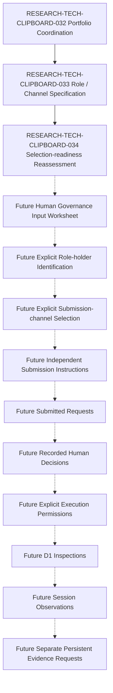

本文件只重新評估 RESEARCH-TECH-CLIPBOARD-033 是否已提供足夠、完整且不越權的文件資料，使未來人員能分別辨識功能角色持有人，以及選擇提交通道。
本次未辨識或任命任何實際 Role Holder，未選擇 Channel 或平台，未提交 Request，未建立 Submission Packet，未作成 Human Decision，未授予 Execution Permission，也未執行 Inspection。

## 1. Document Control

| Field | Value |
| --- | --- |
| Document ID | RESEARCH-TECH-CLIPBOARD-034 |
| Title | Clipboard Integration D1 Authority-role and Submission-channel Selection Readiness Reassessment |
| Status | Draft |
| Research Type | Authority-role and Submission-channel Selection Readiness Reassessment |
| Technology Decision | TD-004 Clipboard Integration |
| Parent Role/Channel Specification | RESEARCH-TECH-CLIPBOARD-033 |
| Parent Portfolio Reassessment | RESEARCH-TECH-CLIPBOARD-032 |
| Local Request Draft | RESEARCH-TECH-CLIPBOARD-028 |
| Local Submission Reassessment | RESEARCH-TECH-CLIPBOARD-029 |
| Package Cache Request Draft | RESEARCH-TECH-CLIPBOARD-030 |
| Package Cache Submission Reassessment | RESEARCH-TECH-CLIPBOARD-031 |
| Covered Functional Roles | CLIP-D1-ROLE-001..005 |
| Covered Channel Classes | CLIP-D1-SUBCH-001..004 |
| Authority-role Holder Selection | Not performed |
| Submission-channel Selection | Not performed |
| Actual Platform Identified | No |
| Submission Channel Identifier | Not assigned |
| Requests Submitted | No |
| Human Decisions | Not made |
| Execution Authorizations | Not granted |
| Execution Permissions | No |
| Inspections | Not started |
| Session Observations | Not created |
| Persistent Evidence | Not created |
| Owner | TBD |
| Last reviewed | Not reviewed |

## 2. Purpose and Decision Boundary

本文件的判斷對象是「未來是否可以進入明確的人工作業輸入階段」，不是現在指派人員、挑選平台或執行任何操作。Role-holder readiness 與 Channel selection readiness 必須分開判定；兩者都不能由文件作者、Repository owner、目前使用者、環境或既有帳號自動推定。

本次只使用既有研究、PRD、Specs、Architecture 與 RESEARCH-TECH-CLIPBOARD-033 的治理規則。任何真實姓名、職稱、部門、帳號、Email、URL、Issue、Ticket、Thread、Meeting、平台名稱、決策值、授權值、Clipboard 內容、Screenshot、Desktop 內容與 Operational Observation 均不在本文件中。

## 3. Controlled Vocabulary and Fixed State

| Term | Allowed values / fixed interpretation |
| --- | --- |
| Role-holder Selection Readiness | Ready for future human role-holder identification; Conditionally ready for future human role-holder identification; Not ready for role-holder identification; Not applicable |
| Channel Selection Readiness | Ready for future human channel selection; Conditionally ready for future human channel selection; Not ready for channel selection; Not applicable |
| Selection-input Coverage | Covered; Covered with unresolved human input; Partially covered; Missing; Not applicable |
| Selection Blocker | No documentary blocker; Role responsibility unresolved; Eligibility evidence class unresolved; Conflict boundary unresolved; Authority scope unresolved; Actual holder identity missing; Platform identity missing; Channel control unresolved; Network implication unresolved; Access-control model unresolved; Retention/confidentiality rule unresolved; Human governance input required; Not applicable |
| Current Role-holder State | Role holder: Not identified |
| Current Channel State | Channel: Not selected |
| Current Platform State | Platform: Not identified |
| Current Submission State | Request submitted: No |
| Current Decision State | Human decision: Not made |
| Current Execution State | Execution authorized: No |

## 4. Five-role Selection-readiness Registry

以下五列只評估規格是否足以讓未來人員進行明確識別；Actual holder identity 一律不填。

| Role | Specification source | Responsibility bounded | Eligibility bounded | Disqualifying conditions bounded | Separation bounded | Human input missing | Selection blocker | Selection readiness |
| --- | --- | --- | --- | --- | --- | --- | --- | --- |
| CLIP-D1-ROLE-001 Request Preparer | RESEARCH-TECH-CLIPBOARD-033 §4 | Yes | Yes: CLIP-D1-AUTHCRIT-001..012 | Yes: CLIP-D1-AUTHDISQ-001..010 | Yes: 10 separation rows | Holder identity; acceptance; scope; effective time | Actual holder identity missing; human governance input required | Conditionally ready for future human role-holder identification |
| CLIP-D1-ROLE-002 Technical Scope Reviewer | RESEARCH-TECH-CLIPBOARD-033 §4 | Yes | Yes: CLIP-D1-AUTHCRIT-001..012 | Yes: CLIP-D1-AUTHDISQ-001..010 | Yes: 10 separation rows | Holder identity; acceptance; scope; effective time | Actual holder identity missing; human governance input required | Conditionally ready for future human role-holder identification |
| CLIP-D1-ROLE-003 Decision Authority | RESEARCH-TECH-CLIPBOARD-033 §4 | Yes | Yes: CLIP-D1-AUTHCRIT-001..012 | Yes: CLIP-D1-AUTHDISQ-001..010 | Yes; self-approval exclusion bounded | Holder identity; acceptance; authority scope; recusal; effective time | Actual holder identity missing; human governance input required | Conditionally ready for future human role-holder identification |
| CLIP-D1-ROLE-004 Execution Operator | RESEARCH-TECH-CLIPBOARD-033 §4 | Yes | Yes: CLIP-D1-AUTHCRIT-001..012 | Yes: CLIP-D1-AUTHDISQ-001..010 | Yes: execution separated from decision | Holder identity; acceptance; permitted operation scope; effective time | Actual holder identity missing; human governance input required | Conditionally ready for future human role-holder identification |
| CLIP-D1-ROLE-005 Observation and Evidence Custodian | RESEARCH-TECH-CLIPBOARD-033 §4 | Yes | Yes: CLIP-D1-AUTHCRIT-001..012 | Yes: CLIP-D1-AUTHDISQ-001..010 | Yes: persistence authority remains separate | Holder identity; acceptance; observation/persistence scope; effective time | Actual holder identity missing; human governance input required | Conditionally ready for future human role-holder identification |

## 5. Four-channel Selection-readiness Registry

以下四列是抽象 Channel Class，不是實際產品、平台、URL 或通道識別碼。安全關鍵控制若仍需平台或人治理輸入，最多只能是 Conditionally ready。

| Channel Class | Specification source | Identity controls bounded | Snapshot controls bounded | Decision controls bounded | Revision controls bounded | Privacy controls bounded | Human input missing | Selection blocker | Selection readiness |
| --- | --- | --- | --- | --- | --- | --- | --- | --- | --- |
| CLIP-D1-SUBCH-001 Repository-governed Review Record | RESEARCH-TECH-CLIPBOARD-033 §5 | Yes | Yes | Yes | Yes | Partially: retention/confidentiality and platform values remain human input | Platform identity; access; retention; confidentiality; network/auth | Platform identity missing; channel control unresolved; human governance input required | Conditionally ready for future human channel selection |
| CLIP-D1-SUBCH-002 Managed Work-item or Ticket Record | RESEARCH-TECH-CLIPBOARD-033 §5 | Yes | Yes | Yes | Yes | Partially: retention/confidentiality and platform values remain human input | Platform identity; access; retention; confidentiality; network/auth | Platform identity missing; channel control unresolved; human governance input required | Conditionally ready for future human channel selection |
| CLIP-D1-SUBCH-003 Signed Electronic Decision Record | RESEARCH-TECH-CLIPBOARD-033 §5 | Yes | Yes | Yes | Yes | Partially: signing, retention and confidentiality values remain human input | Platform identity; signer identity mechanism; retention; confidentiality; network/auth | Platform identity missing; access-control model unresolved; human governance input required | Conditionally ready for future human channel selection |
| CLIP-D1-SUBCH-004 Recorded Synchronous Review with Archived Decision Record | RESEARCH-TECH-CLIPBOARD-033 §5 | Yes | Yes | Yes | Yes | Partially: recording, retention and confidentiality values remain human input | Platform identity; recording policy; access; retention; confidentiality; network/auth | Platform identity missing; retention/confidentiality rule unresolved; human governance input required | Conditionally ready for future human channel selection |

## 6. Eligibility Coverage

本表只確認 eligibility criterion 與 required evidence class 已被規格界定；Actual person evaluated 固定為 No。

| Eligibility Criterion | Related Role | Criterion specification present | Required evidence class bounded | Actual person evaluated | Selection contribution | Remaining human input |
| --- | --- | --- | --- | --- | --- | --- |
| CLIP-D1-AUTHCRIT-001 Role scope matches requested governance action | CLIP-D1-ROLE-001..005 | Yes | Role-scope statement and governing appointment record | No | Available for future human assessment | Actual holder identity and evidence reference |
| CLIP-D1-AUTHCRIT-002 Relevant technical competence | CLIP-D1-ROLE-001..005 | Yes | Human-provided competence evidence | No | Available for future human assessment | Actual holder identity and evidence reference |
| CLIP-D1-AUTHCRIT-003 Independence from the decision under review | CLIP-D1-ROLE-002..003 | Yes | Conflict and independence declaration | No | Available for future human assessment | Actual holder identity and declaration |
| CLIP-D1-AUTHCRIT-004 Authority to accept a request | CLIP-D1-ROLE-003 | Yes | Delegation or governance authority record | No | Available for future human assessment | Actual authority scope and evidence |
| CLIP-D1-AUTHCRIT-005 Authority to issue execution permission | CLIP-D1-ROLE-003 | Yes | Explicit execution-authority record | No | Available for future human assessment | Actual authority scope and evidence |
| CLIP-D1-AUTHCRIT-006 Ability to review scope and prerequisites | CLIP-D1-ROLE-002..003 | Yes | Scope-review capability evidence | No | Available for future human assessment | Actual holder identity and evidence |
| CLIP-D1-AUTHCRIT-007 Ability to operate within approved constraints | CLIP-D1-ROLE-004 | Yes | Operator capability and permitted-scope record | No | Available for future human assessment | Actual holder identity and operation scope |
| CLIP-D1-AUTHCRIT-008 Ability to preserve observation integrity | CLIP-D1-ROLE-005 | Yes | Evidence-custody capability record | No | Available for future human assessment | Actual holder identity and custody scope |
| CLIP-D1-AUTHCRIT-009 Ability to follow privacy and confidentiality controls | CLIP-D1-ROLE-001..005 | Yes | Privacy/confidentiality acknowledgement | No | Available for future human assessment | Actual holder identity and acknowledgement |
| CLIP-D1-AUTHCRIT-010 Ability to record traceable governance state | CLIP-D1-ROLE-001..005 | Yes | Traceability responsibility acceptance | No | Available for future human assessment | Actual holder identity and acceptance |
| CLIP-D1-AUTHCRIT-011 Availability for the effective request period | CLIP-D1-ROLE-001..005 | Yes | Effective date/time and availability statement | No | Available for future human assessment | Actual holder and effective period |
| CLIP-D1-AUTHCRIT-012 Acceptance of role boundaries and recusal rules | CLIP-D1-ROLE-001..005 | Yes | Signed or recorded role acceptance | No | Available for future human assessment | Actual holder and recorded acceptance |

## 7. Disqualifying-condition Coverage

| Disqualifying Condition | Condition bounded | Detection input bounded | Required disposition bounded | Actual person evaluated | Selection effect |
| --- | --- | --- | --- | --- | --- |
| CLIP-D1-AUTHDISQ-001 Direct conflict with the request outcome | Yes | Conflict declaration and request context | Recuse or route to independent authority | No | None until actual person evaluated |
| CLIP-D1-AUTHDISQ-002 Self-approval of a request or execution permission | Yes | Role combination and decision record | Block self-approval; assign independent authority | No | None until actual person evaluated |
| CLIP-D1-AUTHDISQ-003 Undisclosed financial or operational interest | Yes | Human disclosure and governance record | Require disclosure and recusal review | No | None until actual person evaluated |
| CLIP-D1-AUTHDISQ-004 Authority scope does not cover the requested action | Yes | Delegation scope and portfolio item | Do not assign the role for that action | No | None until actual person evaluated |
| CLIP-D1-AUTHDISQ-005 Missing required competence evidence | Yes | Eligibility evidence register | Do not identify as eligible until evidence is supplied | No | None until actual person evaluated |
| CLIP-D1-AUTHDISQ-006 Refusal to accept role boundaries | Yes | Recorded role acceptance | Do not assign; seek another holder | No | None until actual person evaluated |
| CLIP-D1-AUTHDISQ-007 Inability to preserve confidentiality | Yes | Privacy/confidentiality acknowledgement | Do not assign to governed material | No | None until actual person evaluated |
| CLIP-D1-AUTHDISQ-008 Inability to preserve traceability | Yes | Traceability responsibility acceptance | Do not assign until custody is established | No | None until actual person evaluated |
| CLIP-D1-AUTHDISQ-009 Unresolved recusal or separation conflict | Yes | Conflict disclosure and separation matrix | Recuse or add the required safeguard | No | None until actual person evaluated |
| CLIP-D1-AUTHDISQ-010 Role effective period is absent or expired | Yes | Effective date/time and withdrawal record | Do not treat the role as current | No | None until actual person evaluated |

## 8. Role-separation Readiness

同一人是否實際擔任多個角色未評估；本表只保留未來分派時的隔離與 recusal 規則。

| Role combination | Combination rule present | Required safeguard bounded | Conflict disclosure required | Actual assignment evaluated | Readiness result |
| --- | --- | --- | --- | --- | --- |
| Request Preparer / Technical Scope Reviewer | Yes | Independent scope review recorded | Yes | No | Ready for future assignment review |
| Request Preparer / Decision Authority | Yes | Decision Authority must independently review | Yes | No | Ready for future assignment review |
| Request Preparer / Execution Operator | Yes | Execution remains separately permitted | Yes | No | Ready for future assignment review |
| Request Preparer / Observation and Evidence Custodian | Yes | Evidence custody remains traceable | Yes | No | Ready for future assignment review |
| Technical Scope Reviewer / Decision Authority | Yes | Decision Authority records a separate result | Yes | No | Ready for future assignment review |
| Technical Scope Reviewer / Execution Operator | Yes | Operator acts only within recorded permission | Yes | No | Ready for future assignment review |
| Technical Scope Reviewer / Observation and Evidence Custodian | Yes | Observation custody is independently recorded | Yes | No | Ready for future assignment review |
| Decision Authority / Execution Operator | Yes | No same-person decision-to-execution implication | Yes | No | Ready for future assignment review |
| Decision Authority / Observation and Evidence Custodian | Yes | Decision record and evidence custody remain separate | Yes | No | Ready for future assignment review |
| Execution Operator / Observation and Evidence Custodian | Yes | Operational action and evidence custody remain traceable | Yes | No | Ready for future assignment review |

## 9. Two-request Role-holder Input Matrix

| Portfolio Item | Functional Role | Holder required before submission | Holder required before decision | Holder required before execution | Required human identification input | Current holder state |
| --- | --- | --- | --- | --- | --- | --- |
| Local D1 Request | CLIP-D1-ROLE-001 Request Preparer | Yes | No | No | Holder identity, acceptance, scope, effective period | Not identified |
| Local D1 Request | CLIP-D1-ROLE-002 Technical Scope Reviewer | Yes | Yes | No | Holder identity, competence evidence, conflict disclosure | Not identified |
| Local D1 Request | CLIP-D1-ROLE-003 Decision Authority | No | Yes | No | Holder identity, authority scope, recusal, effective period | Not identified |
| Local D1 Request | CLIP-D1-ROLE-004 Execution Operator | No | No | Yes | Holder identity, operation scope, effective period | Not identified |
| Local D1 Request | CLIP-D1-ROLE-005 Observation and Evidence Custodian | No | No | Yes | Holder identity, observation and persistence boundaries | Not identified |
| Package-cache D1 Request | CLIP-D1-ROLE-001 Request Preparer | Yes | No | No | Holder identity, acceptance, scope, effective period | Not identified |
| Package-cache D1 Request | CLIP-D1-ROLE-002 Technical Scope Reviewer | Yes | Yes | No | Holder identity, competence evidence, conflict disclosure | Not identified |
| Package-cache D1 Request | CLIP-D1-ROLE-003 Decision Authority | No | Yes | No | Holder identity, authority scope, recusal, effective period | Not identified |
| Package-cache D1 Request | CLIP-D1-ROLE-004 Execution Operator | No | No | Yes | Holder identity, operation scope, effective period | Not identified |
| Package-cache D1 Request | CLIP-D1-ROLE-005 Observation and Evidence Custodian | No | No | Yes | Holder identity, observation and persistence boundaries | Not identified |

## 10. Channel Minimum-control Coverage

Snapshot Integrity、Authority Identification、Separate Decision 與 Execution Permission 是 safety-critical controls；任何一項在實際通道上無法落實時，不得進行實際 channel selection。

| Channel Control | Covered Channel Classes | Control specification present | Platform-specific value required | Selection blocker if absent | Coverage |
| --- | --- | --- | --- | --- | --- |
| CLIP-D1-SUBCTRL-001 Channel identity is uniquely recorded | CLIP-D1-SUBCH-001..004 | Yes | Yes | Platform identity missing | Conditionally covered for future selection |
| CLIP-D1-SUBCTRL-002 Submitter identity is traceable | CLIP-D1-SUBCH-001..004 | Yes | Yes | Access-control model unresolved | Conditionally covered for future selection |
| CLIP-D1-SUBCTRL-003 Request snapshot is immutable or revision-addressable | CLIP-D1-SUBCH-001..004 | Yes | Yes | Snapshot mechanism unresolved | Conditionally covered for future selection |
| CLIP-D1-SUBCTRL-004 Authority identity is bound to the decision | CLIP-D1-SUBCH-001..004 | Yes | Yes | Authority identity mechanism unresolved | Conditionally covered for future selection |
| CLIP-D1-SUBCTRL-005 Decision result is separately recorded | CLIP-D1-SUBCH-001..004 | Yes | Yes | Decision control unresolved | Conditionally covered for future selection |
| CLIP-D1-SUBCTRL-006 Decision revision history is preserved | CLIP-D1-SUBCH-001..004 | Yes | Yes | Revision mechanism unresolved | Conditionally covered for future selection |
| CLIP-D1-SUBCTRL-007 Execution permission is separately represented | CLIP-D1-SUBCH-001..004 | Yes | Yes | Permission mechanism unresolved | Conditionally covered for future selection |
| CLIP-D1-SUBCTRL-008 Access is limited to authorized participants | CLIP-D1-SUBCH-001..004 | Yes | Yes | Access-control model unresolved | Conditionally covered for future selection |
| CLIP-D1-SUBCTRL-009 Confidentiality classification is recorded | CLIP-D1-SUBCH-001..004 | Yes | Yes | Confidentiality rule unresolved | Conditionally covered for future selection |
| CLIP-D1-SUBCTRL-010 Retention and withdrawal rules are recorded | CLIP-D1-SUBCH-001..004 | Yes | Yes | Retention rule unresolved | Conditionally covered for future selection |
| CLIP-D1-SUBCTRL-011 Network and authentication implications are assessed | CLIP-D1-SUBCH-001..004 | Yes | Yes | Network implication unresolved | Conditionally covered for future selection |
| CLIP-D1-SUBCTRL-012 Persistent evidence is not implicitly created by submission | CLIP-D1-SUBCH-001..004 | Yes | Yes | Evidence-store boundary unresolved | Conditionally covered for future selection |

## 11. Channel-rejection Readiness

| Rejection Condition | Condition bounded | Required disposition bounded | Actual channel evaluated | Selection contribution |
| --- | --- | --- | --- | --- |
| CLIP-D1-SUBREJ-001 Channel identity cannot be recorded | Yes | Reject channel candidate; supply identity control | No | Documentary rejection rule available |
| CLIP-D1-SUBREJ-002 Snapshot integrity cannot be preserved | Yes | Reject channel candidate; supply snapshot control | No | Documentary rejection rule available |
| CLIP-D1-SUBREJ-003 Authority identity cannot be bound to decision | Yes | Reject channel candidate; supply authority control | No | Documentary rejection rule available |
| CLIP-D1-SUBREJ-004 Decision and revision cannot be separately traced | Yes | Reject channel candidate; supply decision/revision control | No | Documentary rejection rule available |
| CLIP-D1-SUBREJ-005 Access control is undefined | Yes | Reject channel candidate; supply access model | No | Documentary rejection rule available |
| CLIP-D1-SUBREJ-006 Retention or confidentiality is undefined | Yes | Reject channel candidate; supply governance rule | No | Documentary rejection rule available |
| CLIP-D1-SUBREJ-007 Network or authentication implication is unsafe or unknown | Yes | Reject channel candidate pending human assessment | No | Documentary rejection rule available |
| CLIP-D1-SUBREJ-008 Channel would implicitly create operational evidence | Yes | Reject channel candidate; separate evidence request | No | Documentary rejection rule available |

## 12. Request-to-channel Applicability

Applicable 只表示抽象規格層級具備適用性，不表示已選擇、已建立或已提交。

| Portfolio Item | Channel Class | Upstream applicability | Request-specific controls bounded | Actual platform absent explicitly | Selection performed | Reassessment result |
| --- | --- | --- | --- | --- | --- | --- |
| Local D1 Request | CLIP-D1-SUBCH-001 Repository-governed Review Record | Potentially applicable at abstract specification level | Yes | Yes | No | Conditionally ready for future human channel selection |
| Local D1 Request | CLIP-D1-SUBCH-002 Managed Work-item or Ticket Record | Potentially applicable at abstract specification level | Yes | Yes | No | Conditionally ready for future human channel selection |
| Local D1 Request | CLIP-D1-SUBCH-003 Signed Electronic Decision Record | Potentially applicable at abstract specification level | Yes | Yes | No | Conditionally ready for future human channel selection |
| Local D1 Request | CLIP-D1-SUBCH-004 Recorded Synchronous Review with Archived Decision Record | Potentially applicable at abstract specification level | Yes | Yes | No | Conditionally ready for future human channel selection |
| Package-cache D1 Request | CLIP-D1-SUBCH-001 Repository-governed Review Record | Potentially applicable at abstract specification level | Yes | Yes | No | Conditionally ready for future human channel selection |
| Package-cache D1 Request | CLIP-D1-SUBCH-002 Managed Work-item or Ticket Record | Potentially applicable at abstract specification level | Yes | Yes | No | Conditionally ready for future human channel selection |
| Package-cache D1 Request | CLIP-D1-SUBCH-003 Signed Electronic Decision Record | Potentially applicable at abstract specification level | Yes | Yes | No | Conditionally ready for future human channel selection |
| Package-cache D1 Request | CLIP-D1-SUBCH-004 Recorded Synchronous Review with Archived Decision Record | Potentially applicable at abstract specification level | Yes | Yes | No | Conditionally ready for future human channel selection |

## 13. Human Role-holder Identification Input Contract

未來人工作業至少必須提供下列欄位；Current value 固定為 Not provided，不建立實際表單提交，也不填入個人資料。

| Functional Role | Mandatory future human input | Eligibility evidence required | Conflict disclosure required | Authority-scope field required | Current value |
| --- | --- | --- | --- | --- | --- |
| CLIP-D1-ROLE-001 Request Preparer | Identity; identification source; acceptance; applicable portfolio item; eligibility/disqualification assessment; conflict disclosure; separation safeguard; permitted/prohibited actions; effective scope/time; revision/withdrawal rule; recorded identification reference | Evidence for CLIP-D1-AUTHCRIT-001..012 as applicable | Yes | Yes | Not provided |
| CLIP-D1-ROLE-002 Technical Scope Reviewer | Identity; identification source; acceptance; applicable portfolio item; eligibility/disqualification assessment; conflict disclosure; separation safeguard; permitted/prohibited actions; effective scope/time; revision/withdrawal rule; recorded identification reference | Evidence for CLIP-D1-AUTHCRIT-001..012 as applicable | Yes | Yes | Not provided |
| CLIP-D1-ROLE-003 Decision Authority | Identity; identification source; acceptance; applicable portfolio item; authority scope; eligibility/disqualification assessment; conflict/recusal disclosure; separation safeguard; permitted/prohibited actions; effective scope/time; revision/withdrawal rule; recorded identification reference | Evidence for CLIP-D1-AUTHCRIT-001..012 plus delegation scope | Yes | Yes | Not provided |
| CLIP-D1-ROLE-004 Execution Operator | Identity; identification source; acceptance; applicable portfolio item; eligibility/disqualification assessment; conflict disclosure; separation safeguard; permitted/prohibited operation scope; effective scope/time; revision/withdrawal rule; recorded identification reference | Evidence for CLIP-D1-AUTHCRIT-001..012 as applicable | Yes | Yes | Not provided |
| CLIP-D1-ROLE-005 Observation and Evidence Custodian | Identity; identification source; acceptance; applicable portfolio item; eligibility/disqualification assessment; conflict disclosure; separation safeguard; permitted observation/persistence scope; effective scope/time; revision/withdrawal rule; recorded identification reference | Evidence for CLIP-D1-AUTHCRIT-001..012 as applicable | Yes | Yes | Not provided |

## 14. Channel-selection Human Input Contract

未來人工作業至少必須提供下列欄位；本表不填產品名稱、URL、Issue、Ticket、Email 或帳號。

| Channel Class | Mandatory future channel input | Required platform controls | Network assessment required | Access-control assessment required | Current value |
| --- | --- | --- | --- | --- | --- |
| CLIP-D1-SUBCH-001 Repository-governed Review Record | Class; actual platform/record-system identity; channel identifier; submitter mechanism; authority mechanism; access model; snapshot mechanism; decision immutability; revision history; confidentiality; retention; network/auth; external dependency; selection decision reference | Identity; snapshot; authority; decision; revision; access; privacy controls | Yes | Yes | Not provided |
| CLIP-D1-SUBCH-002 Managed Work-item or Ticket Record | Class; actual platform/record-system identity; channel identifier; submitter mechanism; authority mechanism; access model; snapshot mechanism; decision immutability; revision history; confidentiality; retention; network/auth; external dependency; selection decision reference | Identity; snapshot; authority; decision; revision; access; privacy controls | Yes | Yes | Not provided |
| CLIP-D1-SUBCH-003 Signed Electronic Decision Record | Class; actual platform/record-system identity; channel identifier; submitter mechanism; authority mechanism; access model; snapshot mechanism; signature/immutability; revision history; confidentiality; retention; network/auth; external dependency; selection decision reference | Identity; signing; snapshot; authority; decision; revision; access; privacy controls | Yes | Yes | Not provided |
| CLIP-D1-SUBCH-004 Recorded Synchronous Review with Archived Decision Record | Class; actual platform/record-system identity; channel identifier; submitter mechanism; authority mechanism; access model; recording/snapshot mechanism; decision immutability; revision history; confidentiality; retention; network/auth; external dependency; selection decision reference | Identity; recording; snapshot; authority; decision; revision; access; privacy controls | Yes | Yes | Not provided |

## 15. Selection-decision Separation Matrix

| Selection subject A | Selection subject B | May share one human review session | Must have separately recorded result | Prohibited implication |
| --- | --- | --- | --- | --- |
| Local Request Decision Authority | Package Cache Request Decision Authority | Yes | Yes | One review session does not make one decision |
| Decision Authority | Technical Scope Reviewer | Yes | Yes | Role-holder identification does not equal Request approval |
| Decision Authority | Execution Operator | Yes | Yes | Decision does not grant execution permission |
| Request Preparer | Decision Authority | Yes | Yes | Request preparation does not make the preparer the authority |
| Submission Channel | Execution Permission mechanism | Yes | Yes | Channel selection does not authorize execution |
| Submission Channel | Persistent Evidence location | Yes | Yes | Channel selection does not create or select an evidence store |

## 16. Submission Packet Readiness Reassessment

Packet Element 完整不表示 Packet 已建立。Authority Holder 與 Channel 選擇前不得標示 Submitted；本文件不複製完整 Request 內容，不建立 Archive、Attachment 或 Submission Packet 檔案。

| Packet Element | Local source present | Package Cache source present | Immutable-snapshot requirement bounded | Actual snapshot created | Selection dependency |
| --- | --- | --- | --- | --- | --- |
| CLIP-D1-SUBPKT-001 Request Document ID | Yes: RESEARCH-TECH-CLIPBOARD-028 / 029 | Yes: RESEARCH-TECH-CLIPBOARD-030 / 031 | Yes | No | Human role-holder and channel inputs remain unresolved |
| CLIP-D1-SUBPKT-002 Request version | Yes: RESEARCH-TECH-CLIPBOARD-028 / 029 | Yes: RESEARCH-TECH-CLIPBOARD-030 / 031 | Yes | No | Human role-holder and channel inputs remain unresolved |
| CLIP-D1-SUBPKT-003 Portfolio Item ID | Yes: RESEARCH-TECH-CLIPBOARD-028 / 029 | Yes: RESEARCH-TECH-CLIPBOARD-030 / 031 | Yes | No | Human role-holder and channel inputs remain unresolved |
| CLIP-D1-SUBPKT-004 Request-readiness source reference | Yes: RESEARCH-TECH-CLIPBOARD-028 / 029 | Yes: RESEARCH-TECH-CLIPBOARD-030 / 031 | Yes | No | Human role-holder and channel inputs remain unresolved |
| CLIP-D1-SUBPKT-005 Submission reassessment reference | Yes: RESEARCH-TECH-CLIPBOARD-028 / 029 | Yes: RESEARCH-TECH-CLIPBOARD-030 / 031 | Yes | No | Human role-holder and channel inputs remain unresolved |
| CLIP-D1-SUBPKT-006 Included Scope IDs | Yes: RESEARCH-TECH-CLIPBOARD-028 / 029 | Yes: RESEARCH-TECH-CLIPBOARD-030 / 031 | Yes | No | Human role-holder and channel inputs remain unresolved |
| CLIP-D1-SUBPKT-007 Included inspection-item references | Yes: RESEARCH-TECH-CLIPBOARD-028 / 029 | Yes: RESEARCH-TECH-CLIPBOARD-030 / 031 | Yes | No | Human role-holder and channel inputs remain unresolved |
| CLIP-D1-SUBPKT-008 Prerequisite references | Yes: RESEARCH-TECH-CLIPBOARD-028 / 029 | Yes: RESEARCH-TECH-CLIPBOARD-030 / 031 | Yes | No | Human role-holder and channel inputs remain unresolved |
| CLIP-D1-SUBPKT-009 Public tool/target class | Yes: RESEARCH-TECH-CLIPBOARD-028 / 029 | Yes: RESEARCH-TECH-CLIPBOARD-030 / 031 | Yes | No | Human role-holder and channel inputs remain unresolved |
| CLIP-D1-SUBPKT-010 Sanitized path class | Yes: RESEARCH-TECH-CLIPBOARD-028 / 029 | Yes: RESEARCH-TECH-CLIPBOARD-030 / 031 | Yes | No | Human role-holder and channel inputs remain unresolved |
| CLIP-D1-SUBPKT-011 Package identity class | Yes: RESEARCH-TECH-CLIPBOARD-028 / 029 | Yes: RESEARCH-TECH-CLIPBOARD-030 / 031 | Yes | No | Human role-holder and channel inputs remain unresolved |
| CLIP-D1-SUBPKT-012 Authority role reference | Yes: RESEARCH-TECH-CLIPBOARD-028 / 029 | Yes: RESEARCH-TECH-CLIPBOARD-030 / 031 | Yes | No | Authority/channel/snapshot dependency remains unresolved |
| CLIP-D1-SUBPKT-013 Submitter identity mechanism | Yes: RESEARCH-TECH-CLIPBOARD-028 / 029 | Yes: RESEARCH-TECH-CLIPBOARD-030 / 031 | Yes | No | Authority/channel/snapshot dependency remains unresolved |
| CLIP-D1-SUBPKT-014 Submission Channel class | Yes: RESEARCH-TECH-CLIPBOARD-028 / 029 | Yes: RESEARCH-TECH-CLIPBOARD-030 / 031 | Yes | No | Authority/channel/snapshot dependency remains unresolved |
| CLIP-D1-SUBPKT-015 Submission Channel identifier | Yes: RESEARCH-TECH-CLIPBOARD-028 / 029 | Yes: RESEARCH-TECH-CLIPBOARD-030 / 031 | Yes | No | Authority/channel/snapshot dependency remains unresolved |
| CLIP-D1-SUBPKT-016 Snapshot integrity reference | Yes: RESEARCH-TECH-CLIPBOARD-028 / 029 | Yes: RESEARCH-TECH-CLIPBOARD-030 / 031 | Yes | No | Authority/channel/snapshot dependency remains unresolved |
| CLIP-D1-SUBPKT-017 Execution constraint reference | Yes: RESEARCH-TECH-CLIPBOARD-028 / 029 | Yes: RESEARCH-TECH-CLIPBOARD-030 / 031 | Yes | No | Authority/channel/snapshot dependency remains unresolved |
| CLIP-D1-SUBPKT-018 Decision-record contract reference | Yes: RESEARCH-TECH-CLIPBOARD-028 / 029 | Yes: RESEARCH-TECH-CLIPBOARD-030 / 031 | Yes | No | Authority/channel/snapshot dependency remains unresolved |
| CLIP-D1-SUBPKT-019 Observation/evidence handoff reference | Yes: RESEARCH-TECH-CLIPBOARD-028 / 029 | Yes: RESEARCH-TECH-CLIPBOARD-030 / 031 | Yes | No | Authority/channel/snapshot dependency remains unresolved |
| CLIP-D1-SUBPKT-020 Privacy, retention, and revision reference | Yes: RESEARCH-TECH-CLIPBOARD-028 / 029 | Yes: RESEARCH-TECH-CLIPBOARD-030 / 031 | Yes | No | Authority/channel/snapshot dependency remains unresolved |

## 17. Two Packet-manifest Readiness Rows

Authority 與 Channel 值未解析時，Manifest readiness 最多為 Conditional；Manifest Ready 不表示 Submission Packet 已建立。

| Packet Manifest | Portfolio Item | Required elements bounded | Authority value unresolved | Channel value unresolved | Snapshot not created explicitly | Manifest readiness |
| --- | --- | --- | --- | --- | --- | --- |
| CLIP-D1-SUBMANIFEST-001 | Local D1 Request | Yes: CLIP-D1-SUBPKT-001..020 | Yes | Yes | Yes | Conditional; future human authority/channel input required |
| CLIP-D1-SUBMANIFEST-002 | Package-cache D1 Request | Yes: CLIP-D1-SUBPKT-001..020 | Yes | Yes | Yes | Conditional; future human authority/channel input required |

## 18. Two Decision-record Selection Dependencies

| Decision Record Contract | Portfolio Item | Authority-holder prerequisite | Channel prerequisite | Request-snapshot prerequisite | Actual Decision Record | Readiness result |
| --- | --- | --- | --- | --- | --- | --- |
| CLIP-D1-DECREC-001 | Local D1 Request | Authority holder must first be identified | Channel must preserve decision and revision traceability | Snapshot must be uniquely identifiable | Not created | Conditional; no decision value |
| CLIP-D1-DECREC-002 | Package-cache D1 Request | Authority holder must first be identified | Channel must preserve decision and revision traceability | Snapshot must be uniquely identifiable | Not created | Conditional; no decision value |

## 19. Two Execution-handoff Selection Dependencies

| Execution Handoff | Portfolio Item | Required authority identity | Required decision reference | Required operator identity | Required execution constraints | Current state |
| --- | --- | --- | --- | --- | --- | --- |
| CLIP-D1-EXECHANDOFF-001 | Local D1 Request | Required before permission | Required before execution | Required before execution | Scope, prerequisites, safety boundaries, rollback/stop boundary | Not created |
| CLIP-D1-EXECHANDOFF-002 | Package-cache D1 Request | Required before permission | Required before execution | Required before execution | Scope, prerequisites, safety boundaries, rollback/stop boundary | Not created |

## 20. Observation / Evidence Handoff Selection Dependencies

| Portfolio Item | Observation Custodian identity required | Observation authority required | Persistence authority required | Storage / channel selection relationship | Current state |
| --- | --- | --- | --- | --- | --- |
| Local D1 Request | Yes | Yes | Separately required | Submission Channel does not equal Evidence Store; Governance Decision Record does not equal Operational Evidence | Not created |
| Package-cache D1 Request | Yes | Yes | Separately required | Submission Channel does not equal Evidence Store; Governance Decision Record does not equal Operational Evidence | Not created |

## 21. Eight Conflict / Recusal Readiness Rows

| Conflict Scenario | Disclosure rule present | Separation rule present | Actual person / channel evaluated | Selection-readiness effect |
| --- | --- | --- | --- | --- |
| Request Preparer also acts as Decision Authority | Yes | Yes: independent decision authority required | No | Future identification must apply separation rule |
| Technical Scope Reviewer also acts as Decision Authority | Yes | Yes: separate review and decision result | No | Future identification must apply separation rule |
| Decision Authority also acts as Execution Operator | Yes | Yes: no decision-to-execution self-authorization | No | Future identification must apply separation rule |
| Decision Authority also acts as Observation/Evidence Custodian | Yes | Yes: decision and custody records separate | No | Future identification must apply separation rule |
| Request Preparer and Technical Scope Reviewer share an interest | Yes | Yes: disclose and recuse where required | No | Future human conflict assessment required |
| Execution Operator and Evidence Custodian share operational control | Yes | Yes: preserve independent custody trail | No | Future human conflict assessment required |
| Authority identity is unavailable in the selected record path | Yes | Yes: authority must be traceable | No | Future channel assessment must reject unresolved control |
| Channel operator can alter the decision or evidence record | Yes | Yes: immutability/revision boundary required | No | Future channel assessment must reject unresolved control |

## 22. Ten Privacy / Confidentiality Readiness Rows

| Data Class | Submission treatment bounded | Decision-record treatment bounded | Redaction bounded | Actual data collected | Selection effect |
| --- | --- | --- | --- | --- | --- |
| Request Document ID | Bounded reference only | Reference only; no full request copy | Yes | No | No actual data collected |
| Inspection Item ID | Bounded reference only | Reference only | Yes | No | No actual data collected |
| Public tool/target class | Sanitized class only | Sanitized class only | Yes | No | No actual data collected |
| Sanitized path class | Sanitized class only | Sanitized class only | Yes | No | No actual data collected |
| Package identity class | Non-secret package metadata only | Non-secret reference only | Yes | No | No actual data collected |
| Decision Authority identity | Future governed identity field only | Governed identity field with access/retention rule | Yes | No | Human input remains required; no actual person recorded |
| Execution Operator identity | Future governed identity field only | Governed identity field with access/retention rule | Yes | No | Human input remains required; no actual person recorded |
| Credential/Token/Private key | Never submit or record | Never submit or record | Yes | No | Prohibited; no actual data collected |
| SID/Account/Computer identity | Never collect as system identity | Never collect as system identity | Yes | No | Prohibited; no actual data collected |
| Clipboard/Screenshot/Desktop content | Never collect in this reassessment | Never collect in this reassessment | Yes | No | Prohibited; no actual data collected |

## 23. Fifteen Governance-traceability Readiness Rows

未知值只使用 Not assigned、Not selected、Not identified、Not created 或 Not applicable；不虛構識別碼。

| Traceability Field | Specification present | Human input required | Platform input required | Current value | Selection blocker |
| --- | --- | --- | --- | --- | --- |
| Request Document ID | Yes | No | No | Not assigned | Actual request record does not exist |
| Request version | Yes | No | No | Not assigned | Actual request record does not exist |
| Portfolio Item ID | Yes | No | No | Not assigned | Actual request record does not exist |
| Request-readiness source | Yes | No | No | Not assigned | Source reference to be bound by future human packet |
| Submission Reassessment ID | Yes | No | No | Not created | No submission reassessment record created |
| Included Scope IDs | Yes | No | No | Not assigned | Future packet input required |
| Included Inspection Items | Yes | No | No | Not assigned | Future packet input required |
| Submission Channel class | Yes | Yes | Yes | Not selected | Human and platform input required |
| Submission Channel identifier | Yes | Yes | Yes | Not assigned | Platform identity missing |
| Submitter identity | Yes | Yes | Yes | Not identified | Human governance input required |
| Decision Authority identity | Yes | Yes | Yes | Not identified | Human governance input required |
| Decision Record identifier | Yes | No | Yes | Not created | Decision not made |
| Decision state | Yes | Yes | Yes | Not applicable | No human decision has been made |
| Execution Permission reference | Yes | No | Yes | Not created | Execution not authorized |
| Superseded/Revised record reference | Yes | Yes | Yes | Not applicable | Revision rule requires future channel/platform input |

## 24. Selection-input Dependency Ledger

規格中已列出的需求不是實際輸入；Current availability 只表示 Not provided、Partially documented as a requirement 或 Not applicable。

| Required future input | Source type | Role-holder selection dependency | Channel-selection dependency | Submission dependency | Current availability |
| --- | --- | --- | --- | --- | --- |
| Actual Decision Authority identity | Future human governance input | Required | Required | Required before submission/decision | Not provided |
| Authority role acceptance | Future human governance input | Required | Required | Required before submission/decision | Not provided |
| Eligibility assessment | Future human governance input | Required | Required | Required before submission/decision | Partially documented as a requirement |
| Conflict disclosure | Future human governance input | Required | Required | Required before submission/decision | Partially documented as a requirement |
| Actual Technical Scope Reviewer identity | Future human governance input | Required | Not required for class selection | Required before submission | Not provided |
| Actual Execution Operator identity | Future human governance input | Not required for class selection | Not required for class selection | Required before execution | Not provided |
| Actual Observation and Evidence Custodian identity | Future human governance input | Not required for class selection | Not required for class selection | Required before observation/persistence | Not provided |
| Selected Channel Class | Future human governance input | Not applicable | Required | Required before submission | Not provided |
| Actual platform identity | Future platform input | Not applicable | Required | Required before submission | Not provided |
| Access-control model | Future platform/governance input | Not applicable | Required | Required before submission | Not provided |
| Network/authentication assessment | Future platform/governance input | Not applicable | Required | Required before submission | Not provided |
| Retention/confidentiality rule | Future platform/governance input | Not applicable | Required | Required before submission | Not provided |

## 25. Prohibited Transitions

任何下列轉換都不得由本文件、文件作者、Repository 狀態、環境存在或工具可用性自動觸發。

| From | Prohibited automatic transition | Required intermediate human input / decision |
| --- | --- | --- |
| Selection readiness | Role holder identified | Explicit human role-holder identification |
| Role holder identified | Role accepted | Recorded human role acceptance |
| Role accepted | Decision Authority | Role-specific authority-scope assessment and identification |
| Decision Authority identified | Request approved | Independent human decision on the submitted request |
| Channel readiness | Channel selected | Explicit human channel selection |
| Channel selected | Platform authorized | Platform-specific access-control decision |
| Platform identified | Network authorized | Human network/authentication assessment |
| Channel selected | Request submitted | Independent submission instruction and human action |
| Packet manifest ready | Request snapshot created | Human-approved snapshot mechanism and packet action |
| Request snapshot created | Submitted Request | Explicit submission instruction and human action |
| Submitted Request | Human Decision | Recorded human review and decision |
| Human Decision | Execution Permission | Explicit human execution authorization |
| Execution Permission | Persistent Evidence | Separate persistence authority and evidence request |
| D1 Governance complete | Candidate Selection | Separate human candidate-selection instruction |
| D1 Governance complete | Clipboard ADR | Separate technology decision process and authorization |

## 26. Selection-readiness Gap Register

只有真正的文件歧義才可列為 Gap。允許的 Gap namespace 為 CLIP-D1-AUTHCHANNEL-SELREADY-GAP-001..N；尚未識別 Holder、尚未選擇 Channel、尚未指定平台、尚未提交 Request、尚未作成 Human Decision、尚未執行 Inspection、尚未建立 Observation 都不是 documentary gap。

| Gap ID | Gap statement | Gap category | Selection impact |
| --- | --- | --- | --- |
| Not applicable | No D1 authority-role and submission-channel selection-readiness documentary gap identified from available sources | No documentary blocker | Future human role-holder and channel inputs remain required; no actual selection performed |

## 27. Five-role Completeness Matrix

| Role | Specification traceable | Eligibility bounded | Disqualification bounded | Separation bounded | Human input contract bounded | Holder absent explicitly | Selection effect bounded | Complete |
| --- | --- | --- | --- | --- | --- | --- | --- | --- |
| CLIP-D1-ROLE-001 Request Preparer | Yes | Yes | Yes | Yes | Yes | Yes | Yes | Yes |
| CLIP-D1-ROLE-002 Technical Scope Reviewer | Yes | Yes | Yes | Yes | Yes | Yes | Yes | Yes |
| CLIP-D1-ROLE-003 Decision Authority | Yes | Yes | Yes | Yes | Yes | Yes | Yes | Yes |
| CLIP-D1-ROLE-004 Execution Operator | Yes | Yes | Yes | Yes | Yes | Yes | Yes | Yes |
| CLIP-D1-ROLE-005 Observation and Evidence Custodian | Yes | Yes | Yes | Yes | Yes | Yes | Yes | Yes |

Complete = Yes 只表示文件結構完整，不表示 Holder 已識別或已任命。

## 28. Four-channel Completeness Matrix

| Channel Class | Controls traceable | Rejection rules bounded | Applicability bounded | Human input contract bounded | Platform absent explicitly | Selection effect bounded | Complete |
| --- | --- | --- | --- | --- | --- | --- | --- |
| CLIP-D1-SUBCH-001 Repository-governed Review Record | Yes | Yes | Yes | Yes | Yes | Yes | Yes |
| CLIP-D1-SUBCH-002 Managed Work-item or Ticket Record | Yes | Yes | Yes | Yes | Yes | Yes | Yes |
| CLIP-D1-SUBCH-003 Signed Electronic Decision Record | Yes | Yes | Yes | Yes | Yes | Yes | Yes |
| CLIP-D1-SUBCH-004 Recorded Synchronous Review with Archived Decision Record | Yes | Yes | Yes | Yes | Yes | Yes | Yes |

Complete = Yes 只表示 Channel Class 的文件結構完整，不表示 Channel 或平台已選擇。

## 29. Two-request Selection-governance Completeness

| Portfolio Item | Role-holder readiness bounded | Channel readiness bounded | Packet dependency bounded | Decision dependency bounded | Execution dependency bounded | Observation / Persistence dependency bounded | Complete |
| --- | --- | --- | --- | --- | --- | --- | --- |
| Local D1 Request | Yes | Yes | Yes | Yes | Yes | Yes | Yes |
| Package-cache D1 Request | Yes | Yes | Yes | Yes | Yes | Yes | Yes |

## 30. Mechanical Final Status

| Status field | Derived value |
| --- | --- |
| Reassessment Status | D1 authority-role and submission-channel selection-readiness reassessment complete |
| Role-holder Identification Readiness | Conditionally ready for future explicit human role-holder identification |
| Channel Selection Readiness | Conditionally ready for future explicit human submission-channel selection |
| Current Governance State | No functional role holder has been identified; No submission channel has been selected; No actual platform has been identified |
| Submission Status | Neither D1 request has been submitted |
| Human Decision Status | No human decision has been made for either D1 request |
| Execution Status | No D1 inspection operation is authorized for execution |
| Next-document Handoff | Conditionally ready to prepare D1 human governance input worksheet specification |

Mechanical derivation: 5 role readiness rows + 4 channel readiness rows + Eligibility/Disqualification/Separation coverage + 10 Request/Role inputs + Channel controls/rejection/applicability + Role-holder and Channel human-input contracts + Packet/Decision/Execution/Observation dependencies + Conflict/Privacy/Traceability coverage + 12 Selection-input dependencies + open Selection-readiness Gaps → Role-holder and Channel Selection Readiness.

由於實際 Holder identity、平台 identity、access-control、network/authentication、retention/confidentiality 等人治理或平台輸入仍未提供，兩項 readiness 均維持 Conditional；這不是對任何實際人員、平台或通道的選擇。

## 31. Fixed Status Boundary

| Boundary | Fixed value |
| --- | --- |
| Request Preparer Holder | Not identified |
| Technical Scope Reviewer Holder | Not identified |
| Decision Authority Holder | Not identified |
| Execution Operator Holder | Not identified |
| Observation / Evidence Custodian Holder | Not identified |
| Submission Channel | Not selected |
| Actual Platform | Not identified |
| Submission Channel Identifier | Not assigned |
| Request IDs | Not assigned |
| Authority IDs | Not assigned |
| Requests Submitted | No |
| Explicit Submission Instructions | Not provided |
| Human Decisions | Not made |
| Execution Authorizations | Not granted |
| Execution Permissions | No |
| Local Environment Inspection | Not started |
| Package Cache Inspection | Not started |
| Network / Elevation / Mutation | Not authorized |
| Package-source / Credential-provider Access | Not authorized |
| Clipboard Read / Write / Clear | Not authorized |
| Session Observations | Not created |
| Persistent Evidence | Not created |
| Project / Restore / Build / Run | Not authorized |
| Candidate Ranking / Selection | Not performed |
| Technology Recommendation / Decision | Not made |
| Clipboard ADR | Not created |
| Screenshot functionality | Not started |

## 32. Traceability

本文件建立從既有協調與角色/通道規格到未來人治理輸入的文件鏈；所有未來作業節點均以虛線表示，不能由本文件自動觸發。

## 33. Source Traceability

| Source family | References preserved | Use in this reassessment |
| --- | --- | --- |
| Clipboard research baseline | RESEARCH-TECH-CLIPBOARD-001..014 | Historical scope, evidence and non-execution boundaries |
| Clipboard decision and readiness chain | RESEARCH-TECH-CLIPBOARD-020; RESEARCH-TECH-CLIPBOARD-026..033 | Request, submission, portfolio, role, channel and readiness traceability |
| D1 portfolio | CLIP-D1-REQPORT-001..002 | Two request items and their separation |
| Functional roles | CLIP-D1-ROLE-001..005 | Five-role registry and human identification boundary |
| Submission channels | CLIP-D1-SUBCH-001..004 | Four abstract channel classes |
| Request readiness | CLIP-REQREADY-001..002 | Pre-submission readiness context |
| Inspection inventory | CLIP-INSPECT-001..017 | Future inspection references only; no inspection execution |
| Decision governance | CLIP-DEC-CRIT-001..012; CLIP-DEC-GAP-001..020; CLIP-ADR-GATE-001..010 | Decision, gap and ADR boundaries; no candidate selection or ADR |
| Frozen product documentation | Frozen PRD, Clipboard Specs and Architecture responsibility boundaries | Product scope and responsibility boundary |
| Technology decision | TD-004 Clipboard Integration | Decision lineage only; no technology recommendation in this document |

## 34. Explicit Non-actions

本文件不識別或任命實際 Role Holder；不指定姓名、職稱、部門、帳號、Email 或個人資料；不選擇 Channel、平台、URL、Issue、Ticket、Thread 或 Meeting；不建立 Channel、Request、Authority 或 Decision 識別碼；不提交 Request 或建立 Submission Packet；不作成 Human Decision；不設定 Execution Authorization 或 Execution Permission；不新增、補寫、重印或執行 Command；不執行 Inspection；不建立 Observation、Persistent Evidence、Output、Log 或 Result。

本文件不執行 Network、Elevation、Mutation、Project、Restore、Build、Test、Run、Clipboard、Consumer 或 Runtime；不設定 Candidate 權重、分數、排名、Winner 或 Recommendation；不選擇 Clipboard Technology；不建立 Clipboard ADR；不修改 UI/Capture/Rendering Research Line；不開始 Clipboard 或截圖功能。

## 35. Static Verification Record

| Check | Result |
| --- | --- |
| Only requested file created | Pending after file creation; verified by targeted Git status |
| Required document ID present | RESEARCH-TECH-CLIPBOARD-034 |
| Role selection-readiness rows | 5 |
| Channel selection-readiness rows | 4 |
| Eligibility coverage rows | 12 |
| Disqualifying-condition coverage rows | 10 |
| Role-separation readiness rows | 10 |
| Request/Role holder input rows | 10 |
| Channel minimum-control rows | 12 |
| Channel-rejection readiness rows | 8 |
| Request-to-channel applicability rows | 8 |
| Role-holder human input contract rows | 5 |
| Channel-selection human input contract rows | 4 |
| Selection-decision separation rows | 6 |
| Submission Packet reassessment rows | 20 |
| Packet-manifest readiness rows | 2 |
| Decision-record dependency rows | 2 |
| Execution-handoff dependency rows | 2 |
| Observation/Evidence dependency rows | 2 |
| Conflict/Recusal readiness rows | 8 |
| Privacy/Confidentiality readiness rows | 10 |
| Governance Traceability readiness rows | 15 |
| Selection-input dependency rows | 12 |
| Prohibited transition rows | 15 |
| Role completeness rows | 5 |
| Channel completeness rows | 4 |
| Request selection-governance completeness rows | 2 |
| Runtime verification | Not performed |
| Build/Test/Restore/Run | Not performed |
