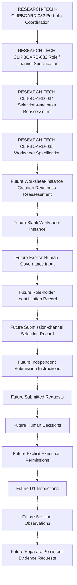

本文件只定義未來 D1 Human Governance Input Worksheet 的結構、欄位、證明、Attestation、依賴、Validation、Stop、Revision 與 Traceability 規則。它是 Worksheet Specification，不是已填寫的 Worksheet，也不是任何 Role-holder Nomination、Role-holder Appointment、Submission Channel Selection、Request Submission、Human Decision、Execution Permission、Inspection、Observation 或 Persistent Evidence。

Worksheet 欄位完整，不代表任何治理輸入已提供。所有 Current instance 固定維持 Not created；本文件不建立 Worksheet Instance、不填入 Human Input、不識別實際人員、不選擇平台或通道。

## Document Control

| Field | Required value |
| --- | --- |
| Document ID | RESEARCH-TECH-CLIPBOARD-035 |
| Title | Clipboard Integration D1 Human Governance Input Worksheet Specification |
| Status | Draft |
| Research Type | Human-governance Input Worksheet Specification |
| Technology Decision | TD-004 Clipboard Integration |
| Parent Selection-readiness Reassessment | RESEARCH-TECH-CLIPBOARD-034 |
| Parent Role/Channel Specification | RESEARCH-TECH-CLIPBOARD-033 |
| Parent Portfolio Reassessment | RESEARCH-TECH-CLIPBOARD-032 |
| Local Request Draft | RESEARCH-TECH-CLIPBOARD-028 |
| Package Cache Request Draft | RESEARCH-TECH-CLIPBOARD-030 |
| Covered Portfolio Items | CLIP-D1-REQPORT-001..002 |
| Covered Functional Roles | CLIP-D1-ROLE-001..005 |
| Covered Channel Classes | CLIP-D1-SUBCH-001..004 |
| Worksheet Specification | Created by this document |
| Worksheet Instance | Not created |
| Human Input Collected | No |
| Role-holder Identity Collected | No |
| Channel Selected | No |
| Actual Platform Identified | No |
| Personal Data Collected | No |
| Request Submitted | No |
| Human Decision | Not made |
| Execution Authorization | Not granted |
| Execution Permission | No |
| Inspection Execution | Not started |
| Session Observation | Not created |
| Persistent Evidence | Not created |
| Owner | TBD |
| Last reviewed | Not reviewed |

## 1. Purpose

Worksheet 未來只用於：讓真人識別 D1 功能角色 Holder、評估資格與 Conflict、選擇抽象 Submission Channel、確認治理控制，並建立可追溯的 Selection Record 所需的輸入規格。

Worksheet 不得被解讀為已填寫的 Instance、Role-holder Nomination、Role-holder Appointment、實際姓名/職稱/部門/Email/帳號紀錄、Submission Channel Selection、實際平台/URL/Issue/Ticket/Thread 建立、Request Submission、Human Decision、Execution Permission、Inspection、Observation 或 Persistent Evidence。

## 2. Source Preservation

| Source family | Preserved references | Use |
| --- | --- | --- |
| Clipboard research baseline | RESEARCH-TECH-CLIPBOARD-010..014; RESEARCH-TECH-CLIPBOARD-020 | Scope, evidence and non-execution boundaries |
| Selection-readiness chain | RESEARCH-TECH-CLIPBOARD-026..034 | Role, Channel and selection-input prerequisites |
| D1 portfolio | CLIP-D1-REQPORT-001..002 | Two Portfolio Items |
| Functional roles | CLIP-D1-ROLE-001..005 | Five Role-holder blocks |
| Role eligibility and disqualification | CLIP-D1-AUTHCRIT-001..012; CLIP-D1-AUTHDISQ-001..010 | Assessment rows without evaluating people |
| Submission channels and controls | CLIP-D1-SUBCH-001..004; CLIP-D1-SUBCTRL-001..012 | Four Channel blocks and twelve control rows |
| Submission packet and handoff contracts | CLIP-D1-SUBPKT-001..020; CLIP-D1-SUBMANIFEST-001..002; CLIP-D1-DECREC-001..002; CLIP-D1-EXECHANDOFF-001..002 | Dependency and input contracts only |
| Request readiness and inspection inventory | CLIP-REQREADY-001..002; CLIP-INSPECT-001..017; CLIP-D1-DOCITEM-001..017 | Future governed references only |
| Decision and ADR boundaries | C-LI1..C-LI3; CLIP-DEC-CRIT-001..012; CLIP-DEC-GAP-001..020; CLIP-ADR-GATE-001..010 | No candidate ranking, technology choice or ADR |
| Frozen product documentation | Frozen PRD, Clipboard Specs and Architecture responsibility boundaries | Product and responsibility boundaries |

本文件不修改第 56 至 62 份文件，不修改 Role、Channel、Scope、Batch 或 Request readiness，不建立第 6 個 Role 或第 5 個 Channel Class，不建立 Worksheet Instance，不填入實際個人或平台資料，不建立 Request/Authority/Channel/Decision 識別碼，不建立 CLIP-AUTH-* 或 UI-AUTH-*。

## 3. Controlled Vocabulary

| Vocabulary | Allowed values |
| --- | --- |
| Worksheet Field Requirement | Required; Conditionally required; Optional; Prohibited; Not applicable |
| Worksheet Input State | Not provided; Future human input required; Future human attestation required; Future governance reference required; Not applicable |
| Field Validation State | Specification complete; Specification complete with unresolved human value; Partially specified; Missing; Not applicable |
| Data Classification | Public governance metadata; Internal governance metadata; Restricted governance identity data; Prohibited sensitive data; Not applicable |
| Worksheet Instance State | Not created; Not distributed; Not completed; Not submitted; Not reviewed; Not approved |

Disallowed state tokens for this specification are Provided、Confirmed、Accepted、Approved、Assigned、Selected、Submitted、Authorized、Executable、Verified、Passed；它們不得作為 Current value、Input State 或 Validation State。

## 4. Worksheet Section Registry

| Section ID | Worksheet section | Upstream source | Required input class | Prohibited input | Data classification | Validation rule | Stop condition | Current instance state |
| --- | --- | --- | --- | --- | --- | --- | --- | --- |
| CLIP-D1-GOVWS-001 | Worksheet Instance Metadata | RESEARCH-TECH-CLIPBOARD-034 | Required metadata input class | Personal or platform data; instance creation | Public/Internal governance metadata | Field identity and state rules | Missing identity or scope input stops instance creation | Not created |
| CLIP-D1-GOVWS-002 | Functional Role-holder Identification | CLIP-D1-ROLE-001..005; RESEARCH-TECH-CLIPBOARD-034 | Future human governance identity input | Actual personal data beyond governed reference | Restricted governance identity data | Role ID and boundary checks | Missing holder reference or scope stops role identification | Not created |
| CLIP-D1-GOVWS-003 | Eligibility and Disqualifying-condition Assessment | CLIP-D1-AUTHCRIT-001..012; CLIP-D1-AUTHDISQ-001..010 | Future human evidence and attestation | Automatic person evaluation or score | Internal governance metadata | Each criterion/condition requires a response | Unanswered criterion or condition stops assessment | Not created |
| CLIP-D1-GOVWS-004 | Role Separation and Conflict Disclosure | RESEARCH-TECH-CLIPBOARD-033; CLIP-D1-ROLE-001..005 | Future disclosure and recusal input | Inferred conflict or inferred absence | Restricted governance identity data | Ten combinations and eight scenarios are separate | Missing disclosure or safeguard stops role mapping | Not created |
| CLIP-D1-GOVWS-005 | Submission-channel Candidate Assessment | CLIP-D1-SUBCH-001..004; CLIP-D1-SUBCTRL-001..012 | Future platform and control input | Product, URL, account or actual channel data in this specification | Internal governance metadata | Each control and rejection condition requires response | Missing safety control or platform identity stops channel selection | Not created |
| CLIP-D1-GOVWS-006 | Request-specific Governance Mapping | CLIP-D1-REQPORT-001..002; CLIP-D1-SUBPKT-001..020 | Future portfolio-to-role/channel mapping input | Scope rewrite or packet creation | Internal governance metadata | Portfolio, role, channel and dependency references must be bounded | Missing request-specific mapping stops downstream selection record | Not created |
| CLIP-D1-GOVWS-007 | Governance Attestation and Review | CLIP-D1-GOVATT-001..012; CLIP-D1-GOVVAL-001..015 | Future human attestation and review reference | Signature image or approval value | Restricted governance identity data | Attestation IDs and role class must be traceable | Missing required attestation stops governance review | Not created |
| CLIP-D1-GOVWS-008 | Selection Record and Handoff Boundary | RESEARCH-TECH-CLIPBOARD-034; CLIP-D1-DECREC-001..002; CLIP-D1-EXECHANDOFF-001..002 | Future governance reference and handoff boundary | Automatic submission, decision or execution | Internal governance metadata | Selection record cannot imply Request/Execution state | Any inferred transition stops handoff | Not created |

每個 Section 均必須標示 Purpose、Upstream source、Required input class、Prohibited input、Data classification、Validation rule、Stop condition 與 Current instance state；本文件目前所有 Section 均為 Not created。

## 5. Worksheet Instance Metadata Fields

| Field ID | Field name | Requirement | Allowed value class | Current value | Validation rule |
| --- | --- | --- | --- | --- | --- |
| CLIP-D1-GOVMETA-001 | Worksheet Specification Document ID | Required | Public governance metadata | RESEARCH-TECH-CLIPBOARD-035 | Specification complete with unresolved human value |
| CLIP-D1-GOVMETA-002 | Worksheet Instance identifier | Conditionally required | Internal governance metadata | Not assigned | Specification complete with unresolved human value |
| CLIP-D1-GOVMETA-003 | Worksheet revision | Conditionally required | Internal governance metadata | Not created | Specification complete with unresolved human value |
| CLIP-D1-GOVMETA-004 | Related Portfolio Item | Required | Internal governance metadata | Not provided | Specification complete with unresolved human value |
| CLIP-D1-GOVMETA-005 | Related Request Document | Required | Internal governance metadata | Not provided | Specification complete with unresolved human value |
| CLIP-D1-GOVMETA-006 | Related Submission Reassessment | Required | Internal governance metadata | Not provided | Specification complete with unresolved human value |
| CLIP-D1-GOVMETA-007 | Worksheet preparer governance identity reference | Required | Restricted governance identity data | Not identified | Specification complete with unresolved human value |
| CLIP-D1-GOVMETA-008 | Worksheet creation date/time | Conditionally required | Internal governance metadata | Not set | Specification complete with unresolved human value |
| CLIP-D1-GOVMETA-009 | Intended review scope | Required | Internal governance metadata | Not provided | Specification complete with unresolved human value |
| CLIP-D1-GOVMETA-010 | Included Role IDs | Required | Internal governance metadata | Not provided | Specification complete with unresolved human value |
| CLIP-D1-GOVMETA-011 | Included Channel Classes | Required | Internal governance metadata | Not provided | Specification complete with unresolved human value |
| CLIP-D1-GOVMETA-012 | Confidentiality classification | Required | Internal governance metadata | Not provided | Specification complete with unresolved human value |
| CLIP-D1-GOVMETA-013 | Retention classification | Required | Internal governance metadata | Not provided | Specification complete with unresolved human value |
| CLIP-D1-GOVMETA-014 | Superseded Worksheet reference | Required | Internal governance metadata | Not provided | Specification complete with unresolved human value |
| CLIP-D1-GOVMETA-015 | Worksheet Instance state | Conditionally required | Internal governance metadata | Not created | Specification complete with unresolved human value |

Instance identifier 固定為 Not assigned；Revision 固定為 Not created；Preparer identity reference 固定為 Not identified；Creation date/time 固定為 Not set；Instance state 固定為 Not created。不得建立實際 Worksheet ID。

## 6. Five Role-holder Input Blocks

正好五個 Block 對應 CLIP-D1-ROLE-001..005；每一個 Block 正好包含下表 24 個欄位。所有實際值均為 Not provided，Holder 為 Not identified，Role acceptance 為 Not provided，Effective date/time 為 Not set。

| Role Block | Field no. | Field name | Requirement | Current value | Field validation |
| --- | --- | --- | --- | --- | --- |
| CLIP-D1-GOVROLE-001 | 01 | Governance Role Input Block ID | Required | CLIP-D1-GOVROLE-001 | Specification complete with unresolved human value |
| CLIP-D1-GOVROLE-001 | 02 | Functional Role ID | Required | CLIP-D1-ROLE-001 | Specification complete with unresolved human value |
| CLIP-D1-GOVROLE-001 | 03 | Functional Role name | Required | Request Preparer | Specification complete with unresolved human value |
| CLIP-D1-GOVROLE-001 | 04 | Applicable Portfolio Items | Required | Not provided | Specification complete with unresolved human value |
| CLIP-D1-GOVROLE-001 | 05 | Holder required at Draft stage | Required | Not provided | Specification complete with unresolved human value |
| CLIP-D1-GOVROLE-001 | 06 | Holder required before Submission | Required | Not provided | Specification complete with unresolved human value |
| CLIP-D1-GOVROLE-001 | 07 | Holder required before Human Decision | Required | Not provided | Specification complete with unresolved human value |
| CLIP-D1-GOVROLE-001 | 08 | Holder required before Execution Permission | Required | Not provided | Specification complete with unresolved human value |
| CLIP-D1-GOVROLE-001 | 09 | Holder required before Execution | Required | Not provided | Specification complete with unresolved human value |
| CLIP-D1-GOVROLE-001 | 10 | Future Role-holder governance identity reference | Required | Not identified | Specification complete with unresolved human value |
| CLIP-D1-GOVROLE-001 | 11 | Identification source | Required | Not provided | Specification complete with unresolved human value |
| CLIP-D1-GOVROLE-001 | 12 | Role acceptance | Required | Not provided | Specification complete with unresolved human value |
| CLIP-D1-GOVROLE-001 | 13 | Responsibility acknowledgement | Required | Not provided | Specification complete with unresolved human value |
| CLIP-D1-GOVROLE-001 | 14 | Permitted-action acknowledgement | Required | Not provided | Specification complete with unresolved human value |
| CLIP-D1-GOVROLE-001 | 15 | Prohibited-action acknowledgement | Required | Not provided | Specification complete with unresolved human value |
| CLIP-D1-GOVROLE-001 | 16 | Required access-class acknowledgement | Required | Not provided | Specification complete with unresolved human value |
| CLIP-D1-GOVROLE-001 | 17 | Eligibility assessment reference | Required | Not provided | Specification complete with unresolved human value |
| CLIP-D1-GOVROLE-001 | 18 | Disqualifying-condition assessment reference | Required | Not provided | Specification complete with unresolved human value |
| CLIP-D1-GOVROLE-001 | 19 | Conflict disclosure reference | Required | Not provided | Specification complete with unresolved human value |
| CLIP-D1-GOVROLE-001 | 20 | Required separation safeguard | Required | Not provided | Specification complete with unresolved human value |
| CLIP-D1-GOVROLE-001 | 21 | Effective scope | Required | Not provided | Specification complete with unresolved human value |
| CLIP-D1-GOVROLE-001 | 22 | Effective date/time | Required | Not set | Specification complete with unresolved human value |
| CLIP-D1-GOVROLE-001 | 23 | Withdrawal/replacement rule | Required | Not provided | Specification complete with unresolved human value |
| CLIP-D1-GOVROLE-001 | 24 | Recorded human identification reference | Required | Not provided | Specification complete with unresolved human value |
| CLIP-D1-GOVROLE-002 | 01 | Governance Role Input Block ID | Required | CLIP-D1-GOVROLE-002 | Specification complete with unresolved human value |
| CLIP-D1-GOVROLE-002 | 02 | Functional Role ID | Required | CLIP-D1-ROLE-002 | Specification complete with unresolved human value |
| CLIP-D1-GOVROLE-002 | 03 | Functional Role name | Required | Technical Scope Reviewer | Specification complete with unresolved human value |
| CLIP-D1-GOVROLE-002 | 04 | Applicable Portfolio Items | Required | Not provided | Specification complete with unresolved human value |
| CLIP-D1-GOVROLE-002 | 05 | Holder required at Draft stage | Required | Not provided | Specification complete with unresolved human value |
| CLIP-D1-GOVROLE-002 | 06 | Holder required before Submission | Required | Not provided | Specification complete with unresolved human value |
| CLIP-D1-GOVROLE-002 | 07 | Holder required before Human Decision | Required | Not provided | Specification complete with unresolved human value |
| CLIP-D1-GOVROLE-002 | 08 | Holder required before Execution Permission | Required | Not provided | Specification complete with unresolved human value |
| CLIP-D1-GOVROLE-002 | 09 | Holder required before Execution | Required | Not provided | Specification complete with unresolved human value |
| CLIP-D1-GOVROLE-002 | 10 | Future Role-holder governance identity reference | Required | Not identified | Specification complete with unresolved human value |
| CLIP-D1-GOVROLE-002 | 11 | Identification source | Required | Not provided | Specification complete with unresolved human value |
| CLIP-D1-GOVROLE-002 | 12 | Role acceptance | Required | Not provided | Specification complete with unresolved human value |
| CLIP-D1-GOVROLE-002 | 13 | Responsibility acknowledgement | Required | Not provided | Specification complete with unresolved human value |
| CLIP-D1-GOVROLE-002 | 14 | Permitted-action acknowledgement | Required | Not provided | Specification complete with unresolved human value |
| CLIP-D1-GOVROLE-002 | 15 | Prohibited-action acknowledgement | Required | Not provided | Specification complete with unresolved human value |
| CLIP-D1-GOVROLE-002 | 16 | Required access-class acknowledgement | Required | Not provided | Specification complete with unresolved human value |
| CLIP-D1-GOVROLE-002 | 17 | Eligibility assessment reference | Required | Not provided | Specification complete with unresolved human value |
| CLIP-D1-GOVROLE-002 | 18 | Disqualifying-condition assessment reference | Required | Not provided | Specification complete with unresolved human value |
| CLIP-D1-GOVROLE-002 | 19 | Conflict disclosure reference | Required | Not provided | Specification complete with unresolved human value |
| CLIP-D1-GOVROLE-002 | 20 | Required separation safeguard | Required | Not provided | Specification complete with unresolved human value |
| CLIP-D1-GOVROLE-002 | 21 | Effective scope | Required | Not provided | Specification complete with unresolved human value |
| CLIP-D1-GOVROLE-002 | 22 | Effective date/time | Required | Not set | Specification complete with unresolved human value |
| CLIP-D1-GOVROLE-002 | 23 | Withdrawal/replacement rule | Required | Not provided | Specification complete with unresolved human value |
| CLIP-D1-GOVROLE-002 | 24 | Recorded human identification reference | Required | Not provided | Specification complete with unresolved human value |
| CLIP-D1-GOVROLE-003 | 01 | Governance Role Input Block ID | Required | CLIP-D1-GOVROLE-003 | Specification complete with unresolved human value |
| CLIP-D1-GOVROLE-003 | 02 | Functional Role ID | Required | CLIP-D1-ROLE-003 | Specification complete with unresolved human value |
| CLIP-D1-GOVROLE-003 | 03 | Functional Role name | Required | Decision Authority | Specification complete with unresolved human value |
| CLIP-D1-GOVROLE-003 | 04 | Applicable Portfolio Items | Required | Not provided | Specification complete with unresolved human value |
| CLIP-D1-GOVROLE-003 | 05 | Holder required at Draft stage | Required | Not provided | Specification complete with unresolved human value |
| CLIP-D1-GOVROLE-003 | 06 | Holder required before Submission | Required | Not provided | Specification complete with unresolved human value |
| CLIP-D1-GOVROLE-003 | 07 | Holder required before Human Decision | Required | Not provided | Specification complete with unresolved human value |
| CLIP-D1-GOVROLE-003 | 08 | Holder required before Execution Permission | Required | Not provided | Specification complete with unresolved human value |
| CLIP-D1-GOVROLE-003 | 09 | Holder required before Execution | Required | Not provided | Specification complete with unresolved human value |
| CLIP-D1-GOVROLE-003 | 10 | Future Role-holder governance identity reference | Required | Not identified | Specification complete with unresolved human value |
| CLIP-D1-GOVROLE-003 | 11 | Identification source | Required | Not provided | Specification complete with unresolved human value |
| CLIP-D1-GOVROLE-003 | 12 | Role acceptance | Required | Not provided | Specification complete with unresolved human value |
| CLIP-D1-GOVROLE-003 | 13 | Responsibility acknowledgement | Required | Not provided | Specification complete with unresolved human value |
| CLIP-D1-GOVROLE-003 | 14 | Permitted-action acknowledgement | Required | Not provided | Specification complete with unresolved human value |
| CLIP-D1-GOVROLE-003 | 15 | Prohibited-action acknowledgement | Required | Not provided | Specification complete with unresolved human value |
| CLIP-D1-GOVROLE-003 | 16 | Required access-class acknowledgement | Required | Not provided | Specification complete with unresolved human value |
| CLIP-D1-GOVROLE-003 | 17 | Eligibility assessment reference | Required | Not provided | Specification complete with unresolved human value |
| CLIP-D1-GOVROLE-003 | 18 | Disqualifying-condition assessment reference | Required | Not provided | Specification complete with unresolved human value |
| CLIP-D1-GOVROLE-003 | 19 | Conflict disclosure reference | Required | Not provided | Specification complete with unresolved human value |
| CLIP-D1-GOVROLE-003 | 20 | Required separation safeguard | Required | Not provided | Specification complete with unresolved human value |
| CLIP-D1-GOVROLE-003 | 21 | Effective scope | Required | Not provided | Specification complete with unresolved human value |
| CLIP-D1-GOVROLE-003 | 22 | Effective date/time | Required | Not set | Specification complete with unresolved human value |
| CLIP-D1-GOVROLE-003 | 23 | Withdrawal/replacement rule | Required | Not provided | Specification complete with unresolved human value |
| CLIP-D1-GOVROLE-003 | 24 | Recorded human identification reference | Required | Not provided | Specification complete with unresolved human value |
| CLIP-D1-GOVROLE-004 | 01 | Governance Role Input Block ID | Required | CLIP-D1-GOVROLE-004 | Specification complete with unresolved human value |
| CLIP-D1-GOVROLE-004 | 02 | Functional Role ID | Required | CLIP-D1-ROLE-004 | Specification complete with unresolved human value |
| CLIP-D1-GOVROLE-004 | 03 | Functional Role name | Required | Execution Operator | Specification complete with unresolved human value |
| CLIP-D1-GOVROLE-004 | 04 | Applicable Portfolio Items | Required | Not provided | Specification complete with unresolved human value |
| CLIP-D1-GOVROLE-004 | 05 | Holder required at Draft stage | Required | Not provided | Specification complete with unresolved human value |
| CLIP-D1-GOVROLE-004 | 06 | Holder required before Submission | Required | Not provided | Specification complete with unresolved human value |
| CLIP-D1-GOVROLE-004 | 07 | Holder required before Human Decision | Required | Not provided | Specification complete with unresolved human value |
| CLIP-D1-GOVROLE-004 | 08 | Holder required before Execution Permission | Required | Not provided | Specification complete with unresolved human value |
| CLIP-D1-GOVROLE-004 | 09 | Holder required before Execution | Required | Not provided | Specification complete with unresolved human value |
| CLIP-D1-GOVROLE-004 | 10 | Future Role-holder governance identity reference | Required | Not identified | Specification complete with unresolved human value |
| CLIP-D1-GOVROLE-004 | 11 | Identification source | Required | Not provided | Specification complete with unresolved human value |
| CLIP-D1-GOVROLE-004 | 12 | Role acceptance | Required | Not provided | Specification complete with unresolved human value |
| CLIP-D1-GOVROLE-004 | 13 | Responsibility acknowledgement | Required | Not provided | Specification complete with unresolved human value |
| CLIP-D1-GOVROLE-004 | 14 | Permitted-action acknowledgement | Required | Not provided | Specification complete with unresolved human value |
| CLIP-D1-GOVROLE-004 | 15 | Prohibited-action acknowledgement | Required | Not provided | Specification complete with unresolved human value |
| CLIP-D1-GOVROLE-004 | 16 | Required access-class acknowledgement | Required | Not provided | Specification complete with unresolved human value |
| CLIP-D1-GOVROLE-004 | 17 | Eligibility assessment reference | Required | Not provided | Specification complete with unresolved human value |
| CLIP-D1-GOVROLE-004 | 18 | Disqualifying-condition assessment reference | Required | Not provided | Specification complete with unresolved human value |
| CLIP-D1-GOVROLE-004 | 19 | Conflict disclosure reference | Required | Not provided | Specification complete with unresolved human value |
| CLIP-D1-GOVROLE-004 | 20 | Required separation safeguard | Required | Not provided | Specification complete with unresolved human value |
| CLIP-D1-GOVROLE-004 | 21 | Effective scope | Required | Not provided | Specification complete with unresolved human value |
| CLIP-D1-GOVROLE-004 | 22 | Effective date/time | Required | Not set | Specification complete with unresolved human value |
| CLIP-D1-GOVROLE-004 | 23 | Withdrawal/replacement rule | Required | Not provided | Specification complete with unresolved human value |
| CLIP-D1-GOVROLE-004 | 24 | Recorded human identification reference | Required | Not provided | Specification complete with unresolved human value |
| CLIP-D1-GOVROLE-005 | 01 | Governance Role Input Block ID | Required | CLIP-D1-GOVROLE-005 | Specification complete with unresolved human value |
| CLIP-D1-GOVROLE-005 | 02 | Functional Role ID | Required | CLIP-D1-ROLE-005 | Specification complete with unresolved human value |
| CLIP-D1-GOVROLE-005 | 03 | Functional Role name | Required | Observation and Evidence Custodian | Specification complete with unresolved human value |
| CLIP-D1-GOVROLE-005 | 04 | Applicable Portfolio Items | Required | Not provided | Specification complete with unresolved human value |
| CLIP-D1-GOVROLE-005 | 05 | Holder required at Draft stage | Required | Not provided | Specification complete with unresolved human value |
| CLIP-D1-GOVROLE-005 | 06 | Holder required before Submission | Required | Not provided | Specification complete with unresolved human value |
| CLIP-D1-GOVROLE-005 | 07 | Holder required before Human Decision | Required | Not provided | Specification complete with unresolved human value |
| CLIP-D1-GOVROLE-005 | 08 | Holder required before Execution Permission | Required | Not provided | Specification complete with unresolved human value |
| CLIP-D1-GOVROLE-005 | 09 | Holder required before Execution | Required | Not provided | Specification complete with unresolved human value |
| CLIP-D1-GOVROLE-005 | 10 | Future Role-holder governance identity reference | Required | Not identified | Specification complete with unresolved human value |
| CLIP-D1-GOVROLE-005 | 11 | Identification source | Required | Not provided | Specification complete with unresolved human value |
| CLIP-D1-GOVROLE-005 | 12 | Role acceptance | Required | Not provided | Specification complete with unresolved human value |
| CLIP-D1-GOVROLE-005 | 13 | Responsibility acknowledgement | Required | Not provided | Specification complete with unresolved human value |
| CLIP-D1-GOVROLE-005 | 14 | Permitted-action acknowledgement | Required | Not provided | Specification complete with unresolved human value |
| CLIP-D1-GOVROLE-005 | 15 | Prohibited-action acknowledgement | Required | Not provided | Specification complete with unresolved human value |
| CLIP-D1-GOVROLE-005 | 16 | Required access-class acknowledgement | Required | Not provided | Specification complete with unresolved human value |
| CLIP-D1-GOVROLE-005 | 17 | Eligibility assessment reference | Required | Not provided | Specification complete with unresolved human value |
| CLIP-D1-GOVROLE-005 | 18 | Disqualifying-condition assessment reference | Required | Not provided | Specification complete with unresolved human value |
| CLIP-D1-GOVROLE-005 | 19 | Conflict disclosure reference | Required | Not provided | Specification complete with unresolved human value |
| CLIP-D1-GOVROLE-005 | 20 | Required separation safeguard | Required | Not provided | Specification complete with unresolved human value |
| CLIP-D1-GOVROLE-005 | 21 | Effective scope | Required | Not provided | Specification complete with unresolved human value |
| CLIP-D1-GOVROLE-005 | 22 | Effective date/time | Required | Not set | Specification complete with unresolved human value |
| CLIP-D1-GOVROLE-005 | 23 | Withdrawal/replacement rule | Required | Not provided | Specification complete with unresolved human value |
| CLIP-D1-GOVROLE-005 | 24 | Recorded human identification reference | Required | Not provided | Specification complete with unresolved human value |

Role-holder Block 不得包含實際姓名、個人 Email、帳號、SID、電話、地址、Credential 或 Signature image。

## 7. Role-holder Field Specification Matrix

| Role Block | Role | Mandatory fields bounded | Eligibility linkage bounded | Conflict linkage bounded | Personal-data minimization bounded | Current instance |
| --- | --- | --- | --- | --- | --- | --- |
| CLIP-D1-GOVROLE-001 | CLIP-D1-ROLE-001 Request Preparer | Yes | Yes: AUTHCRIT-001..012 | Yes: conflict/recusal input | Yes | Not created |
| CLIP-D1-GOVROLE-002 | CLIP-D1-ROLE-002 Technical Scope Reviewer | Yes | Yes: AUTHCRIT-001..012 | Yes: conflict/recusal input | Yes | Not created |
| CLIP-D1-GOVROLE-003 | CLIP-D1-ROLE-003 Decision Authority | Yes; includes Authority Scope | Yes: AUTHCRIT-001..012 | Yes; self-approval exclusion | Yes | Not created |
| CLIP-D1-GOVROLE-004 | CLIP-D1-ROLE-004 Execution Operator | Yes; includes Execution Permission reference dependency | Yes: AUTHCRIT-001..012 | Yes: decision/execution separation | Yes | Not created |
| CLIP-D1-GOVROLE-005 | CLIP-D1-ROLE-005 Observation and Evidence Custodian | Yes; separates Observation and Persistence | Yes: AUTHCRIT-001..012 | Yes: custody/persistence separation | Yes | Not created |

文件作者不得自動成為 Request Preparer Holder；Repository Owner 不得自動成為 Decision Authority。

## 8. Twelve Eligibility Assessment Rows

| Eligibility Criterion | Worksheet question | Required response class | Required supporting reference | Current response | Failure disposition |
| --- | --- | --- | --- | --- | --- |
| CLIP-D1-AUTHCRIT-001 | Future human question: Does the holder meet Role scope matches requested governance action? | Yes/No/Needs clarification | Future governance reference required | Not provided | Return for clarification |
| CLIP-D1-AUTHCRIT-002 | Future human question: Does the holder meet Relevant technical competence? | Reference required | Future governance reference required | Not provided | Return for clarification |
| CLIP-D1-AUTHCRIT-003 | Future human question: Does the holder meet Independence from the decision under review? | Yes/No/Needs clarification | Future governance reference required | Not provided | Require additional governance review |
| CLIP-D1-AUTHCRIT-004 | Future human question: Does the holder meet Authority to accept a request? | Yes/No/Needs clarification | Future governance reference required | Not provided | Do not identify as Decision Authority |
| CLIP-D1-AUTHCRIT-005 | Future human question: Does the holder meet Authority to issue execution permission? | Yes/No/Needs clarification | Future governance reference required | Not provided | Do not identify as Decision Authority |
| CLIP-D1-AUTHCRIT-006 | Future human question: Does the holder meet Ability to review scope and prerequisites? | Reference required | Future governance reference required | Not provided | Return for clarification |
| CLIP-D1-AUTHCRIT-007 | Future human question: Does the holder meet Ability to operate within approved constraints? | Reference required | Future governance reference required | Not provided | Return for clarification |
| CLIP-D1-AUTHCRIT-008 | Future human question: Does the holder meet Ability to preserve observation integrity? | Reference required | Future governance reference required | Not provided | Return for clarification |
| CLIP-D1-AUTHCRIT-009 | Future human question: Does the holder meet Ability to follow privacy and confidentiality controls? | Attestation required | Future governance reference required | Not provided | Require additional governance review |
| CLIP-D1-AUTHCRIT-010 | Future human question: Does the holder meet Ability to record traceable governance state? | Attestation required | Future governance reference required | Not provided | Require additional governance review |
| CLIP-D1-AUTHCRIT-011 | Future human question: Does the holder meet Availability for the effective request period? | Attestation required | Future governance reference required | Not provided | Return for clarification |
| CLIP-D1-AUTHCRIT-012 | Future human question: Does the holder meet Acceptance of role boundaries and recusal rules? | Attestation required | Future governance reference required | Not provided | Return for clarification |

不得評估實際人員、設定分數、設定加權值或自動通過 Criterion。

## 9. Ten Disqualifying-condition Assessment Rows

| Disqualifying Condition | Worksheet question | Required response | Supporting explanation required | Current response | Triggered disposition |
| --- | --- | --- | --- | --- | --- |
| CLIP-D1-AUTHDISQ-001 | Future human question: Is Direct conflict with the request outcome absent or adequately disposed? | Yes/No/Needs clarification | Future governance reference required | Not provided | Do not identify holder |
| CLIP-D1-AUTHDISQ-002 | Future human question: Is Self-approval of a request or execution permission absent or adequately disposed? | Yes/No/Needs clarification | Future governance reference required | Not provided | Require separate holder |
| CLIP-D1-AUTHDISQ-003 | Future human question: Is Undisclosed financial or operational interest absent or adequately disposed? | Yes/No/Needs clarification | Future governance reference required | Not provided | Return for authority clarification |
| CLIP-D1-AUTHDISQ-004 | Future human question: Is Authority scope does not cover the requested action absent or adequately disposed? | Yes/No/Needs clarification | Future governance reference required | Not provided | Require separate holder |
| CLIP-D1-AUTHDISQ-005 | Future human question: Is Missing required competence evidence absent or adequately disposed? | Yes/No/Needs clarification | Future governance reference required | Not provided | Do not identify holder |
| CLIP-D1-AUTHDISQ-006 | Future human question: Is Refusal to accept role boundaries absent or adequately disposed? | Yes/No/Needs clarification | Future governance reference required | Not provided | Require separate holder |
| CLIP-D1-AUTHDISQ-007 | Future human question: Is Inability to preserve confidentiality absent or adequately disposed? | Yes/No/Needs clarification | Future governance reference required | Not provided | Return for authority clarification |
| CLIP-D1-AUTHDISQ-008 | Future human question: Is Inability to preserve traceability absent or adequately disposed? | Yes/No/Needs clarification | Future governance reference required | Not provided | Return for authority clarification |
| CLIP-D1-AUTHDISQ-009 | Future human question: Is Unresolved recusal or separation conflict absent or adequately disposed? | Yes/No/Needs clarification | Future governance reference required | Not provided | Require separate holder |
| CLIP-D1-AUTHDISQ-010 | Future human question: Is Role effective period is absent or expired absent or adequately disposed? | Yes/No/Needs clarification | Future governance reference required | Not provided | Do not identify holder |

不得標示任何 Condition 已觸發。

## 10. Ten Role-separation Assessment Rows

| Role combination | Proposed combination input required | Conflict disclosure required | Safeguard input required | Current proposal | Validation result |
| --- | --- | --- | --- | --- | --- |
| Request Preparer / Technical Scope Reviewer | Yes | Yes | Yes | Not provided | Not evaluated |
| Request Preparer / Decision Authority | Yes | Yes | Yes | Not provided | Not evaluated |
| Request Preparer / Execution Operator | Yes | Yes | Yes | Not provided | Not evaluated |
| Request Preparer / Observation and Evidence Custodian | Yes | Yes | Yes | Not provided | Not evaluated |
| Technical Scope Reviewer / Decision Authority | Yes | Yes | Yes | Not provided | Not evaluated |
| Technical Scope Reviewer / Execution Operator | Yes | Yes | Yes | Not provided | Not evaluated |
| Technical Scope Reviewer / Observation and Evidence Custodian | Yes | Yes | Yes | Not provided | Not evaluated |
| Decision Authority / Execution Operator | Yes | Yes | Yes | Not provided | Not evaluated |
| Decision Authority / Observation and Evidence Custodian | Yes | Yes | Yes | Not provided | Not evaluated |
| Execution Operator / Observation and Evidence Custodian | Yes | Yes | Yes | Not provided | Not evaluated |

Decision Authority 不得自行授予自己的 Execution Permission；Execution Operator 不得自我批准；Evidence Custodian 不得回溯授權 Inspection；同一 Holder 未來承擔多個 Role 時必須明確揭露；同一人審查兩份 Request 時，兩份 Decision 仍須分別記錄。

## 11. Eight Conflict / Recusal Worksheet Rows

| Conflict Scenario | Disclosure field required | Recusal decision field required | Separation action field required | Current input | Current assessment |
| --- | --- | --- | --- | --- | --- |
| Request Preparer also acts as Decision Authority | Yes | Yes | Yes | Not provided | Not evaluated |
| Technical Scope Reviewer also acts as Decision Authority | Yes | Yes | Yes | Not provided | Not evaluated |
| Decision Authority also acts as Execution Operator | Yes | Yes | Yes | Not provided | Not evaluated |
| Decision Authority also acts as Observation/Evidence Custodian | Yes | Yes | Yes | Not provided | Not evaluated |
| Request Preparer and Technical Scope Reviewer share an interest | Yes | Yes | Yes | Not provided | Not evaluated |
| Execution Operator and Evidence Custodian share operational control | Yes | Yes | Yes | Not provided | Not evaluated |
| Authority identity is unavailable in the selected record path | Yes | Yes | Yes | Not provided | Not evaluated |
| Channel operator can alter the decision or evidence record | Yes | Yes | Yes | Not provided | Not evaluated |

不得宣稱任何實際 Conflict 存在或不存在。

## 12. Four Channel Candidate Input Blocks

正好四個 Channel Block 對應 CLIP-D1-SUBCH-001..004；每一個 Block 正好包含下表 24 個欄位。Actual platform 固定為 Not identified；Channel identifier 固定為 Not assigned；Channel-selection decision reference 固定為 Not created；Selection state 固定為 Not selected。

| Channel Block | Field no. | Field name | Requirement | Current value | Field validation |
| --- | --- | --- | --- | --- | --- |
| CLIP-D1-GOVCHAN-001 | 01 | Governance Channel Input Block ID | Required | CLIP-D1-GOVCHAN-001 | Specification complete with unresolved human value |
| CLIP-D1-GOVCHAN-001 | 02 | Channel Class ID | Required | CLIP-D1-SUBCH-001 | Specification complete with unresolved human value |
| CLIP-D1-GOVCHAN-001 | 03 | Channel Class name | Required | Repository-governed Review Record | Specification complete with unresolved human value |
| CLIP-D1-GOVCHAN-001 | 04 | Applicable Portfolio Items | Required | Not provided | Specification complete with unresolved human value |
| CLIP-D1-GOVCHAN-001 | 05 | Actual platform/record-system identity | Required | Not identified | Specification complete with unresolved human value |
| CLIP-D1-GOVCHAN-001 | 06 | Channel identifier | Required | Not assigned | Specification complete with unresolved human value |
| CLIP-D1-GOVCHAN-001 | 07 | Submitter identity mechanism | Required | Not provided | Specification complete with unresolved human value |
| CLIP-D1-GOVCHAN-001 | 08 | Decision Authority identity mechanism | Required | Not provided | Specification complete with unresolved human value |
| CLIP-D1-GOVCHAN-001 | 09 | Access-control model | Required | Not provided | Specification complete with unresolved human value |
| CLIP-D1-GOVCHAN-001 | 10 | Authentication model | Required | Not provided | Specification complete with unresolved human value |
| CLIP-D1-GOVCHAN-001 | 11 | Network requirement | Required | Not provided | Specification complete with unresolved human value |
| CLIP-D1-GOVCHAN-001 | 12 | External-system dependency | Required | Not provided | Specification complete with unresolved human value |
| CLIP-D1-GOVCHAN-001 | 13 | Request snapshot mechanism | Required | Not provided | Specification complete with unresolved human value |
| CLIP-D1-GOVCHAN-001 | 14 | Snapshot immutability control | Required | Not provided | Specification complete with unresolved human value |
| CLIP-D1-GOVCHAN-001 | 15 | Decision record mechanism | Required | Not provided | Specification complete with unresolved human value |
| CLIP-D1-GOVCHAN-001 | 16 | Revision/supersession mechanism | Required | Not provided | Specification complete with unresolved human value |
| CLIP-D1-GOVCHAN-001 | 17 | Confidentiality classification | Required | Not provided | Specification complete with unresolved human value |
| CLIP-D1-GOVCHAN-001 | 18 | Retention rule | Required | Not provided | Specification complete with unresolved human value |
| CLIP-D1-GOVCHAN-001 | 19 | Separate Decision per Request control | Required | Not provided | Specification complete with unresolved human value |
| CLIP-D1-GOVCHAN-001 | 20 | Explicit Execution Permission control | Required | Not provided | Specification complete with unresolved human value |
| CLIP-D1-GOVCHAN-001 | 21 | Observation permission control | Required | Not provided | Specification complete with unresolved human value |
| CLIP-D1-GOVCHAN-001 | 22 | Persistent Evidence separation control | Required | Not provided | Specification complete with unresolved human value |
| CLIP-D1-GOVCHAN-001 | 23 | Channel-selection decision reference | Required | Not created | Specification complete with unresolved human value |
| CLIP-D1-GOVCHAN-001 | 24 | Channel current selection state | Required | Not selected | Specification complete with unresolved human value |
| CLIP-D1-GOVCHAN-002 | 01 | Governance Channel Input Block ID | Required | CLIP-D1-GOVCHAN-002 | Specification complete with unresolved human value |
| CLIP-D1-GOVCHAN-002 | 02 | Channel Class ID | Required | CLIP-D1-SUBCH-002 | Specification complete with unresolved human value |
| CLIP-D1-GOVCHAN-002 | 03 | Channel Class name | Required | Managed Work-item or Ticket Record | Specification complete with unresolved human value |
| CLIP-D1-GOVCHAN-002 | 04 | Applicable Portfolio Items | Required | Not provided | Specification complete with unresolved human value |
| CLIP-D1-GOVCHAN-002 | 05 | Actual platform/record-system identity | Required | Not identified | Specification complete with unresolved human value |
| CLIP-D1-GOVCHAN-002 | 06 | Channel identifier | Required | Not assigned | Specification complete with unresolved human value |
| CLIP-D1-GOVCHAN-002 | 07 | Submitter identity mechanism | Required | Not provided | Specification complete with unresolved human value |
| CLIP-D1-GOVCHAN-002 | 08 | Decision Authority identity mechanism | Required | Not provided | Specification complete with unresolved human value |
| CLIP-D1-GOVCHAN-002 | 09 | Access-control model | Required | Not provided | Specification complete with unresolved human value |
| CLIP-D1-GOVCHAN-002 | 10 | Authentication model | Required | Not provided | Specification complete with unresolved human value |
| CLIP-D1-GOVCHAN-002 | 11 | Network requirement | Required | Not provided | Specification complete with unresolved human value |
| CLIP-D1-GOVCHAN-002 | 12 | External-system dependency | Required | Not provided | Specification complete with unresolved human value |
| CLIP-D1-GOVCHAN-002 | 13 | Request snapshot mechanism | Required | Not provided | Specification complete with unresolved human value |
| CLIP-D1-GOVCHAN-002 | 14 | Snapshot immutability control | Required | Not provided | Specification complete with unresolved human value |
| CLIP-D1-GOVCHAN-002 | 15 | Decision record mechanism | Required | Not provided | Specification complete with unresolved human value |
| CLIP-D1-GOVCHAN-002 | 16 | Revision/supersession mechanism | Required | Not provided | Specification complete with unresolved human value |
| CLIP-D1-GOVCHAN-002 | 17 | Confidentiality classification | Required | Not provided | Specification complete with unresolved human value |
| CLIP-D1-GOVCHAN-002 | 18 | Retention rule | Required | Not provided | Specification complete with unresolved human value |
| CLIP-D1-GOVCHAN-002 | 19 | Separate Decision per Request control | Required | Not provided | Specification complete with unresolved human value |
| CLIP-D1-GOVCHAN-002 | 20 | Explicit Execution Permission control | Required | Not provided | Specification complete with unresolved human value |
| CLIP-D1-GOVCHAN-002 | 21 | Observation permission control | Required | Not provided | Specification complete with unresolved human value |
| CLIP-D1-GOVCHAN-002 | 22 | Persistent Evidence separation control | Required | Not provided | Specification complete with unresolved human value |
| CLIP-D1-GOVCHAN-002 | 23 | Channel-selection decision reference | Required | Not created | Specification complete with unresolved human value |
| CLIP-D1-GOVCHAN-002 | 24 | Channel current selection state | Required | Not selected | Specification complete with unresolved human value |
| CLIP-D1-GOVCHAN-003 | 01 | Governance Channel Input Block ID | Required | CLIP-D1-GOVCHAN-003 | Specification complete with unresolved human value |
| CLIP-D1-GOVCHAN-003 | 02 | Channel Class ID | Required | CLIP-D1-SUBCH-003 | Specification complete with unresolved human value |
| CLIP-D1-GOVCHAN-003 | 03 | Channel Class name | Required | Signed Electronic Decision Record | Specification complete with unresolved human value |
| CLIP-D1-GOVCHAN-003 | 04 | Applicable Portfolio Items | Required | Not provided | Specification complete with unresolved human value |
| CLIP-D1-GOVCHAN-003 | 05 | Actual platform/record-system identity | Required | Not identified | Specification complete with unresolved human value |
| CLIP-D1-GOVCHAN-003 | 06 | Channel identifier | Required | Not assigned | Specification complete with unresolved human value |
| CLIP-D1-GOVCHAN-003 | 07 | Submitter identity mechanism | Required | Not provided | Specification complete with unresolved human value |
| CLIP-D1-GOVCHAN-003 | 08 | Decision Authority identity mechanism | Required | Not provided | Specification complete with unresolved human value |
| CLIP-D1-GOVCHAN-003 | 09 | Access-control model | Required | Not provided | Specification complete with unresolved human value |
| CLIP-D1-GOVCHAN-003 | 10 | Authentication model | Required | Not provided | Specification complete with unresolved human value |
| CLIP-D1-GOVCHAN-003 | 11 | Network requirement | Required | Not provided | Specification complete with unresolved human value |
| CLIP-D1-GOVCHAN-003 | 12 | External-system dependency | Required | Not provided | Specification complete with unresolved human value |
| CLIP-D1-GOVCHAN-003 | 13 | Request snapshot mechanism | Required | Not provided | Specification complete with unresolved human value |
| CLIP-D1-GOVCHAN-003 | 14 | Snapshot immutability control | Required | Not provided | Specification complete with unresolved human value |
| CLIP-D1-GOVCHAN-003 | 15 | Decision record mechanism | Required | Not provided | Specification complete with unresolved human value |
| CLIP-D1-GOVCHAN-003 | 16 | Revision/supersession mechanism | Required | Not provided | Specification complete with unresolved human value |
| CLIP-D1-GOVCHAN-003 | 17 | Confidentiality classification | Required | Not provided | Specification complete with unresolved human value |
| CLIP-D1-GOVCHAN-003 | 18 | Retention rule | Required | Not provided | Specification complete with unresolved human value |
| CLIP-D1-GOVCHAN-003 | 19 | Separate Decision per Request control | Required | Not provided | Specification complete with unresolved human value |
| CLIP-D1-GOVCHAN-003 | 20 | Explicit Execution Permission control | Required | Not provided | Specification complete with unresolved human value |
| CLIP-D1-GOVCHAN-003 | 21 | Observation permission control | Required | Not provided | Specification complete with unresolved human value |
| CLIP-D1-GOVCHAN-003 | 22 | Persistent Evidence separation control | Required | Not provided | Specification complete with unresolved human value |
| CLIP-D1-GOVCHAN-003 | 23 | Channel-selection decision reference | Required | Not created | Specification complete with unresolved human value |
| CLIP-D1-GOVCHAN-003 | 24 | Channel current selection state | Required | Not selected | Specification complete with unresolved human value |
| CLIP-D1-GOVCHAN-004 | 01 | Governance Channel Input Block ID | Required | CLIP-D1-GOVCHAN-004 | Specification complete with unresolved human value |
| CLIP-D1-GOVCHAN-004 | 02 | Channel Class ID | Required | CLIP-D1-SUBCH-004 | Specification complete with unresolved human value |
| CLIP-D1-GOVCHAN-004 | 03 | Channel Class name | Required | Recorded Synchronous Review with Archived Decision Record | Specification complete with unresolved human value |
| CLIP-D1-GOVCHAN-004 | 04 | Applicable Portfolio Items | Required | Not provided | Specification complete with unresolved human value |
| CLIP-D1-GOVCHAN-004 | 05 | Actual platform/record-system identity | Required | Not identified | Specification complete with unresolved human value |
| CLIP-D1-GOVCHAN-004 | 06 | Channel identifier | Required | Not assigned | Specification complete with unresolved human value |
| CLIP-D1-GOVCHAN-004 | 07 | Submitter identity mechanism | Required | Not provided | Specification complete with unresolved human value |
| CLIP-D1-GOVCHAN-004 | 08 | Decision Authority identity mechanism | Required | Not provided | Specification complete with unresolved human value |
| CLIP-D1-GOVCHAN-004 | 09 | Access-control model | Required | Not provided | Specification complete with unresolved human value |
| CLIP-D1-GOVCHAN-004 | 10 | Authentication model | Required | Not provided | Specification complete with unresolved human value |
| CLIP-D1-GOVCHAN-004 | 11 | Network requirement | Required | Not provided | Specification complete with unresolved human value |
| CLIP-D1-GOVCHAN-004 | 12 | External-system dependency | Required | Not provided | Specification complete with unresolved human value |
| CLIP-D1-GOVCHAN-004 | 13 | Request snapshot mechanism | Required | Not provided | Specification complete with unresolved human value |
| CLIP-D1-GOVCHAN-004 | 14 | Snapshot immutability control | Required | Not provided | Specification complete with unresolved human value |
| CLIP-D1-GOVCHAN-004 | 15 | Decision record mechanism | Required | Not provided | Specification complete with unresolved human value |
| CLIP-D1-GOVCHAN-004 | 16 | Revision/supersession mechanism | Required | Not provided | Specification complete with unresolved human value |
| CLIP-D1-GOVCHAN-004 | 17 | Confidentiality classification | Required | Not provided | Specification complete with unresolved human value |
| CLIP-D1-GOVCHAN-004 | 18 | Retention rule | Required | Not provided | Specification complete with unresolved human value |
| CLIP-D1-GOVCHAN-004 | 19 | Separate Decision per Request control | Required | Not provided | Specification complete with unresolved human value |
| CLIP-D1-GOVCHAN-004 | 20 | Explicit Execution Permission control | Required | Not provided | Specification complete with unresolved human value |
| CLIP-D1-GOVCHAN-004 | 21 | Observation permission control | Required | Not provided | Specification complete with unresolved human value |
| CLIP-D1-GOVCHAN-004 | 22 | Persistent Evidence separation control | Required | Not provided | Specification complete with unresolved human value |
| CLIP-D1-GOVCHAN-004 | 23 | Channel-selection decision reference | Required | Not created | Specification complete with unresolved human value |
| CLIP-D1-GOVCHAN-004 | 24 | Channel current selection state | Required | Not selected | Specification complete with unresolved human value |

不得填入產品名稱、URL、Issue、Ticket、Email、Thread 或 Meeting。

## 13. Four Channel-block Specification Rows

| Channel Block | Channel Class | Mandatory fields bounded | Security controls bounded | Network assessment bounded | Platform absence explicit | Current instance |
| --- | --- | --- | --- | --- | --- | --- |
| CLIP-D1-GOVCHAN-001 | CLIP-D1-SUBCH-001 Repository-governed Review Record | Yes | Yes | Yes | Yes | Not created |
| CLIP-D1-GOVCHAN-002 | CLIP-D1-SUBCH-002 Managed Work-item or Ticket Record | Yes | Yes | Yes | Yes | Not created |
| CLIP-D1-GOVCHAN-003 | CLIP-D1-SUBCH-003 Signed Electronic Decision Record | Yes | Yes | Yes | Yes | Not created |
| CLIP-D1-GOVCHAN-004 | CLIP-D1-SUBCH-004 Recorded Synchronous Review with Archived Decision Record | Yes | Yes | Yes | Yes | Not created |

## 14. Twelve Channel-control Worksheet Rows

| Channel Control | Worksheet verification question | Required response | Required supporting reference | Current response | Missing-control disposition |
| --- | --- | --- | --- | --- | --- |
| CLIP-D1-SUBCTRL-001 | Does the candidate satisfy: Channel identity is uniquely recorded? | Yes/No/Needs clarification | Future governance reference required | Not provided | Channel not eligible |
| CLIP-D1-SUBCTRL-002 | Does the candidate satisfy: Submitter identity is traceable? | Yes/No/Needs clarification | Future governance reference required | Not provided | Channel not eligible |
| CLIP-D1-SUBCTRL-003 | Does the candidate satisfy: Request snapshot is immutable or revision-addressable? | Yes/No/Needs clarification | Future governance reference required | Not provided | Channel not eligible |
| CLIP-D1-SUBCTRL-004 | Does the candidate satisfy: Authority identity is bound to the decision? | Yes/No/Needs clarification | Future governance reference required | Not provided | Channel not eligible |
| CLIP-D1-SUBCTRL-005 | Does the candidate satisfy: Decision result is separately recorded? | Yes/No/Needs clarification | Future governance reference required | Not provided | Return for clarification |
| CLIP-D1-SUBCTRL-006 | Does the candidate satisfy: Decision revision history is preserved? | Yes/No/Needs clarification | Future governance reference required | Not provided | Return for clarification |
| CLIP-D1-SUBCTRL-007 | Does the candidate satisfy: Execution permission is separately represented? | Yes/No/Needs clarification | Future governance reference required | Not provided | Channel not eligible |
| CLIP-D1-SUBCTRL-008 | Does the candidate satisfy: Access is limited to authorized participants? | Yes/No/Needs clarification | Future governance reference required | Not provided | Return for clarification |
| CLIP-D1-SUBCTRL-009 | Does the candidate satisfy: Confidentiality classification is recorded? | Yes/No/Needs clarification | Future governance reference required | Not provided | Return for clarification |
| CLIP-D1-SUBCTRL-010 | Does the candidate satisfy: Retention and withdrawal rules are recorded? | Yes/No/Needs clarification | Future governance reference required | Not provided | Return for clarification |
| CLIP-D1-SUBCTRL-011 | Does the candidate satisfy: Network and authentication implications are assessed? | Yes/No/Needs clarification | Future governance reference required | Not provided | Channel not eligible |
| CLIP-D1-SUBCTRL-012 | Does the candidate satisfy: Persistent evidence is not implicitly created by submission? | Yes/No/Needs clarification | Future governance reference required | Not provided | Return for clarification |

不得評估真實平台。

## 15. Eight Channel-rejection Worksheet Rows

| Rejection Condition | Worksheet detection question | Required response | Current response | Triggered disposition |
| --- | --- | --- | --- | --- |
| CLIP-D1-SUBREJ-001 Channel identity cannot be recorded | Is the rejection condition absent for the candidate? | Yes/No/Needs clarification | Not provided | Return for clarification |
| CLIP-D1-SUBREJ-002 Snapshot integrity cannot be preserved | Is the rejection condition absent for the candidate? | Yes/No/Needs clarification | Not provided | Return for clarification |
| CLIP-D1-SUBREJ-003 Authority identity cannot be bound to decision | Is the rejection condition absent for the candidate? | Yes/No/Needs clarification | Not provided | Return for clarification |
| CLIP-D1-SUBREJ-004 Decision and revision cannot be separately traced | Is the rejection condition absent for the candidate? | Yes/No/Needs clarification | Not provided | Return for clarification |
| CLIP-D1-SUBREJ-005 Access control is undefined | Is the rejection condition absent for the candidate? | Yes/No/Needs clarification | Not provided | Return for clarification |
| CLIP-D1-SUBREJ-006 Retention or confidentiality is undefined | Is the rejection condition absent for the candidate? | Yes/No/Needs clarification | Not provided | Return for clarification |
| CLIP-D1-SUBREJ-007 Network or authentication implication is unsafe or unknown | Is the rejection condition absent for the candidate? | Yes/No/Needs clarification | Not provided | Return for clarification |
| CLIP-D1-SUBREJ-008 Channel would implicitly create operational evidence | Is the rejection condition absent for the candidate? | Yes/No/Needs clarification | Not provided | Return for clarification |

不得將任何 Channel 標示為已 Reject 或已 Accept。

## 16. Eight Request-to-channel Input Rows

| Portfolio Item | Channel Class | Applicability input required | Request-specific control input | Selection decision field required | Current input |
| --- | --- | --- | --- | --- | --- |
| CLIP-D1-REQPORT-001 Local D1 Request | CLIP-D1-SUBCH-001 Repository-governed Review Record | Yes | Yes | Yes | Not provided |
| CLIP-D1-REQPORT-001 Local D1 Request | CLIP-D1-SUBCH-002 Managed Work-item or Ticket Record | Yes | Yes | Yes | Not provided |
| CLIP-D1-REQPORT-001 Local D1 Request | CLIP-D1-SUBCH-003 Signed Electronic Decision Record | Yes | Yes | Yes | Not provided |
| CLIP-D1-REQPORT-001 Local D1 Request | CLIP-D1-SUBCH-004 Recorded Synchronous Review with Archived Decision Record | Yes | Yes | Yes | Not provided |
| CLIP-D1-REQPORT-002 Package-cache D1 Request | CLIP-D1-SUBCH-001 Repository-governed Review Record | Yes | Yes | Yes | Not provided |
| CLIP-D1-REQPORT-002 Package-cache D1 Request | CLIP-D1-SUBCH-002 Managed Work-item or Ticket Record | Yes | Yes | Yes | Not provided |
| CLIP-D1-REQPORT-002 Package-cache D1 Request | CLIP-D1-SUBCH-003 Signed Electronic Decision Record | Yes | Yes | Yes | Not provided |
| CLIP-D1-REQPORT-002 Package-cache D1 Request | CLIP-D1-SUBCH-004 Recorded Synchronous Review with Archived Decision Record | Yes | Yes | Yes | Not provided |

不得預先選擇適用 Channel。

## 17. Two Request-specific Governance Blocks

正好兩個 Request Block 對應 CLIP-D1-REQPORT-001..002；每一個 Block 正好包含下表 23 個欄位。所有 Proposed 值為 Not provided，Current state 為 Not completed；不得建立 Request Submission Instruction。

| Request Block | Field no. | Field name | Requirement | Current value | Field validation |
| --- | --- | --- | --- | --- | --- |
| CLIP-D1-GOVREQ-001 | 01 | Governance Request Block ID | Required | CLIP-D1-GOVREQ-001 | Specification complete with unresolved human value |
| CLIP-D1-GOVREQ-001 | 02 | Portfolio Item | Required | CLIP-D1-REQPORT-001 Local D1 Request | Specification complete with unresolved human value |
| CLIP-D1-GOVREQ-001 | 03 | Request Document ID | Required | Not provided | Specification complete with unresolved human value |
| CLIP-D1-GOVREQ-001 | 04 | Submission Reassessment ID | Required | Not provided | Specification complete with unresolved human value |
| CLIP-D1-GOVREQ-001 | 05 | Included Scope IDs | Required | Not provided | Specification complete with unresolved human value |
| CLIP-D1-GOVREQ-001 | 06 | Included Inspection Items | Required | Not provided | Specification complete with unresolved human value |
| CLIP-D1-GOVREQ-001 | 07 | Required Role Blocks | Required | Not provided | Specification complete with unresolved human value |
| CLIP-D1-GOVREQ-001 | 08 | Proposed Role-holder mapping | Required | Not provided | Specification complete with unresolved human value |
| CLIP-D1-GOVREQ-001 | 09 | Proposed Decision Authority mapping | Required | Not provided | Specification complete with unresolved human value |
| CLIP-D1-GOVREQ-001 | 10 | Proposed Technical Reviewer mapping | Required | Not provided | Specification complete with unresolved human value |
| CLIP-D1-GOVREQ-001 | 11 | Proposed Execution Operator mapping | Required | Not provided | Specification complete with unresolved human value |
| CLIP-D1-GOVREQ-001 | 12 | Proposed Observation Custodian mapping | Required | Not provided | Specification complete with unresolved human value |
| CLIP-D1-GOVREQ-001 | 13 | Proposed Channel Block | Required | Not provided | Specification complete with unresolved human value |
| CLIP-D1-GOVREQ-001 | 14 | Proposed actual platform reference | Required | Not provided | Specification complete with unresolved human value |
| CLIP-D1-GOVREQ-001 | 15 | Submission instruction authority | Required | Not provided | Specification complete with unresolved human value |
| CLIP-D1-GOVREQ-001 | 16 | Request snapshot requirement | Required | Not provided | Specification complete with unresolved human value |
| CLIP-D1-GOVREQ-001 | 17 | Separate Decision requirement | Required | Not provided | Specification complete with unresolved human value |
| CLIP-D1-GOVREQ-001 | 18 | Execution Permission requirement | Required | Not provided | Specification complete with unresolved human value |
| CLIP-D1-GOVREQ-001 | 19 | Observation Permission requirement | Required | Not provided | Specification complete with unresolved human value |
| CLIP-D1-GOVREQ-001 | 20 | Persistent Evidence exclusion | Required | Not provided | Specification complete with unresolved human value |
| CLIP-D1-GOVREQ-001 | 21 | Request-specific Constraints | Required | Not provided | Specification complete with unresolved human value |
| CLIP-D1-GOVREQ-001 | 22 | Additional Stop Conditions | Required | Not provided | Specification complete with unresolved human value |
| CLIP-D1-GOVREQ-001 | 23 | Current governance input state | Required | Not completed | Specification complete with unresolved human value |
| CLIP-D1-GOVREQ-002 | 01 | Governance Request Block ID | Required | CLIP-D1-GOVREQ-002 | Specification complete with unresolved human value |
| CLIP-D1-GOVREQ-002 | 02 | Portfolio Item | Required | CLIP-D1-REQPORT-002 Package-cache D1 Request | Specification complete with unresolved human value |
| CLIP-D1-GOVREQ-002 | 03 | Request Document ID | Required | Not provided | Specification complete with unresolved human value |
| CLIP-D1-GOVREQ-002 | 04 | Submission Reassessment ID | Required | Not provided | Specification complete with unresolved human value |
| CLIP-D1-GOVREQ-002 | 05 | Included Scope IDs | Required | Not provided | Specification complete with unresolved human value |
| CLIP-D1-GOVREQ-002 | 06 | Included Inspection Items | Required | Not provided | Specification complete with unresolved human value |
| CLIP-D1-GOVREQ-002 | 07 | Required Role Blocks | Required | Not provided | Specification complete with unresolved human value |
| CLIP-D1-GOVREQ-002 | 08 | Proposed Role-holder mapping | Required | Not provided | Specification complete with unresolved human value |
| CLIP-D1-GOVREQ-002 | 09 | Proposed Decision Authority mapping | Required | Not provided | Specification complete with unresolved human value |
| CLIP-D1-GOVREQ-002 | 10 | Proposed Technical Reviewer mapping | Required | Not provided | Specification complete with unresolved human value |
| CLIP-D1-GOVREQ-002 | 11 | Proposed Execution Operator mapping | Required | Not provided | Specification complete with unresolved human value |
| CLIP-D1-GOVREQ-002 | 12 | Proposed Observation Custodian mapping | Required | Not provided | Specification complete with unresolved human value |
| CLIP-D1-GOVREQ-002 | 13 | Proposed Channel Block | Required | Not provided | Specification complete with unresolved human value |
| CLIP-D1-GOVREQ-002 | 14 | Proposed actual platform reference | Required | Not provided | Specification complete with unresolved human value |
| CLIP-D1-GOVREQ-002 | 15 | Submission instruction authority | Required | Not provided | Specification complete with unresolved human value |
| CLIP-D1-GOVREQ-002 | 16 | Request snapshot requirement | Required | Not provided | Specification complete with unresolved human value |
| CLIP-D1-GOVREQ-002 | 17 | Separate Decision requirement | Required | Not provided | Specification complete with unresolved human value |
| CLIP-D1-GOVREQ-002 | 18 | Execution Permission requirement | Required | Not provided | Specification complete with unresolved human value |
| CLIP-D1-GOVREQ-002 | 19 | Observation Permission requirement | Required | Not provided | Specification complete with unresolved human value |
| CLIP-D1-GOVREQ-002 | 20 | Persistent Evidence exclusion | Required | Not provided | Specification complete with unresolved human value |
| CLIP-D1-GOVREQ-002 | 21 | Request-specific Constraints | Required | Not provided | Specification complete with unresolved human value |
| CLIP-D1-GOVREQ-002 | 22 | Additional Stop Conditions | Required | Not provided | Specification complete with unresolved human value |
| CLIP-D1-GOVREQ-002 | 23 | Current governance input state | Required | Not completed | Specification complete with unresolved human value |

## 18. Ten Request / Role-holder Input Rows

| Portfolio Item | Role | Holder input required | Stage required | Effective scope required | Independent record required | Current holder input |
| --- | --- | --- | --- | --- | --- | --- |
| CLIP-D1-REQPORT-001 Local D1 Request | CLIP-D1-ROLE-001 Request Preparer | Yes | Future stage input | Yes | Yes | Not provided |
| CLIP-D1-REQPORT-001 Local D1 Request | CLIP-D1-ROLE-002 Technical Scope Reviewer | Yes | Future stage input | Yes | Yes | Not provided |
| CLIP-D1-REQPORT-001 Local D1 Request | CLIP-D1-ROLE-003 Decision Authority | Yes | Future stage input | Yes | Yes | Not provided |
| CLIP-D1-REQPORT-001 Local D1 Request | CLIP-D1-ROLE-004 Execution Operator | Yes | Future stage input | Yes | Yes | Not provided |
| CLIP-D1-REQPORT-001 Local D1 Request | CLIP-D1-ROLE-005 Observation and Evidence Custodian | Yes | Future stage input | Yes | Yes | Not provided |
| CLIP-D1-REQPORT-002 Package-cache D1 Request | CLIP-D1-ROLE-001 Request Preparer | Yes | Future stage input | Yes | Yes | Not provided |
| CLIP-D1-REQPORT-002 Package-cache D1 Request | CLIP-D1-ROLE-002 Technical Scope Reviewer | Yes | Future stage input | Yes | Yes | Not provided |
| CLIP-D1-REQPORT-002 Package-cache D1 Request | CLIP-D1-ROLE-003 Decision Authority | Yes | Future stage input | Yes | Yes | Not provided |
| CLIP-D1-REQPORT-002 Package-cache D1 Request | CLIP-D1-ROLE-004 Execution Operator | Yes | Future stage input | Yes | Yes | Not provided |
| CLIP-D1-REQPORT-002 Package-cache D1 Request | CLIP-D1-ROLE-005 Observation and Evidence Custodian | Yes | Future stage input | Yes | Yes | Not provided |

## 19. Twenty Submission Packet Input Rows

| Packet Element | Source Document | Worksheet confirmation required | Human correction permitted | Current confirmation | Packet effect |
| --- | --- | --- | --- | --- | --- |
| CLIP-D1-SUBPKT-001 Request Document ID | RESEARCH-TECH-CLIPBOARD-028 / 030 | Yes | Reference correction only; no Scope rewrite | Not provided | Dependency remains unresolved; no Packet or Snapshot created |
| CLIP-D1-SUBPKT-002 Request version | RESEARCH-TECH-CLIPBOARD-028 / 030 | Yes | Reference correction only; no Scope rewrite | Not provided | Dependency remains unresolved; no Packet or Snapshot created |
| CLIP-D1-SUBPKT-003 Portfolio Item ID | RESEARCH-TECH-CLIPBOARD-028 / 030 | Yes | Reference correction only; no Scope rewrite | Not provided | Dependency remains unresolved; no Packet or Snapshot created |
| CLIP-D1-SUBPKT-004 Request-readiness source reference | RESEARCH-TECH-CLIPBOARD-028 / 030 | Yes | Reference correction only; no Scope rewrite | Not provided | Dependency remains unresolved; no Packet or Snapshot created |
| CLIP-D1-SUBPKT-005 Submission reassessment reference | RESEARCH-TECH-CLIPBOARD-034 | Yes | Reference correction only; no Scope rewrite | Not provided | Dependency remains unresolved; no Packet or Snapshot created |
| CLIP-D1-SUBPKT-006 Included Scope IDs | RESEARCH-TECH-CLIPBOARD-034 | Yes | Reference correction only; no Scope rewrite | Not provided | Dependency remains unresolved; no Packet or Snapshot created |
| CLIP-D1-SUBPKT-007 Included inspection-item references | RESEARCH-TECH-CLIPBOARD-034 | Yes | Reference correction only; no Scope rewrite | Not provided | Dependency remains unresolved; no Packet or Snapshot created |
| CLIP-D1-SUBPKT-008 Prerequisite references | RESEARCH-TECH-CLIPBOARD-034 | Yes | Reference correction only; no Scope rewrite | Not provided | Dependency remains unresolved; no Packet or Snapshot created |
| CLIP-D1-SUBPKT-009 Public tool/target class | RESEARCH-TECH-CLIPBOARD-034 | Yes | Reference correction only; no Scope rewrite | Not provided | Dependency remains unresolved; no Packet or Snapshot created |
| CLIP-D1-SUBPKT-010 Sanitized path class | RESEARCH-TECH-CLIPBOARD-034 | Yes | Reference correction only; no Scope rewrite | Not provided | Dependency remains unresolved; no Packet or Snapshot created |
| CLIP-D1-SUBPKT-011 Package identity class | RESEARCH-TECH-CLIPBOARD-034 | Yes | Reference correction only; no Scope rewrite | Not provided | Dependency remains unresolved; no Packet or Snapshot created |
| CLIP-D1-SUBPKT-012 Authority role reference | RESEARCH-TECH-CLIPBOARD-034 | Yes | Reference correction only; no Scope rewrite | Not provided | Dependency remains unresolved; no Packet or Snapshot created |
| CLIP-D1-SUBPKT-013 Submitter identity mechanism | RESEARCH-TECH-CLIPBOARD-034 | Yes | Reference correction only; no Scope rewrite | Not provided | Dependency remains unresolved; no Packet or Snapshot created |
| CLIP-D1-SUBPKT-014 Submission Channel class | RESEARCH-TECH-CLIPBOARD-034 | Yes | Reference correction only; no Scope rewrite | Not provided | Dependency remains unresolved; no Packet or Snapshot created |
| CLIP-D1-SUBPKT-015 Submission Channel identifier | RESEARCH-TECH-CLIPBOARD-034 | Yes | Reference correction only; no Scope rewrite | Not provided | Dependency remains unresolved; no Packet or Snapshot created |
| CLIP-D1-SUBPKT-016 Snapshot integrity reference | RESEARCH-TECH-CLIPBOARD-034 | Yes | Reference correction only; no Scope rewrite | Not provided | Dependency remains unresolved; no Packet or Snapshot created |
| CLIP-D1-SUBPKT-017 Execution constraint reference | RESEARCH-TECH-CLIPBOARD-034 | Yes | Reference correction only; no Scope rewrite | Not provided | Dependency remains unresolved; no Packet or Snapshot created |
| CLIP-D1-SUBPKT-018 Decision-record contract reference | RESEARCH-TECH-CLIPBOARD-034 | Yes | Reference correction only; no Scope rewrite | Not provided | Dependency remains unresolved; no Packet or Snapshot created |
| CLIP-D1-SUBPKT-019 Observation/evidence handoff reference | RESEARCH-TECH-CLIPBOARD-034 | Yes | Reference correction only; no Scope rewrite | Not provided | Dependency remains unresolved; no Packet or Snapshot created |
| CLIP-D1-SUBPKT-020 Privacy, retention, and revision reference | RESEARCH-TECH-CLIPBOARD-034 | Yes | Reference correction only; no Scope rewrite | Not provided | Dependency remains unresolved; no Packet or Snapshot created |

Human Correction 可以指出上游文件需修訂，但不得直接在 Worksheet 中改寫 Request Scope、補寫無來源 Command、改變 Inspection Item 或 Batch membership、建立 Submission Packet 或 Snapshot。

## 20. Two Packet-manifest Input Rows

| Packet Manifest | Portfolio Item | Required Authority input | Required Channel input | Required snapshot input | Current state |
| --- | --- | --- | --- | --- | --- |
| CLIP-D1-SUBMANIFEST-001 | CLIP-D1-REQPORT-001 Local D1 Request | Yes | Yes | Yes | Not completed |
| CLIP-D1-SUBMANIFEST-002 | CLIP-D1-REQPORT-002 Package-cache D1 Request | Yes | Yes | Yes | Not completed |

## 21. Two Decision-record Input Contracts

| Decision Record Contract | Portfolio Item | Required Authority fields | Required Decision fields | Required Scope/Constraint fields | Current state |
| --- | --- | --- | --- | --- | --- |
| CLIP-D1-DECREC-001 | CLIP-D1-REQPORT-001 Local D1 Request | Holder identity, scope, recusal, reference | Future human decision fields | Request scope and constraints | Not created |
| CLIP-D1-DECREC-002 | CLIP-D1-REQPORT-002 Package-cache D1 Request | Holder identity, scope, recusal, reference | Future human decision fields | Request scope and constraints | Not created |

本 Worksheet Specification 不收集或預填 Approval、Rejection、Approved Items、Decision Date、Execution Permission 或 Recorded approval reference；這些欄位只能在未來 Request 實際提交並經真人審查後填寫。

## 22. Two Execution-handoff Input Contracts

| Execution Handoff | Portfolio Item | Operator input required | Decision reference required | Target/constraint confirmation required | Current state |
| --- | --- | --- | --- | --- | --- |
| CLIP-D1-EXECHANDOFF-001 | CLIP-D1-REQPORT-001 Local D1 Request | Yes | Yes | Yes | Not created |
| CLIP-D1-EXECHANDOFF-002 | CLIP-D1-REQPORT-002 Package-cache D1 Request | Yes | Yes | Yes | Not created |

Role-holder Worksheet 不得授予 Execution Permission。

## 23. Two Observation / Persistence Input Contracts

| Portfolio Item | Observation Custodian input required | Observation permission input required | Persistence permission input required | Storage relationship input required | Current state |
| --- | --- | --- | --- | --- | --- |
| CLIP-D1-REQPORT-001 Local D1 Request | Yes | Yes | Yes; separate | Yes; separate store/channel boundary | Not created |
| CLIP-D1-REQPORT-002 Package-cache D1 Request | Yes | Yes | Yes; separate | Yes; separate store/channel boundary | Not created |

Observation 與 Persistence 使用兩個獨立輸入；Submission Channel 不得自動成為 Evidence Store；Custodian 識別不得自動授權 Persistence；本文件不得建立 Storage 位置或 Evidence 目錄。

## 24. Data-minimization Registry

| Data class | Worksheet requirement | Permitted representation | Prohibited representation | Retention rule |
| --- | --- | --- | --- | --- |
| Role ID | Optional | Governance reference or class only | Unbounded raw content | Future governed retention rule |
| Functional Role name | Optional | Governance reference or class only | Unbounded raw content | Future governed retention rule |
| Governance identity reference | Conditionally required | Governance reference or class only | Unbounded raw content | Future governed retention rule |
| Actual personal name | Prohibited | Governance reference or class only | Raw personal/system/sensitive content | Future governed retention rule |
| Personal Email | Prohibited | Governance reference or class only | Raw personal/system/sensitive content | Future governed retention rule |
| Department | Prohibited | Governance reference or class only | Raw personal/system/sensitive content | Future governed retention rule |
| Job title | Prohibited | Governance reference or class only | Raw personal/system/sensitive content | Future governed retention rule |
| Account name | Prohibited | Governance reference or class only | Raw personal/system/sensitive content | Future governed retention rule |
| SID | Prohibited | Governance reference or class only | Raw personal/system/sensitive content | Future governed retention rule |
| Computer name | Prohibited | Governance reference or class only | Raw personal/system/sensitive content | Future governed retention rule |
| Credential/Token/Private key | Prohibited | Governance reference or class only | Raw personal/system/sensitive content | Future governed retention rule |
| Channel platform identity | Optional | Governance reference or class only | Unbounded raw content | Future governed retention rule |
| Channel identifier | Optional | Governance reference or class only | Unbounded raw content | Future governed retention rule |
| Clipboard/Screenshot/Desktop content | Prohibited | Governance reference or class only | Raw personal/system/sensitive content | Future governed retention rule |
| Operational Observation/Evidence | Prohibited | Governance reference or class only | Raw personal/system/sensitive content | Future governed retention rule |

實際姓名、Email、Department 及 Job title 在本 specification 不收集；SID、Computer name、Credential、Token、Private key 為 Prohibited；Clipboard、Screenshot、Desktop 內容為 Prohibited；Operational Observation/Evidence 對 governance worksheet 為 Not applicable。未來 Worksheet Instance 若需紀錄治理身份，優先使用可追溯的 Governance Identity Reference，不要求技術性帳號資訊。

## 25. Field-validation Rule Registry

| Validation Rule ID | Validation rule | Applies to sections | Failure result |
| --- | --- | --- | --- |
| CLIP-D1-GOVVAL-001 | Required field cannot be blank | All applicable Worksheet Sections | Return Worksheet for completion |
| CLIP-D1-GOVVAL-002 | Prohibited field must not appear | All applicable Worksheet Sections | Stop governance selection |
| CLIP-D1-GOVVAL-003 | Role ID must exist in Role Registry | All applicable Worksheet Sections | Return Worksheet for completion |
| CLIP-D1-GOVVAL-004 | Channel Class must exist in Channel Registry | All applicable Worksheet Sections | Return Worksheet for completion |
| CLIP-D1-GOVVAL-005 | Portfolio Item must exist in Portfolio Registry | All applicable Worksheet Sections | Return Worksheet for completion |
| CLIP-D1-GOVVAL-006 | Role Holder must not be inferred from document author | All applicable Worksheet Sections | Stop governance selection |
| CLIP-D1-GOVVAL-007 | Eligibility must not be inferred from Role name | All applicable Worksheet Sections | Stop governance selection |
| CLIP-D1-GOVVAL-008 | Disqualifying Condition must be answered individually | All applicable Worksheet Sections | Return Worksheet for completion |
| CLIP-D1-GOVVAL-009 | Conflict Disclosure cannot be omitted | All applicable Worksheet Sections | Return Worksheet for completion |
| CLIP-D1-GOVVAL-010 | Channel safety controls must be answered individually | All applicable Worksheet Sections | Return Worksheet for completion |
| CLIP-D1-GOVVAL-011 | Channel Selection must not imply Network Authorization | All applicable Worksheet Sections | Return Worksheet for completion |
| CLIP-D1-GOVVAL-012 | Role Identification must not imply Request Approval | All applicable Worksheet Sections | Return Worksheet for completion |
| CLIP-D1-GOVVAL-013 | Request Approval must not imply Execution Permission | All applicable Worksheet Sections | Return Worksheet for completion |
| CLIP-D1-GOVVAL-014 | Observation Permission must not imply Persistence | All applicable Worksheet Sections | Return Worksheet for completion |
| CLIP-D1-GOVVAL-015 | Missing value must not be guessed | All applicable Worksheet Sections | Stop governance selection |

Failure Result 只能使用 Return Worksheet for completion、Stop governance selection、Require revised Worksheet Instance 或 Not applicable。

## 26. Worksheet Review-state Model

| State | Entry condition | Permitted action | Prohibited inference | Exit condition |
| --- | --- | --- | --- | --- |
| Not created | Specification exists; no instance record | No instance action | No human input exists | Draft instance creation readiness reassessment |
| Draft instance created | Future blank instance has a traceable identifier | Enter future human input | No role/channel/decision inference | Awaiting human input |
| Awaiting human input | Required fields are empty | Collect governed input | No selection or submission inference | Input complete — awaiting governance review |
| Input complete — awaiting governance review | Required input classes have responses | Review traceability and controls | No approval or execution inference | Governance input accepted for downstream selection record or Returned for clarification |
| Returned for clarification | Validation or stop condition triggered | Correct or replace governed input | No automatic correction | Awaiting human input |
| Governance input accepted for downstream selection record | Human governance reference is recorded | Prepare separate selection record boundary | No Request/Decision/Permission inference | Superseded |
| Superseded | Revision replaces prior instance | Retain governed revision trace | No current-state inference from prior version | Not applicable |

本文件目前狀態為 Not created；不得使用 Approved Request、Authorized Execution、Inspection Ready 或 Technology Selected。

## 27. Worksheet Review Roles

| Functional Role | Worksheet responsibility | Permitted Worksheet action | Prohibited Worksheet action | Holder identified now |
| --- | --- | --- | --- | --- |
| CLIP-D1-ROLE-001 Request Preparer | Prepare a future blank Instance boundary | Create a future blank Instance record | Fill another person’s Attestation or change Scope | No |
| CLIP-D1-ROLE-002 Technical Scope Reviewer | Review document conflict and scope traceability | Mark a future clarification item | Change upstream Scope or assign holders | No |
| CLIP-D1-ROLE-003 Decision Authority | Review future governance input after identification | Accept or return future governance input within scope | Infer authority or make a Request Decision here | No |
| CLIP-D1-ROLE-004 Execution Operator | Confirm future operation constraints | Provide future operator input after independent permission | Authorize self or execute through Worksheet | No |
| CLIP-D1-ROLE-005 Observation and Evidence Custodian | Separate future observation and persistence responsibilities | Record future custody boundary | Turn Worksheet into Operational Evidence | No |

## 28. Human Attestation Contract

| Attestation ID | Required attestation | Required from role class | Current attestation | Effect if absent |
| --- | --- | --- | --- | --- |
| CLIP-D1-GOVATT-001 | Role responsibility understood | Applicable identified role class | Not provided | Return Worksheet for completion |
| CLIP-D1-GOVATT-002 | Permitted actions understood | Applicable identified role class | Not provided | Return Worksheet for completion |
| CLIP-D1-GOVATT-003 | Prohibited actions understood | Applicable identified role class | Not provided | Return Worksheet for completion |
| CLIP-D1-GOVATT-004 | Authority scope understood | Applicable identified role class | Not provided | Return Worksheet for completion |
| CLIP-D1-GOVATT-005 | Request separation understood | Applicable identified role class | Not provided | Return Worksheet for completion |
| CLIP-D1-GOVATT-006 | Network restriction understood | Applicable identified role class | Not provided | Return Worksheet for completion |
| CLIP-D1-GOVATT-007 | Elevation restriction understood | Applicable identified role class | Not provided | Return Worksheet for completion |
| CLIP-D1-GOVATT-008 | Mutation restriction understood | Applicable identified role class | Not provided | Return Worksheet for completion |
| CLIP-D1-GOVATT-009 | Clipboard prohibition understood | Applicable identified role class | Not provided | Return Worksheet for completion |
| CLIP-D1-GOVATT-010 | Observation/Persistence separation understood | Applicable identified role class | Not provided | Return Worksheet for completion |
| CLIP-D1-GOVATT-011 | Conflict disclosure complete | Applicable identified role class | Not provided | Return Worksheet for completion |
| CLIP-D1-GOVATT-012 | No execution permission inferred | Applicable identified role class | Not provided | Return Worksheet for completion |

不得建立 Signature 或 Approval。

## 29. Human-input Stop Conditions

| Stop condition | Detection point | Required action | Prohibited fallback |
| --- | --- | --- | --- |
| Role responsibility cannot be understood | Future Worksheet validation or human review | Stop and return for clarification or revised governance input | Do not guess, ignore missing field, choose substitute Holder/Channel, or convert Worksheet to Execution Instruction |
| Eligibility cannot be evaluated | Future Worksheet validation or human review | Stop and return for clarification or revised governance input | Do not guess, ignore missing field, choose substitute Holder/Channel, or convert Worksheet to Execution Instruction |
| Disqualifying Condition is unanswered | Future Worksheet validation or human review | Stop and return for clarification or revised governance input | Do not guess, ignore missing field, choose substitute Holder/Channel, or convert Worksheet to Execution Instruction |
| Conflict Disclosure is missing | Future Worksheet validation or human review | Stop and return for clarification or revised governance input | Do not guess, ignore missing field, choose substitute Holder/Channel, or convert Worksheet to Execution Instruction |
| Holder requests Scope expansion | Future Worksheet validation or human review | Stop and return for clarification or revised governance input | Do not guess, ignore missing field, choose substitute Holder/Channel, or convert Worksheet to Execution Instruction |
| Holder requests Network/Elevation/Mutation | Future Worksheet validation or human review | Stop and return for clarification or revised governance input | Do not guess, ignore missing field, choose substitute Holder/Channel, or convert Worksheet to Execution Instruction |
| Holder requests one Decision to cover two Requests | Future Worksheet validation or human review | Stop and return for clarification or revised governance input | Do not guess, ignore missing field, choose substitute Holder/Channel, or convert Worksheet to Execution Instruction |
| Channel control cannot be satisfied | Future Worksheet validation or human review | Stop and return for clarification or revised governance input | Do not guess, ignore missing field, choose substitute Holder/Channel, or convert Worksheet to Execution Instruction |
| Platform requests automatic execution | Future Worksheet validation or human review | Stop and return for clarification or revised governance input | Do not guess, ignore missing field, choose substitute Holder/Channel, or convert Worksheet to Execution Instruction |
| Platform requests retention of unauthorized data | Future Worksheet validation or human review | Stop and return for clarification or revised governance input | Do not guess, ignore missing field, choose substitute Holder/Channel, or convert Worksheet to Execution Instruction |
| Credential or sensitive data is entered | Future Worksheet validation or human review | Stop and return for clarification or revised governance input | Do not guess, ignore missing field, choose substitute Holder/Channel, or convert Worksheet to Execution Instruction |
| Worksheet is misunderstood as Request Approval | Future Worksheet validation or human review | Stop and return for clarification or revised governance input | Do not guess, ignore missing field, choose substitute Holder/Channel, or convert Worksheet to Execution Instruction |

禁止 Fallback：不得猜測值、不得忽略缺失欄位、不得自行選擇替代 Holder、不得自行選擇替代 Channel、不得將 Worksheet 轉為 Execution Instruction。

## 30. Worksheet Revision and Supersession Contract

| Revision concern | Required field | Required rule | Current value |
| --- | --- | --- | --- |
| Worksheet Instance ID | Reference required | Record in a separate future revision record | Not assigned |
| Revision number | Required | Record in a separate future revision record | Not assigned |
| Prior revision reference | Reference required | Record in a separate future revision record | Not created |
| Change reason | Required | Record in a separate future revision record | Not created |
| Changed sections | Required | Record in a separate future revision record | Not created |
| Changed by governance identity reference | Required | Record in a separate future revision record | Not created |
| Review timestamp | Required | Record in a separate future revision record | Not created |
| Supersession state | Required | Record in a separate future revision record | Not created |

不得建立實際 Revision；所有 Current Value 只能維持 Not created 或 Not assigned。

## 31. Governance Traceability Worksheet Rows

| Traceability Field | Worksheet field source | Human input required | Platform input required | Current value | Downstream use |
| --- | --- | --- | --- | --- | --- |
| Request Document ID | RESEARCH-TECH-CLIPBOARD-034 and relevant Worksheet Section | No | No | Not assigned | Future separate traceability record |
| Request version | RESEARCH-TECH-CLIPBOARD-034 and relevant Worksheet Section | No | No | Not provided | Future separate traceability record |
| Portfolio Item ID | RESEARCH-TECH-CLIPBOARD-034 and relevant Worksheet Section | No | No | Not assigned | Future separate traceability record |
| Request-readiness source | RESEARCH-TECH-CLIPBOARD-034 and relevant Worksheet Section | No | No | Not provided | Future separate traceability record |
| Submission Reassessment ID | RESEARCH-TECH-CLIPBOARD-034 and relevant Worksheet Section | No | No | Not assigned | Future separate traceability record |
| Included Scope IDs | RESEARCH-TECH-CLIPBOARD-034 and relevant Worksheet Section | No | No | Not assigned | Future separate traceability record |
| Included Inspection Items | RESEARCH-TECH-CLIPBOARD-034 and relevant Worksheet Section | No | No | Not provided | Future separate traceability record |
| Submission Channel class | RESEARCH-TECH-CLIPBOARD-034 and relevant Worksheet Section | Yes | Yes | Not provided | Future separate traceability record |
| Submission Channel identifier | RESEARCH-TECH-CLIPBOARD-034 and relevant Worksheet Section | Yes | Yes | Not assigned | Future separate traceability record |
| Submitter identity | RESEARCH-TECH-CLIPBOARD-034 and relevant Worksheet Section | Yes | No | Not provided | Future separate traceability record |
| Decision Authority identity | RESEARCH-TECH-CLIPBOARD-034 and relevant Worksheet Section | Yes | No | Not provided | Future separate traceability record |
| Decision Record identifier | RESEARCH-TECH-CLIPBOARD-034 and relevant Worksheet Section | No | Yes | Not assigned | Future separate traceability record |
| Decision state | RESEARCH-TECH-CLIPBOARD-034 and relevant Worksheet Section | No | No | Not provided | Future separate traceability record |
| Execution Permission reference | RESEARCH-TECH-CLIPBOARD-034 and relevant Worksheet Section | No | Yes | Not provided | Future separate traceability record |
| Superseded/Revised record reference | RESEARCH-TECH-CLIPBOARD-034 and relevant Worksheet Section | No | No | Not provided | Future separate traceability record |

不得虛構 Worksheet ID、Channel ID、Request ID、Authority ID、Decision Record ID 或 Execution Permission Reference。

## 32. Prohibited Transitions

| From | Prohibited automatic transition | Required intermediate human record / decision |
| --- | --- | --- |
| Worksheet Specification | Worksheet Instance | Separate future instance-creation action |
| Worksheet Instance | Human Input Provided | Explicit human input action |
| Role-holder field completed | Role accepted | Recorded human role acceptance |
| Role accepted | Decision Authority appointed | Separate authority identification record |
| Eligibility answered | Authority approved | Independent human governance review |
| Conflict disclosed | Conflict resolved | Separate recusal or resolution record |
| Channel fields completed | Channel selected | Explicit human channel selection record |
| Channel selected | Platform authorized | Platform-specific access-control decision |
| Platform identified | Network authorized | Human network/authentication assessment |
| Worksheet completed | Request submitted | Independent submission instruction and human action |
| Packet elements confirmed | Immutable Snapshot created | Separate snapshot creation authorization |
| Request submitted | Human Decision | Recorded human review and decision |
| Human Decision | Execution Authorization | Explicit human execution authorization |
| Approved Decision | Execution Permission | Separate execution permission record |
| Execution Permission | Inspection | Explicit inspection instruction and operation boundary |
| Inspection | Persistent Evidence | Separate persistence request and authority |
| Governance Worksheet | Candidate Selection | Separate candidate-selection process |
| Governance Worksheet | Clipboard ADR | Separate technology decision process and authorization |

## 33. Worksheet-specification Gap Register

只有真正文件歧義可建立 CLIP-D1-GOVWS-GAP-001..N。允許的 Gap 包括：Required Role input 無法界定；Eligibility 或 Disqualifying Assessment 無法轉為 Worksheet 欄位；Conflict/Recusal 欄位不足；Channel Controls 無法轉為選擇輸入；Request-specific Governance Block 不完整；Submission Packet、Decision Record 或 Execution Handoff 依賴缺失；Data-minimization 規則矛盾；Validation、Stop、Revision 或 Traceability 規則不足；Worksheet 與 Request Approval 邊界混淆。

不得將尚未建立 Worksheet Instance、尚未識別 Role Holder、尚未選擇 Channel、尚未指定平台、Request 尚未提交、Human Decision 尚未作成、Inspection 尚未執行或 Observation 尚未建立列為 Gap。

| Gap ID | Gap statement | Gap category | Selection impact |
| --- | --- | --- | --- |
| Not applicable | No D1 human governance input worksheet-specification documentary gap identified from available sources | No documentary blocker | Specification can be used for future blank-instance readiness reassessment; no instance created |

## 34. Eight-section Completeness Matrix

| Worksheet Section | Source traceable | Fields bounded | Data classification bounded | Validation bounded | Stop conditions bounded | Current instance absent explicitly | Complete |
| --- | --- | --- | --- | --- | --- | --- | --- |
| CLIP-D1-GOVWS-001 | Yes | Yes | Yes | Yes | Yes | Yes | Yes |
| CLIP-D1-GOVWS-002 | Yes | Yes | Yes | Yes | Yes | Yes | Yes |
| CLIP-D1-GOVWS-003 | Yes | Yes | Yes | Yes | Yes | Yes | Yes |
| CLIP-D1-GOVWS-004 | Yes | Yes | Yes | Yes | Yes | Yes | Yes |
| CLIP-D1-GOVWS-005 | Yes | Yes | Yes | Yes | Yes | Yes | Yes |
| CLIP-D1-GOVWS-006 | Yes | Yes | Yes | Yes | Yes | Yes | Yes |
| CLIP-D1-GOVWS-007 | Yes | Yes | Yes | Yes | Yes | Yes | Yes |
| CLIP-D1-GOVWS-008 | Yes | Yes | Yes | Yes | Yes | Yes | Yes |

Complete = Yes 只表示 Section specification 完整，不表示 Worksheet Instance 或 Human Input 存在。

## 35. Five-role Worksheet Completeness

| Role Block | Role traceable | Required fields bounded | Eligibility/Disqualification bounded | Conflict bounded | Personal-data minimization bounded | Instance absent explicitly | Complete |
| --- | --- | --- | --- | --- | --- | --- | --- |
| CLIP-D1-GOVROLE-001 | Yes | Yes | Yes | Yes | Yes | Yes | Yes |
| CLIP-D1-GOVROLE-002 | Yes | Yes | Yes | Yes | Yes | Yes | Yes |
| CLIP-D1-GOVROLE-003 | Yes | Yes | Yes | Yes | Yes | Yes | Yes |
| CLIP-D1-GOVROLE-004 | Yes | Yes | Yes | Yes | Yes | Yes | Yes |
| CLIP-D1-GOVROLE-005 | Yes | Yes | Yes | Yes | Yes | Yes | Yes |

## 36. Four-channel Worksheet Completeness

| Channel Block | Channel traceable | Required fields bounded | Controls/Rejection bounded | Network/Access input bounded | Platform absent explicitly | Instance absent explicitly | Complete |
| --- | --- | --- | --- | --- | --- | --- | --- |
| CLIP-D1-GOVCHAN-001 | Yes | Yes | Yes | Yes | Yes | Yes | Yes |
| CLIP-D1-GOVCHAN-002 | Yes | Yes | Yes | Yes | Yes | Yes | Yes |
| CLIP-D1-GOVCHAN-003 | Yes | Yes | Yes | Yes | Yes | Yes | Yes |
| CLIP-D1-GOVCHAN-004 | Yes | Yes | Yes | Yes | Yes | Yes | Yes |

## 37. Two-request Governance Worksheet Completeness

| Request Block | Portfolio traceable | Role mapping bounded | Channel mapping bounded | Packet/Decision dependency bounded | Execution/Observation boundary bounded | Instance absent explicitly | Complete |
| --- | --- | --- | --- | --- | --- | --- | --- |
| CLIP-D1-GOVREQ-001 | Yes | Yes | Yes | Yes | Yes | Yes |
| CLIP-D1-GOVREQ-002 | Yes | Yes | Yes | Yes | Yes | Yes |

## 38. Mechanical Final Status

| Status field | Derived value |
| --- | --- |
| Specification Status | D1 human governance input worksheet specification complete |
| Worksheet Instance Status | No D1 human governance input worksheet instance has been created |
| Human-input Status | No D1 human governance input has been collected |
| Role-holder Status | No functional role holder has been identified |
| Channel Status | No submission channel or actual platform has been selected |
| Submission Status | Neither D1 request has been submitted |
| Human Decision Status | No human decision has been made for either D1 request |
| Execution Status | No D1 inspection operation is authorized for execution |
| Next-document Handoff | Conditionally ready to prepare D1 human governance worksheet-instance creation readiness reassessment |

Mechanical derivation: 8 Worksheet Sections + 15 Metadata Fields + 5 Role Blocks + Eligibility/Disqualification/Separation/Conflict inputs + 4 Channel Blocks + Channel Controls/Rejection/Applicability inputs + 2 Request Governance Blocks + Packet/Decision/Execution/Observation contracts + Data-minimization/Validation/Review-state controls + Attestation/Stop/Revision/Traceability controls + open Worksheet-specification Gaps → Specification Status and Instance-creation Readiness.

本文件只達成 specification complete；Next-document Handoff 維持 Conditional，因為任何 Worksheet Instance、Human Input、Role-holder、Channel、平台、Request、Decision 或 Permission 都尚未建立或提供。

## 39. Fixed Status Boundary

| Boundary | Fixed value |
| --- | --- |
| Worksheet Specification | Created |
| Worksheet Instance | Not created |
| Worksheet Instance ID | Not assigned |
| Worksheet Revision | Not created |
| Human Input | Not provided |
| Human Attestations | Not provided |
| Request Preparer Holder | Not identified |
| Technical Scope Reviewer Holder | Not identified |
| Decision Authority Holder | Not identified |
| Execution Operator Holder | Not identified |
| Observation/Evidence Custodian Holder | Not identified |
| Submission Channel | Not selected |
| Actual Platform | Not identified |
| Submission Channel Identifier | Not assigned |
| Request IDs | Not assigned |
| Authority IDs | Not assigned |
| Decision Record IDs | Not assigned |
| Execution Permission References | Not created |
| Requests Submitted | No |
| Human Decisions | Not made |
| Execution Authorizations | Not granted |
| Execution Permissions | No |
| Local Environment Inspection | Not started |
| Package Cache Inspection | Not started |
| Session Observations | Not created |
| Persistent Evidence | Not created |
| Network/Elevation/Mutation | Not authorized |
| Package-source/Credential-provider Access | Not authorized |
| Clipboard Read/Write/Clear | Not authorized |
| Project/Restore/Build/Run | Not authorized |
| Candidate Ranking/Selection | Not performed |
| Technology Recommendation/Decision | Not made |
| Clipboard ADR | Not created |
| Screenshot functionality | Not started |

## 40. Traceability

本文件建立從既有協調、Role/Channel specification、Selection-readiness reassessment 到未來 Worksheet instance readiness 的文件鏈；所有 Future 作業節點均使用虛線，不得由本文件自動觸發。

## 41. Explicit Non-actions

本文件不建立 Worksheet Instance 或 Worksheet ID；不填入 Human Input 或 Attestation；不識別、任命或評估實際 Role Holder；不記錄姓名、職稱、部門、Email、帳號、SID、電話、地址或個人資料；不選擇 Channel、平台、URL、Issue、Ticket、Thread 或 Meeting；不建立 Channel、Request、Authority、Decision 或 Execution 識別碼。

本文件不建立 Submission Packet、Snapshot、Decision Record 或 Execution Handoff；不提交任何 Request；不作成 Human Decision；不設定 Execution Authorization 或 Execution Permission；不新增、補寫、重印或執行 Command；不執行 Inspection；不建立 Observation、Persistent Evidence、Output、Log 或 Result。

本文件不執行 Network、Elevation、Project、Restore、Build、Test、Run、Clipboard、Consumer 或 Runtime；不設定 Candidate 權重、分數、排名、Winner 或 Recommendation；不選擇 Clipboard Technology；不建立 Clipboard ADR；不修改 UI/Capture/Rendering Research Line；不開始 Clipboard 或截圖功能。

## 42. Static Verification Record

| Check | Expected result | Static result |
| --- | --- | --- |
| Created file | Only 63-clipboard-integration-d1-human-governance-input-worksheet-specification.md | Pending targeted file/status check |
| Document ID | RESEARCH-TECH-CLIPBOARD-035 | Present |
| Worksheet Sections | 8 | 8 |
| Metadata Fields | 15 | 15 |
| Role Blocks | 5 | 5 |
| Role Block fields | 24 per block | 24 per block |
| Role Field Specification | 5 | 5 |
| Eligibility Assessment | 12 | 12 |
| Disqualifying Assessment | 10 | 10 |
| Role-separation Assessment | 10 | 10 |
| Conflict/Recusal Worksheet | 8 | 8 |
| Channel Blocks | 4 | 4 |
| Channel Block fields | 24 per block | 24 per block |
| Channel Block Specification | 4 | 4 |
| Channel-control Worksheet | 12 | 12 |
| Channel-rejection Worksheet | 8 | 8 |
| Request-to-channel Input | 8 | 8 |
| Request Governance Blocks | 2 | 2 |
| Request/Role-holder Input | 10 | 10 |
| Submission Packet Input | 20 | 20 |
| Packet-manifest Input | 2 | 2 |
| Decision-record Input | 2 | 2 |
| Execution-handoff Input | 2 | 2 |
| Observation/Persistence Input | 2 | 2 |
| Data-minimization | 15 | 15 |
| Validation Rules | 15 | 15 |
| Worksheet Review-state | 7 | 7 |
| Worksheet Review Roles | 5 | 5 |
| Human Attestation | 12 | 12 |
| Human-input Stop Conditions | 12 | 12 |
| Revision/Supersession | 8 | 8 |
| Governance Traceability | 15 | 15 |
| Prohibited Transitions | 18 | 18 |
| Section Completeness | 8 | 8 |
| Role Completeness | 5 | 5 |
| Channel Completeness | 4 | 4 |
| Request Completeness | 2 | 2 |
| Runtime verification | Not performed | Not performed |
| Build/Test/Restore/Run | Not performed | Not performed |
