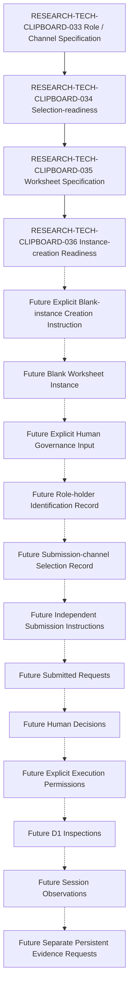

本文件只重新評估 RESEARCH-TECH-CLIPBOARD-035 是否已充分規格化，使未來可以建立一份完全空白、未填入治理資料、未指派 Holder、未選擇 Channel 且不具任何授權效果的 Worksheet Instance。

本文件不是 Worksheet Instance、Worksheet Instance ID 配置、Human Input 表單、Role-holder Nomination/Appointment、Channel/Platform Selection、Submission Instruction、Request Submission、Human Decision、Execution Permission、Inspection、Observation 或 Persistent Evidence。即使判定可準備空白 Instance，也不得因此實際建立 Instance。

## Document Control

| Field | Required value |
| --- | --- |
| Document ID | RESEARCH-TECH-CLIPBOARD-036 |
| Title | Clipboard Integration D1 Human Governance Worksheet-instance Creation Readiness Reassessment |
| Status | Draft |
| Research Type | Worksheet-instance Creation Readiness Reassessment |
| Technology Decision | TD-004 Clipboard Integration |
| Parent Worksheet Specification | RESEARCH-TECH-CLIPBOARD-035 |
| Parent Selection-readiness Reassessment | RESEARCH-TECH-CLIPBOARD-034 |
| Parent Role/Channel Specification | RESEARCH-TECH-CLIPBOARD-033 |
| Parent Portfolio Reassessment | RESEARCH-TECH-CLIPBOARD-032 |
| Covered Worksheet Sections | CLIP-D1-GOVWS-001..008 |
| Covered Role Blocks | CLIP-D1-GOVROLE-001..005 |
| Covered Channel Blocks | CLIP-D1-GOVCHAN-001..004 |
| Covered Request Blocks | CLIP-D1-GOVREQ-001..002 |
| Worksheet Instance Created | No |
| Worksheet Instance ID | Not assigned |
| Worksheet Revision | Not created |
| Human Input Collected | No |
| Human Attestation Collected | No |
| Role-holder Identity Collected | No |
| Channel Selected | No |
| Actual Platform Identified | No |
| Personal Data Collected | No |
| Requests Submitted | No |
| Human Decisions | Not made |
| Execution Authorizations | Not granted |
| Execution Permissions | No |
| Inspections | Not started |
| Session Observations | Not created |
| Persistent Evidence | Not created |
| Owner | TBD |
| Last reviewed | Not reviewed |

## 1. Purpose

判定範圍只有：RESEARCH-TECH-CLIPBOARD-035 能否支援未來建立一份結構完整、欄位保留、所有空值受控、沒有治理效果的空白 Worksheet Instance。

Instance Creation Readiness 不等於 Instance Created，不等於 Worksheet Instance ID 配置，不等於 Human Input、Role-holder、Channel、平台、Request、Decision 或 Permission 已存在。

## 2. Source Preservation

| Source family | Preserved references | Use |
| --- | --- | --- |
| Clipboard research baseline | RESEARCH-TECH-CLIPBOARD-010..014; RESEARCH-TECH-CLIPBOARD-020 | Scope and non-execution boundaries |
| Clipboard document chain | RESEARCH-TECH-CLIPBOARD-026..035 | Worksheet and readiness lineage |
| D1 portfolio and roles | CLIP-D1-REQPORT-001..002; CLIP-D1-ROLE-001..005 | Portfolio and five role blocks |
| Role assessment | CLIP-D1-AUTHCRIT-001..012; CLIP-D1-AUTHDISQ-001..010 | Blank assessment fields only |
| Channels and controls | CLIP-D1-SUBCH-001..004; CLIP-D1-SUBCTRL-001..012 | Blank channel blocks and controls |
| Packet and handoff | CLIP-D1-SUBPKT-001..020; CLIP-D1-SUBMANIFEST-001..002; CLIP-D1-DECREC-001..002; CLIP-D1-EXECHANDOFF-001..002 | No packet, decision or execution object |
| Worksheet specification | CLIP-D1-GOVWS-001..008; CLIP-D1-GOVMETA-001..015; CLIP-D1-GOVROLE-001..005; CLIP-D1-GOVCHAN-001..004; CLIP-D1-GOVREQ-001..002 | Structural source for blank-instance reassessment |
| Worksheet controls | CLIP-D1-GOVVAL-001..015; CLIP-D1-GOVATT-001..012 | Validation and attestation boundaries |
| Readiness and inspection | CLIP-REQREADY-001..002; CLIP-INSPECT-001..017; CLIP-D1-DOCITEM-001..017 | Future references only |
| Frozen product documentation | Frozen PRD, Clipboard Specs and Architecture responsibility boundaries | Product and responsibility boundaries |

本文件不修改第 56 至 63 份文件，不修訂 Worksheet Specification，不建立實際 Worksheet Instance，不填入人員、平台、Channel 或治理資料，不新增/刪除/重新編號欄位，不建立 CLIP-AUTH-*、UI-AUTH-* 或任何 Request/Authority/Decision/Execution 識別碼。

## 3. Controlled Vocabulary

| Vocabulary | Allowed values |
| --- | --- |
| Instance-creation Specification Coverage | Covered; Covered with unresolved future value; Partially covered; Missing; Not applicable |
| Instance-creation Readiness | Ready to prepare a future blank Worksheet Instance; Conditionally ready to prepare a future blank Worksheet Instance; Not ready to prepare a Worksheet Instance; Not applicable |
| Blank-field Initialization | Not assigned; Not identified; Not selected; Not provided; Not set; Not created; Not completed; Not evaluated; Not applicable |
| Instance State | Not created; Draft blank instance; Awaiting human input; Input complete — awaiting governance review; Returned for clarification; Governance input accepted for downstream selection record; Superseded |

本文件固定 Worksheet Instance State: Not created。不得將 Assigned、Selected、Submitted、Approved、Authorized、Executable、Verified 或 Passed 用作 Current value、Initialization 或 Readiness 狀態。

## 4. Eight-section Creation-readiness Registry

| Worksheet Section | Purpose traceable | Required fields traceable | Initialization rule bounded | Data classification bounded | Validation bounded | Stop condition bounded | Creation blocker | Creation readiness |
| --- | --- | --- | --- | --- | --- | --- | --- | --- |
| CLIP-D1-GOVWS-001 | Yes | Yes | Yes | Yes | Yes | Yes | No safety gap; future values remain blank | Ready to prepare a future blank Worksheet Instance |
| CLIP-D1-GOVWS-002 | Yes | Yes | Yes | Yes | Yes | Yes | No documentary blocker | Ready to prepare a future blank Worksheet Instance |
| CLIP-D1-GOVWS-003 | Yes | Yes | Yes | Yes | Yes | Yes | No safety gap; future values remain blank | Ready to prepare a future blank Worksheet Instance |
| CLIP-D1-GOVWS-004 | Yes | Yes | Yes | Yes | Yes | Yes | No documentary blocker | Ready to prepare a future blank Worksheet Instance |
| CLIP-D1-GOVWS-005 | Yes | Yes | Yes | Yes | Yes | Yes | No safety gap; future values remain blank | Ready to prepare a future blank Worksheet Instance |
| CLIP-D1-GOVWS-006 | Yes | Yes | Yes | Yes | Yes | Yes | No documentary blocker | Ready to prepare a future blank Worksheet Instance |
| CLIP-D1-GOVWS-007 | Yes | Yes | Yes | Yes | Yes | Yes | No documentary blocker | Ready to prepare a future blank Worksheet Instance |
| CLIP-D1-GOVWS-008 | Yes | Yes | Yes | Yes | Yes | Yes | No documentary blocker | Ready to prepare a future blank Worksheet Instance |

每個 Section 恰好出現一次；不得建立第 9 個 Section。Human Input 尚未提供不是 Specification Gap；無法定義安全空值或禁止欄位時，不得判定無條件 Ready；Creation readiness 不表示 Instance 已建立。

## 5. Fifteen Metadata-field Readiness Rows

| Metadata Field | Requirement traceable | Allowed value class bounded | Blank initialization bounded | Validation rule bounded | Future assignment source bounded | Current value | Creation effect |
| --- | --- | --- | --- | --- | --- | --- | --- |
| CLIP-D1-GOVMETA-001 | Yes | Yes | Yes | Yes | Yes | RESEARCH-TECH-CLIPBOARD-035 | Blank field preserved; no Instance object created |
| CLIP-D1-GOVMETA-002 | Yes | Yes | Yes | Yes | Yes | Not assigned | Blank field preserved; no Instance object created |
| CLIP-D1-GOVMETA-003 | Yes | Yes | Yes | Yes | Yes | Not created | Blank field preserved; no Instance object created |
| CLIP-D1-GOVMETA-004 | Yes | Yes | Yes | Yes | Yes | Not provided | Blank field preserved; no Instance object created |
| CLIP-D1-GOVMETA-005 | Yes | Yes | Yes | Yes | Yes | Not provided | Blank field preserved; no Instance object created |
| CLIP-D1-GOVMETA-006 | Yes | Yes | Yes | Yes | Yes | Not provided | Blank field preserved; no Instance object created |
| CLIP-D1-GOVMETA-007 | Yes | Yes | Yes | Yes | Yes | Not identified | Blank field preserved; no Instance object created |
| CLIP-D1-GOVMETA-008 | Yes | Yes | Yes | Yes | Yes | Not set | Blank field preserved; no Instance object created |
| CLIP-D1-GOVMETA-009 | Yes | Yes | Yes | Yes | Yes | Not provided | Blank field preserved; no Instance object created |
| CLIP-D1-GOVMETA-010 | Yes | Yes | Yes | Yes | Yes | Not provided | Blank field preserved; no Instance object created |
| CLIP-D1-GOVMETA-011 | Yes | Yes | Yes | Yes | Yes | Not provided | Blank field preserved; no Instance object created |
| CLIP-D1-GOVMETA-012 | Yes | Yes | Yes | Yes | Yes | Not provided | Blank field preserved; no Instance object created |
| CLIP-D1-GOVMETA-013 | Yes | Yes | Yes | Yes | Yes | Not provided | Blank field preserved; no Instance object created |
| CLIP-D1-GOVMETA-014 | Yes | Yes | Yes | Yes | Yes | Not provided | Blank field preserved; no Instance object created |
| CLIP-D1-GOVMETA-015 | Yes | Yes | Yes | Yes | Yes | Not created | Blank field preserved; no Instance object created |

Worksheet Instance identifier 固定 Not assigned；Worksheet revision 固定 Not created；Preparer identity reference 固定 Not identified；Creation date/time 固定 Not set；Instance state 固定 Not created。不得預先產生 Instance ID、Revision 或 Timestamp，不得將 Document ID 或 Git commit 當作 Instance identifier。

## 6. Five Role-block Creation Readiness Rows

| Role Block | Functional Role | Twenty-four fields present | Initialization values bounded | Eligibility linkage bounded | Conflict linkage bounded | Personal-data exclusion bounded | Creation readiness |
| --- | --- | --- | --- | --- | --- | --- | --- |
| CLIP-D1-GOVROLE-001 | CLIP-D1-ROLE-001 Request Preparer | Yes | Yes | Yes | Yes | Yes | Ready to prepare a future blank Worksheet Instance |
| CLIP-D1-GOVROLE-002 | CLIP-D1-ROLE-002 Technical Scope Reviewer | Yes | Yes | Yes | Yes | Yes | Ready to prepare a future blank Worksheet Instance |
| CLIP-D1-GOVROLE-003 | CLIP-D1-ROLE-003 Decision Authority | Yes | Yes | Yes | Yes | Yes | Ready to prepare a future blank Worksheet Instance |
| CLIP-D1-GOVROLE-004 | CLIP-D1-ROLE-004 Execution Operator | Yes | Yes | Yes | Yes | Yes | Ready to prepare a future blank Worksheet Instance |
| CLIP-D1-GOVROLE-005 | CLIP-D1-ROLE-005 Observation and Evidence Custodian | Yes | Yes | Yes | Yes | Yes | Ready to prepare a future blank Worksheet Instance |

每個 Block 維持 24 個欄位；不得新增或刪除欄位；所有 Holder 及 Attestation 值保持未提供；文件作者不得初始化為 Request Preparer，Repository Owner 不得初始化為 Decision Authority。

## 7. One-hundred-twenty Role-field Readiness Rows

| Role Block | Field ordinal | Field name | Requirement | Blank initialization | Future human source | Prohibited auto-fill | Validation result |
| --- | --- | --- | --- | --- | --- | --- | --- |
| CLIP-D1-GOVROLE-001 | 01 | Governance Role Input Block ID | Yes | Not identified | Future human governance input | No automatic value | Ready with unresolved future value |
| CLIP-D1-GOVROLE-001 | 02 | Functional Role ID | Yes | Not identified | Future human governance input | No automatic value | Ready with unresolved future value |
| CLIP-D1-GOVROLE-001 | 03 | Functional Role name | Yes | Not provided | Future human governance input | No automatic value | Ready with unresolved future value |
| CLIP-D1-GOVROLE-001 | 04 | Applicable Portfolio Items | Yes | Not provided | Future human governance input | No automatic value | Ready with unresolved future value |
| CLIP-D1-GOVROLE-001 | 05 | Holder required at Draft stage | Yes | Not provided | Future human governance input | No automatic value | Ready with unresolved future value |
| CLIP-D1-GOVROLE-001 | 06 | Holder required before Submission | Yes | Not provided | Future human governance input | No automatic value | Ready with unresolved future value |
| CLIP-D1-GOVROLE-001 | 07 | Holder required before Human Decision | Yes | Not provided | Future human governance input | No automatic value | Ready with unresolved future value |
| CLIP-D1-GOVROLE-001 | 08 | Holder required before Execution Permission | Yes | Not provided | Future human governance input | No automatic value | Ready with unresolved future value |
| CLIP-D1-GOVROLE-001 | 09 | Holder required before Execution | Yes | Not provided | Future human governance input | No automatic value | Ready with unresolved future value |
| CLIP-D1-GOVROLE-001 | 10 | Future Role-holder governance identity reference | Yes | Not provided | Future human governance input | No auto-fill | Ready with unresolved future value |
| CLIP-D1-GOVROLE-001 | 11 | Identification source | Yes | Not provided | Future human governance input | No auto-fill | Ready with unresolved future value |
| CLIP-D1-GOVROLE-001 | 12 | Role acceptance | Yes | Not provided | Future human governance input | No auto-fill | Ready with unresolved future value |
| CLIP-D1-GOVROLE-001 | 13 | Responsibility acknowledgement | Yes | Not provided | Future human governance input | No auto-fill | Ready with unresolved future value |
| CLIP-D1-GOVROLE-001 | 14 | Permitted-action acknowledgement | Yes | Not provided | Future human governance input | No auto-fill | Ready with unresolved future value |
| CLIP-D1-GOVROLE-001 | 15 | Prohibited-action acknowledgement | Yes | Not provided | Future human governance input | No auto-fill | Ready with unresolved future value |
| CLIP-D1-GOVROLE-001 | 16 | Required access-class acknowledgement | Yes | Not provided | Future human governance input | No auto-fill | Ready with unresolved future value |
| CLIP-D1-GOVROLE-001 | 17 | Eligibility assessment reference | Yes | Not provided | Future human governance input | No automatic value | Ready with unresolved future value |
| CLIP-D1-GOVROLE-001 | 18 | Disqualifying-condition assessment reference | Yes | Not provided | Future human governance input | No automatic value | Ready with unresolved future value |
| CLIP-D1-GOVROLE-001 | 19 | Conflict disclosure reference | Yes | Not provided | Future human governance input | No automatic value | Ready with unresolved future value |
| CLIP-D1-GOVROLE-001 | 20 | Required separation safeguard | Yes | Not provided | Future human governance input | No automatic value | Ready with unresolved future value |
| CLIP-D1-GOVROLE-001 | 21 | Effective scope | Yes | Not provided | Future human governance input | No auto-fill | Ready with unresolved future value |
| CLIP-D1-GOVROLE-001 | 22 | Effective date/time | Yes | Not set | Future human governance input | No auto-fill | Ready with unresolved future value |
| CLIP-D1-GOVROLE-001 | 23 | Withdrawal/replacement rule | Yes | Not provided | Future human governance input | No automatic value | Ready with unresolved future value |
| CLIP-D1-GOVROLE-001 | 24 | Recorded human identification reference | Yes | Not provided | Future human governance input | No auto-fill | Ready with unresolved future value |
| CLIP-D1-GOVROLE-002 | 01 | Governance Role Input Block ID | Yes | Not identified | Future human governance input | No automatic value | Ready with unresolved future value |
| CLIP-D1-GOVROLE-002 | 02 | Functional Role ID | Yes | Not identified | Future human governance input | No automatic value | Ready with unresolved future value |
| CLIP-D1-GOVROLE-002 | 03 | Functional Role name | Yes | Not provided | Future human governance input | No automatic value | Ready with unresolved future value |
| CLIP-D1-GOVROLE-002 | 04 | Applicable Portfolio Items | Yes | Not provided | Future human governance input | No automatic value | Ready with unresolved future value |
| CLIP-D1-GOVROLE-002 | 05 | Holder required at Draft stage | Yes | Not provided | Future human governance input | No automatic value | Ready with unresolved future value |
| CLIP-D1-GOVROLE-002 | 06 | Holder required before Submission | Yes | Not provided | Future human governance input | No automatic value | Ready with unresolved future value |
| CLIP-D1-GOVROLE-002 | 07 | Holder required before Human Decision | Yes | Not provided | Future human governance input | No automatic value | Ready with unresolved future value |
| CLIP-D1-GOVROLE-002 | 08 | Holder required before Execution Permission | Yes | Not provided | Future human governance input | No automatic value | Ready with unresolved future value |
| CLIP-D1-GOVROLE-002 | 09 | Holder required before Execution | Yes | Not provided | Future human governance input | No automatic value | Ready with unresolved future value |
| CLIP-D1-GOVROLE-002 | 10 | Future Role-holder governance identity reference | Yes | Not provided | Future human governance input | No auto-fill | Ready with unresolved future value |
| CLIP-D1-GOVROLE-002 | 11 | Identification source | Yes | Not provided | Future human governance input | No auto-fill | Ready with unresolved future value |
| CLIP-D1-GOVROLE-002 | 12 | Role acceptance | Yes | Not provided | Future human governance input | No auto-fill | Ready with unresolved future value |
| CLIP-D1-GOVROLE-002 | 13 | Responsibility acknowledgement | Yes | Not provided | Future human governance input | No auto-fill | Ready with unresolved future value |
| CLIP-D1-GOVROLE-002 | 14 | Permitted-action acknowledgement | Yes | Not provided | Future human governance input | No auto-fill | Ready with unresolved future value |
| CLIP-D1-GOVROLE-002 | 15 | Prohibited-action acknowledgement | Yes | Not provided | Future human governance input | No auto-fill | Ready with unresolved future value |
| CLIP-D1-GOVROLE-002 | 16 | Required access-class acknowledgement | Yes | Not provided | Future human governance input | No auto-fill | Ready with unresolved future value |
| CLIP-D1-GOVROLE-002 | 17 | Eligibility assessment reference | Yes | Not provided | Future human governance input | No automatic value | Ready with unresolved future value |
| CLIP-D1-GOVROLE-002 | 18 | Disqualifying-condition assessment reference | Yes | Not provided | Future human governance input | No automatic value | Ready with unresolved future value |
| CLIP-D1-GOVROLE-002 | 19 | Conflict disclosure reference | Yes | Not provided | Future human governance input | No automatic value | Ready with unresolved future value |
| CLIP-D1-GOVROLE-002 | 20 | Required separation safeguard | Yes | Not provided | Future human governance input | No automatic value | Ready with unresolved future value |
| CLIP-D1-GOVROLE-002 | 21 | Effective scope | Yes | Not provided | Future human governance input | No auto-fill | Ready with unresolved future value |
| CLIP-D1-GOVROLE-002 | 22 | Effective date/time | Yes | Not set | Future human governance input | No auto-fill | Ready with unresolved future value |
| CLIP-D1-GOVROLE-002 | 23 | Withdrawal/replacement rule | Yes | Not provided | Future human governance input | No automatic value | Ready with unresolved future value |
| CLIP-D1-GOVROLE-002 | 24 | Recorded human identification reference | Yes | Not provided | Future human governance input | No auto-fill | Ready with unresolved future value |
| CLIP-D1-GOVROLE-003 | 01 | Governance Role Input Block ID | Yes | Not identified | Future human governance input | No automatic value | Ready with unresolved future value |
| CLIP-D1-GOVROLE-003 | 02 | Functional Role ID | Yes | Not identified | Future human governance input | No automatic value | Ready with unresolved future value |
| CLIP-D1-GOVROLE-003 | 03 | Functional Role name | Yes | Not provided | Future human governance input | No automatic value | Ready with unresolved future value |
| CLIP-D1-GOVROLE-003 | 04 | Applicable Portfolio Items | Yes | Not provided | Future human governance input | No automatic value | Ready with unresolved future value |
| CLIP-D1-GOVROLE-003 | 05 | Holder required at Draft stage | Yes | Not provided | Future human governance input | No automatic value | Ready with unresolved future value |
| CLIP-D1-GOVROLE-003 | 06 | Holder required before Submission | Yes | Not provided | Future human governance input | No automatic value | Ready with unresolved future value |
| CLIP-D1-GOVROLE-003 | 07 | Holder required before Human Decision | Yes | Not provided | Future human governance input | No automatic value | Ready with unresolved future value |
| CLIP-D1-GOVROLE-003 | 08 | Holder required before Execution Permission | Yes | Not provided | Future human governance input | No automatic value | Ready with unresolved future value |
| CLIP-D1-GOVROLE-003 | 09 | Holder required before Execution | Yes | Not provided | Future human governance input | No automatic value | Ready with unresolved future value |
| CLIP-D1-GOVROLE-003 | 10 | Future Role-holder governance identity reference | Yes | Not provided | Future human governance input | No auto-fill | Ready with unresolved future value |
| CLIP-D1-GOVROLE-003 | 11 | Identification source | Yes | Not provided | Future human governance input | No auto-fill | Ready with unresolved future value |
| CLIP-D1-GOVROLE-003 | 12 | Role acceptance | Yes | Not provided | Future human governance input | No auto-fill | Ready with unresolved future value |
| CLIP-D1-GOVROLE-003 | 13 | Responsibility acknowledgement | Yes | Not provided | Future human governance input | No auto-fill | Ready with unresolved future value |
| CLIP-D1-GOVROLE-003 | 14 | Permitted-action acknowledgement | Yes | Not provided | Future human governance input | No auto-fill | Ready with unresolved future value |
| CLIP-D1-GOVROLE-003 | 15 | Prohibited-action acknowledgement | Yes | Not provided | Future human governance input | No auto-fill | Ready with unresolved future value |
| CLIP-D1-GOVROLE-003 | 16 | Required access-class acknowledgement | Yes | Not provided | Future human governance input | No auto-fill | Ready with unresolved future value |
| CLIP-D1-GOVROLE-003 | 17 | Eligibility assessment reference | Yes | Not provided | Future human governance input | No automatic value | Ready with unresolved future value |
| CLIP-D1-GOVROLE-003 | 18 | Disqualifying-condition assessment reference | Yes | Not provided | Future human governance input | No automatic value | Ready with unresolved future value |
| CLIP-D1-GOVROLE-003 | 19 | Conflict disclosure reference | Yes | Not provided | Future human governance input | No automatic value | Ready with unresolved future value |
| CLIP-D1-GOVROLE-003 | 20 | Required separation safeguard | Yes | Not provided | Future human governance input | No automatic value | Ready with unresolved future value |
| CLIP-D1-GOVROLE-003 | 21 | Effective scope | Yes | Not provided | Future human governance input | No auto-fill | Ready with unresolved future value |
| CLIP-D1-GOVROLE-003 | 22 | Effective date/time | Yes | Not set | Future human governance input | No auto-fill | Ready with unresolved future value |
| CLIP-D1-GOVROLE-003 | 23 | Withdrawal/replacement rule | Yes | Not provided | Future human governance input | No automatic value | Ready with unresolved future value |
| CLIP-D1-GOVROLE-003 | 24 | Recorded human identification reference | Yes | Not provided | Future human governance input | No auto-fill | Ready with unresolved future value |
| CLIP-D1-GOVROLE-004 | 01 | Governance Role Input Block ID | Yes | Not identified | Future human governance input | No automatic value | Ready with unresolved future value |
| CLIP-D1-GOVROLE-004 | 02 | Functional Role ID | Yes | Not identified | Future human governance input | No automatic value | Ready with unresolved future value |
| CLIP-D1-GOVROLE-004 | 03 | Functional Role name | Yes | Not provided | Future human governance input | No automatic value | Ready with unresolved future value |
| CLIP-D1-GOVROLE-004 | 04 | Applicable Portfolio Items | Yes | Not provided | Future human governance input | No automatic value | Ready with unresolved future value |
| CLIP-D1-GOVROLE-004 | 05 | Holder required at Draft stage | Yes | Not provided | Future human governance input | No automatic value | Ready with unresolved future value |
| CLIP-D1-GOVROLE-004 | 06 | Holder required before Submission | Yes | Not provided | Future human governance input | No automatic value | Ready with unresolved future value |
| CLIP-D1-GOVROLE-004 | 07 | Holder required before Human Decision | Yes | Not provided | Future human governance input | No automatic value | Ready with unresolved future value |
| CLIP-D1-GOVROLE-004 | 08 | Holder required before Execution Permission | Yes | Not provided | Future human governance input | No automatic value | Ready with unresolved future value |
| CLIP-D1-GOVROLE-004 | 09 | Holder required before Execution | Yes | Not provided | Future human governance input | No automatic value | Ready with unresolved future value |
| CLIP-D1-GOVROLE-004 | 10 | Future Role-holder governance identity reference | Yes | Not provided | Future human governance input | No auto-fill | Ready with unresolved future value |
| CLIP-D1-GOVROLE-004 | 11 | Identification source | Yes | Not provided | Future human governance input | No auto-fill | Ready with unresolved future value |
| CLIP-D1-GOVROLE-004 | 12 | Role acceptance | Yes | Not provided | Future human governance input | No auto-fill | Ready with unresolved future value |
| CLIP-D1-GOVROLE-004 | 13 | Responsibility acknowledgement | Yes | Not provided | Future human governance input | No auto-fill | Ready with unresolved future value |
| CLIP-D1-GOVROLE-004 | 14 | Permitted-action acknowledgement | Yes | Not provided | Future human governance input | No auto-fill | Ready with unresolved future value |
| CLIP-D1-GOVROLE-004 | 15 | Prohibited-action acknowledgement | Yes | Not provided | Future human governance input | No auto-fill | Ready with unresolved future value |
| CLIP-D1-GOVROLE-004 | 16 | Required access-class acknowledgement | Yes | Not provided | Future human governance input | No auto-fill | Ready with unresolved future value |
| CLIP-D1-GOVROLE-004 | 17 | Eligibility assessment reference | Yes | Not provided | Future human governance input | No automatic value | Ready with unresolved future value |
| CLIP-D1-GOVROLE-004 | 18 | Disqualifying-condition assessment reference | Yes | Not provided | Future human governance input | No automatic value | Ready with unresolved future value |
| CLIP-D1-GOVROLE-004 | 19 | Conflict disclosure reference | Yes | Not provided | Future human governance input | No automatic value | Ready with unresolved future value |
| CLIP-D1-GOVROLE-004 | 20 | Required separation safeguard | Yes | Not provided | Future human governance input | No automatic value | Ready with unresolved future value |
| CLIP-D1-GOVROLE-004 | 21 | Effective scope | Yes | Not provided | Future human governance input | No auto-fill | Ready with unresolved future value |
| CLIP-D1-GOVROLE-004 | 22 | Effective date/time | Yes | Not set | Future human governance input | No auto-fill | Ready with unresolved future value |
| CLIP-D1-GOVROLE-004 | 23 | Withdrawal/replacement rule | Yes | Not provided | Future human governance input | No automatic value | Ready with unresolved future value |
| CLIP-D1-GOVROLE-004 | 24 | Recorded human identification reference | Yes | Not provided | Future human governance input | No auto-fill | Ready with unresolved future value |
| CLIP-D1-GOVROLE-005 | 01 | Governance Role Input Block ID | Yes | Not identified | Future human governance input | No automatic value | Ready with unresolved future value |
| CLIP-D1-GOVROLE-005 | 02 | Functional Role ID | Yes | Not identified | Future human governance input | No automatic value | Ready with unresolved future value |
| CLIP-D1-GOVROLE-005 | 03 | Functional Role name | Yes | Not provided | Future human governance input | No automatic value | Ready with unresolved future value |
| CLIP-D1-GOVROLE-005 | 04 | Applicable Portfolio Items | Yes | Not provided | Future human governance input | No automatic value | Ready with unresolved future value |
| CLIP-D1-GOVROLE-005 | 05 | Holder required at Draft stage | Yes | Not provided | Future human governance input | No automatic value | Ready with unresolved future value |
| CLIP-D1-GOVROLE-005 | 06 | Holder required before Submission | Yes | Not provided | Future human governance input | No automatic value | Ready with unresolved future value |
| CLIP-D1-GOVROLE-005 | 07 | Holder required before Human Decision | Yes | Not provided | Future human governance input | No automatic value | Ready with unresolved future value |
| CLIP-D1-GOVROLE-005 | 08 | Holder required before Execution Permission | Yes | Not provided | Future human governance input | No automatic value | Ready with unresolved future value |
| CLIP-D1-GOVROLE-005 | 09 | Holder required before Execution | Yes | Not provided | Future human governance input | No automatic value | Ready with unresolved future value |
| CLIP-D1-GOVROLE-005 | 10 | Future Role-holder governance identity reference | Yes | Not provided | Future human governance input | No auto-fill | Ready with unresolved future value |
| CLIP-D1-GOVROLE-005 | 11 | Identification source | Yes | Not provided | Future human governance input | No auto-fill | Ready with unresolved future value |
| CLIP-D1-GOVROLE-005 | 12 | Role acceptance | Yes | Not provided | Future human governance input | No auto-fill | Ready with unresolved future value |
| CLIP-D1-GOVROLE-005 | 13 | Responsibility acknowledgement | Yes | Not provided | Future human governance input | No auto-fill | Ready with unresolved future value |
| CLIP-D1-GOVROLE-005 | 14 | Permitted-action acknowledgement | Yes | Not provided | Future human governance input | No auto-fill | Ready with unresolved future value |
| CLIP-D1-GOVROLE-005 | 15 | Prohibited-action acknowledgement | Yes | Not provided | Future human governance input | No auto-fill | Ready with unresolved future value |
| CLIP-D1-GOVROLE-005 | 16 | Required access-class acknowledgement | Yes | Not provided | Future human governance input | No auto-fill | Ready with unresolved future value |
| CLIP-D1-GOVROLE-005 | 17 | Eligibility assessment reference | Yes | Not provided | Future human governance input | No automatic value | Ready with unresolved future value |
| CLIP-D1-GOVROLE-005 | 18 | Disqualifying-condition assessment reference | Yes | Not provided | Future human governance input | No automatic value | Ready with unresolved future value |
| CLIP-D1-GOVROLE-005 | 19 | Conflict disclosure reference | Yes | Not provided | Future human governance input | No automatic value | Ready with unresolved future value |
| CLIP-D1-GOVROLE-005 | 20 | Required separation safeguard | Yes | Not provided | Future human governance input | No automatic value | Ready with unresolved future value |
| CLIP-D1-GOVROLE-005 | 21 | Effective scope | Yes | Not provided | Future human governance input | No auto-fill | Ready with unresolved future value |
| CLIP-D1-GOVROLE-005 | 22 | Effective date/time | Yes | Not set | Future human governance input | No auto-fill | Ready with unresolved future value |
| CLIP-D1-GOVROLE-005 | 23 | Withdrawal/replacement rule | Yes | Not provided | Future human governance input | No automatic value | Ready with unresolved future value |
| CLIP-D1-GOVROLE-005 | 24 | Recorded human identification reference | Yes | Not provided | Future human governance input | No auto-fill | Ready with unresolved future value |

每個 Role Block 恰好 24 列，Field ordinal 固定為 01..24，每個上游欄位恰好出現一次。不得重新命名欄位；實際 Holder、Identity、Acceptance、Attestation 及日期欄位不得自動填入。

## 8. Twelve Eligibility-field Creation Rows

| Eligibility Criterion | Worksheet question traceable | Response class bounded | Supporting reference bounded | Blank response | Auto-evaluation prohibited | Creation result |
| --- | --- | --- | --- | --- | --- | --- |
| CLIP-D1-AUTHCRIT-001 Role scope matches requested governance action | Yes | Yes | Yes | Not provided | Yes | Ready with unresolved future value |
| CLIP-D1-AUTHCRIT-002 Relevant technical competence | Yes | Yes | Yes | Not provided | Yes | Ready with unresolved future value |
| CLIP-D1-AUTHCRIT-003 Independence from the decision under review | Yes | Yes | Yes | Not provided | Yes | Ready with unresolved future value |
| CLIP-D1-AUTHCRIT-004 Authority to accept a request | Yes | Yes | Yes | Not provided | Yes | Ready with unresolved future value |
| CLIP-D1-AUTHCRIT-005 Authority to issue execution permission | Yes | Yes | Yes | Not provided | Yes | Ready with unresolved future value |
| CLIP-D1-AUTHCRIT-006 Ability to review scope and prerequisites | Yes | Yes | Yes | Not provided | Yes | Ready with unresolved future value |
| CLIP-D1-AUTHCRIT-007 Ability to operate within approved constraints | Yes | Yes | Yes | Not provided | Yes | Ready with unresolved future value |
| CLIP-D1-AUTHCRIT-008 Ability to preserve observation integrity | Yes | Yes | Yes | Not provided | Yes | Ready with unresolved future value |
| CLIP-D1-AUTHCRIT-009 Ability to follow privacy and confidentiality controls | Yes | Yes | Yes | Not provided | Yes | Ready with unresolved future value |
| CLIP-D1-AUTHCRIT-010 Ability to record traceable governance state | Yes | Yes | Yes | Not provided | Yes | Ready with unresolved future value |
| CLIP-D1-AUTHCRIT-011 Availability for the effective request period | Yes | Yes | Yes | Not provided | Yes | Ready with unresolved future value |
| CLIP-D1-AUTHCRIT-012 Acceptance of role boundaries and recusal rules | Yes | Yes | Yes | Not provided | Yes | Ready with unresolved future value |

不得預填 Yes 或 No，不得推導實際人員資格，不得建立分數、權重或合格門檻。

## 9. Ten Disqualifying-condition Creation Rows

| Disqualifying Condition | Question traceable | Required response bounded | Explanation field bounded | Blank response | Trigger state initialized | Creation result |
| --- | --- | --- | --- | --- | --- | --- |
| CLIP-D1-AUTHDISQ-001 Direct conflict with the request outcome | Yes | Yes | Yes | Not provided | Not evaluated | Ready with unresolved future value |
| CLIP-D1-AUTHDISQ-002 Self-approval of a request or execution permission | Yes | Yes | Yes | Not provided | Not evaluated | Ready with unresolved future value |
| CLIP-D1-AUTHDISQ-003 Undisclosed financial or operational interest | Yes | Yes | Yes | Not provided | Not evaluated | Ready with unresolved future value |
| CLIP-D1-AUTHDISQ-004 Authority scope does not cover the requested action | Yes | Yes | Yes | Not provided | Not evaluated | Ready with unresolved future value |
| CLIP-D1-AUTHDISQ-005 Missing required competence evidence | Yes | Yes | Yes | Not provided | Not evaluated | Ready with unresolved future value |
| CLIP-D1-AUTHDISQ-006 Refusal to accept role boundaries | Yes | Yes | Yes | Not provided | Not evaluated | Ready with unresolved future value |
| CLIP-D1-AUTHDISQ-007 Inability to preserve confidentiality | Yes | Yes | Yes | Not provided | Not evaluated | Ready with unresolved future value |
| CLIP-D1-AUTHDISQ-008 Inability to preserve traceability | Yes | Yes | Yes | Not provided | Not evaluated | Ready with unresolved future value |
| CLIP-D1-AUTHDISQ-009 Unresolved recusal or separation conflict | Yes | Yes | Yes | Not provided | Not evaluated | Ready with unresolved future value |
| CLIP-D1-AUTHDISQ-010 Role effective period is absent or expired | Yes | Yes | Yes | Not provided | Not evaluated | Ready with unresolved future value |

不得將任何 Condition 初始化為 Triggered 或 Cleared。

## 10. Ten Role-separation Creation Rows

| Role combination | Combination rule traceable | Disclosure field bounded | Safeguard field bounded | Blank proposal | Blank assessment | Creation result |
| --- | --- | --- | --- | --- | --- | --- |
| Request Preparer / Technical Scope Reviewer | Yes | Yes | Yes | Not provided | Not evaluated | Ready with unresolved future value |
| Request Preparer / Decision Authority | Yes | Yes | Yes | Not provided | Not evaluated | Ready with unresolved future value |
| Request Preparer / Execution Operator | Yes | Yes | Yes | Not provided | Not evaluated | Ready with unresolved future value |
| Request Preparer / Observation and Evidence Custodian | Yes | Yes | Yes | Not provided | Not evaluated | Ready with unresolved future value |
| Technical Scope Reviewer / Decision Authority | Yes | Yes | Yes | Not provided | Not evaluated | Ready with unresolved future value |
| Technical Scope Reviewer / Execution Operator | Yes | Yes | Yes | Not provided | Not evaluated | Ready with unresolved future value |
| Technical Scope Reviewer / Observation and Evidence Custodian | Yes | Yes | Yes | Not provided | Not evaluated | Ready with unresolved future value |
| Decision Authority / Execution Operator | Yes | Yes | Yes | Not provided | Not evaluated | Ready with unresolved future value |
| Decision Authority / Observation and Evidence Custodian | Yes | Yes | Yes | Not provided | Not evaluated | Ready with unresolved future value |
| Execution Operator / Observation and Evidence Custodian | Yes | Yes | Yes | Not provided | Not evaluated | Ready with unresolved future value |

不得預先決定同一人可兼任、同一人不可兼任、實際 Recusal 或實際 Separation arrangement。

## 11. Eight Conflict / Recusal Creation Rows

| Conflict Scenario | Disclosure field bounded | Recusal field bounded | Separation field bounded | Blank disclosure | Blank assessment | Creation result |
| --- | --- | --- | --- | --- | --- | --- |
| Request Preparer also acts as Decision Authority | Yes | Yes | Yes | Not provided | Not evaluated | Ready with unresolved future value |
| Technical Scope Reviewer also acts as Decision Authority | Yes | Yes | Yes | Not provided | Not evaluated | Ready with unresolved future value |
| Decision Authority also acts as Execution Operator | Yes | Yes | Yes | Not provided | Not evaluated | Ready with unresolved future value |
| Decision Authority also acts as Observation/Evidence Custodian | Yes | Yes | Yes | Not provided | Not evaluated | Ready with unresolved future value |
| Request Preparer and Technical Scope Reviewer share an interest | Yes | Yes | Yes | Not provided | Not evaluated | Ready with unresolved future value |
| Execution Operator and Evidence Custodian share operational control | Yes | Yes | Yes | Not provided | Not evaluated | Ready with unresolved future value |
| Authority identity is unavailable in the selected record path | Yes | Yes | Yes | Not provided | Not evaluated | Ready with unresolved future value |
| Channel operator can alter the decision or evidence record | Yes | Yes | Yes | Not provided | Not evaluated | Ready with unresolved future value |

不得聲稱存在或不存在實際 Conflict。

## 12. Four Channel-block Creation Readiness Rows

| Channel Block | Channel Class | Twenty-four fields present | Initialization values bounded | Security controls bounded | Platform absence explicit | Channel remains unselected | Creation readiness |
| --- | --- | --- | --- | --- | --- | --- | --- |
| CLIP-D1-GOVCHAN-001 | CLIP-D1-SUBCH-001 Repository-governed Review Record | Yes | Yes | Yes | Yes | Yes | Ready to prepare a future blank Worksheet Instance |
| CLIP-D1-GOVCHAN-002 | CLIP-D1-SUBCH-002 Managed Work-item or Ticket Record | Yes | Yes | Yes | Yes | Yes | Ready to prepare a future blank Worksheet Instance |
| CLIP-D1-GOVCHAN-003 | CLIP-D1-SUBCH-003 Signed Electronic Decision Record | Yes | Yes | Yes | Yes | Yes | Ready to prepare a future blank Worksheet Instance |
| CLIP-D1-GOVCHAN-004 | CLIP-D1-SUBCH-004 Recorded Synchronous Review with Archived Decision Record | Yes | Yes | Yes | Yes | Yes | Ready to prepare a future blank Worksheet Instance |

Actual Platform 固定 Not identified；Channel Identifier 固定 Not assigned；Channel Selection Decision 固定 Not created；Selection State 固定 Not selected；不得建立第 5 個 Channel Block。

## 13. Ninety-six Channel-field Readiness Rows

| Channel Block | Field ordinal | Field name | Requirement | Blank initialization | Future platform/human source | Prohibited auto-fill | Validation result |
| --- | --- | --- | --- | --- | --- | --- | --- |
| CLIP-D1-GOVCHAN-001 | 01 | Governance Channel Input Block ID | Yes | Not provided | Future platform or human governance input | No auto-fill | Ready with unresolved future value |
| CLIP-D1-GOVCHAN-001 | 02 | Channel Class ID | Yes | Not provided | Future platform or human governance input | No auto-fill | Ready with unresolved future value |
| CLIP-D1-GOVCHAN-001 | 03 | Channel Class name | Yes | Not provided | Future platform or human governance input | No auto-fill | Ready with unresolved future value |
| CLIP-D1-GOVCHAN-001 | 04 | Applicable Portfolio Items | Yes | Not provided | Future platform or human governance input | No auto-fill | Ready with unresolved future value |
| CLIP-D1-GOVCHAN-001 | 05 | Actual platform/record-system identity | Yes | Not identified | Future platform or human governance input | No auto-fill | Ready with unresolved future value |
| CLIP-D1-GOVCHAN-001 | 06 | Channel identifier | Yes | Not assigned | Future platform or human governance input | No auto-fill | Ready with unresolved future value |
| CLIP-D1-GOVCHAN-001 | 07 | Submitter identity mechanism | Yes | Not identified | Future platform or human governance input | No auto-fill | Ready with unresolved future value |
| CLIP-D1-GOVCHAN-001 | 08 | Decision Authority identity mechanism | Yes | Not identified | Future platform or human governance input | No auto-fill | Ready with unresolved future value |
| CLIP-D1-GOVCHAN-001 | 09 | Access-control model | Yes | Not provided | Future platform or human governance input | No auto-fill | Ready with unresolved future value |
| CLIP-D1-GOVCHAN-001 | 10 | Authentication model | Yes | Not provided | Future platform or human governance input | No auto-fill | Ready with unresolved future value |
| CLIP-D1-GOVCHAN-001 | 11 | Network requirement | Yes | Not provided | Future platform or human governance input | No auto-fill | Ready with unresolved future value |
| CLIP-D1-GOVCHAN-001 | 12 | External-system dependency | Yes | Not provided | Future platform or human governance input | No auto-fill | Ready with unresolved future value |
| CLIP-D1-GOVCHAN-001 | 13 | Request snapshot mechanism | Yes | Not provided | Future platform or human governance input | No auto-fill | Ready with unresolved future value |
| CLIP-D1-GOVCHAN-001 | 14 | Snapshot immutability control | Yes | Not provided | Future platform or human governance input | No auto-fill | Ready with unresolved future value |
| CLIP-D1-GOVCHAN-001 | 15 | Decision record mechanism | Yes | Not provided | Future platform or human governance input | No auto-fill | Ready with unresolved future value |
| CLIP-D1-GOVCHAN-001 | 16 | Revision/supersession mechanism | Yes | Not provided | Future platform or human governance input | No auto-fill | Ready with unresolved future value |
| CLIP-D1-GOVCHAN-001 | 17 | Confidentiality classification | Yes | Not provided | Future platform or human governance input | No auto-fill | Ready with unresolved future value |
| CLIP-D1-GOVCHAN-001 | 18 | Retention rule | Yes | Not provided | Future platform or human governance input | No auto-fill | Ready with unresolved future value |
| CLIP-D1-GOVCHAN-001 | 19 | Separate Decision per Request control | Yes | Not provided | Future platform or human governance input | No auto-fill | Ready with unresolved future value |
| CLIP-D1-GOVCHAN-001 | 20 | Explicit Execution Permission control | Yes | Not provided | Future platform or human governance input | No auto-fill | Ready with unresolved future value |
| CLIP-D1-GOVCHAN-001 | 21 | Observation permission control | Yes | Not provided | Future platform or human governance input | No auto-fill | Ready with unresolved future value |
| CLIP-D1-GOVCHAN-001 | 22 | Persistent Evidence separation control | Yes | Not provided | Future platform or human governance input | No auto-fill | Ready with unresolved future value |
| CLIP-D1-GOVCHAN-001 | 23 | Channel-selection decision reference | Yes | Not created | Future platform or human governance input | No auto-fill | Ready with unresolved future value |
| CLIP-D1-GOVCHAN-001 | 24 | Channel current selection state | Yes | Not selected | Future platform or human governance input | No auto-fill | Ready with unresolved future value |
| CLIP-D1-GOVCHAN-002 | 01 | Governance Channel Input Block ID | Yes | Not provided | Future platform or human governance input | No auto-fill | Ready with unresolved future value |
| CLIP-D1-GOVCHAN-002 | 02 | Channel Class ID | Yes | Not provided | Future platform or human governance input | No auto-fill | Ready with unresolved future value |
| CLIP-D1-GOVCHAN-002 | 03 | Channel Class name | Yes | Not provided | Future platform or human governance input | No auto-fill | Ready with unresolved future value |
| CLIP-D1-GOVCHAN-002 | 04 | Applicable Portfolio Items | Yes | Not provided | Future platform or human governance input | No auto-fill | Ready with unresolved future value |
| CLIP-D1-GOVCHAN-002 | 05 | Actual platform/record-system identity | Yes | Not identified | Future platform or human governance input | No auto-fill | Ready with unresolved future value |
| CLIP-D1-GOVCHAN-002 | 06 | Channel identifier | Yes | Not assigned | Future platform or human governance input | No auto-fill | Ready with unresolved future value |
| CLIP-D1-GOVCHAN-002 | 07 | Submitter identity mechanism | Yes | Not identified | Future platform or human governance input | No auto-fill | Ready with unresolved future value |
| CLIP-D1-GOVCHAN-002 | 08 | Decision Authority identity mechanism | Yes | Not identified | Future platform or human governance input | No auto-fill | Ready with unresolved future value |
| CLIP-D1-GOVCHAN-002 | 09 | Access-control model | Yes | Not provided | Future platform or human governance input | No auto-fill | Ready with unresolved future value |
| CLIP-D1-GOVCHAN-002 | 10 | Authentication model | Yes | Not provided | Future platform or human governance input | No auto-fill | Ready with unresolved future value |
| CLIP-D1-GOVCHAN-002 | 11 | Network requirement | Yes | Not provided | Future platform or human governance input | No auto-fill | Ready with unresolved future value |
| CLIP-D1-GOVCHAN-002 | 12 | External-system dependency | Yes | Not provided | Future platform or human governance input | No auto-fill | Ready with unresolved future value |
| CLIP-D1-GOVCHAN-002 | 13 | Request snapshot mechanism | Yes | Not provided | Future platform or human governance input | No auto-fill | Ready with unresolved future value |
| CLIP-D1-GOVCHAN-002 | 14 | Snapshot immutability control | Yes | Not provided | Future platform or human governance input | No auto-fill | Ready with unresolved future value |
| CLIP-D1-GOVCHAN-002 | 15 | Decision record mechanism | Yes | Not provided | Future platform or human governance input | No auto-fill | Ready with unresolved future value |
| CLIP-D1-GOVCHAN-002 | 16 | Revision/supersession mechanism | Yes | Not provided | Future platform or human governance input | No auto-fill | Ready with unresolved future value |
| CLIP-D1-GOVCHAN-002 | 17 | Confidentiality classification | Yes | Not provided | Future platform or human governance input | No auto-fill | Ready with unresolved future value |
| CLIP-D1-GOVCHAN-002 | 18 | Retention rule | Yes | Not provided | Future platform or human governance input | No auto-fill | Ready with unresolved future value |
| CLIP-D1-GOVCHAN-002 | 19 | Separate Decision per Request control | Yes | Not provided | Future platform or human governance input | No auto-fill | Ready with unresolved future value |
| CLIP-D1-GOVCHAN-002 | 20 | Explicit Execution Permission control | Yes | Not provided | Future platform or human governance input | No auto-fill | Ready with unresolved future value |
| CLIP-D1-GOVCHAN-002 | 21 | Observation permission control | Yes | Not provided | Future platform or human governance input | No auto-fill | Ready with unresolved future value |
| CLIP-D1-GOVCHAN-002 | 22 | Persistent Evidence separation control | Yes | Not provided | Future platform or human governance input | No auto-fill | Ready with unresolved future value |
| CLIP-D1-GOVCHAN-002 | 23 | Channel-selection decision reference | Yes | Not created | Future platform or human governance input | No auto-fill | Ready with unresolved future value |
| CLIP-D1-GOVCHAN-002 | 24 | Channel current selection state | Yes | Not selected | Future platform or human governance input | No auto-fill | Ready with unresolved future value |
| CLIP-D1-GOVCHAN-003 | 01 | Governance Channel Input Block ID | Yes | Not provided | Future platform or human governance input | No auto-fill | Ready with unresolved future value |
| CLIP-D1-GOVCHAN-003 | 02 | Channel Class ID | Yes | Not provided | Future platform or human governance input | No auto-fill | Ready with unresolved future value |
| CLIP-D1-GOVCHAN-003 | 03 | Channel Class name | Yes | Not provided | Future platform or human governance input | No auto-fill | Ready with unresolved future value |
| CLIP-D1-GOVCHAN-003 | 04 | Applicable Portfolio Items | Yes | Not provided | Future platform or human governance input | No auto-fill | Ready with unresolved future value |
| CLIP-D1-GOVCHAN-003 | 05 | Actual platform/record-system identity | Yes | Not identified | Future platform or human governance input | No auto-fill | Ready with unresolved future value |
| CLIP-D1-GOVCHAN-003 | 06 | Channel identifier | Yes | Not assigned | Future platform or human governance input | No auto-fill | Ready with unresolved future value |
| CLIP-D1-GOVCHAN-003 | 07 | Submitter identity mechanism | Yes | Not identified | Future platform or human governance input | No auto-fill | Ready with unresolved future value |
| CLIP-D1-GOVCHAN-003 | 08 | Decision Authority identity mechanism | Yes | Not identified | Future platform or human governance input | No auto-fill | Ready with unresolved future value |
| CLIP-D1-GOVCHAN-003 | 09 | Access-control model | Yes | Not provided | Future platform or human governance input | No auto-fill | Ready with unresolved future value |
| CLIP-D1-GOVCHAN-003 | 10 | Authentication model | Yes | Not provided | Future platform or human governance input | No auto-fill | Ready with unresolved future value |
| CLIP-D1-GOVCHAN-003 | 11 | Network requirement | Yes | Not provided | Future platform or human governance input | No auto-fill | Ready with unresolved future value |
| CLIP-D1-GOVCHAN-003 | 12 | External-system dependency | Yes | Not provided | Future platform or human governance input | No auto-fill | Ready with unresolved future value |
| CLIP-D1-GOVCHAN-003 | 13 | Request snapshot mechanism | Yes | Not provided | Future platform or human governance input | No auto-fill | Ready with unresolved future value |
| CLIP-D1-GOVCHAN-003 | 14 | Snapshot immutability control | Yes | Not provided | Future platform or human governance input | No auto-fill | Ready with unresolved future value |
| CLIP-D1-GOVCHAN-003 | 15 | Decision record mechanism | Yes | Not provided | Future platform or human governance input | No auto-fill | Ready with unresolved future value |
| CLIP-D1-GOVCHAN-003 | 16 | Revision/supersession mechanism | Yes | Not provided | Future platform or human governance input | No auto-fill | Ready with unresolved future value |
| CLIP-D1-GOVCHAN-003 | 17 | Confidentiality classification | Yes | Not provided | Future platform or human governance input | No auto-fill | Ready with unresolved future value |
| CLIP-D1-GOVCHAN-003 | 18 | Retention rule | Yes | Not provided | Future platform or human governance input | No auto-fill | Ready with unresolved future value |
| CLIP-D1-GOVCHAN-003 | 19 | Separate Decision per Request control | Yes | Not provided | Future platform or human governance input | No auto-fill | Ready with unresolved future value |
| CLIP-D1-GOVCHAN-003 | 20 | Explicit Execution Permission control | Yes | Not provided | Future platform or human governance input | No auto-fill | Ready with unresolved future value |
| CLIP-D1-GOVCHAN-003 | 21 | Observation permission control | Yes | Not provided | Future platform or human governance input | No auto-fill | Ready with unresolved future value |
| CLIP-D1-GOVCHAN-003 | 22 | Persistent Evidence separation control | Yes | Not provided | Future platform or human governance input | No auto-fill | Ready with unresolved future value |
| CLIP-D1-GOVCHAN-003 | 23 | Channel-selection decision reference | Yes | Not created | Future platform or human governance input | No auto-fill | Ready with unresolved future value |
| CLIP-D1-GOVCHAN-003 | 24 | Channel current selection state | Yes | Not selected | Future platform or human governance input | No auto-fill | Ready with unresolved future value |
| CLIP-D1-GOVCHAN-004 | 01 | Governance Channel Input Block ID | Yes | Not provided | Future platform or human governance input | No auto-fill | Ready with unresolved future value |
| CLIP-D1-GOVCHAN-004 | 02 | Channel Class ID | Yes | Not provided | Future platform or human governance input | No auto-fill | Ready with unresolved future value |
| CLIP-D1-GOVCHAN-004 | 03 | Channel Class name | Yes | Not provided | Future platform or human governance input | No auto-fill | Ready with unresolved future value |
| CLIP-D1-GOVCHAN-004 | 04 | Applicable Portfolio Items | Yes | Not provided | Future platform or human governance input | No auto-fill | Ready with unresolved future value |
| CLIP-D1-GOVCHAN-004 | 05 | Actual platform/record-system identity | Yes | Not identified | Future platform or human governance input | No auto-fill | Ready with unresolved future value |
| CLIP-D1-GOVCHAN-004 | 06 | Channel identifier | Yes | Not assigned | Future platform or human governance input | No auto-fill | Ready with unresolved future value |
| CLIP-D1-GOVCHAN-004 | 07 | Submitter identity mechanism | Yes | Not identified | Future platform or human governance input | No auto-fill | Ready with unresolved future value |
| CLIP-D1-GOVCHAN-004 | 08 | Decision Authority identity mechanism | Yes | Not identified | Future platform or human governance input | No auto-fill | Ready with unresolved future value |
| CLIP-D1-GOVCHAN-004 | 09 | Access-control model | Yes | Not provided | Future platform or human governance input | No auto-fill | Ready with unresolved future value |
| CLIP-D1-GOVCHAN-004 | 10 | Authentication model | Yes | Not provided | Future platform or human governance input | No auto-fill | Ready with unresolved future value |
| CLIP-D1-GOVCHAN-004 | 11 | Network requirement | Yes | Not provided | Future platform or human governance input | No auto-fill | Ready with unresolved future value |
| CLIP-D1-GOVCHAN-004 | 12 | External-system dependency | Yes | Not provided | Future platform or human governance input | No auto-fill | Ready with unresolved future value |
| CLIP-D1-GOVCHAN-004 | 13 | Request snapshot mechanism | Yes | Not provided | Future platform or human governance input | No auto-fill | Ready with unresolved future value |
| CLIP-D1-GOVCHAN-004 | 14 | Snapshot immutability control | Yes | Not provided | Future platform or human governance input | No auto-fill | Ready with unresolved future value |
| CLIP-D1-GOVCHAN-004 | 15 | Decision record mechanism | Yes | Not provided | Future platform or human governance input | No auto-fill | Ready with unresolved future value |
| CLIP-D1-GOVCHAN-004 | 16 | Revision/supersession mechanism | Yes | Not provided | Future platform or human governance input | No auto-fill | Ready with unresolved future value |
| CLIP-D1-GOVCHAN-004 | 17 | Confidentiality classification | Yes | Not provided | Future platform or human governance input | No auto-fill | Ready with unresolved future value |
| CLIP-D1-GOVCHAN-004 | 18 | Retention rule | Yes | Not provided | Future platform or human governance input | No auto-fill | Ready with unresolved future value |
| CLIP-D1-GOVCHAN-004 | 19 | Separate Decision per Request control | Yes | Not provided | Future platform or human governance input | No auto-fill | Ready with unresolved future value |
| CLIP-D1-GOVCHAN-004 | 20 | Explicit Execution Permission control | Yes | Not provided | Future platform or human governance input | No auto-fill | Ready with unresolved future value |
| CLIP-D1-GOVCHAN-004 | 21 | Observation permission control | Yes | Not provided | Future platform or human governance input | No auto-fill | Ready with unresolved future value |
| CLIP-D1-GOVCHAN-004 | 22 | Persistent Evidence separation control | Yes | Not provided | Future platform or human governance input | No auto-fill | Ready with unresolved future value |
| CLIP-D1-GOVCHAN-004 | 23 | Channel-selection decision reference | Yes | Not created | Future platform or human governance input | No auto-fill | Ready with unresolved future value |
| CLIP-D1-GOVCHAN-004 | 24 | Channel current selection state | Yes | Not selected | Future platform or human governance input | No auto-fill | Ready with unresolved future value |

每個 Channel Block 恰好 24 列，Field ordinal 固定為 01..24。不得填入平台、URL、Issue、Ticket、Email、Thread 或 Meeting；Network requirement 不得自動初始化為 Allowed；Channel Selection 不得自動初始化為 Selected。

## 14. Twelve Channel-control Creation Rows

| Channel Control | Verification question traceable | Supporting-reference field bounded | Blank response | Missing-control disposition bounded | Actual platform evaluation prohibited | Creation result |
| --- | --- | --- | --- | --- | --- | --- |
| CLIP-D1-SUBCTRL-001 Channel identity is uniquely recorded | Yes | Yes | Not provided | Yes | Yes | Ready with unresolved future value |
| CLIP-D1-SUBCTRL-002 Submitter identity is traceable | Yes | Yes | Not provided | Yes | Yes | Ready with unresolved future value |
| CLIP-D1-SUBCTRL-003 Request snapshot is immutable or revision-addressable | Yes | Yes | Not provided | Yes | Yes | Ready with unresolved future value |
| CLIP-D1-SUBCTRL-004 Authority identity is bound to the decision | Yes | Yes | Not provided | Yes | Yes | Ready with unresolved future value |
| CLIP-D1-SUBCTRL-005 Decision result is separately recorded | Yes | Yes | Not provided | Yes | Yes | Ready with unresolved future value |
| CLIP-D1-SUBCTRL-006 Decision revision history is preserved | Yes | Yes | Not provided | Yes | Yes | Ready with unresolved future value |
| CLIP-D1-SUBCTRL-007 Execution permission is separately represented | Yes | Yes | Not provided | Yes | Yes | Ready with unresolved future value |
| CLIP-D1-SUBCTRL-008 Access is limited to authorized participants | Yes | Yes | Not provided | Yes | Yes | Ready with unresolved future value |
| CLIP-D1-SUBCTRL-009 Confidentiality classification is recorded | Yes | Yes | Not provided | Yes | Yes | Ready with unresolved future value |
| CLIP-D1-SUBCTRL-010 Retention and withdrawal rules are recorded | Yes | Yes | Not provided | Yes | Yes | Ready with unresolved future value |
| CLIP-D1-SUBCTRL-011 Network and authentication implications are assessed | Yes | Yes | Not provided | Yes | Yes | Ready with unresolved future value |
| CLIP-D1-SUBCTRL-012 Persistent evidence is not implicitly created by submission | Yes | Yes | Not provided | Yes | Yes | Ready with unresolved future value |

## 15. Eight Channel-rejection Creation Rows

| Rejection Condition | Detection question traceable | Response class bounded | Blank response | Trigger state | Actual channel decision prohibited | Creation result |
| --- | --- | --- | --- | --- | --- | --- |
| CLIP-D1-SUBREJ-001 Channel identity cannot be recorded | Yes | Yes | Not provided | Not evaluated | Yes | Ready with unresolved future value |
| CLIP-D1-SUBREJ-002 Snapshot integrity cannot be preserved | Yes | Yes | Not provided | Not evaluated | Yes | Ready with unresolved future value |
| CLIP-D1-SUBREJ-003 Authority identity cannot be bound to decision | Yes | Yes | Not provided | Not evaluated | Yes | Ready with unresolved future value |
| CLIP-D1-SUBREJ-004 Decision and revision cannot be separately traced | Yes | Yes | Not provided | Not evaluated | Yes | Ready with unresolved future value |
| CLIP-D1-SUBREJ-005 Access control is undefined | Yes | Yes | Not provided | Not evaluated | Yes | Ready with unresolved future value |
| CLIP-D1-SUBREJ-006 Retention or confidentiality is undefined | Yes | Yes | Not provided | Not evaluated | Yes | Ready with unresolved future value |
| CLIP-D1-SUBREJ-007 Network or authentication implication is unsafe or unknown | Yes | Yes | Not provided | Not evaluated | Yes | Ready with unresolved future value |
| CLIP-D1-SUBREJ-008 Channel would implicitly create operational evidence | Yes | Yes | Not provided | Not evaluated | Yes | Ready with unresolved future value |

## 16. Eight Request-to-channel Input Creation Rows

| Portfolio Item | Channel Class | Applicability field present | Request-specific control field present | Selection decision field present | Blank input | Auto-selection prohibited | Creation result |
| --- | --- | --- | --- | --- | --- | --- | --- |
| CLIP-D1-REQPORT-001 Local D1 Request | CLIP-D1-SUBCH-001 Repository-governed Review Record | Yes | Yes | Yes | Not provided | Yes | Ready with unresolved future value |
| CLIP-D1-REQPORT-001 Local D1 Request | CLIP-D1-SUBCH-002 Managed Work-item or Ticket Record | Yes | Yes | Yes | Not provided | Yes | Ready with unresolved future value |
| CLIP-D1-REQPORT-001 Local D1 Request | CLIP-D1-SUBCH-003 Signed Electronic Decision Record | Yes | Yes | Yes | Not provided | Yes | Ready with unresolved future value |
| CLIP-D1-REQPORT-001 Local D1 Request | CLIP-D1-SUBCH-004 Recorded Synchronous Review with Archived Decision Record | Yes | Yes | Yes | Not provided | Yes | Ready with unresolved future value |
| CLIP-D1-REQPORT-002 Package-cache D1 Request | CLIP-D1-SUBCH-001 Repository-governed Review Record | Yes | Yes | Yes | Not provided | Yes | Ready with unresolved future value |
| CLIP-D1-REQPORT-002 Package-cache D1 Request | CLIP-D1-SUBCH-002 Managed Work-item or Ticket Record | Yes | Yes | Yes | Not provided | Yes | Ready with unresolved future value |
| CLIP-D1-REQPORT-002 Package-cache D1 Request | CLIP-D1-SUBCH-003 Signed Electronic Decision Record | Yes | Yes | Yes | Not provided | Yes | Ready with unresolved future value |
| CLIP-D1-REQPORT-002 Package-cache D1 Request | CLIP-D1-SUBCH-004 Recorded Synchronous Review with Archived Decision Record | Yes | Yes | Yes | Not provided | Yes | Ready with unresolved future value |

## 17. Two Request-block Creation Readiness Rows

| Request Block | Portfolio Item | Twenty-three fields present | Role mapping fields bounded | Channel mapping fields bounded | Decision/Execution separation bounded | Blank state bounded | Creation readiness |
| --- | --- | --- | --- | --- | --- | --- | --- |
| CLIP-D1-GOVREQ-001 | CLIP-D1-REQPORT-001 Local D1 Request | Yes | Yes | Yes | Yes | Yes | Ready to prepare a future blank Worksheet Instance |
| CLIP-D1-GOVREQ-002 | CLIP-D1-REQPORT-002 Package-cache D1 Request | Yes | Yes | Yes | Yes | Yes | Ready to prepare a future blank Worksheet Instance |

Proposed Role-holder mappings、Proposed Channel、Proposed Platform 均為 Not provided；Current governance input state 為 Not completed。

## 18. Forty-six Request-field Readiness Rows

| Request Block | Field ordinal | Field name | Requirement | Blank initialization | Future source | Prohibited auto-fill | Validation result |
| --- | --- | --- | --- | --- | --- | --- | --- |
| CLIP-D1-GOVREQ-001 | 01 | Governance Request Block ID | Yes | Not assigned | Future request-specific governance input | No auto-fill | Ready with unresolved future value |
| CLIP-D1-GOVREQ-001 | 02 | Portfolio Item | Yes | Not provided | Future request-specific governance input | No auto-fill | Ready with unresolved future value |
| CLIP-D1-GOVREQ-001 | 03 | Request Document ID | Yes | Not assigned | Future request-specific governance input | No auto-fill | Ready with unresolved future value |
| CLIP-D1-GOVREQ-001 | 04 | Submission Reassessment ID | Yes | Not assigned | Future request-specific governance input | No auto-fill | Ready with unresolved future value |
| CLIP-D1-GOVREQ-001 | 05 | Included Scope IDs | Yes | Not assigned | Future request-specific governance input | No auto-fill | Ready with unresolved future value |
| CLIP-D1-GOVREQ-001 | 06 | Included Inspection Items | Yes | Not provided | Future request-specific governance input | No auto-fill | Ready with unresolved future value |
| CLIP-D1-GOVREQ-001 | 07 | Required Role Blocks | Yes | Not provided | Future request-specific governance input | No auto-fill | Ready with unresolved future value |
| CLIP-D1-GOVREQ-001 | 08 | Proposed Role-holder mapping | Yes | Not provided | Future request-specific governance input | No auto-fill | Ready with unresolved future value |
| CLIP-D1-GOVREQ-001 | 09 | Proposed Decision Authority mapping | Yes | Not provided | Future request-specific governance input | No auto-fill | Ready with unresolved future value |
| CLIP-D1-GOVREQ-001 | 10 | Proposed Technical Reviewer mapping | Yes | Not provided | Future request-specific governance input | No auto-fill | Ready with unresolved future value |
| CLIP-D1-GOVREQ-001 | 11 | Proposed Execution Operator mapping | Yes | Not provided | Future request-specific governance input | No auto-fill | Ready with unresolved future value |
| CLIP-D1-GOVREQ-001 | 12 | Proposed Observation Custodian mapping | Yes | Not provided | Future request-specific governance input | No auto-fill | Ready with unresolved future value |
| CLIP-D1-GOVREQ-001 | 13 | Proposed Channel Block | Yes | Not provided | Future request-specific governance input | No auto-fill | Ready with unresolved future value |
| CLIP-D1-GOVREQ-001 | 14 | Proposed actual platform reference | Yes | Not provided | Future request-specific governance input | No auto-fill | Ready with unresolved future value |
| CLIP-D1-GOVREQ-001 | 15 | Submission instruction authority | Yes | Not provided | Future request-specific governance input | No auto-fill | Ready with unresolved future value |
| CLIP-D1-GOVREQ-001 | 16 | Request snapshot requirement | Yes | Not provided | Future request-specific governance input | No auto-fill | Ready with unresolved future value |
| CLIP-D1-GOVREQ-001 | 17 | Separate Decision requirement | Yes | Not provided | Future request-specific governance input | No auto-fill | Ready with unresolved future value |
| CLIP-D1-GOVREQ-001 | 18 | Execution Permission requirement | Yes | Not provided | Future request-specific governance input | No auto-fill | Ready with unresolved future value |
| CLIP-D1-GOVREQ-001 | 19 | Observation Permission requirement | Yes | Not provided | Future request-specific governance input | No auto-fill | Ready with unresolved future value |
| CLIP-D1-GOVREQ-001 | 20 | Persistent Evidence exclusion | Yes | Not provided | Future request-specific governance input | No auto-fill | Ready with unresolved future value |
| CLIP-D1-GOVREQ-001 | 21 | Request-specific Constraints | Yes | Not provided | Future request-specific governance input | No auto-fill | Ready with unresolved future value |
| CLIP-D1-GOVREQ-001 | 22 | Additional Stop Conditions | Yes | Not provided | Future request-specific governance input | No auto-fill | Ready with unresolved future value |
| CLIP-D1-GOVREQ-001 | 23 | Current governance input state | Yes | Not completed | Future request-specific governance input | No auto-fill | Ready with unresolved future value |
| CLIP-D1-GOVREQ-002 | 01 | Governance Request Block ID | Yes | Not assigned | Future request-specific governance input | No auto-fill | Ready with unresolved future value |
| CLIP-D1-GOVREQ-002 | 02 | Portfolio Item | Yes | Not provided | Future request-specific governance input | No auto-fill | Ready with unresolved future value |
| CLIP-D1-GOVREQ-002 | 03 | Request Document ID | Yes | Not assigned | Future request-specific governance input | No auto-fill | Ready with unresolved future value |
| CLIP-D1-GOVREQ-002 | 04 | Submission Reassessment ID | Yes | Not assigned | Future request-specific governance input | No auto-fill | Ready with unresolved future value |
| CLIP-D1-GOVREQ-002 | 05 | Included Scope IDs | Yes | Not assigned | Future request-specific governance input | No auto-fill | Ready with unresolved future value |
| CLIP-D1-GOVREQ-002 | 06 | Included Inspection Items | Yes | Not provided | Future request-specific governance input | No auto-fill | Ready with unresolved future value |
| CLIP-D1-GOVREQ-002 | 07 | Required Role Blocks | Yes | Not provided | Future request-specific governance input | No auto-fill | Ready with unresolved future value |
| CLIP-D1-GOVREQ-002 | 08 | Proposed Role-holder mapping | Yes | Not provided | Future request-specific governance input | No auto-fill | Ready with unresolved future value |
| CLIP-D1-GOVREQ-002 | 09 | Proposed Decision Authority mapping | Yes | Not provided | Future request-specific governance input | No auto-fill | Ready with unresolved future value |
| CLIP-D1-GOVREQ-002 | 10 | Proposed Technical Reviewer mapping | Yes | Not provided | Future request-specific governance input | No auto-fill | Ready with unresolved future value |
| CLIP-D1-GOVREQ-002 | 11 | Proposed Execution Operator mapping | Yes | Not provided | Future request-specific governance input | No auto-fill | Ready with unresolved future value |
| CLIP-D1-GOVREQ-002 | 12 | Proposed Observation Custodian mapping | Yes | Not provided | Future request-specific governance input | No auto-fill | Ready with unresolved future value |
| CLIP-D1-GOVREQ-002 | 13 | Proposed Channel Block | Yes | Not provided | Future request-specific governance input | No auto-fill | Ready with unresolved future value |
| CLIP-D1-GOVREQ-002 | 14 | Proposed actual platform reference | Yes | Not provided | Future request-specific governance input | No auto-fill | Ready with unresolved future value |
| CLIP-D1-GOVREQ-002 | 15 | Submission instruction authority | Yes | Not provided | Future request-specific governance input | No auto-fill | Ready with unresolved future value |
| CLIP-D1-GOVREQ-002 | 16 | Request snapshot requirement | Yes | Not provided | Future request-specific governance input | No auto-fill | Ready with unresolved future value |
| CLIP-D1-GOVREQ-002 | 17 | Separate Decision requirement | Yes | Not provided | Future request-specific governance input | No auto-fill | Ready with unresolved future value |
| CLIP-D1-GOVREQ-002 | 18 | Execution Permission requirement | Yes | Not provided | Future request-specific governance input | No auto-fill | Ready with unresolved future value |
| CLIP-D1-GOVREQ-002 | 19 | Observation Permission requirement | Yes | Not provided | Future request-specific governance input | No auto-fill | Ready with unresolved future value |
| CLIP-D1-GOVREQ-002 | 20 | Persistent Evidence exclusion | Yes | Not provided | Future request-specific governance input | No auto-fill | Ready with unresolved future value |
| CLIP-D1-GOVREQ-002 | 21 | Request-specific Constraints | Yes | Not provided | Future request-specific governance input | No auto-fill | Ready with unresolved future value |
| CLIP-D1-GOVREQ-002 | 22 | Additional Stop Conditions | Yes | Not provided | Future request-specific governance input | No auto-fill | Ready with unresolved future value |
| CLIP-D1-GOVREQ-002 | 23 | Current governance input state | Yes | Not completed | Future request-specific governance input | No auto-fill | Ready with unresolved future value |

每個 Request Block 恰好 23 列；Field ordinal 固定為 01..23。不得修改 Included Scope 或 Inspection Items，不得建立 Submission Instruction，不得預填 Decision Authority 或 Execution Operator，不得把 Package Cache Request 設定套用 Local Request，反之亦然。

## 19. Ten Request / Role-holder Input Creation Rows

| Portfolio Item | Role | Holder field present | Stage field bounded | Effective-scope field bounded | Independent-record field bounded | Blank input | Creation result |
| --- | --- | --- | --- | --- | --- | --- | --- |
| CLIP-D1-REQPORT-001 Local D1 Request | CLIP-D1-ROLE-001 Request Preparer | Yes | Yes | Yes | Yes | Not provided | Ready with unresolved future value |
| CLIP-D1-REQPORT-001 Local D1 Request | CLIP-D1-ROLE-002 Technical Scope Reviewer | Yes | Yes | Yes | Yes | Not provided | Ready with unresolved future value |
| CLIP-D1-REQPORT-001 Local D1 Request | CLIP-D1-ROLE-003 Decision Authority | Yes | Yes | Yes | Yes | Not provided | Ready with unresolved future value |
| CLIP-D1-REQPORT-001 Local D1 Request | CLIP-D1-ROLE-004 Execution Operator | Yes | Yes | Yes | Yes | Not provided | Ready with unresolved future value |
| CLIP-D1-REQPORT-001 Local D1 Request | CLIP-D1-ROLE-005 Observation and Evidence Custodian | Yes | Yes | Yes | Yes | Not provided | Ready with unresolved future value |
| CLIP-D1-REQPORT-002 Package-cache D1 Request | CLIP-D1-ROLE-001 Request Preparer | Yes | Yes | Yes | Yes | Not provided | Ready with unresolved future value |
| CLIP-D1-REQPORT-002 Package-cache D1 Request | CLIP-D1-ROLE-002 Technical Scope Reviewer | Yes | Yes | Yes | Yes | Not provided | Ready with unresolved future value |
| CLIP-D1-REQPORT-002 Package-cache D1 Request | CLIP-D1-ROLE-003 Decision Authority | Yes | Yes | Yes | Yes | Not provided | Ready with unresolved future value |
| CLIP-D1-REQPORT-002 Package-cache D1 Request | CLIP-D1-ROLE-004 Execution Operator | Yes | Yes | Yes | Yes | Not provided | Ready with unresolved future value |
| CLIP-D1-REQPORT-002 Package-cache D1 Request | CLIP-D1-ROLE-005 Observation and Evidence Custodian | Yes | Yes | Yes | Yes | Not provided | Ready with unresolved future value |

## 20. Twenty Submission Packet Input Creation Rows

| Packet Element | Source traceable | Confirmation field bounded | Correction boundary bounded | Blank confirmation | Snapshot absent explicit | Creation result |
| --- | --- | --- | --- | --- | --- | --- |
| CLIP-D1-SUBPKT-001 Request Document ID | Yes | Yes | Yes | Not provided | Yes | Ready with unresolved future value |
| CLIP-D1-SUBPKT-002 Request version | Yes | Yes | Yes | Not provided | Yes | Ready with unresolved future value |
| CLIP-D1-SUBPKT-003 Portfolio Item ID | Yes | Yes | Yes | Not provided | Yes | Ready with unresolved future value |
| CLIP-D1-SUBPKT-004 Request-readiness source reference | Yes | Yes | Yes | Not provided | Yes | Ready with unresolved future value |
| CLIP-D1-SUBPKT-005 Submission reassessment reference | Yes | Yes | Yes | Not provided | Yes | Ready with unresolved future value |
| CLIP-D1-SUBPKT-006 Included Scope IDs | Yes | Yes | Yes | Not provided | Yes | Ready with unresolved future value |
| CLIP-D1-SUBPKT-007 Included inspection-item references | Yes | Yes | Yes | Not provided | Yes | Ready with unresolved future value |
| CLIP-D1-SUBPKT-008 Prerequisite references | Yes | Yes | Yes | Not provided | Yes | Ready with unresolved future value |
| CLIP-D1-SUBPKT-009 Public tool/target class | Yes | Yes | Yes | Not provided | Yes | Ready with unresolved future value |
| CLIP-D1-SUBPKT-010 Sanitized path class | Yes | Yes | Yes | Not provided | Yes | Ready with unresolved future value |
| CLIP-D1-SUBPKT-011 Package identity class | Yes | Yes | Yes | Not provided | Yes | Ready with unresolved future value |
| CLIP-D1-SUBPKT-012 Authority role reference | Yes | Yes | Yes | Not provided | Yes | Ready with unresolved future value |
| CLIP-D1-SUBPKT-013 Submitter identity mechanism | Yes | Yes | Yes | Not provided | Yes | Ready with unresolved future value |
| CLIP-D1-SUBPKT-014 Submission Channel class | Yes | Yes | Yes | Not provided | Yes | Ready with unresolved future value |
| CLIP-D1-SUBPKT-015 Submission Channel identifier | Yes | Yes | Yes | Not provided | Yes | Ready with unresolved future value |
| CLIP-D1-SUBPKT-016 Snapshot integrity reference | Yes | Yes | Yes | Not provided | Yes | Ready with unresolved future value |
| CLIP-D1-SUBPKT-017 Execution constraint reference | Yes | Yes | Yes | Not provided | Yes | Ready with unresolved future value |
| CLIP-D1-SUBPKT-018 Decision-record contract reference | Yes | Yes | Yes | Not provided | Yes | Ready with unresolved future value |
| CLIP-D1-SUBPKT-019 Observation/evidence handoff reference | Yes | Yes | Yes | Not provided | Yes | Ready with unresolved future value |
| CLIP-D1-SUBPKT-020 Privacy, retention, and revision reference | Yes | Yes | Yes | Not provided | Yes | Ready with unresolved future value |

不得建立 Submission Packet、Immutable Snapshot、Attachment 或 Archive。

## 21. Two Packet-manifest Creation Rows

| Packet Manifest | Portfolio Item | Authority input field bounded | Channel input field bounded | Snapshot input field bounded | Blank state | Creation result |
| --- | --- | --- | --- | --- | --- | --- |
| CLIP-D1-SUBMANIFEST-001 | CLIP-D1-REQPORT-001 Local D1 Request | Yes | Yes | Yes | Not completed | Ready with unresolved future value |
| CLIP-D1-SUBMANIFEST-002 | CLIP-D1-REQPORT-002 Package-cache D1 Request | Yes | Yes | Yes | Not completed | Ready with unresolved future value |

## 22. Two Decision-record Input Creation Rows

| Decision Record Contract | Portfolio Item | Authority fields bounded | Decision fields bounded | Scope/Constraint fields bounded | Blank state | Decision prefill prohibited | Creation result |
| --- | --- | --- | --- | --- | --- | --- | --- |
| CLIP-D1-DECREC-001 | CLIP-D1-REQPORT-001 Local D1 Request | Yes | Yes | Yes | Not created | Yes | Ready with unresolved future value |
| CLIP-D1-DECREC-002 | CLIP-D1-REQPORT-002 Package-cache D1 Request | Yes | Yes | Yes | Not created | Yes | Ready with unresolved future value |

不得預填 Approval、Rejection、Decision Date、Approved Items、Constraints 或 Execution Permission。

## 23. Two Execution-handoff Creation Rows

| Execution Handoff | Portfolio Item | Operator input bounded | Decision-reference input bounded | Target/Constraint confirmation bounded | Blank state | Permission prefill prohibited | Creation result |
| --- | --- | --- | --- | --- | --- | --- | --- |
| CLIP-D1-EXECHANDOFF-001 | CLIP-D1-REQPORT-001 Local D1 Request | Yes | Yes | Yes | Not created | Yes | Ready with unresolved future value |
| CLIP-D1-EXECHANDOFF-002 | CLIP-D1-REQPORT-002 Package-cache D1 Request | Yes | Yes | Yes | Not created | Yes | Ready with unresolved future value |

## 24. Two Observation / Persistence Creation Rows

| Portfolio Item | Custodian input bounded | Observation-permission field bounded | Persistence-permission field bounded | Storage relationship bounded | Blank state | Automatic persistence prohibited | Creation result |
| --- | --- | --- | --- | --- | --- | --- | --- |
| CLIP-D1-REQPORT-001 Local D1 Request | Yes | Yes | Yes | Yes | Not created | Yes | Ready with unresolved future value |
| CLIP-D1-REQPORT-002 Package-cache D1 Request | Yes | Yes | Yes | Yes | Not created | Yes | Ready with unresolved future value |

## 25. Fifteen Data-minimization Creation Rows

| Data Class | Worksheet requirement traceable | Blank-instance treatment | Permitted placeholder | Prohibited value | Creation result |
| --- | --- | --- | --- | --- | --- |
| Role ID | Yes | Retain blank controlled field | Governance reference/class only | No unbounded value | Ready with unresolved future value |
| Functional Role name | Yes | Retain blank controlled field | Governance reference/class only | No unbounded value | Ready with unresolved future value |
| Governance identity reference | Yes | Retain blank controlled field | Governance reference/class only | No unbounded value | Ready with unresolved future value |
| Actual personal name | Yes | Retain blank controlled field | Not applicable | Prohibited | Ready with unresolved future value |
| Personal Email | Yes | Retain blank controlled field | Not applicable | Prohibited | Ready with unresolved future value |
| Department | Yes | Retain blank controlled field | Not applicable | Prohibited | Ready with unresolved future value |
| Job title | Yes | Retain blank controlled field | Not applicable | Prohibited | Ready with unresolved future value |
| Account name | Yes | Retain blank controlled field | Not applicable | Prohibited | Ready with unresolved future value |
| SID | Yes | Retain blank controlled field | Not applicable | Prohibited | Ready with unresolved future value |
| Computer name | Yes | Retain blank controlled field | Not applicable | Prohibited | Ready with unresolved future value |
| Credential/Token/Private key | Yes | Retain blank controlled field | Not applicable | Prohibited | Ready with unresolved future value |
| Channel platform identity | Yes | Retain blank controlled field | Governance reference/class only | No unbounded value | Ready with unresolved future value |
| Channel identifier | Yes | Retain blank controlled field | Governance reference/class only | No unbounded value | Ready with unresolved future value |
| Clipboard/Screenshot/Desktop content | Yes | Retain blank controlled field | Not applicable | Prohibited | Ready with unresolved future value |
| Operational Observation/Evidence | Yes | Not applicable | Not applicable | No unbounded value | Ready with unresolved future value |

Actual personal name、Personal Email、Department、Job title、Account name 不得填入；SID、Computer name、Credential/Token/Private key、Clipboard/Screenshot/Desktop content 為 Prohibited；Operational Observation/Evidence 為 Not applicable。

## 26. Fifteen Validation-rule Creation Rows

| Validation Rule | Rule traceable | Applies-to fields bounded | Blank-instance applicability | Failure result bounded | Automatic correction prohibited | Creation result |
| --- | --- | --- | --- | --- | --- | --- |
| CLIP-D1-GOVVAL-001 Required field cannot be blank | Yes | Yes | Yes | Yes | Yes | Ready with unresolved future value |
| CLIP-D1-GOVVAL-002 Prohibited field must not appear | Yes | Yes | Yes | Yes | Yes | Ready with unresolved future value |
| CLIP-D1-GOVVAL-003 Role ID must exist in Role Registry | Yes | Yes | Yes | Yes | Yes | Ready with unresolved future value |
| CLIP-D1-GOVVAL-004 Channel Class must exist in Channel Registry | Yes | Yes | Yes | Yes | Yes | Ready with unresolved future value |
| CLIP-D1-GOVVAL-005 Portfolio Item must exist in Portfolio Registry | Yes | Yes | Yes | Yes | Yes | Ready with unresolved future value |
| CLIP-D1-GOVVAL-006 Role Holder must not be inferred from document author | Yes | Yes | Yes | Yes | Yes | Ready with unresolved future value |
| CLIP-D1-GOVVAL-007 Eligibility must not be inferred from Role name | Yes | Yes | Yes | Yes | Yes | Ready with unresolved future value |
| CLIP-D1-GOVVAL-008 Disqualifying Condition must be answered individually | Yes | Yes | Yes | Yes | Yes | Ready with unresolved future value |
| CLIP-D1-GOVVAL-009 Conflict Disclosure cannot be omitted | Yes | Yes | Yes | Yes | Yes | Ready with unresolved future value |
| CLIP-D1-GOVVAL-010 Channel safety controls must be answered individually | Yes | Yes | Yes | Yes | Yes | Ready with unresolved future value |
| CLIP-D1-GOVVAL-011 Channel Selection must not imply Network Authorization | Yes | Yes | Yes | Yes | Yes | Ready with unresolved future value |
| CLIP-D1-GOVVAL-012 Role Identification must not imply Request Approval | Yes | Yes | Yes | Yes | Yes | Ready with unresolved future value |
| CLIP-D1-GOVVAL-013 Request Approval must not imply Execution Permission | Yes | Yes | Yes | Yes | Yes | Ready with unresolved future value |
| CLIP-D1-GOVVAL-014 Observation Permission must not imply Persistence | Yes | Yes | Yes | Yes | Yes | Ready with unresolved future value |
| CLIP-D1-GOVVAL-015 Missing value must not be guessed | Yes | Yes | Yes | Yes | Yes | Ready with unresolved future value |

不得以預設值避開 Required Future Human Input。

## 27. Seven Review-state Creation Rows

| Review State | Entry condition bounded | Permitted action bounded | Exit condition bounded | Instance creation may initialize to state | Current state |
| --- | --- | --- | --- | --- | --- |
| Not created | Yes | Yes | Yes | No | Not created |
| Draft blank instance | Yes | Yes | Yes | Yes | Not created |
| Awaiting human input | Yes | Yes | Yes | No | Not created |
| Input complete — awaiting governance review | Yes | Yes | Yes | No | Not created |
| Returned for clarification | Yes | Yes | Yes | No | Not created |
| Governance input accepted for downstream selection record | Yes | Yes | Yes | No | Not created |
| Superseded | Yes | Yes | Yes | No | Not created |

只有 Draft blank instance 可作為未來 Instance 建立後的初始狀態；本文件目前仍為 Not created，不得初始化為 Awaiting human input、Input complete、Governance input accepted 或 Superseded。

## 28. Five Worksheet Review-role Creation Rows

| Functional Role | Worksheet responsibility traceable | Permitted action bounded | Prohibited action bounded | Holder field blank | Current holder |
| --- | --- | --- | --- | --- | --- |
| CLIP-D1-ROLE-001 Request Preparer | Yes | Yes | Yes | Yes | Not identified |
| CLIP-D1-ROLE-002 Technical Scope Reviewer | Yes | Yes | Yes | Yes | Not identified |
| CLIP-D1-ROLE-003 Decision Authority | Yes | Yes | Yes | Yes | Not identified |
| CLIP-D1-ROLE-004 Execution Operator | Yes | Yes | Yes | Yes | Not identified |
| CLIP-D1-ROLE-005 Observation and Evidence Custodian | Yes | Yes | Yes | Yes | Not identified |

## 29. Twelve Human-attestation Creation Rows

| Attestation | Required role class traceable | Attestation field bounded | Blank value | Signature field prohibited | Approval implication prohibited | Creation result |
| --- | --- | --- | --- | --- | --- | --- |
| CLIP-D1-GOVATT-001 Role responsibility understood | Yes | Yes | Not provided | Yes | Yes | Ready with unresolved future value |
| CLIP-D1-GOVATT-002 Permitted actions understood | Yes | Yes | Not provided | Yes | Yes | Ready with unresolved future value |
| CLIP-D1-GOVATT-003 Prohibited actions understood | Yes | Yes | Not provided | Yes | Yes | Ready with unresolved future value |
| CLIP-D1-GOVATT-004 Authority scope understood | Yes | Yes | Not provided | Yes | Yes | Ready with unresolved future value |
| CLIP-D1-GOVATT-005 Request separation understood | Yes | Yes | Not provided | Yes | Yes | Ready with unresolved future value |
| CLIP-D1-GOVATT-006 Network restriction understood | Yes | Yes | Not provided | Yes | Yes | Ready with unresolved future value |
| CLIP-D1-GOVATT-007 Elevation restriction understood | Yes | Yes | Not provided | Yes | Yes | Ready with unresolved future value |
| CLIP-D1-GOVATT-008 Mutation restriction understood | Yes | Yes | Not provided | Yes | Yes | Ready with unresolved future value |
| CLIP-D1-GOVATT-009 Clipboard prohibition understood | Yes | Yes | Not provided | Yes | Yes | Ready with unresolved future value |
| CLIP-D1-GOVATT-010 Observation/Persistence separation understood | Yes | Yes | Not provided | Yes | Yes | Ready with unresolved future value |
| CLIP-D1-GOVATT-011 Conflict disclosure complete | Yes | Yes | Not provided | Yes | Yes | Ready with unresolved future value |
| CLIP-D1-GOVATT-012 No execution permission inferred | Yes | Yes | Not provided | Yes | Yes | Ready with unresolved future value |

## 30. Twelve Human-input Stop-condition Creation Rows

| Stop Condition | Detection field bounded | Required action bounded | Prohibited fallback bounded | Blank-instance representation | Creation result |
| --- | --- | --- | --- | --- | --- |
| Role responsibility cannot be understood | Yes | Yes | Yes | Not created | Ready with unresolved future value |
| Eligibility cannot be evaluated | Yes | Yes | Yes | Not created | Ready with unresolved future value |
| Disqualifying Condition is unanswered | Yes | Yes | Yes | Not created | Ready with unresolved future value |
| Conflict Disclosure is missing | Yes | Yes | Yes | Not created | Ready with unresolved future value |
| Holder requests Scope expansion | Yes | Yes | Yes | Not created | Ready with unresolved future value |
| Holder requests Network/Elevation/Mutation | Yes | Yes | Yes | Not created | Ready with unresolved future value |
| Holder requests one Decision to cover two Requests | Yes | Yes | Yes | Not created | Ready with unresolved future value |
| Channel control cannot be satisfied | Yes | Yes | Yes | Not created | Ready with unresolved future value |
| Platform requests automatic execution | Yes | Yes | Yes | Not created | Ready with unresolved future value |
| Platform requests retention of unauthorized data | Yes | Yes | Yes | Not created | Ready with unresolved future value |
| Credential or sensitive data is entered | Yes | Yes | Yes | Not created | Ready with unresolved future value |
| Worksheet is misunderstood as Request Approval | Yes | Yes | Yes | Not created | Ready with unresolved future value |

不得省略任何 Stop Condition，不得以自動預設值消除 Stop Condition，不得建立自動選擇替代 Holder 或 Channel 的 Fallback。

## 31. Eight Revision / Supersession Creation Rows

| Revision Concern | Required field traceable | Initialization rule bounded | Blank value | Auto-revision prohibited | Creation result |
| --- | --- | --- | --- | --- | --- |
| Worksheet Instance ID | Yes | Yes | Not assigned | Yes | Ready with unresolved future value |
| Revision number | Yes | Yes | Not assigned | Yes | Ready with unresolved future value |
| Prior revision | Yes | Yes | Not applicable | Yes | Ready with unresolved future value |
| Change reason | Yes | Yes | Not provided | Yes | Ready with unresolved future value |
| Changed sections | Yes | Yes | Not provided | Yes | Ready with unresolved future value |
| Changed by governance identity reference | Yes | Yes | Not provided | Yes | Ready with unresolved future value |
| Review timestamp | Yes | Yes | Not set | Yes | Ready with unresolved future value |
| Supersession state | Yes | Yes | Not applicable | Yes | Ready with unresolved future value |

不得建立實際 Revision。

## 32. Fifteen Governance-traceability Creation Rows

| Traceability Field | Worksheet source traceable | Human input class bounded | Platform input class bounded | Blank initialization | Auto-generation permitted | Creation result |
| --- | --- | --- | --- | --- | --- | --- |
| Request Document ID | Yes | Yes | Yes | Not assigned | No | Ready with unresolved future value |
| Request version | Yes | Yes | Yes | Not provided | No | Ready with unresolved future value |
| Portfolio Item ID | Yes | Yes | Yes | Not assigned | No | Ready with unresolved future value |
| Request-readiness source | Yes | Yes | Yes | Not provided | No | Ready with unresolved future value |
| Submission Reassessment ID | Yes | Yes | Yes | Not assigned | No | Ready with unresolved future value |
| Included Scope IDs | Yes | Yes | Yes | Not assigned | No | Ready with unresolved future value |
| Included Inspection Items | Yes | Yes | Yes | Not provided | No | Ready with unresolved future value |
| Submission Channel class | Yes | Yes | Yes | Not provided | No | Ready with unresolved future value |
| Submission Channel identifier | Yes | Yes | Yes | Not assigned | No | Ready with unresolved future value |
| Submitter identity | Yes | Yes | Yes | Not provided | No | Ready with unresolved future value |
| Decision Authority identity | Yes | Yes | Yes | Not provided | No | Ready with unresolved future value |
| Decision Record identifier | Yes | Yes | Yes | Not assigned | No | Ready with unresolved future value |
| Decision state | Yes | Yes | Yes | Not provided | No | Ready with unresolved future value |
| Execution Permission reference | Yes | Yes | Yes | Not provided | No | Ready with unresolved future value |
| Superseded/Revised record reference | Yes | Yes | Yes | Not provided | No | Ready with unresolved future value |

Auto-generation permitted 只能使用 No、Future controlled assignment only 或 Not applicable；不得自動建立 Worksheet ID、Channel ID、Request ID、Authority ID、Decision Record ID 或 Execution Permission reference。

## 33. Blank-instance Structural Contract

| Structural Concern | Required rule | Blank-instance treatment | Prohibited behavior |
| --- | --- | --- | --- |
| Document heading | Yes | Preserve structure and controlled blank fields | No personal-data example, no completed example, no re-numbering, no empty-string substitution |
| Document Control | Yes | Preserve structure and controlled blank fields | No personal-data example, no completed example, no re-numbering, no empty-string substitution |
| Source Preservation | Yes | Preserve structure and controlled blank fields | No personal-data example, no completed example, no re-numbering, no empty-string substitution |
| Controlled Vocabulary | Yes | Preserve structure and controlled blank fields | No personal-data example, no completed example, no re-numbering, no empty-string substitution |
| Section ordering | Yes | Preserve structure and controlled blank fields | No personal-data example, no completed example, no re-numbering, no empty-string substitution |
| Field ordering | Yes | Preserve structure and controlled blank fields | No personal-data example, no completed example, no re-numbering, no empty-string substitution |
| Field IDs | Yes | Preserve structure and controlled blank fields | No personal-data example, no completed example, no re-numbering, no empty-string substitution |
| Table headers | Yes | Preserve structure and controlled blank fields | No personal-data example, no completed example, no re-numbering, no empty-string substitution |
| Empty-value vocabulary | Yes | Preserve structure and controlled blank fields | No personal-data example, no completed example, no re-numbering, no empty-string substitution |
| Human-input markers | Yes | Preserve structure and controlled blank fields | No personal-data example, no completed example, no re-numbering, no empty-string substitution |
| Traceability diagram | Yes | Preserve structure and controlled blank fields | No personal-data example, no completed example, no re-numbering, no empty-string substitution |
| Final fixed-status boundary | Yes | Preserve structure and controlled blank fields | No personal-data example, no completed example, no re-numbering, no empty-string substitution |

保留上游 Section、Block 及 Field 順序；不重新編號、不刪除空欄位、不以空字串取代受控空值、不產生個人資料範例、不產生已填寫範例。

## 34. Empty-value Initialization Registry

| Value Class | Required initialization | Applies to | Prohibited substitute |
| --- | --- | --- | --- |
| Identifier | Not assigned | Instance ID, Channel ID, Request ID, Authority ID, Decision ID | Not created |
| Person/Holder | Not identified | Role-holder and governed identity reference | Not provided |
| Platform | Not identified | Actual platform/record-system field | Not assigned |
| Channel Selection | Not selected | Channel current selection state | Not identified |
| Human Input | Not provided | Governance input fields | Not created |
| Attestation | Not provided | Attestation fields | Not created |
| Date/Time | Not set | Creation, effective and review time | Not created |
| Review Assessment | Not evaluated | Eligibility, disqualification, conflict and control assessment | Not provided |
| Decision | Not created | Decision Record and decision state | Not made |
| Execution Permission | Not created | Permission references | Not granted |
| Observation/Evidence | Not applicable | Operational Observation and Persistent Evidence | Not created |
| Revision/Supersession | Not applicable | Revision and supersession reference | Not created |

Not assigned、Not identified、Not selected、Not provided、Not set、Not created、Not evaluated、Not applicable 不得混用；每一類維持唯一適用語意。

## 35. Instance-creation Operation Boundary

| Operation Class | Included in future blank-instance creation | Requires separate instruction | Mutation class | Current authorization |
| --- | --- | --- | --- | --- |
| Create one Markdown document | Document-only future operation | Yes | Documentation structure only | Not granted |
| Copy structural headings | Document-only future operation | Yes | Documentation structure only | Not granted |
| Copy field identifiers | Document-only future operation | Yes | Documentation structure only | Not granted |
| Initialize controlled blank values | Document-only future operation | Yes | Documentation structure only | Not granted |
| Add traceability links | Document-only future operation | Yes | Documentation structure only | Not granted |
| Assign Worksheet Instance ID | Excluded | Yes | Governance or external state mutation | Not granted |
| Assign Revision | Excluded | Yes | Governance or external state mutation | Not granted |
| Add Creation timestamp | Excluded | Yes | Governance or external state mutation | Not granted |
| Collect Human Input | Excluded | Yes | Governance or external state mutation | Not granted |
| Collect Attestation | Excluded | Yes | Governance or external state mutation | Not granted |
| Identify Role Holder | Excluded | Yes | Governance or external state mutation | Not granted |
| Select Channel/Platform | Excluded | Yes | Governance or external state mutation | Not granted |
| Submit Request | Excluded | Yes | Governance or external state mutation | Not granted |
| Record Human Decision | Excluded | Yes | Governance or external state mutation | Not granted |
| Grant Execution Permission | Excluded | Yes | Governance or external state mutation | Not granted |

只有第 1 至 5 項可屬於未來 Blank Instance Creation 文件操作範圍；第 6 至 15 項全部排除。本文件不執行任何列出的操作。

## 36. Instance-creation Safety Boundary

| Safety Boundary | Required state | Blank-instance effect | Violation response |
| --- | --- | --- | --- |
| No personal data | Maintained | Creation stops before unsafe value or operation | Stop instance preparation |
| No credential data | Maintained | Creation stops before unsafe value or operation | Stop instance preparation |
| No system identity data | Maintained | Creation stops before unsafe value or operation | Stop instance preparation |
| No actual platform | Maintained | Creation stops before unsafe value or operation | Stop instance preparation |
| No network | Maintained | Creation stops before unsafe value or operation | Stop instance preparation |
| No external system | Maintained | Creation stops before unsafe value or operation | Require separate human instruction |
| No Request submission | Maintained | Creation stops before unsafe value or operation | Require separate human instruction |
| No Human Decision | Maintained | Creation stops before unsafe value or operation | Require separate human instruction |
| No Execution Permission | Maintained | Creation stops before unsafe value or operation | Require separate human instruction |
| No Inspection | Maintained | Creation stops before unsafe value or operation | Require separate human instruction |
| No Observation/Evidence | Maintained | Creation stops before unsafe value or operation | Require separate human instruction |
| No Clipboard/Screenshot content | Maintained | Creation stops before unsafe value or operation | Require separate human instruction |

## 37. Instance-creation Dependency Matrix

| Dependency | Required for blank-instance creation | Current documentary state | Human input required before creation | Blocks creation | Reason |
| --- | --- | --- | --- | --- | --- |
| Worksheet Specification | Yes | Covered with unresolved future value | No | No | Structural readiness is independent of future governance values |
| Section Registry | Yes | Covered with unresolved future value | No | No | Structural readiness is independent of future governance values |
| Metadata Fields | Yes | Covered with unresolved future value | No | No | Structural readiness is independent of future governance values |
| Role Blocks | Yes | Covered with unresolved future value | No | No | Structural readiness is independent of future governance values |
| Eligibility Questions | Yes | Covered with unresolved future value | No | No | Structural readiness is independent of future governance values |
| Disqualifying Questions | Yes | Covered with unresolved future value | No | No | Structural readiness is independent of future governance values |
| Conflict/Separation Questions | Yes | Covered with unresolved future value | No | No | Structural readiness is independent of future governance values |
| Channel Blocks | Yes | Covered with unresolved future value | No | No | Structural readiness is independent of future governance values |
| Channel Controls | Yes | Covered with unresolved future value | No | No | Structural readiness is independent of future governance values |
| Request Blocks | Yes | Covered with unresolved future value | No | No | Structural readiness is independent of future governance values |
| Data-minimization Rules | Yes | Covered with unresolved future value | No | No | Structural readiness is independent of future governance values |
| Validation Rules | Yes | Covered with unresolved future value | No | No | Structural readiness is independent of future governance values |
| Stop Conditions | Yes | Covered with unresolved future value | No | No | Structural readiness is independent of future governance values |
| Revision Rules | Yes | Covered with unresolved future value | No | No | Structural readiness is independent of future governance values |
| Traceability Fields | Yes | Covered with unresolved future value | No | No | Structural readiness is independent of future governance values |

Human Input、Role Holder 與 Channel Selection 不是建立空白 Instance 的必要前置條件；安全關鍵欄位或初始化規則缺失時必須阻止建立。

## 38. Prohibited Transitions

| From | Prohibited automatic transition | Required intermediate human instruction/record |
| --- | --- | --- |
| Creation Readiness | Instance Created | Explicit separate blank-instance instruction |
| Specification Complete | Instance ID assigned | Explicit future identifier assignment |
| Blank Instance | Human Input provided | Explicit human input action |
| Blank Role Block | Holder identified | Explicit role-holder identification |
| Holder identified | Role accepted | Recorded human role acceptance |
| Role accepted | Decision Authority appointed | Separate authority identification record |
| Blank Channel Block | Channel selected | Explicit human channel selection record |
| Channel selected | Platform authorized | Platform-specific access-control decision |
| Platform identified | Network authorized | Human network/authentication assessment |
| Blank Request Block | Submission Instruction | Independent submission instruction |
| Packet fields present | Submission Packet created | Explicit packet creation instruction |
| Packet created | Request submitted | Explicit submission action |
| Request submitted | Human Decision | Recorded human review and decision |
| Human Decision | Execution Permission | Explicit human execution authorization |
| Execution Permission | Inspection | Explicit inspection instruction |
| Inspection | Persistent Evidence | Separate persistence request and authority |
| Worksheet Instance | Candidate Selection | Separate candidate-selection process |
| Worksheet Instance | Clipboard ADR | Separate technology decision process and authorization |

## 39. Instance-creation Readiness Gap Register

只有真正文件歧義可建立 CLIP-D1-GOVWS-CREATEREADY-GAP-001..N。允許的 Gap 包括：Section/Field 無法唯一追溯；Role Block 欄位數量或順序衝突；Channel Block 欄位數量或順序衝突；Request Block 欄位數量或順序衝突；Blank Initialization 詞彙不明確；Required 與 Prohibited 欄位衝突；Personal-data Boundary 不完整；Validation 或 Stop 規則不足；Review-state 初始狀態不明確；Instance Creation 與 Human Input 收集混淆；Traceability 無法建立。

不得將 Worksheet Instance 尚未建立、Instance ID 尚未分配、Human Input 尚未提供、Role Holder 尚未識別、Channel 尚未選擇、Request 尚未提交、Human Decision 尚未作成或 Inspection 尚未執行列為 Gap。

| Gap ID | Gap statement | Gap category | Creation impact |
| --- | --- | --- | --- |
| Not applicable | No D1 human governance worksheet-instance creation-readiness documentary gap identified from available sources | No documentary blocker | Ready for a future blank Worksheet Instance preparation; no Instance created |

## 40. Completeness Matrices

### 40.1 Section Completeness

| Worksheet Section | Source traceable | Fields traceable | Initialization bounded | Validation bounded | Safety bounded | Creation effect bounded | Complete |
| --- | --- | --- | --- | --- | --- | --- | --- |
| CLIP-D1-GOVWS-001 | Yes | Yes | Yes | Yes | Yes | Yes | Yes |
| CLIP-D1-GOVWS-002 | Yes | Yes | Yes | Yes | Yes | Yes | Yes |
| CLIP-D1-GOVWS-003 | Yes | Yes | Yes | Yes | Yes | Yes | Yes |
| CLIP-D1-GOVWS-004 | Yes | Yes | Yes | Yes | Yes | Yes | Yes |
| CLIP-D1-GOVWS-005 | Yes | Yes | Yes | Yes | Yes | Yes | Yes |
| CLIP-D1-GOVWS-006 | Yes | Yes | Yes | Yes | Yes | Yes | Yes |
| CLIP-D1-GOVWS-007 | Yes | Yes | Yes | Yes | Yes | Yes | Yes |
| CLIP-D1-GOVWS-008 | Yes | Yes | Yes | Yes | Yes | Yes | Yes |

### 40.2 Role-block Completeness

| Role Block | Twenty-four fields verified | Blank values bounded | Eligibility bounded | Conflict bounded | Personal-data exclusion bounded | Creation effect bounded | Complete |
| --- | --- | --- | --- | --- | --- | --- | --- |
| CLIP-D1-GOVROLE-001 | Yes | Yes | Yes | Yes | Yes | Yes | Yes |
| CLIP-D1-GOVROLE-002 | Yes | Yes | Yes | Yes | Yes | Yes | Yes |
| CLIP-D1-GOVROLE-003 | Yes | Yes | Yes | Yes | Yes | Yes | Yes |
| CLIP-D1-GOVROLE-004 | Yes | Yes | Yes | Yes | Yes | Yes | Yes |
| CLIP-D1-GOVROLE-005 | Yes | Yes | Yes | Yes | Yes | Yes | Yes |

### 40.3 Channel-block Completeness

| Channel Block | Twenty-four fields verified | Blank values bounded | Controls bounded | Platform exclusion bounded | Selection exclusion bounded | Creation effect bounded | Complete |
| --- | --- | --- | --- | --- | --- | --- | --- |
| CLIP-D1-GOVCHAN-001 | Yes | Yes | Yes | Yes | Yes | Yes | Yes |
| CLIP-D1-GOVCHAN-002 | Yes | Yes | Yes | Yes | Yes | Yes | Yes |
| CLIP-D1-GOVCHAN-003 | Yes | Yes | Yes | Yes | Yes | Yes | Yes |
| CLIP-D1-GOVCHAN-004 | Yes | Yes | Yes | Yes | Yes | Yes | Yes |

### 40.4 Request-block Completeness

| Request Block | Twenty-three fields verified | Blank values bounded | Role/Channel mapping bounded | Submission excluded | Decision/Execution excluded | Creation effect bounded | Complete |
| --- | --- | --- | --- | --- | --- | --- | --- |
| CLIP-D1-GOVREQ-001 | Yes | Yes | Yes | Yes | Yes | Yes | Yes |
| CLIP-D1-GOVREQ-002 | Yes | Yes | Yes | Yes | Yes | Yes | Yes |

### 40.5 Overall Creation-readiness

| Worksheet Specification | Structural completeness | Blank initialization completeness | Safety completeness | Open gaps | Instance creation readiness |
| --- | --- | --- | --- | --- | --- |
| RESEARCH-TECH-CLIPBOARD-035 | Yes | Yes | Yes | No documentary blocker | Ready to prepare a future blank Worksheet Instance |

所有 Complete 只使用 Yes、Partially 或 No；Complete = Yes 不表示 Instance 已建立。

## 41. Mechanical Final Status

| Status field | Derived value |
| --- | --- |
| Reassessment Status | D1 human governance worksheet-instance creation-readiness reassessment complete |
| Blank-instance Creation Readiness | Ready to prepare a future blank D1 human governance Worksheet Instance |
| Worksheet Instance Status | No D1 human governance Worksheet Instance has been created |
| Human-input Status | No D1 human governance input or attestation has been collected |
| Governance-selection Status | No functional role holder, submission channel, or actual platform has been selected |
| Submission Status | Neither D1 request has been submitted |
| Human Decision Status | No human decision has been made for either D1 request |
| Execution Status | No D1 inspection operation is authorized for execution |
| Next-document Handoff | Ready to prepare one blank D1 human governance Worksheet Instance document |

Mechanical derivation: 8 Section rows + 15 Metadata rows + 5 Role Blocks/120 Role Fields + Eligibility/Disqualification/Separation/Conflict rows + 4 Channel Blocks/96 Channel Fields + Channel Control/Rejection/Applicability rows + 2 Request Blocks/46 Request Fields + Packet/Decision/Execution/Observation rows + Data-minimization/Validation/Review-state controls + Attestation/Stop/Revision/Traceability rows + Structural/Initialization/Safety/Dependency boundaries + open Creation-readiness Gaps → Blank-instance Creation Readiness.

此 Ready 判定只允許未來準備一份完全空白的文件；不建立 Instance、ID、Revision、Timestamp，不收集 Human Input，不識別 Holder，不選擇 Channel，不提交 Request，不作成 Decision，不授予 Permission。

## 42. Fixed Status Boundary

| Boundary | Fixed value |
| --- | --- |
| Worksheet Specification | Created |
| Worksheet-instance Creation Reassessment | Created by this document |
| Worksheet Instance | Not created |
| Worksheet Instance ID | Not assigned |
| Worksheet Revision | Not created |
| Worksheet Creation Timestamp | Not set |
| Human Input | Not provided |
| Human Attestations | Not provided |
| Request Preparer Holder | Not identified |
| Technical Scope Reviewer Holder | Not identified |
| Decision Authority Holder | Not identified |
| Execution Operator Holder | Not identified |
| Observation/Evidence Custodian Holder | Not identified |
| Submission Channel | Not selected |
| Actual Platform | Not identified |
| Submission Channel Identifier | Not assigned |
| Request IDs | Not assigned |
| Authority IDs | Not assigned |
| Decision Record IDs | Not assigned |
| Execution Permission References | Not created |
| Submission Packets | Not created |
| Requests Submitted | No |
| Human Decisions | Not made |
| Execution Authorizations | Not granted |
| Execution Permissions | No |
| Local Environment Inspection | Not started |
| Package Cache Inspection | Not started |
| Session Observations | Not created |
| Persistent Evidence | Not created |
| Network/Elevation/Mutation | Not authorized |
| Package-source/Credential-provider Access | Not authorized |
| Clipboard Read/Write/Clear | Not authorized |
| Project/Restore/Build/Run | Not authorized |
| Candidate Ranking/Selection | Not performed |
| Technology Recommendation/Decision | Not made |
| Clipboard ADR | Not created |
| Screenshot functionality | Not started |

## 43. Traceability

本文件建立從 Role/Channel specification、Selection-readiness reassessment、Worksheet specification 到未來空白 Instance 準備的文件鏈；所有 Future 作業節點均使用虛線，不得由本文件自動觸發。

## 44. Explicit Non-actions

本文件不建立 Blank Worksheet Instance、配置 Worksheet Instance ID、收集 Human Input、識別 Role Holder、選擇 Channel 或平台、建立 Submission Packet、提交 Request、作成 Human Decision、授予 Execution Permission。

本文件不新增、補寫、重印或執行 Command；不執行 Inspection；不建立 Observation、Persistent Evidence、Output、Log 或 Result；不執行 Network、Elevation、Project、Restore、Build、Test、Run、Clipboard、Consumer 或 Runtime；不設定 Candidate 權重、分數、排名、Winner 或 Recommendation；不選擇 Clipboard Technology；不建立 Clipboard ADR；不修改 UI/Capture/Rendering Research Line；不開始 Clipboard 或截圖功能。

## 45. Static Verification Record

| Check | Expected result | Static result |
| --- | --- | --- |
| Only requested file created | 64-clipboard-integration-d1-human-governance-worksheet-instance-creation-readiness-reassessment.md | Pending targeted file/status check |
| Document ID | RESEARCH-TECH-CLIPBOARD-036 | Present |
| Section Creation-readiness | 8 | 8 |
| Metadata-field Readiness | 15 | 15 |
| Role-block Readiness | 5 | 5 |
| Role-field Readiness | 120 | 120 |
| Eligibility Creation | 12 | 12 |
| Disqualifying-condition Creation | 10 | 10 |
| Role-separation Creation | 10 | 10 |
| Conflict/Recusal Creation | 8 | 8 |
| Channel-block Readiness | 4 | 4 |
| Channel-field Readiness | 96 | 96 |
| Channel-control Creation | 12 | 12 |
| Channel-rejection Creation | 8 | 8 |
| Request-to-channel Creation | 8 | 8 |
| Request-block Readiness | 2 | 2 |
| Request-field Readiness | 46 | 46 |
| Request/Role-holder Creation | 10 | 10 |
| Submission Packet Creation | 20 | 20 |
| Packet-manifest Creation | 2 | 2 |
| Decision-record Creation | 2 | 2 |
| Execution-handoff Creation | 2 | 2 |
| Observation/Persistence Creation | 2 | 2 |
| Data-minimization Creation | 15 | 15 |
| Validation-rule Creation | 15 | 15 |
| Review-state Creation | 7 | 7 |
| Worksheet Review-role Creation | 5 | 5 |
| Human-attestation Creation | 12 | 12 |
| Human-input Stop-condition Creation | 12 | 12 |
| Revision/Supersession Creation | 8 | 8 |
| Governance-traceability Creation | 15 | 15 |
| Structural Contract | 12 | 12 |
| Empty-value Initialization | 12 | 12 |
| Operation Boundary | 15 | 15 |
| Safety Boundary | 12 | 12 |
| Dependency Matrix | 15 | 15 |
| Prohibited Transitions | 18 | 18 |
| Section Completeness | 8 | 8 |
| Role-block Completeness | 5 | 5 |
| Channel-block Completeness | 4 | 4 |
| Request-block Completeness | 2 | 2 |
| Overall Creation-readiness | 1 | 1 |
| Runtime verification | Not performed | Not performed |
| Build/Test/Restore/Run | Not performed | Not performed |
