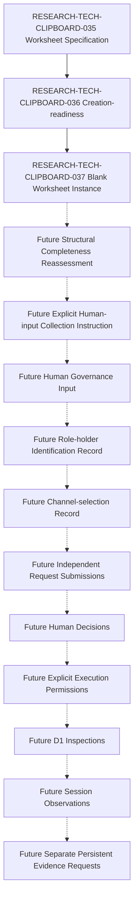

本文件是根據 RESEARCH-TECH-CLIPBOARD-035 建立的單一空白 Worksheet Instance，供未來真人在另一個明確流程中填寫治理輸入。這個文件產物本身不包含任何 Human Input、Attestation、實際 Holder、Channel、平台、Decision 或 Permission。

本文件目前只包含已定義的 Section、Field、Question、Validation Rule、受控 Blank Initialization Value，以及 Stop、Privacy 與 Traceability Boundary。

## Document Control

| Field | Required value |
| --- | --- |
| Document ID | RESEARCH-TECH-CLIPBOARD-037 |
| Title | Clipboard Integration D1 Human Governance Blank Worksheet Instance |
| Status | Draft Blank Instance |
| Document Type | Unfilled Human-governance Worksheet Instance |
| Technology Decision | TD-004 Clipboard Integration |
| Parent Worksheet Specification | RESEARCH-TECH-CLIPBOARD-035 |
| Parent Creation-readiness Reassessment | RESEARCH-TECH-CLIPBOARD-036 |
| Parent Selection-readiness Reassessment | RESEARCH-TECH-CLIPBOARD-034 |
| Parent Role/Channel Specification | RESEARCH-TECH-CLIPBOARD-033 |
| Covered Portfolio Items | CLIP-D1-REQPORT-001..002 |
| Worksheet Instance | Created as an unfilled documentary artifact |
| Worksheet Instance ID | Not assigned |
| Worksheet Revision | Not created |
| Worksheet Creation Timestamp | Not set |
| Worksheet State | Draft blank instance |
| Human Input | Not provided |
| Human Attestations | Not provided |
| Role Holders | Not identified |
| Submission Channel | Not selected |
| Actual Platform | Not identified |
| Personal Data | Not collected |
| Requests Submitted | No |
| Human Decisions | Not made |
| Execution Authorizations | Not granted |
| Execution Permissions | No |
| Inspections | Not started |
| Session Observations | Not created |
| Persistent Evidence | Not created |
| Owner | TBD |
| Last reviewed | Not reviewed |

## 1. Purpose

本文件是空白 Worksheet Instance，不是已完成的 Worksheet、Role-holder Identification Record、Role Appointment、Submission Channel Selection Record、Request Submission Packet、Human Decision Record、Execution Permission、Inspection Instruction 或 Operational Observation/Evidence。

空白 Instance 的存在只代表結構性文件已建立；不得將其解讀為已取得任何真人輸入、已辨識任何 Holder、已選擇任何 Channel、已提交 Request 或已授權任何操作。

## 2. Blank-instance Boundary

| Blank field class | Required blank value |
| --- | --- |
| Human-input fields | Not provided |
| Holder fields | Not identified |
| Channel fields | Not selected |
| Platform fields | Not identified |
| Identifier fields | Not assigned |
| Date/Time fields | Not set |
| Assessment fields | Not evaluated |
| Record/Reference fields | Not created |
| Completion fields | Not completed |
| Non-applicable fields | Not applicable |

不得使用範例姓名、虛構人員、假資料、TBD Person、John Doe 或其他人形 Placeholder 填充空欄位；不得以 Repository 作者、Owner 或目前使用者自動填入 Role Holder。

## 3. Source Preservation

| Source family | Preserved references | Use |
| --- | --- | --- |
| D1 research chain | RESEARCH-TECH-CLIPBOARD-028..036 | Worksheet and readiness lineage |
| D1 portfolio and roles | CLIP-D1-REQPORT-001..002; CLIP-D1-ROLE-001..005 | Two Portfolio Items and five roles |
| Role assessment | CLIP-D1-AUTHCRIT-001..012; CLIP-D1-AUTHDISQ-001..010 | Blank assessment rows |
| Channel assessment | CLIP-D1-SUBCH-001..004; CLIP-D1-SUBCTRL-001..012 | Blank channel and control rows |
| Packet and handoff | CLIP-D1-SUBPKT-001..020; CLIP-D1-SUBMANIFEST-001..002; CLIP-D1-DECREC-001..002; CLIP-D1-EXECHANDOFF-001..002 | No packet, decision or execution object |
| Worksheet specification | CLIP-D1-GOVWS-001..008; CLIP-D1-GOVMETA-001..015; CLIP-D1-GOVROLE-001..005; CLIP-D1-GOVCHAN-001..004; CLIP-D1-GOVREQ-001..002 | Copied structure and field order |
| Worksheet controls | CLIP-D1-GOVVAL-001..015; CLIP-D1-GOVATT-001..012 | Blank validation and attestation rows |
| Inspection references | CLIP-INSPECT-001..017; CLIP-D1-DOCITEM-001..017 | Future references only |

不得修改或重新解釋上游 Section、Block、Field、Role、Channel、Scope、Batch 或 Validation 規則。

## 4. Controlled Blank-value Vocabulary

| Value class | Required blank value |
| --- | --- |
| Identifier | Not assigned |
| Person/Role Holder | Not identified |
| Channel Selection | Not selected |
| Platform | Not identified |
| Human Input | Not provided |
| Human Attestation | Not provided |
| Date/Time | Not set |
| Assessment | Not evaluated |
| Record/Reference | Not created |
| Completion | Not completed |
| Revision | Not created |
| Non-applicable field | Not applicable |

不得用空字串、破折號、N/A、None 或任意文字取代受控值。

## 5. Eight-section Registry

| Section | Purpose | Source | Current state | Human input present |
| --- | --- | --- | --- | --- |
| CLIP-D1-GOVWS-001 | Worksheet Instance Metadata | RESEARCH-TECH-CLIPBOARD-035 | Draft blank instance | No |
| CLIP-D1-GOVWS-002 | Functional Role-holder Identification | RESEARCH-TECH-CLIPBOARD-035 | Draft blank instance | No |
| CLIP-D1-GOVWS-003 | Eligibility and Disqualifying-condition Assessment | RESEARCH-TECH-CLIPBOARD-035 | Draft blank instance | No |
| CLIP-D1-GOVWS-004 | Role Separation and Conflict Disclosure | RESEARCH-TECH-CLIPBOARD-035 | Draft blank instance | No |
| CLIP-D1-GOVWS-005 | Submission-channel Candidate Assessment | RESEARCH-TECH-CLIPBOARD-035 | Draft blank instance | No |
| CLIP-D1-GOVWS-006 | Request-specific Governance Mapping | RESEARCH-TECH-CLIPBOARD-035 | Draft blank instance | No |
| CLIP-D1-GOVWS-007 | Governance Attestation and Review | RESEARCH-TECH-CLIPBOARD-035 | Draft blank instance | No |
| CLIP-D1-GOVWS-008 | Selection Record and Handoff Boundary | RESEARCH-TECH-CLIPBOARD-035 | Draft blank instance | No |

不得建立 CLIP-D1-GOVWS-009。

## 6. Fifteen Instance Metadata Fields

| Metadata Field | Requirement | Current blank value | Future assignment source | Current validation |
| --- | --- | --- | --- | --- |
| CLIP-D1-GOVMETA-001 Worksheet Specification Document ID | Required | RESEARCH-TECH-CLIPBOARD-035 | Future controlled human/governance reference | Not evaluated |
| CLIP-D1-GOVMETA-002 Worksheet Instance identifier | Required | Not assigned | Future controlled human/governance reference | Not evaluated |
| CLIP-D1-GOVMETA-003 Worksheet revision | Required | Not created | Future controlled human/governance reference | Not evaluated |
| CLIP-D1-GOVMETA-004 Related Portfolio Item | Required | Not provided | Future controlled human/governance reference | Not evaluated |
| CLIP-D1-GOVMETA-005 Related Request Document | Required | Not provided | Future controlled human/governance reference | Not evaluated |
| CLIP-D1-GOVMETA-006 Related Submission Reassessment | Required | Not provided | Future controlled human/governance reference | Not evaluated |
| CLIP-D1-GOVMETA-007 Worksheet preparer governance identity reference | Required | Not identified | Future controlled human/governance reference | Not evaluated |
| CLIP-D1-GOVMETA-008 Worksheet creation date/time | Required | Not set | Future controlled human/governance reference | Not evaluated |
| CLIP-D1-GOVMETA-009 Intended review scope | Required | Not provided | Future controlled human/governance reference | Not evaluated |
| CLIP-D1-GOVMETA-010 Included Role IDs | Required | Not provided | Future controlled human/governance reference | Not evaluated |
| CLIP-D1-GOVMETA-011 Included Channel Classes | Required | Not provided | Future controlled human/governance reference | Not evaluated |
| CLIP-D1-GOVMETA-012 Confidentiality classification | Required | Not provided | Future controlled human/governance reference | Not evaluated |
| CLIP-D1-GOVMETA-013 Retention classification | Required | Not provided | Future controlled human/governance reference | Not evaluated |
| CLIP-D1-GOVMETA-014 Superseded Worksheet reference | Required | Not provided | Future controlled human/governance reference | Not evaluated |
| CLIP-D1-GOVMETA-015 Worksheet Instance state | Required | Draft blank instance | Future controlled human/governance reference | Not evaluated |

不得生成 Instance ID、Revision number 或 Timestamp。

## 7. Five Role-holder Blocks

| Role Block | Field ordinal | Field name | Requirement | Current blank value | Future human source | Validation state |
| --- | --- | --- | --- | --- | --- | --- |
| CLIP-D1-GOVROLE-001 | 01 | Governance Role Input Block ID | Required | Not assigned | Future human governance input | Not evaluated |
| CLIP-D1-GOVROLE-001 | 02 | Functional Role ID | Required | Not assigned | Future human governance input | Not evaluated |
| CLIP-D1-GOVROLE-001 | 03 | Functional Role name | Required | Not provided | Future human governance input | Not evaluated |
| CLIP-D1-GOVROLE-001 | 04 | Applicable Portfolio Items | Required | Not provided | Future human governance input | Not evaluated |
| CLIP-D1-GOVROLE-001 | 05 | Holder required at Draft stage | Required | Not identified | Future human governance input | Not evaluated |
| CLIP-D1-GOVROLE-001 | 06 | Holder required before Submission | Required | Not identified | Future human governance input | Not evaluated |
| CLIP-D1-GOVROLE-001 | 07 | Holder required before Human Decision | Required | Not identified | Future human governance input | Not evaluated |
| CLIP-D1-GOVROLE-001 | 08 | Holder required before Execution Permission | Required | Not identified | Future human governance input | Not evaluated |
| CLIP-D1-GOVROLE-001 | 09 | Holder required before Execution | Required | Not identified | Future human governance input | Not evaluated |
| CLIP-D1-GOVROLE-001 | 10 | Future Role-holder governance identity reference | Required | Not provided | Future human governance input | Not evaluated |
| CLIP-D1-GOVROLE-001 | 11 | Identification source | Required | Not provided | Future human governance input | Not evaluated |
| CLIP-D1-GOVROLE-001 | 12 | Role acceptance | Required | Not provided | Future human governance input | Not evaluated |
| CLIP-D1-GOVROLE-001 | 13 | Responsibility acknowledgement | Required | Not provided | Future human governance input | Not evaluated |
| CLIP-D1-GOVROLE-001 | 14 | Permitted-action acknowledgement | Required | Not provided | Future human governance input | Not evaluated |
| CLIP-D1-GOVROLE-001 | 15 | Prohibited-action acknowledgement | Required | Not provided | Future human governance input | Not evaluated |
| CLIP-D1-GOVROLE-001 | 16 | Required access-class acknowledgement | Required | Not provided | Future human governance input | Not evaluated |
| CLIP-D1-GOVROLE-001 | 17 | Eligibility assessment reference | Required | Not provided | Future human governance input | Not evaluated |
| CLIP-D1-GOVROLE-001 | 18 | Disqualifying-condition assessment reference | Required | Not provided | Future human governance input | Not evaluated |
| CLIP-D1-GOVROLE-001 | 19 | Conflict disclosure reference | Required | Not provided | Future human governance input | Not evaluated |
| CLIP-D1-GOVROLE-001 | 20 | Required separation safeguard | Required | Not provided | Future human governance input | Not evaluated |
| CLIP-D1-GOVROLE-001 | 21 | Effective scope | Required | Not provided | Future human governance input | Not evaluated |
| CLIP-D1-GOVROLE-001 | 22 | Effective date/time | Required | Not set | Future human governance input | Not evaluated |
| CLIP-D1-GOVROLE-001 | 23 | Withdrawal/replacement rule | Required | Not provided | Future human governance input | Not evaluated |
| CLIP-D1-GOVROLE-001 | 24 | Recorded human identification reference | Required | Not provided | Future human governance input | Not evaluated |
| CLIP-D1-GOVROLE-002 | 01 | Governance Role Input Block ID | Required | Not assigned | Future human governance input | Not evaluated |
| CLIP-D1-GOVROLE-002 | 02 | Functional Role ID | Required | Not assigned | Future human governance input | Not evaluated |
| CLIP-D1-GOVROLE-002 | 03 | Functional Role name | Required | Not provided | Future human governance input | Not evaluated |
| CLIP-D1-GOVROLE-002 | 04 | Applicable Portfolio Items | Required | Not provided | Future human governance input | Not evaluated |
| CLIP-D1-GOVROLE-002 | 05 | Holder required at Draft stage | Required | Not identified | Future human governance input | Not evaluated |
| CLIP-D1-GOVROLE-002 | 06 | Holder required before Submission | Required | Not identified | Future human governance input | Not evaluated |
| CLIP-D1-GOVROLE-002 | 07 | Holder required before Human Decision | Required | Not identified | Future human governance input | Not evaluated |
| CLIP-D1-GOVROLE-002 | 08 | Holder required before Execution Permission | Required | Not identified | Future human governance input | Not evaluated |
| CLIP-D1-GOVROLE-002 | 09 | Holder required before Execution | Required | Not identified | Future human governance input | Not evaluated |
| CLIP-D1-GOVROLE-002 | 10 | Future Role-holder governance identity reference | Required | Not provided | Future human governance input | Not evaluated |
| CLIP-D1-GOVROLE-002 | 11 | Identification source | Required | Not provided | Future human governance input | Not evaluated |
| CLIP-D1-GOVROLE-002 | 12 | Role acceptance | Required | Not provided | Future human governance input | Not evaluated |
| CLIP-D1-GOVROLE-002 | 13 | Responsibility acknowledgement | Required | Not provided | Future human governance input | Not evaluated |
| CLIP-D1-GOVROLE-002 | 14 | Permitted-action acknowledgement | Required | Not provided | Future human governance input | Not evaluated |
| CLIP-D1-GOVROLE-002 | 15 | Prohibited-action acknowledgement | Required | Not provided | Future human governance input | Not evaluated |
| CLIP-D1-GOVROLE-002 | 16 | Required access-class acknowledgement | Required | Not provided | Future human governance input | Not evaluated |
| CLIP-D1-GOVROLE-002 | 17 | Eligibility assessment reference | Required | Not provided | Future human governance input | Not evaluated |
| CLIP-D1-GOVROLE-002 | 18 | Disqualifying-condition assessment reference | Required | Not provided | Future human governance input | Not evaluated |
| CLIP-D1-GOVROLE-002 | 19 | Conflict disclosure reference | Required | Not provided | Future human governance input | Not evaluated |
| CLIP-D1-GOVROLE-002 | 20 | Required separation safeguard | Required | Not provided | Future human governance input | Not evaluated |
| CLIP-D1-GOVROLE-002 | 21 | Effective scope | Required | Not provided | Future human governance input | Not evaluated |
| CLIP-D1-GOVROLE-002 | 22 | Effective date/time | Required | Not set | Future human governance input | Not evaluated |
| CLIP-D1-GOVROLE-002 | 23 | Withdrawal/replacement rule | Required | Not provided | Future human governance input | Not evaluated |
| CLIP-D1-GOVROLE-002 | 24 | Recorded human identification reference | Required | Not provided | Future human governance input | Not evaluated |
| CLIP-D1-GOVROLE-003 | 01 | Governance Role Input Block ID | Required | Not assigned | Future human governance input | Not evaluated |
| CLIP-D1-GOVROLE-003 | 02 | Functional Role ID | Required | Not assigned | Future human governance input | Not evaluated |
| CLIP-D1-GOVROLE-003 | 03 | Functional Role name | Required | Not provided | Future human governance input | Not evaluated |
| CLIP-D1-GOVROLE-003 | 04 | Applicable Portfolio Items | Required | Not provided | Future human governance input | Not evaluated |
| CLIP-D1-GOVROLE-003 | 05 | Holder required at Draft stage | Required | Not identified | Future human governance input | Not evaluated |
| CLIP-D1-GOVROLE-003 | 06 | Holder required before Submission | Required | Not identified | Future human governance input | Not evaluated |
| CLIP-D1-GOVROLE-003 | 07 | Holder required before Human Decision | Required | Not identified | Future human governance input | Not evaluated |
| CLIP-D1-GOVROLE-003 | 08 | Holder required before Execution Permission | Required | Not identified | Future human governance input | Not evaluated |
| CLIP-D1-GOVROLE-003 | 09 | Holder required before Execution | Required | Not identified | Future human governance input | Not evaluated |
| CLIP-D1-GOVROLE-003 | 10 | Future Role-holder governance identity reference | Required | Not provided | Future human governance input | Not evaluated |
| CLIP-D1-GOVROLE-003 | 11 | Identification source | Required | Not provided | Future human governance input | Not evaluated |
| CLIP-D1-GOVROLE-003 | 12 | Role acceptance | Required | Not provided | Future human governance input | Not evaluated |
| CLIP-D1-GOVROLE-003 | 13 | Responsibility acknowledgement | Required | Not provided | Future human governance input | Not evaluated |
| CLIP-D1-GOVROLE-003 | 14 | Permitted-action acknowledgement | Required | Not provided | Future human governance input | Not evaluated |
| CLIP-D1-GOVROLE-003 | 15 | Prohibited-action acknowledgement | Required | Not provided | Future human governance input | Not evaluated |
| CLIP-D1-GOVROLE-003 | 16 | Required access-class acknowledgement | Required | Not provided | Future human governance input | Not evaluated |
| CLIP-D1-GOVROLE-003 | 17 | Eligibility assessment reference | Required | Not provided | Future human governance input | Not evaluated |
| CLIP-D1-GOVROLE-003 | 18 | Disqualifying-condition assessment reference | Required | Not provided | Future human governance input | Not evaluated |
| CLIP-D1-GOVROLE-003 | 19 | Conflict disclosure reference | Required | Not provided | Future human governance input | Not evaluated |
| CLIP-D1-GOVROLE-003 | 20 | Required separation safeguard | Required | Not provided | Future human governance input | Not evaluated |
| CLIP-D1-GOVROLE-003 | 21 | Effective scope | Required | Not provided | Future human governance input | Not evaluated |
| CLIP-D1-GOVROLE-003 | 22 | Effective date/time | Required | Not set | Future human governance input | Not evaluated |
| CLIP-D1-GOVROLE-003 | 23 | Withdrawal/replacement rule | Required | Not provided | Future human governance input | Not evaluated |
| CLIP-D1-GOVROLE-003 | 24 | Recorded human identification reference | Required | Not provided | Future human governance input | Not evaluated |
| CLIP-D1-GOVROLE-004 | 01 | Governance Role Input Block ID | Required | Not assigned | Future human governance input | Not evaluated |
| CLIP-D1-GOVROLE-004 | 02 | Functional Role ID | Required | Not assigned | Future human governance input | Not evaluated |
| CLIP-D1-GOVROLE-004 | 03 | Functional Role name | Required | Not provided | Future human governance input | Not evaluated |
| CLIP-D1-GOVROLE-004 | 04 | Applicable Portfolio Items | Required | Not provided | Future human governance input | Not evaluated |
| CLIP-D1-GOVROLE-004 | 05 | Holder required at Draft stage | Required | Not identified | Future human governance input | Not evaluated |
| CLIP-D1-GOVROLE-004 | 06 | Holder required before Submission | Required | Not identified | Future human governance input | Not evaluated |
| CLIP-D1-GOVROLE-004 | 07 | Holder required before Human Decision | Required | Not identified | Future human governance input | Not evaluated |
| CLIP-D1-GOVROLE-004 | 08 | Holder required before Execution Permission | Required | Not identified | Future human governance input | Not evaluated |
| CLIP-D1-GOVROLE-004 | 09 | Holder required before Execution | Required | Not identified | Future human governance input | Not evaluated |
| CLIP-D1-GOVROLE-004 | 10 | Future Role-holder governance identity reference | Required | Not provided | Future human governance input | Not evaluated |
| CLIP-D1-GOVROLE-004 | 11 | Identification source | Required | Not provided | Future human governance input | Not evaluated |
| CLIP-D1-GOVROLE-004 | 12 | Role acceptance | Required | Not provided | Future human governance input | Not evaluated |
| CLIP-D1-GOVROLE-004 | 13 | Responsibility acknowledgement | Required | Not provided | Future human governance input | Not evaluated |
| CLIP-D1-GOVROLE-004 | 14 | Permitted-action acknowledgement | Required | Not provided | Future human governance input | Not evaluated |
| CLIP-D1-GOVROLE-004 | 15 | Prohibited-action acknowledgement | Required | Not provided | Future human governance input | Not evaluated |
| CLIP-D1-GOVROLE-004 | 16 | Required access-class acknowledgement | Required | Not provided | Future human governance input | Not evaluated |
| CLIP-D1-GOVROLE-004 | 17 | Eligibility assessment reference | Required | Not provided | Future human governance input | Not evaluated |
| CLIP-D1-GOVROLE-004 | 18 | Disqualifying-condition assessment reference | Required | Not provided | Future human governance input | Not evaluated |
| CLIP-D1-GOVROLE-004 | 19 | Conflict disclosure reference | Required | Not provided | Future human governance input | Not evaluated |
| CLIP-D1-GOVROLE-004 | 20 | Required separation safeguard | Required | Not provided | Future human governance input | Not evaluated |
| CLIP-D1-GOVROLE-004 | 21 | Effective scope | Required | Not provided | Future human governance input | Not evaluated |
| CLIP-D1-GOVROLE-004 | 22 | Effective date/time | Required | Not set | Future human governance input | Not evaluated |
| CLIP-D1-GOVROLE-004 | 23 | Withdrawal/replacement rule | Required | Not provided | Future human governance input | Not evaluated |
| CLIP-D1-GOVROLE-004 | 24 | Recorded human identification reference | Required | Not provided | Future human governance input | Not evaluated |
| CLIP-D1-GOVROLE-005 | 01 | Governance Role Input Block ID | Required | Not assigned | Future human governance input | Not evaluated |
| CLIP-D1-GOVROLE-005 | 02 | Functional Role ID | Required | Not assigned | Future human governance input | Not evaluated |
| CLIP-D1-GOVROLE-005 | 03 | Functional Role name | Required | Not provided | Future human governance input | Not evaluated |
| CLIP-D1-GOVROLE-005 | 04 | Applicable Portfolio Items | Required | Not provided | Future human governance input | Not evaluated |
| CLIP-D1-GOVROLE-005 | 05 | Holder required at Draft stage | Required | Not identified | Future human governance input | Not evaluated |
| CLIP-D1-GOVROLE-005 | 06 | Holder required before Submission | Required | Not identified | Future human governance input | Not evaluated |
| CLIP-D1-GOVROLE-005 | 07 | Holder required before Human Decision | Required | Not identified | Future human governance input | Not evaluated |
| CLIP-D1-GOVROLE-005 | 08 | Holder required before Execution Permission | Required | Not identified | Future human governance input | Not evaluated |
| CLIP-D1-GOVROLE-005 | 09 | Holder required before Execution | Required | Not identified | Future human governance input | Not evaluated |
| CLIP-D1-GOVROLE-005 | 10 | Future Role-holder governance identity reference | Required | Not provided | Future human governance input | Not evaluated |
| CLIP-D1-GOVROLE-005 | 11 | Identification source | Required | Not provided | Future human governance input | Not evaluated |
| CLIP-D1-GOVROLE-005 | 12 | Role acceptance | Required | Not provided | Future human governance input | Not evaluated |
| CLIP-D1-GOVROLE-005 | 13 | Responsibility acknowledgement | Required | Not provided | Future human governance input | Not evaluated |
| CLIP-D1-GOVROLE-005 | 14 | Permitted-action acknowledgement | Required | Not provided | Future human governance input | Not evaluated |
| CLIP-D1-GOVROLE-005 | 15 | Prohibited-action acknowledgement | Required | Not provided | Future human governance input | Not evaluated |
| CLIP-D1-GOVROLE-005 | 16 | Required access-class acknowledgement | Required | Not provided | Future human governance input | Not evaluated |
| CLIP-D1-GOVROLE-005 | 17 | Eligibility assessment reference | Required | Not provided | Future human governance input | Not evaluated |
| CLIP-D1-GOVROLE-005 | 18 | Disqualifying-condition assessment reference | Required | Not provided | Future human governance input | Not evaluated |
| CLIP-D1-GOVROLE-005 | 19 | Conflict disclosure reference | Required | Not provided | Future human governance input | Not evaluated |
| CLIP-D1-GOVROLE-005 | 20 | Required separation safeguard | Required | Not provided | Future human governance input | Not evaluated |
| CLIP-D1-GOVROLE-005 | 21 | Effective scope | Required | Not provided | Future human governance input | Not evaluated |
| CLIP-D1-GOVROLE-005 | 22 | Effective date/time | Required | Not set | Future human governance input | Not evaluated |
| CLIP-D1-GOVROLE-005 | 23 | Withdrawal/replacement rule | Required | Not provided | Future human governance input | Not evaluated |
| CLIP-D1-GOVROLE-005 | 24 | Recorded human identification reference | Required | Not provided | Future human governance input | Not evaluated |

每個 Block 的 Ordinal 為 01..24，每個 Field 恰好出現一次；不得重新命名或合併 Field。Holder 欄位使用 Not identified；Identity、Acceptance、Acknowledgement 及 Reference 欄位使用 Not provided 或 Not created；Date/Time 欄位使用 Not set；Validation State 固定 Not evaluated。不得填入任何實際或示範人員資料。

## 8. Twelve Eligibility Assessment Rows

| Criterion | Worksheet question | Required response class | Supporting reference | Current response | Assessment |
| --- | --- | --- | --- | --- | --- |
| CLIP-D1-AUTHCRIT-001 Role scope matches requested governance action | Future human response required | Yes/No/Needs clarification | Not created | Not provided | Not evaluated |
| CLIP-D1-AUTHCRIT-002 Relevant technical competence | Future human response required | Yes/No/Needs clarification | Not created | Not provided | Not evaluated |
| CLIP-D1-AUTHCRIT-003 Independence from the decision under review | Future human response required | Yes/No/Needs clarification | Not created | Not provided | Not evaluated |
| CLIP-D1-AUTHCRIT-004 Authority to accept a request | Future human response required | Yes/No/Needs clarification | Not created | Not provided | Not evaluated |
| CLIP-D1-AUTHCRIT-005 Authority to issue execution permission | Future human response required | Yes/No/Needs clarification | Not created | Not provided | Not evaluated |
| CLIP-D1-AUTHCRIT-006 Ability to review scope and prerequisites | Future human response required | Yes/No/Needs clarification | Not created | Not provided | Not evaluated |
| CLIP-D1-AUTHCRIT-007 Ability to operate within approved constraints | Future human response required | Yes/No/Needs clarification | Not created | Not provided | Not evaluated |
| CLIP-D1-AUTHCRIT-008 Ability to preserve observation integrity | Future human response required | Yes/No/Needs clarification | Not created | Not provided | Not evaluated |
| CLIP-D1-AUTHCRIT-009 Ability to follow privacy and confidentiality controls | Future human response required | Yes/No/Needs clarification | Not created | Not provided | Not evaluated |
| CLIP-D1-AUTHCRIT-010 Ability to record traceable governance state | Future human response required | Yes/No/Needs clarification | Not created | Not provided | Not evaluated |
| CLIP-D1-AUTHCRIT-011 Availability for the effective request period | Future human response required | Yes/No/Needs clarification | Not created | Not provided | Not evaluated |
| CLIP-D1-AUTHCRIT-012 Acceptance of role boundaries and recusal rules | Future human response required | Yes/No/Needs clarification | Not created | Not provided | Not evaluated |

不得預填 Yes、No、Score、Weight 或 Pass。

## 9. Ten Disqualifying-condition Rows

| Condition | Worksheet question | Explanation required | Current response | Trigger state | Disposition |
| --- | --- | --- | --- | --- | --- |
| CLIP-D1-AUTHDISQ-001 Direct conflict with the request outcome | Future human response required | Yes | Not provided | Not evaluated | Not evaluated |
| CLIP-D1-AUTHDISQ-002 Self-approval of a request or execution permission | Future human response required | Yes | Not provided | Not evaluated | Not evaluated |
| CLIP-D1-AUTHDISQ-003 Undisclosed financial or operational interest | Future human response required | Yes | Not provided | Not evaluated | Not evaluated |
| CLIP-D1-AUTHDISQ-004 Authority scope does not cover the requested action | Future human response required | Yes | Not provided | Not evaluated | Not evaluated |
| CLIP-D1-AUTHDISQ-005 Missing required competence evidence | Future human response required | Yes | Not provided | Not evaluated | Not evaluated |
| CLIP-D1-AUTHDISQ-006 Refusal to accept role boundaries | Future human response required | Yes | Not provided | Not evaluated | Not evaluated |
| CLIP-D1-AUTHDISQ-007 Inability to preserve confidentiality | Future human response required | Yes | Not provided | Not evaluated | Not evaluated |
| CLIP-D1-AUTHDISQ-008 Inability to preserve traceability | Future human response required | Yes | Not provided | Not evaluated | Not evaluated |
| CLIP-D1-AUTHDISQ-009 Unresolved recusal or separation conflict | Future human response required | Yes | Not provided | Not evaluated | Not evaluated |
| CLIP-D1-AUTHDISQ-010 Role effective period is absent or expired | Future human response required | Yes | Not provided | Not evaluated | Not evaluated |

不得初始化為 Triggered、Cleared 或 Not Triggered。

## 10. Ten Role-separation Rows

| Role combination | Proposed combination | Conflict disclosure | Required safeguard | Current assessment |
| --- | --- | --- | --- | --- |
| Request Preparer / Technical Scope Reviewer | Not provided | Not provided | Not provided | Not evaluated |
| Request Preparer / Decision Authority | Not provided | Not provided | Not provided | Not evaluated |
| Request Preparer / Execution Operator | Not provided | Not provided | Not provided | Not evaluated |
| Request Preparer / Observation and Evidence Custodian | Not provided | Not provided | Not provided | Not evaluated |
| Technical Scope Reviewer / Decision Authority | Not provided | Not provided | Not provided | Not evaluated |
| Technical Scope Reviewer / Execution Operator | Not provided | Not provided | Not provided | Not evaluated |
| Technical Scope Reviewer / Observation and Evidence Custodian | Not provided | Not provided | Not provided | Not evaluated |
| Decision Authority / Execution Operator | Not provided | Not provided | Not provided | Not evaluated |
| Decision Authority / Observation and Evidence Custodian | Not provided | Not provided | Not provided | Not evaluated |
| Execution Operator / Observation and Evidence Custodian | Not provided | Not provided | Not provided | Not evaluated |

不得預先判斷同一人是否可兼任。

## 11. Eight Conflict / Recusal Rows

| Conflict scenario | Disclosure | Recusal decision | Separation action | Current assessment |
| --- | --- | --- | --- | --- |
| Request Preparer also acts as Decision Authority | Not provided | Not provided | Not provided | Not evaluated |
| Technical Scope Reviewer also acts as Decision Authority | Not provided | Not provided | Not provided | Not evaluated |
| Decision Authority also acts as Execution Operator | Not provided | Not provided | Not provided | Not evaluated |
| Decision Authority also acts as Observation/Evidence Custodian | Not provided | Not provided | Not provided | Not evaluated |
| Request Preparer and Technical Scope Reviewer share an interest | Not provided | Not provided | Not provided | Not evaluated |
| Execution Operator and Evidence Custodian share operational control | Not provided | Not provided | Not provided | Not evaluated |
| Authority identity is unavailable in the selected record path | Not provided | Not provided | Not provided | Not evaluated |
| Channel operator can alter the decision or evidence record | Not provided | Not provided | Not provided | Not evaluated |

不得宣告實際 Conflict 存在或不存在。

## 12. Four Channel Candidate Blocks

| Channel Block | Field ordinal | Field name | Requirement | Current blank value | Future human/platform source | Validation state |
| --- | --- | --- | --- | --- | --- | --- |
| CLIP-D1-GOVCHAN-001 | 01 | Governance Channel Input Block ID | Required | Not assigned | Future human/platform input | Not evaluated |
| CLIP-D1-GOVCHAN-001 | 02 | Channel Class ID | Required | Not assigned | Future human/platform input | Not evaluated |
| CLIP-D1-GOVCHAN-001 | 03 | Channel Class name | Required | Not provided | Future human/platform input | Not evaluated |
| CLIP-D1-GOVCHAN-001 | 04 | Applicable Portfolio Items | Required | Not provided | Future human/platform input | Not evaluated |
| CLIP-D1-GOVCHAN-001 | 05 | Actual platform/record-system identity | Required | Not identified | Future human/platform input | Not evaluated |
| CLIP-D1-GOVCHAN-001 | 06 | Channel identifier | Required | Not assigned | Future human/platform input | Not evaluated |
| CLIP-D1-GOVCHAN-001 | 07 | Submitter identity mechanism | Required | Not provided | Future human/platform input | Not evaluated |
| CLIP-D1-GOVCHAN-001 | 08 | Decision Authority identity mechanism | Required | Not provided | Future human/platform input | Not evaluated |
| CLIP-D1-GOVCHAN-001 | 09 | Access-control model | Required | Not provided | Future human/platform input | Not evaluated |
| CLIP-D1-GOVCHAN-001 | 10 | Authentication model | Required | Not provided | Future human/platform input | Not evaluated |
| CLIP-D1-GOVCHAN-001 | 11 | Network requirement | Required | Not provided | Future human/platform input | Not evaluated |
| CLIP-D1-GOVCHAN-001 | 12 | External-system dependency | Required | Not provided | Future human/platform input | Not evaluated |
| CLIP-D1-GOVCHAN-001 | 13 | Request snapshot mechanism | Required | Not provided | Future human/platform input | Not evaluated |
| CLIP-D1-GOVCHAN-001 | 14 | Snapshot immutability control | Required | Not provided | Future human/platform input | Not evaluated |
| CLIP-D1-GOVCHAN-001 | 15 | Decision record mechanism | Required | Not provided | Future human/platform input | Not evaluated |
| CLIP-D1-GOVCHAN-001 | 16 | Revision/supersession mechanism | Required | Not provided | Future human/platform input | Not evaluated |
| CLIP-D1-GOVCHAN-001 | 17 | Confidentiality classification | Required | Not provided | Future human/platform input | Not evaluated |
| CLIP-D1-GOVCHAN-001 | 18 | Retention rule | Required | Not provided | Future human/platform input | Not evaluated |
| CLIP-D1-GOVCHAN-001 | 19 | Separate Decision per Request control | Required | Not provided | Future human/platform input | Not evaluated |
| CLIP-D1-GOVCHAN-001 | 20 | Explicit Execution Permission control | Required | Not provided | Future human/platform input | Not evaluated |
| CLIP-D1-GOVCHAN-001 | 21 | Observation permission control | Required | Not provided | Future human/platform input | Not evaluated |
| CLIP-D1-GOVCHAN-001 | 22 | Persistent Evidence separation control | Required | Not provided | Future human/platform input | Not evaluated |
| CLIP-D1-GOVCHAN-001 | 23 | Channel-selection decision reference | Required | Not created | Future human/platform input | Not evaluated |
| CLIP-D1-GOVCHAN-001 | 24 | Channel current selection state | Required | Not selected | Future human/platform input | Not evaluated |
| CLIP-D1-GOVCHAN-002 | 01 | Governance Channel Input Block ID | Required | Not assigned | Future human/platform input | Not evaluated |
| CLIP-D1-GOVCHAN-002 | 02 | Channel Class ID | Required | Not assigned | Future human/platform input | Not evaluated |
| CLIP-D1-GOVCHAN-002 | 03 | Channel Class name | Required | Not provided | Future human/platform input | Not evaluated |
| CLIP-D1-GOVCHAN-002 | 04 | Applicable Portfolio Items | Required | Not provided | Future human/platform input | Not evaluated |
| CLIP-D1-GOVCHAN-002 | 05 | Actual platform/record-system identity | Required | Not identified | Future human/platform input | Not evaluated |
| CLIP-D1-GOVCHAN-002 | 06 | Channel identifier | Required | Not assigned | Future human/platform input | Not evaluated |
| CLIP-D1-GOVCHAN-002 | 07 | Submitter identity mechanism | Required | Not provided | Future human/platform input | Not evaluated |
| CLIP-D1-GOVCHAN-002 | 08 | Decision Authority identity mechanism | Required | Not provided | Future human/platform input | Not evaluated |
| CLIP-D1-GOVCHAN-002 | 09 | Access-control model | Required | Not provided | Future human/platform input | Not evaluated |
| CLIP-D1-GOVCHAN-002 | 10 | Authentication model | Required | Not provided | Future human/platform input | Not evaluated |
| CLIP-D1-GOVCHAN-002 | 11 | Network requirement | Required | Not provided | Future human/platform input | Not evaluated |
| CLIP-D1-GOVCHAN-002 | 12 | External-system dependency | Required | Not provided | Future human/platform input | Not evaluated |
| CLIP-D1-GOVCHAN-002 | 13 | Request snapshot mechanism | Required | Not provided | Future human/platform input | Not evaluated |
| CLIP-D1-GOVCHAN-002 | 14 | Snapshot immutability control | Required | Not provided | Future human/platform input | Not evaluated |
| CLIP-D1-GOVCHAN-002 | 15 | Decision record mechanism | Required | Not provided | Future human/platform input | Not evaluated |
| CLIP-D1-GOVCHAN-002 | 16 | Revision/supersession mechanism | Required | Not provided | Future human/platform input | Not evaluated |
| CLIP-D1-GOVCHAN-002 | 17 | Confidentiality classification | Required | Not provided | Future human/platform input | Not evaluated |
| CLIP-D1-GOVCHAN-002 | 18 | Retention rule | Required | Not provided | Future human/platform input | Not evaluated |
| CLIP-D1-GOVCHAN-002 | 19 | Separate Decision per Request control | Required | Not provided | Future human/platform input | Not evaluated |
| CLIP-D1-GOVCHAN-002 | 20 | Explicit Execution Permission control | Required | Not provided | Future human/platform input | Not evaluated |
| CLIP-D1-GOVCHAN-002 | 21 | Observation permission control | Required | Not provided | Future human/platform input | Not evaluated |
| CLIP-D1-GOVCHAN-002 | 22 | Persistent Evidence separation control | Required | Not provided | Future human/platform input | Not evaluated |
| CLIP-D1-GOVCHAN-002 | 23 | Channel-selection decision reference | Required | Not created | Future human/platform input | Not evaluated |
| CLIP-D1-GOVCHAN-002 | 24 | Channel current selection state | Required | Not selected | Future human/platform input | Not evaluated |
| CLIP-D1-GOVCHAN-003 | 01 | Governance Channel Input Block ID | Required | Not assigned | Future human/platform input | Not evaluated |
| CLIP-D1-GOVCHAN-003 | 02 | Channel Class ID | Required | Not assigned | Future human/platform input | Not evaluated |
| CLIP-D1-GOVCHAN-003 | 03 | Channel Class name | Required | Not provided | Future human/platform input | Not evaluated |
| CLIP-D1-GOVCHAN-003 | 04 | Applicable Portfolio Items | Required | Not provided | Future human/platform input | Not evaluated |
| CLIP-D1-GOVCHAN-003 | 05 | Actual platform/record-system identity | Required | Not identified | Future human/platform input | Not evaluated |
| CLIP-D1-GOVCHAN-003 | 06 | Channel identifier | Required | Not assigned | Future human/platform input | Not evaluated |
| CLIP-D1-GOVCHAN-003 | 07 | Submitter identity mechanism | Required | Not provided | Future human/platform input | Not evaluated |
| CLIP-D1-GOVCHAN-003 | 08 | Decision Authority identity mechanism | Required | Not provided | Future human/platform input | Not evaluated |
| CLIP-D1-GOVCHAN-003 | 09 | Access-control model | Required | Not provided | Future human/platform input | Not evaluated |
| CLIP-D1-GOVCHAN-003 | 10 | Authentication model | Required | Not provided | Future human/platform input | Not evaluated |
| CLIP-D1-GOVCHAN-003 | 11 | Network requirement | Required | Not provided | Future human/platform input | Not evaluated |
| CLIP-D1-GOVCHAN-003 | 12 | External-system dependency | Required | Not provided | Future human/platform input | Not evaluated |
| CLIP-D1-GOVCHAN-003 | 13 | Request snapshot mechanism | Required | Not provided | Future human/platform input | Not evaluated |
| CLIP-D1-GOVCHAN-003 | 14 | Snapshot immutability control | Required | Not provided | Future human/platform input | Not evaluated |
| CLIP-D1-GOVCHAN-003 | 15 | Decision record mechanism | Required | Not provided | Future human/platform input | Not evaluated |
| CLIP-D1-GOVCHAN-003 | 16 | Revision/supersession mechanism | Required | Not provided | Future human/platform input | Not evaluated |
| CLIP-D1-GOVCHAN-003 | 17 | Confidentiality classification | Required | Not provided | Future human/platform input | Not evaluated |
| CLIP-D1-GOVCHAN-003 | 18 | Retention rule | Required | Not provided | Future human/platform input | Not evaluated |
| CLIP-D1-GOVCHAN-003 | 19 | Separate Decision per Request control | Required | Not provided | Future human/platform input | Not evaluated |
| CLIP-D1-GOVCHAN-003 | 20 | Explicit Execution Permission control | Required | Not provided | Future human/platform input | Not evaluated |
| CLIP-D1-GOVCHAN-003 | 21 | Observation permission control | Required | Not provided | Future human/platform input | Not evaluated |
| CLIP-D1-GOVCHAN-003 | 22 | Persistent Evidence separation control | Required | Not provided | Future human/platform input | Not evaluated |
| CLIP-D1-GOVCHAN-003 | 23 | Channel-selection decision reference | Required | Not created | Future human/platform input | Not evaluated |
| CLIP-D1-GOVCHAN-003 | 24 | Channel current selection state | Required | Not selected | Future human/platform input | Not evaluated |
| CLIP-D1-GOVCHAN-004 | 01 | Governance Channel Input Block ID | Required | Not assigned | Future human/platform input | Not evaluated |
| CLIP-D1-GOVCHAN-004 | 02 | Channel Class ID | Required | Not assigned | Future human/platform input | Not evaluated |
| CLIP-D1-GOVCHAN-004 | 03 | Channel Class name | Required | Not provided | Future human/platform input | Not evaluated |
| CLIP-D1-GOVCHAN-004 | 04 | Applicable Portfolio Items | Required | Not provided | Future human/platform input | Not evaluated |
| CLIP-D1-GOVCHAN-004 | 05 | Actual platform/record-system identity | Required | Not identified | Future human/platform input | Not evaluated |
| CLIP-D1-GOVCHAN-004 | 06 | Channel identifier | Required | Not assigned | Future human/platform input | Not evaluated |
| CLIP-D1-GOVCHAN-004 | 07 | Submitter identity mechanism | Required | Not provided | Future human/platform input | Not evaluated |
| CLIP-D1-GOVCHAN-004 | 08 | Decision Authority identity mechanism | Required | Not provided | Future human/platform input | Not evaluated |
| CLIP-D1-GOVCHAN-004 | 09 | Access-control model | Required | Not provided | Future human/platform input | Not evaluated |
| CLIP-D1-GOVCHAN-004 | 10 | Authentication model | Required | Not provided | Future human/platform input | Not evaluated |
| CLIP-D1-GOVCHAN-004 | 11 | Network requirement | Required | Not provided | Future human/platform input | Not evaluated |
| CLIP-D1-GOVCHAN-004 | 12 | External-system dependency | Required | Not provided | Future human/platform input | Not evaluated |
| CLIP-D1-GOVCHAN-004 | 13 | Request snapshot mechanism | Required | Not provided | Future human/platform input | Not evaluated |
| CLIP-D1-GOVCHAN-004 | 14 | Snapshot immutability control | Required | Not provided | Future human/platform input | Not evaluated |
| CLIP-D1-GOVCHAN-004 | 15 | Decision record mechanism | Required | Not provided | Future human/platform input | Not evaluated |
| CLIP-D1-GOVCHAN-004 | 16 | Revision/supersession mechanism | Required | Not provided | Future human/platform input | Not evaluated |
| CLIP-D1-GOVCHAN-004 | 17 | Confidentiality classification | Required | Not provided | Future human/platform input | Not evaluated |
| CLIP-D1-GOVCHAN-004 | 18 | Retention rule | Required | Not provided | Future human/platform input | Not evaluated |
| CLIP-D1-GOVCHAN-004 | 19 | Separate Decision per Request control | Required | Not provided | Future human/platform input | Not evaluated |
| CLIP-D1-GOVCHAN-004 | 20 | Explicit Execution Permission control | Required | Not provided | Future human/platform input | Not evaluated |
| CLIP-D1-GOVCHAN-004 | 21 | Observation permission control | Required | Not provided | Future human/platform input | Not evaluated |
| CLIP-D1-GOVCHAN-004 | 22 | Persistent Evidence separation control | Required | Not provided | Future human/platform input | Not evaluated |
| CLIP-D1-GOVCHAN-004 | 23 | Channel-selection decision reference | Required | Not created | Future human/platform input | Not evaluated |
| CLIP-D1-GOVCHAN-004 | 24 | Channel current selection state | Required | Not selected | Future human/platform input | Not evaluated |

Actual Platform 固定 Not identified；Channel Identifier 固定 Not assigned；Network Requirement 固定 Not provided；Channel-selection Decision Reference 固定 Not created；Channel Selection State 固定 Not selected；Validation State 固定 Not evaluated。不得填入產品名稱、URL、Email、Issue、Ticket、Thread、Meeting 或帳號。

## 13. Twelve Channel-control Rows

| Channel Control | Verification question | Supporting reference | Current response | Assessment |
| --- | --- | --- | --- | --- |
| CLIP-D1-SUBCTRL-001 Channel identity is uniquely recorded | Future human/platform response required | Not created | Not provided | Not evaluated |
| CLIP-D1-SUBCTRL-002 Submitter identity is traceable | Future human/platform response required | Not created | Not provided | Not evaluated |
| CLIP-D1-SUBCTRL-003 Request snapshot is immutable or revision-addressable | Future human/platform response required | Not created | Not provided | Not evaluated |
| CLIP-D1-SUBCTRL-004 Authority identity is bound to the decision | Future human/platform response required | Not created | Not provided | Not evaluated |
| CLIP-D1-SUBCTRL-005 Decision result is separately recorded | Future human/platform response required | Not created | Not provided | Not evaluated |
| CLIP-D1-SUBCTRL-006 Decision revision history is preserved | Future human/platform response required | Not created | Not provided | Not evaluated |
| CLIP-D1-SUBCTRL-007 Execution permission is separately represented | Future human/platform response required | Not created | Not provided | Not evaluated |
| CLIP-D1-SUBCTRL-008 Access is limited to authorized participants | Future human/platform response required | Not created | Not provided | Not evaluated |
| CLIP-D1-SUBCTRL-009 Confidentiality classification is recorded | Future human/platform response required | Not created | Not provided | Not evaluated |
| CLIP-D1-SUBCTRL-010 Retention and withdrawal rules are recorded | Future human/platform response required | Not created | Not provided | Not evaluated |
| CLIP-D1-SUBCTRL-011 Network and authentication implications are assessed | Future human/platform response required | Not created | Not provided | Not evaluated |
| CLIP-D1-SUBCTRL-012 Persistent evidence is not implicitly created by submission | Future human/platform response required | Not created | Not provided | Not evaluated |

## 14. Eight Channel-rejection Rows

| Rejection Condition | Detection question | Current response | Trigger state | Disposition |
| --- | --- | --- | --- | --- |
| CLIP-D1-SUBREJ-001 Channel identity cannot be recorded | Future human/platform response required | Not provided | Not evaluated | Not evaluated |
| CLIP-D1-SUBREJ-002 Snapshot integrity cannot be preserved | Future human/platform response required | Not provided | Not evaluated | Not evaluated |
| CLIP-D1-SUBREJ-003 Authority identity cannot be bound to decision | Future human/platform response required | Not provided | Not evaluated | Not evaluated |
| CLIP-D1-SUBREJ-004 Decision and revision cannot be separately traced | Future human/platform response required | Not provided | Not evaluated | Not evaluated |
| CLIP-D1-SUBREJ-005 Access control is undefined | Future human/platform response required | Not provided | Not evaluated | Not evaluated |
| CLIP-D1-SUBREJ-006 Retention or confidentiality is undefined | Future human/platform response required | Not provided | Not evaluated | Not evaluated |
| CLIP-D1-SUBREJ-007 Network or authentication implication is unsafe or unknown | Future human/platform response required | Not provided | Not evaluated | Not evaluated |
| CLIP-D1-SUBREJ-008 Channel would implicitly create operational evidence | Future human/platform response required | Not provided | Not evaluated | Not evaluated |

不得將任何 Channel Class 初始化為 Accepted 或 Rejected。

## 15. Eight Request-to-channel Rows

| Portfolio Item | Channel Class | Applicability input | Request-specific controls | Selection decision | Current assessment |
| --- | --- | --- | --- | --- | --- |
| CLIP-D1-REQPORT-001 Local D1 Request | CLIP-D1-SUBCH-001 Repository-governed Review Record | Not provided | Not provided | Not created | Not evaluated |
| CLIP-D1-REQPORT-001 Local D1 Request | CLIP-D1-SUBCH-002 Managed Work-item or Ticket Record | Not provided | Not provided | Not created | Not evaluated |
| CLIP-D1-REQPORT-001 Local D1 Request | CLIP-D1-SUBCH-003 Signed Electronic Decision Record | Not provided | Not provided | Not created | Not evaluated |
| CLIP-D1-REQPORT-001 Local D1 Request | CLIP-D1-SUBCH-004 Recorded Synchronous Review with Archived Decision Record | Not provided | Not provided | Not created | Not evaluated |
| CLIP-D1-REQPORT-002 Package-cache D1 Request | CLIP-D1-SUBCH-001 Repository-governed Review Record | Not provided | Not provided | Not created | Not evaluated |
| CLIP-D1-REQPORT-002 Package-cache D1 Request | CLIP-D1-SUBCH-002 Managed Work-item or Ticket Record | Not provided | Not provided | Not created | Not evaluated |
| CLIP-D1-REQPORT-002 Package-cache D1 Request | CLIP-D1-SUBCH-003 Signed Electronic Decision Record | Not provided | Not provided | Not created | Not evaluated |
| CLIP-D1-REQPORT-002 Package-cache D1 Request | CLIP-D1-SUBCH-004 Recorded Synchronous Review with Archived Decision Record | Not provided | Not provided | Not created | Not evaluated |

## 16. Two Request Governance Blocks

| Request Block | Field ordinal | Field name | Requirement | Current blank value | Future source | Validation state |
| --- | --- | --- | --- | --- | --- | --- |
| CLIP-D1-GOVREQ-001 | 01 | Governance Request Block ID | Required | Not assigned | Future request-specific human input | Not evaluated |
| CLIP-D1-GOVREQ-001 | 02 | Portfolio Item | Required | Not provided | Future request-specific human input | Not evaluated |
| CLIP-D1-GOVREQ-001 | 03 | Request Document ID | Required | Not assigned | Future request-specific human input | Not evaluated |
| CLIP-D1-GOVREQ-001 | 04 | Submission Reassessment ID | Required | Not assigned | Future request-specific human input | Not evaluated |
| CLIP-D1-GOVREQ-001 | 05 | Included Scope IDs | Required | Not provided | Future request-specific human input | Not evaluated |
| CLIP-D1-GOVREQ-001 | 06 | Included Inspection Items | Required | Not provided | Future request-specific human input | Not evaluated |
| CLIP-D1-GOVREQ-001 | 07 | Required Role Blocks | Required | Not provided | Future request-specific human input | Not evaluated |
| CLIP-D1-GOVREQ-001 | 08 | Proposed Role-holder mapping | Required | Not provided | Future request-specific human input | Not evaluated |
| CLIP-D1-GOVREQ-001 | 09 | Proposed Decision Authority mapping | Required | Not provided | Future request-specific human input | Not evaluated |
| CLIP-D1-GOVREQ-001 | 10 | Proposed Technical Reviewer mapping | Required | Not provided | Future request-specific human input | Not evaluated |
| CLIP-D1-GOVREQ-001 | 11 | Proposed Execution Operator mapping | Required | Not provided | Future request-specific human input | Not evaluated |
| CLIP-D1-GOVREQ-001 | 12 | Proposed Observation Custodian mapping | Required | Not provided | Future request-specific human input | Not evaluated |
| CLIP-D1-GOVREQ-001 | 13 | Proposed Channel Block | Required | Not provided | Future request-specific human input | Not evaluated |
| CLIP-D1-GOVREQ-001 | 14 | Proposed actual platform reference | Required | Not created | Future request-specific human input | Not evaluated |
| CLIP-D1-GOVREQ-001 | 15 | Submission instruction authority | Required | Not provided | Future request-specific human input | Not evaluated |
| CLIP-D1-GOVREQ-001 | 16 | Request snapshot requirement | Required | Not provided | Future request-specific human input | Not evaluated |
| CLIP-D1-GOVREQ-001 | 17 | Separate Decision requirement | Required | Not provided | Future request-specific human input | Not evaluated |
| CLIP-D1-GOVREQ-001 | 18 | Execution Permission requirement | Required | Not provided | Future request-specific human input | Not evaluated |
| CLIP-D1-GOVREQ-001 | 19 | Observation Permission requirement | Required | Not provided | Future request-specific human input | Not evaluated |
| CLIP-D1-GOVREQ-001 | 20 | Persistent Evidence exclusion | Required | Not provided | Future request-specific human input | Not evaluated |
| CLIP-D1-GOVREQ-001 | 21 | Request-specific Constraints | Required | Not provided | Future request-specific human input | Not evaluated |
| CLIP-D1-GOVREQ-001 | 22 | Additional Stop Conditions | Required | Not provided | Future request-specific human input | Not evaluated |
| CLIP-D1-GOVREQ-001 | 23 | Current governance input state | Required | Not completed | Future request-specific human input | Not evaluated |
| CLIP-D1-GOVREQ-002 | 01 | Governance Request Block ID | Required | Not assigned | Future request-specific human input | Not evaluated |
| CLIP-D1-GOVREQ-002 | 02 | Portfolio Item | Required | Not provided | Future request-specific human input | Not evaluated |
| CLIP-D1-GOVREQ-002 | 03 | Request Document ID | Required | Not assigned | Future request-specific human input | Not evaluated |
| CLIP-D1-GOVREQ-002 | 04 | Submission Reassessment ID | Required | Not assigned | Future request-specific human input | Not evaluated |
| CLIP-D1-GOVREQ-002 | 05 | Included Scope IDs | Required | Not provided | Future request-specific human input | Not evaluated |
| CLIP-D1-GOVREQ-002 | 06 | Included Inspection Items | Required | Not provided | Future request-specific human input | Not evaluated |
| CLIP-D1-GOVREQ-002 | 07 | Required Role Blocks | Required | Not provided | Future request-specific human input | Not evaluated |
| CLIP-D1-GOVREQ-002 | 08 | Proposed Role-holder mapping | Required | Not provided | Future request-specific human input | Not evaluated |
| CLIP-D1-GOVREQ-002 | 09 | Proposed Decision Authority mapping | Required | Not provided | Future request-specific human input | Not evaluated |
| CLIP-D1-GOVREQ-002 | 10 | Proposed Technical Reviewer mapping | Required | Not provided | Future request-specific human input | Not evaluated |
| CLIP-D1-GOVREQ-002 | 11 | Proposed Execution Operator mapping | Required | Not provided | Future request-specific human input | Not evaluated |
| CLIP-D1-GOVREQ-002 | 12 | Proposed Observation Custodian mapping | Required | Not provided | Future request-specific human input | Not evaluated |
| CLIP-D1-GOVREQ-002 | 13 | Proposed Channel Block | Required | Not provided | Future request-specific human input | Not evaluated |
| CLIP-D1-GOVREQ-002 | 14 | Proposed actual platform reference | Required | Not created | Future request-specific human input | Not evaluated |
| CLIP-D1-GOVREQ-002 | 15 | Submission instruction authority | Required | Not provided | Future request-specific human input | Not evaluated |
| CLIP-D1-GOVREQ-002 | 16 | Request snapshot requirement | Required | Not provided | Future request-specific human input | Not evaluated |
| CLIP-D1-GOVREQ-002 | 17 | Separate Decision requirement | Required | Not provided | Future request-specific human input | Not evaluated |
| CLIP-D1-GOVREQ-002 | 18 | Execution Permission requirement | Required | Not provided | Future request-specific human input | Not evaluated |
| CLIP-D1-GOVREQ-002 | 19 | Observation Permission requirement | Required | Not provided | Future request-specific human input | Not evaluated |
| CLIP-D1-GOVREQ-002 | 20 | Persistent Evidence exclusion | Required | Not provided | Future request-specific human input | Not evaluated |
| CLIP-D1-GOVREQ-002 | 21 | Request-specific Constraints | Required | Not provided | Future request-specific human input | Not evaluated |
| CLIP-D1-GOVREQ-002 | 22 | Additional Stop Conditions | Required | Not provided | Future request-specific human input | Not evaluated |
| CLIP-D1-GOVREQ-002 | 23 | Current governance input state | Required | Not completed | Future request-specific human input | Not evaluated |

Proposed Role-holder Mapping、Proposed Decision Authority、Proposed Channel、Proposed Platform、Submission Instruction Authority 均為 Not provided；Constraints/Stop Conditions 為 Not provided；Current Governance Input State 為 Not completed；Validation State 為 Not evaluated。不得修改 Request Scope、Inspection Item 或 Batch membership。

## 17. Ten Request / Role-holder Rows

| Portfolio Item | Role | Holder input | Required stage | Effective scope | Independent record | Assessment |
| --- | --- | --- | --- | --- | --- | --- |
| CLIP-D1-REQPORT-001 Local D1 Request | CLIP-D1-ROLE-001 Request Preparer | Not provided | Not provided | Not provided | Not created | Not evaluated |
| CLIP-D1-REQPORT-001 Local D1 Request | CLIP-D1-ROLE-002 Technical Scope Reviewer | Not provided | Not provided | Not provided | Not created | Not evaluated |
| CLIP-D1-REQPORT-001 Local D1 Request | CLIP-D1-ROLE-003 Decision Authority | Not provided | Not provided | Not provided | Not created | Not evaluated |
| CLIP-D1-REQPORT-001 Local D1 Request | CLIP-D1-ROLE-004 Execution Operator | Not provided | Not provided | Not provided | Not created | Not evaluated |
| CLIP-D1-REQPORT-001 Local D1 Request | CLIP-D1-ROLE-005 Observation and Evidence Custodian | Not provided | Not provided | Not provided | Not created | Not evaluated |
| CLIP-D1-REQPORT-002 Package-cache D1 Request | CLIP-D1-ROLE-001 Request Preparer | Not provided | Not provided | Not provided | Not created | Not evaluated |
| CLIP-D1-REQPORT-002 Package-cache D1 Request | CLIP-D1-ROLE-002 Technical Scope Reviewer | Not provided | Not provided | Not provided | Not created | Not evaluated |
| CLIP-D1-REQPORT-002 Package-cache D1 Request | CLIP-D1-ROLE-003 Decision Authority | Not provided | Not provided | Not provided | Not created | Not evaluated |
| CLIP-D1-REQPORT-002 Package-cache D1 Request | CLIP-D1-ROLE-004 Execution Operator | Not provided | Not provided | Not provided | Not created | Not evaluated |
| CLIP-D1-REQPORT-002 Package-cache D1 Request | CLIP-D1-ROLE-005 Observation and Evidence Custodian | Not provided | Not provided | Not provided | Not created | Not evaluated |

## 18. Twenty Submission Packet Rows

| Packet Element | Source Document | Worksheet confirmation | Correction request | Snapshot state |
| --- | --- | --- | --- | --- |
| CLIP-D1-SUBPKT-001 Request Document ID | RESEARCH-TECH-CLIPBOARD-028..036 | Not provided | Not provided | Not created |
| CLIP-D1-SUBPKT-002 Request version | RESEARCH-TECH-CLIPBOARD-028..036 | Not provided | Not provided | Not created |
| CLIP-D1-SUBPKT-003 Portfolio Item ID | RESEARCH-TECH-CLIPBOARD-028..036 | Not provided | Not provided | Not created |
| CLIP-D1-SUBPKT-004 Request-readiness source reference | RESEARCH-TECH-CLIPBOARD-028..036 | Not provided | Not provided | Not created |
| CLIP-D1-SUBPKT-005 Submission reassessment reference | RESEARCH-TECH-CLIPBOARD-028..036 | Not provided | Not provided | Not created |
| CLIP-D1-SUBPKT-006 Included Scope IDs | RESEARCH-TECH-CLIPBOARD-028..036 | Not provided | Not provided | Not created |
| CLIP-D1-SUBPKT-007 Included inspection-item references | RESEARCH-TECH-CLIPBOARD-028..036 | Not provided | Not provided | Not created |
| CLIP-D1-SUBPKT-008 Prerequisite references | RESEARCH-TECH-CLIPBOARD-028..036 | Not provided | Not provided | Not created |
| CLIP-D1-SUBPKT-009 Public tool/target class | RESEARCH-TECH-CLIPBOARD-028..036 | Not provided | Not provided | Not created |
| CLIP-D1-SUBPKT-010 Sanitized path class | RESEARCH-TECH-CLIPBOARD-028..036 | Not provided | Not provided | Not created |
| CLIP-D1-SUBPKT-011 Package identity class | RESEARCH-TECH-CLIPBOARD-028..036 | Not provided | Not provided | Not created |
| CLIP-D1-SUBPKT-012 Authority role reference | RESEARCH-TECH-CLIPBOARD-028..036 | Not provided | Not provided | Not created |
| CLIP-D1-SUBPKT-013 Submitter identity mechanism | RESEARCH-TECH-CLIPBOARD-028..036 | Not provided | Not provided | Not created |
| CLIP-D1-SUBPKT-014 Submission Channel class | RESEARCH-TECH-CLIPBOARD-028..036 | Not provided | Not provided | Not created |
| CLIP-D1-SUBPKT-015 Submission Channel identifier | RESEARCH-TECH-CLIPBOARD-028..036 | Not provided | Not provided | Not created |
| CLIP-D1-SUBPKT-016 Snapshot integrity reference | RESEARCH-TECH-CLIPBOARD-028..036 | Not provided | Not provided | Not created |
| CLIP-D1-SUBPKT-017 Execution constraint reference | RESEARCH-TECH-CLIPBOARD-028..036 | Not provided | Not provided | Not created |
| CLIP-D1-SUBPKT-018 Decision-record contract reference | RESEARCH-TECH-CLIPBOARD-028..036 | Not provided | Not provided | Not created |
| CLIP-D1-SUBPKT-019 Observation/evidence handoff reference | RESEARCH-TECH-CLIPBOARD-028..036 | Not provided | Not provided | Not created |
| CLIP-D1-SUBPKT-020 Privacy, retention, and revision reference | RESEARCH-TECH-CLIPBOARD-028..036 | Not provided | Not provided | Not created |

不得建立 Submission Packet、Attachment、Archive 或 Immutable Snapshot。

## 19. Two Packet-manifest Rows

| Packet Manifest | Portfolio Item | Authority input | Channel input | Snapshot input | State |
| --- | --- | --- | --- | --- | --- |
| CLIP-D1-SUBMANIFEST-001 | CLIP-D1-REQPORT-001 Local D1 Request | Not provided | Not provided | Not provided | Not completed |
| CLIP-D1-SUBMANIFEST-002 | CLIP-D1-REQPORT-002 Package-cache D1 Request | Not provided | Not provided | Not provided | Not completed |

## 20. Two Decision-record Rows

| Decision Record Contract | Portfolio Item | Authority fields | Decision fields | Scope/Constraint fields | State |
| --- | --- | --- | --- | --- | --- |
| CLIP-D1-DECREC-001 | CLIP-D1-REQPORT-001 Local D1 Request | Not provided | Not provided | Not provided | Not created |
| CLIP-D1-DECREC-002 | CLIP-D1-REQPORT-002 Package-cache D1 Request | Not provided | Not provided | Not provided | Not created |

不得預填 Approval、Rejection、Decision Date、Approved Items、Constraints 或 Execution Permission。

## 21. Two Execution-handoff Rows

| Execution Handoff | Portfolio Item | Operator input | Decision reference | Target/Constraint confirmation | State |
| --- | --- | --- | --- | --- | --- |
| CLIP-D1-EXECHANDOFF-001 | CLIP-D1-REQPORT-001 Local D1 Request | Not provided | Not created | Not provided | Not created |
| CLIP-D1-EXECHANDOFF-002 | CLIP-D1-REQPORT-002 Package-cache D1 Request | Not provided | Not created | Not provided | Not created |

## 22. Two Observation / Persistence Rows

| Portfolio Item | Custodian input | Observation permission | Persistence permission | Storage relationship | State |
| --- | --- | --- | --- | --- | --- |
| CLIP-D1-REQPORT-001 Local D1 Request | Not provided | Not provided | Not provided | Not provided | Not created |
| CLIP-D1-REQPORT-002 Package-cache D1 Request | Not provided | Not provided | Not provided | Not provided | Not created |

Observation 與 Persistence 必須保持獨立。

## 23. Fifteen Data-minimization Rows

| Data Class | Worksheet treatment | Current value | Prohibited input | Validation |
| --- | --- | --- | --- | --- |
| Role ID | Governance reference/class only | Not provided | Not applicable | Not evaluated |
| Functional Role name | Governance reference/class only | Not provided | Not applicable | Not evaluated |
| Governance identity reference | Governance reference/class only | Not provided | Not applicable | Not evaluated |
| Actual Name | Do not collect in blank instance | Not collected | Prohibited | Not evaluated |
| Email | Do not collect in blank instance | Not collected | Prohibited | Not evaluated |
| Department | Do not collect in blank instance | Not collected | Prohibited | Not evaluated |
| Job Title | Do not collect in blank instance | Not collected | Prohibited | Not evaluated |
| Account | Do not collect in blank instance | Not collected | Prohibited | Not evaluated |
| SID | Do not collect in blank instance | Not collected | Prohibited | Not evaluated |
| Computer Name | Do not collect in blank instance | Not collected | Prohibited | Not evaluated |
| Credential | Do not collect in blank instance | Not collected | Prohibited | Not evaluated |
| Token | Governance reference/class only | Not collected | Prohibited | Not evaluated |
| Private Key | Governance reference/class only | Not collected | Prohibited | Not evaluated |
| Clipboard/Screenshot/Desktop Content | Do not collect in blank instance | Not collected | Prohibited | Not evaluated |
| Operational Observation/Evidence | Not applicable | Not applicable | Not applicable | Not evaluated |

Actual Name、Email、Department、Job Title、Account 為 Not collected；SID、Computer Name、Credential、Token、Private Key 為 Prohibited；Clipboard、Screenshot、Desktop Content 為 Prohibited；Operational Observation/Evidence 為 Not applicable。

## 24. Fifteen Validation-rule Rows

| Validation Rule | Applies to | Current evaluation | Failure response |
| --- | --- | --- | --- |
| CLIP-D1-GOVVAL-001 Required field cannot be blank | Applicable blank fields | Not evaluated | Future review required; no automatic correction |
| CLIP-D1-GOVVAL-002 Prohibited field must not appear | Applicable blank fields | Not evaluated | Future review required; no automatic correction |
| CLIP-D1-GOVVAL-003 Role ID must exist in Role Registry | Applicable blank fields | Not evaluated | Future review required; no automatic correction |
| CLIP-D1-GOVVAL-004 Channel Class must exist in Channel Registry | Applicable blank fields | Not evaluated | Future review required; no automatic correction |
| CLIP-D1-GOVVAL-005 Portfolio Item must exist in Portfolio Registry | Applicable blank fields | Not evaluated | Future review required; no automatic correction |
| CLIP-D1-GOVVAL-006 Role Holder must not be inferred from document author | Applicable blank fields | Not evaluated | Future review required; no automatic correction |
| CLIP-D1-GOVVAL-007 Eligibility must not be inferred from Role name | Applicable blank fields | Not evaluated | Future review required; no automatic correction |
| CLIP-D1-GOVVAL-008 Disqualifying Condition must be answered individually | Applicable blank fields | Not evaluated | Future review required; no automatic correction |
| CLIP-D1-GOVVAL-009 Conflict Disclosure cannot be omitted | Applicable blank fields | Not evaluated | Future review required; no automatic correction |
| CLIP-D1-GOVVAL-010 Channel safety controls must be answered individually | Applicable blank fields | Not evaluated | Future review required; no automatic correction |
| CLIP-D1-GOVVAL-011 Channel Selection must not imply Network Authorization | Applicable blank fields | Not evaluated | Future review required; no automatic correction |
| CLIP-D1-GOVVAL-012 Role Identification must not imply Request Approval | Applicable blank fields | Not evaluated | Future review required; no automatic correction |
| CLIP-D1-GOVVAL-013 Request Approval must not imply Execution Permission | Applicable blank fields | Not evaluated | Future review required; no automatic correction |
| CLIP-D1-GOVVAL-014 Observation Permission must not imply Persistence | Applicable blank fields | Not evaluated | Future review required; no automatic correction |
| CLIP-D1-GOVVAL-015 Missing value must not be guessed | Applicable blank fields | Not evaluated | Future review required; no automatic correction |

## 25. Seven Review-state Rows

| Review State | Entry condition | Permitted action | Exit condition | Current |
| --- | --- | --- | --- | --- |
| Not created | Structural state defined | Future governed action only | Future separate transition | No |
| Draft blank instance | Structural state defined | Future governed action only | Future separate transition | Yes |
| Awaiting human input | Structural state defined | Future governed action only | Future separate transition | No |
| Input complete — awaiting governance review | Structural state defined | Future governed action only | Future separate transition | No |
| Returned for clarification | Structural state defined | Future governed action only | Future separate transition | No |
| Governance input accepted for downstream selection record | Structural state defined | Future governed action only | Future separate transition | No |
| Superseded | Structural state defined | Future governed action only | Future separate transition | No |

只有 Draft blank instance 標示 Current: Yes；其他六個狀態 Current: No。不得標示為 Awaiting Human Input、Input Complete、Accepted 或 Superseded。

## 26. Five Worksheet Review-role Rows

| Functional Role | Worksheet responsibility | Permitted action | Prohibited action | Current holder |
| --- | --- | --- | --- | --- |
| CLIP-D1-ROLE-001 Request Preparer | Future role-specific review input | Future governed action only | No automatic assignment or decision | Not identified |
| CLIP-D1-ROLE-002 Technical Scope Reviewer | Future role-specific review input | Future governed action only | No automatic assignment or decision | Not identified |
| CLIP-D1-ROLE-003 Decision Authority | Future role-specific review input | Future governed action only | No automatic assignment or decision | Not identified |
| CLIP-D1-ROLE-004 Execution Operator | Future role-specific review input | Future governed action only | No automatic assignment or decision | Not identified |
| CLIP-D1-ROLE-005 Observation and Evidence Custodian | Future role-specific review input | Future governed action only | No automatic assignment or decision | Not identified |

## 27. Twelve Human-attestation Rows

| Attestation | Required role class | Current attestation | Signature | Approval implication |
| --- | --- | --- | --- | --- |
| CLIP-D1-GOVATT-001 Role responsibility understood | Future identified role class | Not provided | Not provided | None |
| CLIP-D1-GOVATT-002 Permitted actions understood | Future identified role class | Not provided | Not provided | None |
| CLIP-D1-GOVATT-003 Prohibited actions understood | Future identified role class | Not provided | Not provided | None |
| CLIP-D1-GOVATT-004 Authority scope understood | Future identified role class | Not provided | Not provided | None |
| CLIP-D1-GOVATT-005 Request separation understood | Future identified role class | Not provided | Not provided | None |
| CLIP-D1-GOVATT-006 Network restriction understood | Future identified role class | Not provided | Not provided | None |
| CLIP-D1-GOVATT-007 Elevation restriction understood | Future identified role class | Not provided | Not provided | None |
| CLIP-D1-GOVATT-008 Mutation restriction understood | Future identified role class | Not provided | Not provided | None |
| CLIP-D1-GOVATT-009 Clipboard prohibition understood | Future identified role class | Not provided | Not provided | None |
| CLIP-D1-GOVATT-010 Observation/Persistence separation understood | Future identified role class | Not provided | Not provided | None |
| CLIP-D1-GOVATT-011 Conflict disclosure complete | Future identified role class | Not provided | Not provided | None |
| CLIP-D1-GOVATT-012 No execution permission inferred | Future identified role class | Not provided | Not provided | None |

不得建立 Signature Image、Approval 或 Acceptance。

## 28. Twelve Human-input Stop-condition Rows

| Stop Condition | Detection point | Required action | Current trigger state |
| --- | --- | --- | --- |
| Role responsibility cannot be understood | Future blank-instance review | Stop and require future human instruction | Not evaluated |
| Eligibility cannot be evaluated | Future blank-instance review | Stop and require future human instruction | Not evaluated |
| Disqualifying Condition is unanswered | Future blank-instance review | Stop and require future human instruction | Not evaluated |
| Conflict Disclosure is missing | Future blank-instance review | Stop and require future human instruction | Not evaluated |
| Holder requests Scope expansion | Future blank-instance review | Stop and require future human instruction | Not evaluated |
| Holder requests Network/Elevation/Mutation | Future blank-instance review | Stop and require future human instruction | Not evaluated |
| Holder requests one Decision to cover two Requests | Future blank-instance review | Stop and require future human instruction | Not evaluated |
| Channel control cannot be satisfied | Future blank-instance review | Stop and require future human instruction | Not evaluated |
| Platform requests automatic execution | Future blank-instance review | Stop and require future human instruction | Not evaluated |
| Platform requests retention of unauthorized data | Future blank-instance review | Stop and require future human instruction | Not evaluated |
| Credential or sensitive data is entered | Future blank-instance review | Stop and require future human instruction | Not evaluated |
| Worksheet is misunderstood as Request Approval | Future blank-instance review | Stop and require future human instruction | Not evaluated |

不得省略、關閉或預先解除任何 Stop Condition。

## 29. Eight Revision / Supersession Rows

| Revision Concern | Current value | Future assignment source |
| --- | --- | --- |
| Instance ID | Not assigned | Future controlled governance reference |
| Revision Number | Not created | Future controlled governance reference |
| Prior Revision | Not applicable | Future controlled governance reference |
| Change Reason | Not provided | Future controlled governance reference |
| Changed Sections | Not provided | Future controlled governance reference |
| Changed By | Not identified | Future controlled governance reference |
| Review Timestamp | Not set | Future controlled governance reference |
| Supersession State | Not applicable | Future controlled governance reference |

## 30. Fifteen Governance-traceability Rows

| Traceability Field | Current value | Future source | Downstream use |
| --- | --- | --- | --- |
| Request Document ID | Not assigned | Future controlled governance reference | Future separate record only |
| Request version | Not provided | Future controlled governance reference | Future separate record only |
| Portfolio Item ID | Not assigned | Future controlled governance reference | Future separate record only |
| Request-readiness source | Not provided | Future controlled governance reference | Future separate record only |
| Submission Reassessment ID | Not assigned | Future controlled governance reference | Future separate record only |
| Included Scope IDs | Not assigned | Future controlled governance reference | Future separate record only |
| Included Inspection Items | Not provided | Future controlled governance reference | Future separate record only |
| Submission Channel class | Not provided | Future controlled governance reference | Future separate record only |
| Submission Channel identifier | Not assigned | Future controlled governance reference | Future separate record only |
| Submitter identity | Not provided | Future controlled governance reference | Future separate record only |
| Decision Authority identity | Not provided | Future controlled governance reference | Future separate record only |
| Decision Record identifier | Not assigned | Future controlled governance reference | Future separate record only |
| Decision state | Not applicable | Future controlled governance reference | Future separate record only |
| Execution Permission reference | Not provided | Future controlled governance reference | Future separate record only |
| Superseded/Revised record reference | Not provided | Future controlled governance reference | Future separate record only |

不得生成 Worksheet、Channel、Request、Authority、Decision 或 Execution 識別碼。

## 31. Eighteen Prohibited Transitions

| From | Prohibited automatic transition | Required future human record/decision |
| --- | --- | --- |
| Blank Instance | Human Input | Explicit future human input instruction |
| Role Block | Holder | Explicit future role-holder identification record |
| Channel Block | Channel | Explicit future channel selection record |
| Request Block | Submission Instruction | Independent submission instruction |
| Human Decision | Execution Permission | Explicit execution permission record |
| Inspection | Persistent Evidence | Separate persistence request and authority |
| Worksheet | Candidate Selection | Separate candidate-selection process |
| Worksheet | Clipboard ADR | Separate technology decision process |
| Blank Instance | Worksheet Instance ID | Explicit future identifier assignment |
| Blank Instance | Worksheet Revision | Explicit future revision action |
| Blank Instance | Creation Timestamp | Explicit future timestamp action |
| Channel Block | Platform authorization | Platform-specific access-control decision |
| Platform | Network authorization | Human network/authentication assessment |
| Packet fields | Submission Packet | Explicit packet creation instruction |
| Submission Packet | Immutable Snapshot | Explicit snapshot action |
| Submission Packet | Request submission | Explicit submission action |
| Request submission | Human Decision | Recorded human review and decision |
| Human Decision | Inspection | Explicit inspection instruction |

## 32. Blank-instance Structural Integrity

| Structural Concern | Expected state | Current blank-instance state | Integrity |
| --- | --- | --- | --- |
| Heading | Preserved | Preserved | Preserved |
| Document Control | Preserved | Preserved | Preserved |
| Source Preservation | Preserved | Preserved | Preserved |
| Vocabulary | Preserved | Preserved | Preserved |
| Section Order | Preserved | Preserved | Preserved |
| Field Order | Preserved | Preserved | Preserved |
| IDs | Preserved | Preserved | Preserved |
| Table Headers | Preserved | Preserved | Preserved |
| Blank Values | Preserved | Preserved | Preserved |
| Human-input Markers | Preserved | Preserved | Preserved |
| Traceability | Preserved | Preserved | Preserved |
| Fixed Status Boundary | Preserved | Preserved | Preserved |

## 33. Blank-instance Completeness Matrices

### 33.1 Section Completeness

| Section | Source traceable | Fields present | Blank values bounded | Complete |
| --- | --- | --- | --- | --- |
| CLIP-D1-GOVWS-001 | Yes | Yes | Yes | Yes |
| CLIP-D1-GOVWS-002 | Yes | Yes | Yes | Yes |
| CLIP-D1-GOVWS-003 | Yes | Yes | Yes | Yes |
| CLIP-D1-GOVWS-004 | Yes | Yes | Yes | Yes |
| CLIP-D1-GOVWS-005 | Yes | Yes | Yes | Yes |
| CLIP-D1-GOVWS-006 | Yes | Yes | Yes | Yes |
| CLIP-D1-GOVWS-007 | Yes | Yes | Yes | Yes |
| CLIP-D1-GOVWS-008 | Yes | Yes | Yes | Yes |

### 33.2 Role-block Completeness

| Role Block | Twenty-four fields present | Blank values bounded | No personal data | Complete |
| --- | --- | --- | --- | --- |
| CLIP-D1-GOVROLE-001 | Yes | Yes | Yes | Yes |
| CLIP-D1-GOVROLE-002 | Yes | Yes | Yes | Yes |
| CLIP-D1-GOVROLE-003 | Yes | Yes | Yes | Yes |
| CLIP-D1-GOVROLE-004 | Yes | Yes | Yes | Yes |
| CLIP-D1-GOVROLE-005 | Yes | Yes | Yes | Yes |

### 33.3 Channel-block Completeness

| Channel Block | Twenty-four fields present | Blank values bounded | No platform data | Complete |
| --- | --- | --- | --- | --- |
| CLIP-D1-GOVCHAN-001 | Yes | Yes | Yes | Yes |
| CLIP-D1-GOVCHAN-002 | Yes | Yes | Yes | Yes |
| CLIP-D1-GOVCHAN-003 | Yes | Yes | Yes | Yes |
| CLIP-D1-GOVCHAN-004 | Yes | Yes | Yes | Yes |

### 33.4 Request-block Completeness

| Request Block | Twenty-three fields present | Blank values bounded | No submission state | Complete |
| --- | --- | --- | --- | --- |
| CLIP-D1-GOVREQ-001 | Yes | Yes | Yes | Yes |
| CLIP-D1-GOVREQ-002 | Yes | Yes | Yes | Yes |

### 33.5 Overall Blank-instance Completeness

| Blank Worksheet Instance | Structural completeness | Blank-value completeness | Safety completeness | Open gaps | Complete |
| --- | --- | --- | --- | --- | --- |
| RESEARCH-TECH-CLIPBOARD-037 | Yes | Yes | Yes | No documentary blocker | Yes |

Yes 只表示空白結構完整，不表示任何治理輸入已完成。

## 34. Mechanical Final Status

| Status field | Derived value |
| --- | --- |
| Blank-instance Document Status | D1 human governance blank Worksheet Instance document structurally complete |
| Worksheet State | Draft blank instance |
| Human-input Status | No D1 human governance input or attestation has been provided |
| Role-holder Status | No functional role holder has been identified |
| Channel Status | No submission channel or actual platform has been selected |
| Submission Status | Neither D1 request has been submitted |
| Decision Status | No human decision has been made for either D1 request |
| Execution Status | No D1 inspection operation is authorized for execution |
| Next-document Handoff | Ready to prepare D1 blank Worksheet Instance structural completeness reassessment |

不得因本文件存在而開始收集 Human Input。

## 35. Fixed Status Boundary

| Boundary | Fixed value |
| --- | --- |
| Worksheet Instance Document | Created |
| Worksheet Instance ID | Not assigned |
| Worksheet Revision | Not created |
| Worksheet Creation Timestamp | Not set |
| Worksheet State | Draft blank instance |
| Human Input | Not provided |
| Human Attestations | Not provided |
| Role Holders | Not identified |
| Submission Channel | Not selected |
| Actual Platform | Not identified |
| Channel Identifier | Not assigned |
| Request IDs | Not assigned |
| Authority IDs | Not assigned |
| Decision Record IDs | Not assigned |
| Execution Permission References | Not created |
| Submission Packets | Not created |
| Requests Submitted | No |
| Human Decisions | Not made |
| Execution Authorizations | Not granted |
| Execution Permissions | No |
| Local Environment Inspection | Not started |
| Package Cache Inspection | Not started |
| Session Observations | Not created |
| Persistent Evidence | Not created |
| Network/Elevation/Mutation | Not authorized |
| Package-source/Credential-provider Access | Not authorized |
| Clipboard Read/Write/Clear | Not authorized |
| Project/Restore/Build/Run | Not authorized |
| Candidate Ranking/Selection | Not performed |
| Technology Recommendation/Decision | Not made |
| Clipboard ADR | Not created |
| Screenshot functionality | Not started |

## 36. Traceability

本文件建立從 Worksheet Specification、Creation-readiness 到 Blank Worksheet Instance 的文件鏈；所有未來步驟使用虛線，不能由本文件自動觸發。

## 37. Explicit Non-actions

本文件不配置 Worksheet Instance ID、Revision 或 Timestamp；不填入 Human Input 或 Attestation；不識別、任命或評估實際 Role Holder；不記錄姓名、職稱、部門、Email、帳號、SID、電話、地址或個人資料；不選擇 Channel、Platform、URL、Issue、Ticket、Thread 或 Meeting。

本文件不建立 Submission Packet、Snapshot、Decision Record 或 Execution Handoff 實體；不提交 Request；不作成 Human Decision；不設定 Execution Authorization 或 Execution Permission；不新增、補寫、重印或執行 Command；不執行 Inspection；不建立 Observation、Persistent Evidence、Output、Log 或 Result。

本文件不執行 Network、Elevation、Project、Restore、Build、Test、Run、Clipboard、Consumer 或 Runtime；不設定 Candidate 分數、權重、排名、Winner 或 Recommendation；不選擇 Clipboard Technology；不建立 Clipboard ADR；不修改 UI/Capture/Rendering Research Line；不開始 Clipboard 或截圖功能。

## 38. Static Verification Record

| Check | Expected result | Static result |
| --- | --- | --- |
| Only requested file created | 65-clipboard-integration-d1-human-governance-blank-worksheet-instance.md | Pending targeted file/status check |
| Document ID | RESEARCH-TECH-CLIPBOARD-037 | Present |
| Section Registry | 8 | 8 |
| Metadata | 15 | 15 |
| Role Blocks | 5 | 5 |
| Role Fields | 120 | 120 |
| Eligibility | 12 | 12 |
| Disqualifying Condition | 10 | 10 |
| Role Separation | 10 | 10 |
| Conflict/Recusal | 8 | 8 |
| Channel Blocks | 4 | 4 |
| Channel Fields | 96 | 96 |
| Channel Control | 12 | 12 |
| Channel Rejection | 8 | 8 |
| Request-to-channel | 8 | 8 |
| Request Blocks | 2 | 2 |
| Request Fields | 46 | 46 |
| Request/Role-holder | 10 | 10 |
| Submission Packet | 20 | 20 |
| Packet Manifest | 2 | 2 |
| Decision Record | 2 | 2 |
| Execution Handoff | 2 | 2 |
| Observation/Persistence | 2 | 2 |
| Data Minimization | 15 | 15 |
| Validation Rule | 15 | 15 |
| Review State | 7 | 7 |
| Worksheet Review Role | 5 | 5 |
| Human Attestation | 12 | 12 |
| Stop Condition | 12 | 12 |
| Revision/Supersession | 8 | 8 |
| Governance Traceability | 15 | 15 |
| Prohibited Transition | 18 | 18 |
| Structural Integrity | 12 | 12 |
| Completeness Matrices | 8, 5, 4, 2, 1 | 8, 5, 4, 2, 1 |
| Runtime verification | Not performed | Not performed |
| Build/Test/Restore/Run | Not performed | Not performed |
