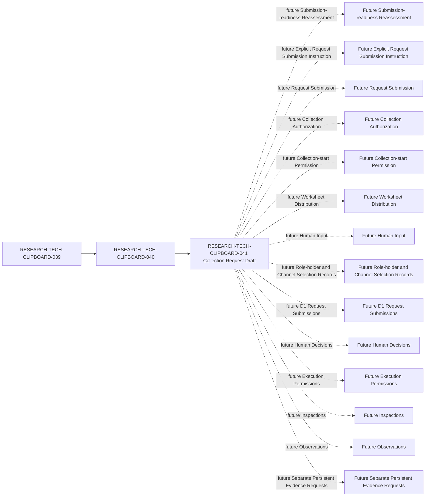

# Clipboard Integration D1 Human Governance Input Collection Request Draft

## Document Control

| Field | Required value |
| --- | --- |
| Document ID | RESEARCH-TECH-CLIPBOARD-041 |
| Title | Clipboard Integration D1 Human Governance Input Collection Request Draft |
| Status | Draft |
| Document Type | Unsubmitted Human-governance Input Collection Request Draft |
| Technology Decision | TD-004 Clipboard Integration |
| Parent Readiness Reassessment | RESEARCH-TECH-CLIPBOARD-040 |
| Parent Readiness Specification | RESEARCH-TECH-CLIPBOARD-039 |
| Blank Worksheet Instance | RESEARCH-TECH-CLIPBOARD-037 |
| Structural Reassessment | RESEARCH-TECH-CLIPBOARD-038 |
| Covered Collection Lanes | CLIP-D1-GOVCOLL-LANE-001..006 |
| Covered Collection Scopes | CLIP-D1-GOVCOLL-SCOPE-001..008 |
| Request Draft | Created by this document |
| Collection Request ID | Not assigned |
| Collection Authority ID | Not assigned |
| Request Submitted | No |
| Intended Recipients | Not identified |
| Collector | Not identified |
| Reviewer | Not identified |
| Collection Channel | Not selected |
| Actual Platform | Not identified |
| Human Collection Authorization | Not provided |
| Collection-start Permission | No |
| Worksheet Distribution | Not performed |
| Human Input | Not collected |
| Human Attestations | Not collected |
| Personal Data | Not collected |
| Owner | TBD |
| Last reviewed | Not reviewed |

## 1. Purpose

This document creates an unsubmitted, unauthorized, undistributed Collection Request Draft. It describes future governance inputs and the safety and governance conditions that must be satisfied before any collection can be considered.

This document is not a submitted Collection Request, Collection Authorization, Collection-start Permission, Worksheet Distribution Instruction, appointment of a Recipient, Collector, Reviewer, or Role Holder, Channel or Platform selection, Human Input or Attestation record, D1 Inspection Request, Human Decision, Execution Permission, Inspection, Observation, or Persistent Evidence.

Creating this draft does not submit a request, assign an identifier, contact a person, distribute a worksheet, collect human input, or authorize any operation.

## 2. Controlled Vocabulary

### Draft State

Allowed values: `Draft created`, `Returned for documentary revision`, `Withdrawn`, `Superseded`.

Current value: `Draft created`.

### Submission State

Current value: `Not submitted`.

### Authorization State

Current value: `Not provided`.

### Collection State

Current values: `Not started`, `Not distributed`, `Not collected`.

### Unresolved Values

Allowed values: `Not assigned`, `Not identified`, `Not selected`, `Not provided`, `Not created`, `Not evaluated`, `Not applicable`.

The following are not current states: `Approved`, `Authorized`, `Submitted`, `Selected`, `Assigned`, `Collected`, `Executed`, `Verified`, and `Passed`.

## 3. Collection Request Draft Field Contract

The following 30 fields preserve the one-to-one order of the Future Request Fields in RESEARCH-TECH-CLIPBOARD-039 and RESEARCH-TECH-CLIPBOARD-040.

| ID | Request field | Required future value | Current state |
| --- | --- | --- | --- |
| CLIP-D1-GOVCOLL-REQFIELD-001 | Request title | D1 human governance input collection request | Draft only |
| CLIP-D1-GOVCOLL-REQFIELD-002 | Request subject | Future governance input collection for TD-004 | Draft only |
| CLIP-D1-GOVCOLL-REQFIELD-003 | Request Document ID | Future request document identifier | Not assigned |
| CLIP-D1-GOVCOLL-REQFIELD-004 | Collection Request ID | Future request identifier | Not assigned |
| CLIP-D1-GOVCOLL-REQFIELD-005 | Parent Worksheet Instance | RESEARCH-TECH-CLIPBOARD-037 | Referenced only |
| CLIP-D1-GOVCOLL-REQFIELD-006 | Worksheet Instance ID treatment | Preserve source worksheet identity and provenance | Not evaluated |
| CLIP-D1-GOVCOLL-REQFIELD-007 | Included Worksheet Sections | Only explicitly bounded worksheet sections | Not evaluated |
| CLIP-D1-GOVCOLL-REQFIELD-008 | Included Collection Scope IDs | CLIP-D1-GOVCOLL-SCOPE-001..008 | Not evaluated |
| CLIP-D1-GOVCOLL-REQFIELD-009 | Included Field ranges | Only fields listed in this draft | Not evaluated |
| CLIP-D1-GOVCOLL-REQFIELD-010 | Explicit excluded fields | All fields in section 9 | Not evaluated |
| CLIP-D1-GOVCOLL-REQFIELD-011 | Intended functional recipient roles | Future role classes only | Not identified |
| CLIP-D1-GOVCOLL-REQFIELD-012 | Intended collector role | Future role class only | Not identified |
| CLIP-D1-GOVCOLL-REQFIELD-013 | Intended reviewer role | Future role class only | Not identified |
| CLIP-D1-GOVCOLL-REQFIELD-014 | Collection purpose | Governance input and readiness assessment | Draft only |
| CLIP-D1-GOVCOLL-REQFIELD-015 | Required inputs | Required future governance input classes | Not evaluated |
| CLIP-D1-GOVCOLL-REQFIELD-016 | Optional inputs | Optional future governance input classes | Not evaluated |
| CLIP-D1-GOVCOLL-REQFIELD-017 | Prohibited inputs | Sensitive, credential, operational, and evidence inputs | Draft only |
| CLIP-D1-GOVCOLL-REQFIELD-018 | Privacy classification | Minimum necessary and privacy-preserving classification | Not evaluated |
| CLIP-D1-GOVCOLL-REQFIELD-019 | Privacy／Human-input Notice reference | Embedded notice draft in section 11 | Not created |
| CLIP-D1-GOVCOLL-REQFIELD-020 | Access-control requirement | Minimum access with separated responsibilities | Not evaluated |
| CLIP-D1-GOVCOLL-REQFIELD-021 | Candidate Channel Classes | Future channel classes only | Not evaluated |
| CLIP-D1-GOVCOLL-REQFIELD-022 | Actual Channel selection prerequisite | Separate future governance decision | Not selected |
| CLIP-D1-GOVCOLL-REQFIELD-023 | Network assessment prerequisite | Separate future assessment | Not evaluated |
| CLIP-D1-GOVCOLL-REQFIELD-024 | Retention rule | Future governance rule without a fixed duration | Not evaluated |
| CLIP-D1-GOVCOLL-REQFIELD-025 | Correction rule | Future correction process | Not evaluated |
| CLIP-D1-GOVCOLL-REQFIELD-026 | Withdrawal／replacement rule | Future withdrawal and replacement process | Not evaluated |
| CLIP-D1-GOVCOLL-REQFIELD-027 | Validation rules | Section 13 validation contract | Not evaluated |
| CLIP-D1-GOVCOLL-REQFIELD-028 | Stop conditions | Section 14 stop conditions | Not evaluated |
| CLIP-D1-GOVCOLL-REQFIELD-029 | Human Collection Authorization | Separate future authorization record | Not provided |
| CLIP-D1-GOVCOLL-REQFIELD-030 | Collection-start Permission | Separate future permission record | No |

Fixed draft values: Collection Request ID `Not assigned`; Recipient, Collector, and Reviewer `Not identified`; Channel `Not selected`; Notice Reference `Not created`; Authorization `Not provided`; Collection-start Permission `No`.

## 4. Six Collection-lane Request Rows

| ID | Lane | Included in draft | Intended input class | Prohibited input | Recipient role class | Current operation |
| --- | --- | --- | --- | --- | --- | --- |
| CLIP-D1-GOVCOLL-LANE-001 | Lane 001 | Yes | Governance identity reference | Personal data | Future role class | Not started |
| CLIP-D1-GOVCOLL-LANE-002 | Lane 002 | Yes | Role and responsibility acknowledgement | Appointment decision | Future role class | Not started |
| CLIP-D1-GOVCOLL-LANE-003 | Lane 003 | Yes | Eligibility and disqualifying-condition response | Operational authorization | Future role class | Not started |
| CLIP-D1-GOVCOLL-LANE-004 | Lane 004 | Yes | Conflict and separation safeguard input | Final decision | Future role class | Not started |
| CLIP-D1-GOVCOLL-LANE-005 | Lane 005 | Yes | Channel-control and request mapping input | Platform credential | Future role class | Not started |
| CLIP-D1-GOVCOLL-LANE-006 | Lane 006 | Yes | Human attestation | Execution permission | Future role class | Not started |

No seventh Collection Lane is introduced.

## 5. Eight Collection-scope Request Rows

| ID | Scope | Worksheet Section | Collection Lane | Draft disposition | Intended future input source | Current state |
| --- | --- | --- | --- | --- | --- | --- |
| CLIP-D1-GOVCOLL-SCOPE-001 | Scope 001 | Governance identity | CLIP-D1-GOVCOLL-LANE-001 | Included | Future human input | Not collected |
| CLIP-D1-GOVCOLL-SCOPE-002 | Scope 002 | Role acceptance | CLIP-D1-GOVCOLL-LANE-002 | Included | Future human input | Not collected |
| CLIP-D1-GOVCOLL-SCOPE-003 | Scope 003 | Responsibility acknowledgement | CLIP-D1-GOVCOLL-LANE-002 | Included | Future human input | Not collected |
| CLIP-D1-GOVCOLL-SCOPE-004 | Scope 004 | Eligibility | CLIP-D1-GOVCOLL-LANE-003 | Included | Future human input | Not collected |
| CLIP-D1-GOVCOLL-SCOPE-005 | Scope 005 | Disqualifying conditions | CLIP-D1-GOVCOLL-LANE-003 | Included | Future human input | Not collected |
| CLIP-D1-GOVCOLL-SCOPE-006 | Scope 006 | Conflict and separation | CLIP-D1-GOVCOLL-LANE-004 | Included | Future human input | Not collected |
| CLIP-D1-GOVCOLL-SCOPE-007 | Scope 007 | Channel controls and request mapping | CLIP-D1-GOVCOLL-LANE-005 | Included | Future human input | Not collected |
| CLIP-D1-GOVCOLL-SCOPE-008 | Scope 008 | Attestation boundary | CLIP-D1-GOVCOLL-LANE-006 | Included | Future human input | Not collected |

Scopes are not expanded or reclassified by this draft.

## 6. Five Functional Recipient-role Classes

| ID | Functional Role | May receive future collection request | May provide governance input | May provide attestation | May make final decision | Actual holder |
| --- | --- | --- | --- | --- | --- | --- |
| CLIP-D1-ROLE-001 | Request Preparer | Future only | Future only | Future only | No | Not identified |
| CLIP-D1-ROLE-002 | Technical Scope Reviewer | Future only | Future only | Future only | No | Not identified |
| CLIP-D1-ROLE-003 | Decision Authority | Future only | Future only | Future only | Future independent Human Decision workflow | Not identified |
| CLIP-D1-ROLE-004 | Execution Operator | Future only | Future only | Future only | No | Not identified |
| CLIP-D1-ROLE-005 | Observation and Evidence Custodian | Future only | Future only | Future only | No | Not identified |

Providing input is not a Role Appointment, Request Approval, or Execution Permission.

## 7. Collector and Reviewer Responsibility Boundary

| ID | Portfolio Item | Functional Role | Input-provider boundary | Collector boundary | Reviewer boundary | Approval boundary | Current holder |
| --- | --- | --- | --- | --- | --- | --- | --- |
| CLIP-D1-GOVRESP-001 | CLIP-D1-REQPORT-001 | CLIP-D1-ROLE-001 | Future input only | Separate future role | Separate future role | None | Not identified |
| CLIP-D1-GOVRESP-002 | CLIP-D1-REQPORT-001 | CLIP-D1-ROLE-002 | Future input only | Separate future role | Separate future role | None | Not identified |
| CLIP-D1-GOVRESP-003 | CLIP-D1-REQPORT-001 | CLIP-D1-ROLE-003 | Future input only | Separate future role | Separate future role | None | Not identified |
| CLIP-D1-GOVRESP-004 | CLIP-D1-REQPORT-001 | CLIP-D1-ROLE-004 | Future input only | Separate future role | Separate future role | None | Not identified |
| CLIP-D1-GOVRESP-005 | CLIP-D1-REQPORT-001 | CLIP-D1-ROLE-005 | Future input only | Separate future role | Separate future role | None | Not identified |
| CLIP-D1-GOVRESP-006 | CLIP-D1-REQPORT-002 | CLIP-D1-ROLE-001 | Future input only | Separate future role | Separate future role | None | Not identified |
| CLIP-D1-GOVRESP-007 | CLIP-D1-REQPORT-002 | CLIP-D1-ROLE-002 | Future input only | Separate future role | Separate future role | None | Not identified |
| CLIP-D1-GOVRESP-008 | CLIP-D1-REQPORT-002 | CLIP-D1-ROLE-003 | Future input only | Separate future role | Separate future role | None | Not identified |
| CLIP-D1-GOVRESP-009 | CLIP-D1-REQPORT-002 | CLIP-D1-ROLE-004 | Future input only | Separate future role | Separate future role | None | Not identified |
| CLIP-D1-GOVRESP-010 | CLIP-D1-REQPORT-002 | CLIP-D1-ROLE-005 | Future input only | Separate future role | Separate future role | None | Not identified |

Provider, Collector, Reviewer, and Decision Authority responsibilities remain separate. The document author does not automatically become Collector, and this document does not decide whether one person may hold multiple future roles.

## 8. Included Input Classes

| ID | Input class | Requirement | Future source | Privacy classification | Approval implication | Current state |
| --- | --- | --- | --- | --- | --- | --- |
| CLIP-D1-GOVINPUT-001 | Governance identity reference | Use only the minimum governance reference | Future human input | Minimum necessary | None | Not collected |
| CLIP-D1-GOVINPUT-002 | Role acceptance | Record future acknowledgement of a proposed role class | Future human input | Governance only | None | Not collected |
| CLIP-D1-GOVINPUT-003 | Responsibility acknowledgement | Record future understanding of boundaries | Future human input | Governance only | None | Not collected |
| CLIP-D1-GOVINPUT-004 | Permitted-action acknowledgement | Record future acknowledgement of permitted scope | Future human input | Governance only | None | Not collected |
| CLIP-D1-GOVINPUT-005 | Prohibited-action acknowledgement | Record future acknowledgement of prohibitions | Future human input | Governance only | None | Not collected |
| CLIP-D1-GOVINPUT-006 | Eligibility response | Record a future eligibility response | Future human input | Minimum necessary | None | Not collected |
| CLIP-D1-GOVINPUT-007 | Disqualifying-condition response | Record a future disqualifying-condition response | Future human input | Minimum necessary | None | Not collected |
| CLIP-D1-GOVINPUT-008 | Conflict disclosure | Record a future conflict disclosure | Future human input | Sensitive governance input | None | Not collected |
| CLIP-D1-GOVINPUT-009 | Separation safeguard proposal | Record a future safeguard proposal | Future human input | Governance only | None | Not collected |
| CLIP-D1-GOVINPUT-010 | Channel-control assessment | Record future control requirements, not a channel choice | Future human input | Governance only | None | Not collected |
| CLIP-D1-GOVINPUT-011 | Request-specific governance mapping | Map future inputs to bounded request fields | Future human input | Minimum necessary | None | Not collected |
| CLIP-D1-GOVINPUT-012 | Human attestation | Record a future attestation separately from approval | Future human input | Sensitive governance input | None | Not collected |

Approval implication is `None` for every included input class; current state is `Not collected` for every row.

## 9. Explicit Excluded Fields

| ID | Excluded field | Exclusion reason | Required downstream artifact | Current state |
| --- | --- | --- | --- | --- |
| CLIP-D1-GOVEXCLUDE-001 | Final Role Appointment | Requires a separate future governance decision | Role appointment record | Not applicable |
| CLIP-D1-GOVEXCLUDE-002 | Final Decision Authority Appointment | Requires a separate future governance decision | Authority record | Not applicable |
| CLIP-D1-GOVEXCLUDE-003 | Final Channel Selection | Requires a separate future governance decision | Channel decision record | Not selected |
| CLIP-D1-GOVEXCLUDE-004 | Actual Platform Authorization | Requires separate authorization | Authorization record | Not provided |
| CLIP-D1-GOVEXCLUDE-005 | Network Authorization | Requires separate network assessment | Network decision record | Not evaluated |
| CLIP-D1-GOVEXCLUDE-006 | Collection Authorization | Not created by a draft | Collection Authorization record | Not provided |
| CLIP-D1-GOVEXCLUDE-007 | Collection-start Permission | Not created by a draft | Permission record | No |
| CLIP-D1-GOVEXCLUDE-008 | D1 Request Approval | Not implied by human input | Approval record | Not applicable |
| CLIP-D1-GOVEXCLUDE-009 | Approved Inspection Items | Outside collection-request scope | Inspection request | Not applicable |
| CLIP-D1-GOVEXCLUDE-010 | Execution Authorization | Requires a separate future decision | Authorization record | Not provided |
| CLIP-D1-GOVEXCLUDE-011 | Execution Permission | Requires a separate future permission | Permission record | No |
| CLIP-D1-GOVEXCLUDE-012 | Operational Observation | Not a human-input field | Observation record | Not applicable |
| CLIP-D1-GOVEXCLUDE-013 | Persistent Evidence Decision | Not a human-input field | Evidence request | Not applicable |
| CLIP-D1-GOVEXCLUDE-014 | Candidate Selection | Not a human-input field | Candidate decision record | Not applicable |
| CLIP-D1-GOVEXCLUDE-015 | Clipboard ADR Decision | Not a human-input field | ADR record | Not applicable |

## 10. Data-minimization Rules

| ID | Data element | Rule | Current state |
| --- | --- | --- | --- |
| CLIP-D1-GOVMIN-001 | Role ID | Use a role-class reference only | Not collected |
| CLIP-D1-GOVMIN-002 | Functional Role name | Use the minimum role-class name | Not collected |
| CLIP-D1-GOVMIN-003 | Governance identity reference | Use only if a future need is established | Not collected |
| CLIP-D1-GOVMIN-004 | Actual personal name | Prohibited; do not request | Not collected |
| CLIP-D1-GOVMIN-005 | Email | Prohibited; do not request | Not collected |
| CLIP-D1-GOVMIN-006 | Department | Prohibited; do not request | Not collected |
| CLIP-D1-GOVMIN-007 | Job title | Prohibited; do not request | Not collected |
| CLIP-D1-GOVMIN-008 | Account name | Prohibited; do not request | Not collected |
| CLIP-D1-GOVMIN-009 | SID | Prohibited | Not collected |
| CLIP-D1-GOVMIN-010 | Computer name | Prohibited | Not collected |
| CLIP-D1-GOVMIN-011 | Credential／Token／Private key | Prohibited | Not collected |
| CLIP-D1-GOVMIN-012 | Channel platform identity | Do not request an actual platform identity | Not collected |
| CLIP-D1-GOVMIN-013 | Channel identifier | Do not request an actual channel identifier | Not collected |
| CLIP-D1-GOVMIN-014 | Clipboard／Screenshot／Desktop content | Prohibited | Not collected |
| CLIP-D1-GOVMIN-015 | Operational Observation／Evidence | Excluded from this request draft | Not applicable |

Credential, Token, Private Key, SID, Computer Name, Clipboard, Screenshot, and Desktop Content are prohibited. Operational Observation and Evidence are excluded. Personal Data is `Not collected`.

## 11. Embedded Privacy and Human-input Notice Draft

This is an embedded, unsent Notice Draft Section. It is not a separate Privacy Notice file.

| ID | Notice field | Draft requirement | Current state |
| --- | --- | --- | --- |
| CLIP-D1-GOVNOTICE-001 | Collection purpose | Explain the bounded governance-input purpose | Not created |
| CLIP-D1-GOVNOTICE-002 | Worksheet identity | Identify the future worksheet instance | Not created |
| CLIP-D1-GOVNOTICE-003 | Requested field scope | Explain the bounded field contract | Not created |
| CLIP-D1-GOVNOTICE-004 | Required／Optional distinction | Distinguish future required and optional input | Not created |
| CLIP-D1-GOVNOTICE-005 | Prohibited sensitive data | List data that must not be supplied | Not created |
| CLIP-D1-GOVNOTICE-006 | Intended governance use | Explain governance-only use | Not created |
| CLIP-D1-GOVNOTICE-007 | Access boundary | Describe future minimum-access boundary | Not created |
| CLIP-D1-GOVNOTICE-008 | Retention boundary | Describe a future retention boundary without duration | Not created |
| CLIP-D1-GOVNOTICE-009 | Correction process | Describe a future correction process | Not created |
| CLIP-D1-GOVNOTICE-010 | Withdrawal／replacement process | Describe a future withdrawal or replacement process | Not created |
| CLIP-D1-GOVNOTICE-011 | No Request Approval implication | State that input is not request approval | Not created |
| CLIP-D1-GOVNOTICE-012 | No Execution Authorization implication | State that input is not execution authorization | Not created |

Notice delivery is `Not performed`; Notice acknowledgement is `Not collected`.

## 12. Access, Retention, Correction and Withdrawal

| ID | Control area | Draft rule | Current state |
| --- | --- | --- | --- |
| CLIP-D1-GOVLIFE-001 | Collector access | Future minimum access only | Not evaluated |
| CLIP-D1-GOVLIFE-002 | Recipient access | Future need-to-know access only | Not evaluated |
| CLIP-D1-GOVLIFE-003 | Reviewer access | Future separated review access only | Not evaluated |
| CLIP-D1-GOVLIFE-004 | Decision Authority access | Future decision-boundary access only | Not evaluated |
| CLIP-D1-GOVLIFE-005 | Minimum-access principle | Grant no access through this draft | Not evaluated |
| CLIP-D1-GOVLIFE-006 | Confidentiality classification | Apply a future governance classification | Not evaluated |
| CLIP-D1-GOVLIFE-007 | Retention class | Define a future class without a duration | Not evaluated |
| CLIP-D1-GOVLIFE-008 | Correction request | Provide a future correction route | Not evaluated |
| CLIP-D1-GOVLIFE-009 | Withdrawal | Provide a future withdrawal route | Not evaluated |
| CLIP-D1-GOVLIFE-010 | Governance identity replacement | Use a future replacement process | Not evaluated |
| CLIP-D1-GOVLIFE-011 | Supersession | Record future supersession separately | Not evaluated |
| CLIP-D1-GOVLIFE-012 | Destruction／deletion governance | Require a future governance decision | Not evaluated |

No actual retention period, account, permission, deletion, or data processing is set or executed by this draft.

## 13. Validation Contract

| ID | Validation Rule | Applies to | Validation authority class | Failure response | Auto-correction | Current evaluation |
| --- | --- | --- | --- | --- | --- | --- |
| CLIP-D1-GOVVAL-001 | Document identity is present | Document Control | Documentary reviewer | Stop and return for revision | Prohibited | Not evaluated |
| CLIP-D1-GOVVAL-002 | Draft state is allowed | Draft State | Documentary reviewer | Stop and return for revision | Prohibited | Not evaluated |
| CLIP-D1-GOVVAL-003 | Request ID is unresolved | Request ID | Documentary reviewer | Stop and preserve Not assigned | Prohibited | Not evaluated |
| CLIP-D1-GOVVAL-004 | Parent references are preserved | Parent references | Documentary reviewer | Stop and return for revision | Prohibited | Not evaluated |
| CLIP-D1-GOVVAL-005 | Lane coverage is bounded | Collection lanes | Documentary reviewer | Stop and return for revision | Prohibited | Not evaluated |
| CLIP-D1-GOVVAL-006 | Scope coverage is bounded | Collection scopes | Documentary reviewer | Stop and return for revision | Prohibited | Not evaluated |
| CLIP-D1-GOVVAL-007 | Request fields match the contract | Request fields | Documentary reviewer | Stop and return for revision | Prohibited | Not evaluated |
| CLIP-D1-GOVVAL-008 | Role classes remain unassigned | Functional roles | Documentary reviewer | Stop and preserve Not identified | Prohibited | Not evaluated |
| CLIP-D1-GOVVAL-009 | Notice remains embedded and unsent | Notice draft | Documentary reviewer | Stop and preserve Not created | Prohibited | Not evaluated |
| CLIP-D1-GOVVAL-010 | Prohibited data remains excluded | Data minimization | Documentary reviewer | Stop and remove the field | Prohibited | Not evaluated |
| CLIP-D1-GOVVAL-011 | Authorization remains separate | Authorization | Documentary reviewer | Stop and preserve Not provided | Prohibited | Not evaluated |
| CLIP-D1-GOVVAL-012 | Collection-start Permission remains No | Collection-start Permission | Documentary reviewer | Stop and preserve No | Prohibited | Not evaluated |
| CLIP-D1-GOVVAL-013 | Stop conditions are represented | Stop conditions | Documentary reviewer | Stop and return for revision | Prohibited | Not evaluated |
| CLIP-D1-GOVVAL-014 | No human input is present | Human Input | Documentary reviewer | Stop and remove data | Prohibited | Not evaluated |
| CLIP-D1-GOVVAL-015 | No operational evidence is present | Evidence boundary | Documentary reviewer | Stop and remove evidence | Prohibited | Not evaluated |

Auto-correction is `Prohibited`; Current evaluation is `Not evaluated` for every validation row.

## 14. Collection Stop Conditions

| ID | Stop condition | Required response | Current trigger state |
| --- | --- | --- | --- |
| CLIP-D1-GOVSTOP-001 | Request is not submitted | Do not begin collection | Not evaluated |
| CLIP-D1-GOVSTOP-002 | Authorization does not exist | Do not begin collection | Not evaluated |
| CLIP-D1-GOVSTOP-003 | Collection-start Permission is No | Do not begin collection | Not evaluated |
| CLIP-D1-GOVSTOP-004 | Recipient is not identified | Do not distribute | Not evaluated |
| CLIP-D1-GOVSTOP-005 | Collector is not identified | Do not collect | Not evaluated |
| CLIP-D1-GOVSTOP-006 | Reviewer is not identified | Do not proceed to review | Not evaluated |
| CLIP-D1-GOVSTOP-007 | Channel is not selected | Do not distribute | Not evaluated |
| CLIP-D1-GOVSTOP-008 | Platform security controls are unconfirmed | Do not distribute | Not evaluated |
| CLIP-D1-GOVSTOP-009 | Notice is not provided | Do not collect | Not evaluated |
| CLIP-D1-GOVSTOP-010 | Requested Scope exceeds the Worksheet | Stop and return for revision | Not evaluated |
| CLIP-D1-GOVSTOP-011 | Prohibited Personal Data is requested | Stop and reject the field | Not evaluated |
| CLIP-D1-GOVSTOP-012 | Credential／Token／SID is entered | Stop and reject the input | Not evaluated |
| CLIP-D1-GOVSTOP-013 | Attestation is interpreted as Approval | Stop and separate the records | Not evaluated |
| CLIP-D1-GOVSTOP-014 | Human Input is interpreted as Execution Permission | Stop and preserve the boundary | Not evaluated |
| CLIP-D1-GOVSTOP-015 | Worksheet is required to contain Operational Evidence | Stop and reject the field | Not evaluated |

Current trigger state is `Not evaluated` for every stop condition.

## 15. Submission and Authorization Separation

| ID | Stage | May create the next stage automatically | Current state |
| --- | --- | --- | --- |
| CLIP-D1-GOVSEP-001 | Draft creation | No | Draft created |
| CLIP-D1-GOVSEP-002 | Request ID assignment | No | Not assigned |
| CLIP-D1-GOVSEP-003 | Request review | No | Not reviewed |
| CLIP-D1-GOVSEP-004 | Request submission | No | Not submitted |
| CLIP-D1-GOVSEP-005 | Submission acknowledgement | No | Not applicable |
| CLIP-D1-GOVSEP-006 | Human Collection Authorization | No | Not provided |
| CLIP-D1-GOVSEP-007 | Collection-start Permission | No | No |
| CLIP-D1-GOVSEP-008 | Worksheet distribution | No | Not performed |
| CLIP-D1-GOVSEP-009 | Human Input collection | No | Not collected |
| CLIP-D1-GOVSEP-010 | Input validation | No | Not evaluated |
| CLIP-D1-GOVSEP-011 | Role／Channel Selection Record | No | Not selected |
| CLIP-D1-GOVSEP-012 | D1 Inspection Request workflow | No | Not started |

No prerequisite stage automatically implies the next stage.

## 16. Prohibited Transitions

The following 18 transitions are preserved one-to-one from RESEARCH-TECH-CLIPBOARD-039 and RESEARCH-TECH-CLIPBOARD-040.

| ID | Prohibited transition | Required boundary | Transition performed |
| --- | --- | --- | --- |
| CLIP-D1-GOVTRANS-001 | Request-readiness Specification → Collection Request Draft | Remains prohibited until a separate future draft transition is authorized | No |
| CLIP-D1-GOVTRANS-002 | Collection Request Draft → Request ID assigned | Remains prohibited until a separate future identifier assignment is authorized | No |
| CLIP-D1-GOVTRANS-003 | Request Draft → Request submitted | Remains prohibited until a separate future submission is authorized | No |
| CLIP-D1-GOVTRANS-004 | Request submitted → Collection authorized | Remains prohibited until a separate future authorization is recorded | No |
| CLIP-D1-GOVTRANS-005 | Collection authorized → Collection-start Permission | Remains prohibited until a separate future permission is recorded | No |
| CLIP-D1-GOVTRANS-006 | Blank Worksheet → Worksheet distributed | Remains prohibited until a separate future distribution is authorized | No |
| CLIP-D1-GOVTRANS-007 | Worksheet distributed → Human Input provided | Remains prohibited until a separate future collection is authorized | No |
| CLIP-D1-GOVTRANS-008 | Governance identity input → Role Holder identified | Remains prohibited until a separate future role process is authorized | No |
| CLIP-D1-GOVTRANS-009 | Role Holder identified → Role accepted | Remains prohibited until a separate future role acceptance is authorized | No |
| CLIP-D1-GOVTRANS-010 | Eligibility input → Decision Authority approved | Remains prohibited until a separate future decision is authorized | No |
| CLIP-D1-GOVTRANS-011 | Conflict disclosure → Conflict resolved | Remains prohibited until a separate future conflict process is authorized | No |
| CLIP-D1-GOVTRANS-012 | Channel assessment → Channel selected | Remains prohibited until a separate future channel decision is authorized | No |
| CLIP-D1-GOVTRANS-013 | Channel selected → Platform authorized | Remains prohibited until a separate future platform authorization is recorded | No |
| CLIP-D1-GOVTRANS-014 | Platform identified → Network authorized | Remains prohibited until a separate future network authorization is recorded | No |
| CLIP-D1-GOVTRANS-015 | Attestation → Request Approval | Remains prohibited; attestation is not request approval | No |
| CLIP-D1-GOVTRANS-016 | Human Input → Execution Permission | Remains prohibited; input is not execution permission | No |
| CLIP-D1-GOVTRANS-017 | Human Input → Operational Observation／Evidence | Remains prohibited; input is not operational evidence | No |
| CLIP-D1-GOVTRANS-018 | Governance Input → Candidate Selection／Clipboard ADR | Remains prohibited; governance input is not candidate or ADR selection | No |

## 17. Gap Register

No D1 human governance input collection request-draft documentary gap identified from available sources

This statement concerns documentary coverage only. It does not mean that a Request ID, recipient, collector, reviewer, channel, submission, authorization, collection, or human input exists.

## 18. Completeness Matrices

All matrix result values are restricted to `Yes`, `Partially`, or `No`.

### Collection Lane Completeness

| ID | Lane | Result |
| --- | --- | --- |
| CLIP-D1-GOVM-LANE-001 | CLIP-D1-GOVCOLL-LANE-001 | Yes |
| CLIP-D1-GOVM-LANE-002 | CLIP-D1-GOVCOLL-LANE-002 | Yes |
| CLIP-D1-GOVM-LANE-003 | CLIP-D1-GOVCOLL-LANE-003 | Yes |
| CLIP-D1-GOVM-LANE-004 | CLIP-D1-GOVCOLL-LANE-004 | Yes |
| CLIP-D1-GOVM-LANE-005 | CLIP-D1-GOVCOLL-LANE-005 | Yes |
| CLIP-D1-GOVM-LANE-006 | CLIP-D1-GOVCOLL-LANE-006 | Yes |

### Collection Scope Completeness

| ID | Scope | Result |
| --- | --- | --- |
| CLIP-D1-GOVM-SCOPE-001 | CLIP-D1-GOVCOLL-SCOPE-001 | Yes |
| CLIP-D1-GOVM-SCOPE-002 | CLIP-D1-GOVCOLL-SCOPE-002 | Yes |
| CLIP-D1-GOVM-SCOPE-003 | CLIP-D1-GOVCOLL-SCOPE-003 | Yes |
| CLIP-D1-GOVM-SCOPE-004 | CLIP-D1-GOVCOLL-SCOPE-004 | Yes |
| CLIP-D1-GOVM-SCOPE-005 | CLIP-D1-GOVCOLL-SCOPE-005 | Yes |
| CLIP-D1-GOVM-SCOPE-006 | CLIP-D1-GOVCOLL-SCOPE-006 | Yes |
| CLIP-D1-GOVM-SCOPE-007 | CLIP-D1-GOVCOLL-SCOPE-007 | Yes |
| CLIP-D1-GOVM-SCOPE-008 | CLIP-D1-GOVCOLL-SCOPE-008 | Yes |

### Request Field Completeness

| ID | Request field | Result |
| --- | --- | --- |
| CLIP-D1-GOVM-REQFIELD-001 | CLIP-D1-GOVCOLL-REQFIELD-001 | Yes |
| CLIP-D1-GOVM-REQFIELD-002 | CLIP-D1-GOVCOLL-REQFIELD-002 | Yes |
| CLIP-D1-GOVM-REQFIELD-003 | CLIP-D1-GOVCOLL-REQFIELD-003 | Yes |
| CLIP-D1-GOVM-REQFIELD-004 | CLIP-D1-GOVCOLL-REQFIELD-004 | Yes |
| CLIP-D1-GOVM-REQFIELD-005 | CLIP-D1-GOVCOLL-REQFIELD-005 | Yes |
| CLIP-D1-GOVM-REQFIELD-006 | CLIP-D1-GOVCOLL-REQFIELD-006 | Yes |
| CLIP-D1-GOVM-REQFIELD-007 | CLIP-D1-GOVCOLL-REQFIELD-007 | Yes |
| CLIP-D1-GOVM-REQFIELD-008 | CLIP-D1-GOVCOLL-REQFIELD-008 | Yes |
| CLIP-D1-GOVM-REQFIELD-009 | CLIP-D1-GOVCOLL-REQFIELD-009 | Yes |
| CLIP-D1-GOVM-REQFIELD-010 | CLIP-D1-GOVCOLL-REQFIELD-010 | Yes |
| CLIP-D1-GOVM-REQFIELD-011 | CLIP-D1-GOVCOLL-REQFIELD-011 | Yes |
| CLIP-D1-GOVM-REQFIELD-012 | CLIP-D1-GOVCOLL-REQFIELD-012 | Yes |
| CLIP-D1-GOVM-REQFIELD-013 | CLIP-D1-GOVCOLL-REQFIELD-013 | Yes |
| CLIP-D1-GOVM-REQFIELD-014 | CLIP-D1-GOVCOLL-REQFIELD-014 | Yes |
| CLIP-D1-GOVM-REQFIELD-015 | CLIP-D1-GOVCOLL-REQFIELD-015 | Yes |
| CLIP-D1-GOVM-REQFIELD-016 | CLIP-D1-GOVCOLL-REQFIELD-016 | Yes |
| CLIP-D1-GOVM-REQFIELD-017 | CLIP-D1-GOVCOLL-REQFIELD-017 | Yes |
| CLIP-D1-GOVM-REQFIELD-018 | CLIP-D1-GOVCOLL-REQFIELD-018 | Yes |
| CLIP-D1-GOVM-REQFIELD-019 | CLIP-D1-GOVCOLL-REQFIELD-019 | Yes |
| CLIP-D1-GOVM-REQFIELD-020 | CLIP-D1-GOVCOLL-REQFIELD-020 | Yes |
| CLIP-D1-GOVM-REQFIELD-021 | CLIP-D1-GOVCOLL-REQFIELD-021 | Yes |
| CLIP-D1-GOVM-REQFIELD-022 | CLIP-D1-GOVCOLL-REQFIELD-022 | Yes |
| CLIP-D1-GOVM-REQFIELD-023 | CLIP-D1-GOVCOLL-REQFIELD-023 | Yes |
| CLIP-D1-GOVM-REQFIELD-024 | CLIP-D1-GOVCOLL-REQFIELD-024 | Yes |
| CLIP-D1-GOVM-REQFIELD-025 | CLIP-D1-GOVCOLL-REQFIELD-025 | Yes |
| CLIP-D1-GOVM-REQFIELD-026 | CLIP-D1-GOVCOLL-REQFIELD-026 | Yes |
| CLIP-D1-GOVM-REQFIELD-027 | CLIP-D1-GOVCOLL-REQFIELD-027 | Yes |
| CLIP-D1-GOVM-REQFIELD-028 | CLIP-D1-GOVCOLL-REQFIELD-028 | Yes |
| CLIP-D1-GOVM-REQFIELD-029 | CLIP-D1-GOVCOLL-REQFIELD-029 | Yes |
| CLIP-D1-GOVM-REQFIELD-030 | CLIP-D1-GOVCOLL-REQFIELD-030 | Yes |

### Recipient-role Completeness

| ID | Functional role | Result |
| --- | --- | --- |
| CLIP-D1-GOVM-ROLE-001 | CLIP-D1-ROLE-001 | Yes |
| CLIP-D1-GOVM-ROLE-002 | CLIP-D1-ROLE-002 | Yes |
| CLIP-D1-GOVM-ROLE-003 | CLIP-D1-ROLE-003 | Yes |
| CLIP-D1-GOVM-ROLE-004 | CLIP-D1-ROLE-004 | Yes |
| CLIP-D1-GOVM-ROLE-005 | CLIP-D1-ROLE-005 | Yes |

### Notice Completeness

| ID | Notice field | Result |
| --- | --- | --- |
| CLIP-D1-GOVM-NOTICE-001 | CLIP-D1-GOVNOTICE-001 | Yes |
| CLIP-D1-GOVM-NOTICE-002 | CLIP-D1-GOVNOTICE-002 | Yes |
| CLIP-D1-GOVM-NOTICE-003 | CLIP-D1-GOVNOTICE-003 | Yes |
| CLIP-D1-GOVM-NOTICE-004 | CLIP-D1-GOVNOTICE-004 | Yes |
| CLIP-D1-GOVM-NOTICE-005 | CLIP-D1-GOVNOTICE-005 | Yes |
| CLIP-D1-GOVM-NOTICE-006 | CLIP-D1-GOVNOTICE-006 | Yes |
| CLIP-D1-GOVM-NOTICE-007 | CLIP-D1-GOVNOTICE-007 | Yes |
| CLIP-D1-GOVM-NOTICE-008 | CLIP-D1-GOVNOTICE-008 | Yes |
| CLIP-D1-GOVM-NOTICE-009 | CLIP-D1-GOVNOTICE-009 | Yes |
| CLIP-D1-GOVM-NOTICE-010 | CLIP-D1-GOVNOTICE-010 | Yes |
| CLIP-D1-GOVM-NOTICE-011 | CLIP-D1-GOVNOTICE-011 | Yes |
| CLIP-D1-GOVM-NOTICE-012 | CLIP-D1-GOVNOTICE-012 | Yes |

### Privacy／Data-minimization Completeness

| ID | Data element | Result |
| --- | --- | --- |
| CLIP-D1-GOVM-MIN-001 | CLIP-D1-GOVMIN-001 | Yes |
| CLIP-D1-GOVM-MIN-002 | CLIP-D1-GOVMIN-002 | Yes |
| CLIP-D1-GOVM-MIN-003 | CLIP-D1-GOVMIN-003 | Yes |
| CLIP-D1-GOVM-MIN-004 | CLIP-D1-GOVMIN-004 | Yes |
| CLIP-D1-GOVM-MIN-005 | CLIP-D1-GOVMIN-005 | Yes |
| CLIP-D1-GOVM-MIN-006 | CLIP-D1-GOVMIN-006 | Yes |
| CLIP-D1-GOVM-MIN-007 | CLIP-D1-GOVMIN-007 | Yes |
| CLIP-D1-GOVM-MIN-008 | CLIP-D1-GOVMIN-008 | Yes |
| CLIP-D1-GOVM-MIN-009 | CLIP-D1-GOVMIN-009 | Yes |
| CLIP-D1-GOVM-MIN-010 | CLIP-D1-GOVMIN-010 | Yes |
| CLIP-D1-GOVM-MIN-011 | CLIP-D1-GOVMIN-011 | Yes |
| CLIP-D1-GOVM-MIN-012 | CLIP-D1-GOVMIN-012 | Yes |
| CLIP-D1-GOVM-MIN-013 | CLIP-D1-GOVMIN-013 | Yes |
| CLIP-D1-GOVM-MIN-014 | CLIP-D1-GOVMIN-014 | Yes |
| CLIP-D1-GOVM-MIN-015 | CLIP-D1-GOVMIN-015 | Yes |

### Validation Completeness

| ID | Validation rule | Result |
| --- | --- | --- |
| CLIP-D1-GOVM-VAL-001 | CLIP-D1-GOVVAL-001 | Yes |
| CLIP-D1-GOVM-VAL-002 | CLIP-D1-GOVVAL-002 | Yes |
| CLIP-D1-GOVM-VAL-003 | CLIP-D1-GOVVAL-003 | Yes |
| CLIP-D1-GOVM-VAL-004 | CLIP-D1-GOVVAL-004 | Yes |
| CLIP-D1-GOVM-VAL-005 | CLIP-D1-GOVVAL-005 | Yes |
| CLIP-D1-GOVM-VAL-006 | CLIP-D1-GOVVAL-006 | Yes |
| CLIP-D1-GOVM-VAL-007 | CLIP-D1-GOVVAL-007 | Yes |
| CLIP-D1-GOVM-VAL-008 | CLIP-D1-GOVVAL-008 | Yes |
| CLIP-D1-GOVM-VAL-009 | CLIP-D1-GOVVAL-009 | Yes |
| CLIP-D1-GOVM-VAL-010 | CLIP-D1-GOVVAL-010 | Yes |
| CLIP-D1-GOVM-VAL-011 | CLIP-D1-GOVVAL-011 | Yes |
| CLIP-D1-GOVM-VAL-012 | CLIP-D1-GOVVAL-012 | Yes |
| CLIP-D1-GOVM-VAL-013 | CLIP-D1-GOVVAL-013 | Yes |
| CLIP-D1-GOVM-VAL-014 | CLIP-D1-GOVVAL-014 | Yes |
| CLIP-D1-GOVM-VAL-015 | CLIP-D1-GOVVAL-015 | Yes |

### Stop-condition Completeness

| ID | Stop condition | Result |
| --- | --- | --- |
| CLIP-D1-GOVM-STOP-001 | CLIP-D1-GOVSTOP-001 | Yes |
| CLIP-D1-GOVM-STOP-002 | CLIP-D1-GOVSTOP-002 | Yes |
| CLIP-D1-GOVM-STOP-003 | CLIP-D1-GOVSTOP-003 | Yes |
| CLIP-D1-GOVM-STOP-004 | CLIP-D1-GOVSTOP-004 | Yes |
| CLIP-D1-GOVM-STOP-005 | CLIP-D1-GOVSTOP-005 | Yes |
| CLIP-D1-GOVM-STOP-006 | CLIP-D1-GOVSTOP-006 | Yes |
| CLIP-D1-GOVM-STOP-007 | CLIP-D1-GOVSTOP-007 | Yes |
| CLIP-D1-GOVM-STOP-008 | CLIP-D1-GOVSTOP-008 | Yes |
| CLIP-D1-GOVM-STOP-009 | CLIP-D1-GOVSTOP-009 | Yes |
| CLIP-D1-GOVM-STOP-010 | CLIP-D1-GOVSTOP-010 | Yes |
| CLIP-D1-GOVM-STOP-011 | CLIP-D1-GOVSTOP-011 | Yes |
| CLIP-D1-GOVM-STOP-012 | CLIP-D1-GOVSTOP-012 | Yes |
| CLIP-D1-GOVM-STOP-013 | CLIP-D1-GOVSTOP-013 | Yes |
| CLIP-D1-GOVM-STOP-014 | CLIP-D1-GOVSTOP-014 | Yes |
| CLIP-D1-GOVM-STOP-015 | CLIP-D1-GOVSTOP-015 | Yes |

### Overall Draft Completeness

| ID | Area | Result |
| --- | --- | --- |
| CLIP-D1-GOVM-OVERALL-001 | Overall Collection Request Draft | Yes |

## 19. Mechanical Final Status

- D1 human governance input collection request draft structurally complete.
- Collection Request Draft: Created.
- Collection Request ID: Not assigned.
- Collection Request Submitted: No.
- Human Collection Authorization: Not provided.
- Collection-start Permission: No.
- Worksheet Distribution: Not performed.
- No D1 human governance input or attestation has been collected.
- No intended recipient, collector, reviewer, functional role holder, collection channel, or actual platform has been identified.
- No D1 inspection operation is authorized for execution.

The draft is ready only for a future submission-readiness reassessment; it is not a submission, authorization, permission, collection, decision, inspection, observation, or evidence record.

### Next-document Handoff

Allowed values: `Ready to prepare D1 collection request submission-readiness reassessment`, `Conditionally ready to prepare D1 collection request submission-readiness reassessment`, `Not ready to prepare D1 collection request submission-readiness reassessment`.

Current value: `Ready to prepare D1 collection request submission-readiness reassessment`.

## 20. Traceability

## 21. Completion Boundary

Only this document is created. No Collection Request ID is assigned, no Collection Request is submitted, no separate Privacy Notice file is created, no person is contacted, no Worksheet is distributed, and no Human Input, Attestation, or Personal Data is collected.

No Recipient, Collector, Reviewer, or Role Holder is identified. No Channel or Platform is selected. No Human Decision, Collection Authorization, Collection-start Permission, or Execution Permission is set. No Inspection, Observation, or Evidence is executed or saved.

No Build, Restore, Test, Run, Runtime, Network, Clipboard, Coding, or screenshot operation is performed.
