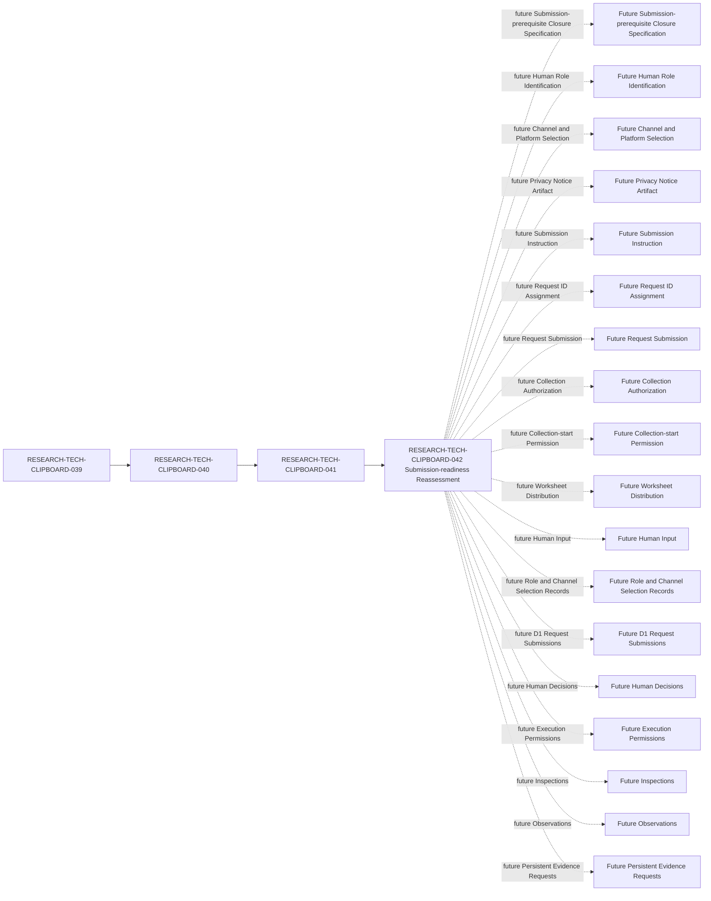

# Clipboard Integration D1 Human Governance Input Collection Request Submission-readiness Reassessment

## Document Control

| Field | Required value |
| --- | --- |
| Document ID | RESEARCH-TECH-CLIPBOARD-042 |
| Title | Clipboard Integration D1 Human Governance Input Collection Request Submission-readiness Reassessment |
| Status | Draft |
| Research Type | Collection Request Submission-readiness Reassessment |
| Request Draft Under Review | RESEARCH-TECH-CLIPBOARD-041 |
| Parent Request-readiness Reassessment | RESEARCH-TECH-CLIPBOARD-040 |
| Parent Request-readiness Specification | RESEARCH-TECH-CLIPBOARD-039 |
| Blank Worksheet Instance | RESEARCH-TECH-CLIPBOARD-037 |
| Collection Request Draft | Created |
| Collection Request ID | Not assigned |
| Submission Instruction | Not created |
| Request Submitted | No |
| Intended Recipients | Not identified |
| Collector | Not identified |
| Reviewer | Not identified |
| Collection Channel | Not selected |
| Actual Platform | Not identified |
| Privacy Notice Artifact | Not created |
| Collection Authorization | Not provided |
| Collection-start Permission | No |
| Worksheet Distribution | Not performed |
| Human Input | Not collected |
| Human Attestations | Not collected |
| Personal Data | Not collected |
| Owner | TBD |
| Last reviewed | Not reviewed |

## 1. Purpose

This reassessment determines whether RESEARCH-TECH-CLIPBOARD-041 preserves the Collection Request Draft scope, fields, roles, privacy, notice, channel, access, lifecycle, validation, stop, and authorization-separation controls, and records the Human and Platform Governance Input still missing before any future actual submission.

This document is not a Submission Instruction, Request ID Assignment, Request Submission, Recipient, Collector, or Reviewer appointment, Channel or Platform Selection, Privacy Notice delivery, Collection Authorization, Collection-start Permission, Worksheet Distribution, Human Input Collection, D1 Inspection Request, or Execution Permission.

This document does not modify RESEARCH-TECH-CLIPBOARD-041. It does not submit or authorize the Collection Request Draft.

## 2. Controlled Vocabulary

### Documentary Conformance

Allowed values: `Preserved`, `Preserved with documented limitation`, `Conflict identified`, `Missing`, `Not applicable`.

### Submission-prerequisite State

Allowed values: `Documentarily satisfied`, `Unresolved future human value`, `Unresolved future platform value`, `Missing documentary requirement`, `Prohibited at this stage`, `Not applicable`.

### Actual Submission Readiness

Allowed values: `Ready for actual submission`, `Conditionally ready for actual submission`, `Not ready for actual submission`.

Because Request ID, Recipients, Collector, Reviewer, Channel, Platform, and Notice Artifact are unresolved, this document must not use `Ready for actual submission`.

### Current State

Allowed current values: `Not assigned`, `Not identified`, `Not selected`, `Not created`, `Not submitted`, `Not provided`, `Not performed`, `Not collected`, `Not evaluated`, and `No`.

## 3. Document Identity Reassessment

| ID | Identity concern | Expected value | Draft value | Conformance | Submission impact |
| --- | --- | --- | --- | --- | --- |
| CLIP-D1-GOVID-001 | Document ID | RESEARCH-TECH-CLIPBOARD-041 | RESEARCH-TECH-CLIPBOARD-041 | Preserved | Documentarily satisfied |
| CLIP-D1-GOVID-002 | Title | Collection Request Draft title | Preserved in draft | Preserved | Documentarily satisfied |
| CLIP-D1-GOVID-003 | Status | Draft | Draft | Preserved | Documentarily satisfied |
| CLIP-D1-GOVID-004 | Document Type | Unsubmitted Human-governance Input Collection Request Draft | Preserved in draft | Preserved | Documentarily satisfied |
| CLIP-D1-GOVID-005 | Technology Decision | TD-004 Clipboard Integration | TD-004 Clipboard Integration | Preserved | Documentarily satisfied |
| CLIP-D1-GOVID-006 | Parent Readiness Reassessment | RESEARCH-TECH-CLIPBOARD-040 | RESEARCH-TECH-CLIPBOARD-040 | Preserved | Documentarily satisfied |
| CLIP-D1-GOVID-007 | Parent Readiness Specification | RESEARCH-TECH-CLIPBOARD-039 | RESEARCH-TECH-CLIPBOARD-039 | Preserved | Documentarily satisfied |
| CLIP-D1-GOVID-008 | Blank Worksheet Instance | RESEARCH-TECH-CLIPBOARD-037 | RESEARCH-TECH-CLIPBOARD-037 | Preserved | Documentarily satisfied |
| CLIP-D1-GOVID-009 | Covered Collection Lanes | CLIP-D1-GOVCOLL-LANE-001..006 | Preserved in draft | Preserved | Documentarily satisfied |
| CLIP-D1-GOVID-010 | Covered Collection Scopes | CLIP-D1-GOVCOLL-SCOPE-001..008 | Preserved in draft | Preserved | Documentarily satisfied |
| CLIP-D1-GOVID-011 | Draft State | Draft created | Draft created | Preserved | Documentarily satisfied |
| CLIP-D1-GOVID-012 | Submission State | Not submitted | Not submitted | Preserved | Prohibited at this stage |

## 4. Thirty Request-field Submission-readiness Rows

| ID | Request Field | Field preserved | Draft value valid | Submission prerequisite | Current prerequisite state | Submission blocker |
| --- | --- | --- | --- | --- | --- | --- |
| CLIP-D1-GOVCOLL-REQFIELD-001 | Request title | Yes | Yes | Documentary title | Documentarily satisfied | No |
| CLIP-D1-GOVCOLL-REQFIELD-002 | Request subject | Yes | Yes | Bounded subject | Documentarily satisfied | No |
| CLIP-D1-GOVCOLL-REQFIELD-003 | Request Document ID | Yes | Yes | Future identifier | Not assigned | Yes |
| CLIP-D1-GOVCOLL-REQFIELD-004 | Collection Request ID | Yes | Yes | Future request identifier | Not assigned | Yes |
| CLIP-D1-GOVCOLL-REQFIELD-005 | Parent Worksheet Instance | Yes | Yes | Worksheet provenance | Documentarily satisfied | No |
| CLIP-D1-GOVCOLL-REQFIELD-006 | Worksheet Instance ID treatment | Yes | Yes | Provenance treatment | Documentarily satisfied | No |
| CLIP-D1-GOVCOLL-REQFIELD-007 | Included Worksheet Sections | Yes | Yes | Bounded sections | Documentarily satisfied | No |
| CLIP-D1-GOVCOLL-REQFIELD-008 | Included Collection Scope IDs | Yes | Yes | Scope IDs | Documentarily satisfied | No |
| CLIP-D1-GOVCOLL-REQFIELD-009 | Included Field ranges | Yes | Yes | Bounded ranges | Documentarily satisfied | No |
| CLIP-D1-GOVCOLL-REQFIELD-010 | Explicit excluded fields | Yes | Yes | Exclusion contract | Documentarily satisfied | No |
| CLIP-D1-GOVCOLL-REQFIELD-011 | Intended functional recipient roles | Yes | Yes | Future role classes | Unresolved future human value | Yes |
| CLIP-D1-GOVCOLL-REQFIELD-012 | Intended collector role | Yes | Yes | Future collector class | Unresolved future human value | Yes |
| CLIP-D1-GOVCOLL-REQFIELD-013 | Intended reviewer role | Yes | Yes | Future reviewer class | Unresolved future human value | Yes |
| CLIP-D1-GOVCOLL-REQFIELD-014 | Collection purpose | Yes | Yes | Bounded purpose | Documentarily satisfied | No |
| CLIP-D1-GOVCOLL-REQFIELD-015 | Required inputs | Yes | Yes | Input contract | Documentarily satisfied | No |
| CLIP-D1-GOVCOLL-REQFIELD-016 | Optional inputs | Yes | Yes | Optionality contract | Documentarily satisfied | No |
| CLIP-D1-GOVCOLL-REQFIELD-017 | Prohibited inputs | Yes | Yes | Prohibition contract | Documentarily satisfied | No |
| CLIP-D1-GOVCOLL-REQFIELD-018 | Privacy classification | Yes | Yes | Privacy classification | Documentarily satisfied | No |
| CLIP-D1-GOVCOLL-REQFIELD-019 | Privacy／Human-input Notice reference | Yes | Yes | Notice artifact | Not created | Yes |
| CLIP-D1-GOVCOLL-REQFIELD-020 | Access-control requirement | Yes | Yes | Access control | Documentarily satisfied | No |
| CLIP-D1-GOVCOLL-REQFIELD-021 | Candidate Channel Classes | Yes | Yes | Future channel classes | Unresolved future platform value | Yes |
| CLIP-D1-GOVCOLL-REQFIELD-022 | Actual Channel selection prerequisite | Yes | Yes | Future channel decision | Not selected | Yes |
| CLIP-D1-GOVCOLL-REQFIELD-023 | Network assessment prerequisite | Yes | Yes | Future platform assessment | Unresolved future platform value | Yes |
| CLIP-D1-GOVCOLL-REQFIELD-024 | Retention rule | Yes | Yes | Lifecycle rule | Documentarily satisfied | No |
| CLIP-D1-GOVCOLL-REQFIELD-025 | Correction rule | Yes | Yes | Correction process | Documentarily satisfied | No |
| CLIP-D1-GOVCOLL-REQFIELD-026 | Withdrawal／replacement rule | Yes | Yes | Withdrawal process | Documentarily satisfied | No |
| CLIP-D1-GOVCOLL-REQFIELD-027 | Validation rules | Yes | Yes | Validation contract | Documentarily satisfied | No |
| CLIP-D1-GOVCOLL-REQFIELD-028 | Stop conditions | Yes | Yes | Stop contract | Documentarily satisfied | No |
| CLIP-D1-GOVCOLL-REQFIELD-029 | Human Collection Authorization | Yes | Yes | Separate authorization | Not provided | Yes |
| CLIP-D1-GOVCOLL-REQFIELD-030 | Collection-start Permission | Yes | Yes | Separate permission | No | Yes |

The Draft Field contract is preserved; preservation does not imply that a Request ID, recipient, collector, reviewer, channel, platform, notice, authorization, or permission exists.

## 5. Collection Structure Reassessment

### Collection Lane

| ID | Lane | Covered | Current operation | Conformance |
| --- | --- | --- | --- | --- |
| CLIP-D1-GOVCOLL-LANE-001 | Lane 001 | Yes | Not evaluated | Preserved |
| CLIP-D1-GOVCOLL-LANE-002 | Lane 002 | Yes | Not evaluated | Preserved |
| CLIP-D1-GOVCOLL-LANE-003 | Lane 003 | Yes | Not evaluated | Preserved |
| CLIP-D1-GOVCOLL-LANE-004 | Lane 004 | Yes | Not evaluated | Preserved |
| CLIP-D1-GOVCOLL-LANE-005 | Lane 005 | Yes | Not evaluated | Preserved |
| CLIP-D1-GOVCOLL-LANE-006 | Lane 006 | Yes | Not evaluated | Preserved |

No seventh lane is introduced.

### Collection Scope

| ID | Scope | Covered | Current state | Conformance |
| --- | --- | --- | --- | --- |
| CLIP-D1-GOVCOLL-SCOPE-001 | Scope 001 | Yes | Not evaluated | Preserved |
| CLIP-D1-GOVCOLL-SCOPE-002 | Scope 002 | Yes | Not evaluated | Preserved |
| CLIP-D1-GOVCOLL-SCOPE-003 | Scope 003 | Yes | Not evaluated | Preserved |
| CLIP-D1-GOVCOLL-SCOPE-004 | Scope 004 | Yes | Not evaluated | Preserved |
| CLIP-D1-GOVCOLL-SCOPE-005 | Scope 005 | Yes | Not evaluated | Preserved |
| CLIP-D1-GOVCOLL-SCOPE-006 | Scope 006 | Yes | Not evaluated | Preserved |
| CLIP-D1-GOVCOLL-SCOPE-007 | Scope 007 | Yes | Not evaluated | Preserved |
| CLIP-D1-GOVCOLL-SCOPE-008 | Scope 008 | Yes | Not evaluated | Preserved |

No ninth scope is introduced.

### Functional Recipient-role

| ID | Functional Role | Actual Holder | Submission effect | Conformance |
| --- | --- | --- | --- | --- |
| CLIP-D1-ROLE-001 | Request Preparer | Not identified | Blocks actual submission | Preserved |
| CLIP-D1-ROLE-002 | Technical Scope Reviewer | Not identified | Blocks actual submission | Preserved |
| CLIP-D1-ROLE-003 | Decision Authority | Not identified | Blocks actual submission | Preserved |
| CLIP-D1-ROLE-004 | Execution Operator | Not identified | Blocks actual submission | Preserved |
| CLIP-D1-ROLE-005 | Observation and Evidence Custodian | Not identified | Blocks actual submission | Preserved |

### Collector／Reviewer Responsibility

| ID | Portfolio Item | Functional Role | Current Holder | Responsibility state | Submission effect |
| --- | --- | --- | --- | --- | --- |
| CLIP-D1-GOVRESP-001 | CLIP-D1-REQPORT-001 | CLIP-D1-ROLE-001 | Not identified | Separate future responsibility | Blocks actual submission |
| CLIP-D1-GOVRESP-002 | CLIP-D1-REQPORT-001 | CLIP-D1-ROLE-002 | Not identified | Separate future responsibility | Blocks actual submission |
| CLIP-D1-GOVRESP-003 | CLIP-D1-REQPORT-001 | CLIP-D1-ROLE-003 | Not identified | Separate future responsibility | Blocks actual submission |
| CLIP-D1-GOVRESP-004 | CLIP-D1-REQPORT-001 | CLIP-D1-ROLE-004 | Not identified | Separate future responsibility | Blocks actual submission |
| CLIP-D1-GOVRESP-005 | CLIP-D1-REQPORT-001 | CLIP-D1-ROLE-005 | Not identified | Separate future responsibility | Blocks actual submission |
| CLIP-D1-GOVRESP-006 | CLIP-D1-REQPORT-002 | CLIP-D1-ROLE-001 | Not identified | Separate future responsibility | Blocks actual submission |
| CLIP-D1-GOVRESP-007 | CLIP-D1-REQPORT-002 | CLIP-D1-ROLE-002 | Not identified | Separate future responsibility | Blocks actual submission |
| CLIP-D1-GOVRESP-008 | CLIP-D1-REQPORT-002 | CLIP-D1-ROLE-003 | Not identified | Separate future responsibility | Blocks actual submission |
| CLIP-D1-GOVRESP-009 | CLIP-D1-REQPORT-002 | CLIP-D1-ROLE-004 | Not identified | Separate future responsibility | Blocks actual submission |
| CLIP-D1-GOVRESP-010 | CLIP-D1-REQPORT-002 | CLIP-D1-ROLE-005 | Not identified | Separate future responsibility | Blocks actual submission |

Actual Holder remains `Not identified` for every role. No role, collector, reviewer, or decision authority is appointed.

## 6. Input and Exclusion Boundary Reassessment

### Included Input Class

| ID | Input class | Approval implication | Current state | Conformance |
| --- | --- | --- | --- | --- |
| CLIP-D1-GOVINPUT-001 | Governance identity reference | None | Not collected | Preserved |
| CLIP-D1-GOVINPUT-002 | Role acceptance | None | Not collected | Preserved |
| CLIP-D1-GOVINPUT-003 | Responsibility acknowledgement | None | Not collected | Preserved |
| CLIP-D1-GOVINPUT-004 | Permitted-action acknowledgement | None | Not collected | Preserved |
| CLIP-D1-GOVINPUT-005 | Prohibited-action acknowledgement | None | Not collected | Preserved |
| CLIP-D1-GOVINPUT-006 | Eligibility response | None | Not collected | Preserved |
| CLIP-D1-GOVINPUT-007 | Disqualifying-condition response | None | Not collected | Preserved |
| CLIP-D1-GOVINPUT-008 | Conflict disclosure | None | Not collected | Preserved |
| CLIP-D1-GOVINPUT-009 | Separation safeguard proposal | None | Not collected | Preserved |
| CLIP-D1-GOVINPUT-010 | Channel-control assessment | None | Not collected | Preserved |
| CLIP-D1-GOVINPUT-011 | Request-specific governance mapping | None | Not collected | Preserved |
| CLIP-D1-GOVINPUT-012 | Human attestation | None | Not collected | Preserved |

Included Input has no Approval implication. Role Acceptance is not Role Appointment; Attestation is not Request Approval; Human Input is not Execution Permission.

### Explicit Excluded Field

| ID | Excluded field | Rule preserved | Current state | Conformance |
| --- | --- | --- | --- | --- |
| CLIP-D1-GOVEXCLUDE-001 | Final Role Appointment | Excluded from input | Not evaluated | Preserved |
| CLIP-D1-GOVEXCLUDE-002 | Final Decision Authority Appointment | Excluded from input | Not evaluated | Preserved |
| CLIP-D1-GOVEXCLUDE-003 | Final Channel Selection | Excluded from input | Not selected | Preserved |
| CLIP-D1-GOVEXCLUDE-004 | Actual Platform Authorization | Excluded from input | Not provided | Preserved |
| CLIP-D1-GOVEXCLUDE-005 | Network Authorization | Excluded from input | Not provided | Preserved |
| CLIP-D1-GOVEXCLUDE-006 | Collection Authorization | Excluded from input | Not provided | Preserved |
| CLIP-D1-GOVEXCLUDE-007 | Collection-start Permission | Excluded from input | No | Preserved |
| CLIP-D1-GOVEXCLUDE-008 | D1 Request Approval | Excluded from input | Not evaluated | Preserved |
| CLIP-D1-GOVEXCLUDE-009 | Approved Inspection Items | Excluded from input | Not evaluated | Preserved |
| CLIP-D1-GOVEXCLUDE-010 | Execution Authorization | Excluded from input | Not provided | Preserved |
| CLIP-D1-GOVEXCLUDE-011 | Execution Permission | Excluded from input | No | Preserved |
| CLIP-D1-GOVEXCLUDE-012 | Operational Observation | Excluded from input | Not evaluated | Preserved |
| CLIP-D1-GOVEXCLUDE-013 | Persistent Evidence Decision | Excluded from input | Not evaluated | Preserved |
| CLIP-D1-GOVEXCLUDE-014 | Candidate Selection | Excluded from input | Not evaluated | Preserved |
| CLIP-D1-GOVEXCLUDE-015 | Clipboard ADR Decision | Excluded from input | Not evaluated | Preserved |

### Data-minimization Rule

| ID | Data element | Rule preserved | Current state | Conformance |
| --- | --- | --- | --- | --- |
| CLIP-D1-GOVMIN-001 | Role ID | Minimum role-class reference only | Not collected | Preserved |
| CLIP-D1-GOVMIN-002 | Functional Role name | Minimum role-class name only | Not collected | Preserved |
| CLIP-D1-GOVMIN-003 | Governance identity reference | Future need must be established | Not collected | Preserved |
| CLIP-D1-GOVMIN-004 | Actual personal name | Do not collect | Not collected | Preserved |
| CLIP-D1-GOVMIN-005 | Email | Do not collect | Not collected | Preserved |
| CLIP-D1-GOVMIN-006 | Department | Do not collect | Not collected | Preserved |
| CLIP-D1-GOVMIN-007 | Job title | Do not collect | Not collected | Preserved |
| CLIP-D1-GOVMIN-008 | Account name | Do not collect | Not collected | Preserved |
| CLIP-D1-GOVMIN-009 | SID | Prohibited | Not collected | Preserved |
| CLIP-D1-GOVMIN-010 | Computer name | Prohibited | Not collected | Preserved |
| CLIP-D1-GOVMIN-011 | Credential／Token／Private key | Prohibited | Not collected | Preserved |
| CLIP-D1-GOVMIN-012 | Channel platform identity | Do not collect | Not collected | Preserved |
| CLIP-D1-GOVMIN-013 | Channel identifier | Do not collect | Not collected | Preserved |
| CLIP-D1-GOVMIN-014 | Clipboard／Screenshot／Desktop content | Prohibited | Not collected | Preserved |
| CLIP-D1-GOVMIN-015 | Operational Observation／Evidence | Excluded | Not evaluated | Preserved |

Actual Name, Email, Department, Job Title, Account, SID, Computer Name, Credential, Token, Private Key, Clipboard, Screenshot, and Desktop Content remain uncollected or prohibited.

## 7. Notice and Lifecycle Reassessment

### Privacy／Human-input Notice

| ID | Notice item | Draft state | Actual artifact state | Conformance |
| --- | --- | --- | --- | --- |
| CLIP-D1-GOVNOTICE-001 | Collection purpose | Preserved | Not created | Preserved |
| CLIP-D1-GOVNOTICE-002 | Worksheet identity | Preserved | Not created | Preserved |
| CLIP-D1-GOVNOTICE-003 | Requested field scope | Preserved | Not created | Preserved |
| CLIP-D1-GOVNOTICE-004 | Required／Optional distinction | Preserved | Not created | Preserved |
| CLIP-D1-GOVNOTICE-005 | Prohibited sensitive data | Preserved | Not created | Preserved |
| CLIP-D1-GOVNOTICE-006 | Intended governance use | Preserved | Not created | Preserved |
| CLIP-D1-GOVNOTICE-007 | Access boundary | Preserved | Not created | Preserved |
| CLIP-D1-GOVNOTICE-008 | Retention boundary | Preserved | Not created | Preserved |
| CLIP-D1-GOVNOTICE-009 | Correction process | Preserved | Not created | Preserved |
| CLIP-D1-GOVNOTICE-010 | Withdrawal／replacement process | Preserved | Not created | Preserved |
| CLIP-D1-GOVNOTICE-011 | No Request Approval implication | Preserved | Not created | Preserved |
| CLIP-D1-GOVNOTICE-012 | No Execution Authorization implication | Preserved | Not created | Preserved |

The Embedded Notice Draft Section exists in the request draft; the actual Notice Artifact remains `Not created`. Notice Delivery is `Not performed`; Notice Acknowledgement is `Not collected`.

### Access／Retention／Correction／Withdrawal

| ID | Lifecycle item | Rule preserved | Current state | Conformance |
| --- | --- | --- | --- | --- |
| CLIP-D1-GOVLIFE-001 | Collector access | Future minimum access | Not evaluated | Preserved |
| CLIP-D1-GOVLIFE-002 | Recipient access | Future need-to-know access | Not evaluated | Preserved |
| CLIP-D1-GOVLIFE-003 | Reviewer access | Future separated review access | Not evaluated | Preserved |
| CLIP-D1-GOVLIFE-004 | Decision Authority access | Future decision-boundary access | Not evaluated | Preserved |
| CLIP-D1-GOVLIFE-005 | Minimum-access principle | No access granted by draft | Not evaluated | Preserved |
| CLIP-D1-GOVLIFE-006 | Confidentiality classification | Future governance classification | Not evaluated | Preserved |
| CLIP-D1-GOVLIFE-007 | Retention class | Future class without duration | Not evaluated | Preserved |
| CLIP-D1-GOVLIFE-008 | Correction request | Future correction route | Not evaluated | Preserved |
| CLIP-D1-GOVLIFE-009 | Withdrawal | Future withdrawal route | Not evaluated | Preserved |
| CLIP-D1-GOVLIFE-010 | Governance identity replacement | Future replacement process | Not evaluated | Preserved |
| CLIP-D1-GOVLIFE-011 | Supersession | Future supersession record | Not evaluated | Preserved |
| CLIP-D1-GOVLIFE-012 | Destruction／deletion governance | Future governance decision | Not evaluated | Preserved |

No actual retention period, account, permission, or deletion operation is configured.

## 8. Validation and Stop-boundary Reassessment

### Validation Rule

| ID | Validation Rule | Current evaluation | Auto-correction | Conformance |
| --- | --- | --- | --- | --- |
| CLIP-D1-GOVVAL-001 | Document identity is preserved | Not evaluated | Prohibited | Preserved |
| CLIP-D1-GOVVAL-002 | Draft state is allowed | Not evaluated | Prohibited | Preserved |
| CLIP-D1-GOVVAL-003 | Request ID remains unresolved | Not evaluated | Prohibited | Preserved |
| CLIP-D1-GOVVAL-004 | Parent traceability is preserved | Not evaluated | Prohibited | Preserved |
| CLIP-D1-GOVVAL-005 | Lane count is bounded | Not evaluated | Prohibited | Preserved |
| CLIP-D1-GOVVAL-006 | Scope count is bounded | Not evaluated | Prohibited | Preserved |
| CLIP-D1-GOVVAL-007 | Request fields are one-to-one | Not evaluated | Prohibited | Preserved |
| CLIP-D1-GOVVAL-008 | Role classes remain fixed | Not evaluated | Prohibited | Preserved |
| CLIP-D1-GOVVAL-009 | Actual holders remain unresolved | Not evaluated | Prohibited | Preserved |
| CLIP-D1-GOVVAL-010 | Notice remains a draft only | Not evaluated | Prohibited | Preserved |
| CLIP-D1-GOVVAL-011 | Excluded data remains excluded | Not evaluated | Prohibited | Preserved |
| CLIP-D1-GOVVAL-012 | Authorization remains separate | Not evaluated | Prohibited | Preserved |
| CLIP-D1-GOVVAL-013 | Stop conditions are represented | Not evaluated | Prohibited | Preserved |
| CLIP-D1-GOVVAL-014 | Human Input is absent | Not evaluated | Prohibited | Preserved |
| CLIP-D1-GOVVAL-015 | Operational Evidence is absent | Not evaluated | Prohibited | Preserved |

Auto-correction is `Prohibited`; Current evaluation is `Not evaluated` for every validation row.

### Collection Stop Condition

| ID | Collection Stop Condition | Required response | Current trigger state | Conformance |
| --- | --- | --- | --- | --- |
| CLIP-D1-GOVSTOP-001 | Request is not submitted | Do not begin Collection | Not evaluated | Preserved |
| CLIP-D1-GOVSTOP-002 | Authorization does not exist | Do not begin Collection | Not evaluated | Preserved |
| CLIP-D1-GOVSTOP-003 | Collection-start Permission is No | Do not begin Collection | Not evaluated | Preserved |
| CLIP-D1-GOVSTOP-004 | Recipient is missing | Do not distribute | Not evaluated | Preserved |
| CLIP-D1-GOVSTOP-005 | Collector is missing | Do not collect | Not evaluated | Preserved |
| CLIP-D1-GOVSTOP-006 | Reviewer is missing | Do not proceed to review | Not evaluated | Preserved |
| CLIP-D1-GOVSTOP-007 | Channel is missing | Do not distribute | Not evaluated | Preserved |
| CLIP-D1-GOVSTOP-008 | Platform controls are unconfirmed | Do not distribute | Not evaluated | Preserved |
| CLIP-D1-GOVSTOP-009 | Notice is not provided | Do not collect | Not evaluated | Preserved |
| CLIP-D1-GOVSTOP-010 | Requested Scope exceeds Worksheet | Stop and revise | Not evaluated | Preserved |
| CLIP-D1-GOVSTOP-011 | Prohibited Personal Data is requested | Stop and reject | Not evaluated | Preserved |
| CLIP-D1-GOVSTOP-012 | Credential／Token／SID is entered | Stop and reject | Not evaluated | Preserved |
| CLIP-D1-GOVSTOP-013 | Attestation is interpreted as Approval | Stop and separate | Not evaluated | Preserved |
| CLIP-D1-GOVSTOP-014 | Human Input is interpreted as Execution Permission | Stop and preserve boundary | Not evaluated | Preserved |
| CLIP-D1-GOVSTOP-015 | Worksheet requires Operational Evidence | Stop and reject | Not evaluated | Preserved |

Current trigger state is `Not evaluated` for every stop condition.

## 9. Submission／Authorization Separation Reassessment

| ID | Stage | Current state | Required prior artifact | Automatic transition prohibited | Submission effect |
| --- | --- | --- | --- | --- | --- |
| CLIP-D1-GOVSEP-001 | Draft creation | Draft created | None | Yes | Does not submit |
| CLIP-D1-GOVSEP-002 | Request ID assignment | Not assigned | Future assignment authority | Yes | Blocks actual submission |
| CLIP-D1-GOVSEP-003 | Request review | Not evaluated | Future reviewer | Yes | Blocks actual submission |
| CLIP-D1-GOVSEP-004 | Request submission | Not submitted | Submission Instruction | Yes | Blocks actual submission |
| CLIP-D1-GOVSEP-005 | Submission acknowledgement | Not evaluated | Future submission | Yes | Blocks actual submission |
| CLIP-D1-GOVSEP-006 | Human Collection Authorization | Not provided | Separate authorization | Yes | Blocks collection |
| CLIP-D1-GOVSEP-007 | Collection-start Permission | No | Separate permission | Yes | Blocks collection |
| CLIP-D1-GOVSEP-008 | Worksheet distribution | Not performed | Recipient, Channel, Notice | Yes | Blocks distribution |
| CLIP-D1-GOVSEP-009 | Human Input collection | Not collected | Authorization and permission | Yes | Blocks collection |
| CLIP-D1-GOVSEP-010 | Input validation | Not evaluated | Collected input | Yes | Not applicable |
| CLIP-D1-GOVSEP-011 | Role／Channel Selection Record | Not selected | Separate future record | Yes | Blocks actual submission |
| CLIP-D1-GOVSEP-012 | D1 Inspection Request workflow | Not started | Separate future permission | Yes | Blocks execution |

Draft Creation is not a Submission Instruction.

## 10. Eighteen Prohibited-transition Reassessment

| Transition ID | Complete transition meaning | Rule preserved | Transition performed | Result |
| --- | --- | --- | --- | --- |
| CLIP-D1-GOVTRANS-001 | Request-readiness Specification → Collection Request Draft | Separate future draft transition required | No | No |
| CLIP-D1-GOVTRANS-002 | Collection Request Draft → Request ID assigned | Separate future identifier assignment required | No | No |
| CLIP-D1-GOVTRANS-003 | Request Draft → Request submitted | Separate future submission required | No | No |
| CLIP-D1-GOVTRANS-004 | Request submitted → Collection authorized | Separate future authorization required | No | No |
| CLIP-D1-GOVTRANS-005 | Collection authorized → Collection-start Permission | Separate future permission required | No | No |
| CLIP-D1-GOVTRANS-006 | Blank Worksheet → Worksheet distributed | Separate future distribution authorization required | No | No |
| CLIP-D1-GOVTRANS-007 | Worksheet distributed → Human Input provided | Separate future collection authorization required | No | No |
| CLIP-D1-GOVTRANS-008 | Governance identity input → Role Holder identified | Separate future role process required | No | No |
| CLIP-D1-GOVTRANS-009 | Role Holder identified → Role accepted | Separate future role acceptance required | No | No |
| CLIP-D1-GOVTRANS-010 | Eligibility input → Decision Authority approved | Separate future decision required | No | No |
| CLIP-D1-GOVTRANS-011 | Conflict disclosure → Conflict resolved | Separate future conflict process required | No | No |
| CLIP-D1-GOVTRANS-012 | Channel assessment → Channel selected | Separate future channel decision required | No | No |
| CLIP-D1-GOVTRANS-013 | Channel selected → Platform authorized | Separate future platform authorization required | No | No |
| CLIP-D1-GOVTRANS-014 | Platform identified → Network authorized | Separate future network authorization required | No | No |
| CLIP-D1-GOVTRANS-015 | Attestation → Request Approval | Attestation is not Request Approval | No | No |
| CLIP-D1-GOVTRANS-016 | Human Input → Execution Permission | Human Input is not Execution Permission | No | No |
| CLIP-D1-GOVTRANS-017 | Human Input → Operational Observation／Evidence | Human Input is not Operational Evidence | No | No |
| CLIP-D1-GOVTRANS-018 | Governance Input → Candidate Selection／Clipboard ADR | Governance Input is not candidate or ADR selection | No | No |

## 11. Twenty Submission-prerequisite Rows

| ID | Prerequisite | Required before actual submission | Documentary state | Future value required | Blocks submission | Reason |
| --- | --- | --- | --- | --- | --- | --- |
| CLIP-D1-GOVPREREQ-001 | Request Draft exists | Yes | Documentarily satisfied | None | No | Draft exists |
| CLIP-D1-GOVPREREQ-002 | Document identity valid | Yes | Documentarily satisfied | None | No | Identity preserved |
| CLIP-D1-GOVPREREQ-003 | Parent traceability valid | Yes | Documentarily satisfied | None | No | Parent chain preserved |
| CLIP-D1-GOVPREREQ-004 | Request field contract complete | Yes | Documentarily satisfied | None | No | 30 fields preserved |
| CLIP-D1-GOVPREREQ-005 | Collection Lanes bounded | Yes | Documentarily satisfied | None | No | Six lanes preserved |
| CLIP-D1-GOVPREREQ-006 | Collection Scopes bounded | Yes | Documentarily satisfied | None | No | Eight scopes preserved |
| CLIP-D1-GOVPREREQ-007 | Included inputs bounded | Yes | Documentarily satisfied | None | No | Twelve classes preserved |
| CLIP-D1-GOVPREREQ-008 | Excluded fields bounded | Yes | Documentarily satisfied | None | No | Fifteen exclusions preserved |
| CLIP-D1-GOVPREREQ-009 | Data minimization bounded | Yes | Documentarily satisfied | None | No | Fifteen rules preserved |
| CLIP-D1-GOVPREREQ-010 | Intended role classes bounded | Yes | Documentarily satisfied | Future role holders | Yes | Holders unresolved |
| CLIP-D1-GOVPREREQ-011 | Actual recipients identified | Yes | Unresolved future human value | Recipients | Yes | Recipients not identified |
| CLIP-D1-GOVPREREQ-012 | Collector identified | Yes | Unresolved future human value | Collector | Yes | Collector not identified |
| CLIP-D1-GOVPREREQ-013 | Reviewer identified | Yes | Unresolved future human value | Reviewer | Yes | Reviewer not identified |
| CLIP-D1-GOVPREREQ-014 | Collection Channel selected | Yes | Unresolved future platform value | Channel | Yes | Channel not selected |
| CLIP-D1-GOVPREREQ-015 | Platform controls assessed | Yes | Unresolved future platform value | Platform controls | Yes | Platform not identified |
| CLIP-D1-GOVPREREQ-016 | Notice Artifact created | Yes | Missing documentary requirement | Notice Artifact | Yes | Artifact not created |
| CLIP-D1-GOVPREREQ-017 | Access／Lifecycle rules confirmed | Yes | Documentarily satisfied | None | No | Rules preserved |
| CLIP-D1-GOVPREREQ-018 | Validation／Stop rules confirmed | Yes | Documentarily satisfied | None | No | Rules preserved |
| CLIP-D1-GOVPREREQ-019 | Submission authority and instruction recorded | Yes | Missing documentary requirement | Submission authority and instruction | Yes | Instruction not created |
| CLIP-D1-GOVPREREQ-020 | Authorization／Collection-start separation preserved | Yes | Documentarily satisfied | Separate authorization and permission | Yes | Collection remains prohibited |

Rows 11 through 16 and 19 block actual Submission until their future values or artifacts are resolved. Authorization is not a substitute for a Submission Instruction.

## 12. Twelve Unresolved-value Ledger Rows

| ID | Unresolved value | Current state | Required source | Required stage | Submission impact |
| --- | --- | --- | --- | --- | --- |
| CLIP-D1-GOVUNRES-001 | Collection Request ID | Not assigned | Future submission authority | Request ID assignment | Blocks submission |
| CLIP-D1-GOVUNRES-002 | Intended Recipients | Not identified | Future human governance input | Recipient identification | Blocks submission |
| CLIP-D1-GOVUNRES-003 | Collector | Not identified | Future human governance input | Collector identification | Blocks submission |
| CLIP-D1-GOVUNRES-004 | Reviewer | Not identified | Future human governance input | Reviewer identification | Blocks submission |
| CLIP-D1-GOVUNRES-005 | Decision Authority Holder | Not identified | Future human governance input | Role-holder identification | Blocks submission |
| CLIP-D1-GOVUNRES-006 | Collection Channel | Not selected | Future platform governance input | Channel selection | Blocks submission |
| CLIP-D1-GOVUNRES-007 | Actual Platform | Not identified | Future platform governance input | Platform identification | Blocks submission |
| CLIP-D1-GOVUNRES-008 | Platform Security-control Reference | Not created | Future platform assessment | Platform control assessment | Blocks submission |
| CLIP-D1-GOVUNRES-009 | Privacy Notice Artifact | Not created | Future privacy governance input | Notice creation | Blocks submission |
| CLIP-D1-GOVUNRES-010 | Submission Authority | Not identified | Future human governance input | Submission instruction | Blocks submission |
| CLIP-D1-GOVUNRES-011 | Collection Authorization | Not provided | Separate future authorization | Authorization | Blocks collection |
| CLIP-D1-GOVUNRES-012 | Collection-start Permission | No | Separate future permission | Collection start | Blocks collection |

No actual person, platform, Channel, or identifier is entered in this ledger.

## 13. Submission-safety Boundary

| ID | Safety boundary | Required current state | Violation response | Current conformance |
| --- | --- | --- | --- | --- |
| CLIP-D1-GOVSAFE-001 | No personal contact | Not performed | Stop and do not contact | Preserved |
| CLIP-D1-GOVSAFE-002 | No Worksheet distribution | Not performed | Stop and do not distribute | Preserved |
| CLIP-D1-GOVSAFE-003 | No Personal Data | Not collected | Stop and reject data | Preserved |
| CLIP-D1-GOVSAFE-004 | No Credential Data | Not collected | Stop and reject data | Preserved |
| CLIP-D1-GOVSAFE-005 | No actual Channel | Not selected | Stop and do not distribute | Preserved |
| CLIP-D1-GOVSAFE-006 | No actual Platform | Not identified | Stop and do not distribute | Preserved |
| CLIP-D1-GOVSAFE-007 | No Network Authorization | Not provided | Stop and do not connect | Preserved |
| CLIP-D1-GOVSAFE-008 | No Collection Authorization | Not provided | Stop and do not collect | Preserved |
| CLIP-D1-GOVSAFE-009 | No Collection-start Permission | No | Stop and do not start | Preserved |
| CLIP-D1-GOVSAFE-010 | No Human Input | Not collected | Stop and preserve empty state | Preserved |
| CLIP-D1-GOVSAFE-011 | No D1 Inspection | Not performed | Stop and do not inspect | Preserved |
| CLIP-D1-GOVSAFE-012 | No Clipboard／Screenshot Content | Not collected | Stop and reject content | Preserved |

## 14. Gap Register

Only genuine Submission-readiness documentary gaps may be recorded. Permitted gaps are missing or conflicting Request Fields, failed Role／Portfolio／Lane／Scope traceability, Included／Excluded Input conflict, missing Notice／Access／Lifecycle／Validation／Stop boundaries, incomplete Prohibited Transition semantics, mixed Submission／Authorization／Collection-start boundaries, or an indeterminate Submission Prerequisite.

Request ID, unresolved recipients, collector, reviewer, channel, platform, Notice Artifact, unsubmitted Request, unprovided Authorization, and uncollected Human Input are not documentary gaps by themselves.

No D1 human governance input collection request submission-readiness documentary gap identified from available sources

## 15. Completeness Matrices

All results are restricted to `Yes`, `Partially`, or `No`.

### Lane Completeness

| ID | Lane | Result |
| --- | --- | --- |
| CLIP-D1-GOVM-LANE-001 | CLIP-D1-GOVCOLL-LANE-001 | Yes |
| CLIP-D1-GOVM-LANE-002 | CLIP-D1-GOVCOLL-LANE-002 | Yes |
| CLIP-D1-GOVM-LANE-003 | CLIP-D1-GOVCOLL-LANE-003 | Yes |
| CLIP-D1-GOVM-LANE-004 | CLIP-D1-GOVCOLL-LANE-004 | Yes |
| CLIP-D1-GOVM-LANE-005 | CLIP-D1-GOVCOLL-LANE-005 | Yes |
| CLIP-D1-GOVM-LANE-006 | CLIP-D1-GOVCOLL-LANE-006 | Yes |

### Scope Completeness

| ID | Scope | Result |
| --- | --- | --- |
| CLIP-D1-GOVM-SCOPE-001 | CLIP-D1-GOVCOLL-SCOPE-001 | Yes |
| CLIP-D1-GOVM-SCOPE-002 | CLIP-D1-GOVCOLL-SCOPE-002 | Yes |
| CLIP-D1-GOVM-SCOPE-003 | CLIP-D1-GOVCOLL-SCOPE-003 | Yes |
| CLIP-D1-GOVM-SCOPE-004 | CLIP-D1-GOVCOLL-SCOPE-004 | Yes |
| CLIP-D1-GOVM-SCOPE-005 | CLIP-D1-GOVCOLL-SCOPE-005 | Yes |
| CLIP-D1-GOVM-SCOPE-006 | CLIP-D1-GOVCOLL-SCOPE-006 | Yes |
| CLIP-D1-GOVM-SCOPE-007 | CLIP-D1-GOVCOLL-SCOPE-007 | Yes |
| CLIP-D1-GOVM-SCOPE-008 | CLIP-D1-GOVCOLL-SCOPE-008 | Yes |

### Request-field Completeness

| ID | Request field | Result |
| --- | --- | --- |
| CLIP-D1-GOVM-REQFIELD-001 | CLIP-D1-GOVCOLL-REQFIELD-001 | Yes |
| CLIP-D1-GOVM-REQFIELD-002 | CLIP-D1-GOVCOLL-REQFIELD-002 | Yes |
| CLIP-D1-GOVM-REQFIELD-003 | CLIP-D1-GOVCOLL-REQFIELD-003 | Yes |
| CLIP-D1-GOVM-REQFIELD-004 | CLIP-D1-GOVCOLL-REQFIELD-004 | Yes |
| CLIP-D1-GOVM-REQFIELD-005 | CLIP-D1-GOVCOLL-REQFIELD-005 | Yes |
| CLIP-D1-GOVM-REQFIELD-006 | CLIP-D1-GOVCOLL-REQFIELD-006 | Yes |
| CLIP-D1-GOVM-REQFIELD-007 | CLIP-D1-GOVCOLL-REQFIELD-007 | Yes |
| CLIP-D1-GOVM-REQFIELD-008 | CLIP-D1-GOVCOLL-REQFIELD-008 | Yes |
| CLIP-D1-GOVM-REQFIELD-009 | CLIP-D1-GOVCOLL-REQFIELD-009 | Yes |
| CLIP-D1-GOVM-REQFIELD-010 | CLIP-D1-GOVCOLL-REQFIELD-010 | Yes |
| CLIP-D1-GOVM-REQFIELD-011 | CLIP-D1-GOVCOLL-REQFIELD-011 | Yes |
| CLIP-D1-GOVM-REQFIELD-012 | CLIP-D1-GOVCOLL-REQFIELD-012 | Yes |
| CLIP-D1-GOVM-REQFIELD-013 | CLIP-D1-GOVCOLL-REQFIELD-013 | Yes |
| CLIP-D1-GOVM-REQFIELD-014 | CLIP-D1-GOVCOLL-REQFIELD-014 | Yes |
| CLIP-D1-GOVM-REQFIELD-015 | CLIP-D1-GOVCOLL-REQFIELD-015 | Yes |
| CLIP-D1-GOVM-REQFIELD-016 | CLIP-D1-GOVCOLL-REQFIELD-016 | Yes |
| CLIP-D1-GOVM-REQFIELD-017 | CLIP-D1-GOVCOLL-REQFIELD-017 | Yes |
| CLIP-D1-GOVM-REQFIELD-018 | CLIP-D1-GOVCOLL-REQFIELD-018 | Yes |
| CLIP-D1-GOVM-REQFIELD-019 | CLIP-D1-GOVCOLL-REQFIELD-019 | Yes |
| CLIP-D1-GOVM-REQFIELD-020 | CLIP-D1-GOVCOLL-REQFIELD-020 | Yes |
| CLIP-D1-GOVM-REQFIELD-021 | CLIP-D1-GOVCOLL-REQFIELD-021 | Yes |
| CLIP-D1-GOVM-REQFIELD-022 | CLIP-D1-GOVCOLL-REQFIELD-022 | Yes |
| CLIP-D1-GOVM-REQFIELD-023 | CLIP-D1-GOVCOLL-REQFIELD-023 | Yes |
| CLIP-D1-GOVM-REQFIELD-024 | CLIP-D1-GOVCOLL-REQFIELD-024 | Yes |
| CLIP-D1-GOVM-REQFIELD-025 | CLIP-D1-GOVCOLL-REQFIELD-025 | Yes |
| CLIP-D1-GOVM-REQFIELD-026 | CLIP-D1-GOVCOLL-REQFIELD-026 | Yes |
| CLIP-D1-GOVM-REQFIELD-027 | CLIP-D1-GOVCOLL-REQFIELD-027 | Yes |
| CLIP-D1-GOVM-REQFIELD-028 | CLIP-D1-GOVCOLL-REQFIELD-028 | Yes |
| CLIP-D1-GOVM-REQFIELD-029 | CLIP-D1-GOVCOLL-REQFIELD-029 | Yes |
| CLIP-D1-GOVM-REQFIELD-030 | CLIP-D1-GOVCOLL-REQFIELD-030 | Yes |

### Role Completeness

| ID | Functional Role | Result |
| --- | --- | --- |
| CLIP-D1-GOVM-ROLE-001 | CLIP-D1-ROLE-001 | Yes |
| CLIP-D1-GOVM-ROLE-002 | CLIP-D1-ROLE-002 | Yes |
| CLIP-D1-GOVM-ROLE-003 | CLIP-D1-ROLE-003 | Yes |
| CLIP-D1-GOVM-ROLE-004 | CLIP-D1-ROLE-004 | Yes |
| CLIP-D1-GOVM-ROLE-005 | CLIP-D1-ROLE-005 | Yes |

### Notice Completeness

| ID | Notice field | Result |
| --- | --- | --- |
| CLIP-D1-GOVM-NOTICE-001 | CLIP-D1-GOVNOTICE-001 | Yes |
| CLIP-D1-GOVM-NOTICE-002 | CLIP-D1-GOVNOTICE-002 | Yes |
| CLIP-D1-GOVM-NOTICE-003 | CLIP-D1-GOVNOTICE-003 | Yes |
| CLIP-D1-GOVM-NOTICE-004 | CLIP-D1-GOVNOTICE-004 | Yes |
| CLIP-D1-GOVM-NOTICE-005 | CLIP-D1-GOVNOTICE-005 | Yes |
| CLIP-D1-GOVM-NOTICE-006 | CLIP-D1-GOVNOTICE-006 | Yes |
| CLIP-D1-GOVM-NOTICE-007 | CLIP-D1-GOVNOTICE-007 | Yes |
| CLIP-D1-GOVM-NOTICE-008 | CLIP-D1-GOVNOTICE-008 | Yes |
| CLIP-D1-GOVM-NOTICE-009 | CLIP-D1-GOVNOTICE-009 | Yes |
| CLIP-D1-GOVM-NOTICE-010 | CLIP-D1-GOVNOTICE-010 | Yes |
| CLIP-D1-GOVM-NOTICE-011 | CLIP-D1-GOVNOTICE-011 | Yes |
| CLIP-D1-GOVM-NOTICE-012 | CLIP-D1-GOVNOTICE-012 | Yes |

### Data-minimization Completeness

| ID | Data rule | Result |
| --- | --- | --- |
| CLIP-D1-GOVM-MIN-001 | CLIP-D1-GOVMIN-001 | Yes |
| CLIP-D1-GOVM-MIN-002 | CLIP-D1-GOVMIN-002 | Yes |
| CLIP-D1-GOVM-MIN-003 | CLIP-D1-GOVMIN-003 | Yes |
| CLIP-D1-GOVM-MIN-004 | CLIP-D1-GOVMIN-004 | Yes |
| CLIP-D1-GOVM-MIN-005 | CLIP-D1-GOVMIN-005 | Yes |
| CLIP-D1-GOVM-MIN-006 | CLIP-D1-GOVMIN-006 | Yes |
| CLIP-D1-GOVM-MIN-007 | CLIP-D1-GOVMIN-007 | Yes |
| CLIP-D1-GOVM-MIN-008 | CLIP-D1-GOVMIN-008 | Yes |
| CLIP-D1-GOVM-MIN-009 | CLIP-D1-GOVMIN-009 | Yes |
| CLIP-D1-GOVM-MIN-010 | CLIP-D1-GOVMIN-010 | Yes |
| CLIP-D1-GOVM-MIN-011 | CLIP-D1-GOVMIN-011 | Yes |
| CLIP-D1-GOVM-MIN-012 | CLIP-D1-GOVMIN-012 | Yes |
| CLIP-D1-GOVM-MIN-013 | CLIP-D1-GOVMIN-013 | Yes |
| CLIP-D1-GOVM-MIN-014 | CLIP-D1-GOVMIN-014 | Yes |
| CLIP-D1-GOVM-MIN-015 | CLIP-D1-GOVMIN-015 | Yes |

### Validation Completeness

| ID | Validation rule | Result |
| --- | --- | --- |
| CLIP-D1-GOVM-VAL-001 | CLIP-D1-GOVVAL-001 | Yes |
| CLIP-D1-GOVM-VAL-002 | CLIP-D1-GOVVAL-002 | Yes |
| CLIP-D1-GOVM-VAL-003 | CLIP-D1-GOVVAL-003 | Yes |
| CLIP-D1-GOVM-VAL-004 | CLIP-D1-GOVVAL-004 | Yes |
| CLIP-D1-GOVM-VAL-005 | CLIP-D1-GOVVAL-005 | Yes |
| CLIP-D1-GOVM-VAL-006 | CLIP-D1-GOVVAL-006 | Yes |
| CLIP-D1-GOVM-VAL-007 | CLIP-D1-GOVVAL-007 | Yes |
| CLIP-D1-GOVM-VAL-008 | CLIP-D1-GOVVAL-008 | Yes |
| CLIP-D1-GOVM-VAL-009 | CLIP-D1-GOVVAL-009 | Yes |
| CLIP-D1-GOVM-VAL-010 | CLIP-D1-GOVVAL-010 | Yes |
| CLIP-D1-GOVM-VAL-011 | CLIP-D1-GOVVAL-011 | Yes |
| CLIP-D1-GOVM-VAL-012 | CLIP-D1-GOVVAL-012 | Yes |
| CLIP-D1-GOVM-VAL-013 | CLIP-D1-GOVVAL-013 | Yes |
| CLIP-D1-GOVM-VAL-014 | CLIP-D1-GOVVAL-014 | Yes |
| CLIP-D1-GOVM-VAL-015 | CLIP-D1-GOVVAL-015 | Yes |

### Stop-condition Completeness

| ID | Stop condition | Result |
| --- | --- | --- |
| CLIP-D1-GOVM-STOP-001 | CLIP-D1-GOVSTOP-001 | Yes |
| CLIP-D1-GOVM-STOP-002 | CLIP-D1-GOVSTOP-002 | Yes |
| CLIP-D1-GOVM-STOP-003 | CLIP-D1-GOVSTOP-003 | Yes |
| CLIP-D1-GOVM-STOP-004 | CLIP-D1-GOVSTOP-004 | Yes |
| CLIP-D1-GOVM-STOP-005 | CLIP-D1-GOVSTOP-005 | Yes |
| CLIP-D1-GOVM-STOP-006 | CLIP-D1-GOVSTOP-006 | Yes |
| CLIP-D1-GOVM-STOP-007 | CLIP-D1-GOVSTOP-007 | Yes |
| CLIP-D1-GOVM-STOP-008 | CLIP-D1-GOVSTOP-008 | Yes |
| CLIP-D1-GOVM-STOP-009 | CLIP-D1-GOVSTOP-009 | Yes |
| CLIP-D1-GOVM-STOP-010 | CLIP-D1-GOVSTOP-010 | Yes |
| CLIP-D1-GOVM-STOP-011 | CLIP-D1-GOVSTOP-011 | Yes |
| CLIP-D1-GOVM-STOP-012 | CLIP-D1-GOVSTOP-012 | Yes |
| CLIP-D1-GOVM-STOP-013 | CLIP-D1-GOVSTOP-013 | Yes |
| CLIP-D1-GOVM-STOP-014 | CLIP-D1-GOVSTOP-014 | Yes |
| CLIP-D1-GOVM-STOP-015 | CLIP-D1-GOVSTOP-015 | Yes |

### Overall Reassessment Completeness

| ID | Area | Result |
| --- | --- | --- |
| CLIP-D1-GOVM-OVERALL-001 | Overall submission-readiness reassessment | Yes |

## 16. Mechanical Final Status

- D1 human governance input collection request submission-readiness reassessment complete.
- Collection Request Draft: Created.
- Collection Request ID: Not assigned.
- Collection Request Submitted: No.
- Submission Instruction: Not created.
- Actual submission readiness: Not ready for actual submission.
- Intended Recipients, Collector, and Reviewer: Not identified.
- Collection Channel: Not selected.
- Actual Platform: Not identified.
- Privacy Notice Artifact: Not created.
- Human Collection Authorization: Not provided.
- Collection-start Permission: No.
- Worksheet Distribution: Not performed.
- Human Input and Attestations: Not collected.
- No D1 inspection operation is authorized for execution.

### Next-document Handoff

Allowed values: `Ready to prepare D1 collection request submission-prerequisite closure specification`, `Conditionally ready to prepare D1 collection request submission-prerequisite closure specification`, `Not ready to prepare D1 collection request submission-prerequisite closure specification`.

Current value: `Not ready to prepare D1 collection request submission-prerequisite closure specification`.

No Submission Instruction or Request is created by this reassessment.

## 17. Traceability

## 18. Completion Boundary

Only this document is created. RESEARCH-TECH-CLIPBOARD-041 is not modified. No Submission Instruction is created, no Request ID is configured, and no Request is submitted.

No person is contacted, no Worksheet is distributed, no Recipient, Collector, Reviewer, or Role Holder is identified, and no Channel or Platform is selected. No actual Privacy Notice is created or sent.

No Human Input, Attestation, or Personal Data is collected. No Collection Authorization or Collection-start Permission is created. No Inspection, Observation, or Evidence is executed or saved.

No Build, Restore, Test, Run, Runtime, Network, Clipboard, Coding, or screenshot operation is performed.
