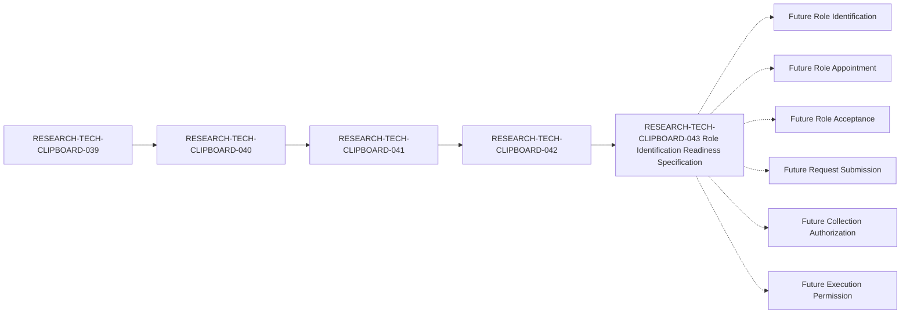

# Clipboard Integration D1 Human Governance Role Identification Readiness Specification

## Document Control

| Field | Value |
| --- | --- |
| Document ID | RESEARCH-TECH-CLIPBOARD-043 |
| Title | Clipboard Integration D1 Human Governance Role Identification Readiness Specification |
| Status | Draft |
| Document Type | Human Role Identification Readiness Specification |
| Research Type | Human Role Identification Readiness Specification |
| Parent Document | RESEARCH-TECH-CLIPBOARD-042 |
| Traceability chain | RESEARCH-TECH-CLIPBOARD-039 → RESEARCH-TECH-CLIPBOARD-040 → RESEARCH-TECH-CLIPBOARD-041 → RESEARCH-TECH-CLIPBOARD-042 → RESEARCH-TECH-CLIPBOARD-043 |
| Actual Role Identification | Not performed |
| Actual Role Appointment | Not performed |
| Actual Role Acceptance | Not collected |
| Owner | TBD |
| Last reviewed | Not reviewed |

## 1. Purpose

This document specifies the documentary and governance prerequisites for a future D1 Human Role Identification activity. It defines the minimum role information, role separation, validation rules, stop conditions, and unresolved values that would be needed before a future human role identification stage could be considered.

This document does not identify any person, appoint any role holder, collect any human input, submit a request, authorize collection, authorize execution, or permit a D1 inspection. It is a readiness specification only.

The specification must remain separate from:

- Role Identification.
- Role Appointment.
- Role Acceptance.
- Decision Approval.
- Request Submission.
- Collection Authorization.
- Execution Permission.
- Operational Observation or Evidence preservation.

## 2. Scope and Governance Boundary

The scope is limited to the five fixed functional role classes carried forward from the parent readiness reassessment. The specification records requirements without assigning actual holders.

The following activities are outside this document:

- Identifying, contacting, inviting, or appointing a person.
- Requesting or collecting names, email addresses, departments, job titles, accounts, or other personal data.
- Creating or sending a Privacy Notice.
- Selecting a recipient, collector, reviewer, channel, platform, or network.
- Creating a Submission Instruction or submitting a Collection Request.
- Granting Collection Authorization or Collection-start Permission.
- Distributing a Worksheet.
- Collecting Human Governance Input or attestations.
- Performing D1 Inspection, Clipboard operations, Screenshot capture, or Desktop-content collection.
- Creating Operational Observation or Persistent Evidence.

## 3. Controlled Vocabulary

### 3.1 Current-state values

Only the following values may be used for unresolved or not-yet-performed stages in this specification:

- `Not identified`
- `Not performed`
- `Not collected`
- `Not assigned`
- `Not selected`
- `Not created`
- `Not provided`
- `Not evaluated`
- `No`
- `None`
- `TBD`
- `Not applicable`

### 3.2 Readiness values

The following values describe documentary readiness only and do not authorize an activity:

- `Documentarily satisfied`
- `Partially documentarily satisfied`
- `Unresolved future human value`
- `Missing documentary requirement`
- `Prohibited at this stage`
- `Not applicable`

### 3.3 Interpretation rules

1. `Documentarily satisfied` means the requirement is described in this document; it does not mean that a person has been identified or appointed.
2. `Unresolved future human value` means a future authorized human process would be required; it is not a documentation defect by itself.
3. Role Identification is not Role Appointment.
4. Role Acceptance is not Decision Approval.
5. Human Governance Input is not Request Submission.
6. Human Governance Input is not Collection Authorization.
7. Human Governance Input is not Execution Permission.
8. Any unresolved actual holder, identity reference, channel, platform, authorization, or permission must remain unresolved.

## 4. Document Identity and Traceability

| Identity item | Expected value | Draft value | Conformance | Impact |
| --- | --- | --- | --- | --- |
| Document ID | RESEARCH-TECH-CLIPBOARD-043 | RESEARCH-TECH-CLIPBOARD-043 | Documentarily satisfied | Identifies this specification |
| Title | Human Role Identification Readiness Specification | Clipboard Integration D1 Human Governance Role Identification Readiness Specification | Documentarily satisfied | Names the controlled scope |
| Status | Draft | Draft | Documentarily satisfied | Does not authorize execution |
| Document Type | Human Role Identification Readiness Specification | Human Role Identification Readiness Specification | Documentarily satisfied | Distinguishes specification from operation |
| Parent | RESEARCH-TECH-CLIPBOARD-042 | RESEARCH-TECH-CLIPBOARD-042 | Documentarily satisfied | Preserves parent traceability |
| Prior specification chain | 039 → 040 → 041 → 042 | 039 → 040 → 041 → 042 | Documentarily satisfied | Preserves documentary lineage |
| Covered role classes | Five fixed functional roles | Five fixed functional roles | Documentarily satisfied | Prevents role expansion |
| Actual role-holder state | No actual holder identified | Not identified | Documentarily satisfied | Prevents human identification |
| Appointment state | No appointment performed | Not performed | Documentarily satisfied | Prevents role appointment |
| Acceptance state | No acceptance collected | Not collected | Documentarily satisfied | Prevents acceptance collection |
| Authorization implication | None | None | Documentarily satisfied | Prevents automatic authorization |
| D1 operation state | No D1 operation authorized | No | Documentarily satisfied | Blocks inspection and evidence work |

## 5. Fixed Functional Role Classes

The following five role classes are fixed. This specification does not add a sixth role or assign an actual holder.

| Role ID | Functional Role | Governance purpose | Actual Holder | Appointment | Acceptance | Authorization implication |
| --- | --- | --- | --- | --- | --- | --- |
| CLIP-D1-ROLE-001 | Request Preparer | Prepares a future request package from approved documentary inputs | Not identified | Not performed | Not collected | None |
| CLIP-D1-ROLE-002 | Technical Scope Reviewer | Reviews future technical scope and boundary conformance | Not identified | Not performed | Not collected | None |
| CLIP-D1-ROLE-003 | Decision Authority | Makes a future governance decision when separately authorized | Not identified | Not performed | Not collected | None |
| CLIP-D1-ROLE-004 | Execution Operator | Performs a future explicitly authorized operation, if separately permitted | Not identified | Not performed | Not collected | None |
| CLIP-D1-ROLE-005 | Observation and Evidence Custodian | Controls a future observation or evidence process, if separately authorized | Not identified | Not performed | Not collected | None |

### 5.1 Role-class invariants

- Each Role ID is a specification identifier, not a person identifier.
- `Actual Holder` must remain `Not identified`.
- `Appointment` must remain `Not performed`.
- `Acceptance` must remain `Not collected`.
- `Authorization implication` must remain `None`.
- A role class cannot create its own appointment, authorization, or execution permission.
- Role classes must not be expanded, merged, or replaced by actual names in this document.

## 6. Minimum Required Role-identification Input

The following input classes define the minimum future input contract without containing actual values.

| Input ID | Required input class | Minimum requirement | Current value | Future source | Personal data status |
| --- | --- | --- | --- | --- | --- |
| CLIP-D1-ROLEINPUT-001 | Role ID | Stable specification-level role identifier | Defined by this document | Existing role contract | Not collected |
| CLIP-D1-ROLEINPUT-002 | Functional Role | One of the five fixed functional role names | Defined by this document | Role-class table | Not collected |
| CLIP-D1-ROLEINPUT-003 | Governance identity reference requirement | A future authorized process must define what reference is sufficient | Not evaluated | Future human-governance process | Not collected |
| CLIP-D1-ROLEINPUT-004 | Eligibility requirement | A future authorized process must define role eligibility criteria | Defined, no actual value | Future eligibility specification | Not collected |
| CLIP-D1-ROLEINPUT-005 | Conflict-disclosure requirement | A future authorized process must define conflict disclosure criteria | Defined, no actual value | Future conflict process | Not collected |
| CLIP-D1-ROLEINPUT-006 | Separation-of-duty requirement | A future authorized process must evaluate prohibited role overlaps | Defined, no actual value | Role separation table | Not collected |
| CLIP-D1-ROLEINPUT-007 | Appointment prerequisite | Appointment must be a later, explicit stage | Not performed | Future appointment specification | Not collected |
| CLIP-D1-ROLEINPUT-008 | Acceptance prerequisite | Acceptance must be collected only after separate appointment | Not collected | Future acceptance process | Not collected |
| CLIP-D1-ROLEINPUT-009 | Decision-authority prerequisite | Decision authority must not be inferred from identification | None | Future decision process | Not collected |
| CLIP-D1-ROLEINPUT-010 | Privacy and minimization requirement | Only the minimum approved input may be requested | Defined, no actual value | Future privacy notice artifact | Not collected |
| CLIP-D1-ROLEINPUT-011 | Validation requirement | Input must be validated before any later governance stage | Defined, not evaluated | Validation rules | Not collected |
| CLIP-D1-ROLEINPUT-012 | Stop-condition requirement | Missing authorization or boundary controls must stop the process | Defined, not evaluated | Stop conditions | Not collected |

## 7. Role Identification, Appointment, Acceptance, and Authorization Separation

| Separation ID | Boundary | Required rule | Current state | Automatic transition |
| --- | --- | --- | --- | --- |
| CLIP-D1-ROLESEP-001 | Role Identification ≠ Role Appointment | Identifying a candidate role reference cannot appoint a holder | Not performed | Prohibited |
| CLIP-D1-ROLESEP-002 | Role Acceptance ≠ Decision Approval | Acceptance of a role cannot approve a decision | Not collected | Prohibited |
| CLIP-D1-ROLESEP-003 | Human Governance Input ≠ Request Submission | Governance input cannot submit a Collection Request | No input | Prohibited |
| CLIP-D1-ROLESEP-004 | Human Governance Input ≠ Collection Authorization | Governance input cannot authorize collection | No input | Prohibited |
| CLIP-D1-ROLESEP-005 | Human Governance Input ≠ Execution Permission | Governance input cannot permit execution | No input | Prohibited |
| CLIP-D1-ROLESEP-006 | Request Preparer ≠ Decision Authority | Preparation and decision authority must remain separate unless a future authorized rule explicitly allows an exception | Not evaluated | Prohibited |
| CLIP-D1-ROLESEP-007 | Technical Scope Reviewer ≠ Execution Operator | Scope review and operational execution must remain separate | Not evaluated | Prohibited |
| CLIP-D1-ROLESEP-008 | Decision Authority ≠ Execution Operator | Decision authority does not itself grant execution permission | Not evaluated | Prohibited |
| CLIP-D1-ROLESEP-009 | Execution Operator ≠ Observation and Evidence Custodian | Execution and evidence custody must remain independently controlled | Not evaluated | Prohibited |
| CLIP-D1-ROLESEP-010 | Role identity reference ≠ Personal identity disclosure | A role reference must not be converted into a name, account, or contact record | Not collected | Prohibited |

## 8. Data Minimization and Explicit Exclusions

### 8.1 Minimum-data rules

| Rule ID | Data-minimization rule | Current state | Effect |
| --- | --- | --- | --- |
| CLIP-D1-ROLEMIN-001 | Store role class before considering any future holder reference | Defined | Prevents premature human identification |
| CLIP-D1-ROLEMIN-002 | Use a specification-level Role ID rather than a personal identifier | Defined | Prevents personal identity collection |
| CLIP-D1-ROLEMIN-003 | Request only the minimum governance identity reference approved at a later stage | Future value unresolved | Blocks over-collection |
| CLIP-D1-ROLEMIN-004 | Do not request contact details for role readiness | Defined | Blocks contact collection |
| CLIP-D1-ROLEMIN-005 | Do not request organizational attributes for role readiness | Defined | Blocks organizational profiling |
| CLIP-D1-ROLEMIN-006 | Keep eligibility as a rule, not as an unapproved personal record | Defined | Blocks unnecessary data |
| CLIP-D1-ROLEMIN-007 | Keep conflict disclosure as a future controlled response | Defined | Blocks uncontrolled disclosure |
| CLIP-D1-ROLEMIN-008 | Keep separation-of-duty checks independent of personal data | Defined | Preserves role boundary |
| CLIP-D1-ROLEMIN-009 | Do not persist observation or evidence for this specification | Defined | Blocks persistent evidence |
| CLIP-D1-ROLEMIN-010 | Do not infer authorization from any role input | Defined | Preserves authorization separation |

### 8.2 Explicitly prohibited fields and content

| Exclusion ID | Prohibited field or content | Required current state | Violation response |
| --- | --- | --- | --- |
| CLIP-D1-ROLEEX-001 | Actual name | Not collected | Stop and reject the input |
| CLIP-D1-ROLEEX-002 | Email address | Not collected | Stop and reject the input |
| CLIP-D1-ROLEEX-003 | Department | Not collected | Stop and reject the input |
| CLIP-D1-ROLEEX-004 | Job title | Not collected | Stop and reject the input |
| CLIP-D1-ROLEEX-005 | Account | Not collected | Stop and reject the input |
| CLIP-D1-ROLEEX-006 | SID | Not collected | Stop and reject the input |
| CLIP-D1-ROLEEX-007 | Computer name | Not collected | Stop and reject the input |
| CLIP-D1-ROLEEX-008 | Credential | Not collected | Stop and reject the input |
| CLIP-D1-ROLEEX-009 | Token | Not collected | Stop and reject the input |
| CLIP-D1-ROLEEX-010 | Private key | Not collected | Stop and reject the input |
| CLIP-D1-ROLEEX-011 | Clipboard content | Not collected | Stop immediately |
| CLIP-D1-ROLEEX-012 | Screenshot content | Not collected | Stop immediately |
| CLIP-D1-ROLEEX-013 | Desktop content | Not collected | Stop immediately |
| CLIP-D1-ROLEEX-014 | Operational Observation | Not created | Stop and do not persist |
| CLIP-D1-ROLEEX-015 | Persistent Evidence | Not created | Stop and do not persist |

## 9. Role Identification Readiness Prerequisites

| Prerequisite ID | Prerequisite | Required before future Role Identification | Documentary state | Future value required | Blocks identification | Reason |
| --- | --- | --- | --- | --- | --- | --- |
| CLIP-D1-ROLEPREREQ-001 | This specification exists | Yes | Documentarily satisfied | No | No | Establishes the controlled scope |
| CLIP-D1-ROLEPREREQ-002 | Document identity is valid | Yes | Documentarily satisfied | No | No | Preserves traceability |
| CLIP-D1-ROLEPREREQ-003 | Parent traceability is valid | Yes | Documentarily satisfied | No | No | Prevents orphaned role work |
| CLIP-D1-ROLEPREREQ-004 | Five role classes are bounded | Yes | Documentarily satisfied | No | No | Prevents unapproved role expansion |
| CLIP-D1-ROLEPREREQ-005 | Minimum input contract is defined | Yes | Documentarily satisfied | No | No | Prevents uncontrolled requests |
| CLIP-D1-ROLEPREREQ-006 | Actual identity values are absent | Yes | Documentarily satisfied | No | No | Preserves data minimization |
| CLIP-D1-ROLEPREREQ-007 | Eligibility requirement is defined | Yes | Documentarily satisfied | No | No | Defines a future validation boundary |
| CLIP-D1-ROLEPREREQ-008 | Conflict-disclosure requirement is defined | Yes | Documentarily satisfied | No | No | Defines a future conflict boundary |
| CLIP-D1-ROLEPREREQ-009 | Separation-of-duty rules are defined | Yes | Documentarily satisfied | No | No | Prevents role overlap inference |
| CLIP-D1-ROLEPREREQ-010 | Role Appointment remains separate | Yes | Documentarily satisfied | No | No | Prevents automatic appointment |
| CLIP-D1-ROLEPREREQ-011 | Role Acceptance remains separate | Yes | Documentarily satisfied | No | No | Prevents automatic acceptance |
| CLIP-D1-ROLEPREREQ-012 | Request and authorization stages remain separate | Yes | Documentarily satisfied | No | No | Prevents automatic submission or execution |
| CLIP-D1-ROLEPREREQ-013 | Excluded fields are bounded | Yes | Documentarily satisfied | No | No | Prevents personal and machine-data collection |
| CLIP-D1-ROLEPREREQ-014 | Validation rules are defined | Yes | Documentarily satisfied | No | No | Defines rejection behavior |
| CLIP-D1-ROLEPREREQ-015 | Stop conditions are defined | Yes | Documentarily satisfied | No | No | Defines when future work must stop |

No prerequisite in this table identifies a person or authorizes a future activity. A future value may still be required before actual Role Identification can begin.

## 10. Validation Rules

| Validation ID | Validation rule | Current evaluation | Failure response |
| --- | --- | --- | --- |
| CLIP-D1-ROLEVAL-001 | Role ID must match one of the five fixed role IDs | Not evaluated | Stop and reject |
| CLIP-D1-ROLEVAL-002 | Functional Role must match the fixed role name | Not evaluated | Stop and reject |
| CLIP-D1-ROLEVAL-003 | No actual holder may be present in this specification | Not evaluated | Stop and remove the value |
| CLIP-D1-ROLEVAL-004 | No name, email, department, or job title may be present | Not evaluated | Stop and remove the value |
| CLIP-D1-ROLEVAL-005 | No account, SID, or computer name may be present | Not evaluated | Stop and remove the value |
| CLIP-D1-ROLEVAL-006 | No credential, token, or private key may be present | Not evaluated | Stop immediately |
| CLIP-D1-ROLEVAL-007 | No Clipboard, Screenshot, or Desktop content may be present | Not evaluated | Stop immediately |
| CLIP-D1-ROLEVAL-008 | Eligibility must be a documented requirement, not an inferred approval | Not evaluated | Stop and defer |
| CLIP-D1-ROLEVAL-009 | Conflict disclosure must remain a future controlled step | Not evaluated | Stop and defer |
| CLIP-D1-ROLEVAL-010 | Separation-of-duty rules must be evaluated before any appointment | Not evaluated | Stop and defer |
| CLIP-D1-ROLEVAL-011 | Identification must not be interpreted as appointment | Not evaluated | Stop and preserve separation |
| CLIP-D1-ROLEVAL-012 | Acceptance must not be interpreted as decision approval | Not evaluated | Stop and preserve separation |
| CLIP-D1-ROLEVAL-013 | Governance input must not be interpreted as request submission | Not evaluated | Stop and preserve separation |
| CLIP-D1-ROLEVAL-014 | Governance input must not be interpreted as collection authorization | Not evaluated | Stop and preserve separation |
| CLIP-D1-ROLEVAL-015 | Governance input must not be interpreted as execution permission | Not evaluated | Stop and preserve separation |

## 11. Collection and Execution Stop Conditions

| Stop ID | Stop condition | Current trigger state | Required response |
| --- | --- | --- | --- |
| CLIP-D1-ROLESTOP-001 | Document is not in an authorized future stage | Not evaluated | Stop |
| CLIP-D1-ROLESTOP-002 | Role ID is missing or outside the fixed set | Not evaluated | Stop |
| CLIP-D1-ROLESTOP-003 | Functional Role is missing or changed | Not evaluated | Stop |
| CLIP-D1-ROLESTOP-004 | Actual holder is requested | Not evaluated | Stop and reject |
| CLIP-D1-ROLESTOP-005 | Personal name is requested | Not evaluated | Stop and reject |
| CLIP-D1-ROLESTOP-006 | Contact or organizational data is requested | Not evaluated | Stop and reject |
| CLIP-D1-ROLESTOP-007 | Account, SID, or computer data is requested | Not evaluated | Stop and reject |
| CLIP-D1-ROLESTOP-008 | Credential, token, or private key is requested | Not evaluated | Stop immediately |
| CLIP-D1-ROLESTOP-009 | Clipboard, Screenshot, or Desktop content is requested | Not evaluated | Stop immediately |
| CLIP-D1-ROLESTOP-010 | Role Appointment is inferred from identification | Not evaluated | Stop and preserve separation |
| CLIP-D1-ROLESTOP-011 | Role Acceptance is inferred from a role reference | Not evaluated | Stop and preserve separation |
| CLIP-D1-ROLESTOP-012 | Human Governance Input is treated as Request Submission | Not evaluated | Stop and preserve separation |
| CLIP-D1-ROLESTOP-013 | Human Governance Input is treated as Collection Authorization | Not evaluated | Stop and preserve separation |
| CLIP-D1-ROLESTOP-014 | Human Governance Input is treated as Execution Permission | Not evaluated | Stop and preserve separation |
| CLIP-D1-ROLESTOP-015 | Authorization or Collection-start Permission is absent | Not evaluated | Stop; never collect or execute |

No Role Identification, Role Appointment, Role Acceptance, collection, or execution may begin while a stop condition is active.

## 12. Prohibited Transitions

The following transitions are explicitly prohibited. Each rule is preserved in this specification, but no transition has been performed.

| Transition ID | Complete transition meaning | Rule preserved | Transition performed | Result |
| --- | --- | --- | --- | --- |
| CLIP-D1-ROLETRANS-001 | Role Identification Readiness Specification → Role Holder Identified | Yes | No | No |
| CLIP-D1-ROLETRANS-002 | Role Holder Identified → Role Appointment | Yes | No | No |
| CLIP-D1-ROLETRANS-003 | Role Appointment → Role Acceptance | Yes | No | No |
| CLIP-D1-ROLETRANS-004 | Role Acceptance → Decision Authority Approval | Yes | No | No |
| CLIP-D1-ROLETRANS-005 | Governance identity reference → Actual identity disclosure | Yes | No | No |
| CLIP-D1-ROLETRANS-006 | Human Governance Input → Collection Request Submission | Yes | No | No |
| CLIP-D1-ROLETRANS-007 | Role Holder Identified → Recipient Assignment | Yes | No | No |
| CLIP-D1-ROLETRANS-008 | Role Holder Identified → Collector Assignment | Yes | No | No |
| CLIP-D1-ROLETRANS-009 | Role Holder Identified → Reviewer Assignment | Yes | No | No |
| CLIP-D1-ROLETRANS-010 | Role Acceptance → Collection Authorization | Yes | No | No |
| CLIP-D1-ROLETRANS-011 | Role Acceptance → Collection-start Permission | Yes | No | No |
| CLIP-D1-ROLETRANS-012 | Role Acceptance → Execution Permission | Yes | No | No |
| CLIP-D1-ROLETRANS-013 | Role Identification → Worksheet Distribution | Yes | No | No |
| CLIP-D1-ROLETRANS-014 | Role Identification → Privacy Notice Delivery | Yes | No | No |
| CLIP-D1-ROLETRANS-015 | Governance Input → Operational Observation | Yes | No | No |
| CLIP-D1-ROLETRANS-016 | Governance Input → Persistent Evidence | Yes | No | No |

## 13. Unresolved-value Ledger

The following values are intentionally unresolved future values. Their unresolved state is not a documentary gap in this specification.

| Unresolved value | Current state | Required source | Required stage | Impact |
| --- | --- | --- | --- | --- |
| Actual Role Holder for Request Preparer | Not identified | Future authorized human process | Role Identification | Blocks appointment |
| Actual Role Holder for Technical Scope Reviewer | Not identified | Future authorized human process | Role Identification | Blocks appointment |
| Actual Role Holder for Decision Authority | Not identified | Future authorized human process | Role Identification | Blocks decision approval |
| Actual Role Holder for Execution Operator | Not identified | Future authorized human process | Role Identification | Blocks execution |
| Actual Role Holder for Observation and Evidence Custodian | Not identified | Future authorized human process | Role Identification | Blocks observation and evidence |
| Governance identity reference | Not identified | Future approved identity-reference rule | Role Identification | Blocks identification |
| Eligibility evaluation | Not evaluated | Future eligibility process | Role Identification | Blocks appointment |
| Conflict disclosure evaluation | Not evaluated | Future conflict process | Role Identification | Blocks appointment |
| Separation-of-duty evaluation | Not evaluated | Future role-separation process | Before appointment | Blocks appointment |
| Role Acceptance | Not collected | Future acceptance process | After appointment | Blocks acceptance-dependent stages |

No actual person, account, contact, machine identifier, credential, token, private key, Clipboard content, Screenshot, Desktop content, observation, or evidence is entered in this ledger.

## 14. Submission and Authorization Separation

| Stage | Current state | Required prior artifact | Automatic transition prohibited | Effect |
| --- | --- | --- | --- | --- |
| Role Identification specification | Created as Draft | RESEARCH-TECH-CLIPBOARD-043 | No automatic identification | Defines readiness only |
| Role Identification | Not performed | Future approved identification specification | Yes | No holder is identified |
| Role Appointment | Not performed | Future appointment decision and authorization | Yes | No role is appointed |
| Role Acceptance | Not collected | Future appointed holder and acceptance process | Yes | No acceptance is collected |
| Request Draft | Not created by this document | Future request specification | Yes | No request is created |
| Request Submission | No | Future Submission Instruction | Yes | No request is submitted |
| Collection Authorization | Not provided | Future decision and authorization artifact | Yes | No collection is authorized |
| Collection-start Permission | No | Future explicit start permission | Yes | No collection begins |
| Worksheet Distribution | Not performed | Future authorized distribution record | Yes | No Worksheet is distributed |
| Human Governance Input | Not collected | Future authorized collection process | Yes | No input is collected |
| Execution Permission | Not provided | Future explicit execution permission | Yes | No operation executes |

## 15. Current Mechanical Status

| Status item | Required value |
| --- | --- |
| Document ID | RESEARCH-TECH-CLIPBOARD-043 |
| Document status | Draft |
| Parent | RESEARCH-TECH-CLIPBOARD-042 |
| Fixed role classes | Five; no sixth role |
| Actual Role Holders | Not identified |
| Role Appointment | Not performed |
| Role Acceptance | Not collected |
| Actual recipients | Not identified |
| Actual collector | Not identified |
| Actual reviewer | Not identified |
| Channel | Not selected |
| Platform | Not identified |
| Privacy Notice | Not created |
| Request Submission | No |
| Submission Instruction | Not created |
| Collection Authorization | Not provided |
| Collection-start Permission | No |
| Worksheet Distribution | Not performed |
| Human Governance Input | Not collected |
| Personal Data | Not collected |
| Credentials and machine data | Not collected |
| Operational Observation | Not created |
| Persistent Evidence | Not created |
| D1 Inspection | Not authorized |

## 16. Completeness Matrix

The matrix records documentary completeness only. Every result value is restricted to `Yes`, `Partially`, or `No`.

| Coverage area | Expected coverage | Current documentary coverage | Result |
| --- | --- | --- | --- |
| Document identity and parent traceability | 12 identity and traceability items | All defined | Yes |
| Fixed functional role classes | 5 role classes | All five defined; holders unresolved | Yes |
| Minimum role-identification input | 12 input classes | All defined without actual values | Yes |
| Role separation boundaries | 10 separation rules | All defined without assignments | Yes |
| Data minimization rules | 10 minimum-data rules | All defined | Yes |
| Explicit exclusions | 15 prohibited fields or content classes | All defined | Yes |
| Readiness prerequisites | 15 prerequisites | All defined | Yes |
| Validation rules | 15 validation rules | All defined; not evaluated | Yes |
| Stop conditions | 15 stop conditions | All defined; not triggered by an operation | Yes |
| Prohibited transitions | 16 transitions | All preserved; none performed | Yes |
| Unresolved-value ledger | 10 future values | All listed without actual values | Yes |
| Submission and authorization separation | 11 stages | All separated | Yes |
| Actual human input | No actual input permitted | None collected | Yes |
| Actual role appointment | No appointment permitted | None performed | Yes |
| Actual execution | No execution permitted | None authorized | Yes |
| Overall role-identification readiness specification | Complete documentary specification | Draft complete; future human values unresolved | Yes |

## 17. Mermaid Traceability

Solid arrows represent documentary traceability only. Dashed arrows represent future stages that require separate human governance input and explicit authorization. No dashed stage is performed or authorized by this document.

## 18. Completion Boundary and Next Handoff

This document is complete as a Draft readiness specification when:

- RESEARCH-TECH-CLIPBOARD-043 remains a Draft.
- The five fixed functional roles remain unchanged.
- Every `Actual Holder` remains `Not identified`.
- Every `Appointment` remains `Not performed`.
- Every `Acceptance` remains `Not collected`.
- Authorization implication remains `None` for every role.
- No actual person, contact, account, machine identifier, credential, token, private key, Clipboard, Screenshot, Desktop content, observation, or evidence is present.
- Role Identification remains separate from Role Appointment.
- Role Acceptance remains separate from Decision Approval.
- Human Governance Input remains separate from Request Submission, Collection Authorization, and Execution Permission.
- Request Submission remains `No`.
- Submission Instruction remains `Not created`.
- Collection Authorization remains `Not provided`.
- Collection-start Permission remains `No`.
- Worksheet Distribution remains `Not performed`.
- Human Governance Input remains `Not collected`.
- D1 Inspection remains not authorized.

The only permitted next-document handoffs are:

- `Ready to prepare D1 human role identification input and privacy prerequisite closure specification`
- `Conditionally ready to prepare D1 human role identification input and privacy prerequisite closure specification`
- `Not ready to prepare D1 human role identification input and privacy prerequisite closure specification`

No next handoff may create a Submission Instruction, submit a Collection Request, identify a person, appoint a role, collect acceptance, authorize collection, authorize execution, distribute a Worksheet, perform a D1 Inspection, or preserve operational evidence.

## 19. Prohibited Actions

This specification must not be used to:

- Identify or contact a real person.
- Appoint or accept a role.
- Assign a recipient, collector, reviewer, or role holder.
- Select a Channel or Platform.
- Create or send a Privacy Notice.
- Create a Submission Instruction.
- Submit a Collection Request.
- Provide Collection Authorization or Collection-start Permission.
- Distribute a Worksheet.
- Collect Human Governance Input, attestation, or Personal Data.
- Read or collect Clipboard content.
- Capture or collect Screenshot or Desktop content.
- Perform D1 Inspection, Operational Observation, or Persistent Evidence preservation.
- Build, Test, Run, or begin application coding.

## 20. Mechanical Final Status

`D1 human governance role identification readiness specification complete`

- Document: RESEARCH-TECH-CLIPBOARD-043
- Status: Draft
- Parent: RESEARCH-TECH-CLIPBOARD-042
- Fixed roles: Five
- Actual Role Holders: Not identified
- Role Appointment: Not performed
- Role Acceptance: Not collected
- Request Submitted: No
- Submission Instruction: Not created
- Collection Authorization: Not provided
- Collection-start Permission: No
- Worksheet Distribution: Not performed
- Human Governance Input: Not collected
- Personal Data: Not collected
- D1 Inspection: Not authorized
- Execution Permission: Not provided

No actual human-governance activity is authorized by this document.
