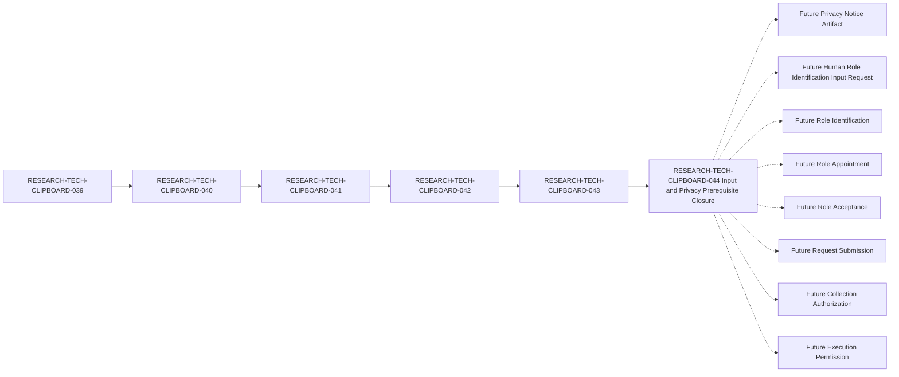

# Clipboard Integration D1 Human Governance Role Identification Input and Privacy Prerequisite Closure Specification

## Document Control

| Field | Value |
| --- | --- |
| Document ID | RESEARCH-TECH-CLIPBOARD-044 |
| Title | Clipboard Integration D1 Human Governance Role Identification Input and Privacy Prerequisite Closure Specification |
| Status | Draft |
| Parent Document | RESEARCH-TECH-CLIPBOARD-043 |
| Document Type | Human Role Identification Input and Privacy Prerequisite Closure Specification |
| Traceability chain | RESEARCH-TECH-CLIPBOARD-039 → RESEARCH-TECH-CLIPBOARD-040 → RESEARCH-TECH-CLIPBOARD-041 → RESEARCH-TECH-CLIPBOARD-042 → RESEARCH-TECH-CLIPBOARD-043 → RESEARCH-TECH-CLIPBOARD-044 |
| Actual Privacy Notice Artifact | Not created |
| Privacy Notice Delivery | Not performed |
| Notice Acknowledgement | Not collected |
| Actual Role Identification | Not performed |
| Human Governance Input | Not collected |
| Owner | TBD |
| Last reviewed | Not reviewed |

## 1. Purpose and Boundary

This document defines the documentary closure specification for the future Human Role Identification input contract and its privacy prerequisites. It identifies what must be documented before a future authorized process may request or evaluate governance input.

This document does not identify, contact, appoint, or accept any person. It does not create or send an actual Privacy Notice, create a Submission Instruction, submit a Collection Request, authorize collection, distribute a Worksheet, collect Human Input, or permit execution.

The closure described here is documentary closure only. It does not mean that future human values, an actual Privacy Notice Artifact, a channel, a platform, authorization, or permission exists.

## 2. Traceability and Fixed Role State

The documentary chain is:

`RESEARCH-TECH-CLIPBOARD-039 → RESEARCH-TECH-CLIPBOARD-040 → RESEARCH-TECH-CLIPBOARD-041 → RESEARCH-TECH-CLIPBOARD-042 → RESEARCH-TECH-CLIPBOARD-043 → RESEARCH-TECH-CLIPBOARD-044`

The five fixed role classes remain unchanged. A sixth role must not be added.

| Role ID | Functional Role | Actual Holder | Appointment | Acceptance | Authorization implication |
| --- | --- | --- | --- | --- | --- |
| CLIP-D1-ROLE-001 | Request Preparer | Not identified | Not performed | Not collected | None |
| CLIP-D1-ROLE-002 | Technical Scope Reviewer | Not identified | Not performed | Not collected | None |
| CLIP-D1-ROLE-003 | Decision Authority | Not identified | Not performed | Not collected | None |
| CLIP-D1-ROLE-004 | Execution Operator | Not identified | Not performed | Not collected | None |
| CLIP-D1-ROLE-005 | Observation and Evidence Custodian | Not identified | Not performed | Not collected | None |

## 3. Controlled Closure Vocabulary

### 3.1 Documentary state

- `Documentarily specified`: The requirement is described without an actual human or operational value.
- `Documentarily satisfied`: The required rule or boundary is fully defined.
- `Partially documentarily satisfied`: The rule is defined, but a future human or privacy value is intentionally unresolved.
- `Unresolved future human value`: A future authorized human process must supply the value.
- `Unresolved future privacy value`: A future approved Privacy Notice Artifact must supply or confirm the value.
- `Not created`: No actual artifact exists.
- `Not performed`: No operational action occurred.
- `Not collected`: No human input or acknowledgement was collected.
- `No`: The relevant activity has not occurred and is not authorized by this document.
- `None`: The requirement has no authorization implication.
- `Not evaluated`: No future input has been assessed.

### 3.2 Closure interpretation

1. Input prerequisite closure is not Human Input Collection.
2. Privacy prerequisite closure is not Privacy Notice creation.
3. Privacy Notice creation is not Privacy Notice delivery.
4. Privacy Notice delivery is not Notice Acknowledgement.
5. Notice Acknowledgement is not Human Input Collection.
6. Role Identification is not Role Appointment.
7. Role Acceptance is not Decision Approval.
8. Human Governance Input is not Request Submission.
9. Human Governance Input is not Collection Authorization.
10. Human Governance Input is not Execution Permission.
11. A documentary `Yes` result never authorizes a later activity.
12. An unresolved future value is not a defect in this closure specification when the unresolved state is explicitly recorded.

## 4. Input Prerequisite Closure

The following twelve rows close the documentary requirements inherited from RESEARCH-TECH-CLIPBOARD-043. No row contains an actual person, account, contact, machine identifier, or other personal data.

| Input ID | Required input class | Documentary requirement | Current documentary state | Future human value required | Future privacy value required | Closure state | Closure blocker | Reason |
| --- | --- | --- | --- | --- | --- | --- | --- | --- |
| CLIP-D1-ROLEINPUT-001 | Role ID | Use one of the five fixed specification Role IDs | Documentarily satisfied | No | No | Documentarily satisfied | None | Prevents role expansion |
| CLIP-D1-ROLEINPUT-002 | Functional Role | Use the fixed functional role name matching the Role ID | Documentarily satisfied | No | No | Documentarily satisfied | None | Prevents role substitution |
| CLIP-D1-ROLEINPUT-003 | Governance identity reference requirement | Define the minimum future identity-reference class without a personal value | Documentarily specified | Unresolved future human value | Unresolved future privacy value | Partially documentarily satisfied | Future approved identity-reference rule | Prevents over-collection |
| CLIP-D1-ROLEINPUT-004 | Eligibility requirement | Define future eligibility criteria as a rule, not an approval | Documentarily specified | Unresolved future human value | Unresolved future privacy value | Partially documentarily satisfied | Future eligibility evaluation | Preserves eligibility separation |
| CLIP-D1-ROLEINPUT-005 | Conflict-disclosure requirement | Define future conflict disclosure and handling criteria | Documentarily specified | Unresolved future human value | Unresolved future privacy value | Partially documentarily satisfied | Future conflict process | Prevents inferred clearance |
| CLIP-D1-ROLEINPUT-006 | Separation-of-duty requirement | Define prohibited role overlaps and evaluation order | Documentarily satisfied | Unresolved future human value | No | Partially documentarily satisfied | Future separation evaluation | Prevents role overlap |
| CLIP-D1-ROLEINPUT-007 | Appointment prerequisite | Keep appointment as a later explicit stage | Documentarily satisfied | No | No | Documentarily satisfied | None | Prevents automatic appointment |
| CLIP-D1-ROLEINPUT-008 | Acceptance prerequisite | Keep acceptance after appointment and as a separate stage | Documentarily satisfied | Unresolved future human value | Unresolved future privacy value | Partially documentarily satisfied | Future acceptance process | Prevents inferred acceptance |
| CLIP-D1-ROLEINPUT-009 | Decision-authority prerequisite | Keep decision authority separate from identification and acceptance | Documentarily satisfied | Unresolved future human value | No | Partially documentarily satisfied | Future decision process | Prevents inferred approval |
| CLIP-D1-ROLEINPUT-010 | Privacy and minimization requirement | Define minimum collection, exclusions, access, and lifecycle boundaries | Documentarily satisfied | No | Unresolved future privacy value | Partially documentarily satisfied | Future Privacy Notice Artifact | Prevents over-collection |
| CLIP-D1-ROLEINPUT-011 | Validation requirement | Validate future input before any later governance stage | Documentarily satisfied | No | No | Documentarily satisfied | Future input not present | Defines rejection behavior |
| CLIP-D1-ROLEINPUT-012 | Stop-condition requirement | Stop when authorization, privacy, or boundary conditions are missing | Documentarily satisfied | No | No | Documentarily satisfied | No operation permitted | Prevents premature activity |

## 5. Privacy Notice Prerequisite Closure

The following minimum content must be present in a future approved Privacy Notice Artifact. This section defines requirements only; it does not create the artifact.

| Privacy prerequisite ID | Required minimum content | Documentary requirement | Current documentary state | Future privacy value required | Closure blocker |
| --- | --- | --- | --- | --- | --- |
| CLIP-D1-PRIVREQ-001 | Collection purpose | State why future role-identification input would be requested | Documentarily specified | Unresolved future privacy value | Actual purpose approval absent |
| CLIP-D1-PRIVREQ-002 | Role-identification scope | Limit the notice to the five fixed role classes | Documentarily satisfied | No | None |
| CLIP-D1-PRIVREQ-003 | Required and optional input distinction | Mark every future input as required or optional | Documentarily specified | Unresolved future privacy value | Future input contract absent |
| CLIP-D1-PRIVREQ-004 | Explicit data exclusions | List all prohibited personal, machine, Clipboard, Screenshot, Desktop, observation, and evidence content | Documentarily satisfied | No | None |
| CLIP-D1-PRIVREQ-005 | Data-minimization boundary | State that only minimum approved input may be requested | Documentarily satisfied | No | None |
| CLIP-D1-PRIVREQ-006 | Access boundary | Identify future access classes and prohibit unapproved access | Documentarily specified | Unresolved future privacy value | Future access rule absent |
| CLIP-D1-PRIVREQ-007 | Retention boundary | Define future retention and deletion rules | Documentarily specified | Unresolved future privacy value | Future retention rule absent |
| CLIP-D1-PRIVREQ-008 | Correction process | Define how a future input value could be corrected | Documentarily specified | Unresolved future privacy value | Future correction process absent |
| CLIP-D1-PRIVREQ-009 | Withdrawal or replacement process | Define how a future role input could be withdrawn or replaced | Documentarily specified | Unresolved future privacy value | Future withdrawal process absent |
| CLIP-D1-PRIVREQ-010 | No appointment implication | State that notice or input does not appoint a role | Documentarily satisfied | No | None |
| CLIP-D1-PRIVREQ-011 | No request-submission implication | State that notice or input does not submit a request | Documentarily satisfied | No | None |
| CLIP-D1-PRIVREQ-012 | No authorization implication | State that notice or input does not authorize collection | Documentarily satisfied | No | None |
| CLIP-D1-PRIVREQ-013 | No execution-permission implication | State that notice or input does not permit execution | Documentarily satisfied | No | None |

### 5.1 Actual Privacy Notice state

| Artifact state | Required value |
| --- | --- |
| Privacy Notice Artifact | Not created |
| Privacy Notice Delivery | Not performed |
| Notice Acknowledgement | Not collected |
| Privacy Notice approval | Not provided |

## 6. Explicitly Excluded Data and Content

The following fifteen categories remain prohibited and must not be entered into this document or any future unapproved input channel.

| Exclusion ID | Excluded category | Required state | Violation response |
| --- | --- | --- | --- |
| CLIP-D1-ROLEEX-001 | Actual name | Not collected | Stop and reject |
| CLIP-D1-ROLEEX-002 | Email address | Not collected | Stop and reject |
| CLIP-D1-ROLEEX-003 | Department | Not collected | Stop and reject |
| CLIP-D1-ROLEEX-004 | Job title | Not collected | Stop and reject |
| CLIP-D1-ROLEEX-005 | Account | Not collected | Stop and reject |
| CLIP-D1-ROLEEX-006 | SID | Not collected | Stop and reject |
| CLIP-D1-ROLEEX-007 | Computer name | Not collected | Stop and reject |
| CLIP-D1-ROLEEX-008 | Credential | Not collected | Stop immediately |
| CLIP-D1-ROLEEX-009 | Token | Not collected | Stop immediately |
| CLIP-D1-ROLEEX-010 | Private key | Not collected | Stop immediately |
| CLIP-D1-ROLEEX-011 | Clipboard content | Not collected | Stop immediately |
| CLIP-D1-ROLEEX-012 | Screenshot content | Not collected | Stop immediately |
| CLIP-D1-ROLEEX-013 | Desktop content | Not collected | Stop immediately |
| CLIP-D1-ROLEEX-014 | Operational Observation | Not created | Stop and do not persist |
| CLIP-D1-ROLEEX-015 | Persistent Evidence | Not created | Stop and do not persist |

## 7. Separation Rules

| Separation ID | Separation rule | Current state | Automatic transition |
| --- | --- | --- | --- |
| CLIP-D1-PRIVSEP-001 | Input prerequisite closure ≠ Human Input Collection | Documentarily satisfied | Prohibited |
| CLIP-D1-PRIVSEP-002 | Privacy prerequisite closure ≠ Privacy Notice creation | Documentarily satisfied | Prohibited |
| CLIP-D1-PRIVSEP-003 | Privacy Notice creation ≠ Privacy Notice delivery | Documentarily satisfied | Prohibited |
| CLIP-D1-PRIVSEP-004 | Privacy Notice delivery ≠ Notice Acknowledgement | Documentarily satisfied | Prohibited |
| CLIP-D1-PRIVSEP-005 | Notice Acknowledgement ≠ Human Input Collection | Documentarily satisfied | Prohibited |
| CLIP-D1-PRIVSEP-006 | Role Identification ≠ Role Appointment | Documentarily satisfied | Prohibited |
| CLIP-D1-PRIVSEP-007 | Role Appointment ≠ Role Acceptance | Documentarily satisfied | Prohibited |
| CLIP-D1-PRIVSEP-008 | Role Acceptance ≠ Decision Approval | Documentarily satisfied | Prohibited |
| CLIP-D1-PRIVSEP-009 | Human Governance Input ≠ Request Submission | Documentarily satisfied | Prohibited |
| CLIP-D1-PRIVSEP-010 | Human Governance Input ≠ Collection Authorization | Documentarily satisfied | Prohibited |
| CLIP-D1-PRIVSEP-011 | Human Governance Input ≠ Collection-start Permission | Documentarily satisfied | Prohibited |
| CLIP-D1-PRIVSEP-012 | Human Governance Input ≠ Execution Permission | Documentarily satisfied | Prohibited |
| CLIP-D1-PRIVSEP-013 | Human Input ≠ Operational Observation | Documentarily satisfied | Prohibited |
| CLIP-D1-PRIVSEP-014 | Human Input ≠ Persistent Evidence | Documentarily satisfied | Prohibited |

## 8. Validation Rules

| Validation ID | Validation rule | Current evaluation | Failure response |
| --- | --- | --- | --- |
| CLIP-D1-PRIVVAL-001 | Input ID must match one of the twelve inherited input IDs | Not evaluated | Stop and reject |
| CLIP-D1-PRIVVAL-002 | Required input class must match its inherited definition | Not evaluated | Stop and reject |
| CLIP-D1-PRIVVAL-003 | No actual human value may appear in a closure row | Not evaluated | Stop and remove the value |
| CLIP-D1-PRIVVAL-004 | No account, SID, or machine identifier may appear | Not evaluated | Stop and remove the value |
| CLIP-D1-PRIVVAL-005 | No credential, token, or private key may appear | Not evaluated | Stop immediately |
| CLIP-D1-PRIVVAL-006 | No Clipboard, Screenshot, or Desktop content may appear | Not evaluated | Stop immediately |
| CLIP-D1-PRIVVAL-007 | No Operational Observation or Persistent Evidence may appear | Not evaluated | Stop and do not persist |
| CLIP-D1-PRIVVAL-008 | Privacy purpose must be defined before a future notice is created | Not evaluated | Stop and defer |
| CLIP-D1-PRIVVAL-009 | Required and optional inputs must be distinguishable | Not evaluated | Stop and defer |
| CLIP-D1-PRIVVAL-010 | Excluded fields must remain excluded from any future request | Not evaluated | Stop and reject |
| CLIP-D1-PRIVVAL-011 | Access and retention requirements must be documented before collection | Not evaluated | Stop and defer |
| CLIP-D1-PRIVVAL-012 | Correction and withdrawal requirements must be documented before collection | Not evaluated | Stop and defer |
| CLIP-D1-PRIVVAL-013 | Privacy Notice creation must not imply delivery or acknowledgement | Not evaluated | Stop and preserve separation |
| CLIP-D1-PRIVVAL-014 | Notice acknowledgement must not imply collection authorization | Not evaluated | Stop and preserve separation |
| CLIP-D1-PRIVVAL-015 | Closure of prerequisites must not imply execution permission | Not evaluated | Stop and preserve separation |

## 9. Stop Conditions

| Stop ID | Stop condition | Current trigger state | Required response |
| --- | --- | --- | --- |
| CLIP-D1-PRIVSTOP-001 | This document is treated as an operational instruction | Not evaluated | Stop |
| CLIP-D1-PRIVSTOP-002 | An input ID is missing or outside the inherited twelve | Not evaluated | Stop and reject |
| CLIP-D1-PRIVSTOP-003 | An actual person or role holder is requested | Not evaluated | Stop and reject |
| CLIP-D1-PRIVSTOP-004 | Name, email, department, or job title is requested | Not evaluated | Stop and reject |
| CLIP-D1-PRIVSTOP-005 | Account, SID, or computer name is requested | Not evaluated | Stop and reject |
| CLIP-D1-PRIVSTOP-006 | Credential, token, or private key is requested | Not evaluated | Stop immediately |
| CLIP-D1-PRIVSTOP-007 | Clipboard, Screenshot, or Desktop content is requested | Not evaluated | Stop immediately |
| CLIP-D1-PRIVSTOP-008 | Operational Observation or Persistent Evidence is requested | Not evaluated | Stop and do not persist |
| CLIP-D1-PRIVSTOP-009 | Privacy Notice Artifact is missing when a future collection is proposed | Not evaluated | Stop and defer |
| CLIP-D1-PRIVSTOP-010 | Privacy Notice delivery is treated as acknowledgement | Not evaluated | Stop and preserve separation |
| CLIP-D1-PRIVSTOP-011 | Acknowledgement is treated as collection authorization | Not evaluated | Stop and preserve separation |
| CLIP-D1-PRIVSTOP-012 | Human Governance Input is treated as Request Submission | Not evaluated | Stop and preserve separation |
| CLIP-D1-PRIVSTOP-013 | Human Governance Input is treated as Collection-start Permission | Not evaluated | Stop and preserve separation |
| CLIP-D1-PRIVSTOP-014 | Human Governance Input is treated as Execution Permission | Not evaluated | Stop and preserve separation |
| CLIP-D1-PRIVSTOP-015 | Authorization, channel, platform, or start permission is absent | Not evaluated | Stop; never collect or execute |

## 10. Prohibited Transitions

The following sixteen transitions are explicitly prohibited. Each rule is preserved, no transition has been performed, and no transition result is granted by this document.

| Transition ID | Complete transition meaning | Rule preserved | Transition performed | Result |
| --- | --- | --- | --- | --- |
| CLIP-D1-PRIVTRANS-001 | Input Prerequisite Closure → Human Input Collection | Yes | No | No |
| CLIP-D1-PRIVTRANS-002 | Privacy Prerequisite Closure → Privacy Notice creation | Yes | No | No |
| CLIP-D1-PRIVTRANS-003 | Privacy Notice creation → Privacy Notice delivery | Yes | No | No |
| CLIP-D1-PRIVTRANS-004 | Privacy Notice delivery → Notice Acknowledgement | Yes | No | No |
| CLIP-D1-PRIVTRANS-005 | Notice Acknowledgement → Human Input Collection | Yes | No | No |
| CLIP-D1-PRIVTRANS-006 | Role Identification → Role Appointment | Yes | No | No |
| CLIP-D1-PRIVTRANS-007 | Role Appointment → Role Acceptance | Yes | No | No |
| CLIP-D1-PRIVTRANS-008 | Role Acceptance → Decision Approval | Yes | No | No |
| CLIP-D1-PRIVTRANS-009 | Human Governance Input → Request Submission | Yes | No | No |
| CLIP-D1-PRIVTRANS-010 | Human Governance Input → Collection Authorization | Yes | No | No |
| CLIP-D1-PRIVTRANS-011 | Human Input → Collection Authorized | Yes | No | No |
| CLIP-D1-PRIVTRANS-012 | Human Input → Collection-start Permission | Yes | No | No |
| CLIP-D1-PRIVTRANS-013 | Human Input → Execution Permission | Yes | No | No |
| CLIP-D1-PRIVTRANS-014 | Human Input → Operational Observation | Yes | No | No |
| CLIP-D1-PRIVTRANS-015 | Human Input → Persistent Evidence | Yes | No | No |
| CLIP-D1-PRIVTRANS-016 | Privacy Notice Acknowledgement → Worksheet Distribution | Yes | No | No |

## 11. Unresolved-value Ledger

These values are intentionally unresolved future values. Their absence is recorded explicitly and is not an authorization to proceed.

| Unresolved value | Current state | Required source | Required stage | Impact |
| --- | --- | --- | --- | --- |
| Future governance identity reference | Not identified | Future authorized human process | Role Identification | Blocks holder identification |
| Future eligibility value | Not evaluated | Future eligibility process | Role Identification | Blocks appointment |
| Future conflict-disclosure value | Not evaluated | Future conflict process | Role Identification | Blocks appointment |
| Future privacy purpose | Not created | Future approved Privacy Notice Artifact | Privacy Notice preparation | Blocks notice creation |
| Required and optional input classification | Not evaluated | Future input contract | Privacy Notice preparation | Blocks notice creation |
| Future access boundary | Not created | Future privacy control | Privacy Notice preparation | Blocks collection |
| Future retention boundary | Not created | Future lifecycle control | Privacy Notice preparation | Blocks collection |
| Future correction process | Not created | Future privacy control | Privacy Notice preparation | Blocks collection |
| Future withdrawal or replacement process | Not created | Future privacy control | Privacy Notice preparation | Blocks collection |
| Privacy Notice Artifact | Not created | Future privacy artifact | Before any notice delivery | Blocks delivery |
| Privacy Notice Delivery | Not performed | Future delivery record | After artifact creation | Blocks acknowledgement |
| Notice Acknowledgement | Not collected | Future acknowledgement record | After delivery | Does not authorize collection |
| Collection Authorization | Not provided | Future explicit authorization artifact | Before collection | Blocks collection |
| Collection-start Permission | No | Future explicit start permission | Before collection | Blocks collection |
| Human Governance Input | Not collected | Future authorized collection process | After all prerequisites | Blocks later stages |

No actual name, email, department, job title, account, SID, computer name, credential, token, private key, Clipboard content, Screenshot content, Desktop content, observation, or evidence is entered in this ledger.

## 12. Current Mechanical Status

| Status item | Required current state |
| --- | --- |
| Document ID | RESEARCH-TECH-CLIPBOARD-044 |
| Status | Draft |
| Parent | RESEARCH-TECH-CLIPBOARD-043 |
| Fixed role classes | Five; no sixth role |
| Actual Role Holders | Not identified |
| Role Appointment | Not performed |
| Role Acceptance | Not collected |
| Privacy Notice Artifact | Not created |
| Privacy Notice Delivery | Not performed |
| Notice Acknowledgement | Not collected |
| Request Submitted | No |
| Submission Instruction | Not created |
| Intended Recipients | Not identified |
| Collector | Not identified |
| Reviewer | Not identified |
| Collection Channel | Not selected |
| Actual Platform | Not identified |
| Collection Authorization | Not provided |
| Collection-start Permission | No |
| Worksheet Distribution | Not performed |
| Human Governance Input | Not collected |
| Attestation | Not collected |
| Personal Data | Not collected |
| D1 Inspection | Not authorized |
| Execution Permission | Not provided |
| Operational Observation | Not created |
| Persistent Evidence | Not created |

## 13. Completeness Matrix

This matrix measures documentary closure only. Every result is restricted to `Yes`, `Partially`, or `No`.

| Coverage area | Expected coverage | Current documentary coverage | Result |
| --- | --- | --- | --- |
| Traceability | 6 linked document IDs | 039 → 040 → 041 → 042 → 043 → 044 | Yes |
| Fixed roles | 5 role classes | All five preserved; holders unresolved | Yes |
| Input prerequisite closure | 12 inherited input classes | 12 closure rows defined | Yes |
| Privacy Notice prerequisites | 13 minimum notice contents | All 13 requirements defined | Yes |
| Explicit exclusions | 15 categories | All 15 prohibited | Yes |
| Separation rules | 14 boundaries | All 14 separated | Yes |
| Validation rules | 15 rules | All 15 defined; not evaluated | Yes |
| Stop conditions | 15 conditions | All 15 defined; no operation performed | Yes |
| Prohibited transitions | 16 transitions | All 16 preserved; none performed | Yes |
| Unresolved-value ledger | 15 future values | All listed without actual values | Yes |
| Current safety state | No artifact, delivery, acknowledgement, input, authorization, or execution | All required safe states retained | Yes |
| Overall closure specification | Documentary input and privacy prerequisites bounded | Complete as Draft; future values unresolved | Yes |

## 14. Mermaid Traceability

The solid chain represents documentary traceability. The eight dashed paths represent future stages requiring separate human governance input and explicit authorization. No dashed stage is performed or authorized by this document.

## 15. Completion Boundary and Handoff

This document is complete as a Draft closure specification when:

- The six-document traceability chain remains intact.
- The five fixed roles remain unchanged.
- All actual holders remain `Not identified`.
- Appointment remains `Not performed`.
- Acceptance remains `Not collected`.
- The twelve inherited input classes each have a closure row.
- The thirteen Privacy Notice minimum contents are defined without creating an artifact.
- The fifteen excluded categories remain prohibited.
- Input closure, Privacy Notice creation, delivery, acknowledgement, collection, authorization, and execution remain separate stages.
- All sixteen prohibited transitions remain `Rule preserved=Yes`, `Transition performed=No`, and `Result=No`.
- Privacy Notice Artifact remains `Not created`.
- Privacy Notice Delivery remains `Not performed`.
- Notice Acknowledgement remains `Not collected`.
- Request Submitted remains `No`.
- Submission Instruction remains `Not created`.
- Collection Authorization remains `Not provided`.
- Collection-start Permission remains `No`.
- Worksheet Distribution remains `Not performed`.
- Human Governance Input, Attestation, Personal Data, Observation, and Evidence remain uncollected or uncreated.
- D1 Inspection remains not authorized.
- Execution Permission remains not provided.

Only the following next-document handoffs are permitted:

- `Ready to prepare D1 Privacy Notice Artifact prerequisite closure review specification`
- `Conditionally ready to prepare D1 Privacy Notice Artifact prerequisite closure review specification`
- `Not ready to prepare D1 Privacy Notice Artifact prerequisite closure review specification`

No handoff may create or send a Privacy Notice, create a Submission Instruction, submit a Collection Request, identify or appoint a person, collect acknowledgement or Human Input, authorize collection, grant start permission, distribute a Worksheet, perform D1 Inspection, or preserve Operational Observation or Evidence.

## 16. Prohibited Actions

This specification must not be used to:

- Identify, contact, appoint, accept, or assign any role holder.
- Create or transmit an actual Privacy Notice Artifact.
- Select a Channel or Platform.
- Create a Submission Instruction or submit a Collection Request.
- Provide Collection Authorization or Collection-start Permission.
- Distribute a Worksheet.
- Collect Human Governance Input, Attestation, or Personal Data.
- Read or collect Clipboard, Screenshot, or Desktop content.
- Create Operational Observation or Persistent Evidence.
- Perform D1 Inspection or grant Execution Permission.
- Begin coding, Build, Test, or Run activities.
- Modify any existing document.

## 17. Mechanical Final Status

`D1 human governance input and privacy prerequisite closure specification complete`

- Document: RESEARCH-TECH-CLIPBOARD-044
- Status: Draft
- Parent: RESEARCH-TECH-CLIPBOARD-043
- Fixed roles: 5
- Input closure rows: 12
- Privacy Notice prerequisite rows: 13
- Explicit exclusions: 15
- Prohibited transitions: 16
- Rule preserved: Yes, 16/16
- Transition performed: No, 16/16
- Result: No, 16/16
- Future Mermaid dashed links: 8
- Privacy Notice Artifact: Not created
- Privacy Notice Delivery: Not performed
- Notice Acknowledgement: Not collected
- Request Submitted: No
- Submission Instruction: Not created
- Collection Authorization: Not provided
- Collection-start Permission: No
- Human Governance Input: Not collected
- D1 Inspection: Not authorized
- Execution Permission: Not provided

No actual human-governance, privacy-notice, collection, inspection, or execution activity is authorized by this document.
