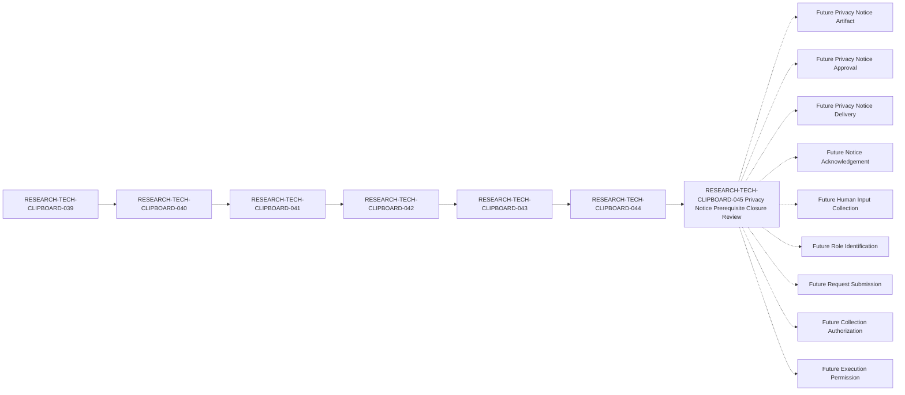

# Clipboard Integration D1 Privacy Notice Artifact Prerequisite Closure Review Specification

## Document Control

| Field | Value |
| --- | --- |
| Document ID | RESEARCH-TECH-CLIPBOARD-045 |
| Title | Clipboard Integration D1 Privacy Notice Artifact Prerequisite Closure Review Specification |
| Status | Draft |
| Parent Document | RESEARCH-TECH-CLIPBOARD-044 |
| Document Type | Privacy Notice Artifact Prerequisite Closure Review Specification |
| Traceability chain | RESEARCH-TECH-CLIPBOARD-039 → RESEARCH-TECH-CLIPBOARD-040 → RESEARCH-TECH-CLIPBOARD-041 → RESEARCH-TECH-CLIPBOARD-042 → RESEARCH-TECH-CLIPBOARD-043 → RESEARCH-TECH-CLIPBOARD-044 → RESEARCH-TECH-CLIPBOARD-045 |
| Privacy Notice Artifact | Not created |
| Privacy Notice Approval | Not provided |
| Privacy Notice Delivery | Not performed |
| Notice Acknowledgement | Not collected |
| Notice Recipient | Not identified |
| Delivery Channel | Not selected |
| Actual Platform | Not identified |
| Request Submitted | No |
| Owner | TBD |
| Last reviewed | Not reviewed |

## 1. Purpose and Review Boundary

This document reviews whether the thirteen Privacy Notice Artifact prerequisites defined by RESEARCH-TECH-CLIPBOARD-044 are complete, traceable, and separated from later human-governance activities.

This is a documentary closure review only. It does not create, approve, transmit, deliver, simulate, or acknowledge an actual Privacy Notice Artifact. It does not identify a recipient, select a channel or platform, collect Human Input, submit a request, authorize collection, or permit execution.

The review must not be interpreted as:

- Privacy Notice creation.
- Privacy Notice approval.
- Privacy Notice delivery.
- Notice Acknowledgement.
- Human Input Collection.
- Role Identification, Role Appointment, or Role Acceptance.
- Collection Authorization or Collection-start Permission.
- Request Submission or Execution Permission.
- Operational Observation or Persistent Evidence preservation.

## 2. Document Traceability Review

| Traceability item | Expected value | Current value | Documentary conformance | Review result | Reason |
| --- | --- | --- | --- | --- | --- |
| Current document ID | RESEARCH-TECH-CLIPBOARD-045 | RESEARCH-TECH-CLIPBOARD-045 | Yes | Yes | Identifies this review |
| Current document status | Draft | Draft | Yes | Yes | Prevents operational interpretation |
| Parent document | RESEARCH-TECH-CLIPBOARD-044 | RESEARCH-TECH-CLIPBOARD-044 | Yes | Yes | Preserves immediate parent |
| Prior role-readiness specification | RESEARCH-TECH-CLIPBOARD-043 | RESEARCH-TECH-CLIPBOARD-043 | Yes | Yes | Preserves input-contract lineage |
| Full documentary chain | 039 → 040 → 041 → 042 → 043 → 044 → 045 | 039 → 040 → 041 → 042 → 043 → 044 → 045 | Yes | Yes | Prevents orphaned review |
| Review purpose | Privacy Notice prerequisite closure review | Privacy Notice prerequisite closure review | Yes | Yes | Limits scope |
| Actual artifact state | Not created | Not created | Yes | Yes | Prevents artifact creation |
| Actual approval state | Not provided | Not provided | Yes | Yes | Prevents approval inference |
| Actual delivery state | Not performed | Not performed | Yes | Yes | Prevents delivery |
| Actual acknowledgement state | Not collected | Not collected | Yes | Yes | Prevents acknowledgement inference |

## 3. Thirteen Privacy Notice Prerequisite Reviews

Each row reviews one prerequisite defined by RESEARCH-TECH-CLIPBOARD-044. No row supplies a future purpose, access rule, retention value, correction value, withdrawal value, or person value.

| Prerequisite ID | Required content | Parent documentary state | Review criterion | Documentary conformance | Future value state | Artifact blocker | Review result | Reason |
| --- | --- | --- | --- | --- | --- | --- | --- | --- |
| CLIP-D1-PRIVREVIEW-001 | Collection purpose | Documentarily specified | Purpose must be bounded to future role-identification readiness | Yes | Unresolved future privacy value | Actual purpose not approved | Yes | Scope is defined without an actual purpose value |
| CLIP-D1-PRIVREVIEW-002 | Role-identification scope | Documentarily satisfied | Scope must remain limited to five fixed role classes | Yes | No future role expansion | None | Yes | Scope is bounded |
| CLIP-D1-PRIVREVIEW-003 | Required and Optional input distinction | Documentarily specified | Future inputs must be classified before notice creation | Yes | Unresolved future privacy value | Future input classification absent | Yes | Classification requirement is explicit |
| CLIP-D1-PRIVREVIEW-004 | Explicit data exclusions | Documentarily satisfied | Fifteen prohibited categories must remain excluded | Yes | No actual values | None | Yes | Exclusions are preserved |
| CLIP-D1-PRIVREVIEW-005 | Data-minimization boundary | Documentarily satisfied | Only minimum approved input may be requested | Yes | No actual values | None | Yes | Minimum boundary is explicit |
| CLIP-D1-PRIVREVIEW-006 | Access boundary | Documentarily specified | Future access classes must be defined before collection | Yes | Unresolved future privacy value | Future access rule absent | Yes | Access requirement is recorded |
| CLIP-D1-PRIVREVIEW-007 | Retention boundary | Documentarily specified | Future retention and deletion rules must be defined | Yes | Unresolved future privacy value | Future lifecycle rule absent | Yes | Retention requirement is recorded |
| CLIP-D1-PRIVREVIEW-008 | Correction process | Documentarily specified | Future correction path must be defined | Yes | Unresolved future privacy value | Future correction process absent | Yes | Correction requirement is recorded |
| CLIP-D1-PRIVREVIEW-009 | Withdrawal or replacement process | Documentarily specified | Future withdrawal or replacement path must be defined | Yes | Unresolved future privacy value | Future withdrawal process absent | Yes | Withdrawal requirement is recorded |
| CLIP-D1-PRIVREVIEW-010 | No appointment implication | Documentarily satisfied | Notice or input must not appoint a role | Yes | No actual appointment | None | Yes | Appointment separation is explicit |
| CLIP-D1-PRIVREVIEW-011 | No request-submission implication | Documentarily satisfied | Notice or input must not submit a request | Yes | Request remains unsubmitted | None | Yes | Submission separation is explicit |
| CLIP-D1-PRIVREVIEW-012 | No authorization implication | Documentarily satisfied | Notice or input must not authorize collection | Yes | Authorization not provided | None | Yes | Authorization separation is explicit |
| CLIP-D1-PRIVREVIEW-013 | No execution-permission implication | Documentarily satisfied | Notice or input must not permit execution | Yes | Permission not provided | None | Yes | Execution separation is explicit |

## 4. Privacy Notice Artifact State Review

| Artifact-state item | Required current state | Review criterion | Documentary conformance | Review result |
| --- | --- | --- | --- | --- |
| Privacy Notice Artifact | Not created | No actual artifact exists | Yes | Yes |
| Privacy Notice Approval | Not provided | No approval is inferred from this review | Yes | Yes |
| Privacy Notice Delivery | Not performed | No recipient or delivery action exists | Yes | Yes |
| Notice Acknowledgement | Not collected | No acknowledgement is collected | Yes | Yes |
| Notice Recipient | Not identified | No person or recipient is identified | Yes | Yes |
| Delivery Channel | Not selected | No channel is selected | Yes | Yes |
| Actual Platform | Not identified | No platform is identified | Yes | Yes |
| Collection Authorization | Not provided | No authorization is granted | Yes | Yes |
| Collection-start Permission | No | No collection may start | Yes | Yes |
| Worksheet Distribution | Not performed | No Worksheet is distributed | Yes | Yes |

## 5. Fixed Roles and Input-reference Review

### 5.1 Fixed role state

| Role ID | Functional Role | Actual Holder | Appointment | Acceptance | Authorization implication |
| --- | --- | --- | --- | --- | --- |
| CLIP-D1-ROLE-001 | Request Preparer | Not identified | Not performed | Not collected | None |
| CLIP-D1-ROLE-002 | Technical Scope Reviewer | Not identified | Not performed | Not collected | None |
| CLIP-D1-ROLE-003 | Decision Authority | Not identified | Not performed | Not collected | None |
| CLIP-D1-ROLE-004 | Execution Operator | Not identified | Not performed | Not collected | None |
| CLIP-D1-ROLE-005 | Observation and Evidence Custodian | Not identified | Not performed | Not collected | None |

### 5.2 Twelve input references

These references point to the documentary contract in RESEARCH-TECH-CLIPBOARD-043. They are not input records and do not authorize collection.

| Input ID | Required input class | Reference state | Actual value | Review result |
| --- | --- | --- | --- | --- |
| CLIP-D1-ROLEINPUT-001 | Role ID | Documentarily defined | Not provided | Yes |
| CLIP-D1-ROLEINPUT-002 | Functional Role | Documentarily defined | Not provided | Yes |
| CLIP-D1-ROLEINPUT-003 | Governance identity reference requirement | Documentarily defined | Not provided | Yes |
| CLIP-D1-ROLEINPUT-004 | Eligibility requirement | Documentarily defined | Not provided | Yes |
| CLIP-D1-ROLEINPUT-005 | Conflict-disclosure requirement | Documentarily defined | Not provided | Yes |
| CLIP-D1-ROLEINPUT-006 | Separation-of-duty requirement | Documentarily defined | Not provided | Yes |
| CLIP-D1-ROLEINPUT-007 | Appointment prerequisite | Documentarily defined | Not provided | Yes |
| CLIP-D1-ROLEINPUT-008 | Acceptance prerequisite | Documentarily defined | Not provided | Yes |
| CLIP-D1-ROLEINPUT-009 | Decision-authority prerequisite | Documentarily defined | Not provided | Yes |
| CLIP-D1-ROLEINPUT-010 | Privacy and minimization requirement | Documentarily defined | Not provided | Yes |
| CLIP-D1-ROLEINPUT-011 | Validation requirement | Documentarily defined | Not provided | Yes |
| CLIP-D1-ROLEINPUT-012 | Stop-condition requirement | Documentarily defined | Not provided | Yes |

## 6. Data Minimization and Fifteen Exclusions

### 6.1 Data-minimization review

| Rule ID | Data-minimization rule | Documentary state | Review result |
| --- | --- | --- | --- |
| CLIP-D1-PRIVMIN-001 | Request only the minimum approved role-readiness input | Documentarily satisfied | Yes |
| CLIP-D1-PRIVMIN-002 | Keep Role ID separate from personal identity | Documentarily satisfied | Yes |
| CLIP-D1-PRIVMIN-003 | Do not request contact information | Documentarily satisfied | Yes |
| CLIP-D1-PRIVMIN-004 | Do not request organizational profile information | Documentarily satisfied | Yes |
| CLIP-D1-PRIVMIN-005 | Keep eligibility as a rule rather than a personal record | Documentarily satisfied | Yes |
| CLIP-D1-PRIVMIN-006 | Keep conflict disclosure as a future controlled response | Documentarily satisfied | Yes |
| CLIP-D1-PRIVMIN-007 | Keep role separation independent of personal data | Documentarily satisfied | Yes |
| CLIP-D1-PRIVMIN-008 | Do not persist observation or evidence | Documentarily satisfied | Yes |

### 6.2 Explicit exclusions

| Exclusion ID | Excluded category | Required current state | Review result |
| --- | --- | --- | --- |
| CLIP-D1-ROLEEX-001 | Actual name | Not collected | Yes |
| CLIP-D1-ROLEEX-002 | Email address | Not collected | Yes |
| CLIP-D1-ROLEEX-003 | Department | Not collected | Yes |
| CLIP-D1-ROLEEX-004 | Job title | Not collected | Yes |
| CLIP-D1-ROLEEX-005 | Account | Not collected | Yes |
| CLIP-D1-ROLEEX-006 | SID | Not collected | Yes |
| CLIP-D1-ROLEEX-007 | Computer name | Not collected | Yes |
| CLIP-D1-ROLEEX-008 | Credential | Not collected | Yes |
| CLIP-D1-ROLEEX-009 | Token | Not collected | Yes |
| CLIP-D1-ROLEEX-010 | Private key | Not collected | Yes |
| CLIP-D1-ROLEEX-011 | Clipboard content | Not collected | Yes |
| CLIP-D1-ROLEEX-012 | Screenshot content | Not collected | Yes |
| CLIP-D1-ROLEEX-013 | Desktop content | Not collected | Yes |
| CLIP-D1-ROLEEX-014 | Operational Observation | Not created | Yes |
| CLIP-D1-ROLEEX-015 | Persistent Evidence | Not created | Yes |

## 7. Separation Rules

| Separation ID | Separation rule | Current state | Automatic transition |
| --- | --- | --- | --- |
| CLIP-D1-PRIVSEP-001 | Closure Review ≠ Privacy Notice creation | Documentarily satisfied | Prohibited |
| CLIP-D1-PRIVSEP-002 | Privacy Notice creation ≠ Privacy Notice approval | Documentarily satisfied | Prohibited |
| CLIP-D1-PRIVSEP-003 | Privacy Notice approval ≠ Privacy Notice delivery | Documentarily satisfied | Prohibited |
| CLIP-D1-PRIVSEP-004 | Privacy Notice delivery ≠ Notice Acknowledgement | Documentarily satisfied | Prohibited |
| CLIP-D1-PRIVSEP-005 | Notice Acknowledgement ≠ Human Input Collection | Documentarily satisfied | Prohibited |
| CLIP-D1-PRIVSEP-006 | Notice Acknowledgement ≠ Role Acceptance | Documentarily satisfied | Prohibited |
| CLIP-D1-PRIVSEP-007 | Notice Acknowledgement ≠ Collection Authorization | Documentarily satisfied | Prohibited |
| CLIP-D1-PRIVSEP-008 | Privacy Notice Artifact ≠ Submission Instruction | Documentarily satisfied | Prohibited |
| CLIP-D1-PRIVSEP-009 | Privacy Notice Artifact ≠ Request Submission | Documentarily satisfied | Prohibited |
| CLIP-D1-PRIVSEP-010 | Human Governance Input ≠ Execution Permission | Documentarily satisfied | Prohibited |
| CLIP-D1-PRIVSEP-011 | Privacy Notice review ≠ Role Identification | Documentarily satisfied | Prohibited |
| CLIP-D1-PRIVSEP-012 | Privacy Notice review ≠ Worksheet Distribution | Documentarily satisfied | Prohibited |

## 8. Validation Rules

| Validation ID | Validation rule | Current evaluation | Failure response |
| --- | --- | --- | --- |
| CLIP-D1-PRIVVAL-001 | Review ID must match one of the thirteen prerequisite IDs | Not evaluated | Stop and reject |
| CLIP-D1-PRIVVAL-002 | Required content must match the parent prerequisite definition | Not evaluated | Stop and reject |
| CLIP-D1-PRIVVAL-003 | Parent documentary state must be traceable to RESEARCH-TECH-CLIPBOARD-044 | Not evaluated | Stop and defer |
| CLIP-D1-PRIVVAL-004 | Documentary conformance must not imply an actual artifact | Not evaluated | Stop and preserve state |
| CLIP-D1-PRIVVAL-005 | Future purpose, access, retention, correction, and withdrawal values must remain absent | Not evaluated | Stop and remove values |
| CLIP-D1-PRIVVAL-006 | No actual recipient may be present | Not evaluated | Stop and reject |
| CLIP-D1-PRIVVAL-007 | No actual channel or platform may be present | Not evaluated | Stop and reject |
| CLIP-D1-PRIVVAL-008 | All fifteen exclusions must remain excluded | Not evaluated | Stop and reject |
| CLIP-D1-PRIVVAL-009 | Role count must remain five | Not evaluated | Stop and reject |
| CLIP-D1-PRIVVAL-010 | Input references must remain documentary references only | Not evaluated | Stop and preserve separation |
| CLIP-D1-PRIVVAL-011 | Notice creation must not imply notice approval | Not evaluated | Stop and preserve separation |
| CLIP-D1-PRIVVAL-012 | Notice delivery must not imply acknowledgement | Not evaluated | Stop and preserve separation |
| CLIP-D1-PRIVVAL-013 | Acknowledgement must not imply collection authorization | Not evaluated | Stop and preserve separation |
| CLIP-D1-PRIVVAL-014 | Review completion must not imply Request Submission | Not evaluated | Stop and preserve separation |
| CLIP-D1-PRIVVAL-015 | Review completion must not imply Execution Permission | Not evaluated | Stop and preserve separation |

## 9. Stop Conditions

| Stop ID | Stop condition | Current trigger state | Required response |
| --- | --- | --- | --- |
| CLIP-D1-PRIVSTOP-001 | This review is treated as Privacy Notice creation | Not evaluated | Stop |
| CLIP-D1-PRIVSTOP-002 | A prerequisite ID is missing or unknown | Not evaluated | Stop and reject |
| CLIP-D1-PRIVSTOP-003 | A future purpose value is entered | Not evaluated | Stop and remove |
| CLIP-D1-PRIVSTOP-004 | Future access or retention values are entered | Not evaluated | Stop and remove |
| CLIP-D1-PRIVSTOP-005 | Future correction or withdrawal values are entered | Not evaluated | Stop and remove |
| CLIP-D1-PRIVSTOP-006 | A Notice Recipient is identified | Not evaluated | Stop and reject |
| CLIP-D1-PRIVSTOP-007 | A Delivery Channel or Platform is selected | Not evaluated | Stop and reject |
| CLIP-D1-PRIVSTOP-008 | A role holder is identified, appointed, or accepted | Not evaluated | Stop and reject |
| CLIP-D1-PRIVSTOP-009 | Any excluded personal or machine field is entered | Not evaluated | Stop and reject |
| CLIP-D1-PRIVSTOP-010 | Clipboard, Screenshot, or Desktop content is present | Not evaluated | Stop immediately |
| CLIP-D1-PRIVSTOP-011 | Operational Observation or Persistent Evidence is requested | Not evaluated | Stop and do not persist |
| CLIP-D1-PRIVSTOP-012 | Notice acknowledgement is treated as collection authorization | Not evaluated | Stop and preserve separation |
| CLIP-D1-PRIVSTOP-013 | Review completion is treated as Request Submission | Not evaluated | Stop and preserve separation |
| CLIP-D1-PRIVSTOP-014 | Human Input is treated as Collection-start Permission | Not evaluated | Stop and preserve separation |
| CLIP-D1-PRIVSTOP-015 | Authorization or Execution Permission is absent | Not evaluated | Stop; never collect or execute |

## 10. Prohibited Transitions

The following thirteen transitions are explicitly prohibited. Every rule is preserved, no transition has been performed, and no result is granted by this review.

| Transition ID | Complete transition meaning | Rule preserved | Transition performed | Result |
| --- | --- | --- | --- | --- |
| CLIP-D1-PRIVTRANS-001 | Closure Review → Privacy Notice Artifact Created | Yes | No | No |
| CLIP-D1-PRIVTRANS-002 | Privacy Notice Artifact Created → Artifact Approved | Yes | No | No |
| CLIP-D1-PRIVTRANS-003 | Artifact Approved → Notice Delivered | Yes | No | No |
| CLIP-D1-PRIVTRANS-004 | Notice Delivered → Notice Acknowledged | Yes | No | No |
| CLIP-D1-PRIVTRANS-005 | Notice Acknowledged → Human Input Collected | Yes | No | No |
| CLIP-D1-PRIVTRANS-006 | Notice Acknowledged → Role Accepted | Yes | No | No |
| CLIP-D1-PRIVTRANS-007 | Notice Acknowledged → Collection Authorized | Yes | No | No |
| CLIP-D1-PRIVTRANS-008 | Privacy Notice Artifact → Submission Instruction | Yes | No | No |
| CLIP-D1-PRIVTRANS-009 | Privacy Notice Artifact → Request Submitted | Yes | No | No |
| CLIP-D1-PRIVTRANS-010 | Human Input → Collection-start Permission | Yes | No | No |
| CLIP-D1-PRIVTRANS-011 | Human Input → Execution Permission | Yes | No | No |
| CLIP-D1-PRIVTRANS-012 | Human Input → Operational Observation | Yes | No | No |
| CLIP-D1-PRIVTRANS-013 | Human Input → Persistent Evidence | Yes | No | No |

## 11. Unresolved-value Ledger

The following values remain unresolved future values. Their absence is explicit and does not authorize a later stage.

| Unresolved value | Current state | Required source | Required stage | Review impact |
| --- | --- | --- | --- | --- |
| Collection purpose | Not created | Future approved Privacy Notice Artifact | Notice preparation | Blocks artifact creation |
| Access boundary | Not created | Future privacy control | Notice preparation | Blocks collection |
| Retention boundary | Not created | Future lifecycle control | Notice preparation | Blocks collection |
| Correction process | Not created | Future privacy control | Notice preparation | Blocks collection |
| Withdrawal or replacement process | Not created | Future privacy control | Notice preparation | Blocks collection |
| Required or Optional input classification | Not evaluated | Future input contract | Notice preparation | Blocks artifact creation |
| Privacy Notice Approval | Not provided | Future decision authority | After artifact creation | Blocks delivery |
| Notice Recipient | Not identified | Future authorized recipient process | Before delivery | Blocks delivery |
| Delivery Channel | Not selected | Future channel decision | Before delivery | Blocks delivery |
| Actual Platform | Not identified | Future platform assessment | Before delivery | Blocks delivery |
| Notice Acknowledgement | Not collected | Future acknowledgement process | After delivery | Does not authorize collection |
| Collection Authorization | Not provided | Future authorization artifact | Before collection | Blocks collection |
| Collection-start Permission | No | Future explicit start permission | Before collection | Blocks collection |
| Human Governance Input | Not collected | Future authorized collection process | After all prerequisites | Blocks later stages |
| Execution Permission | Not provided | Future explicit execution permission | Before execution | Blocks execution |

No actual person, name, email, department, job title, account, SID, computer name, credential, token, private key, Clipboard content, Screenshot content, Desktop content, observation, or evidence is entered in this ledger.

## 12. Submission, Authorization, and Execution Separation

| Stage | Current state | Required prior artifact | Automatic transition prohibited | Effect |
| --- | --- | --- | --- | --- |
| Prerequisite closure review | Draft review | RESEARCH-TECH-CLIPBOARD-045 | Yes | Reviews documentation only |
| Privacy Notice Artifact | Not created | Future notice specification | Yes | No notice exists |
| Privacy Notice Approval | Not provided | Future approved artifact | Yes | No approval exists |
| Privacy Notice Delivery | Not performed | Future approved artifact and delivery record | Yes | No recipient is contacted |
| Notice Acknowledgement | Not collected | Future delivery record | Yes | No acknowledgement exists |
| Human Input Collection | Not collected | Future authorization and start permission | Yes | No input is collected |
| Request Submission | No | Future Submission Instruction | Yes | No request is submitted |
| Collection Authorization | Not provided | Future explicit authorization | Yes | No collection is authorized |
| Collection-start Permission | No | Future explicit start permission | Yes | No collection begins |
| Execution Permission | Not provided | Future explicit execution permission | Yes | No operation executes |
| Operational Observation | Not created | Future explicit observation authority | Yes | No observation exists |
| Persistent Evidence | Not created | Future explicit evidence authority | Yes | No evidence exists |

## 13. Completeness Matrix

The matrix measures documentary review completeness only. Every result value is restricted to `Yes`, `Partially`, or `No`.

| Coverage area | Expected coverage | Current review coverage | Result |
| --- | --- | --- | --- |
| Document traceability | Seven linked document IDs | 039 → 040 → 041 → 042 → 043 → 044 → 045 | Yes |
| Privacy prerequisite review | 13 review rows | All 13 rows present | Yes |
| Artifact-state review | Actual artifact and lifecycle states | All states retained as not created or not performed | Yes |
| Fixed roles | 5 role classes | All five retained; holders unresolved | Yes |
| Input references | 12 documentary references | All 12 present without actual values | Yes |
| Data minimization | Minimum-data rules | Rules defined without actual values | Yes |
| Explicit exclusions | 15 exclusion categories | All 15 retained | Yes |
| Separation rules | Review, notice, acknowledgement, collection, authorization, and execution boundaries | All defined | Yes |
| Validation rules | 15 validation rules | All defined; not evaluated | Yes |
| Stop conditions | 15 stop conditions | All defined; no operation performed | Yes |
| Prohibited transitions | 13 transitions | All preserved; none performed | Yes |
| Unresolved-value ledger | 15 future values | All listed without actual values | Yes |
| Submission and authorization separation | All later stages | All separated | Yes |
| Overall documentary closure review | Complete review specification | Complete as Draft; future values unresolved | Yes |

## 14. Mermaid Traceability

The solid chain represents documentary traceability. The nine dashed paths represent future stages requiring separate human governance input and explicit authorization. No dashed stage is performed or authorized by this review.

## 15. Required Safety State

| Safety item | Required current state |
| --- | --- |
| Request Submitted | No |
| Submission Instruction | Not created |
| Privacy Notice Artifact | Not created |
| Privacy Notice Approval | Not provided |
| Privacy Notice Delivery | Not performed |
| Notice Acknowledgement | Not collected |
| Notice Recipient | Not identified |
| Delivery Channel | Not selected |
| Actual Platform | Not identified |
| Actual Role Holders | Not identified |
| Role Appointment | Not performed |
| Role Acceptance | Not collected |
| Collection Authorization | Not provided |
| Collection-start Permission | No |
| Worksheet Distribution | Not performed |
| Human Governance Input | Not collected |
| Personal Data | Not collected |
| D1 Inspection | Not authorized |
| Execution Permission | Not provided |
| Operational Observation | Not created |
| Persistent Evidence | Not created |

## 16. Completion Boundary and Handoff

This review is complete as a Draft documentary closure specification when:

- The seven-document traceability chain remains intact.
- All thirteen prerequisite review rows remain present and traceable to RESEARCH-TECH-CLIPBOARD-044.
- The five fixed role classes remain unchanged.
- The twelve input references remain documentary references without actual values.
- All fifteen exclusions remain prohibited.
- All thirteen prohibited transitions remain `Rule preserved=Yes`, `Transition performed=No`, and `Result=No`.
- Privacy Notice Artifact remains `Not created`.
- Privacy Notice Approval remains `Not provided`.
- Privacy Notice Delivery remains `Not performed`.
- Notice Acknowledgement remains `Not collected`.
- Notice Recipient remains `Not identified`.
- Delivery Channel remains `Not selected`.
- Actual Platform remains `Not identified`.
- Request Submitted remains `No`.
- Submission Instruction remains `Not created`.
- Collection Authorization remains `Not provided`.
- Collection-start Permission remains `No`.
- Worksheet Distribution remains `Not performed`.
- Human Governance Input and Personal Data remain not collected.
- D1 Inspection remains not authorized.
- Execution Permission remains not provided.

The only permitted next-document handoffs are:

- `Ready to prepare D1 Privacy Notice Artifact creation prerequisite specification`
- `Conditionally ready to prepare D1 Privacy Notice Artifact creation prerequisite specification`
- `Not ready to prepare D1 Privacy Notice Artifact creation prerequisite specification`

No handoff may create, approve, deliver, or acknowledge a Privacy Notice, identify a recipient, create a Submission Instruction, submit a Request, collect Human Input, authorize collection, grant start permission, distribute a Worksheet, perform D1 Inspection, or preserve Observation or Evidence.

## 17. Prohibited Actions

This review specification must not be used to:

- Create, approve, send, deliver, or simulate an actual Privacy Notice Artifact.
- Identify or contact a Notice Recipient.
- Identify, appoint, accept, or assign any role.
- Create a Submission Instruction or submit a Collection Request.
- Select a Channel or Platform.
- Distribute a Worksheet or collect Human Input.
- Collect Personal Data, Attestation, or Notice Acknowledgement.
- Read or collect Clipboard, Screenshot, or Desktop content.
- Create Operational Observation or Persistent Evidence.
- Perform D1 Inspection or grant Execution Permission.
- Begin coding, Build, Test, or Run activities.
- Modify any existing document.

## 18. Mechanical Final Status

`D1 Privacy Notice Artifact prerequisite closure review complete`

- Document: RESEARCH-TECH-CLIPBOARD-045
- Status: Draft
- Parent: RESEARCH-TECH-CLIPBOARD-044
- Privacy prerequisite review rows: 13
- Fixed roles: 5
- Input references: 12
- Explicit exclusions: 15
- Prohibited transitions: 13
- Rule preserved: Yes, 13/13
- Transition performed: No, 13/13
- Result: No, 13/13
- Mermaid Future dashed links: 9
- Privacy Notice Artifact: Not created
- Privacy Notice Approval: Not provided
- Privacy Notice Delivery: Not performed
- Notice Acknowledgement: Not collected
- Request Submitted: No
- Submission Instruction: Not created
- Collection Authorization: Not provided
- Collection-start Permission: No
- Human Governance Input: Not collected
- D1 Inspection: Not authorized
- Execution Permission: Not provided

No actual Privacy Notice, human-governance, collection, inspection, or execution activity is authorized by this document.
