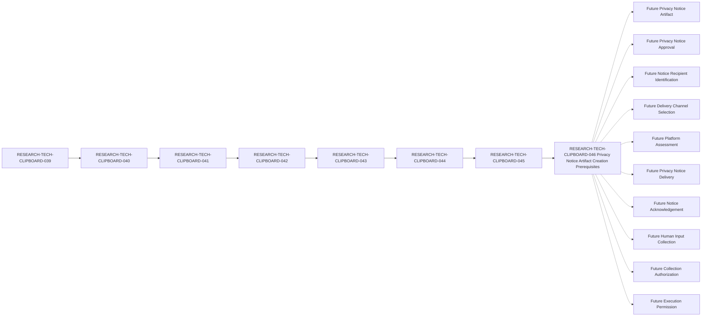

# Clipboard Integration D1 Privacy Notice Artifact Creation Prerequisite Specification

## Document Control

| Field | Value |
| --- | --- |
| Document ID | RESEARCH-TECH-CLIPBOARD-046 |
| Title | Clipboard Integration D1 Privacy Notice Artifact Creation Prerequisite Specification |
| Status | Draft |
| Parent Document | RESEARCH-TECH-CLIPBOARD-045 |
| Document Type | Privacy Notice Artifact Creation Prerequisite Specification |
| Traceability chain | RESEARCH-TECH-CLIPBOARD-039 → RESEARCH-TECH-CLIPBOARD-040 → RESEARCH-TECH-CLIPBOARD-041 → RESEARCH-TECH-CLIPBOARD-042 → RESEARCH-TECH-CLIPBOARD-043 → RESEARCH-TECH-CLIPBOARD-044 → RESEARCH-TECH-CLIPBOARD-045 → RESEARCH-TECH-CLIPBOARD-046 |
| Privacy Notice Artifact | Not created |
| Privacy Notice Approval | Not provided |
| Privacy Notice Delivery | Not performed |
| Notice Recipient | Not identified |
| Delivery Channel | Not selected |
| Actual Platform | Not identified |
| Request Submitted | No |
| Owner | TBD |
| Last reviewed | Not reviewed |

## 1. Purpose and Creation Boundary

This document defines the documentary, governance, content, role, and platform prerequisites that would be required before a future authorized process could create a Privacy Notice Artifact.

This document is a creation-prerequisite specification only. It must not create, write, simulate, approve, transmit, deliver, or acknowledge an actual Privacy Notice Artifact. It must not identify a recipient, select a channel or platform, submit a request, collect Human Input, authorize collection, distribute a Worksheet, or permit execution.

The current creation-gate conclusion is:

`Not ready to create actual Privacy Notice Artifact`

## 2. Traceability

The required documentary chain is:

`RESEARCH-TECH-CLIPBOARD-039 → RESEARCH-TECH-CLIPBOARD-040 → RESEARCH-TECH-CLIPBOARD-041 → RESEARCH-TECH-CLIPBOARD-042 → RESEARCH-TECH-CLIPBOARD-043 → RESEARCH-TECH-CLIPBOARD-044 → RESEARCH-TECH-CLIPBOARD-045 → RESEARCH-TECH-CLIPBOARD-046`

| Traceability item | Expected value | Current value | Conformance | Result |
| --- | --- | --- | --- | --- |
| Current document | RESEARCH-TECH-CLIPBOARD-046 | RESEARCH-TECH-CLIPBOARD-046 | Yes | Yes |
| Status | Draft | Draft | Yes | Yes |
| Parent | RESEARCH-TECH-CLIPBOARD-045 | RESEARCH-TECH-CLIPBOARD-045 | Yes | Yes |
| Prior artifact review | RESEARCH-TECH-CLIPBOARD-045 | RESEARCH-TECH-CLIPBOARD-045 | Yes | Yes |
| Full chain | 039 → 040 → 041 → 042 → 043 → 044 → 045 → 046 | 039 → 040 → 041 → 042 → 043 → 044 → 045 → 046 | Yes | Yes |
| Scope | Creation prerequisites only | Creation prerequisites only | Yes | Yes |
| Actual artifact state | Not created | Not created | Yes | Yes |
| Current gate | Not ready to create actual Privacy Notice Artifact | Not ready to create actual Privacy Notice Artifact | Yes | Yes |

## 3. Thirteen Notice Content Creation Prerequisites

Each row defines one prerequisite for a future artifact. No row contains an actual purpose, retention period, access holder, recipient, contact value, or other human value.

| Prerequisite ID | Required content | Documentary source | Current documentary state | Future value required | Required approving role class | Creation blocker | Creation readiness | Reason |
| --- | --- | --- | --- | --- | --- | --- | --- | --- |
| CLIP-D1-PRIVCREATE-001 | Collection purpose | RESEARCH-TECH-CLIPBOARD-044 and 045 | Documentarily specified | Future purpose value | Decision Authority | Purpose not provided | Not ready | Purpose must be supplied by a future authorized process |
| CLIP-D1-PRIVCREATE-002 | Role-identification scope | RESEARCH-TECH-CLIPBOARD-043 and 044 | Documentarily satisfied | No role expansion | Technical Scope Reviewer | Future scope confirmation | Not ready | Scope must remain limited to five roles |
| CLIP-D1-PRIVCREATE-003 | Required and Optional input distinction | RESEARCH-TECH-CLIPBOARD-044 and 045 | Documentarily specified | Future classification | Technical Scope Reviewer | Classification not completed | Not ready | Every input must be classified before creation |
| CLIP-D1-PRIVCREATE-004 | Explicit data exclusions | RESEARCH-TECH-CLIPBOARD-043 and 044 | Documentarily satisfied | No actual excluded values | Technical Scope Reviewer | Future confirmation | Not ready | Prohibited data must remain excluded |
| CLIP-D1-PRIVCREATE-005 | Data-minimization boundary | RESEARCH-TECH-CLIPBOARD-044 and 045 | Documentarily satisfied | No actual values | Technical Scope Reviewer | Future confirmation | Not ready | Only minimum approved input may be described |
| CLIP-D1-PRIVCREATE-006 | Access boundary | RESEARCH-TECH-CLIPBOARD-044 and 045 | Documentarily specified | Future access rule | Decision Authority | Access rule not provided | Not ready | Access must be bounded before creation |
| CLIP-D1-PRIVCREATE-007 | Retention boundary | RESEARCH-TECH-CLIPBOARD-044 and 045 | Documentarily specified | Future retention and deletion rule | Decision Authority | Retention rule not provided | Not ready | Lifecycle must be bounded before creation |
| CLIP-D1-PRIVCREATE-008 | Correction process | RESEARCH-TECH-CLIPBOARD-044 and 045 | Documentarily specified | Future correction process | Decision Authority | Correction process not provided | Not ready | Correction must be defined before creation |
| CLIP-D1-PRIVCREATE-009 | Withdrawal or replacement process | RESEARCH-TECH-CLIPBOARD-044 and 045 | Documentarily specified | Future withdrawal process | Decision Authority | Withdrawal process not provided | Not ready | Withdrawal must be defined before creation |
| CLIP-D1-PRIVCREATE-010 | No appointment implication | RESEARCH-TECH-CLIPBOARD-043 and 044 | Documentarily satisfied | No appointment value | Technical Scope Reviewer | Future confirmation | Not ready | Notice content cannot appoint a role |
| CLIP-D1-PRIVCREATE-011 | No request-submission implication | RESEARCH-TECH-CLIPBOARD-044 and 045 | Documentarily satisfied | No submission value | Decision Authority | Future confirmation | Not ready | Notice content cannot submit a request |
| CLIP-D1-PRIVCREATE-012 | No authorization implication | RESEARCH-TECH-CLIPBOARD-044 and 045 | Documentarily satisfied | No authorization value | Decision Authority | Future confirmation | Not ready | Notice content cannot authorize collection |
| CLIP-D1-PRIVCREATE-013 | No execution-permission implication | RESEARCH-TECH-CLIPBOARD-044 and 045 | Documentarily satisfied | No permission value | Decision Authority | Future confirmation | Not ready | Notice content cannot permit execution |

## 4. Privacy Notice Artifact Creation Gate

The creation gate remains closed. Documentary definition of a gate condition does not satisfy the future human or authorization value.

| Gate ID | Creation-gate condition | Current state | Gate effect | Current conclusion |
| --- | --- | --- | --- | --- |
| CLIP-D1-PRIVGATE-001 | All thirteen content prerequisites are documented | Documentarily satisfied | Necessary but not sufficient | Not ready |
| CLIP-D1-PRIVGATE-002 | Future purpose value is provided by an authorized process | Not provided | Blocks creation | Not ready |
| CLIP-D1-PRIVGATE-003 | Required and Optional classification is complete | Not completed | Blocks creation | Not ready |
| CLIP-D1-PRIVGATE-004 | Access boundary is complete | Not completed | Blocks creation | Not ready |
| CLIP-D1-PRIVGATE-005 | Retention and deletion boundary is complete | Not completed | Blocks creation | Not ready |
| CLIP-D1-PRIVGATE-006 | Correction process is complete | Not completed | Blocks creation | Not ready |
| CLIP-D1-PRIVGATE-007 | Withdrawal or replacement process is complete | Not completed | Blocks creation | Not ready |
| CLIP-D1-PRIVGATE-008 | Privacy approval authority is identified by a future process | Not identified | Blocks creation | Not ready |
| CLIP-D1-PRIVGATE-009 | Notice Recipient remains unresolved before creation | Not identified | Preserves boundary | Not ready |
| CLIP-D1-PRIVGATE-010 | Delivery Channel remains unresolved before creation | Not selected | Preserves boundary | Not ready |
| CLIP-D1-PRIVGATE-011 | Actual Platform remains unresolved before creation | Not identified | Preserves boundary | Not ready |
| CLIP-D1-PRIVGATE-012 | Collection Authorization remains absent | Not provided | Blocks later collection | Not ready |
| CLIP-D1-PRIVGATE-013 | Collection-start Permission remains No | No | Blocks later collection | Not ready |
| CLIP-D1-PRIVGATE-014 | Privacy Notice Artifact is not created by this specification | Not created | Blocks creation | Not ready |
| CLIP-D1-PRIVGATE-015 | Request Submission and Execution Permission remain separate | No submission; not provided | Blocks later stages | Not ready |

### 4.1 Mechanical gate conclusion

| Gate status | Required value |
| --- | --- |
| Current Creation Gate | Not ready to create actual Privacy Notice Artifact |
| Privacy Notice Artifact | Not created |
| Privacy Notice Approval | Not provided |
| Notice Recipient | Not identified |
| Delivery Channel | Not selected |
| Actual Platform | Not identified |
| Collection Authorization | Not provided |
| Collection-start Permission | No |

## 5. Fixed Roles and Input References

### 5.1 Fixed roles

| Role ID | Functional Role | Actual Holder | Appointment | Acceptance | Authorization implication |
| --- | --- | --- | --- | --- | --- |
| CLIP-D1-ROLE-001 | Request Preparer | Not identified | Not performed | Not collected | None |
| CLIP-D1-ROLE-002 | Technical Scope Reviewer | Not identified | Not performed | Not collected | None |
| CLIP-D1-ROLE-003 | Decision Authority | Not identified | Not performed | Not collected | None |
| CLIP-D1-ROLE-004 | Execution Operator | Not identified | Not performed | Not collected | None |
| CLIP-D1-ROLE-005 | Observation and Evidence Custodian | Not identified | Not performed | Not collected | None |

This document does not assign a Notice preparer, approver, recipient, or any role holder.

### 5.2 Twelve input references

The following are documentary references only. No actual input is supplied.

| Input ID | Required input class | Reference state | Actual value | Creation effect |
| --- | --- | --- | --- | --- |
| CLIP-D1-ROLEINPUT-001 | Role ID | Documentarily defined | Not provided | Does not open gate |
| CLIP-D1-ROLEINPUT-002 | Functional Role | Documentarily defined | Not provided | Does not open gate |
| CLIP-D1-ROLEINPUT-003 | Governance identity reference requirement | Documentarily defined | Not provided | Does not open gate |
| CLIP-D1-ROLEINPUT-004 | Eligibility requirement | Documentarily defined | Not provided | Does not open gate |
| CLIP-D1-ROLEINPUT-005 | Conflict-disclosure requirement | Documentarily defined | Not provided | Does not open gate |
| CLIP-D1-ROLEINPUT-006 | Separation-of-duty requirement | Documentarily defined | Not provided | Does not open gate |
| CLIP-D1-ROLEINPUT-007 | Appointment prerequisite | Documentarily defined | Not provided | Does not open gate |
| CLIP-D1-ROLEINPUT-008 | Acceptance prerequisite | Documentarily defined | Not provided | Does not open gate |
| CLIP-D1-ROLEINPUT-009 | Decision-authority prerequisite | Documentarily defined | Not provided | Does not open gate |
| CLIP-D1-ROLEINPUT-010 | Privacy and minimization requirement | Documentarily defined | Not provided | Does not open gate |
| CLIP-D1-ROLEINPUT-011 | Validation requirement | Documentarily defined | Not provided | Does not open gate |
| CLIP-D1-ROLEINPUT-012 | Stop-condition requirement | Documentarily defined | Not provided | Does not open gate |

## 6. Data Minimization and Fifteen Explicit Exclusions

| Exclusion ID | Excluded category | Required current state | Creation effect |
| --- | --- | --- | --- |
| CLIP-D1-ROLEEX-001 | Actual name | Not collected | Blocks creation if present |
| CLIP-D1-ROLEEX-002 | Email address | Not collected | Blocks creation if present |
| CLIP-D1-ROLEEX-003 | Department | Not collected | Blocks creation if present |
| CLIP-D1-ROLEEX-004 | Job title | Not collected | Blocks creation if present |
| CLIP-D1-ROLEEX-005 | Account | Not collected | Blocks creation if present |
| CLIP-D1-ROLEEX-006 | SID | Not collected | Blocks creation if present |
| CLIP-D1-ROLEEX-007 | Computer name | Not collected | Blocks creation if present |
| CLIP-D1-ROLEEX-008 | Credential | Not collected | Blocks creation if present |
| CLIP-D1-ROLEEX-009 | Token | Not collected | Blocks creation if present |
| CLIP-D1-ROLEEX-010 | Private key | Not collected | Blocks creation if present |
| CLIP-D1-ROLEEX-011 | Clipboard content | Not collected | Blocks creation if present |
| CLIP-D1-ROLEEX-012 | Screenshot content | Not collected | Blocks creation if present |
| CLIP-D1-ROLEEX-013 | Desktop content | Not collected | Blocks creation if present |
| CLIP-D1-ROLEEX-014 | Operational Observation | Not created | Blocks creation if present |
| CLIP-D1-ROLEEX-015 | Persistent Evidence | Not created | Blocks creation if present |

## 7. Validation Rules

| Validation ID | Validation rule | Current evaluation | Failure response |
| --- | --- | --- | --- |
| CLIP-D1-PRIVCREATEVAL-001 | Creation prerequisite ID must match one of thirteen defined IDs | Not evaluated | Stop and reject |
| CLIP-D1-PRIVCREATEVAL-002 | Required content must match its documentary source | Not evaluated | Stop and defer |
| CLIP-D1-PRIVCREATEVAL-003 | Future purpose value must remain absent in this specification | Not evaluated | Stop and remove |
| CLIP-D1-PRIVCREATEVAL-004 | Future retention period must remain absent | Not evaluated | Stop and remove |
| CLIP-D1-PRIVCREATEVAL-005 | Future access holder must remain absent | Not evaluated | Stop and remove |
| CLIP-D1-PRIVCREATEVAL-006 | Recipient and contact values must remain absent | Not evaluated | Stop and reject |
| CLIP-D1-PRIVCREATEVAL-007 | All fifteen exclusions must remain excluded | Not evaluated | Stop and reject |
| CLIP-D1-PRIVCREATEVAL-008 | Fixed role count must remain five | Not evaluated | Stop and reject |
| CLIP-D1-PRIVCREATEVAL-009 | Required and Optional classification must be documented before creation | Not evaluated | Stop and defer |
| CLIP-D1-PRIVCREATEVAL-010 | Access boundary must be complete before creation | Not evaluated | Stop and defer |
| CLIP-D1-PRIVCREATEVAL-011 | Retention and deletion boundary must be complete before creation | Not evaluated | Stop and defer |
| CLIP-D1-PRIVCREATEVAL-012 | Correction and withdrawal processes must be complete before creation | Not evaluated | Stop and defer |
| CLIP-D1-PRIVCREATEVAL-013 | Approval authority must remain separate from creation | Not evaluated | Stop and preserve separation |
| CLIP-D1-PRIVCREATEVAL-014 | Creation readiness must not imply Request Submission or Collection Authorization | Not evaluated | Stop and preserve separation |
| CLIP-D1-PRIVCREATEVAL-015 | Creation readiness must not imply Collection-start Permission or Execution Permission | Not evaluated | Stop and preserve separation |

## 8. Stop Conditions

| Stop ID | Stop condition | Current trigger state | Required response |
| --- | --- | --- | --- |
| CLIP-D1-PRIVCREATESTOP-001 | This specification is treated as an artifact-creation instruction | Not evaluated | Stop |
| CLIP-D1-PRIVCREATESTOP-002 | Any creation prerequisite is missing or unknown | Not evaluated | Stop and defer |
| CLIP-D1-PRIVCREATESTOP-003 | A future purpose value is entered | Not evaluated | Stop and remove |
| CLIP-D1-PRIVCREATESTOP-004 | A retention period or deletion value is entered | Not evaluated | Stop and remove |
| CLIP-D1-PRIVCREATESTOP-005 | An access holder or recipient is entered | Not evaluated | Stop and reject |
| CLIP-D1-PRIVCREATESTOP-006 | A Notice Recipient is identified | Not evaluated | Stop and reject |
| CLIP-D1-PRIVCREATESTOP-007 | A Delivery Channel is selected | Not evaluated | Stop and reject |
| CLIP-D1-PRIVCREATESTOP-008 | An Actual Platform is identified | Not evaluated | Stop and reject |
| CLIP-D1-PRIVCREATESTOP-009 | Any excluded personal or machine field is entered | Not evaluated | Stop and reject |
| CLIP-D1-PRIVCREATESTOP-010 | Clipboard, Screenshot, or Desktop content is present | Not evaluated | Stop immediately |
| CLIP-D1-PRIVCREATESTOP-011 | A role holder, preparer, or approver is assigned | Not evaluated | Stop and reject |
| CLIP-D1-PRIVCREATESTOP-012 | Privacy approval is inferred from documentary readiness | Not evaluated | Stop and preserve separation |
| CLIP-D1-PRIVCREATESTOP-013 | Artifact creation is treated as Request Submission | Not evaluated | Stop and preserve separation |
| CLIP-D1-PRIVCREATESTOP-014 | Artifact creation is treated as Collection Authorization | Not evaluated | Stop and preserve separation |
| CLIP-D1-PRIVCREATESTOP-015 | Collection-start Permission or Execution Permission is absent | Not evaluated | Stop; never collect or execute |

## 9. Prohibited Transitions

The following fifteen transitions are explicitly prohibited. Every rule is preserved, no transition has been performed, and no result is granted by this specification.

| Transition ID | Complete transition meaning | Rule preserved | Transition performed | Result |
| --- | --- | --- | --- | --- |
| CLIP-D1-PRIVCREATETRANS-001 | Creation Prerequisite Specification → Privacy Notice Artifact Created | Yes | No | No |
| CLIP-D1-PRIVCREATETRANS-002 | Creation Readiness → Privacy Notice Artifact Created | Yes | No | No |
| CLIP-D1-PRIVCREATETRANS-003 | Privacy Notice Artifact Created → Artifact Approved | Yes | No | No |
| CLIP-D1-PRIVCREATETRANS-004 | Artifact Approved → Notice Recipient Identified | Yes | No | No |
| CLIP-D1-PRIVCREATETRANS-005 | Artifact Approved → Delivery Channel Selected | Yes | No | No |
| CLIP-D1-PRIVCREATETRANS-006 | Artifact Approved → Platform Authorized | Yes | No | No |
| CLIP-D1-PRIVCREATETRANS-007 | Artifact Approved → Notice Delivered | Yes | No | No |
| CLIP-D1-PRIVCREATETRANS-008 | Notice Delivered → Notice Acknowledged | Yes | No | No |
| CLIP-D1-PRIVCREATETRANS-009 | Notice Acknowledged → Human Input Collected | Yes | No | No |
| CLIP-D1-PRIVCREATETRANS-010 | Notice Acknowledged → Role Accepted | Yes | No | No |
| CLIP-D1-PRIVCREATETRANS-011 | Privacy Notice Artifact → Submission Instruction | Yes | No | No |
| CLIP-D1-PRIVCREATETRANS-012 | Privacy Notice Artifact → Request Submitted | Yes | No | No |
| CLIP-D1-PRIVCREATETRANS-013 | Privacy Notice Artifact → Collection Authorized | Yes | No | No |
| CLIP-D1-PRIVCREATETRANS-014 | Human Input → Collection-start Permission | Yes | No | No |
| CLIP-D1-PRIVCREATETRANS-015 | Human Input → Execution Permission | Yes | No | No |

## 10. Unresolved-value Ledger

The following values are future values and remain unresolved. Their absence keeps the creation gate closed.

| Unresolved value | Current state | Required source | Required stage | Impact |
| --- | --- | --- | --- | --- |
| Collection purpose | Not provided | Future authorized purpose process | Before artifact creation | Blocks creation |
| Required and Optional input classification | Not completed | Future input contract | Before artifact creation | Blocks creation |
| Access boundary | Not completed | Future privacy control | Before artifact creation | Blocks creation |
| Retention and deletion boundary | Not completed | Future lifecycle control | Before artifact creation | Blocks creation |
| Correction process | Not completed | Future privacy control | Before artifact creation | Blocks creation |
| Withdrawal or replacement process | Not completed | Future privacy control | Before artifact creation | Blocks creation |
| Privacy approval authority | Not identified | Future governance process | Before approval | Blocks approval |
| Notice Recipient | Not identified | Future recipient process | Before delivery | Blocks delivery |
| Delivery Channel | Not selected | Future channel decision | Before delivery | Blocks delivery |
| Actual Platform | Not identified | Future platform assessment | Before delivery | Blocks delivery |
| Privacy Notice Artifact | Not created | Future artifact process | Before approval | Blocks approval |
| Privacy Notice Approval | Not provided | Future approval artifact | Before delivery | Blocks delivery |
| Collection Authorization | Not provided | Future authorization artifact | Before collection | Blocks collection |
| Collection-start Permission | No | Future explicit start permission | Before collection | Blocks collection |
| Execution Permission | Not provided | Future explicit permission | Before execution | Blocks execution |

No actual purpose, retention period, access holder, recipient, contact, person, account, machine identifier, credential, token, private key, Clipboard content, Screenshot content, Desktop content, observation, or evidence is recorded here.

## 11. Submission, Authorization, and Execution Separation

| Stage | Current state | Required prior artifact | Automatic transition prohibited | Effect |
| --- | --- | --- | --- | --- |
| Creation prerequisite specification | Draft | RESEARCH-TECH-CLIPBOARD-046 | Yes | Defines prerequisites only |
| Privacy Notice Artifact creation | Not created | All creation-gate conditions | Yes | No artifact exists |
| Privacy Notice Approval | Not provided | Future artifact and approval process | Yes | No approval exists |
| Notice Recipient Identification | Not identified | Future authorized recipient process | Yes | No recipient exists |
| Delivery Channel Selection | Not selected | Future channel decision | Yes | No channel exists |
| Platform Assessment | Not identified | Future platform assessment | Yes | No platform exists |
| Privacy Notice Delivery | Not performed | Future approved artifact and delivery record | Yes | No notice is delivered |
| Notice Acknowledgement | Not collected | Future delivery record | Yes | No acknowledgement exists |
| Human Input Collection | Not collected | Future authorization and start permission | Yes | No input is collected |
| Request Submission | No | Future Submission Instruction | Yes | No request is submitted |
| Collection Authorization | Not provided | Future explicit authorization | Yes | No collection is authorized |
| Collection-start Permission | No | Future explicit start permission | Yes | No collection begins |
| Execution Permission | Not provided | Future explicit permission | Yes | No execution begins |

## 12. Completeness Matrix

The matrix measures documentary completeness only. Every result value is restricted to `Yes`, `Partially`, or `No`.

| Coverage area | Expected coverage | Current documentary coverage | Result |
| --- | --- | --- | --- |
| Traceability | Eight linked document IDs | 039 → 040 → 041 → 042 → 043 → 044 → 045 → 046 | Yes |
| Notice content prerequisites | 13 creation prerequisite rows | All 13 present | Yes |
| Creation gate | Gate conditions and closed conclusion | All conditions defined; gate remains closed | Yes |
| Fixed roles | 5 role classes | All five retained; holders unresolved | Yes |
| Input references | 12 documentary references | All 12 present without actual values | Yes |
| Explicit exclusions | 15 categories | All 15 retained | Yes |
| Validation rules | 15 rules | All 15 defined; not evaluated | Yes |
| Stop conditions | 15 conditions | All 15 defined; no operation performed | Yes |
| Prohibited transitions | 15 transitions | All 15 preserved; none performed | Yes |
| Unresolved-value ledger | 15 future values | All listed without actual values | Yes |
| Submission and authorization separation | All later stages | All separated | Yes |
| Safety state | Artifact, approval, delivery, input, authorization, and permission absent | All safe states retained | Yes |
| Overall creation prerequisite specification | Complete documentary specification | Complete as Draft; creation gate closed | Yes |

## 13. Mermaid Traceability

The solid chain represents documentary traceability. The ten dashed paths represent future stages requiring separate human governance input and explicit authorization. No dashed stage is performed or authorized by this document.

## 14. Required Safety State

| Safety item | Required current state |
| --- | --- |
| Privacy Notice Artifact | Not created |
| Privacy Notice Approval | Not provided |
| Privacy Notice Delivery | Not performed |
| Notice Acknowledgement | Not collected |
| Notice Recipient | Not identified |
| Delivery Channel | Not selected |
| Actual Platform | Not identified |
| Request Submitted | No |
| Submission Instruction | Not created |
| Actual Role Holders | Not identified |
| Role Appointment | Not performed |
| Role Acceptance | Not collected |
| Collection Authorization | Not provided |
| Collection-start Permission | No |
| Worksheet Distribution | Not performed |
| Human Governance Input | Not collected |
| Personal Data | Not collected |
| D1 Inspection | Not authorized |
| Execution Permission | Not provided |
| Operational Observation | Not created |
| Persistent Evidence | Not created |

## 15. Completion Boundary and Handoff

This specification is complete as a Draft when:

- The eight-document traceability chain remains intact.
- All thirteen content prerequisites have creation-prerequisite rows.
- The Creation Gate conclusion remains `Not ready to create actual Privacy Notice Artifact`.
- The five fixed roles remain unchanged and unassigned.
- The twelve input references remain documentary only.
- All fifteen exclusions remain prohibited.
- All fifteen prohibited transitions remain `Rule preserved=Yes`, `Transition performed=No`, and `Result=No`.
- Privacy Notice Artifact remains `Not created`.
- Privacy Notice Approval remains `Not provided`.
- Privacy Notice Delivery remains `Not performed`.
- Notice Acknowledgement remains `Not collected`.
- Notice Recipient remains `Not identified`.
- Delivery Channel remains `Not selected`.
- Actual Platform remains `Not identified`.
- Request Submitted remains `No`.
- Submission Instruction remains `Not created`.
- Collection Authorization remains `Not provided`.
- Collection-start Permission remains `No`.
- Worksheet Distribution remains `Not performed`.
- Human Governance Input and Personal Data remain not collected.
- D1 Inspection remains not authorized.
- Execution Permission remains not provided.

The only permitted next-document handoffs are:

- `Ready to prepare D1 Privacy Notice Artifact content drafting control specification`
- `Conditionally ready to prepare D1 Privacy Notice Artifact content drafting control specification`
- `Not ready to prepare D1 Privacy Notice Artifact content drafting control specification`

No handoff may create, write, simulate, approve, send, or deliver a Privacy Notice, identify a recipient, select a channel or platform, create a Submission Instruction, submit a Request, collect Human Input, authorize collection, grant start permission, distribute a Worksheet, perform D1 Inspection, or preserve Observation or Evidence.

## 16. Prohibited Actions

This specification must not be used to:

- Create, write, simulate, approve, transmit, deliver, or acknowledge an actual Privacy Notice.
- Identify or contact a Notice Recipient.
- Assign a Notice preparer, approver, or any role holder.
- Create a Submission Instruction or submit a Request.
- Select a Channel or Platform.
- Distribute a Worksheet or collect Human Input.
- Collect Personal Data, Attestation, or Notice Acknowledgement.
- Read or collect Clipboard, Screenshot, or Desktop content.
- Create Operational Observation or Persistent Evidence.
- Perform D1 Inspection or grant Execution Permission.
- Begin coding, Build, Test, or Run activities.
- Modify any existing document.

## 17. Mechanical Final Status

`D1 Privacy Notice Artifact creation prerequisite specification complete`

- Document: RESEARCH-TECH-CLIPBOARD-046
- Status: Draft
- Parent: RESEARCH-TECH-CLIPBOARD-045
- Creation prerequisite rows: 13
- Fixed roles: 5
- Input references: 12
- Explicit exclusions: 15
- Prohibited transitions: 15
- Rule preserved: Yes, 15/15
- Transition performed: No, 15/15
- Result: No, 15/15
- Current Creation Gate: Not ready to create actual Privacy Notice Artifact
- Mermaid Future dashed links: 10
- Privacy Notice Artifact: Not created
- Privacy Notice Approval: Not provided
- Privacy Notice Delivery: Not performed
- Notice Recipient: Not identified
- Delivery Channel: Not selected
- Actual Platform: Not identified
- Request Submitted: No
- Submission Instruction: Not created
- Collection Authorization: Not provided
- Collection-start Permission: No
- Human Governance Input: Not collected
- D1 Inspection: Not authorized
- Execution Permission: Not provided

No actual Privacy Notice, human-governance, collection, inspection, or execution activity is authorized by this document.
