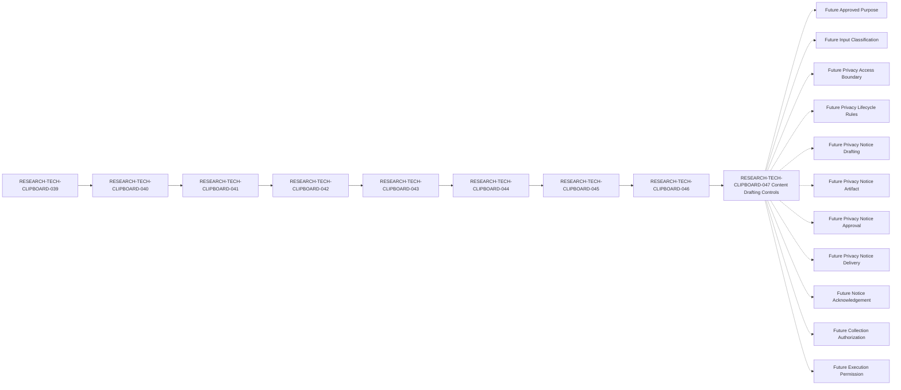

# Clipboard Integration D1 Privacy Notice Artifact Content Drafting Control Specification

## Document Control

| Field | Value |
| --- | --- |
| Document ID | RESEARCH-TECH-CLIPBOARD-047 |
| Title | Clipboard Integration D1 Privacy Notice Artifact Content Drafting Control Specification |
| Status | Draft |
| Parent Document | RESEARCH-TECH-CLIPBOARD-046 |
| Document Type | Privacy Notice Artifact Content Drafting Control Specification |
| Traceability chain | RESEARCH-TECH-CLIPBOARD-039 → RESEARCH-TECH-CLIPBOARD-040 → RESEARCH-TECH-CLIPBOARD-041 → RESEARCH-TECH-CLIPBOARD-042 → RESEARCH-TECH-CLIPBOARD-043 → RESEARCH-TECH-CLIPBOARD-044 → RESEARCH-TECH-CLIPBOARD-045 → RESEARCH-TECH-CLIPBOARD-046 → RESEARCH-TECH-CLIPBOARD-047 |
| Privacy Notice Draft | Not created |
| Privacy Notice Artifact | Not created |
| Privacy Notice Approval | Not provided |
| Request Submitted | No |
| Collection Authorization | Not provided |
| Collection-start Permission | No |
| Execution Permission | Not provided |
| Owner | TBD |
| Last reviewed | Not reviewed |

## 1. Purpose and Drafting Boundary

This document defines controls for a future content-drafting activity relating to a Privacy Notice Artifact. It defines documentary sources, allowed specification-level placeholders, data-minimization boundaries, role separation, validation rules, stop conditions, and prohibited transitions.

This document does not draft, write, generate, simulate, approve, transmit, deliver, or acknowledge an actual Privacy Notice Artifact. It does not identify a recipient, select a Channel or Platform, create a Submission Instruction, submit a Request, collect Human Input, authorize collection, distribute a Worksheet, or permit execution.

The current drafting-gate conclusion is:

`Not ready to draft actual Privacy Notice Artifact`

## 2. Traceability

The required documentary chain is:

`RESEARCH-TECH-CLIPBOARD-039 → RESEARCH-TECH-CLIPBOARD-040 → RESEARCH-TECH-CLIPBOARD-041 → RESEARCH-TECH-CLIPBOARD-042 → RESEARCH-TECH-CLIPBOARD-043 → RESEARCH-TECH-CLIPBOARD-044 → RESEARCH-TECH-CLIPBOARD-045 → RESEARCH-TECH-CLIPBOARD-046 → RESEARCH-TECH-CLIPBOARD-047`

| Traceability item | Expected value | Current value | Conformance | Result |
| --- | --- | --- | --- | --- |
| Current document | RESEARCH-TECH-CLIPBOARD-047 | RESEARCH-TECH-CLIPBOARD-047 | Yes | Yes |
| Status | Draft | Draft | Yes | Yes |
| Parent | RESEARCH-TECH-CLIPBOARD-046 | RESEARCH-TECH-CLIPBOARD-046 | Yes | Yes |
| Prior creation-prerequisite specification | RESEARCH-TECH-CLIPBOARD-046 | RESEARCH-TECH-CLIPBOARD-046 | Yes | Yes |
| Full chain | 039 → 040 → 041 → 042 → 043 → 044 → 045 → 046 → 047 | 039 → 040 → 041 → 042 → 043 → 044 → 045 → 046 → 047 | Yes | Yes |
| Current drafting gate | Not ready to draft actual Privacy Notice Artifact | Not ready to draft actual Privacy Notice Artifact | Yes | Yes |
| Actual draft state | Not created | Not created | Yes | Yes |
| Actual artifact state | Not created | Not created | Yes | Yes |

## 3. Thirteen Content Drafting Controls

Every control has `Drafting readiness=Not ready`. Allowed drafting input means a documentary reference or specification-level placeholder only; it is not an actual Notice value.

| Control ID | Notice content section | Documentary source | Allowed drafting input | Prohibited actual value | Current source state | Required future value | Drafting blocker | Drafting readiness | Reason |
| --- | --- | --- | --- | --- | --- | --- | --- | --- | --- |
| CLIP-D1-DRAFTCTRL-001 | Collection purpose | RESEARCH-TECH-CLIPBOARD-044 to 046 | `<FUTURE_APPROVED_PURPOSE>` reference only | Actual purpose text or value | Documentarily specified | Future approved purpose | Purpose not provided | Not ready | Prevents an invented purpose |
| CLIP-D1-DRAFTCTRL-002 | Role-identification scope | RESEARCH-TECH-CLIPBOARD-043 to 046 | Five fixed role-class reference | Actual scope expansion | Documentarily satisfied | Future scope confirmation | Future confirmation absent | Not ready | Preserves bounded scope |
| CLIP-D1-DRAFTCTRL-003 | Required and Optional input distinction | RESEARCH-TECH-CLIPBOARD-044 to 046 | `<FUTURE_INPUT_CLASSIFICATION>` reference only | Actual required or optional values | Documentarily specified | Future classification | Classification incomplete | Not ready | Prevents uncontrolled input requests |
| CLIP-D1-DRAFTCTRL-004 | Explicit data exclusions | RESEARCH-TECH-CLIPBOARD-043 to 046 | Exclusion rule reference only | Any excluded data or sample | Documentarily satisfied | No actual excluded values | Exclusion confirmation absent | Not ready | Preserves minimization |
| CLIP-D1-DRAFTCTRL-005 | Data-minimization boundary | RESEARCH-TECH-CLIPBOARD-044 to 046 | Minimum-data rule reference | Actual data fields or examples | Documentarily satisfied | Future approved minimum | Boundary confirmation absent | Not ready | Prevents over-collection |
| CLIP-D1-DRAFTCTRL-006 | Access boundary | RESEARCH-TECH-CLIPBOARD-044 to 046 | `<FUTURE_ACCESS_BOUNDARY>` reference only | Access holder or account | Documentarily specified | Future access rule | Access boundary incomplete | Not ready | Prevents access invention |
| CLIP-D1-DRAFTCTRL-007 | Retention boundary | RESEARCH-TECH-CLIPBOARD-044 to 046 | `<FUTURE_RETENTION_RULE>` reference only | Retention period or deletion value | Documentarily specified | Future retention and deletion rule | Retention boundary incomplete | Not ready | Prevents lifecycle invention |
| CLIP-D1-DRAFTCTRL-008 | Correction process | RESEARCH-TECH-CLIPBOARD-044 to 046 | `<FUTURE_CORRECTION_PROCESS>` reference only | Actual process contact or procedure | Documentarily specified | Future correction process | Correction process incomplete | Not ready | Prevents process invention |
| CLIP-D1-DRAFTCTRL-009 | Withdrawal or replacement process | RESEARCH-TECH-CLIPBOARD-044 to 046 | `<FUTURE_WITHDRAWAL_PROCESS>` reference only | Actual withdrawal contact or procedure | Documentarily specified | Future withdrawal process | Withdrawal process incomplete | Not ready | Preserves future control |
| CLIP-D1-DRAFTCTRL-010 | No appointment implication | RESEARCH-TECH-CLIPBOARD-043 to 046 | Separation-rule reference only | Actual appointment language | Documentarily satisfied | No appointment implication | Future confirmation absent | Not ready | Prevents role appointment |
| CLIP-D1-DRAFTCTRL-011 | No request-submission implication | RESEARCH-TECH-CLIPBOARD-044 to 046 | Separation-rule reference only | Submission instruction or request text | Documentarily satisfied | No submission implication | Future confirmation absent | Not ready | Prevents request submission |
| CLIP-D1-DRAFTCTRL-012 | No authorization implication | RESEARCH-TECH-CLIPBOARD-044 to 046 | Separation-rule reference only | Authorization grant or approval | Documentarily satisfied | No authorization implication | Future confirmation absent | Not ready | Prevents collection authorization |
| CLIP-D1-DRAFTCTRL-013 | No execution-permission implication | RESEARCH-TECH-CLIPBOARD-043 to 046 | Separation-rule reference only | Execution instruction or permission | Documentarily satisfied | No execution implication | Future confirmation absent | Not ready | Prevents execution permission |

No actual Notice text is present in these controls.

## 4. Placeholder Control

Placeholders are specification tokens only. They do not constitute a Privacy Notice Draft or Artifact.

| Placeholder ID | Applicable notice section | Allowed placeholder form | Actual value permitted | Replacement authority | Current state | Failure response |
| --- | --- | --- | --- | --- | --- | --- |
| CLIP-D1-PLACEHOLDER-001 | Collection purpose | `<FUTURE_APPROVED_PURPOSE>` | No | Not identified | Unresolved | Stop and reject actual value |
| CLIP-D1-PLACEHOLDER-002 | Required and Optional input distinction | `<FUTURE_INPUT_CLASSIFICATION>` | No | Not identified | Unresolved | Stop and reject actual value |
| CLIP-D1-PLACEHOLDER-003 | Access boundary | `<FUTURE_ACCESS_BOUNDARY>` | No | Not identified | Unresolved | Stop and reject actual value |
| CLIP-D1-PLACEHOLDER-004 | Retention boundary | `<FUTURE_RETENTION_RULE>` | No | Not identified | Unresolved | Stop and reject actual value |
| CLIP-D1-PLACEHOLDER-005 | Correction process | `<FUTURE_CORRECTION_PROCESS>` | No | Not identified | Unresolved | Stop and reject actual value |
| CLIP-D1-PLACEHOLDER-006 | Withdrawal or replacement process | `<FUTURE_WITHDRAWAL_PROCESS>` | No | Not identified | Unresolved | Stop and reject actual value |

### 4.1 Placeholder invariants

- A placeholder must remain visibly a placeholder.
- A placeholder must not contain a person, recipient, account, contact, Channel, Platform, retention period, or operational value.
- A placeholder definition is not an actual value.
- A placeholder table is not a Privacy Notice Draft or Artifact.
- Replacement authority remains `Not identified`.
- Current placeholder state remains `Unresolved`.

## 5. Content Drafting Gate

The drafting gate remains closed. Defining a gate condition does not satisfy the future value or authorize drafting.

| Gate ID | Drafting-gate condition | Current state | Gate effect | Current conclusion |
| --- | --- | --- | --- | --- |
| CLIP-D1-DRAFTGATE-001 | Thirteen content controls are defined | Documentarily satisfied | Necessary but not sufficient | Not ready |
| CLIP-D1-DRAFTGATE-002 | Future approved purpose is provided | Not provided | Blocks drafting | Not ready |
| CLIP-D1-DRAFTGATE-003 | Required and Optional classification is complete | Not completed | Blocks drafting | Not ready |
| CLIP-D1-DRAFTGATE-004 | Access boundary is complete | Not completed | Blocks drafting | Not ready |
| CLIP-D1-DRAFTGATE-005 | Retention and deletion boundary is complete | Not completed | Blocks drafting | Not ready |
| CLIP-D1-DRAFTGATE-006 | Correction process is complete | Not completed | Blocks drafting | Not ready |
| CLIP-D1-DRAFTGATE-007 | Withdrawal or replacement process is complete | Not completed | Blocks drafting | Not ready |
| CLIP-D1-DRAFTGATE-008 | Privacy approval authority is identified | Not identified | Blocks approval | Not ready |
| CLIP-D1-DRAFTGATE-009 | Notice Recipient remains unresolved | Not identified | Preserves boundary | Not ready |
| CLIP-D1-DRAFTGATE-010 | Delivery Channel remains unresolved | Not selected | Preserves boundary | Not ready |
| CLIP-D1-DRAFTGATE-011 | Actual Platform remains unresolved | Not identified | Preserves boundary | Not ready |
| CLIP-D1-DRAFTGATE-012 | Collection Authorization remains absent | Not provided | Blocks collection | Not ready |
| CLIP-D1-DRAFTGATE-013 | Collection-start Permission remains No | No | Blocks collection | Not ready |
| CLIP-D1-DRAFTGATE-014 | Execution Permission remains absent | Not provided | Blocks execution | Not ready |
| CLIP-D1-DRAFTGATE-015 | Drafting Authority is identified by a future governance process | Not identified | Blocks drafting | Not ready |
| CLIP-D1-DRAFTGATE-016 | Privacy Notice Artifact remains not created | Not created | Blocks artifact-dependent stages | Not ready |

Current gate conclusion:

`Not ready to draft actual Privacy Notice Artifact`

## 6. Fixed Roles

| Role ID | Functional Role | Actual Holder | Appointment | Acceptance | Authorization implication |
| --- | --- | --- | --- | --- | --- |
| CLIP-D1-ROLE-001 | Request Preparer | Not identified | Not performed | Not collected | None |
| CLIP-D1-ROLE-002 | Technical Scope Reviewer | Not identified | Not performed | Not collected | None |
| CLIP-D1-ROLE-003 | Decision Authority | Not identified | Not performed | Not collected | None |
| CLIP-D1-ROLE-004 | Execution Operator | Not identified | Not performed | Not collected | None |
| CLIP-D1-ROLE-005 | Observation and Evidence Custodian | Not identified | Not performed | Not collected | None |

This document does not assign a Notice drafter, reviewer, approver, recipient, or any actual role holder.

## 7. Input References

The twelve input classes from RESEARCH-TECH-CLIPBOARD-043 remain documentary references only.

| Input ID | Required input class | Actual value | Drafting use | Human Input | Authorization implication |
| --- | --- | --- | --- | --- | --- |
| CLIP-D1-ROLEINPUT-001 | Role ID | Not provided | Reference only | Not collected | None |
| CLIP-D1-ROLEINPUT-002 | Functional Role | Not provided | Reference only | Not collected | None |
| CLIP-D1-ROLEINPUT-003 | Governance identity reference requirement | Not provided | Reference only | Not collected | None |
| CLIP-D1-ROLEINPUT-004 | Eligibility requirement | Not provided | Reference only | Not collected | None |
| CLIP-D1-ROLEINPUT-005 | Conflict-disclosure requirement | Not provided | Reference only | Not collected | None |
| CLIP-D1-ROLEINPUT-006 | Separation-of-duty requirement | Not provided | Reference only | Not collected | None |
| CLIP-D1-ROLEINPUT-007 | Appointment prerequisite | Not provided | Reference only | Not collected | None |
| CLIP-D1-ROLEINPUT-008 | Acceptance prerequisite | Not provided | Reference only | Not collected | None |
| CLIP-D1-ROLEINPUT-009 | Decision-authority prerequisite | Not provided | Reference only | Not collected | None |
| CLIP-D1-ROLEINPUT-010 | Privacy and minimization requirement | Not provided | Reference only | Not collected | None |
| CLIP-D1-ROLEINPUT-011 | Validation requirement | Not provided | Reference only | Not collected | None |
| CLIP-D1-ROLEINPUT-012 | Stop-condition requirement | Not provided | Reference only | Not collected | None |

## 8. Fifteen Explicit Exclusions

Excluded data must not be converted into a placeholder, example, test data, or simulated content.

| Exclusion ID | Excluded category | Required state | Failure response |
| --- | --- | --- | --- |
| CLIP-D1-ROLEEX-001 | Actual name | Not collected | Stop and reject |
| CLIP-D1-ROLEEX-002 | Email address | Not collected | Stop and reject |
| CLIP-D1-ROLEEX-003 | Department | Not collected | Stop and reject |
| CLIP-D1-ROLEEX-004 | Job title | Not collected | Stop and reject |
| CLIP-D1-ROLEEX-005 | Account | Not collected | Stop and reject |
| CLIP-D1-ROLEEX-006 | SID | Not collected | Stop and reject |
| CLIP-D1-ROLEEX-007 | Computer name | Not collected | Stop and reject |
| CLIP-D1-ROLEEX-008 | Credential | Not collected | Stop immediately |
| CLIP-D1-ROLEEX-009 | Token | Not collected | Stop immediately |
| CLIP-D1-ROLEEX-010 | Private key | Not collected | Stop immediately |
| CLIP-D1-ROLEEX-011 | Clipboard content | Not collected | Stop immediately |
| CLIP-D1-ROLEEX-012 | Screenshot content | Not collected | Stop immediately |
| CLIP-D1-ROLEEX-013 | Desktop content | Not collected | Stop immediately |
| CLIP-D1-ROLEEX-014 | Operational Observation | Not created | Stop and do not persist |
| CLIP-D1-ROLEEX-015 | Persistent Evidence | Not created | Stop and do not persist |

## 9. Separation Rules

Each separation rule is documentarily satisfied and has no automatic transition.

| Separation ID | Separation rule | Current state | Automatic transition |
| --- | --- | --- | --- |
| CLIP-D1-DRAFTSEP-001 | Content Drafting Control Specification ≠ Privacy Notice Artifact | Documentarily satisfied | Prohibited |
| CLIP-D1-DRAFTSEP-002 | Drafting Readiness ≠ Content Drafting | Documentarily satisfied | Prohibited |
| CLIP-D1-DRAFTSEP-003 | Placeholder Definition ≠ Actual Value | Documentarily satisfied | Prohibited |
| CLIP-D1-DRAFTSEP-004 | Content Drafting ≠ Artifact Creation | Documentarily satisfied | Prohibited |
| CLIP-D1-DRAFTSEP-005 | Artifact Creation ≠ Artifact Approval | Documentarily satisfied | Prohibited |
| CLIP-D1-DRAFTSEP-006 | Artifact Approval ≠ Notice Delivery | Documentarily satisfied | Prohibited |
| CLIP-D1-DRAFTSEP-007 | Notice Delivery ≠ Notice Acknowledgement | Documentarily satisfied | Prohibited |
| CLIP-D1-DRAFTSEP-008 | Notice Acknowledgement ≠ Human Input Collection | Documentarily satisfied | Prohibited |
| CLIP-D1-DRAFTSEP-009 | Notice Acknowledgement ≠ Role Acceptance | Documentarily satisfied | Prohibited |
| CLIP-D1-DRAFTSEP-010 | Privacy Notice Artifact ≠ Submission Instruction | Documentarily satisfied | Prohibited |
| CLIP-D1-DRAFTSEP-011 | Privacy Notice Artifact ≠ Request Submission | Documentarily satisfied | Prohibited |
| CLIP-D1-DRAFTSEP-012 | Privacy Notice Artifact ≠ Collection Authorization | Documentarily satisfied | Prohibited |
| CLIP-D1-DRAFTSEP-013 | Human Governance Input ≠ Execution Permission | Documentarily satisfied | Prohibited |

## 10. Validation Rules

Every current evaluation is `Not evaluated`.

| Validation ID | Validation rule | Current evaluation | Failure response |
| --- | --- | --- | --- |
| CLIP-D1-DRAFTVAL-001 | All thirteen Control IDs are present and unique | Not evaluated | Stop and reject |
| CLIP-D1-DRAFTVAL-002 | Every Documentary source is traceable | Not evaluated | Stop and defer |
| CLIP-D1-DRAFTVAL-003 | Every Drafting readiness value is Not ready | Not evaluated | Stop and reject |
| CLIP-D1-DRAFTVAL-004 | No actual Notice wording is present | Not evaluated | Stop and remove |
| CLIP-D1-DRAFTVAL-005 | No actual purpose is present | Not evaluated | Stop and remove |
| CLIP-D1-DRAFTVAL-006 | No retention period is present | Not evaluated | Stop and remove |
| CLIP-D1-DRAFTVAL-007 | No access holder is present | Not evaluated | Stop and remove |
| CLIP-D1-DRAFTVAL-008 | No recipient or contact data is present | Not evaluated | Stop and reject |
| CLIP-D1-DRAFTVAL-009 | No Channel or Platform is present | Not evaluated | Stop and reject |
| CLIP-D1-DRAFTVAL-010 | Placeholder format is controlled | Not evaluated | Stop and reject |
| CLIP-D1-DRAFTVAL-011 | Placeholder contains no actual value | Not evaluated | Stop and remove |
| CLIP-D1-DRAFTVAL-012 | All fifteen exclusions remain excluded | Not evaluated | Stop and reject |
| CLIP-D1-DRAFTVAL-013 | Fixed role count remains five | Not evaluated | Stop and reject |
| CLIP-D1-DRAFTVAL-014 | Drafting readiness does not imply Artifact Creation | Not evaluated | Stop and preserve separation |
| CLIP-D1-DRAFTVAL-015 | Completion does not imply Approval, Delivery, Authorization, or Execution | Not evaluated | Stop and preserve separation |

## 11. Stop Conditions

| Stop ID | Stop condition | Current trigger state | Required response |
| --- | --- | --- | --- |
| CLIP-D1-DRAFTSTOP-001 | The document is treated as an actual drafting instruction | Not evaluated | Stop |
| CLIP-D1-DRAFTSTOP-002 | Actual Privacy Notice wording is added | Not evaluated | Stop and remove |
| CLIP-D1-DRAFTSTOP-003 | Actual purpose or lifecycle value is added | Not evaluated | Stop and remove |
| CLIP-D1-DRAFTSTOP-004 | A person, recipient, or contact value is added | Not evaluated | Stop and reject |
| CLIP-D1-DRAFTSTOP-005 | A Channel or Platform is selected | Not evaluated | Stop and reject |
| CLIP-D1-DRAFTSTOP-006 | A placeholder contains an actual value | Not evaluated | Stop and reject |
| CLIP-D1-DRAFTSTOP-007 | Excluded data is added | Not evaluated | Stop and reject |
| CLIP-D1-DRAFTSTOP-008 | Clipboard, Screenshot, or Desktop content is added | Not evaluated | Stop immediately |
| CLIP-D1-DRAFTSTOP-009 | Operational Observation or Evidence is added | Not evaluated | Stop and do not persist |
| CLIP-D1-DRAFTSTOP-010 | A Notice drafter or approver is assigned | Not evaluated | Stop and reject |
| CLIP-D1-DRAFTSTOP-011 | Artifact Creation is inferred | Not evaluated | Stop and preserve separation |
| CLIP-D1-DRAFTSTOP-012 | Artifact Approval is inferred | Not evaluated | Stop and preserve separation |
| CLIP-D1-DRAFTSTOP-013 | Request Submission is inferred | Not evaluated | Stop and preserve separation |
| CLIP-D1-DRAFTSTOP-014 | Collection Authorization is inferred | Not evaluated | Stop and preserve separation |
| CLIP-D1-DRAFTSTOP-015 | Collection-start Permission or Execution Permission is absent | Not evaluated | Stop; never collect or execute |

## 12. Prohibited Transitions

The following sixteen transitions are prohibited. Every rule is preserved, no transition has been performed, and no result is granted by this document.

| Transition ID | Complete transition meaning | Rule preserved | Transition performed | Result |
| --- | --- | --- | --- | --- |
| CLIP-D1-DRAFTTRANS-001 | Content Drafting Control Specification → Actual Privacy Notice Draft | Yes | No | No |
| CLIP-D1-DRAFTTRANS-002 | Drafting Readiness → Content Drafting | Yes | No | No |
| CLIP-D1-DRAFTTRANS-003 | Placeholder Definition → Actual Value Supplied | Yes | No | No |
| CLIP-D1-DRAFTTRANS-004 | Content Drafting → Privacy Notice Artifact Created | Yes | No | No |
| CLIP-D1-DRAFTTRANS-005 | Privacy Notice Artifact Created → Artifact Approved | Yes | No | No |
| CLIP-D1-DRAFTTRANS-006 | Artifact Approved → Notice Recipient Identified | Yes | No | No |
| CLIP-D1-DRAFTTRANS-007 | Artifact Approved → Delivery Channel Selected | Yes | No | No |
| CLIP-D1-DRAFTTRANS-008 | Artifact Approved → Platform Authorized | Yes | No | No |
| CLIP-D1-DRAFTTRANS-009 | Artifact Approved → Notice Delivered | Yes | No | No |
| CLIP-D1-DRAFTTRANS-010 | Notice Delivered → Notice Acknowledged | Yes | No | No |
| CLIP-D1-DRAFTTRANS-011 | Notice Acknowledged → Human Input Collected | Yes | No | No |
| CLIP-D1-DRAFTTRANS-012 | Notice Acknowledged → Role Accepted | Yes | No | No |
| CLIP-D1-DRAFTTRANS-013 | Privacy Notice Artifact → Submission Instruction | Yes | No | No |
| CLIP-D1-DRAFTTRANS-014 | Privacy Notice Artifact → Request Submitted | Yes | No | No |
| CLIP-D1-DRAFTTRANS-015 | Privacy Notice Artifact → Collection Authorized | Yes | No | No |
| CLIP-D1-DRAFTTRANS-016 | Human Input → Execution Permission | Yes | No | No |

## 13. Unresolved-value Ledger

The following values remain unresolved future values. Their absence keeps the drafting gate closed.

| Unresolved value | Current state | Required source | Required stage | Impact |
| --- | --- | --- | --- | --- |
| Approved purpose | Not provided | Future approved purpose process | Before drafting | Blocks drafting |
| Drafting Authority | Not identified | Future governance process | Before drafting | Blocks drafting |
| Approval Authority | Not identified | Future governance process | Before approval | Blocks approval |
| Input classification | Not completed | Future input contract | Before drafting | Blocks drafting |
| Access boundary | Not completed | Future privacy control | Before drafting | Blocks drafting |
| Retention rule | Not completed | Future lifecycle control | Before drafting | Blocks drafting |
| Correction process | Not completed | Future privacy control | Before drafting | Blocks drafting |
| Withdrawal process | Not completed | Future privacy control | Before drafting | Blocks drafting |
| Drafting authority | Not identified | Future governance process | Before drafting | Blocks drafting |
| Privacy Notice Draft | Not created | Future controlled drafting process | Before artifact creation | Blocks artifact creation |
| Privacy Notice Artifact | Not created | Future artifact process | Before approval | Blocks approval |
| Privacy Notice Approval | Not provided | Future approval process | Before delivery | Blocks delivery |
| Notice Recipient | Not identified | Future recipient process | Before delivery | Blocks delivery |
| Delivery Channel | Not selected | Future channel process | Before delivery | Blocks delivery |
| Actual Platform | Not identified | Future platform assessment | Before delivery | Blocks delivery |
| Collection Authorization | Not provided | Future authorization process | Before collection | Blocks collection |
| Execution Permission | Not provided | Future explicit permission | Before execution | Blocks execution |

No actual wording, purpose, retention period, access holder, recipient, contact, person, account, machine identifier, credential, token, private key, Clipboard content, Screenshot content, Desktop content, observation, or evidence is recorded here.

## 14. Submission, Authorization, and Execution Separation

| Stage | Current state | Required prior artifact | Automatic transition prohibited | Effect |
| --- | --- | --- | --- | --- |
| Content drafting control specification | Draft | RESEARCH-TECH-CLIPBOARD-047 | Yes | Defines controls only |
| Privacy Notice Draft | Not created | All drafting controls and future values | Yes | No draft exists |
| Privacy Notice Artifact | Not created | Future controlled drafting process | Yes | No artifact exists |
| Privacy Notice Approval | Not provided | Future approval process | Yes | No approval exists |
| Notice Recipient Identification | Not identified | Future recipient process | Yes | No recipient exists |
| Delivery Channel Selection | Not selected | Future channel process | Yes | No channel exists |
| Platform Assessment | Not identified | Future platform process | Yes | No platform exists |
| Notice Delivery | Not performed | Future approved artifact and delivery record | Yes | No delivery occurs |
| Human Input Collection | Not collected | Future authorization and start permission | Yes | No input is collected |
| Request Submission | No | Future Submission Instruction | Yes | No request is submitted |
| Collection Authorization | Not provided | Future authorization artifact | Yes | No collection is authorized |
| Collection-start Permission | No | Future explicit start permission | Yes | No collection begins |
| Execution Permission | Not provided | Future explicit permission | Yes | No execution begins |

## 15. Completeness Matrix

The matrix measures documentary completeness only. Every result value is restricted to `Yes`, `Partially`, or `No`.

| Coverage area | Expected coverage | Current documentary coverage | Result |
| --- | --- | --- | --- |
| Traceability | Nine linked document IDs | 039 → 040 → 041 → 042 → 043 → 044 → 045 → 046 → 047 | Yes |
| Content drafting controls | 13 controls | All 13 present; all Not ready | Yes |
| Placeholder controls | Six specification-level placeholders | All six controlled; actual values prohibited | Yes |
| Content drafting gate | 16 gate conditions and closed conclusion | All 16 conditions defined; gate remains closed | Yes |
| Fixed roles | 5 role classes | All five retained; holders unresolved | Yes |
| Input references | 12 documentary references | All 12 present without actual values | Yes |
| Explicit exclusions | 15 categories | All 15 retained | Yes |
| Separation rules | 13 separation rules | All 13 defined | Yes |
| Validation rules | 15 rules | All 15 defined; not evaluated | Yes |
| Stop conditions | 15 conditions | All 15 defined; no operation performed | Yes |
| Prohibited transitions | 16 transitions | All 16 preserved; none performed | Yes |
| Unresolved-value ledger | 15 future values | All listed without actual values | Yes |
| Submission and authorization separation | All later stages | All separated | Yes |
| Safety state | Draft, artifact, approval, delivery, input, authorization, and permission absent | All safe states retained | Yes |
| Overall drafting-control specification | Complete documentary specification | Complete as Draft; gate closed | Yes |

## 16. Mermaid Traceability

The solid chain represents documentary traceability. The eleven dashed paths represent future stages requiring separate human governance input and explicit authorization. No dashed stage is performed or authorized by this document.

## 17. Required Safety State

| Safety item | Required current state |
| --- | --- |
| Content Drafting Gate | Not ready to draft actual Privacy Notice Artifact |
| Drafting Authority | Not identified |
| Approval Authority | Not identified |
| Privacy Notice Draft | Not created |
| Privacy Notice Artifact | Not created |
| Privacy Notice Approval | Not provided |
| Privacy Notice Delivery | Not performed |
| Notice Acknowledgement | Not collected |
| Notice Recipient | Not identified |
| Delivery Channel | Not selected |
| Actual Platform | Not identified |
| Request Submitted | No |
| Submission Instruction | Not created |
| Actual Role Holders | Not identified |
| Role Appointment | Not performed |
| Role Acceptance | Not collected |
| Collection Authorization | Not provided |
| Collection-start Permission | No |
| Worksheet Distribution | Not performed |
| Human Governance Input | Not collected |
| Personal Data | Not collected |
| D1 Inspection | Not authorized |
| Execution Permission | Not provided |
| Operational Observation | Not created |
| Persistent Evidence | Not created |

## 18. Completion Boundary and Handoff

This specification is complete as a Draft when:

- The nine-document traceability chain remains intact.
- All thirteen content drafting controls are present and every Drafting readiness value is `Not ready`.
- All six placeholders remain specification-level tokens with `Actual value permitted=No`.
- The drafting-gate conclusion remains `Not ready to draft actual Privacy Notice Artifact`.
- The five fixed roles remain unchanged and unassigned.
- The twelve input references remain documentary only.
- All fifteen exclusions remain prohibited.
- All thirteen separation rules remain `Documentarily satisfied` and `Prohibited`.
- All sixteen prohibited transitions remain `Rule preserved=Yes`, `Transition performed=No`, and `Result=No`.
- Privacy Notice Draft and Artifact remain `Not created`.
- Privacy Notice Approval remains `Not provided`.
- Notice Recipient remains `Not identified`.
- Delivery Channel remains `Not selected`.
- Actual Platform remains `Not identified`.
- Request Submitted remains `No`.
- Submission Instruction remains `Not created`.
- Collection Authorization remains `Not provided`.
- Collection-start Permission remains `No`.
- Human Governance Input and Personal Data remain not collected.
- D1 Inspection remains not authorized.
- Execution Permission remains not provided.

The only permitted next-document handoffs are:

- `Ready to prepare D1 Privacy Notice Artifact controlled drafting closure review specification`
- `Conditionally ready to prepare D1 Privacy Notice Artifact controlled drafting closure review specification`
- `Not ready to prepare D1 Privacy Notice Artifact controlled drafting closure review specification`

No handoff may draft, create, approve, send, deliver, or acknowledge a Privacy Notice, identify a recipient, select a Channel or Platform, create a Submission Instruction, submit a Request, collect Human Input, authorize collection, grant start permission, distribute a Worksheet, perform D1 Inspection, or preserve Observation or Evidence.

## 19. Prohibited Actions

This specification must not be used to:

- Draft, write, generate, simulate, approve, transmit, deliver, or acknowledge an actual Privacy Notice.
- Identify or assign a drafter, approver, recipient, or any role holder.
- Create a Submission Instruction or submit a Request.
- Select a Channel or Platform.
- Distribute a Worksheet or collect Human Input.
- Collect Personal Data, Attestation, or Notice Acknowledgement.
- Read or collect Clipboard, Screenshot, or Desktop content.
- Create Operational Observation or Persistent Evidence.
- Perform D1 Inspection or grant Execution Permission.
- Begin coding, Build, Test, or Run activities.
- Modify any existing document.

## 20. Mechanical Final Status

`D1 Privacy Notice Artifact content drafting controls complete`

- Document: RESEARCH-TECH-CLIPBOARD-047
- Status: Draft
- Parent: RESEARCH-TECH-CLIPBOARD-046
- Content drafting controls: 13
- Drafting readiness: Not ready, 13/13
- Placeholder controls: 6
- Content Drafting Gate rows: 16
- Drafting Authority: Not identified
- Approval Authority: Not identified
- Fixed roles: 5
- Input references: 12
- Explicit exclusions: 15
- Separation rules: 13
- Validation rules: 15
- Stop conditions: 15
- Prohibited transitions: 16
- Rule preserved: Yes, 16/16
- Transition performed: No, 16/16
- Result: No, 16/16
- Content Drafting Gate: Not ready to draft actual Privacy Notice Artifact
- Mermaid Future dashed links: 11
- Privacy Notice Draft: Not created
- Privacy Notice Artifact: Not created
- Privacy Notice Approval: Not provided
- Request Submitted: No
- Submission Instruction: Not created
- Collection Authorization: Not provided
- Collection-start Permission: No
- Execution Permission: Not provided

No actual Privacy Notice drafting, artifact creation, human-governance, collection, inspection, or execution activity is authorized by this document.
